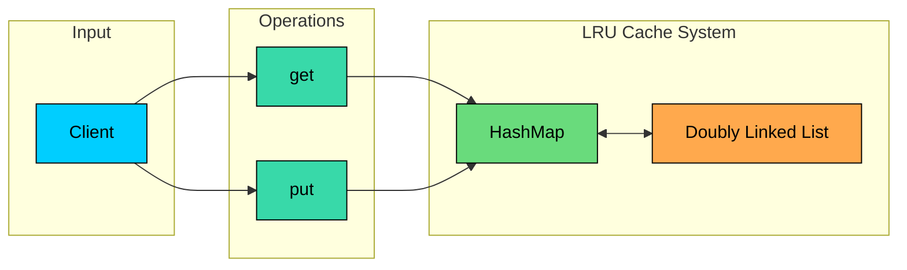
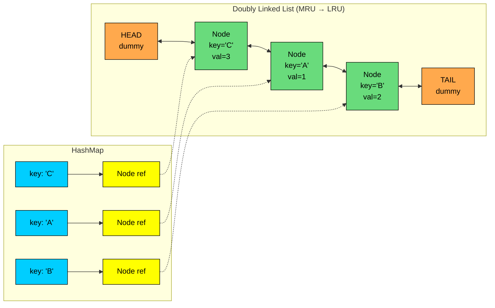
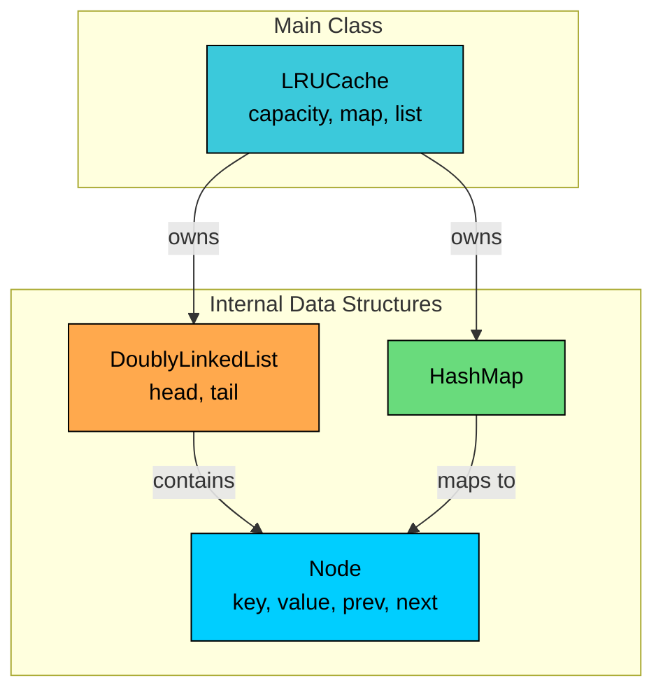
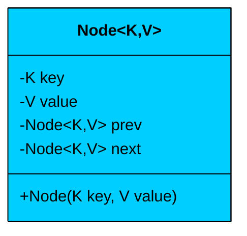
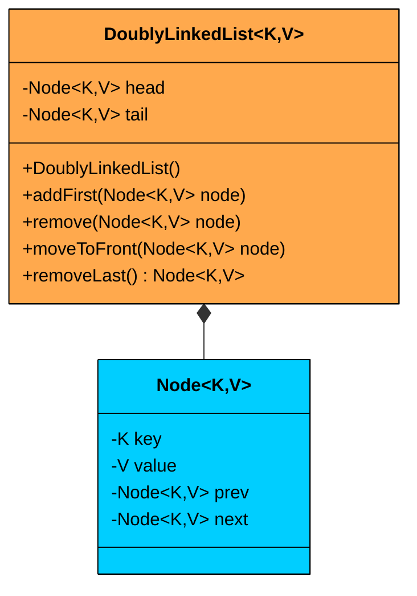
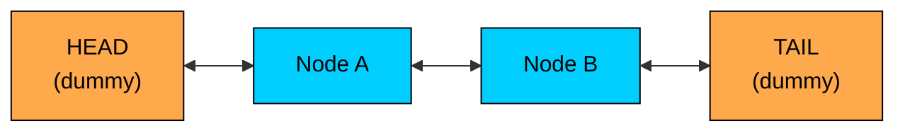
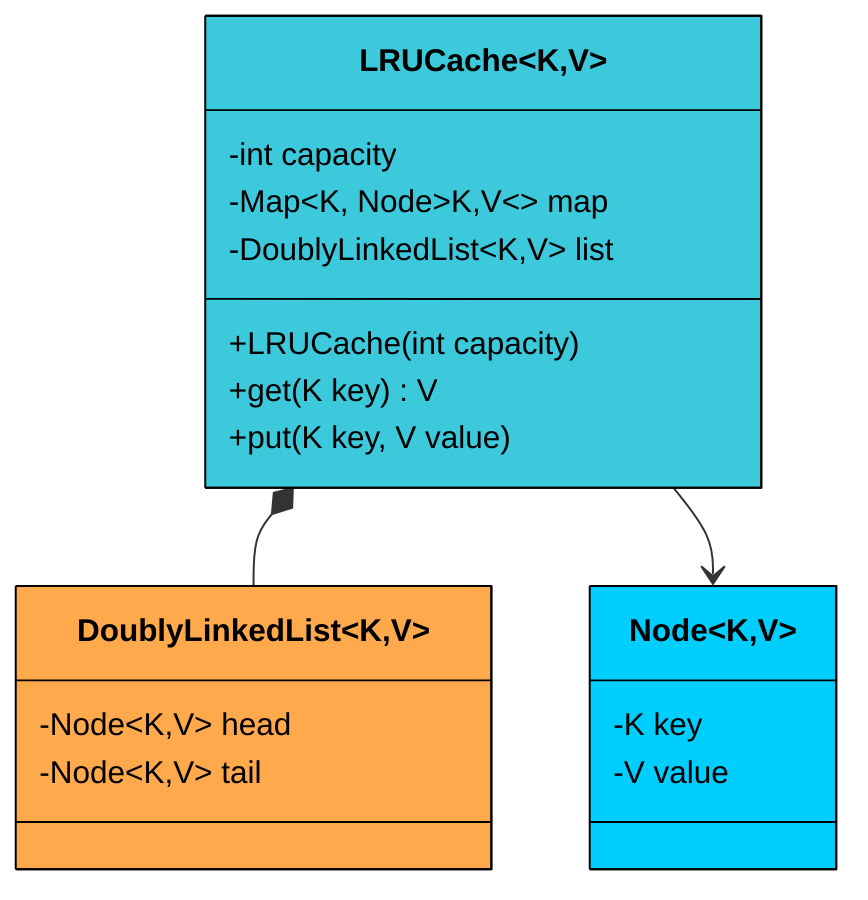
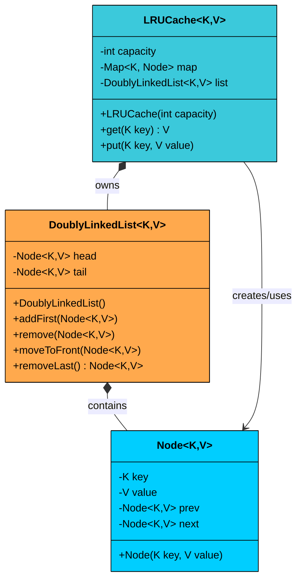
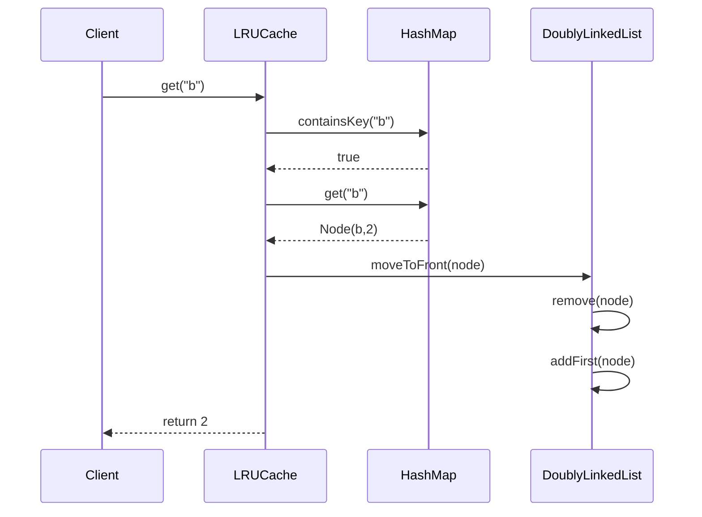
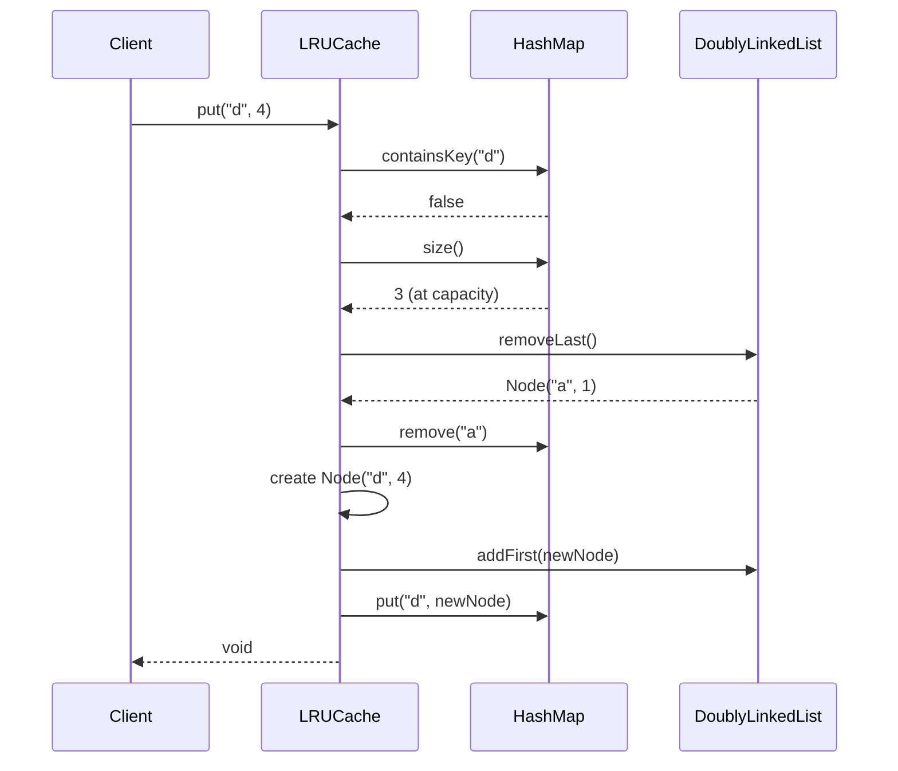

import React from 'react';
import CodeBlock from '../../../../components/ui/CodeBlock';
import Callout from '../../../../components/ui/Callout';

<div className="article-header">
  <div className="breadcrumb">
    <a href="/">Curated Notes</a>
    <span className="breadcrumb-separator">›</span>
    <span className="breadcrumb-current">Design LRU Cache</span>
  </div>
  <h1>Design LRU Cache</h1>
  <p style={{ color: 'var(--text-muted)', fontSize: '1.1rem', marginBottom: '16px', lineHeight: '1.6' }}>
    Master the essentials of Design LRU Cache in this curated guide.
  </p>
  <div className="meta-info">
    <span className="meta-item">
      <svg width="14" height="14" viewBox="0 0 24 24" fill="none" stroke="currentColor" strokeWidth="2"><circle cx="12" cy="12" r="10"/><polyline points="12 6 12 12 16 14"/></svg>
      10 min read
    </span>
    <span className="difficulty-badge difficulty-badge--intermediate">Intermediate</span>
  </div>
</div>

<section className="content-section">


&gt; **QUESTION**
&gt;
&gt; #### What is a LRU Cache?
&gt;
&gt; **LRU **stands for **Least Recently Used**. LRU Cache is a type of cache replacement policy that **evicts the least recently accessed item** when the cache reaches its capacity.
&gt;
&gt; 
&gt; 
&gt; 
&gt;
&gt; In performance-critical systems (like web servers, databases, or OS memory management), caching helps avoid expensive computations or repeated data fetching. But cache memory is limited so when it's full, we need a policy to decide **which item to remove**.
&gt;
&gt; LRU chooses the **least recently accessed** item, based on the assumption that:
&gt;
&gt; &gt; “If you haven’t used something for a while, you probably won’t need it soon.”
&gt;
&gt; The LRU strategy is both intuitive and effective. It reflects real-world usage patterns. We tend to access the same small subset of items frequently, and rarely go back to older, untouched entries.
&gt;
&gt; This makes LRU a popular default caching policy in many systems where **speed and memory efficiency** are critical.


#### Example

Suppose we have an LRU cache with `capacity = 3`, and we perform the following operations:


```shell
put(1, A)     // cache: {1:A}
put(2, B)     // cache: {1:A, 2:B}
put(3, C)     // cache: {1:A, 2:B, 3:C}
get(1)        // access key 1 → makes it most recently used
put(4, D)     // key 2 is least recently used → evict it
```


Final cache state: `{3:C, 1:A, 4:D}` (in order of usage from least to most recent)

In this chapter, we will explore the **low level design of a LRU cache.**

Lets start by clarifying the requirements:

---

## 1. Clarifying Requirements

Before starting the design, it's important to ask thoughtful questions to uncover hidden assumptions, clarify ambiguities, and define the system's scope more precisely.

Here is an example of how a discussion between the candidate and the interviewer might unfold:


&gt; **DISCUSSION**
&gt;
&gt; **Candidate:** "Should the LRU Cache support generic key-value pairs, or should we restrict it to specific data types?"
&gt;
&gt; **Interviewer:** "The cache should be generic and support any type of key-value pair, as long as keys are hashable."
&gt;
&gt; **Candidate:** "Should the cache operations be limited to `get` and `put`, or do we also need to support deletion?"
&gt;
&gt; **Interviewer:** "For now, we can limit operations to `get` and `put`."
&gt;
&gt; **Candidate:** "What should the `get` operation return if the key is not found in the cache?"
&gt;
&gt; **Interviewer:** "You can return either `null` or a sentinel value like `-1`."
&gt;
&gt; **Candidate:** "How should we handle a `put` operation on an existing key? Should it be treated as a fresh access and move the key to the most recently used position?"
&gt;
&gt; **Interviewer:** "Yes, an update through `put` should count as usage. The key should be moved to the front as the most recently used."
&gt;
&gt; **Candidate:** "Will the cache be used in a multi-threaded environment? Do we need to ensure thread safety?"
&gt;
&gt; **Interviewer:** "Good question. Assume this cache will be used in a multi-threaded server environment. It must be thread-safe."
&gt;
&gt; **Candidate:** "What are the performance expectations for the `get` and `put` operations?"
&gt;
&gt; **Interviewer:** "Both `get` and `put` operations must run in `O(1)` time on average."


After gathering the details, we can summarize the key system requirements.

### 1.1 Functional Requirements

- Support `get(key)` operation: returns the value if the key exists, otherwise returns `null` or `-1`
- Support `put(key, value)` operation: inserts a new key-value pair or updates the value of an existing key
- If the cache exceeds its capacity, it should automatically **evict the least recently used item**.
- Both `get` and `put` operations should update the **recency** of the accessed or inserted item.
- Keys and values should be **generic** (e.g., `<K, V>`), provided the keys are hashable.

### 1.2 Non-Functional Requirements

1. **Time Complexity:** Both `get` and `put` operations must run in O(1) time on average.
2. **Thread Safety:** The implementation must be thread-safe for use in concurrent environments.
3. **Modularity:** The design should follow object-oriented principles with clean separation of responsibilities.
4. **Memory Efficiency:** The internal data structures should be optimized for speed and space within the defined constraints.

Now that we understand what we're building, let's identify the building blocks of our system.

---

## 2. Identifying Core Entities

Unlike systems that model real-world concepts (such as users, products, or bookings), the design of an LRU Cache is centered around choosing the right data structures and internal abstractions to achieve the required functionality and performance.

The core challenge here is twofold:

1. We need **fast key-based lookup** for cache reads and updates
2. We need **fast ordering** to track item usage and enforce eviction based on recency

Let's walk through our requirements and identify what needs to exist in our system.

#### The Need for Fast Lookup

&gt; "Both 
&gt;
&gt; `get`
&gt;
&gt;  and 
&gt;
&gt; `put`
&gt;
&gt;  operations must run in O(1) time"

To efficiently retrieve values by key, we need a data structure that supports constant-time key access.

The natural choice is a **HashMap**. It provides O(1) average-case lookup and update. When someone calls `get("user_123")`, we need to find that entry immediately, not scan through a list.

But here's the problem: a HashMap doesn't maintain any order. It can't tell us which entry was accessed least recently. If we only used a HashMap, we'd have to scan all entries to find the LRU item during eviction, making that operation O(n).

#### The Need for Fast Ordering

&gt; "If the cache exceeds its capacity, automatically evict the least recently used item"

The second challenge is maintaining the recency order of cache entries so we can:

- Move a recently accessed item to the front (marking it as Most Recently Used, or MRU)
- Remove the least recently used item from the back when the cache exceeds capacity
- Insert new items at the front (they're considered most recently used)
- Perform all of these operations in O(1) time

An array won't work because inserting or moving elements from the middle involves shifting, which is O(n). A regular linked list won't work either because finding a specific node to move requires O(n) traversal.

The key insight is using a **Doubly Linked List**. Each node maintains references to both its `prev` and `next` nodes, allowing us to:

- Remove a node from the list in O(1) if we have a direct reference to it
- Move a node to the head in O(1)
- Evict the least recently used node from the tail in O(1)

But how do we get a direct reference to a node without traversing the list? That's where the HashMap comes back into play.

#### **Combining **Both Structures





The magic of achieving O(1) for both `get` and `put` lies in combining a HashMap and a Doubly Linked List:

- **HashMap:** Provides O(1) lookup. Instead of storing the value directly, it stores a **pointer/reference to the node** in our Doubly Linked List.
- **Doubly Linked List:** Maintains the usage order. The head of the list is always the Most Recently Used (MRU) item, and the tail is the Least Recently Used (LRU) item.

This combination gives us the best of both worlds:

- To **find** an item, we use the HashMap to get a direct pointer to its node in O(1)
- To **reorder** the item (make it the MRU), we use that pointer to move the node to the head in O(1)
- To **evict** an item, we remove the node from the tail in O(1)





#### Additional Core Entities

Beyond the HashMap and Doubly Linked List, we need two more classes to encapsulate and organize our logic:

- `Node`**:** A simple internal class that represents an individual entry in the cache and a node in the linked list. It stores the key-value pair and maintains pointers to adjacent nodes.
- `LRUCache`**:** The main class that exposes the public cache API and coordinates all operations. It owns both the HashMap and the DoublyLinkedList.

**Why store the key in the Node?**

When we evict from the tail, we need to remove the entry from the HashMap too. The HashMap needs the key to remove an entry, so each Node must remember its key.

#### Entity Overview

Here's how these entities relate to each other:





| Entity | Type | Responsibility |
|--------|------|----------------|
| `Node<K, V>` | Data Class | Stores key-value pair and maintains linked list pointers |
| `DoublyLinkedList<K, V>` | Utility Class | Manages MRU to LRU ordering with O(1) operations |
| `HashMap<K, Node>` | Standard Library | Provides O(1) key-to-node lookup |
| `LRUCache<K, V>` | Main Class | Coordinates all operations and enforces eviction policy |


These entities form the core abstractions of our LRU Cache. They enable the system to maintain a fixed-size cache, support constant-time access and updates, and evict the least recently used entry when necessary.

With our entities identified, let's define their attributes, behaviors, and relationships.

---

## 3. Designing Classes and Relationships

Now that we know what entities we need, let's flesh out their details. For each class, we'll define what data it holds (attributes) and what it can do (methods). Then we'll look at how these classes connect to each other.

### 3.1 Class Definitions

We'll work bottom-up: simple types first, then the classes with real logic. This order makes sense because complex classes depend on simpler ones.

#### `Node<K, V>`

The Node class represents an individual entry in the cache and serves as a node in the doubly linked list.





| Attribute | Type | Description | Mutable? |
|-----------|------|-------------|----------|
| `key` | K | The cache key (needed for HashMap removal during eviction) | No |
| `value` | V | The cached value | Yes |
| `prev` | Node&lt;K, V&gt; | Reference to previous node in the list | Yes |
| `next` | Node&lt;K, V&gt; | Reference to next node in the list | Yes |


| Method | Description |
|--------|-------------|
| `Node(key, value)` | Constructor that initializes key and value |


&gt; **Design Decision**
&gt;
&gt; #### Why store the key in the Node? 
&gt;
&gt; When we evict the LRU item from the tail, we need to remove it from the HashMap. The HashMap's `remove()` method requires the key. Without storing the key in the Node, we'd need to iterate through the HashMap to find which key maps to this Node, making eviction O(n).


The Node class is intentionally simple. It's a data container with minimal behavior. The prev and next pointers are mutable because the node's position in the list changes as items are accessed.

#### `DoublyLinkedList<K, V>`

A utility class that manages the MRU (Most Recently Used) to LRU (Least Recently Used) ordering of cache entries.





| Attribute | Type | Description |
|-----------|------|-------------|
| `head` | Node&lt;K, V&gt; | Dummy head node for easy insertion (never contains real data) |
| `tail` | Node&lt;K, V&gt; | Dummy tail node for easy deletion (never contains real data) |


| Method | Description |
|--------|-------------|
| `DoublyLinkedList()` | Constructor that creates dummy head and tail, links them together |
| `addFirst(node)` | Adds a node right after the head (most recently used position) |
| `remove(node)` | Detaches a node from its current position in the list |
| `moveToFront(node)` | Removes and re-adds a node to the front |
| `removeLast()` | Removes and returns the least recently used node (just before the tail) |


&gt; **Design Decision**
&gt;
&gt; #### Why use dummy head and tail nodes? 
&gt;
&gt; Without them, we'd need special cases for:
&gt;
&gt; - Adding to an empty list
&gt; - Removing the only node
&gt; - Removing the first or last node
&gt;
&gt; The dummy nodes eliminate all edge cases. The real data always lives between head and tail, so every real node always has a valid `prev` and `next` pointer.





#### `LRUCache<K, V>`

The main class that provides the public API (`get` and `put`) and manages the overall cache logic.





| Attribute | Type | Description |
|-----------|------|-------------|
| `capacity` | int | The maximum number of entries allowed in the cache |
| `map` | Map&lt;K, Node&lt;K, V&gt;&gt; | Maps keys to their corresponding list nodes for O(1) lookup |
| `list` | DoublyLinkedList&lt;K, V&gt; | Maintains the recency order of nodes |


| Method | Description |
|--------|-------------|
| `LRUCache(capacity)` | Constructor that initializes capacity, creates empty map and list |
| `get(key)` | Returns value if key exists (and marks as MRU), otherwise returns null |
| `put(key, value)` | Inserts new entry or updates existing (marks as MRU), evicts LRU if at capacity |


**Key Design Principles:**

1. **Single Responsibility:** The LRUCache coordinates operations but delegates ordering to DoublyLinkedList and lookup to HashMap. Each component does one thing well.
2. **Encapsulation:** The internal data structures are private. Callers only see `get` and `put`. They don't know about nodes, linked lists, or eviction mechanics.
3. **Thread Safety:** Both `get` and `put` should be synchronized to prevent race conditions in multi-threaded environments.

---

### 3.2 Class Relationships

How do these classes connect? Let's examine the relationships.

#### Composition (Strong Ownership)

Composition means one object owns another. When the owner is destroyed, the owned objects are destroyed too.

- **LRUCache owns DoublyLinkedList:** The cache creates and manages the linked list's lifecycle. The list doesn't exist outside the cache.
- **LRUCache owns HashMap:** Similarly, the map exists only within the cache context.
- **DoublyLinkedList owns dummy Nodes:** The head and tail dummy nodes are created by and belong to the list.

#### Association (Weak Reference)

Association means one object uses another, but doesn't control its lifecycle.

- **LRUCache uses Nodes:** The cache creates Node objects, but they're shared between the HashMap and the DoublyLinkedList. The cache manages their lifecycle indirectly through the list.
- **HashMap references Nodes:** The map stores references to nodes but doesn't own them. When a node is evicted, the cache removes it from both the map and the list.

---

### 3.3 Design Patterns

Unlike more complex systems like Tic-Tac-Toe, the LRU Cache doesn't require heavyweight design patterns like Strategy, Observer, or Singleton. The problem is fundamentally about data structure composition rather than behavioral flexibility.

##### **What design principles are we using?**

- **Composition:** The LRUCache composes a HashMap and DoublyLinkedList
- **Encapsulation:** Internal data structures are hidden behind a simple API
- **Information hiding:** Callers don't know about nodes or linked lists

The lesson here is that good design isn't about applying patterns everywhere. It's about using the right tool for the job. The LRU Cache's elegance comes from smart data structure combination, not pattern complexity.

---

### 3.4 Full Class Diagram





---

## Try It Yourself (Exercise)

Before looking at the complete implementation, try building the LRU Cache yourself. Below you'll find template stubs for all the classes we designed. Each stub includes method signatures and `// TODO` comments where you need to add the implementation logic.

**Your task:** Implement all the `// TODO` sections based on the design we discussed. Once complete, run the demo to verify your implementation produces the expected output.

Once you've implemented all the classes and verified the output matches, compare your solution with the complete implementation in the next section.

---

## 4. Code Implementation

Now let's translate our design into working code. We'll build bottom-up: the Node class first, then the DoublyLinkedList, and finally the LRUCache that ties everything together.


#### Java

### 4.1 Node Class

The Node is the fundamental building block. It stores the key-value pair and maintains links to adjacent nodes in the list.


```java
class Node<K, V> {
    K key;
    V value;
    Node<K, V> prev;
    Node<K, V> next;

    Node(K key, V value) {
        this.key = key;
        this.value = value;
    }
}
```


A few things to note:

- **Fields are package-private:** We don't use getters/setters here because the Node is an internal implementation detail, not part of the public API. The DoublyLinkedList needs direct access to `prev` and `next` for O(1) pointer manipulation.
- **Key is stored:** This might seem redundant since the HashMap maps key→node. But during eviction, we remove the tail node from the list and need to remove it from the map too. The map's `remove()` requires the key, so the node must remember it.
- **prev and next start as null:** The DoublyLinkedList will set these when adding the node.

### 4.2 DoublyLinkedList Class

This class manages the ordering of cache entries. The head represents the most recently used position, and the tail represents the least recently used.


```java
class DoublyLinkedList<K, V> {
    private final Node<K, V> head;
    private final Node<K, V> tail;

    public DoublyLinkedList() {
        // Create dummy nodes
        head = new Node<>(null, null);
        tail = new Node<>(null, null);

        // Link them together
        head.next = tail;
        tail.prev = head;
    }

    public void addFirst(Node<K, V> node) {
        // Insert node between head and head.next
        node.next = head.next;
        node.prev = head;
        head.next.prev = node;
        head.next = node;
    }

    public void remove(Node<K, V> node) {
        // Bypass this node by linking its neighbors
        node.prev.next = node.next;
        node.next.prev = node.prev;
    }

    public void moveToFront(Node<K, V> node) {
        remove(node);
        addFirst(node);
    }

    public Node<K, V> removeLast() {
        // Check if list is empty (only dummies present)
        if (tail.prev == head) {
            return null;
        }

        Node<K, V> last = tail.prev;
        remove(last);
        return last;
    }
}
```


Let's walk through each method:

**Constructor:** Creates dummy head and tail nodes with null keys and values. These dummies never contain real data. They exist to eliminate null checks. After construction, the list looks like: `HEAD <-> TAIL`

**addFirst(node):** Inserts a node right after the head. The order of pointer updates matters:

1. Set the new node's pointers first
2. Then update the existing nodes' pointers

If we updated `head.next` before using it to set `node.next`, we'd lose the reference.

**remove(node):** The beauty of doubly linked lists. We don't need to traverse to find the node's neighbors. We have direct references via `node.prev` and `node.next`. We simply make them point to each other, bypassing the removed node.

**moveToFront(node):** This is the key operation for maintaining LRU order. When an item is accessed, we move it to the front. Rather than implementing special-case logic, we just remove and re-add.

**removeLast():** Returns the node just before the tail (the LRU item). We check for empty list by seeing if `tail.prev == head` (meaning no real nodes exist).

### 4.3 LRUCache Class

This is the main class that ties everything together. It coordinates the HashMap and DoublyLinkedList to provide O(1) operations.


```java
import java.util.HashMap;
import java.util.Map;

class LRUCache<K, V> {
    private final int capacity;
    private final Map<K, Node<K, V>> map;
    private final DoublyLinkedList<K, V> list;

    public LRUCache(int capacity) {
        this.capacity = capacity;
        this.map = new HashMap<>();
        this.list = new DoublyLinkedList<>();
    }

    public synchronized V get(K key) {
        if (!map.containsKey(key)) {
            return null;
        }

        Node<K, V> node = map.get(key);
        list.moveToFront(node);
        return node.value;
    }

    public synchronized void put(K key, V value) {
        if (map.containsKey(key)) {
            // Update existing entry
            Node<K, V> node = map.get(key);
            node.value = value;
            list.moveToFront(node);
        } else {
            // Add new entry
            if (map.size() == capacity) {
                // Evict LRU item
                Node<K, V> lru = list.removeLast();
                if (lru != null) {
                    map.remove(lru.key);
                }
            }

            Node<K, V> newNode = new Node<>(key, value);
            list.addFirst(newNode);
            map.put(key, newNode);
        }
    }
}
```


Let's trace through the logic:

**Constructor:** Initializes the capacity, creates an empty HashMap, and creates an empty DoublyLinkedList. The cache starts with no entries.

**get(key):**

1. Check if the key exists in the map. If not, return null.
2. Get the node reference from the map.
3. Move the node to the front of the list (marking it as most recently used).
4. Return the value.

All operations are O(1): HashMap lookup, pointer manipulation in the list.

**put(key, value):**

*Case 1: Key already exists*

1. Get the existing node from the map
2. Update its value
3. Move it to the front (accessing counts as usage)

*Case 2: Key is new*

1. Check if we're at capacity. If so, evict the LRU item:
   - Remove the last node from the list
   - Use its key to remove the entry from the map
2. Create a new node with the key and value
3. Add the node to the front of the list
4. Add the key→node mapping to the map

**Thread Safety:** Both methods are marked `synchronized`. This ensures that only one thread can execute either method at a time on the same cache instance. In a high-throughput scenario, you might use more fine-grained locking, but for interview purposes, `synchronized` demonstrates awareness of concurrency.

#### Operation Sequence Diagrams

The following diagrams illustrate what happens during get and put operations:

#### **get(key) - Cache Hit**





#### **put(key, value) - Eviction**





### 4.4 Demo Code


```java
public class LRUCacheDemo {
    public static void main(String[] args) {
        System.out.println("=== LRU Cache Demo ===\n");

        LRUCache<String, Integer> cache = new LRUCache<>(3);

        System.out.println("1. Adding items to cache (capacity = 3)");
        cache.put("a", 1);
        System.out.println("   put('a', 1)");
        cache.put("b", 2);
        System.out.println("   put('b', 2)");
        cache.put("c", 3);
        System.out.println("   put('c', 3)");
        System.out.println("   Cache state: {a=1, b=2, c=3}");

        System.out.println("\n2. Accessing 'a' makes it most recently used");
        Integer valueA = cache.get("a");
        System.out.println("   get('a') = " + valueA);
        System.out.println("   Order now: b (LRU) -> c -> a (MRU)");

        System.out.println("\n3. Adding 'd' should evict 'b' (the LRU item)");
        cache.put("d", 4);
        System.out.println("   put('d', 4)");
        Integer valueB = cache.get("b");
        System.out.println("   get('b') = " + valueB + " (null means evicted)");

        System.out.println("\n4. Verifying other items still accessible");
        System.out.println("   get('c') = " + cache.get("c"));
        System.out.println("   get('a') = " + cache.get("a"));
        System.out.println("   get('d') = " + cache.get("d"));

        System.out.println("\n5. Updating existing key");
        cache.put("c", 30);
        System.out.println("   put('c', 30) - updates value and marks as MRU");
        System.out.println("   get('c') = " + cache.get("c"));

        System.out.println("\n6. Adding 'e' should evict 'a' (now the LRU)");
        cache.put("e", 5);
        System.out.println("   put('e', 5)");
        System.out.println("   get('a') = " + cache.get("a") + " (null means evicted)");
        System.out.println("   get('d') = " + cache.get("d"));

        System.out.println("\n=== Demo Complete ===");
    }
}
```


---

## 5. Run and Test

---

## 6. Quiz

</section>
