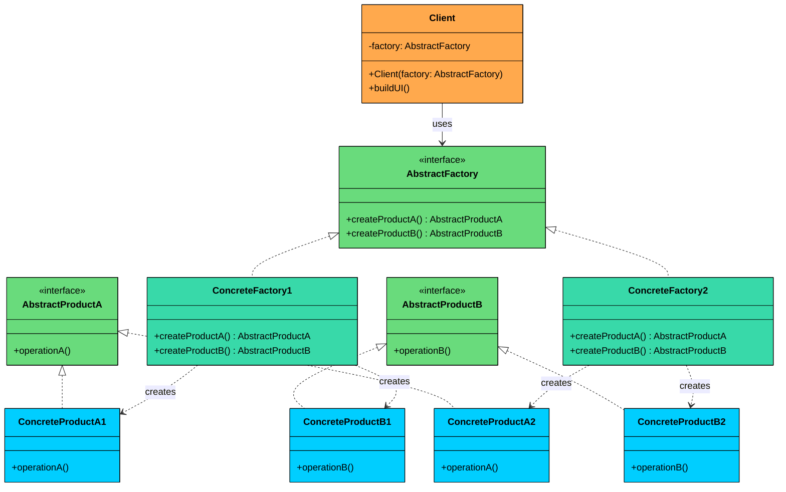
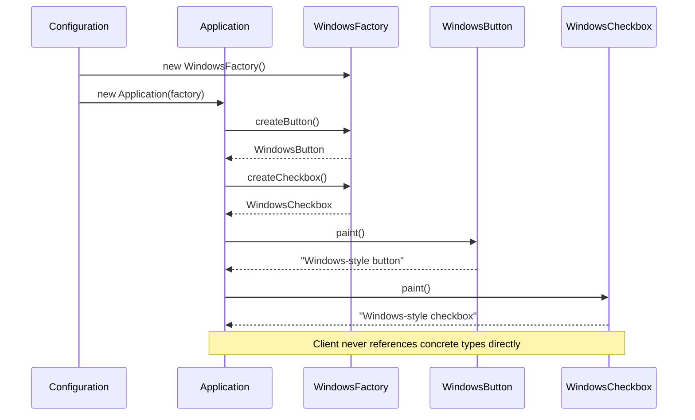
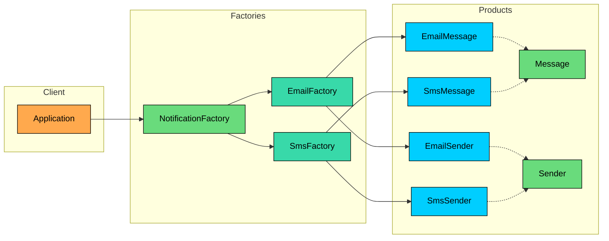

import React from 'react';
import CodeBlock from '../../../../components/ui/CodeBlock';
import Callout from '../../../../components/ui/Callout';

<div className="article-header">
  <div className="breadcrumb">
    <a href="/">Curated Notes</a>
    <span className="breadcrumb-separator">›</span>
    <span className="breadcrumb-current">Abstract Factory Design Pattern</span>
  </div>
  <h1>Abstract Factory Design Pattern</h1>
  <p style={{ color: 'var(--text-muted)', fontSize: '1.1rem', marginBottom: '16px', lineHeight: '1.6' }}>
    Master the essentials of Abstract Factory Design Pattern in this curated guide.
  </p>
  <div className="meta-info">
    <span className="meta-item">
      <svg width="14" height="14" viewBox="0 0 24 24" fill="none" stroke="currentColor" strokeWidth="2"><circle cx="12" cy="12" r="10"/><polyline points="12 6 12 12 16 14"/></svg>
      10 min read
    </span>
    <span className="difficulty-badge difficulty-badge--intermediate">Intermediate</span>
  </div>
</div>

<section className="content-section">


&gt; **DEFINITION**
&gt;
&gt; The **Abstract Factory Design Pattern** is a **creational pattern** that provides an interface for creating families of related or dependent objects without specifying their concrete classes.


It’s particularly useful in situations where:

- You need to create objects that must be **used together** and are part of a consistent family (e.g., GUI elements like buttons, checkboxes, and menus).
- Your system must support **multiple configurations**, environments, or product variants (e.g., light vs. dark themes, Windows vs. macOS look-and-feel).
- You want to **enforce consistency** across related objects, ensuring that they are all created from the same factory.

The **Abstract Factory Pattern** encapsulates object creation into **factory interfaces**.

Each concrete factory implements the interface and produces a complete set of related objects. This ensures that your code remains **extensible, consistent, and loosely coupled** to specific product implementations.

Let’s walk through a real-world example to see how we can apply the Abstract Factory Pattern to build a system that’s flexible, maintainable, and able to support multiple interchangeable product families without conditional logic.

---

## 1. The Problem: Platform-Specific UI

Imagine you're building a **cross-platform desktop application** that must support both **Windows** and **macOS**.

To provide a good user experience, your application should render **native-looking UI components** for each operating system like: Buttons, Checkboxes, Text fields, and Menus.

#### Naive Implementation: Conditional UI Component Instantiation

In your first attempt, you might implement platform-specific UI components like this:

#### Windows UI Elements


```java
class WindowsButton {
    public void paint() {
        System.out.println("Painting a Windows-style button.");
    }

    public void onClick() {
        System.out.println("Windows button clicked.");
    }
}

class WindowsCheckbox {
    public void paint() {
        System.out.println("Painting a Windows-style checkbox.");
    }

    public void onSelect() {
        System.out.println("Windows checkbox selected.");
    }
}
```

```python
class WindowsButton:
    def paint(self):
        print("Painting a Windows-style button.")

    def on_click(self):
        print("Windows button clicked.")

class WindowsCheckbox:
    def paint(self):
        print("Painting a Windows-style checkbox.")

    def on_select(self):
        print("Windows checkbox selected.")
```

```cpp
class WindowsButton {
public:
    void paint() {
        cout << "Painting a Windows-style button." << endl;
    }

    void onClick() {
        cout << "Windows button clicked." << endl;
    }
};

class WindowsCheckbox {
public:
    void paint() {
        cout << "Painting a Windows-style checkbox." << endl;
    }

    void onSelect() {
        cout << "Windows checkbox selected." << endl;
    }
};
```

```go
type WindowsButton struct{}

func (WindowsButton) Paint() {
	fmt.Println("Painting a Windows-style button.")
}

func (WindowsButton) OnClick() {
	fmt.Println("Windows button clicked.")
}

type WindowsCheckbox struct{}

func (WindowsCheckbox) Paint() {
	fmt.Println("Painting a Windows-style checkbox.")
}

func (WindowsCheckbox) OnSelect() {
	fmt.Println("Windows checkbox selected.")
}
```

```csharp
class WindowsButton
{
    public void Paint()
    {
        Console.WriteLine("Painting a Windows-style button.");
    }

    public void OnClick()
    {
        Console.WriteLine("Windows button clicked.");
    }
}

class WindowsCheckbox
{
    public void Paint()
    {
        Console.WriteLine("Painting a Windows-style checkbox.");
    }

    public void OnSelect()
    {
        Console.WriteLine("Windows checkbox selected.");
    }
}
```

```typescript
class WindowsButton {
    paint(): void {
        console.log("Painting a Windows-style button.");
    }

    onClick(): void {
        console.log("Windows button clicked.");
    }
}

class WindowsCheckbox {
    paint(): void {
        console.log("Painting a Windows-style checkbox.");
    }

    onSelect(): void {
        console.log("Windows checkbox selected.");
    }
}
```


#### MacOS UI Elements


```java
class MacOSButton {
    public void paint() {
        System.out.println("Painting a macOS-style button.");
    }

    public void onClick() {
        System.out.println("macOS button clicked.");
    }
}

class MacOSCheckbox {
    public void paint() {
        System.out.println("Painting a macOS-style checkbox.");
    }

    public void onSelect() {
        System.out.println("macOS checkbox selected.");
    }
}
```

```python
class MacOSButton:
    def paint(self):
        print("Painting a macOS-style button.")

    def on_click(self):
        print("macOS button clicked.")

class MacOSCheckbox:
    def paint(self):
        print("Painting a macOS-style checkbox.")

    def on_select(self):
        print("macOS checkbox selected.")
```

```cpp
class MacOSButton {
public:
    void paint() {
        cout << "Painting a macOS-style button." << endl;
    }

    void onClick() {
        cout << "macOS button clicked." << endl;
    }
};

class MacOSCheckbox {
public:
    void paint() {
        cout << "Painting a macOS-style checkbox." << endl;
    }

    void onSelect() {
        cout << "macOS checkbox selected." << endl;
    }
};
```

```go
type MacOSButton struct{}

func (m MacOSButton) Paint() {
	println("Painting a macOS-style button.")
}

func (m MacOSButton) OnClick() {
	println("macOS button clicked.")
}

type MacOSCheckbox struct{}

func (m MacOSCheckbox) Paint() {
	println("Painting a macOS-style checkbox.")
}

func (m MacOSCheckbox) OnSelect() {
	println("macOS checkbox selected.")
}
```

```csharp
class MacOSButton
{
    public void Paint()
    {
        Console.WriteLine("Painting a macOS-style button.");
    }

    public void OnClick()
    {
        Console.WriteLine("macOS button clicked.");
    }
}

class MacOSCheckbox
{
    public void Paint()
    {
        Console.WriteLine("Painting a macOS-style checkbox.");
    }

    public void OnSelect()
    {
        Console.WriteLine("macOS checkbox selected.");
    }
}
```

```typescript
class MacOSButton {
    paint(): void {
        console.log("Painting a macOS-style button.");
    }

    onClick(): void {
        console.log("macOS button clicked.");
    }
}

class MacOSCheckbox {
    paint(): void {
        console.log("Painting a macOS-style checkbox.");
    }

    onSelect(): void {
        console.log("macOS checkbox selected.");
    }
}
```


#### Conditional Client Code

Now, in your application logic, you check the operating system and manually instantiate the correct classes:


```java
public class App {
    public static void main(String[] args) {
        String os = System.getProperty("os.name");

        if (os.contains("Windows")) {
            WindowsButton button = new WindowsButton();
            WindowsCheckbox checkbox = new WindowsCheckbox();
            button.paint();
            checkbox.paint();
        } else if (os.contains("Mac")) {
            MacOSButton button = new MacOSButton();
            MacOSCheckbox checkbox = new MacOSCheckbox();
            button.paint();
            checkbox.paint();
        }
    }
}
```

```python
import platform

def main():
    os_name = platform.system()

    if "Windows" in os_name:
        button = WindowsButton()
        checkbox = WindowsCheckbox()
        button.paint()
        checkbox.paint()
    elif "Darwin" in os_name:
        button = MacOSButton()
        checkbox = MacOSCheckbox()
        button.paint()
        checkbox.paint()

if __name__ == "__main__":
    main()
```

```cpp
int main() {
    string os;

    // Simulated OS input (in real applications, use platform-specific APIs)
    cout << "Enter OS name (Windows/Mac): ";
    getline(cin, os);

    if (os.find("Windows") != string::npos) {
        WindowsButton button;
        WindowsCheckbox checkbox;
        button.paint();
        checkbox.paint();
    } else if (os.find("Mac") != string::npos) {
        MacOSButton button;
        MacOSCheckbox checkbox;
        button.paint();
        checkbox.paint();
    } else {
        cout << "Unsupported OS." << endl;
    }

    return 0;
}
```

```go
package main

import "runtime"

func main() {
	os := runtime.GOOS

	if os == "windows" {
		button := WindowsButton{}
		checkbox := WindowsCheckbox{}
		button.paint()
		checkbox.paint()
	} else if os == "darwin" {
		button := MacOSButton{}
		checkbox := MacOSCheckbox{}
		button.paint()
		checkbox.paint()
	}
}
```

```csharp
public class App
{
    public static void Main()
    {
        string os = Environment.OSVersion.Platform.ToString();

        if (os.Contains("Win"))
        {
            var button = new WindowsButton();
            var checkbox = new WindowsCheckbox();
            button.Paint();
            checkbox.Paint();
        }
        else if (os.Contains("Mac"))
        {
            var button = new MacOSButton();
            var checkbox = new MacOSCheckbox();
            button.Paint();
            checkbox.Paint();
        }
        else
        {
            Console.WriteLine("Unsupported OS.");
        }
    }
}
```

```typescript
class App {
    static main(): void {
        const os = process.platform;

        if (os === "win32") {
            const button = new WindowsButton();
            const checkbox = new WindowsCheckbox();
            button.paint();
            checkbox.paint();
        } else if (os === "darwin") {
            const button = new MacOSButton();
            const checkbox = new MacOSCheckbox();
            button.paint();
            checkbox.paint();
        }
    }
}

App.main();
```


#### Why This Approach Breaks Down

This setup works when you have two components on two platforms. But it quickly becomes unmanageable.

#### **1. No family consistency enforcement**

Nothing stops a developer from writing `new WindowsButton()` alongside `new MacOSCheckbox()`. The code compiles, the tests might even pass, and the bug only surfaces when a user sees a visually broken screen.

#### **2. Tight coupling to concrete classes**

The client code directly references `WindowsButton`, `MacOSCheckbox`, and every other platform-specific class. Every file that creates UI components needs platform-checking logic.

#### **3. No shared interface**

You cannot treat all buttons polymorphically. There is no `Button` type that `WindowsButton` and `MacOSButton` both implement. You cannot write a method that accepts "any button."

#### **4. Explosive growth with new platforms or components**

Adding Linux means creating `LinuxButton`, `LinuxCheckbox`, and updating every conditional block in the codebase. Adding a `TextField` component means creating `WindowsTextField`, `MacOSTextField`, `LinuxTextField`, and adding more branches everywhere.

#### **5. Violation of Open/Closed Principle**

Every new platform or component forces you to modify existing code. You cannot extend the system without editing files that already work.

#### What We Really Need

- A way to **group related components** by family (all Windows components together, all macOS components together)
- **Encapsulated creation logic** so platform checks happen in exactly one place
- **Polymorphic products** so the client works with `Button` and `Checkbox` interfaces, not concrete classes
- **Structural guarantees** that mixing families is impossible, not just discouraged

This is exactly what the **Abstract Factory pattern** provides.

---

## 2. What is Abstract Factory

&gt; The 
&gt;
&gt; **Abstract Factory Pattern**
&gt;
&gt;  provides an interface for creating 
&gt;
&gt; **families of related or dependent objects**
&gt;
&gt;  without specifying their concrete classes.

The key word is **families**. Factory Method deals with creating one product at a time. Abstract Factory deals with creating multiple products that must work together. A GUI factory does not just create buttons. It creates buttons, checkboxes, text fields, and menus that all share the same visual style.

---

### Class Diagram





The structure involves five participants:

#### 1. Abstract Factory (`GUIFactory`)

- Defines a **common interface** for creating a family of related products.
- Typically includes factory methods like `createButton()`, `createCheckbox()`, `createTextField()`, etc.
- Clients rely on this interface to create objects without knowing their concrete types.

#### 2. Concrete Factory (`WindowsFactory`, `MacOSFactory`)

- Implement the abstract factory interface.
- Create **concrete product variants** that belong to a specific family or platform.
- Each factory ensures that all components it produces are compatible (i.e., belong to the same platform/theme).

#### 3. Abstract Product (`Button`, `Checkbox`)

- Define the **interfaces or abstract classes** for a set of related components.
- All product variants for a given type (e.g., `WindowsButton`, `MacOSButton`) will implement these interfaces.

#### 4. Concrete Product (`WindowsButton`, `MacOSCheckbox`)

- Implement the abstract product interfaces.
- Contain **platform-specific logic and appearance** for the components.

#### 5. Client (`Application`)

- Uses the abstract factory and abstract product interfaces.
- Is **completely unaware** of the concrete classes it is using — it only interacts with the factory and product interfaces.
- Can switch entire product families (e.g., from Windows to macOS) by changing the factory without touching UI logic.

---

## 3. How It Works

Here is the Abstract Factory workflow, step by step:





#### **Step 1: Configuration determines the factory**

At application startup, a configuration value, environment variable, or runtime check determines which concrete factory to instantiate. This is the only place in the codebase that references concrete factory classes.

#### **Step 2: The factory is injected into the client**

The client receives the factory through its constructor. It stores the factory as the abstract type, not a concrete one.

#### **Step 3: The client calls factory methods to create products**

When the client needs a button, it calls `factory.createButton()`. When it needs a checkbox, it calls `factory.createCheckbox()`. The client has no idea which concrete classes are being instantiated.

#### **Step 4: The factory returns compatible products**

Because the factory is a `WindowsFactory`, both `createButton()` and `createCheckbox()` return Windows-specific components. There is no possibility of getting a macOS checkbox from a Windows factory.

#### **Step 5: The client uses products through abstract interfaces**

The client calls `button.paint()` and `checkbox.paint()`. It does not know or care whether these are Windows or macOS components. The behavior is determined by the factory that was injected in Step 2.

---

## 4. Implementing Abstract Factory

Let's implement the Abstract Factory pattern step by step. We will define abstract product interfaces, create concrete products for two platforms, build an abstract factory with concrete implementations, and wire everything together through a client that never touches a concrete class.

#### Step 1: Define Abstract Product Interfaces

We start with the contracts that all product variants must fulfill. These interfaces are what the client will work with.

#### Button


```java
interface Button {
    void paint();
    void onClick();
}
```

```python
from abc import ABC, abstractmethod

class Button(ABC):
    @abstractmethod
    def paint(self):
        pass

    @abstractmethod
    def on_click(self):
        pass
```

```cpp
class Button {
public:
    virtual void paint() = 0;
    virtual void onClick() = 0;
    virtual ~Button() = default;
};
```

```go
type Button interface {
	paint()
	onClick()
}
```

```csharp
interface IButton
{
    void Paint();
    void OnClick();
}
```

```typescript
interface Button {
    paint(): void;
    onClick(): void;
}
```


#### Checkbox


```java
interface Checkbox {
    void paint();
    void onSelect();
}
```

```python
class Checkbox(ABC):
    @abstractmethod
    def paint(self):
        pass

    @abstractmethod
    def on_select(self):
        pass
```

```cpp
class Checkbox {
public:
    virtual void paint() = 0;
    virtual void onSelect() = 0;
    virtual ~Checkbox() {}
};
```

```go
type Checkbox interface {
	Paint()
	OnSelect()
}
```

```csharp
interface ICheckbox
{
    void Paint();
    void OnSelect();
}
```

```typescript
interface Checkbox {
    paint(): void;
    onSelect(): void;
}
```


#### Step 2: Create Concrete Products

Each platform provides its own implementation of every product interface.

#### Windows Products


```java
class WindowsButton implements Button {
    @Override
    public void paint() {
        System.out.println("Painting a Windows-style button.");
    }

    @Override
    public void onClick() {
        System.out.println("Windows button clicked.");
    }
}

class WindowsCheckbox implements Checkbox {
    @Override
    public void paint() {
        System.out.println("Painting a Windows-style checkbox.");
    }

    @Override
    public void onSelect() {
        System.out.println("Windows checkbox selected.");
    }
}
```

```python
class WindowsButton(Button):
    def paint(self):
        print("Painting a Windows-style button.")

    def on_click(self):
        print("Windows button clicked.")

class WindowsCheckbox(Checkbox):
    def paint(self):
        print("Painting a Windows-style checkbox.")

    def on_select(self):
        print("Windows checkbox selected.")
```

```cpp
class WindowsButton : public Button {
public:
    void paint() override {
        cout << "Painting a Windows-style button." << endl;
    }

    void onClick() override {
        cout << "Windows button clicked." << endl;
    }
};

class WindowsCheckbox : public Checkbox {
public:
    void paint() override {
        cout << "Painting a Windows-style checkbox." << endl;
    }

    void onSelect() override {
        cout << "Windows checkbox selected." << endl;
    }
};
```

```go
type WindowsButton struct{}

func (w WindowsButton) paint() {
	fmt.Println("Painting a Windows-style button.")
}

func (w WindowsButton) onClick() {
	fmt.Println("Windows button clicked.")
}

type WindowsCheckbox struct{}

func (w WindowsCheckbox) paint() {
	fmt.Println("Painting a Windows-style checkbox.")
}

func (w WindowsCheckbox) onSelect() {
	fmt.Println("Windows checkbox selected.")
}
```

```csharp
class WindowsButton : IButton
{
    public void Paint()
    {
        Console.WriteLine("Painting a Windows-style button.");
    }

    public void OnClick()
    {
        Console.WriteLine("Windows button clicked.");
    }
}

class WindowsCheckbox : ICheckbox
{
    public void Paint()
    {
        Console.WriteLine("Painting a Windows-style checkbox.");
    }

    public void OnSelect()
    {
        Console.WriteLine("Windows checkbox selected.");
    }
}
```

```typescript
class WindowsButton implements Button {
    paint(): void {
        console.log("Painting a Windows-style button.");
    }

    onClick(): void {
        console.log("Windows button clicked.");
    }
}

class WindowsCheckbox implements Checkbox {
    paint(): void {
        console.log("Painting a Windows-style checkbox.");
    }

    onSelect(): void {
        console.log("Windows checkbox selected.");
    }
}
```


#### macOS Products


```java
class MacOSButton implements Button {
    @Override
    public void paint() {
        System.out.println("Painting a macOS-style button.");
    }

    @Override
    public void onClick() {
        System.out.println("macOS button clicked.");
    }
}

class MacOSCheckbox implements Checkbox {
    @Override
    public void paint() {
        System.out.println("Painting a macOS-style checkbox.");
    }

    @Override
    public void onSelect() {
        System.out.println("macOS checkbox selected.");
    }
}
```

```python
class MacOSButton(Button):
    def paint(self):
        print("Painting a macOS-style button.")

    def on_click(self):
        print("macOS button clicked.")

class MacOSCheckbox(Checkbox):
    def paint(self):
        print("Painting a macOS-style checkbox.")

    def on_select(self):
        print("macOS checkbox selected.")
```

```cpp
class MacOSButton : public Button {
public:
    void paint() override {
        cout << "Painting a macOS-style button." << endl;
    }

    void onClick() override {
        cout << "macOS button clicked." << endl;
    }
};

class MacOSCheckbox : public Checkbox {
public:
    void paint() override {
        cout << "Painting a macOS-style checkbox." << endl;
    }

    void onSelect() override {
        cout << "macOS checkbox selected." << endl;
    }
};
```

```go
type MacOSButton struct{}

func (m MacOSButton) Paint() {
	fmt.Println("Painting a macOS-style button.")
}

func (m MacOSButton) OnClick() {
	fmt.Println("macOS button clicked.")
}

type MacOSCheckbox struct{}

func (m MacOSCheckbox) Paint() {
	fmt.Println("Painting a macOS-style checkbox.")
}

func (m MacOSCheckbox) OnSelect() {
	fmt.Println("macOS checkbox selected.")
}
```

```csharp
class MacOSButton : IButton
{
    public void Paint()
    {
        Console.WriteLine("Painting a macOS-style button.");
    }

    public void OnClick()
    {
        Console.WriteLine("macOS button clicked.");
    }
}

class MacOSCheckbox : ICheckbox
{
    public void Paint()
    {
        Console.WriteLine("Painting a macOS-style checkbox.");
    }

    public void OnSelect()
    {
        Console.WriteLine("macOS checkbox selected.");
    }
}
```

```typescript
class MacOSButton implements Button {
    paint(): void {
        console.log("Painting a macOS-style button.");
    }

    onClick(): void {
        console.log("macOS button clicked.");
    }
}

class MacOSCheckbox implements Checkbox {
    paint(): void {
        console.log("Painting a macOS-style checkbox.");
    }

    onSelect(): void {
        console.log("macOS checkbox selected.");
    }
}
```


#### Step 3: Define the Abstract Factory

The abstract factory declares one creation method per product type. Any concrete factory must implement all of them.


```java
interface GUIFactory {
    Button createButton();
    Checkbox createCheckbox();
}
```

```python
class GUIFactory(ABC):
    @abstractmethod
    def create_button(self):
        pass

    @abstractmethod
    def create_checkbox(self):
        pass
```

```cpp
class GUIFactory {
public:
    virtual Button* createButton() = 0;
    virtual Checkbox* createCheckbox() = 0;
    virtual ~GUIFactory() {}
};
```

```go
type GUIFactory interface {
	CreateButton() Button
	CreateCheckbox() Checkbox
}
```

```csharp
interface IGUIFactory
{
    IButton CreateButton();
    ICheckbox CreateCheckbox();
}
```

```typescript
interface GUIFactory {
    createButton(): Button;
    createCheckbox(): Checkbox;
}
```


#### Step 4: Implement Concrete Factories

Each concrete factory produces a complete, compatible set of products for its platform.

#### WindowsFactory


```java
class WindowsFactory implements GUIFactory {
    @Override
    public Button createButton() {
        return new WindowsButton();
    }

    @Override
    public Checkbox createCheckbox() {
        return new WindowsCheckbox();
    }
}
```

```python
class WindowsFactory(GUIFactory):
    def create_button(self):
        return WindowsButton()

    def create_checkbox(self):
        return WindowsCheckbox()
```

```cpp
class WindowsFactory : public GUIFactory {
public:
    Button* createButton() override {
        return new WindowsButton();
    }
    Checkbox* createCheckbox() override {
        return new WindowsCheckbox();
    }
};
```

```go
type WindowsFactory struct{}

func (WindowsFactory) CreateButton() Button {
	return WindowsButton{}
}

func (WindowsFactory) CreateCheckbox() Checkbox {
	return WindowsCheckbox{}
}
```

```csharp
class WindowsFactory : IGUIFactory
{
    public IButton CreateButton()
    {
        return new WindowsButton();
    }

    public ICheckbox CreateCheckbox()
    {
        return new WindowsCheckbox();
    }
}
```

```typescript
class WindowsFactory implements GUIFactory {
    createButton(): Button {
        return new WindowsButton();
    }

    createCheckbox(): Checkbox {
        return new WindowsCheckbox();
    }
}
```


#### MacOSFactory


```java
class MacOSFactory implements GUIFactory {
    @Override
    public Button createButton() {
        return new MacOSButton();
    }

    @Override
    public Checkbox createCheckbox() {
        return new MacOSCheckbox();
    }
}
```

```python
class MacOSFactory(GUIFactory):
    def create_button(self):
        return MacOSButton()

    def create_checkbox(self):
        return MacOSCheckbox()
```

```cpp
class MacOSFactory : public GUIFactory {
public:
    Button* createButton() override {
        return new MacOSButton();
    }
    Checkbox* createCheckbox() override {
        return new MacOSCheckbox();
    }
};
```

```go
type MacOSFactory struct{}

func (MacOSFactory) createButton() Button {
	return &MacOSButton{}
}

func (MacOSFactory) createCheckbox() Checkbox {
	return &MacOSCheckbox{}
}
```

```csharp
class MacOSFactory : IGUIFactory
{
    public IButton CreateButton()
    {
        return new MacOSButton();
    }

    public ICheckbox CreateCheckbox()
    {
        return new MacOSCheckbox();
    }
}
```

```typescript
class MacOSFactory implements GUIFactory {
    createButton(): Button {
        return new MacOSButton();
    }

    createCheckbox(): Checkbox {
        return new MacOSCheckbox();
    }
}
```


#### Step 5: Client Code

The client receives a factory through its constructor and uses only abstract interfaces.


```java
class Application {
    private final Button button;
    private final Checkbox checkbox;

    public Application(GUIFactory factory) {
        this.button = factory.createButton();
        this.checkbox = factory.createCheckbox();
    }

    public void renderUI() {
        button.paint();
        checkbox.paint();
    }
}
```

```python
class Application:
    def __init__(self, factory):
        self.button = factory.create_button()
        self.checkbox = factory.create_checkbox()

    def render_ui(self):
        self.button.paint()
        self.checkbox.paint()
```

```cpp
class Application {
private:
    Button* button;
    Checkbox* checkbox;

public:
    Application(GUIFactory* factory) {
        button = factory->createButton();
        checkbox = factory->createCheckbox();
    }

    ~Application() {
        delete button;
        delete checkbox;
    }

    void renderUI() {
        button->paint();
        checkbox->paint();
    }
};
```

```go
type Application struct {
	button   Button
	checkbox Checkbox
}

func NewApplication(factory GUIFactory) Application {
	return Application{
		button:   factory.CreateButton(),
		checkbox: factory.CreateCheckbox(),
	}
}

func (a Application) RenderUI() {
	a.button.Paint()
	a.checkbox.Paint()
}
```

```csharp
class Application
{
    private readonly IButton _button;
    private readonly ICheckbox _checkbox;

    public Application(IGUIFactory factory)
    {
        _button = factory.CreateButton();
        _checkbox = factory.CreateCheckbox();
    }

    public void RenderUI()
    {
        _button.Paint();
        _checkbox.Paint();
    }
}
```

```typescript
class Application {
    private readonly button: Button;
    private readonly checkbox: Checkbox;

    constructor(factory: GUIFactory) {
        this.button = factory.createButton();
        this.checkbox = factory.createCheckbox();
    }

    renderUI(): void {
        this.button.paint();
        this.checkbox.paint();
    }
}
```


#### Step 6: Wire Everything Together

The entry point is the only place that references concrete factories. It reads the platform, picks the right factory, and injects it into the client.


```java
public class AppLauncher {
    public static void main(String[] args) {
        // Simulate platform detection
        String os = System.getProperty("os.name");
        GUIFactory factory;

        if (os.contains("Windows")) {
            factory = new WindowsFactory();
        } else {
            factory = new MacOSFactory();
        }

        Application app = new Application(factory);
        app.renderUI();
    }
}
```

```python
import platform

class AppLauncher:
    @staticmethod
    def main():
        # Simulate platform detection
        os = platform.system()

        if "Windows" in os:
            factory = WindowsFactory()
        else:
            factory = MacOSFactory()

        app = Application(factory)
        app.render_ui()

if __name__ == "__main__":
    AppLauncher.main()
```

```cpp
int main() {
    string os;
    cout << "Enter OS (Windows/Mac): ";
    getline(cin, os);

    GUIFactory* factory = nullptr;

    // Simulated platform detection
    transform(os.begin(), os.end(), os.begin(), ::tolower);
    if (os.find("windows") != string::npos) {
        factory = new WindowsFactory();
    } else {
        factory = new MacOSFactory();
    }

    Application app(factory);
    app.renderUI();

    delete factory;

    return 0;
}
```

```go
package main

import (
	"os"
	"strings"
)

func main() {
	// Simulate platform detection
	osName := os.Getenv("OS")
	if osName == "" {
		osName = strings.ToLower(os.Getenv("OSTYPE"))
	}

	var factory GUIFactory

	if strings.Contains(strings.ToLower(osName), "windows") {
		factory = &WindowsFactory{}
	} else {
		factory = &MacOSFactory{}
	}

	app := Application{factory: factory}
	app.renderUI()
}
```

```csharp
public class AppLauncher
{
    public static void Main()
    {
        Console.Write("Enter OS (Windows/Mac): ");
        string os = Console.ReadLine()?.ToLower() ?? "";

        IGUIFactory factory;

        if (os.Contains("windows"))
        {
            factory = new WindowsFactory();
        }
        else
        {
            factory = new MacOSFactory();
        }

        Application app = new Application(factory);
        app.RenderUI();
    }
}
```

```typescript
class AppLauncher {
    static main(): void {
        // Simulate platform detection
        const os = process.platform;
        let factory: GUIFactory;

        if (os === "win32") {
            factory = new WindowsFactory();
        } else {
            factory = new MacOSFactory();
        }

        const app = new Application(factory);
        app.renderUI();
    }
}

AppLauncher.main();
```


#### Output (on macOS)


```shell
Painting a macOS-style button.
Painting a macOS-style checkbox.
```


#### Output (on Windows)


```shell
Painting a Windows-style button.
Painting a Windows-style checkbox.
```


#### What We Achieved

- **Platform independence: **Application code never references platform-specific classes
- **Consistency: **Buttons and checkboxes always match the selected OS style
- **Open/Closed Principle: **Add support for Linux or Android without modifying existing factories or components
- **Testability & Flexibility: **Factories can be swapped easily for testing or theming

---

## 5. Practical Example: Notification System

Let's build a notification system that supports Email and SMS channels. Each channel produces two related objects: a Message and a Sender. Mixing an email message with an SMS sender would produce garbled output, so family consistency matters.

#### Architecture





#### Full Implementation


```java
// Abstract Products
interface Message {
    void setContent(String to, String body);
    String format();
}

interface Sender {
    void send(Message message);
}

// Email Products
class EmailMessage implements Message {
    private String to;
    private String body;

    @Override
    public void setContent(String to, String body) {
        this.to = to;
        this.body = body;
    }

    @Override
    public String format() {
        return "Email to <" + to + ">: " + body;
    }
}

class EmailSender implements Sender {
    @Override
    public void send(Message message) {
        System.out.println("Sending via SMTP: " + message.format());
    }
}

// SMS Products
class SmsMessage implements Message {
    private String to;
    private String body;

    @Override
    public void setContent(String to, String body) {
        this.to = to;
        this.body = body.length() > 160 ? body.substring(0, 160) : body;
    }

    @Override
    public String format() {
        return "SMS to " + to + ": " + body;
    }
}

class SmsSender implements Sender {
    @Override
    public void send(Message message) {
        System.out.println("Sending via carrier API: " + message.format());
    }
}

// Abstract Factory
interface NotificationFactory {
    Message createMessage();
    Sender createSender();
}

// Concrete Factories
class EmailFactory implements NotificationFactory {
    @Override
    public Message createMessage() { return new EmailMessage(); }

    @Override
    public Sender createSender() { return new EmailSender(); }
}

class SmsFactory implements NotificationFactory {
    @Override
    public Message createMessage() { return new SmsMessage(); }

    @Override
    public Sender createSender() { return new SmsSender(); }
}

// Client
class NotificationService {
    private final NotificationFactory factory;

    public NotificationService(NotificationFactory factory) {
        this.factory = factory;
    }

    public void notify(String to, String body) {
        Message message = factory.createMessage();
        message.setContent(to, body);
        Sender sender = factory.createSender();
        sender.send(message);
    }
}

// Entry Point
public class Main {
    public static void main(String[] args) {
        System.out.println("=== Email Notification ===");
        NotificationService emailService = new NotificationService(new EmailFactory());
        emailService.notify("alice@example.com", "Your order has been shipped!");

        System.out.println();

        System.out.println("=== SMS Notification ===");
        NotificationService smsService = new NotificationService(new SmsFactory());
        smsService.notify("+1-555-0123", "Your order has been shipped!");
    }
}
```

```python
from abc import ABC, abstractmethod

## Abstract Products
class Message(ABC):
    @abstractmethod
    def set_content(self, to: str, body: str):
        pass

    @abstractmethod
    def format(self) -> str:
        pass

class Sender(ABC):
    @abstractmethod
    def send(self, message: Message):
        pass

## Email Products
class EmailMessage(Message):
    def set_content(self, to: str, body: str):
        self.to = to
        self.body = body

    def format(self) -> str:
        return f"Email to <{self.to}>: {self.body}"

class EmailSender(Sender):
    def send(self, message: Message):
        print(f"Sending via SMTP: {message.format()}")

## SMS Products
class SmsMessage(Message):
    def set_content(self, to: str, body: str):
        self.to = to
        self.body = body[:160]

    def format(self) -> str:
        return f"SMS to {self.to}: {self.body}"

class SmsSender(Sender):
    def send(self, message: Message):
        print(f"Sending via carrier API: {message.format()}")

## Abstract Factory
class NotificationFactory(ABC):
    @abstractmethod
    def create_message(self) -> Message:
        pass

    @abstractmethod
    def create_sender(self) -> Sender:
        pass

## Concrete Factories
class EmailFactory(NotificationFactory):
    def create_message(self) -> Message:
        return EmailMessage()

    def create_sender(self) -> Sender:
        return EmailSender()

class SmsFactory(NotificationFactory):
    def create_message(self) -> Message:
        return SmsMessage()

    def create_sender(self) -> Sender:
        return SmsSender()

## Client
class NotificationService:
    def __init__(self, factory: NotificationFactory):
        self.factory = factory

    def notify(self, to: str, body: str):
        message = self.factory.create_message()
        message.set_content(to, body)
        sender = self.factory.create_sender()
        sender.send(message)

## Entry Point
if __name__ == "__main__":
    print("=== Email Notification ===")
    email_service = NotificationService(EmailFactory())
    email_service.notify("alice@example.com", "Your order has been shipped!")

    print()

    print("=== SMS Notification ===")
    sms_service = NotificationService(SmsFactory())
    sms_service.notify("+1-555-0123", "Your order has been shipped!")
```

```cpp
#include <iostream>
#include <string>

using namespace std;

// Abstract Products
class Message {
public:
    virtual void setContent(const string& to, const string& body) = 0;
    virtual string format() const = 0;
    virtual ~Message() = default;
};

class Sender {
public:
    virtual void send(const Message& message) = 0;
    virtual ~Sender() = default;
};

// Email Products
class EmailMessage : public Message {
    string to, body;
public:
    void setContent(const string& to, const string& body) override {
        this->to = to;
        this->body = body;
    }
    string format() const override {
        return "Email to <" + to + ">: " + body;
    }
};

class EmailSender : public Sender {
public:
    void send(const Message& message) override {
        cout << "Sending via SMTP: " << message.format() << endl;
    }
};

// SMS Products
class SmsMessage : public Message {
    string to, body;
public:
    void setContent(const string& to, const string& body) override {
        this->to = to;
        this->body = body.length() > 160 ? body.substr(0, 160) : body;
    }
    string format() const override {
        return "SMS to " + to + ": " + body;
    }
};

class SmsSender : public Sender {
public:
    void send(const Message& message) override {
        cout << "Sending via carrier API: " << message.format() << endl;
    }
};

// Abstract Factory
class NotificationFactory {
public:
    virtual Message* createMessage() = 0;
    virtual Sender* createSender() = 0;
    virtual ~NotificationFactory() = default;
};

// Concrete Factories
class EmailFactory : public NotificationFactory {
public:
    Message* createMessage() override { return new EmailMessage(); }
    Sender* createSender() override { return new EmailSender(); }
};

class SmsFactory : public NotificationFactory {
public:
    Message* createMessage() override { return new SmsMessage(); }
    Sender* createSender() override { return new SmsSender(); }
};

// Client
class NotificationService {
    NotificationFactory* factory;
public:
    NotificationService(NotificationFactory* factory) : factory(factory) {}

    void notify(const string& to, const string& body) {
        Message* message = factory->createMessage();
        message->setContent(to, body);
        Sender* sender = factory->createSender();
        sender->send(*message);
        delete message;
        delete sender;
    }
};

int main() {
    cout << "=== Email Notification ===" << endl;
    EmailFactory emailFactory;
    NotificationService emailService(&emailFactory);
    emailService.notify("alice@example.com", "Your order has been shipped!");

    cout << endl;

    cout << "=== SMS Notification ===" << endl;
    SmsFactory smsFactory;
    NotificationService smsService(&smsFactory);
    smsService.notify("+1-555-0123", "Your order has been shipped!");

    return 0;
}
```

```go
package main

import (
	"fmt"
)

type Message interface {
	setContent(to, body string)
	format() string
}

type Sender interface {
	send(message Message)
}

type EmailMessage struct {
	to   string
	body string
}

func (m *EmailMessage) setContent(to, body string) {
	m.to = to
	m.body = body
}

func (m *EmailMessage) format() string {
	return "Email to <" + m.to + ">: " + m.body
}

type EmailSender struct{}

func (s *EmailSender) send(message Message) {
	fmt.Println("Sending via SMTP: " + message.format())
}

type SmsMessage struct {
	to   string
	body string
}

func (m *SmsMessage) setContent(to, body string) {
	m.to = to
	if len(body) > 160 {
		m.body = body[:160]
	} else {
		m.body = body
	}
}

func (m *SmsMessage) format() string {
	return "SMS to " + m.to + ": " + m.body
}

type SmsSender struct{}

func (s *SmsSender) send(message Message) {
	fmt.Println("Sending via carrier API: " + message.format())
}

type NotificationFactory interface {
	createMessage() Message
	createSender() Sender
}

type EmailFactory struct{}

func (f *EmailFactory) createMessage() Message { return &EmailMessage{} }

func (f *EmailFactory) createSender() Sender { return &EmailSender{} }

type SmsFactory struct{}

func (f *SmsFactory) createMessage() Message { return &SmsMessage{} }

func (f *SmsFactory) createSender() Sender { return &SmsSender{} }

type NotificationService struct {
	factory NotificationFactory
}

func NewNotificationService(factory NotificationFactory) *NotificationService {
	return &NotificationService{factory: factory}
}

func (s *NotificationService) notify(to, body string) {
	message := s.factory.createMessage()
	message.setContent(to, body)
	sender := s.factory.createSender()
	sender.send(message)
}

func main() {
	fmt.Println("=== Email Notification ===")
	emailService := NewNotificationService(&EmailFactory{})
	emailService.notify("alice@example.com", "Your order has been shipped!")

	fmt.Println()

	fmt.Println("=== SMS Notification ===")
	smsService := NewNotificationService(&SmsFactory{})
	smsService.notify("+1-555-0123", "Your order has been shipped!")
}
```

```csharp
using System;

// Abstract Products
interface IMessage
{
    void SetContent(string to, string body);
    string Format();
}

interface ISender
{
    void Send(IMessage message);
}

// Email Products
class EmailMessage : IMessage
{
    private string _to, _body;

    public void SetContent(string to, string body)
    {
        _to = to;
        _body = body;
    }

    public string Format() => $"Email to <{_to}>: {_body}";
}

class EmailSender : ISender
{
    public void Send(IMessage message) =>
        Console.WriteLine($"Sending via SMTP: {message.Format()}");
}

// SMS Products
class SmsMessage : IMessage
{
    private string _to, _body;

    public void SetContent(string to, string body)
    {
        _to = to;
        _body = body.Length > 160 ? body.Substring(0, 160) : body;
    }

    public string Format() => $"SMS to {_to}: {_body}";
}

class SmsSender : ISender
{
    public void Send(IMessage message) =>
        Console.WriteLine($"Sending via carrier API: {message.Format()}");
}

// Abstract Factory
interface INotificationFactory
{
    IMessage CreateMessage();
    ISender CreateSender();
}

// Concrete Factories
class EmailFactory : INotificationFactory
{
    public IMessage CreateMessage() => new EmailMessage();
    public ISender CreateSender() => new EmailSender();
}

class SmsFactory : INotificationFactory
{
    public IMessage CreateMessage() => new SmsMessage();
    public ISender CreateSender() => new SmsSender();
}

// Client
class NotificationService
{
    private readonly INotificationFactory _factory;

    public NotificationService(INotificationFactory factory)
    {
        _factory = factory;
    }

    public void Notify(string to, string body)
    {
        var message = _factory.CreateMessage();
        message.SetContent(to, body);
        var sender = _factory.CreateSender();
        sender.Send(message);
    }
}

class Program
{
    static void Main()
    {
        Console.WriteLine("=== Email Notification ===");
        var emailService = new NotificationService(new EmailFactory());
        emailService.Notify("alice@example.com", "Your order has been shipped!");

        Console.WriteLine();

        Console.WriteLine("=== SMS Notification ===");
        var smsService = new NotificationService(new SmsFactory());
        smsService.Notify("+1-555-0123", "Your order has been shipped!");
    }
}
```

```typescript
// Abstract Products
interface Message {
    setContent(to: string, body: string): void;
    format(): string;
}

interface Sender {
    send(message: Message): void;
}

// Email Products
class EmailMessage implements Message {
    private to = "";
    private body = "";

    setContent(to: string, body: string): void {
        this.to = to;
        this.body = body;
    }

    format(): string {
        return `Email to <${this.to}>: ${this.body}`;
    }
}

class EmailSender implements Sender {
    send(message: Message): void {
        console.log(`Sending via SMTP: ${message.format()}`);
    }
}

// SMS Products
class SmsMessage implements Message {
    private to = "";
    private body = "";

    setContent(to: string, body: string): void {
        this.to = to;
        this.body = body.length > 160 ? body.substring(0, 160) : body;
    }

    format(): string {
        return `SMS to ${this.to}: ${this.body}`;
    }
}

class SmsSender implements Sender {
    send(message: Message): void {
        console.log(`Sending via carrier API: ${message.format()}`);
    }
}

// Abstract Factory
interface NotificationFactory {
    createMessage(): Message;
    createSender(): Sender;
}

// Concrete Factories
class EmailFactory implements NotificationFactory {
    createMessage(): Message { return new EmailMessage(); }
    createSender(): Sender { return new EmailSender(); }
}

class SmsFactory implements NotificationFactory {
    createMessage(): Message { return new SmsMessage(); }
    createSender(): Sender { return new SmsSender(); }
}

// Client
class NotificationService {
    private factory: NotificationFactory;

    constructor(factory: NotificationFactory) {
        this.factory = factory;
    }

    notify(to: string, body: string): void {
        const message = this.factory.createMessage();
        message.setContent(to, body);
        const sender = this.factory.createSender();
        sender.send(message);
    }
}

// Entry Point
console.log("=== Email Notification ===");
const emailService = new NotificationService(new EmailFactory());
emailService.notify("alice@example.com", "Your order has been shipped!");

console.log();

console.log("=== SMS Notification ===");
const smsService = new NotificationService(new SmsFactory());
smsService.notify("+1-555-0123", "Your order has been shipped!");
```


#### **What we achieved:**

- **Two product types** (Message and Sender) that must stay consistent within a notification channel
- **Zero mixing risk:** An `EmailFactory` can only produce email objects. There is no code path that creates an email message paired with an SMS sender
- **Easy to extend:** Adding push notification support means creating `PushFactory`, `PushMessage`, and `PushSender`. Nothing existing changes
- **Simple and focused:** Each product has a clear, single responsibility, making the pattern easy to understand and test

</section>
