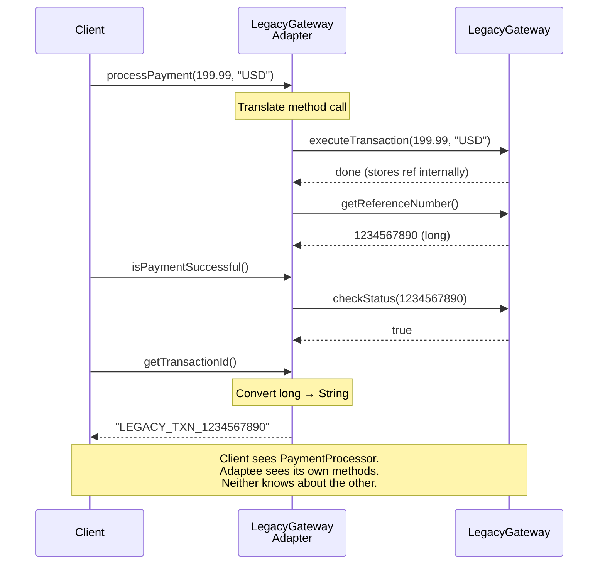
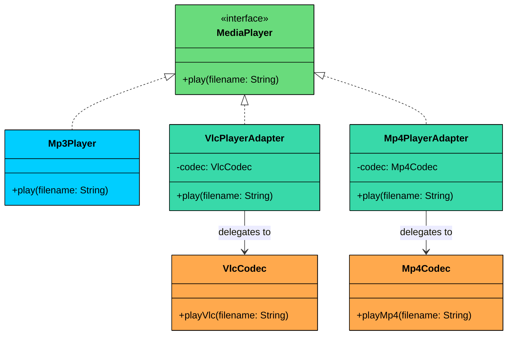

import React from 'react';
import CodeBlock from '../../../../components/ui/CodeBlock';
import Callout from '../../../../components/ui/Callout';

<div className="article-header">
  <div className="breadcrumb">
    <a href="/">Curated Notes</a>
    <span className="breadcrumb-separator">›</span>
    <span className="breadcrumb-current">Adapter Design Pattern</span>
  </div>
  <h1>Adapter Design Pattern</h1>
  <p style={{ color: 'var(--text-muted)', fontSize: '1.1rem', marginBottom: '16px', lineHeight: '1.6' }}>
    Master the essentials of Adapter Design Pattern in this curated guide.
  </p>
  <div className="meta-info">
    <span className="meta-item">
      <svg width="14" height="14" viewBox="0 0 24 24" fill="none" stroke="currentColor" strokeWidth="2"><circle cx="12" cy="12" r="10"/><polyline points="12 6 12 12 16 14"/></svg>
      10 min read
    </span>
    <span className="difficulty-badge difficulty-badge--intermediate">Intermediate</span>
  </div>
</div>

<section className="content-section">


&gt; **DEFINITION**
&gt;
&gt; The **Adapter Design Pattern** is a **structural design pattern** that allows incompatible interfaces to work together by **converting the interface of one class into another that the client expects**.


It’s particularly useful in situations where:

- You’re integrating with a **legacy system** or a **third-party library** that doesn’t match your current interface.
- You want to **reuse existing functionality** without modifying its source code.
- You need to **bridge the gap between new and old code**, or between systems built with different interface designs.

When faced with incompatible interfaces, developers often resort to rewriting large parts of code or embedding conditionals like `if (legacyType)` to handle special cases. But as more incompatible services or modules are introduced, this approach quickly becomes **messy, tightly coupled**, and violates the **Open/Closed Principle** making the system hard to scale or refactor.

The **Adapter Pattern** solves this by introducing a **wrapper class** that sits between your system and the incompatible component. It translates calls from your interface into calls the legacy or third-party system understands  **without changing either side**.

Let’s walk through a real-world example to see how we can apply the Adapter Pattern to seamlessly integrate incompatible components and create a more flexible and maintainable architecture.

---

## 1. The Problem: Incompatible Payment Interfaces

Imagine you are building the checkout component of an e-commerce application. Your checkout service is designed to work with a `PaymentProcessor` interface for handling payments.

#### The Expected Interface

Here’s the contract your `CheckoutService` expects any payment provider to follow:


```java
interface PaymentProcessor {
    void processPayment(double amount, String currency);
    boolean isPaymentSuccessful();
    String getTransactionId();
}
```

```python
from abc import ABC, abstractmethod

class PaymentProcessor(ABC):
    @abstractmethod
    def process_payment(self, amount: float, currency: str):
        pass

    @abstractmethod
    def is_payment_successful(self) -> bool:
        pass

    @abstractmethod
    def get_transaction_id(self) -> str:
        pass
```

```cpp
class PaymentProcessor {
public:
   virtual void processPayment(double amount, string currency) = 0;
   virtual bool isPaymentSuccessful() = 0;
   virtual string getTransactionId() = 0;
   virtual ~PaymentProcessor() {}
};
```

```go
type PaymentProcessor interface {
	ProcessPayment(amount float64, currency string)
	IsPaymentSuccessful() bool
	GetTransactionId() string
}
```

```csharp
interface IPaymentProcessor
{
   void ProcessPayment(double amount, string currency);
   bool IsPaymentSuccessful();
   string GetTransactionId();
}
```

```typescript
interface PaymentProcessor {
   processPayment(amount: number, currency: string): void;
   isPaymentSuccessful(): boolean;
   getTransactionId(): string;
}
```


This abstraction makes it easy to swap payment providers without changing any core business logic.

#### Your In-House Implementation

Your team already has an internal payment processor that fits this interface perfectly:


```java
class InHousePaymentProcessor implements PaymentProcessor {
    private String transactionId;
    private boolean paymentSuccessful;

    @Override
    public void processPayment(double amount, String currency) {
        System.out.println("InHouseProcessor: Processing " + amount + " " + currency);
        transactionId = "TXN_" + System.currentTimeMillis();
        paymentSuccessful = true;
        System.out.println("InHouseProcessor: Success. Txn ID: " + transactionId);
    }

    @Override
    public boolean isPaymentSuccessful() {
        return paymentSuccessful;
    }

    @Override
    public String getTransactionId() {
        return transactionId;
    }
}
```

```python
import time

class InHousePaymentProcessor(PaymentProcessor):
    def __init__(self):
        self._transaction_id = None
        self._payment_successful = False

    def process_payment(self, amount: float, currency: str):
        print(f"InHouseProcessor: Processing {amount} {currency}")
        self._transaction_id = f"TXN_{int(time.time() * 1000)}"
        self._payment_successful = True
        print(f"InHouseProcessor: Success. Txn ID: {self._transaction_id}")

    def is_payment_successful(self) -> bool:
        return self._payment_successful

    def get_transaction_id(self) -> str:
        return self._transaction_id
```

```cpp
class InHousePaymentProcessor : public PaymentProcessor {
private:
    string transactionId;
    bool paymentSuccessful = false;

public:
    void processPayment(double amount, string currency) override {
        cout << "InHouseProcessor: Processing " << amount << " " << currency << endl;
        auto now = chrono::duration_cast<chrono::milliseconds>(
            chrono::system_clock::now().time_since_epoch()).count();
        transactionId = "TXN_" + to_string(now);
        paymentSuccessful = true;
        cout << "InHouseProcessor: Success. Txn ID: " << transactionId << endl;
    }

    bool isPaymentSuccessful() override {
        return paymentSuccessful;
    }

    string getTransactionId() override {
        return transactionId;
    }
};
```

```go
type InHousePaymentProcessor struct {
	transactionId     string
	paymentSuccessful bool
}

func (p *InHousePaymentProcessor) ProcessPayment(amount float64, currency string) {
	fmt.Println("InHouseProcessor: Processing", amount, currency)
	p.transactionId = fmt.Sprintf("TXN_%d", time.Now().UnixMilli())
	p.paymentSuccessful = true
	fmt.Println("InHouseProcessor: Success. Txn ID:", p.transactionId)
}

func (p *InHousePaymentProcessor) IsPaymentSuccessful() bool {
	return p.paymentSuccessful
}

func (p *InHousePaymentProcessor) GetTransactionId() string {
	return p.transactionId
}
```

```csharp
class InHousePaymentProcessor : IPaymentProcessor
{
    private string transactionId;
    private bool paymentSuccessful;

    public void ProcessPayment(double amount, string currency)
    {
        Console.WriteLine($"InHouseProcessor: Processing {amount} {currency}");
        transactionId = "TXN_" + DateTimeOffset.Now.ToUnixTimeMilliseconds();
        paymentSuccessful = true;
        Console.WriteLine($"InHouseProcessor: Success. Txn ID: {transactionId}");
    }

    public bool IsPaymentSuccessful() => paymentSuccessful;

    public string GetTransactionId() => transactionId;
}
```

```typescript
class InHousePaymentProcessor implements PaymentProcessor {
    private transactionId: string = "";
    private paymentSuccess: boolean = false;

    processPayment(amount: number, currency: string): void {
        console.log(`InHouseProcessor: Processing ${amount} ${currency}`);
        this.transactionId = "TXN_" + Date.now();
        this.paymentSuccess = true;
        console.log(`InHouseProcessor: Success. Txn ID: ${this.transactionId}`);
    }

    isPaymentSuccessful(): boolean {
        return this.paymentSuccess;
    }

    getTransactionId(): string {
        return this.transactionId;
    }
}
```


Your `CheckoutService` uses this interface and works beautifully with the in-house payment processor:


```java
class CheckoutService {
    private final PaymentProcessor paymentProcessor;

    public CheckoutService(PaymentProcessor paymentProcessor) {
        this.paymentProcessor = paymentProcessor;
    }

    public void checkout(double amount, String currency) {
        System.out.println("Checkout: Processing order for $" + amount + " " + currency);
        paymentProcessor.processPayment(amount, currency);
        if (paymentProcessor.isPaymentSuccessful()) {
            System.out.println("Checkout: Order successful! Txn: "
                + paymentProcessor.getTransactionId());
        } else {
            System.out.println("Checkout: Order failed.");
        }
    }
}
```

```python
class CheckoutService:
    def __init__(self, payment_processor: PaymentProcessor):
        self._processor = payment_processor

    def checkout(self, amount: float, currency: str):
        print(f"Checkout: Processing order for ${amount} {currency}")
        self._processor.process_payment(amount, currency)
        if self._processor.is_payment_successful():
            print(f"Checkout: Order successful! Txn: {self._processor.get_transaction_id()}")
        else:
            print("Checkout: Order failed.")
```

```cpp
class CheckoutService {
private:
    PaymentProcessor* paymentProcessor;

public:
    CheckoutService(PaymentProcessor* processor) : paymentProcessor(processor) {}

    void checkout(double amount, std::string currency) {
        std::cout << "Checkout: Processing order for $" << amount << " " << currency << std::endl;
        paymentProcessor->processPayment(amount, currency);
        if (paymentProcessor->isPaymentSuccessful()) {
            std::cout << "Checkout: Order successful! Txn: "
                      << paymentProcessor->getTransactionId() << std::endl;
        } else {
            std::cout << "Checkout: Order failed." << std::endl;
        }
    }
};
```

```go
type CheckoutService struct {
	paymentProcessor PaymentProcessor
}

func NewCheckoutService(paymentProcessor PaymentProcessor) *CheckoutService {
	return &CheckoutService{paymentProcessor: paymentProcessor}
}

func (c *CheckoutService) Checkout(amount float64, currency string) {
	fmt.Println("Checkout: Processing order for $", amount, currency)
	c.paymentProcessor.ProcessPayment(amount, currency)
	if c.paymentProcessor.IsPaymentSuccessful() {
		fmt.Println("Checkout: Order successful! Txn:", c.paymentProcessor.GetTransactionId())
	} else {
		fmt.Println("Checkout: Order failed.")
	}
}
```

```csharp
class CheckoutService
{
    private readonly IPaymentProcessor _processor;

    public CheckoutService(IPaymentProcessor processor)
    {
        _processor = processor;
    }

    public void Checkout(double amount, string currency)
    {
        Console.WriteLine($"Checkout: Processing order for ${amount} {currency}");
        _processor.ProcessPayment(amount, currency);
        if (_processor.IsPaymentSuccessful())
            Console.WriteLine($"Checkout: Order successful! Txn: {_processor.GetTransactionId()}");
        else
            Console.WriteLine("Checkout: Order failed.");
    }
}
```

```typescript
class CheckoutService {
    private processor: PaymentProcessor;

    constructor(processor: PaymentProcessor) {
        this.processor = processor;
    }

    checkout(amount: number, currency: string): void {
        console.log(`Checkout: Processing order for $${amount} ${currency}`);
        this.processor.processPayment(amount, currency);
        if (this.processor.isPaymentSuccessful()) {
            console.log(`Checkout: Order successful! Txn: ${this.processor.getTransactionId()}`);
        } else {
            console.log("Checkout: Order failed.");
        }
    }
}
```


Here’s how it gets called from your main e-commerce application:


```java
public class ECommerceAppV1 {
    public static void main(String[] args) {
        PaymentProcessor processor = new InHousePaymentProcessor();
        CheckoutService checkout = new CheckoutService(processor);
        checkout.checkout(199.99, "USD");
    }
}
```

```python
if __name__ == "__main__":
    processor = InHousePaymentProcessor()
    checkout = CheckoutService(processor)
    checkout.checkout(199.99, "USD")
```

```cpp
int main() {
    InHousePaymentProcessor processor;
    CheckoutService checkout(&processor);
    checkout.checkout(199.99, "USD");
    return 0;
}
```

```go
processor := &InHousePaymentProcessor{}
checkout := NewCheckoutService(processor)
checkout.Checkout(199.99, "USD")
```

```csharp
public class ECommerceAppV1
{
    public static void Main()
    {
        IPaymentProcessor processor = new InHousePaymentProcessor();
        var checkout = new CheckoutService(processor);
        checkout.Checkout(199.99, "USD");
    }
}
```

```typescript
const processor: PaymentProcessor = new InHousePaymentProcessor();
const checkout = new CheckoutService(processor);
checkout.checkout(199.99, "USD");
```


Everything works smoothly. You’ve decoupled your checkout business logic from the underlying payment implementation, allowing future flexibility. Great job so far.

Now management drops a new requirement: integrate with a legacy third-party payment provider. Its SDK is battle-tested and reliable, but its interface looks nothing like yours.

#### The Incompatible Legacy Gateway

Here’s what that legacy payment class looks like:


```java
class LegacyGateway {
    private long transactionReference;
    private boolean paymentSuccessful;

    public void executeTransaction(double totalAmount, String currency) {
        System.out.println("LegacyGateway: Executing " + currency + " " + totalAmount);
        transactionReference = System.nanoTime();
        paymentSuccessful = true;
        System.out.println("LegacyGateway: Done. Ref: " + transactionReference);
    }

    public boolean checkStatus(long ref) {
        System.out.println("LegacyGateway: Checking status for ref: " + ref);
        return paymentSuccessful;
    }

    public long getReferenceNumber() {
        return transactionReference;
    }
}
```

```python
class LegacyGateway:
    def __init__(self):
        self._transaction_reference = None
        self._payment_successful = False

    def execute_transaction(self, total_amount: float, currency: str):
        print(f"LegacyGateway: Executing {currency} {total_amount}")
        self._transaction_reference = time.time_ns()
        self._payment_successful = True
        print(f"LegacyGateway: Done. Ref: {self._transaction_reference}")

    def check_status(self, ref: int) -> bool:
        print(f"LegacyGateway: Checking status for ref: {ref}")
        return self._payment_successful

    def get_reference_number(self) -> int:
        return self._transaction_reference
```

```cpp
class LegacyGateway {
private:
    long transactionReference = 0;
    bool paymentSuccessful = false;

public:
    void executeTransaction(double totalAmount, string currency) {
        cout << "LegacyGateway: Executing " << currency << " " << totalAmount << endl;
        transactionReference = chrono::duration_cast<chrono::nanoseconds>(
            chrono::system_clock::now().time_since_epoch()).count();
        paymentSuccessful = true;
        cout << "LegacyGateway: Done. Ref: " << transactionReference << endl;
    }

    bool checkStatus(long ref) {
        cout << "LegacyGateway: Checking status for ref: " << ref << endl;
        return paymentSuccessful;
    }

    long getReferenceNumber() {
        return transactionReference;
    }
};
```

```go
type LegacyGateway struct {
	transactionReference int64
	paymentSuccessful    bool
}

func (g *LegacyGateway) ExecuteTransaction(totalAmount float64, currency string) {
	fmt.Println("LegacyGateway: Executing", currency, totalAmount)
	g.transactionReference = time.Now().UnixNano()
	g.paymentSuccessful = true
	fmt.Println("LegacyGateway: Done. Ref:", g.transactionReference)
}

func (g *LegacyGateway) CheckStatus(ref int64) bool {
	fmt.Println("LegacyGateway: Checking status for ref:", ref)
	return g.paymentSuccessful
}

func (g *LegacyGateway) GetReferenceNumber() int64 {
	return g.transactionReference
}
```

```csharp
class LegacyGateway
{
    private long transactionReference;
    private bool paymentSuccessful;

    public void ExecuteTransaction(double totalAmount, string currency)
    {
        Console.WriteLine($"LegacyGateway: Executing {currency} {totalAmount}");
        transactionReference = DateTimeOffset.Now.Ticks;
        paymentSuccessful = true;
        Console.WriteLine($"LegacyGateway: Done. Ref: {transactionReference}");
    }

    public bool CheckStatus(long reference)
    {
        Console.WriteLine($"LegacyGateway: Checking status for ref: {reference}");
        return paymentSuccessful;
    }

    public long GetReferenceNumber() => transactionReference;
}
```

```typescript
class LegacyGateway {
    private transactionReference: number = 0;
    private paymentSuccessful: boolean = false;

    executeTransaction(totalAmount: number, currency: string): void {
        console.log(`LegacyGateway: Executing ${currency} ${totalAmount}`);
        this.transactionReference = Date.now() * 1000000 + Math.floor(Math.random() * 1000000);
        this.paymentSuccessful = true;
        console.log(`LegacyGateway: Done. Ref: ${this.transactionReference}`);
    }

    checkStatus(ref: number): boolean {
        console.log(`LegacyGateway: Checking status for ref: ${ref}`);
        return this.paymentSuccessful;
    }

    getReferenceNumber(): number {
        return this.transactionReference;
    }
}
```


You now have two interfaces that do the same thing but speak different languages:


| Your Interface (PaymentProcessor) | Legacy Interface (LegacyGateway) | Mismatch |
|-------------------------------------|-----------------------------------|----------|
| `processPayment(double, String)` | `executeTransaction(double, String)` | Different method name |
| `isPaymentSuccessful()` | `checkStatus(long)` | Different name + requires a parameter |
| `getTransactionId()` returns `String` | `getReferenceNumber()` returns `long` | Different name + different return type |


And here is the constraint:

- You **cannot change** `CheckoutService`, it is used system-wide and depends on `PaymentProcessor`
- You **cannot modify** `LegacyGateway`, it is from an external vendor
- But you **must make them work together**

What you need is a translator, a class that sits between `CheckoutService` and `LegacyGateway`, adapting the incompatible interface into one that works with your system.

This is exactly what the **Adapter Design Pattern** does.

---

## 2. What is the Adapter Pattern

The Adapter pattern converts the interface of an existing class into a different interface that clients expect. It lets classes work together that otherwise could not because of incompatible interfaces.

Two characteristics define the pattern:

1. **Interface translation:** The adapter maps method calls from one interface to another, handling differences in method names, parameter types, return types, and calling conventions.
2. **No source modification:** Neither the client's expected interface nor the incompatible class is changed. The adapter wraps the incompatible class and presents the expected interface to the client.


&gt; **Real-World Analogy**
&gt;
&gt; Imagine you're traveling from the **United States** to **Europe**. Your laptop charger uses a **Type A plug** (used in the US), but European wall sockets expect a **Type C plug**.
&gt;
&gt; You can’t plug your charger in directly, the interfaces don’t match.
&gt;
&gt; Instead of buying a new charger, you use a **travel plug adapter**. This device accepts your Type A plug and converts it into a Type C shape that fits into the European socket.
&gt;
&gt; The Adapter pattern does the same thing for software interfaces.


#### Two Types of Adapters

There are two primary ways to implement an adapter, depending on the language and use case:

#### 1. Object Adapter (Preferred)

- Uses **composition**: the adapter holds a reference to the adaptee (the object it wraps).
- Allows flexibility and reuse across class hierarchies.
- This is the most common and recommended approach.

#### 2. Class Adapter

- Uses **inheritance**: the adapter inherits from both the target interface and the adaptee.
- Requires **multiple inheritance**, which languages like Java doesn’t support for classes.
- More suitable for languages like **C++**.

---

### Class Diagram


Adapter has four participants.

#### **Target Interface**

The interface that the client code depends on. Every method call from the client goes through this interface.

In our payment example, `PaymentProcessor` is the Target. The checkout service only knows about `processPayment()`, `isPaymentSuccessful()`, and `getTransactionId()`.

#### **Adaptee**

The existing class with a useful implementation but an incompatible interface.

In our example, `LegacyGateway` is the Adaptee. It can process payments, but its methods (`executeTransaction()`, `checkStatus()`, `getReferenceNumber()`) do not match what the checkout service expects.

#### **Adapter**

The translator. It implements the Target interface and holds a reference to the Adaptee, delegating calls with the necessary translation.

In our example, `LegacyGatewayAdapter` implements `PaymentProcessor` and wraps `LegacyGateway`, translating `processPayment()` into `executeTransaction()` and converting the `long` reference number into a `String` transaction ID.

#### **Client**

The code that uses the Target interface. It is completely unaware of the Adaptee or the Adapter's internal workings.

---

## 3. How It Works

Here is the Adapter workflow, step by step:





#### **Step 1: Client calls the Target interface**

The client holds a reference typed as `Target` (e.g., `PaymentProcessor`). It calls a method like `processPayment(amount, currency)` without knowing what is behind the interface.

#### **Step 2: Adapter receives the call**

The adapter implements `Target`, so it receives the method call. It now needs to translate this into something the adaptee understands.

#### **Step 3: Adapter translates and delegates**

The adapter maps the Target method to the corresponding Adaptee method. This may involve renaming the method, reordering parameters, converting types, or combining multiple adaptee calls into one.

#### **Step 4: Adaptee executes**

The adaptee runs its own logic, unaware that it was called through an adapter. It returns results in its own format.

#### **Step 5: Adapter translates the result**

If the return types differ, the adapter converts the adaptee's result into the format the Target interface expects and returns it to the client.

---

## 4. Implementing Adapter

To integrate the legacy `LegacyGateway` class into our modern e-commerce system, we’ll create an **object adapter** called `LegacyGatewayAdapter`.

This adapter will **implement the **`PaymentProcessor`** interface**, which our `CheckoutService` already depends on.

Internally, it will **translate method calls** into the appropriate operations on the `LegacyGateway` effectively **bridging the gap** between incompatible APIs.

#### The Adapter Implementation


```java
class LegacyGatewayAdapter implements PaymentProcessor {
    private final LegacyGateway legacyGateway;
    private long currentRef;

    public LegacyGatewayAdapter(LegacyGateway legacyGateway) {
        this.legacyGateway = legacyGateway;
    }

    @Override
    public void processPayment(double amount, String currency) {
        System.out.println("Adapter: Translating processPayment() for " + amount + " " + currency);
        legacyGateway.executeTransaction(amount, currency);
        currentRef = legacyGateway.getReferenceNumber(); // Store for later use
    }

    @Override
    public boolean isPaymentSuccessful() {
        return legacyGateway.checkStatus(currentRef);
    }

    @Override
    public String getTransactionId() {
        return "LEGACY_TXN_" + currentRef;
    }
}
```

```python
class LegacyGatewayAdapter(PaymentProcessor):
   def __init__(self, legacy_gateway):
       self.legacy_gateway = legacy_gateway
       self.current_ref = None

   def process_payment(self, amount, currency):
       print(f"Adapter: Translating processPayment() for {amount} {currency}")
       self.legacy_gateway.execute_transaction(amount, currency)
       self.current_ref = self.legacy_gateway.get_reference_number()

   def is_payment_successful(self):
       return self.legacy_gateway.check_status(self.current_ref)

   def get_transaction_id(self):
       return f"LEGACY_TXN_{self.current_ref}"
```

```cpp
class LegacyGatewayAdapter : public PaymentProcessor {
private:
   LegacyGateway* legacyGateway;
   long currentRef;

public:
   LegacyGatewayAdapter(LegacyGateway* legacyGateway) : legacyGateway(legacyGateway), currentRef(0) {}

   void processPayment(double amount, string currency) override {
       cout << "Adapter: Translating processPayment() for " << amount << " " << currency << endl;
       legacyGateway->executeTransaction(amount, currency);
       currentRef = legacyGateway->getReferenceNumber();
   }

   bool isPaymentSuccessful() override {
       return legacyGateway->checkStatus(currentRef);
   }

   string getTransactionId() override {
       return "LEGACY_TXN_" + to_string(currentRef);
   }
};
```

```go
type LegacyGatewayAdapter struct {
	legacyGateway LegacyGateway
	currentRef    int64
}

func NewLegacyGatewayAdapter(legacyGateway LegacyGateway) *LegacyGatewayAdapter {
	return &LegacyGatewayAdapter{legacyGateway: legacyGateway}
}

func (a *LegacyGatewayAdapter) ProcessPayment(amount float64, currency string) {
	fmt.Println("Adapter: Translating processPayment() for", amount, currency)
	a.legacyGateway.ExecuteTransaction(amount, currency)
	a.currentRef = a.legacyGateway.GetReferenceNumber() // Store for later use
}

func (a *LegacyGatewayAdapter) IsPaymentSuccessful() bool {
	return a.legacyGateway.CheckStatus(a.currentRef)
}

func (a *LegacyGatewayAdapter) GetTransactionId() string {
	return "LEGACY_TXN_" + strconv.FormatInt(a.currentRef, 10)
}
```

```csharp
class LegacyGatewayAdapter : IPaymentProcessor
{
   private LegacyGateway legacyGateway;
   private long currentRef;

   public LegacyGatewayAdapter(LegacyGateway legacyGateway)
   {
       this.legacyGateway = legacyGateway;
   }

   public void ProcessPayment(double amount, string currency)
   {
       Console.WriteLine($"Adapter: Translating processPayment() for {amount} {currency}");
       legacyGateway.ExecuteTransaction(amount, currency);
       currentRef = legacyGateway.GetReferenceNumber();
   }

   public bool IsPaymentSuccessful()
   {
       return legacyGateway.CheckStatus(currentRef);
   }

   public string GetTransactionId()
   {
       return "LEGACY_TXN_" + currentRef;
   }
}
```

```typescript
class LegacyGatewayAdapter implements PaymentProcessor {
   private readonly legacyGateway: LegacyGateway;
   private currentRef: number;

   constructor(legacyGateway: LegacyGateway) {
       this.legacyGateway = legacyGateway;
   }

   processPayment(amount: number, currency: string): void {
       console.log("Adapter: Translating processPayment() for " + amount + " " + currency);
       this.legacyGateway.executeTransaction(amount, currency);
       this.currentRef = this.legacyGateway.getReferenceNumber(); // Store for later use
   }

   isPaymentSuccessful(): boolean {
       return this.legacyGateway.checkStatus(this.currentRef);
   }

   getTransactionId(): string {
       return "LEGACY_TXN_" + this.currentRef;
   }
}
```


#### Client Code Remains Unchanged

The beauty of the Adapter Pattern is that your client code remains completely unaware of the legacy integration.

**The **`CheckoutService`** doesn’t care** whether it’s processing a modern or legacy payment, it always talks to `PaymentProcessor`.

Here’s how the updated client code looks:


```java
public class ECommerceAppV2 {
    public static void main(String[] args) {
        // Modern processor
        PaymentProcessor processor = new InHousePaymentProcessor();
        CheckoutService modernCheckout = new CheckoutService(processor);
        System.out.println("--- Using Modern Processor ---");
        modernCheckout.checkout(199.99, "USD");

        // Legacy gateway through adapter
        System.out.println("\n--- Using Legacy Gateway via Adapter ---");
        LegacyGateway legacy = new LegacyGateway();
        processor = new LegacyGatewayAdapter(legacy);
        CheckoutService legacyCheckout = new CheckoutService(processor);
        legacyCheckout.checkout(75.50, "USD");
    }
}
```

```python
class ECommerceAppV2:
   @staticmethod
   def main():
       # Modern processor
       processor = InHousePaymentProcessor()
       modern_checkout = CheckoutService(processor)
       print("--- Using Modern Processor ---")
       modern_checkout.checkout(199.99, "USD")

       # Legacy gateway through adapter
       print("\n--- Using Legacy Gateway via Adapter ---")
       legacy = LegacyGateway()
       processor = LegacyGatewayAdapter(legacy)
       legacy_checkout = CheckoutService(processor)
       legacy_checkout.checkout(75.50, "USD")

if __name__ == "__main__":
   ECommerceAppV2.main()
```

```cpp
class ECommerceAppV2 {
public:
   static void main() {
       // Modern processor
       InHousePaymentProcessor processor;
       CheckoutService modernCheckout(&processor);
       cout << "--- Using Modern Processor ---" << endl;
       modernCheckout.checkout(199.99, "USD");

       // Legacy gateway through adapter
       cout << "\n--- Using Legacy Gateway via Adapter ---" << endl;
       LegacyGateway legacy;
       LegacyGatewayAdapter adapter(&legacy);
       CheckoutService legacyCheckout(&adapter);
       legacyCheckout.checkout(75.50, "USD");
   }
};

int main() {
   ECommerceAppV2::main();
   return 0;
}
```

```go
package main

func main() {
	// Modern processor
	var processor PaymentProcessor = &InHousePaymentProcessor{}
	modernCheckout := CheckoutService{processor}
	println("--- Using Modern Processor ---")
	modernCheckout.checkout(199.99, "USD")

	// Legacy gateway through adapter
	println("\n--- Using Legacy Gateway via Adapter ---")
	legacy := &LegacyGateway{}
	processor = &LegacyGatewayAdapter{legacy}
	legacyCheckout := CheckoutService{processor}
	legacyCheckout.checkout(75.50, "USD")
}
```

```csharp
public class ECommerceAppV2
{
   public static void Main(string[] args)
   {
       // Modern processor
       IPaymentProcessor processor = new InHousePaymentProcessor();
       CheckoutService modernCheckout = new CheckoutService(processor);
       Console.WriteLine("--- Using Modern Processor ---");
       modernCheckout.Checkout(199.99, "USD");

       // Legacy gateway through adapter
       Console.WriteLine("\n--- Using Legacy Gateway via Adapter ---");
       LegacyGateway legacy = new LegacyGateway();
       processor = new LegacyGatewayAdapter(legacy);
       CheckoutService legacyCheckout = new CheckoutService(processor);
       legacyCheckout.Checkout(75.50, "USD");
   }
}
```

```typescript
class ECommerceAppV2 {
   static main(): void {
       // Modern processor
       let processor: PaymentProcessor = new InHousePaymentProcessor();
       const modernCheckout = new CheckoutService(processor);
       console.log("--- Using Modern Processor ---");
       modernCheckout.checkout(199.99, "USD");

       // Legacy gateway through adapter
       console.log("\n--- Using Legacy Gateway via Adapter ---");
       const legacy = new LegacyGateway();
       processor = new LegacyGatewayAdapter(legacy);
       const legacyCheckout = new CheckoutService(processor);
       legacyCheckout.checkout(75.50, "USD");
   }
}
```


#### Expected Output:


```plaintext
--- Using Modern Processor ---
Checkout: Processing order for $199.99 USD
InHouseProcessor: Processing 199.99 USD
InHouseProcessor: Success. Txn ID: TXN_1734567890123
Checkout: Order successful! Txn: TXN_1734567890123

--- Using Legacy Gateway via Adapter ---
Checkout: Processing order for $75.5 USD
LegacyGateway: Executing USD 75.5
LegacyGateway: Done. Ref: 1734567890456789
Checkout: Order successful! Txn: LEGACY_TXN_1734567890456789
```


#### What Makes This Adapter Work?

#### Composition Over Inheritance

The adapter wraps `LegacyGateway` instead of subclassing it. This keeps the adapter loosely coupled, easy to test, and flexible enough to adapt any class that provides similar functionality.

#### Method Translation

Each method in `PaymentProcessor` is translated into the equivalent call on the legacy API. This includes renaming methods (`processPayment` becomes `executeTransaction`), bridging parameter differences (`isPaymentSuccessful()` must supply the reference number to `checkStatus(long)`), and converting return types (`long` to `String`).

#### **Type conversion**

The legacy gateway returns a `long` reference number. The adapter converts it to a `String` transaction ID by prefixing it with `"LEGACY_TXN_"`. The client never sees the raw `long`.

#### Encapsulation

The adapter shields the rest of the codebase from the legacy API's quirks. If the vendor releases a new version with different method names, only the adapter changes.

---

## 5. Practical Example: Media Player Adapter

Lets say you are building a media player that natively plays MP3 files. The product team wants to add support for VLC (can play both MP4 and AVI) and MP4 formats. Rather than rewriting the player, you will use adapters to integrate external codec libraries.





#### Implementation


```java
// Target interface
interface MediaPlayer {
    void play(String filename);
}

// Native implementation
class Mp3Player implements MediaPlayer {
    @Override
    public void play(String filename) {
        System.out.println("MP3 Player: Playing " + filename);
    }
}

// External codec libraries (Adaptees)
class VlcCodec {
    public void playVlc(String filename) {
        System.out.println("VLC Codec: Decoding and playing " + filename);
    }
}

class Mp4Codec {
    public void playMp4(String filename) {
        System.out.println("MP4 Codec: Decoding and playing " + filename);
    }
}

// Adapters
class VlcPlayerAdapter implements MediaPlayer {
    private final VlcCodec codec;

    public VlcPlayerAdapter(VlcCodec codec) {
        this.codec = codec;
    }

    @Override
    public void play(String filename) {
        codec.playVlc(filename);
    }
}

class Mp4PlayerAdapter implements MediaPlayer {
    private final Mp4Codec codec;

    public Mp4PlayerAdapter(Mp4Codec codec) {
        this.codec = codec;
    }

    @Override
    public void play(String filename) {
        codec.playMp4(filename);
    }
}

// Client
class AudioPlayer {
    public void playFile(String filename) {
        MediaPlayer player;
        String extension = filename.substring(filename.lastIndexOf('.') + 1).toLowerCase();

        switch (extension) {
            case "mp3":
                player = new Mp3Player();
                break;
            case "vlc":
                player = new VlcPlayerAdapter(new VlcCodec());
                break;
            case "mp4":
                player = new Mp4PlayerAdapter(new Mp4Codec());
                break;
            default:
                System.out.println("Unsupported format: " + extension);
                return;
        }

        player.play(filename);
    }
}

// Main
public class MediaPlayerDemo {
    public static void main(String[] args) {
        AudioPlayer player = new AudioPlayer();
        player.playFile("song.mp3");
        player.playFile("movie.mp4");
        player.playFile("documentary.vlc");
        player.playFile("image.png");
    }
}
```

```python
from abc import ABC, abstractmethod

## Target interface
class MediaPlayer(ABC):
    @abstractmethod
    def play(self, filename: str):
        pass

## Native implementation
class Mp3Player(MediaPlayer):
    def play(self, filename: str):
        print(f"MP3 Player: Playing {filename}")

## External codec libraries (Adaptees)
class VlcCodec:
    def play_vlc(self, filename: str):
        print(f"VLC Codec: Decoding and playing {filename}")

class Mp4Codec:
    def play_mp4(self, filename: str):
        print(f"MP4 Codec: Decoding and playing {filename}")

## Adapters
class VlcPlayerAdapter(MediaPlayer):
    def __init__(self, codec: VlcCodec):
        self._codec = codec

    def play(self, filename: str):
        self._codec.play_vlc(filename)

class Mp4PlayerAdapter(MediaPlayer):
    def __init__(self, codec: Mp4Codec):
        self._codec = codec

    def play(self, filename: str):
        self._codec.play_mp4(filename)

## Client
class AudioPlayer:
    def play_file(self, filename: str):
        extension = filename.rsplit(".", 1)[-1].lower()
        players = {
            "mp3": lambda: Mp3Player(),
            "vlc": lambda: VlcPlayerAdapter(VlcCodec()),
            "mp4": lambda: Mp4PlayerAdapter(Mp4Codec()),
        }

        creator = players.get(extension)
        if creator is None:
            print(f"Unsupported format: {extension}")
            return

        creator().play(filename)

if __name__ == "__main__":
    player = AudioPlayer()
    player.play_file("song.mp3")
    player.play_file("movie.mp4")
    player.play_file("documentary.vlc")
    player.play_file("image.png")
```

```cpp
#include <iostream>
#include <string>
#include <algorithm>

using namespace std;

// Target interface
class MediaPlayer {
public:
    virtual void play(string filename) = 0;
    virtual ~MediaPlayer() {}
};

// Native implementation
class Mp3Player : public MediaPlayer {
public:
    void play(string filename) override {
        cout << "MP3 Player: Playing " << filename << endl;
    }
};

// External codec libraries (Adaptees)
class VlcCodec {
public:
    void playVlc(string filename) {
        cout << "VLC Codec: Decoding and playing " << filename << endl;
    }
};

class Mp4Codec {
public:
    void playMp4(string filename) {
        cout << "MP4 Codec: Decoding and playing " << filename << endl;
    }
};

// Adapters
class VlcPlayerAdapter : public MediaPlayer {
private:
    VlcCodec* codec;
public:
    VlcPlayerAdapter(VlcCodec* codec) : codec(codec) {}
    void play(string filename) override {
        codec->playVlc(filename);
    }
};

class Mp4PlayerAdapter : public MediaPlayer {
private:
    Mp4Codec* codec;
public:
    Mp4PlayerAdapter(Mp4Codec* codec) : codec(codec) {}
    void play(string filename) override {
        codec->playMp4(filename);
    }
};

// Client
class AudioPlayer {
public:
    void playFile(string filename) {
        string ext = filename.substr(filename.rfind('.') + 1);
        transform(ext.begin(), ext.end(), ext.begin(), ::tolower);

        if (ext == "mp3") {
            Mp3Player player;
            player.play(filename);
        } else if (ext == "vlc") {
            VlcCodec codec;
            VlcPlayerAdapter adapter(&codec);
            adapter.play(filename);
        } else if (ext == "mp4") {
            Mp4Codec codec;
            Mp4PlayerAdapter adapter(&codec);
            adapter.play(filename);
        } else {
            cout << "Unsupported format: " << ext << endl;
        }
    }
};

int main() {
    AudioPlayer player;
    player.playFile("song.mp3");
    player.playFile("movie.mp4");
    player.playFile("documentary.vlc");
    player.playFile("image.png");
    return 0;
}
```

```go
package main

import (
	"fmt"
	"strings"
)

// Target interface
type MediaPlayer interface {
	play(filename string)
}

// Native implementation
type Mp3Player struct{}

func (Mp3Player) play(filename string) {
	fmt.Println("MP3 Player: Playing " + filename)
}

// External codec libraries (Adaptees)
type VlcCodec struct{}

func (VlcCodec) playVlc(filename string) {
	fmt.Println("VLC Codec: Decoding and playing " + filename)
}

type Mp4Codec struct{}

func (Mp4Codec) playMp4(filename string) {
	fmt.Println("MP4 Codec: Decoding and playing " + filename)
}

// Adapters
type VlcPlayerAdapter struct {
	codec VlcCodec
}

func (a VlcPlayerAdapter) play(filename string) {
	a.codec.playVlc(filename)
}

type Mp4PlayerAdapter struct {
	codec Mp4Codec
}

func (a Mp4PlayerAdapter) play(filename string) {
	a.codec.playMp4(filename)
}

// Client
type AudioPlayer struct{}

func (AudioPlayer) playFile(filename string) {
	parts := strings.Split(filename, ".")
	extension := strings.ToLower(parts[len(parts)-1])

	var player MediaPlayer

	switch extension {
	case "mp3":
		player = Mp3Player{}
	case "vlc":
		player = VlcPlayerAdapter{codec: VlcCodec{}}
	case "mp4":
		player = Mp4PlayerAdapter{codec: Mp4Codec{}}
	default:
		fmt.Println("Unsupported format: " + extension)
		return
	}

	player.play(filename)
}

func main() {
	player := AudioPlayer{}
	player.playFile("song.mp3")
	player.playFile("movie.mp4")
	player.playFile("documentary.vlc")
	player.playFile("image.png")
}
```

```csharp
using System;
using System.IO;

// Target interface
interface IMediaPlayer
{
    void Play(string filename);
}

// Native implementation
class Mp3Player : IMediaPlayer
{
    public void Play(string filename)
    {
        Console.WriteLine("MP3 Player: Playing " + filename);
    }
}

// External codec libraries (Adaptees)
class VlcCodec
{
    public void PlayVlc(string filename)
    {
        Console.WriteLine("VLC Codec: Decoding and playing " + filename);
    }
}

class Mp4Codec
{
    public void PlayMp4(string filename)
    {
        Console.WriteLine("MP4 Codec: Decoding and playing " + filename);
    }
}

// Adapters
class VlcPlayerAdapter : IMediaPlayer
{
    private readonly VlcCodec _codec;

    public VlcPlayerAdapter(VlcCodec codec)
    {
        _codec = codec;
    }

    public void Play(string filename)
    {
        _codec.PlayVlc(filename);
    }
}

class Mp4PlayerAdapter : IMediaPlayer
{
    private readonly Mp4Codec _codec;

    public Mp4PlayerAdapter(Mp4Codec codec)
    {
        _codec = codec;
    }

    public void Play(string filename)
    {
        _codec.PlayMp4(filename);
    }
}

// Client
class AudioPlayer
{
    public void PlayFile(string filename)
    {
        string ext = Path.GetExtension(filename).TrimStart('.').ToLower();

        IMediaPlayer player = null;

        switch (ext)
        {
            case "mp3":
                player = new Mp3Player();
                break;

            case "vlc":
                player = new VlcPlayerAdapter(new VlcCodec());
                break;

            case "mp4":
                player = new Mp4PlayerAdapter(new Mp4Codec());
                break;

            default:
                player = null;
                break;
        }

        if (player == null)
        {
            Console.WriteLine("Unsupported format: " + ext);
            return;
        }

        player.Play(filename);
    }
}

// Main
public class MediaPlayerDemo
{
    public static void Main()
    {
        var player = new AudioPlayer();
        player.PlayFile("song.mp3");
        player.PlayFile("movie.mp4");
        player.PlayFile("documentary.vlc");
        player.PlayFile("image.png");
    }
}
```

```typescript
// Target interface
interface MediaPlayer {
  play(filename: string): void;
}

// Native implementation
class Mp3Player implements MediaPlayer {
  play(filename: string): void {
    console.log(`MP3 Player: Playing ${filename}`);
  }
}

// External codec libraries (Adaptees)
class VlcCodec {
  playVlc(filename: string): void {
    console.log(`VLC Codec: Decoding and playing ${filename}`);
  }
}

class Mp4Codec {
  playMp4(filename: string): void {
    console.log(`MP4 Codec: Decoding and playing ${filename}`);
  }
}

// Adapters
class VlcPlayerAdapter implements MediaPlayer {
  private codec: VlcCodec;

  constructor(codec: VlcCodec) {
    this.codec = codec;
  }

  play(filename: string): void {
    this.codec.playVlc(filename);
  }
}

class Mp4PlayerAdapter implements MediaPlayer {
  private codec: Mp4Codec;

  constructor(codec: Mp4Codec) {
    this.codec = codec;
  }

  play(filename: string): void {
    this.codec.playMp4(filename);
  }
}

// Client
class AudioPlayer {
  playFile(filename: string): void {
    const ext = filename.split(".").pop()?.toLowerCase() ?? "";
    const players: Record<string, () => MediaPlayer> = {
      mp3: () => new Mp3Player(),
      vlc: () => new VlcPlayerAdapter(new VlcCodec()),
      mp4: () => new Mp4PlayerAdapter(new Mp4Codec()),
    };

    const creator = players[ext];
    if (!creator) {
      console.log(`Unsupported format: ${ext}`);
      return;
    }

    creator().play(filename);
  }
}

// Main
const player = new AudioPlayer();
player.playFile("song.mp3");
player.playFile("movie.mp4");
player.playFile("documentary.vlc");
player.playFile("image.png");
```


The `AudioPlayer` works exclusively with the `MediaPlayer` interface. MP3 files play natively. MP4 and VLC files play through adapters that translate the `play()` call into the codec-specific method. Adding a new format (say, FLAC) means writing a new adapter, not modifying the `AudioPlayer`.

</section>
