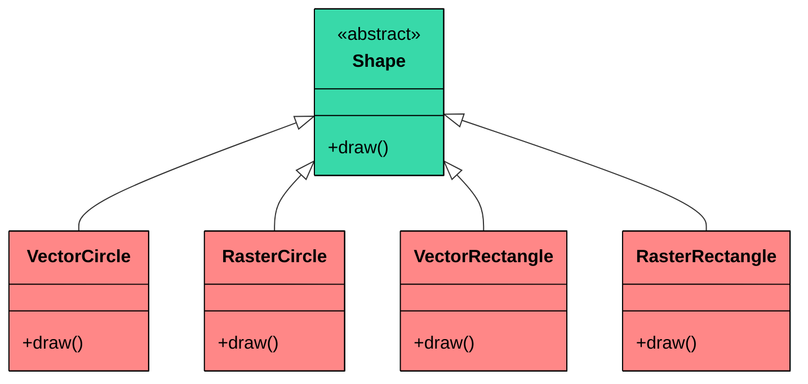
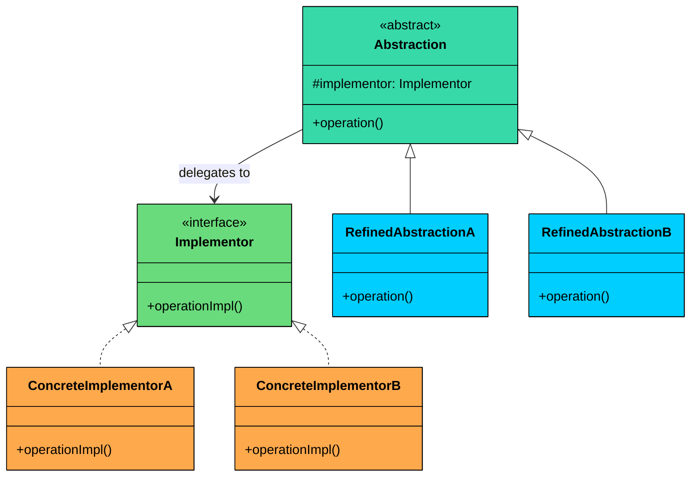
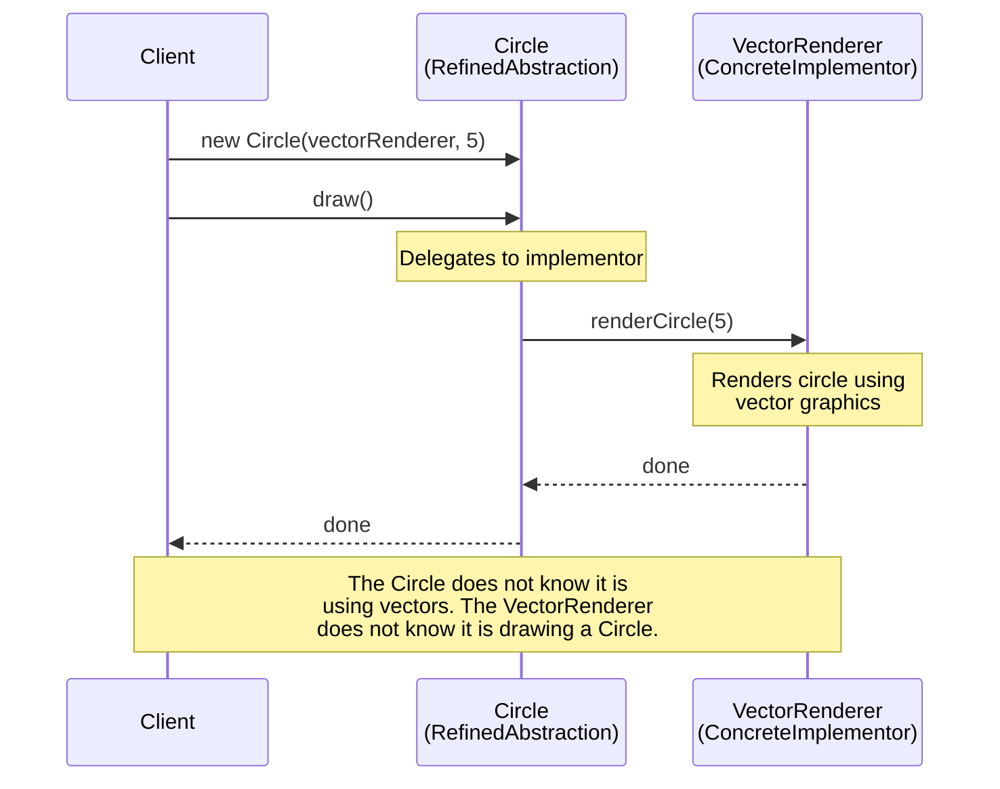
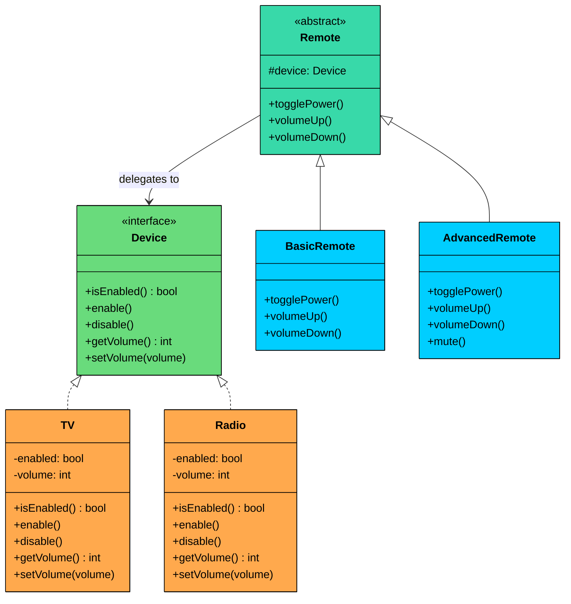

import React from 'react';
import CodeBlock from '../../../../components/ui/CodeBlock';
import Callout from '../../../../components/ui/Callout';

<div className="article-header">
  <div className="breadcrumb">
    <a href="/">Curated Notes</a>
    <span className="breadcrumb-separator">›</span>
    <span className="breadcrumb-current">Bridge Design Pattern</span>
  </div>
  <h1>Bridge Design Pattern</h1>
  <p style={{ color: 'var(--text-muted)', fontSize: '1.1rem', marginBottom: '16px', lineHeight: '1.6' }}>
    Master the essentials of Bridge Design Pattern in this curated guide.
  </p>
  <div className="meta-info">
    <span className="meta-item">
      <svg width="14" height="14" viewBox="0 0 24 24" fill="none" stroke="currentColor" strokeWidth="2"><circle cx="12" cy="12" r="10"/><polyline points="12 6 12 12 16 14"/></svg>
      10 min read
    </span>
    <span className="difficulty-badge difficulty-badge--intermediate">Intermediate</span>
  </div>
</div>

<section className="content-section">


&gt; **DEFINITION**
&gt;
&gt; The **Bridge Design Pattern** is a **structural pattern** that lets you **decouple an abstraction from its implementation**, allowing the two to vary **independently**.


It’s particularly useful in situations where:

- You have classes that can be extended in **multiple orthogonal dimensions** (e.g., shape vs. rendering technology, UI control vs. platform).
- You want to avoid a deep inheritance hierarchy that **multiplies combinations** of features.
- You need to **combine multiple variations of behavior or implementation at runtime**.

The **Bridge Pattern** splits a class into two separate hierarchies:

- One for the **abstraction** (e.g., shape, UI control)
- One for the **implementation** (e.g., rendering engine, platform)

These two hierarchies are **"bridged"** via composition (not inheritance) allowing you to mix and match independently.

Let’s walk through a real-world example to see how we can apply the Bridge Pattern to build a system that is both **flexible and scalable**, without being buried under layers of rigid subclasses.

---

## 1. The Problem: Drawing Shapes

Imagine you're building a **cross-platform graphics library**. It supports rendering **shapes** like circles and rectangles using different rendering approaches:

- 🟢 **Vector rendering:** for scalable, resolution-independent output
- 🔵 **Raster rendering:** for pixel-based output

Now, you need to support:

- Drawing **different shapes** (e.g., `Circle`, `Rectangle`)
- Using **different renderers** (e.g., `VectorRenderer`, `RasterRenderer`)

#### Naive Implementation: Subclass for Every Combination

You might start by creating a class hierarchy that looks like this:


```java
abstract class Shape {
    public abstract void draw();
}

// Circle variants
class VectorCircle extends Shape {
    public void draw() {
        System.out.println("Drawing Circle as VECTORS");
    }
}

class RasterCircle extends Shape {
    public void draw() {
        System.out.println("Drawing Circle as PIXELS");
    }
}

// Rectangle variants
class VectorRectangle extends Shape {
    public void draw() {
        System.out.println("Drawing Rectangle as VECTORS");
    }
}

class RasterRectangle extends Shape {
    public void draw() {
        System.out.println("Drawing Rectangle as PIXELS");
    }
}
```

```python
from abc import ABC, abstractmethod

class Shape(ABC):
    @abstractmethod
    def draw(self):
        pass

## Circle variants
class VectorCircle(Shape):
    def draw(self):
        print("Drawing Circle as VECTORS")

class RasterCircle(Shape):
    def draw(self):
        print("Drawing Circle as PIXELS")

## Rectangle variants
class VectorRectangle(Shape):
    def draw(self):
        print("Drawing Rectangle as VECTORS")

class RasterRectangle(Shape):
    def draw(self):
        print("Drawing Rectangle as PIXELS")
```

```cpp
#include <iostream>
using namespace std;

class Shape {
public:
    virtual ~Shape() {}
    virtual void draw() = 0;
};

// Circle variants
class VectorCircle : public Shape {
public:
    void draw() override {
        cout << "Drawing Circle as VECTORS" << endl;
    }
};

class RasterCircle : public Shape {
public:
    void draw() override {
        cout << "Drawing Circle as PIXELS" << endl;
    }
};

// Rectangle variants
class VectorRectangle : public Shape {
public:
    void draw() override {
        cout << "Drawing Rectangle as VECTORS" << endl;
    }
};

class RasterRectangle : public Shape {
public:
    void draw() override {
        cout << "Drawing Rectangle as PIXELS" << endl;
    }
};
```

```go
type Shape interface {
	Draw()
}

// Circle variants
type VectorCircle struct{}

func (VectorCircle) Draw() {
	println("Drawing Circle as VECTORS")
}

type RasterCircle struct{}

func (RasterCircle) Draw() {
	println("Drawing Circle as PIXELS")
}

// Rectangle variants
type VectorRectangle struct{}

func (VectorRectangle) Draw() {
	println("Drawing Rectangle as VECTORS")
}

type RasterRectangle struct{}

func (RasterRectangle) Draw() {
	println("Drawing Rectangle as PIXELS")
}
```

```csharp
abstract class Shape
{
    public abstract void Draw();
}

// Circle variants
class VectorCircle : Shape
{
    public override void Draw()
    {
        Console.WriteLine("Drawing Circle as VECTORS");
    }
}

class RasterCircle : Shape
{
    public override void Draw()
    {
        Console.WriteLine("Drawing Circle as PIXELS");
    }
}

// Rectangle variants
class VectorRectangle : Shape
{
    public override void Draw()
    {
        Console.WriteLine("Drawing Rectangle as VECTORS");
    }
}

class RasterRectangle : Shape
{
    public override void Draw()
    {
        Console.WriteLine("Drawing Rectangle as PIXELS");
    }
}
```

```typescript
abstract class Shape {
    public abstract draw(): void;
}

// Circle variants
class VectorCircle extends Shape {
    public draw(): void {
        console.log("Drawing Circle as VECTORS");
    }
}

class RasterCircle extends Shape {
    public draw(): void {
        console.log("Drawing Circle as PIXELS");
    }
}

// Rectangle variants
class VectorRectangle extends Shape {
    public draw(): void {
        console.log("Drawing Rectangle as VECTORS");
    }
}

class RasterRectangle extends Shape {
    public draw(): void {
        console.log("Drawing Rectangle as PIXELS");
    }
}
```


Here is what this class hierarchy looks like:





Every red node is a class that fuses two concerns: shape identity and rendering strategy. This is only 2 shapes and 2 renderers. The problem compounds quickly.

#### Why This Quickly Breaks Down

#### 1. Class Explosion

Every new combination of shape and rendering method requires a **new subclass**:

- 2 shapes × 2 renderers = 4 classes
- Add a third renderer (e.g., OpenGL)? Now you need 6 classes
- Add more shapes (e.g., triangle, ellipse)? The combinations multiply

This makes the class hierarchy **bloated and rigid**.

#### 2. Tight Coupling

Each class ties together shape logic and rendering logic. You cannot reuse rendering behavior independently of the shape. They are intertwined in every subclass.

#### 3. Violates Open/Closed Principle

If you want to support a **new rendering engine**, you must modify or recreate every shape for that renderer.

#### What We Really Need

We need a solution that:

- Separates the **abstraction** (`Shape`) from its **implementation** (`Renderer`)
- Allows new renderers to be added without touching shape classes
- Enables new shapes to be added without modifying or duplicating renderer logic
- Keeps the system scalable, extensible, and composable

This is exactly where the **Bridge Pattern** comes in.

---

## 2. What is the Bridge Pattern

The **Bridge Design Pattern** lets you **split a class into two separate hierarchies: **one for the **abstraction** and another for the **implementation,** so that they can evolve independently.

Two characteristics define the pattern:

1. **Independent variation:** The abstraction hierarchy (shapes) and the implementation hierarchy (renderers) can grow without affecting each other. Adding a new shape does not require touching any renderer. Adding a new renderer does not require touching any shape.
2. **Composition over inheritance:** The abstraction holds a reference to an implementor object and delegates work to it at runtime, rather than inheriting implementation behavior. This keeps both hierarchies shallow and flexible.


&gt; **Real-World Analogy**
&gt;
&gt; Think of a TV remote control and the TV itself. The remote is the abstraction: it has buttons for power, volume, and channel. The TV is the implementation: it contains the circuits that actually change volume, switch channels, and toggle power. You can swap remotes without changing the TV, and you can swap TVs without changing the remote. 
&gt;
&gt; A basic remote works with a Samsung TV. The same Samsung TV works with a universal remote that has extra buttons. The remote hierarchy and the TV hierarchy vary independently, connected only by the infrared signal between them. That signal is the bridge.


---

### Class Diagram





The structure involves four participants:

#### 1. Abstraction (e.g., `Shape)`

The high-level interface that clients interact with. It defines operations in terms that make sense to the domain (e.g., "draw a shape") and delegates the low-level work to an implementor.

In our shapes example, `Shape` is the Abstraction. It holds a reference to a `Renderer` and declares a `draw()` method. The Shape knows what to draw, the Renderer knows how to draw it.

#### 2. RefinedAbstraction (e.g., `Circle`, `Rectangle)`

A concrete subclass of Abstraction that adds domain-specific state or behavior. It still delegates to the implementor for low-level operations.

In our example, `Circle` adds a `radius` field and passes it to the renderer when drawing. `Rectangle` adds `width` and `height`. Neither knows or cares whether the renderer uses vectors or pixels.

#### 3. Implementor (e.g., `Renderer)`

The interface that defines the low-level operations that concrete implementations must provide. This is the "other side" of the bridge.

In our example, `Renderer` declares methods like `renderCircle(radius)` and `renderRectangle(width, height)`. These are primitive rendering operations that different engines implement differently.

#### 4. ConcreteImplementors (e.g., `VectorRenderer,RasterRenderer)`

A concrete class that implements the Implementor interface with a specific technology or strategy.

In our example, `VectorRenderer` outputs vector-based instructions and `RasterRenderer` outputs pixel-based instructions. Neither knows whether it is being called by a Circle or a Rectangle.

---

## 3. How It Works

Here is the Bridge workflow, step by step:





#### **Step 1: Create a concrete implementor**

The client (or a factory) instantiates a specific implementation, for example `VectorRenderer`. This object knows how to perform low-level rendering operations using vector graphics.

#### **Step 2: Pass it to the abstraction**

The client creates a `Circle` and passes the `VectorRenderer` into its constructor. The Circle stores this reference internally. It does not know or care what kind of renderer it received.

#### **Step 3: Call the high-level operation**

The client calls `circle.draw()`. This is a domain-level operation: "draw this shape." The client does not think about rendering engines.

#### **Step 4: Abstraction delegates to implementor**

Inside `draw()`, the Circle calls `renderer.renderCircle(radius)`. It translates the high-level operation ("draw me") into a low-level operation ("render a circle with this radius") and delegates to the implementor.

#### **Step 5: Implementor executes**

The `VectorRenderer` runs its own rendering logic, producing vector output. It has no idea it was called by a Circle. It just received a radius and did its job.

---

## 4. Implementing Bridge

Let us now implement the Bridge pattern to decouple our Shape abstraction from the Renderer implementation. This allows us to mix and match shapes and rendering engines freely, without subclass explosion.

#### Step 1: Define the Implementor Interface (`Renderer`)

This interface declares rendering operations for shapes. Concrete implementations will define how to render shapes using a particular technique (vector, raster, etc.).


```java
interface Renderer {
    void renderCircle(float radius);
    void renderRectangle(float width, float height);
}
```

```python
from abc import ABC, abstractmethod

class Renderer(ABC):
    @abstractmethod
    def render_circle(self, radius: float):
        pass

    @abstractmethod
    def render_rectangle(self, width: float, height: float):
        pass
```

```cpp
class Renderer {
public:
    virtual ~Renderer() {}
    virtual void renderCircle(float radius) = 0;
    virtual void renderRectangle(float width, float height) = 0;
};
```

```go
type Renderer interface {
	RenderCircle(radius float32)
	RenderRectangle(width, height float32)
}
```

```csharp
interface IRenderer
{
    void RenderCircle(float radius);
    void RenderRectangle(float width, float height);
}
```

```typescript
interface Renderer {
   renderCircle(radius: number): void;
   renderRectangle(width: number, height: number): void;
}
```


#### Step 2: Create Concrete Implementations of the Renderer

These classes provide the actual rendering logic for each engine.

#### 🟢 VectorRenderer


```java
class VectorRenderer implements Renderer {
    @Override
    public void renderCircle(float radius) {
        System.out.println("Drawing a circle of radius " + radius + " using VECTOR rendering.");
    }

    @Override
    public void renderRectangle(float width, float height) {
        System.out.println("Drawing a rectangle " + width + "x" + height + " using VECTOR rendering.");
    }
}
```

```python
class VectorRenderer(Renderer):
    def render_circle(self, radius):
        print(f"Drawing a circle of radius {radius} using VECTOR rendering.")
    
    def render_rectangle(self, width, height):
        print(f"Drawing a rectangle {width}x{height} using VECTOR rendering.")
```

```cpp
class VectorRenderer : public Renderer {
public:
    void renderCircle(float radius) override {
        cout << "Drawing a circle of radius " << radius << " using VECTOR rendering." << endl;
    }

    void renderRectangle(float width, float height) override {
        cout << "Drawing a rectangle " << width << "x" << height << " using VECTOR rendering." << endl;
    }
};
```

```go
type VectorRenderer struct{}

func (v *VectorRenderer) renderCircle(radius float32) {
	fmt.Println("Drawing a circle of radius", radius, "using VECTOR rendering.")
}

func (v *VectorRenderer) renderRectangle(width, height float32) {
	fmt.Println("Drawing a rectangle", width, "x", height, "using VECTOR rendering.")
}
```

```csharp
class VectorRenderer : IRenderer
{
    public void RenderCircle(float radius)
    {
        Console.WriteLine($"Drawing a circle of radius {radius} using VECTOR rendering.");
    }

    public void RenderRectangle(float width, float height)
    {
        Console.WriteLine($"Drawing a rectangle {width}x{height} using VECTOR rendering.");
    }
}
```

```typescript
class VectorRenderer implements Renderer {
   renderCircle(radius: number): void {
       console.log("Drawing a circle of radius " + radius + " using VECTOR rendering.");
   }

   renderRectangle(width: number, height: number): void {
       console.log("Drawing a rectangle " + width + "x" + height + " using VECTOR rendering.");
   }
}
```


#### 🔵 RasterRenderer


```java
class RasterRenderer implements Renderer {
    @Override
    public void renderCircle(float radius) {
        System.out.println("Drawing pixels for a circle of radius " + radius + " (RASTER).");
    }

    @Override
    public void renderRectangle(float width, float height) {
        System.out.println("Drawing pixels for a rectangle " + width + "x" + height + " (RASTER).");
    }
}
```

```python
class RasterRenderer(Renderer):
    def render_circle(self, radius):
        print(f"Drawing pixels for a circle of radius {radius} (RASTER).")
    
    def render_rectangle(self, width, height):
        print(f"Drawing pixels for a rectangle {width}x{height} (RASTER).")
```

```cpp
class RasterRenderer : public Renderer {
public:
    void renderCircle(float radius) override {
        cout << "Drawing pixels for a circle of radius " << radius << " (RASTER)." << endl;
    }

    void renderRectangle(float width, float height) override {
        cout << "Drawing pixels for a rectangle " << width << "x" << height << " (RASTER)." << endl;
    }
};
```

```go
type RasterRenderer struct{}

func (r *RasterRenderer) RenderCircle(radius float32) {
	fmt.Println("Drawing pixels for a circle of radius", radius, "(RASTER).")
}

func (r *RasterRenderer) RenderRectangle(width, height float32) {
	fmt.Println("Drawing pixels for a rectangle", width, "x", height, "(RASTER).")
}
```

```csharp
class RasterRenderer : IRenderer
{
    public void RenderCircle(float radius)
    {
        Console.WriteLine($"Drawing pixels for a circle of radius {radius} (RASTER).");
    }

    public void RenderRectangle(float width, float height)
    {
        Console.WriteLine($"Drawing pixels for a rectangle {width}x{height} (RASTER).");
    }
}
```

```typescript
class RasterRenderer implements Renderer {
   renderCircle(radius: number): void {
       console.log("Drawing pixels for a circle of radius " + radius + " (RASTER).");
   }

   renderRectangle(width: number, height: number): void {
       console.log("Drawing pixels for a rectangle " + width + "x" + height + " (RASTER).");
   }
}
```


#### Step 3: Define the Abstraction (`Shape`)

This class holds a reference to the renderer and declares a general `draw()` method. Each concrete shape will implement `draw()` by delegating to the renderer.


```java
abstract class Shape {
    protected Renderer renderer;

    public Shape(Renderer renderer) {
        this.renderer = renderer;
    }

    public abstract void draw();
}
```

```python
class Shape(ABC):
    def __init__(self, renderer):
        self.renderer = renderer
    
    @abstractmethod
    def draw(self):
        pass
```

```cpp
class Shape {
protected:
    Renderer* renderer;

public:
    Shape(Renderer* renderer) : renderer(renderer) {}
    virtual ~Shape() {}
    virtual void draw() = 0;
};
```

```go
type Shape struct {
	renderer Renderer
}

func NewShape(renderer Renderer) Shape {
	return Shape{renderer: renderer}
}

func (s Shape) draw() {
}
```

```csharp
abstract class Shape
{
    protected IRenderer renderer;

    public Shape(IRenderer renderer)
    {
        this.renderer = renderer;
    }

    public abstract void Draw();
}
```

```typescript
abstract class Shape {
   protected renderer: Renderer;

   constructor(renderer: Renderer) {
       this.renderer = renderer;
   }

   public abstract draw(): void;
}
```


#### Step 4: Create Concrete Shapes

Each shape delegates rendering to the renderer passed into it. The shape knows its own properties (radius, width, height), and the renderer knows how to draw primitives. Neither knows about the other's internals.

#### Circle


```java
class Circle extends Shape {
    private final float radius;

    public Circle(Renderer renderer, float radius) {
        super(renderer);
        this.radius = radius;
    }

    @Override
    public void draw() {
        renderer.renderCircle(radius);
    }
}
```

```python
class Circle(Shape):
    def __init__(self, renderer, radius):
        super().__init__(renderer)
        self.radius = radius
    
    def draw(self):
        self.renderer.render_circle(self.radius)
```

```cpp
class Circle : public Shape {
private:
    float radius;

public:
    Circle(Renderer* renderer, float radius) : Shape(renderer), radius(radius) {}

    void draw() override {
        renderer->renderCircle(radius);
    }
};
```

```go
type Circle struct {
	*Shape
	radius float32
}

func NewCircle(renderer Renderer, radius float32) *Circle {
	return &Circle{Shape: NewShape(renderer), radius: radius}
}

func (c *Circle) draw() {
	c.renderer.renderCircle(c.radius)
}
```

```csharp
class Circle : Shape
{
    private readonly float radius;

    public Circle(IRenderer renderer, float radius) : base(renderer)
    {
        this.radius = radius;
    }

    public override void Draw()
    {
        renderer.RenderCircle(radius);
    }
}
```

```typescript
class Circle extends Shape {
   private readonly radius: number;

   constructor(renderer: Renderer, radius: number) {
       super(renderer);
       this.radius = radius;
   }

   draw(): void {
       this.renderer.renderCircle(this.radius);
   }
}
```


#### Rectangle


```java
class Rectangle extends Shape {
    private final float width;
    private final float height;

    public Rectangle(Renderer renderer, float width, float height) {
        super(renderer);
        this.width = width;
        this.height = height;
    }

    @Override
    public void draw() {
        renderer.renderRectangle(width, height);
    }
}
```

```python
class Rectangle(Shape):
    def __init__(self, renderer, width, height):
        super().__init__(renderer)
        self.width = width
        self.height = height
    
    def draw(self):
        self.renderer.render_rectangle(self.width, self.height)
```

```cpp
class Rectangle : public Shape {
private:
    float width;
    float height;

public:
    Rectangle(Renderer* renderer, float width, float height) 
        : Shape(renderer), width(width), height(height) {}

    void draw() override {
        renderer->renderRectangle(width, height);
    }
};
```

```go
type Rectangle struct {
	Shape
	width  float64
	height float64
}

func NewRectangle(renderer Renderer, width, height float64) *Rectangle {
	return &Rectangle{
		Shape:  NewShape(renderer),
		width:  width,
		height: height,
	}
}

func (r *Rectangle) Draw() {
	r.renderer.RenderRectangle(r.width, r.height)
}
```

```csharp
class Rectangle : Shape
{
    private readonly float width;
    private readonly float height;

    public Rectangle(IRenderer renderer, float width, float height) : base(renderer)
    {
        this.width = width;
        this.height = height;
    }

    public override void Draw()
    {
        renderer.RenderRectangle(width, height);
    }
}
```

```typescript
class Rectangle extends Shape {
   private readonly width: number;
   private readonly height: number;

   constructor(renderer: Renderer, width: number, height: number) {
       super(renderer);
       this.width = width;
       this.height = height;
   }

   draw(): void {
       this.renderer.renderRectangle(this.width, this.height);
   }
}
```


#### Step 5: Client Code

Now we can freely combine shapes and rendering strategies at runtime, without creating a new class for each combination.


```java
public class BridgeDemo {
    public static void main(String[] args) {
        Renderer vector = new VectorRenderer();
        Renderer raster = new RasterRenderer();

        Shape circle1 = new Circle(vector, 5);
        Shape circle2 = new Circle(raster, 5);

        Shape rectangle1 = new Rectangle(vector, 10, 4);
        Shape rectangle2 = new Rectangle(raster, 10, 4);

        circle1.draw();     // Vector
        circle2.draw();     // Raster
        rectangle1.draw();  // Vector
        rectangle2.draw();  // Raster
    }
}
```

```python
def bridge_demo():
    vector = VectorRenderer()
    raster = RasterRenderer()
    
    circle1 = Circle(vector, 5)
    circle2 = Circle(raster, 5)
    
    rectangle1 = Rectangle(vector, 10, 4)
    rectangle2 = Rectangle(raster, 10, 4)
    
    circle1.draw()     # Vector
    circle2.draw()     # Raster
    rectangle1.draw()  # Vector
    rectangle2.draw()  # Raster

## Example usage
if __name__ == "__main__":
    bridge_demo()
```

```cpp
int main() {
    VectorRenderer vector;
    RasterRenderer raster;

    Circle circle1(&vector, 5);
    Circle circle2(&raster, 5);

    Rectangle rectangle1(&vector, 10, 4);
    Rectangle rectangle2(&raster, 10, 4);

    circle1.draw();     // Vector
    circle2.draw();     // Raster
    rectangle1.draw();  // Vector
    rectangle2.draw();  // Raster

    return 0;
}
```

```go
func bridgeDemo() {
	vector := &VectorRenderer{}
	raster := &RasterRenderer{}

	circle1 := NewCircle(vector, 5)
	circle2 := NewCircle(raster, 5)

	rectangle1 := NewRectangle(vector, 10, 4)
	rectangle2 := NewRectangle(raster, 10, 4)

	circle1.Draw()    // Vector
	circle2.Draw()    // Raster
	rectangle1.Draw() // Vector
	rectangle2.Draw() // Raster
}
```

```csharp
public class BridgeDemo
{
    public static void Main(string[] args)
    {
        IRenderer vector = new VectorRenderer();
        IRenderer raster = new RasterRenderer();

        ShapeBridge circle1 = new Circle(vector, 5);
        ShapeBridge circle2 = new Circle(raster, 5);

        ShapeBridge rectangle1 = new Rectangle(vector, 10, 4);
        ShapeBridge rectangle2 = new Rectangle(raster, 10, 4);

        circle1.Draw();     // Vector
        circle2.Draw();     // Raster
        rectangle1.Draw();  // Vector
        rectangle2.Draw();  // Raster
    }
}
```

```typescript
class BridgeDemo {
   static main(): void {
       const vector: Renderer = new VectorRenderer();
       const raster: Renderer = new RasterRenderer();

       const circle1: Shape = new Circle(vector, 5);
       const circle2: Shape = new Circle(raster, 5);

       const rectangle1: Shape = new Rectangle(vector, 10, 4);
       const rectangle2: Shape = new Rectangle(raster, 10, 4);

       circle1.draw();     // Vector
       circle2.draw();     // Raster
       rectangle1.draw();  // Vector
       rectangle2.draw();  // Raster
   }
}
```


#### **Expected Output:**


```plaintext
Drawing a circle of radius 5.0 using VECTOR rendering.
Drawing pixels for a circle of radius 5.0 (RASTER).
Drawing a rectangle 10.0x4.0 using VECTOR rendering.
Drawing pixels for a rectangle 10.0x4.0 (RASTER).
```


#### What We Achieved

- **Decoupled abstractions from implementations: **Shapes and renderers evolve independently
- **Open/Closed compliance: **You can add new renderers or shapes without modifying existing ones
- **No class explosion: **Avoided the need for every shape-renderer subclass
- **Runtime flexibility: **Dynamically switch renderers based on user/device context
- **Clean, extensible design: **Each class has a single responsibility and can be composed as needed

---

## 5. Practical Example: Remote Control and Devices

To make sure Bridge clicks beyond the shapes example, let us build a completely different system: remote controls and electronic devices. The abstraction is the remote (basic remote, advanced remote), and the implementation is the device (TV, radio).

A basic remote can toggle power and adjust volume. An advanced remote adds a mute button. Both remotes work with any device.





The Device interface is the Implementor. TV and Radio are ConcreteImplementors. Remote is the Abstraction. BasicRemote and AdvancedRemote are RefinedAbstractions. The bridge is the reference from Remote to Device.

#### Implementation


```java
// Implementor
interface Device {
    boolean isEnabled();
    void enable();
    void disable();
    int getVolume();
    void setVolume(int volume);
}

// ConcreteImplementor: TV
class TV implements Device {
    private boolean enabled = false;
    private int volume = 30;

    @Override
    public boolean isEnabled() { return enabled; }

    @Override
    public void enable() {
        enabled = true;
        System.out.println("TV: Turned ON");
    }

    @Override
    public void disable() {
        enabled = false;
        System.out.println("TV: Turned OFF");
    }

    @Override
    public int getVolume() { return volume; }

    @Override
    public void setVolume(int volume) {
        this.volume = Math.max(0, Math.min(100, volume));
        System.out.println("TV: Volume set to " + this.volume);
    }
}

// ConcreteImplementor: Radio
class Radio implements Device {
    private boolean enabled = false;
    private int volume = 20;

    @Override
    public boolean isEnabled() { return enabled; }

    @Override
    public void enable() {
        enabled = true;
        System.out.println("Radio: Turned ON");
    }

    @Override
    public void disable() {
        enabled = false;
        System.out.println("Radio: Turned OFF");
    }

    @Override
    public int getVolume() { return volume; }

    @Override
    public void setVolume(int volume) {
        this.volume = Math.max(0, Math.min(100, volume));
        System.out.println("Radio: Volume set to " + this.volume);
    }
}

// Abstraction
abstract class Remote {
    protected Device device;

    public Remote(Device device) {
        this.device = device;
    }

    public void togglePower() {
        if (device.isEnabled()) {
            device.disable();
        } else {
            device.enable();
        }
    }

    public void volumeUp() {
        device.setVolume(device.getVolume() + 10);
    }

    public void volumeDown() {
        device.setVolume(device.getVolume() - 10);
    }
}

// RefinedAbstraction: BasicRemote
class BasicRemote extends Remote {
    public BasicRemote(Device device) {
        super(device);
    }
}

// RefinedAbstraction: AdvancedRemote
class AdvancedRemote extends Remote {
    public AdvancedRemote(Device device) {
        super(device);
    }

    public void mute() {
        device.setVolume(0);
        System.out.println("AdvancedRemote: Muted");
    }
}

public class RemoteDemo {
    public static void main(String[] args) {
        System.out.println("--- Basic Remote with TV ---");
        Device tv = new TV();
        Remote basicRemote = new BasicRemote(tv);
        basicRemote.togglePower();
        basicRemote.volumeUp();
        basicRemote.volumeUp();
        basicRemote.volumeDown();

        System.out.println("\n--- Advanced Remote with Radio ---");
        Device radio = new Radio();
        AdvancedRemote advancedRemote = new AdvancedRemote(radio);
        advancedRemote.togglePower();
        advancedRemote.volumeUp();
        advancedRemote.mute();

        System.out.println("\n--- Advanced Remote with TV ---");
        AdvancedRemote tvAdvanced = new AdvancedRemote(tv);
        tvAdvanced.volumeUp();
        tvAdvanced.mute();
    }
}
```

```python
from abc import ABC, abstractmethod

## Implementor
class Device(ABC):
    @abstractmethod
    def is_enabled(self) -> bool:
        pass

    @abstractmethod
    def enable(self):
        pass

    @abstractmethod
    def disable(self):
        pass

    @abstractmethod
    def get_volume(self) -> int:
        pass

    @abstractmethod
    def set_volume(self, volume: int):
        pass

## ConcreteImplementor: TV
class TV(Device):
    def __init__(self):
        self._enabled = False
        self._volume = 30

    def is_enabled(self) -> bool:
        return self._enabled

    def enable(self):
        self._enabled = True
        print("TV: Turned ON")

    def disable(self):
        self._enabled = False
        print("TV: Turned OFF")

    def get_volume(self) -> int:
        return self._volume

    def set_volume(self, volume: int):
        self._volume = max(0, min(100, volume))
        print(f"TV: Volume set to {self._volume}")

## ConcreteImplementor: Radio
class Radio(Device):
    def __init__(self):
        self._enabled = False
        self._volume = 20

    def is_enabled(self) -> bool:
        return self._enabled

    def enable(self):
        self._enabled = True
        print("Radio: Turned ON")

    def disable(self):
        self._enabled = False
        print("Radio: Turned OFF")

    def get_volume(self) -> int:
        return self._volume

    def set_volume(self, volume: int):
        self._volume = max(0, min(100, volume))
        print(f"Radio: Volume set to {self._volume}")

## Abstraction
class Remote:
    def __init__(self, device: Device):
        self.device = device

    def toggle_power(self):
        if self.device.is_enabled():
            self.device.disable()
        else:
            self.device.enable()

    def volume_up(self):
        self.device.set_volume(self.device.get_volume() + 10)

    def volume_down(self):
        self.device.set_volume(self.device.get_volume() - 10)

## RefinedAbstraction: BasicRemote
class BasicRemote(Remote):
    def __init__(self, device: Device):
        super().__init__(device)

## RefinedAbstraction: AdvancedRemote
class AdvancedRemote(Remote):
    def __init__(self, device: Device):
        super().__init__(device)

    def mute(self):
        self.device.set_volume(0)
        print("AdvancedRemote: Muted")
		
def main():
    print("--- Basic Remote with TV ---")
    tv = TV()
    basic_remote = BasicRemote(tv)
    basic_remote.toggle_power()
    basic_remote.volume_up()
    basic_remote.volume_up()
    basic_remote.volume_down()

    print("\n--- Advanced Remote with Radio ---")
    radio = Radio()
    advanced_remote = AdvancedRemote(radio)
    advanced_remote.toggle_power()
    advanced_remote.volume_up()
    advanced_remote.mute()

    print("\n--- Advanced Remote with TV ---")
    tv_advanced = AdvancedRemote(tv)
    tv_advanced.volume_up()
    tv_advanced.mute()

if __name__ == "__main__":
    main()		
```

```cpp
#include <iostream>
#include <algorithm>
using namespace std;

// Implementor
class Device {
public:
    virtual ~Device() {}
    virtual bool isEnabled() = 0;
    virtual void enable() = 0;
    virtual void disable() = 0;
    virtual int getVolume() = 0;
    virtual void setVolume(int volume) = 0;
};

// ConcreteImplementor: TV
class TV : public Device {
private:
    bool enabled = false;
    int volume = 30;

public:
    bool isEnabled() override { return enabled; }

    void enable() override {
        enabled = true;
        cout << "TV: Turned ON" << endl;
    }

    void disable() override {
        enabled = false;
        cout << "TV: Turned OFF" << endl;
    }

    int getVolume() override { return volume; }

    void setVolume(int vol) override {
        volume = max(0, min(100, vol));
        cout << "TV: Volume set to " << volume << endl;
    }
};

// ConcreteImplementor: Radio
class Radio : public Device {
private:
    bool enabled = false;
    int volume = 20;

public:
    bool isEnabled() override { return enabled; }

    void enable() override {
        enabled = true;
        cout << "Radio: Turned ON" << endl;
    }

    void disable() override {
        enabled = false;
        cout << "Radio: Turned OFF" << endl;
    }

    int getVolume() override { return volume; }

    void setVolume(int vol) override {
        volume = max(0, min(100, vol));
        cout << "Radio: Volume set to " << volume << endl;
    }
};

// Abstraction
class Remote {
protected:
    Device* device;

public:
    Remote(Device* device) : device(device) {}
    virtual ~Remote() {}

    void togglePower() {
        if (device->isEnabled()) {
            device->disable();
        } else {
            device->enable();
        }
    }

    void volumeUp() {
        device->setVolume(device->getVolume() + 10);
    }

    void volumeDown() {
        device->setVolume(device->getVolume() - 10);
    }
};

// RefinedAbstraction: BasicRemote
class BasicRemote : public Remote {
public:
    BasicRemote(Device* device) : Remote(device) {}
};

// RefinedAbstraction: AdvancedRemote
class AdvancedRemote : public Remote {
public:
    AdvancedRemote(Device* device) : Remote(device) {}

    void mute() {
        device->setVolume(0);
        cout << "AdvancedRemote: Muted" << endl;
    }
};

int main() {
    cout << "--- Basic Remote with TV ---" << endl;
    TV tv;
    BasicRemote basicRemote(&tv);
    basicRemote.togglePower();
    basicRemote.volumeUp();
    basicRemote.volumeUp();
    basicRemote.volumeDown();

    cout << "\n--- Advanced Remote with Radio ---" << endl;
    Radio radio;
    AdvancedRemote advancedRemote(&radio);
    advancedRemote.togglePower();
    advancedRemote.volumeUp();
    advancedRemote.mute();

    cout << "\n--- Advanced Remote with TV ---" << endl;
    AdvancedRemote tvAdvanced(&tv);
    tvAdvanced.volumeUp();
    tvAdvanced.mute();

    return 0;
}
```

```go
package main

import "fmt"

// Implementor
type Device interface {
	IsEnabled() bool
	Enable()
	Disable()
	GetVolume() int
	SetVolume(volume int)
}

// ConcreteImplementor: TV
type TV struct {
	enabled bool
	volume  int
}

func NewTV() *TV {
	return &TV{enabled: false, volume: 30}
}

func (t *TV) IsEnabled() bool { return t.enabled }

func (t *TV) Enable() {
	t.enabled = true
	fmt.Println("TV: Turned ON")
}

func (t *TV) Disable() {
	t.enabled = false
	fmt.Println("TV: Turned OFF")
}

func (t *TV) GetVolume() int { return t.volume }

func (t *TV) SetVolume(volume int) {
	if volume < 0 {
		volume = 0
	}
	if volume > 100 {
		volume = 100
	}
	t.volume = volume
	fmt.Println("TV: Volume set to", t.volume)
}

// ConcreteImplementor: Radio
type Radio struct {
	enabled bool
	volume  int
}

func NewRadio() *Radio {
	return &Radio{enabled: false, volume: 20}
}

func (r *Radio) IsEnabled() bool { return r.enabled }

func (r *Radio) Enable() {
	r.enabled = true
	fmt.Println("Radio: Turned ON")
}

func (r *Radio) Disable() {
	r.enabled = false
	fmt.Println("Radio: Turned OFF")
}

func (r *Radio) GetVolume() int { return r.volume }

func (r *Radio) SetVolume(volume int) {
	if volume < 0 {
		volume = 0
	}
	if volume > 100 {
		volume = 100
	}
	r.volume = volume
	fmt.Println("Radio: Volume set to", r.volume)
}

// Abstraction
type Remote struct {
	device Device
}

func NewRemote(device Device) *Remote {
	return &Remote{device: device}
}

func (r *Remote) TogglePower() {
	if r.device.IsEnabled() {
		r.device.Disable()
	} else {
		r.device.Enable()
	}
}

func (r *Remote) VolumeUp() {
	r.device.SetVolume(r.device.GetVolume() + 10)
}

func (r *Remote) VolumeDown() {
	r.device.SetVolume(r.device.GetVolume() - 10)
}

// RefinedAbstraction: BasicRemote
type BasicRemote struct {
	*Remote
}

func NewBasicRemote(device Device) *BasicRemote {
	return &BasicRemote{Remote: NewRemote(device)}
}

// RefinedAbstraction: AdvancedRemote
type AdvancedRemote struct {
	*Remote
}

func NewAdvancedRemote(device Device) *AdvancedRemote {
	return &AdvancedRemote{Remote: NewRemote(device)}
}

func (a *AdvancedRemote) Mute() {
	a.device.SetVolume(0)
	fmt.Println("AdvancedRemote: Muted")
}

func main() {
	fmt.Println("--- Basic Remote with TV ---")
	tv := NewTV()
	basicRemote := NewBasicRemote(tv)
	basicRemote.TogglePower()
	basicRemote.VolumeUp()
	basicRemote.VolumeUp()
	basicRemote.VolumeDown()

	fmt.Println("\n--- Advanced Remote with Radio ---")
	radio := NewRadio()
	advancedRemote := NewAdvancedRemote(radio)
	advancedRemote.TogglePower()
	advancedRemote.VolumeUp()
	advancedRemote.Mute()

	fmt.Println("\n--- Advanced Remote with TV ---")
	tvAdvanced := NewAdvancedRemote(tv)
	tvAdvanced.VolumeUp()
	tvAdvanced.Mute()
}
```

```csharp
using System;

// Implementor
interface IDevice
{
    bool IsEnabled();
    void Enable();
    void Disable();
    int GetVolume();
    void SetVolume(int volume);
}

// ConcreteImplementor: TV
class TV : IDevice
{
    private bool enabled = false;
    private int volume = 30;

    public bool IsEnabled() => enabled;

    public void Enable()
    {
        enabled = true;
        Console.WriteLine("TV: Turned ON");
    }

    public void Disable()
    {
        enabled = false;
        Console.WriteLine("TV: Turned OFF");
    }

    public int GetVolume() => volume;

    public void SetVolume(int vol)
    {
        volume = Math.Max(0, Math.Min(100, vol));
        Console.WriteLine($"TV: Volume set to {volume}");
    }
}

// ConcreteImplementor: Radio
class Radio : IDevice
{
    private bool enabled = false;
    private int volume = 20;

    public bool IsEnabled() => enabled;

    public void Enable()
    {
        enabled = true;
        Console.WriteLine("Radio: Turned ON");
    }

    public void Disable()
    {
        enabled = false;
        Console.WriteLine("Radio: Turned OFF");
    }

    public int GetVolume() => volume;

    public void SetVolume(int vol)
    {
        volume = Math.Max(0, Math.Min(100, vol));
        Console.WriteLine($"Radio: Volume set to {volume}");
    }
}

// Abstraction
abstract class Remote
{
    protected IDevice device;

    public Remote(IDevice device)
    {
        this.device = device;
    }

    public void TogglePower()
    {
        if (device.IsEnabled())
            device.Disable();
        else
            device.Enable();
    }

    public void VolumeUp()
    {
        device.SetVolume(device.GetVolume() + 10);
    }

    public void VolumeDown()
    {
        device.SetVolume(device.GetVolume() - 10);
    }
}

// RefinedAbstraction: BasicRemote
class BasicRemote : Remote
{
    public BasicRemote(IDevice device) : base(device) {}
}

// RefinedAbstraction: AdvancedRemote
class AdvancedRemote : Remote
{
    public AdvancedRemote(IDevice device) : base(device) {}

    public void Mute()
    {
        device.SetVolume(0);
        Console.WriteLine("AdvancedRemote: Muted");
    }
}

public class RemoteDemo
{
    public static void Main(string[] args)
    {
        Console.WriteLine("--- Basic Remote with TV ---");
        IDevice tv = new TV();
        Remote basicRemote = new BasicRemote(tv);
        basicRemote.TogglePower();
        basicRemote.VolumeUp();
        basicRemote.VolumeUp();
        basicRemote.VolumeDown();

        Console.WriteLine("\n--- Advanced Remote with Radio ---");
        IDevice radio = new Radio();
        var advancedRemote = new AdvancedRemote(radio);
        advancedRemote.TogglePower();
        advancedRemote.VolumeUp();
        advancedRemote.Mute();

        Console.WriteLine("\n--- Advanced Remote with TV ---");
        var tvAdvanced = new AdvancedRemote(tv);
        tvAdvanced.VolumeUp();
        tvAdvanced.Mute();
    }
}
```

```typescript
// Implementor
interface Device {
    isEnabled(): boolean;
    enable(): void;
    disable(): void;
    getVolume(): number;
    setVolume(volume: number): void;
}

// ConcreteImplementor: TV
class TV implements Device {
    private enabled = false;
    private volume = 30;

    isEnabled(): boolean {
        return this.enabled;
    }

    enable(): void {
        this.enabled = true;
        console.log("TV: Turned ON");
    }

    disable(): void {
        this.enabled = false;
        console.log("TV: Turned OFF");
    }

    getVolume(): number {
        return this.volume;
    }

    setVolume(volume: number): void {
        this.volume = Math.max(0, Math.min(100, volume));
        console.log(`TV: Volume set to ${this.volume}`);
    }
}

// ConcreteImplementor: Radio
class Radio implements Device {
    private enabled = false;
    private volume = 20;

    isEnabled(): boolean {
        return this.enabled;
    }

    enable(): void {
        this.enabled = true;
        console.log("Radio: Turned ON");
    }

    disable(): void {
        this.enabled = false;
        console.log("Radio: Turned OFF");
    }

    getVolume(): number {
        return this.volume;
    }

    setVolume(volume: number): void {
        this.volume = Math.max(0, Math.min(100, volume));
        console.log(`Radio: Volume set to ${this.volume}`);
    }
}

// Abstraction
abstract class Remote {
    protected device: Device;

    constructor(device: Device) {
        this.device = device;
    }

    togglePower(): void {
        if (this.device.isEnabled()) {
            this.device.disable();
        } else {
            this.device.enable();
        }
    }

    volumeUp(): void {
        this.device.setVolume(this.device.getVolume() + 10);
    }

    volumeDown(): void {
        this.device.setVolume(this.device.getVolume() - 10);
    }
}

// RefinedAbstraction: BasicRemote
class BasicRemote extends Remote {
    constructor(device: Device) {
        super(device);
    }
}

// RefinedAbstraction: AdvancedRemote
class AdvancedRemote extends Remote {
    constructor(device: Device) {
        super(device);
    }

    mute(): void {
        this.device.setVolume(0);
        console.log("AdvancedRemote: Muted");
    }
}

console.log("--- Basic Remote with TV ---");
const tv: Device = new TV();
const basicRemote: Remote = new BasicRemote(tv);
basicRemote.togglePower();
basicRemote.volumeUp();
basicRemote.volumeUp();
basicRemote.volumeDown();

console.log("\n--- Advanced Remote with Radio ---");
const radio: Device = new Radio();
const advancedRemote = new AdvancedRemote(radio);
advancedRemote.togglePower();
advancedRemote.volumeUp();
advancedRemote.mute();

console.log("\n--- Advanced Remote with TV ---");
const tvAdvanced = new AdvancedRemote(tv);
tvAdvanced.volumeUp();
tvAdvanced.mute();
```


Notice how the same TV object is used with both the basic remote and the advanced remote. The remote hierarchy and the device hierarchy vary independently. Adding a Speaker device means writing one new class. Adding a VoiceRemote means writing one new class. Neither side knows about the other.

</section>
