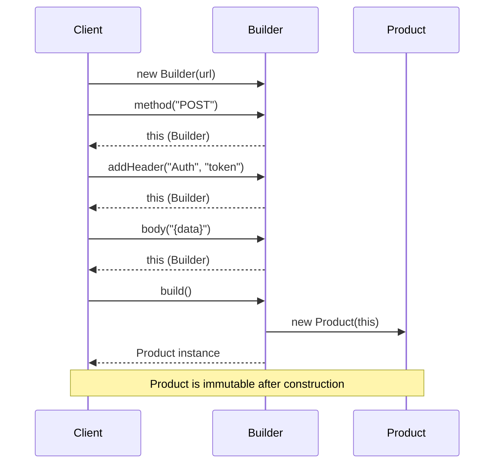
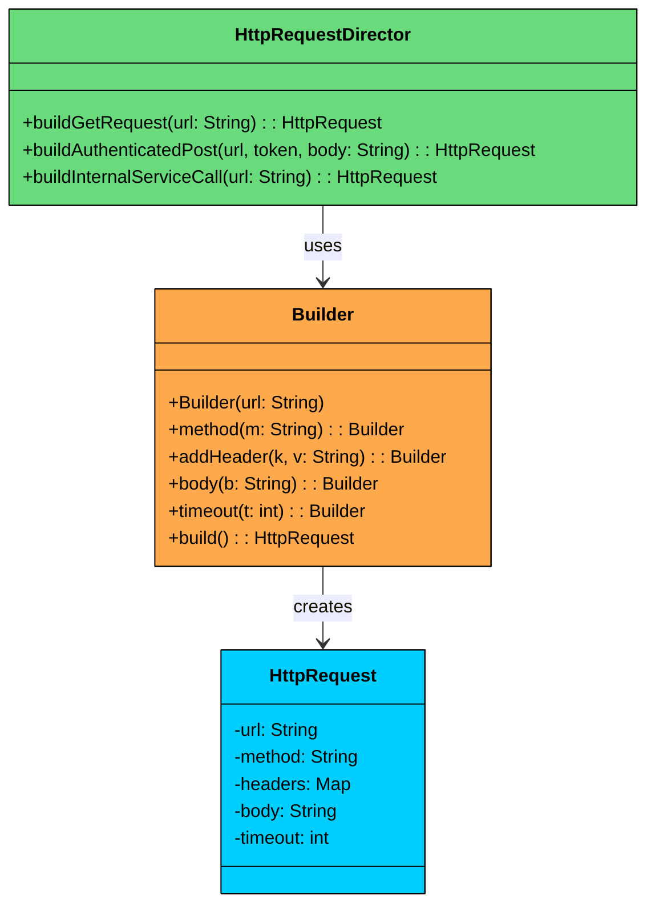

import React from 'react';
import CodeBlock from '../../../../components/ui/CodeBlock';
import Callout from '../../../../components/ui/Callout';

<div className="article-header">
  <div className="breadcrumb">
    <a href="/">Curated Notes</a>
    <span className="breadcrumb-separator">›</span>
    <span className="breadcrumb-current">Builder Design Pattern</span>
  </div>
  <h1>Builder Design Pattern</h1>
  <p style={{ color: 'var(--text-muted)', fontSize: '1.1rem', marginBottom: '16px', lineHeight: '1.6' }}>
    Master the essentials of Builder Design Pattern in this curated guide.
  </p>
  <div className="meta-info">
    <span className="meta-item">
      <svg width="14" height="14" viewBox="0 0 24 24" fill="none" stroke="currentColor" strokeWidth="2"><circle cx="12" cy="12" r="10"/><polyline points="12 6 12 12 16 14"/></svg>
      10 min read
    </span>
    <span className="difficulty-badge difficulty-badge--intermediate">Intermediate</span>
  </div>
</div>

<section className="content-section">


&gt; **DEFINITION**
&gt;
&gt; The **Builder Design Pattern** is a **creational pattern** that lets you construct complex objects step-by-step, separating the construction logic from the final representation.


The Builder Design Pattern is a creational pattern that lets you construct complex objects step-by-step, separating the construction logic from the final representation.

It’s particularly useful in situations where:

- An object has **many optional fields**, and most callers only need a subset.
- You want to **avoid telescoping constructors** or long parameter lists.
- The object must be assembled through **multiple steps**, possibly in a specific order.

Without a builder, developers often end up with overloaded constructors or a wide set of setters. For example, a `User` object might include fields like name, email, phone, address, and preferences. As the number of fields grows, the API becomes harder to use correctly, easier to misuse, and more difficult to maintain. 

The **Builder Pattern** addresses this by introducing a **dedicated builder** that owns the creation logic. Clients configure the builder step by step and then build the final object, which can remain immutable, validated, and consistently constructed.

Let’s walk through a real-world example to see how we can apply the Builder Pattern to make complex object creation **cleaner, safer, and more maintainable**.

---

## 1. The Problem: Building Complex HttpRequest Objects

Imagine you're building a system that needs to **configure and create HTTP requests**. 

Each `HttpRequest` can contain a mix of required and optional fields:

- **URL** (required)
- **HTTP Method** (e.g., GET, POST, PUT, defaults to GET)
- **Headers** (optional, multiple key-value pairs)
- **Query Parameters** (optional, multiple key-value pairs)
- **Request Body** (optional, typically for POST/PUT)
- **Timeout** (optional, default to 30 seconds)

At first glance, it seems manageable. But as the number of optional fields increases, so does the complexity of object construction.

#### The Naive Approach: Telescoping Constructors

A common approach is constructor overloading, often called the **telescoping constructor anti-pattern**. You define multiple constructors with increasing numbers of parameters:


```java
class HttpRequestTelescoping {
    private String url;
    private String method;
    private Map<String, String> headers;
    private Map<String, String> queryParams;
    private String body;
    private int timeout;

    public HttpRequestTelescoping(String url) {
        this(url, "GET");
    }

    public HttpRequestTelescoping(String url, String method) {
        this(url, method, null);
    }

    public HttpRequestTelescoping(String url, String method, Map<String, String> headers) {
        this(url, method, headers, null);
    }

    public HttpRequestTelescoping(String url, String method, Map<String, String> headers,
                                  Map<String, String> queryParams) {
        this(url, method, headers, queryParams, null);
    }

    public HttpRequestTelescoping(String url, String method, Map<String, String> headers,
                                  Map<String, String> queryParams, String body) {
        this(url, method, headers, queryParams, body, 30000);
    }

    public HttpRequestTelescoping(String url, String method, Map<String, String> headers,
                                  Map<String, String> queryParams, String body, int timeout) {
        this.url = url;
        this.method = method;
        this.headers = headers == null ? new HashMap<>() : headers;
        this.queryParams = queryParams == null ? new HashMap<>() : queryParams;
        this.body = body;
        this.timeout = timeout;

        System.out.println("HttpRequest Created: URL=" + url +
            ", Method=" + method +
            ", Headers=" + this.headers.size() +
            ", Params=" + this.queryParams.size() +
            ", Body=" + (body != null) +
            ", Timeout=" + timeout);
    }

    // Getters could be added here
}
```

```python
class HttpRequestTelescoping:
    def __init__(self, url, method="GET", headers=None, query_params=None, body=None, timeout=30000):
        self.url = url
        self.method = method
        self.headers = headers if headers is not None else {}
        self.query_params = query_params if query_params is not None else {}
        self.body = body
        self.timeout = timeout

        print(f"HttpRequest Created: URL={url}, "
              f"Method={method}, "
              f"Headers={len(self.headers)}, "
              f"Params={len(self.query_params)}, "
              f"Body={body is not None}, "
              f"Timeout={timeout}")

    # Optional: add getter methods if needed
```

```cpp
class HttpRequestTelescoping {
private:
    string url;
    string method;
    map<string, string> headers;
    map<string, string> queryParams;
    string body;
    int timeout;

public:
    HttpRequestTelescoping(const string& url)
        : HttpRequestTelescoping(url, "GET") {}

    HttpRequestTelescoping(const string& url, const string& method)
        : HttpRequestTelescoping(url, method, {}) {}

    HttpRequestTelescoping(const string& url, const string& method,
                           const map<string, string>& headers)
        : HttpRequestTelescoping(url, method, headers, {}) {}

    HttpRequestTelescoping(const string& url, const string& method,
                           const map<string, string>& headers,
                           const map<string, string>& queryParams)
        : HttpRequestTelescoping(url, method, headers, queryParams, "") {}

    HttpRequestTelescoping(const string& url, const string& method,
                           const map<string, string>& headers,
                           const map<string, string>& queryParams,
                           const string& body)
        : HttpRequestTelescoping(url, method, headers, queryParams, body, 30000) {}

    HttpRequestTelescoping(const string& url, const string& method,
                           const map<string, string>& headers,
                           const map<string, string>& queryParams,
                           const string& body, int timeout)
        : url(url), method(method), headers(headers),
          queryParams(queryParams), body(body), timeout(timeout) {
        cout << "HttpRequest Created: URL=" << url
             << ", Method=" << method
             << ", Headers=" << headers.size()
             << ", Params=" << queryParams.size()
             << ", Body=" << (!body.empty())
             << ", Timeout=" << timeout << endl;
    }

    // Optional: Getters can be added here
};
```

```go
type HttpRequestTelescoping struct {
	url         string
	method      string
	headers     map[string]string
	queryParams map[string]string
	body        string
	timeout     int
}

func NewHttpRequestTelescoping(url string) *HttpRequestTelescoping {
	return NewHttpRequestTelescopingWithMethod(url, "GET")
}

func NewHttpRequestTelescopingWithMethod(url, method string) *HttpRequestTelescoping {
	return NewHttpRequestTelescopingWithHeaders(url, method, nil)
}

func NewHttpRequestTelescopingWithHeaders(url, method string, headers map[string]string) *HttpRequestTelescoping {
	return NewHttpRequestTelescopingWithQueryParams(url, method, headers, nil)
}

func NewHttpRequestTelescopingWithQueryParams(url, method string, headers, queryParams map[string]string) *HttpRequestTelescoping {
	return NewHttpRequestTelescopingWithBody(url, method, headers, queryParams, "")
}

func NewHttpRequestTelescopingWithBody(url, method string, headers, queryParams map[string]string, body string) *HttpRequestTelescoping {
	return NewHttpRequestTelescopingWithTimeout(url, method, headers, queryParams, body, 30000)
}

func NewHttpRequestTelescopingWithTimeout(url, method string, headers, queryParams map[string]string, body string, timeout int) *HttpRequestTelescoping {
	if headers == nil {
		headers = make(map[string]string)
	}
	if queryParams == nil {
		queryParams = make(map[string]string)
	}
	req := &HttpRequestTelescoping{
		url:         url,
		method:      method,
		headers:     headers,
		queryParams: queryParams,
		body:        body,
		timeout:     timeout,
	}
	fmt.Println("HttpRequest Created: URL=" + url +
		", Method=" + method +
		", Headers=" + strconv.Itoa(len(req.headers)) +
		", Params=" + strconv.Itoa(len(req.queryParams)) +
		", Body=" + strconv.FormatBool(body != "") +
		", Timeout=" + strconv.Itoa(timeout))
	return req
}
```

```csharp
class HttpRequestTelescoping
{
    private readonly string url;
    private readonly string method;
    private readonly Dictionary<string, string> headers;
    private readonly Dictionary<string, string> queryParams;
    private readonly string body;
    private readonly int timeout;

    public HttpRequestTelescoping(string url)
        : this(url, "GET") { }

    public HttpRequestTelescoping(string url, string method)
        : this(url, method, null) { }

    public HttpRequestTelescoping(string url, string method, Dictionary<string, string> headers)
        : this(url, method, headers, null) { }

    public HttpRequestTelescoping(string url, string method, Dictionary<string, string> headers, Dictionary<string, string> queryParams)
        : this(url, method, headers, queryParams, null) { }

    public HttpRequestTelescoping(string url, string method, Dictionary<string, string> headers, Dictionary<string, string> queryParams, string body)
        : this(url, method, headers, queryParams, body, 30000) { }

    public HttpRequestTelescoping(string url, string method, Dictionary<string, string> headers, Dictionary<string, string> queryParams, string body, int timeout)
    {
        this.url = url;
        this.method = method;
        this.headers = headers ?? new Dictionary<string, string>();
        this.queryParams = queryParams ?? new Dictionary<string, string>();
        this.body = body;
        this.timeout = timeout;

        Console.WriteLine($"HttpRequest Created: URL={url}, Method={method}, " +
            $"Headers={this.headers.Count}, Params={this.queryParams.Count}, " +
            $"Body={body != null}, Timeout={timeout}");
    }
}
```

```typescript
class HttpRequestTelescoping {
    private url: string;
    private method: string;
    private headers: Map<string, string>;
    private queryParams: Map<string, string>;
    private body: string;
    private timeout: number;

    constructor(url: string);
    constructor(url: string, method: string);
    constructor(url: string, method: string, headers: Map<string, string>);
    constructor(url: string, method: string, headers: Map<string, string>, queryParams: Map<string, string>);
    constructor(url: string, method: string, headers: Map<string, string>, queryParams: Map<string, string>, body: string);
    constructor(url: string, method: string, headers: Map<string, string>, queryParams: Map<string, string>, body: string, timeout: number);
    constructor(
        url: string,
        method: string = "GET",
        headers: Map<string, string> | null = null,
        queryParams: Map<string, string> | null = null,
        body: string | null = null,
        timeout: number = 30000
    ) {
        this.url = url;
        this.method = method;
        this.headers = headers === null ? new Map() : headers;
        this.queryParams = queryParams === null ? new Map() : queryParams;
        this.body = body;
        this.timeout = timeout;

        console.log(`HttpRequest Created: URL=${url}, Method=${method}, Headers=${this.headers.size}, Params=${this.queryParams.size}, Body=${body !== null}, Timeout=${timeout}`);
    }

    // Getters could be added here
}
```


#### Example Client Code


```java
public class HttpAppTelescoping {
    public static void main(String[] args) {
        HttpRequestTelescoping req1 = new HttpRequestTelescoping("https://api.example.com/data");

        HttpRequestTelescoping req2 = new HttpRequestTelescoping(
            "https://api.example.com/submit",
            "POST",
            null,
            null,
            "{\"key\":\"value\"}"
        );

        HttpRequestTelescoping req3 = new HttpRequestTelescoping(
            "https://api.example.com/config",
            "PUT",
            Map.of("X-API-Key", "secret"),
            null,
            "config_data",
            5000
        );
    }
}
```

```python
if __name__ == "__main__":
    req1 = HttpRequestTelescoping("https://api.example.com/data")

    req2 = HttpRequestTelescoping(
        "https://api.example.com/submit",
        "POST",
        None,
        None,
        '{"key":"value"}'
    )

    req3 = HttpRequestTelescoping(
        "https://api.example.com/config",
        "PUT",
        {"X-API-Key": "secret"},
        None,
        "config_data",
        5000
    )
```

```cpp
int main() {
    HttpRequestTelescoping req1("https://api.example.com/data");

    HttpRequestTelescoping req2(
        "https://api.example.com/submit",
        "POST",
        {},
        {},
        "{\"key\":\"value\"}"
    );

    HttpRequestTelescoping req3(
        "https://api.example.com/config",
        "PUT",
        {{"X-API-Key", "secret"}},
        {},
        "config_data",
        5000
    );

    return 0;
}
```

```go
package main

func main() {
	req1 := HttpRequestTelescoping("https://api.example.com/data")

	req2 := HttpRequestTelescoping(
		"https://api.example.com/submit",
		"POST",
		nil,
		nil,
		"{\"key\":\"value\"}",
	)

	req3 := HttpRequestTelescoping(
		"https://api.example.com/config",
		"PUT",
		map[string]string{"X-API-Key": "secret"},
		nil,
		"config_data",
		5000,
	)

	_, _, _ = req1, req2, req3
}
```

```csharp
public class HttpAppTelescoping
{
    public static void Main()
    {
        var req1 = new HttpRequestTelescoping("https://api.example.com/data");

        var req2 = new HttpRequestTelescoping(
            "https://api.example.com/submit",
            "POST",
            null,
            null,
            "{\"key\":\"value\"}"
        );

        var req3 = new HttpRequestTelescoping(
            "https://api.example.com/config",
            "PUT",
            new Dictionary<string, string> { { "X-API-Key", "secret" } },
            null,
            "config_data",
            5000
        );
    }
}
```

```typescript
class HttpAppTelescoping {
    static main(): void {
        const req1 = new HttpRequestTelescoping("https://api.example.com/data");

        const req2 = new HttpRequestTelescoping(
            "https://api.example.com/submit",
            "POST",
            null,
            null,
            "{\"key\":\"value\"}"
        );

        const req3 = new HttpRequestTelescoping(
            "https://api.example.com/config",
            "PUT",
            new Map([["X-API-Key", "secret"]]),
            null,
            "config_data",
            5000
        );
    }
}

HttpAppTelescoping.main();
```


#### What’s Wrong with This Approach?

While it works functionally, this design quickly becomes **unwieldy and error-prone** as the object becomes more complex.

#### 1. Hard to Read and Write

Multiple parameters of the same type (e.g., `String`, `Map`) make it easy to accidentally swap arguments. Code is difficult to understand at a glance, especially when most parameters are `null`.

#### 2. Error-Prone

Clients must pass `null` for optional parameters they do not want to set, increasing the risk of bugs. One wrong position and you silently assign a value to the wrong field.

#### 3. Inflexible and Fragile

If you want to set parameter 5 but not 3 and 4, you are forced to pass `null` for 3 and 4. You must follow the exact parameter order, which hurts both readability and usability.

#### 4. Poor Scalability

Adding a new optional parameter requires adding or changing constructors, which may break existing code. Testing and documentation become increasingly difficult to maintain.

We need a more flexible, readable, and maintainable way to construct `HttpRequest` objects. This is exactly where the **Builder pattern** comes in.

---

## 2. What is the Builder Pattern

The Builder pattern separates the construction of a complex object from its representation, allowing the same construction process to create different configurations.

Two ideas define the pattern:

1. **Step-by-step construction:** Instead of passing everything to a constructor at once, you set each field through individual method calls. You only call the methods for the fields you need.
2. **Fluent interface:** Each setter method returns the builder itself, allowing you to chain calls into a single readable expression that ends with `build()`.

#### **Before: Telescoping Constructor**


```java
HttpRequest req = new HttpRequest(
    url,                 // url
    method,              // method
    headers,             // headers
    null,                // body
    null,                // queryParams
    30000                // timeoutMs
);
```

```python
req = HttpRequest(
    url,                 # url
    method,              # method
    headers,             # headers
    None,                # body
    None,                # query_params
    30000                # timeout_ms
)
```

```cpp
HttpRequest req(
    url,                 // url
    method,              // method
    headers,             // headers
    nullptr,             // body
    nullptr,             // queryParams
    30000                // timeoutMs
);
```

```go
req := HttpRequest{
	url:         url,       // url
	method:      method,    // method
	headers:     headers,   // headers
	body:        nil,       // body
	queryParams: nil,       // queryParams
	timeoutMs:   30000,     // timeoutMs
}
```

```csharp
var req = new HttpRequest(
    url,                 // url
    method,              // method
    headers,             // headers
    null,                // body
    null,                // queryParams
    30000                // timeoutMs
);
```

```typescript
const req = new HttpRequest(
  url,        // url
  method,     // method
  headers,    // headers
  null,       // body
  null,       // queryParams
  30000       // timeoutMs
);
```


#### **After: Builder Pattern**


```java
HttpRequest req = new HttpRequest.Builder(url)
    .method("POST")
    .addHeader("key", "val")
    .build();
```

```python
req = (HttpRequest.Builder(url)
       .method("POST")
       .add_header("key", "val")
       .build())
```

```cpp
HttpRequest req = HttpRequest::Builder(url)
    .method("POST")
    .addHeader("key", "val")
    .build();
```

```go
req := NewHttpRequestBuilder(url).
	Method("POST").
	AddHeader("key", "val").
	Build()
```

```csharp
var req = new HttpRequest.Builder(url)
    .Method("POST")
    .AddHeader("key", "val")
    .Build();
```

```typescript
const req = new HttpRequest.Builder(url)
  .method("POST")
  .addHeader("key", "val")
  .build();
```


---

### Class Diagram

The Builder pattern involves four participants. In many real-world implementations, the **Director is optional** and is often skipped when using fluent builders.


#### Builder (e.g., `HttpRequestBuilder`)

- Exposes methods to configure the product step by step.
- Typically returns the builder itself from each method to enable fluent chaining.
- Often implemented as a static nested class inside the product class.

#### ConcreteBuilder (e.g., `StandardHttpRequestBuilder`)

- Implements the builder API (either via an interface or directly through fluent methods).
- Stores intermediate state for the object being constructed.
- Implements `build()` to validate inputs and produce the final product instance.

#### Product (e.g., `HttpRequest`)

- The complex object being constructed.
- Often immutable and created only through the builder.
- Commonly has a private constructor that copies state from the builder.

#### Director (Optional) (e.g., `HttpRequestDirector`)

- Coordinates the construction process by calling builder steps in a specific sequence.
- Useful when you want to encapsulate **standard configurations** or reusable construction sequences.
- Often omitted in fluent builder style, where the client effectively plays this role by chaining builder calls.

---

## 3. How It Works

The Builder workflow follows a simple four-step process:





#### **Step 1: Create the Builder**

The client creates a Builder, passing any required parameters to its constructor.

#### **Step 2: Configure Optional Fields**

The client calls setter methods on the Builder for each optional field it needs. Each method returns the Builder itself, enabling chaining. The order of these calls does not matter.

#### **Step 3: Build the Product**

The client calls `build()`. The Builder passes itself to the Product's private constructor, which copies the configured state into immutable fields.

#### **Step 4: Use the Product**

The client receives a fully constructed, immutable Product. The Builder can be discarded or reused to create a different configuration.

---

## 4. Implementing Builder

Now let's implement the Builder pattern for our HttpRequest example. We create the Product class with a private constructor and a static nested Builder class.

#### 1. Create the Product (HttpRequest) and Builder

We start by creating the `HttpRequest` class, the **product** we want to build. It has multiple fields (some required, some optional), and its constructor will be **private**, forcing clients to construct it via the builder.

The `builder` class will be defined as a **static nested class** within `HttpRequest`, and the constructor will accept an instance of that builder to initialize the fields.


```java
class HttpRequest {
    // Required
    private final String url;

    // Optional
    private final String method;
    private final Map<String, String> headers;
    private final Map<String, String> queryParams;
    private final String body;
    private final int timeout;

    // Private constructor - only the Builder can call this
    private HttpRequest(Builder builder) {
        this.url = builder.url;
        this.method = builder.method;
        this.headers = Collections.unmodifiableMap(new HashMap<>(builder.headers));
        this.queryParams = Collections.unmodifiableMap(new HashMap<>(builder.queryParams));
        this.body = builder.body;
        this.timeout = builder.timeout;
    }

    public String getUrl() { return url; }
    public String getMethod() { return method; }
    public Map<String, String> getHeaders() { return headers; }
    public Map<String, String> getQueryParams() { return queryParams; }
    public String getBody() { return body; }
    public int getTimeout() { return timeout; }

    @Override
    public String toString() {
        return "HttpRequest{url='" + url + "', method='" + method +
               "', headers=" + headers + ", queryParams=" + queryParams +
               ", body='" + body + "', timeout=" + timeout + "}";
    }

    // Static nested Builder class
    public static class Builder {
        private final String url; // required
        private String method = "GET";
        private Map<String, String> headers = new HashMap<>();
        private Map<String, String> queryParams = new HashMap<>();
        private String body;
        private int timeout = 30000;

        public Builder(String url) {
            this.url = url;
        }

        public Builder method(String method) {
            this.method = method;
            return this;
        }

        public Builder addHeader(String key, String value) {
            this.headers.put(key, value);
            return this;
        }

        public Builder addQueryParam(String key, String value) {
            this.queryParams.put(key, value);
            return this;
        }

        public Builder body(String body) {
            this.body = body;
            return this;
        }

        public Builder timeout(int timeout) {
            this.timeout = timeout;
            return this;
        }

        public HttpRequest build() {
            return new HttpRequest(this);
        }
    }
}
```

```python
class HttpRequest:
    def __init__(self, builder):
        self.url = builder._url
        self.method = builder._method
        self.headers = dict(builder._headers)  # defensive copy
        self.query_params = dict(builder._query_params)
        self.body = builder._body
        self.timeout = builder._timeout

    def __str__(self):
        return (f"HttpRequest(url='{self.url}', method='{self.method}', "
                f"headers={self.headers}, query_params={self.query_params}, "
                f"body='{self.body}', timeout={self.timeout})")

    class Builder:
        def __init__(self, url):
            self._url = url  # required
            self._method = "GET"
            self._headers = {}
            self._query_params = {}
            self._body = None
            self._timeout = 30000

        def method(self, method):
            self._method = method
            return self

        def add_header(self, key, value):
            self._headers[key] = value
            return self

        def add_query_param(self, key, value):
            self._query_params[key] = value
            return self

        def body(self, body):
            self._body = body
            return self

        def timeout(self, timeout):
            self._timeout = timeout
            return self

        def build(self):
            return HttpRequest(self)
```

```cpp
class HttpRequest {
private:
    string url;
    string method;
    map<string, string> headers;
    map<string, string> queryParams;
    string body;
    int timeout;

    // Private constructor
    HttpRequest(const string& url, const string& method,
                const map<string, string>& headers,
                const map<string, string>& queryParams,
                const string& body, int timeout)
        : url(url), method(method), headers(headers),
          queryParams(queryParams), body(body), timeout(timeout) {}

public:
    string getUrl() const {
        return url;
    }
    string getMethod() const {
        return method;
    }

    void print() const {
        cout << "HttpRequest{url='" << url << "', method='" << method
             << "', headers=" << headers.size()
             << ", queryParams=" << queryParams.size()
             << ", body='" << body << "', timeout=" << timeout << "}" << endl;
    }

    class Builder {
    private:
        string url;
        string method = "GET";
        map<string, string> headers;
        map<string, string> queryParams;
        string body;
        int timeout = 30000;

    public:
        explicit Builder(const string& url) : url(url) {}

        Builder& setMethod(const string& m) {
            method = m;
            return *this;
        }

        Builder& addHeader(const string& key, const string& value) {
            headers[key] = value;
            return *this;
        }

        Builder& addQueryParam(const string& key, const string& value) {
            queryParams[key] = value;
            return *this;
        }

        Builder& setBody(const string& b) {
            body = b;
            return *this;
        }

        Builder& setTimeout(int t) {
            timeout = t;
            return *this;
        }

        HttpRequest build() const {
            return HttpRequest(url, method, headers, queryParams, body, timeout);
        }
    };
};
```

```go
type HttpRequest struct {
	url         string
	method      string
	headers     map[string]string
	queryParams map[string]string
	body        string
	timeout     int
}

func (r *HttpRequest) Url() string { return r.url }
func (r *HttpRequest) Method() string { return r.method }
func (r *HttpRequest) Headers() map[string]string { return r.headers }
func (r *HttpRequest) QueryParams() map[string]string { return r.queryParams }
func (r *HttpRequest) Body() string { return r.body }
func (r *HttpRequest) Timeout() int { return r.timeout }

func (r *HttpRequest) String() string {
	return "HttpRequest{url='" + r.url + "', method='" + r.method +
		"', headers=" + fmt.Sprint(r.headers) + ", queryParams=" + fmt.Sprint(r.queryParams) +
		", body='" + r.body + "', timeout=" + fmt.Sprint(r.timeout) + "}"
}

type HttpRequestBuilder struct {
	url         string
	method      string
	headers     map[string]string
	queryParams map[string]string
	body        string
	timeout     int
}

func NewHttpRequestBuilder(url string) *HttpRequestBuilder {
	return &HttpRequestBuilder{
		url:         url,
		method:      "GET",
		headers:     map[string]string{},
		queryParams: map[string]string{},
		timeout:     30000,
	}
}

func (b *HttpRequestBuilder) Method(method string) *HttpRequestBuilder {
	b.method = method
	return b
}

func (b *HttpRequestBuilder) AddHeader(key, value string) *HttpRequestBuilder {
	b.headers[key] = value
	return b
}

func (b *HttpRequestBuilder) AddQueryParam(key, value string) *HttpRequestBuilder {
	b.queryParams[key] = value
	return b
}

func (b *HttpRequestBuilder) Body(body string) *HttpRequestBuilder {
	b.body = body
	return b
}

func (b *HttpRequestBuilder) Timeout(timeout int) *HttpRequestBuilder {
	b.timeout = timeout
	return b
}

func (b *HttpRequestBuilder) Build() HttpRequest {
	headers := make(map[string]string, len(b.headers))
	for k, v := range b.headers {
		headers[k] = v
	}
	queryParams := make(map[string]string, len(b.queryParams))
	for k, v := range b.queryParams {
		queryParams[k] = v
	}
	return HttpRequest{
		url:         b.url,
		method:      b.method,
		headers:     headers,
		queryParams: queryParams,
		body:        b.body,
		timeout:     b.timeout,
	}
}
```

```csharp
class HttpRequest
{
    public string Url { get; }
    public string Method { get; }
    public IReadOnlyDictionary<string, string> Headers { get; }
    public IReadOnlyDictionary<string, string> QueryParams { get; }
    public string Body { get; }
    public int Timeout { get; }

    // Private constructor
    private HttpRequest(Builder builder)
    {
        Url = builder.Url;
        Method = builder.Method;
        Headers = new Dictionary<string, string>(builder.Headers);
        QueryParams = new Dictionary<string, string>(builder.QueryParams);
        Body = builder.Body;
        Timeout = builder.Timeout;
    }

    public override string ToString()
    {
        return $"HttpRequest{{Url='{Url}', Method='{Method}', " +
               $"Headers={Headers.Count}, QueryParams={QueryParams.Count}, " +
               $"Body='{Body}', Timeout={Timeout}}}";
    }

    public class Builder
    {
        public string Url { get; }
        public string Method { get; private set; } = "GET";
        public Dictionary<string, string> Headers { get; } = new();
        public Dictionary<string, string> QueryParams { get; } = new();
        public string Body { get; private set; }
        public int Timeout { get; private set; } = 30000;

        public Builder(string url) {
            Url = url;
        }

        public Builder SetMethod(string method)
        {
            Method = method;
            return this;
        }

        public Builder AddHeader(string key, string value)
        {
            Headers[key] = value;
            return this;
        }

        public Builder AddQueryParam(string key, string value)
        {
            QueryParams[key] = value;
            return this;
        }

        public Builder SetBody(string body)
        {
            Body = body;
            return this;
        }

        public Builder SetTimeout(int timeout)
        {
            Timeout = timeout;
            return this;
        }

        public HttpRequest Build()
        {
            return new HttpRequest(this);
        }
    }
}
```

```typescript
class HttpRequest {
    private readonly url: string;
    private readonly method: string;
    private readonly headers: ReadonlyMap<string, string>;
    private readonly queryParams: ReadonlyMap<string, string>;
    private readonly body: string | null;
    private readonly timeout: number;

    // Private constructor
    private constructor(builder: HttpRequestBuilder) {
        this.url = builder.getUrl();
        this.method = builder.getMethod();
        this.headers = new Map(builder.getHeaders());
        this.queryParams = new Map(builder.getQueryParams());
        this.body = builder.getBody();
        this.timeout = builder.getTimeout();
    }

    toString(): string {
        return `HttpRequest{url='${this.url}', method='${this.method}', ` +
               `headers=${this.headers.size}, queryParams=${this.queryParams.size}, ` +
               `body='${this.body}', timeout=${this.timeout}}`;
    }

    static Builder = class HttpRequestBuilder {
        private url: string;
        private method: string = "GET";
        private headers: Map<string, string> = new Map();
        private queryParams: Map<string, string> = new Map();
        private body: string | null = null;
        private timeout: number = 30000;

        constructor(url: string) {
            this.url = url;
        }

        getUrl(): string {
            return this.url;
        }
        getMethod(): string {
            return this.method;
        }
        getHeaders(): Map<string, string> {
            return this.headers;
        }
        getQueryParams(): Map<string, string> {
            return this.queryParams;
        }
        getBody(): string | null {
            return this.body;
        }
        getTimeout(): number {
            return this.timeout;
        }

        setMethod(method: string): this {
            this.method = method;
            return this;
        }

        addHeader(key: string, value: string): this {
            this.headers.set(key, value);
            return this;
        }

        addQueryParam(key: string, value: string): this {
            this.queryParams.set(key, value);
            return this;
        }

        setBody(body: string): this {
            this.body = body;
            return this;
        }

        setTimeout(timeout: number): this {
            this.timeout = timeout;
            return this;
        }

        build(): HttpRequest {
            return new HttpRequest(this);
        }
    };
}
```


#### 2. Using the Builder from Client Code

Here is how clients construct different types of HTTP requests:


```java
public class Main {
    public static void main(String[] args) {
        // Simple GET request - just the URL
        HttpRequest get = new HttpRequest.Builder("https://api.example.com/users")
                .build();

        // POST with body and custom timeout
        HttpRequest post = new HttpRequest.Builder("https://api.example.com/users")
                .method("POST")
                .addHeader("Content-Type", "application/json")
                .body("{\"name\":\"Alice\",\"email\":\"alice@example.com\"}")
                .timeout(5000)
                .build();

        // Authenticated PUT with query parameters
        HttpRequest put = new HttpRequest.Builder("https://api.example.com/config")
                .method("PUT")
                .addHeader("Authorization", "Bearer token123")
                .addHeader("Content-Type", "application/json")
                .addQueryParam("env", "production")
                .addQueryParam("version", "2")
                .body("{\"feature_flag\":true}")
                .timeout(10000)
                .build();

        System.out.println(get);
        System.out.println(post);
        System.out.println(put);
    }
}
```

```python
if __name__ == "__main__":
    # Simple GET request
    get = HttpRequest.Builder("https://api.example.com/users") \
        .build()

    # POST with body and custom timeout
    post = HttpRequest.Builder("https://api.example.com/users") \
        .method("POST") \
        .add_header("Content-Type", "application/json") \
        .body('{"name":"Alice","email":"alice@example.com"}') \
        .timeout(5000) \
        .build()

    # Authenticated PUT with query parameters
    put = HttpRequest.Builder("https://api.example.com/config") \
        .method("PUT") \
        .add_header("Authorization", "Bearer token123") \
        .add_header("Content-Type", "application/json") \
        .add_query_param("env", "production") \
        .add_query_param("version", "2") \
        .body('{"feature_flag":true}') \
        .timeout(10000) \
        .build()

    print(get)
    print(post)
    print(put)
```

```cpp
int main() {
    // Simple GET request
    HttpRequest get = HttpRequest::Builder("https://api.example.com/users")
        .build();

    // POST with body and custom timeout
    HttpRequest post = HttpRequest::Builder("https://api.example.com/users")
        .setMethod("POST")
        .addHeader("Content-Type", "application/json")
        .setBody("{\"name\":\"Alice\",\"email\":\"alice@example.com\"}")
        .setTimeout(5000)
        .build();

    // Authenticated PUT with query parameters
    HttpRequest put = HttpRequest::Builder("https://api.example.com/config")
        .setMethod("PUT")
        .addHeader("Authorization", "Bearer token123")
        .addHeader("Content-Type", "application/json")
        .addQueryParam("env", "production")
        .addQueryParam("version", "2")
        .setBody("{\"feature_flag\":true}")
        .setTimeout(10000)
        .build();

    get.print();
    post.print();
    put.print();

    return 0;
}
```

```go
// Simple GET request
get := HttpRequestBuilder("https://api.example.com/users").Build()

// POST with body and custom timeout
post := HttpRequestBuilder("https://api.example.com/users").
	SetMethod("POST").
	AddHeader("Content-Type", "application/json").
	SetBody("{\"name\":\"Alice\",\"email\":\"alice@example.com\"}").
	SetTimeout(5000).
	Build()

// Authenticated PUT with query parameters
put := HttpRequestBuilder("https://api.example.com/config").
	SetMethod("PUT").
	AddHeader("Authorization", "Bearer token123").
	AddHeader("Content-Type", "application/json").
	AddQueryParam("env", "production").
	AddQueryParam("version", "2").
	SetBody("{\"feature_flag\":true}").
	SetTimeout(10000).
	Build()

fmt.Println(get)
fmt.Println(post)
fmt.Println(put)
```

```csharp
class Program
{
    static void Main()
    {
        // Simple GET request
        var get = new HttpRequest.Builder("https://api.example.com/users")
            .Build();

        // POST with body and custom timeout
        var post = new HttpRequest.Builder("https://api.example.com/users")
            .SetMethod("POST")
            .AddHeader("Content-Type", "application/json")
            .SetBody("{\"name\":\"Alice\",\"email\":\"alice@example.com\"}")
            .SetTimeout(5000)
            .Build();

        // Authenticated PUT with query parameters
        var put = new HttpRequest.Builder("https://api.example.com/config")
            .SetMethod("PUT")
            .AddHeader("Authorization", "Bearer token123")
            .AddHeader("Content-Type", "application/json")
            .AddQueryParam("env", "production")
            .AddQueryParam("version", "2")
            .SetBody("{\"feature_flag\":true}")
            .SetTimeout(10000)
            .Build();

        Console.WriteLine(get);
        Console.WriteLine(post);
        Console.WriteLine(put);
    }
}
```

```typescript
// Simple GET request
const get = new HttpRequest.Builder("https://api.example.com/users")
    .build();

// POST with body and custom timeout
const post = new HttpRequest.Builder("https://api.example.com/users")
    .setMethod("POST")
    .addHeader("Content-Type", "application/json")
    .setBody('{"name":"Alice","email":"alice@example.com"}')
    .setTimeout(5000)
    .build();

// Authenticated PUT with query parameters
const put = new HttpRequest.Builder("https://api.example.com/config")
    .setMethod("PUT")
    .addHeader("Authorization", "Bearer token123")
    .addHeader("Content-Type", "application/json")
    .addQueryParam("env", "production")
    .addQueryParam("version", "2")
    .setBody('{"feature_flag":true}')
    .setTimeout(10000)
    .build();

console.log(get.toString());
console.log(post.toString());
console.log(put.toString());
```


Compare this to the telescoping constructor version. Every field is named. No nulls. No positional guessing. You can set fields in any order, and it is immediately obvious what each request looks like.

#### What We Achieved

- **No telescoping constructors or **`null`** arguments.** Each field is set by name through a dedicated method.
- **Readable, self-documenting code.** The chain of method calls reads like a specification of the request.
- **Immutable products.** Once built, the HttpRequest cannot be modified. Thread-safe by design.
- **Easy to extend.** Adding a new optional field means adding one method to the Builder. No existing code breaks.
- **Flexible ordering.** Clients can call builder methods in any order. No positional coupling.

---

## 5. The Director Pattern

So far, the client has been calling builder methods directly. But what happens when multiple parts of your codebase need to create the same type of request? 

For example, every API call to your payment service needs the same authorization header, content type, and timeout. Duplicating that configuration across 20 call sites is a maintenance problem waiting to happen.

The Director solves this by encapsulating common construction sequences into named methods. Instead of every client knowing how to configure a builder, the Director provides pre-built recipes.





#### Director Implementation


```java
class HttpRequestDirector {

    public HttpRequest buildSimpleGet(String url) {
        return new HttpRequest.Builder(url)
                .method("GET")
                .timeout(30000)
                .build();
    }

    public HttpRequest buildAuthenticatedPost(String url, String token, String body) {
        return new HttpRequest.Builder(url)
                .method("POST")
                .addHeader("Authorization", "Bearer " + token)
                .addHeader("Content-Type", "application/json")
                .body(body)
                .timeout(10000)
                .build();
    }

    public HttpRequest buildInternalServiceCall(String url) {
        return new HttpRequest.Builder(url)
                .method("GET")
                .addHeader("X-Internal-Service", "true")
                .addHeader("X-Trace-Id", java.util.UUID.randomUUID().toString())
                .timeout(5000)
                .build();
    }
}

// Usage
public class Main {
    public static void main(String[] args) {
        HttpRequestDirector director = new HttpRequestDirector();

        HttpRequest get = director.buildSimpleGet("https://api.example.com/users");
        HttpRequest post = director.buildAuthenticatedPost(
                "https://api.example.com/orders", "token123", "{\"item\":\"book\"}");
        HttpRequest internal = director.buildInternalServiceCall(
                "https://internal.service/health");

        System.out.println(get);
        System.out.println(post);
        System.out.println(internal);
    }
}
```

```python
import uuid

class HttpRequestDirector:

    def build_simple_get(self, url):
        return HttpRequest.Builder(url) \
            .method("GET") \
            .timeout(30000) \
            .build()

    def build_authenticated_post(self, url, token, body):
        return HttpRequest.Builder(url) \
            .method("POST") \
            .add_header("Authorization", f"Bearer {token}") \
            .add_header("Content-Type", "application/json") \
            .body(body) \
            .timeout(10000) \
            .build()

    def build_internal_service_call(self, url):
        return HttpRequest.Builder(url) \
            .method("GET") \
            .add_header("X-Internal-Service", "true") \
            .add_header("X-Trace-Id", str(uuid.uuid4())) \
            .timeout(5000) \
            .build()

## Usage
if __name__ == "__main__":
    director = HttpRequestDirector()

    get = director.build_simple_get("https://api.example.com/users")
    post = director.build_authenticated_post(
        "https://api.example.com/orders", "token123", '{"item":"book"}')
    internal = director.build_internal_service_call(
        "https://internal.service/health")

    print(get)
    print(post)
    print(internal)
```

```cpp
class HttpRequestDirector {
public:
    HttpRequest buildSimpleGet(const string& url) {
        return HttpRequest::Builder(url)
            .setMethod("GET")
            .setTimeout(30000)
            .build();
    }

    HttpRequest buildAuthenticatedPost(const string& url,
            const string& token, const string& body) {
        return HttpRequest::Builder(url)
            .setMethod("POST")
            .addHeader("Authorization", "Bearer " + token)
            .addHeader("Content-Type", "application/json")
            .setBody(body)
            .setTimeout(10000)
            .build();
    }

    HttpRequest buildInternalServiceCall(const string& url) {
        return HttpRequest::Builder(url)
            .setMethod("GET")
            .addHeader("X-Internal-Service", "true")
            .setTimeout(5000)
            .build();
    }
};

// Usage
int main() {
    HttpRequestDirector director;

    auto get = director.buildSimpleGet("https://api.example.com/users");
    auto post = director.buildAuthenticatedPost(
        "https://api.example.com/orders", "token123", R"({"item":"book"})");
    auto internal = director.buildInternalServiceCall(
        "https://internal.service/health");

    get.print();
    post.print();
    internal.print();

    return 0;
}
```

```go
type HttpRequestDirector struct{}

func (d HttpRequestDirector) buildSimpleGet(url string) HttpRequest {
	return HttpRequestBuilder(url).
		method("GET").
		timeout(30000).
		build()
}

func (d HttpRequestDirector) buildAuthenticatedPost(url, token, body string) HttpRequest {
	return HttpRequestBuilder(url).
		method("POST").
		addHeader("Authorization", "Bearer "+token).
		addHeader("Content-Type", "application/json").
		body(body).
		timeout(10000).
		build()
}

func (d HttpRequestDirector) buildInternalServiceCall(url string) HttpRequest {
	return HttpRequestBuilder(url).
		method("GET").
		addHeader("X-Internal-Service", "true").
		addHeader("X-Trace-Id", uuid.New().String()).
		timeout(5000).
		build()
}
```

```csharp
class HttpRequestDirector
{
    public HttpRequest BuildSimpleGet(string url)
    {
        return new HttpRequest.Builder(url)
            .SetMethod("GET")
            .SetTimeout(30000)
            .Build();
    }

    public HttpRequest BuildAuthenticatedPost(string url, string token, string body)
    {
        return new HttpRequest.Builder(url)
            .SetMethod("POST")
            .AddHeader("Authorization", $"Bearer {token}")
            .AddHeader("Content-Type", "application/json")
            .SetBody(body)
            .SetTimeout(10000)
            .Build();
    }

    public HttpRequest BuildInternalServiceCall(string url)
    {
        return new HttpRequest.Builder(url)
            .SetMethod("GET")
            .AddHeader("X-Internal-Service", "true")
            .AddHeader("X-Trace-Id", Guid.NewGuid().ToString())
            .SetTimeout(5000)
            .Build();
    }
}

// Usage
class Program
{
    static void Main()
    {
        var director = new HttpRequestDirector();

        var get = director.BuildSimpleGet("https://api.example.com/users");
        var post = director.BuildAuthenticatedPost(
            "https://api.example.com/orders", "token123", "{\"item\":\"book\"}");
        var internalReq = director.BuildInternalServiceCall(
            "https://internal.service/health");

        Console.WriteLine(get);
        Console.WriteLine(post);
        Console.WriteLine(internalReq);
    }
}
```

```typescript
class HttpRequestDirector {

    buildSimpleGet(url: string): HttpRequest {
        return new HttpRequest.Builder(url)
            .setMethod("GET")
            .setTimeout(30000)
            .build();
    }

    buildAuthenticatedPost(url: string, token: string, body: string): HttpRequest {
        return new HttpRequest.Builder(url)
            .setMethod("POST")
            .addHeader("Authorization", `Bearer ${token}`)
            .addHeader("Content-Type", "application/json")
            .setBody(body)
            .setTimeout(10000)
            .build();
    }

    buildInternalServiceCall(url: string): HttpRequest {
        return new HttpRequest.Builder(url)
            .setMethod("GET")
            .addHeader("X-Internal-Service", "true")
            .setTimeout(5000)
            .build();
    }
}

// Usage
const director = new HttpRequestDirector();

const get = director.buildSimpleGet("https://api.example.com/users");
const post = director.buildAuthenticatedPost(
    "https://api.example.com/orders", "token123", '{"item":"book"}');
const internal = director.buildInternalServiceCall(
    "https://internal.service/health");

console.log(get.toString());
console.log(post.toString());
console.log(internal.toString());
```


#### When to Use a Director

The Director is optional, and in many codebases you will not need one. Here is when each approach makes sense:


| Approach | When to Use |
|----------|-------------|
| **Client uses Builder directly** | One-off configurations, simple cases, or when each call site has unique requirements |
| **Director** | Multiple call sites need the same configuration, you want named presets, or construction logic is complex enough to warrant encapsulation |


Think of the Director as a factory for common configurations. If you find yourself copy-pasting the same builder chain in three places, that is a signal to introduce a Director.

---

## 6. Practical Example: SQL QueryBuilder

A query builder that constructs SQL SELECT statements step-by-step. This is a common pattern in ORMs and database libraries.


```java
import java.util.ArrayList;
import java.util.Arrays;
import java.util.List;

class SqlQuery {
    private final String table;
    private final List<String> columns;
    private final List<String> conditions;
    private final String orderBy;
    private final String orderDirection;
    private final int limit;
    private final int offset;

    private SqlQuery(Builder builder) {
        this.table = builder.table;
        this.columns = List.copyOf(builder.columns);
        this.conditions = List.copyOf(builder.conditions);
        this.orderBy = builder.orderBy;
        this.orderDirection = builder.orderDirection;
        this.limit = builder.limit;
        this.offset = builder.offset;
    }

    public String toSql() {
        StringBuilder sql = new StringBuilder("SELECT ");
        sql.append(columns.isEmpty() ? "*" : String.join(", ", columns));
        sql.append(" FROM ").append(table);
        if (!conditions.isEmpty()) {
            sql.append(" WHERE ").append(String.join(" AND ", conditions));
        }
        if (orderBy != null) {
            sql.append(" ORDER BY ").append(orderBy).append(" ").append(orderDirection);
        }
        if (limit > 0) {
            sql.append(" LIMIT ").append(limit);
        }
        if (offset > 0) {
            sql.append(" OFFSET ").append(offset);
        }
        return sql.toString();
    }

    public static class Builder {
        private final String table;
        private List<String> columns = new ArrayList<>();
        private List<String> conditions = new ArrayList<>();
        private String orderBy;
        private String orderDirection = "ASC";
        private int limit;
        private int offset;

        public Builder(String table) {
            this.table = table;
        }

        public Builder select(String... cols) {
            this.columns.addAll(Arrays.asList(cols));
            return this;
        }

        public Builder where(String condition) {
            this.conditions.add(condition);
            return this;
        }

        public Builder orderBy(String column, String direction) {
            this.orderBy = column;
            this.orderDirection = direction;
            return this;
        }

        public Builder limit(int limit) {
            this.limit = limit;
            return this;
        }

        public Builder offset(int offset) {
            this.offset = offset;
            return this;
        }

        public SqlQuery build() {
            return new SqlQuery(this);
        }
    }
}

public class Main {
    public static void main(String[] args) {
        SqlQuery query1 = new SqlQuery.Builder("users")
                .select("name", "email")
                .where("age > 18")
                .where("active = true")
                .orderBy("name", "ASC")
                .limit(10)
                .build();

        SqlQuery query2 = new SqlQuery.Builder("orders")
                .select("id", "total", "created_at")
                .where("status = 'completed'")
                .where("total > 100")
                .orderBy("created_at", "DESC")
                .limit(20)
                .offset(40)
                .build();

        System.out.println(query1.toSql());
        System.out.println(query2.toSql());
    }
}
```

```python
class SqlQuery:
    def __init__(self, builder):
        self.table = builder._table
        self.columns = list(builder._columns)
        self.conditions = list(builder._conditions)
        self.order_by = builder._order_by
        self.order_direction = builder._order_direction
        self.limit_val = builder._limit
        self.offset_val = builder._offset

    def to_sql(self):
        cols = ", ".join(self.columns) if self.columns else "*"
        sql = f"SELECT {cols} FROM {self.table}"
        if self.conditions:
            sql += " WHERE " + " AND ".join(self.conditions)
        if self.order_by:
            sql += f" ORDER BY {self.order_by} {self.order_direction}"
        if self.limit_val > 0:
            sql += f" LIMIT {self.limit_val}"
        if self.offset_val > 0:
            sql += f" OFFSET {self.offset_val}"
        return sql

    class Builder:
        def __init__(self, table):
            self._table = table
            self._columns = []
            self._conditions = []
            self._order_by = None
            self._order_direction = "ASC"
            self._limit = 0
            self._offset = 0

        def select(self, *cols):
            self._columns.extend(cols)
            return self

        def where(self, condition):
            self._conditions.append(condition)
            return self

        def order_by(self, column, direction="ASC"):
            self._order_by = column
            self._order_direction = direction
            return self

        def limit(self, limit):
            self._limit = limit
            return self

        def offset(self, offset):
            self._offset = offset
            return self

        def build(self):
            return SqlQuery(self)

if __name__ == "__main__":
    query1 = SqlQuery.Builder("users") \
        .select("name", "email") \
        .where("age > 18") \
        .where("active = true") \
        .order_by("name", "ASC") \
        .limit(10) \
        .build()

    query2 = SqlQuery.Builder("orders") \
        .select("id", "total", "created_at") \
        .where("status = 'completed'") \
        .where("total > 100") \
        .order_by("created_at", "DESC") \
        .limit(20) \
        .offset(40) \
        .build()

    print(query1.to_sql())
    print(query2.to_sql())
```

```cpp
#include <string>
#include <vector>
#include <iostream>
#include <initializer_list>

using namespace std;

class SqlQuery {
private:
    string table;
    vector<string> columns;
    vector<string> conditions;
    string orderByCol;
    string orderDir;
    int limitVal;
    int offsetVal;

    SqlQuery(const string& table, const vector<string>& columns,
             const vector<string>& conditions, const string& orderByCol,
             const string& orderDir, int limitVal, int offsetVal)
        : table(table), columns(columns), conditions(conditions),
          orderByCol(orderByCol), orderDir(orderDir),
          limitVal(limitVal), offsetVal(offsetVal) {}

public:
    string toSql() const {
        string sql = "SELECT ";
        if (columns.empty()) {
            sql += "*";
        } else {
            for (size_t i = 0; i < columns.size(); i++) {
                if (i > 0) sql += ", ";
                sql += columns[i];
            }
        }
        sql += " FROM " + table;
        if (!conditions.empty()) {
            sql += " WHERE ";
            for (size_t i = 0; i < conditions.size(); i++) {
                if (i > 0) sql += " AND ";
                sql += conditions[i];
            }
        }
        if (!orderByCol.empty()) {
            sql += " ORDER BY " + orderByCol + " " + orderDir;
        }
        if (limitVal > 0) sql += " LIMIT " + to_string(limitVal);
        if (offsetVal > 0) sql += " OFFSET " + to_string(offsetVal);
        return sql;
    }

    class Builder {
    private:
        string table;
        vector<string> columns;
        vector<string> conditions;
        string orderByCol;
        string orderDir = "ASC";
        int limitVal = 0;
        int offsetVal = 0;

    public:
        explicit Builder(const string& table) : table(table) {}

        Builder& select(initializer_list<string> cols) {
            columns.insert(columns.end(), cols.begin(), cols.end());
            return *this;
        }

        Builder& where(const string& condition) {
            conditions.push_back(condition);
            return *this;
        }

        Builder& orderBy(const string& col, const string& dir) {
            orderByCol = col;
            orderDir = dir;
            return *this;
        }

        Builder& limit(int l) {
            limitVal = l;
            return *this;
        }
        Builder& offset(int o) {
            offsetVal = o;
            return *this;
        }

        SqlQuery build() const {
            return SqlQuery(table, columns, conditions,
                            orderByCol, orderDir, limitVal, offsetVal);
        }
    };
};

int main() {
    auto query1 = SqlQuery::Builder("users")
        .select({"name", "email"})
        .where("age > 18")
        .where("active = true")
        .orderBy("name", "ASC")
        .limit(10)
        .build();

    auto query2 = SqlQuery::Builder("orders")
        .select({"id", "total", "created_at"})
        .where("status = 'completed'")
        .where("total > 100")
        .orderBy("created_at", "DESC")
        .limit(20)
        .offset(40)
        .build();

    cout << query1.toSql() << endl;
    cout << query2.toSql() << endl;

    return 0;
}
```

```go
package main

import (
	"fmt"
	"strings"
)

type SqlQuery struct {
	table          string
	columns        []string
	conditions     []string
	orderBy        string
	orderDirection string
	limit          int
	offset         int
}

func (q *SqlQuery) toSql() string {
	var sql strings.Builder
	sql.WriteString("SELECT ")
	if len(q.columns) == 0 {
		sql.WriteString("*")
	} else {
		sql.WriteString(strings.Join(q.columns, ", "))
	}
	sql.WriteString(" FROM ")
	sql.WriteString(q.table)
	if len(q.conditions) > 0 {
		sql.WriteString(" WHERE ")
		sql.WriteString(strings.Join(q.conditions, " AND "))
	}
	if q.orderBy != "" {
		sql.WriteString(" ORDER BY ")
		sql.WriteString(q.orderBy)
		sql.WriteString(" ")
		sql.WriteString(q.orderDirection)
	}
	if q.limit > 0 {
		sql.WriteString(" LIMIT ")
		sql.WriteString(fmt.Sprint(q.limit))
	}
	if q.offset > 0 {
		sql.WriteString(" OFFSET ")
		sql.WriteString(fmt.Sprint(q.offset))
	}
	return sql.String()
}

type SqlQueryBuilder struct {
	table          string
	columns        []string
	conditions     []string
	orderBy        string
	orderDirection string
	limit          int
	offset         int
}

func NewSqlQueryBuilder(table string) *SqlQueryBuilder {
	return &SqlQueryBuilder{
		table:          table,
		columns:        []string{},
		conditions:     []string{},
		orderDirection: "ASC",
	}
}

func (b *SqlQueryBuilder) Select(cols ...string) *SqlQueryBuilder {
	b.columns = append(b.columns, cols...)
	return b
}

func (b *SqlQueryBuilder) Where(condition string) *SqlQueryBuilder {
	b.conditions = append(b.conditions, condition)
	return b
}

func (b *SqlQueryBuilder) OrderBy(column, direction string) *SqlQueryBuilder {
	b.orderBy = column
	b.orderDirection = direction
	return b
}

func (b *SqlQueryBuilder) Limit(limit int) *SqlQueryBuilder {
	b.limit = limit
	return b
}

func (b *SqlQueryBuilder) Offset(offset int) *SqlQueryBuilder {
	b.offset = offset
	return b
}

func (b *SqlQueryBuilder) Build() *SqlQuery {
	return &SqlQuery{
		table:          b.table,
		columns:        append([]string(nil), b.columns...),
		conditions:     append([]string(nil), b.conditions...),
		orderBy:        b.orderBy,
		orderDirection: b.orderDirection,
		limit:          b.limit,
		offset:         b.offset,
	}
}

func main() {
	query1 := NewSqlQueryBuilder("users").
		Select("name", "email").
		Where("age > 18").
		Where("active = true").
		OrderBy("name", "ASC").
		Limit(10).
		Build()

	query2 := NewSqlQueryBuilder("orders").
		Select("id", "total", "created_at").
		Where("status = 'completed'").
		Where("total > 100").
		OrderBy("created_at", "DESC").
		Limit(20).
		Offset(40).
		Build()

	fmt.Println(query1.toSql())
	fmt.Println(query2.toSql())
}
```

```csharp
using System;
using System.Collections.Generic;

class SqlQuery
{
    public string Table { get; }
    private readonly List<string> columns;
    private readonly List<string> conditions;
    public string OrderByCol { get; }
    public string OrderDir { get; }
    public int LimitVal { get; }
    public int OffsetVal { get; }

    private SqlQuery(Builder builder)
    {
        Table = builder.Table;
        columns = new List<string>(builder.Columns);
        conditions = new List<string>(builder.Conditions);
        OrderByCol = builder.OrderByCol;
        OrderDir = builder.OrderDir;
        LimitVal = builder.LimitVal;
        OffsetVal = builder.OffsetVal;
    }

    public string ToSql()
    {
        var sql = "SELECT " + (columns.Count == 0 ? "*" : string.Join(", ", columns));
        sql += $" FROM {Table}";
        if (conditions.Count > 0) sql += " WHERE " + string.Join(" AND ", conditions);
        if (OrderByCol != null) sql += $" ORDER BY {OrderByCol} {OrderDir}";
        if (LimitVal > 0) sql += $" LIMIT {LimitVal}";
        if (OffsetVal > 0) sql += $" OFFSET {OffsetVal}";
        return sql;
    }

    public class Builder
    {
        public string Table { get; }
        public List<string> Columns { get; } = new List<string>();
        public List<string> Conditions { get; } = new List<string>();
        public string OrderByCol { get; private set; }
        public string OrderDir { get; private set; } = "ASC";
        public int LimitVal { get; private set; }
        public int OffsetVal { get; private set; }

        public Builder(string table) {
            Table = table;
        }

        public Builder Select(params string[] cols)
        {
            Columns.AddRange(cols);
            return this;
        }

        public Builder Where(string condition)
        {
            Conditions.Add(condition);
            return this;
        }

        public Builder OrderBy(string column, string direction)
        {
            OrderByCol = column;
            OrderDir = direction;
            return this;
        }

        public Builder Limit(int limit) {
            LimitVal = limit;
            return this;
        }
        public Builder Offset(int offset) {
            OffsetVal = offset;
            return this;
        }

        public SqlQuery Build() => new SqlQuery(this);
    }
}

class Program
{
    static void Main()
    {
        var query1 = new SqlQuery.Builder("users")
            .Select("name", "email")
            .Where("age > 18")
            .Where("active = true")
            .OrderBy("name", "ASC")
            .Limit(10)
            .Build();

        var query2 = new SqlQuery.Builder("orders")
            .Select("id", "total", "created_at")
            .Where("status = 'completed'")
            .Where("total > 100")
            .OrderBy("created_at", "DESC")
            .Limit(20)
            .Offset(40)
            .Build();

        Console.WriteLine(query1.ToSql());
        Console.WriteLine(query2.ToSql());
    }
}
```

```typescript
class SqlQuery {
    private readonly table: string;
    private readonly columns: string[];
    private readonly conditions: string[];
    private readonly orderByCol: string | null;
    private readonly orderDir: string;
    private readonly limitVal: number;
    private readonly offsetVal: number;

    private constructor(builder: SqlQueryBuilder) {
        this.table = builder.getTable();
        this.columns = [...builder.getColumns()];
        this.conditions = [...builder.getConditions()];
        this.orderByCol = builder.getOrderByCol();
        this.orderDir = builder.getOrderDir();
        this.limitVal = builder.getLimitVal();
        this.offsetVal = builder.getOffsetVal();
    }

    toSql(): string {
        const cols = this.columns.length > 0 ? this.columns.join(", ") : "*";
        let sql = `SELECT ${cols} FROM ${this.table}`;
        if (this.conditions.length > 0) sql += ` WHERE ${this.conditions.join(" AND ")}`;
        if (this.orderByCol) sql += ` ORDER BY ${this.orderByCol} ${this.orderDir}`;
        if (this.limitVal > 0) sql += ` LIMIT ${this.limitVal}`;
        if (this.offsetVal > 0) sql += ` OFFSET ${this.offsetVal}`;
        return sql;
    }

    static Builder = class SqlQueryBuilder {
        private table: string;
        private columns: string[] = [];
        private conditions: string[] = [];
        private orderByCol: string | null = null;
        private orderDir: string = "ASC";
        private limitVal: number = 0;
        private offsetVal: number = 0;

        constructor(table: string) {
            this.table = table;
        }

        getTable() {
            return this.table;
        }
        getColumns() {
            return this.columns;
        }
        getConditions() {
            return this.conditions;
        }
        getOrderByCol() {
            return this.orderByCol;
        }
        getOrderDir() {
            return this.orderDir;
        }
        getLimitVal() {
            return this.limitVal;
        }
        getOffsetVal() {
            return this.offsetVal;
        }

        select(...cols: string[]): this {
            this.columns.push(...cols);
            return this;
        }

        where(condition: string): this {
            this.conditions.push(condition);
            return this;
        }

        orderBy(col: string, dir: string): this {
            this.orderByCol = col;
            this.orderDir = dir;
            return this;
        }

        limit(l: number): this {
            this.limitVal = l;
            return this;
        }
        offset(o: number): this {
            this.offsetVal = o;
            return this;
        }

        build(): SqlQuery {
            return new SqlQuery(this);
        }
    };
}

const query1 = new SqlQuery.Builder("users")
    .select("name", "email")
    .where("age > 18")
    .where("active = true")
    .orderBy("name", "ASC")
    .limit(10)
    .build();

const query2 = new SqlQuery.Builder("orders")
    .select("id", "total", "created_at")
    .where("status = 'completed'")
    .where("total > 100")
    .orderBy("created_at", "DESC")
    .limit(20)
    .offset(40)
    .build();

console.log(query1.toSql());
console.log(query2.toSql());
```


The SQL QueryBuilder shows how Builder naturally fits domain-specific languages. Each method call adds a clause, and `build()` (or `toSql()`) assembles everything into a valid SQL string.

</section>
