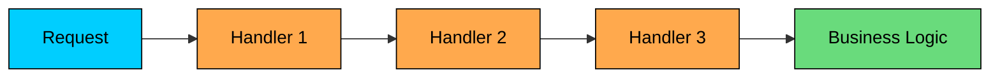
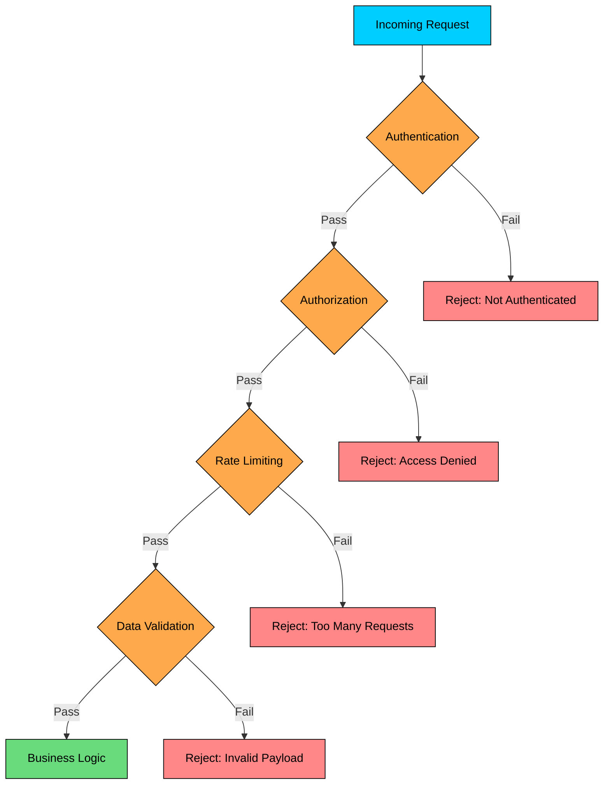
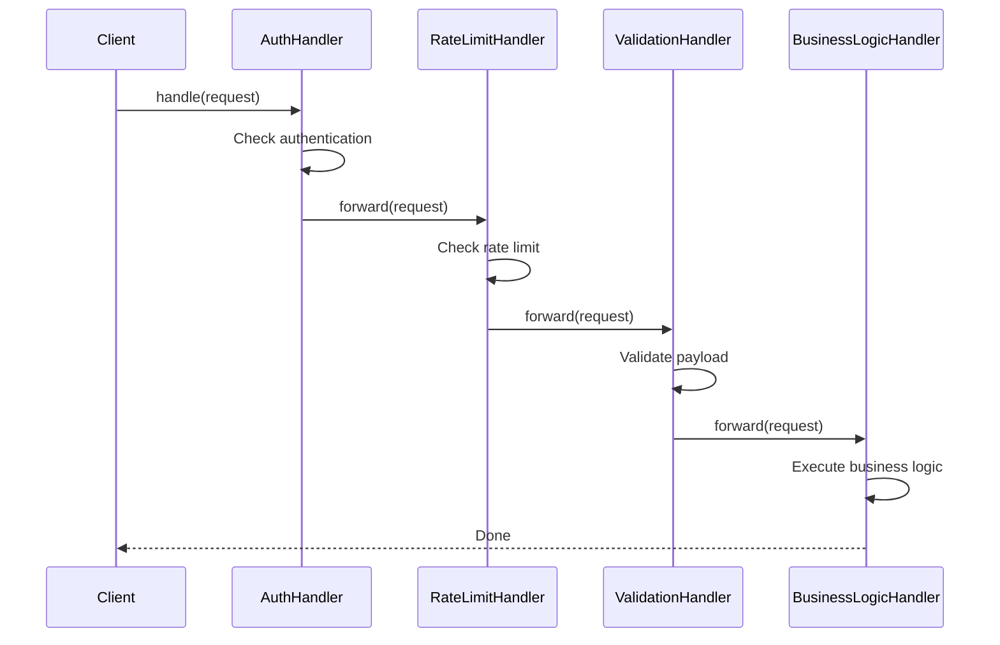

import React from 'react';
import CodeBlock from '../../../../components/ui/CodeBlock';
import Callout from '../../../../components/ui/Callout';

<div className="article-header">
  <div className="breadcrumb">
    <a href="/">Curated Notes</a>
    <span className="breadcrumb-separator">›</span>
    <span className="breadcrumb-current">Chain of Responsibility Design Pattern</span>
  </div>
  <h1>Chain of Responsibility Design Pattern</h1>
  <p style={{ color: 'var(--text-muted)', fontSize: '1.1rem', marginBottom: '16px', lineHeight: '1.6' }}>
    Master the essentials of Chain of Responsibility Design Pattern in this curated guide.
  </p>
  <div className="meta-info">
    <span className="meta-item">
      <svg width="14" height="14" viewBox="0 0 24 24" fill="none" stroke="currentColor" strokeWidth="2"><circle cx="12" cy="12" r="10"/><polyline points="12 6 12 12 16 14"/></svg>
      10 min read
    </span>
    <span className="difficulty-badge difficulty-badge--intermediate">Intermediate</span>
  </div>
</div>

<section className="content-section">





&gt; **DEFINITION**
&gt;
&gt; The **Chain of Responsibility Design Pattern** is a **behavioral pattern** that lets you **pass requests along a chain of handlers**, allowing each handler to decide whether to process the request or pass it to the next handler in the chain.


This pattern is useful when:

- A request must be handled by **one of many possible handlers**, and you don’t want the sender to be tightly coupled to any specific one.
- You want to **decouple request logic** from the code that processes it.
- You want to **flexibly add, remove, or reorder handlers** without changing the client code.

Let’s walk through a real-world example to see how we can apply the Chain of Responsibility Pattern to build a **clean, modular, and extensible pipeline for request processing.**

---

## 1. The Problem: Handling HTTP Requests

Let us say you are building a backend server that processes incoming HTTP requests for a web application. Each request carries some information about the user, their role, how many requests they have made, and some payload data.


```java
class Request {
    public String user;
    public String userRole;
    public int requestCount;
    public String payload;

    public Request(String user, String role, int requestCount, String payload) {
        this.user = user;
        this.userRole = role;
        this.requestCount = requestCount;
        this.payload = payload;
    }
}
```

```python
class Request:
   def __init__(self, user, user_role, request_count, payload):
       self.user = user
       self.user_role = user_role
       self.request_count = request_count
       self.payload = payload
```

```cpp
class Request {
public:
   string user;
   string userRole;
   int requestCount;
   string payload;

   Request(string user, string userRole, int requestCount, string payload)
       : user(user), userRole(userRole), requestCount(requestCount), payload(payload) {}
};
```

```go
type Request struct {
	user       string
	userRole   string
	requestCount int
	payload    string
}

func NewRequest(user, role string, requestCount int, payload string) Request {
	return Request{
		user:       user,
		userRole:   role,
		requestCount: requestCount,
		payload:    payload,
	}
}
```

```csharp
class Request
{
   public string user;
   public string userRole;
   public int requestCount;
   public string payload;

   public Request(string user, string userRole, int requestCount, string payload)
   {
       this.user = user;
       this.userRole = userRole;
       this.requestCount = requestCount;
       this.payload = payload;
   }
}
```

```typescript
class Request {
   public user: string;
   public userRole: string;
   public requestCount: number;
   public payload: string;

   constructor(user: string, role: string, requestCount: number, payload: string) {
       this.user = user;
       this.userRole = role;
       this.requestCount = requestCount;
       this.payload = payload;
   }
}
```


Before the request reaches the actual business logic, it must pass through several processing steps:

1. **Authentication**: Is the user properly authenticated via a token or session?
2. **Authorization**: Is the authenticated user allowed to perform this action?
3. **Rate Limiting**: Has the user exceeded their allowed number of requests?
4. **Data Validation**: Is the request payload well-formed and valid?





Only after all these checks pass should the request reach the actual business logic.

#### The Naive Approach

A typical first attempt might look like this: implement all logic inside a single class using a long chain of `if-else` statements.

#### RequestHandler


```java
class RequestHandler {
    public void handle(Request request) {
        if (!authenticate(request)) {
            System.out.println("Request Rejected: Authentication failed.");
            return;
        }

        if (!authorize(request)) {
            System.out.println("Request Rejected: Authorization failed.");
            return;
        }

        if (!rateLimit(request)) {
            System.out.println("Request Rejected: Rate limit exceeded.");
            return;
        }

        if (!validate(request)) {
            System.out.println("Request Rejected: Invalid payload.");
            return;
        }

        System.out.println("Request passed all checks. Executing business logic...");
        // Proceed to business logic
    }

    private boolean authenticate(Request req) {
        return req.user != null;
    }

    private boolean authorize(Request req) {
        return "ADMIN".equals(req.userRole);
    }

    private boolean rateLimit(Request req) {
        return req.requestCount < 100;
    }

    private boolean validate(Request req) {
        return req.payload != null && !req.payload.isEmpty();
    }
}

```

```python
class RequestHandler:
   def handle(self, request):
       if not self.authenticate(request):
           print("Request Rejected: Authentication failed.")
           return

       if not self.authorize(request):
           print("Request Rejected: Authorization failed.")
           return

       if not self.rate_limit(request):
           print("Request Rejected: Rate limit exceeded.")
           return

       if not self.validate(request):
           print("Request Rejected: Invalid payload.")
           return

       print("Request passed all checks. Executing business logic...")
       # Proceed to business logic

   def authenticate(self, req):
       return req.user is not None

   def authorize(self, req):
       return req.user_role == "ADMIN"

   def rate_limit(self, req):
       return req.request_count < 100

   def validate(self, req):
       return req.payload is not None and req.payload != ""
```

```cpp
class RequestHandler {
public:
   void handle(Request request) {
       if (!authenticate(request)) {
           cout << "Request Rejected: Authentication failed." << endl;
           return;
       }

       if (!authorize(request)) {
           cout << "Request Rejected: Authorization failed." << endl;
           return;
       }

       if (!rateLimit(request)) {
           cout << "Request Rejected: Rate limit exceeded." << endl;
           return;
       }

       if (!validate(request)) {
           cout << "Request Rejected: Invalid payload." << endl;
           return;
       }

       cout << "Request passed all checks. Executing business logic..." << endl;
       // Proceed to business logic
   }

private:
   bool authenticate(Request req) {
       return !req.user.empty();
   }

   bool authorize(Request req) {
       return req.userRole == "ADMIN";
   }

   bool rateLimit(Request req) {
       return req.requestCount < 100;
   }

   bool validate(Request req) {
       return !req.payload.empty();
   }
};
```

```go
type RequestHandler struct{}

func (h RequestHandler) Handle(request Request) {
	if !h.authenticate(request) {
		fmt.Println("Request Rejected: Authentication failed.")
		return
	}

	if !h.authorize(request) {
		fmt.Println("Request Rejected: Authorization failed.")
		return
	}

	if !h.rateLimit(request) {
		fmt.Println("Request Rejected: Rate limit exceeded.")
		return
	}

	if !h.validate(request) {
		fmt.Println("Request Rejected: Invalid payload.")
		return
	}

	fmt.Println("Request passed all checks. Executing business logic...")
	// Proceed to business logic
}

func (h RequestHandler) authenticate(req Request) bool {
	return req.user != nil
}

func (h RequestHandler) authorize(req Request) bool {
	return req.userRole == "ADMIN"
}

func (h RequestHandler) rateLimit(req Request) bool {
	return req.requestCount < 100
}

func (h RequestHandler) validate(req Request) bool {
	return req.payload != nil && req.payload != ""
}
```

```csharp
class RequestHandler
{
   public void Handle(Request request)
   {
       if (!Authenticate(request))
       {
           Console.WriteLine("Request Rejected: Authentication failed.");
           return;
       }

       if (!Authorize(request))
       {
           Console.WriteLine("Request Rejected: Authorization failed.");
           return;
       }

       if (!RateLimit(request))
       {
           Console.WriteLine("Request Rejected: Rate limit exceeded.");
           return;
       }

       if (!Validate(request))
       {
           Console.WriteLine("Request Rejected: Invalid payload.");
           return;
       }

       Console.WriteLine("Request passed all checks. Executing business logic...");
       // Proceed to business logic
   }

   private bool Authenticate(Request req)
   {
       return req.user != null;
   }

   private bool Authorize(Request req)
   {
       return "ADMIN".Equals(req.userRole);
   }

   private bool RateLimit(Request req)
   {
       return req.requestCount < 100;
   }

   private bool Validate(Request req)
   {
       return req.payload != null && !req.payload.Equals("");
   }
}
```

```typescript
class RequestHandler {
   handle(request: Request): void {
       if (!this.authenticate(request)) {
           console.log("Request Rejected: Authentication failed.");
           return;
       }

       if (!this.authorize(request)) {
           console.log("Request Rejected: Authorization failed.");
           return;
       }

       if (!this.rateLimit(request)) {
           console.log("Request Rejected: Rate limit exceeded.");
           return;
       }

       if (!this.validate(request)) {
           console.log("Request Rejected: Invalid payload.");
           return;
       }

       console.log("Request passed all checks. Executing business logic...");
       // Proceed to business logic
   }

   private authenticate(req: Request): boolean {
       return req.user !== null;
   }

   private authorize(req: Request): boolean {
       return req.userRole === "ADMIN";
   }

   private rateLimit(req: Request): boolean {
       return req.requestCount < 100;
   }

   private validate(req: Request): boolean {
       return req.payload !== null && req.payload.trim() !== "";
   }
}
```


#### Client Code


```java
public class App {
    public static void main(String[] args) {
        Request req = new Request("john_doe", "ADMIN", 42, "{ \"data\": 123 }");
        RequestProcessor processor = new RequestProcessor();
        processor.handle(req);
    }
}
```

```python
req = Request("john_doe", "ADMIN", 42, '{ "data": 123 }')
processor = RequestProcessor()
processor.handle(req)
```

```cpp
int main() {
    Request req("john_doe", "ADMIN", 42, "{ \"data\": 123 }");
    RequestProcessor processor;
    processor.handle(req);
    return 0;
}
```

```go
req := NewRequest("john_doe", "ADMIN", 42, "{ \"data\": 123 }")
processor := NewRequestProcessor()
processor.Handle(req)
```

```csharp
public class App
{
    public static void Main()
    {
        Request req = new Request("john_doe", "ADMIN", 42, "{ \"data\": 123 }");
        RequestProcessor processor = new RequestProcessor();
        processor.Handle(req);
    }
}
```

```typescript
const req = new Request("john_doe", "ADMIN", 42, '{ "data": 123 }');
const processor = new RequestProcessor();
processor.handle(req);
```


This works fine for a simple case, but there are several problems hiding beneath the surface.

#### Why This Approach Breaks Down?

#### 1. **Violates the Open/Closed Principle**

Every time you need to add a new check, say logging, caching, or metrics collection, you must modify the existing `RequestProcessor` class. The class is open for modification when it should be closed for changes and open for extension.

#### 2. Poor Separation of Concerns

All validation and control logic is tightly coupled inside a single method. This violates the Single Responsibility Principle. The class is doing too many things: authentication, authorization, rate limiting, validation, and business logic coordination.

#### 3. No Reusability

What if another service needs the same authentication logic? You would have to copy the code or create awkward shared methods. Neither option is clean.

#### 4. Inflexible Configuration

What if you want to skip authorization for public APIs? Or make validation optional in development mode? You would need more if statements, and the code would become even more tangled.

#### What We Really Need

We need a way to:

- Break each processing step into its own isolated unit
- Let each step decide whether to continue, pass, or stop the chain
- Allow new handlers to be added, removed, or reordered without touching existing code
- Keep our logic clean, testable, and extensible

This is exactly what the **Chain of Responsibility Pattern** provides.

---

## 2. Understanding Chain of Responsibility Pattern

The Chain of Responsibility Pattern allows a request to be passed along a chain of handlers. Each handler in the chain can either:

- **Handle** the request and stop the chain
- **Pass** it to the next handler in the chain
- **Handle** the request and then pass it along

This pattern decouples the sender of the request from the receivers, giving you the flexibility to compose chains dynamically, reuse logic, and avoid rigid conditional blocks.


&gt; **Real-World Analogy**
&gt;
&gt; Think about calling customer support. You explain your issue to the first-level agent. If they can solve it, great. If not, they escalate to a second-level specialist. That specialist might handle it or escalate further to a manager, who might escalate to engineering. 
&gt;
&gt; You, the caller, do not decide who handles your issue. You just start at the beginning, and the request moves through the chain until someone resolves it.
&gt;
&gt; The Chain of Responsibility pattern works the same way: the client sends a request to the first handler, and it flows through the chain until one handler processes it or the chain ends.


---

### Class Diagram

The pattern consists of three main components:


#### 1. Handler (Interface)

Declares the common interface for all handlers in the chain. It defines how to set the next handler and how to process a request.

The interface defines the chaining contract. Every handler in the chain can be treated uniformly, whether it is an authentication check, a rate limiter, or the final business logic handler.

#### 2. ConcreteHandlers (e.g., `AuthHandler`, `RateLimitHandler`)

Each concrete handler implements one processing step. It decides whether to handle the request, reject it, or pass it to the next handler.

#### 3. Client

Builds the chain by linking handlers together and sends the initial request to the first handler. The client is unaware of which handler ultimately processes the request

---

## 3. How It Works

The Chain of Responsibility workflow follows a clear sequence:





**Step 1:** The client creates concrete handler objects (e.g., `AuthHandler`, `RateLimitHandler`, `ValidationHandler`).

**Step 2:** The client links them together using `setNext()`, forming the chain in the desired processing order.

**Step 3:** The client sends a request to the first handler in the chain.

**Step 4:** The first handler processes the request. If the request passes its check, the handler calls `forward()` to pass the request to the next handler. If the check fails, the handler stops the chain.

**Step 5:** This continues until a handler stops the chain or the request reaches the end.

---

## 4. Implementing Chain of Responsibility

Let us refactor our monolithic `RequestProcessor` into a clean, extensible chain of modular handlers using the Chain of Responsibility Pattern.

#### Step 1: Define the Handler Interface

Every handler will implement this interface. Each handler should perform its specific check and decide whether to stop the chain or pass the request to the next handler.


```java
interface RequestHandler {
    void setNext(RequestHandler next);
    void handle(Request request);
}
```

```python
from abc import ABC, abstractmethod

class RequestHandler(ABC):
    @abstractmethod
    def set_next(self, next_handler):
        pass

    @abstractmethod
    def handle(self, request):
        pass
```

```cpp
class RequestHandler {
public:
    virtual void setNext(RequestHandler* next) = 0;
    virtual void handle(Request request) = 0;
    virtual ~RequestHandler() {}
};
```

```go
type RequestHandler interface {
	SetNext(next RequestHandler)
	Handle(request Request)
}
```

```csharp
interface IRequestHandler
{
    void SetNext(IRequestHandler next);
    void Handle(Request request);
}
```

```typescript
interface RequestHandler {
    setNext(next: RequestHandler): void;
    handle(request: Request): void;
}
```


#### Step 2: Create the Abstract Base Handler

To avoid duplicating the `setNext()` and forwarding logic in every handler, we define an abstract base class with reusable functionality. This way, concrete handlers only need to implement their specific check.


```java
abstract class BaseHandler implements RequestHandler {
    protected RequestHandler next;

    @Override
    public void setNext(RequestHandler next) {
        this.next = next;
    }

    protected void forward(Request request) {
        if (next != null) {
            next.handle(request);
        }
    }
}
```

```python
class BaseHandler(RequestHandlerInterface):
   def __init__(self):
       self.next = None

   def set_next(self, next_handler):
       self.next = next_handler

   def forward(self, request):
       if self.next is not None:
           self.next.handle(request)
```

```cpp
class BaseHandler : public RequestHandlerInterface {
protected:
   RequestHandlerInterface* next;

public:
   BaseHandler() : next(nullptr) {}

   void setNext(RequestHandlerInterface* next) override {
       this->next = next;
   }

protected:
   void forward(Request request) {
       if (next != nullptr) {
           next->handle(request);
       }
   }
};
```

```go
type BaseHandler struct {
	next RequestHandler
}

func (b *BaseHandler) SetNext(next RequestHandler) {
	b.next = next
}

func (b *BaseHandler) forward(request Request) {
	if b.next != nil {
		b.next.Handle(request)
	}
}
```

```csharp
abstract class BaseHandler : IRequestHandler
{
   protected IRequestHandler next;

   public void SetNext(IRequestHandler next)
   {
       this.next = next;
   }

   protected void Forward(Request request)
   {
       if (next != null)
       {
           next.Handle(request);
       }
   }

   public abstract void Handle(Request request);
}
```

```typescript
abstract class BaseHandler implements RequestHandler {
    protected next: RequestHandler | null = null;

    setNext(next: RequestHandler): void {
        this.next = next;
    }

    protected forward(request: Request): void {
        if (this.next !== null) {
            this.next.handle(request);
        }
    }

    abstract handle(request: Request): void;
}
```


Now every concrete handler can focus solely on its logic and delegate to `forward(request)` when needed.

#### Step 3: Create Concrete Handlers

Each handler implements one responsibility. They extend `BaseHandler`, implement `handle(Request)`, and determine whether to continue the chain or short-circuit it.

#### Authentication Handler


```java
class AuthHandler extends BaseHandler {
    @Override
    public void handle(Request request) {
        if (request.user == null) {
            System.out.println("AuthHandler: User not authenticated.");
            return;
        }
        System.out.println("AuthHandler: Authenticated.");
        forward(request);
    }
}
```

```python
class AuthHandler(BaseHandler):
    def handle(self, request):
        if request.user is None:
            print("AuthHandler: User not authenticated.")
            return
        print("AuthHandler: Authenticated.")
        self.forward(request)
```

```cpp
class AuthHandler : public BaseHandler {
public:
    void handle(Request request) override {
        if (request.user.empty()) {
            cout << "AuthHandler: User not authenticated." << endl;
            return;
        }
        cout << "AuthHandler: Authenticated." << endl;
        forward(request);
    }
};
```

```go
type AuthHandler struct {
	BaseHandler
}

func (h *AuthHandler) Handle(request Request) {
	if request.User == nil {
		fmt.Println("AuthHandler: User not authenticated.")
		return
	}
	fmt.Println("AuthHandler: Authenticated.")
	h.forward(request)
}
```

```csharp
class AuthHandler : BaseHandler
{
    public override void Handle(Request request)
    {
        if (request.User == null)
        {
            Console.WriteLine("AuthHandler: User not authenticated.");
            return;
        }
        Console.WriteLine("AuthHandler: Authenticated.");
        Forward(request);
    }
}
```

```typescript
class AuthHandler extends BaseHandler {
    handle(request: Request): void {
        if (request.user === null) {
            console.log("AuthHandler: User not authenticated.");
            return;
        }
        console.log("AuthHandler: Authenticated.");
        this.forward(request);
    }
}
```


#### Authorization Handler


```java
class AuthorizationHandler extends BaseHandler {
    @Override
    public void handle(Request request) {
        if (!"ADMIN".equals(request.userRole)) {
            System.out.println("AuthorizationHandler: Access denied.");
            return;
        }
        System.out.println("AuthorizationHandler: Authorized.");
        forward(request);
    }
}
```

```python
class AuthorizationHandler(BaseHandler):
    def handle(self, request):
        if request.user_role != "ADMIN":
            print("AuthorizationHandler: Access denied.")
            return
        print("AuthorizationHandler: Authorized.")
        self.forward(request)
```

```cpp
class AuthorizationHandler : public BaseHandler {
public:
    void handle(Request request) override {
        if (request.userRole != "ADMIN") {
            cout << "AuthorizationHandler: Access denied." << endl;
            return;
        }
        cout << "AuthorizationHandler: Authorized." << endl;
        forward(request);
    }
};
```

```go
type AuthorizationHandler struct {
	BaseHandler
}

func (h *AuthorizationHandler) Handle(request Request) {
	if request.UserRole != "ADMIN" {
		fmt.Println("AuthorizationHandler: Access denied.")
		return
	}
	fmt.Println("AuthorizationHandler: Authorized.")
	h.forward(request)
}
```

```csharp
class AuthorizationHandler : BaseHandler
{
    public override void Handle(Request request)
    {
        if (!"ADMIN".Equals(request.UserRole))
        {
            Console.WriteLine("AuthorizationHandler: Access denied.");
            return;
        }
        Console.WriteLine("AuthorizationHandler: Authorized.");
        Forward(request);
    }
}
```

```typescript
class AuthorizationHandler extends BaseHandler {
    handle(request: Request): void {
        if (request.userRole !== "ADMIN") {
            console.log("AuthorizationHandler: Access denied.");
            return;
        }
        console.log("AuthorizationHandler: Authorized.");
        this.forward(request);
    }
}
```


#### Rate Limiting Handler


```java
class RateLimitHandler extends BaseHandler {
    @Override
    public void handle(Request request) {
        if (request.requestCount >= 100) {
            System.out.println("RateLimitHandler: Rate limit exceeded.");
            return;
        }
        System.out.println("RateLimitHandler: Within rate limit.");
        forward(request);
    }
}
```

```python
class RateLimitHandler(BaseHandler):
    def handle(self, request):
        if request.request_count >= 100:
            print("RateLimitHandler: Rate limit exceeded.")
            return
        print("RateLimitHandler: Within rate limit.")
        self.forward(request)
```

```cpp
class RateLimitHandler : public BaseHandler {
public:
    void handle(Request request) override {
        if (request.requestCount >= 100) {
            cout << "RateLimitHandler: Rate limit exceeded." << endl;
            return;
        }
        cout << "RateLimitHandler: Within rate limit." << endl;
        forward(request);
    }
};
```

```go
func (r *RateLimitHandler) Handle(request Request) {
	if request.RequestCount >= 100 {
		fmt.Println("RateLimitHandler: Rate limit exceeded.")
		return
	}
	fmt.Println("RateLimitHandler: Within rate limit.")
	r.Forward(request)
}
```

```csharp
class RateLimitHandler : BaseHandler
{
    public override void Handle(Request request)
    {
        if (request.RequestCount >= 100)
        {
            Console.WriteLine("RateLimitHandler: Rate limit exceeded.");
            return;
        }
        Console.WriteLine("RateLimitHandler: Within rate limit.");
        Forward(request);
    }
}
```

```typescript
class RateLimitHandler extends BaseHandler {
    handle(request: Request): void {
        if (request.requestCount >= 100) {
            console.log("RateLimitHandler: Rate limit exceeded.");
            return;
        }
        console.log("RateLimitHandler: Within rate limit.");
        this.forward(request);
    }
}
```


#### Data Validation Handler


```java
class ValidationHandler extends BaseHandler {
    @Override
    public void handle(Request request) {
        if (request.payload == null || request.payload.trim().isEmpty()) {
            System.out.println("ValidationHandler: Invalid payload.");
            return;
        }
        System.out.println("ValidationHandler: Payload valid.");
        forward(request);
    }
}
```

```python
class ValidationHandler(BaseHandler):
    def handle(self, request):
        if request.payload is None or request.payload.strip() == "":
            print("ValidationHandler: Invalid payload.")
            return
        print("ValidationHandler: Payload valid.")
        self.forward(request)
```

```cpp
class ValidationHandler : public BaseHandler {
public:
    void handle(Request request) override {
        if (request.payload.empty()) {
            cout << "ValidationHandler: Invalid payload." << endl;
            return;
        }
        cout << "ValidationHandler: Payload valid." << endl;
        forward(request);
    }
};
```

```go
type ValidationHandler struct {
	BaseHandler
}

func (h *ValidationHandler) Handle(request Request) {
	if request.Payload == nil || strings.TrimSpace(*request.Payload) == "" {
		fmt.Println("ValidationHandler: Invalid payload.")
		return
	}
	fmt.Println("ValidationHandler: Payload valid.")
	h.Forward(request)
}
```

```csharp
class ValidationHandler : BaseHandler
{
    public override void Handle(Request request)
    {
        if (request.Payload == null || request.Payload.Trim() == "")
        {
            Console.WriteLine("ValidationHandler: Invalid payload.");
            return;
        }
        Console.WriteLine("ValidationHandler: Payload valid.");
        Forward(request);
    }
}
```

```typescript
class ValidationHandler extends BaseHandler {
    handle(request: Request): void {
        if (request.payload === null || request.payload.trim() === "") {
            console.log("ValidationHandler: Invalid payload.");
            return;
        }
        console.log("ValidationHandler: Payload valid.");
        this.forward(request);
    }
}
```


#### Final Business Logic Handler

This is the last handler in the chain. It assumes the request has passed all previous checks.


```java
class BusinessLogicHandler extends BaseHandler {
    @Override
    public void handle(Request request) {
        System.out.println("BusinessLogicHandler: Processing request for " + request.user + "...");
    }
}
```

```python
class BusinessLogicHandler(BaseHandler):
    def handle(self, request):
        print(f"BusinessLogicHandler: Processing request for {request.user}...")
```

```cpp
class BusinessLogicHandler : public BaseHandler {
public:
    void handle(Request request) override {
        cout << "BusinessLogicHandler: Processing request for " << request.user << "..." << endl;
    }
};
```

```go
type BusinessLogicHandler struct {
	BaseHandler
}

func (h *BusinessLogicHandler) Handle(request Request) {
	fmt.Println("BusinessLogicHandler: Processing request for", request.User, "...")
}
```

```csharp
class BusinessLogicHandler : BaseHandler
{
    public override void Handle(Request request)
    {
        Console.WriteLine($"BusinessLogicHandler: Processing request for {request.User}...");
    }
}
```

```typescript
class BusinessLogicHandler extends BaseHandler {
    handle(request: Request): void {
        console.log(`BusinessLogicHandler: Processing request for ${request.user}...`);
    }
}
```


#### Step 4: Assemble the Chain in Client Code

Now that our handlers are modular, we can connect them in any order depending on the requirements.


```java
public class App {
    public static void main(String[] args) {
        // Create handlers
        BaseHandler auth = new AuthHandler();
        BaseHandler authorization = new AuthorizationHandler();
        BaseHandler rateLimit = new RateLimitHandler();
        BaseHandler validation = new ValidationHandler();
        BaseHandler businessLogic = new BusinessLogicHandler();

        // Build the chain
        auth.setNext(authorization);
        authorization.setNext(rateLimit);
        rateLimit.setNext(validation);
        validation.setNext(businessLogic);

        // Send a valid request through the chain
        Request request = new Request("john", "ADMIN", 10, "{ \"data\": \"valid\" }");
        auth.handle(request);

        System.out.println("\n--- Trying an invalid request ---");
        Request badRequest = new Request(null, "USER", 150, "");
        auth.handle(badRequest);
    }
}
```

```python
class RequestHandlerApp:
   @staticmethod
   def main():
       # Create handlers
       auth = AuthHandler()
       authorization = AuthorizationHandler()
       rate_limit = RateLimitHandler()
       validation = ValidationHandler()
       business_logic = BusinessLogicHandler()

       # Build the chain
       auth.set_next(authorization)
       authorization.set_next(rate_limit)
       rate_limit.set_next(validation)
       validation.set_next(business_logic)

       # Send a request through the chain
       request = Request("john", "ADMIN", 10, "{ \"data\": \"valid\" }")
       auth.handle(request)

       print("\n--- Trying an invalid request ---")
       bad_request = Request(None, "USER", 150, "")
       auth.handle(bad_request)

if __name__ == "__main__":
   RequestHandlerApp.main()
```

```cpp
class RequestHandlerApp {
public:
   static void main() {
       // Create handlers
       RequestHandlerInterface* auth = new AuthHandler();
       RequestHandlerInterface* authorization = new AuthorizationHandler();
       RequestHandlerInterface* rateLimit = new RateLimitHandler();
       RequestHandlerInterface* validation = new ValidationHandler();
       RequestHandlerInterface* businessLogic = new BusinessLogicHandler();

       // Build the chain
       auth->setNext(authorization);
       authorization->setNext(rateLimit);
       rateLimit->setNext(validation);
       validation->setNext(businessLogic);

       // Send a request through the chain
       Request request("john", "ADMIN", 10, "{ \"data\": \"valid\" }");
       auth->handle(request);

       cout << "\n--- Trying an invalid request ---" << endl;
       Request badRequest("", "USER", 150, "");
       auth->handle(badRequest);

       // Clean up
       delete auth;
       delete authorization;
       delete rateLimit;
       delete validation;
       delete businessLogic;
   }
};

int main() {
   RequestHandlerApp::main();
   return 0;
}
```

```go
type RequestHandlerApp struct{}

func (RequestHandlerApp) main() {
	// Create handlers
	auth := &AuthHandler{}
	authorization := &AuthorizationHandler{}
	rateLimit := &RateLimitHandler{}
	validation := &ValidationHandler{}
	businessLogic := &BusinessLogicHandler{}

	// Build the chain
	auth.setNext(authorization)
	authorization.setNext(rateLimit)
	rateLimit.setNext(validation)
	validation.setNext(businessLogic)

	// Send a request through the chain
	request := Request{"john", "ADMIN", 10, "{ \"data\": \"valid\" }"}
	auth.handle(request)

	fmt.Println("\n--- Trying an invalid request ---")
	badRequest := Request{"", "USER", 150, ""}
	auth.handle(badRequest)
}
```

```csharp
public class RequestHandlerApp
{
   public static void Main(string[] args)
   {
       // Create handlers
       IRequestHandler auth = new AuthHandler();
       IRequestHandler authorization = new AuthorizationHandler();
       IRequestHandler rateLimit = new RateLimitHandler();
       IRequestHandler validation = new ValidationHandler();
       IRequestHandler businessLogic = new BusinessLogicHandler();

       // Build the chain
       auth.SetNext(authorization);
       authorization.SetNext(rateLimit);
       rateLimit.SetNext(validation);
       validation.SetNext(businessLogic);

       // Send a request through the chain
       Request request = new Request("john", "ADMIN", 10, "{ \"data\": \"valid\" }");
       auth.Handle(request);

       Console.WriteLine("\n--- Trying an invalid request ---");
       Request badRequest = new Request(null, "USER", 150, "");
       auth.Handle(badRequest);
   }
}
```

```typescript
class RequestHandlerApp {
   static main(): void {
       // Create handlers
       const auth: RequestHandler = new AuthHandler();
       const authorization: RequestHandler = new AuthorizationHandler();
       const rateLimit: RequestHandler = new RateLimitHandler();
       const validation: RequestHandler = new ValidationHandler();
       const businessLogic: RequestHandler = new BusinessLogicHandler();

       // Build the chain
       auth.setNext(authorization);
       authorization.setNext(rateLimit);
       rateLimit.setNext(validation);
       validation.setNext(businessLogic);

       // Send a request through the chain
       const request = new Request("john", "ADMIN", 10, "{ \"data\": \"valid\" }");
       auth.handle(request);

       console.log("\n--- Trying an invalid request ---");
       const badRequest = new Request(null, "USER", 150, "");
       auth.handle(badRequest);
   }
}
```


#### Expected Output:


```shell
AuthHandler: Authenticated.
AuthorizationHandler: Authorized.
RateLimitHandler: Within rate limit.
ValidationHandler: Payload valid.
BusinessLogicHandler: Processing request for john...

--- Trying an invalid request ---
AuthHandler: User not authenticated.
```


#### What We Achieved

Notice how clean this is. No conditional logic orchestrating the processing steps. Each handler is isolated and focused on one concern. Adding a new handler (say, `LoggingHandler` or `CorsHandler`) only requires creating a new class and plugging it into the chain. No changes to existing handlers or the client code structure.

- **Modularity:** Each handler is isolated and easy to test independently
- **Loose Coupling:** Handlers do not need to know who comes next in the chain
- **Extensibility:** Easily insert, remove, or reorder handlers without touching existing code
- **Clean Client Code:** Only responsible for building the chain and sending the request
- **Open/Closed Compliant:** You can add new functionality without modifying existing handlers

This is the power of the Chain of Responsibility pattern: it turns a rigid, monolithic processing method into a flexible, composable pipeline.

---

## 5. Practical Example: ATM Cash Dispenser

Let us work through a second example to reinforce the pattern. This time, we are building an ATM cash dispenser where a withdrawal request passes through a chain of denomination handlers. Each handler dispenses as many notes as it can of its denomination, then forwards the remaining amount to the next handler in the chain.

The key difference from our HTTP middleware example: here, every handler modifies the request before forwarding it. The HTTP middleware either passes or rejects. The ATM handlers always process and always forward, each one reducing the remaining amount. This is the "process and forward" variant of the pattern, where every handler does its part and hands off the rest.

#### Implementation


```java
class CashRequest {
    public int amount;

    public CashRequest(int amount) {
        this.amount = amount;
    }
}

interface CashHandler {
    void setNext(CashHandler next);
    void dispense(CashRequest request);
}

abstract class BaseCashHandler implements CashHandler {
    protected CashHandler next;
    protected int denomination;

    public BaseCashHandler(int denomination) {
        this.denomination = denomination;
    }

    @Override
    public void setNext(CashHandler next) {
        this.next = next;
    }

    @Override
    public void dispense(CashRequest request) {
        if (request.amount >= denomination) {
            int noteCount = request.amount / denomination;
            request.amount = request.amount % denomination;
            System.out.println("Dispensing " + noteCount + " x $" + denomination);
        }
        forward(request);
    }

    protected void forward(CashRequest request) {
        if (next != null) {
            next.dispense(request);
        }
    }
}

class HundredDollarHandler extends BaseCashHandler {
    public HundredDollarHandler() { super(100); }
}

class FiftyDollarHandler extends BaseCashHandler {
    public FiftyDollarHandler() { super(50); }
}

class TwentyDollarHandler extends BaseCashHandler {
    public TwentyDollarHandler() { super(20); }
}

class TenDollarHandler extends BaseCashHandler {
    public TenDollarHandler() { super(10); }
}

// Usage
public class ATMApp {
    public static void main(String[] args) {
        HundredDollarHandler hundreds = new HundredDollarHandler();
        FiftyDollarHandler fifties = new FiftyDollarHandler();
        TwentyDollarHandler twenties = new TwentyDollarHandler();
        TenDollarHandler tens = new TenDollarHandler();

        hundreds.setNext(fifties);
        fifties.setNext(twenties);
        twenties.setNext(tens);

        System.out.println("--- Withdrawing $380 ---");
        CashRequest request1 = new CashRequest(380);
        hundreds.dispense(request1);
        System.out.println("Remaining: $" + request1.amount);

        System.out.println("\n--- Withdrawing $275 ---");
        CashRequest request2 = new CashRequest(275);
        hundreds.dispense(request2);
        System.out.println("Remaining: $" + request2.amount);
    }
}
```

```python
from abc import ABC, abstractmethod

class CashRequest:
    def __init__(self, amount: int):
        self.amount = amount

class CashHandler(ABC):
    @abstractmethod
    def set_next(self, next_handler):
        pass

    @abstractmethod
    def dispense(self, request: CashRequest):
        pass

class BaseCashHandler(CashHandler):
    def __init__(self, denomination: int):
        self.next = None
        self.denomination = denomination

    def set_next(self, next_handler):
        self.next = next_handler

    def dispense(self, request: CashRequest):
        if request.amount >= self.denomination:
            note_count = request.amount // self.denomination
            request.amount = request.amount % self.denomination
            print(f"Dispensing {note_count} x ${self.denomination}")
        self.forward(request)

    def forward(self, request: CashRequest):
        if self.next is not None:
            self.next.dispense(request)

class HundredDollarHandler(BaseCashHandler):
    def __init__(self):
        super().__init__(100)

class FiftyDollarHandler(BaseCashHandler):
    def __init__(self):
        super().__init__(50)

class TwentyDollarHandler(BaseCashHandler):
    def __init__(self):
        super().__init__(20)

class TenDollarHandler(BaseCashHandler):
    def __init__(self):
        super().__init__(10)

## Usage
hundreds = HundredDollarHandler()
fifties = FiftyDollarHandler()
twenties = TwentyDollarHandler()
tens = TenDollarHandler()

hundreds.set_next(fifties)
fifties.set_next(twenties)
twenties.set_next(tens)

print("--- Withdrawing $380 ---")
request1 = CashRequest(380)
hundreds.dispense(request1)
print(f"Remaining: ${request1.amount}")

print("\n--- Withdrawing $275 ---")
request2 = CashRequest(275)
hundreds.dispense(request2)
print(f"Remaining: ${request2.amount}")
```

```cpp
#include <iostream>
using namespace std;

class CashRequest {
public:
    int amount;

    CashRequest(int amount) : amount(amount) {}
};

class CashHandler {
public:
    virtual void setNext(CashHandler* next) = 0;
    virtual void dispense(CashRequest& request) = 0;
    virtual ~CashHandler() {}
};

class BaseCashHandler : public CashHandler {
protected:
    CashHandler* next;
    int denomination;

public:
    BaseCashHandler(int denomination) : next(nullptr), denomination(denomination) {}

    void setNext(CashHandler* next) override { this->next = next; }

    void dispense(CashRequest& request) override {
        if (request.amount >= denomination) {
            int noteCount = request.amount / denomination;
            request.amount = request.amount % denomination;
            cout << "Dispensing " << noteCount << " x $" << denomination << endl;
        }
        forward(request);
    }

protected:
    void forward(CashRequest& request) {
        if (next != nullptr) {
            next->dispense(request);
        }
    }
};

class HundredDollarHandler : public BaseCashHandler {
public:
    HundredDollarHandler() : BaseCashHandler(100) {}
};

class FiftyDollarHandler : public BaseCashHandler {
public:
    FiftyDollarHandler() : BaseCashHandler(50) {}
};

class TwentyDollarHandler : public BaseCashHandler {
public:
    TwentyDollarHandler() : BaseCashHandler(20) {}
};

class TenDollarHandler : public BaseCashHandler {
public:
    TenDollarHandler() : BaseCashHandler(10) {}
};

int main() {
    HundredDollarHandler hundreds;
    FiftyDollarHandler fifties;
    TwentyDollarHandler twenties;
    TenDollarHandler tens;

    hundreds.setNext(&fifties);
    fifties.setNext(&twenties);
    twenties.setNext(&tens);

    cout << "--- Withdrawing $380 ---" << endl;
    CashRequest request1(380);
    hundreds.dispense(request1);
    cout << "Remaining: $" << request1.amount << endl;

    cout << "\n--- Withdrawing $275 ---" << endl;
    CashRequest request2(275);
    hundreds.dispense(request2);
    cout << "Remaining: $" << request2.amount << endl;

    return 0;
}
```

```go
package main

import "fmt"

type CashRequest struct {
	amount int
}

type CashHandler interface {
	setNext(next CashHandler)
	dispense(request *CashRequest)
}

type BaseCashHandler struct {
	next         CashHandler
	denomination int
}

func (h *BaseCashHandler) setNext(next CashHandler) {
	h.next = next
}

func (h *BaseCashHandler) dispense(request *CashRequest) {
	if request.amount >= h.denomination {
		noteCount := request.amount / h.denomination
		request.amount = request.amount % h.denomination
		fmt.Printf("Dispensing %d x $%d\n", noteCount, h.denomination)
	}
	h.forward(request)
}

func (h *BaseCashHandler) forward(request *CashRequest) {
	if h.next != nil {
		h.next.dispense(request)
	}
}

type HundredDollarHandler struct {
	BaseCashHandler
}

func NewHundredDollarHandler() *HundredDollarHandler {
	return &HundredDollarHandler{BaseCashHandler{denomination: 100}}
}

type FiftyDollarHandler struct {
	BaseCashHandler
}

func NewFiftyDollarHandler() *FiftyDollarHandler {
	return &FiftyDollarHandler{BaseCashHandler{denomination: 50}}
}

type TwentyDollarHandler struct {
	BaseCashHandler
}

func NewTwentyDollarHandler() *TwentyDollarHandler {
	return &TwentyDollarHandler{BaseCashHandler{denomination: 20}}
}

type TenDollarHandler struct {
	BaseCashHandler
}

func NewTenDollarHandler() *TenDollarHandler {
	return &TenDollarHandler{BaseCashHandler{denomination: 10}}
}

func main() {
	hundreds := NewHundredDollarHandler()
	fifties := NewFiftyDollarHandler()
	twenties := NewTwentyDollarHandler()
	tens := NewTenDollarHandler()

	hundreds.setNext(fifties)
	fifties.setNext(twenties)
	twenties.setNext(tens)

	fmt.Println("--- Withdrawing $380 ---")
	request1 := &CashRequest{amount: 380}
	hundreds.dispense(request1)
	fmt.Printf("Remaining: $%d\n", request1.amount)

	fmt.Println("\n--- Withdrawing $275 ---")
	request2 := &CashRequest{amount: 275}
	hundreds.dispense(request2)
	fmt.Printf("Remaining: $%d\n", request2.amount)
}
```

```csharp
using System;

class CashRequest
{
    public int Amount;

    public CashRequest(int amount)
    {
        Amount = amount;
    }
}

interface ICashHandler
{
    void SetNext(ICashHandler next);
    void Dispense(CashRequest request);
}

abstract class BaseCashHandler : ICashHandler
{
    protected ICashHandler next;
    protected int denomination;

    public BaseCashHandler(int denomination) { this.denomination = denomination; }

    public void SetNext(ICashHandler next) { this.next = next; }

    public void Dispense(CashRequest request)
    {
        if (request.Amount >= denomination)
        {
            int noteCount = request.Amount / denomination;
            request.Amount = request.Amount % denomination;
            Console.WriteLine($"Dispensing {noteCount} x ${denomination}");
        }
        Forward(request);
    }

    protected void Forward(CashRequest request)
    {
        if (next != null)
        {
            next.Dispense(request);
        }
    }
}

class HundredDollarHandler : BaseCashHandler
{
    public HundredDollarHandler() : base(100) { }
}

class FiftyDollarHandler : BaseCashHandler
{
    public FiftyDollarHandler() : base(50) { }
}

class TwentyDollarHandler : BaseCashHandler
{
    public TwentyDollarHandler() : base(20) { }
}

class TenDollarHandler : BaseCashHandler
{
    public TenDollarHandler() : base(10) { }
}

class ATMApp
{
    static void Main(string[] args)
    {
        var hundreds = new HundredDollarHandler();
        var fifties = new FiftyDollarHandler();
        var twenties = new TwentyDollarHandler();
        var tens = new TenDollarHandler();

        hundreds.SetNext(fifties);
        fifties.SetNext(twenties);
        twenties.SetNext(tens);

        Console.WriteLine("--- Withdrawing $380 ---");
        var request1 = new CashRequest(380);
        hundreds.Dispense(request1);
        Console.WriteLine($"Remaining: ${request1.Amount}");

        Console.WriteLine("\n--- Withdrawing $275 ---");
        var request2 = new CashRequest(275);
        hundreds.Dispense(request2);
        Console.WriteLine($"Remaining: ${request2.Amount}");
    }
}
```

```typescript
class CashRequest {
  public amount: number;

  constructor(amount: number) {
    this.amount = amount;
  }
}

interface CashHandler {
  setNext(next: CashHandler): void;
  dispense(request: CashRequest): void;
}

abstract class BaseCashHandler implements CashHandler {
  protected next: CashHandler | null = null;
  protected denomination: number;

  constructor(denomination: number) {
    this.denomination = denomination;
  }

  setNext(next: CashHandler): void {
    this.next = next;
  }

  dispense(request: CashRequest): void {
    if (request.amount >= this.denomination) {
      const noteCount = Math.floor(request.amount / this.denomination);
      request.amount = request.amount % this.denomination;
      console.log(`Dispensing ${noteCount} x $${this.denomination}`);
    }
    this.forward(request);
  }

  protected forward(request: CashRequest): void {
    if (this.next !== null) {
      this.next.dispense(request);
    }
  }
}

class HundredDollarHandler extends BaseCashHandler {
  constructor() { super(100); }
}

class FiftyDollarHandler extends BaseCashHandler {
  constructor() { super(50); }
}

class TwentyDollarHandler extends BaseCashHandler {
  constructor() { super(20); }
}

class TenDollarHandler extends BaseCashHandler {
  constructor() { super(10); }
}

// Usage
const hundreds = new HundredDollarHandler();
const fifties = new FiftyDollarHandler();
const twenties = new TwentyDollarHandler();
const tens = new TenDollarHandler();

hundreds.setNext(fifties);
fifties.setNext(twenties);
twenties.setNext(tens);

console.log("--- Withdrawing $380 ---");
const request1 = new CashRequest(380);
hundreds.dispense(request1);
console.log(`Remaining: $${request1.amount}`);

console.log("\n--- Withdrawing $275 ---");
const request2 = new CashRequest(275);
hundreds.dispense(request2);
console.log(`Remaining: $${request2.amount}`);
```


The first withdrawal ($380) divides cleanly across the denominations, so the remaining amount hits zero. The second withdrawal ($275) leaves $5 unhandled because none of our handlers deal in denominations smaller than $10. In a real ATM, the system would check this remainder and warn the user before dispensing.

This is a great example of how Chain of Responsibility is not just about filtering. It works equally well when handlers need to collaborate on a shared task, each contributing its piece.

</section>
