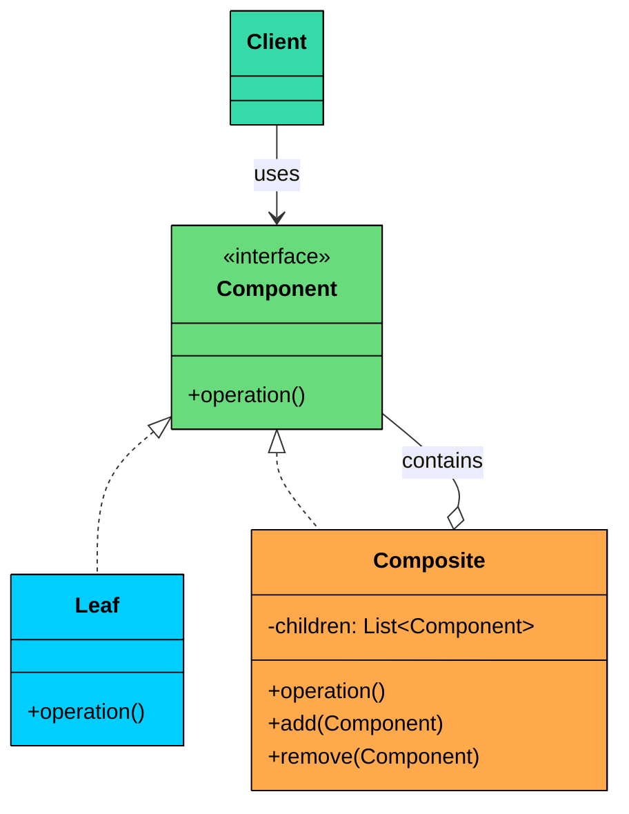
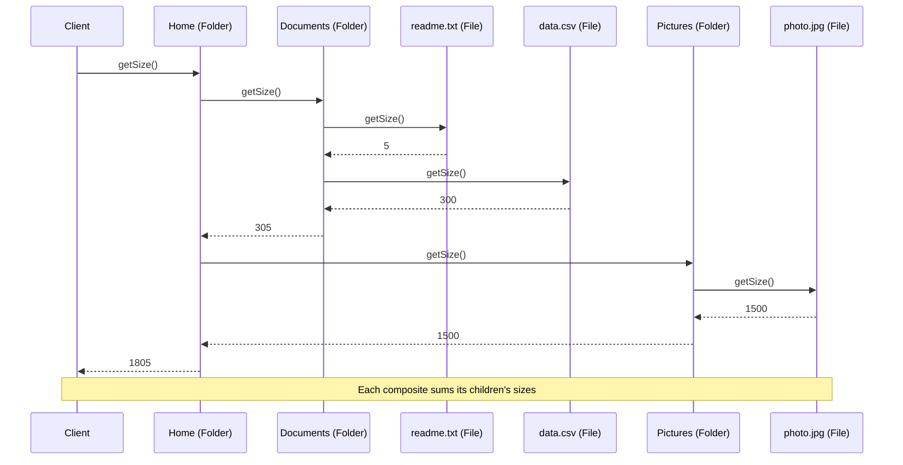
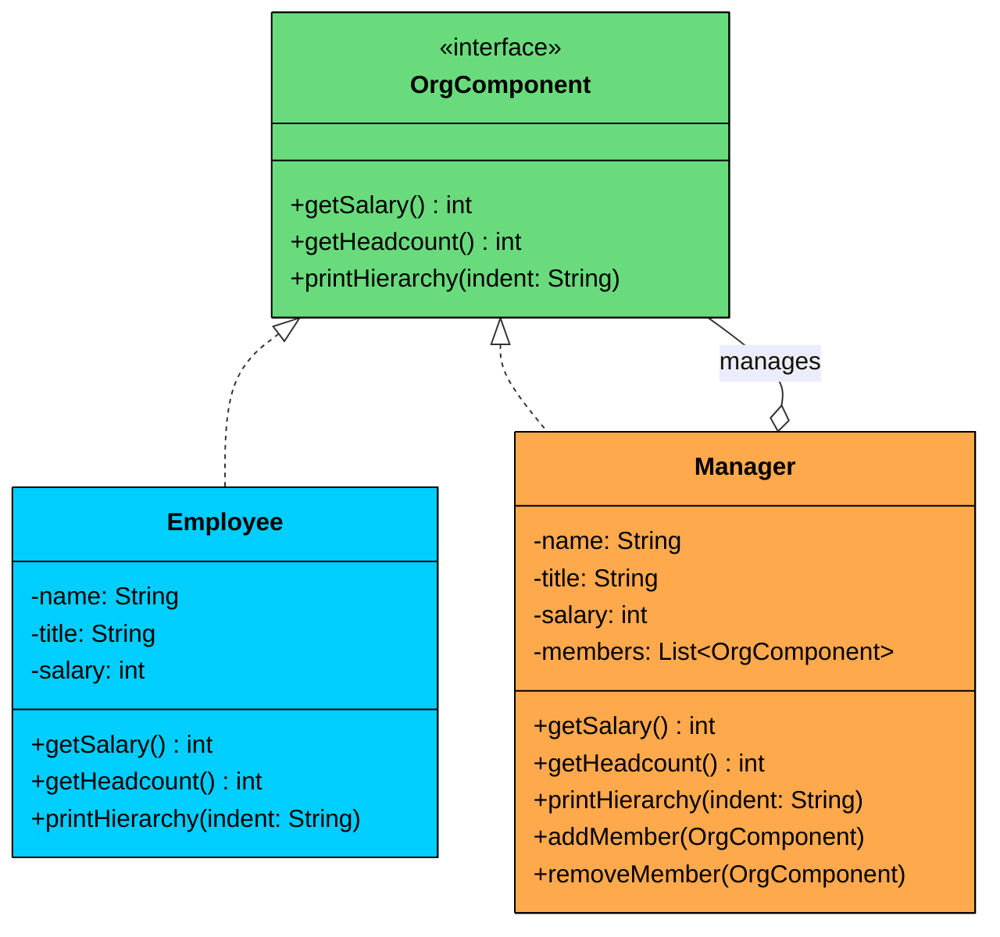

import React from 'react';
import CodeBlock from '../../../../components/ui/CodeBlock';
import Callout from '../../../../components/ui/Callout';

<div className="article-header">
  <div className="breadcrumb">
    <a href="/">Curated Notes</a>
    <span className="breadcrumb-separator">›</span>
    <span className="breadcrumb-current">Composite Design Pattern</span>
  </div>
  <h1>Composite Design Pattern</h1>
  <p style={{ color: 'var(--text-muted)', fontSize: '1.1rem', marginBottom: '16px', lineHeight: '1.6' }}>
    Master the essentials of Composite Design Pattern in this curated guide.
  </p>
  <div className="meta-info">
    <span className="meta-item">
      <svg width="14" height="14" viewBox="0 0 24 24" fill="none" stroke="currentColor" strokeWidth="2"><circle cx="12" cy="12" r="10"/><polyline points="12 6 12 12 16 14"/></svg>
      10 min read
    </span>
    <span className="difficulty-badge difficulty-badge--intermediate">Intermediate</span>
  </div>
</div>

<section className="content-section">


&gt; **DEFINITION**
&gt;
&gt; The **Composite Design Pattern** is a **structural pattern** that lets you **treat individual objects and compositions of objects uniformly**.


It allows you to build tree-like structures (e.g., file systems, UI hierarchies, organizational charts) where **clients can work with both single elements and groups of elements using the same interface.**

It’s particularly useful in situations where:

- You need to represent **part-whole hierarchies**.
- You want to **perform operations on both leaf nodes and composite nodes** in a consistent way.
- You want to avoid writing special-case logic to distinguish between "single" and "grouped" objects.

Let’s walk through a real-world example to see how we can apply the Composite Pattern to model a flexible, hierarchical system that’s both clean and extensible.

---

## 1. The Problem: Modeling a File Explorer

Imagine you are building a file explorer application (like Finder on macOS or File Explorer on Windows). The system needs to represent:

- **Files** that have a name and a size.
- **Folders** that can hold files and other folders, nested to any depth.

Your goal is to support operations such as:

- `getSize()`: returns the total size of a file or folder (sum of all contents for folders).
- `printStructure()`: prints the name of the item with indentation to show hierarchy.
- `delete()`: deletes a file or a folder and everything inside it.

#### The Naive Approach

A straightforward solution uses two separate classes `File` and `Folder` with no shared interface. The folder stores its contents as generic objects and checks the type of each item before operating on it.

#### File class


```java
class File {
    private String name;
    private int size;

    public File(String name, int size) {
        this.name = name;
        this.size = size;
    }

    public int getSize() {
        return size;
    }

    public void printStructure(String indent) {
        System.out.println(indent + name);
    }

    public void delete() {
        System.out.println("Deleting file: " + name);
    }
}
```

```python
class File:
    def __init__(self, name: str, size: int):
        self.name = name
        self.size = size

    def get_size(self) -> int:
        return self.size

    def print_structure(self, indent: str):
        print(indent + self.name)

    def delete(self):
        print(f"Deleting file: {self.name}")
```

```cpp
class File {
private:
    string name;
    int size;

public:
    File(string name, int size) : name(name), size(size) {}

    int getSize() {
        return size;
    }

    void printStructure(string indent) {
        cout << indent << name << endl;
    }

    void deleteFile() {
        cout << "Deleting file: " << name << endl;
    }
};
```

```go
type File struct {
	name string
	size int
}

func NewFile(name string, size int) *File {
	return &File{name: name, size: size}
}

func (f *File) GetSize() int {
	return f.size
}

func (f *File) PrintStructure(indent string) {
	fmt.Println(indent + f.name)
}

func (f *File) Delete() {
	fmt.Println("Deleting file: " + f.name)
}
```

```csharp
class File
{
    private string name;
    private int size;

    public File(string name, int size)
    {
        this.name = name;
        this.size = size;
    }

    public int GetSize() {
        return size;
    }

    public void PrintStructure(string indent)
    {
        Console.WriteLine(indent + name);
    }

    public void Delete()
    {
        Console.WriteLine("Deleting file: " + name);
    }
}
```

```typescript
class File {
    private name: string;
    private size: number;

    constructor(name: string, size: number) {
        this.name = name;
        this.size = size;
    }

    getSize(): number {
        return this.size;
    }

    printStructure(indent: string): void {
        console.log(indent + this.name);
    }

    delete(): void {
        console.log("Deleting file: " + this.name);
    }
}
```


#### Folder **class (with type checks):**


```java
class Folder {
    private String name;
    private List<Object> contents = new ArrayList<>();

    public Folder(String name) { this.name = name; }

    public void add(Object item) { contents.add(item); }

    public int getSize() {
        int total = 0;
        for (Object item : contents) {
            if (item instanceof File) {
                total += ((File) item).getSize();
            } else if (item instanceof Folder) {
                total += ((Folder) item).getSize();
            }
        }
        return total;
    }

    public void printStructure(String indent) {
        System.out.println(indent + name + "/");
        for (Object item : contents) {
            if (item instanceof File) {
                ((File) item).printStructure(indent + "  ");
            } else if (item instanceof Folder) {
                ((Folder) item).printStructure(indent + "  ");
            }
        }
    }

    public void delete() {
        for (Object item : contents) {
            if (item instanceof File) {
                ((File) item).delete();
            } else if (item instanceof Folder) {
                ((Folder) item).delete();
            }
        }
        System.out.println("Deleting folder: " + name);
    }
}
```

```python
class Folder:
    def __init__(self, name: str):
        self.name = name
        self.contents = []

    def add(self, item):
        self.contents.append(item)

    def get_size(self) -> int:
        total = 0
        for item in self.contents:
            if isinstance(item, File):
                total += item.get_size()
            elif isinstance(item, Folder):
                total += item.get_size()
        return total

    def print_structure(self, indent: str):
        print(indent + self.name + "/")
        for item in self.contents:
            if isinstance(item, File):
                item.print_structure(indent + "  ")
            elif isinstance(item, Folder):
                item.print_structure(indent + "  ")

    def delete(self):
        for item in self.contents:
            if isinstance(item, File):
                item.delete()
            elif isinstance(item, Folder):
                item.delete()
        print(f"Deleting folder: {self.name}")
```

```cpp
class Folder {
private:
    string name;
    vector<void*> contents;
    vector<bool> isFile;

public:
    Folder(string name) : name(name) {}

    void addFile(File* file) {
        contents.push_back(file);
        isFile.push_back(true);
    }

    void addFolder(Folder* folder) {
        contents.push_back(folder);
        isFile.push_back(false);
    }

    int getSize() {
        int total = 0;
        for (size_t i = 0; i < contents.size(); i++) {
            if (isFile[i])
                total += static_cast<File*>(contents[i])->getSize();
            else
                total += static_cast<Folder*>(contents[i])->getSize();
        }
        return total;
    }

    void printStructure(string indent) {
        cout << indent << name << "/" << endl;
        for (size_t i = 0; i < contents.size(); i++) {
            if (isFile[i])
                static_cast<File*>(contents[i])->printStructure(indent + "  ");
            else
                static_cast<Folder*>(contents[i])->printStructure(indent + "  ");
        }
    }

    void deleteFolder() {
        for (size_t i = 0; i < contents.size(); i++) {
            if (isFile[i])
                static_cast<File*>(contents[i])->deleteFile();
            else
                static_cast<Folder*>(contents[i])->deleteFolder();
        }
        cout << "Deleting folder: " << name << endl;
    }
};
```

```go
type Folder struct {
	name     string
	contents []any
}

func NewFolder(name string) *Folder {
	return &Folder{name: name}
}

func (f *Folder) Add(item any) {
	f.contents = append(f.contents, item)
}

func (f *Folder) GetSize() int {
	total := 0
	for _, item := range f.contents {
		if file, ok := item.(*File); ok {
			total += file.GetSize()
		} else if folder, ok := item.(*Folder); ok {
			total += folder.GetSize()
		}
	}
	return total
}

func (f *Folder) PrintStructure(indent string) {
	println(indent + f.name + "/")
	for _, item := range f.contents {
		if file, ok := item.(*File); ok {
			file.PrintStructure(indent + "  ")
		} else if folder, ok := item.(*Folder); ok {
			folder.PrintStructure(indent + "  ")
		}
	}
}

func (f *Folder) Delete() {
	for _, item := range f.contents {
		if file, ok := item.(*File); ok {
			file.Delete()
		} else if folder, ok := item.(*Folder); ok {
			folder.Delete()
		}
	}
	println("Deleting folder: " + f.name)
}
```

```csharp
class Folder
{
    private string name;
    private List<object> contents = new List<object>();

    public Folder(string name) {
        this.name = name;
    }

    public void Add(object item) {
        contents.Add(item);
    }

    public int GetSize()
    {
        int total = 0;
        foreach (object item in contents)
        {
            if (item is File f) total += f.GetSize();
            else if (item is Folder d) total += d.GetSize();
        }
        return total;
    }

    public void PrintStructure(string indent)
    {
        Console.WriteLine(indent + name + "/");
        foreach (object item in contents)
        {
            if (item is File f) f.PrintStructure(indent + "  ");
            else if (item is Folder d) d.PrintStructure(indent + "  ");
        }
    }

    public void Delete()
    {
        foreach (object item in contents)
        {
            if (item is File f) f.Delete();
            else if (item is Folder d) d.Delete();
        }
        Console.WriteLine("Deleting folder: " + name);
    }
}
```

```typescript
class Folder {
    private name: string;
    private contents: any[] = [];

    constructor(name: string) {
        this.name = name;
    }

    add(item: any): void {
        this.contents.push(item);
    }

    getSize(): number {
        let total = 0;
        for (const item of this.contents) {
            if (item instanceof File) {
                total += item.getSize();
            } else if (item instanceof Folder) {
                total += item.getSize();
            }
        }
        return total;
    }

    printStructure(indent: string): void {
        console.log(indent + this.name + "/");
        for (const item of this.contents) {
            if (item instanceof File) {
                item.printStructure(indent + "  ");
            } else if (item instanceof Folder) {
                item.printStructure(indent + "  ");
            }
        }
    }

    delete(): void {
        for (const item of this.contents) {
            if (item instanceof File) {
                item.delete();
            } else if (item instanceof Folder) {
                item.delete();
            }
        }
        console.log("Deleting folder: " + this.name);
    }
}
```


#### What’s Wrong With This Approach?

As the structure grows more complex, this solution introduces several critical problems:

#### 1. Repetitive Type Checks

Every operation (`getSize()`, `printStructure()`, `delete()`) requires `instanceof` checks and downcasting. This logic is duplicated across every method that touches the tree.

#### 2. No Shared Abstraction

 There is no common interface for `File` and `Folder`, so you cannot write generic code like:


```java
List<FileSystemItem> items = List.of(file, folder);
for (FileSystemItem item : items) {
    item.delete();
}
```


#### 3. Violation of Open/Closed Principle

To add new item types (say, `Shortcut` or `CompressedFolder`), you must modify the type-checking logic in every existing method. Each new type means touching every operation in the Folder class.

#### 4. **Fragile recursive logic**

Computing sizes or deleting deeply nested structures becomes a tangled mess of nested conditionals and type-specific recursive calls. One missed type check and an item silently disappears from the total.

#### What We Really Need

We need a solution that:

- Introduces a **common interface** (e.g., `FileSystemItem`) for all components.
- Allows **files and folders to be treated uniformly** via polymorphism.
- Enables folders to **contain a list of the same interface**, supporting arbitrary nesting.
- Supports **recursive operations without type checks**.
- Makes the system **easy to extend** with new item types.

This is exactly the kind of problem the **Composite Design Pattern** is made for.

---

## 2. What is the Composite Pattern

The Composite pattern is a structural pattern that composes objects into tree structures and lets clients treat individual objects and compositions uniformly.

Two characteristics define the pattern:

1. **Uniform interface:** Both leaf objects (no children) and composite objects (contain children) implement the same interface. The client calls the same methods regardless of which type it is working with.
2. **Recursive composition:** A composite holds a collection of components, which can themselves be composites. This creates tree structures of arbitrary depth without any special handling.

---

### Class Diagram





The structure involves four participants:

#### **Component Interface (e.g., **`FileSystemItem`**)**

The shared interface that declares operations common to both leaves and composites.

In our file system example, `FileSystemItem` declares `getSize()`, `printStructure()`, and `delete()`. Every file and folder implements these methods.

#### **Leaf (e.g., **`File`**)**

An end object in the tree that has no children. It implements the Component interface directly.

In our example, `File` is a leaf. It returns its own size, prints its own name, and deletes itself. No delegation, no children.

#### **Composite (e.g., **`Folder`**)**

A container that holds child Components and implements the Component interface by delegating to its children.

In our example, `Folder` stores a list of `FileSystemItem` objects. Its `getSize()` sums the sizes of all children. Its `printStructure()` prints its own name then asks each child to print. Its `delete()` deletes all children then itself.

#### **Client (e.g., **`FileExplorerApp`**)**

Works with the tree through the Component interface, without knowing whether it holds a leaf or a composite.

---

## 3. How It Works

Here is the Composite workflow, step by step, using our file system example.





#### **Step 1: Build the tree**

The client creates leaf objects (files) and composite objects (folders), then adds leaves and composites to the appropriate parents.

#### **Step 2: Call an operation on the root**

The client calls `getSize()` on the root folder. It does not need to know the internal structure.

#### **Step 3: The composite delegates to its children**

The root folder iterates over its children, calling `getSize()` on each one.

#### **Step 4: Leaves return their values directly**

When `getSize()` reaches a file, the file returns its size. No delegation, no recursion.

#### **Step 5: Nested composites recurse**

When `getSize()` reaches a subfolder, that folder iterates over its own children, calling `getSize()` on each. This continues until every leaf is reached.

#### **Step 6: Results aggregate up the tree**

Each composite sums the values returned by its children and returns the total. The root folder returns the sum of all files in the entire tree.

---

## 4. Implementing the Composite Pattern

We’ll start by defining a **common interface** for all items in our file system, allowing **both files and folders** to be treated uniformly.

#### Step 1: Define the Component Interface

This is the shared contract. Both files (leaves) and folders (composites) implement it. Every operation that can be performed on the tree is declared here.


```java
interface FileSystemItem {
    int getSize();
    void printStructure(String indent);
    void delete();
}
```

```python
from abc import ABC, abstractmethod

class FileSystemItem(ABC):
    @abstractmethod
    def get_size(self) -> int:
        pass

    @abstractmethod
    def print_structure(self, indent: str):
        pass

    @abstractmethod
    def delete(self):
        pass
```

```cpp
class FileSystemItem {
public:
    virtual int getSize() = 0;
    virtual void printStructure(string indent) = 0;
    virtual void deleteItem() = 0;
    virtual ~FileSystemItem() {}
};
```

```go
type FileSystemItem interface {
	GetSize() int
	PrintStructure(indent string)
	Delete()
}
```

```csharp
interface IFileSystemItem
{
    int GetSize();
    void PrintStructure(string indent);
    void Delete();
}
```

```typescript
interface FileSystemItem {
    getSize(): number;
    printStructure(indent: string): void;
    delete(): void;
}
```


This interface ensures that all file system items, whether files or folders, expose the same behavior to the client. No type checks needed.

#### Step 2: Create the Leaf Class (File)

A file is a leaf node. It implements the Component interface directly, returning its own values without delegating to children.


```java
class File implements FileSystemItem {
    private final String name;
    private final int size;

    public File(String name, int size) {
        this.name = name;
        this.size = size;
    }

    @Override
    public int getSize() {
        return size;
    }

    @Override
    public void printStructure(String indent) {
        System.out.println(indent + "- " + name + " (" + size + " KB)");
    }

    @Override
    public void delete() {
        System.out.println("Deleting file: " + name);
    }
}
```

```python
class File(FileSystemItem):
    def __init__(self, name: str, size: int):
        self.name = name
        self.size = size

    def get_size(self) -> int:
        return self.size

    def print_structure(self, indent: str):
        print(f"{indent}- {self.name} ({self.size} KB)")

    def delete(self):
        print(f"Deleting file: {self.name}")
```

```cpp
class File : public FileSystemItem {
private:
    string name;
    int size;

public:
    File(string name, int size) : name(name), size(size) {}

    int getSize() override {
        return size;
    }

    void printStructure(string indent) override {
        cout << indent << "- " << name << " (" << size << " KB)" << endl;
    }

    void deleteItem() override {
        cout << "Deleting file: " << name << endl;
    }
};
```

```go
type File struct {
	name string
	size int
}

func NewFile(name string, size int) *File {
	return &File{name: name, size: size}
}

func (f *File) GetSize() int {
	return f.size
}

func (f *File) PrintStructure(indent string) {
	fmt.Println(indent + "- " + f.name + " (" + strconv.Itoa(f.size) + " KB)")
}

func (f *File) Delete() {
	fmt.Println("Deleting file: " + f.name)
}
```

```csharp
class File : IFileSystemItem
{
    private readonly string name;
    private readonly int size;

    public File(string name, int size)
    {
        this.name = name;
        this.size = size;
    }

    public int GetSize() {
        return size;
    }

    public void PrintStructure(string indent)
    {
        Console.WriteLine(indent + "- " + name + " (" + size + " KB)");
    }

    public void Delete()
    {
        Console.WriteLine("Deleting file: " + name);
    }
}
```

```typescript
class FileNode implements FileSystemItem {
    private readonly name: string;
    private readonly size: number;

    constructor(name: string, size: number) {
        this.name = name;
        this.size = size;
    }

    getSize(): number {
        return this.size;
    }

    printStructure(indent: string): void {
        console.log(indent + "- " + this.name + " (" + this.size + " KB)");
    }

    delete(): void {
        console.log("Deleting file: " + this.name);
    }
}
```


Each `File` is a leaf node. It has no children and no delegation. It just returns its own data.

#### 3. Create the Composite Class (Folder)

A folder is a composite. It holds a list of `FileSystemItem` children and implements each operation by delegating to them. It also provides `addItem()` and `removeItem()` methods for managing children.


```java
class Folder implements FileSystemItem {
    private final String name;
    private final List<FileSystemItem> children = new ArrayList<>();

    public Folder(String name) {
        this.name = name;
    }

    public void addItem(FileSystemItem item) {
        children.add(item);
    }

    public void removeItem(FileSystemItem item) {
        children.remove(item);
    }

    @Override
    public int getSize() {
        int total = 0;
        for (FileSystemItem item : children) {
            total += item.getSize();
        }
        return total;
    }

    @Override
    public void printStructure(String indent) {
        System.out.println(indent + "+ " + name + "/");
        for (FileSystemItem item : children) {
            item.printStructure(indent + "  ");
        }
    }

    @Override
    public void delete() {
        for (FileSystemItem item : children) {
            item.delete();
        }
        System.out.println("Deleting folder: " + name);
    }
}
```

```python
class Folder(FileSystemItem):
    def __init__(self, name: str):
        self.name = name
        self.children: list[FileSystemItem] = []

    def add_item(self, item: FileSystemItem):
        self.children.append(item)

    def remove_item(self, item: FileSystemItem):
        self.children.remove(item)

    def get_size(self) -> int:
        total = 0
        for item in self.children:
            total += item.get_size()
        return total

    def print_structure(self, indent: str):
        print(f"{indent}+ {self.name}/")
        for item in self.children:
            item.print_structure(indent + "  ")

    def delete(self):
        for item in self.children:
            item.delete()
        print(f"Deleting folder: {self.name}")
```

```cpp
class Folder : public FileSystemItem {
private:
    string name;
    vector<FileSystemItem*> children;

public:
    Folder(string name) : name(name) {}

    void addItem(FileSystemItem* item) {
        children.push_back(item);
    }

    void removeItem(FileSystemItem* item) {
        children.erase(
            remove(children.begin(), children.end(), item),
            children.end()
        );
    }

    int getSize() override {
        int total = 0;
        for (FileSystemItem* item : children) {
            total += item->getSize();
        }
        return total;
    }

    void printStructure(string indent) override {
        cout << indent << "+ " << name << "/" << endl;
        for (FileSystemItem* item : children) {
            item->printStructure(indent + "  ");
        }
    }

    void deleteItem() override {
        for (FileSystemItem* item : children) {
            item->deleteItem();
        }
        cout << "Deleting folder: " << name << endl;
    }
};
```

```go
type Folder struct {
	name     string
	children []FileSystemItem
}

func NewFolder(name string) *Folder {
	return &Folder{name: name}
}

func (f *Folder) AddItem(item FileSystemItem) {
	f.children = append(f.children, item)
}

func (f *Folder) RemoveItem(item FileSystemItem) {
	for i, child := range f.children {
		if child == item {
			f.children = append(f.children[:i], f.children[i+1:]...)
			return
		}
	}
}

func (f *Folder) GetSize() int {
	total := 0
	for _, item := range f.children {
		total += item.GetSize()
	}
	return total
}

func (f *Folder) PrintStructure(indent string) {
	fmt.Println(indent + "+ " + f.name + "/")
	for _, item := range f.children {
		item.PrintStructure(indent + "  ")
	}
}

func (f *Folder) Delete() {
	for _, item := range f.children {
		item.Delete()
	}
	fmt.Println("Deleting folder: " + f.name)
}
```

```csharp
class Folder : IFileSystemItem
{
    private readonly string name;
    private readonly List<IFileSystemItem> children = new List<IFileSystemItem>();

    public Folder(string name) {
        this.name = name;
    }

    public void AddItem(IFileSystemItem item) {
        children.Add(item);
    }

    public void RemoveItem(IFileSystemItem item) {
        children.Remove(item);
    }

    public int GetSize()
    {
        int total = 0;
        foreach (IFileSystemItem item in children)
        {
            total += item.GetSize();
        }
        return total;
    }

    public void PrintStructure(string indent)
    {
        Console.WriteLine(indent + "+ " + name + "/");
        foreach (IFileSystemItem item in children)
        {
            item.PrintStructure(indent + "  ");
        }
    }

    public void Delete()
    {
        foreach (IFileSystemItem item in children)
        {
            item.Delete();
        }
        Console.WriteLine("Deleting folder: " + name);
    }
}
```

```typescript
class FolderNode implements FileSystemItem {
    private readonly name: string;
    private readonly children: FileSystemItem[] = [];

    constructor(name: string) {
        this.name = name;
    }

    addItem(item: FileSystemItem): void {
        this.children.push(item);
    }

    removeItem(item: FileSystemItem): void {
        const index = this.children.indexOf(item);
        if (index !== -1) {
            this.children.splice(index, 1);
        }
    }

    getSize(): number {
        let total = 0;
        for (const item of this.children) {
            total += item.getSize();
        }
        return total;
    }

    printStructure(indent: string): void {
        console.log(indent + "+ " + this.name + "/");
        for (const item of this.children) {
            item.printStructure(indent + "  ");
        }
    }

    delete(): void {
        for (const item of this.children) {
            item.delete();
        }
        console.log("Deleting folder: " + this.name);
    }
}
```


Notice the difference from the naive approach. There are no `instanceof` checks anywhere. The `Folder` simply calls `getSize()` on each child. Polymorphism handles the rest. Whether a child is a `File` or another `Folder`, the correct implementation runs automatically.

#### Step 4: Client Code


```java
public class FileExplorerApp {
    public static void main(String[] args) {
        FileSystemItem file1 = new File("readme.txt", 5);
        FileSystemItem file2 = new File("photo.jpg", 1500);
        FileSystemItem file3 = new File("data.csv", 300);

        Folder documents = new Folder("Documents");
        documents.addItem(file1);
        documents.addItem(file3);

        Folder pictures = new Folder("Pictures");
        pictures.addItem(file2);

        Folder home = new Folder("Home");
        home.addItem(documents);
        home.addItem(pictures);

        System.out.println("---- File Structure ----");
        home.printStructure("");

        System.out.println("\nTotal Size: " + home.getSize() + " KB");

        System.out.println("\n---- Deleting All ----");
        home.delete();
    }
}
```

```python
if __name__ == "__main__":
    file1 = File("readme.txt", 5)
    file2 = File("photo.jpg", 1500)
    file3 = File("data.csv", 300)

    documents = Folder("Documents")
    documents.add_item(file1)
    documents.add_item(file3)

    pictures = Folder("Pictures")
    pictures.add_item(file2)

    home = Folder("Home")
    home.add_item(documents)
    home.add_item(pictures)

    print("---- File Structure ----")
    home.print_structure("")

    print(f"\nTotal Size: {home.get_size()} KB")

    print("\n---- Deleting All ----")
    home.delete()
```

```cpp
int main() {
    FileSystemItem* file1 = new File("readme.txt", 5);
    FileSystemItem* file2 = new File("photo.jpg", 1500);
    FileSystemItem* file3 = new File("data.csv", 300);

    Folder* documents = new Folder("Documents");
    documents->addItem(file1);
    documents->addItem(file3);

    Folder* pictures = new Folder("Pictures");
    pictures->addItem(file2);

    Folder* home = new Folder("Home");
    home->addItem(documents);
    home->addItem(pictures);

    cout << "---- File Structure ----" << endl;
    home->printStructure("");

    cout << "\nTotal Size: " << home->getSize() << " KB" << endl;

    cout << "\n---- Deleting All ----" << endl;
    home->deleteItem();

    delete file1;
    delete file2;
    delete file3;
    delete documents;
    delete pictures;
    delete home;

    return 0;
}
```

```go
func main() {
	file1 := File("readme.txt", 5)
	file2 := File("photo.jpg", 1500)
	file3 := File("data.csv", 300)

	documents := Folder("Documents")
	documents.AddItem(file1)
	documents.AddItem(file3)

	pictures := Folder("Pictures")
	pictures.AddItem(file2)

	home := Folder("Home")
	home.AddItem(documents)
	home.AddItem(pictures)

	fmt.Println("---- File Structure ----")
	home.PrintStructure("")

	fmt.Println("\nTotal Size: " + fmt.Sprint(home.GetSize()) + " KB")

	fmt.Println("\n---- Deleting All ----")
	home.Delete()
}
```

```csharp
public class Program
{
    public static void Main()
    {
        IFileSystemItem file1 = new File("readme.txt", 5);
        IFileSystemItem file2 = new File("photo.jpg", 1500);
        IFileSystemItem file3 = new File("data.csv", 300);

        Folder documents = new Folder("Documents");
        documents.AddItem(file1);
        documents.AddItem(file3);

        Folder pictures = new Folder("Pictures");
        pictures.AddItem(file2);

        Folder home = new Folder("Home");
        home.AddItem(documents);
        home.AddItem(pictures);

        Console.WriteLine("---- File Structure ----");
        home.PrintStructure("");

        Console.WriteLine("\nTotal Size: " + home.GetSize() + " KB");

        Console.WriteLine("\n---- Deleting All ----");
        home.Delete();
    }
}
```

```typescript
const file1: FileSystemItem = new FileNode("readme.txt", 5);
const file2: FileSystemItem = new FileNode("photo.jpg", 1500);
const file3: FileSystemItem = new FileNode("data.csv", 300);

const documents = new FolderNode("Documents");
documents.addItem(file1);
documents.addItem(file3);

const pictures = new FolderNode("Pictures");
pictures.addItem(file2);

const home = new FolderNode("Home");
home.addItem(documents);
home.addItem(pictures);

console.log("---- File Structure ----");
home.printStructure("");

console.log("\nTotal Size: " + home.getSize() + " KB");

console.log("\n---- Deleting All ----");
home.delete();
```


#### Output:


```shell
---- File Structure ----
+ Home/
  + Documents/
    - readme.txt (5 KB)
    - data.csv (300 KB)
  + Pictures/
    - photo.jpg (1500 KB)

Total Size: 1805 KB

---- Deleting All ----
Deleting file: readme.txt
Deleting file: data.csv
Deleting folder: Documents
Deleting file: photo.jpg
Deleting folder: Pictures
Deleting folder: Home
```


With the Composite pattern, we have modeled the file system the way it naturally works, as a tree of items where some are leaves and others are containers. Each operation (`getSize()`, `printStructure()`, `delete()`) is modular, recursive, and extensible. No type checks, no casting, no special-case logic.

#### What We Achieved with Composite?

- **Unified treatment: **Files and folders share a common interface, allowing polymorphism
- **Clean recursion: **No `instanceof`, no casting — just delegation
- **Scalability: **Easily supports deeply nested structures
- **Maintainability: **Adding new file types (e.g., Shortcut, CompressedFolder) is easy
- **Extensibility: **New operations can be added via interface extension or visitor pattern

---

## 5. Practical Example: Organization Hierarchy

To show the Composite pattern in a completely different domain, let's build an organization hierarchy system. An `OrgComponent` interface is shared by `Employee` (leaf) and `Manager` (composite). Managers can contain employees and other managers, forming a tree that represents the company structure.

The system supports three operations: `getSalary()` computes the total salary for a node and everything below it, `getHeadcount()` counts all people in the subtree, and `printHierarchy()` displays the org chart with indentation.





Here is the full implementation:


```java
import java.util.*;

interface OrgComponent {
    int getSalary();
    int getHeadcount();
    void printHierarchy(String indent);
}

class Employee implements OrgComponent {
    private final String name;
    private final String title;
    private final int salary;

    public Employee(String name, String title, int salary) {
        this.name = name;
        this.title = title;
        this.salary = salary;
    }

    @Override
    public int getSalary() { return salary; }

    @Override
    public int getHeadcount() { return 1; }

    @Override
    public void printHierarchy(String indent) {
        System.out.println(indent + "- " + name + " (" + title + ", $" + salary + ")");
    }
}

class Manager implements OrgComponent {
    private final String name;
    private final String title;
    private final int salary;
    private final List<OrgComponent> members = new ArrayList<>();

    public Manager(String name, String title, int salary) {
        this.name = name;
        this.title = title;
        this.salary = salary;
    }

    public void addMember(OrgComponent member) { members.add(member); }

    public void removeMember(OrgComponent member) { members.remove(member); }

    @Override
    public int getSalary() {
        int total = salary;
        for (OrgComponent member : members) {
            total += member.getSalary();
        }
        return total;
    }

    @Override
    public int getHeadcount() {
        int count = 1;
        for (OrgComponent member : members) {
            count += member.getHeadcount();
        }
        return count;
    }

    @Override
    public void printHierarchy(String indent) {
        System.out.println(indent + "+ " + name + " (" + title + ", $" + salary + ")");
        for (OrgComponent member : members) {
            member.printHierarchy(indent + "  ");
        }
    }
}

public class OrgApp {
    public static void main(String[] args) {
        Employee dev1 = new Employee("Alice", "Senior Engineer", 120000);
        Employee dev2 = new Employee("Bob", "Engineer", 95000);
        Employee dev3 = new Employee("Charlie", "Engineer", 90000);
        Employee designer = new Employee("Diana", "Designer", 100000);

        Manager techLead = new Manager("Eve", "Tech Lead", 140000);
        techLead.addMember(dev1);
        techLead.addMember(dev2);

        Manager vpEng = new Manager("Frank", "VP Engineering", 200000);
        vpEng.addMember(techLead);
        vpEng.addMember(dev3);

        Manager vpProduct = new Manager("Grace", "VP Product", 190000);
        vpProduct.addMember(designer);

        Manager ceo = new Manager("Hank", "CEO", 300000);
        ceo.addMember(vpEng);
        ceo.addMember(vpProduct);

        System.out.println("---- Organization Chart ----");
        ceo.printHierarchy("");

        System.out.println("\nTotal Payroll: $" + ceo.getSalary());
        System.out.println("Total Headcount: " + ceo.getHeadcount());
        System.out.println("\nEngineering Payroll: $" + vpEng.getSalary());
        System.out.println("Engineering Headcount: " + vpEng.getHeadcount());
    }
}
```

```python
from abc import ABC, abstractmethod

class OrgComponent(ABC):
    @abstractmethod
    def get_salary(self) -> int:
        pass

    @abstractmethod
    def get_headcount(self) -> int:
        pass

    @abstractmethod
    def print_hierarchy(self, indent: str):
        pass

class Employee(OrgComponent):
    def __init__(self, name: str, title: str, salary: int):
        self.name = name
        self.title = title
        self.salary = salary

    def get_salary(self) -> int:
        return self.salary

    def get_headcount(self) -> int:
        return 1

    def print_hierarchy(self, indent: str):
        print(f"{indent}- {self.name} ({self.title}, ${self.salary})")

class Manager(OrgComponent):
    def __init__(self, name: str, title: str, salary: int):
        self.name = name
        self.title = title
        self.salary = salary
        self.members: list[OrgComponent] = []

    def add_member(self, member: OrgComponent):
        self.members.append(member)

    def remove_member(self, member: OrgComponent):
        self.members.remove(member)

    def get_salary(self) -> int:
        total = self.salary
        for member in self.members:
            total += member.get_salary()
        return total

    def get_headcount(self) -> int:
        count = 1
        for member in self.members:
            count += member.get_headcount()
        return count

    def print_hierarchy(self, indent: str):
        print(f"{indent}+ {self.name} ({self.title}, ${self.salary})")
        for member in self.members:
            member.print_hierarchy(indent + "  ")

if __name__ == "__main__":
    dev1 = Employee("Alice", "Senior Engineer", 120000)
    dev2 = Employee("Bob", "Engineer", 95000)
    dev3 = Employee("Charlie", "Engineer", 90000)
    designer = Employee("Diana", "Designer", 100000)

    tech_lead = Manager("Eve", "Tech Lead", 140000)
    tech_lead.add_member(dev1)
    tech_lead.add_member(dev2)

    vp_eng = Manager("Frank", "VP Engineering", 200000)
    vp_eng.add_member(tech_lead)
    vp_eng.add_member(dev3)

    vp_product = Manager("Grace", "VP Product", 190000)
    vp_product.add_member(designer)

    ceo = Manager("Hank", "CEO", 300000)
    ceo.add_member(vp_eng)
    ceo.add_member(vp_product)

    print("---- Organization Chart ----")
    ceo.print_hierarchy("")

    print(f"\nTotal Payroll: ${ceo.get_salary()}")
    print(f"Total Headcount: {ceo.get_headcount()}")
    print(f"\nEngineering Payroll: ${vp_eng.get_salary()}")
    print(f"Engineering Headcount: {vp_eng.get_headcount()}")
```

```cpp
#include <iostream>
#include <vector>
#include <string>
#include <algorithm>
using namespace std;

class OrgComponent {
public:
    virtual int getSalary() = 0;
    virtual int getHeadcount() = 0;
    virtual void printHierarchy(string indent) = 0;
    virtual ~OrgComponent() {}
};

class Employee : public OrgComponent {
private:
    string name, title;
    int salary;

public:
    Employee(string name, string title, int salary)
        : name(name), title(title), salary(salary) {}

    int getSalary() override {
        return salary;
    }

    int getHeadcount() override {
        return 1;
    }

    void printHierarchy(string indent) override {
        cout << indent << "- " << name << " (" << title << ", $" << salary << ")" << endl;
    }
};

class Manager : public OrgComponent {
private:
    string name, title;
    int salary;
    vector<OrgComponent*> members;

public:
    Manager(string name, string title, int salary)
        : name(name), title(title), salary(salary) {}

    void addMember(OrgComponent* member) {
        members.push_back(member);
    }

    void removeMember(OrgComponent* member) {
        members.erase(remove(members.begin(), members.end(), member), members.end());
    }

    int getSalary() override {
        int total = salary;
        for (OrgComponent* member : members) total += member->getSalary();
        return total;
    }

    int getHeadcount() override {
        int count = 1;
        for (OrgComponent* member : members) count += member->getHeadcount();
        return count;
    }

    void printHierarchy(string indent) override {
        cout << indent << "+ " << name << " (" << title << ", $" << salary << ")" << endl;
        for (OrgComponent* member : members) member->printHierarchy(indent + "  ");
    }
};

int main() {
    Employee dev1("Alice", "Senior Engineer", 120000);
    Employee dev2("Bob", "Engineer", 95000);
    Employee dev3("Charlie", "Engineer", 90000);
    Employee designer("Diana", "Designer", 100000);

    Manager techLead("Eve", "Tech Lead", 140000);
    techLead.addMember(&dev1);
    techLead.addMember(&dev2);

    Manager vpEng("Frank", "VP Engineering", 200000);
    vpEng.addMember(&techLead);
    vpEng.addMember(&dev3);

    Manager vpProduct("Grace", "VP Product", 190000);
    vpProduct.addMember(&designer);

    Manager ceo("Hank", "CEO", 300000);
    ceo.addMember(&vpEng);
    ceo.addMember(&vpProduct);

    cout << "---- Organization Chart ----" << endl;
    ceo.printHierarchy("");

    cout << "\nTotal Payroll: $" << ceo.getSalary() << endl;
    cout << "Total Headcount: " << ceo.getHeadcount() << endl;
    cout << "\nEngineering Payroll: $" << vpEng.getSalary() << endl;
    cout << "Engineering Headcount: " << vpEng.getHeadcount() << endl;

    return 0;
}
```

```go
package main

import "fmt"

type OrgComponent interface {
	getSalary() int
	getHeadcount() int
	printHierarchy(indent string)
}

type Employee struct {
	name   string
	title  string
	salary int
}

func NewEmployee(name, title string, salary int) *Employee {
	return &Employee{name: name, title: title, salary: salary}
}

func (e *Employee) getSalary() int {
	return e.salary
}

func (e *Employee) getHeadcount() int {
	return 1
}

func (e *Employee) printHierarchy(indent string) {
	fmt.Printf("%s- %s (%s, $%d)\n", indent, e.name, e.title, e.salary)
}

type Manager struct {
	name    string
	title   string
	salary  int
	members []OrgComponent
}

func NewManager(name, title string, salary int) *Manager {
	return &Manager{name: name, title: title, salary: salary}
}

func (m *Manager) addMember(member OrgComponent) {
	m.members = append(m.members, member)
}

func (m *Manager) removeMember(member OrgComponent) {
	for i, x := range m.members {
		if x == member {
			m.members = append(m.members[:i], m.members[i+1:]...)
			return
		}
	}
}

func (m *Manager) getSalary() int {
	total := m.salary
	for _, member := range m.members {
		total += member.getSalary()
	}
	return total
}

func (m *Manager) getHeadcount() int {
	count := 1
	for _, member := range m.members {
		count += member.getHeadcount()
	}
	return count
}

func (m *Manager) printHierarchy(indent string) {
	fmt.Printf("%s+ %s (%s, $%d)\n", indent, m.name, m.title, m.salary)
	for _, member := range m.members {
		member.printHierarchy(indent + "  ")
	}
}

func main() {
	dev1 := NewEmployee("Alice", "Senior Engineer", 120000)
	dev2 := NewEmployee("Bob", "Engineer", 95000)
	dev3 := NewEmployee("Charlie", "Engineer", 90000)
	designer := NewEmployee("Diana", "Designer", 100000)

	techLead := NewManager("Eve", "Tech Lead", 140000)
	techLead.addMember(dev1)
	techLead.addMember(dev2)

	vpEng := NewManager("Frank", "VP Engineering", 200000)
	vpEng.addMember(techLead)
	vpEng.addMember(dev3)

	vpProduct := NewManager("Grace", "VP Product", 190000)
	vpProduct.addMember(designer)

	ceo := NewManager("Hank", "CEO", 300000)
	ceo.addMember(vpEng)
	ceo.addMember(vpProduct)

	fmt.Println("---- Organization Chart ----")
	ceo.printHierarchy("")

	fmt.Printf("\nTotal Payroll: $%d\n", ceo.getSalary())
	fmt.Printf("Total Headcount: %d\n", ceo.getHeadcount())
	fmt.Printf("\nEngineering Payroll: $%d\n", vpEng.getSalary())
	fmt.Printf("Engineering Headcount: %d\n", vpEng.getHeadcount())
}
```

```csharp
using System;
using System.Collections.Generic;

interface IOrgComponent
{
    int GetSalary();
    int GetHeadcount();
    void PrintHierarchy(string indent);
}

class Employee : IOrgComponent
{
    private readonly string name, title;
    private readonly int salary;

    public Employee(string name, string title, int salary)
    {
        this.name = name;
        this.title = title;
        this.salary = salary;
    }

    public int GetSalary() {
        return salary;
    }
    public int GetHeadcount() {
        return 1;
    }

    public void PrintHierarchy(string indent)
    {
        Console.WriteLine(indent + "- " + name + " (" + title + ", $" + salary + ")");
    }
}

class Manager : IOrgComponent
{
    private readonly string name, title;
    private readonly int salary;
    private readonly List<IOrgComponent> members = new List<IOrgComponent>();

    public Manager(string name, string title, int salary)
    {
        this.name = name;
        this.title = title;
        this.salary = salary;
    }

    public void AddMember(IOrgComponent member) {
        members.Add(member);
    }
    public void RemoveMember(IOrgComponent member) {
        members.Remove(member);
    }

    public int GetSalary()
    {
        int total = salary;
        foreach (IOrgComponent member in members) total += member.GetSalary();
        return total;
    }

    public int GetHeadcount()
    {
        int count = 1;
        foreach (IOrgComponent member in members) count += member.GetHeadcount();
        return count;
    }

    public void PrintHierarchy(string indent)
    {
        Console.WriteLine(indent + "+ " + name + " (" + title + ", $" + salary + ")");
        foreach (IOrgComponent member in members) member.PrintHierarchy(indent + "  ");
    }
}

public class Program
{
    public static void Main()
    {
        var dev1 = new Employee("Alice", "Senior Engineer", 120000);
        var dev2 = new Employee("Bob", "Engineer", 95000);
        var dev3 = new Employee("Charlie", "Engineer", 90000);
        var designer = new Employee("Diana", "Designer", 100000);

        var techLead = new Manager("Eve", "Tech Lead", 140000);
        techLead.AddMember(dev1);
        techLead.AddMember(dev2);

        var vpEng = new Manager("Frank", "VP Engineering", 200000);
        vpEng.AddMember(techLead);
        vpEng.AddMember(dev3);

        var vpProduct = new Manager("Grace", "VP Product", 190000);
        vpProduct.AddMember(designer);

        var ceo = new Manager("Hank", "CEO", 300000);
        ceo.AddMember(vpEng);
        ceo.AddMember(vpProduct);

        Console.WriteLine("---- Organization Chart ----");
        ceo.PrintHierarchy("");

        Console.WriteLine("\nTotal Payroll: $" + ceo.GetSalary());
        Console.WriteLine("Total Headcount: " + ceo.GetHeadcount());
        Console.WriteLine("\nEngineering Payroll: $" + vpEng.GetSalary());
        Console.WriteLine("Engineering Headcount: " + vpEng.GetHeadcount());
    }
}
```

```typescript
interface OrgComponent {
  getSalary(): number;
  getHeadcount(): number;
  printHierarchy(indent: string): void;
}

class Employee implements OrgComponent {
  private readonly name: string;
  private readonly title: string;
  private readonly salary: number;

  constructor(name: string, title: string, salary: number) {
    this.name = name;
    this.title = title;
    this.salary = salary;
  }

  getSalary(): number {
    return this.salary;
  }

  getHeadcount(): number {
    return 1;
  }

  printHierarchy(indent: string): void {
    console.log(`${indent}- ${this.name} (${this.title}, $${this.salary})`);
  }
}

class Manager implements OrgComponent {
  private readonly name: string;
  private readonly title: string;
  private readonly salary: number;
  private readonly members: OrgComponent[] = [];

  constructor(name: string, title: string, salary: number) {
    this.name = name;
    this.title = title;
    this.salary = salary;
  }

  addMember(member: OrgComponent): void {
    this.members.push(member);
  }

  removeMember(member: OrgComponent): void {
    const index = this.members.indexOf(member);
    if (index !== -1) this.members.splice(index, 1);
  }

  getSalary(): number {
    let total = this.salary;
    for (const member of this.members) total += member.getSalary();
    return total;
  }

  getHeadcount(): number {
    let count = 1;
    for (const member of this.members) count += member.getHeadcount();
    return count;
  }

  printHierarchy(indent: string): void {
    console.log(`${indent}+ ${this.name} (${this.title}, $${this.salary})`);
    for (const member of this.members) member.printHierarchy(indent + "  ");
  }
}

const dev1 = new Employee("Alice", "Senior Engineer", 120000);
const dev2 = new Employee("Bob", "Engineer", 95000);
const dev3 = new Employee("Charlie", "Engineer", 90000);
const designer = new Employee("Diana", "Designer", 100000);

const techLead = new Manager("Eve", "Tech Lead", 140000);
techLead.addMember(dev1);
techLead.addMember(dev2);

const vpEng = new Manager("Frank", "VP Engineering", 200000);
vpEng.addMember(techLead);
vpEng.addMember(dev3);

const vpProduct = new Manager("Grace", "VP Product", 190000);
vpProduct.addMember(designer);

const ceo = new Manager("Hank", "CEO", 300000);
ceo.addMember(vpEng);
ceo.addMember(vpProduct);

console.log("---- Organization Chart ----");
ceo.printHierarchy("");

console.log("\nTotal Payroll: $" + ceo.getSalary());
console.log("Total Headcount: " + ceo.getHeadcount());
console.log("\nEngineering Payroll: $" + vpEng.getSalary());
console.log("Engineering Headcount: " + vpEng.getHeadcount());
```


Notice how the same `getSalary()` call works at any level. Calling it on the CEO gives the entire company's payroll. Calling it on a tech lead gives just that team's cost. The client code does not change. This is the power of Composite: the same operation scales from a single leaf to an entire tree.

</section>
