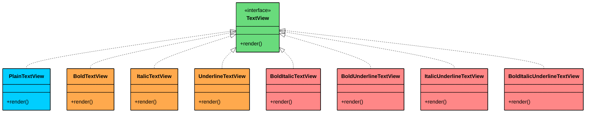
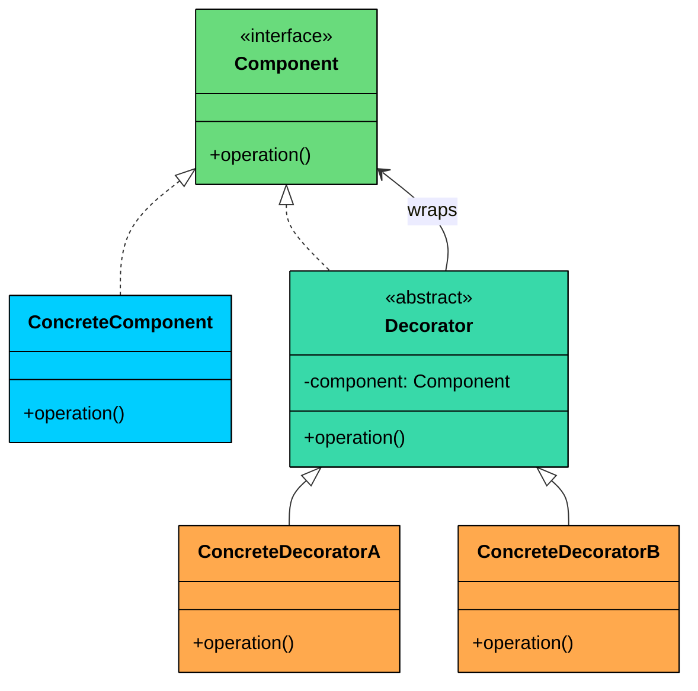
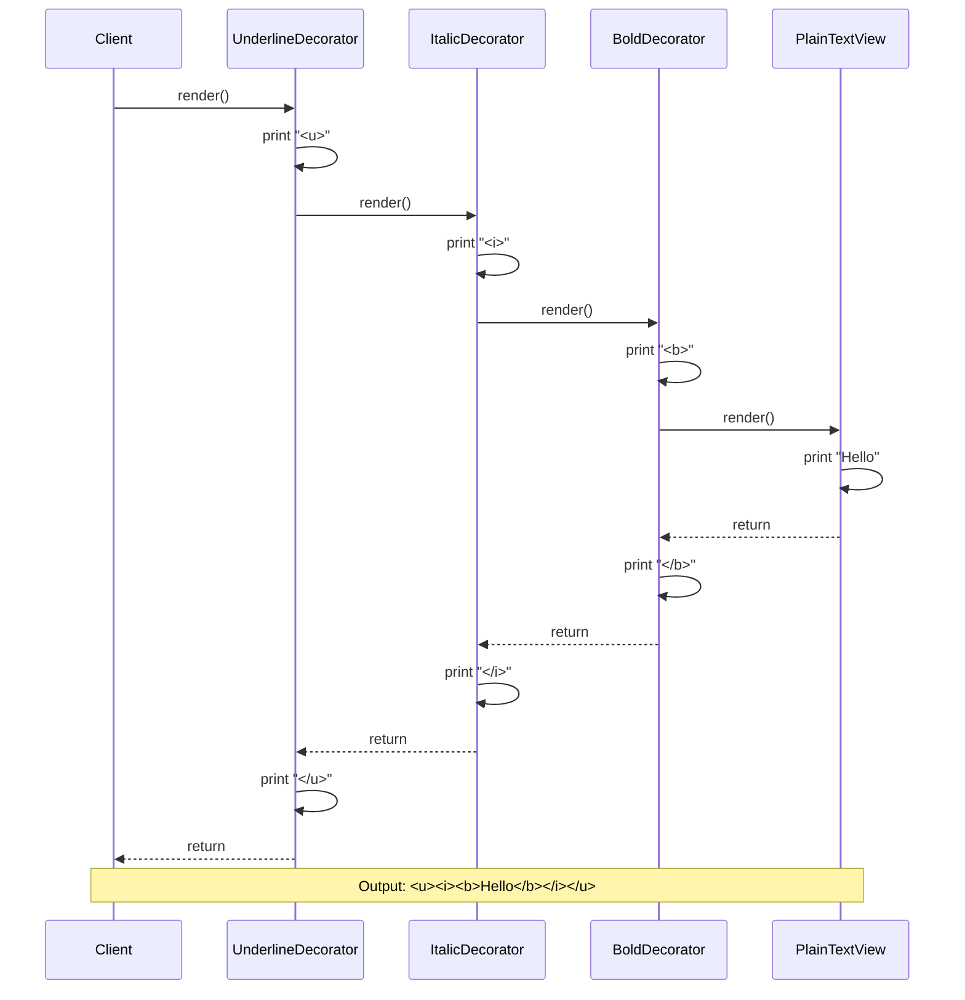
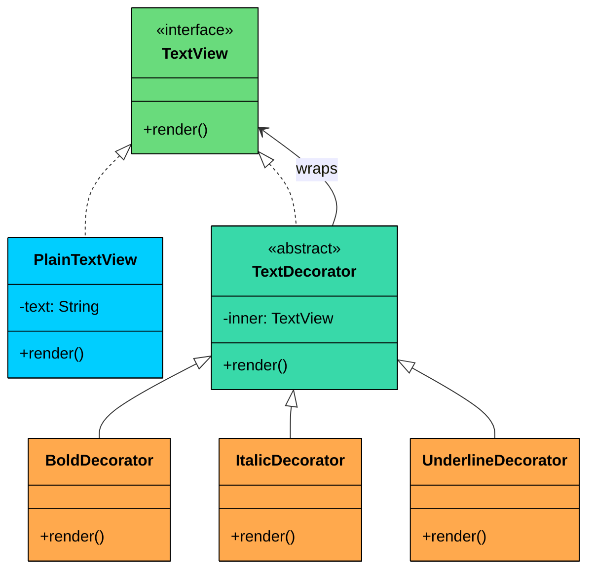
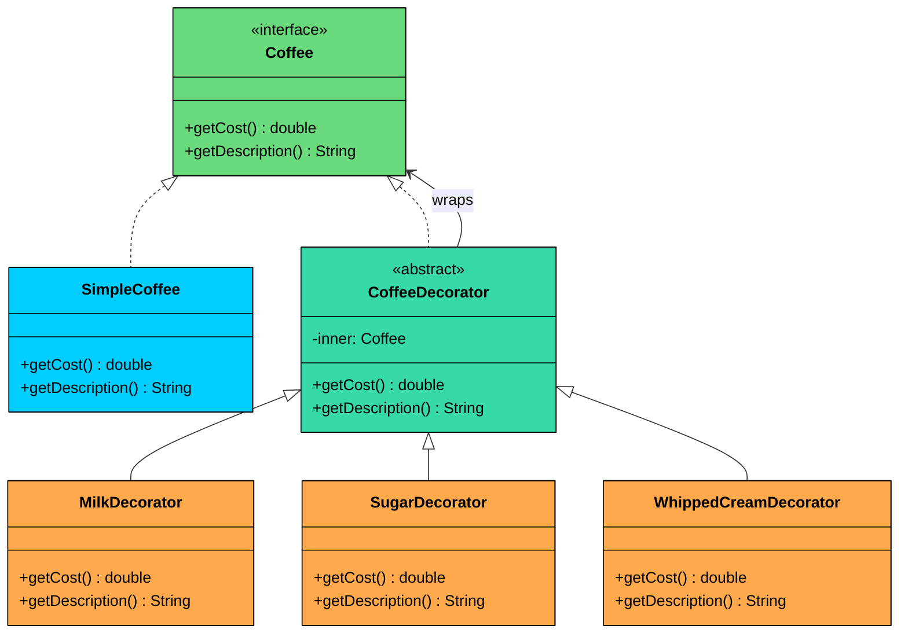

import React from 'react';
import CodeBlock from '../../../../components/ui/CodeBlock';
import Callout from '../../../../components/ui/Callout';

<div className="article-header">
  <div className="breadcrumb">
    <a href="/">Curated Notes</a>
    <span className="breadcrumb-separator">›</span>
    <span className="breadcrumb-current">Decorator Design Pattern</span>
  </div>
  <h1>Decorator Design Pattern</h1>
  <p style={{ color: 'var(--text-muted)', fontSize: '1.1rem', marginBottom: '16px', lineHeight: '1.6' }}>
    Master the essentials of Decorator Design Pattern in this curated guide.
  </p>
  <div className="meta-info">
    <span className="meta-item">
      <svg width="14" height="14" viewBox="0 0 24 24" fill="none" stroke="currentColor" strokeWidth="2"><circle cx="12" cy="12" r="10"/><polyline points="12 6 12 12 16 14"/></svg>
      10 min read
    </span>
    <span className="difficulty-badge difficulty-badge--intermediate">Intermediate</span>
  </div>
</div>

<section className="content-section">


&gt; **DEFINITION**
&gt;
&gt; The **Decorator Design Pattern** is a **structural pattern** that lets you **dynamically add new behavior or responsibilities to objects** without modifying their underlying code.


It’s particularly useful in situations where:

- You want to **extend the functionality** of a class without subclassing it.
- You need to **compose behaviors at runtime**, in various combinations.
- You want to avoid bloated classes filled with `if-else` logic for optional features.

Let’s walk through a real-world example to see how we can apply the Decorator Pattern to build a **modular, flexible, and easily composable system** for enhancing object functionality.

---

## 1. The Problem: Adding Features to a Text Renderer

Imagine you are building a rich text rendering system, something like a simplified word processor or a markdown preview tool. At the core of your system is a `TextView` component that renders plain text on screen.

The first version works great. Then the requirements start growing:

- Support **bold** text
- Support **italic** text
- Support **underlined** text
- Support any **combination** of the above (bold + italic, bold + underline, italic + underline, all three together)

#### The Naive Approach: Subclassing for Every Combination

Your first instinct might be to create a subclass for each variation:





The red nodes are combination subclasses that only exist because inheritance cannot mix and match behaviors.

With just 3 features (bold, italic, underline), you already need 7 subclasses to cover every possible combination. Add a 4th feature like highlight, and that jumps to 15. A 5th feature (strikethrough) brings it to 31. The formula is **2^n - 1**, where n is the number of features.

Here is what the naive code looks like:


```java
interface TextView {
    void render();
}

class PlainTextView implements TextView {
    private final String text;

    public PlainTextView(String text) {
        this.text = text;
    }

    @Override
    public void render() {
        System.out.print(text);
    }
}

// One subclass per feature...
class BoldTextView implements TextView {
    private final String text;

    public BoldTextView(String text) {
        this.text = text;
    }

    @Override
    public void render() {
        System.out.print("<b>" + text + "</b>");
    }
}

// One subclass per combination...
class BoldItalicTextView implements TextView {
    private final String text;

    public BoldItalicTextView(String text) {
        this.text = text;
    }

    @Override
    public void render() {
        System.out.print("<i><b>" + text + "</b></i>");
    }
}

// BoldUnderlineTextView, ItalicUnderlineTextView,
// BoldItalicUnderlineTextView... it keeps going.
```

```python
from abc import ABC, abstractmethod

class TextView(ABC):
    @abstractmethod
    def render(self):
        pass

class PlainTextView(TextView):
    def __init__(self, text: str):
        self.text = text

    def render(self):
        print(self.text, end="")

## One subclass per feature...
class BoldTextView(TextView):
    def __init__(self, text: str):
        self.text = text

    def render(self):
        print(f"<b>{self.text}</b>", end="")

## One subclass per combination...
class BoldItalicTextView(TextView):
    def __init__(self, text: str):
        self.text = text

    def render(self):
        print(f"<i><b>{self.text}</b></i>", end="")

## BoldUnderlineTextView, ItalicUnderlineTextView,
## BoldItalicUnderlineTextView... it keeps going.
```

```cpp
#include <iostream>
#include <string>

using namespace std;

class TextView {
public:
    virtual void render() = 0;
    virtual ~TextView() {}
};

class PlainTextView : public TextView {
private:
    string text;

public:
    PlainTextView(string text) : text(move(text)) {}

    void render() override {
        cout << text;
    }
};

// One subclass per feature...
class BoldTextView : public TextView {
private:
    string text;

public:
    BoldTextView(string text) : text(move(text)) {}

    void render() override {
        cout << "<b>" << text << "</b>";
    }
};

// One subclass per combination...
class BoldItalicTextView : public TextView {
private:
    string text;

public:
    BoldItalicTextView(string text) : text(move(text)) {}

    void render() override {
        cout << "<i><b>" << text << "</b></i>";
    }
};

// BoldUnderlineTextView, ItalicUnderlineTextView,
// BoldItalicUnderlineTextView... it keeps going.
```

```go
type TextView interface {
	render()
}

type PlainTextView struct {
	text string
}

func NewPlainTextView(text string) *PlainTextView {
	return &PlainTextView{text: text}
}

func (p *PlainTextView) render() {
	print(p.text)
}

// One subclass per feature...
type BoldTextView struct {
	text string
}

func NewBoldTextView(text string) *BoldTextView {
	return &BoldTextView{text: text}
}

func (b *BoldTextView) render() {
	print("<b>" + b.text + "</b>")
}

// One subclass per combination...
type BoldItalicTextView struct {
	text string
}

func NewBoldItalicTextView(text string) *BoldItalicTextView {
	return &BoldItalicTextView{text: text}
}

func (b *BoldItalicTextView) render() {
	print("<i><b>" + b.text + "</b></i>")
}

// BoldUnderlineTextView, ItalicUnderlineTextView,
// BoldItalicUnderlineTextView... it keeps going.
```

```csharp
interface ITextView
{
    void Render();
}

class PlainTextView : ITextView
{
    private readonly string text;

    public PlainTextView(string text)
    {
        this.text = text;
    }

    public void Render()
    {
        Console.Write(text);
    }
}

// One subclass per feature...
class BoldTextView : ITextView
{
    private readonly string text;

    public BoldTextView(string text)
    {
        this.text = text;
    }

    public void Render()
    {
        Console.Write($"<b>{text}</b>");
    }
}

// One subclass per combination...
class BoldItalicTextView : ITextView
{
    private readonly string text;

    public BoldItalicTextView(string text)
    {
        this.text = text;
    }

    public void Render()
    {
        Console.Write($"<i><b>{text}</b></i>");
    }
}

// BoldUnderlineTextView, ItalicUnderlineTextView,
// BoldItalicUnderlineTextView... it keeps going.
```

```typescript
interface TextView {
    render(): void;
}

class PlainTextView implements TextView {
    constructor(private readonly text: string) {}

    render(): void {
        process.stdout.write(this.text);
    }
}

// One subclass per feature...
class BoldTextView implements TextView {
    constructor(private readonly text: string) {}

    render(): void {
        process.stdout.write(`<b>${this.text}</b>`);
    }
}

// One subclass per combination...
class BoldItalicTextView implements TextView {
    constructor(private readonly text: string) {}

    render(): void {
        process.stdout.write(`<i><b>${this.text}</b></i>`);
    }
}

// BoldUnderlineTextView, ItalicUnderlineTextView,
// BoldItalicUnderlineTextView... it keeps going.
```


#### What's Wrong with This Approach?

While this code works for a small number of features, it collapses under its own weight as the system grows:

#### 1. Class Explosion

For every new combination of features, you need a new subclass. The number of subclasses grows exponentially: n features produce 2^n - 1 combinations. With 5 formatting options (bold, italic, underline, highlight, strikethrough), that is 31 subclasses, most of which are just recombinations of the same logic.

#### 2. Rigid Design

You cannot change features at runtime. Want to let the user toggle bold on and off based on a preference? You need to swap the entire object with a different subclass. There is no way to add or remove a single behavior dynamically.

#### 3. Violates the Open/Closed Principle

Every time a new feature like `highlight` or `shadow` is introduced, you need to create new subclasses for every existing combination that includes the new feature. Existing classes stay untouched, but the number of new classes you must add grows with every feature.

#### 4. Code Duplication

The bold logic is duplicated across `BoldTextView`, `BoldItalicTextView`, `BoldUnderlineTextView`, and every other class that includes bold. If you change how bold rendering works, you must update every class that includes it.

#### What We Really Need

We need a way to:

- Add features like bold, italic, underline **dynamically and independently**
- **Compose features** in flexible combinations (e.g., bold + underline, or italic + highlight + underline)
- Avoid creating dozens of subclasses for every possible variation
- Follow the **Open/Closed Principle**: add new features by writing new code, not changing existing code

This is exactly where the **Decorator pattern** fits in.

---

## 2. The Decorator Pattern

The Decorator pattern is a structural pattern that attaches additional responsibilities to an object dynamically. Instead of extending a class through inheritance, it wraps the original object inside another object that adds the new behavior.

Two characteristics define the pattern:

1. **Same interface preservation:** Every decorator implements the same interface as the object it wraps. The client cannot tell whether it is talking to a plain object or a decorated one.
2. **Dynamic composition:** Decorators can be stacked at runtime in any combination and any order. You choose what to add and when, not at compile time.

This creates a **layered effect**, where decorators can be **stacked** to apply multiple enhancements without creating a complex inheritance tree.


&gt; **Real-World Analogy**
&gt;
&gt; Think of a plain coffee. Now add milk. Now add sugar. Each addition enhances the original but doesn’t change the base. 
&gt;
&gt; The Decorator Pattern works the same way: stacking behaviors while keeping the core intact.


---

### Class Diagram





Decorator has four participants.

#### **Component (e.g.,** `TextView`)

Declares the common interface that both the core object and all decorators implement.

In our text rendering example, `TextView` is the Component. It declares a single `render()` method that every participant implements.

#### **ConcreteComponent (e.g.,** `PlainTextView`)

The base object that can be wrapped with decorators. It provides the default behavior.

In our example, `PlainTextView` renders raw text with no formatting. It is the starting point that decorators build upon.

#### Decorator (e.g, `TextDecorator`)

An abstract class that implements the Component interface and holds a reference to another Component. It forwards calls to the wrapped object.

In our example, `TextDecorator` is the abstract base for all formatting decorators. It accepts any `TextView` in its constructor and delegates `render()` to it.

#### ConcreteDecorator (`BoldDecorator`, `ItalicDecorator`, etc.)

Extend the base decorator to add new functionality before/after calling the wrapped component’s method.

In our example, `BoldDecorator` wraps the output in `<b>` tags, `ItalicDecorator` in `<i>` tags, and `UnderlineDecorator` in `<u>` tags.

---

## 3. How It Works

Here is the Decorator workflow, step by step:





#### **Step 1: Create the base component**

The client creates a `PlainTextView` with the text "Hello". This is the core object.

#### **Step 2: Wrap it in a decorator**

The client wraps the plain text view inside a `BoldDecorator`. The decorator stores a reference to the plain text view.

#### **Step 3: Stack more decorators**

The client wraps the bold decorator inside an `ItalicDecorator`, then wraps that inside an `UnderlineDecorator`. Each decorator stores a reference to the previous one.

#### **Step 4: Call the operation**

The client calls `render()` on the outermost decorator (UnderlineDecorator).

#### **Step 5: Decorators add behavior and delegate inward**

UnderlineDecorator prints `<u>`, then calls `render()` on its inner object (ItalicDecorator). ItalicDecorator prints `<i>`, then calls `render()` on its inner object (BoldDecorator). BoldDecorator prints `<b>`, then calls `render()` on its inner object (PlainTextView).

#### **Step 6: Results propagate outward**

PlainTextView prints "Hello". BoldDecorator prints `</b>`. ItalicDecorator prints `</i>`. UnderlineDecorator prints `</u>`. The final output is `<u><i><b>Hello</b></i></u>`.

---

## 4. Implementing Decorator Pattern

Let’s implement the **Decorator Pattern** to enable flexible styling of text elements such as bold, italic, underline, and combinations of these.

Instead of creating a subclass for every combination, we create one class per feature and wrap them around each other. Each decorator adds its behavior and delegates the rest to the next object in the chain.





#### Step 1: Define the Component Interface

This is the shared contract. Both the base component and all decorators implement it. The `render()` method outputs the formatted text.


```java
interface TextView {
    void render();
}
```

```python
from abc import ABC, abstractmethod

class TextView(ABC):
    @abstractmethod
    def render(self):
        pass
```

```cpp
class TextView {
public:
   virtual void render() = 0;
   virtual ~TextView() {}
};
```

```go
type TextView interface {
	Render()
}
```

```csharp
interface ITextView
{
   void Render();
}
```

```typescript
interface TextView {
   render(): void;
}
```


#### Step 2: Implement the Concrete Component

This is the base object that renders plain text. It implements `TextView` and holds the raw text content. No formatting, no decoration, just the core data.


```java
class PlainTextView implements TextView {
    private final String text;

    public PlainTextView(String text) {
        this.text = text;
    }

    @Override
    public void render() {
        System.out.print(text);
    }
}
```

```python
class PlainTextView(TextView):
   def __init__(self, text):
       self.text = text

   def render(self):
       print(self.text, end="")
```

```cpp
class PlainTextView : public TextView {
private:
   string text;

public:
   PlainTextView(string text) : text(text) {}

   void render() override {
       cout << text;
   }
};
```

```go
type PlainTextView struct {
	text string
}

func NewPlainTextView(text string) *PlainTextView {
	return &PlainTextView{text: text}
}

func (p *PlainTextView) Render() {
	fmt.Print(p.text)
}
```

```csharp
class PlainTextView : ITextView
{
   private readonly string text;

   public PlainTextView(string text)
   {
       this.text = text;
   }

   public void Render()
   {
       Console.Write(text);
   }
}
```

```typescript
class PlainTextView implements TextView {
   private readonly text: string;

   constructor(text: string) {
       this.text = text;
   }

   render(): void {
       process.stdout.write(this.text);
   }
}
```


#### Step 3: Create the Abstract Decorator

This class implements `TextView` and holds a reference to another `TextView`. It is the bridge between the interface and the concrete decorators. Every decorator extends this class, inheriting the reference and the delegation pattern.


```java
abstract class TextDecorator implements TextView {
    protected final TextView inner;

    public TextDecorator(TextView inner) {
        this.inner = inner;
    }
}
```

```python
class TextDecorator(TextView):
   def __init__(self, inner):
       self.inner = inner
```

```cpp
class TextDecorator : public TextView {
protected:
   TextView* inner;

public:
   TextDecorator(TextView* inner) : inner(inner) {}
};
```

```go
type TextDecorator struct {
	inner TextView
}

func NewTextDecorator(inner TextView) TextDecorator {
	return TextDecorator{inner: inner}
}
```

```csharp
abstract class TextDecorator : ITextView
{
   protected readonly ITextView inner;

   public TextDecorator(ITextView inner)
   {
       this.inner = inner;
   }

   public abstract void Render();
}
```

```typescript
abstract class TextDecorator implements TextView {
   protected readonly inner: TextView;

   constructor(inner: TextView) {
       this.inner = inner;
   }

   abstract render(): void;
}
```


#### Step 4: Implement Concrete Decorators

Each decorator adds one specific formatting layer. It prints its tag, delegates to the wrapped component, then closes its tag.

#### Bold Decorator


```java
class BoldDecorator extends TextDecorator {
    public BoldDecorator(TextView inner) {
        super(inner);
    }

    @Override
    public void render() {
        System.out.print("<b>");
        inner.render();
        System.out.print("</b>");
    }
}
```

```python
class BoldDecorator(TextDecorator):
   def __init__(self, inner):
       super().__init__(inner)

   def render(self):
       print("<b>", end="")
       self.inner.render()
       print("</b>", end="")
```

```cpp
class BoldDecorator : public TextDecorator {
public:
   BoldDecorator(TextView* inner) : TextDecorator(inner) {}

   void render() override {
       cout << "<b>";
       inner->render();
       cout << "</b>";
   }
};
```

```go
type BoldDecorator struct {
	TextDecorator
}

func NewBoldDecorator(inner TextView) *BoldDecorator {
	return &BoldDecorator{TextDecorator{inner: inner}}
}

func (b *BoldDecorator) Render() {
	fmt.Print("<b>")
	b.inner.Render()
	fmt.Print("</b>")
}
```

```csharp
class BoldDecorator : TextDecorator
{
   public BoldDecorator(ITextView inner) : base(inner)
   {
   }

   public override void Render()
   {
       Console.Write("<b>");
       inner.Render();
       Console.Write("</b>");
   }
}
```

```typescript
class BoldDecorator extends TextDecorator {
   constructor(inner: TextView) {
       super(inner);
   }

   render(): void {
       process.stdout.write("<b>");
       this.inner.render();
       process.stdout.write("</b>");
   }
}
```


#### Italic Decorator


```java
class ItalicDecorator extends TextDecorator {
    public ItalicDecorator(TextView inner) {
        super(inner);
    }

    @Override
    public void render() {
        System.out.print("<i>");
        inner.render();
        System.out.print("</i>");
    }
}
```

```python
class ItalicDecorator(TextDecorator):
   def __init__(self, inner):
       super().__init__(inner)

   def render(self):
       print("<i>", end="")
       self.inner.render()
       print("</i>", end="")
```

```cpp
class ItalicDecorator : public TextDecorator {
public:
   ItalicDecorator(TextView* inner) : TextDecorator(inner) {}

   void render() override {
       cout << "<i>";
       inner->render();
       cout << "</i>";
   }
};
```

```go
type ItalicDecorator struct {
	TextDecorator
}

func NewItalicDecorator(inner TextView) *ItalicDecorator {
	return &ItalicDecorator{TextDecorator{inner: inner}}
}

func (d *ItalicDecorator) Render() {
	fmt.Print("<i>")
	d.inner.Render()
	fmt.Print("</i>")
}
```

```csharp
class ItalicDecorator : TextDecorator
{
   public ItalicDecorator(ITextView inner) : base(inner)
   {
   }

   public override void Render()
   {
       Console.Write("<i>");
       inner.Render();
       Console.Write("</i>");
   }
}
```

```typescript
class ItalicDecorator extends TextDecorator {
   constructor(inner: TextView) {
       super(inner);
   }

   render(): void {
       process.stdout.write("<i>");
       this.inner.render();
       process.stdout.write("</i>");
   }
}
```


#### Underline Decorator


```java
class UnderlineDecorator extends TextDecorator {
    public UnderlineDecorator(TextView inner) {
        super(inner);
    }

    @Override
    public void render() {
        System.out.print("<u>");
        inner.render();
        System.out.print("</u>");
    }
}
```

```python
class UnderlineDecorator(TextDecorator):
   def __init__(self, inner):
       super().__init__(inner)

   def render(self):
       print("<u>", end="")
       self.inner.render()
       print("</u>", end="")
```

```cpp
class UnderlineDecorator : public TextDecorator {
public:
   UnderlineDecorator(TextView* inner) : TextDecorator(inner) {}

   void render() override {
       cout << "<u>";
       inner->render();
       cout << "</u>";
   }
};
```

```go
type UnderlineDecorator struct {
	TextDecorator
}

func NewUnderlineDecorator(inner TextView) *UnderlineDecorator {
	return &UnderlineDecorator{TextDecorator{inner: inner}}
}

func (u *UnderlineDecorator) render() {
	fmt.Print("<u>")
	u.inner.render()
	fmt.Print("</u>")
}
```

```csharp
class UnderlineDecorator : TextDecorator
{
   public UnderlineDecorator(ITextView inner) : base(inner)
   {
   }

   public override void Render()
   {
       Console.Write("<u>");
       inner.Render();
       Console.Write("</u>");
   }
}
```

```typescript
class UnderlineDecorator extends TextDecorator {
   constructor(inner: TextView) {
       super(inner);
   }

   render(): void {
       process.stdout.write("<u>");
       this.inner.render();
       process.stdout.write("</u>");
   }
}
```


#### Step 5: Using the Decorator from the Client

The client creates the base component and wraps it with any combination of decorators at runtime. No subclass explosion. No hardcoded combinations.


```java
public class TextRendererApp {
    public static void main(String[] args) {
        TextView text = new PlainTextView("Hello, World!");

        // Plain text
        System.out.print("Plain:                   ");
        text.render();
        System.out.println();

        // Single decorator: Bold
        System.out.print("Bold:                    ");
        TextView boldText = new BoldDecorator(text);
        boldText.render();
        System.out.println();

        // Two decorators: Italic + Underline
        System.out.print("Italic + Underline:      ");
        TextView italicUnderline = new UnderlineDecorator(new ItalicDecorator(text));
        italicUnderline.render();
        System.out.println();

        // Three decorators: Bold + Italic + Underline
        System.out.print("Bold + Italic + Underline: ");
        TextView allStyles = new UnderlineDecorator(
            new ItalicDecorator(new BoldDecorator(text)));
        allStyles.render();
        System.out.println();
    }
}
```

```python
def main():
    text = PlainTextView("Hello, World!")

    # Plain text
    print("Plain:                   ", end="")
    text.render()
    print()

    # Single decorator: Bold
    print("Bold:                    ", end="")
    bold_text = BoldDecorator(text)
    bold_text.render()
    print()

    # Two decorators: Italic + Underline
    print("Italic + Underline:      ", end="")
    italic_underline = UnderlineDecorator(ItalicDecorator(text))
    italic_underline.render()
    print()

    # Three decorators: Bold + Italic + Underline
    print("Bold + Italic + Underline: ", end="")
    all_styles = UnderlineDecorator(ItalicDecorator(BoldDecorator(text)))
    all_styles.render()
    print()

if __name__ == "__main__":
    main()
```

```cpp
int main() {
    PlainTextView text("Hello, World!");

    // Plain text
    cout << "Plain:                   ";
    text.render();
    cout << endl;

    // Single decorator: Bold
    cout << "Bold:                    ";
    BoldDecorator boldText(&text);
    boldText.render();
    cout << endl;

    // Two decorators: Italic + Underline
    cout << "Italic + Underline:      ";
    ItalicDecorator italic(&text);
    UnderlineDecorator italicUnderline(&italic);
    italicUnderline.render();
    cout << endl;

    // Three decorators: Bold + Italic + Underline
    cout << "Bold + Italic + Underline: ";
    BoldDecorator bold(&text);
    ItalicDecorator italicBold(&bold);
    UnderlineDecorator allStyles(&italicBold);
    allStyles.render();
    cout << endl;

    return 0;
}
```

```go
text := PlainTextView("Hello, World!")

// Plain text
fmt.Print("Plain:                   ")
text.render()
fmt.Println()

// Single decorator: Bold
fmt.Print("Bold:                    ")
boldText := BoldDecorator(text)
boldText.render()
fmt.Println()

// Two decorators: Italic + Underline
fmt.Print("Italic + Underline:      ")
italicUnderline := UnderlineDecorator(ItalicDecorator(text))
italicUnderline.render()
fmt.Println()

// Three decorators: Bold + Italic + Underline
fmt.Print("Bold + Italic + Underline: ")
allStyles := UnderlineDecorator(ItalicDecorator(BoldDecorator(text)))
allStyles.render()
fmt.Println()
```

```csharp
public class TextRendererApp
{
    public static void Main()
    {
        ITextView text = new PlainTextView("Hello, World!");

        // Plain text
        Console.Write("Plain:                   ");
        text.Render();
        Console.WriteLine();

        // Single decorator: Bold
        Console.Write("Bold:                    ");
        ITextView boldText = new BoldDecorator(text);
        boldText.Render();
        Console.WriteLine();

        // Two decorators: Italic + Underline
        Console.Write("Italic + Underline:      ");
        ITextView italicUnderline = new UnderlineDecorator(new ItalicDecorator(text));
        italicUnderline.Render();
        Console.WriteLine();

        // Three decorators: Bold + Italic + Underline
        Console.Write("Bold + Italic + Underline: ");
        ITextView allStyles = new UnderlineDecorator(
            new ItalicDecorator(new BoldDecorator(text)));
        allStyles.Render();
        Console.WriteLine();
    }
}
```

```typescript
const text: TextView = new PlainTextView("Hello, World!");

// Plain text
process.stdout.write("Plain:                   ");
text.render();
console.log();

// Single decorator: Bold
process.stdout.write("Bold:                    ");
const boldText: TextView = new BoldDecorator(text);
boldText.render();
console.log();

// Two decorators: Italic + Underline
process.stdout.write("Italic + Underline:      ");
const italicUnderline: TextView = new UnderlineDecorator(new ItalicDecorator(text));
italicUnderline.render();
console.log();

// Three decorators: Bold + Italic + Underline
process.stdout.write("Bold + Italic + Underline: ");
const allStyles: TextView = new UnderlineDecorator(
    new ItalicDecorator(new BoldDecorator(text)));
allStyles.render();
console.log();
```


#### Output:


```shell
Plain:                   Hello, World!
Bold:                    <b>Hello, World!</b>
Italic + Underline:      <u><i>Hello, World!</i></u>
Bold + Italic + Underline: <u><i><b>Hello, World!</b></i></u>
```


#### What We Achieved

- **Dynamic layering:** We can add, remove, or combine decorators at runtime
- **Modular design:** Each decorator is focused on one formatting feature
- **No class explosion:** 3 features require 5 classes (interface + component + decorator base + 3 decorators), not 8
- **Open/Closed Principle:** New formatting options can be added without modifying existing classes
- **Flexible ordering:** Any combination and ordering of features is possible

---

## 5. Practical Example: Coffee Shop Order System

To show the Decorator pattern in a completely different domain, let's build a coffee ordering system. The interface tracks both the cost and the description of a coffee order. Decorators add condiments, each with its own price.





#### Implementation


```java
// Component interface
interface Coffee {
    double getCost();
    String getDescription();
}

// Concrete component
class SimpleCoffee implements Coffee {
    @Override
    public double getCost() {
        return 1.00;
    }

    @Override
    public String getDescription() {
        return "Simple coffee";
    }
}

// Abstract decorator
abstract class CoffeeDecorator implements Coffee {
    protected final Coffee inner;

    public CoffeeDecorator(Coffee inner) {
        this.inner = inner;
    }
}

// Concrete decorators
class MilkDecorator extends CoffeeDecorator {
    public MilkDecorator(Coffee inner) {
        super(inner);
    }

    @Override
    public double getCost() {
        return inner.getCost() + 0.50;
    }

    @Override
    public String getDescription() {
        return inner.getDescription() + ", milk";
    }
}

class SugarDecorator extends CoffeeDecorator {
    public SugarDecorator(Coffee inner) {
        super(inner);
    }

    @Override
    public double getCost() {
        return inner.getCost() + 0.20;
    }

    @Override
    public String getDescription() {
        return inner.getDescription() + ", sugar";
    }
}

class WhippedCreamDecorator extends CoffeeDecorator {
    public WhippedCreamDecorator(Coffee inner) {
        super(inner);
    }

    @Override
    public double getCost() {
        return inner.getCost() + 1.00;
    }

    @Override
    public String getDescription() {
        return inner.getDescription() + ", whipped cream";
    }
}

// Client
public class CoffeeShopDemo {
    public static void main(String[] args) {
        // Order 1: Simple coffee
        Coffee order1 = new SimpleCoffee();
        System.out.printf("Order 1: %s | $%.2f%n",
            order1.getDescription(), order1.getCost());

        // Order 2: Coffee with milk and sugar
        Coffee order2 = new SugarDecorator(new MilkDecorator(new SimpleCoffee()));
        System.out.printf("Order 2: %s | $%.2f%n",
            order2.getDescription(), order2.getCost());

        // Order 3: Coffee with double milk, sugar, and whipped cream
        Coffee order3 = new WhippedCreamDecorator(
            new SugarDecorator(new MilkDecorator(new MilkDecorator(new SimpleCoffee()))));
        System.out.printf("Order 3: %s | $%.2f%n",
            order3.getDescription(), order3.getCost());
    }
}
```

```python
from abc import ABC, abstractmethod

## Component interface
class Coffee(ABC):
    @abstractmethod
    def get_cost(self) -> float:
        pass

    @abstractmethod
    def get_description(self) -> str:
        pass

## Concrete component
class SimpleCoffee(Coffee):
    def get_cost(self) -> float:
        return 1.00

    def get_description(self) -> str:
        return "Simple coffee"

## Abstract decorator
class CoffeeDecorator(Coffee):
    def __init__(self, inner: Coffee):
        self.inner = inner

## Concrete decorators
class MilkDecorator(CoffeeDecorator):
    def __init__(self, inner: Coffee):
        super().__init__(inner)

    def get_cost(self) -> float:
        return self.inner.get_cost() + 0.50

    def get_description(self) -> str:
        return self.inner.get_description() + ", milk"

class SugarDecorator(CoffeeDecorator):
    def __init__(self, inner: Coffee):
        super().__init__(inner)

    def get_cost(self) -> float:
        return self.inner.get_cost() + 0.20

    def get_description(self) -> str:
        return self.inner.get_description() + ", sugar"

class WhippedCreamDecorator(CoffeeDecorator):
    def __init__(self, inner: Coffee):
        super().__init__(inner)

    def get_cost(self) -> float:
        return self.inner.get_cost() + 1.00

    def get_description(self) -> str:
        return self.inner.get_description() + ", whipped cream"

## Client
if __name__ == "__main__":
    # Order 1: Simple coffee
    order1 = SimpleCoffee()
    print(f"Order 1: {order1.get_description()} | ${order1.get_cost():.2f}")

    # Order 2: Coffee with milk and sugar
    order2 = SugarDecorator(MilkDecorator(SimpleCoffee()))
    print(f"Order 2: {order2.get_description()} | ${order2.get_cost():.2f}")

    # Order 3: Coffee with double milk, sugar, and whipped cream
    order3 = WhippedCreamDecorator(
        SugarDecorator(MilkDecorator(MilkDecorator(SimpleCoffee()))))
    print(f"Order 3: {order3.get_description()} | ${order3.get_cost():.2f}")
```

```cpp
#include <iostream>
#include <string>

using namespace std;

// Component interface
class Coffee {
public:
    virtual double getCost() = 0;
    virtual string getDescription() = 0;
    virtual ~Coffee() {}
};

// Concrete component
class SimpleCoffee : public Coffee {
public:
    double getCost() override {
        return 1.00;
    }

    string getDescription() override {
        return "Simple coffee";
    }
};

// Abstract decorator
class CoffeeDecorator : public Coffee {
protected:
    Coffee* inner;
public:
    CoffeeDecorator(Coffee* inner) : inner(inner) {}
};

// Concrete decorators
class MilkDecorator : public CoffeeDecorator {
public:
    MilkDecorator(Coffee* inner) : CoffeeDecorator(inner) {}

    double getCost() override {
        return inner->getCost() + 0.50;
    }

    string getDescription() override {
        return inner->getDescription() + ", milk";
    }
};

class SugarDecorator : public CoffeeDecorator {
public:
    SugarDecorator(Coffee* inner) : CoffeeDecorator(inner) {}

    double getCost() override {
        return inner->getCost() + 0.20;
    }

    string getDescription() override {
        return inner->getDescription() + ", sugar";
    }
};

class WhippedCreamDecorator : public CoffeeDecorator {
public:
    WhippedCreamDecorator(Coffee* inner) : CoffeeDecorator(inner) {}

    double getCost() override {
        return inner->getCost() + 1.00;
    }

    string getDescription() override {
        return inner->getDescription() + ", whipped cream";
    }
};

// Client
int main() {
    SimpleCoffee simple;
    printf("Order 1: %s | $%.2f\n",
        simple.getDescription().c_str(), simple.getCost());

    MilkDecorator milk(&simple);
    SugarDecorator milkSugar(&milk);
    printf("Order 2: %s | $%.2f\n",
        milkSugar.getDescription().c_str(), milkSugar.getCost());

    SimpleCoffee simple2;
    MilkDecorator milk1(&simple2);
    MilkDecorator milk2(&milk1);
    SugarDecorator sugar(&milk2);
    WhippedCreamDecorator order3(&sugar);
    printf("Order 3: %s | $%.2f\n",
        order3.getDescription().c_str(), order3.getCost());

    return 0;
}
```

```go
package main

import "fmt"

// Component interface
type Coffee interface {
	GetCost() float64
	GetDescription() string
}

// Concrete component
type SimpleCoffee struct{}

func (s SimpleCoffee) GetCost() float64 {
	return 1.00
}

func (s SimpleCoffee) GetDescription() string {
	return "Simple coffee"
}

// Abstract decorator
type CoffeeDecorator struct {
	inner Coffee
}

func NewCoffeeDecorator(inner Coffee) CoffeeDecorator {
	return CoffeeDecorator{inner: inner}
}

// Concrete decorators
type MilkDecorator struct {
	CoffeeDecorator
}

func NewMilkDecorator(inner Coffee) MilkDecorator {
	return MilkDecorator{CoffeeDecorator: NewCoffeeDecorator(inner)}
}

func (m MilkDecorator) GetCost() float64 {
	return m.inner.GetCost() + 0.50
}

func (m MilkDecorator) GetDescription() string {
	return m.inner.GetDescription() + ", milk"
}

type SugarDecorator struct {
	CoffeeDecorator
}

func NewSugarDecorator(inner Coffee) SugarDecorator {
	return SugarDecorator{CoffeeDecorator: NewCoffeeDecorator(inner)}
}

func (s SugarDecorator) GetCost() float64 {
	return s.inner.GetCost() + 0.20
}

func (s SugarDecorator) GetDescription() string {
	return s.inner.GetDescription() + ", sugar"
}

type WhippedCreamDecorator struct {
	CoffeeDecorator
}

func NewWhippedCreamDecorator(inner Coffee) WhippedCreamDecorator {
	return WhippedCreamDecorator{CoffeeDecorator: NewCoffeeDecorator(inner)}
}

func (w WhippedCreamDecorator) GetCost() float64 {
	return w.inner.GetCost() + 1.00
}

func (w WhippedCreamDecorator) GetDescription() string {
	return w.inner.GetDescription() + ", whipped cream"
}

// Client
func main() {
	// Order 1: Simple coffee
	order1 := SimpleCoffee{}
	fmt.Printf("Order 1: %s | $%.2f\n", order1.GetDescription(), order1.GetCost())

	// Order 2: Coffee with milk and sugar
	order2 := NewSugarDecorator(NewMilkDecorator(SimpleCoffee{}))
	fmt.Printf("Order 2: %s | $%.2f\n", order2.GetDescription(), order2.GetCost())

	// Order 3: Coffee with double milk, sugar, and whipped cream
	order3 := NewWhippedCreamDecorator(
		NewSugarDecorator(NewMilkDecorator(NewMilkDecorator(SimpleCoffee{}))))
	fmt.Printf("Order 3: %s | $%.2f\n", order3.GetDescription(), order3.GetCost())
}
```

```csharp
using System;

// Component interface
interface ICoffee
{
    double GetCost();
    string GetDescription();
}

// Concrete component
class SimpleCoffee : ICoffee
{
    public double GetCost() => 1.00;
    public string GetDescription() => "Simple coffee";
}

// Abstract decorator
abstract class CoffeeDecorator : ICoffee
{
    protected readonly ICoffee inner;
    protected CoffeeDecorator(ICoffee inner) {
        this.inner = inner;
    }
    public abstract double GetCost();
    public abstract string GetDescription();
}

// Concrete decorators
class MilkDecorator : CoffeeDecorator
{
    public MilkDecorator(ICoffee inner) : base(inner) {}
    public override double GetCost() => inner.GetCost() + 0.50;
    public override string GetDescription() => inner.GetDescription() + ", milk";
}

class SugarDecorator : CoffeeDecorator
{
    public SugarDecorator(ICoffee inner) : base(inner) {}
    public override double GetCost() => inner.GetCost() + 0.20;
    public override string GetDescription() => inner.GetDescription() + ", sugar";
}

class WhippedCreamDecorator : CoffeeDecorator
{
    public WhippedCreamDecorator(ICoffee inner) : base(inner) {}
    public override double GetCost() => inner.GetCost() + 1.00;
    public override string GetDescription() => inner.GetDescription() + ", whipped cream";
}

// Client
public class CoffeeShopDemo
{
    public static void Main()
    {
        ICoffee order1 = new SimpleCoffee();
        Console.WriteLine($"Order 1: {order1.GetDescription()} | ${order1.GetCost():F2}");

        ICoffee order2 = new SugarDecorator(new MilkDecorator(new SimpleCoffee()));
        Console.WriteLine($"Order 2: {order2.GetDescription()} | ${order2.GetCost():F2}");

        ICoffee order3 = new WhippedCreamDecorator(
            new SugarDecorator(new MilkDecorator(new MilkDecorator(new SimpleCoffee()))));
        Console.WriteLine($"Order 3: {order3.GetDescription()} | ${order3.GetCost():F2}");
    }
}
```

```typescript
// Component interface
interface Coffee {
    getCost(): number;
    getDescription(): string;
}

// Concrete component
class SimpleCoffee implements Coffee {
    getCost(): number {
        return 1.00;
    }
    getDescription(): string {
        return "Simple coffee";
    }
}

// Abstract decorator
abstract class CoffeeDecorator implements Coffee {
    protected readonly inner: Coffee;
    constructor(inner: Coffee) {
        this.inner = inner;
    }
    abstract getCost(): number;
    abstract getDescription(): string;
}

// Concrete decorators
class MilkDecorator extends CoffeeDecorator {
    constructor(inner: Coffee) {
        super(inner);
    }
    getCost(): number {
        return this.inner.getCost() + 0.50;
    }
    getDescription(): string {
        return this.inner.getDescription() + ", milk";
    }
}

class SugarDecorator extends CoffeeDecorator {
    constructor(inner: Coffee) {
        super(inner);
    }
    getCost(): number {
        return this.inner.getCost() + 0.20;
    }
    getDescription(): string {
        return this.inner.getDescription() + ", sugar";
    }
}

class WhippedCreamDecorator extends CoffeeDecorator {
    constructor(inner: Coffee) {
        super(inner);
    }
    getCost(): number {
        return this.inner.getCost() + 1.00;
    }
    getDescription(): string {
        return this.inner.getDescription() + ", whipped cream";
    }
}

// Client
const order1: Coffee = new SimpleCoffee();
console.log(`Order 1: ${order1.getDescription()} | $${order1.getCost().toFixed(2)}`);

const order2: Coffee = new SugarDecorator(new MilkDecorator(new SimpleCoffee()));
console.log(`Order 2: ${order2.getDescription()} | $${order2.getCost().toFixed(2)}`);

const order3: Coffee = new WhippedCreamDecorator(
    new SugarDecorator(new MilkDecorator(new MilkDecorator(new SimpleCoffee()))));
console.log(`Order 3: ${order3.getDescription()} | $${order3.getCost().toFixed(2)}`);
```


Notice how `MilkDecorator` is applied twice in Order 3. This is perfectly valid. Each decorator is independent, and stacking the same one multiple times adds its cost again. With inheritance, you would need a separate `DoubleMilkSugarWhippedCreamCoffee` class. With Decorator, you just wrap it twice.

</section>
