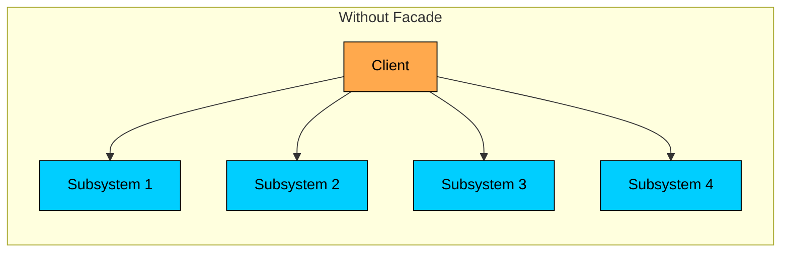
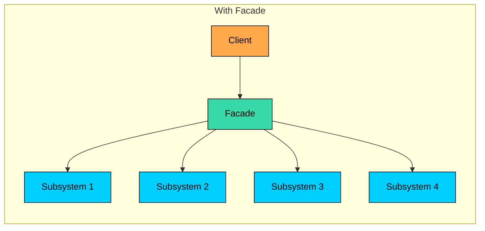
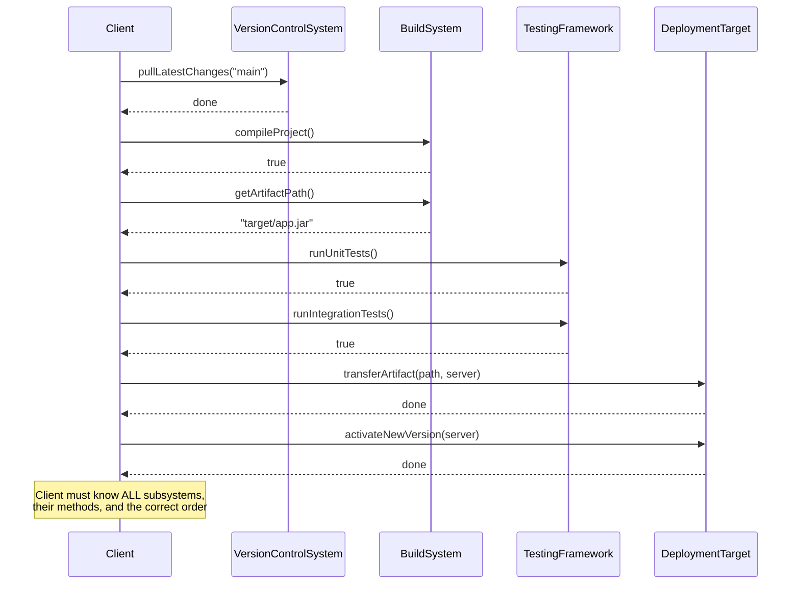
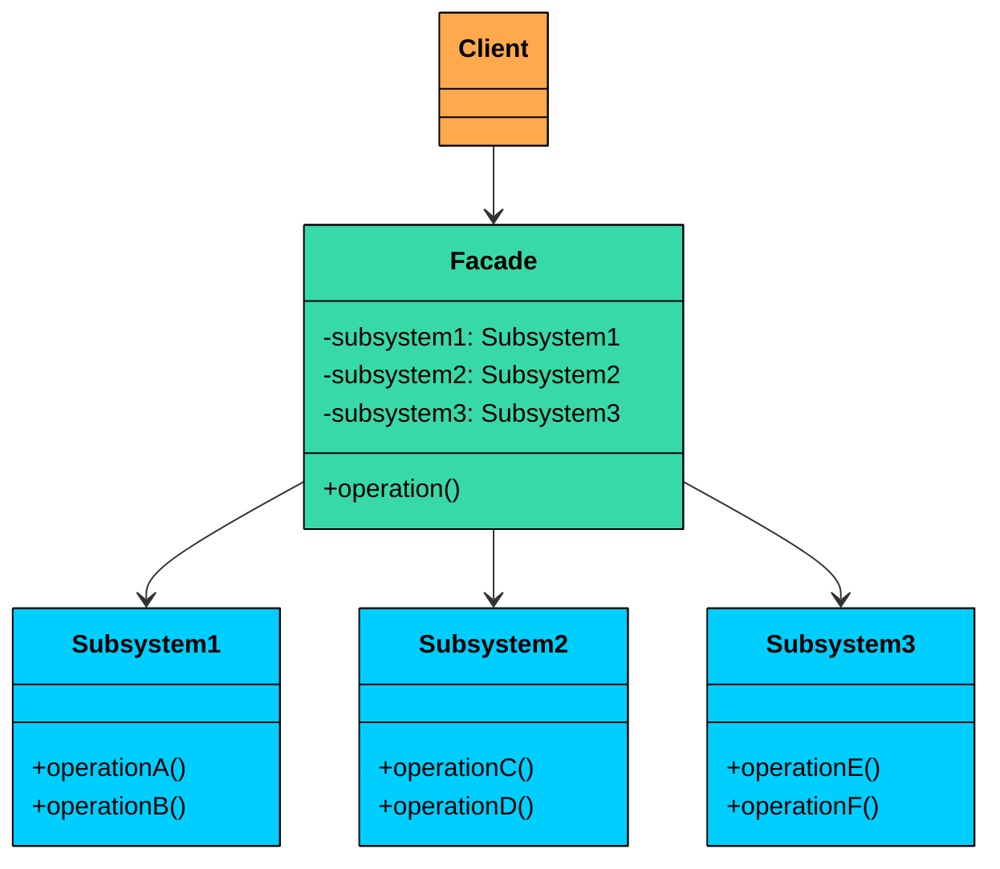
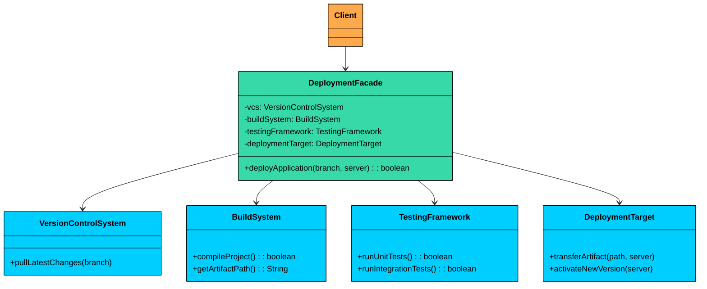
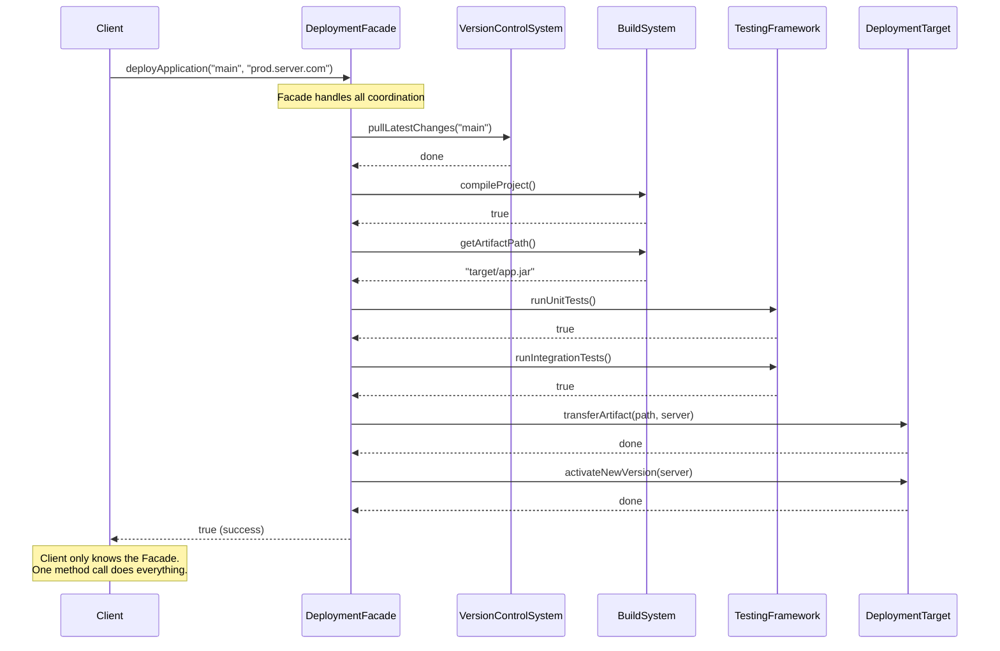
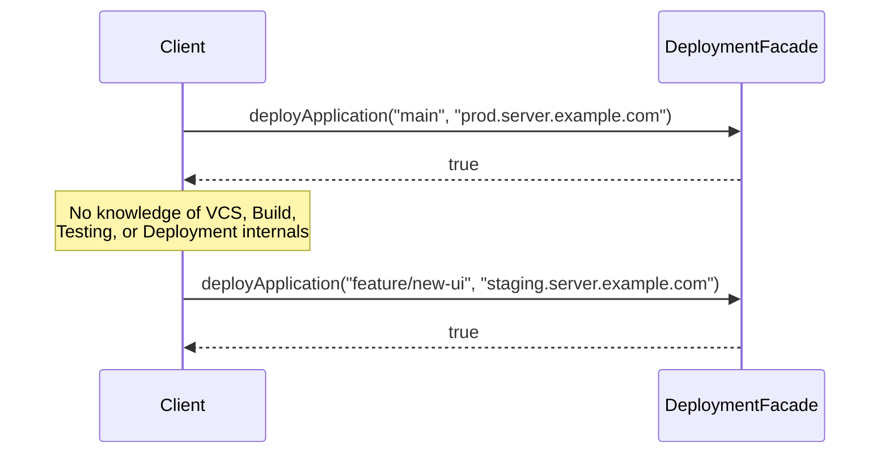
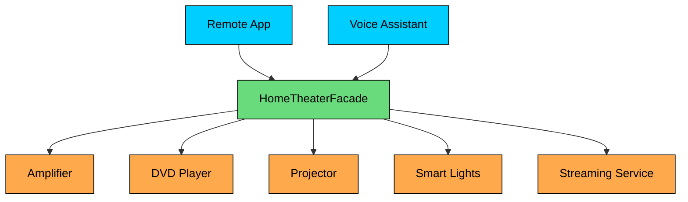

import React from 'react';
import CodeBlock from '../../../../components/ui/CodeBlock';
import Callout from '../../../../components/ui/Callout';

<div className="article-header">
  <div className="breadcrumb">
    <a href="/">Curated Notes</a>
    <span className="breadcrumb-separator">›</span>
    <span className="breadcrumb-current">Facade Design Pattern</span>
  </div>
  <h1>Facade Design Pattern</h1>
  <p style={{ color: 'var(--text-muted)', fontSize: '1.1rem', marginBottom: '16px', lineHeight: '1.6' }}>
    Master the essentials of Facade Design Pattern in this curated guide.
  </p>
  <div className="meta-info">
    <span className="meta-item">
      <svg width="14" height="14" viewBox="0 0 24 24" fill="none" stroke="currentColor" strokeWidth="2"><circle cx="12" cy="12" r="10"/><polyline points="12 6 12 12 16 14"/></svg>
      10 min read
    </span>
    <span className="difficulty-badge difficulty-badge--intermediate">Intermediate</span>
  </div>
</div>

<section className="content-section">


&gt; **DEFINITION**
&gt;
&gt; The **Facade Design Pattern** is a **structural design pattern** that provides a single, simplified interface to a complex subsystem. Instead of forcing clients to coordinate many moving parts, a facade hides the internal complexity and exposes a clean, easy-to-use entry point.


It’s particularly useful in situations where:

- Your system contains many interdependent classes or low-level APIs.
- The client doesn’t need to know how those parts work internally.
- You want to reduce coupling and make the system easier to learn and use.

In real applications, a “simple” task often requires orchestrating multiple components. Without a facade, each client ends up talking to several subsystems directly, and coordinating the sequence on its own.





The **Facade Pattern** solves this by introducing a single entry point, a facade, that wraps the complex interactions behind a clean and easy-to-use interface.





Now the client interacts with one object, while the facade coordinates the subsystem calls behind the scenes. This keeps client code simple, reduces coupling, and improves maintainability.

Let’s walk through a real-world example and see how we can apply the **Facade Pattern** to hide complexity and improve maintainability.

---

## 1. The Problem: Deployment Complexity

Let's say you're building a deployment automation tool for your development team.

On the surface, deploying an application may seem like a straightforward task, but in reality, it involves a sequence of coordinated, error-prone steps:

1. Pull the latest code from a Git repository
2. Build the project using a tool like Maven or Gradle
3. Run automated tests (unit, integration, maybe end-to-end)
4. Deploy the build artifact to a production environment

Each of these steps might be handled by a separate module or class, each with its own specific API and configuration.

#### Deployment Subsystems

#### 1. Version Control System

Handles interaction with Git or another VCS. Responsible for fetching the latest code.


```java
class VersionControlSystem {
    public void pullLatestChanges(String branch) {
        System.out.println("VCS: Pulling latest changes from '" + branch + "'...");
        simulateDelay();
        System.out.println("VCS: Pull complete.");
    }

    private void simulateDelay() {
        try {
            Thread.sleep(1000);
        } catch (InterruptedException e) {
            e.printStackTrace();
        }
    }
}
```

```python
class VersionControlSystem:
   def pull_latest_changes(self, branch):
       print(f"VCS: Pulling latest changes from '{branch}'...")
       self._simulate_delay()
       print("VCS: Pull complete.")

   def _simulate_delay(self):
       time.sleep(1)
```

```cpp
class VersionControlSystem {
public:
   void pullLatestChanges(string branch) {
       cout << "VCS: Pulling latest changes from '" << branch << "'..." << endl;
       simulateDelay();
       cout << "VCS: Pull complete." << endl;
   }

private:
   void simulateDelay() {
       this_thread::sleep_for(chrono::milliseconds(1000));
   }
};
```

```go
type VersionControlSystem struct{}

func (v *VersionControlSystem) PullLatestChanges(branch string) {
	fmt.Println("VCS: Pulling latest changes from '" + branch + "'...")
	v.simulateDelay()
	fmt.Println("VCS: Pull complete.")
}

func (v *VersionControlSystem) simulateDelay() {
	time.Sleep(1000 * time.Millisecond)
}
```

```csharp
class VersionControlSystem
{
   public void PullLatestChanges(string branch)
   {
       Console.WriteLine($"VCS: Pulling latest changes from '{branch}'...");
       SimulateDelay();
       Console.WriteLine("VCS: Pull complete.");
   }

   private void SimulateDelay()
   {
       Thread.Sleep(1000);
   }
}
```

```typescript
class VersionControlSystem {
   pullLatestChanges(branch: string): void {
       console.log("VCS: Pulling latest changes from '" + branch + "'...");
       this.simulateDelay();
       console.log("VCS: Pull complete.");
   }

   private simulateDelay(): void {
       // TypeScript/JavaScript doesn't have Thread.sleep, using setTimeout would be async
       // For simulation purposes, we'll use a synchronous delay
       const start = Date.now();
       while (Date.now() - start < 1000) {
           // Busy wait for 1 second
       }
   }
```


#### 2. Build System

Compiles the codebase, creates an artifact (like a `.jar`), and returns its location.


```java
class BuildSystem {
    public boolean compileProject() {
        System.out.println("BuildSystem: Compiling project...");
        simulateDelay(2000);
        System.out.println("BuildSystem: Build successful.");
        return true;
    }

    public String getArtifactPath() {
        String path = "target/myapplication-1.0.jar";
        System.out.println("BuildSystem: Artifact located at " + path);
        return path;
    }

    private void simulateDelay(int ms) {
        try {
            Thread.sleep(ms);
        } catch (InterruptedException e) {
            e.printStackTrace();
        }
    }
}
```

```python
class BuildSystem:
   def compile_project(self):
       print("BuildSystem: Compiling project...")
       self._simulate_delay(2)
       print("BuildSystem: Build successful.")
       return True

   def get_artifact_path(self):
       path = "target/myapplication-1.0.jar"
       print(f"BuildSystem: Artifact located at {path}")
       return path

   def _simulate_delay(self, seconds):
       time.sleep(seconds)
```

```cpp
class BuildSystem {
public:
   bool compileProject() {
       cout << "BuildSystem: Compiling project..." << endl;
       simulateDelay(2000);
       cout << "BuildSystem: Build successful." << endl;
       return true;
   }

   string getArtifactPath() {
       string path = "target/myapplication-1.0.jar";
       cout << "BuildSystem: Artifact located at " << path << endl;
       return path;
   }

private:
   void simulateDelay(int ms) {
       this_thread::sleep_for(chrono::milliseconds(ms));
   }
};
```

```go
type BuildSystem struct{}

func (b *BuildSystem) CompileProject() bool {
	fmt.Println("BuildSystem: Compiling project...")
	b.simulateDelay(2000)
	fmt.Println("BuildSystem: Build successful.")
	return true
}

func (b *BuildSystem) GetArtifactPath() string {
	path := "target/myapplication-1.0.jar"
	fmt.Println("BuildSystem: Artifact located at " + path)
	return path
}

func (b *BuildSystem) simulateDelay(ms int) {
	time.Sleep(time.Duration(ms) * time.Millisecond)
}
```

```csharp
class BuildSystem
{
   public bool CompileProject()
   {
       Console.WriteLine("BuildSystem: Compiling project...");
       SimulateDelay(2000);
       Console.WriteLine("BuildSystem: Build successful.");
       return true;
   }

   public string GetArtifactPath()
   {
       string path = "target/myapplication-1.0.jar";
       Console.WriteLine($"BuildSystem: Artifact located at {path}");
       return path;
   }

   private void SimulateDelay(int ms)
   {
       Thread.Sleep(ms);
   }
}
```

```typescript
class BuildSystem {
   compileProject(): boolean {
       console.log("BuildSystem: Compiling project...");
       this.simulateDelay(2000);
       console.log("BuildSystem: Build successful.");
       return true;
   }

   getArtifactPath(): string {
       const path = "target/myapplication-1.0.jar";
       console.log("BuildSystem: Artifact located at " + path);
       return path;
   }

   private simulateDelay(ms: number): void {
       const start = Date.now();
       while (Date.now() - start < ms) {
           // Busy wait
       }
   }
}
```


#### 3. Testing Framework

Executes unit and integration tests. Could also include E2E, mutation testing, or security scans in real-world setups.


```java
class TestingFramework {
    public boolean runUnitTests() {
        System.out.println("Testing: Running unit tests...");
        simulateDelay(1500);
        System.out.println("Testing: Unit tests passed.");
        return true;
    }

    public boolean runIntegrationTests() {
        System.out.println("Testing: Running integration tests...");
        simulateDelay(3000);
        System.out.println("Testing: Integration tests passed.");
        return true;
    }

    private void simulateDelay(int ms) {
        try {
            Thread.sleep(ms);
        } catch (InterruptedException e) {
            e.printStackTrace();
        }
    }
}
```

```python
class TestingFramework:
   def run_unit_tests(self):
       print("Testing: Running unit tests...")
       self._simulate_delay(1.5)
       print("Testing: Unit tests passed.")
       return True

   def run_integration_tests(self):
       print("Testing: Running integration tests...")
       self._simulate_delay(3)
       print("Testing: Integration tests passed.")
       return True

   def _simulate_delay(self, seconds):
       time.sleep(seconds)
```

```cpp
class TestingFramework {
public:
   bool runUnitTests() {
       cout << "Testing: Running unit tests..." << endl;
       simulateDelay(1500);
       cout << "Testing: Unit tests passed." << endl;
       return true;
   }

   bool runIntegrationTests() {
       cout << "Testing: Running integration tests..." << endl;
       simulateDelay(3000);
       cout << "Testing: Integration tests passed." << endl;
       return true;
   }

private:
   void simulateDelay(int ms) {
       this_thread::sleep_for(chrono::milliseconds(ms));
   }
};
```

```go
type TestingFramework struct{}

func (t *TestingFramework) RunUnitTests() bool {
	println("Testing: Running unit tests...")
	t.simulateDelay(1500)
	println("Testing: Unit tests passed.")
	return true
}

func (t *TestingFramework) RunIntegrationTests() bool {
	println("Testing: Running integration tests...")
	t.simulateDelay(3000)
	println("Testing: Integration tests passed.")
	return true
}

func (t *TestingFramework) simulateDelay(ms int) {
	start := time.Now()
	for time.Since(start) < time.Duration(ms)*time.Millisecond {
		// Busy wait
	}
}
```

```csharp
class TestingFramework
{
   public bool RunUnitTests()
   {
       Console.WriteLine("Testing: Running unit tests...");
       SimulateDelay(1500);
       Console.WriteLine("Testing: Unit tests passed.");
       return true;
   }

   public bool RunIntegrationTests()
   {
       Console.WriteLine("Testing: Running integration tests...");
       SimulateDelay(3000);
       Console.WriteLine("Testing: Integration tests passed.");
       return true;
   }

   private void SimulateDelay(int ms)
   {
       Thread.Sleep(ms);
   }
}
```

```typescript
class TestingFramework {
   runUnitTests(): boolean {
       console.log("Testing: Running unit tests...");
       this.simulateDelay(1500);
       console.log("Testing: Unit tests passed.");
       return true;
   }

   runIntegrationTests(): boolean {
       console.log("Testing: Running integration tests...");
       this.simulateDelay(3000);
       console.log("Testing: Integration tests passed.");
       return true;
   }

   private simulateDelay(ms: number): void {
       const start = Date.now();
       while (Date.now() - start < ms) {
           // Busy wait
       }
   }
}
```


#### 4. Deployment Target

Handles artifact delivery to the server and version activation.


```java
class DeploymentTarget {
    public void transferArtifact(String artifactPath, String server) {
        System.out.println("Deployment: Transferring " + artifactPath + " to " + server + "...");
        simulateDelay(1000);
        System.out.println("Deployment: Transfer complete.");
    }

    public void activateNewVersion(String server) {
        System.out.println("Deployment: Activating new version on " + server + "...");
        simulateDelay(500);
        System.out.println("Deployment: Now live on " + server + "!");
    }

    private void simulateDelay(int ms) {
        try {
            Thread.sleep(ms);
        } catch (InterruptedException e) {
            e.printStackTrace();
        }
    }
}
```

```python
class DeploymentTarget:
   def transfer_artifact(self, artifact_path, server):
       print(f"Deployment: Transferring {artifact_path} to {server}...")
       self._simulate_delay(1)
       print("Deployment: Transfer complete.")

   def activate_new_version(self, server):
       print(f"Deployment: Activating new version on {server}...")
       self._simulate_delay(0.5)
       print(f"Deployment: Now live on {server}!")

   def _simulate_delay(self, seconds):
       time.sleep(seconds)
```

```cpp
class DeploymentTarget {
public:
   void transferArtifact(string artifactPath, string server) {
       cout << "Deployment: Transferring " << artifactPath << " to " << server << "..." << endl;
       simulateDelay(1000);
       cout << "Deployment: Transfer complete." << endl;
   }

   void activateNewVersion(string server) {
       cout << "Deployment: Activating new version on " << server << "..." << endl;
       simulateDelay(500);
       cout << "Deployment: Now live on " << server << "!" << endl;
   }

private:
   void simulateDelay(int ms) {
       this_thread::sleep_for(chrono::milliseconds(ms));
   }
};
```

```go
type DeploymentTarget struct{}

func (d *DeploymentTarget) TransferArtifact(artifactPath string, server string) {
	fmt.Println("Deployment: Transferring " + artifactPath + " to " + server + "...")
	d.simulateDelay(1000)
	fmt.Println("Deployment: Transfer complete.")
}

func (d *DeploymentTarget) ActivateNewVersion(server string) {
	fmt.Println("Deployment: Activating new version on " + server + "...")
	d.simulateDelay(500)
	fmt.Println("Deployment: Now live on " + server + "!")
}

func (d *DeploymentTarget) simulateDelay(ms int) {
	time.Sleep(time.Duration(ms) * time.Millisecond)
}
```

```csharp
class DeploymentTarget
{
   public void TransferArtifact(string artifactPath, string server)
   {
       Console.WriteLine($"Deployment: Transferring {artifactPath} to {server}...");
       SimulateDelay(1000);
       Console.WriteLine("Deployment: Transfer complete.");
   }

   public void ActivateNewVersion(string server)
   {
       Console.WriteLine($"Deployment: Activating new version on {server}...");
       SimulateDelay(500);
       Console.WriteLine($"Deployment: Now live on {server}!");
   }

   private void SimulateDelay(int ms)
   {
       Thread.Sleep(ms);
   }
}
```

```typescript
class DeploymentTarget {
   transferArtifact(artifactPath: string, server: string): void {
       console.log("Deployment: Transferring " + artifactPath + " to " + server + "...");
       this.simulateDelay(1000);
       console.log("Deployment: Transfer complete.");
   }

   activateNewVersion(server: string): void {
       console.log("Deployment: Activating new version on " + server + "...");
       this.simulateDelay(500);
       console.log("Deployment: Now live on " + server + "!");
   }

   private simulateDelay(ms: number): void {
       const start = Date.now();
       while (Date.now() - start < ms) {
           // Busy wait
       }
   }
}
```


#### Client Code Without Facade

Without a facade, the client must directly interact with each subsystem, knowing exactly which methods to call and in what order.





The client is tightly coupled to every subsystem. Here is what that looks like in code.


```java
public class DeploymentClient {
    public static void main(String[] args) {
        String branch = "main";
        String prodServer = "prod.server.example.com";

        // Client must create and manage all subsystems
        VersionControlSystem vcs = new VersionControlSystem();
        BuildSystem buildSystem = new BuildSystem();
        TestingFramework testFramework = new TestingFramework();
        DeploymentTarget deployTarget = new DeploymentTarget();

        System.out.println("\n[Client] Starting deployment for branch: " + branch);

        // Step 1: Pull latest code
        vcs.pullLatestChanges(branch);

        // Step 2: Build the project
        if (!buildSystem.compileProject()) {
            System.err.println("[Client] Build failed. Deployment aborted.");
            return;
        }
        String artifact = buildSystem.getArtifactPath();

        // Step 3: Run tests
        if (!testFramework.runUnitTests()) {
            System.err.println("[Client] Unit tests failed. Deployment aborted.");
            return;
        }
        if (!testFramework.runIntegrationTests()) {
            System.err.println("[Client] Integration tests failed. Deployment aborted.");
            return;
        }

        // Step 4: Deploy to production
        deployTarget.transferArtifact(artifact, prodServer);
        deployTarget.activateNewVersion(prodServer);

        System.out.println("[Client] Deployment successful!");
    }
}
```

```python
import sys

class DeploymentClient:
    @staticmethod
    def main() -> None:
        branch = "main"
        prod_server = "prod.server.example.com"

        # Client must create and manage all subsystems
        vcs = VersionControlSystem()
        build_system = BuildSystem()
        test_framework = TestingFramework()
        deploy_target = DeploymentTarget()

        print(f"\n[Client] Starting deployment for branch: {branch}")

        # Step 1: Pull latest code
        vcs.pull_latest_changes(branch)

        # Step 2: Build the project
        if not build_system.compile_project():
            print("[Client] Build failed. Deployment aborted.", file=sys.stderr)
            return
        artifact = build_system.get_artifact_path()

        # Step 3: Run tests
        if not test_framework.run_unit_tests():
            print("[Client] Unit tests failed. Deployment aborted.", file=sys.stderr)
            return
        if not test_framework.run_integration_tests():
            print("[Client] Integration tests failed. Deployment aborted.", file=sys.stderr)
            return

        # Step 4: Deploy to production
        deploy_target.transfer_artifact(artifact, prod_server)
        deploy_target.activate_new_version(prod_server)

        print("[Client] Deployment successful!")
```

```cpp
class DeploymentClient {
public:
    static int Main() {
        string branch = "main";
        string prodServer = "prod.server.example.com";

        // Client must create and manage all subsystems
        VersionControlSystem vcs;
        BuildSystem buildSystem;
        TestingFramework testFramework;
        DeploymentTarget deployTarget;

        cout << "\n[Client] Starting deployment for branch: " << branch << "\n";

        // Step 1: Pull latest code
        vcs.pullLatestChanges(branch);

        // Step 2: Build the project
        if (!buildSystem.compileProject()) {
            cerr << "[Client] Build failed. Deployment aborted.\n";
            return 0;
        }
        string artifact = buildSystem.getArtifactPath();

        // Step 3: Run tests
        if (!testFramework.runUnitTests()) {
            cerr << "[Client] Unit tests failed. Deployment aborted.\n";
            return 0;
        }
        if (!testFramework.runIntegrationTests()) {
            cerr << "[Client] Integration tests failed. Deployment aborted.\n";
            return 0;
        }

        // Step 4: Deploy to production
        deployTarget.transferArtifact(artifact, prodServer);
        deployTarget.activateNewVersion(prodServer);

        cout << "[Client] Deployment successful!\n";
        return 0;
    }
};
```

```go
type DeploymentClient struct{}

func (DeploymentClient) Main() {
	branch := "main"
	prodServer := "prod.server.example.com"

	// Client must create and manage all subsystems
	vcs := VersionControlSystem{}
	buildSystem := BuildSystem{}
	testFramework := TestingFramework{}
	deployTarget := DeploymentTarget{}

	fmt.Print("\n[Client] Starting deployment for branch: ", branch, "\n")

	// Step 1: Pull latest code
	vcs.pullLatestChanges(branch)

	// Step 2: Build the project
	if !buildSystem.compileProject() {
		fmt.Fprintln(os.Stderr, "[Client] Build failed. Deployment aborted.")
		return
	}
	artifact := buildSystem.getArtifactPath()

	// Step 3: Run tests
	if !testFramework.runUnitTests() {
		fmt.Fprintln(os.Stderr, "[Client] Unit tests failed. Deployment aborted.")
		return
	}
	if !testFramework.runIntegrationTests() {
		fmt.Fprintln(os.Stderr, "[Client] Integration tests failed. Deployment aborted.")
		return
	}

	// Step 4: Deploy to production
	deployTarget.transferArtifact(artifact, prodServer)
	deployTarget.activateNewVersion(prodServer)

	fmt.Println("[Client] Deployment successful!")
}
```

```csharp
public class DeploymentClient
{
    public static void Main(string[] args)
    {
        string branch = "main";
        string prodServer = "prod.server.example.com";

        // Client must create and manage all subsystems
        VersionControlSystem vcs = new VersionControlSystem();
        BuildSystem buildSystem = new BuildSystem();
        TestingFramework testFramework = new TestingFramework();
        DeploymentTarget deployTarget = new DeploymentTarget();

        Console.WriteLine("\n[Client] Starting deployment for branch: " + branch);

        // Step 1: Pull latest code
        vcs.PullLatestChanges(branch);

        // Step 2: Build the project
        if (!buildSystem.CompileProject())
        {
            Console.Error.WriteLine("[Client] Build failed. Deployment aborted.");
            return;
        }
        string artifact = buildSystem.GetArtifactPath();

        // Step 3: Run tests
        if (!testFramework.RunUnitTests())
        {
            Console.Error.WriteLine("[Client] Unit tests failed. Deployment aborted.");
            return;
        }
        if (!testFramework.RunIntegrationTests())
        {
            Console.Error.WriteLine("[Client] Integration tests failed. Deployment aborted.");
            return;
        }

        // Step 4: Deploy to production
        deployTarget.TransferArtifact(artifact, prodServer);
        deployTarget.ActivateNewVersion(prodServer);

        Console.WriteLine("[Client] Deployment successful!");
    }
}
```

```typescript
class DeploymentClient {
  public static main(): void {
    const branch: string = "main";
    const prodServer: string = "prod.server.example.com";

    // Client must create and manage all subsystems
    const vcs = new VersionControlSystem();
    const buildSystem = new BuildSystem();
    const testFramework = new TestingFramework();
    const deployTarget = new DeploymentTarget();

    console.log(`\n[Client] Starting deployment for branch: ${branch}`);

    // Step 1: Pull latest code
    vcs.pullLatestChanges(branch);

    // Step 2: Build the project
    if (!buildSystem.compileProject()) {
      console.error("[Client] Build failed. Deployment aborted.");
      return;
    }
    const artifact: string = buildSystem.getArtifactPath();

    // Step 3: Run tests
    if (!testFramework.runUnitTests()) {
      console.error("[Client] Unit tests failed. Deployment aborted.");
      return;
    }
    if (!testFramework.runIntegrationTests()) {
      console.error("[Client] Integration tests failed. Deployment aborted.");
      return;
    }

    // Step 4: Deploy to production
    deployTarget.transferArtifact(artifact, prodServer);
    deployTarget.activateNewVersion(prodServer);

    console.log("[Client] Deployment successful!");
  }
}
```


Now imagine you need to deploy from another part of your application, maybe a webhook handler, a scheduled job, or a different service. You would have to duplicate this entire sequence of calls, along with all the error handling logic.

#### What’s Wrong with This Design?

While this code works, it leads to several problems as your system grows:

#### 1. High Client Complexity

The client must be aware of every subsystem: what classes to instantiate, what methods to call, in what sequence, and what to do on success or failure. This bloats the client's responsibility and tightly couples it to the internal workings of the deployment pipeline.

#### 2. Tight Coupling

The client directly depends on `VersionControlSystem`, `BuildSystem`, `TestingFramework`, and `DeploymentTarget`. A change in any one of them (e.g., `compileProject()` now requires an environment parameter) will ripple through every client that performs deployments.

#### 3. Poor Maintainability

Want to add a code quality scan before deployment? Send Slack notifications after deployment? Integrate a rollback mechanism? 

You will need to update every place that performs deployments, bloating them with more logic and increasing the chance of inconsistency.

#### 4. Difficult Testing

Testing the client requires mocking four different subsystems. Each test must set up expectations for the entire deployment sequence, making tests brittle and hard to maintain.

#### What We Need

We need a way to hide the complexity of the underlying subsystems, expose a simple and unified interface to perform deployments, decouple the client code from the internal workflow, and make the system easier to maintain, test, and evolve.

This is exactly where the **Facade Pattern** fits in.

---

## 2. The Facade Design Pattern

&gt; The Facade Pattern introduces a 
&gt;
&gt; **high-level interface**
&gt;
&gt;  that hides the complexities of one or more subsystems and exposes only the functionality needed by the client.


&gt; **Real-World Analogy**
&gt;
&gt; Think of a high-end hotel. As a guest (the client), you don't want to individually contact housekeeping for a fresh towel, the restaurant for dinner reservations, and the valet for your car. Instead, you call the **Concierge Desk** (the Facade).
&gt;
&gt; You make a simple request to the concierge, like "I'd like dinner reservations at 8 PM and my car ready afterwards." The concierge then interacts with all the necessary hotel departments (the subsystem) to fulfill your request.
&gt;
&gt; You, as the guest, are shielded from this internal complexity. The Concierge Desk provides a simplified interface to the hotel's services.


---

### Class Diagram





#### **Facade **(e.g., `DeploymentFacade`)

Knows **which subsystem classes** to use and **in what order**. Delegates requests to appropriate subsystem methods without exposing internal details to the client.

#### **Subsystem Classes **(e.g., `VersionControlSystem`, `BuildSystem)`

Provides the actual business logic to handle a specific task. **Do not know** about the facade. Can still be used independently if needed.

#### **Client (e.g., our main application or a script)**

Uses the Facade to initiate a deployment, instead of interacting with the subsystem classes directly.

#### Applying to Our Example

Here's how the Facade pattern maps to our deployment system:





---

## 3. Implementing the Facade

The `DeploymentFacade` class serves as a single, unified interface to the complex set of operations involved in application deployment.

Internally, it holds references to the core building blocks of the deployment pipeline:

- **VersionControlSystem** - Fetches the latest code from a Git branch
- **BuildSystem** - Compiles the code and generates the deployable artifact
- **TestingFramework** - Runs automated tests (unit, integration)
- **DeploymentTarget** - Transfers the artifact and activates it on the target server

Rather than forcing the client to call each of these subsystems in the correct order, the facade abstracts this coordination logic and offers a clean, high-level method like `deployApplication()` that executes the full workflow.

#### How It Works

Here is the full deployment flow through the facade.





The client makes one call. The facade handles the entire orchestration internally. If any step fails, the facade returns false and the client never has to know which subsystem caused the problem.

#### The Facade Class


```java
class DeploymentFacade {
    private VersionControlSystem vcs = new VersionControlSystem();
    private BuildSystem buildSystem = new BuildSystem();
    private TestingFramework testingFramework = new TestingFramework();
    private DeploymentTarget deploymentTarget = new DeploymentTarget();

    public boolean deployApplication(String branch, String serverAddress) {
        System.out.println("\nFACADE: --- Initiating FULL DEPLOYMENT for branch: " + branch + " to " + serverAddress + " ---");
        boolean success = true;

        try {
            vcs.pullLatestChanges(branch);

            if (!buildSystem.compileProject()) {
                System.err.println("FACADE: DEPLOYMENT FAILED - Build compilation failed.");
                return false;
            }

            String artifactPath = buildSystem.getArtifactPath();

            if (!testingFramework.runUnitTests()) {
                System.err.println("FACADE: DEPLOYMENT FAILED - Unit tests failed.");
                return false;
            }

            if (!testingFramework.runIntegrationTests()) {
                System.err.println("FACADE: DEPLOYMENT FAILED - Integration tests failed.");
                return false;
            }

            deploymentTarget.transferArtifact(artifactPath, serverAddress);
            deploymentTarget.activateNewVersion(serverAddress);

            System.out.println("FACADE: APPLICATION DEPLOYED SUCCESSFULLY to " + serverAddress + "!");
        } catch (Exception e) {
            System.err.println("FACADE: DEPLOYMENT FAILED - An unexpected error occurred: " + e.getMessage());
            e.printStackTrace();
            success = false;
        }

        return success;
    }
}
```

```python
class DeploymentFacade:
   def __init__(self):
       self.vcs = VersionControlSystem()
       self.build_system = BuildSystem()
       self.testing_framework = TestingFramework()
       self.deployment_target = DeploymentTarget()

   def deploy_application(self, branch, server_address):
       print(f"\nFACADE: --- Initiating FULL DEPLOYMENT for branch: {branch} to {server_address} ---")
       success = True

       try:
           self.vcs.pull_latest_changes(branch)

           if not self.build_system.compile_project():
               print("FACADE: DEPLOYMENT FAILED - Build compilation failed.", file=sys.stderr)
               return False

           artifact_path = self.build_system.get_artifact_path()

           if not self.testing_framework.run_unit_tests():
               print("FACADE: DEPLOYMENT FAILED - Unit tests failed.", file=sys.stderr)
               return False

           if not self.testing_framework.run_integration_tests():
               print("FACADE: DEPLOYMENT FAILED - Integration tests failed.", file=sys.stderr)
               return False

           self.deployment_target.transfer_artifact(artifact_path, server_address)
           self.deployment_target.activate_new_version(server_address)

           print(f"FACADE: APPLICATION DEPLOYED SUCCESSFULLY to {server_address}!")
       except Exception as e:
           print(f"FACADE: DEPLOYMENT FAILED - An unexpected error occurred: {str(e)}", file=sys.stderr)
           import traceback
           traceback.print_exc()
           success = False

       return success
```

```cpp
class DeploymentFacade {
private:
   VersionControlSystem vcs;
   BuildSystem buildSystem;
   TestingFramework testingFramework;
   DeploymentTarget deploymentTarget;

public:
   bool deployApplication(string branch, string serverAddress) {
       cout << "\nFACADE: --- Initiating FULL DEPLOYMENT for branch: " << branch << " to " << serverAddress << " ---" << endl;
       bool success = true;

       try {
           vcs.pullLatestChanges(branch);

           if (!buildSystem.compileProject()) {
               cerr << "FACADE: DEPLOYMENT FAILED - Build compilation failed." << endl;
               return false;
           }

           string artifactPath = buildSystem.getArtifactPath();

           if (!testingFramework.runUnitTests()) {
               cerr << "FACADE: DEPLOYMENT FAILED - Unit tests failed." << endl;
               return false;
           }

           if (!testingFramework.runIntegrationTests()) {
               cerr << "FACADE: DEPLOYMENT FAILED - Integration tests failed." << endl;
               return false;
           }

           deploymentTarget.transferArtifact(artifactPath, serverAddress);
           deploymentTarget.activateNewVersion(serverAddress);

           cout << "FACADE: APPLICATION DEPLOYED SUCCESSFULLY to " << serverAddress << "!" << endl;
       } catch (exception& e) {
           cerr << "FACADE: DEPLOYMENT FAILED - An unexpected error occurred: " << e.what() << endl;
           success = false;
       }

       return success;
   }
};
```

```go
type DeploymentFacade struct {
	vcs              *VersionControlSystem
	buildSystem      *BuildSystem
	testingFramework *TestingFramework
	deploymentTarget *DeploymentTarget
}

func (d *DeploymentFacade) deployApplication(branch, serverAddress string) bool {
	println("\nFACADE: --- Initiating FULL DEPLOYMENT for branch: " + branch + " to " + serverAddress + " ---")
	success := true

	defer func() {
		if r := recover(); r != nil {
			println("FACADE: DEPLOYMENT FAILED - An unexpected error occurred.")
			success = false
		}
	}()

	d.vcs.pullLatestChanges(branch)

	if !d.buildSystem.compileProject() {
		println("FACADE: DEPLOYMENT FAILED - Build compilation failed.")
		return false
	}

	artifactPath := d.buildSystem.getArtifactPath()

	if !d.testingFramework.runUnitTests() {
		println("FACADE: DEPLOYMENT FAILED - Unit tests failed.")
		return false
	}

	if !d.testingFramework.runIntegrationTests() {
		println("FACADE: DEPLOYMENT FAILED - Integration tests failed.")
		return false
	}

	d.deploymentTarget.transferArtifact(artifactPath, serverAddress)
	d.deploymentTarget.activateNewVersion(serverAddress)

	println("FACADE: APPLICATION DEPLOYED SUCCESSFULLY to " + serverAddress + "!")
	return success
}
```

```csharp
class DeploymentFacade
{
   private VersionControlSystem vcs = new VersionControlSystem();
   private BuildSystem buildSystem = new BuildSystem();
   private TestingFramework testingFramework = new TestingFramework();
   private DeploymentTarget deploymentTarget = new DeploymentTarget();

   public bool DeployApplication(string branch, string serverAddress)
   {
       Console.WriteLine($"\nFACADE: --- Initiating FULL DEPLOYMENT for branch: {branch} to {serverAddress} ---");
       bool success = true;

       try
       {
           vcs.PullLatestChanges(branch);

           if (!buildSystem.CompileProject())
           {
               Console.Error.WriteLine("FACADE: DEPLOYMENT FAILED - Build compilation failed.");
               return false;
           }

           string artifactPath = buildSystem.GetArtifactPath();

           if (!testingFramework.RunUnitTests())
           {
               Console.Error.WriteLine("FACADE: DEPLOYMENT FAILED - Unit tests failed.");
               return false;
           }

           if (!testingFramework.RunIntegrationTests())
           {
               Console.Error.WriteLine("FACADE: DEPLOYMENT FAILED - Integration tests failed.");
               return false;
           }

           deploymentTarget.TransferArtifact(artifactPath, serverAddress);
           deploymentTarget.ActivateNewVersion(serverAddress);

           Console.WriteLine($"FACADE: APPLICATION DEPLOYED SUCCESSFULLY to {serverAddress}!");
       }
       catch (Exception e)
       {
           Console.Error.WriteLine($"FACADE: DEPLOYMENT FAILED - An unexpected error occurred: {e.Message}");
           Console.Error.WriteLine(e.StackTrace);
           success = false;
       }

       return success;
   }
}
```

```typescript
class DeploymentFacade {
   private vcs = new VersionControlSystem();
   private buildSystem = new BuildSystem();
   private testingFramework = new TestingFramework();
   private deploymentTarget = new DeploymentTarget();

   deployApplication(branch: string, serverAddress: string): boolean {
       console.log("\nFACADE: --- Initiating FULL DEPLOYMENT for branch: " + branch + " to " + serverAddress + " ---");
       let success = true;

       try {
           this.vcs.pullLatestChanges(branch);

           if (!this.buildSystem.compileProject()) {
               console.error("FACADE: DEPLOYMENT FAILED - Build compilation failed.");
               return false;
           }

           const artifactPath = this.buildSystem.getArtifactPath();

           if (!this.testingFramework.runUnitTests()) {
               console.error("FACADE: DEPLOYMENT FAILED - Unit tests failed.");
               return false;
           }

           if (!this.testingFramework.runIntegrationTests()) {
               console.error("FACADE: DEPLOYMENT FAILED - Integration tests failed.");
               return false;
           }

           this.deploymentTarget.transferArtifact(artifactPath, serverAddress);
           this.deploymentTarget.activateNewVersion(serverAddress);

           console.log("FACADE: APPLICATION DEPLOYED SUCCESSFULLY to " + serverAddress + "!");
       } catch (e) {
           console.error("FACADE: DEPLOYMENT FAILED - An unexpected error occurred: " + (e as Error).message);
           console.error(e);
           success = false;
       }

       return success;
   }
}
```


Thanks to the facade, the client no longer needs to understand or interact with individual subsystems. It does not need to worry about the sequence of operations, error handling, or internal logic. It simply calls one expressive method: `deployApplication()`.

#### Using the Facade from the Client

With the facade in place, the client code becomes dramatically simpler.





```java
public class DeploymentAppFacade {
    public static void main(String[] args) {
        DeploymentFacade deploymentFacade = new DeploymentFacade();

        // Deploy to production
        deploymentFacade.deployApplication("main", "prod.server.example.com");

        // Deploy a feature branch to staging
        System.out.println("\n--- Deploying feature branch to staging ---");
        deploymentFacade.deployApplication("feature/new-ui", "staging.server.example.com");
    }
}
```

```python
class DeploymentAppFacade:
   @staticmethod
   def main():
       deployment_facade = DeploymentFacade()

       # Deploy to production
       deployment_facade.deploy_application("main", "prod.server.example.com")

       # Deploy a feature branch to staging
       print("\n--- Deploying feature branch to staging ---")
       deployment_facade.deploy_application("feature/new-ui", "staging.server.example.com")

if __name__ == "__main__":
   DeploymentAppFacade.main()
```

```cpp
class DeploymentAppFacade {
public:
   static void main() {
       DeploymentFacade deploymentFacade;

       // Deploy to production
       deploymentFacade.deployApplication("main", "prod.server.example.com");

       // Deploy a feature branch to staging
       cout << "\n--- Deploying feature branch to staging ---" << endl;
       deploymentFacade.deployApplication("feature/new-ui", "staging.server.example.com");
   }
};

int main() {
   DeploymentAppFacade::main();
   return 0;
}
```

```go
func main() {
	deploymentFacade := DeploymentFacade{}

	// Deploy to production
	deploymentFacade.deployApplication("main", "prod.server.example.com")

	// Deploy a feature branch to staging
	println("\n--- Deploying feature branch to staging ---")
	deploymentFacade.deployApplication("feature/new-ui", "staging.server.example.com")
}
```

```csharp
public class DeploymentAppFacade
{
   public static void Main(string[] args)
   {
       DeploymentFacade deploymentFacade = new DeploymentFacade();

       // Deploy to production
       deploymentFacade.DeployApplication("main", "prod.server.example.com");

       // Deploy a feature branch to staging
       Console.WriteLine("\n--- Deploying feature branch to staging ---");
       deploymentFacade.DeployApplication("feature/new-ui", "staging.server.example.com");
   }
}
```

```typescript
class DeploymentAppFacade {
   static main(): void {
       const deploymentFacade = new DeploymentFacade();

       // Deploy to production
       deploymentFacade.deployApplication("main", "prod.server.example.com");

       // Deploy a feature branch to staging
       console.log("\n--- Deploying feature branch to staging ---");
       deploymentFacade.deployApplication("feature/new-ui", "staging.server.example.com");
   }
}
```


Simple, readable, and maintainable. The client does not know (or care) how many moving parts are involved. It just knows that deployment works.

#### Evolving the System: No Changes to Client

One of the most powerful aspects of the Facade Pattern is how it insulates client code from internal changes.

Suppose tomorrow we need to add:

- `deployHotfix(branch, server)` - Deploy with expedited testing
- `rollbackLastDeployment(server)` - Revert to the previous version
- `checkDeploymentStatus(server)` - Query current deployment state
- Code quality scans before deployment
- Slack notifications after deployment

You can implement the logic behind the scenes (e.g., by introducing new classes like `CodeQualityScanner`, `NotificationService`, `DeploymentHistoryManager`, etc.), and expose them as new methods in the `DeploymentFacade`.

The existing client code remains completely untouched.


```java
deploymentFacade.deployHotfix("hotfix/urgent-patch", "prod.server.example.com");
deploymentFacade.rollbackLastDeployment("prod.server.example.com");
deploymentFacade.checkDeploymentStatus("staging.server.example.com");
```


The facade absorbs the complexity of new subsystems. Clients that only need basic deployment keep calling `deployApplication()` and never see the new internal components. Clients that need the new features get clean, purpose-built methods. This is the core value proposition: the subsystem can evolve freely as long as the facade's public interface remains stable.

---

## 4. Practical Example: Home Theater System

Imagine you have a home theater with multiple components: an amplifier, a DVD player, a projector, a streaming service, and smart lights. Watching a movie requires turning on the projector, dimming the lights, powering up the amplifier, setting the volume, and starting the movie. That is five subsystems with specific sequencing requirements.

Without a facade, every part of your application that wants to play a movie (a remote control app, a voice assistant integration, a scheduled movie night feature) needs to know all those steps. A `HomeTheaterFacade` wraps them into `watchMovie()` and `endMovie()`.





#### Implementation


```java
// --- Subsystems ---

class Amplifier {
    public void on() { System.out.println("Amplifier: Powering on."); }
    public void off() { System.out.println("Amplifier: Shutting down."); }
    public void setVolume(int level) { System.out.println("Amplifier: Volume set to " + level + "."); }
}

class DvdPlayer {
    public void on() { System.out.println("DVD Player: Powering on."); }
    public void off() { System.out.println("DVD Player: Shutting down."); }
    public void play(String movie) { System.out.println("DVD Player: Playing '" + movie + "'."); }
    public void stop() { System.out.println("DVD Player: Stopped."); }
}

class Projector {
    public void on() { System.out.println("Projector: Warming up."); }
    public void off() { System.out.println("Projector: Cooling down."); }
    public void wideScreenMode() { System.out.println("Projector: Widescreen mode enabled."); }
}

class SmartLights {
    public void dim(int level) { System.out.println("Lights: Dimmed to " + level + "%."); }
    public void on() { System.out.println("Lights: Full brightness."); }
}

class StreamingService {
    public void connect() { System.out.println("Streaming: Connected to service."); }
    public void disconnect() { System.out.println("Streaming: Disconnected."); }
    public void stream(String movie) { System.out.println("Streaming: Now streaming '" + movie + "'."); }
}

// --- Facade ---

class HomeTheaterFacade {
    private Amplifier amp;
    private DvdPlayer dvd;
    private Projector projector;
    private SmartLights lights;
    private StreamingService streaming;

    public HomeTheaterFacade(Amplifier amp, DvdPlayer dvd, Projector projector,
                             SmartLights lights, StreamingService streaming) {
        this.amp = amp;
        this.dvd = dvd;
        this.projector = projector;
        this.lights = lights;
        this.streaming = streaming;
    }

    public void watchMovie(String movie) {
        System.out.println("\n--- Preparing to watch: " + movie + " ---");
        lights.dim(15);
        projector.on();
        projector.wideScreenMode();
        amp.on();
        amp.setVolume(20);
        streaming.connect();
        streaming.stream(movie);
        System.out.println("--- Enjoy the movie! ---\n");
    }

    public void endMovie() {
        System.out.println("\n--- Shutting down home theater ---");
        streaming.disconnect();
        amp.off();
        projector.off();
        lights.on();
        System.out.println("--- Home theater off ---\n");
    }
}

// --- Client ---

public class HomeTheaterApp {
    public static void main(String[] args) {
        Amplifier amp = new Amplifier();
        DvdPlayer dvd = new DvdPlayer();
        Projector projector = new Projector();
        SmartLights lights = new SmartLights();
        StreamingService streaming = new StreamingService();

        HomeTheaterFacade theater = new HomeTheaterFacade(amp, dvd, projector, lights, streaming);

        theater.watchMovie("Interstellar");
        theater.endMovie();
    }
}
```

```python
## --- Subsystems ---

class Amplifier:
    def on(self): print("Amplifier: Powering on.")
    def off(self): print("Amplifier: Shutting down.")
    def set_volume(self, level): print(f"Amplifier: Volume set to {level}.")

class DvdPlayer:
    def on(self): print("DVD Player: Powering on.")
    def off(self): print("DVD Player: Shutting down.")
    def play(self, movie): print(f"DVD Player: Playing '{movie}'.")
    def stop(self): print("DVD Player: Stopped.")

class Projector:
    def on(self): print("Projector: Warming up.")
    def off(self): print("Projector: Cooling down.")
    def wide_screen_mode(self): print("Projector: Widescreen mode enabled.")

class SmartLights:
    def dim(self, level): print(f"Lights: Dimmed to {level}%.")
    def on(self): print("Lights: Full brightness.")

class StreamingService:
    def connect(self): print("Streaming: Connected to service.")
    def disconnect(self): print("Streaming: Disconnected.")
    def stream(self, movie): print(f"Streaming: Now streaming '{movie}'.")

## --- Facade ---

class HomeTheaterFacade:
    def __init__(self, amp, dvd, projector, lights, streaming):
        self.amp = amp
        self.dvd = dvd
        self.projector = projector
        self.lights = lights
        self.streaming = streaming

    def watch_movie(self, movie):
        print(f"\n--- Preparing to watch: {movie} ---")
        self.lights.dim(15)
        self.projector.on()
        self.projector.wide_screen_mode()
        self.amp.on()
        self.amp.set_volume(20)
        self.streaming.connect()
        self.streaming.stream(movie)
        print("--- Enjoy the movie! ---\n")

    def end_movie(self):
        print("\n--- Shutting down home theater ---")
        self.streaming.disconnect()
        self.amp.off()
        self.projector.off()
        self.lights.on()
        print("--- Home theater off ---\n")

## --- Client ---

if __name__ == "__main__":
    amp = Amplifier()
    dvd = DvdPlayer()
    projector = Projector()
    lights = SmartLights()
    streaming = StreamingService()

    theater = HomeTheaterFacade(amp, dvd, projector, lights, streaming)

    theater.watch_movie("Interstellar")
    theater.end_movie()
```

```cpp
#include <iostream>
#include <string>
using namespace std;

// --- Subsystems ---

class Amplifier {
public:
    void on() {
        cout << "Amplifier: Powering on." << endl;
    }

    void off() {
        cout << "Amplifier: Shutting down." << endl;
    }

    void setVolume(int level) {
        cout << "Amplifier: Volume set to " << level << "." << endl;
    }
};

class DvdPlayer {
public:
    void on() {
        cout << "DVD Player: Powering on." << endl;
    }

    void off() {
        cout << "DVD Player: Shutting down." << endl;
    }

    void play(string movie) {
        cout << "DVD Player: Playing '" << movie << "'." << endl;
    }

    void stop() {
        cout << "DVD Player: Stopped." << endl;
    }
};

class Projector {
public:
    void on() {
        cout << "Projector: Warming up." << endl;
    }

    void off() {
        cout << "Projector: Cooling down." << endl;
    }

    void wideScreenMode() {
        cout << "Projector: Widescreen mode enabled." << endl;
    }
};

class SmartLights {
public:
    void dim(int level) {
        cout << "Lights: Dimmed to " << level << "%." << endl;
    }

    void on() {
        cout << "Lights: Full brightness." << endl;
    }
};

class StreamingService {
public:
    void connect() {
        cout << "Streaming: Connected to service." << endl;
    }

    void disconnect() {
        cout << "Streaming: Disconnected." << endl;
    }

    void stream(string movie) {
        cout << "Streaming: Now streaming '" << movie << "'." << endl;
    }
};

// --- Facade ---

class HomeTheaterFacade {
private:
    Amplifier& amp;
    DvdPlayer& dvd;
    Projector& projector;
    SmartLights& lights;
    StreamingService& streaming;

public:
    HomeTheaterFacade(Amplifier& amp, DvdPlayer& dvd, Projector& projector,
                      SmartLights& lights, StreamingService& streaming)
        : amp(amp), dvd(dvd), projector(projector), lights(lights), streaming(streaming) {}

    void watchMovie(string movie) {
        cout << "\n--- Preparing to watch: " << movie << " ---" << endl;
        lights.dim(15);
        projector.on();
        projector.wideScreenMode();
        amp.on();
        amp.setVolume(20);
        streaming.connect();
        streaming.stream(movie);
        cout << "--- Enjoy the movie! ---\n" << endl;
    }

    void endMovie() {
        cout << "\n--- Shutting down home theater ---" << endl;
        streaming.disconnect();
        amp.off();
        projector.off();
        lights.on();
        cout << "--- Home theater off ---\n" << endl;
    }
};

// --- Client ---

int main() {
    Amplifier amp;
    DvdPlayer dvd;
    Projector projector;
    SmartLights lights;
    StreamingService streaming;

    HomeTheaterFacade theater(amp, dvd, projector, lights, streaming);

    theater.watchMovie("Interstellar");
    theater.endMovie();

    return 0;
}
```

```go
package main

import "fmt"

// --- Subsystems ---

type Amplifier struct{}

func (a *Amplifier) On()  { fmt.Println("Amplifier: Powering on.") }
func (a *Amplifier) Off() { fmt.Println("Amplifier: Shutting down.") }

func (a *Amplifier) SetVolume(level int) {
	fmt.Printf("Amplifier: Volume set to %d.\n", level)
}

type DvdPlayer struct{}

func (d *DvdPlayer) On()  { fmt.Println("DVD Player: Powering on.") }
func (d *DvdPlayer) Off() { fmt.Println("DVD Player: Shutting down.") }

func (d *DvdPlayer) Play(movie string) {
	fmt.Println("DVD Player: Playing '" + movie + "'.")
}

func (d *DvdPlayer) Stop() {
	fmt.Println("DVD Player: Stopped.")
}

type Projector struct{}

func (p *Projector) On()  { fmt.Println("Projector: Warming up.") }
func (p *Projector) Off() { fmt.Println("Projector: Cooling down.") }

func (p *Projector) WideScreenMode() {
	fmt.Println("Projector: Widescreen mode enabled.")
}

type SmartLights struct{}

func (s *SmartLights) Dim(level int) {
	fmt.Printf("Lights: Dimmed to %d%%.\n", level)
}

func (s *SmartLights) On() {
	fmt.Println("Lights: Full brightness.")
}

type StreamingService struct{}

func (s *StreamingService) Connect() {
	fmt.Println("Streaming: Connected to service.")
}

func (s *StreamingService) Disconnect() {
	fmt.Println("Streaming: Disconnected.")
}

func (s *StreamingService) Stream(movie string) {
	fmt.Println("Streaming: Now streaming '" + movie + "'.")
}

// --- Facade ---

type HomeTheaterFacade struct {
	amp       *Amplifier
	dvd       *DvdPlayer
	projector *Projector
	lights    *SmartLights
	streaming *StreamingService
}

func NewHomeTheaterFacade(
	amp *Amplifier,
	dvd *DvdPlayer,
	projector *Projector,
	lights *SmartLights,
	streaming *StreamingService,
) *HomeTheaterFacade {
	return &HomeTheaterFacade{
		amp:       amp,
		dvd:       dvd,
		projector: projector,
		lights:    lights,
		streaming: streaming,
	}
}

func (h *HomeTheaterFacade) WatchMovie(movie string) {
	fmt.Println("\n--- Preparing to watch: " + movie + " ---")
	h.lights.Dim(15)
	h.projector.On()
	h.projector.WideScreenMode()
	h.amp.On()
	h.amp.SetVolume(20)
	h.streaming.Connect()
	h.streaming.Stream(movie)
	fmt.Println("--- Enjoy the movie! ---\n")
}

func (h *HomeTheaterFacade) EndMovie() {
	fmt.Println("\n--- Shutting down home theater ---")
	h.streaming.Disconnect()
	h.amp.Off()
	h.projector.Off()
	h.lights.On()
	fmt.Println("--- Home theater off ---\n")
}

// --- Client ---

func main() {
	amp := &Amplifier{}
	dvd := &DvdPlayer{}
	projector := &Projector{}
	lights := &SmartLights{}
	streaming := &StreamingService{}

	theater := NewHomeTheaterFacade(amp, dvd, projector, lights, streaming)

	theater.WatchMovie("Interstellar")
	theater.EndMovie()
}
```

```csharp
// --- Subsystems ---

class Amplifier
{
    public void On() => Console.WriteLine("Amplifier: Powering on.");
    public void Off() => Console.WriteLine("Amplifier: Shutting down.");
    public void SetVolume(int level) => Console.WriteLine($"Amplifier: Volume set to {level}.");
}

class DvdPlayer
{
    public void On() => Console.WriteLine("DVD Player: Powering on.");
    public void Off() => Console.WriteLine("DVD Player: Shutting down.");
    public void Play(string movie) => Console.WriteLine($"DVD Player: Playing '{movie}'.");
    public void Stop() => Console.WriteLine("DVD Player: Stopped.");
}

class Projector
{
    public void On() => Console.WriteLine("Projector: Warming up.");
    public void Off() => Console.WriteLine("Projector: Cooling down.");
    public void WideScreenMode() => Console.WriteLine("Projector: Widescreen mode enabled.");
}

class SmartLights
{
    public void Dim(int level) => Console.WriteLine($"Lights: Dimmed to {level}%.");
    public void On() => Console.WriteLine("Lights: Full brightness.");
}

class StreamingService
{
    public void Connect() => Console.WriteLine("Streaming: Connected to service.");
    public void Disconnect() => Console.WriteLine("Streaming: Disconnected.");
    public void Stream(string movie) => Console.WriteLine($"Streaming: Now streaming '{movie}'.");
}

// --- Facade ---

class HomeTheaterFacade
{
    private Amplifier amp;
    private DvdPlayer dvd;
    private Projector projector;
    private SmartLights lights;
    private StreamingService streaming;

    public HomeTheaterFacade(Amplifier amp, DvdPlayer dvd, Projector projector,
                             SmartLights lights, StreamingService streaming)
    {
        this.amp = amp;
        this.dvd = dvd;
        this.projector = projector;
        this.lights = lights;
        this.streaming = streaming;
    }

    public void WatchMovie(string movie)
    {
        Console.WriteLine($"\n--- Preparing to watch: {movie} ---");
        lights.Dim(15);
        projector.On();
        projector.WideScreenMode();
        amp.On();
        amp.SetVolume(20);
        streaming.Connect();
        streaming.Stream(movie);
        Console.WriteLine("--- Enjoy the movie! ---\n");
    }

    public void EndMovie()
    {
        Console.WriteLine("\n--- Shutting down home theater ---");
        streaming.Disconnect();
        amp.Off();
        projector.Off();
        lights.On();
        Console.WriteLine("--- Home theater off ---\n");
    }
}

// --- Client ---

public class HomeTheaterApp
{
    public static void Main(string[] args)
    {
        var amp = new Amplifier();
        var dvd = new DvdPlayer();
        var projector = new Projector();
        var lights = new SmartLights();
        var streaming = new StreamingService();

        var theater = new HomeTheaterFacade(amp, dvd, projector, lights, streaming);

        theater.WatchMovie("Interstellar");
        theater.EndMovie();
    }
}
```

```typescript
// --- Subsystems ---

class Amplifier {
  on(): void {
    console.log("Amplifier: Powering on.");
  }
  off(): void {
    console.log("Amplifier: Shutting down.");
  }
  setVolume(level: number): void {
    console.log("Amplifier: Volume set to " + level + ".");
  }
}

class DvdPlayer {
  on(): void {
    console.log("DVD Player: Powering on.");
  }
  off(): void {
    console.log("DVD Player: Shutting down.");
  }
  play(movie: string): void {
    console.log("DVD Player: Playing '" + movie + "'.");
  }
  stop(): void {
    console.log("DVD Player: Stopped.");
  }
}

class Projector {
  on(): void {
    console.log("Projector: Warming up.");
  }
  off(): void {
    console.log("Projector: Cooling down.");
  }
  wideScreenMode(): void {
    console.log("Projector: Widescreen mode enabled.");
  }
}

class SmartLights {
  dim(level: number): void {
    console.log("Lights: Dimmed to " + level + "%.");
  }
  on(): void {
    console.log("Lights: Full brightness.");
  }
}

class StreamingService {
  connect(): void {
    console.log("Streaming: Connected to service.");
  }
  disconnect(): void {
    console.log("Streaming: Disconnected.");
  }
  stream(movie: string): void {
    console.log("Streaming: Now streaming '" + movie + "'.");
  }
}

// --- Facade ---

class HomeTheaterFacade {
  private amp: Amplifier;
  private dvd: DvdPlayer;
  private projector: Projector;
  private lights: SmartLights;
  private streaming: StreamingService;

  constructor(
    amp: Amplifier,
    dvd: DvdPlayer,
    projector: Projector,
    lights: SmartLights,
    streaming: StreamingService
  ) {
    this.amp = amp;
    this.dvd = dvd;
    this.projector = projector;
    this.lights = lights;
    this.streaming = streaming;
  }

  watchMovie(movie: string): void {
    console.log("\n--- Preparing to watch: " + movie + " ---");
    this.lights.dim(15);
    this.projector.on();
    this.projector.wideScreenMode();
    this.amp.on();
    this.amp.setVolume(20);

    // Optional: actually use DVD too (like the C# version)
    // this.dvd.on();
    // this.dvd.play(movie);

    this.streaming.connect();
    this.streaming.stream(movie);

    console.log("--- Enjoy the movie! ---\n");
  }

  endMovie(): void {
    console.log("\n--- Shutting down home theater ---");

    this.streaming.disconnect();

    // Optional:
    // this.dvd.stop();
    // this.dvd.off();

    this.amp.off();
    this.projector.off();
    this.lights.on();

    console.log("--- Home theater off ---\n");
  }
}

// --- Client ---

const amp = new Amplifier();
const dvd = new DvdPlayer();
const projector = new Projector();
const lights = new SmartLights();
const streaming = new StreamingService();

const theater = new HomeTheaterFacade(amp, dvd, projector, lights, streaming);

theater.watchMovie("Interstellar");
theater.endMovie();
```


Notice how the client does not care about the order of operations, which devices to power on first, or how to properly shut everything down. The facade handles all of that. If you later add a subwoofer or a screen, you update the facade and every client automatically gets the new behavior.

</section>
