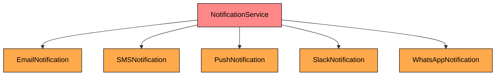
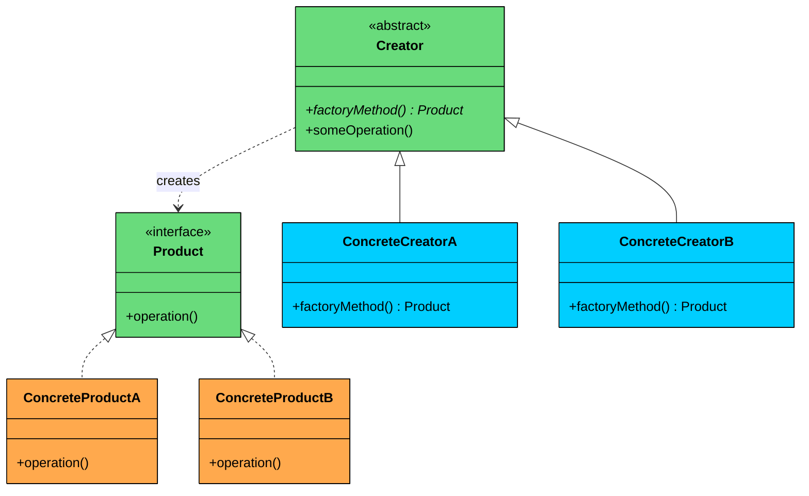
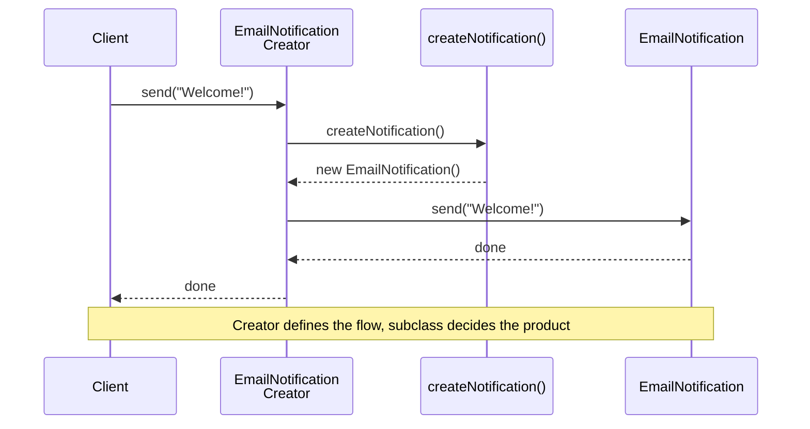
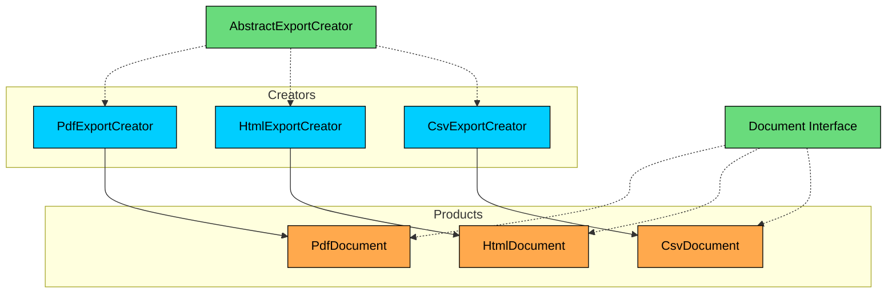

import React from 'react';
import CodeBlock from '../../../../components/ui/CodeBlock';
import Callout from '../../../../components/ui/Callout';

<div className="article-header">
  <div className="breadcrumb">
    <a href="/">Curated Notes</a>
    <span className="breadcrumb-separator">›</span>
    <span className="breadcrumb-current">Factory Method Design Pattern</span>
  </div>
  <h1>Factory Method Design Pattern</h1>
  <p style={{ color: 'var(--text-muted)', fontSize: '1.1rem', marginBottom: '16px', lineHeight: '1.6' }}>
    Master the essentials of Factory Method Design Pattern in this curated guide.
  </p>
  <div className="meta-info">
    <span className="meta-item">
      <svg width="14" height="14" viewBox="0 0 24 24" fill="none" stroke="currentColor" strokeWidth="2"><circle cx="12" cy="12" r="10"/><polyline points="12 6 12 12 16 14"/></svg>
      10 min read
    </span>
    <span className="difficulty-badge difficulty-badge--intermediate">Intermediate</span>
  </div>
</div>

<section className="content-section">


&gt; **DEFINITION**
&gt;
&gt; The **Factory Method Design Pattern** is a **creational pattern** that provides an interface for creating objects in a **superclass**, but allows **subclasses** to alter the type of objects that will be created.


It’s particularly useful in situations where:

- The exact type of object to be created isn't known until runtime.
- Object creation logic is **complex**, **repetitive**, or needs **encapsulation**.
- You want to follow the **Open/Closed Principle, **open for extension, closed for modification.

When you have multiple objects of similar type, you might start with basic conditional logic (like `if-else` or `switch` statements) to decide which object to create.

But as your application grows, this approach becomes rigid, harder to test, and tightly couples your code to specific classes, violating key design principles.

Factory method lets you create different objects without tightly coupling your code to specific classes.

Let’s walk through a **real-world example** to see how we can apply the Factory Method Pattern to build a more **scalable** and **maintainable** object creation workflow.

---

## 1. The Problem: Sending Notifications

Imagine you're building a web application that sends notifications to users. At first, it’s simple. You're only sending **email notifications**.

A single class takes care of that.


```java
class EmailNotification {
    public void send() {
        System.out.println("Sending an Email notification...");
    }
}
```

```python
class EmailNotification:
    def send(self, message):
        print("Sending an Email notification...")
```

```cpp
class EmailNotification {
public:
    void send() {
        cout << "Sending an Email notification..." << endl;
    }
};
```

```go
type EmailNotification struct{}

func (e EmailNotification) Send() {
	println("Sending an Email notification...")
}
```

```csharp
class EmailNotification
{
    public void Send()
    {
        Console.WriteLine("Sending an Email notification...");
    }
}
```

```typescript
class EmailNotification {
    send(message: string): void {
        console.log("Sending an Email notification...");
    }
}
```


To use it in our service, we create the email notification object and call the **send()** method.


```java
class NotificationService {
    public void sendNotification(String message) {
        EmailNotification email = new EmailNotification();
        email.send(message);
    }
}
```

```python
class NotificationService:
    def send_notification(self, message):
        email = EmailNotification()
        email.send(message)
```

```cpp
class NotificationService {
public:
    void sendNotification(const string& type, const string& message) {
      EmailNotification email;
      email.send(message);
    }
};
```

```go
type NotificationService struct{}

func (n NotificationService) SendNotification(message string) {
	email := EmailNotification{}
	email.Send(message)
}
```

```csharp
class NotificationService
{
    public void SendNotification(string type, string message)
    {
        EmailNotification email = new EmailNotification();
        email.Send(message);
    }
}
```

```typescript
class NotificationService {
    sendNotification(message: string): void {
        const email = new EmailNotification();
        email.send(message);
    }
}
```


All good. But then comes a new requirement: support **SMS notifications**.

So, you add a new class and update your NotificationService class by adding a new `if` block to create an SMS notification object, and send that too.


```java
class NotificationService {
    public void sendNotification(String type, String message) {
        if (type.equals("EMAIL")) {
            EmailNotification email = new EmailNotification();
            email.send(message);
        } else if (type.equals("SMS")) {
            SMSNotification sms = new SMSNotification();
            sms.send(message);
        }
    }
}
```

```python
class NotificationService:
    def send_notification(self, type, message):
        if type == "EMAIL":
            email = EmailNotification()
            email.send(message)
        elif type == "SMS":
            sms = SMSNotification()
            sms.send(message)
```

```cpp
class NotificationService {
public:
    void sendNotification(const string& type, const string& message) {
        if (type == "EMAIL") {
            EmailNotification email;
            email.send(message);
        } else if (type == "SMS") {
            SMSNotification sms;
            sms.send(message);
        }
    }
};
```

```go
type NotificationService struct{}

func (n NotificationService) SendNotification(typeStr string, message string) {
	if typeStr == "EMAIL" {
		email := EmailNotification{}
		email.Send(message)
	} else if typeStr == "SMS" {
		sms := SMSNotification{}
		sms.Send(message)
	}
}
```

```csharp
class NotificationService
{
    public void SendNotification(string type, string message)
    {
        if (type == "EMAIL")
        {
            EmailNotification email = new EmailNotification();
            email.Send(message);
        }
        else if (type == "SMS")
        {
            SMSNotification sms = new SMSNotification();
            sms.Send(message);
        }
    }
}
```

```typescript
class NotificationService {
    sendNotification(type: string, message: string): void {
        if (type === "EMAIL") {
            const email = new EmailNotification();
            email.send(message);
        } else if (type === "SMS") {
            const sms = new SMSNotification();
            sms.send(message);
        }
    }
}
```


Slightly more complex, but still manageable. A few weeks later, product wants to send **push notifications** to mobile devices. Then marketing wants **Slack** alerts. Then **WhatsApp**.

Each one adds another branch:


```java
class NotificationService {
    public void sendNotification(String type, String message) {
        if (type.equals("EMAIL")) {
            EmailNotification email = new EmailNotification();
            email.send(message);
        } else if (type.equals("SMS")) {
            SMSNotification sms = new SMSNotification();
            sms.send(message);
        } else if (type.equals("Push")) {
            PushNotification sms = new PushNotification();
            sms.send(message);
        } else if (type.equals("Slack")) {
            SlackNotification sms = new SlackNotification();
            sms.send(message);
        } else if (type.equals("WhatsApp")) {
            WhatsAppNotification sms = new WhatsAppNotification();
            sms.send(message);
        }
    }
}
```

```python
class NotificationService:
    def send_notification(self, type, message):
        if type == "EMAIL":
            email = EmailNotification()
            email.send(message)
        elif type == "SMS":
            sms = SMSNotification()
            sms.send(message)
        elif type == "Push":
            push = PushNotification()
            push.send(message)
        elif type == "Slack":
            slack = SlackNotification()
            slack.send(message)
        elif type == "WhatsApp":
            whatsapp = WhatsAppNotification()
            whatsapp.send(message)
```

```cpp
class NotificationService {
public:
    void sendNotification(const string& type, const string& message) {
        if (type == "EMAIL") {
            EmailNotification email;
            email.send(message);
        } else if (type == "SMS") {
            SMSNotification sms;
            sms.send(message);
        } else if (type == "Push") {
            PushNotification push;
            push.send(message);
        } else if (type == "Slack") {
            SlackNotification slack;
            slack.send(message);
        } else if (type == "WhatsApp") {
            WhatsAppNotification wa;
            wa.send(message);
        }
    }
};
```

```go
type NotificationService struct{}

func (s *NotificationService) SendNotification(typeName string, message string) {
	if typeName == "EMAIL" {
		email := EmailNotification{}
		email.Send(message)
	} else if typeName == "SMS" {
		sms := SMSNotification{}
		sms.Send(message)
	} else if typeName == "Push" {
		push := PushNotification{}
		push.Send(message)
	} else if typeName == "Slack" {
		slack := SlackNotification{}
		slack.Send(message)
	} else if typeName == "WhatsApp" {
		whatsapp := WhatsAppNotification{}
		whatsapp.Send(message)
	}
}
```

```csharp
class NotificationService
{
    public void SendNotification(string type, string message)
    {
        if (type == "EMAIL")
        {
            EmailNotification email = new EmailNotification();
            email.Send(message);
        }
        else if (type == "SMS")
        {
            SMSNotification sms = new SMSNotification();
            sms.Send(message);
        }
        else if (type == "Push")
        {
            PushNotification push = new PushNotification();
            push.Send(message);
        }
        else if (type == "Slack")
        {
            SlackNotification slack = new SlackNotification();
            slack.Send(message);
        }
        else if (type == "WhatsApp")
        {
            WhatsAppNotification wa = new WhatsAppNotification();
            wa.Send(message);
        }
    }
}
```

```typescript
class NotificationService {
    sendNotification(type: string, message: string): void {
        if (type === "EMAIL") {
            const email = new EmailNotification();
            email.send(message);
        } else if (type === "SMS") {
            const sms = new SMSNotification();
            sms.send(message);
        } else if (type === "Push") {
            const push = new PushNotification();
            push.send(message);
        } else if (type === "Slack") {
            const slack = new SlackNotification();
            slack.send(message);
        } else if (type === "WhatsApp") {
            const whatsapp = new WhatsAppNotification();
            whatsapp.send(message);
        }
    }
}
```


Now, your notification code is starting to look like a giant control tower. It’s responsible for **creating every kind of notification**, **knowing how each one works**, and **deciding which to send based on the type**.

Here is what the dependency structure looks like:





Adding a sixth notification type means modifying `NotificationService` yet again. 

This becomes a nightmare to maintain:

- Every time you add a new notification channel, you must **modify the same core logic**.
- Testing becomes cumbersome because the logic is intertwined with object creation.
- It violates the **Open/Closed Principle**: the class is not open for extension without modification.

---

## 2. Simple Factory: A First Attempt

Before jumping to the full Factory Method pattern, there is a common intermediate step: extract the creation logic into a separate class. 

This is called the **Simple Factory**. It is not a formal Gang of Four (GoF) pattern, but it is one of the most practical refactoring techniques in real-world codebases.

The idea is straightforward: create a separate class whose only job is to centralize and encapsulate object creation. The notification service no longer needs to know which concrete class to instantiate. It asks the factory.


```java
class SimpleNotificationFactory {
    public static Notification createNotification(String type) {
        return switch (type) {
            case "EMAIL" -> new EmailNotification();
            case "SMS" -> new SMSNotification();
            case "PUSH" -> new PushNotification();
            default -> throw new IllegalArgumentException("Unknown type");
        };
    }
}
```

```python
class SimpleNotificationFactory:
    @staticmethod
    def create_notification(type):
        match type:
            case "EMAIL":
                return EmailNotification()
            case "SMS":
                return SMSNotification()
            case "PUSH":
                return PushNotification()
            case _:
                raise ValueError("Unknown type")
```

```cpp
class SimpleNotificationFactory {
public:
    static Notification* createNotification(const string& type) {
        if (type == "EMAIL") {
            return new EmailNotification();
        } else if (type == "SMS") {
            return new SMSNotification();
        } else if (type == "PUSH") {
            return new PushNotification();
        } else {
            throw invalid_argument("Unknown type");
        }
    }
};
```

```go
type SimpleNotificationFactory struct{}

func (SimpleNotificationFactory) createNotification(typeName string) Notification {
	switch typeName {
	case "EMAIL":
		return &EmailNotification{}
	case "SMS":
		return &SMSNotification{}
	case "PUSH":
		return &PushNotification{}
	default:
		panic("Unknown type")
	}
}
```

```csharp
class SimpleNotificationFactory
{
    public static Notification CreateNotification(string type)
    {
        return type switch
        {
            "EMAIL" => new EmailNotification(),
            "SMS" => new SMSNotification(),
            "PUSH" => new PushNotification(),
            _ => throw new ArgumentException("Unknown type")
        };
    }
}
```

```typescript
class SimpleNotificationFactory {
    static createNotification(type: string): Notification {
        switch (type) {
            case "EMAIL":
                return new EmailNotification();
            case "SMS":
                return new SMSNotification();
            case "PUSH":
                return new PushNotification();
            default:
                throw new Error("Unknown type");
        }
    }
}
```


All creation logic is now in one place. Now `NotificationService` is cleaner:


```java
class NotificationService {
    public void sendNotification(String type, String message) {
        Notification notification = SimpleNotificationFactory.createNotification(type);
        notification.send(message);
    }
}
```

```python
class NotificationService:
    def send_notification(self, type, message):
        notification = SimpleNotificationFactory.create_notification(type)
        notification.send(message)
```

```cpp
class NotificationService {
public:
    void sendNotification(const string& type, const string& message) {
        Notification* notification = nullptr;
        notification = SimpleNotificationFactory::createNotification(type);
        notification->send(message);
        delete notification;
    }
};
```

```go
type NotificationService struct{}

func (ns NotificationService) SendNotification(type_, message string) {
	notification := SimpleNotificationFactory.CreateNotification(type_)
	notification.Send(message)
}
```

```csharp
class NotificationService
{
    public void SendNotification(string type, string message)
    {
        Notification notification = SimpleNotificationFactory.CreateNotification(type);
        notification.Send(message);
    }
}
```

```typescript
class NotificationService {
    sendNotification(type: string, message: string): void {
        const notification = SimpleNotificationFactory.createNotification(type);
        notification.send(message);
    }
}
```


This is better. The service only *uses* the notification, it does not *construct* it. Adding new types is easier since you only modify the factory, not every service that uses notifications.

But as your product grows and you keep adding new notification types, something starts to feel off again. Your `SimpleNotificationFactory` is beginning to look eerily similar to the bloated code you just refactored away from. 

Every time you introduce a new type, you are right back to modifying the factory's **switch** or **if-else** statements.

That is not very Open/Closed, is it?

Your system is better, but it is still not open to extension without modification. You are still hardcoding the decision logic and centralizing creation in one place. You need to give each type of notification its own responsibility for knowing how to create itself.

And that’s exactly the type of problems **Factory Method Design Pattern** solves.

---

## 3. What is Factory Method

The **Factory Method Pattern** takes the idea of object creation and hands it off to **subclasses**. Instead of one central factory deciding what to create, you **delegate the responsibility to specialized classes** that know exactly what they need to produce.

In simpler terms:

- Each subclass defines its **own way** of instantiating an object.
- The base class defines a **common interface** for creating that object, but doesn’t know what the object is.
- The base class also often defines common behavior, using the created object in some way.

So now, instead of having:


```java
if type == "EMAIL" → return new EmailNotification()
if type == "SMS" → return new SMSNotification()
```


You have:


```java
// EmailNotificationCreator knows it should return new EmailNotification
// SMSNotificationCreator knows it should return new SMSNotification
```


Your **creation logic is decentralized**.


&gt; **Real-World Analogy**
&gt;
&gt; Think of a **food delivery platform**. You place an order. If the system is designed like a Simple Factory, there’s one centralized kitchen deciding whether to cook pizza, sushi, or burgers.
&gt;
&gt; But with the Factory Method, each restaurant (Pizza Place, Sushi Bar, Burger Joint) has **its own kitchen** and knows how to prepare its food. The platform just asks the appropriate kitchen to handle it.


---

### Class Diagram





#### **1. Product (e.g., Notification)**

The interface or abstract class that defines the contract for all objects the factory method creates. Every concrete product implements this interface, which means the rest of the system can work with any product without knowing its concrete type.

In our notification example, this is the `Notification` interface with its `send()` method. The creator and client code only ever reference this interface, never `EmailNotification` or `SMSNotification` directly.

#### **2. ConcreteProduct (e.g., EmailNotification)**

The actual classes that implement the Product interface. Each one provides its own behavior.` EmailNotification` connects to an SMTP server. `SMSNotification` calls a telephony API. `PushNotification` talks to Firebase or APNs. 

They all share the same `send()` method signature but do completely different things internally.

#### **3. Creator (e.g., NotificationCreator)**

An abstract class (or an interface) that declares the factory method, which returns an object of type Product.

The Creator does two things:

1. **Declares the factory method** (`createNotification()`) that subclasses must implement.
2. **Contains shared logic** that uses the product. For example, the `send()` method in our `NotificationCreator` calls `createNotification()` to get a product, then uses it. The Creator defines the *workflow*, the subclasses fill in the *details*.

#### **4. ConcreteCreator (e.g., EmailNotificationCreator)**

Subclasses of Creator that override the factory method to return a specific ConcreteProduct. Each creator is paired with exactly one product type.

- `EmailNotificationCreator` returns `new EmailNotification()`.
- `SMSNotificationCreator` returns `new SMSNotification()`

---

## 4. How It Works

Here is the Factory Method workflow, step by step:





#### **Step 1: Client selects a Creator**

The client code decides which ConcreteCreator to use based on configuration, user input, or business logic. For example, if the user wants an email notification, the client instantiates `EmailNotificationCreator`.

#### **Step 2: Client calls a method on the Creator**

The client calls `send()` (or whatever the high-level operation is). This method lives in the abstract Creator class.

#### **Step 3: Creator calls the factory method**

Inside `send()`, the Creator calls `createNotification()`. Since the Creator is abstract, this call is dispatched to the ConcreteCreator's override.

**Step 4: ConcreteCreator returns a ConcreteProduct**

`EmailNotificationCreator.createNotification()` returns a `new EmailNotification()`. The Creator receives it as the `Notification` interface type.

#### **Step 5: Creator uses the product**

The Creator calls `notification.send(message)` on the product it just received. The correct concrete behavior executes.

---

## 5. Implementing Factory Method

By now, you have seen the shortcomings of bloated `if-else` chains and central factories. 

With the Factory Method pattern, we flip that around. Instead of putting the burden of decision-making in a single place, we distribute object creation responsibilities across the system in a clean, organized way.

Let's implement it step by step.

#### 1. Define the Product Interface

This is the contract that all notification types must follow. Any code that works with notifications only depends on this interface.


```java
interface Notification {
    public void send(String message);
}
```

```python
from abc import ABC, abstractmethod

class Notification(ABC):
    @abstractmethod
    def send(self, message: str) -> None:
        pass
```

```cpp
class Notification {
public:
    virtual void send(const string& message) = 0;
    virtual ~Notification() {}
};
```

```go
type Notification interface {
	Send(message string)
}
```

```csharp
interface Notification
{
    void Send(string message);
}
```

```typescript
interface Notification {
    send(message: string): void;
}
```


#### 2. Define Concrete Products

Each notification type implements the interface with its own behavior.


```java
class EmailNotification implements Notification {
    @Override
    public void send(String message) {
        System.out.println("Sending email: " + message);
    }
}

class SMSNotification implements Notification {
    @Override
    public void send(String message) {
        System.out.println("Sending SMS: " + message);
    }
}

class PushNotification implements Notification {
    @Override
    public void send(String message) {
        System.out.println("Sending push notification: " + message);
    }
}

class SlackNotification implements Notification {
    @Override
    public void send(String message) {
        System.out.println("Sending Slack message: " + message);
    }
}
```

```python
class EmailNotification(Notification):
    def send(self, message: str) -> None:
        print(f"Sending email: {message}")

class SMSNotification(Notification):
    def send(self, message: str) -> None:
        print(f"Sending SMS: {message}")

class PushNotification(Notification):
    def send(self, message: str) -> None:
        print(f"Sending push notification: {message}")

class SlackNotification(Notification):
    def send(self, message: str) -> None:
        print(f"Sending Slack message: {message}")
```

```cpp
class EmailNotification : public Notification {
public:
    void send(const string& message) override {
        cout << "Sending email: " << message << endl;
    }
};

class SMSNotification : public Notification {
public:
    void send(const string& message) override {
        cout << "Sending SMS: " << message << endl;
    }
};

class PushNotification : public Notification {
public:
    void send(const string& message) override {
        cout << "Sending push notification: " << message << endl;
    }
};

class SlackNotification : public Notification {
public:
    void send(const string& message) override {
        cout << "Sending Slack message: " << message << endl;
    }
};
```

```go
type EmailNotification struct{}

func (EmailNotification) Send(message string) {
	fmt.Println("Sending email: " + message)
}

type SMSNotification struct{}

func (SMSNotification) Send(message string) {
	fmt.Println("Sending SMS: " + message)
}

type PushNotification struct{}

func (PushNotification) Send(message string) {
	fmt.Println("Sending push notification: " + message)
}

type SlackNotification struct{}

func (SlackNotification) Send(message string) {
	fmt.Println("Sending Slack message: " + message)
}
```

```csharp
class EmailNotification : INotification
{
    public void Send(string message)
    {
        Console.WriteLine("Sending email: " + message);
    }
}

class SmsNotification : INotification
{
    public void Send(string message)
    {
        Console.WriteLine("Sending SMS: " + message);
    }
}

class PushNotification : INotification
{
    public void Send(string message)
    {
        Console.WriteLine("Sending push notification: " + message);
    }
}

class SlackNotification : INotification
{
    public void Send(string message)
    {
        Console.WriteLine("Sending Slack message: " + message);
    }
}
```

```typescript
class EmailNotification implements Notification {
    send(message: string): void {
        console.log(`Sending email: ${message}`);
    }
}

class SMSNotification implements Notification {
    send(message: string): void {
        console.log(`Sending SMS: ${message}`);
    }
}

class PushNotification implements Notification {
    send(message: string): void {
        console.log(`Sending push notification: ${message}`);
    }
}

class SlackNotification implements Notification {
    send(message: string): void {
        console.log(`Sending Slack message: ${message}`);
    }
}
```


#### 3. Define an Abstract Creator

We create an **abstract class** that declares the factory method `createNotification()`, and optionally includes shared behavior like `send()`that defines the high-level logic of sending a notification by using whatever object `createNotification()` provides.

The Creator defines the flow, subclasses fill in the details.


```java
abstract class NotificationCreator {
    // Factory Method - subclasses decide what to create
    public abstract Notification createNotification();

    // Shared logic that uses the factory method
    public void send(String message) {
        Notification notification = createNotification();
        notification.send(message);
    }
}
```

```python
class NotificationCreator(ABC):
    # Factory Method - subclasses decide what to create
    @abstractmethod
    def create_notification(self) -> Notification:
        pass

    # Shared logic that uses the factory method
    def send(self, message: str) -> None:
        notification = self.create_notification()
        notification.send(message)
```

```cpp
class NotificationCreator {
public:
    // Factory Method - subclasses decide what to create
    virtual unique_ptr<Notification> createNotification() = 0;

    // Shared logic that uses the factory method
    void send(const string& message) {
        auto notification = createNotification();
        notification->send(message);
    }

    virtual ~NotificationCreator() = default;
};
```

```go
type NotificationCreator interface {
	// Factory Method - subclasses decide what to create
	createNotification() Notification

	// Shared logic that uses the factory method
	send(message string)
}
```

```csharp
abstract class NotificationCreator
{
    // Factory Method - subclasses decide what to create
    public abstract INotification CreateNotification();

    // Shared logic that uses the factory method
    public void Send(string message)
    {
        INotification notification = CreateNotification();
        notification.Send(message);
    }
}
```

```typescript
abstract class NotificationCreator {
    // Factory Method - subclasses decide what to create
    abstract createNotification(): Notification;

    // Shared logic that uses the factory method
    send(message: string): void {
        const notification = this.createNotification();
        notification.send(message);
    }
}
```


Think of this class as a template: it does not know what notification it is sending, but it knows *how* to send it. It defers the choice of notification type to its subclasses.

&gt; T
&gt;
&gt; **he abstract creator defines the flow, not the details.**

#### 4. Define Concrete Creators

Now for the part that makes the pattern work. Each concrete creator extends the abstract creator and overrides the factory method to return its specific product.


```java
class EmailNotificationCreator extends NotificationCreator {
    @Override
    public Notification createNotification() {
        return new EmailNotification();
    }
}

class SMSNotificationCreator extends NotificationCreator {
    @Override
    public Notification createNotification() {
        return new SMSNotification();
    }
}

class PushNotificationCreator extends NotificationCreator {
    @Override
    public Notification createNotification() {
        return new PushNotification();
    }
}

class SlackNotificationCreator extends NotificationCreator {
    @Override
    public Notification createNotification() {
        return new SlackNotification();
    }
}
```

```python
class EmailNotificationCreator(NotificationCreator):
    def create_notification(self) -> Notification:
        return EmailNotification()

class SMSNotificationCreator(NotificationCreator):
    def create_notification(self) -> Notification:
        return SMSNotification()

class PushNotificationCreator(NotificationCreator):
    def create_notification(self) -> Notification:
        return PushNotification()

class SlackNotificationCreator(NotificationCreator):
    def create_notification(self) -> Notification:
        return SlackNotification()
```

```cpp
class EmailNotificationCreator : public NotificationCreator {
public:
    unique_ptr<Notification> createNotification() override {
        return make_unique<EmailNotification>();
    }
};

class SMSNotificationCreator : public NotificationCreator {
public:
    unique_ptr<Notification> createNotification() override {
        return make_unique<SMSNotification>();
    }
};

class PushNotificationCreator : public NotificationCreator {
public:
    unique_ptr<Notification> createNotification() override {
        return make_unique<PushNotification>();
    }
};

class SlackNotificationCreator : public NotificationCreator {
public:
    unique_ptr<Notification> createNotification() override {
        return make_unique<SlackNotification>();
    }
};
```

```go
type EmailNotificationCreator struct {
	NotificationCreator
}

func (EmailNotificationCreator) createNotification() Notification {
	return EmailNotification{}
}

type SMSNotificationCreator struct {
	NotificationCreator
}

func (SMSNotificationCreator) createNotification() Notification {
	return SMSNotification{}
}

type PushNotificationCreator struct {
	NotificationCreator
}

func (PushNotificationCreator) createNotification() Notification {
	return PushNotification{}
}

type SlackNotificationCreator struct {
	NotificationCreator
}

func (SlackNotificationCreator) createNotification() Notification {
	return SlackNotification{}
}
```

```csharp
class EmailNotificationCreator : NotificationCreator
{
    public override INotification CreateNotification()
    {
        return new EmailNotification();
    }
}

class SmsNotificationCreator : NotificationCreator
{
    public override INotification CreateNotification()
    {
        return new SmsNotification();
    }
}

class PushNotificationCreator : NotificationCreator
{
    public override INotification CreateNotification()
    {
        return new PushNotification();
    }
}

class SlackNotificationCreator : NotificationCreator
{
    public override INotification CreateNotification()
    {
        return new SlackNotification();
    }
}
```

```typescript
class EmailNotificationCreator extends NotificationCreator {
    createNotification(): Notification {
        return new EmailNotification();
    }
}

class SMSNotificationCreator extends NotificationCreator {
    createNotification(): Notification {
        return new SMSNotification();
    }
}

class PushNotificationCreator extends NotificationCreator {
    createNotification(): Notification {
        return new PushNotification();
    }
}

class SlackNotificationCreator extends NotificationCreator {
    createNotification(): Notification {
        return new SlackNotification();
    }
}
```


No more conditionals. Each class knows what it needs to create, and the core system does not need to care.

- `EmailNotificationCreator` returns `new EmailNotification()`
- `SMSNotificationCreator` returns `new SMSNotification()`

The mapping is one-to-one and explicit.

#### 5. Client Code

Here's how your application might use this architecture:


```java
public class FactoryMethodDemo {
    public static void main(String[] args) {
        NotificationCreator creator;

        // Send Email
        creator = new EmailNotificationCreator();
        creator.send("Welcome to our platform!");

        // Send SMS
        creator = new SMSNotificationCreator();
        creator.send("Your OTP is 123456");

        // Send Push Notification
        creator = new PushNotificationCreator();
        creator.send("You have a new follower!");

        // Send Slack Message
        creator = new SlackNotificationCreator();
        creator.send("Standup in 10 minutes!");
    }
}
```

```python
def main():
    # Send Email
    creator = EmailNotificationCreator()
    creator.send("Welcome to our platform!")

    # Send SMS
    creator = SMSNotificationCreator()
    creator.send("Your OTP is 123456")

    # Send Push Notification
    creator = PushNotificationCreator()
    creator.send("You have a new follower!")

    # Send Slack Message
    creator = SlackNotificationCreator()
    creator.send("Standup in 10 minutes!")

if __name__ == "__main__":
    main()
```

```cpp
int main() {
    // Send Email
    unique_ptr<NotificationCreator> creator = make_unique<EmailNotificationCreator>();
    creator->send("Welcome to our platform!");

    // Send SMS
    creator = make_unique<SMSNotificationCreator>();
    creator->send("Your OTP is 123456");

    // Send Push Notification
    creator = make_unique<PushNotificationCreator>();
    creator->send("You have a new follower!");

    // Send Slack Message
    creator = make_unique<SlackNotificationCreator>();
    creator->send("Standup in 10 minutes!");

    return 0;
}
```

```go
func main() {
	var creator NotificationCreator

	// Send Email
	creator = &EmailNotificationCreator{}
	creator.Send("Welcome to our platform!")

	// Send SMS
	creator = &SMSNotificationCreator{}
	creator.Send("Your OTP is 123456")

	// Send Push Notification
	creator = &PushNotificationCreator{}
	creator.Send("You have a new follower!")

	// Send Slack Message
	creator = &SlackNotificationCreator{}
	creator.Send("Standup in 10 minutes!")
}
```

```csharp
class Program
{
    static void Main()
    {
        NotificationCreator creator;

        // Send Email
        creator = new EmailNotificationCreator();
        creator.Send("Welcome to our platform!");

        // Send SMS
        creator = new SmsNotificationCreator();
        creator.Send("Your OTP is 123456");

        // Send Push Notification
        creator = new PushNotificationCreator();
        creator.Send("You have a new follower!");

        // Send Slack Message
        creator = new SlackNotificationCreator();
        creator.Send("Standup in 10 minutes!");
    }
}
```

```typescript
function main(): void {
    let creator: NotificationCreator;

    // Send Email
    creator = new EmailNotificationCreator();
    creator.send("Welcome to our platform!");

    // Send SMS
    creator = new SMSNotificationCreator();
    creator.send("Your OTP is 123456");

    // Send Push Notification
    creator = new PushNotificationCreator();
    creator.send("You have a new follower!");

    // Send Slack Message
    creator = new SlackNotificationCreator();
    creator.send("Standup in 10 minutes!");
}

main();
```


Each line creates the appropriate creator, calls the shared `send()` method, and the right notification type is created and used internally. The client never touches concrete product classes directly.

#### 6. Adding a New Type

This is where the pattern pays off. Say you want to add WhatsApp notifications. With the old approach, you would modify an existing factory or service class, add a new `if-else` branch, and risk breaking existing logic.

With Factory Method, you simply create two new classes:


```java
class WhatsAppNotification implements Notification {
    @Override
    public void send(String message) {
        System.out.println("Sending WhatsApp message: " + message);
    }
}

class WhatsAppNotificationCreator extends NotificationCreator {
    @Override
    public Notification createNotification() {
        return new WhatsAppNotification();
    }
}
```

```python
class WhatsAppNotification(Notification):
    def send(self, message: str) -> None:
        print(f"Sending WhatsApp message: {message}")

class WhatsAppNotificationCreator(NotificationCreator):
    def create_notification(self) -> Notification:
        return WhatsAppNotification()
```

```cpp
class WhatsAppNotification : public Notification {
public:
    void send(const string& message) override {
        cout << "Sending WhatsApp message: " << message << endl;
    }
};

class WhatsAppNotificationCreator : public NotificationCreator {
public:
    unique_ptr<Notification> createNotification() override {
        return make_unique<WhatsAppNotification>();
    }
};
```

```go
type WhatsAppNotification struct{}

func (w WhatsAppNotification) Send(message string) {
	fmt.Println("Sending WhatsApp message: " + message)
}

type WhatsAppNotificationCreator struct{}

func (w WhatsAppNotificationCreator) CreateNotification() Notification {
	return WhatsAppNotification{}
}
```

```csharp
class WhatsAppNotification : INotification
{
    public void Send(string message)
    {
        Console.WriteLine("Sending WhatsApp message: " + message);
    }
}

class WhatsAppNotificationCreator : NotificationCreator
{
    public override INotification CreateNotification()
    {
        return new WhatsAppNotification();
    }
}
```

```typescript
class WhatsAppNotification implements Notification {
    send(message: string): void {
        console.log(`Sending WhatsApp message: ${message}`);
    }
}

class WhatsAppNotificationCreator extends NotificationCreator {
    createNotification(): Notification {
        return new WhatsAppNotification();
    }
}
```


Done. No modification to existing code. No regression risk. No coupling. You just add new files and use the new creator wherever needed:


```java
creator = new WhatsAppNotificationCreator();
creator.send("Standup in 10 minutes!");
```

```python
creator = WhatsAppNotificationCreator()
creator.send("Standup in 10 minutes!")
```

```cpp
  NotificationCreator* creator = new WhatsAppNotificationCreator();
  creator->send("Standup in 10 minutes!");
```

```go
creator := NewWhatsAppNotificationCreator()
creator.Send("Standup in 10 minutes!")
```

```csharp
  NotificationCreator creator = new WhatsAppNotificationCreator();
  creator.Send("Standup in 10 minutes!");
```

```typescript
const creator = new WhatsAppNotificationCreator();
creator.send("Standup in 10 minutes!");
```


---

## 6. Practical Example: Document Export System

Let's build a complete example in a different domain to show the pattern's versatility. We will create a document export system that generates reports in multiple formats: PDF, HTML, and CSV.

#### Problem

A reporting service needs to export data in different formats. Each format has its own rendering logic, headers, and file structure. New formats (Markdown, XML, Excel) might be added in the future.

#### Architecture





#### Full Implementation


```java
// Product interface
interface Document {
    String getHeader();
    String formatRow(String[] data);
    String getFooter();
    String getFileExtension();
}

// Concrete Products
class PdfDocument implements Document {
    @Override
    public String getHeader() {
        return "--- PDF DOCUMENT START ---";
    }

    @Override
    public String formatRow(String[] data) {
        return "| " + String.join(" | ", data) + " |";
    }

    @Override
    public String getFooter() {
        return "--- PDF DOCUMENT END ---";
    }

    @Override
    public String getFileExtension() {
        return ".pdf";
    }
}

class HtmlDocument implements Document {
    @Override
    public String getHeader() {
        return "<html><body><table>";
    }

    @Override
    public String formatRow(String[] data) {
        StringBuilder sb = new StringBuilder("<tr>");
        for (String cell : data) {
            sb.append("<td>").append(cell).append("</td>");
        }
        sb.append("</tr>");
        return sb.toString();
    }

    @Override
    public String getFooter() {
        return "</table></body></html>";
    }

    @Override
    public String getFileExtension() {
        return ".html";
    }
}

class CsvDocument implements Document {
    @Override
    public String getHeader() {
        return ""; // CSV has no header wrapper
    }

    @Override
    public String formatRow(String[] data) {
        return String.join(",", data);
    }

    @Override
    public String getFooter() {
        return ""; // CSV has no footer
    }

    @Override
    public String getFileExtension() {
        return ".csv";
    }
}

// Abstract Creator
abstract class ExportCreator {
    // Factory Method
    public abstract Document createDocument();

    // Shared export logic
    public void export(String[][] data) {
        Document doc = createDocument();
        System.out.println("Exporting to " + doc.getFileExtension() + " format...");

        String header = doc.getHeader();
        if (!header.isEmpty()) {
            System.out.println(header);
        }

        for (String[] row : data) {
            System.out.println(doc.formatRow(row));
        }

        String footer = doc.getFooter();
        if (!footer.isEmpty()) {
            System.out.println(footer);
        }

        System.out.println("Export complete.\n");
    }
}

// Concrete Creators
class PdfExportCreator extends ExportCreator {
    @Override
    public Document createDocument() {
        return new PdfDocument();
    }
}

class HtmlExportCreator extends ExportCreator {
    @Override
    public Document createDocument() {
        return new HtmlDocument();
    }
}

class CsvExportCreator extends ExportCreator {
    @Override
    public Document createDocument() {
        return new CsvDocument();
    }
}

// Client
public class DocumentExportDemo {
    public static void main(String[] args) {
        String[][] reportData = {
            {"Name", "Department", "Salary"},
            {"Alice", "Engineering", "120000"},
            {"Bob", "Marketing", "95000"},
            {"Charlie", "Design", "105000"}
        };

        ExportCreator pdfExporter = new PdfExportCreator();
        pdfExporter.export(reportData);

        ExportCreator htmlExporter = new HtmlExportCreator();
        htmlExporter.export(reportData);

        ExportCreator csvExporter = new CsvExportCreator();
        csvExporter.export(reportData);
    }
}
```

```python
from abc import ABC, abstractmethod

## Product interface
class Document(ABC):
    @abstractmethod
    def get_header(self) -> str:
        pass

    @abstractmethod
    def format_row(self, data: list[str]) -> str:
        pass

    @abstractmethod
    def get_footer(self) -> str:
        pass

    @abstractmethod
    def get_file_extension(self) -> str:
        pass

## Concrete Products
class PdfDocument(Document):
    def get_header(self) -> str:
        return "--- PDF DOCUMENT START ---"

    def format_row(self, data: list[str]) -> str:
        return "| " + " | ".join(data) + " |"

    def get_footer(self) -> str:
        return "--- PDF DOCUMENT END ---"

    def get_file_extension(self) -> str:
        return ".pdf"

class HtmlDocument(Document):
    def get_header(self) -> str:
        return "<html><body><table>"

    def format_row(self, data: list[str]) -> str:
        cells = "".join(f"<td>{cell}</td>" for cell in data)
        return f"<tr>{cells}</tr>"

    def get_footer(self) -> str:
        return "</table></body></html>"

    def get_file_extension(self) -> str:
        return ".html"

class CsvDocument(Document):
    def get_header(self) -> str:
        return ""

    def format_row(self, data: list[str]) -> str:
        return ",".join(data)

    def get_footer(self) -> str:
        return ""

    def get_file_extension(self) -> str:
        return ".csv"

## Abstract Creator
class ExportCreator(ABC):
    @abstractmethod
    def create_document(self) -> Document:
        pass

    def export(self, data: list[list[str]]) -> None:
        doc = self.create_document()
        print(f"Exporting to {doc.get_file_extension()} format...")

        header = doc.get_header()
        if header:
            print(header)

        for row in data:
            print(doc.format_row(row))

        footer = doc.get_footer()
        if footer:
            print(footer)

        print("Export complete.\n")

## Concrete Creators
class PdfExportCreator(ExportCreator):
    def create_document(self) -> Document:
        return PdfDocument()

class HtmlExportCreator(ExportCreator):
    def create_document(self) -> Document:
        return HtmlDocument()

class CsvExportCreator(ExportCreator):
    def create_document(self) -> Document:
        return CsvDocument()

## Client
if __name__ == "__main__":
    report_data = [
        ["Name", "Department", "Salary"],
        ["Alice", "Engineering", "120000"],
        ["Bob", "Marketing", "95000"],
        ["Charlie", "Design", "105000"],
    ]

    pdf_exporter = PdfExportCreator()
    pdf_exporter.export(report_data)

    html_exporter = HtmlExportCreator()
    html_exporter.export(report_data)

    csv_exporter = CsvExportCreator()
    csv_exporter.export(report_data)
```

```cpp
#include <iostream>
#include <string>
#include <vector>
#include <memory>
#include <sstream>

using namespace std;

// Product interface
class Document {
public:
    virtual string getHeader() = 0;
    virtual string formatRow(const vector<string>& data) = 0;
    virtual string getFooter() = 0;
    virtual string getFileExtension() = 0;
    virtual ~Document() = default;
};

// Concrete Products
class PdfDocument : public Document {
public:
    string getHeader() override { return "--- PDF DOCUMENT START ---"; }

    string formatRow(const vector<string>& data) override {
        string result = "| ";
        for (size_t i = 0; i < data.size(); i++) {
            result += data[i];
            if (i < data.size() - 1) result += " | ";
        }
        result += " |";
        return result;
    }

    string getFooter() override { return "--- PDF DOCUMENT END ---"; }
    string getFileExtension() override { return ".pdf"; }
};

class HtmlDocument : public Document {
public:
    string getHeader() override { return "<html><body><table>"; }

    string formatRow(const vector<string>& data) override {
        string result = "<tr>";
        for (const auto& cell : data) {
            result += "<td>" + cell + "</td>";
        }
        result += "</tr>";
        return result;
    }

    string getFooter() override { return "</table></body></html>"; }
    string getFileExtension() override { return ".html"; }
};

class CsvDocument : public Document {
public:
    string getHeader() override { return ""; }

    string formatRow(const vector<string>& data) override {
        string result;
        for (size_t i = 0; i < data.size(); i++) {
            result += data[i];
            if (i < data.size() - 1) result += ",";
        }
        return result;
    }

    string getFooter() override { return ""; }
    string getFileExtension() override { return ".csv"; }
};

// Abstract Creator
class ExportCreator {
public:
    virtual unique_ptr<Document> createDocument() = 0;

    void exportData(const vector<vector<string>>& data) {
        auto doc = createDocument();
        cout << "Exporting to " << doc->getFileExtension() << " format..." << endl;

        string header = doc->getHeader();
        if (!header.empty()) cout << header << endl;

        for (const auto& row : data) {
            cout << doc->formatRow(row) << endl;
        }

        string footer = doc->getFooter();
        if (!footer.empty()) cout << footer << endl;

        cout << "Export complete." << endl << endl;
    }

    virtual ~ExportCreator() = default;
};

// Concrete Creators
class PdfExportCreator : public ExportCreator {
public:
    unique_ptr<Document> createDocument() override {
        return make_unique<PdfDocument>();
    }
};

class HtmlExportCreator : public ExportCreator {
public:
    unique_ptr<Document> createDocument() override {
        return make_unique<HtmlDocument>();
    }
};

class CsvExportCreator : public ExportCreator {
public:
    unique_ptr<Document> createDocument() override {
        return make_unique<CsvDocument>();
    }
};

// Client
int main() {
    vector<vector<string>> reportData = {
        {"Name", "Department", "Salary"},
        {"Alice", "Engineering", "120000"},
        {"Bob", "Marketing", "95000"},
        {"Charlie", "Design", "105000"}
    };

    PdfExportCreator pdfExporter;
    pdfExporter.exportData(reportData);

    HtmlExportCreator htmlExporter;
    htmlExporter.exportData(reportData);

    CsvExportCreator csvExporter;
    csvExporter.exportData(reportData);

    return 0;
}
```

```go
package main

import (
	"fmt"
	"strings"
)

// Product interface
type Document interface {
	getHeader() string
	formatRow(data []string) string
	getFooter() string
	getFileExtension() string
}

// Concrete Products
type PdfDocument struct{}

func (p PdfDocument) getHeader() string {
	return "--- PDF DOCUMENT START ---"
}

func (p PdfDocument) formatRow(data []string) string {
	return "| " + strings.Join(data, " | ") + " |"
}

func (p PdfDocument) getFooter() string {
	return "--- PDF DOCUMENT END ---"
}

func (p PdfDocument) getFileExtension() string {
	return ".pdf"
}

type HtmlDocument struct{}

func (h HtmlDocument) getHeader() string {
	return "<html><body><table>"
}

func (h HtmlDocument) formatRow(data []string) string {
	var sb strings.Builder

	sb.WriteString("<tr>")
	for _, cell := range data {
		sb.WriteString("<td>")
		sb.WriteString(cell)
		sb.WriteString("</td>")
	}
	sb.WriteString("</tr>")

	return sb.String()
}

func (h HtmlDocument) getFooter() string {
	return "</table></body></html>"
}

func (h HtmlDocument) getFileExtension() string {
	return ".html"
}

type CsvDocument struct{}

func (c CsvDocument) getHeader() string {
	return ""
}

func (c CsvDocument) formatRow(data []string) string {
	return strings.Join(data, ",")
}

func (c CsvDocument) getFooter() string {
	return ""
}

func (c CsvDocument) getFileExtension() string {
	return ".csv"
}

// Creator interface
type ExportCreator interface {
	createDocument() Document
	export(data [][]string)
}

// Base creator with shared export logic
type baseExportCreator struct{}

func (b baseExportCreator) exportWithCreator(creator ExportCreator, data [][]string) {
	doc := creator.createDocument()

	fmt.Println("Exporting to " + doc.getFileExtension() + " format...")

	header := doc.getHeader()
	if header != "" {
		fmt.Println(header)
	}

	for _, row := range data {
		fmt.Println(doc.formatRow(row))
	}

	footer := doc.getFooter()
	if footer != "" {
		fmt.Println(footer)
	}

	fmt.Println("Export complete.")
	fmt.Println()
}

// Concrete Creators
type PdfExportCreator struct {
	baseExportCreator
}

func (p PdfExportCreator) createDocument() Document {
	return PdfDocument{}
}

func (p PdfExportCreator) export(data [][]string) {
	p.baseExportCreator.exportWithCreator(p, data)
}

type HtmlExportCreator struct {
	baseExportCreator
}

func (h HtmlExportCreator) createDocument() Document {
	return HtmlDocument{}
}

func (h HtmlExportCreator) export(data [][]string) {
	h.baseExportCreator.exportWithCreator(h, data)
}

type CsvExportCreator struct {
	baseExportCreator
}

func (c CsvExportCreator) createDocument() Document {
	return CsvDocument{}
}

func (c CsvExportCreator) export(data [][]string) {
	c.baseExportCreator.exportWithCreator(c, data)
}

func main() {
	reportData := [][]string{
		{"Name", "Department", "Salary"},
		{"Alice", "Engineering", "120000"},
		{"Bob", "Marketing", "95000"},
		{"Charlie", "Design", "105000"},
	}

	pdfExporter := PdfExportCreator{}
	pdfExporter.export(reportData)

	htmlExporter := HtmlExportCreator{}
	htmlExporter.export(reportData)

	csvExporter := CsvExportCreator{}
	csvExporter.export(reportData)
}
```

```csharp
using System;

// Product interface
interface IDocument
{
    string GetHeader();
    string FormatRow(string[] data);
    string GetFooter();
    string GetFileExtension();
}

// Concrete Products
class PdfDocument : IDocument
{
    public string GetHeader() => "--- PDF DOCUMENT START ---";

    public string FormatRow(string[] data) => "| " + string.Join(" | ", data) + " |";

    public string GetFooter() => "--- PDF DOCUMENT END ---";

    public string GetFileExtension() => ".pdf";
}

class HtmlDocument : IDocument
{
    public string GetHeader() => "<html><body><table>";

    public string FormatRow(string[] data)
    {
        var cells = "";
        foreach (var cell in data)
            cells += $"<td>{cell}</td>";
        return $"<tr>{cells}</tr>";
    }

    public string GetFooter() => "</table></body></html>";

    public string GetFileExtension() => ".html";
}

class CsvDocument : IDocument
{
    public string GetHeader() => "";

    public string FormatRow(string[] data) => string.Join(",", data);

    public string GetFooter() => "";

    public string GetFileExtension() => ".csv";
}

// Abstract Creator
abstract class ExportCreator
{
    public abstract IDocument CreateDocument();

    public void Export(string[][] data)
    {
        IDocument doc = CreateDocument();
        Console.WriteLine($"Exporting to {doc.GetFileExtension()} format...");

        string header = doc.GetHeader();
        if (!string.IsNullOrEmpty(header))
            Console.WriteLine(header);

        foreach (var row in data)
            Console.WriteLine(doc.FormatRow(row));

        string footer = doc.GetFooter();
        if (!string.IsNullOrEmpty(footer))
            Console.WriteLine(footer);

        Console.WriteLine("Export complete.\n");
    }
}

// Concrete Creators
class PdfExportCreator : ExportCreator
{
    public override IDocument CreateDocument() => new PdfDocument();
}

class HtmlExportCreator : ExportCreator
{
    public override IDocument CreateDocument() => new HtmlDocument();
}

class CsvExportCreator : ExportCreator
{
    public override IDocument CreateDocument() => new CsvDocument();
}

// Client
class Program
{
    static void Main()
    {
        string[][] reportData = {
            new[] {"Name", "Department", "Salary"},
            new[] {"Alice", "Engineering", "120000"},
            new[] {"Bob", "Marketing", "95000"},
            new[] {"Charlie", "Design", "105000"}
        };

        ExportCreator pdfExporter = new PdfExportCreator();
        pdfExporter.Export(reportData);

        ExportCreator htmlExporter = new HtmlExportCreator();
        htmlExporter.Export(reportData);

        ExportCreator csvExporter = new CsvExportCreator();
        csvExporter.Export(reportData);
    }
}
```

```typescript
// Product interface
interface Document {
    getHeader(): string;
    formatRow(data: string[]): string;
    getFooter(): string;
    getFileExtension(): string;
}

// Concrete Products
class PdfDocument implements Document {
    getHeader(): string {
        return "--- PDF DOCUMENT START ---";
    }
    formatRow(data: string[]): string {
        return "| " + data.join(" | ") + " |";
    }
    getFooter(): string {
        return "--- PDF DOCUMENT END ---";
    }
    getFileExtension(): string {
        return ".pdf";
    }
}

class HtmlDocument implements Document {
    getHeader(): string {
        return "<html><body><table>";
    }
    formatRow(data: string[]): string {
        const cells = data.map(cell => `<td>${cell}</td>`).join("");
        return `<tr>${cells}</tr>`;
    }
    getFooter(): string {
        return "</table></body></html>";
    }
    getFileExtension(): string {
        return ".html";
    }
}

class CsvDocument implements Document {
    getHeader(): string {
        return "";
    }
    formatRow(data: string[]): string {
        return data.join(",");
    }
    getFooter(): string {
        return "";
    }
    getFileExtension(): string {
        return ".csv";
    }
}

// Abstract Creator
abstract class ExportCreator {
    abstract createDocument(): Document;

    export(data: string[][]): void {
        const doc = this.createDocument();
        console.log(`Exporting to ${doc.getFileExtension()} format...`);

        const header = doc.getHeader();
        if (header) console.log(header);

        for (const row of data) {
            console.log(doc.formatRow(row));
        }

        const footer = doc.getFooter();
        if (footer) console.log(footer);

        console.log("Export complete.\n");
    }
}

// Concrete Creators
class PdfExportCreator extends ExportCreator {
    createDocument(): Document {
        return new PdfDocument();
    }
}

class HtmlExportCreator extends ExportCreator {
    createDocument(): Document {
        return new HtmlDocument();
    }
}

class CsvExportCreator extends ExportCreator {
    createDocument(): Document {
        return new CsvDocument();
    }
}

// Client
function main(): void {
    const reportData: string[][] = [
        ["Name", "Department", "Salary"],
        ["Alice", "Engineering", "120000"],
        ["Bob", "Marketing", "95000"],
        ["Charlie", "Design", "105000"],
    ];

    const pdfExporter = new PdfExportCreator();
    pdfExporter.export(reportData);

    const htmlExporter = new HtmlExportCreator();
    htmlExporter.export(reportData);

    const csvExporter = new CsvExportCreator();
    csvExporter.export(reportData);
}

main();
```


#### **What we achieved:**

- **Open/Closed Principle:** Adding a new format (Markdown, XML) means creating two new classes. Nothing else changes.
- **Single Responsibility:** Each document type handles only its own formatting logic.
- **Shared workflow:** The `export()` method in the Creator defines the common sequence (header, rows, footer) once.
- **Easy testing:** Each document type can be tested independently.

</section>
