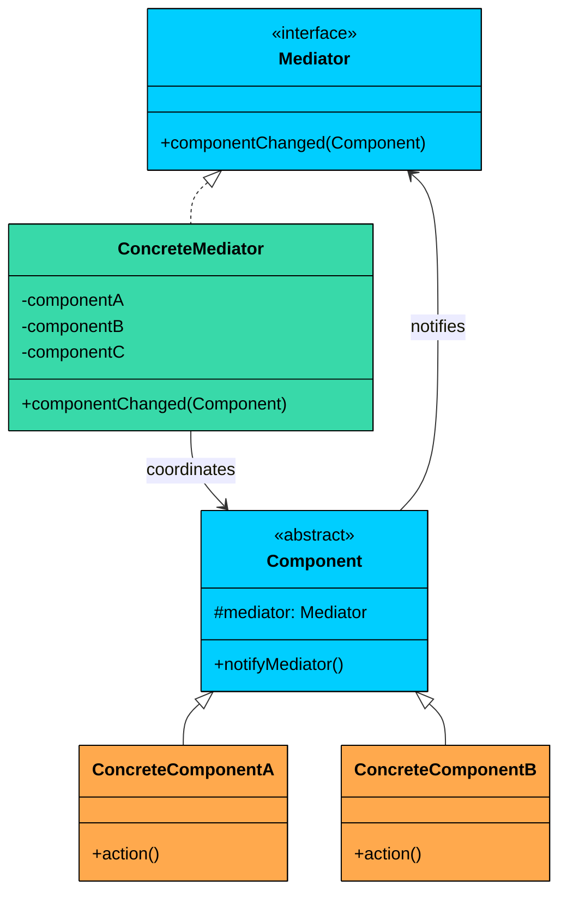
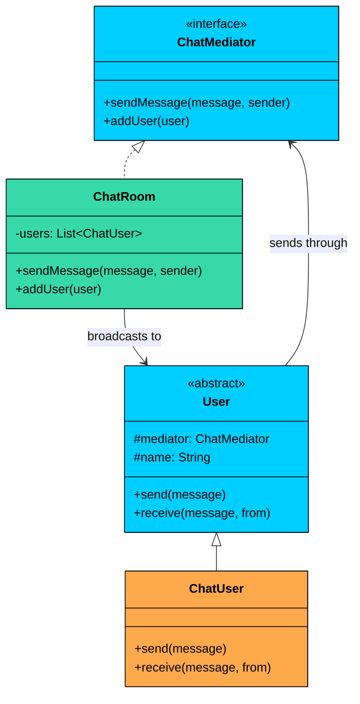

import React from 'react';
import CodeBlock from '../../../../components/ui/CodeBlock';
import Callout from '../../../../components/ui/Callout';

<div className="article-header">
  <div className="breadcrumb">
    <a href="/">Curated Notes</a>
    <span className="breadcrumb-separator">›</span>
    <span className="breadcrumb-current">Mediator Design Pattern</span>
  </div>
  <h1>Mediator Design Pattern</h1>
  <p style={{ color: 'var(--text-muted)', fontSize: '1.1rem', marginBottom: '16px', lineHeight: '1.6' }}>
    Master the essentials of Mediator Design Pattern in this curated guide.
  </p>
  <div className="meta-info">
    <span className="meta-item">
      <svg width="14" height="14" viewBox="0 0 24 24" fill="none" stroke="currentColor" strokeWidth="2"><circle cx="12" cy="12" r="10"/><polyline points="12 6 12 12 16 14"/></svg>
      10 min read
    </span>
    <span className="difficulty-badge difficulty-badge--intermediate">Intermediate</span>
  </div>
</div>

<section className="content-section">


&gt; **DEFINITION**
&gt;
&gt; The **Mediator Design Pattern** is a **behavioral pattern** that defines an object (the **Mediator**) to **encapsulate how a set of objects interact**.


It promotes **loose coupling** by preventing objects from referring to each other directly, and lets you vary their interactions independently.

It’s particularly useful in situations where:

- You have a group of tightly coupled classes or UI components that need to communicate.
- Changes in one component require updates in multiple others.
- You want to centralize communication logic to simplify maintenance and testing.

Let’s walk through a real-world example to see how we can apply the Mediator Pattern to build a more modular, loosely coupled system where components communicate cleanly and consistently.

---

## 1. The Problem: Tightly Coupled UI Components

Imagine you're building a **login form** with the following UI components:

- A **username field**
- A **password field**
- A **login button**
- A **status label**

The logic of the form is simple:

- The **login button** should be enabled only when both username and password fields are non-empty.
- When the button is clicked, it should attempt login and display the result in the **status label**.

Sounds simple, right? Let’s try implementing this with each component talking directly to the others.

#### The Naive Approach

In a straightforward implementation, each component holds direct references to the components it needs to interact with. The text fields know about the button, and the button knows about the text fields and the label.

#### TextField


```java
class TextField {
    private String text = "";
    private Button loginButton;

    public void setLoginButton(Button button) {
        this.loginButton = button;
    }

    public void setText(String newText) {
        this.text = newText;
        System.out.println("TextField updated: " + text);
        if (loginButton != null) {
            loginButton.checkEnabled();
        }
    }

    public String getText() {
        return text;
    }
}
```

```python
class TextField:
   def __init__(self):
       self.text = ""
       self.login_button = None

   def set_login_button(self, button):
       self.login_button = button

   def set_text(self, new_text):
       self.text = new_text
       print(f"TextField updated: {self.text}")
       if self.login_button is not None:
           self.login_button.check_enabled()

   def get_text(self):
       return self.text
```

```cpp
class TextField {
private:
   string text;
   Button* loginButton;

public:
   TextField() : text(""), loginButton(nullptr) {}

   void setLoginButton(Button* button) {
       loginButton = button;
   }

   void setText(string newText) {
       text = newText;
       cout << "TextField updated: " << text << endl;
       if (loginButton != nullptr) {
           loginButton->checkEnabled();
       }
   }

   string getText() {
       return text;
   }
};
```

```go
type TextField struct {
	text       string
	loginButton *Button
}

func (t *TextField) SetLoginButton(button *Button) {
	t.loginButton = button
}

func (t *TextField) SetText(newText string) {
	t.text = newText
	fmt.Println("TextField updated: " + t.text)
	if t.loginButton != nil {
		t.loginButton.checkEnabled()
	}
}

func (t *TextField) GetText() string {
	return t.text
}
```

```csharp
class TextField
{
   private string text = "";
   private Button loginButton;

   public void SetLoginButton(Button button)
   {
       loginButton = button;
   }

   public void SetText(string newText)
   {
       text = newText;
       Console.WriteLine("TextField updated: " + text);
       if (loginButton != null)
       {
           loginButton.CheckEnabled();
       }
   }

   public string GetText()
   {
       return text;
   }
}
```

```typescript
class TextField {
   private text: string = "";
   private loginButton: Button | null = null;

   setLoginButton(button: Button): void {
       this.loginButton = button;
   }

   setText(newText: string): void {
       this.text = newText;
       console.log("TextField updated: " + this.text);
       if (this.loginButton !== null) {
           this.loginButton.checkEnabled();
       }
   }

   getText(): string {
       return this.text;
   }
}
```


#### Button


```java
class Button {
    private TextField usernameField;
    private TextField passwordField;
    private Label statusLabel;

    public void setDependencies(TextField username, TextField password, Label status) {
        this.usernameField = username;
        this.passwordField = password;
        this.statusLabel = status;
    }

    public void checkEnabled() {
        boolean enable = !usernameField.getText().isEmpty() &&
            !passwordField.getText().isEmpty();
        System.out.println("Login Button is now " + (enable ? "ENABLED" : "DISABLED"));
    }

    public void click() {
        if (!usernameField.getText().isEmpty() && !passwordField.getText().isEmpty()) {
            System.out.println("Login successful!");
            statusLabel.setText("Logged in!");
        } else {
            System.out.println("Login failed.");
            statusLabel.setText("Please enter username and password.");
        }
    }
}
```

```python
class Button:
    def __init__(self):
        self.username_field = None
        self.password_field = None
        self.status_label = None

    def set_dependencies(self, username, password, status):
        self.username_field = username
        self.password_field = password
        self.status_label = status

    def check_enabled(self):
        enable = (self.username_field.get_text() != "" and
                  self.password_field.get_text() != "")
        print(f"Login Button is now {'ENABLED' if enable else 'DISABLED'}")

    def click(self):
        if (self.username_field.get_text() != "" and
                self.password_field.get_text() != ""):
            print("Login successful!")
            self.status_label.set_text("Logged in!")
        else:
            print("Login failed.")
            self.status_label.set_text("Please enter username and password.")
```

```cpp
class Button {
private:
    TextField* usernameField;
    TextField* passwordField;
    Label* statusLabel;

public:
    Button() : usernameField(nullptr), passwordField(nullptr), statusLabel(nullptr) {}

    void setDependencies(TextField* username, TextField* password, Label* status) {
        usernameField = username;
        passwordField = password;
        statusLabel = status;
    }

    void checkEnabled() {
        bool enable = !usernameField->getText().empty() &&
            !passwordField->getText().empty();
        cout << "Login Button is now " << (enable ? "ENABLED" : "DISABLED") << endl;
    }

    void click() {
        if (!usernameField->getText().empty() && !passwordField->getText().empty()) {
            cout << "Login successful!" << endl;
            statusLabel->setText("Logged in!");
        } else {
            cout << "Login failed." << endl;
            statusLabel->setText("Please enter username and password.");
        }
    }
};
```

```go
type Button struct {
	usernameField *TextField
	passwordField *TextField
	statusLabel   *Label
}

func (b *Button) setDependencies(username *TextField, password *TextField, status *Label) {
	b.usernameField = username
	b.passwordField = password
	b.statusLabel = status
}

func (b *Button) checkEnabled() {
	enable := b.usernameField.getText() != "" &&
		b.passwordField.getText() != ""
	fmt.Println("Login Button is now " + map[bool]string{true: "ENABLED", false: "DISABLED"}[enable])
}

func (b *Button) click() {
	if b.usernameField.getText() != "" && b.passwordField.getText() != "" {
		fmt.Println("Login successful!")
		b.statusLabel.setText("Logged in!")
	} else {
		fmt.Println("Login failed.")
		b.statusLabel.setText("Please enter username and password.")
	}
}
```

```csharp
class Button
{
    private TextField usernameField;
    private TextField passwordField;
    private Label statusLabel;

    public void SetDependencies(TextField username, TextField password, Label status)
    {
        usernameField = username;
        passwordField = password;
        statusLabel = status;
    }

    public void CheckEnabled()
    {
        bool enable = !string.IsNullOrEmpty(usernameField.GetText()) &&
            !string.IsNullOrEmpty(passwordField.GetText());
        Console.WriteLine("Login Button is now " + (enable ? "ENABLED" : "DISABLED"));
    }

    public void Click()
    {
        if (!string.IsNullOrEmpty(usernameField.GetText()) &&
            !string.IsNullOrEmpty(passwordField.GetText()))
        {
            Console.WriteLine("Login successful!");
            statusLabel.SetText("Logged in!");
        }
        else
        {
            Console.WriteLine("Login failed.");
            statusLabel.SetText("Please enter username and password.");
        }
    }
}
```

```typescript
class Button {
    private usernameField: TextField | null = null;
    private passwordField: TextField | null = null;
    private statusLabel: Label | null = null;

    setDependencies(username: TextField, password: TextField, status: Label): void {
        this.usernameField = username;
        this.passwordField = password;
        this.statusLabel = status;
    }

    checkEnabled(): void {
        const enable = this.usernameField !== null &&
            this.passwordField !== null &&
            this.usernameField.getText().trim() !== "" &&
            this.passwordField.getText().trim() !== "";
        console.log("Login Button is now " + (enable ? "ENABLED" : "DISABLED"));
    }

    click(): void {
        if (this.usernameField !== null &&
            this.passwordField !== null &&
            this.statusLabel !== null &&
            this.usernameField.getText().trim() !== "" &&
            this.passwordField.getText().trim() !== "") {
            console.log("Login successful!");
            this.statusLabel.setText("Logged in!");
        } else {
            console.log("Login failed.");
            if (this.statusLabel !== null) {
                this.statusLabel.setText("Please enter username and password.");
            }
        }
    }
}
```


#### Label


```java
class Label {
    public void setText(String message) {
        System.out.println("Status: " + message);
    }
}
```

```python
class Label:
   def set_text(self, message):
       print(f"Status: {message}")
```

```cpp
class Label {
public:
   void setText(string message) {
       cout << "Status: " << message << endl;
   }
};
```

```go
type Label struct{}

func (l *Label) SetText(message string) {
	println("Status: " + message)
}
```

```csharp
class Label
{
   public void SetText(string message)
   {
       Console.WriteLine("Status: " + message);
   }
}
```

```typescript
class Label {
   setText(message: string): void {
       console.log("Status: " + message);
   }
}
```


#### What’s Wrong with this Design?

At first glance, this seems fine. But as soon as you add a few more components (e.g., a "remember me" checkbox, a "forgot password" link), the logic starts to spiral out of control.

#### 1. Tight Coupling

Every component **knows about others**: the `TextField` knows the `Button`, the `Button` knows the `TextField` and the `Label`. A change in one component's logic often requires updates in others, creating a fragile system.

#### 2. Lack of Reusability

You cannot easily reuse these components elsewhere. They are hard-wired to interact with specific peers, making them **context-dependent**.

#### 3. Poor Maintainability

Adding or modifying interactions requires changing the logic of multiple classes. This violates the **Open/Closed Principle** and makes the system harder to test and evolve.

#### 4. Hidden Logic Sprawled Across Components

Each component contains not only its own logic but also **coordinating behavior**, making it harder to isolate responsibilities.

#### What We Really Need

We need a way to:

- **Decouple UI components** from each other
- Centralize the coordination logic so that each component **focuses only on its own role**
- Make it easier to **add, remove, or change components or interactions** without breaking everything else

This is exactly what the **Mediator Pattern** is designed to solve.

---

## 2. The Mediator Pattern

&gt; The 
&gt;
&gt; **Mediator Pattern**
&gt;
&gt;  promotes loose coupling by 
&gt;
&gt; **centralizing communication**
&gt;
&gt;  between objects. Instead of having components refer to and interact with each other directly, they communicate 
&gt;
&gt; **through a mediator**
&gt;
&gt; .

Two characteristics of the pattern:

1. **Centralized communication.** All interaction logic lives in one place: the mediator. Components do not call methods on each other. When a component's state changes, it notifies the mediator, and the mediator coordinates the response. This means the complex web of many-to-many relationships gets replaced by a simple star topology with the mediator at the center.
2. **Loose coupling between components.** Each component depends only on the mediator interface, not on any other component. Components can be added, removed, or replaced without modifying other components. The mediator is the only class that knows about the full set of participants and how they interact.

This leads to a **cleaner separation of concerns** and makes components easier to reuse in different contexts.


&gt; **Real-World Analogy**
&gt;
&gt; Think about an air traffic control tower. Planes approaching an airport do not communicate with each other to negotiate landing order, runway assignments, or holding patterns. That would be chaos, especially with dozens of planes in the air simultaneously. Instead, every pilot talks only to the control tower. 
&gt;
&gt; The tower knows the position, speed, and fuel status of every plane and coordinates them accordingly: "Flight 237, hold at 5,000 feet. Flight 412, you are cleared for runway 28L." 
&gt;
&gt; The tower is the mediator. Planes are the components. If a new plane enters the airspace, the tower handles it. If a plane diverts, the tower adjusts. The other planes never need to know.


---

### Class Diagram





#### **Mediator (Interface)**

Declares the interface for communication between components. Typically has a single method like `componentChanged()`, `notify()`, or `send()`.

The mediator interface should be narrow. A single `componentChanged(component)` method is almost always sufficient. The mediator identifies the sender and decides what to do based on the sender's identity and state.

#### **ConcreteMediator**

Implements the mediator interface. Contains all the coordination logic and holds references to every component it manages.

The concrete mediator is allowed to know about concrete component types. This is intentional. The mediator absorbs the coupling that would otherwise be spread across all components. One class knowing about everyone is better than everyone knowing about everyone.

#### **Component (Abstract Base)**

Holds a reference to the mediator and provides a `notifyMediator()` convenience method.

#### **ConcreteComponents**

These are the actual components (e.g., `TextField`, `Button`, `Label`) that perform actions and notify the mediator when changes occur. They never talk directly to each other.

---

## 3. Implementing Mediator

Let us refactor the tightly coupled login form using the Mediator pattern. Each UI component will interact **only with the mediator**, which will handle all coordination and logic.

We will do this in five steps.

#### Step 1: Define the UIMediator Interface

This interface defines how components will notify the mediator when their state changes. It provides a method like `componentChanged()` to centralize communication.


```java
interface UIMediator {
    void componentChanged(UIComponent component);
}
```

```python
from abc import ABC, abstractmethod

class UIMediator(ABC):
    @abstractmethod
    def component_changed(self, component):
        pass
```

```cpp
class UIMediator {
public:
   virtual void componentChanged(UIComponent* component) = 0;
   virtual ~UIMediator() {}
};
```

```go
type UIMediator interface {
	ComponentChanged(component UIComponent)
}
```

```csharp
interface IUIMediator
{
   void ComponentChanged(UIComponent component);
}
```

```typescript
interface UIMediator {
   componentChanged(component: UIComponent): void;
}
```


#### Step 2: Define the Abstract Component (UIComponent)

This abstract base class holds a reference to the mediator and provides a method to notify it when something changes. All UI elements will extend this class.


```java
abstract class UIComponent {
    protected UIMediator mediator;

    public UIComponent(UIMediator mediator) {
        this.mediator = mediator;
    }

    public void notifyMediator() {
        mediator.componentChanged(this);
    }
}
```

```python
class UIComponent(ABC):
   def __init__(self, mediator):
       self.mediator = mediator

   def notify_mediator(self):
       self.mediator.component_changed(self)
```

```cpp
class UIComponent {
protected:
   UIMediator* mediator;

public:
   UIComponent(UIMediator* mediator) : mediator(mediator) {}

   void notifyMediator() {
       mediator->componentChanged(this);
   }

   virtual ~UIComponent() {}
};
```

```go
type UIComponent struct {
	mediator UIMediator
}

func NewUIComponent(mediator UIMediator) *UIComponent {
	return &UIComponent{mediator: mediator}
}

func (c *UIComponent) NotifyMediator() {
	c.mediator.ComponentChanged(c)
}
```

```csharp
abstract class UIComponent
{
   protected IUIMediator mediator;

   public UIComponent(IUIMediator mediator)
   {
       this.mediator = mediator;
   }

   public void NotifyMediator()
   {
       mediator.ComponentChanged(this);
   }
}
```

```typescript
abstract class UIComponent {
   protected mediator: UIMediator;

   constructor(mediator: UIMediator) {
       this.mediator = mediator;
   }

   notifyMediator(): void {
       this.mediator.componentChanged(this);
   }
}
```


This ensures a consistent way for all components to communicate with the mediator.

#### Step 3: Implement the Components

Each component (TextField, Button, Label) extends UIComponent and defines its own local behavior. These components no longer interact with each other directly. They only notify the mediator.

#### TextField


```java
class TextField extends UIComponent {
    private String text = "";

    public TextField(UIMediator mediator) {
        super(mediator);
    }

    public void setText(String newText) {
        this.text = newText;
        System.out.println("TextField updated: " + newText);
        notifyMediator();
    }

    public String getText() {
        return text;
    }
}
```

```python
class TextField(UIComponent):
   def __init__(self, mediator):
       super().__init__(mediator)
       self.text = ""

   def set_text(self, new_text):
       self.text = new_text
       print(f"TextField updated: {new_text}")
       self.notify_mediator()

   def get_text(self):
       return self.text
```

```cpp
class TextField : public UIComponent {
private:
   string text;

public:
   TextField(UIMediator* mediator) : UIComponent(mediator), text("") {}

   void setText(string newText) {
       text = newText;
       cout << "TextField updated: " << newText << endl;
       notifyMediator();
   }

   string getText() {
       return text;
   }
};
```

```go
type TextField struct {
	UIComponent
	text string
}

func NewTextField(mediator UIMediator) *TextField {
	return &TextField{UIComponent: UIComponent{mediator: mediator}, text: ""}
}

func (t *TextField) SetText(newText string) {
	t.text = newText
	fmt.Println("TextField updated: " + newText)
	t.notifyMediator()
}

func (t *TextField) GetText() string {
	return t.text
}
```

```csharp
class TextField : UIComponent
{
   private string text = "";

   public TextField(IUIMediator mediator) : base(mediator)
   {
   }

   public void SetText(string newText)
   {
       text = newText;
       Console.WriteLine("TextField updated: " + newText);
       NotifyMediator();
   }

   public string GetText()
   {
       return text;
   }
}
```

```typescript
class TextField extends UIComponent {
   private text: string = "";

   constructor(mediator: UIMediator) {
       super(mediator);
   }

   setText(newText: string): void {
       this.text = newText;
       console.log("TextField updated: " + newText);
       this.notifyMediator();
   }

   getText(): string {
       return this.text;
   }
}
```


#### Button


```java
class Button extends UIComponent {
    private boolean enabled = false;

    public Button(UIMediator mediator) {
        super(mediator);
    }

    public void click() {
        if (enabled) {
            System.out.println("Login Button clicked!");
            notifyMediator(); // Will trigger login attempt
        } else {
            System.out.println("Login Button is disabled.");
        }
    }

    public void setEnabled(boolean value) {
        this.enabled = value;
        System.out.println("Login Button is now " + (enabled ? "ENABLED" : "DISABLED"));
    }
}
```

```python
class Button(UIComponent):
   def __init__(self, mediator):
       super().__init__(mediator)
       self.enabled = False

   def click(self):
       if self.enabled:
           print("Login Button clicked!")
           self.notify_mediator()  # Will trigger login attempt
       else:
           print("Login Button is disabled.")

   def set_enabled(self, value):
       self.enabled = value
       print(f"Login Button is now {'ENABLED' if self.enabled else 'DISABLED'}")
```

```cpp
class Button : public UIComponent {
private:
   bool enabled;

public:
   Button(UIMediator* mediator) : UIComponent(mediator), enabled(false) {}

   void click() {
       if (enabled) {
           cout << "Login Button clicked!" << endl;
           notifyMediator(); // Will trigger login attempt
       } else {
           cout << "Login Button is disabled." << endl;
       }
   }

   void setEnabled(bool value) {
       enabled = value;
       cout << "Login Button is now " << (enabled ? "ENABLED" : "DISABLED") << endl;
   }
};
```

```go
type Button struct {
	UIComponent
	enabled bool
}

func NewButton(mediator UIMediator) *Button {
	return &Button{UIComponent: UIComponent{mediator: mediator}, enabled: false}
}

func (b *Button) click() {
	if b.enabled {
		fmt.Println("Login Button clicked!")
		b.notifyMediator() // Will trigger login attempt
	} else {
		fmt.Println("Login Button is disabled.")
	}
}

func (b *Button) setEnabled(value bool) {
	b.enabled = value
	fmt.Println("Login Button is now " + map[bool]string{true: "ENABLED", false: "DISABLED"}[b.enabled])
}
```

```csharp
class Button : UIComponent
{
   private bool enabled = false;

   public Button(IUIMediator mediator) : base(mediator)
   {
   }

   public void Click()
   {
       if (enabled)
       {
           Console.WriteLine("Login Button clicked!");
           NotifyMediator(); // Will trigger login attempt
       }
       else
       {
           Console.WriteLine("Login Button is disabled.");
       }
   }

   public void SetEnabled(bool value)
   {
       enabled = value;
       Console.WriteLine("Login Button is now " + (enabled ? "ENABLED" : "DISABLED"));
   }
}
```

```typescript
class Button extends UIComponent {
   private enabled: boolean = false;

   constructor(mediator: UIMediator) {
       super(mediator);
   }

   click(): void {
       if (this.enabled) {
           console.log("Login Button clicked!");
           this.notifyMediator(); // Will trigger login attempt
       } else {
           console.log("Login Button is disabled.");
       }
   }

   setEnabled(value: boolean): void {
       this.enabled = value;
       console.log("Login Button is now " + (this.enabled ? "ENABLED" : "DISABLED"));
   }
}
```


#### Label


```java
class Label extends UIComponent {
    private String text;

    public Label(UIMediator mediator) {
        super(mediator);
    }

    public void setText(String message) {
        this.text = message;
        System.out.println("Status: " + text);
    }
}
```

```python
class LabelC(UIComponent):
   def __init__(self, mediator):
       super().__init__(mediator)
       self.text = None

   def set_text(self, message):
       self.text = message
       print(f"Status: {self.text}")
```

```cpp
class Label : public UIComponent {
private:
   string text;

public:
   Label(UIMediator* mediator) : UIComponent(mediator) {}

   void setText(string message) {
       text = message;
       cout << "Status: " << text << endl;
   }
};
```

```go
type Label struct {
	UIComponent
	text string
}

func NewLabel(mediator UIMediator) *Label {
	return &Label{UIComponent: UIComponent{mediator: mediator}}
}

func (l *Label) SetText(message string) {
	l.text = message
	fmt.Println("Status: " + l.text)
}
```

```csharp
class Label : UIComponent
{
   private string text;

   public Label(IUIMediator mediator) : base(mediator)
   {
   }

   public void SetText(string message)
   {
       text = message;
       Console.WriteLine("Status: " + text);
   }
}
```

```typescript
class Label extends UIComponent {
   private text: string;

   constructor(mediator: UIMediator) {
       super(mediator);
   }

   setText(message: string): void {
       this.text = message;
       console.log("Status: " + this.text);
   }
}
```


#### Step 4: Implement the Concrete Mediator (FormMediator)

This class knows about all components and defines the rules for how they should behave in response to one another. When a component changes, the mediator coordinates the appropriate actions.


```java
class FormMediator implements UIMediator {
    private TextField usernameField;
    private TextField passwordField;
    private Button loginButton;
    private Label statusLabel;

    public void setUsernameField(TextField usernameField) {
        this.usernameField = usernameField;
    }

    public void setPasswordField(TextField passwordField) {
        this.passwordField = passwordField;
    }

    public void setLoginButton(Button loginButton) {
        this.loginButton = loginButton;
    }

    public void setStatusLabel(Label statusLabel) {
        this.statusLabel = statusLabel;
    }

    @Override
    public void componentChanged(UIComponent component) {
        if (component == usernameField || component == passwordField) {
            boolean enableButton = !usernameField.getText().isEmpty() &&
                !passwordField.getText().isEmpty();
            loginButton.setEnabled(enableButton);
        } else if (component == loginButton) {
            String username = usernameField.getText();
            String password = passwordField.getText();

            if ("admin".equals(username) && "1234".equals(password)) {
                statusLabel.setText("Login successful!");
            } else {
                statusLabel.setText("Invalid credentials.");
            }
        }
    }
}
```

```python
class FormMediator(UIMediator):
   def __init__(self):
       self.username_field = None
       self.password_field = None
       self.login_button = None
       self.status_label = None

   def set_username_field(self, username_field):
       self.username_field = username_field

   def set_password_field(self, password_field):
       self.password_field = password_field

   def set_login_button(self, login_button):
       self.login_button = login_button

   def set_status_label(self, status_label):
       self.status_label = status_label

   def component_changed(self, component):
       if component == self.username_field or component == self.password_field:
           enable_button = (self.username_field.get_text() != "" and 
                          self.password_field.get_text() != "")
           self.login_button.set_enabled(enable_button)
       elif component == self.login_button:
           username = self.username_field.get_text()
           password = self.password_field.get_text()

           if username == "admin" and password == "1234":
               self.status_label.set_text("Login successful!")
           else:
               self.status_label.set_text("Invalid credentials.")
```

```cpp
class FormMediator : public UIMediator {
private:
   TextFieldComponent* usernameField;
   TextFieldComponent* passwordField;
   ButtonComponent* loginButton;
   LabelComponent* statusLabel;

public:
   FormMediator() : usernameField(nullptr), passwordField(nullptr), 
                    loginButton(nullptr), statusLabel(nullptr) {}

   void setUsernameField(TextFieldComponent* usernameField) {
       this->usernameField = usernameField;
   }

   void setPasswordField(TextFieldComponent* passwordField) {
       this->passwordField = passwordField;
   }

   void setLoginButton(ButtonComponent* loginButton) {
       this->loginButton = loginButton;
   }

   void setStatusLabel(LabelComponent* statusLabel) {
       this->statusLabel = statusLabel;
   }

   void componentChanged(UIComponent* component) override {
       if (component == usernameField || component == passwordField) {
           bool enableButton = !usernameField->getText().empty() &&
               !passwordField->getText().empty();
           loginButton->setEnabled(enableButton);
       } else if (component == loginButton) {
           string username = usernameField->getText();
           string password = passwordField->getText();

           if (username == "admin" && password == "1234") {
               statusLabel->setText("Login successful!");
           } else {
               statusLabel->setText("Invalid credentials.");
           }
       }
   }
};
```

```go
type FormMediator struct {
	usernameField TextField
	passwordField TextField
	loginButton   Button
	statusLabel   Label
}

func (m *FormMediator) SetUsernameField(usernameField TextField) {
	m.usernameField = usernameField
}

func (m *FormMediator) SetPasswordField(passwordField TextField) {
	m.passwordField = passwordField
}

func (m *FormMediator) SetLoginButton(loginButton Button) {
	m.loginButton = loginButton
}

func (m *FormMediator) SetStatusLabel(statusLabel Label) {
	m.statusLabel = statusLabel
}

func (m *FormMediator) ComponentChanged(component UIComponent) {
	if component == m.usernameField || component == m.passwordField {
		enableButton := m.usernameField.GetText() != "" &&
			m.passwordField.GetText() != ""
		m.loginButton.SetEnabled(enableButton)
	} else if component == m.loginButton {
		username := m.usernameField.GetText()
		password := m.passwordField.GetText()

		if username == "admin" && password == "1234" {
			m.statusLabel.SetText("Login successful!")
		} else {
			m.statusLabel.SetText("Invalid credentials.")
		}
	}
}
```

```csharp
class FormMediator : IUIMediator
{
   private TextFieldComponent usernameField;
   private TextFieldComponent passwordField;
   private ButtonComponent loginButton;
   private LabelComponent statusLabel;

   public void SetUsernameField(TextFieldComponent usernameField)
   {
       this.usernameField = usernameField;
   }

   public void SetPasswordField(TextFieldComponent passwordField)
   {
       this.passwordField = passwordField;
   }

   public void SetLoginButton(ButtonComponent loginButton)
   {
       this.loginButton = loginButton;
   }

   public void SetStatusLabel(LabelComponent statusLabel)
   {
       this.statusLabel = statusLabel;
   }

   public void ComponentChanged(UIComponent component)
   {
       if (component == usernameField || component == passwordField)
       {
           bool enableButton = !string.IsNullOrEmpty(usernameField.GetText()) &&
               !string.IsNullOrEmpty(passwordField.GetText());
           loginButton.SetEnabled(enableButton);
       }
       else if (component == loginButton)
       {
           string username = usernameField.GetText();
           string password = passwordField.GetText();

           if ("admin".Equals(username) && "1234".Equals(password))
           {
               statusLabel.SetText("Login successful!");
           }
           else
           {
               statusLabel.SetText("Invalid credentials.");
           }
       }
   }
}
```

```typescript
class FormMediator implements UIMediator {
   private usernameField: TextField;
   private passwordField: TextField;
   private loginButton: Button;
   private statusLabel: Label;

   setUsernameField(usernameField: TextField): void {
       this.usernameField = usernameField;
   }

   setPasswordField(passwordField: TextField): void {
       this.passwordField = passwordField;
   }

   setLoginButton(loginButton: Button): void {
       this.loginButton = loginButton;
   }

   setStatusLabel(statusLabel: Label): void {
       this.statusLabel = statusLabel;
   }

   componentChanged(component: UIComponent): void {
       if (component === this.usernameField || component === this.passwordField) {
           const enableButton = !this.usernameField.getText().trim() === false &&
               !this.passwordField.getText().trim() === false;
           this.loginButton.setEnabled(enableButton);
       } else if (component === this.loginButton) {
           const username = this.usernameField.getText();
           const password = this.passwordField.getText();

           if (username === "admin" && password === "1234") {
               this.statusLabel.setText("Login successful!");
           } else {
               this.statusLabel.setText("Invalid credentials.");
           }
       }
   }
}
```


#### Step 5: Connect Everything in the Client

Now, the client wires everything together. Components are instantiated, linked to the mediator, and can be used without knowing about each other.


```java
public class MediatorApp {
    public static void main(String[] args) {
        FormMediator mediator = new FormMediator();

        TextField usernameField = new TextField(mediator);
        TextField passwordField = new TextField(mediator);
        Button loginButton = new Button(mediator);
        Label statusLabel = new Label(mediator);

        mediator.setUsernameField(usernameField);
        mediator.setPasswordField(passwordField);
        mediator.setLoginButton(loginButton);
        mediator.setStatusLabel(statusLabel);

        // Simulate user interaction
        usernameField.setText("admin");
        passwordField.setText("1234");
        loginButton.click(); // Should succeed

        System.out.println("\n--- New Attempt with Wrong Password ---");
        passwordField.setText("wrong");
        loginButton.click(); // Should fail
    }
}
```

```python
class MediatorApp:
   @staticmethod
   def main():
       mediator = FormMediator()

       username_field = TextFieldComponent(mediator)
       password_field = TextFieldComponent(mediator)
       login_button = ButtonComponent(mediator)
       status_label = LabelComponent(mediator)

       mediator.set_username_field(username_field)
       mediator.set_password_field(password_field)
       mediator.set_login_button(login_button)
       mediator.set_status_label(status_label)

       # Simulate user interaction
       username_field.set_text("admin")
       password_field.set_text("1234")
       login_button.click()  # Should succeed

       print("\n--- New Attempt with Wrong Password ---")
       password_field.set_text("wrong")
       login_button.click()  # Should fail

if __name__ == "__main__":
   MediatorApp.main()
```

```cpp
class MediatorApp {
public:
   static void main() {
       FormMediator mediator;

       TextFieldComponent usernameField(&mediator);
       TextFieldComponent passwordField(&mediator);
       ButtonComponent loginButton(&mediator);
       LabelComponent statusLabel(&mediator);

       mediator.setUsernameField(&usernameField);
       mediator.setPasswordField(&passwordField);
       mediator.setLoginButton(&loginButton);
       mediator.setStatusLabel(&statusLabel);

       // Simulate user interaction
       usernameField.setText("admin");
       passwordField.setText("1234");
       loginButton.click(); // Should succeed

       cout << "\n--- New Attempt with Wrong Password ---" << endl;
       passwordField.setText("wrong");
       loginButton.click(); // Should fail
   }
};

int main() {
   MediatorApp::main();
   return 0;
}
```

```go
type MediatorApp struct{}

func main() {
	mediator := NewFormMediator()

	usernameField := NewTextFieldComponent(mediator)
	passwordField := NewTextFieldComponent(mediator)
	loginButton := NewButtonComponent(mediator)
	statusLabel := NewLabelComponent(mediator)

	mediator.SetUsernameField(usernameField)
	mediator.SetPasswordField(passwordField)
	mediator.SetLoginButton(loginButton)
	mediator.SetStatusLabel(statusLabel)

	// Simulate user interaction
	usernameField.SetText("admin")
	passwordField.SetText("1234")
	loginButton.Click() // Should succeed

	println("\n--- New Attempt with Wrong Password ---")
	passwordField.SetText("wrong")
	loginButton.Click() // Should fail
}
```

```csharp
public class MediatorApp
{
   public static void Main(string[] args)
   {
       FormMediator mediator = new FormMediator();

       TextFieldComponent usernameField = new TextFieldComponent(mediator);
       TextFieldComponent passwordField = new TextFieldComponent(mediator);
       ButtonComponent loginButton = new ButtonComponent(mediator);
       LabelComponent statusLabel = new LabelComponent(mediator);

       mediator.SetUsernameField(usernameField);
       mediator.SetPasswordField(passwordField);
       mediator.SetLoginButton(loginButton);
       mediator.SetStatusLabel(statusLabel);

       // Simulate user interaction
       usernameField.SetText("admin");
       passwordField.SetText("1234");
       loginButton.Click(); // Should succeed

       Console.WriteLine("\n--- New Attempt with Wrong Password ---");
       passwordField.SetText("wrong");
       loginButton.Click(); // Should fail
   }
}
```

```typescript
class MediatorApp {
   static main(): void {
       const mediator = new FormMediator();

       const usernameField = new TextField(mediator);
       const passwordField = new TextField(mediator);
       const loginButton = new Button(mediator);
       const statusLabel = new Label(mediator);

       mediator.setUsernameField(usernameField);
       mediator.setPasswordField(passwordField);
       mediator.setLoginButton(loginButton);
       mediator.setStatusLabel(statusLabel);

       // Simulate user interaction
       usernameField.setText("admin");
       passwordField.setText("1234");
       loginButton.click(); // Should succeed

       console.log("\n--- New Attempt with Wrong Password ---");
       passwordField.setText("wrong");
       loginButton.click(); // Should fail
   }
}
```


#### Expected Output:


```plaintext
TextField updated: admin
Login Button is now DISABLED
TextField updated: 1234
Login Button is now ENABLED
Login Button clicked!
Status: Login successful!

--- New Attempt with Wrong Password ---
TextField updated: wrong
Login Button is now ENABLED
Login Button clicked!
Status: Invalid credentials.
```


#### What We Achieved

- **Loose coupling: **Components no longer know about each other
- **Separation of concerns: **Coordination logic lives in the mediator, not in the components
- **Ease of extension: **Add new components or behaviors without modifying existing ones
- **Reusability: **Components like `TextField`, `Button`, and `Label` can be reused in other contexts

---

## 4. Practical Example: Chat Room

Let us work through a second example to reinforce the pattern. This time, we are building a simple chat room. Users send messages to the chat room, and the chat room broadcasts them to all other connected users. No user holds a direct reference to any other user.





`ChatMediator` declares the message-sending contract, and `User` is the abstract base that holds a reference to the mediator. `ChatRoom` is the concrete mediator that manages users and routes messages. `ChatUser` sends and receives messages without knowing about any other user.

#### Implementation


```java
import java.util.List;
import java.util.ArrayList;

// Mediator interface
interface ChatMediator {
    void sendMessage(String message, User sender);
    void addUser(User user);
}

// Abstract participant
abstract class User {
    protected ChatMediator mediator;
    protected String name;

    public User(ChatMediator mediator, String name) {
        this.mediator = mediator;
        this.name = name;
    }

    public abstract void send(String message);
    public abstract void receive(String message, String from);

    public String getName() { return name; }
}

// Concrete mediator
class ChatRoom implements ChatMediator {
    private final List<User> users = new ArrayList<>();

    @Override
    public void addUser(User user) {
        users.add(user);
        System.out.println(user.getName() + " joined the chat.");
    }

    @Override
    public void sendMessage(String message, User sender) {
        for (User user : users) {
            if (user != sender) {
                user.receive(message, sender.getName());
            }
        }
    }
}

// Concrete participant
class ChatUser extends User {
    public ChatUser(ChatMediator mediator, String name) {
        super(mediator, name);
    }

    @Override
    public void send(String message) {
        System.out.println(name + " sends: " + message);
        mediator.sendMessage(message, this);
    }

    @Override
    public void receive(String message, String from) {
        System.out.println(name + " receives from " + from + ": " + message);
    }
}

// Client code
public class ChatApp {
    public static void main(String[] args) {
        ChatRoom chatRoom = new ChatRoom();

        User alice = new ChatUser(chatRoom, "Alice");
        User bob = new ChatUser(chatRoom, "Bob");
        User charlie = new ChatUser(chatRoom, "Charlie");

        chatRoom.addUser(alice);
        chatRoom.addUser(bob);
        chatRoom.addUser(charlie);

        alice.send("Hey everyone!");
        System.out.println();
        bob.send("Hi Alice!");
    }
}
```

```python
from abc import ABC, abstractmethod

## Mediator interface
class ChatMediator(ABC):
    @abstractmethod
    def send_message(self, message, sender):
        pass

    @abstractmethod
    def add_user(self, user):
        pass

## Abstract participant
class User(ABC):
    def __init__(self, mediator, name):
        self.mediator = mediator
        self.name = name

    @abstractmethod
    def send(self, message):
        pass

    @abstractmethod
    def receive(self, message, from_user):
        pass

## Concrete mediator
class ChatRoom(ChatMediator):
    def __init__(self):
        self.users = []

    def add_user(self, user):
        self.users.append(user)
        print(f"{user.name} joined the chat.")

    def send_message(self, message, sender):
        for user in self.users:
            if user != sender:
                user.receive(message, sender.name)

## Concrete participant
class ChatUser(User):
    def __init__(self, mediator, name):
        super().__init__(mediator, name)

    def send(self, message):
        print(f"{self.name} sends: {message}")
        self.mediator.send_message(message, self)

    def receive(self, message, from_user):
        print(f"{self.name} receives from {from_user}: {message}")

## Client code
chat_room = ChatRoom()

alice = ChatUser(chat_room, "Alice")
bob = ChatUser(chat_room, "Bob")
charlie = ChatUser(chat_room, "Charlie")

chat_room.add_user(alice)
chat_room.add_user(bob)
chat_room.add_user(charlie)

alice.send("Hey everyone!")
print()
bob.send("Hi Alice!")
```

```cpp
#include <iostream>
#include <vector>
#include <string>
using namespace std;

class User; // Forward declaration

// Mediator interface
class ChatMediator {
public:
    virtual void sendMessage(const string& message, User* sender) = 0;
    virtual void addUser(User* user) = 0;
    virtual ~ChatMediator() {}
};

// Abstract participant
class User {
protected:
    ChatMediator* mediator;
    string name;

public:
    User(ChatMediator* mediator, const string& name) : mediator(mediator), name(name) {}
    virtual void send(const string& message) = 0;
    virtual void receive(const string& message, const string& from) = 0;
    string getName() const { return name; }
    virtual ~User() {}
};

// Concrete mediator
class ChatRoom : public ChatMediator {
private:
    vector<User*> users;

public:
    void addUser(User* user) override {
        users.push_back(user);
        cout << user->getName() << " joined the chat." << endl;
    }

    void sendMessage(const string& message, User* sender) override {
        for (User* user : users) {
            if (user != sender) {
                user->receive(message, sender->getName());
            }
        }
    }
};

// Concrete participant
class ChatUser : public User {
public:
    ChatUser(ChatMediator* mediator, const string& name) : User(mediator, name) {}

    void send(const string& message) override {
        cout << name << " sends: " << message << endl;
        mediator->sendMessage(message, this);
    }

    void receive(const string& message, const string& from) override {
        cout << name << " receives from " << from << ": " << message << endl;
    }
};

// Client code
int main() {
    ChatRoom chatRoom;

    ChatUser alice(&chatRoom, "Alice");
    ChatUser bob(&chatRoom, "Bob");
    ChatUser charlie(&chatRoom, "Charlie");

    chatRoom.addUser(&alice);
    chatRoom.addUser(&bob);
    chatRoom.addUser(&charlie);

    alice.send("Hey everyone!");
    cout << endl;
    bob.send("Hi Alice!");

    return 0;
}
```

```go
package main

import "fmt"

// Mediator interface
type ChatMediator interface {
	sendMessage(message string, sender User)
	addUser(user User)
}

// Abstract participant
type User interface {
	send(message string)
	receive(message string, from string)
	getName() string
	setMediator(mediator ChatMediator)
}

// Base participant
type BaseUser struct {
	mediator ChatMediator
	name     string
}

func (u *BaseUser) getName() string { return u.name }
func (u *BaseUser) setMediator(mediator ChatMediator) {
	u.mediator = mediator
}

// Concrete mediator
type ChatRoom struct {
	users []User
}

func (c *ChatRoom) addUser(user User) {
	c.users = append(c.users, user)
	user.setMediator(c)
	fmt.Println(user.getName() + " joined the chat.")
}

func (c *ChatRoom) sendMessage(message string, sender User) {
	for _, user := range c.users {
		if user != sender {
			user.receive(message, sender.getName())
		}
	}
}

// Concrete participant
type ChatUser struct {
	BaseUser
}

func NewChatUser(mediator ChatMediator, name string) *ChatUser {
	return &ChatUser{BaseUser{mediator: mediator, name: name}}
}

func (u *ChatUser) send(message string) {
	fmt.Println(u.name + " sends: " + message)
	u.mediator.sendMessage(message, u)
}

func (u *ChatUser) receive(message string, from string) {
	fmt.Println(u.name + " receives from " + from + ": " + message)
}

func main() {
	chatRoom := &ChatRoom{}

	alice := NewChatUser(chatRoom, "Alice")
	bob := NewChatUser(chatRoom, "Bob")
	charlie := NewChatUser(chatRoom, "Charlie")

	chatRoom.addUser(alice)
	chatRoom.addUser(bob)
	chatRoom.addUser(charlie)

	alice.send("Hey everyone!")
	fmt.Println()
	bob.send("Hi Alice!")
}
```

```csharp
using System;
using System.Collections.Generic;

// Mediator interface
interface IChatMediator
{
    void SendMessage(string message, User sender);
    void AddUser(User user);
}

// Abstract participant
abstract class User
{
    protected IChatMediator mediator;
    protected string name;

    public User(IChatMediator mediator, string name)
    {
        this.mediator = mediator;
        this.name = name;
    }

    public abstract void Send(string message);
    public abstract void Receive(string message, string from);
    public string Name => name;
}

// Concrete mediator
class ChatRoom : IChatMediator
{
    private readonly List<User> users = new List<User>();

    public void AddUser(User user)
    {
        users.Add(user);
        Console.WriteLine(user.Name + " joined the chat.");
    }

    public void SendMessage(string message, User sender)
    {
        foreach (User user in users)
        {
            if (user != sender)
            {
                user.Receive(message, sender.Name);
            }
        }
    }
}

// Concrete participant
class ChatUser : User
{
    public ChatUser(IChatMediator mediator, string name) : base(mediator, name) { }

    public override void Send(string message)
    {
        Console.WriteLine(name + " sends: " + message);
        mediator.SendMessage(message, this);
    }

    public override void Receive(string message, string from)
    {
        Console.WriteLine(name + " receives from " + from + ": " + message);
    }
}

// Client code
class ChatApp
{
    static void Main(string[] args)
    {
        ChatRoom chatRoom = new ChatRoom();

        User alice = new ChatUser(chatRoom, "Alice");
        User bob = new ChatUser(chatRoom, "Bob");
        User charlie = new ChatUser(chatRoom, "Charlie");

        chatRoom.AddUser(alice);
        chatRoom.AddUser(bob);
        chatRoom.AddUser(charlie);

        alice.Send("Hey everyone!");
        Console.WriteLine();
        bob.Send("Hi Alice!");
    }
}
```

```typescript
// Mediator interface
interface ChatMediator {
    sendMessage(message: string, sender: ChatUser): void;
    addUser(user: ChatUser): void;
}

// Concrete mediator
class ChatRoom implements ChatMediator {
    private users: ChatUser[] = [];

    addUser(user: ChatUser): void {
        this.users.push(user);
        console.log(user.name + " joined the chat.");
    }

    sendMessage(message: string, sender: ChatUser): void {
        for (const user of this.users) {
            if (user !== sender) {
                user.receive(message, sender.name);
            }
        }
    }
}

// Participant
class ChatUser {
    private mediator: ChatMediator;
    public name: string;

    constructor(mediator: ChatMediator, name: string) {
        this.mediator = mediator;
        this.name = name;
    }

    send(message: string): void {
        console.log(this.name + " sends: " + message);
        this.mediator.sendMessage(message, this);
    }

    receive(message: string, from: string): void {
        console.log(this.name + " receives from " + from + ": " + message);
    }
}

// Client code
const chatRoom = new ChatRoom();

const alice = new ChatUser(chatRoom, "Alice");
const bob = new ChatUser(chatRoom, "Bob");
const charlie = new ChatUser(chatRoom, "Charlie");

chatRoom.addUser(alice);
chatRoom.addUser(bob);
chatRoom.addUser(charlie);

alice.send("Hey everyone!");
console.log();
bob.send("Hi Alice!");
```


Notice how no user knows about any other user. Alice calls `send()`, which delegates to the chat room. The chat room iterates through its user list and calls `receive()` on everyone except Alice. If we add a fourth user, we register them with the chat room. Alice, Bob, and Charlie are completely unaffected.

This example also illustrates the difference between Mediator and Observer. In Observer, the subject broadcasts identical data to all observers, and each observer decides what to do with it. Here, the mediator actively decides who gets the message (everyone except the sender) and what format the message takes. The mediator is not just broadcasting; it is coordinating.

</section>
