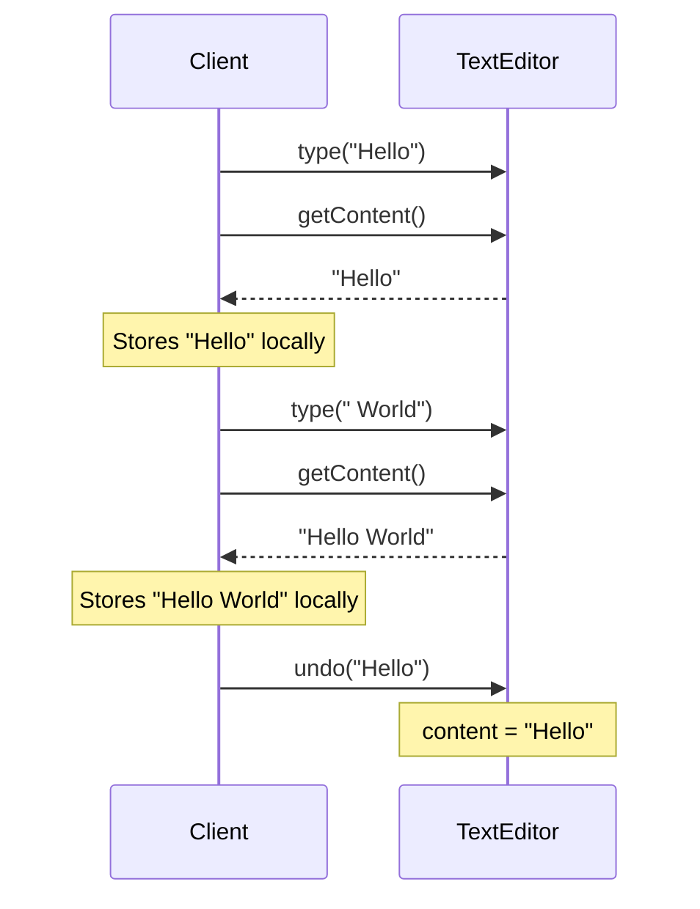
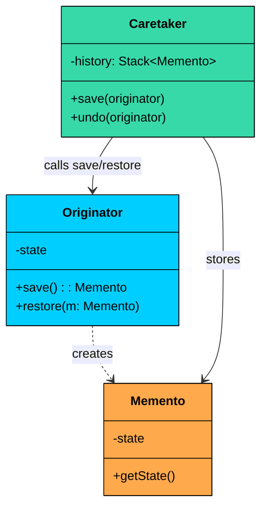
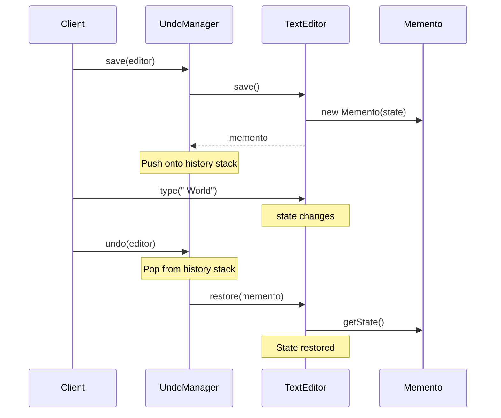
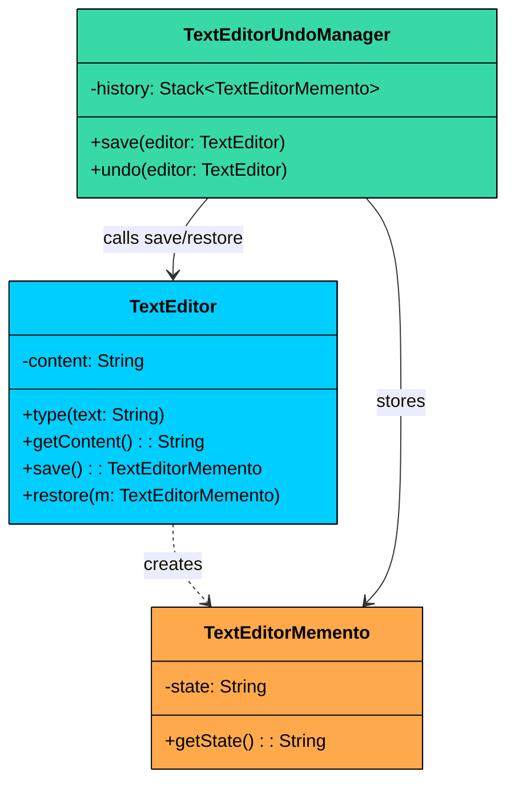

import React from 'react';
import CodeBlock from '../../../../components/ui/CodeBlock';
import Callout from '../../../../components/ui/Callout';

<div className="article-header">
  <div className="breadcrumb">
    <a href="/">Curated Notes</a>
    <span className="breadcrumb-separator">›</span>
    <span className="breadcrumb-current">Memento Design Pattern</span>
  </div>
  <h1>Memento Design Pattern</h1>
  <p style={{ color: 'var(--text-muted)', fontSize: '1.1rem', marginBottom: '16px', lineHeight: '1.6' }}>
    Master the essentials of Memento Design Pattern in this curated guide.
  </p>
  <div className="meta-info">
    <span className="meta-item">
      <svg width="14" height="14" viewBox="0 0 24 24" fill="none" stroke="currentColor" strokeWidth="2"><circle cx="12" cy="12" r="10"/><polyline points="12 6 12 12 16 14"/></svg>
      10 min read
    </span>
    <span className="difficulty-badge difficulty-badge--intermediate">Intermediate</span>
  </div>
</div>

<section className="content-section">


&gt; **DEFINITION**
&gt;
&gt; The **Memento Design Pattern** is a **behavioral design pattern** that lets you **capture and store an object’s internal state** so it can be **restored later**, without violating encapsulation.


It’s particularly useful in situations where:

- You need to implement **undo/redo** functionality.
- You want to support **checkpointing or versioning** of an object’s state.
- You want to separate the concerns of **state storage** from **state management logic**.

Let’s walk through a real-world example to see how we can apply the Memento Pattern to solve a problem that involves implementing undo functionality in a text editor.

---

## 1. The Problem: Implementing Undo in a Text Editor

Imagine you’re building a simple **text editor**. The editor supports basic operations like:

- `type(String text)` – appends text to the current document
- `getContent()` – returns the current document text
- `undo()` – reverts to the previous version of the content

Implementing typing and reading is easy. The real challenge is **undo**.

#### The Naive Approach: Client Manages Snapshots

The most straightforward approach is to have the client manually capture the editor's state before each operation and feed it back during undo:





The client is doing all the heavy lifting: fetching internal state, storing it, and feeding it back during undo.


```java
class TextEditorNaive {
    private String content = "";

    public void type(String newText) {
        content += newText;
    }

    public void undo(String previousContent) {
        content = previousContent;
    }

    public String getContent() {
        return content;
    }
}
```

```python
class TextEditorNaive:
   def __init__(self):
       self.content = ""

   def type(self, new_text):
       self.content += new_text

   def undo(self, previous_content):
       self.content = previous_content

   def get_content(self):
       return self.content
```

```cpp
class TextEditorNaive {
private:
   string content;

public:
   TextEditorNaive() : content("") {}

   void type(string newText) {
       content += newText;
   }

   void undo(string previousContent) {
       content = previousContent;
   }

   string getContent() {
       return content;
   }
};
```

```go
type TextEditorNaive struct {
	content string
}

func (t *TextEditorNaive) Type(newText string) {
	t.content += newText
}

func (t *TextEditorNaive) Undo(previousContent string) {
	t.content = previousContent
}

func (t *TextEditorNaive) GetContent() string {
	return t.content
}
```

```csharp
class TextEditorNaive
{
   private string content = "";

   public void Type(string newText)
   {
       content += newText;
   }

   public void Undo(string previousContent)
   {
       content = previousContent;
   }

   public string GetContent()
   {
       return content;
   }
}
```

```typescript
class TextEditorNaive {
   private content: string = "";

   type(newText: string): void {
       this.content += newText;
   }

   undo(previousContent: string): void {
       this.content = previousContent;
   }

   getContent(): string {
       return this.content;
   }
}
```


Here is how the client uses it:


```java
public class TextEditorUndoV1 {
    public static void main(String[] args) {
        TextEditorNaive editor = new TextEditorNaive();

        editor.type("Hello");
        String snapshot1 = editor.getContent(); // manual snapshot

        editor.type(" World");
        String snapshot2 = editor.getContent();

        System.out.println("Current Content: " + editor.getContent()); // Hello World

        // Undo 1 step
        editor.undo(snapshot1);
        System.out.println("After Undo: " + editor.getContent()); // Hello
    }
}
```

```python
class TextEditorUndoV1:
   @staticmethod
   def main():
       editor = TextEditorNaive()

       editor.type("Hello")
       snapshot1 = editor.get_content()  # manual snapshot

       editor.type(" World")
       snapshot2 = editor.get_content()

       print(f"Current Content: {editor.get_content()}")  # Hello World

       # Undo 1 step
       editor.undo(snapshot1)
       print(f"After Undo: {editor.get_content()}")  # Hello
```

```cpp
class TextEditorUndoV1 {
public:
   static void main() {
       TextEditorNaive editor;

       editor.type("Hello");
       string snapshot1 = editor.getContent(); // manual snapshot

       editor.type(" World");
       string snapshot2 = editor.getContent();

       cout << "Current Content: " << editor.getContent() << endl; // Hello World

       // Undo 1 step
       editor.undo(snapshot1);
       cout << "After Undo: " << editor.getContent() << endl; // Hello
   }
};
```

```go
type TextEditorUndoV1 struct{}

func (TextEditorUndoV1) main() {
	editor := TextEditorNaive{}

	editor.type("Hello")
	snapshot1 := editor.getContent() // manual snapshot

	editor.type(" World")
	snapshot2 := editor.getContent()

	println("Current Content: " + editor.getContent()) // Hello World

	// Undo 1 step
	editor.undo(snapshot1)
	println("After Undo: " + editor.getContent()) // Hello
}
```

```csharp
public class TextEditorUndoV1
{
   public static void Main()
   {
       TextEditorNaive editor = new TextEditorNaive();

       editor.Type("Hello");
       string snapshot1 = editor.GetContent(); // manual snapshot

       editor.Type(" World");
       string snapshot2 = editor.GetContent();

       Console.WriteLine("Current Content: " + editor.GetContent()); // Hello World

       // Undo 1 step
       editor.Undo(snapshot1);
       Console.WriteLine("After Undo: " + editor.GetContent()); // Hello
   }
}
```

```typescript
class TextEditorUndoV1 {
   static main(): void {
       const editor = new TextEditorNaive();

       editor.type("Hello");
       const snapshot1 = editor.getContent(); // manual snapshot

       editor.type(" World");
       const snapshot2 = editor.getContent();

       console.log("Current Content: " + editor.getContent()); // Hello World

       // Undo 1 step
       editor.undo(snapshot1);
       console.log("After Undo: " + editor.getContent()); // Hello
   }
}
```


#### What’s Wrong with This Design?

While this naive implementation works for very basic undo logic, it introduces several **major issues**:

#### 1. Encapsulation is Broken

The client must call `getContent()` to fetch internal state and pass it directly to `undo()`. This means the client knows that the editor's state is a string called "content." 

If the editor later adds cursor position, selection range, or formatting metadata, the client must be updated to snapshot all of those too. The editor's internal structure has leaked into every class that implements undo.

#### 2. Client Bears the Responsibility

The client must remember to take a snapshot before every operation. Miss one, and you have a gap in your undo history. This is manual, error-prone, and scatters undo logic across the entire codebase instead of centralizing it.

#### 3. Not Scalable

What if the editor's state grows to include cursor position, selection range, font formatting, and scroll position? The client would need to capture all of those fields separately, store them in some custom structure, and feed them all back during undo. The snapshot logic balloons in complexity, and it is all in the wrong place, outside the editor instead of inside it.

#### 4. No Separation of Concerns

The same code that handles user interactions is also managing state snapshots. This violates the single responsibility principle and makes both the UI code and the undo logic harder to test, maintain, and extend.

#### What We Really Need

We need a design that:

- Lets the **TextEditor** capture and restore its own state without exposing its internals
- Gives the **client** a way to manage state history without understanding what is inside each snapshot
- Scales cleanly when the editor's internal state grows more complex
- Separates undo management from editing logic

This is exactly what the **Memento pattern** provides.

---

## 2. What is the Memento Pattern

&gt; The 
&gt;
&gt; **Memento Design Pattern**
&gt;
&gt;  allows an object to 
&gt;
&gt; **save and restore its state**
&gt;
&gt;  without exposing its internal structure. It achieves this by encapsulating the state in a special object called a 
&gt;
&gt; **Memento**
&gt;
&gt; .

Two characteristics define the Memento pattern:

1. **State capture without exposure.** The originator (the object whose state you want to save) creates a memento that contains a snapshot of its private internal state. The memento does not expose that state to the outside world. Only the originator can read it back. This preserves encapsulation while enabling state restoration.
2. **External state management.** A separate object called the caretaker stores and manages the mementos. The caretaker decides when to save (before a risky operation) and when to restore (undo). But it never inspects or modifies the memento's contents. It treats each memento as an opaque black box.

#### Class Diagram





Memento has three participants.

#### 1. Originator (e.g., `TextEditor`)

The object whose internal state you want to capture and restore.

The originator is the only participant that touches its own private fields. It packages them into a memento during save, and unpacks them during restore. No other object needs to know what those fields are or how they are structured.

#### 2. Memento (e.g., `TextEditorMemento`)

An immutable snapshot of the originator's state at a specific point in time. Store the originator's state in a way that prevents external modification

#### 3. Caretaker (e.g., `UndoManager`)

The external object that decides when to save and restore state. It manages the lifecycle of mementos. It never examines or modifies the content of a memento, it just treats it as a black box.

---

## 3. How It Works

Here is the Memento workflow step by step:





#### **Step 1: Caretaker requests a save**

Before the user performs an operation (like typing, deleting, or formatting), the caretaker asks the originator to save its current state.

#### **Step 2: Originator creates a memento**

The originator reads its own private fields, packages them into a new memento object, and returns it to the caretaker.

#### **Step 3: Caretaker stores the memento**

The caretaker pushes the memento onto a history stack (or list). It does not open the memento or read its contents.

#### **Step 4: User performs operations**

The originator's state changes through normal operations (typing text, moving shapes, etc.).

#### **Step 5: User triggers undo**

The caretaker pops the most recent memento from the history stack and passes it to the originator.

#### **Step 6: Originator restores from the memento**

The originator reads the state from the memento and overwrites its current fields. The object is now back to exactly how it was when the memento was created.

---

## 4. Implementing Memento Pattern

Let’s refactor our naive text editor into a clean, maintainable design using the **Memento Pattern**. We will create the memento, then the originator, then the caretaker, and finally wire them together in client code.





#### Step 1: Create the Memento - TextEditorMemento

The memento stores a snapshot of the `TextEditor`'s internal state. It has three important properties:

- **Immutable** — fields are `private final` (or readonly) and cannot be changed after creation
- **Minimal** — it stores only what is needed for restoration
- **Encapsulated** — only the originator should read its contents


```java
class TextEditorMemento {
    private final String state;

    public TextEditorMemento(String state) {
        this.state = state;
    }

    public String getState() {
        return state;
    }
}
```

```python
class TextEditorMemento:
   def __init__(self, state):
       self._state = state

   def get_state(self):
       return self._state
```

```cpp
class TextEditorMemento {
private:
   string state;

public:
   TextEditorMemento(string state) : state(state) {}

   string getState() {
       return state;
   }
};
```

```go
type TextEditorMemento struct {
	state string
}

func NewTextEditorMemento(state string) TextEditorMemento {
	return TextEditorMemento{state: state}
}

func (t TextEditorMemento) GetState() string {
	return t.state
}
```

```csharp
class TextEditorMemento
{
   private readonly string state;

   public TextEditorMemento(string state)
   {
       this.state = state;
   }

   public string GetState()
   {
       return state;
   }
}
```

```typescript
class TextEditorMemento {
   private readonly state: string;

   constructor(state: string) {
       this.state = state;
   }

   getState(): string {
       return this.state;
   }
}
```


This class is passive. It does not contain any logic, just a frozen snapshot of the editor's state at the moment it was created.

#### Step 2: Create the Originator – `TextEditor`

The originator is the object whose state we want to save and restore. It provides two key methods beyond its normal operations:

- `save()` — creates a memento capturing the current state
- `restore(memento)` — replaces the current state with the state from the memento


```java
class TextEditor {
    private String content = "";

    public void type(String newText) {
        content += newText;
        System.out.println("Typed: \"" + newText + "\"");
    }

    public String getContent() {
        return content;
    }

    public TextEditorMemento save() {
        System.out.println("Saving state: \"" + content + "\"");
        return new TextEditorMemento(content);
    }

    public void restore(TextEditorMemento memento) {
        content = memento.getState();
        System.out.println("Restored state to: \"" + content + "\"");
    }
}
```

```python
class TextEditor:
    def __init__(self):
        self._content = ""

    def type(self, new_text: str):
        self._content += new_text
        print(f'Typed: "{new_text}"')

    def get_content(self) -> str:
        return self._content

    def save(self) -> TextEditorMemento:
        print(f'Saving state: "{self._content}"')
        return TextEditorMemento(self._content)

    def restore(self, memento: TextEditorMemento):
        self._content = memento.get_state()
        print(f'Restored state to: "{self._content}"')
```

```cpp
class TextEditor {
private:
    string content;

public:
    TextEditor() : content("") {}

    void type(const string& newText) {
        content += newText;
        cout << "Typed: \"" << newText << "\"" << endl;
    }

    string getContent() const {
        return content;
    }

    TextEditorMemento save() {
        cout << "Saving state: \"" << content << "\"" << endl;
        return TextEditorMemento(content);
    }

    void restore(const TextEditorMemento& memento) {
        content = memento.getState();
        cout << "Restored state to: \"" << content << "\"" << endl;
    }
};
```

```go
type TextEditor struct {
	content string
}

func (te *TextEditor) Type(newText string) {
	te.content += newText
	fmt.Printf("Typed: \"%s\"\n", newText)
}

func (te *TextEditor) GetContent() string {
	return te.content
}

func (te *TextEditor) Save() TextEditorMemento {
	fmt.Printf("Saving state: \"%s\"\n", te.content)
	return TextEditorMemento{state: te.content}
}

func (te *TextEditor) Restore(memento TextEditorMemento) {
	te.content = memento.GetState()
	fmt.Printf("Restored state to: \"%s\"\n", te.content)
}
```

```csharp
class TextEditor
{
    private string content = "";

    public void Type(string newText)
    {
        content += newText;
        Console.WriteLine($"Typed: \"{newText}\"");
    }

    public string GetContent()
    {
        return content;
    }

    public TextEditorMemento Save()
    {
        Console.WriteLine($"Saving state: \"{content}\"");
        return new TextEditorMemento(content);
    }

    public void Restore(TextEditorMemento memento)
    {
        content = memento.GetState();
        Console.WriteLine($"Restored state to: \"{content}\"");
    }
}
```

```typescript
class TextEditor {
    private content: string = "";

    type(newText: string): void {
        this.content += newText;
        console.log(`Typed: "${newText}"`);
    }

    getContent(): string {
        return this.content;
    }

    save(): TextEditorMemento {
        console.log(`Saving state: "${this.content}"`);
        return new TextEditorMemento(this.content);
    }

    restore(memento: TextEditorMemento): void {
        this.content = memento.getState();
        console.log(`Restored state to: "${this.content}"`);
    }
}
```


Notice that the `save()` and `restore()` methods are the only ones that interact with the memento. The rest of the editor (typing, getting content) works exactly as before. The memento pattern adds state capture without changing how the object normally operates.

#### Step 3: Create the Caretaker – TextEditorUndoManager

The caretaker manages the history of mementos. It is responsible for:

- Asking the originator to save its state at the right times
- Storing mementos in a stack (last-in, first-out for undo)
- Passing mementos back to the originator for restoration
- Never inspecting or modifying memento contents


```java
class TextEditorUndoManager {
    private final Stack<TextEditorMemento> history = new Stack<>();

    public void save(TextEditor editor) {
        history.push(editor.save());
    }

    public void undo(TextEditor editor) {
        if (!history.isEmpty()) {
            editor.restore(history.pop());
        } else {
            System.out.println("Nothing to undo.");
        }
    }

    public int historySize() {
        return history.size();
    }
}
```

```python
class TextEditorUndoManager:
    def __init__(self):
        self._history = []

    def save(self, editor: TextEditor):
        self._history.append(editor.save())

    def undo(self, editor: TextEditor):
        if self._history:
            editor.restore(self._history.pop())
        else:
            print("Nothing to undo.")

    def history_size(self) -> int:
        return len(self._history)
```

```cpp
class TextEditorUndoManager {
private:
    stack<TextEditorMemento> history;

public:
    void save(TextEditor& editor) {
        history.push(editor.save());
    }

    void undo(TextEditor& editor) {
        if (!history.empty()) {
            editor.restore(history.top());
            history.pop();
        } else {
            cout << "Nothing to undo." << endl;
        }
    }

    int historySize() const {
        return history.size();
    }
};
```

```go
type TextEditorUndoManager struct {
	history []TextEditorMemento
}

func (m *TextEditorUndoManager) Save(editor TextEditor) {
	m.history = append(m.history, editor.Save())
}

func (m *TextEditorUndoManager) Undo(editor TextEditor) {
	if len(m.history) > 0 {
		last := m.history[len(m.history)-1]
		m.history = m.history[:len(m.history)-1]
		editor.Restore(last)
	} else {
		println("Nothing to undo.")
	}
}

func (m *TextEditorUndoManager) HistorySize() int {
	return len(m.history)
}
```

```csharp
class TextEditorUndoManager
{
    private readonly Stack<TextEditorMemento> history = new Stack<TextEditorMemento>();

    public void Save(TextEditor editor)
    {
        history.Push(editor.Save());
    }

    public void Undo(TextEditor editor)
    {
        if (history.Count > 0)
        {
            editor.Restore(history.Pop());
        }
        else
        {
            Console.WriteLine("Nothing to undo.");
        }
    }

    public int HistorySize()
    {
        return history.Count;
    }
}
```

```typescript
class TextEditorUndoManager {
    private readonly history: TextEditorMemento[] = [];

    save(editor: TextEditor): void {
        this.history.push(editor.save());
    }

    undo(editor: TextEditor): void {
        if (this.history.length > 0) {
            const memento = this.history.pop()!;
            editor.restore(memento);
        } else {
            console.log("Nothing to undo.");
        }
    }

    historySize(): number {
        return this.history.length;
    }
}
```


The `TextEditorUndoManager` allows undo operations without the client managing snapshots directly. Notice that `save()` and `undo()` take a `TextEditor` reference but never call `getContent()` or any other method that exposes internal state. They only call `save()` and `restore()`, which return and accept opaque mementos.

#### Step 4: Using the Memento from the Client

Now let's put it all together. The client creates an editor and an undo manager, performs operations, saves state at appropriate moments, and undoes when needed.


```java
public class TextEditorDemo {
    public static void main(String[] args) {
        TextEditor editor = new TextEditor();
        TextEditorUndoManager undoManager = new TextEditorUndoManager();

        editor.type("Hello");
        undoManager.save(editor);

        editor.type(" World");
        undoManager.save(editor);

        editor.type("!");
        System.out.println("Current: " + editor.getContent());

        System.out.println("\n--- Undo 1 ---");
        undoManager.undo(editor);
        System.out.println("Content: " + editor.getContent());

        System.out.println("\n--- Undo 2 ---");
        undoManager.undo(editor);
        System.out.println("Content: " + editor.getContent());

        System.out.println("\n--- Undo 3 ---");
        undoManager.undo(editor);
    }
}
```

```python
def main():
    editor = TextEditor()
    undo_manager = TextEditorUndoManager()

    editor.type("Hello")
    undo_manager.save(editor)

    editor.type(" World")
    undo_manager.save(editor)

    editor.type("!")
    print(f"Current: {editor.get_content()}")

    print("\n--- Undo 1 ---")
    undo_manager.undo(editor)
    print(f"Content: {editor.get_content()}")

    print("\n--- Undo 2 ---")
    undo_manager.undo(editor)
    print(f"Content: {editor.get_content()}")

    print("\n--- Undo 3 ---")
    undo_manager.undo(editor)

if __name__ == "__main__":
    main()
```

```cpp
int main() {
    TextEditor editor;
    TextEditorUndoManager undoManager;

    editor.type("Hello");
    undoManager.save(editor);

    editor.type(" World");
    undoManager.save(editor);

    editor.type("!");
    cout << "Current: " << editor.getContent() << endl;

    cout << "\n--- Undo 1 ---" << endl;
    undoManager.undo(editor);
    cout << "Content: " << editor.getContent() << endl;

    cout << "\n--- Undo 2 ---" << endl;
    undoManager.undo(editor);
    cout << "Content: " << editor.getContent() << endl;

    cout << "\n--- Undo 3 ---" << endl;
    undoManager.undo(editor);
    return 0;
}
```

```go
editor := TextEditor{}
undoManager := TextEditorUndoManager{}

editor.Type("Hello")
undoManager.Save(&editor)

editor.Type(" World")
undoManager.Save(&editor)

editor.Type("!")
println("Current: " + editor.GetContent())

println("\n--- Undo 1 ---")
undoManager.Undo(&editor)
println("Content: " + editor.GetContent())

println("\n--- Undo 2 ---")
undoManager.Undo(&editor)
println("Content: " + editor.GetContent())

println("\n--- Undo 3 ---")
undoManager.Undo(&editor)
```

```csharp
class Program
{
    static void Main(string[] args)
    {
        var editor = new TextEditor();
        var undoManager = new TextEditorUndoManager();

        editor.Type("Hello");
        undoManager.Save(editor);

        editor.Type(" World");
        undoManager.Save(editor);

        editor.Type("!");
        Console.WriteLine("Current: " + editor.GetContent());

        Console.WriteLine("\n--- Undo 1 ---");
        undoManager.Undo(editor);
        Console.WriteLine("Content: " + editor.GetContent());

        Console.WriteLine("\n--- Undo 2 ---");
        undoManager.Undo(editor);
        Console.WriteLine("Content: " + editor.GetContent());

        Console.WriteLine("\n--- Undo 3 ---");
        undoManager.Undo(editor);
    }
}
```

```typescript
const editor = new TextEditor();
const undoManager = new TextEditorUndoManager();

editor.type("Hello");
undoManager.save(editor);

editor.type(" World");
undoManager.save(editor);

editor.type("!");
console.log("Current: " + editor.getContent());

console.log("\n--- Undo 1 ---");
undoManager.undo(editor);
console.log("Content: " + editor.getContent());

console.log("\n--- Undo 2 ---");
undoManager.undo(editor);
console.log("Content: " + editor.getContent());

console.log("\n--- Undo 3 ---");
undoManager.undo(editor);
```


#### Expected Output:


```shell
Typed: "Hello"
Saving state: "Hello"
Typed: " World"
Saving state: "Hello World"
Typed: "!"
Current: Hello World!

--- Undo 1 ---
Restored state to: "Hello World"
Content: Hello World

--- Undo 2 ---
Restored state to: "Hello"
Content: Hello

--- Undo 3 ---
Nothing to undo.
```


#### What We Achieved

- **Encapsulation: **Editor’s internal state is never exposed directly to the client
- **Clean undo logic: **The client doesn’t need to manage or interpret state — it just saves and restores
- **Separation of concerns: **The `TextEditor` handles state, and the `TextEditorUndoManager` handles history
- **Scalability: **Easy to extend with redo support, multi-level undo, or persistent versioning

---

## 5. Evolving the System: Adding Cursor Position

What happens when the product manager says "We need to restore cursor position too, not just content"? With the naive approach, this would be a nightmare. The client would need to capture two fields instead of one, store them in some tuple or object, and know about both when undoing.

With Memento, the change is entirely inside the originator.


```java
// Updated memento stores both content and cursor position
class TextEditorMemento {
    private final String state;
    private final int cursorPosition;

    public TextEditorMemento(String state, int cursorPosition) {
        this.state = state;
        this.cursorPosition = cursorPosition;
    }

    public String getState() { return state; }
    public int getCursorPosition() { return cursorPosition; }
}

// Updated editor saves and restores cursor too
class TextEditor {
    private String content = "";
    private int cursorPosition = 0;

    public void type(String newText) {
        content += newText;
        cursorPosition = content.length();
    }

    public TextEditorMemento save() {
        return new TextEditorMemento(content, cursorPosition);
    }

    public void restore(TextEditorMemento memento) {
        content = memento.getState();
        cursorPosition = memento.getCursorPosition();
    }

    // getContent(), getCursorPosition() ...
}

// UndoManager stays EXACTLY the same. Zero changes.
```

```python
## Updated memento stores both content and cursor position
class TextEditorMemento:
    def __init__(self, state: str, cursor_position: int):
        self._state = state
        self._cursor_position = cursor_position

    def get_state(self) -> str:
        return self._state

    def get_cursor_position(self) -> int:
        return self._cursor_position

## Updated editor saves and restores cursor too
class TextEditor:
    def __init__(self):
        self._content = ""
        self._cursor_position = 0

    def type(self, new_text: str):
        self._content += new_text
        self._cursor_position = len(self._content)

    def save(self) -> TextEditorMemento:
        return TextEditorMemento(self._content, self._cursor_position)

    def restore(self, memento: TextEditorMemento):
        self._content = memento.get_state()
        self._cursor_position = memento.get_cursor_position()

## UndoManager stays EXACTLY the same. Zero changes.
```

```cpp
// Updated memento stores both content and cursor position
class TextEditorMemento {
private:
    string state;
    int cursorPosition;

public:
    TextEditorMemento(const string& state, int cursorPosition)
        : state(state), cursorPosition(cursorPosition) {}

    string getState() const { return state; }
    int getCursorPosition() const { return cursorPosition; }
};

// Updated editor saves and restores cursor too
class TextEditor {
private:
    string content;
    int cursorPosition = 0;

public:
    void type(const string& newText) {
        content += newText;
        cursorPosition = content.length();
    }

    TextEditorMemento save() {
        return TextEditorMemento(content, cursorPosition);
    }

    void restore(const TextEditorMemento& memento) {
        content = memento.getState();
        cursorPosition = memento.getCursorPosition();
    }
};

// UndoManager stays EXACTLY the same. Zero changes.
```

```go
// Updated memento stores both content and cursor position
type TextEditorMemento struct {
	state         string
	cursorPosition int
}

func NewTextEditorMemento(state string, cursorPosition int) TextEditorMemento {
	return TextEditorMemento{state: state, cursorPosition: cursorPosition}
}

func (m TextEditorMemento) GetState() string { return m.state }
func (m TextEditorMemento) GetCursorPosition() int { return m.cursorPosition }

// Updated editor saves and restores cursor too
type TextEditor struct {
	content        string
	cursorPosition int
}

func (e *TextEditor) Type(newText string) {
	e.content += newText
	e.cursorPosition = len(e.content)
}

func (e *TextEditor) Save() TextEditorMemento {
	return NewTextEditorMemento(e.content, e.cursorPosition)
}

func (e *TextEditor) Restore(memento TextEditorMemento) {
	e.content = memento.GetState()
	e.cursorPosition = memento.GetCursorPosition()
}

// UndoManager stays EXACTLY the same. Zero changes.
```

```csharp
// Updated memento stores both content and cursor position
class TextEditorMemento
{
    private readonly string state;
    private readonly int cursorPosition;

    public TextEditorMemento(string state, int cursorPosition)
    {
        this.state = state;
        this.cursorPosition = cursorPosition;
    }

    public string GetState() => state;
    public int GetCursorPosition() => cursorPosition;
}

// Updated editor saves and restores cursor too
class TextEditor
{
    private string content = "";
    private int cursorPosition = 0;

    public void Type(string newText)
    {
        content += newText;
        cursorPosition = content.Length;
    }

    public TextEditorMemento Save()
    {
        return new TextEditorMemento(content, cursorPosition);
    }

    public void Restore(TextEditorMemento memento)
    {
        content = memento.GetState();
        cursorPosition = memento.GetCursorPosition();
    }
}

// UndoManager stays EXACTLY the same. Zero changes.
```

```typescript
// Updated memento stores both content and cursor position
class TextEditorMemento {
    constructor(
        private readonly state: string,
        private readonly cursorPosition: number
    ) {}

    getState(): string { return this.state; }
    getCursorPosition(): number { return this.cursorPosition; }
}

// Updated editor saves and restores cursor too
class TextEditor {
    private content: string = "";
    private cursorPosition: number = 0;

    type(newText: string): void {
        this.content += newText;
        this.cursorPosition = this.content.length;
    }

    save(): TextEditorMemento {
        return new TextEditorMemento(this.content, this.cursorPosition);
    }

    restore(memento: TextEditorMemento): void {
        this.content = memento.getState();
        this.cursorPosition = memento.getCursorPosition();
    }
}

// UndoManager stays EXACTLY the same. Zero changes.
```


The undo manager did not change at all. Neither did the client code. The only files that changed were the memento and the editor. This is the Open/Closed Principle at work. You extended the system's capability (restoring cursor position) by modifying only the originator and its memento, without touching any external code.

If you later add selection range, scroll position, or font formatting, the same principle applies. The memento and editor grow, but the undo manager and client remain untouched.

</section>
