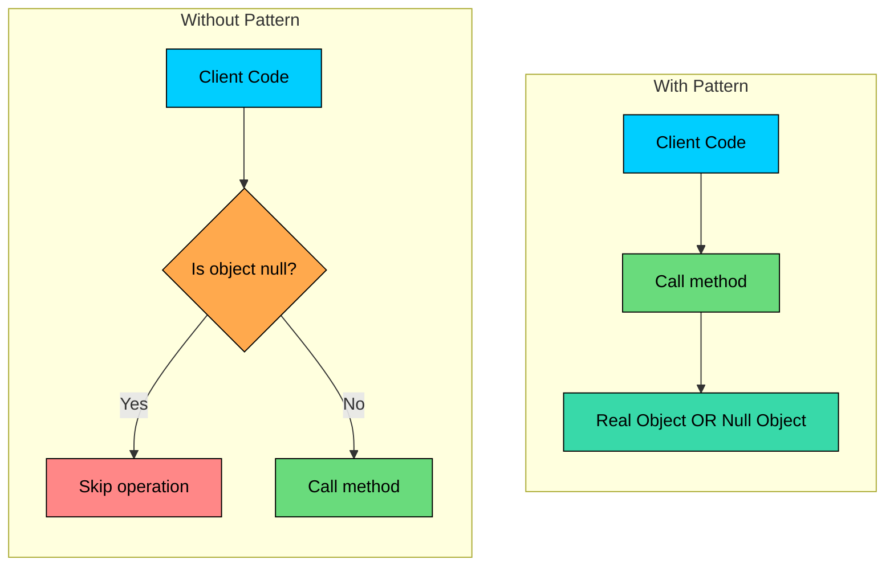
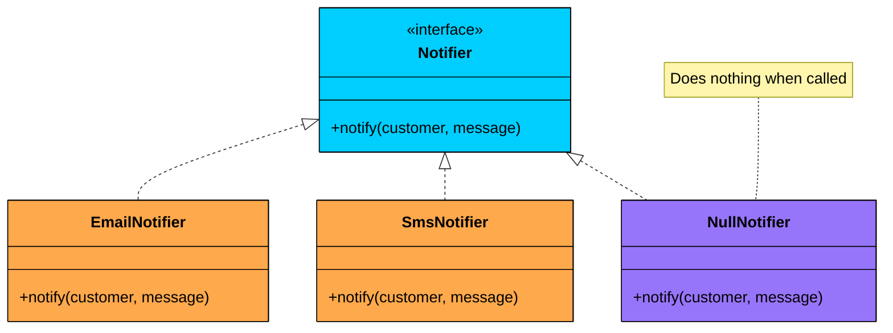
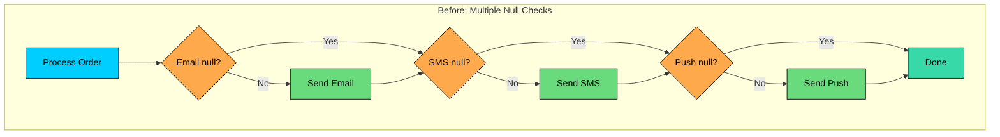
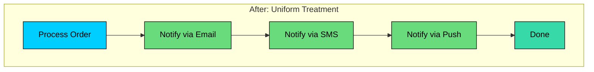
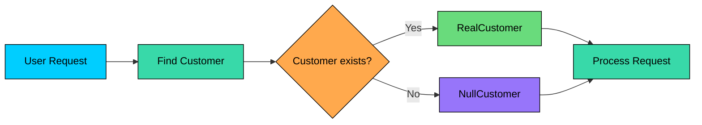
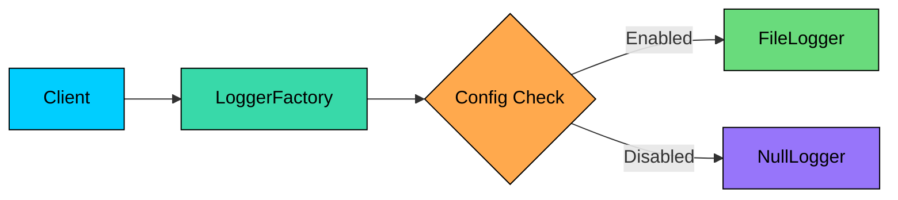

import React from 'react';
import CodeBlock from '../../../../components/ui/CodeBlock';
import Callout from '../../../../components/ui/Callout';

<div className="article-header">
  <div className="breadcrumb">
    <a href="/">Curated Notes</a>
    <span className="breadcrumb-separator">›</span>
    <span className="breadcrumb-current">Null Object Pattern</span>
  </div>
  <h1>Null Object Pattern</h1>
  <p style={{ color: 'var(--text-muted)', fontSize: '1.1rem', marginBottom: '16px', lineHeight: '1.6' }}>
    Master the essentials of Null Object Pattern in this curated guide.
  </p>
  <div className="meta-info">
    <span className="meta-item">
      <svg width="14" height="14" viewBox="0 0 24 24" fill="none" stroke="currentColor" strokeWidth="2"><circle cx="12" cy="12" r="10"/><polyline points="12 6 12 12 16 14"/></svg>
      10 min read
    </span>
    <span className="difficulty-badge difficulty-badge--intermediate">Intermediate</span>
  </div>
</div>

<section className="content-section">

Imagine you're building a logging system. Different parts of your application need to log events, but some deployments need logging disabled entirely. You start sprinkling null checks everywhere:


```java
if (logger != null) {
    logger.log("User logged in");
}
```

```python
if logger is not None:
    logger.log("User logged in")
```

```cpp
if (logger != nullptr) {
    logger->log("User logged in");
}
```

```csharp
if (logger != null)
{
    logger.Log("User logged in");
}
```

```go
if logger != nil {
    logger.Log("User logged in")
}
```

```javascript
if (logger != null) { // matches null OR undefined
  logger.log("User logged in");
}
```

```typescript
if (logger != null) { // matches null OR undefined
  logger.log("User logged in");
}

```


One file becomes ten. Ten becomes fifty. Now your codebase is littered with defensive null checks. Miss one, and you get a `NullPointerException` in production.

The **Null Object Pattern** solves this by replacing null references with objects that do nothing. Instead of checking for null, you call methods that silently succeed.

---

## 1. What is the Null Object Pattern?

The **Null Object Pattern** is a behavioral design pattern that uses an object with default "do nothing" behavior instead of using null references. This eliminates the need for null checks throughout your code.

The key insight is that "absence of behavior" is still a behavior. By encapsulating it in an object, you treat present and absent cases uniformly.





The pattern was described by Bobby Woolf in the "Pattern Languages of Program Design" series. It's a special case of the Strategy pattern where one strategy is to "do nothing."

**But why not just check for null?**

---

## 2. The Problem: Null Checks Everywhere

Let's look at a notification system without the Null Object pattern:


```java
public class OrderService {
    private EmailNotifier emailNotifier;
    private SmsNotifier smsNotifier;
    private PushNotifier pushNotifier;

    public void processOrder(Order order) {
        // Business logic
        order.setStatus(OrderStatus.PROCESSED);

        // Null checks everywhere
        if (emailNotifier != null) {
            emailNotifier.notify(order.getCustomer(), "Order processed");
        }
        if (smsNotifier != null) {
            smsNotifier.notify(order.getCustomer(), "Order processed");
        }
        if (pushNotifier != null) {
            pushNotifier.notify(order.getCustomer(), "Order processed");
        }
    }
}
```

```python
class OrderService:
    def __init__(self):
        self.emailNotifier = None
        self.smsNotifier = None
        self.pushNotifier = None

    def processOrder(self, order):
        # Business logic
        order.setStatus(OrderStatus.PROCESSED)

        # Null checks everywhere
        if self.emailNotifier is not None:
            self.emailNotifier.notify(order.getCustomer(), "Order processed")
        if self.smsNotifier is not None:
            self.smsNotifier.notify(order.getCustomer(), "Order processed")
        if self.pushNotifier is not None:
            self.pushNotifier.notify(order.getCustomer(), "Order processed")
```

```cpp
class OrderService {
private:
    EmailNotifier* emailNotifier = nullptr;
    SmsNotifier* smsNotifier = nullptr;
    PushNotifier* pushNotifier = nullptr;

public:
    void processOrder(Order& order) {
        // Business logic
        order.setStatus(OrderStatus::PROCESSED);

        // Null checks everywhere
        if (emailNotifier != nullptr) {
            emailNotifier->notify(order.getCustomer(), "Order processed");
        }
        if (smsNotifier != nullptr) {
            smsNotifier->notify(order.getCustomer(), "Order processed");
        }
        if (pushNotifier != nullptr) {
            pushNotifier->notify(order.getCustomer(), "Order processed");
        }
    }
};
```

```csharp
public class OrderService
{
    private EmailNotifier emailNotifier;
    private SmsNotifier smsNotifier;
    private PushNotifier pushNotifier;

    public void ProcessOrder(Order order)
    {
        // Business logic
        order.SetStatus(OrderStatus.PROCESSED);

        // Null checks everywhere
        if (emailNotifier != null)
        {
            emailNotifier.Notify(order.GetCustomer(), "Order processed");
        }
        if (smsNotifier != null)
        {
            smsNotifier.Notify(order.GetCustomer(), "Order processed");
        }
        if (pushNotifier != null)
        {
            pushNotifier.Notify(order.GetCustomer(), "Order processed");
        }
    }
}
```

```go
type OrderService struct {
	emailNotifier *EmailNotifier
	smsNotifier   *SmsNotifier
	pushNotifier  *PushNotifier
}

func (s *OrderService) ProcessOrder(order *Order) {
	// Business logic
	order.SetStatus(PROCESSED)

	// Null checks everywhere
	if s.emailNotifier != nil {
		s.emailNotifier.Notify(order.GetCustomer(), "Order processed")
	}
	if s.smsNotifier != nil {
		s.smsNotifier.Notify(order.GetCustomer(), "Order processed")
	}
	if s.pushNotifier != nil {
		s.pushNotifier.Notify(order.GetCustomer(), "Order processed")
	}
}
```

```javascript
class OrderService {
  constructor() {
    this.emailNotifier = null;
    this.smsNotifier = null;
    this.pushNotifier = null;
  }

  processOrder(order) {
    // Business logic
    order.setStatus(OrderStatus.PROCESSED);

    // Null checks everywhere
    if (this.emailNotifier != null) {
      this.emailNotifier.notify(order.getCustomer(), "Order processed");
    }
    if (this.smsNotifier != null) {
      this.smsNotifier.notify(order.getCustomer(), "Order processed");
    }
    if (this.pushNotifier != null) {
      this.pushNotifier.notify(order.getCustomer(), "Order processed");
    }
  }
}
```

```typescript
class OrderService {
  private emailNotifier: EmailNotifier | null = null;
  private smsNotifier: SmsNotifier | null = null;
  private pushNotifier: PushNotifier | null = null;

  processOrder(order: Order): void {
    // Business logic
    order.setStatus(OrderStatus.PROCESSED);

    // Null checks everywhere
    if (this.emailNotifier != null) {
      this.emailNotifier.notify(order.getCustomer(), "Order processed");
    }
    if (this.smsNotifier != null) {
      this.smsNotifier.notify(order.getCustomer(), "Order processed");
    }
    if (this.pushNotifier != null) {
      this.pushNotifier.notify(order.getCustomer(), "Order processed");
    }
  }
}
```


This approach has several problems:

#### Problem 1: Defensive Code Everywhere

Every method that uses an optional dependency needs null checks. Forget one, and your application crashes with a `NullPointerException`.

#### Problem 2: Violates Open/Closed Principle

Adding a new notifier type means adding another null check in every place notifications are sent.

#### Problem 3: Scattered Logic

The decision about whether to notify is spread across every call site instead of being centralized.

#### Problem 4: Harder to Test

Tests need to account for null cases. You cannot simply mock all dependencies; you must also test the null branches.

#### Problem 5: Reduced Readability

Business logic gets buried under defensive checks. The "happy path" becomes hard to follow.

---

## 3. How the Null Object Pattern Works

The pattern has three main components:





#### 3.1 The Abstract Interface

Define the contract that all implementations must follow:


```java
public interface Notifier {
    void notify(Customer customer, String message);
}
```

```python
from abc import ABC, abstractmethod

class Notifier(ABC):
    def notify(self, customer, message):
        pass
```

```cpp
class Notifier {
public:
    virtual ~Notifier() = default;
    virtual void notify(Customer customer, const string& message) = 0;
};
```

```csharp
public interface Notifier
{
    void Notify(Customer customer, string message);
}
```

```go
type Notifier interface {
	Notify(customer Customer, message string)
}
```

```javascript
class Notifier {
  notify(customer, message) {}
}
```

```typescript
interface Notifier {
  notify(customer: Customer, message: string): void;
}
```


#### 3.2 Real Implementations

Concrete classes that do actual work:


```java
public class EmailNotifier implements Notifier {
    @Override
    public void notify(Customer customer, String message) {
        // Actually send an email
        emailService.send(customer.getEmail(), message);
    }
}
```

```python
class EmailNotifier(Notifier):
    def notify(self, customer, message):
        # Actually send an email
        self.emailService.send(customer.getEmail(), message)
```

```cpp
class EmailNotifier : public Notifier {
public:
    void notify(Customer customer, const string& message) override {
        // Actually send an email
        emailService.send(customer.getEmail(), message);
    }
};
```

```csharp
public class EmailNotifier : Notifier
{
    public void Notify(Customer customer, string message)
    {
        // Actually send an email
        emailService.Send(customer.GetEmail(), message);
    }
}
```

```go
type EmailNotifier struct {
	emailService EmailService
}

func (n *EmailNotifier) Notify(customer Customer, message string) {
	// Actually send an email
	n.emailService.Send(customer.GetEmail(), message)
}
```

```javascript
class EmailNotifier extends Notifier {
  notify(customer, message) {
    // Actually send an email
    this.emailService.send(customer.getEmail(), message);
  }
}
```

```typescript
class EmailNotifier implements Notifier {
  emailService: EmailService;

  notify(customer: Customer, message: string): void {
    // Actually send an email
    this.emailService.send(customer.getEmail(), message);
  }
}
```


#### 3.3 The Null Object

A class that implements the interface but does nothing:


```java
public class NullNotifier implements Notifier {
    @Override
    public void notify(Customer customer, String message) {
        // Intentionally empty - do nothing
    }
}
```

```python
class NullNotifier(Notifier):
    def notify(self, customer, message):
        # Intentionally empty - do nothing
        pass
```

```cpp
class NullNotifier : public Notifier {
public:
    void notify(Customer customer, const string& message) override {
        // Intentionally empty - do nothing
    }
};
```

```csharp
public class NullNotifier : Notifier
{
    public void Notify(Customer customer, string message)
    {
        // Intentionally empty - do nothing
    }
}
```

```go
type NullNotifier struct{}

func (n *NullNotifier) Notify(customer Customer, message string) {
	// Intentionally empty - do nothing
}
```

```javascript
class NullNotifier extends Notifier {
  notify(customer, message) {
    // Intentionally empty - do nothing
  }
}
```

```typescript
class NullNotifier implements Notifier {
  notify(customer: Customer, message: string): void {
    // Intentionally empty - do nothing
  }
}
```


Now the client code becomes simple:


```java
public class OrderService {
    private Notifier notifier;  // Never null

    public OrderService(Notifier notifier) {
        this.notifier = notifier;
    }

    public void processOrder(Order order) {
        order.setStatus(OrderStatus.PROCESSED);
        notifier.notify(order.getCustomer(), "Order processed");
        // No null check needed!
    }
}
```

```python
class OrderService:
    def __init__(self, notifier):
        self.notifier = notifier  # Never null

    def processOrder(self, order):
        order.setStatus(OrderStatus.PROCESSED)
        self.notifier.notify(order.getCustomer(), "Order processed")
        # No null check needed!
```

```cpp
class OrderService {
private:
    Notifier* notifier;  // Never null

public:
    explicit OrderService(Notifier* notifier) : notifier(notifier) {}

    void processOrder(Order& order) {
        order.setStatus(OrderStatus::PROCESSED);
        notifier->notify(order.getCustomer(), "Order processed");
        // No null check needed!
    }
};
```

```csharp
public class OrderService
{
    private Notifier notifier;  // Never null

    public OrderService(Notifier notifier)
    {
        this.notifier = notifier;
    }

    public void ProcessOrder(Order order)
    {
        order.SetStatus(OrderStatus.PROCESSED);
        notifier.Notify(order.GetCustomer(), "Order processed");
        // No null check needed!
    }
}
```

```go
type OrderService struct {
	notifier Notifier // Never nil
}

func NewOrderService(notifier Notifier) *OrderService {
	return &OrderService{notifier: notifier}
}

func (s *OrderService) ProcessOrder(order *Order) {
	order.SetStatus(PROCESSED)
	s.notifier.Notify(order.GetCustomer(), "Order processed")
	// No nil check needed!
}
```

```javascript
class OrderService {
  constructor(notifier) {
    this.notifier = notifier; // Never null
  }

  processOrder(order) {
    order.setStatus(OrderStatus.PROCESSED);
    this.notifier.notify(order.getCustomer(), "Order processed");
    // No null check needed!
  }
}
```

```typescript
class OrderService {
  private notifier: Notifier; // Never null

  constructor(notifier: Notifier) {
    this.notifier = notifier;
  }

  processOrder(order: Order): void {
    order.setStatus(OrderStatus.PROCESSED);
    this.notifier.notify(order.getCustomer(), "Order processed");
    // No null check needed!
  }
}
```


---

## 4. The Pattern in Action

Let's visualize how the pattern eliminates branching:








Each notifier is either a real implementation or a `NullNotifier`. The client code treats them identically.

---

## 5. Common Use Cases

#### 5.1 Logging Systems

One of the most common applications. You want logging in development but might disable it in production for performance:


```java
// Configuration decides which logger to use
Logger logger = config.isLoggingEnabled()
    ? new FileLogger("app.log")
    : new NullLogger();
```

```python
logger = FileLogger("app.log") if config.is_logging_enabled() else NullLogger()
```

```cpp
unique_ptr<Logger> logger = config.isLoggingEnabled()
    ? make_unique<FileLogger>("app.log")
    : make_unique<NullLogger>();
```

```csharp
Logger logger = config.IsLoggingEnabled()
    ? new FileLogger("app.log")
    : new NullLogger();
```

```go
var logger Logger
if config.IsLoggingEnabled() {
    logger = NewFileLogger("app.log")
} else {
    logger = NullLogger{}
}
```

```javascript
const logger = config.isLoggingEnabled()
  ? new FileLogger("app.log")
  : new NullLogger();
```

```typescript
const logger: Logger = config.isLoggingEnabled()
  ? new FileLogger("app.log")
  : new NullLogger();
```


#### 5.2 Optional Features

When features can be toggled on or off:


```java
public interface AnalyticsTracker {
    void trackEvent(String event, Map<String, Object> properties);
    void trackPageView(String page);
}

public class NullAnalyticsTracker implements AnalyticsTracker {
    @Override
    public void trackEvent(String event, Map<String, Object> properties) {
        // No-op: Analytics disabled
    }

    @Override
    public void trackPageView(String page) {
        // No-op: Analytics disabled
    }
}
```

```python
from __future__ import annotations
from typing import Protocol, Mapping, Any

class AnalyticsTracker(Protocol):
    def track_event(self, event: str, properties: Mapping[str, Any]) -> None: ...
    def track_page_view(self, page: str) -> None: ...

class NullAnalyticsTracker:
    def track_event(self, event: str, properties: Mapping[str, Any]) -> None:
        # No-op: Analytics disabled
        return

    def track_page_view(self, page: str) -> None:
        # No-op: Analytics disabled
        return
```

```cpp
#include <string>
#include <unordered_map>
#include <any>

class AnalyticsTracker {
public:
    virtual ~AnalyticsTracker() = default;

    virtual void trackEvent(const std::string& event,
                            const std::unordered_map<std::string, std::any>& properties) = 0;
    virtual void trackPageView(const std::string& page) = 0;
};

class NullAnalyticsTracker : public AnalyticsTracker {
public:
    void trackEvent(const std::string&,
                    const std::unordered_map<std::string, std::any>&) override {
        // No-op: Analytics disabled
    }

    void trackPageView(const std::string&) override {
        // No-op: Analytics disabled
    }
};
```

```csharp
using System.Collections.Generic;

public interface IAnalyticsTracker
{
    void TrackEvent(string @event, IDictionary<string, object> properties);
    void TrackPageView(string page);
}

public sealed class NullAnalyticsTracker : IAnalyticsTracker
{
    public void TrackEvent(string @event, IDictionary<string, object> properties)
    {
        // No-op: Analytics disabled
    }

    public void TrackPageView(string page)
    {
        // No-op: Analytics disabled
    }
}
```

```go
package analytics

type AnalyticsTracker interface {
	TrackEvent(event string, properties map[string]any)
	TrackPageView(page string)
}

type NullAnalyticsTracker struct{}

func (n NullAnalyticsTracker) TrackEvent(event string, properties map[string]any) {
	// No-op: Analytics disabled
}

func (n NullAnalyticsTracker) TrackPageView(page string) {
	// No-op: Analytics disabled
}
```

```javascript
class NullAnalyticsTracker {
  trackEvent(event, properties) {
    // No-op: Analytics disabled
  }

  trackPageView(page) {
    // No-op: Analytics disabled
  }
}
```

```typescript
export interface AnalyticsTracker {
  trackEvent(event: string, properties: Record<string, unknown>): void;
  trackPageView(page: string): void;
}

export class NullAnalyticsTracker implements AnalyticsTracker {
  trackEvent(event: string, properties: Record<string, unknown>): void {
    // No-op: Analytics disabled
  }

  trackPageView(page: string): void {
    // No-op: Analytics disabled
  }
}
```


#### 5.3 Default Values in Collections

When retrieving items that might not exist:





```java
public Customer findById(String id) {
    Customer customer = database.find(id);
    return customer != null ? customer : NullCustomer.getInstance();
}
```

```python
def find_by_id(id: str) -> "Customer":
    customer = database.find(id)
    return customer if customer is not None else NullCustomer.instance()
```

```cpp
Customer* findById(const string& id) {
    Customer* customer = database.find(id);
    return (customer != nullptr) ? customer : NullCustomer::getInstance();
}
```

```csharp
public Customer FindById(string id)
{
    var customer = database.Find(id);
    return customer ?? NullCustomer.Instance;
}
```

```go
func FindById(id string) Customer {
    customer := database.Find(id)
    if customer != nil {
        return customer
    }
    return NullCustomerInstance()
}
```

```javascript
function findById(id) {
  const customer = database.find(id);
  return customer ?? NullCustomer.getInstance();
}
```

```typescript
function findById(id: string): Customer {
  const customer = database.find(id);
  return customer ?? NullCustomer.getInstance();
}
```


#### 5.4 Strategy Pattern with "No Strategy"

When one valid strategy is to do nothing:


```java
public interface DiscountStrategy {
    BigDecimal apply(BigDecimal price);
}

public class NoDiscount implements DiscountStrategy {
    @Override
    public BigDecimal apply(BigDecimal price) {
        return price;  // Return unchanged
    }
}

public class PercentageDiscount implements DiscountStrategy {
    private final int percent;

    @Override
    public BigDecimal apply(BigDecimal price) {
        return price.multiply(BigDecimal.valueOf(100 - percent))
                    .divide(BigDecimal.valueOf(100));
    }
}
```

```python
from __future__ import annotations
from abc import ABC, abstractmethod
from decimal import Decimal

class DiscountStrategy(ABC):
    @abstractmethod
    def apply(self, price: Decimal) -> Decimal:
        raise NotImplementedError

class NoDiscount(DiscountStrategy):
    def apply(self, price: Decimal) -> Decimal:
        return price  # unchanged

class PercentageDiscount(DiscountStrategy):
    def __init__(self, percent: int):
        self.percent = percent

    def apply(self, price: Decimal) -> Decimal:
        return (price * (Decimal(100) - Decimal(self.percent))) / Decimal(100)
```

```cpp
#include <memory>

class BigDecimal; // placeholder type

class DiscountStrategy {
public:
    virtual ~DiscountStrategy() = default;
    virtual BigDecimal apply(const BigDecimal& price) = 0;
};

class NoDiscount : public DiscountStrategy {
public:
    BigDecimal apply(const BigDecimal& price) override {
        return price; // unchanged
    }
};

class PercentageDiscount : public DiscountStrategy {
    int percent;

public:
    explicit PercentageDiscount(int percent) : percent(percent) {}

    BigDecimal apply(const BigDecimal& price) override {
        return price.multiply(BigDecimal::valueOf(100 - percent))
                    .divide(BigDecimal::valueOf(100));
    }
};
```

```csharp
using System;

public interface IDiscountStrategy
{
    decimal Apply(decimal price);
}

public sealed class NoDiscount : IDiscountStrategy
{
    public decimal Apply(decimal price) => price; // unchanged
}

public sealed class PercentageDiscount : IDiscountStrategy
{
    private readonly int _percent;

    public PercentageDiscount(int percent) => _percent = percent;

    public decimal Apply(decimal price)
        => price * (100m - _percent) / 100m;
}
```

```go
package pricing

type DiscountStrategy interface {
	Apply(price float64) float64
}

type NoDiscount struct{}

func (d NoDiscount) Apply(price float64) float64 {
	return price // unchanged
}

type PercentageDiscount struct {
	Percent int
}

func (d PercentageDiscount) Apply(price float64) float64 {
	return price * float64(100-d.Percent) / 100.0
}
```

```javascript
class NoDiscount {
  apply(price) {
    return price; // unchanged
  }
}

class PercentageDiscount {
  constructor(percent) {
    this.percent = percent;
  }

  apply(price) {
    return (price * (100 - this.percent)) / 100;
  }
}
```

```typescript
export interface DiscountStrategy {
  apply(price: number): number;
}

export class NoDiscount implements DiscountStrategy {
  apply(price: number): number {
    return price; // unchanged
  }
}

export class PercentageDiscount implements DiscountStrategy {
  constructor(private readonly percent: number) {}

  apply(price: number): number {
    return (price * (100 - this.percent)) / 100;
  }
}
```


---

## 6. Implementation Patterns

#### 6.1 Singleton Null Objects

Since null objects are stateless, use a single instance:


```java
public class NullLogger implements Logger {
    private static final NullLogger INSTANCE = new NullLogger();

    private NullLogger() {}

    public static NullLogger getInstance() {
        return INSTANCE;
    }

    @Override
    public void log(String message) {
        // Do nothing
    }
}
```

```python
class NullLogger(Logger):
    _INSTANCE = None

    def __new__(cls):
        if cls._INSTANCE is None:
            cls._INSTANCE = super().__new__(cls)
        return cls._INSTANCE

    @staticmethod
    def get_instance() -> "NullLogger":
        return NullLogger()

    def log(self, message: str) -> None:
        # Do nothing
        return
```

```cpp
class NullLogger : public Logger {
public:
    static NullLogger& getInstance() {
        static NullLogger instance;
        return instance;
    }

    void log(const string&) override {
        // Do nothing
    }

private:
    NullLogger() = default;
    NullLogger(const NullLogger&) = delete;
    NullLogger& operator=(const NullLogger&) = delete;
};
```

```csharp
public sealed class NullLogger : ILogger
{
    public static readonly NullLogger Instance = new NullLogger();

    private NullLogger() { }

    public void Log(string message)
    {
        // Do nothing
    }
}
```

```go
type NullLogger struct{}

var instance = NullLogger{}

func GetInstance() Logger {
	return instance
}

func (n NullLogger) Log(message string) {
	// Do nothing
}
```

```javascript
class NullLogger {
  static INSTANCE = new NullLogger();

  constructor() {}

  static getInstance() {
    return NullLogger.INSTANCE;
  }

  log(message) {
    // Do nothing
  }
}
```

```typescript
export class NullLogger implements Logger {
  private static readonly INSTANCE = new NullLogger();

  private constructor() {}

  static getInstance(): NullLogger {
    return NullLogger.INSTANCE;
  }

  log(message: string): void {
    // Do nothing
  }
}
```


#### 6.2 Null Object with Default Values

Sometimes "doing nothing" means returning sensible defaults:


```java
public class NullCustomer implements Customer {
    @Override
    public String getName() {
        return "Guest";
    }

    @Override
    public String getEmail() {
        return "guest@example.com";
    }

    @Override
    public boolean isRegistered() {
        return false;
    }
}
```

```python
class NullCustomer(Customer):
    def get_name(self) -> str:
        return "Guest"

    def get_email(self) -> str:
        return "guest@example.com"

    def is_registered(self) -> bool:
        return False
```

```cpp
class NullCustomer : public Customer {
public:
    string getName() const override { return "Guest"; }
    string getEmail() const override { return "guest@example.com"; }
    bool isRegistered() const override { return false; }
};
```

```csharp
public sealed class NullCustomer : ICustomer
{
    public string GetName() => "Guest";
    public string GetEmail() => "guest@example.com";
    public bool IsRegistered() => false;
}
```

```go
type NullCustomer struct{}

func (n NullCustomer) GetName() string     { return "Guest" }
func (n NullCustomer) GetEmail() string    { return "guest@example.com" }
func (n NullCustomer) IsRegistered() bool  { return false }
```

```javascript
class NullCustomer {
  getName() {
    return "Guest";
  }

  getEmail() {
    return "guest@example.com";
  }

  isRegistered() {
    return false;
  }
}
```

```typescript
export class NullCustomer implements Customer {
  getName(): string {
    return "Guest";
  }

  getEmail(): string {
    return "guest@example.com";
  }

  isRegistered(): boolean {
    return false;
  }
}
```


#### 6.3 Factory Method Pattern

Hide the null object decision in a factory:





```java
public class LoggerFactory {
    public static Logger create(Config config) {
        if (config.isLoggingEnabled()) {
            return new FileLogger(config.getLogPath());
        }
        return NullLogger.getInstance();
    }
}
```

```python
class LoggerFactory:
    @staticmethod
    def create(config: "Config") -> "Logger":
        if config.is_logging_enabled():
            return FileLogger(config.get_log_path())
        return NullLogger.get_instance()
```

```cpp
#include <memory>

class LoggerFactory {
public:
    static unique_ptr<Logger> create(const Config& config) {
        if (config.isLoggingEnabled()) {
            return make_unique<FileLogger>(config.getLogPath());
        }
        return make_unique<NullLogger>();
    }
};
```

```csharp
public static class LoggerFactory
{
    public static ILogger Create(Config config)
    {
        if (config.IsLoggingEnabled())
            return new FileLogger(config.GetLogPath());

        return NullLogger.Instance;
    }
}
```

```go
package logging

type LoggerFactory struct{}

func (LoggerFactory) Create(config Config) Logger {
	if config.IsLoggingEnabled() {
		return NewFileLogger(config.GetLogPath())
	}
	return GetInstance() // NullLogger
}
```

```javascript
class LoggerFactory {
  static create(config) {
    if (config.isLoggingEnabled()) {
      return new FileLogger(config.getLogPath());
    }
    return NullLogger.getInstance();
  }
}
```

```typescript
export class LoggerFactory {
  static create(config: Config): Logger {
    if (config.isLoggingEnabled()) {
      return new FileLogger(config.getLogPath());
    }
    return NullLogger.getInstance();
  }
}
```


---

## 7. Null Object vs Other Approaches


| ##### Approach | ##### Pros | ##### Cons |
| --- | --- | --- |
| **Null checks** | Simple, explicit | Repetitive, error-prone |
| **Optional/Maybe** | Type-safe, functional | Adds wrapping overhead |
| **Null Object** | Clean client code, polymorphic | Requires interface, can hide bugs |
| **Exceptions** | Fails fast, explicit | Disruptive, performance cost |


#### When to Use Null Object

- The null case is a valid, expected scenario
- You want polymorphic behavior (treat null and real the same)
- Multiple call sites would need the same null check
- The "do nothing" behavior is meaningful

#### When NOT to Use Null Object

- Null indicates a bug that should fail fast
- The caller needs to know if the object is absent
- Different callers need different null handling
- It would hide programming errors

</section>
