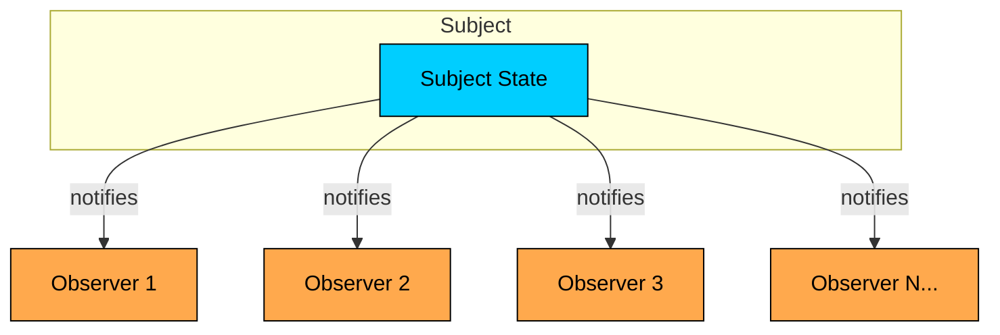
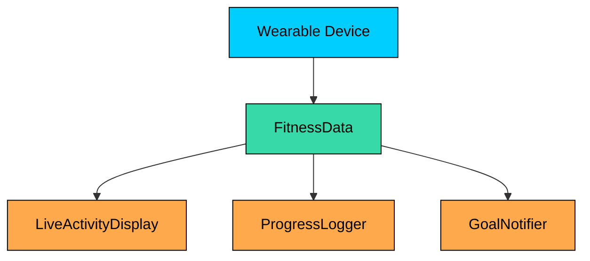
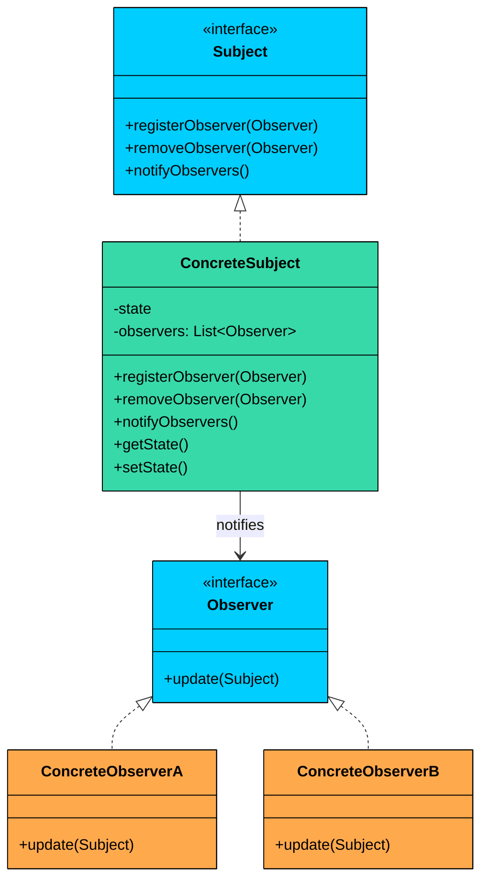
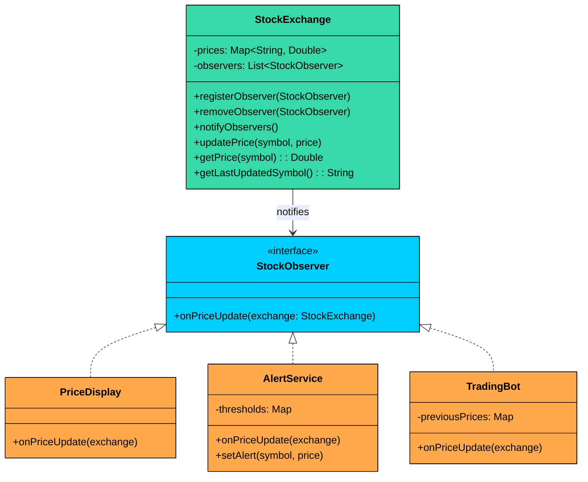

import React from 'react';
import CodeBlock from '../../../../components/ui/CodeBlock';
import Callout from '../../../../components/ui/Callout';

<div className="article-header">
  <div className="breadcrumb">
    <a href="/">Curated Notes</a>
    <span className="breadcrumb-separator">›</span>
    <span className="breadcrumb-current">Observer Design Pattern</span>
  </div>
  <h1>Observer Design Pattern</h1>
  <p style={{ color: 'var(--text-muted)', fontSize: '1.1rem', marginBottom: '16px', lineHeight: '1.6' }}>
    Master the essentials of Observer Design Pattern in this curated guide.
  </p>
  <div className="meta-info">
    <span className="meta-item">
      <svg width="14" height="14" viewBox="0 0 24 24" fill="none" stroke="currentColor" strokeWidth="2"><circle cx="12" cy="12" r="10"/><polyline points="12 6 12 12 16 14"/></svg>
      10 min read
    </span>
    <span className="difficulty-badge difficulty-badge--intermediate">Intermediate</span>
  </div>
</div>

<section className="content-section">





&gt; **DEFINITION**
&gt;
&gt; The **Observer Design Pattern** is a **behavioral pattern** that defines a **one-to-many dependency** between objects  so that when one object (the subject) changes its state, **all its dependents (observers) are automatically notified and updated**.


This pattern shines in scenarios where:

- You have multiple parts of the system that need to react to a change in one central component.
- You want to decouple the publisher of data from the subscribers who react to it.
- You need a dynamic, event-driven communication model without hardcoding who is listening to whom.

Let’s walk through a real-world example to see how we can apply the Observer Pattern to build a flexible, extensible, and loosely coupled notification system.

---

## 1. The Problem: Broadcasting Fitness Data

Imagine you are building a **Fitness Tracker App** that connects to a wearable device. The device continuously streams real-time fitness data: steps taken, active minutes, and calories burned. This data flows into a central `FitnessData` object.


Now, multiple modules within your app need to react to these updates:





| Module | Responsibility |
|--------|----------------|
| **LiveActivityDisplay** | Shows real-time stats on the dashboard |
| **ProgressLogger** | Persists data to a database for trend analysis |
| **GoalNotifier** | Sends alerts when the user hits milestones |


#### The Naive Approach

In a straightforward implementation, `FitnessData` directly holds and manages references to all dependent modules. It knows about each one, creates them, and calls their specific methods whenever data changes.

#### FitnessDataNaive


```java
class FitnessDataNaive {
    private int steps;
    private int activeMinutes;
    private int calories;

    // Direct, hardcoded references to all dependent modules
    private LiveActivityDisplayNaive liveDisplay = new LiveActivityDisplayNaive();
    private ProgressLoggerNaive progressLogger = new ProgressLoggerNaive();
    private NotificationServiceNaive notificationService = new NotificationServiceNaive();

    public void newFitnessDataPushed(int newSteps, int newActiveMinutes, int newCalories) {
        this.steps = newSteps;
        this.activeMinutes = newActiveMinutes;
        this.calories = newCalories;

        System.out.println("\nFitnessDataNaive: New data received - Steps: " + steps +
            ", ActiveMins: " + activeMinutes + ", Calories: " + calories);

        // Manually notify each dependent module
        liveDisplay.showStats(steps, activeMinutes, calories);
        progressLogger.logDataPoint(steps, activeMinutes, calories);
        notificationService.checkAndNotify(steps);
    }

    public void dailyReset() {
        // Reset logic...
        if (notificationService != null) {
            notificationService.resetDailyNotifications();
        }
        System.out.println("FitnessDataNaive: Daily data reset.");
        newFitnessDataPushed(0, 0, 0); // Notify with reset state
    }
}
```

```python
class FitnessDataNaive:
    def __init__(self):
        self.steps = 0
        self.active_minutes = 0
        self.calories = 0
        
        # Direct, hardcoded references to all dependent modules
        self.live_display = LiveActivityDisplayNaive()
        self.progress_logger = ProgressLoggerNaive()
        self.notification_service = NotificationServiceNaive()
    
    def new_fitness_data_pushed(self, new_steps, new_active_minutes, new_calories):
        self.steps = new_steps
        self.active_minutes = new_active_minutes
        self.calories = new_calories
        
        print(f"\nFitnessDataNaive: New data received - Steps: {self.steps}, "
              f"ActiveMins: {self.active_minutes}, Calories: {self.calories}")
        
        # Manually notify each dependent module
        self.live_display.show_stats(self.steps, self.active_minutes, self.calories)
        self.progress_logger.log_data_point(self.steps, self.active_minutes, self.calories)
        self.notification_service.check_and_notify(self.steps)
    
    def daily_reset(self):
        # Reset logic...
        if self.notification_service is not None:
            self.notification_service.reset_daily_notifications()
        print("FitnessDataNaive: Daily data reset.")
        self.new_fitness_data_pushed(0, 0, 0)  # Notify with reset state
```

```cpp
class FitnessDataNaive {
private:
    int steps;
    int activeMinutes;
    int calories;
    
    // Direct, hardcoded references to all dependent modules
    LiveActivityDisplayNaive liveDisplay;
    ProgressLoggerNaive progressLogger;
    NotificationServiceNaive notificationService;

public:
    FitnessDataNaive() : steps(0), activeMinutes(0), calories(0) {}
    
    void newFitnessDataPushed(int newSteps, int newActiveMinutes, int newCalories) {
        steps = newSteps;
        activeMinutes = newActiveMinutes;
        calories = newCalories;
        
        cout << "\nFitnessDataNaive: New data received - Steps: " << steps 
             << ", ActiveMins: " << activeMinutes << ", Calories: " << calories << endl;
        
        // Manually notify each dependent module
        liveDisplay.showStats(steps, activeMinutes, calories);
        progressLogger.logDataPoint(steps, activeMinutes, calories);
        notificationService.checkAndNotify(steps);
    }
    
    void dailyReset() {
        // Reset logic...
        notificationService.resetDailyNotifications();
        cout << "FitnessDataNaive: Daily data reset." << endl;
        newFitnessDataPushed(0, 0, 0); // Notify with reset state
    }
};
```

```go
type FitnessDataNaive struct {
	steps             int
	activeMinutes     int
	calories          int
	// Direct, hardcoded references to all dependent modules
	liveDisplay       LiveActivityDisplayNaive
	progressLogger    ProgressLoggerNaive
	notificationService NotificationServiceNaive
}

func (f *FitnessDataNaive) newFitnessDataPushed(newSteps int, newActiveMinutes int, newCalories int) {
	f.steps = newSteps
	f.activeMinutes = newActiveMinutes
	f.calories = newCalories

	fmt.Printf("\nFitnessDataNaive: New data received - Steps: %d, ActiveMins: %d, Calories: %d\n", f.steps, f.activeMinutes, f.calories)

	// Manually notify each dependent module
	f.liveDisplay.showStats(f.steps, f.activeMinutes, f.calories)
	f.progressLogger.logDataPoint(f.steps, f.activeMinutes, f.calories)
	f.notificationService.checkAndNotify(f.steps)
}

func (f *FitnessDataNaive) dailyReset() {
	// Reset logic...
	f.notificationService.resetDailyNotifications()
	fmt.Println("FitnessDataNaive: Daily data reset.")
	f.newFitnessDataPushed(0, 0, 0) // Notify with reset state
}
```

```csharp
class FitnessDataNaive
{
    private int steps;
    private int activeMinutes;
    private int calories;

    // Direct, hardcoded references to all dependent modules
    private LiveActivityDisplayNaive liveDisplay = new LiveActivityDisplayNaive();
    private ProgressLoggerNaive progressLogger = new ProgressLoggerNaive();
    private NotificationServiceNaive notificationService = new NotificationServiceNaive();

    public void NewFitnessDataPushed(int newSteps, int newActiveMinutes, int newCalories)
    {
        steps = newSteps;
        activeMinutes = newActiveMinutes;
        calories = newCalories;

        Console.WriteLine($"\nFitnessDataNaive: New data received - Steps: {steps}, ActiveMins: {activeMinutes}, Calories: {calories}");

        // Manually notify each dependent module
        liveDisplay.ShowStats(steps, activeMinutes, calories);
        progressLogger.LogDataPoint(steps, activeMinutes, calories);
        notificationService.CheckAndNotify(steps);
    }

    public void DailyReset()
    {
        // Reset logic...
        notificationService.ResetDailyNotifications();
        Console.WriteLine("FitnessDataNaive: Daily data reset.");
        NewFitnessDataPushed(0, 0, 0); // Notify with reset state
    }
}
```

```typescript
class FitnessDataNaive {
   private steps: number;
   private activeMinutes: number;
   private calories: number;

   // Direct, hardcoded references to all dependent modules
   private liveDisplay = new LiveActivityDisplayNaive();
   private progressLogger = new ProgressLoggerNaive();
   private notificationService = new NotificationServiceNaive();

   newFitnessDataPushed(newSteps: number, newActiveMinutes: number, newCalories: number): void {
       this.steps = newSteps;
       this.activeMinutes = newActiveMinutes;
       this.calories = newCalories;

       console.log("\nFitnessDataNaive: New data received - Steps: " + this.steps +
           ", ActiveMins: " + this.activeMinutes + ", Calories: " + this.calories);

       // Manually notify each dependent module
       this.liveDisplay.showStats(this.steps, this.activeMinutes, this.calories);
       this.progressLogger.logDataPoint(this.steps, this.activeMinutes, this.calories);
       this.notificationService.checkAndNotify(this.steps);
   }

   dailyReset(): void {
       // Reset logic...
       if (this.notificationService) {
           this.notificationService.resetDailyNotifications();
       }
       console.log("FitnessDataNaive: Daily data reset.");
       this.newFitnessDataPushed(0, 0, 0); // Notify with reset state
   }
}
```


#### FitnessAppNaiveClient

Here is how the client uses the naive approach:


```java
public class FitnessAppNaiveClient {
    public static void main(String[] args) {
        FitnessDataNaive fitnessData = new FitnessDataNaive();

        fitnessData.newFitnessDataPushed(500, 5, 20);
        fitnessData.newFitnessDataPushed(9800, 85, 350);
        fitnessData.newFitnessDataPushed(10100, 90, 380);
        fitnessData.dailyReset();
    }
}
```

```python
def fitness_app_naive_client():
    fitness_data = FitnessDataNaive()

    fitness_data.new_fitness_data_pushed(500, 5, 20)
    fitness_data.new_fitness_data_pushed(9800, 85, 350)
    fitness_data.new_fitness_data_pushed(10100, 90, 380)
    fitness_data.daily_reset()

if __name__ == "__main__":
    fitness_app_naive_client()
```

```cpp
int main() {
    FitnessDataNaive fitnessData;

    fitnessData.newFitnessDataPushed(500, 5, 20);
    fitnessData.newFitnessDataPushed(9800, 85, 350);
    fitnessData.newFitnessDataPushed(10100, 90, 380);
    fitnessData.dailyReset();

    return 0;
}
```

```go
fitnessData := FitnessDataNaive{}

fitnessData.newFitnessDataPushed(500, 5, 20)
fitnessData.newFitnessDataPushed(9800, 85, 350)
fitnessData.newFitnessDataPushed(10100, 90, 380)
fitnessData.dailyReset()
```

```csharp
public class FitnessAppNaiveClient
{
    public static void Main(string[] args)
    {
        FitnessDataNaive fitnessData = new FitnessDataNaive();

        fitnessData.NewFitnessDataPushed(500, 5, 20);
        fitnessData.NewFitnessDataPushed(9800, 85, 350);
        fitnessData.NewFitnessDataPushed(10100, 90, 380);
        fitnessData.DailyReset();
    }
}
```

```typescript
const fitnessData = new FitnessDataNaive();

fitnessData.newFitnessDataPushed(500, 5, 20);
fitnessData.newFitnessDataPushed(9800, 85, 350);
fitnessData.newFitnessDataPushed(10100, 90, 380);
fitnessData.dailyReset();
```


This works initially, but let us think about what happens as the application grows.

#### Problems with This Approach

#### 1. Tight Coupling

`FitnessData` holds direct references to `LiveActivityDisplay`, `ProgressLogger`, and `NotificationService`. It knows their concrete types, their method signatures, and their construction logic.

If any of these classes change their interface, or if you want to replace one with a different implementation, you must modify `FitnessData`.

#### 2. Violates the Open/Closed Principle

What happens when you want to add a `WeeklySummaryGenerator`? Or a `SocialSharingService` that posts achievements to social media? 

Each new feature requires you to:

- Add a new field to `FitnessData`
- Modify the `newFitnessDataPushed()` method
- Potentially update the constructor

The class is open for modification when it should be closed.

#### 3. Inflexible and Static Design

Modules like the `NotificationService` or `ProgressLogger` can’t be **added or removed at runtime**. What if the user disables notifications in their settings?

You will need to add conditionals to manually enable/disable parts of the code, making things fragile and error-prone.

#### 4. Responsibility Bloat

`FitnessData` should have one job: managing fitness metrics. Instead, it is now responsible for UI updates, database logging, and notification logic. This violates the Single Responsibility Principle and makes the class difficult to test in isolation.

#### 5. Scalability Bottlenecks

As the number of dependents grows, `newFitnessDataPushed()` becomes a lengthy sequence of method calls, each with different parameters and error handling requirements. Every developer who adds a feature must understand and modify this method.

#### What We Really Need

We need a better, scalable way to solve this problem,  something that allows:

- `FitnessData` to **broadcast changes to multiple listeners**, without knowing who they are
- Each module to **subscribe or unsubscribe dynamically**
- Loose coupling between the subject and observers
- Each module to **decide for itself how to respond** to changes

This is exactly what the **Observer pattern** provides.

---

## 2. Understanding the Observer Pattern

&gt; The 
&gt;
&gt; **Observer Design Pattern**
&gt;
&gt;  provides a clean and flexible solution to the problem of broadcasting changes from one central object (the 
&gt;
&gt; **Subject**
&gt;
&gt; ) to many dependent objects (the 
&gt;
&gt; **Observers**
&gt;
&gt; ) all while keeping them 
&gt;
&gt; **loosely coupled**
&gt;
&gt; .

Two characteristics define the pattern:

1. **One-to-many notification.** A single subject can have any number of observers. When the subject's state changes, it iterates through its list of observers and calls an update method on each one. The subject does not know what the observers do with the information. It just sends the signal.
2. **Loose coupling between subject and observers.** The subject depends only on the observer interface, not on any concrete observer class. Observers can be added, removed, or replaced at runtime without modifying the subject. This means the subject and observers can vary independently.


&gt; **Real-World Analogy**
&gt;
&gt; Think about a newspaper subscription. You subscribe to a newspaper publisher. Every morning, the publisher prints the paper and delivers a copy to every subscriber on its list. The publisher does not know whether you read the sports section, clip coupons, or just check the headlines. It does not care. It delivers the paper, and each subscriber decides what to do with it. 
&gt;
&gt; When you cancel your subscription, the deliveries stop. When a new neighbor subscribes, they start getting the paper. The publisher's printing logic never changes. 
&gt;
&gt; The Observer pattern works the same way: the subject (publisher) broadcasts updates, and observers (subscribers) react however they choose.


---

### Class Diagram





#### 1. Subject Interface

Declares the interface for managing observers, registering, removing, and notifying them. Defines `registerObserver()`, `removeObserver()`, and `notifyObservers()` methods.

The subject holds a list of observers typed to the Observer interface, not to concrete classes. This means any class that implements the Observer interface can register, and the subject never needs to know what it is.

#### 2. Observer Interface

Declares the `update()` method that the subject calls when its state changes. All modules that want to **listen to fitness data changes** will implement this interface.

#### 3. ConcreteSubject (e.g., `FitnessData`)

Implements the Subject interface. Holds the actual state and notifies observers when that state changes.

Maintain a list of registered observers and calls `notifyObservers()` whenever its state changes.

#### 4. ConcreteObservers (e.g., `LiveActivityDisplay`)

Implements the Observer interface. Defines what happens when the subject's state changes. When `update()` is called, each observer **pulls relevant data** from the subject and performs its own logic (e.g., update UI, log progress, send alerts).

---

## 3. How It Works

The Observer workflow follows these steps:

```mermaid
sequenceDiagram
    participant Client
    participant Subject as FitnessData
    participant ObsA as LiveDisplay
    participant ObsB as ProgressLogger
    participant ObsC as GoalNotifier

    Client->>Subject: registerObserver(display)
    Client->>Subject: registerObserver(logger)
    Client->>Subject: registerObserver(notifier)

    Client->>Subject: newFitnessDataPushed(500, 5, 20)
    Note over Subject: State updated

    Subject->>ObsA: update(this)
    ObsA->>Subject: getSteps(), getCalories()
    Note over ObsA: Refreshes UI

    Subject->>ObsB: update(this)
    ObsB->>Subject: getSteps(), getActiveMinutes()
    Note over ObsB: Logs to database

    Subject->>ObsC: update(this)
    ObsC->>Subject: getSteps()
    Note over ObsC: Checks goal threshold
```





**Step 1:** The client creates a concrete subject and one or more concrete observers.

**Step 2:** Each observer registers itself with the subject by calling `registerObserver()`.

**Step 3:** The subject adds the observer to its internal list.

**Step 4:** When the subject's state changes, it calls `notifyObservers()`, which iterates through the list and calls `update()` on each observer.

**Step 5:** Each observer receives the notification and pulls the data it needs from the subject via getter methods.

**Step 6:** To stop receiving updates, an observer calls `removeObserver()`. The subject removes it from the list. Future notifications skip this observer.

---

## 4. Implementing Observer Pattern

Let us refactor the fitness tracker using the Observer pattern, step by step.

#### Step 1: Define the Observer Interface


```java
interface FitnessDataObserver {
    void update(FitnessData data);
}
```

```python
from abc import ABC, abstractmethod

class FitnessDataObserver(ABC):
    @abstractmethod
    def update(self, data):
        pass
```

```cpp
class FitnessDataObserver {
public:
    virtual ~FitnessDataObserver() {}
    virtual void update(FitnessData* data) = 0;
};
```

```go
type FitnessDataObserver interface {
	Update(data FitnessData)
}
```

```csharp
interface IFitnessDataObserver
{
    void Update(FitnessData data);
}
```

```typescript
interface FitnessDataObserver {
   update(data: FitnessData): void;
}
```


Each observer receives a reference to the subject and can pull whatever data it needs. This keeps the interface stable even as `FitnessData` gains new fields.

#### Step 2: Define the Subject Interface

The subject interface provides methods for managing observers: registering, removing, and notifying them.


```java
interface FitnessDataSubject {
    void registerObserver(FitnessDataObserver observer);
    void removeObserver(FitnessDataObserver observer);
    void notifyObservers();
}
```

```python
class FitnessDataSubject(ABC):
    @abstractmethod
    def register_observer(self, observer):
        pass
    
    @abstractmethod
    def remove_observer(self, observer):
        pass
    
    @abstractmethod
    def notify_observers(self):
        pass
```

```cpp
class FitnessDataSubject {
public:
    virtual ~FitnessDataSubject() {}
    virtual void registerObserver(FitnessDataObserver* observer) = 0;
    virtual void removeObserver(FitnessDataObserver* observer) = 0;
    virtual void notifyObservers() = 0;
};
```

```go
type FitnessDataSubject interface {
	registerObserver(observer FitnessDataObserver)
	removeObserver(observer FitnessDataObserver)
	notifyObservers()
}
```

```csharp
interface IFitnessDataSubject
{
    void RegisterObserver(IFitnessDataObserver observer);
    void RemoveObserver(IFitnessDataObserver observer);
    void NotifyObservers();
}
```

```typescript
interface FitnessDataSubject {
   registerObserver(observer: FitnessDataObserver): void;
   removeObserver(observer: FitnessDataObserver): void;
   notifyObservers(): void;
}
```


#### Step 3: Implement the ConcreteSubject

`FitnessData` implements the subject interface. It manages the observer list and calls `notifyObservers()` automatically whenever new data arrives.


```java
public class FitnessData implements FitnessDataSubject {
    private int steps;
    private int activeMinutes;
    private int calories;

    private final List<FitnessDataObserver> observers = new ArrayList<>();

    @Override
    public void registerObserver(FitnessDataObserver observer) {
        observers.add(observer);
    }

    @Override
    public void removeObserver(FitnessDataObserver observer) {
        observers.remove(observer);
    }

    @Override
    public void notifyObservers() {
        for (FitnessDataObserver observer : observers) {
            observer.update(this);
        }
    }

    public void newFitnessDataPushed(int steps, int activeMinutes, int calories) {
        this.steps = steps;
        this.activeMinutes = activeMinutes;
        this.calories = calories;

        System.out.println("\nFitnessData: New data received – Steps: " + steps +
            ", Active Minutes: " + activeMinutes + ", Calories: " + calories);

        notifyObservers();
    }

    public void dailyReset() {
        this.steps = 0;
        this.activeMinutes = 0;
        this.calories = 0;

        System.out.println("\nFitnessData: Daily reset performed.");
        notifyObservers();
    }

    // Getters
    public int getSteps() { return steps; }
    public int getActiveMinutes() { return activeMinutes; }
    public int getCalories() { return calories; }
}
```

```python
class FitnessData(FitnessDataSubject):
    def __init__(self):
        self.steps = 0
        self.active_minutes = 0
        self.calories = 0
        self.observers = []
    
    def register_observer(self, observer):
        self.observers.append(observer)
    
    def remove_observer(self, observer):
        if observer in self.observers:
            self.observers.remove(observer)
    
    def notify_observers(self):
        for observer in self.observers:
            observer.update(self)
    
    def new_fitness_data_pushed(self, steps, active_minutes, calories):
        self.steps = steps
        self.active_minutes = active_minutes
        self.calories = calories
        
        print(f"\nFitnessData: New data received – Steps: {steps}, "
              f"Active Minutes: {active_minutes}, Calories: {calories}")
        
        self.notify_observers()
    
    def daily_reset(self):
        self.steps = 0
        self.active_minutes = 0
        self.calories = 0
        
        print("\nFitnessData: Daily reset performed.")
        self.notify_observers()
    
    # Getters
    def get_steps(self):
        return self.steps
    
    def get_active_minutes(self):
        return self.active_minutes
    
    def get_calories(self):
        return self.calories
```

```cpp
class FitnessData : public FitnessDataSubject {
private:
    int steps;
    int activeMinutes;
    int calories;
    vector<FitnessDataObserver*> observers;

public:
    FitnessData() : steps(0), activeMinutes(0), calories(0) {}
    
    void registerObserver(FitnessDataObserver* observer) override {
        observers.push_back(observer);
    }
    
    void removeObserver(FitnessDataObserver* observer) override {
        observers.erase(remove(observers.begin(), observers.end(), observer), observers.end());
    }
    
    void notifyObservers() override {
        for (FitnessDataObserver* observer : observers) {
            observer->update(this);
        }
    }
    
    void newFitnessDataPushed(int newSteps, int newActiveMinutes, int newCalories) {
        steps = newSteps;
        activeMinutes = newActiveMinutes;
        calories = newCalories;
        
        cout << "\nFitnessData: New data received – Steps: " << steps 
             << ", Active Minutes: " << activeMinutes << ", Calories: " << calories << endl;
        
        notifyObservers();
    }
    
    void dailyReset() {
        steps = 0;
        activeMinutes = 0;
        calories = 0;
        
        cout << "\nFitnessData: Daily reset performed." << endl;
        notifyObservers();
    }
    
    // Getters
    int getSteps() const { return steps; }
    int getActiveMinutes() const { return activeMinutes; }
    int getCalories() const { return calories; }
};
```

```go
type FitnessData struct {
	steps         int
	activeMinutes int
	calories      int
	observers     []FitnessDataObserver
}

func (f *FitnessData) registerObserver(observer FitnessDataObserver) {
	f.observers = append(f.observers, observer)
}

func (f *FitnessData) removeObserver(observer FitnessDataObserver) {
	for i, o := range f.observers {
		if o == observer {
			f.observers = append(f.observers[:i], f.observers[i+1:]...)
			break
		}
	}
}

func (f *FitnessData) notifyObservers() {
	for _, observer := range f.observers {
		observer.update(f)
	}
}

func (f *FitnessData) newFitnessDataPushed(steps, activeMinutes, calories int) {
	f.steps = steps
	f.activeMinutes = activeMinutes
	f.calories = calories

	fmt.Printf("\nFitnessData: New data received – Steps: %d, Active Minutes: %d, Calories: %d\n", steps, activeMinutes, calories)

	f.notifyObservers()
}

func (f *FitnessData) dailyReset() {
	f.steps = 0
	f.activeMinutes = 0
	f.calories = 0

	fmt.Println("\nFitnessData: Daily reset performed.")
	f.notifyObservers()
}

// Getters
func (f *FitnessData) getSteps() int { return f.steps }
func (f *FitnessData) getActiveMinutes() int { return f.activeMinutes }
func (f *FitnessData) getCalories() int { return f.calories }
```

```csharp
class FitnessData : IFitnessDataSubject
{
    private int steps;
    private int activeMinutes;
    private int calories;
    private List<IFitnessDataObserver> observers = new List<IFitnessDataObserver>();

    public void RegisterObserver(IFitnessDataObserver observer)
    {
        observers.Add(observer);
    }

    public void RemoveObserver(IFitnessDataObserver observer)
    {
        observers.Remove(observer);
    }

    public void NotifyObservers()
    {
        foreach (IFitnessDataObserver observer in observers)
        {
            observer.Update(this);
        }
    }

    public void NewFitnessDataPushed(int newSteps, int newActiveMinutes, int newCalories)
    {
        steps = newSteps;
        activeMinutes = newActiveMinutes;
        calories = newCalories;

        Console.WriteLine($"\nFitnessData: New data received – Steps: {steps}, Active Minutes: {activeMinutes}, Calories: {calories}");

        NotifyObservers();
    }

    public void DailyReset()
    {
        steps = 0;
        activeMinutes = 0;
        calories = 0;

        Console.WriteLine("\nFitnessData: Daily reset performed.");
        NotifyObservers();
    }

    // Getters
    public int GetSteps() { return steps; }
    public int GetActiveMinutes() { return activeMinutes; }
    public int GetCalories() { return calories; }
}
```

```typescript
class FitnessData implements FitnessDataSubject {
   private steps: number;
   private activeMinutes: number;
   private calories: number;

   private readonly observers: FitnessDataObserver[] = [];

   registerObserver(observer: FitnessDataObserver): void {
       this.observers.push(observer);
   }

   removeObserver(observer: FitnessDataObserver): void {
       const index = this.observers.indexOf(observer);
       if (index > -1) {
           this.observers.splice(index, 1);
       }
   }

   notifyObservers(): void {
       for (const observer of this.observers) {
           observer.update(this);
       }
   }

   newFitnessDataPushed(steps: number, activeMinutes: number, calories: number): void {
       this.steps = steps;
       this.activeMinutes = activeMinutes;
       this.calories = calories;

       console.log("\nFitnessData: New data received – Steps: " + steps +
           ", Active Minutes: " + activeMinutes + ", Calories: " + calories);

       this.notifyObservers();
   }

   dailyReset(): void {
       this.steps = 0;
       this.activeMinutes = 0;
       this.calories = 0;

       console.log("\nFitnessData: Daily reset performed.");
       this.notifyObservers();
   }

   // Getters
   getSteps(): number { return this.steps; }
   getActiveMinutes(): number { return this.activeMinutes; }
   getCalories(): number { return this.calories; }
}
```


Notice that `FitnessData` no longer imports, creates, or references any concrete observer. It just maintains a list of `FitnessDataObserver` references and iterates through them. The class has gone from knowing about three specific modules to knowing about zero.

#### Step 4: Implement Concrete Observers

Each observer implements `FitnessDataObserver` and defines its own `update()` logic.

#### **LiveActivityDisplay**


```java
class LiveActivityDisplay implements FitnessDataObserver {
    @Override
    public void update(FitnessData data) {
        System.out.println("Live Display → Steps: " + data.getSteps() +
            " | Active Minutes: " + data.getActiveMinutes() +
            " | Calories: " + data.getCalories());
    }
}
```

```python
class LiveActivityDisplay(FitnessDataObserver):
    def update(self, data):
        print(f"Live Display → Steps: {data.get_steps()} "
              f"| Active Minutes: {data.get_active_minutes()} "
              f"| Calories: {data.get_calories()}")
```

```cpp
class LiveActivityDisplay : public FitnessDataObserver {
public:
    void update(FitnessData* data) override {
        cout << "Live Display → Steps: " << data->getSteps() 
             << " | Active Minutes: " << data->getActiveMinutes() 
             << " | Calories: " << data->getCalories() << endl;
    }
};
```

```go
type LiveActivityDisplay struct{}

func (l *LiveActivityDisplay) Update(data FitnessData) {
	fmt.Println("Live Display → Steps: " + data.GetSteps() +
		" | Active Minutes: " + data.GetActiveMinutes() +
		" | Calories: " + data.GetCalories())
}
```

```csharp
class LiveActivityDisplay : IFitnessDataObserver
{
    public void Update(FitnessData data)
    {
        Console.WriteLine($"Live Display → Steps: {data.GetSteps()} | Active Minutes: {data.GetActiveMinutes()} | Calories: {data.GetCalories()}");
    }
}
```

```typescript
class LiveActivityDisplay implements FitnessDataObserver {
   update(data: FitnessData): void {
       console.log("Live Display → Steps: " + data.getSteps() +
           " | Active Minutes: " + data.getActiveMinutes() +
           " | Calories: " + data.getCalories());
   }
}
```


#### **ProgressLogger**


```java
class ProgressLogger implements FitnessDataObserver {
    @Override
    public void update(FitnessData data) {
        System.out.println("Logger → Saving to DB: Steps=" + data.getSteps() +
            ", ActiveMinutes=" + data.getActiveMinutes() +
            ", Calories=" + data.getCalories());
        // Simulated DB/file write...
    }
}
```

```python
class ProgressLogger(FitnessDataObserver):
    def update(self, data):
        print(f"Logger → Saving to DB: Steps={data.get_steps()}, "
              f"ActiveMinutes={data.get_active_minutes()}, "
              f"Calories={data.get_calories()}")
        # Simulated DB/file write...
```

```cpp
class ProgressLogger : public FitnessDataObserver {
public:
    void update(FitnessData* data) override {
        cout << "Logger → Saving to DB: Steps=" << data->getSteps() 
             << ", ActiveMinutes=" << data->getActiveMinutes() 
             << ", Calories=" << data->getCalories() << endl;
        // Simulated DB/file write...
    }
};
```

```go
type ProgressLogger struct{}

func (p *ProgressLogger) update(data FitnessData) {
	fmt.Println("Logger → Saving to DB: Steps=" + strconv.Itoa(data.getSteps()) +
		", ActiveMinutes=" + strconv.Itoa(data.getActiveMinutes()) +
		", Calories=" + strconv.Itoa(data.getCalories()))
	// Simulated DB/file write...
}
```

```csharp
class ProgressLogger : IFitnessDataObserver
{
    public void Update(FitnessData data)
    {
        Console.WriteLine($"Logger → Saving to DB: Steps={data.GetSteps()}, ActiveMinutes={data.GetActiveMinutes()}, Calories={data.GetCalories()}");
        // Simulated DB/file write...
    }
}
```

```typescript
class ProgressLogger implements FitnessDataObserver {
   update(data: FitnessData): void {
       console.log("Logger → Saving to DB: Steps=" + data.getSteps() +
           ", ActiveMinutes=" + data.getActiveMinutes() +
           ", Calories=" + data.getCalories());
       // Simulated DB/file write...
   }
}
```


#### **GoalNotifier**


```java
class GoalNotifier implements FitnessDataObserver {
    private final int stepGoal = 10000;
    private boolean goalReached = false;

    @Override
    public void update(FitnessData data) {
        if (data.getSteps() >= stepGoal && !goalReached) {
            System.out.println("Notifier → 🎉 Goal Reached! You've hit " + stepGoal + " steps!");
            goalReached = true;
        }
    }

    public void reset() {
        goalReached = false;
    }
}
```

```python
class GoalNotifier(FitnessDataObserver):
    def __init__(self):
        self.step_goal = 10000
        self.goal_reached = False
    
    def update(self, data):
        if data.get_steps() >= self.step_goal and not self.goal_reached:
            print(f"Notifier → 🎉 Goal Reached! You've hit {self.step_goal} steps!")
            self.goal_reached = True
    
    def reset(self):
        self.goal_reached = False
```

```cpp
class GoalNotifier : public FitnessDataObserver {
private:
    int stepGoal;
    bool goalReached;

public:
    GoalNotifier() : stepGoal(10000), goalReached(false) {}
    
    void update(FitnessData* data) override {
        if (data->getSteps() >= stepGoal && !goalReached) {
            cout << "Notifier → 🎉 Goal Reached! You've hit " << stepGoal << " steps!" << endl;
            goalReached = true;
        }
    }
    
    void reset() {
        goalReached = false;
    }
};
```

```go
type GoalNotifier struct {
	stepGoal    int
	goalReached bool
}

func (g *GoalNotifier) Update(data FitnessData) {
	if data.GetSteps() >= g.stepGoal && !g.goalReached {
		fmt.Println("Notifier → 🎉 Goal Reached! You've hit", g.stepGoal, "steps!")
		g.goalReached = true
	}
}

func (g *GoalNotifier) Reset() {
	g.goalReached = false
}
```

```csharp
class GoalNotifier : IFitnessDataObserver
{
    private int stepGoal = 10000;
    private bool goalReached = false;

    public void Update(FitnessData data)
    {
        if (data.GetSteps() >= stepGoal && !goalReached)
        {
            Console.WriteLine($"Notifier → 🎉 Goal Reached! You've hit {stepGoal} steps!");
            goalReached = true;
        }
    }

    public void Reset()
    {
        goalReached = false;
    }
}
```

```typescript
class GoalNotifier implements FitnessDataObserver {
   private readonly stepGoal: number = 10000;
   private goalReached: boolean = false;

   update(data: FitnessData): void {
       if (data.getSteps() >= this.stepGoal && !this.goalReached) {
           console.log("Notifier → 🎉 Goal Reached! You've hit " + this.stepGoal + " steps!");
           this.goalReached = true;
       }
   }

   reset(): void {
       this.goalReached = false;
   }
}
```


#### Step 5: Client Code

Now we wire everything together. The client creates the subject and observers, registers the observers, and simulates fitness updates.


```java
public class FitnessAppObserverDemo {
    public static void main(String[] args) {
        FitnessData fitnessData = new FitnessData();

        LiveActivityDisplay display = new LiveActivityDisplay();
        ProgressLogger logger = new ProgressLogger();
        GoalNotifier notifier = new GoalNotifier();

        // Register observers
        fitnessData.registerObserver(display);
        fitnessData.registerObserver(logger);
        fitnessData.registerObserver(notifier);

        // Simulate updates
        fitnessData.newFitnessDataPushed(500, 5, 20);
        fitnessData.newFitnessDataPushed(9800, 85, 350);
        fitnessData.newFitnessDataPushed(10100, 90, 380);

        // Remove logger and reset notifier
        fitnessData.removeObserver(logger);
        notifier.reset();
        fitnessData.dailyReset();
    }
}
```

```python
def fitness_app_observer_demo():
    fitness_data = FitnessData()

    display = LiveActivityDisplay()
    logger = ProgressLogger()
    notifier = GoalNotifier()

    # Register observers
    fitness_data.register_observer(display)
    fitness_data.register_observer(logger)
    fitness_data.register_observer(notifier)

    # Simulate updates
    fitness_data.new_fitness_data_pushed(500, 5, 20)
    fitness_data.new_fitness_data_pushed(9800, 85, 350)
    fitness_data.new_fitness_data_pushed(10100, 90, 380)

    # Remove logger and reset notifier
    fitness_data.remove_observer(logger)
    notifier.reset()
    fitness_data.daily_reset()

if __name__ == "__main__":
    print("=== Observer Pattern Approach ===")
    fitness_app_observer_demo()
```

```cpp
int main() {
    cout << "=== Observer Pattern Approach ===" << endl;

    FitnessData fitnessData;

    LiveActivityDisplay display;
    ProgressLogger logger;
    GoalNotifier notifier;

    // Register observers
    fitnessData.registerObserver(&display);
    fitnessData.registerObserver(&logger);
    fitnessData.registerObserver(&notifier);

    // Simulate updates
    fitnessData.newFitnessDataPushed(500, 5, 20);
    fitnessData.newFitnessDataPushed(9800, 85, 350);
    fitnessData.newFitnessDataPushed(10100, 90, 380);

    // Remove logger and reset notifier
    fitnessData.removeObserver(&logger);
    notifier.reset();
    fitnessData.dailyReset();

    return 0;
}
```

```go
fitnessData := FitnessData{}

display := LiveActivityDisplay{}
logger := ProgressLogger{}
notifier := GoalNotifier{}

// Register observers
fitnessData.registerObserver(&display)
fitnessData.registerObserver(&logger)
fitnessData.registerObserver(&notifier)

// Simulate updates
fitnessData.newFitnessDataPushed(500, 5, 20)
fitnessData.newFitnessDataPushed(9800, 85, 350)
fitnessData.newFitnessDataPushed(10100, 90, 380)

// Remove logger and reset notifier
fitnessData.removeObserver(&logger)
notifier.reset()
fitnessData.dailyReset()
```

```csharp
public class Program
{
    public static void Main(string[] args)
    {
        Console.WriteLine("=== Observer Pattern Approach ===");

        FitnessData fitnessData = new FitnessData();

        LiveActivityDisplay display = new LiveActivityDisplay();
        ProgressLogger logger = new ProgressLogger();
        GoalNotifier notifier = new GoalNotifier();

        // Register observers
        fitnessData.RegisterObserver(display);
        fitnessData.RegisterObserver(logger);
        fitnessData.RegisterObserver(notifier);

        // Simulate updates
        fitnessData.NewFitnessDataPushed(500, 5, 20);
        fitnessData.NewFitnessDataPushed(9800, 85, 350);
        fitnessData.NewFitnessDataPushed(10100, 90, 380);

        // Remove logger and reset notifier
        fitnessData.RemoveObserver(logger);
        notifier.Reset();
        fitnessData.DailyReset();
    }
}
```

```typescript
const fitnessData = new FitnessData();

const display = new LiveActivityDisplay();
const logger = new ProgressLogger();
const notifier = new GoalNotifier();

// Register observers
fitnessData.registerObserver(display);
fitnessData.registerObserver(logger);
fitnessData.registerObserver(notifier);

// Simulate updates
fitnessData.newFitnessDataPushed(500, 5, 20);
fitnessData.newFitnessDataPushed(9800, 85, 350);
fitnessData.newFitnessDataPushed(10100, 90, 380);

// Remove logger and reset notifier
fitnessData.removeObserver(logger);
notifier.reset();
fitnessData.dailyReset();
```


Compare this with the naive approach. `FitnessData` no longer creates or holds references to any specific module. Observers register themselves, receive updates through a common interface, and can be added or removed at any time. The daily reset notification reaches only the currently registered observers, so removing the logger means it stops getting updates immediately.

#### What We Achieved

- **Loose coupling.** `FitnessData` does not know who is listening. It just broadcasts to a list of interfaces.
- **Open/Closed compliance.** Adding a new module (like `WeeklySummaryGenerator`) only requires implementing `FitnessDataObserver` and calling `registerObserver()`. Zero changes to `FitnessData`.
- **Runtime flexibility.** Observers can be added or removed dynamically based on user settings, feature flags, or application state.
- **Clean separation of concerns.** Each observer handles its own logic. `FitnessData` manages fitness metrics and nothing else.
- **Independent testability.** Each observer can be unit tested by creating a mock `FitnessData` and calling `update()` directly.

---

## 5. Evolving the System: Adding a Weekly Summary Generator

The real test of any design pattern is what happens when requirements change. The product team wants a new feature: a weekly summary generator that accumulates fitness data throughout the week and produces a summary report every Sunday.

With the Observer pattern, we do not touch `FitnessData` at all. We just create a new observer and register it.


```java
class WeeklySummaryGenerator implements FitnessDataObserver {
    private int totalSteps = 0;
    private int totalActiveMinutes = 0;
    private int totalCalories = 0;
    private int updateCount = 0;

    @Override
    public void update(FitnessData data) {
        totalSteps += data.getSteps();
        totalActiveMinutes += data.getActiveMinutes();
        totalCalories += data.getCalories();
        updateCount++;

        System.out.println("Weekly Summary -> Accumulated " + updateCount +
            " updates. Total Steps: " + totalSteps);
    }

    public void generateReport() {
        System.out.println("\n=== Weekly Summary Report ===");
        System.out.println("Total Steps: " + totalSteps);
        System.out.println("Total Active Minutes: " + totalActiveMinutes);
        System.out.println("Total Calories: " + totalCalories);
        System.out.println("Data Points Collected: " + updateCount);
        System.out.println("Avg Steps/Update: " + (updateCount > 0 ? totalSteps / updateCount : 0));
    }

    public void reset() {
        totalSteps = 0;
        totalActiveMinutes = 0;
        totalCalories = 0;
        updateCount = 0;
    }
}
```

```python
class WeeklySummaryGenerator(FitnessDataObserver):
    def __init__(self):
        self.total_steps = 0
        self.total_active_minutes = 0
        self.total_calories = 0
        self.update_count = 0

    def update(self, data):
        self.total_steps += data.get_steps()
        self.total_active_minutes += data.get_active_minutes()
        self.total_calories += data.get_calories()
        self.update_count += 1

        print(f"Weekly Summary -> Accumulated {self.update_count} "
              f"updates. Total Steps: {self.total_steps}")

    def generate_report(self):
        print("\n=== Weekly Summary Report ===")
        print(f"Total Steps: {self.total_steps}")
        print(f"Total Active Minutes: {self.total_active_minutes}")
        print(f"Total Calories: {self.total_calories}")
        print(f"Data Points Collected: {self.update_count}")
        avg = self.total_steps // self.update_count if self.update_count > 0 else 0
        print(f"Avg Steps/Update: {avg}")

    def reset(self):
        self.total_steps = 0
        self.total_active_minutes = 0
        self.total_calories = 0
        self.update_count = 0
```

```cpp
class WeeklySummaryGenerator : public FitnessDataObserver {
private:
    int totalSteps = 0;
    int totalActiveMinutes = 0;
    int totalCalories = 0;
    int updateCount = 0;

public:
    void update(FitnessData* data) override {
        totalSteps += data->getSteps();
        totalActiveMinutes += data->getActiveMinutes();
        totalCalories += data->getCalories();
        updateCount++;

        cout << "Weekly Summary -> Accumulated " << updateCount
             << " updates. Total Steps: " << totalSteps << endl;
    }

    void generateReport() {
        cout << "\n=== Weekly Summary Report ===" << endl;
        cout << "Total Steps: " << totalSteps << endl;
        cout << "Total Active Minutes: " << totalActiveMinutes << endl;
        cout << "Total Calories: " << totalCalories << endl;
        cout << "Data Points Collected: " << updateCount << endl;
        cout << "Avg Steps/Update: " << (updateCount > 0 ? totalSteps / updateCount : 0) << endl;
    }

    void reset() {
        totalSteps = 0;
        totalActiveMinutes = 0;
        totalCalories = 0;
        updateCount = 0;
    }
};
```

```go
type WeeklySummaryGenerator struct {
	totalSteps        int
	totalActiveMinutes int
	totalCalories     int
	updateCount       int
}

func (w *WeeklySummaryGenerator) Update(data FitnessData) {
	w.totalSteps += data.GetSteps()
	w.totalActiveMinutes += data.GetActiveMinutes()
	w.totalCalories += data.GetCalories()
	w.updateCount++

	fmt.Println("Weekly Summary -> Accumulated", w.updateCount, "updates. Total Steps:", w.totalSteps)
}

func (w *WeeklySummaryGenerator) GenerateReport() {
	fmt.Println("\n=== Weekly Summary Report ===")
	fmt.Println("Total Steps:", w.totalSteps)
	fmt.Println("Total Active Minutes:", w.totalActiveMinutes)
	fmt.Println("Total Calories:", w.totalCalories)
	fmt.Println("Data Points Collected:", w.updateCount)
	avg := 0
	if w.updateCount > 0 {
		avg = w.totalSteps / w.updateCount
	}
	fmt.Println("Avg Steps/Update:", avg)
}

func (w *WeeklySummaryGenerator) Reset() {
	w.totalSteps = 0
	w.totalActiveMinutes = 0
	w.totalCalories = 0
	w.updateCount = 0
}
```

```csharp
class WeeklySummaryGenerator : IFitnessDataObserver
{
    private int totalSteps = 0;
    private int totalActiveMinutes = 0;
    private int totalCalories = 0;
    private int updateCount = 0;

    public void Update(FitnessData data)
    {
        totalSteps += data.GetSteps();
        totalActiveMinutes += data.GetActiveMinutes();
        totalCalories += data.GetCalories();
        updateCount++;

        Console.WriteLine($"Weekly Summary -> Accumulated {updateCount} updates. Total Steps: {totalSteps}");
    }

    public void GenerateReport()
    {
        Console.WriteLine("\n=== Weekly Summary Report ===");
        Console.WriteLine($"Total Steps: {totalSteps}");
        Console.WriteLine($"Total Active Minutes: {totalActiveMinutes}");
        Console.WriteLine($"Total Calories: {totalCalories}");
        Console.WriteLine($"Data Points Collected: {updateCount}");
        Console.WriteLine($"Avg Steps/Update: {(updateCount > 0 ? totalSteps / updateCount : 0)}");
    }

    public void Reset()
    {
        totalSteps = 0;
        totalActiveMinutes = 0;
        totalCalories = 0;
        updateCount = 0;
    }
}
```

```typescript
class WeeklySummaryGenerator implements FitnessDataObserver {
    private totalSteps: number = 0;
    private totalActiveMinutes: number = 0;
    private totalCalories: number = 0;
    private updateCount: number = 0;

    update(data: FitnessData): void {
        this.totalSteps += data.getSteps();
        this.totalActiveMinutes += data.getActiveMinutes();
        this.totalCalories += data.getCalories();
        this.updateCount++;

        console.log("Weekly Summary -> Accumulated " + this.updateCount +
            " updates. Total Steps: " + this.totalSteps);
    }

    generateReport(): void {
        console.log("\n=== Weekly Summary Report ===");
        console.log("Total Steps: " + this.totalSteps);
        console.log("Total Active Minutes: " + this.totalActiveMinutes);
        console.log("Total Calories: " + this.totalCalories);
        console.log("Data Points Collected: " + this.updateCount);
        const avg = this.updateCount > 0 ? Math.floor(this.totalSteps / this.updateCount) : 0;
        console.log("Avg Steps/Update: " + avg);
    }

    reset(): void {
        this.totalSteps = 0;
        this.totalActiveMinutes = 0;
        this.totalCalories = 0;
        this.updateCount = 0;
    }
}
```


To use it, just register it:


```java
WeeklySummaryGenerator summary = new WeeklySummaryGenerator();
fitnessData.registerObserver(summary);

// ... after a week of updates ...
summary.generateReport();
summary.reset();
```


The key point: we added a completely new feature to the fitness tracker without modifying a single line in `FitnessData`, `LiveActivityDisplay`, `ProgressLogger`, or `GoalNotifier`. This is the Open/Closed Principle in action.

---

## 6. Practical Example: Stock Price Ticker

Let us work through a second example to reinforce the pattern. This time, we are building a stock price notification system. A `StockExchange` subject publishes price updates for stocks.

Multiple observers react to these updates: a `PriceDisplay` shows current prices, an `AlertService` notifies traders when prices cross thresholds, and a `TradingBot` executes trades based on price movements.





#### Implementation


```java
import java.util.ArrayList;
import java.util.HashMap;
import java.util.List;
import java.util.Map;

interface StockObserver {
    void onPriceUpdate(StockExchange exchange);
}

class StockExchange {
    private final Map<String, Double> prices = new HashMap<>();
    private final List<StockObserver> observers = new ArrayList<>();
    private String lastUpdatedSymbol;

    public void registerObserver(StockObserver observer) {
        observers.add(observer);
    }

    public void removeObserver(StockObserver observer) {
        observers.remove(observer);
    }

    private void notifyObservers() {
        for (StockObserver observer : new ArrayList<>(observers)) {
            observer.onPriceUpdate(this);
        }
    }

    public void updatePrice(String symbol, double price) {
        prices.put(symbol, price);
        lastUpdatedSymbol = symbol;
        System.out.println("\nExchange: " + symbol + " updated to $" + price);
        notifyObservers();
    }

    public double getPrice(String symbol) {
        return prices.getOrDefault(symbol, 0.0);
    }

    public String getLastUpdatedSymbol() {
        return lastUpdatedSymbol;
    }
}

class PriceDisplay implements StockObserver {
    @Override
    public void onPriceUpdate(StockExchange exchange) {
        String symbol = exchange.getLastUpdatedSymbol();
        System.out.println("Display -> " + symbol + ": $" + exchange.getPrice(symbol));
    }
}

class AlertService implements StockObserver {
    private final Map<String, Double> thresholds = new HashMap<>();

    public void setAlert(String symbol, double threshold) {
        thresholds.put(symbol, threshold);
    }

    @Override
    public void onPriceUpdate(StockExchange exchange) {
        String symbol = exchange.getLastUpdatedSymbol();
        if (thresholds.containsKey(symbol)) {
            double threshold = thresholds.get(symbol);
            double price = exchange.getPrice(symbol);
            if (price >= threshold) {
                System.out.println("ALERT -> " + symbol + " hit $" + price +
                    " (threshold: $" + threshold + ")");
            }
        }
    }
}

class TradingBot implements StockObserver {
    private final Map<String, Double> previousPrices = new HashMap<>();

    @Override
    public void onPriceUpdate(StockExchange exchange) {
        String symbol = exchange.getLastUpdatedSymbol();
        double currentPrice = exchange.getPrice(symbol);
        double previousPrice = previousPrices.getOrDefault(symbol, currentPrice);

        if (currentPrice > previousPrice) {
            System.out.println("Bot -> " + symbol + " rising ($" + previousPrice +
                " -> $" + currentPrice + "). HOLD.");
        } else if (currentPrice < previousPrice) {
            System.out.println("Bot -> " + symbol + " dropping ($" + previousPrice +
                " -> $" + currentPrice + "). BUY.");
        }

        previousPrices.put(symbol, currentPrice);
    }
}

// Client code
public class StockTickerDemo {
    public static void main(String[] args) {
        StockExchange exchange = new StockExchange();

        PriceDisplay display = new PriceDisplay();
        AlertService alerts = new AlertService();
        TradingBot bot = new TradingBot();

        exchange.registerObserver(display);
        exchange.registerObserver(alerts);
        exchange.registerObserver(bot);

        alerts.setAlert("AAPL", 180.0);
        alerts.setAlert("GOOG", 140.0);

        exchange.updatePrice("AAPL", 175.50);
        exchange.updatePrice("GOOG", 138.25);
        exchange.updatePrice("AAPL", 182.00);
        exchange.updatePrice("GOOG", 141.75);
    }
}
```

```python
from abc import ABC, abstractmethod

class StockObserver(ABC):
    @abstractmethod
    def on_price_update(self, exchange):
        pass

class StockExchange:
    def __init__(self):
        self._prices = {}
        self._observers = []
        self._last_updated_symbol = None

    def register_observer(self, observer):
        self._observers.append(observer)

    def remove_observer(self, observer):
        if observer in self._observers:
            self._observers.remove(observer)

    def _notify_observers(self):
        for observer in list(self._observers):
            observer.on_price_update(self)

    def update_price(self, symbol, price):
        self._prices[symbol] = price
        self._last_updated_symbol = symbol
        print(f"\nExchange: {symbol} updated to ${price}")
        self._notify_observers()

    def get_price(self, symbol):
        return self._prices.get(symbol, 0.0)

    def get_last_updated_symbol(self):
        return self._last_updated_symbol

class PriceDisplay(StockObserver):
    def on_price_update(self, exchange):
        symbol = exchange.get_last_updated_symbol()
        print(f"Display -> {symbol}: ${exchange.get_price(symbol)}")

class AlertService(StockObserver):
    def __init__(self):
        self._thresholds = {}

    def set_alert(self, symbol, threshold):
        self._thresholds[symbol] = threshold

    def on_price_update(self, exchange):
        symbol = exchange.get_last_updated_symbol()
        if symbol in self._thresholds:
            threshold = self._thresholds[symbol]
            price = exchange.get_price(symbol)
            if price >= threshold:
                print(f"ALERT -> {symbol} hit ${price} (threshold: ${threshold})")

class TradingBot(StockObserver):
    def __init__(self):
        self._previous_prices = {}

    def on_price_update(self, exchange):
        symbol = exchange.get_last_updated_symbol()
        current_price = exchange.get_price(symbol)
        previous_price = self._previous_prices.get(symbol, current_price)

        if current_price > previous_price:
            print(f"Bot -> {symbol} rising (${previous_price} -> ${current_price}). HOLD.")
        elif current_price < previous_price:
            print(f"Bot -> {symbol} dropping (${previous_price} -> ${current_price}). BUY.")

        self._previous_prices[symbol] = current_price

## Client code
exchange = StockExchange()

display = PriceDisplay()
alerts = AlertService()
bot = TradingBot()

exchange.register_observer(display)
exchange.register_observer(alerts)
exchange.register_observer(bot)

alerts.set_alert("AAPL", 180.0)
alerts.set_alert("GOOG", 140.0)

exchange.update_price("AAPL", 175.50)
exchange.update_price("GOOG", 138.25)
exchange.update_price("AAPL", 182.00)
exchange.update_price("GOOG", 141.75)
```

```cpp
#include <iostream>
#include <string>
#include <map>
#include <vector>
#include <algorithm>

using namespace std;

class StockExchange; // Forward declaration

class StockObserver {
public:
    virtual ~StockObserver() {}
    virtual void onPriceUpdate(StockExchange* exchange) = 0;
};

class StockExchange {
private:
    map<string, double> prices;
    vector<StockObserver*> observers;
    string lastUpdatedSymbol;

public:
    void registerObserver(StockObserver* observer) {
        observers.push_back(observer);
    }

    void removeObserver(StockObserver* observer) {
        observers.erase(remove(observers.begin(), observers.end(), observer), observers.end());
    }

    void updatePrice(const string& symbol, double price) {
        prices[symbol] = price;
        lastUpdatedSymbol = symbol;
        cout << "\nExchange: " << symbol << " updated to $" << price << endl;
        for (StockObserver* observer : vector<StockObserver*>(observers)) {
            observer->onPriceUpdate(this);
        }
    }

    double getPrice(const string& symbol) const {
        auto it = prices.find(symbol);
        return it != prices.end() ? it->second : 0.0;
    }

    string getLastUpdatedSymbol() const { return lastUpdatedSymbol; }
};

class PriceDisplay : public StockObserver {
public:
    void onPriceUpdate(StockExchange* exchange) override {
        string symbol = exchange->getLastUpdatedSymbol();
        cout << "Display -> " << symbol << ": $" << exchange->getPrice(symbol) << endl;
    }
};

class AlertService : public StockObserver {
private:
    map<string, double> thresholds;

public:
    void setAlert(const string& symbol, double threshold) {
        thresholds[symbol] = threshold;
    }

    void onPriceUpdate(StockExchange* exchange) override {
        string symbol = exchange->getLastUpdatedSymbol();
        auto it = thresholds.find(symbol);
        if (it != thresholds.end()) {
            double price = exchange->getPrice(symbol);
            if (price >= it->second) {
                cout << "ALERT -> " << symbol << " hit $" << price
                     << " (threshold: $" << it->second << ")" << endl;
            }
        }
    }
};

class TradingBot : public StockObserver {
private:
    map<string, double> previousPrices;

public:
    void onPriceUpdate(StockExchange* exchange) override {
        string symbol = exchange->getLastUpdatedSymbol();
        double currentPrice = exchange->getPrice(symbol);
        double previousPrice = previousPrices.count(symbol) ? previousPrices[symbol] : currentPrice;

        if (currentPrice > previousPrice) {
            cout << "Bot -> " << symbol << " rising ($" << previousPrice
                 << " -> $" << currentPrice << "). HOLD." << endl;
        } else if (currentPrice < previousPrice) {
            cout << "Bot -> " << symbol << " dropping ($" << previousPrice
                 << " -> $" << currentPrice << "). BUY." << endl;
        }

        previousPrices[symbol] = currentPrice;
    }
};

int main() {
    StockExchange exchange;

    PriceDisplay display;
    AlertService alerts;
    TradingBot bot;

    exchange.registerObserver(&display);
    exchange.registerObserver(&alerts);
    exchange.registerObserver(&bot);

    alerts.setAlert("AAPL", 180.0);
    alerts.setAlert("GOOG", 140.0);

    exchange.updatePrice("AAPL", 175.50);
    exchange.updatePrice("GOOG", 138.25);
    exchange.updatePrice("AAPL", 182.00);
    exchange.updatePrice("GOOG", 141.75);

    return 0;
}
```

```go
package main

import "fmt"

type StockObserver interface {
	OnPriceUpdate(exchange *StockExchange)
}

type StockExchange struct {
	prices           map[string]float64
	observers        []StockObserver
	lastUpdatedSymbol string
}

func NewStockExchange() *StockExchange {
	return &StockExchange{
		prices:    make(map[string]float64),
		observers: make([]StockObserver, 0),
	}
}

func (s *StockExchange) RegisterObserver(observer StockObserver) {
	s.observers = append(s.observers, observer)
}

func (s *StockExchange) RemoveObserver(observer StockObserver) {
	for i, o := range s.observers {
		if o == observer {
			s.observers = append(s.observers[:i], s.observers[i+1:]...)
			return
		}
	}
}

func (s *StockExchange) notifyObservers() {
	for _, observer := range append([]StockObserver(nil), s.observers...) {
		observer.OnPriceUpdate(s)
	}
}

func (s *StockExchange) UpdatePrice(symbol string, price float64) {
	s.prices[symbol] = price
	s.lastUpdatedSymbol = symbol
	fmt.Printf("\nExchange: %s updated to $%v\n", symbol, price)
	s.notifyObservers()
}

func (s *StockExchange) GetPrice(symbol string) float64 {
	if price, ok := s.prices[symbol]; ok {
		return price
	}
	return 0.0
}

func (s *StockExchange) GetLastUpdatedSymbol() string {
	return s.lastUpdatedSymbol
}

type PriceDisplay struct{}

func (p *PriceDisplay) OnPriceUpdate(exchange *StockExchange) {
	symbol := exchange.GetLastUpdatedSymbol()
	fmt.Printf("Display -> %s: $%v\n", symbol, exchange.GetPrice(symbol))
}

type AlertService struct {
	thresholds map[string]float64
}

func NewAlertService() *AlertService {
	return &AlertService{thresholds: make(map[string]float64)}
}

func (a *AlertService) SetAlert(symbol string, threshold float64) {
	a.thresholds[symbol] = threshold
}

func (a *AlertService) OnPriceUpdate(exchange *StockExchange) {
	symbol := exchange.GetLastUpdatedSymbol()
	if threshold, ok := a.thresholds[symbol]; ok {
		price := exchange.GetPrice(symbol)
		if price >= threshold {
			fmt.Printf("ALERT -> %s hit $%v (threshold: $%v)\n", symbol, price, threshold)
		}
	}
}

type TradingBot struct {
	previousPrices map[string]float64
}

func NewTradingBot() *TradingBot {
	return &TradingBot{previousPrices: make(map[string]float64)}
}

func (t *TradingBot) OnPriceUpdate(exchange *StockExchange) {
	symbol := exchange.GetLastUpdatedSymbol()
	currentPrice := exchange.GetPrice(symbol)
	previousPrice, ok := t.previousPrices[symbol]
	if !ok {
		previousPrice = currentPrice
	}

	if currentPrice > previousPrice {
		fmt.Printf("Bot -> %s rising ($%v -> $%v). HOLD.\n", symbol, previousPrice, currentPrice)
	} else if currentPrice < previousPrice {
		fmt.Printf("Bot -> %s dropping ($%v -> $%v). BUY.\n", symbol, previousPrice, currentPrice)
	}

	t.previousPrices[symbol] = currentPrice
}

func main() {
	exchange := NewStockExchange()

	display := &PriceDisplay{}
	alerts := NewAlertService()
	bot := NewTradingBot()

	exchange.RegisterObserver(display)
	exchange.RegisterObserver(alerts)
	exchange.RegisterObserver(bot)

	alerts.SetAlert("AAPL", 180.0)
	alerts.SetAlert("GOOG", 140.0)

	exchange.UpdatePrice("AAPL", 175.50)
	exchange.UpdatePrice("GOOG", 138.25)
	exchange.UpdatePrice("AAPL", 182.00)
	exchange.UpdatePrice("GOOG", 141.75)
}
```

```csharp
using System;
using System.Collections.Generic;

interface IStockObserver
{
    void OnPriceUpdate(StockExchange exchange);
}

class StockExchange
{
    private Dictionary<string, double> prices = new Dictionary<string, double>();
    private List<IStockObserver> observers = new List<IStockObserver>();
    private string lastUpdatedSymbol;

    public void RegisterObserver(IStockObserver observer) { observers.Add(observer); }
    public void RemoveObserver(IStockObserver observer) { observers.Remove(observer); }

    public void UpdatePrice(string symbol, double price)
    {
        prices[symbol] = price;
        lastUpdatedSymbol = symbol;
        Console.WriteLine($"\nExchange: {symbol} updated to ${price}");
        foreach (IStockObserver observer in new List<IStockObserver>(observers))
        {
            observer.OnPriceUpdate(this);
        }
    }

    public double GetPrice(string symbol) => prices.ContainsKey(symbol) ? prices[symbol] : 0.0;
    public string GetLastUpdatedSymbol() => lastUpdatedSymbol;
}

class PriceDisplay : IStockObserver
{
    public void OnPriceUpdate(StockExchange exchange)
    {
        string symbol = exchange.GetLastUpdatedSymbol();
        Console.WriteLine($"Display -> {symbol}: ${exchange.GetPrice(symbol)}");
    }
}

class AlertService : IStockObserver
{
    private Dictionary<string, double> thresholds = new Dictionary<string, double>();

    public void SetAlert(string symbol, double threshold) { thresholds[symbol] = threshold; }

    public void OnPriceUpdate(StockExchange exchange)
    {
        string symbol = exchange.GetLastUpdatedSymbol();
        if (thresholds.ContainsKey(symbol))
        {
            double price = exchange.GetPrice(symbol);
            if (price >= thresholds[symbol])
            {
                Console.WriteLine($"ALERT -> {symbol} hit ${price} (threshold: ${thresholds[symbol]})");
            }
        }
    }
}

class TradingBot : IStockObserver
{
    private Dictionary<string, double> previousPrices = new Dictionary<string, double>();

    public void OnPriceUpdate(StockExchange exchange)
    {
        string symbol = exchange.GetLastUpdatedSymbol();
        double currentPrice = exchange.GetPrice(symbol);
        double previousPrice = previousPrices.ContainsKey(symbol) ? previousPrices[symbol] : currentPrice;

        if (currentPrice > previousPrice)
            Console.WriteLine($"Bot -> {symbol} rising (${previousPrice} -> ${currentPrice}). HOLD.");
        else if (currentPrice < previousPrice)
            Console.WriteLine($"Bot -> {symbol} dropping (${previousPrice} -> ${currentPrice}). BUY.");

        previousPrices[symbol] = currentPrice;
    }
}

// Client code
class Program
{
    static void Main(string[] args)
    {
        StockExchange exchange = new StockExchange();

        PriceDisplay display = new PriceDisplay();
        AlertService alerts = new AlertService();
        TradingBot bot = new TradingBot();

        exchange.RegisterObserver(display);
        exchange.RegisterObserver(alerts);
        exchange.RegisterObserver(bot);

        alerts.SetAlert("AAPL", 180.0);
        alerts.SetAlert("GOOG", 140.0);

        exchange.UpdatePrice("AAPL", 175.50);
        exchange.UpdatePrice("GOOG", 138.25);
        exchange.UpdatePrice("AAPL", 182.00);
        exchange.UpdatePrice("GOOG", 141.75);
    }
}
```

```typescript
interface StockObserver {
    onPriceUpdate(exchange: StockExchange): void;
}

class StockExchange {
    private prices: Map<string, number> = new Map();
    private observers: StockObserver[] = [];
    private lastUpdatedSymbol: string = "";

    registerObserver(observer: StockObserver): void { this.observers.push(observer); }

    removeObserver(observer: StockObserver): void {
        const index = this.observers.indexOf(observer);
        if (index > -1) this.observers.splice(index, 1);
    }

    updatePrice(symbol: string, price: number): void {
        this.prices.set(symbol, price);
        this.lastUpdatedSymbol = symbol;
        console.log("\nExchange: " + symbol + " updated to $" + price);
        for (const observer of [...this.observers]) {
            observer.onPriceUpdate(this);
        }
    }

    getPrice(symbol: string): number { return this.prices.get(symbol) ?? 0; }
    getLastUpdatedSymbol(): string { return this.lastUpdatedSymbol; }
}

class PriceDisplay implements StockObserver {
    onPriceUpdate(exchange: StockExchange): void {
        const symbol = exchange.getLastUpdatedSymbol();
        console.log("Display -> " + symbol + ": $" + exchange.getPrice(symbol));
    }
}

class AlertService implements StockObserver {
    private thresholds: Map<string, number> = new Map();

    setAlert(symbol: string, threshold: number): void { this.thresholds.set(symbol, threshold); }

    onPriceUpdate(exchange: StockExchange): void {
        const symbol = exchange.getLastUpdatedSymbol();
        const threshold = this.thresholds.get(symbol);
        if (threshold !== undefined) {
            const price = exchange.getPrice(symbol);
            if (price >= threshold) {
                console.log("ALERT -> " + symbol + " hit $" + price +
                    " (threshold: $" + threshold + ")");
            }
        }
    }
}

class TradingBot implements StockObserver {
    private previousPrices: Map<string, number> = new Map();

    onPriceUpdate(exchange: StockExchange): void {
        const symbol = exchange.getLastUpdatedSymbol();
        const currentPrice = exchange.getPrice(symbol);
        const previousPrice = this.previousPrices.get(symbol) ?? currentPrice;

        if (currentPrice > previousPrice) {
            console.log("Bot -> " + symbol + " rising ($" + previousPrice +
                " -> $" + currentPrice + "). HOLD.");
        } else if (currentPrice < previousPrice) {
            console.log("Bot -> " + symbol + " dropping ($" + previousPrice +
                " -> $" + currentPrice + "). BUY.");
        }

        this.previousPrices.set(symbol, currentPrice);
    }
}

// Client code
const exchange = new StockExchange();

const display = new PriceDisplay();
const alerts = new AlertService();
const bot = new TradingBot();

exchange.registerObserver(display);
exchange.registerObserver(alerts);
exchange.registerObserver(bot);

alerts.setAlert("AAPL", 180.0);
alerts.setAlert("GOOG", 140.0);

exchange.updatePrice("AAPL", 175.50);
exchange.updatePrice("GOOG", 138.25);
exchange.updatePrice("AAPL", 182.00);
exchange.updatePrice("GOOG", 141.75);
```


The same pattern, different domain. `StockExchange` has no idea whether it is feeding a display, an alert system, or a trading bot. It just calls `onPriceUpdate()` on whatever observers are registered.

Adding a new consumer, say a `PortfolioTracker` that recalculates portfolio value on every price change, means creating one new class that implements `StockObserver`. Nothing else changes.

</section>
