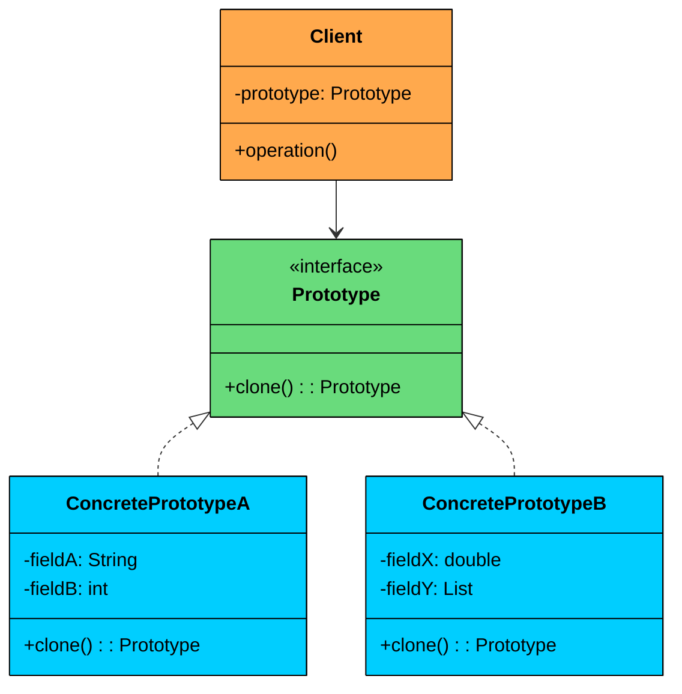
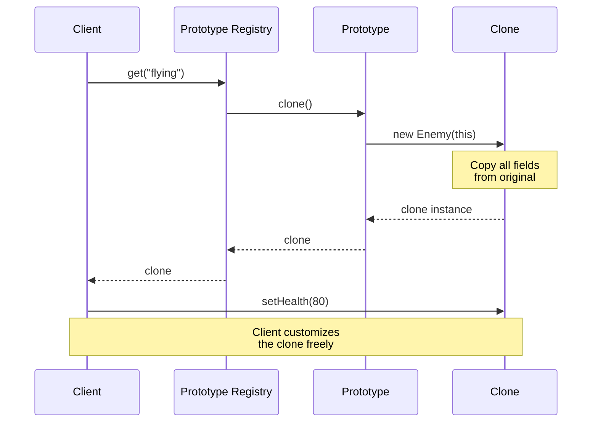

import React from 'react';
import CodeBlock from '../../../../components/ui/CodeBlock';
import Callout from '../../../../components/ui/Callout';

<div className="article-header">
  <div className="breadcrumb">
    <a href="/">Curated Notes</a>
    <span className="breadcrumb-separator">›</span>
    <span className="breadcrumb-current">Prototype Design Pattern</span>
  </div>
  <h1>Prototype Design Pattern</h1>
  <p style={{ color: 'var(--text-muted)', fontSize: '1.1rem', marginBottom: '16px', lineHeight: '1.6' }}>
    Master the essentials of Prototype Design Pattern in this curated guide.
  </p>
  <div className="meta-info">
    <span className="meta-item">
      <svg width="14" height="14" viewBox="0 0 24 24" fill="none" stroke="currentColor" strokeWidth="2"><circle cx="12" cy="12" r="10"/><polyline points="12 6 12 12 16 14"/></svg>
      10 min read
    </span>
    <span className="difficulty-badge difficulty-badge--intermediate">Intermediate</span>
  </div>
</div>

<section className="content-section">


&gt; **DEFINITION**
&gt;
&gt; The **Prototype Design Pattern** is a **creational design pattern** that lets you create new objects by **cloning existing ones**, instead of instantiating them from scratch.


It’s particularly useful in situations where:

- Creating a new object is **expensive**, **time-consuming**, or **resource-intensive**.
- You want to avoid duplicating complex initialization logic.
- You need many similar objects with only slight differences.

The Prototype Pattern allows you to create new instances by **cloning a pre-configured prototype object**, ensuring consistency while reducing boilerplate and complexity.

---

## 1. The Challenge of Cloning Objects

Imagine you have an object in your system, and you want to create an **exact copy** of it. How would you do it?

Your first instinct might be to:

1. Create a **new object** of the same class.
2. **Manually copy** each field from the original object to the new one.

Simple enough, right?

Well, **not quite**.

#### Problem 1: Encapsulation Gets in the Way

This approach assumes that all fields of the object are publicly accessible. But in a well-designed system, many fields are **private** and **hidden behind encapsulation**. That means your cloning logic can’t access them directly.

Unless you break encapsulation (which defeats the purpose of object-oriented design), you can’t reliably copy the object this way.

#### Problem 2: Class-Level Dependency

Even if you could access all the fields, you'd still need to **know the concrete class** of the object to instantiate a copy.

This tightly couples your cloning logic to the object's class, which introduces problems:

- It violates the **Open/Closed Principle**.
- It reduces flexibility if the object's implementation changes.
- It becomes harder to scale when you work with polymorphism.

#### Problem 3: Interface-Only Contexts

In many cases, your code doesn’t work with concrete classes at all, it works with **interfaces**.

For example:


```java
public void processClone(Shape shape) {
    Shape cloned = ???; // we only know it implements Shape
}
```


Here, you know the object implements a certain interface (`Shape`), but you **don’t know what class it is**, let alone how to create a new instance of it. You’re stuck unless the object knows how to clone itself.

#### The Better Way: Let the Object Clone Itself

This is where the **Prototype Design Pattern** comes in.

Instead of having external code copy or recreate the object, the object itself **knows how to create its clone**. It exposes a `clone()` or `copy()` method that returns a new instance with the same data.

This:

- Preserves encapsulation
- Eliminates the need to know the concrete class
- Makes the system more flexible and extensible


&gt; **Shallow Copy vs Deep Copy**
&gt;
&gt; This is the most important concept to understand when implementing Prototype. Getting it wrong produces bugs that are subtle, intermittent, and painful to debug.
&gt;
&gt; #### What is Shallow Copy?
&gt;
&gt; A shallow copy duplicates the object itself but shares references to any objects it contains. Primitive fields (int, double, boolean) get copied by value. Reference fields (lists, maps, other objects) get copied by reference, meaning both the original and the clone point to the same underlying object.
&gt;
&gt; #### What is Deep Copy?
&gt;
&gt; A deep copy duplicates everything: the object, all objects it references, all objects those reference, and so on recursively. The clone is completely independent.
&gt;
&gt; This is what Prototype implementations should do when the object contains mutable reference types.


Let’s walk through a real-world example to see how we can apply the Prototype Pattern to build a more **efficient** and **maintainable** object creation workflow.

---

## 2. The Problem: Spawning Enemies in a Game

Let’s say you’re developing a 2D shooting game where enemies appear frequently throughout the gameplay.

You have several enemy types with distinct attributes:

- **BasicEnemy**: Low health, slow speed. Used in early levels.
- **ArmoredEnemy**: High health, medium speed. Harder to defeat, appears later.
- **FlyingEnemy**: Medium health, fast speed. Harder to hit, used for surprise attacks.

Each enemy type comes with predefined properties such as:

- **Health** (how much damage they can take)
- **Speed** (how quickly they move across the screen)
- **Armor** (whether they take reduced damage)
- **Weapon type** (e.g., laser, cannon, missile)
- **Sprite or appearance** (the visual representation)

Now, imagine you need to spawn a `FlyingEnemy`. You might write code like this:


```java
Enemy flying1 = new Enemy("Flying", 100, 10.5, false, "Laser");
Enemy flying2 = new Enemy("Flying", 100, 10.5, false, "Laser");
```


And you’ll do the same for dozens, maybe hundreds, of similar enemies during the game.

#### But Here’s the Problem

- **Repetitive Code**: You’re duplicating the same instantiation logic again and again.
- **Scattered Defaults**: If the default speed or weapon of `FlyingEnemy` changes, you need to update it in **every single place** you created one.
- **Error-Prone**: Forget to set one property? Use a wrong value? Bugs will creep in silently.
- **Cluttered Codebase**: Your main game loop or spawn logic becomes bloated with object construction details.

As your game scales (adding more enemy types, behaviors, or configurations) this naive approach quickly becomes **hard to manage and maintain**.

You need a clean, centralized, and reusable way to create enemy instances with consistent defaults while allowing minor tweaks.

To avoid repetitive instantiation and duplicated setup logic, we turn to the **Prototype Design Pattern.**

---

## 3. The Prototype Design Pattern

&gt; The Prototype pattern specifies the kinds of objects to create using a prototypical instance and creates new objects by copying (cloning) this prototype.

Instead of configuring every new object line-by-line, we define a **pre-configured prototype** and simply **clone** it whenever we need a new instance.

Two ideas define the pattern:

1. **Self-cloning:** The object itself knows how to create a copy of itself. No external code needs to understand its internal structure.
2. **Decoupled creation:** The client does not need to know the concrete class of the object it is cloning. It works through a common interface with a `clone()` method.

---

### Class Diagram





Prototype has four participants, three required and one optional:

#### 1. Prototype (Interface)

- Declares the `clone()` method that all cloneable objects must implement
- Defines the contract for self-cloning and allows clients to clone objects without knowing their concrete class

#### 2. ConcretePrototype

- Implements the `clone()` method to produce a copy of itself
- Copies all fields to the new instance (shallow or deep, depending on the fields)

#### 3. Client

- Creates new objects by asking a prototype to clone itself
- Holds a reference to a prototype instance and calls `clone()` when a new object is needed
- Optionally customize the clone after creation

#### 4. Prototype Registry (Optional)

- Stores a collection of pre-configured prototypes, indexed by a key (string, enum, etc.)
- Returns clones (not originals) when clients request objects by key

---

## 4. How It Works

The Prototype workflow follows five steps:





#### **Step 1: Create Prototype Instances**

You configure a set of fully initialized objects that represent the "template" for each type you need. For our game, this means creating one FlyingEnemy with the correct health, speed, armor, and weapon.

#### **Step 2: Register Prototypes (Optional)**

Store these prototypes in a registry, keyed by a meaningful name like `"flying"` or `"armored"`. This centralizes configuration and makes it easy to add new types.

#### **Step 3: Client Requests a Clone**

When the game needs to spawn a new enemy, it asks the registry for a clone by key. The registry looks up the prototype and calls its `clone()` method.

#### **Step 4: Prototype Copies Itself**

The prototype creates a new instance and copies its own fields into it. The clone is a separate object in memory with the same values as the original.

#### **Step 5: Client Customizes the Clone**

The client can modify the clone without affecting the original. For example, reducing a spawned enemy's health to create a "weakened" variant.

The client never calls a constructor directly. It asks the registry for a clone, gets back a fully configured object, and optionally tweaks it. The original prototype stays untouched for future cloning.

---

## 5. Implementing Prototype

Let’s refactor our enemy spawning system in a game using this pattern.

We’ll break the implementation down into **4 clear steps**:

#### Step 1: Define the Prototype Interface

The interface declares a single `clone()` method. Every cloneable object must implement it.


```java
public interface EnemyPrototype {
    EnemyPrototype clone();
}
```

```python
from abc import ABC, abstractmethod

class EnemyPrototype(ABC):
    @abstractmethod
    def clone(self):
        pass
```

```cpp
class EnemyPrototype {
public:
    virtual EnemyPrototype* clone() const = 0;
    virtual ~EnemyPrototype() = default;
};
```

```go
type EnemyPrototype interface {
	Clone() EnemyPrototype
}
```

```csharp
public interface IEnemyPrototype
{
    IEnemyPrototype Clone();
}
```

```typescript
interface EnemyPrototype {
    clone(): EnemyPrototype;
}
```


The interface is minimal by design. It says nothing about what fields exist, what types are involved, or how cloning should be performed. That is the concrete class's responsibility.

#### Step 2: Concrete Prototype with Shallow Clone

The `Enemy` class implements the interface. This first version performs a shallow clone, which works correctly here because all fields are primitives or immutable strings.


```java
class Enemy implements EnemyPrototype {
    private String type;
    private int health;
    private double speed;
    private boolean armored;
    private String weapon;

    public Enemy(String type, int health, double speed, boolean armored, String weapon) {
        this.type = type;
        this.health = health;
        this.speed = speed;
        this.armored = armored;
        this.weapon = weapon;
    }

    @Override
    public Enemy clone() {
        return new Enemy(type, health, speed, armored, weapon);
    }

    public void setHealth(int health) {
        this.health = health;
    }

    public void printStats() {
        System.out.println(type + " [Health: " + health +
                           ", Speed: " + speed +
                           ", Armored: " + armored +
                           ", Weapon: " + weapon + "]");
    }
}
```

```python
class Enemy(EnemyPrototype):
   def __init__(self, type, health, speed, armored, weapon):
       self.type = type
       self.health = health
       self.speed = speed
       self.armored = armored
       self.weapon = weapon

   def clone(self):
       return Enemy(self.type, self.health, self.speed, self.armored, self.weapon)

   def set_health(self, health):
       self.health = health

   def print_stats(self):
       print(f"{self.type} [Health: {self.health}, Speed: {self.speed}, Armored: {self.armored}, Weapon: {self.weapon}]")

class EnemyRegistry:
```

```cpp
class Enemy : public EnemyPrototype {
private:
   string type;
   int health;
   double speed;
   bool armored;
   string weapon;

public:
   Enemy(string type, int health, double speed, bool armored, string weapon)
       : type(type), health(health), speed(speed), armored(armored), weapon(weapon) {}

   Enemy* clone() override {
       return new Enemy(type, health, speed, armored, weapon);
   }

   void setHealth(int health) {
       this->health = health;
   }

   void printStats() {
       cout << type << " [Health: " << health 
            << ", Speed: " << speed 
            << ", Armored: " << (armored ? "true" : "false")
            << ", Weapon: " << weapon << "]" << endl;
   }
};
```

```go
type Enemy struct {
	type    string
	health  int
	speed   float64
	armored bool
	weapon  string
}

func NewEnemy(type string, health int, speed float64, armored bool, weapon string) *Enemy {
	return &Enemy{type, health, speed, armored, weapon}
}

func (e *Enemy) Clone() *Enemy {
	return &Enemy{e.type, e.health, e.speed, e.armored, e.weapon}
}

func (e *Enemy) SetHealth(health int) {
	e.health = health
}

func (e *Enemy) PrintStats() {
	fmt.Printf("%s [Health: %d, Speed: %g, Armored: %t, Weapon: %s]\n", e.type, e.health, e.speed, e.armored, e.weapon)
}
```

```csharp
class Enemy : IEnemyPrototype
{
   private string type;
   private int health;
   private double speed;
   private bool armored;
   private string weapon;

   public Enemy(string type, int health, double speed, bool armored, string weapon)
   {
       this.type = type;
       this.health = health;
       this.speed = speed;
       this.armored = armored;
       this.weapon = weapon;
   }

   public IEnemyPrototype Clone()
   {
       return new Enemy(type, health, speed, armored, weapon);
   }

   public void SetHealth(int health)
   {
       this.health = health;
   }

   public void PrintStats()
   {
       Console.WriteLine($"{type} [Health: {health}, Speed: {speed}, Armored: {armored}, Weapon: {weapon}]");
   }
}
```

```typescript
class Enemy implements EnemyPrototype {
    private type: string;
    private health: number;
    private speed: number;
    private armored: boolean;
    private weapon: string;

    constructor(type: string, health: number, speed: number, armored: boolean, weapon: string) {
        this.type = type;
        this.health = health;
        this.speed = speed;
        this.armored = armored;
        this.weapon = weapon;
    }

    clone(): Enemy {
        return new Enemy(this.type, this.health, this.speed, this.armored, this.weapon);
    }

    setHealth(health: number): void {
        this.health = health;
    }

    printStats(): void {
        console.log(`${this.type} [Health: ${this.health}, Speed: ${this.speed}, Armored: ${this.armored}, Weapon: ${this.weapon}]`);
    }
}
```


#### **Key Points:**

- The `clone()` method creates a new instance using the copy constructor pattern, passing its own fields as arguments
- This is a shallow clone: all fields here are primitives or immutable (strings), so shallow is sufficient
- The clone is a completely independent object. Calling `setHealth()` on the clone does not affect the original

But what happens when we add a mutable reference field? That is where shallow cloning breaks.

#### Step 3: Deep Clone (Handling Mutable Fields)

Let us add an `inventory` field, a list of items the enemy carries. With shallow cloning, the original and clone share the same list. To fix this, the `clone()` method must create a new copy of every mutable reference field:


```java
public class Enemy implements EnemyPrototype {
    private String type;
    private int health;
    private double speed;
    private boolean armored;
    private String weapon;
    private List<String> inventory;

    public Enemy(String type, int health, double speed, boolean armored,
                 String weapon, List<String> inventory) {
        this.type = type;
        this.health = health;
        this.speed = speed;
        this.armored = armored;
        this.weapon = weapon;
        this.inventory = new ArrayList<>(inventory);
    }

    @Override
    public Enemy clone() {
        return new Enemy(type, health, speed, armored, weapon, new ArrayList<>(inventory));
    }

    public void setHealth(int health) { this.health = health; }
    public void addItem(String item) { inventory.add(item); }

    public void printStats() {
        System.out.println(type + " [Health: " + health +
                ", Speed: " + speed + ", Armored: " + armored +
                ", Weapon: " + weapon + ", Inventory: " + inventory + "]");
    }
}
```

```python
class Enemy(EnemyPrototype):
    def __init__(self, enemy_type, health, speed, armored, weapon, inventory):
        self.type = enemy_type
        self.health = health
        self.speed = speed
        self.armored = armored
        self.weapon = weapon
        self.inventory = list(inventory)

    def clone(self):
        return Enemy(self.type, self.health, self.speed, self.armored,
                     self.weapon, list(self.inventory))

    def set_health(self, health):
        self.health = health

    def add_item(self, item):
        self.inventory.append(item)

    def print_stats(self):
        print(f"{self.type} [Health: {self.health}, Speed: {self.speed}, "
              f"Armored: {self.armored}, Weapon: {self.weapon}, "
              f"Inventory: {self.inventory}]")
```

```cpp
class Enemy : public EnemyPrototype {
private:
    string type;
    int health;
    double speed;
    bool armored;
    string weapon;
    vector<string> inventory;

public:
    Enemy(string type, int health, double speed, bool armored,
          string weapon, vector<string> inventory)
        : type(move(type)), health(health), speed(speed),
          armored(armored), weapon(move(weapon)),
          inventory(move(inventory)) {}

    Enemy* clone() const override {
        return new Enemy(type, health, speed, armored, weapon, inventory);
    }

    void setHealth(int h) { health = h; }
    void addItem(const string& item) { inventory.push_back(item); }

    void printStats() const {
        cout << type << " [Health: " << health
                  << ", Speed: " << speed
                  << ", Armored: " << (armored ? "true" : "false")
                  << ", Weapon: " << weapon
                  << ", Inventory: [";
        for (size_t i = 0; i < inventory.size(); i++) {
            if (i > 0) cout << ", ";
            cout << inventory[i];
        }
        cout << "]]" << endl;
    }
};
```

```go
type Enemy struct {
	type     string
	health   int
	speed    float64
	armored  bool
	weapon   string
	inventory []string
}

func NewEnemy(enemyType string, health int, speed float64, armored bool, weapon string, inventory []string) *Enemy {
	return &Enemy{
		type:      enemyType,
		health:    health,
		speed:     speed,
		armored:   armored,
		weapon:    weapon,
		inventory: append([]string(nil), inventory...),
	}
}

func (e *Enemy) Clone() *Enemy {
	return &Enemy{
		type:      e.type,
		health:    e.health,
		speed:     e.speed,
		armored:   e.armored,
		weapon:    e.weapon,
		inventory: append([]string(nil), e.inventory...),
	}
}

func (e *Enemy) SetHealth(health int) {
	e.health = health
}

func (e *Enemy) AddItem(item string) {
	e.inventory = append(e.inventory, item)
}

func (e *Enemy) PrintStats() {
	fmt.Println(e.type, "[Health:", e.health, ", Speed:", e.speed, ", Armored:", e.armored, ", Weapon:", e.weapon, ", Inventory:", e.inventory, "]")
}
```

```csharp
public class Enemy : IEnemyPrototype
{
    private string type;
    private int health;
    private double speed;
    private bool armored;
    private string weapon;
    private List<string> inventory;

    public Enemy(string type, int health, double speed, bool armored,
                 string weapon, List<string> inventory)
    {
        this.type = type;
        this.health = health;
        this.speed = speed;
        this.armored = armored;
        this.weapon = weapon;
        this.inventory = new List<string>(inventory);
    }

    public IEnemyPrototype Clone()
    {
        return new Enemy(type, health, speed, armored, weapon,
                         new List<string>(inventory));
    }

    public void SetHealth(int health) {
        this.health = health;
    }

    public void AddItem(string item) {
        inventory.Add(item);
    }

    public void PrintStats()
    {
        Console.WriteLine($"{type} [Health: {health}, Speed: {speed}, " +
                          $"Armored: {armored}, Weapon: {weapon}, " +
                          $"Inventory: [{string.Join(", ", inventory)}]]");
    }
}
```

```typescript
class Enemy implements EnemyPrototype {
    private type: string;
    private health: number;
    private speed: number;
    private armored: boolean;
    private weapon: string;
    private inventory: string[];

    constructor(type: string, health: number, speed: number, armored: boolean,
                weapon: string, inventory: string[]) {
        this.type = type;
        this.health = health;
        this.speed = speed;
        this.armored = armored;
        this.weapon = weapon;
        this.inventory = [...inventory];
    }

    clone(): Enemy {
        return new Enemy(this.type, this.health, this.speed, this.armored,
                         this.weapon, [...this.inventory]);
    }

    setHealth(health: number): void {
        this.health = health;
    }

    addItem(item: string): void {
        this.inventory.push(item);
    }

    printStats(): void {
        console.log(`${this.type} [Health: ${this.health}, Speed: ${this.speed}, ` +
                     `Armored: ${this.armored}, Weapon: ${this.weapon}, ` +
                     `Inventory: [${this.inventory.join(", ")}]]`);
    }
}
```


#### Step 4: Prototype Registry

The registry stores pre-configured prototypes and returns clones on request. This centralizes all configuration in one place.


```java
import java.util.HashMap;
import java.util.Map;

public class EnemyRegistry {
    private Map<String, Enemy> prototypes = new HashMap<>();

    public void register(String key, Enemy prototype) {
        prototypes.put(key, prototype);
    }

    public Enemy get(String key) {
        Enemy prototype = prototypes.get(key);
        if (prototype == null) {
            throw new IllegalArgumentException("No prototype registered for: " + key);
        }
        return prototype.clone();
    }
}
```

```python
class EnemyRegistry:
    def __init__(self):
        self._prototypes = {}

    def register(self, key, prototype):
        self._prototypes[key] = prototype

    def get(self, key):
        prototype = self._prototypes.get(key)
        if prototype is None:
            raise ValueError(f"No prototype registered for: {key}")
        return prototype.clone()
```

```cpp
#include <map>
#include <stdexcept>
#include <memory>

using namespace std;

class EnemyRegistry {
private:
    map<string, unique_ptr<Enemy>> prototypes;

public:
    void registerPrototype(const string& key, unique_ptr<Enemy> prototype) {
        prototypes[key] = move(prototype);
    }

    unique_ptr<Enemy> get(const string& key) {
        auto it = prototypes.find(key);
        if (it == prototypes.end()) {
            throw invalid_argument("No prototype registered for: " + key);
        }
        return unique_ptr<Enemy>(it->second->clone());
    }
};
```

```go
type EnemyRegistry struct {
	prototypes map[string]Enemy
}

func (r *EnemyRegistry) Register(key string, prototype Enemy) {
	if r.prototypes == nil {
		r.prototypes = make(map[string]Enemy)
	}
	r.prototypes[key] = prototype
}

func (r *EnemyRegistry) Get(key string) Enemy {
	prototype, ok := r.prototypes[key]
	if !ok {
		panic("No prototype registered for: " + key)
	}
	return prototype.Clone()
}
```

```csharp
using System.Collections.Generic;

public class EnemyRegistry
{
    private Dictionary<string, Enemy> prototypes = new Dictionary<string, Enemy>();

    public void Register(string key, Enemy prototype)
    {
        prototypes[key] = prototype;
    }

    public Enemy Get(string key)
    {
        if (!prototypes.TryGetValue(key, out Enemy prototype))
        {
            throw new ArgumentException($"No prototype registered for: {key}");
        }
        return (Enemy)prototype.Clone();
    }
}
```

```typescript
class EnemyRegistry {
    private prototypes: Map<string, Enemy> = new Map();

    register(key: string, prototype: Enemy): void {
        this.prototypes.set(key, prototype);
    }

    get(key: string): Enemy {
        const prototype = this.prototypes.get(key);
        if (!prototype) {
            throw new Error(`No prototype registered for: ${key}`);
        }
        return prototype.clone();
    }
}
```


Notice that `get()` always returns a clone, never the stored prototype. This is critical. If it returned the original, clients could modify the prototype and corrupt all future clones.

#### Step 5: Client Code

Here is how everything comes together. The client configures prototypes once, registers them, and then spawns enemies by cloning:


```java
import java.util.ArrayList;
import java.util.List;

public class Game {
    public static void main(String[] args) {
        EnemyRegistry registry = new EnemyRegistry();

        registry.register("flying", new Enemy("FlyingEnemy", 100, 12.0, false,
                "Laser", new ArrayList<>(List.of("Speed Boost"))));
        registry.register("armored", new Enemy("ArmoredEnemy", 300, 6.0, true,
                "Cannon", new ArrayList<>(List.of("Shield", "Helmet"))));

        Enemy e1 = registry.get("flying");
        Enemy e2 = registry.get("flying");
        e2.setHealth(80);
        e2.addItem("Smoke Bomb");

        Enemy e3 = registry.get("armored");

        e1.printStats();
        e2.printStats();
        e3.printStats();
    }
}
```

```python
if __name__ == "__main__":
    registry = EnemyRegistry()

    registry.register("flying", Enemy("FlyingEnemy", 100, 12.0, False,
                                       "Laser", ["Speed Boost"]))
    registry.register("armored", Enemy("ArmoredEnemy", 300, 6.0, True,
                                        "Cannon", ["Shield", "Helmet"]))

    e1 = registry.get("flying")
    e2 = registry.get("flying")
    e2.set_health(80)
    e2.add_item("Smoke Bomb")

    e3 = registry.get("armored")

    e1.print_stats()
    e2.print_stats()
    e3.print_stats()
```

```cpp
int main() {
    EnemyRegistry registry;

    registry.registerPrototype("flying", std::make_unique<Enemy>(
        "FlyingEnemy", 100, 12.0, false, "Laser",
        std::vector<std::string>{"Speed Boost"}));
    registry.registerPrototype("armored", std::make_unique<Enemy>(
        "ArmoredEnemy", 300, 6.0, true, "Cannon",
        std::vector<std::string>{"Shield", "Helmet"}));

    auto e1 = registry.get("flying");
    auto e2 = registry.get("flying");
    e2->setHealth(80);
    e2->addItem("Smoke Bomb");

    auto e3 = registry.get("armored");

    e1->printStats();
    e2->printStats();
    e3->printStats();

    return 0;
}
```

```go
registry := EnemyRegistry{}

registry.register("flying", Enemy{"FlyingEnemy", 100, 12.0, false,
	"Laser", []string{"Speed Boost"}})
registry.register("armored", Enemy{"ArmoredEnemy", 300, 6.0, true,
	"Cannon", []string{"Shield", "Helmet"}})

e1 := registry.get("flying")
e2 := registry.get("flying")
e2.setHealth(80)
e2.addItem("Smoke Bomb")

e3 := registry.get("armored")

e1.printStats()
e2.printStats()
e3.printStats()
```

```csharp
public class Game
{
    public static void Main()
    {
        var registry = new EnemyRegistry();

        registry.Register("flying", new Enemy("FlyingEnemy", 100, 12.0, false,
            "Laser", new List<string> { "Speed Boost" }));
        registry.Register("armored", new Enemy("ArmoredEnemy", 300, 6.0, true,
            "Cannon", new List<string> { "Shield", "Helmet" }));

        Enemy e1 = registry.Get("flying");
        Enemy e2 = registry.Get("flying");
        e2.SetHealth(80);
        e2.AddItem("Smoke Bomb");

        Enemy e3 = registry.Get("armored");

        e1.PrintStats();
        e2.PrintStats();
        e3.PrintStats();
    }
}
```

```typescript
const registry = new EnemyRegistry();

registry.register("flying", new Enemy("FlyingEnemy", 100, 12.0, false,
    "Laser", ["Speed Boost"]));
registry.register("armored", new Enemy("ArmoredEnemy", 300, 6.0, true,
    "Cannon", ["Shield", "Helmet"]));

const e1 = registry.get("flying");
const e2 = registry.get("flying");
e2.setHealth(80);
e2.addItem("Smoke Bomb");

const e3 = registry.get("armored");

e1.printStats();
e2.printStats();
e3.printStats();
```


#### **Expected Output:**


```plaintext
FlyingEnemy [Health: 100, Speed: 12.0, Armored: false, Weapon: Laser, Inventory: [Speed Boost]]
FlyingEnemy [Health: 80, Speed: 12.0, Armored: false, Weapon: Laser, Inventory: [Speed Boost, Smoke Bomb]]
ArmoredEnemy [Health: 300, Speed: 6.0, Armored: true, Weapon: Cannon, Inventory: [Shield, Helmet]]
```


---

## 6. Practical Example: Email Templates

Let us apply Prototype to a completely different domain. You are building a bulk email system. Your company sends a monthly newsletter, but each department needs a slightly different version with a customized subject line and department-specific recipients. 

The base template defines the shared body text and a default recipient list, and you clone it for each department variant.

Without Prototype, you would duplicate the full constructor call for every department email, copying all the shared fields each time. With Prototype, you define the base template once and clone it for each variant.

The key challenge is that `RecipientList` is a nested mutable object containing two lists: `to` and `cc`. A shallow clone would cause all email templates to share the same recipient lists, so adding a recipient to the marketing email would also add them to every other department's email.


```java
import java.util.ArrayList;
import java.util.List;

class RecipientList {
    private List<String> to;
    private List<String> cc;

    public RecipientList(List<String> to, List<String> cc) {
        this.to = new ArrayList<>(to);
        this.cc = new ArrayList<>(cc);
    }

    public RecipientList deepCopy() {
        return new RecipientList(new ArrayList<>(to), new ArrayList<>(cc));
    }

    public void addTo(String email) { to.add(email); }
    public void addCc(String email) { cc.add(email); }

    @Override
    public String toString() {
        return "{to=" + to + ", cc=" + cc + "}";
    }
}

class EmailTemplate {
    private String subject;
    private String body;
    private RecipientList recipients;

    public EmailTemplate(String subject, String body, RecipientList recipients) {
        this.subject = subject;
        this.body = body;
        this.recipients = recipients;
    }

    public EmailTemplate clone() {
        return new EmailTemplate(subject, body, recipients.deepCopy());
    }

    public void setSubject(String subject) { this.subject = subject; }
    public RecipientList getRecipients() { return recipients; }

    public void print() {
        System.out.println("Email: " + subject + " | Recipients: " + recipients);
    }
}

public class EmailSystem {
    public static void main(String[] args) {
        RecipientList baseRecipients = new RecipientList(
                List.of("all@company.com"),
                List.of("archive@company.com"));

        EmailTemplate baseTemplate = new EmailTemplate(
                "Company Newsletter", "Monthly updates from the team...", baseRecipients);

        EmailTemplate marketingEmail = baseTemplate.clone();
        marketingEmail.setSubject("Marketing Newsletter");
        marketingEmail.getRecipients().addTo("marketing@company.com");

        EmailTemplate engineeringEmail = baseTemplate.clone();
        engineeringEmail.setSubject("Engineering Newsletter");
        engineeringEmail.getRecipients().addTo("eng-team@company.com");

        EmailTemplate hrEmail = baseTemplate.clone();
        hrEmail.setSubject("HR Newsletter");
        hrEmail.getRecipients().addTo("hr@company.com");
        hrEmail.getRecipients().addCc("ceo@company.com");

        marketingEmail.print();
        engineeringEmail.print();
        hrEmail.print();

        System.out.println("\nBase template unchanged:");
        baseTemplate.print();
    }
}
```

```python
class RecipientList:
    def __init__(self, to, cc):
        self.to = list(to)
        self.cc = list(cc)

    def deep_copy(self):
        return RecipientList(list(self.to), list(self.cc))

    def add_to(self, email):
        self.to.append(email)

    def add_cc(self, email):
        self.cc.append(email)

    def __repr__(self):
        return f"{{to={self.to}, cc={self.cc}}}"

class EmailTemplate:
    def __init__(self, subject, body, recipients):
        self.subject = subject
        self.body = body
        self.recipients = recipients

    def clone(self):
        return EmailTemplate(self.subject, self.body, self.recipients.deep_copy())

    def print_email(self):
        print(f"Email: {self.subject} | Recipients: {self.recipients}")

if __name__ == "__main__":
    base_recipients = RecipientList(["all@company.com"], ["archive@company.com"])
    base_template = EmailTemplate(
        "Company Newsletter", "Monthly updates from the team...", base_recipients)

    marketing_email = base_template.clone()
    marketing_email.subject = "Marketing Newsletter"
    marketing_email.recipients.add_to("marketing@company.com")

    engineering_email = base_template.clone()
    engineering_email.subject = "Engineering Newsletter"
    engineering_email.recipients.add_to("eng-team@company.com")

    hr_email = base_template.clone()
    hr_email.subject = "HR Newsletter"
    hr_email.recipients.add_to("hr@company.com")
    hr_email.recipients.add_cc("ceo@company.com")

    marketing_email.print_email()
    engineering_email.print_email()
    hr_email.print_email()

    print("\nBase template unchanged:")
    base_template.print_email()
```

```cpp
#include <iostream>
#include <string>
#include <vector>
#include <memory>

using namespace std;

class RecipientList {
public:
    vector<string> to;
    vector<string> cc;

    RecipientList(vector<string> to, vector<string> cc)
        : to(move(to)), cc(move(cc)) {}

    RecipientList deepCopy() const {
        return RecipientList(to, cc);
    }

    void addTo(const string& email) { to.push_back(email); }
    void addCc(const string& email) { cc.push_back(email); }
};

class EmailTemplate {
private:
    string subject;
    string body;
    RecipientList recipients;

public:
    EmailTemplate(string subject, string body, RecipientList recipients)
        : subject(move(subject)), body(move(body)),
          recipients(move(recipients)) {}

    EmailTemplate* clone() const {
        return new EmailTemplate(subject, body, recipients.deepCopy());
    }

    void setSubject(const string& s) { subject = s; }
    RecipientList& getRecipients() { return recipients; }

    void print() const {
        cout << "Email: " << subject << " | Recipients: {to=[";
        for (size_t i = 0; i < recipients.to.size(); i++) {
            if (i > 0) cout << ", ";
            cout << recipients.to[i];
        }
        cout << "], cc=[";
        for (size_t i = 0; i < recipients.cc.size(); i++) {
            if (i > 0) cout << ", ";
            cout << recipients.cc[i];
        }
        cout << "]}" << endl;
    }
};

int main() {
    RecipientList baseRecipients({"all@company.com"}, {"archive@company.com"});
    EmailTemplate baseTemplate(
        "Company Newsletter", "Monthly updates from the team...", baseRecipients);

    auto marketingEmail = unique_ptr<EmailTemplate>(baseTemplate.clone());
    marketingEmail->setSubject("Marketing Newsletter");
    marketingEmail->getRecipients().addTo("marketing@company.com");

    auto engineeringEmail = unique_ptr<EmailTemplate>(baseTemplate.clone());
    engineeringEmail->setSubject("Engineering Newsletter");
    engineeringEmail->getRecipients().addTo("eng-team@company.com");

    auto hrEmail = unique_ptr<EmailTemplate>(baseTemplate.clone());
    hrEmail->setSubject("HR Newsletter");
    hrEmail->getRecipients().addTo("hr@company.com");
    hrEmail->getRecipients().addCc("ceo@company.com");

    marketingEmail->print();
    engineeringEmail->print();
    hrEmail->print();

    cout << "\nBase template unchanged:" << endl;
    baseTemplate.print();

    return 0;
}
```

```go
package main

import (
	"fmt"
	"strings"
)

type RecipientList struct {
	to []string
	cc []string
}

func NewRecipientList(to, cc []string) RecipientList {
	return RecipientList{
		to: append([]string(nil), to...),
		cc: append([]string(nil), cc...),
	}
}

func (r RecipientList) DeepCopy() RecipientList {
	return NewRecipientList(r.to, r.cc)
}

func (r *RecipientList) AddTo(email string) {
	r.to = append(r.to, email)
}

func (r *RecipientList) AddCc(email string) {
	r.cc = append(r.cc, email)
}

func (r RecipientList) String() string {
	return "{to=[" + strings.Join(r.to, ", ") + "], cc=[" + strings.Join(r.cc, ", ") + "]}"
}

type EmailTemplate struct {
	subject    string
	body       string
	recipients RecipientList
}

func NewEmailTemplate(subject, body string, recipients RecipientList) EmailTemplate {
	return EmailTemplate{
		subject:    subject,
		body:       body,
		recipients: recipients,
	}
}

func (e EmailTemplate) Clone() EmailTemplate {
	return NewEmailTemplate(e.subject, e.body, e.recipients.DeepCopy())
}

func (e *EmailTemplate) SetSubject(subject string) {
	e.subject = subject
}

func (e *EmailTemplate) GetRecipients() *RecipientList {
	return &e.recipients
}

func (e EmailTemplate) Print() {
	fmt.Println("Email:", e.subject, "| Recipients:", e.recipients)
}

func main() {
	baseRecipients := NewRecipientList(
		[]string{"all@company.com"},
		[]string{"archive@company.com"},
	)

	baseTemplate := NewEmailTemplate(
		"Company Newsletter", "Monthly updates from the team...", baseRecipients)

	marketingEmail := baseTemplate.Clone()
	marketingEmail.SetSubject("Marketing Newsletter")
	marketingEmail.GetRecipients().AddTo("marketing@company.com")

	engineeringEmail := baseTemplate.Clone()
	engineeringEmail.SetSubject("Engineering Newsletter")
	engineeringEmail.GetRecipients().AddTo("eng-team@company.com")

	hrEmail := baseTemplate.Clone()
	hrEmail.SetSubject("HR Newsletter")
	hrEmail.GetRecipients().AddTo("hr@company.com")
	hrEmail.GetRecipients().AddCc("ceo@company.com")

	marketingEmail.Print()
	engineeringEmail.Print()
	hrEmail.Print()

	fmt.Println("\nBase template unchanged:")
	baseTemplate.Print()
}
```

```csharp
using System;
using System.Collections.Generic;

public class RecipientList
{
    public List<string> To { get; set; }
    public List<string> Cc { get; set; }

    public RecipientList(List<string> to, List<string> cc)
    {
        To = new List<string>(to);
        Cc = new List<string>(cc);
    }

    public RecipientList DeepCopy()
    {
        return new RecipientList(new List<string>(To), new List<string>(Cc));
    }
}

public class EmailTemplate
{
    public string Subject { get; set; }
    public string Body { get; set; }
    public RecipientList Recipients { get; set; }

    public EmailTemplate(string subject, string body, RecipientList recipients)
    {
        Subject = subject;
        Body = body;
        Recipients = recipients;
    }

    public EmailTemplate Clone()
    {
        return new EmailTemplate(Subject, Body, Recipients.DeepCopy());
    }

    public void Print()
    {
        Console.WriteLine($"Email: {Subject} | Recipients: " +
                          $"{{to=[{string.Join(", ", Recipients.To)}], " +
                          $"cc=[{string.Join(", ", Recipients.Cc)}]}}");
    }
}

public class EmailSystem
{
    public static void Main()
    {
        var baseRecipients = new RecipientList(
            new List<string> { "all@company.com" },
            new List<string> { "archive@company.com" });
        var baseTemplate = new EmailTemplate(
            "Company Newsletter", "Monthly updates from the team...", baseRecipients);

        var marketingEmail = baseTemplate.Clone();
        marketingEmail.Subject = "Marketing Newsletter";
        marketingEmail.Recipients.To.Add("marketing@company.com");

        var engineeringEmail = baseTemplate.Clone();
        engineeringEmail.Subject = "Engineering Newsletter";
        engineeringEmail.Recipients.To.Add("eng-team@company.com");

        var hrEmail = baseTemplate.Clone();
        hrEmail.Subject = "HR Newsletter";
        hrEmail.Recipients.To.Add("hr@company.com");
        hrEmail.Recipients.Cc.Add("ceo@company.com");

        marketingEmail.Print();
        engineeringEmail.Print();
        hrEmail.Print();

        Console.WriteLine("\nBase template unchanged:");
        baseTemplate.Print();
    }
}
```

```typescript
class RecipientList {
    to: string[];
    cc: string[];

    constructor(to: string[], cc: string[]) {
        this.to = [...to];
        this.cc = [...cc];
    }

    deepCopy(): RecipientList {
        return new RecipientList([...this.to], [...this.cc]);
    }
}

class EmailTemplate {
    subject: string;
    body: string;
    recipients: RecipientList;

    constructor(subject: string, body: string, recipients: RecipientList) {
        this.subject = subject;
        this.body = body;
        this.recipients = recipients;
    }

    clone(): EmailTemplate {
        return new EmailTemplate(this.subject, this.body, this.recipients.deepCopy());
    }

    print(): void {
        console.log(`Email: ${this.subject} | Recipients: ` +
                     `{to=[${this.recipients.to.join(", ")}], ` +
                     `cc=[${this.recipients.cc.join(", ")}]}`);
    }
}

const baseRecipients = new RecipientList(["all@company.com"], ["archive@company.com"]);
const baseTemplate = new EmailTemplate(
    "Company Newsletter", "Monthly updates from the team...", baseRecipients);

const marketingEmail = baseTemplate.clone();
marketingEmail.subject = "Marketing Newsletter";
marketingEmail.recipients.to.push("marketing@company.com");

const engineeringEmail = baseTemplate.clone();
engineeringEmail.subject = "Engineering Newsletter";
engineeringEmail.recipients.to.push("eng-team@company.com");

const hrEmail = baseTemplate.clone();
hrEmail.subject = "HR Newsletter";
hrEmail.recipients.to.push("hr@company.com");
hrEmail.recipients.cc.push("ceo@company.com");

marketingEmail.print();
engineeringEmail.print();
hrEmail.print();

console.log("\nBase template unchanged:");
baseTemplate.print();
```


The HR email has an extra recipient and a CC, the marketing and engineering emails each have their own added recipient, but the base template is completely unaffected. 

This works because `clone()` calls `recipients.deepCopy()`, creating an independent `RecipientList` for each email. Without the deep copy, adding [`marketing@company.com`](mailto:marketing@company.com) to the marketing email would also add it to every other department's email and to the base template itself.

</section>
