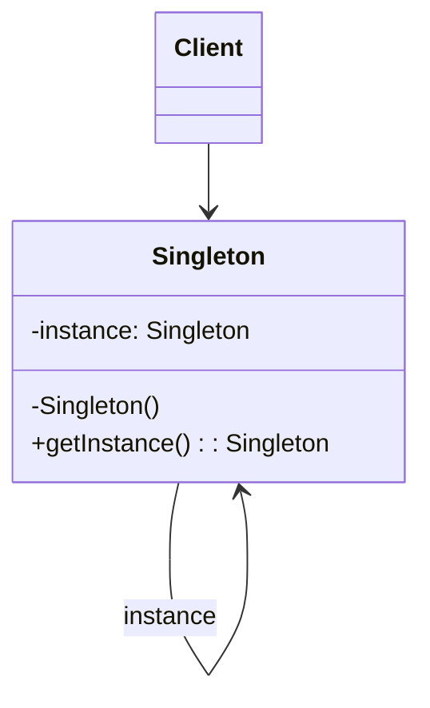
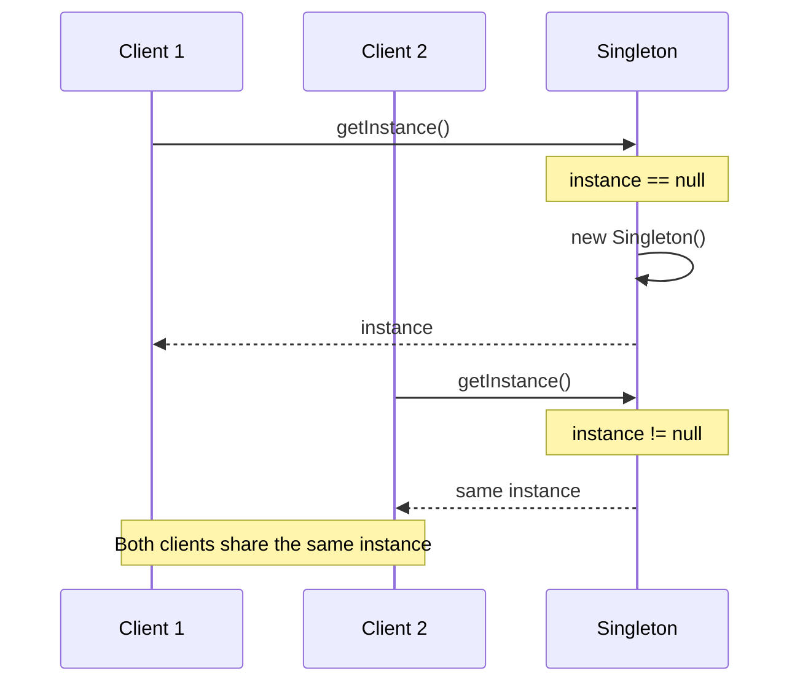
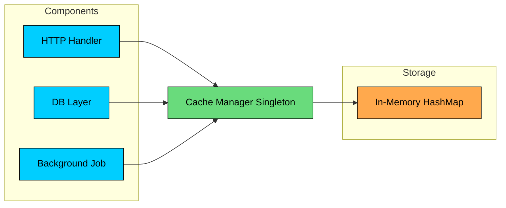

import React from 'react';
import CodeBlock from '../../../../components/ui/CodeBlock';
import Callout from '../../../../components/ui/Callout';

<div className="article-header">
  <div className="breadcrumb">
    <a href="/">Curated Notes</a>
    <span className="breadcrumb-separator">›</span>
    <span className="breadcrumb-current">Singleton Design Pattern</span>
  </div>
  <h1>Singleton Design Pattern</h1>
  <p style={{ color: 'var(--text-muted)', fontSize: '1.1rem', marginBottom: '16px', lineHeight: '1.6' }}>
    Master the essentials of Singleton Design Pattern in this curated guide.
  </p>
  <div className="meta-info">
    <span className="meta-item">
      <svg width="14" height="14" viewBox="0 0 24 24" fill="none" stroke="currentColor" strokeWidth="2"><circle cx="12" cy="12" r="10"/><polyline points="12 6 12 12 16 14"/></svg>
      10 min read
    </span>
    <span className="difficulty-badge difficulty-badge--intermediate">Intermediate</span>
  </div>
</div>

<section className="content-section">

In software development, we often require classes that can only have **one object**. 

&gt; **Example:**
&gt;
&gt;  thread pools, caches, loggers etc.

Creating more than one objects of these could lead to issues such as incorrect program behavior, overuse of resources, or inconsistent results.

This is where **Singleton Design Pattern** comes into play.


It is one of the simplest design patterns, yet **challenging** **to implement** correctly.

In this chapter, we will explore what Singleton pattern is, how it works, different ways you can implement it, real-world examples where it’s used and it’s pros and cons.

---

## 1. What is Singleton Pattern?


&gt; **DEFINITION**
&gt;
&gt; **Singleton Pattern** is a **creational design pattern** that guarantees a class has only one instance and provides a global point of access to it.


Two requirements define the pattern:

1. **Single instance:** No matter how many times any part of the code requests it, the same object is returned.
2. **Global access:** Any component can reach the instance without needing it passed through constructors or method parameters.


&gt; **Real-World Analogy**
&gt;
&gt; Think of a print spooler in an operating system. There is one spooler managing all print jobs. Applications do not create their own spoolers. They submit jobs to the one that exists. If each application ran its own spooler, print jobs would conflict, pages would interleave, and the printer would produce garbage. 
&gt;
&gt; The single spooler coordinates everything.


Singleton is useful in scenarios like:

- **Managing Shared Resources** (database connections, thread pools, caches, configuration settings)
- **Coordinating System-Wide Actions** (logging, print spoolers, file managers)
- **Managing State (**user session, application state**)**

#### Specific Examples:

- **Logger Classes**: Many logging frameworks use the Singleton pattern to provide a global logging object. This ensures that log messages are consistently handled and written to the same output stream.
- **Database Connection Pools**: Connection pools help manage and reuse database connections efficiently. A Singleton can ensure that only one pool is created and used throughout the application.
- **Cache Objects**: In-memory caches are often implemented as Singletons to provide a single point of access for cached data across the application.
- **Thread Pools: **Thread pools manage a collection of worker threads. A Singleton ensures that the same pool is used throughout the application, preventing resource overuse.
- **File System**: File systems often use Singleton objects to represent the file system and provide a unified interface for file operations.

---

## 2. Class Diagram

To implement the singleton pattern, we must prevent external objects from creating instances of the singleton class. Only the singleton class should be permitted to create its own objects.

Additionally, we need to provide a method for external objects to access the singleton object.





- An `instance` field stores the one and only Singleton object.
- The constructor is **private or otherwise restricted**, so other code cannot create new instances directly.
- A `getInstance()` (or similar) **class-level method** returns the shared instance and is accessible from anywhere.


&gt; **Why not just use global variables?**
&gt;
&gt; Global variables in languages that support them have similar accessibility but no initialization control. A Singleton can control when and how the instance is created, perform lazy initialization, enforce thread safety during construction, and validate that only one instance ever exists.


---

## 3. How It Works

The Singleton workflow is straightforward:





#### **Step 1: First Request**

A client calls `Singleton.getInstance()`. The method checks if an instance already exists.

#### **Step 2: Instance Creation**

If no instance exists, the method creates one using the private constructor and stores it in the static field.

#### **Step 3: Return Instance**

The method returns the newly created instance.

#### **Step 4: Subsequent Requests**

Later calls to `getInstance()` find the instance already exists and return it immediately, skipping creation entirely.

The sequence diagram above shows two clients requesting the instance. The first triggers creation; the second returns the existing one. Both end up with references to the same object.

---

## 4. Implementation

Singleton implementation varies across languages. The central challenge is thread safety: if two threads call `getInstance()` simultaneously when the instance has not been created yet, both might create separate instances.

We will start with the simplest (but broken) approach and progressively improve it. After the shared implementations, we cover language-specific idioms that are recommended for production use.

### 1. Lazy Initialization (Not Thread-Safe)

This approach creates the singleton instance only when it is needed, saving resources if the singleton is never used in the application.


```java
class LazySingleton {
    // Holds the single shared instance (initially not created)
    private static LazySingleton instance;

    // Private constructor prevents creating objects from outside the class
    private LazySingleton() {}

    // Global access point to get the Singleton instance
    public static LazySingleton getInstance() {
		
        // Create the instance only when first requested (lazy initialization)
        if (instance == null) {
            instance = new LazySingleton();
        }

        // Return the shared instance
        return instance;
    }
}
```

```python
class LazySingleton:
    # Holds the single shared instance (initially not created)
    _instance = None

    # Constructor prevents direct creation if instance already exists
    def __init__(self):
        if LazySingleton._instance is not None:
            raise Exception("Use get_instance() instead.")

    # Global access point to get the Singleton instance
    @staticmethod
    def get_instance():

        # Create the instance only when first requested (lazy initialization)
        if LazySingleton._instance is None:
            LazySingleton._instance = LazySingleton()

        # Return the shared instance
        return LazySingleton._instance
```

```cpp
class LazySingleton {
private:
    // Holds the single shared instance (initially not created)
    static LazySingleton* instance;

    // Private constructor prevents creating objects from outside the class
    LazySingleton() {}

public:

    // Global access point to get the Singleton instance
    static LazySingleton* getInstance() {

        // Create the instance only when first requested (lazy initialization)
        if (instance == nullptr) {
            instance = new LazySingleton();
        }

        // Return the shared instance
        return instance;
    }
};
```

```go
type LazySingleton struct{}

// Holds the single shared instance (initially not created)
var instance *LazySingleton

// Global access point to get the Singleton instance
func GetInstance() *LazySingleton {

	// Create the instance only when first requested (lazy initialization)
	if instance == nil {
		instance = &LazySingleton{}
	}

	// Return the shared instance
	return instance
}
```

```csharp
class LazySingleton
{
    // Holds the single shared instance (initially not created)
    private static LazySingleton instance;

    // Private constructor prevents creating objects from outside the class
    private LazySingleton() { }

    // Global access point to get the Singleton instance
    public static LazySingleton GetInstance()
    {
        // Create the instance only when first requested (lazy initialization)
        if (instance == null)
        {
            instance = new LazySingleton();
        }

        // Return the shared instance
        return instance;
    }
}
```

```typescript
class LazySingleton {
    // Holds the single shared instance (initially not created)
    private static instance: LazySingleton;

    // Private constructor prevents creating objects from outside the class
    private constructor() {}

    // Global access point to get the Singleton instance
    public static getInstance(): LazySingleton {

        // Create the instance only when first requested (lazy initialization)
        if (LazySingleton.instance == null) {
            LazySingleton.instance = new LazySingleton();
        }

        // Return the shared instance
        return LazySingleton.instance;
    }
}
```


#### **How it works**

- `getInstance()` method checks if an instance already exists.
- If not, it creates a new instance.
- If an instance already exists, it skips the creation step.


&gt; **Not Thread-Safe**
&gt;
&gt; This implementation is not thread-safe. If multiple threads call `getInstance()` simultaneously when `instance` is null, it's possible to create multiple instances.


---

### 2. Thread-Safe Singleton

This approach extends **lazy initialization** by ensuring the Singleton is safe to use in **multi-threaded environments**.

When multiple threads try to access the instance at the same time, synchronization (or locking) ensures that **only one thread can create the object**, while others wait.


```java
class ThreadSafeSingleton {
    private static ThreadSafeSingleton instance;

    private ThreadSafeSingleton() {}

    public static synchronized ThreadSafeSingleton getInstance() {
        if (instance == null) {
            instance = new ThreadSafeSingleton();
        }

        return instance;
    }
}
```

```python
class ThreadSafeSingleton:
    _instance = None
    _lock = threading.Lock()

    def __init__(self):
        if ThreadSafeSingleton._instance is not None:
            raise Exception("Use get_instance() instead.")

    @staticmethod
    def get_instance():
        with ThreadSafeSingleton._lock:
            if ThreadSafeSingleton._instance is None:
                ThreadSafeSingleton._instance = ThreadSafeSingleton()
        return ThreadSafeSingleton._instance
```

```cpp
class ThreadSafeSingleton {
private:
    static ThreadSafeSingleton* instance;
    static mutex lock;

    ThreadSafeSingleton() {}

public:
    static ThreadSafeSingleton* getInstance() {
        lock_guard<mutex> guard(lock);
        if (instance == nullptr) {
            instance = new ThreadSafeSingleton();
        }
        return instance;
    }
};
```

```go
package singleton

import "sync"

type ThreadSafeSingleton struct{}

var (
	instance *ThreadSafeSingleton
	lock     sync.Mutex
)

func NewThreadSafeSingleton() *ThreadSafeSingleton {
	lock.Lock()
	defer lock.Unlock()

	if instance == nil {
		instance = &ThreadSafeSingleton{}
	}
	return instance
}
```

```csharp
class ThreadSafeSingleton
{
    private static ThreadSafeSingleton instance;
    private static readonly object lockObj = new object();

    private ThreadSafeSingleton() { }

    public static ThreadSafeSingleton GetInstance()
    {
        lock (lockObj)
        {
            if (instance == null)
            {
                instance = new ThreadSafeSingleton();
            }
            return instance;
        }
    }
}
```

```typescript
TypeScript runs on a single-threaded event loop (both in browsers and Node.js), 
so synchronization primitives like locks are unnecessary. 
The basic implementation from Section 1 is inherently thread-safe in TypeScript.
```


#### **How it works**

- The instance is created only when first requested (lazy initialization).
- The method that returns the instance uses a **lock / mutex / synchronization mechanism**.
- When a thread enters the protected section, it acquires the lock. Other threads must wait until the lock is released.
- This guarantees that only one instance is created, even under concurrent access.


&gt; **Performance Consideration**
&gt;
&gt; This approach is correct but has a performance cost: every call to `getInstance()` acquires a lock, even after the instance has been created. Once the instance exists, there is no reason to synchronize. The next approach fixes this.


---

### 3. Double-Checked Locking

Double-checked locking reduces the performance overhead by only synchronizing during the first object creation. After the instance exists, threads skip the lock entirely.


```java
class DoubleCheckedSingleton {
    // Holds the single shared instance (requires safe publication)
	// volatile prevents reordering of instructions in: instance = new Singleton()
	// since it involves three steps: allocate memory, call constructor, assign reference
    private static volatile DoubleCheckedSingleton instance;

    // Private constructor prevents external instantiation
    private DoubleCheckedSingleton() {}

    // Global access point to get the Singleton instance
    public static DoubleCheckedSingleton getInstance() {
        
		// Fast path: first check without locking
        if (instance == null) {
            // Lock only when the instance might need to be created
            synchronized (DoubleCheckedSingleton.class) {
                // Second check inside the lock (prevents double creation)
                if (instance == null) {
                    instance = new DoubleCheckedSingleton();
                }
            }
        }

        // Return the shared instance (existing or newly created)
        return instance;
    }
}
```

```python
class DoubleCheckedSingleton:
    # Holds the single shared instance
    _instance = None
    # Lock used only during first-time creation
    _lock = threading.Lock()

    # Constructor prevents accidental direct creation
    def __init__(self):
        if DoubleCheckedSingleton._instance is not None:
            raise Exception("Use get_instance() instead.")

    # Global access point to get the Singleton instance
    @staticmethod
    def get_instance():
        
		# Fast path: first check without locking
        if DoubleCheckedSingleton._instance is None:
            # Lock only when the instance might need to be created
            with DoubleCheckedSingleton._lock:
                # Second check inside the lock (prevents double creation)
                if DoubleCheckedSingleton._instance is None:
                    DoubleCheckedSingleton._instance = DoubleCheckedSingleton()

        # Return the shared instance
        return DoubleCheckedSingleton._instance
```

```cpp
class DoubleCheckedSingleton {
private:
    // Holds the single shared instance (needs safe publication in C++)
    static DoubleCheckedSingleton* instance;
    // Lock used only during first-time creation
    static mutex lock;

    // Private constructor prevents external instantiation
    DoubleCheckedSingleton() {}

public:
    // Global access point to get the Singleton instance
    static DoubleCheckedSingleton* getInstance() {
        
		// Fast path: first check without locking
        if (instance == nullptr) {
            // Lock only when the instance might need to be created
            lock_guard<mutex> guard(lock);
            // Second check inside the lock (prevents double creation)
            if (instance == nullptr) {
                instance = new DoubleCheckedSingleton();
            }
        }

        // Return the shared instance
        return instance;
    }
};
```

```go
type DoubleCheckedSingleton struct{}

var instance *DoubleCheckedSingleton
var lockObj sync.Mutex

func getInstance() *DoubleCheckedSingleton {
	// Fast path: first check without locking
	if instance == nil {
		// Lock only when the instance might need to be created
		lockObj.Lock()
		defer lockObj.Unlock()
		// Second check inside the lock (prevents double creation)
		if instance == nil {
			instance = &DoubleCheckedSingleton{}
		}
	}

	// Return the shared instance
	return instance
}
```

```csharp
class DoubleCheckedSingleton
{
    // Holds the single shared instance (requires safe publication)
    private static DoubleCheckedSingleton instance;
    // Lock used only during first-time creation
    private static readonly object lockObj = new object();

    // Private constructor prevents external instantiation
    private DoubleCheckedSingleton() { }

    // Global access point to get the Singleton instance
    public static DoubleCheckedSingleton GetInstance()
    {
        // Fast path: first check without locking
        if (instance == null)
        {
            // Lock only when the instance might need to be created
            lock (lockObj)
            {
                // Second check inside the lock (prevents double creation)
                if (instance == null)
                {
                    instance = new DoubleCheckedSingleton();
                }
            }
        }

        // Return the shared instance
        return instance;
    }
}
```

```typescript
TypeScript runs on a single-threaded event loop, so double-checked locking is not needed. 
The basic implementation from approach 1 is sufficient.
```


- If the first check passes, we synchronize/lock and check the same condition one more time because multiple threads may have passed the first check.
- The instance is created only if both checks pass.


&gt; **Good Performance**
&gt;
&gt; Although this approach is more complex to implement, it can drastically reduce performance overhead, especially when the singleton is accessed frequently.


---

### 4. Eager Initialization

In eager initialization, the Singleton instance is created **as soon as the class/module is loaded**, before any thread can access it. That makes it **inherently thread-safe** without explicit locks, because initialization happens once during load/initialization.

This approach is suitable if your application always creates and uses the singleton instance, or the overhead of creating it is minimal.


```java
class EagerSingleton {
    // Holds the single shared instance (created immediately at class load time)
    private static final EagerSingleton instance = new EagerSingleton();

    // Private constructor prevents creating objects from outside the class
    private EagerSingleton() {}

    // Global access point to get the Singleton instance
    public static EagerSingleton getInstance() {
        // Return the already-created shared instance
        return instance;
    }
}
```

```python
class EagerSingleton:
    # Holds the single shared instance (created immediately at module load time)
    _instance = None

    # Private-like constructor guard to prevent direct instantiation
    def __init__(self):
        if EagerSingleton._instance is not None:
            raise Exception("Use get_instance() instead.")

    # Global access point to get the Singleton instance
    @staticmethod
    def get_instance():
        # Return the already-created shared instance
        return EagerSingleton._instance
```

```cpp
class EagerSingleton {
private:
    // Holds the single shared instance (created immediately during static initialization)
    static EagerSingleton* instance;

    // Private constructor prevents creating objects from outside the class
    EagerSingleton() {}

public:
    // Global access point to get the Singleton instance
    static EagerSingleton* getInstance() {
        // Return the already-created shared instance
        return instance;
    }
};
```

```go
type EagerSingleton struct{}

// Holds the single shared instance (created immediately at package initialization time)
var instance = &EagerSingleton{}

// getInstance returns the already-created shared instance
func getInstance() *EagerSingleton {
	// Return the already-created shared instance
	return instance
}
```

```csharp
class EagerSingleton
{
    // Holds the single shared instance (created immediately at type initialization)
    private static readonly EagerSingleton instance = new EagerSingleton();

    // Private constructor prevents creating objects from outside the class
    private EagerSingleton() { }

    // Global access point to get the Singleton instance
    public static EagerSingleton GetInstance()
    {
        // Return the already-created shared instance
        return instance;
    }
}
```

```typescript
class EagerSingleton {
    // Holds the single shared instance (created immediately when the class is evaluated)
    private static readonly instance: EagerSingleton = new EagerSingleton();

    // Private constructor prevents creating objects from outside the class
    private constructor() {}

    // Global access point to get the Singleton instance
    public static getInstance(): EagerSingleton {
        // Return the already-created shared instance
        return EagerSingleton.instance;
    }
}
```


- A **class-level/static** variable holds the single shared instance.
- The instance is created **during class/module initialization**, not on first use.
- No locks are needed because the runtime initializes static/class state once.


&gt; **TRADEOFF**
&gt;
&gt; While it is inherently thread-safe, it could potentially waste resources if the singleton instance is never used by the client application.


---

### 5. Language Specific Implementations


#### Java

#### Bill Pugh / Initialization-on-Demand Holder

This approach uses a static inner class to defer instance creation until `getInstance()` is first called. The JVM guarantees that inner classes are not loaded until they are referenced, giving us lazy initialization without synchronization:


```java
public class BillPughSingleton {
    private BillPughSingleton() { }

    // Inner class is not loaded until getInstance() is called
    private static class Holder {
        private static final BillPughSingleton INSTANCE = new BillPughSingleton();
    }

    public static BillPughSingleton getInstance() {
        return Holder.INSTANCE;
    }
}
```


The JVM's class loading mechanism does the heavy lifting here. `Holder` is not loaded when `Singleton` is loaded. It is only loaded when `getInstance()` is called for the first time, which triggers the initialization of `INSTANCE`. 

Class initialization in Java is guaranteed to be thread-safe by the JLS (Java Language Specification), so no explicit synchronization is needed.


&gt; **SUCCESS**
&gt;
&gt; The Bill Pugh Singleton implementation, while more complex than Eager Initialization provides a perfect balance of lazy initialization, thread safety, and performance, without the complexities of some other patterns like double-checked locking.


---

#### Enum Singleton (Recommended)

This is the simplest and safest approach in Java. [Joshua Bloch](https://en.wikipedia.org/wiki/Joshua_Bloch) recommends it in **Effective Java** as the best way to implement a Singleton:


```java
enum EnumSingleton {
    INSTANCE;

    // Public method
    public void doSomething() {
        // Add any singleton logic here
    }
}
```


The JVM provides four guarantees that no other approach offers:

1. **Thread-safe initialization:** Enum constants are initialized exactly once when the enum class is loaded, and class loading is thread-safe.
2. **Serialization safety:** Serializing and deserializing an enum returns the same instance.
3. **Reflection safety:** The JVM prevents creating enum instances via reflection. `Constructor.newInstance()` throws an `IllegalArgumentException`.
4. **Single instance guarantee:** Enforced at the JVM level, not by your code.

The only limitation is that enums cannot extend other classes (they implicitly extend `java.lang.Enum`), so if your Singleton needs a base class, you cannot use this approach.

---

#### Static Block Initialization

Similar to eager initialization, but uses a static initializer block. The advantage is the ability to handle exceptions during instance creation:


```java
class StaticBlockSingleton {
    private static StaticBlockSingleton instance;

    private StaticBlockSingleton() {}

    // Static block for initialization
    static {
        try {
            instance = new StaticBlockSingleton();
        } catch (Exception e) {
            throw new RuntimeException("Exception occurred in creating singleton instance");
        }
    }

    // Public method to get the instance
    public static StaticBlockSingleton getInstance() {
        return instance;
    }
}
```


- The static block is executed when the class is loaded by the JVM.
- If an exception occurs, it's wrapped in a RuntimeException.

Use this when the constructor might throw checked exceptions and you want to handle them gracefully during class loading rather than propagating them as unhandled errors.


&gt; **Performance Overhead**
&gt;
&gt; It is thread safe but not lazy-loaded, which might be a drawback if the initialization is resource-intensive or time-consuming.


---

## 5. Practical Example: In-Memory Cache Manager

Lets say you are building an application where multiple components (HTTP handlers, database layer, background jobs) all need to cache expensive data like user profiles, configuration, and query results. 

You want one shared cache so that any component's writes are immediately visible to all others, without duplicate maps, stale reads, or wasted memory.

#### **Without Singleton:**


```plaintext
CacheManager cacheA = new CacheManager();
cacheA.put("user:42", userData);

CacheManager cacheB = new CacheManager();
cacheB.get("user:42"); // null! Different instance, different map

// Problems:
// - Duplicate HashMaps wasting memory
// - Writes in one component invisible to others
// - TTL cleanup duplicated across instances
```


#### **With Singleton:**





All components access the single CacheManager instance, which manages one shared map, handles TTL expiry on reads, and synchronizes access internally.


```java
import java.time.Instant;
import java.util.concurrent.ConcurrentHashMap;

enum CacheManager {
    INSTANCE;

    private record CacheEntry(String value, Instant expiry) {
        boolean isExpired() {
            return expiry != null && Instant.now().isAfter(expiry);
        }
    }

    private final ConcurrentHashMap<String, CacheEntry> cache = new ConcurrentHashMap<>();

    public void put(String key, String value, long ttlSeconds) {
        Instant expiry = ttlSeconds > 0
            ? Instant.now().plusSeconds(ttlSeconds)
            : null;
        cache.put(key, new CacheEntry(value, expiry));
    }

    public void put(String key, String value) {
        put(key, value, 0);
    }

    public String get(String key) {
        CacheEntry entry = cache.get(key);
        if (entry == null) return null;
        if (entry.isExpired()) {
            cache.remove(key);
            return null;
        }
        return entry.value();
    }

    public void remove(String key) {
        cache.remove(key);
    }

    public int size() {
        cache.entrySet().removeIf(e -> e.getValue().isExpired());
        return cache.size();
    }
}

// --- Main ---
public class Main {
    public static void main(String[] args) {
        // Both references point to the same CacheManager instance
        CacheManager cache1 = CacheManager.INSTANCE;
        CacheManager cache2 = CacheManager.INSTANCE;

        System.out.println("Same instance? " + (cache1 == cache2)); // true

        // Component A caches data
        cache1.put("user:42", "{name: 'Alice'}", 5); // 5-second TTL
        cache1.put("config:theme", "dark");           // no expiry

        // Component B reads from the same cache
        System.out.println("user:42 = " + cache2.get("user:42"));       // {name: 'Alice'}
        System.out.println("config:theme = " + cache2.get("config:theme")); // dark
        System.out.println("Cache size: " + cache2.size());              // 2
    }
}
```

```python
## cache_manager.py
import threading
import time

class _CacheManager:
    def __init__(self):
        self._lock = threading.Lock()
        self._cache: dict[str, tuple[str, float | None]] = {}

    def put(self, key: str, value: str, ttl_seconds: int = 0):
        expiry = time.time() + ttl_seconds if ttl_seconds > 0 else None
        with self._lock:
            self._cache[key] = (value, expiry)

    def get(self, key: str) -> str | None:
        with self._lock:
            entry = self._cache.get(key)
            if entry is None:
                return None
            value, expiry = entry
            if expiry is not None and time.time() > expiry:
                del self._cache[key]
                return None
            return value

    def remove(self, key: str):
        with self._lock:
            self._cache.pop(key, None)

    def size(self) -> int:
        now = time.time()
        with self._lock:
            self._cache = {
                k: (v, exp) for k, (v, exp) in self._cache.items()
                if exp is None or now <= exp
            }
            return len(self._cache)

## Module-level singleton
cache_manager = _CacheManager()

## --- Main ---
if __name__ == "__main__":
    # Both references point to the same CacheManager instance
    cache1 = cache_manager
    cache2 = cache_manager

    print(f"Same instance? {cache1 is cache2}")  # True

    # Component A caches data
    cache1.put("user:42", "{name: 'Alice'}", 5)  # 5-second TTL
    cache1.put("config:theme", "dark")            # no expiry

    # Component B reads from the same cache
    print(f"user:42 = {cache2.get('user:42')}")         # {name: 'Alice'}
    print(f"config:theme = {cache2.get('config:theme')}") # dark
    print(f"Cache size: {cache2.size()}")                 # 2
```

```cpp
#include <mutex>
#include <string>
#include <unordered_map>
#include <chrono>
#include <optional>
#include <iostream>

using namespace std;

class CacheManager {
private:
    struct CacheEntry {
        string value;
        chrono::steady_clock::time_point expiry;
        bool has_ttl;
    };

    unordered_map<string, CacheEntry> cache_;
    mutex mutex_;

    CacheManager() = default;

public:
    CacheManager(const CacheManager&) = delete;
    CacheManager& operator=(const CacheManager&) = delete;

    static CacheManager& getInstance() {
        static CacheManager instance;
        return instance;
    }

    void put(const string& key, const string& value, long ttlSeconds = 0) {
        lock_guard<mutex> lock(mutex_);
        CacheEntry entry;
        entry.value = value;
        entry.has_ttl = ttlSeconds > 0;
        if (entry.has_ttl) {
            entry.expiry = chrono::steady_clock::now()
                         + chrono::seconds(ttlSeconds);
        }
        cache_[key] = move(entry);
    }

    optional<string> get(const string& key) {
        lock_guard<mutex> lock(mutex_);
        auto it = cache_.find(key);
        if (it == cache_.end()) return nullopt;
        if (it->second.has_ttl && chrono::steady_clock::now() > it->second.expiry) {
            cache_.erase(it);
            return nullopt;
        }
        return it->second.value;
    }

    void remove(const string& key) {
        lock_guard<mutex> lock(mutex_);
        cache_.erase(key);
    }

    int size() {
        lock_guard<mutex> lock(mutex_);
        auto now = chrono::steady_clock::now();
        for (auto it = cache_.begin(); it != cache_.end(); ) {
            if (it->second.has_ttl && now > it->second.expiry)
                it = cache_.erase(it);
            else
                ++it;
        }
        return static_cast<int>(cache_.size());
    }
};

// --- Main ---
int main() {
    // Both references point to the same CacheManager instance
    CacheManager& cache1 = CacheManager::getInstance();
    CacheManager& cache2 = CacheManager::getInstance();

    cout << "Same instance? " << (&cache1 == &cache2) << endl; // 1 (true)

    // Component A caches data
    cache1.put("user:42", "{name: 'Alice'}", 5); // 5-second TTL
    cache1.put("config:theme", "dark");           // no expiry

    // Component B reads from the same cache
    auto user = cache2.get("user:42");
    cout << "user:42 = " << user.value_or("null") << endl;     // {name: 'Alice'}
    auto theme = cache2.get("config:theme");
    cout << "config:theme = " << theme.value_or("null") << endl; // dark
    cout << "Cache size: " << cache2.size() << endl;             // 2

    return 0;
}
```

```go
package main

import (
	"fmt"
	"sync"
	"time"
)

type cacheEntry struct {
	value  string
	expiry *time.Time
}

func (e cacheEntry) isExpired() bool {
	return e.expiry != nil && time.Now().After(*e.expiry)
}

type CacheManager struct {
	mu    sync.Mutex
	cache map[string]cacheEntry
}

var cacheManager = &CacheManager{
	cache: make(map[string]cacheEntry),
}

func (c *CacheManager) Put(key, value string, ttlSeconds int64) {
	var expiry *time.Time
	if ttlSeconds > 0 {
		t := time.Now().Add(time.Duration(ttlSeconds) * time.Second)
		expiry = &t
	}
	c.mu.Lock()
	c.cache[key] = cacheEntry{value: value, expiry: expiry}
	c.mu.Unlock()
}

func (c *CacheManager) Get(key string) string {
	c.mu.Lock()
	defer c.mu.Unlock()

	entry, ok := c.cache[key]
	if !ok {
		return ""
	}
	if entry.isExpired() {
		delete(c.cache, key)
		return ""
	}
	return entry.value
}

func (c *CacheManager) Remove(key string) {
	c.mu.Lock()
	delete(c.cache, key)
	c.mu.Unlock()
}

func (c *CacheManager) Size() int {
	now := time.Now()
	c.mu.Lock()
	defer c.mu.Unlock()

	for k, e := range c.cache {
		if e.expiry != nil && now.After(*e.expiry) {
			delete(c.cache, k)
		}
	}
	return len(c.cache)
}

func main() {
	// Both references point to the same CacheManager instance
	cache1 := cacheManager
	cache2 := cacheManager

	fmt.Println("Same instance?", cache1 == cache2) // true

	// Component A caches data
	cache1.Put("user:42", "{name: 'Alice'}", 5) // 5-second TTL
	cache1.Put("config:theme", "dark", 0)       // no expiry

	// Component B reads from the same cache
	fmt.Println("user:42 =", cache2.Get("user:42"))           // {name: 'Alice'}
	fmt.Println("config:theme =", cache2.Get("config:theme")) // dark
	fmt.Println("Cache size:", cache2.Size())                 // 2
}
```

```csharp
using System;
using System.Collections.Generic;

public sealed class CacheManager
{
    private static readonly Lazy<CacheManager> _lazy =
        new Lazy<CacheManager>(() => new CacheManager());

    private readonly object _lock = new object();
    private readonly Dictionary<string, (string Value, DateTime? Expiry)> _cache =
        new Dictionary<string, (string Value, DateTime? Expiry)>();

    private CacheManager() { }

    public static CacheManager Instance => _lazy.Value;

    public void Put(string key, string value, long ttlSeconds = 0)
    {
        DateTime? expiry = ttlSeconds > 0
            ? (DateTime?)DateTime.UtcNow.AddSeconds(ttlSeconds)
            : null;
        lock (_lock)
        {
            _cache[key] = (value, expiry);
        }
    }

    public string Get(string key)
    {
        lock (_lock)
        {
            if (!_cache.TryGetValue(key, out var entry)) return null;
            if (entry.Expiry.HasValue && DateTime.UtcNow > entry.Expiry.Value)
            {
                _cache.Remove(key);
                return null;
            }
            return entry.Value;
        }
    }

    public void Remove(string key)
    {
        lock (_lock)
        {
            _cache.Remove(key);
        }
    }

    public int Size()
    {
        lock (_lock)
        {
            var now = DateTime.UtcNow;
            var expired = new List<string>();
            foreach (var kvp in _cache)
            {
                if (kvp.Value.Expiry.HasValue && now > kvp.Value.Expiry.Value)
                    expired.Add(kvp.Key);
            }
            foreach (var key in expired) _cache.Remove(key);
            return _cache.Count;
        }
    }
}

// --- Main ---
public class Program
{
    public static void Main(string[] args)
    {
        // Both references point to the same CacheManager instance
        var cache1 = CacheManager.Instance;
        var cache2 = CacheManager.Instance;

        Console.WriteLine($"Same instance? {ReferenceEquals(cache1, cache2)}"); // True

        // Component A caches data
        cache1.Put("user:42", "{name: 'Alice'}", 5); // 5-second TTL
        cache1.Put("config:theme", "dark");           // no expiry

        // Component B reads from the same cache
        Console.WriteLine($"user:42 = {cache2.Get("user:42")}");         // {name: 'Alice'}
        Console.WriteLine($"config:theme = {cache2.Get("config:theme")}"); // dark
        Console.WriteLine($"Cache size: {cache2.Size()}");                 // 2
    }
}
```

```typescript
// cache-manager.ts
class CacheManager {
    private cache = new Map<string, { value: string; expiry: number | null }>();

    put(key: string, value: string, ttlSeconds: number = 0): void {
        const expiry = ttlSeconds > 0 ? Date.now() + ttlSeconds * 1000 : null;
        this.cache.set(key, { value, expiry });
    }

    get(key: string): string | null {
        const entry = this.cache.get(key);
        if (!entry) return null;
        if (entry.expiry !== null && Date.now() > entry.expiry) {
            this.cache.delete(key);
            return null;
        }
        return entry.value;
    }

    remove(key: string): void {
        this.cache.delete(key);
    }

    size(): number {
        const now = Date.now();
        for (const [key, entry] of this.cache) {
            if (entry.expiry !== null && now > entry.expiry) {
                this.cache.delete(key);
            }
        }
        return this.cache.size;
    }
}

// ES module singleton
export const cacheManager = new CacheManager();

// --- Main ---
const cache1 = cacheManager;
const cache2 = cacheManager;

console.log(`Same instance? ${cache1 === cache2}`); // true

// Component A caches data
cache1.put("user:42", "{name: 'Alice'}", 5); // 5-second TTL
cache1.put("config:theme", "dark");           // no expiry

// Component B reads from the same cache
console.log(`user:42 = ${cache2.get("user:42")}`);         // {name: 'Alice'}
console.log(`config:theme = ${cache2.get("config:theme")}`); // dark
console.log(`Cache size: ${cache2.size()}`);                 // 2
```


#### **Benefits Achieved:**

- Single shared cache, no duplicate data or wasted memory
- Any component's `put()` is immediately visible to all others
- Thread-safe with internal synchronization
- TTL expiry handled in one place with lazy cleanup
- No need to pass cache references through constructors

---

## 6. Pros and Cons of Singleton Pattern


#### Pros

- Ensures a single instance of a class and provides a global point of access to it.
- Only one object is created, which can be particularly beneficial for resource-heavy classes.
- Provides a way to maintain global state within an application.
- Supports lazy loading, where the instance is only created when it's first needed.
- Guarantees that every object in the application uses the same global resource.

#### Cons

- Violates the Single Responsibility Principle: The pattern solves two problems at the same time.
- In multithreaded environments, special care must be taken to implement Singletons correctly to avoid race conditions.
- Introduces global state into an application, which might be difficult to manage.
- Classes using the singleton can become tightly coupled to the singleton class.
- Singleton patterns can make unit testing difficult due to the global state it introduces.


It's important to note that the Singleton pattern should be used judiciously, as it introduces global state and can make testing and maintenance more challenging.

Consider alternative approaches like **dependency injection** when possible to promote loose coupling and testability.

</section>
