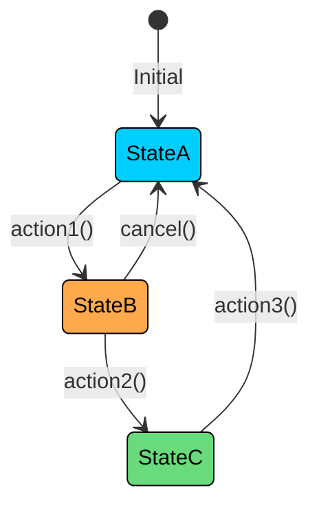
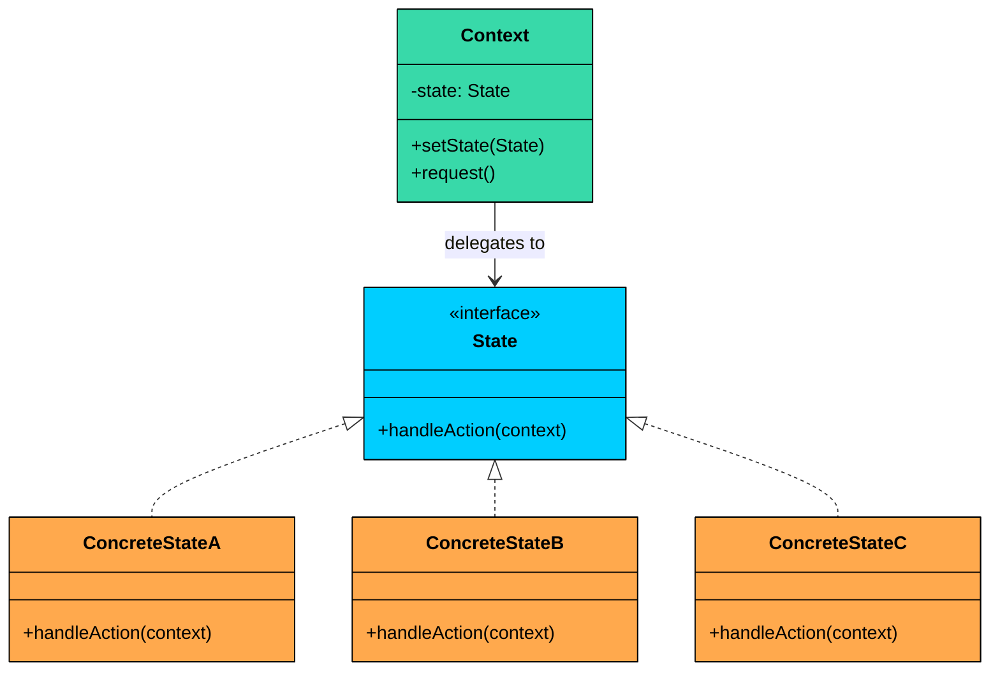
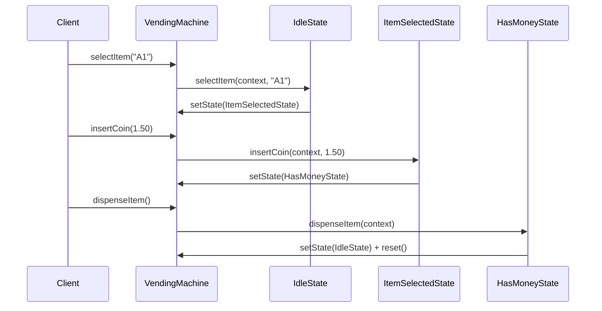
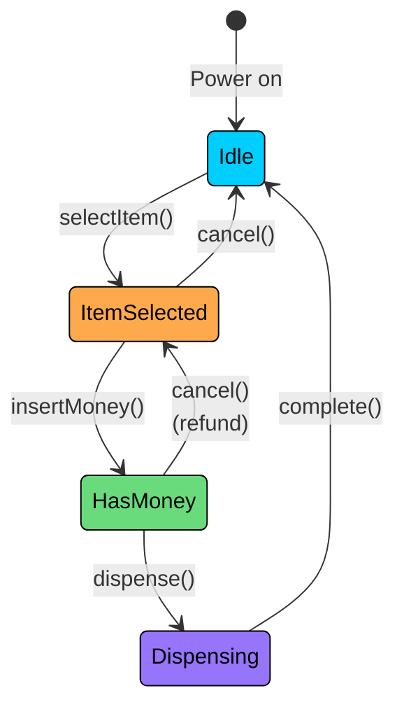
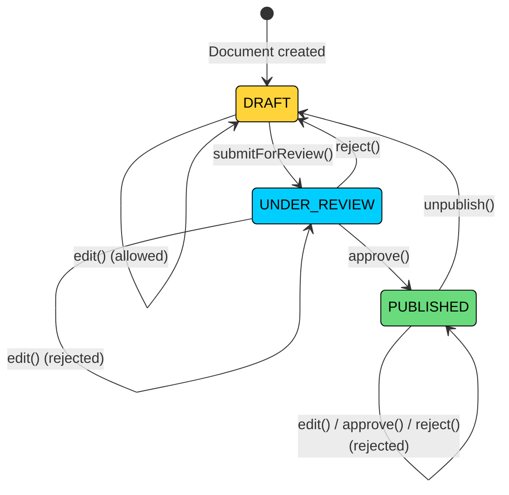

import React from 'react';
import CodeBlock from '../../../../components/ui/CodeBlock';
import Callout from '../../../../components/ui/Callout';

<div className="article-header">
  <div className="breadcrumb">
    <a href="/">Curated Notes</a>
    <span className="breadcrumb-separator">›</span>
    <span className="breadcrumb-current">State Design Pattern</span>
  </div>
  <h1>State Design Pattern</h1>
  <p style={{ color: 'var(--text-muted)', fontSize: '1.1rem', marginBottom: '16px', lineHeight: '1.6' }}>
    Master the essentials of State Design Pattern in this curated guide.
  </p>
  <div className="meta-info">
    <span className="meta-item">
      <svg width="14" height="14" viewBox="0 0 24 24" fill="none" stroke="currentColor" strokeWidth="2"><circle cx="12" cy="12" r="10"/><polyline points="12 6 12 12 16 14"/></svg>
      10 min read
    </span>
    <span className="difficulty-badge difficulty-badge--intermediate">Intermediate</span>
  </div>
</div>

<section className="content-section">





&gt; **DEFINITION**
&gt;
&gt; The **State Design Pattern** is a **behavioral design pattern** that lets an object **change its behavior when its internal state changes**, as if it were switching to a different class at runtime.


It’s particularly useful in situations where:

- An object can be in one of **many distinct states**, each with different behavior.
- The object’s behavior depends on **current context**, and that context **changes over time**.
- You want to avoid large, monolithic `if-else` or `switch` statements that check for every possible state.

Let’s walk through a real-world example to see how we can apply the State Pattern to manage dynamic behavior in a clean, scalable, and object-oriented way.

---

## 

## 1. The Problem: Managing Vending Machine States

Imagine you're building a simple [**vending machine system**](https://en.wikipedia.org/wiki/Vending_machine). On the surface, it seems straightforward: accept money, dispense products, and go back to idle.


But the tricky part is that the machine’s behavior must change depending on what’s happening right now. A vending machine can be in only one state at a time, for example:

- **IdleState:** Waiting for user input (nothing selected, no money inserted).
- **ItemSelectedState:** An item has been selected, waiting for payment.
- **HasMoneyState:** Money has been inserted, waiting to dispense the selected item.
- **DispensingState:** The machine is actively dispensing the item.

The machine supports a few user-facing operations:

- `selectItem(String itemCode)` – Select an item to purchase
- `insertCoin(double amount)` – Insert payment for the selected item
- `dispenseItem()` – Trigger the item dispensing process

Each of these methods should behave differently based on the machine's current state.

For example, calling `dispenseItem()` while the machine is in `IdleState` should do nothing or show an error. Calling `insertCoin()` before selecting an item should be disallowed. Calling `selectItem()` during `DispensingState` should be ignored until the item is dispensed.

---

#### The Naive Approach

A common but flawed approach is to manage state transitions manually inside a monolithic `VendingMachine` class using `if-else` or `switch` statements.


```java
class VendingMachine {

    private enum State {
        IDLE, ITEM_SELECTED, HAS_MONEY, DISPENSING
    }

    private State currentState = State.IDLE;
    private String selectedItem = "";
    private double insertedAmount = 0.0;

    public void selectItem(String itemCode) {
        switch (currentState) {
            case IDLE:
                selectedItem = itemCode;
                currentState = State.ITEM_SELECTED;
                break;
            case ITEM_SELECTED:
                System.out.println("Item already selected");
                break;
            case HAS_MONEY:
                System.out.println("Payment already received for item");
                break;
            case DISPENSING:
                System.out.println("Currently dispensing");
                break;
        }
    }

    public void insertCoin(double amount) {
        switch (currentState) {
            case IDLE:
                System.out.println("No item selected");
                break;
            case ITEM_SELECTED:
                insertedAmount = amount;
                System.out.println("Inserted $" + amount + " for item");
                currentState = State.HAS_MONEY;
                break;
            case HAS_MONEY:
                System.out.println("Money already inserted");
                break;
            case DISPENSING:
                System.out.println("Currently dispensing");
                break;
        }
    }

    public void dispenseItem() {
        switch (currentState) {
            case IDLE:
                System.out.println("No item selected");
                break;
            case ITEM_SELECTED:
                System.out.println("Please insert coin first");
                break;
            case HAS_MONEY:
                System.out.println("Dispensing item '" + selectedItem + "'");
                currentState = State.DISPENSING;
                System.out.println("Item dispensed successfully.");
                resetMachine();
                break;
            case DISPENSING:
                System.out.println("Already dispensing. Please wait.");
                break;
        }
    }

    private void resetMachine() {
        selectedItem = "";
        insertedAmount = 0.0;
        currentState = State.IDLE;
    }
}
```

```python
from enum import Enum

class State(Enum):
    IDLE = 1
    ITEM_SELECTED = 2
    HAS_MONEY = 3
    DISPENSING = 4

class VendingMachine:
    def __init__(self):
        self.current_state = State.IDLE
        self.selected_item = ""
        self.inserted_amount = 0.0

    def select_item(self, item_code):
        if self.current_state == State.IDLE:
            self.selected_item = item_code
            self.current_state = State.ITEM_SELECTED
        elif self.current_state == State.ITEM_SELECTED:
            print("Item already selected")
        elif self.current_state == State.HAS_MONEY:
            print("Payment already received for item")
        elif self.current_state == State.DISPENSING:
            print("Currently dispensing")

    def insert_coin(self, amount):
        if self.current_state == State.IDLE:
            print("No item selected")
        elif self.current_state == State.ITEM_SELECTED:
            self.inserted_amount = amount
            print(f"Inserted ${amount} for item")
            self.current_state = State.HAS_MONEY
        elif self.current_state == State.HAS_MONEY:
            print("Money already inserted")
        elif self.current_state == State.DISPENSING:
            print("Currently dispensing")

    def dispense_item(self):
        if self.current_state == State.IDLE:
            print("No item selected")
        elif self.current_state == State.ITEM_SELECTED:
            print("Please insert coin first")
        elif self.current_state == State.HAS_MONEY:
            print(f"Dispensing item '{self.selected_item}'")
            self.current_state = State.DISPENSING
            print("Item dispensed successfully.")
            self._reset_machine()
        elif self.current_state == State.DISPENSING:
            print("Already dispensing. Please wait.")

    def _reset_machine(self):
        self.selected_item = ""
        self.inserted_amount = 0.0
        self.current_state = State.IDLE
```

```cpp
enum State {
    IDLE, ITEM_SELECTED, HAS_MONEY, DISPENSING
};

class VendingMachine {
private:
    State currentState;
    string selectedItem;
    double insertedAmount;

public:
    VendingMachine() : currentState(IDLE), selectedItem(""), insertedAmount(0.0) {}

    void selectItem(string itemCode) {
        switch (currentState) {
            case IDLE:
                selectedItem = itemCode;
                currentState = ITEM_SELECTED;
                break;
            case ITEM_SELECTED:
                cout << "Item already selected" << endl;
                break;
            case HAS_MONEY:
                cout << "Payment already received for item" << endl;
                break;
            case DISPENSING:
                cout << "Currently dispensing" << endl;
                break;
        }
    }

    void insertCoin(double amount) {
        switch (currentState) {
            case IDLE:
                cout << "No item selected" << endl;
                break;
            case ITEM_SELECTED:
                insertedAmount = amount;
                cout << "Inserted $" << amount << " for item" << endl;
                currentState = HAS_MONEY;
                break;
            case HAS_MONEY:
                cout << "Money already inserted" << endl;
                break;
            case DISPENSING:
                cout << "Currently dispensing" << endl;
                break;
        }
    }

    void dispenseItem() {
        switch (currentState) {
            case IDLE:
                cout << "No item selected" << endl;
                break;
            case ITEM_SELECTED:
                cout << "Please insert coin first" << endl;
                break;
            case HAS_MONEY:
                cout << "Dispensing item '" << selectedItem << "'" << endl;
                currentState = DISPENSING;
                cout << "Item dispensed successfully." << endl;
                resetMachine();
                break;
            case DISPENSING:
                cout << "Already dispensing. Please wait." << endl;
                break;
        }
    }

    void resetMachine() {
        selectedItem = "";
        insertedAmount = 0.0;
        currentState = IDLE;
    }
};
```

```go
type State int

const (
	IDLE State = iota
	ITEM_SELECTED
	HAS_MONEY
	DISPENSING
)

type VendingMachine struct {
	currentState  State
	selectedItem  string
	insertedAmount float64
}

func (vm *VendingMachine) SelectItem(itemCode string) {
	switch vm.currentState {
	case IDLE:
		vm.selectedItem = itemCode
		vm.currentState = ITEM_SELECTED
	case ITEM_SELECTED:
		fmt.Println("Item already selected")
	case HAS_MONEY:
		fmt.Println("Payment already received for item")
	case DISPENSING:
		fmt.Println("Currently dispensing")
	}
}

func (vm *VendingMachine) InsertCoin(amount float64) {
	switch vm.currentState {
	case IDLE:
		fmt.Println("No item selected")
	case ITEM_SELECTED:
		vm.insertedAmount = amount
		fmt.Println("Inserted $" + strconv.FormatFloat(amount, 'f', -1, 64) + " for item")
		vm.currentState = HAS_MONEY
	case HAS_MONEY:
		fmt.Println("Money already inserted")
	case DISPENSING:
		fmt.Println("Currently dispensing")
	}
}

func (vm *VendingMachine) DispenseItem() {
	switch vm.currentState {
	case IDLE:
		fmt.Println("No item selected")
	case ITEM_SELECTED:
		fmt.Println("Please insert coin first")
	case HAS_MONEY:
		fmt.Println("Dispensing item '" + vm.selectedItem + "'")
		vm.currentState = DISPENSING
		fmt.Println("Item dispensed successfully.")
		vm.resetMachine()
	case DISPENSING:
		fmt.Println("Already dispensing. Please wait.")
	}
}

func (vm *VendingMachine) resetMachine() {
	vm.selectedItem = ""
	vm.insertedAmount = 0.0
	vm.currentState = IDLE
}
```

```csharp
enum State
{
    IDLE, ITEM_SELECTED, HAS_MONEY, DISPENSING
}

class VendingMachine
{
    private State currentState = State.IDLE;
    private string selectedItem = "";
    private double insertedAmount = 0.0;

    public void SelectItem(string itemCode)
    {
        switch (currentState)
        {
            case State.IDLE:
                selectedItem = itemCode;
                currentState = State.ITEM_SELECTED;
                break;
            case State.ITEM_SELECTED:
                Console.WriteLine("Item already selected");
                break;
            case State.HAS_MONEY:
                Console.WriteLine("Payment already received for item");
                break;
            case State.DISPENSING:
                Console.WriteLine("Currently dispensing");
                break;
        }
    }

    public void InsertCoin(double amount)
    {
        switch (currentState)
        {
            case State.IDLE:
                Console.WriteLine("No item selected");
                break;
            case State.ITEM_SELECTED:
                insertedAmount = amount;
                Console.WriteLine("Inserted $" + amount + " for item");
                currentState = State.HAS_MONEY;
                break;
            case State.HAS_MONEY:
                Console.WriteLine("Money already inserted");
                break;
            case State.DISPENSING:
                Console.WriteLine("Currently dispensing");
                break;
        }
    }

    public void DispenseItem()
    {
        switch (currentState)
        {
            case State.IDLE:
                Console.WriteLine("No item selected");
                break;
            case State.ITEM_SELECTED:
                Console.WriteLine("Please insert coin first");
                break;
            case State.HAS_MONEY:
                Console.WriteLine("Dispensing item '" + selectedItem + "'");
                currentState = State.DISPENSING;
                Console.WriteLine("Item dispensed successfully.");
                ResetMachine();
                break;
            case State.DISPENSING:
                Console.WriteLine("Already dispensing. Please wait.");
                break;
        }
    }

    private void ResetMachine()
    {
        selectedItem = "";
        insertedAmount = 0.0;
        currentState = State.IDLE;
    }
}
```

```typescript
enum StateEnum {
    IDLE = "IDLE",
    ITEM_SELECTED = "ITEM_SELECTED",
    HAS_MONEY = "HAS_MONEY",
    DISPENSING = "DISPENSING"
}

class VendingMachine {
    private currentState: StateEnum = StateEnum.IDLE;
    private selectedItem: string = "";
    private insertedAmount: number = 0.0;

    selectItem(itemCode: string): void {
        switch (this.currentState) {
            case StateEnum.IDLE:
                this.selectedItem = itemCode;
                this.currentState = StateEnum.ITEM_SELECTED;
                break;
            case StateEnum.ITEM_SELECTED:
                console.log("Item already selected");
                break;
            case StateEnum.HAS_MONEY:
                console.log("Payment already received for item");
                break;
            case StateEnum.DISPENSING:
                console.log("Currently dispensing");
                break;
        }
    }

    insertCoin(amount: number): void {
        switch (this.currentState) {
            case StateEnum.IDLE:
                console.log("No item selected");
                break;
            case StateEnum.ITEM_SELECTED:
                this.insertedAmount = amount;
                console.log("Inserted $" + amount + " for item");
                this.currentState = StateEnum.HAS_MONEY;
                break;
            case StateEnum.HAS_MONEY:
                console.log("Money already inserted");
                break;
            case StateEnum.DISPENSING:
                console.log("Currently dispensing");
                break;
        }
    }

    dispenseItem(): void {
        switch (this.currentState) {
            case StateEnum.IDLE:
                console.log("No item selected");
                break;
            case StateEnum.ITEM_SELECTED:
                console.log("Please insert coin first");
                break;
            case StateEnum.HAS_MONEY:
                console.log("Dispensing item '" + this.selectedItem + "'");
                this.currentState = StateEnum.DISPENSING;
                console.log("Item dispensed successfully.");
                this.resetMachine();
                break;
            case StateEnum.DISPENSING:
                console.log("Already dispensing. Please wait.");
                break;
        }
    }

    private resetMachine(): void {
        this.selectedItem = "";
        this.insertedAmount = 0.0;
        this.currentState = StateEnum.IDLE;
    }
}
```


#### What's Wrong with This Approach?

While using an `enum` with `switch` statements can work for small, predictable systems, this approach **doesn't scale well**.

#### 1. Cluttered Code

All state-related logic is stuffed into a single class (`VendingMachine`), resulting in large and repetitive `switch` or `if-else` blocks across every method. This leads to code that is hard to read and reason about, duplicate checks for state across multiple methods, and fragile logic when multiple developers touch the same file.

#### 2. Hard to Extend

Suppose you want to introduce new states like `OutOfStockState` (when the selected item is sold out) or `MaintenanceState` (when the machine is undergoing service). To support these, you would need to update every switch block in every method, add logic in multiple places, and risk breaking existing functionality. This violates the Open/Closed Principle.

This violates the **Open/Closed Principle:** the system is open to modification when it should be open to extension.

#### 3. Violates the Single Responsibility Principle

The `VendingMachine` class is now responsible for managing state transitions, implementing business rules, and executing state-specific logic. This tight coupling makes the class monolithic, hard to test, and resistant to change.

#### What We Really Need

We need to encapsulate the behavior associated with each state into its own class, so the vending machine can delegate work to the current state object instead of managing it all internally. This would allow us to avoid switch-case madness, add or remove states without modifying the core class, and keep each state's logic isolated and testable.

This is exactly what the **State Design Pattern** enables.

---

## 2. The State Pattern

&gt; The State pattern allows an object (the Context) to alter its behavior when its internal state changes. The object appears to change its class because its behavior is now delegated to a different state object.

Two characteristics define the pattern:

1. **Encapsulation of state-specific behavior:** Each state gets its own class. All the logic for "what happens when the machine is idle and someone inserts a coin" lives in the `IdleState` class, not buried in a switch statement somewhere.
2. **State-driven transitions:** State objects themselves decide when and how to transition to another state. The context does not manage transitions through conditionals. It just delegates to the current state, and the state handles the rest.


&gt; **Real-World Analogy**
&gt;
&gt; Think about a traffic light. It has three states: red, yellow, and green. The behavior at each state is different: cars stop, cars prepare to stop, or cars go.
&gt;
&gt; Each state knows what it does and when to transition to the next one. Red knows it should eventually become green. Green knows it should eventually become yellow. The traffic light itself just follows whichever state is active. 
&gt;
&gt; That is exactly how the State pattern works: the context (traffic light) delegates to the current state, and each state manages its own transitions.


---

### Class Diagram





#### 1. State Interface (e.g., `MachineState`)

Declares the methods that correspond to the actions the context supports. Every concrete state must implement these methods, even if some are no-ops in certain states.

The State interface usually passes the context as a parameter to each method. This lets concrete states call `context.setState(new SomeOtherState())` to trigger transitions.

#### 2. Concrete States (e.g., `IdleState`, `ItemSelectedState`)

Each concrete state implements the State interface with behavior specific to that state.

When an action in one state should move the context to a different state, the concrete state creates the next state object and sets it on the context.

#### 3. Context (e.g., `VendingMachine`)

The class that clients interact with. It maintains a reference to the current State object and delegates all operations to it.

---

## 3. How it Works

The State workflow follows a delegation-and-transition cycle:





**Step 1:** The context starts with an initial state (e.g., `IdleState`).

**Step 2:** The client calls an action on the context (e.g., `selectItem("A1")`).

**Step 3:** The context delegates the call to the current state: `currentState.selectItem(this, "A1")`.

**Step 4:** The state performs its logic. If the action triggers a transition, the state creates a new state object and calls `context.setState(newState)`.

**Step 5:** The next time the client calls an action, the context delegates to the new state, which may behave completely differently.

---

## 4. Implementing State Pattern

Instead of hardcoding state transitions and behaviors into a single monolithic class using `if-else` or `switch` statements, we’ll apply the **State Pattern** to separate concerns and make the vending machine easier to manage and extend.

#### State Diagram





#### Step 1: Define the State Interface

The first step is to define a `MachineState` interface that declares all the operations the vending machine supports. Each state will implement this interface, defining how the vending machine should behave when in that state.


```java
interface MachineState {
    void selectItem(VendingMachine context, String itemCode);
    void insertCoin(VendingMachine context, double amount);
    void dispenseItem(VendingMachine context);
}
```

```python
from abc import ABC, abstractmethod

class MachineState(ABC):
    @abstractmethod
    def select_item(self, context, item_code):
        pass

    @abstractmethod
    def insert_coin(self, context, amount):
        pass

    @abstractmethod
    def dispense_item(self, context):
        pass
```

```cpp
class VendingMachine; // Forward declaration

class MachineState {
public:
    virtual ~MachineState() = default;
    virtual void selectItem(VendingMachine* context, string itemCode) = 0;
    virtual void insertCoin(VendingMachine* context, double amount) = 0;
    virtual void dispenseItem(VendingMachine* context) = 0;
};
```

```go
type MachineState interface {
	SelectItem(context *VendingMachine, itemCode string)
	InsertCoin(context *VendingMachine, amount float64)
	DispenseItem(context *VendingMachine)
}
```

```csharp
interface IMachineState
{
    void SelectItem(VendingMachine context, string itemCode);
    void InsertCoin(VendingMachine context, double amount);
    void DispenseItem(VendingMachine context);
}
```

```typescript
interface MachineState {
    selectItem(context: VendingMachine, itemCode: string): void;
    insertCoin(context: VendingMachine, amount: number): void;
    dispenseItem(context: VendingMachine): void;
}
```


Notice how every method takes the context as a parameter. This allows each state to read context data (like the selected item) and trigger transitions by calling `context.setState(...)`.

#### Step 2: Implement Concrete State Classes

Each state class implements the `MachineState` interface and defines its behavior for each operation.

#### IdleState

The machine is waiting for user input. The only valid action is selecting an item. Inserting coins or dispensing without selecting first should be rejected.


```java
class IdleState implements MachineState {
    @Override
    public void selectItem(VendingMachine context, String itemCode) {
        System.out.println("Item selected: " + itemCode);
        context.setSelectedItem(itemCode);
        context.setState(new ItemSelectedState());
    }

    @Override
    public void insertCoin(VendingMachine context, double amount) {
        System.out.println("Please select an item before inserting coins.");
    }

    @Override
    public void dispenseItem(VendingMachine context) {
        System.out.println("No item selected. Nothing to dispense.");
    }
}
```

```python
class IdleState(MachineState):
    def select_item(self, context, item_code):
        print(f"Item selected: {item_code}")
        context.set_selected_item(item_code)
        context.set_state(ItemSelectedState())

    def insert_coin(self, context, amount):
        print("Please select an item before inserting coins.")

    def dispense_item(self, context):
        print("No item selected. Nothing to dispense.")
```

```cpp
class IdleState : public MachineState {
public:
    void selectItem(VendingMachine* context, string itemCode) override {
        cout << "Item selected: " << itemCode << endl;
        context->setSelectedItem(itemCode);
        context->setState(new ItemSelectedState());
    }

    void insertCoin(VendingMachine* context, double amount) override {
        cout << "Please select an item before inserting coins." << endl;
    }

    void dispenseItem(VendingMachine* context) override {
        cout << "No item selected. Nothing to dispense." << endl;
    }
};
```

```go
type IdleState struct{}

func (s *IdleState) SelectItem(context *VendingMachine, itemCode string) {
	fmt.Println("Item selected: " + itemCode)
	context.SetSelectedItem(itemCode)
	context.SetState(&ItemSelectedState{})
}

func (s *IdleState) InsertCoin(context *VendingMachine, amount float64) {
	fmt.Println("Please select an item before inserting coins.")
}

func (s *IdleState) DispenseItem(context *VendingMachine) {
	fmt.Println("No item selected. Nothing to dispense.")
}
```

```csharp
class IdleState : IMachineState
{
    public void SelectItem(VendingMachine context, string itemCode)
    {
        Console.WriteLine("Item selected: " + itemCode);
        context.SetSelectedItem(itemCode);
        context.SetState(new ItemSelectedState());
    }

    public void InsertCoin(VendingMachine context, double amount)
    {
        Console.WriteLine("Please select an item before inserting coins.");
    }

    public void DispenseItem(VendingMachine context)
    {
        Console.WriteLine("No item selected. Nothing to dispense.");
    }
}
```

```typescript
class IdleState implements MachineState {
    selectItem(context: VendingMachine, itemCode: string): void {
        console.log("Item selected: " + itemCode);
        context.setSelectedItem(itemCode);
        context.setState(new ItemSelectedState());
    }

    insertCoin(context: VendingMachine, amount: number): void {
        console.log("Please select an item before inserting coins.");
    }

    dispenseItem(context: VendingMachine): void {
        console.log("No item selected. Nothing to dispense.");
    }
}
```


#### ItemSelectedState

An item has been selected, and the machine is waiting for payment. The only valid action here is inserting a coin.


```java
class ItemSelectedState implements MachineState {
    @Override
    public void selectItem(VendingMachine context, String itemCode) {
        System.out.println("Item already selected: " + context.getSelectedItem());
    }

    @Override
    public void insertCoin(VendingMachine context, double amount) {
        System.out.println("Inserted $" + amount + " for item: " + context.getSelectedItem());
        context.setInsertedAmount(amount);
        context.setState(new HasMoneyState());
    }

    @Override
    public void dispenseItem(VendingMachine context) {
        System.out.println("Insert coin before dispensing.");
    }
}
```

```python
class ItemSelectedState(MachineState):
    def select_item(self, context, item_code):
        print(f"Item already selected: {context.get_selected_item()}")

    def insert_coin(self, context, amount):
        print(f"Inserted ${amount} for item: {context.get_selected_item()}")
        context.set_inserted_amount(amount)
        context.set_state(HasMoneyState())

    def dispense_item(self, context):
        print("Insert coin before dispensing.")
```

```cpp
class ItemSelectedState : public MachineState {
public:
    void selectItem(VendingMachine* context, string itemCode) override {
        cout << "Item already selected: " << context->getSelectedItem() << endl;
    }

    void insertCoin(VendingMachine* context, double amount) override {
        cout << "Inserted $" << amount << " for item: " << context->getSelectedItem() << endl;
        context->setInsertedAmount(amount);
        context->setState(new HasMoneyState());
    }

    void dispenseItem(VendingMachine* context) override {
        cout << "Insert coin before dispensing." << endl;
    }
};
```

```go
type ItemSelectedState struct{}

func (s *ItemSelectedState) SelectItem(context *VendingMachine, itemCode string) {
	fmt.Println("Item already selected: " + context.GetSelectedItem())
}

func (s *ItemSelectedState) InsertCoin(context *VendingMachine, amount float64) {
	fmt.Println("Inserted $" + strconv.FormatFloat(amount, 'f', -1, 64) + " for item: " + context.GetSelectedItem())
	context.SetInsertedAmount(amount)
	context.SetState(&HasMoneyState{})
}

func (s *ItemSelectedState) DispenseItem(context *VendingMachine) {
	fmt.Println("Insert coin before dispensing.")
}
```

```csharp
class ItemSelectedState : IMachineState
{
    public void SelectItem(VendingMachine context, string itemCode)
    {
        Console.WriteLine("Item already selected: " + context.GetSelectedItem());
    }

    public void InsertCoin(VendingMachine context, double amount)
    {
        Console.WriteLine("Inserted $" + amount + " for item: " + context.GetSelectedItem());
        context.SetInsertedAmount(amount);
        context.SetState(new HasMoneyState());
    }

    public void DispenseItem(VendingMachine context)
    {
        Console.WriteLine("Insert coin before dispensing.");
    }
}
```

```typescript
class ItemSelectedState implements MachineState {
    selectItem(context: VendingMachine, itemCode: string): void {
        console.log("Item already selected: " + context.getSelectedItem());
    }

    insertCoin(context: VendingMachine, amount: number): void {
        console.log("Inserted $" + amount + " for item: " + context.getSelectedItem());
        context.setInsertedAmount(amount);
        context.setState(new HasMoneyState());
    }

    dispenseItem(context: VendingMachine): void {
        console.log("Insert coin before dispensing.");
    }
}
```


#### HasMoneyState

Money has been inserted. The machine is ready to dispense. Selecting a new item or inserting more money should be rejected.


```java
class HasMoneyState implements MachineState {
    @Override
    public void selectItem(VendingMachine context, String itemCode) {
        System.out.println("Cannot change item after inserting money.");
    }

    @Override
    public void insertCoin(VendingMachine context, double amount) {
        System.out.println("Money already inserted.");
    }

    @Override
    public void dispenseItem(VendingMachine context) {
        System.out.println("Dispensing item: " + context.getSelectedItem());
        context.setState(new DispensingState());
        System.out.println("Item dispensed successfully.");
        context.reset();
    }
}
```

```python
class HasMoneyState(MachineState):
    def select_item(self, context, item_code):
        print("Cannot change item after inserting money.")

    def insert_coin(self, context, amount):
        print("Money already inserted.")

    def dispense_item(self, context):
        print(f"Dispensing item: {context.get_selected_item()}")
        context.set_state(DispensingState())
        print("Item dispensed successfully.")
        context.reset()
```

```cpp
class HasMoneyState : public MachineState {
public:
    void selectItem(VendingMachine* context, string itemCode) override {
        cout << "Cannot change item after inserting money." << endl;
    }

    void insertCoin(VendingMachine* context, double amount) override {
        cout << "Money already inserted." << endl;
    }

    void dispenseItem(VendingMachine* context) override {
        cout << "Dispensing item: " << context->getSelectedItem() << endl;
        context->setState(new DispensingState());
        cout << "Item dispensed successfully." << endl;
        context->reset();
    }
};
```

```go
type HasMoneyState struct{}

func (s *HasMoneyState) SelectItem(context *VendingMachine, itemCode string) {
	fmt.Println("Cannot change item after inserting money.")
}

func (s *HasMoneyState) InsertCoin(context *VendingMachine, amount float64) {
	fmt.Println("Money already inserted.")
}

func (s *HasMoneyState) DispenseItem(context *VendingMachine) {
	fmt.Println("Dispensing item: " + context.GetSelectedItem())
	context.SetState(&DispensingState{})
	fmt.Println("Item dispensed successfully.")
	context.Reset()
}
```

```csharp
class HasMoneyState : IMachineState
{
    public void SelectItem(VendingMachine context, string itemCode)
    {
        Console.WriteLine("Cannot change item after inserting money.");
    }

    public void InsertCoin(VendingMachine context, double amount)
    {
        Console.WriteLine("Money already inserted.");
    }

    public void DispenseItem(VendingMachine context)
    {
        Console.WriteLine("Dispensing item: " + context.GetSelectedItem());
        context.SetState(new DispensingState());
        Console.WriteLine("Item dispensed successfully.");
        context.Reset();
    }
}
```

```typescript
class HasMoneyState implements MachineState {
    selectItem(context: VendingMachine, itemCode: string): void {
        console.log("Cannot change item after inserting money.");
    }

    insertCoin(context: VendingMachine, amount: number): void {
        console.log("Money already inserted.");
    }

    dispenseItem(context: VendingMachine): void {
        console.log("Dispensing item: " + context.getSelectedItem());
        context.setState(new DispensingState());
        console.log("Item dispensed successfully.");
        context.reset();
    }
}
```


#### DispensingState

The machine is actively dispensing. All actions should be rejected until dispensing completes.


```java
class DispensingState implements MachineState {
    @Override
    public void selectItem(VendingMachine context, String itemCode) {
        System.out.println("Please wait, dispensing in progress.");
    }

    @Override
    public void insertCoin(VendingMachine context, double amount) {
        System.out.println("Please wait, dispensing in progress.");
    }

    @Override
    public void dispenseItem(VendingMachine context) {
        System.out.println("Already dispensing. Please wait.");
    }
}
```

```python
class DispensingState(MachineState):
    def select_item(self, context, item_code):
        print("Please wait, dispensing in progress.")

    def insert_coin(self, context, amount):
        print("Please wait, dispensing in progress.")

    def dispense_item(self, context):
        print("Already dispensing. Please wait.")
```

```cpp
class DispensingState : public MachineState {
public:
    void selectItem(VendingMachine* context, string itemCode) override {
        cout << "Please wait, dispensing in progress." << endl;
    }

    void insertCoin(VendingMachine* context, double amount) override {
        cout << "Please wait, dispensing in progress." << endl;
    }

    void dispenseItem(VendingMachine* context) override {
        cout << "Already dispensing. Please wait." << endl;
    }
};
```

```go
type DispensingState struct{}

func (d *DispensingState) selectItem(context *VendingMachine, itemCode string) {
	fmt.Println("Please wait, dispensing in progress.")
}

func (d *DispensingState) insertCoin(context *VendingMachine, amount float64) {
	fmt.Println("Please wait, dispensing in progress.")
}

func (d *DispensingState) dispenseItem(context *VendingMachine) {
	fmt.Println("Already dispensing. Please wait.")
}
```

```csharp
class DispensingState : IMachineState
{
    public void SelectItem(VendingMachine context, string itemCode)
    {
        Console.WriteLine("Please wait, dispensing in progress.");
    }

    public void InsertCoin(VendingMachine context, double amount)
    {
        Console.WriteLine("Please wait, dispensing in progress.");
    }

    public void DispenseItem(VendingMachine context)
    {
        Console.WriteLine("Already dispensing. Please wait.");
    }
}
```

```typescript
class DispensingState implements MachineState {
    selectItem(context: VendingMachine, itemCode: string): void {
        console.log("Please wait, dispensing in progress.");
    }

    insertCoin(context: VendingMachine, amount: number): void {
        console.log("Please wait, dispensing in progress.");
    }

    dispenseItem(context: VendingMachine): void {
        console.log("Already dispensing. Please wait.");
    }
}
```


#### Step 3: Implement the Context (VendingMachine)

The `VendingMachine` class (our context) maintains a reference to the current state and delegates all actions to it. It also holds the shared data that states need access to.


```java
class VendingMachine {
    private MachineState currentState;
    private String selectedItem;
    private double insertedAmount;

    public VendingMachine() {
        this.currentState = new IdleState();
    }

    public void setState(MachineState newState) {
        this.currentState = newState;
    }

    public void setSelectedItem(String itemCode) {
        this.selectedItem = itemCode;
    }

    public void setInsertedAmount(double amount) {
        this.insertedAmount = amount;
    }

    public String getSelectedItem() {
        return selectedItem;
    }

    public void selectItem(String itemCode) {
        currentState.selectItem(this, itemCode);
    }

    public void insertCoin(double amount) {
        currentState.insertCoin(this, amount);
    }

    public void dispenseItem() {
        currentState.dispenseItem(this);
    }

    public void reset() {
        this.selectedItem = "";
        this.insertedAmount = 0.0;
        this.currentState = new IdleState();
    }
}
```

```python
class VendingMachine:
    def __init__(self):
        self._current_state = IdleState()
        self._selected_item = ""
        self._inserted_amount = 0.0

    def set_state(self, new_state):
        self._current_state = new_state

    def set_selected_item(self, item_code):
        self._selected_item = item_code

    def set_inserted_amount(self, amount):
        self._inserted_amount = amount

    def get_selected_item(self):
        return self._selected_item

    def select_item(self, item_code):
        self._current_state.select_item(self, item_code)

    def insert_coin(self, amount):
        self._current_state.insert_coin(self, amount)

    def dispense_item(self):
        self._current_state.dispense_item(self)

    def reset(self):
        self._selected_item = ""
        self._inserted_amount = 0.0
        self._current_state = IdleState()
```

```cpp
class VendingMachine {
private:
    MachineState* currentState;
    string selectedItem;
    double insertedAmount;

public:
    VendingMachine() : selectedItem(""), insertedAmount(0.0) {
        currentState = new IdleState();
    }

    ~VendingMachine() {
        delete currentState;
    }

    void setState(MachineState* newState) {
        delete currentState;
        currentState = newState;
    }

    void setSelectedItem(string itemCode) {
		selectedItem = itemCode;
	}
    
	void setInsertedAmount(double amount) {
		insertedAmount = amount;
	}
    
	string getSelectedItem() {
		return selectedItem;
	}

    void selectItem(string itemCode) {
        currentState->selectItem(this, itemCode);
    }

    void insertCoin(double amount) {
        currentState->insertCoin(this, amount);
    }

    void dispenseItem() {
        currentState->dispenseItem(this);
    }

    void reset() {
        selectedItem = "";
        insertedAmount = 0.0;
        setState(new IdleState());
    }
};
```

```go
type VendingMachine struct {
	currentState  MachineState
	selectedItem  string
	insertedAmount float64
}

func NewVendingMachine() *VendingMachine {
	return &VendingMachine{currentState: IdleState{}}
}

func (v *VendingMachine) SetState(newState MachineState) {
	v.currentState = newState
}

func (v *VendingMachine) SetSelectedItem(itemCode string) {
	v.selectedItem = itemCode
}

func (v *VendingMachine) SetInsertedAmount(amount float64) {
	v.insertedAmount = amount
}

func (v *VendingMachine) GetSelectedItem() string {
	return v.selectedItem
}

func (v *VendingMachine) SelectItem(itemCode string) {
	v.currentState.SelectItem(v, itemCode)
}

func (v *VendingMachine) InsertCoin(amount float64) {
	v.currentState.InsertCoin(v, amount)
}

func (v *VendingMachine) DispenseItem() {
	v.currentState.DispenseItem(v)
}

func (v *VendingMachine) Reset() {
	v.selectedItem = ""
	v.insertedAmount = 0.0
	v.currentState = IdleState{}
}
```

```csharp
class VendingMachine
{
    private IMachineState currentState;
    private string selectedItem = "";
    private double insertedAmount = 0.0;

    public VendingMachine()
    {
        currentState = new IdleState();
    }

    public void SetState(IMachineState newState) {
		currentState = newState;
	}
	
    public void SetSelectedItem(string itemCode) {
		selectedItem = itemCode;
	}
	
    public void SetInsertedAmount(double amount) {
		insertedAmount = amount;
	}
	
    public string GetSelectedItem() {
		return selectedItem;
	}

    public void SelectItem(string itemCode)
    {
        currentState.SelectItem(this, itemCode);
    }

    public void InsertCoin(double amount)
    {
        currentState.InsertCoin(this, amount);
    }

    public void DispenseItem()
    {
        currentState.DispenseItem(this);
    }

    public void Reset()
    {
        selectedItem = "";
        insertedAmount = 0.0;
        currentState = new IdleState();
    }
}
```

```typescript
class VendingMachine {
   private currentState: MachineState;
   private selectedItem: string;
   private insertedAmount: number;

   constructor() {
       this.currentState = new IdleState(); // Initial state
   }

   setState(newState: MachineState): void {
       this.currentState = newState;
   }

   setSelectedItem(itemCode: string): void {
       this.selectedItem = itemCode;
   }

   setInsertedAmount(amount: number): void {
       this.insertedAmount = amount;
   }

   getSelectedItem(): string {
       return this.selectedItem;
   }

   selectItem(itemCode: string): void {
       this.currentState.selectItem(this, itemCode);
   }

   insertCoin(amount: number): void {
       this.currentState.insertCoin(this, amount);
   }

   dispenseItem(): void {
       this.currentState.dispenseItem(this);
   }

   reset(): void {
       this.selectedItem = "";
       this.insertedAmount = 0.0;
       this.currentState = new IdleState();
   }
}
```


#### Client code


```java
public class VendingMachineApp {
    public static void main(String[] args) {
        VendingMachine vm = new VendingMachine();

        vm.insertCoin(1.0);   // Rejected: no item selected
        vm.selectItem("A1");  // Transitions to ItemSelectedState
        vm.insertCoin(1.5);   // Transitions to HasMoneyState
        vm.dispenseItem();    // Dispenses, resets to IdleState

        System.out.println("\n--- Second Transaction ---");
        vm.selectItem("B2");
        vm.insertCoin(2.0);
        vm.dispenseItem();
    }
}
```

```python
def main():
    vm = VendingMachine()

    vm.insert_coin(1.0)   # Rejected: no item selected
    vm.select_item("A1")  # Transitions to ItemSelectedState
    vm.insert_coin(1.5)   # Transitions to HasMoneyState
    vm.dispense_item()    # Dispenses, resets to IdleState

    print("\n--- Second Transaction ---")
    vm.select_item("B2")
    vm.insert_coin(2.0)
    vm.dispense_item()

if __name__ == "__main__":
    main()
```

```cpp
int main() {
    VendingMachine* vm = new VendingMachine();

    vm->insertCoin(1.0);   // Rejected: no item selected
    vm->selectItem("A1");  // Transitions to ItemSelectedState
    vm->insertCoin(1.5);   // Transitions to HasMoneyState
    vm->dispenseItem();    // Dispenses, resets to IdleState

    cout << "\n--- Second Transaction ---" << endl;
    vm->selectItem("B2");
    vm->insertCoin(2.0);
    vm->dispenseItem();

    delete vm;
    return 0;
}
```

```go
vm := NewVendingMachine()

vm.InsertCoin(1.0)   // Rejected: no item selected
vm.SelectItem("A1")  // Transitions to ItemSelectedState
vm.InsertCoin(1.5)   // Transitions to HasMoneyState
vm.DispenseItem()    // Dispenses, resets to IdleState

fmt.Println("\n--- Second Transaction ---")
vm.SelectItem("B2")
vm.InsertCoin(2.0)
vm.DispenseItem()
```

```csharp
public class Program
{
    public static void Main(string[] args)
    {
        VendingMachine vm = new VendingMachine();

        vm.InsertCoin(1.0);   // Rejected: no item selected
        vm.SelectItem("A1");  // Transitions to ItemSelectedState
        vm.InsertCoin(1.5);   // Transitions to HasMoneyState
        vm.DispenseItem();    // Dispenses, resets to IdleState

        Console.WriteLine("\n--- Second Transaction ---");
        vm.SelectItem("B2");
        vm.InsertCoin(2.0);
        vm.DispenseItem();
    }
}
```

```typescript
const vm = new VendingMachine();

vm.insertCoin(1.0);   // Rejected: no item selected
vm.selectItem("A1");  // Transitions to ItemSelectedState
vm.insertCoin(1.5);   // Transitions to HasMoneyState
vm.dispenseItem();    // Dispenses, resets to IdleState

console.log("\n--- Second Transaction ---");
vm.selectItem("B2");
vm.insertCoin(2.0);
vm.dispenseItem();
```


By using the State pattern, we have transformed a rigid, condition-heavy implementation into a clean, flexible architecture where behaviors and transitions are clearly defined, decoupled, and easy to maintain. Adding a new state like `OutOfStockState` means creating one new class that implements `MachineState`. No existing state classes or the context need to change.

---

## 5. Practical Example: Document Workflow

Let us work through a second example to reinforce the pattern. This time, we are building a document management system where documents move through a workflow: Draft, Under Review, and Published. Each state has different rules for what operations are allowed.

In Draft state, authors can edit the document and submit it for review. In Review state, reviewers can approve or reject it. In Published state, the document is read-only and can only be unpublished to go back to Draft.





#### Implementation


```java
interface DocumentState {
    void edit(Document context, String content);
    void submitForReview(Document context);
    void approve(Document context);
    void reject(Document context);
    void unpublish(Document context);
}

class DraftState implements DocumentState {
    @Override
    public void edit(Document context, String content) {
        System.out.println("Editing document: " + content);
        context.setContent(content);
    }

    @Override
    public void submitForReview(Document context) {
        System.out.println("Document submitted for review.");
        context.setState(new UnderReviewState());
    }

    @Override
    public void approve(Document context) {
        System.out.println("Cannot approve a draft. Submit for review first.");
    }

    @Override
    public void reject(Document context) {
        System.out.println("Cannot reject a draft. Submit for review first.");
    }

    @Override
    public void unpublish(Document context) {
        System.out.println("Document is already a draft.");
    }
}

class UnderReviewState implements DocumentState {
    @Override
    public void edit(Document context, String content) {
        System.out.println("Cannot edit while under review.");
    }

    @Override
    public void submitForReview(Document context) {
        System.out.println("Document is already under review.");
    }

    @Override
    public void approve(Document context) {
        System.out.println("Document approved and published.");
        context.setState(new PublishedState());
    }

    @Override
    public void reject(Document context) {
        System.out.println("Document rejected. Returning to draft.");
        context.setState(new DraftState());
    }

    @Override
    public void unpublish(Document context) {
        System.out.println("Document is not published yet.");
    }
}

class PublishedState implements DocumentState {
    @Override
    public void edit(Document context, String content) {
        System.out.println("Cannot edit a published document. Unpublish first.");
    }

    @Override
    public void submitForReview(Document context) {
        System.out.println("Document is already published.");
    }

    @Override
    public void approve(Document context) {
        System.out.println("Document is already published.");
    }

    @Override
    public void reject(Document context) {
        System.out.println("Cannot reject a published document.");
    }

    @Override
    public void unpublish(Document context) {
        System.out.println("Document unpublished. Returning to draft.");
        context.setState(new DraftState());
    }
}

class Document {
    private DocumentState currentState;
    private String content;

    public Document() {
        this.currentState = new DraftState();
        this.content = "";
    }

    public void setState(DocumentState state) { this.currentState = state; }
    public void setContent(String content) { this.content = content; }
    public String getContent() { return content; }

    public void edit(String content) { currentState.edit(this, content); }
    public void submitForReview() { currentState.submitForReview(this); }
    public void approve() { currentState.approve(this); }
    public void reject() { currentState.reject(this); }
    public void unpublish() { currentState.unpublish(this); }
}

// Usage
public class DocumentApp {
    public static void main(String[] args) {
        Document doc = new Document();

        doc.edit("First draft of the article.");
        doc.approve();              // Rejected: cannot approve a draft
        doc.submitForReview();
        doc.edit("Trying to edit");  // Rejected: under review
        doc.reject();                // Back to draft
        doc.edit("Revised draft.");
        doc.submitForReview();
        doc.approve();               // Published
        doc.edit("Trying to edit");  // Rejected: published
        doc.unpublish();             // Back to draft
    }
}
```

```python
from abc import ABC, abstractmethod

class DocumentState(ABC):
    @abstractmethod
    def edit(self, context, content):
        pass

    @abstractmethod
    def submit_for_review(self, context):
        pass

    @abstractmethod
    def approve(self, context):
        pass

    @abstractmethod
    def reject(self, context):
        pass

    @abstractmethod
    def unpublish(self, context):
        pass

class DraftState(DocumentState):
    def edit(self, context, content):
        print(f"Editing document: {content}")
        context.set_content(content)

    def submit_for_review(self, context):
        print("Document submitted for review.")
        context.set_state(UnderReviewState())

    def approve(self, context):
        print("Cannot approve a draft. Submit for review first.")

    def reject(self, context):
        print("Cannot reject a draft. Submit for review first.")

    def unpublish(self, context):
        print("Document is already a draft.")

class UnderReviewState(DocumentState):
    def edit(self, context, content):
        print("Cannot edit while under review.")

    def submit_for_review(self, context):
        print("Document is already under review.")

    def approve(self, context):
        print("Document approved and published.")
        context.set_state(PublishedState())

    def reject(self, context):
        print("Document rejected. Returning to draft.")
        context.set_state(DraftState())

    def unpublish(self, context):
        print("Document is not published yet.")

class PublishedState(DocumentState):
    def edit(self, context, content):
        print("Cannot edit a published document. Unpublish first.")

    def submit_for_review(self, context):
        print("Document is already published.")

    def approve(self, context):
        print("Document is already published.")

    def reject(self, context):
        print("Cannot reject a published document.")

    def unpublish(self, context):
        print("Document unpublished. Returning to draft.")
        context.set_state(DraftState())

class Document:
    def __init__(self):
        self._current_state = DraftState()
        self._content = ""

    def set_state(self, state):
        self._current_state = state

    def set_content(self, content):
        self._content = content

    def get_content(self):
        return self._content

    def edit(self, content):
        self._current_state.edit(self, content)

    def submit_for_review(self):
        self._current_state.submit_for_review(self)

    def approve(self):
        self._current_state.approve(self)

    def reject(self):
        self._current_state.reject(self)

    def unpublish(self):
        self._current_state.unpublish(self)

## Usage
doc = Document()

doc.edit("First draft of the article.")
doc.approve()              # Rejected: cannot approve a draft
doc.submit_for_review()
doc.edit("Trying to edit")  # Rejected: under review
doc.reject()                # Back to draft
doc.edit("Revised draft.")
doc.submit_for_review()
doc.approve()               # Published
doc.edit("Trying to edit")  # Rejected: published
doc.unpublish()             # Back to draft
```

```cpp
#include <iostream>
#include <string>

using namespace std;

class Document; // Forward declaration

class DocumentState {
public:
    virtual ~DocumentState() = default;
    virtual void edit(Document* context, const string& content) = 0;
    virtual void submitForReview(Document* context) = 0;
    virtual void approve(Document* context) = 0;
    virtual void reject(Document* context) = 0;
    virtual void unpublish(Document* context) = 0;
};

class DraftState : public DocumentState {
public:
    void edit(Document* context, const string& content) override;
    void submitForReview(Document* context) override;
    void approve(Document* context) override {
        cout << "Cannot approve a draft. Submit for review first." << endl;
    }
    void reject(Document* context) override {
        cout << "Cannot reject a draft. Submit for review first." << endl;
    }
    void unpublish(Document* context) override {
        cout << "Document is already a draft." << endl;
    }
};

class UnderReviewState : public DocumentState {
public:
    void edit(Document* context, const string& content) override {
        cout << "Cannot edit while under review." << endl;
    }
    void submitForReview(Document* context) override {
        cout << "Document is already under review." << endl;
    }
    void approve(Document* context) override;
    void reject(Document* context) override;
    void unpublish(Document* context) override {
        cout << "Document is not published yet." << endl;
    }
};

class PublishedState : public DocumentState {
public:
    void edit(Document* context, const string& content) override {
        cout << "Cannot edit a published document. Unpublish first." << endl;
    }
    void submitForReview(Document* context) override {
        cout << "Document is already published." << endl;
    }
    void approve(Document* context) override {
        cout << "Document is already published." << endl;
    }
    void reject(Document* context) override {
        cout << "Cannot reject a published document." << endl;
    }
    void unpublish(Document* context) override;
};

class Document {
private:
    DocumentState* currentState;
    string content;

public:
    Document() : currentState(new DraftState()), content("") {}
    ~Document() { delete currentState; }

    void setState(DocumentState* state) {
        delete currentState;
        currentState = state;
    }

    void setContent(const string& c) { content = c; }
    string getContent() const { return content; }

    void edit(const string& c) { currentState->edit(this, c); }
    void submitForReview() { currentState->submitForReview(this); }
    void approve() { currentState->approve(this); }
    void reject() { currentState->reject(this); }
    void unpublish() { currentState->unpublish(this); }
};

// Deferred implementations
void DraftState::edit(Document* context, const string& content) {
    cout << "Editing document: " << content << endl;
    context->setContent(content);
}

void DraftState::submitForReview(Document* context) {
    cout << "Document submitted for review." << endl;
    context->setState(new UnderReviewState());
}

void UnderReviewState::approve(Document* context) {
    cout << "Document approved and published." << endl;
    context->setState(new PublishedState());
}

void UnderReviewState::reject(Document* context) {
    cout << "Document rejected. Returning to draft." << endl;
    context->setState(new DraftState());
}

void PublishedState::unpublish(Document* context) {
    cout << "Document unpublished. Returning to draft." << endl;
    context->setState(new DraftState());
}

// Usage (matches your Java flow)
int main() {
    Document doc;

    doc.edit("First draft of the article.");
    doc.approve();               // Cannot approve a draft
    doc.submitForReview();
    doc.edit("Trying to edit");  // Cannot edit while under review
    doc.reject();                // Back to draft
    doc.edit("Revised draft.");
    doc.submitForReview();
    doc.approve();               // Published
    doc.edit("Trying to edit");  // Cannot edit a published document
    doc.unpublish();             // Back to draft

    return 0;
}
```

```go
package main

import "fmt"

type DocumentState interface {
	edit(context *Document, content string)
	submitForReview(context *Document)
	approve(context *Document)
	reject(context *Document)
	unpublish(context *Document)
}

type DraftState struct{}

func (d *DraftState) edit(context *Document, content string) {
	fmt.Println("Editing document: " + content)
	context.setContent(content)
}

func (d *DraftState) submitForReview(context *Document) {
	fmt.Println("Document submitted for review.")
	context.setState(&UnderReviewState{})
}

func (d *DraftState) approve(context *Document) {
	fmt.Println("Cannot approve a draft. Submit for review first.")
}

func (d *DraftState) reject(context *Document) {
	fmt.Println("Cannot reject a draft. Submit for review first.")
}

func (d *DraftState) unpublish(context *Document) {
	fmt.Println("Document is already a draft.")
}

type UnderReviewState struct{}

func (u *UnderReviewState) edit(context *Document, content string) {
	fmt.Println("Cannot edit while under review.")
}

func (u *UnderReviewState) submitForReview(context *Document) {
	fmt.Println("Document is already under review.")
}

func (u *UnderReviewState) approve(context *Document) {
	fmt.Println("Document approved and published.")
	context.setState(&PublishedState{})
}

func (u *UnderReviewState) reject(context *Document) {
	fmt.Println("Document rejected. Returning to draft.")
	context.setState(&DraftState{})
}

func (u *UnderReviewState) unpublish(context *Document) {
	fmt.Println("Document is not published yet.")
}

type PublishedState struct{}

func (p *PublishedState) edit(context *Document, content string) {
	fmt.Println("Cannot edit a published document. Unpublish first.")
}

func (p *PublishedState) submitForReview(context *Document) {
	fmt.Println("Document is already published.")
}

func (p *PublishedState) approve(context *Document) {
	fmt.Println("Document is already published.")
}

func (p *PublishedState) reject(context *Document) {
	fmt.Println("Cannot reject a published document.")
}

func (p *PublishedState) unpublish(context *Document) {
	fmt.Println("Document unpublished. Returning to draft.")
	context.setState(&DraftState{})
}

type Document struct {
	currentState DocumentState
	content      string
}

func NewDocument() *Document {
	return &Document{currentState: &DraftState{}, content: ""}
}

func (d *Document) setState(state DocumentState) { d.currentState = state }
func (d *Document) setContent(content string)     { d.content = content }
func (d *Document) getContent() string            { return d.content }

func (d *Document) edit(content string)          { d.currentState.edit(d, content) }
func (d *Document) submitForReview()             { d.currentState.submitForReview(d) }
func (d *Document) approve()                     { d.currentState.approve(d) }
func (d *Document) reject()                      { d.currentState.reject(d) }
func (d *Document) unpublish()                   { d.currentState.unpublish(d) }

func main() {
	doc := NewDocument()

	doc.edit("First draft of the article.")
	doc.approve()
	doc.submitForReview()
	doc.edit("Trying to edit")
	doc.reject()
	doc.edit("Revised draft.")
	doc.submitForReview()
	doc.approve()
	doc.edit("Trying to edit")
	doc.unpublish()
}
```

```csharp
using System;

interface IDocumentState
{
    void Edit(Document context, string content);
    void SubmitForReview(Document context);
    void Approve(Document context);
    void Reject(Document context);
    void Unpublish(Document context);
}

class DraftState : IDocumentState
{
    public void Edit(Document context, string content)
    {
        Console.WriteLine("Editing document: " + content);
        context.SetContent(content);
    }

    public void SubmitForReview(Document context)
    {
        Console.WriteLine("Document submitted for review.");
        context.SetState(new UnderReviewState());
    }

    public void Approve(Document context)
    {
        Console.WriteLine("Cannot approve a draft. Submit for review first.");
    }

    public void Reject(Document context)
    {
        Console.WriteLine("Cannot reject a draft. Submit for review first.");
    }

    public void Unpublish(Document context)
    {
        Console.WriteLine("Document is already a draft.");
    }
}

class UnderReviewState : IDocumentState
{
    public void Edit(Document context, string content)
    {
        Console.WriteLine("Cannot edit while under review.");
    }

    public void SubmitForReview(Document context)
    {
        Console.WriteLine("Document is already under review.");
    }

    public void Approve(Document context)
    {
        Console.WriteLine("Document approved and published.");
        context.SetState(new PublishedState());
    }

    public void Reject(Document context)
    {
        Console.WriteLine("Document rejected. Returning to draft.");
        context.SetState(new DraftState());
    }

    public void Unpublish(Document context)
    {
        Console.WriteLine("Document is not published yet.");
    }
}

class PublishedState : IDocumentState
{
    public void Edit(Document context, string content)
    {
        Console.WriteLine("Cannot edit a published document. Unpublish first.");
    }

    public void SubmitForReview(Document context)
    {
        Console.WriteLine("Document is already published.");
    }

    public void Approve(Document context)
    {
        Console.WriteLine("Document is already published.");
    }

    public void Reject(Document context)
    {
        Console.WriteLine("Cannot reject a published document.");
    }

    public void Unpublish(Document context)
    {
        Console.WriteLine("Document unpublished. Returning to draft.");
        context.SetState(new DraftState());
    }
}

class Document
{
    private IDocumentState currentState;
    private string content = "";

    public Document() { currentState = new DraftState(); }

    public void SetState(IDocumentState state) { currentState = state; }
    public void SetContent(string content) { this.content = content; }
    public string GetContent() { return content; }

    public void Edit(string content) { currentState.Edit(this, content); }
    public void SubmitForReview() { currentState.SubmitForReview(this); }
    public void Approve() { currentState.Approve(this); }
    public void Reject() { currentState.Reject(this); }
    public void Unpublish() { currentState.Unpublish(this); }
}

// Usage
class Program
{
    static void Main(string[] args)
    {
        Document doc = new Document();

        doc.Edit("First draft of the article.");
        doc.Approve();                  // Rejected: cannot approve a draft
        doc.SubmitForReview();
        doc.Edit("Trying to edit");     // Rejected: under review
        doc.Reject();                   // Back to draft
        doc.Edit("Revised draft.");
        doc.SubmitForReview();
        doc.Approve();                  // Published
        doc.Edit("Trying to edit");     // Rejected: published
        doc.Unpublish();                // Back to draft
    }
}
```

```typescript
interface DocumentState {
    edit(context: Document, content: string): void;
    submitForReview(context: Document): void;
    approve(context: Document): void;
    reject(context: Document): void;
    unpublish(context: Document): void;
}

class DraftState implements DocumentState {
    edit(context: Document, content: string): void {
        console.log("Editing document: " + content);
        context.setContent(content);
    }

    submitForReview(context: Document): void {
        console.log("Document submitted for review.");
        context.setState(new UnderReviewState());
    }

    approve(context: Document): void {
        console.log("Cannot approve a draft. Submit for review first.");
    }

    reject(context: Document): void {
        console.log("Cannot reject a draft. Submit for review first.");
    }

    unpublish(context: Document): void {
        console.log("Document is already a draft.");
    }
}

class UnderReviewState implements DocumentState {
    edit(context: Document, content: string): void {
        console.log("Cannot edit while under review.");
    }

    submitForReview(context: Document): void {
        console.log("Document is already under review.");
    }

    approve(context: Document): void {
        console.log("Document approved and published.");
        context.setState(new PublishedState());
    }

    reject(context: Document): void {
        console.log("Document rejected. Returning to draft.");
        context.setState(new DraftState());
    }

    unpublish(context: Document): void {
        console.log("Document is not published yet.");
    }
}

class PublishedState implements DocumentState {
    edit(context: Document, content: string): void {
        console.log("Cannot edit a published document. Unpublish first.");
    }

    submitForReview(context: Document): void {
        console.log("Document is already published.");
    }

    approve(context: Document): void {
        console.log("Document is already published.");
    }

    reject(context: Document): void {
        console.log("Cannot reject a published document.");
    }

    unpublish(context: Document): void {
        console.log("Document unpublished. Returning to draft.");
        context.setState(new DraftState());
    }
}

class Document {
    private currentState: DocumentState;
    private content: string = "";

    constructor() { this.currentState = new DraftState(); }

    setState(state: DocumentState): void { this.currentState = state; }
    setContent(content: string): void { this.content = content; }
    getContent(): string { return this.content; }

    edit(content: string): void { this.currentState.edit(this, content); }
    submitForReview(): void { this.currentState.submitForReview(this); }
    approve(): void { this.currentState.approve(this); }
    reject(): void { this.currentState.reject(this); }
    unpublish(): void { this.currentState.unpublish(this); }
}

// Usage
const doc = new Document();

doc.edit("First draft of the article.");
doc.approve();                    // Rejected: cannot approve a draft
doc.submitForReview();
doc.edit("Trying to edit");       // Rejected: under review
doc.reject();                     // Back to draft
doc.edit("Revised draft.");
doc.submitForReview();
doc.approve();                    // Published
doc.edit("Trying to edit");       // Rejected: published
doc.unpublish();                  // Back to draft
```


This example reinforces the same principles as the vending machine but in a different domain. Notice how each state cleanly defines what is allowed and what is not, and how transitions are handled by the states themselves. Adding a new state like `ArchivedState` would mean creating one new class without touching any existing code.

</section>
