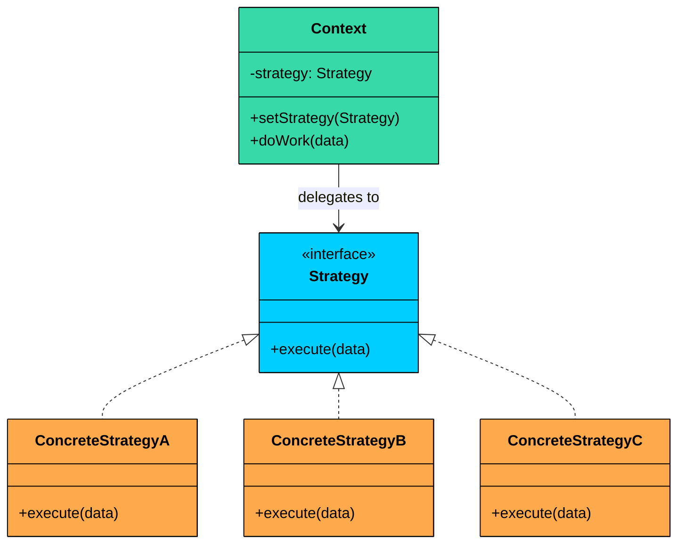
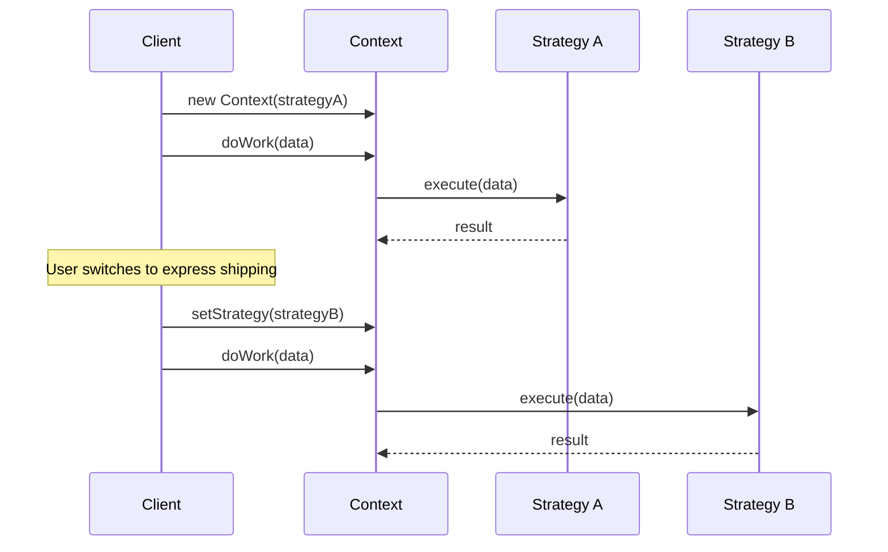
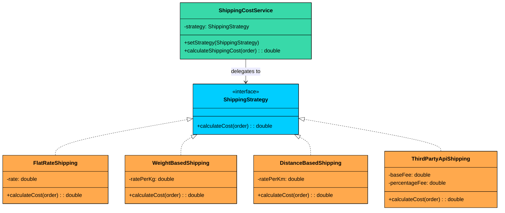
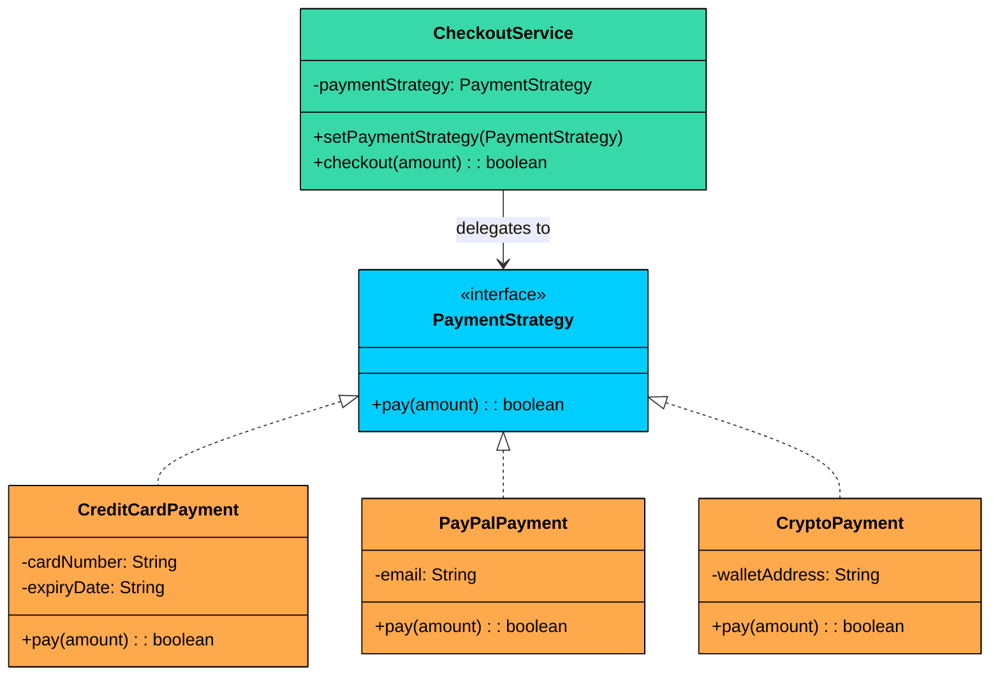

import React from 'react';
import CodeBlock from '../../../../components/ui/CodeBlock';
import Callout from '../../../../components/ui/Callout';

<div className="article-header">
  <div className="breadcrumb">
    <a href="/">Curated Notes</a>
    <span className="breadcrumb-separator">›</span>
    <span className="breadcrumb-current">Strategy Design Pattern</span>
  </div>
  <h1>Strategy Design Pattern</h1>
  <p style={{ color: 'var(--text-muted)', fontSize: '1.1rem', marginBottom: '16px', lineHeight: '1.6' }}>
    Master the essentials of Strategy Design Pattern in this curated guide.
  </p>
  <div className="meta-info">
    <span className="meta-item">
      <svg width="14" height="14" viewBox="0 0 24 24" fill="none" stroke="currentColor" strokeWidth="2"><circle cx="12" cy="12" r="10"/><polyline points="12 6 12 12 16 14"/></svg>
      10 min read
    </span>
    <span className="difficulty-badge difficulty-badge--intermediate">Intermediate</span>
  </div>
</div>

<section className="content-section">


&gt; **DEFINITION**
&gt;
&gt; The **Strategy Design Pattern** is a behavioral pattern that lets you define a family of algorithms, encapsulate each one in its own class, and make them interchangeable at runtime.


At its core, the Strategy pattern is about separating "what varies" from "what stays the same." 

Instead of embedding multiple algorithms inside a single class with conditional logic, you extract each algorithm into its own strategy class. The main class (context) delegates the work to whichever strategy is currently plugged in.

This pattern becomes valuable when:

- You have multiple ways to perform the same operation, and the choice might change at runtime
- You want to avoid bloated conditional statements that select between different behaviors
- You need to isolate algorithm-specific data and logic from the code that uses it
- Different clients might need different algorithms for the same task

Let us walk through a real-world example to see how the Strategy Pattern transforms messy conditional code into a clean, extensible design.

---

## 1. The Problem: Shipping Cost Calculation

Imagine you are building an e-commerce platform. One of the features you need is a shipping cost calculator. Sounds simple enough, but shipping costs can be calculated in many different ways depending on business rules:

- **Flat Rate**: A fixed fee regardless of weight or distance
- **Weight-Based**: Cost increases with package weight
- **Distance-Based**: Different rates for different delivery zones
- **Express Delivery**: Premium pricing for faster service
- **Third-Party API**: Dynamic rates from carriers like FedEx or UPS

Your first implementation might look like this:


```java
class ShippingCostCalculatorNaive {
    public double calculateShippingCost(Order order, String strategyType) {
        double cost = 0.0;

        if ("FLAT_RATE".equalsIgnoreCase(strategyType)) {
            System.out.println("Calculating with Flat Rate strategy.");
            cost = 10.0;

        } else if ("WEIGHT_BASED".equalsIgnoreCase(strategyType)) {
            System.out.println("Calculating with Weight-Based strategy.");
            cost = order.getTotalWeight() * 2.5;

        } else if ("DISTANCE_BASED".equalsIgnoreCase(strategyType)) {
            System.out.println("Calculating with Distance-Based strategy.");
            if ("ZoneA".equals(order.getDestinationZone())) {
                cost = 5.0;
            } else if ("ZoneB".equals(order.getDestinationZone())) {
                cost = 12.0;
            } else {
                cost = 20.0; // fallback
            }

        } else if ("THIRD_PARTY_API".equalsIgnoreCase(strategyType)) {
            System.out.println("Calculating with Third-Party API strategy.");
            // Simulated external call
            cost = 7.5 + (order.getOrderValue() * 0.02);

        } else {
            throw new IllegalArgumentException("Unknown shipping strategy: " + strategyType);
        }

        System.out.println("Calculated Shipping Cost: $" + cost);
        return cost;
    }
}
```

```python
class ShippingCostCalculatorNaive:
    def calculate_shipping_cost(self, order, strategy_type):
        cost = 0.0
        
        if strategy_type.upper() == "FLAT_RATE":
            print("Calculating with Flat Rate strategy.")
            cost = 10.0
        
        elif strategy_type.upper() == "WEIGHT_BASED":
            print("Calculating with Weight-Based strategy.")
            cost = order.get_total_weight() * 2.5
        
        elif strategy_type.upper() == "DISTANCE_BASED":
            print("Calculating with Distance-Based strategy.")
            if order.get_destination_zone() == "ZoneA":
                cost = 5.0
            elif order.get_destination_zone() == "ZoneB":
                cost = 12.0
            else:
                cost = 20.0  # fallback
        
        elif strategy_type.upper() == "THIRD_PARTY_API":
            print("Calculating with Third-Party API strategy.")
            # Simulated external call
            cost = 7.5 + (order.get_order_value() * 0.02)
        
        else:
            raise ValueError(f"Unknown shipping strategy: {strategy_type}")
        
        print(f"Calculated Shipping Cost: ${cost}")
        return cost
```

```cpp
class ShippingCostCalculatorNaive {
public:
    double calculateShippingCost(const Order& order, const string& strategyType) {
        double cost = 0.0;
        
        if (strategyType == "FLAT_RATE") {
            cout << "Calculating with Flat Rate strategy." << endl;
            cost = 10.0;
        }
        else if (strategyType == "WEIGHT_BASED") {
            cout << "Calculating with Weight-Based strategy." << endl;
            cost = order.getTotalWeight() * 2.5;
        }
        else if (strategyType == "DISTANCE_BASED") {
            cout << "Calculating with Distance-Based strategy." << endl;
            if (order.getDestinationZone() == "ZoneA") {
                cost = 5.0;
            } else if (order.getDestinationZone() == "ZoneB") {
                cost = 12.0;
            } else {
                cost = 20.0; // fallback
            }
        }
        else if (strategyType == "THIRD_PARTY_API") {
            cout << "Calculating with Third-Party API strategy." << endl;
            // Simulated external call
            cost = 7.5 + (order.getOrderValue() * 0.02);
        }
        else {
            throw invalid_argument("Unknown shipping strategy: " + strategyType);
        }
        
        cout << "Calculated Shipping Cost: $" << cost << endl;
        return cost;
    }
};
```

```go
type ShippingCostCalculatorNaive struct{}

func (s ShippingCostCalculatorNaive) CalculateShippingCost(order Order, strategyType string) float64 {
	cost := 0.0

	if strings.EqualFold(strategyType, "FLAT_RATE") {
		fmt.Println("Calculating with Flat Rate strategy.")
		cost = 10.0

	} else if strings.EqualFold(strategyType, "WEIGHT_BASED") {
		fmt.Println("Calculating with Weight-Based strategy.")
		cost = order.GetTotalWeight() * 2.5

	} else if strings.EqualFold(strategyType, "DISTANCE_BASED") {
		fmt.Println("Calculating with Distance-Based strategy.")
		if order.GetDestinationZone() == "ZoneA" {
			cost = 5.0
		} else if order.GetDestinationZone() == "ZoneB" {
			cost = 12.0
		} else {
			cost = 20.0 // fallback
		}

	} else if strings.EqualFold(strategyType, "THIRD_PARTY_API") {
		fmt.Println("Calculating with Third-Party API strategy.")
		// Simulated external call
		cost = 7.5 + (order.GetOrderValue() * 0.02)

	} else {
		panic("Unknown shipping strategy: " + strategyType)
	}

	fmt.Println("Calculated Shipping Cost: $" + fmt.Sprint(cost))
	return cost
}
```

```csharp
class ShippingCostCalculatorNaive
{
    public double CalculateShippingCost(Order order, string strategyType)
    {
        double cost = 0.0;

        if (strategyType.ToUpper() == "FLAT_RATE")
        {
            Console.WriteLine("Calculating with Flat Rate strategy.");
            cost = 10.0;
        }
        else if (strategyType.ToUpper() == "WEIGHT_BASED")
        {
            Console.WriteLine("Calculating with Weight-Based strategy.");
            cost = order.GetTotalWeight() * 2.5;
        }
        else if (strategyType.ToUpper() == "DISTANCE_BASED")
        {
            Console.WriteLine("Calculating with Distance-Based strategy.");
            if (order.GetDestinationZone() == "ZoneA")
            {
                cost = 5.0;
            }
            else if (order.GetDestinationZone() == "ZoneB")
            {
                cost = 12.0;
            }
            else
            {
                cost = 20.0; // fallback
            }
        }
        else if (strategyType.ToUpper() == "THIRD_PARTY_API")
        {
            Console.WriteLine("Calculating with Third-Party API strategy.");
            // Simulated external call
            cost = 7.5 + (order.GetOrderValue() * 0.02);
        }
        else
        {
            throw new ArgumentException($"Unknown shipping strategy: {strategyType}");
        }

        Console.WriteLine($"Calculated Shipping Cost: ${cost}");
        return cost;
    }
}
```

```typescript
class ShippingCostCalculatorNaive {
   calculateShippingCost(order: Order, strategyType: string): number {
       let cost = 0.0;

       if (strategyType.toUpperCase() === "FLAT_RATE") {
           console.log("Calculating with Flat Rate strategy.");
           cost = 10.0;

       } else if (strategyType.toUpperCase() === "WEIGHT_BASED") {
           console.log("Calculating with Weight-Based strategy.");
           cost = order.getTotalWeight() * 2.5;

       } else if (strategyType.toUpperCase() === "DISTANCE_BASED") {
           console.log("Calculating with Distance-Based strategy.");
           if (order.getDestinationZone() === "ZoneA") {
               cost = 5.0;
           } else if (order.getDestinationZone() === "ZoneB") {
               cost = 12.0;
           } else {
               cost = 20.0; // fallback
           }

       } else if (strategyType.toUpperCase() === "THIRD_PARTY_API") {
           console.log("Calculating with Third-Party API strategy.");
           // Simulated external call
           cost = 7.5 + (order.getOrderValue() * 0.02);

       } else {
           throw new Error("Unknown shipping strategy: " + strategyType);
       }

       console.log("Calculated Shipping Cost: $" + cost);
       return cost;
   }
}
```


#### Client Code Using It


```java
public class ECommerceAppV1 {
    public static void main(String[] args) {
        ShippingCostCalculatorNaive calculator = new ShippingCostCalculatorNaive();
        Order order1 = new Order();

        System.out.println("--- Order 1 ---");
        calculator.calculateShippingCost(order1, "FLAT_RATE");
        calculator.calculateShippingCost(order1, "WEIGHT_BASED");
        calculator.calculateShippingCost(order1, "DISTANCE_BASED");
        calculator.calculateShippingCost(order1, "THIRD_PARTY_API");

        // What if we want to try a new "PremiumZone" strategy?
        // We have to go modify this calculator class again...
    }
}
```

```python
def ecommerce_app_v1():
    calculator = ShippingCostCalculatorNaive()
    order1 = Order()
    
    print("--- Order 1 ---")
    calculator.calculate_shipping_cost(order1, "FLAT_RATE")
    calculator.calculate_shipping_cost(order1, "WEIGHT_BASED")
    calculator.calculate_shipping_cost(order1, "DISTANCE_BASED")
    calculator.calculate_shipping_cost(order1, "THIRD_PARTY_API")
    
    # What if we want to try a new "PremiumZone" strategy?
    # We have to go modify this calculator class again...

if __name__ == "__main__":
    print("=== Naive Approach ===")
    ecommerce_app_v1()
```

```cpp
void ecommerceAppV1() {
    ShippingCostCalculatorNaive calculator;
    Order order1;
    
    cout << "--- Order 1 ---" << endl;
    calculator.calculateShippingCost(order1, "FLAT_RATE");
    calculator.calculateShippingCost(order1, "WEIGHT_BASED");
    calculator.calculateShippingCost(order1, "DISTANCE_BASED");
    calculator.calculateShippingCost(order1, "THIRD_PARTY_API");
    
    // What if we want to try a new "PremiumZone" strategy?
    // We have to go modify this calculator class again...
}

int main() {
    cout << "=== Naive Approach ===" << endl;
    ecommerceAppV1();
        
    return 0;
}
```

```go
package main

func eCommerceAppV1() {
	calculator := ShippingCostCalculatorNaive{}
	order1 := Order{}

	println("--- Order 1 ---")
	calculator.calculateShippingCost(order1, "FLAT_RATE")
	calculator.calculateShippingCost(order1, "WEIGHT_BASED")
	calculator.calculateShippingCost(order1, "DISTANCE_BASED")
	calculator.calculateShippingCost(order1, "THIRD_PARTY_API")

	// What if we want to try a new "PremiumZone" strategy?
	// We have to go modify this calculator class again...
}
```

```csharp
public class ECommerceAppV1
{

    public static void Main(string[] args)
    {
        Console.WriteLine("=== Naive Approach ===");
        ShippingCostCalculatorNaive calculator = new ShippingCostCalculatorNaive();
        Order order1 = new Order();

        Console.WriteLine("--- Order 1 ---");
        calculator.CalculateShippingCost(order1, "FLAT_RATE");
        calculator.CalculateShippingCost(order1, "WEIGHT_BASED");
        calculator.CalculateShippingCost(order1, "DISTANCE_BASED");
        calculator.CalculateShippingCost(order1, "THIRD_PARTY_API");

        // What if we want to try a new "PremiumZone" strategy?
        // We have to go modify this calculator class again...        
    }
}
```

```typescript
class ECommerceAppV1 {
   static main(): void {
       const calculator = new ShippingCostCalculatorNaive();
       const order1 = new Order();

       console.log("--- Order 1 ---");
       calculator.calculateShippingCost(order1, "FLAT_RATE");
       calculator.calculateShippingCost(order1, "WEIGHT_BASED");
       calculator.calculateShippingCost(order1, "DISTANCE_BASED");
       calculator.calculateShippingCost(order1, "THIRD_PARTY_API");

       // What if we want to try a new "PremiumZone" strategy?
       // We have to go modify this calculator class again...
   }
}
```


This works. The client passes a method name, and the calculator returns the appropriate cost. But watch what happens as the business evolves.

#### What's Wrong with This Approach?

While it may seem fine initially, this design quickly becomes brittle and problematic as your system evolves:

#### **Violates the Open/Closed Principle**

Every new shipping method requires modifying the `ShippingCalculator` class. You are constantly opening a class that should be stable. Each modification risks breaking existing functionality.

#### **Bloated Conditional Logic**

The `if-else` chain becomes increasingly large and unreadable as more strategies are introduced. It clutters your code and makes debugging harder.

#### **Difficult to Test in Isolation**

Each strategy is tangled inside one method, making it harder to test individual behaviors independently. You must set up entire `Order` objects and manually select the strategy type just to test one case.

#### **Risk of Code Duplication**

What if another part of your application needs shipping calculations? You might copy this logic, and now you have two places to maintain.

#### **Low Cohesion**

The calculator class is doing too much. It knows how to handle **every possible algorithm** for shipping cost, rather than focusing on **orchestrating the calculation**.

#### What We Really Need

We need an approach where:

- Each shipping algorithm lives in its own class
- Adding a new algorithm does not require modifying existing classes
- The calculator does not need to know which algorithm it is using
- Algorithms can be swapped at runtime based on user preferences or business rules
- Each algorithm can be tested independently

This is exactly what the **Strategy Pattern** provides.

---

## 2. Understanding the Strategy Pattern

&gt; The Strategy Pattern defines a family of algorithms, encapsulates each one, and makes them interchangeable. Strategy lets the algorithm vary independently from clients that use it.

Two characteristics define the pattern:

1. **Encapsulation of algorithms:** Each algorithm lives in its own class, implementing a common interface. The algorithm's logic is isolated from everything else.
2. **Runtime interchangeability:** The context holds a reference to a strategy interface, not a concrete class. You can swap the strategy at any time, even mid-execution, without modifying the context.


&gt; **Real-World Analogy**
&gt;
&gt; Think about how you might travel from your home to the airport. You have several options:
&gt;
&gt; - **Drive yourself**: Flexible timing, but you pay for parking
&gt; - **Taxi/Uber**: Door-to-door service, variable pricing
&gt; - **Public transit**: Cheapest option, but takes longer
&gt; - **Airport shuttle**: Fixed schedule, moderate cost
&gt;
&gt; Each of these is a "travel strategy." You (the traveler) decide which strategy to use based on factors like cost, time, and convenience. The important point is that you do not change how you "travel" as a concept. You just swap out the method. 
&gt;
&gt; The Strategy pattern works the same way.


---

### Class Diagram

The Strategy Pattern involves three key components:





#### **Strategy Interface (e.g., **`ShippingStrategy`**)**

Declares the interface common to all supported algorithms. The Context uses this interface to call the algorithm defined by a ConcreteStrategy.

#### **Concrete Strategies (e.g., **`FlatRateShipping`**, **`WeightBasedShipping`**)**

Implements the algorithm using the Strategy interface. Each concrete strategy encapsulates a specific algorithm.

#### **Context Class** (e.g., `ShippingCostService`)

This is the main class that **uses a strategy** to perform a task. It holds a reference to a `Strategy` object and delegates the calculation to it. The context doesn’t know or care which specific strategy is being used. It just knows that it has a strategy that can calculate a shipping cost.

---

## 3. How It Works

The Strategy workflow is straightforward:





**Step 1:** The client creates a concrete strategy object (e.g., `FlatRateShipping`).

**Step 2:** The client passes the strategy to the context, either through the constructor or a setter.

**Step 3:** The context stores the strategy reference in a field typed to the Strategy interface.

**Step 4:** When the context needs to run the algorithm, it calls the strategy's method. The context does not know or care which concrete strategy is behind the interface.

**Step 5:** To change behavior, the client swaps in a different strategy. The context code does not change at all.

---

## 4. Implementing the Strategy Pattern

Let us refactor our shipping calculator using the Strategy pattern. Here is the class diagram for the refactored design:





The `ShippingStrategy` interface defines the contract. Four concrete strategies (orange) each encapsulate a different shipping algorithm. The `ShippingCostService` context holds a strategy reference and delegates all calculations to it.

#### Step 1: Define the Strategy Interface (`ShippingStrategy`)

First, we define a common interface that all shipping strategies must implement:


```java
interface ShippingStrategy {
    double calculateCost(Order order);
}
```

```python
from abc import ABC, abstractmethod

class ShippingStrategy(ABC):
    @abstractmethod
    def calculate_cost(self, order) -> float:
        pass
```

```cpp
class ShippingStrategy {
public:
    virtual ~ShippingStrategy() {}
    virtual double calculateCost(const Order& order) = 0;
};
```

```go
type ShippingStrategy interface {
	calculateCost(order Order) float64
}
```

```csharp
interface IShippingStrategy
{
    double CalculateCost(Order order);
}
```

```typescript
interface ShippingStrategy {
   calculateCost(order: Order): number;
}
```


This interface is simple and focused. Every strategy takes an order and returns a cost. The interface says nothing about how the cost is calculated, and that is the whole point.


&gt; **Design Decision**
&gt;
&gt; We use an interface rather than an abstract class because shipping strategies have no shared implementation. If they did (say, logging before calculation), an abstract class with a template method might be appropriate.


#### Step 2: Implement Concrete Strategies

Each shipping algorithm becomes its own class.

#### **FlatRateShipping**


```java
class FlatRateShipping implements ShippingStrategy {
    private double rate;

    public FlatRateShipping(double rate) {
        this.rate = rate;
    }

    @Override
    public double calculateCost(Order order) {
        System.out.println("Calculating with Flat Rate strategy ($" + rate + ")");
        return rate;
    }
}
```

```python
class FlatRateShipping(ShippingStrategy):
    def __init__(self, rate):
        self.rate = rate
    
    def calculate_cost(self, order):
        print(f"Calculating with Flat Rate strategy (${self.rate})")
        return self.rate
```

```cpp
class FlatRateShipping : public ShippingStrategy {
private:
    double rate;

public:
    FlatRateShipping(double r) : rate(r) {}
    
    double calculateCost(const Order& order) override {
        cout << "Calculating with Flat Rate strategy ($" << rate << ")" << endl;
        return rate;
    }
};
```

```go
type FlatRateShipping struct {
	rate float64
}

func NewFlatRateShipping(rate float64) *FlatRateShipping {
	return &FlatRateShipping{rate: rate}
}

func (f *FlatRateShipping) CalculateCost(order Order) float64 {
	fmt.Printf("Calculating with Flat Rate strategy ($%v)\n", f.rate)
	return f.rate
}
```

```csharp
class FlatRateShipping : IShippingStrategy
{
    private double rate;

    public FlatRateShipping(double rate)
    {
        this.rate = rate;
    }

    public double CalculateCost(Order order)
    {
        Console.WriteLine($"Calculating with Flat Rate strategy (${rate})");
        return rate;
    }
}
```

```typescript
class FlatRateShipping implements ShippingStrategy {
   private rate: number;

   constructor(rate: number) {
       this.rate = rate;
   }

   calculateCost(order: Order): number {
       console.log("Calculating with Flat Rate strategy ($" + this.rate + ")");
       return this.rate;
   }
}
```


#### **WeightBasedShipping**


```java
class WeightBasedShipping implements ShippingStrategy {
    private final double ratePerKg;

    public WeightBasedShipping(double ratePerKg) {
        this.ratePerKg = ratePerKg;
    }

    @Override
    public double calculateCost(Order order) {
        System.out.println("Calculating with Weight-Based strategy ($" + ratePerKg + "/kg)");
        return order.getTotalWeight() * ratePerKg;
    }
}
```

```python
class WeightBasedShipping(ShippingStrategy):
    def __init__(self, rate_per_kg):
        self.rate_per_kg = rate_per_kg
    
    def calculate_cost(self, order):
        print(f"Calculating with Weight-Based strategy (${self.rate_per_kg}/kg)")
        return order.get_total_weight() * self.rate_per_kg
```

```cpp
class WeightBasedShipping : public ShippingStrategy {
private:
    double ratePerKg;

public:
    WeightBasedShipping(double rateKg) : ratePerKg(rateKg) {}
    
    double calculateCost(const Order& order) override {
        cout << "Calculating with Weight-Based strategy ($" << ratePerKg << "/kg)" << endl;
        return order.getTotalWeight() * ratePerKg;
    }
};
```

```go
type WeightBasedShipping struct {
	ratePerKg float64
}

func NewWeightBasedShipping(ratePerKg float64) *WeightBasedShipping {
	return &WeightBasedShipping{ratePerKg: ratePerKg}
}

func (w *WeightBasedShipping) CalculateCost(order Order) float64 {
	fmt.Println("Calculating with Weight-Based strategy ($" + fmt.Sprint(w.ratePerKg) + "/kg)")
	return order.GetTotalWeight() * w.ratePerKg
}
```

```csharp
class WeightBasedShipping : IShippingStrategy
{
    private double ratePerKg;

    public WeightBasedShipping(double ratePerKg)
    {
        this.ratePerKg = ratePerKg;
    }

    public double CalculateCost(Order order)
    {
        Console.WriteLine($"Calculating with Weight-Based strategy (${ratePerKg}/kg)");
        return order.GetTotalWeight() * ratePerKg;
    }
}
```

```typescript
class WeightBasedShipping implements ShippingStrategy {
   private readonly ratePerKg: number;

   constructor(ratePerKg: number) {
       this.ratePerKg = ratePerKg;
   }

   calculateCost(order: Order): number {
       console.log("Calculating with Weight-Based strategy ($" + this.ratePerKg + "/kg)");
       return order.getTotalWeight() * this.ratePerKg;
   }
}
```


#### **DistanceBasedShipping**


```java
class DistanceBasedShipping implements ShippingStrategy {
    private double ratePerKm;

    public DistanceBasedShipping(double ratePerKm) {
        this.ratePerKm = ratePerKm;
    }

    @Override
    public double calculateCost(Order order) {
        System.out.println("Calculating with Distance-Based strategy for zone: " + order.getDestinationZone());
        return switch (order.getDestinationZone()) {
            case "ZoneA" -> ratePerKm * 5.0;
            case "ZoneB" -> ratePerKm * 7.0;
            default -> ratePerKm * 10.0;
        };
    }
}
```

```python
class DistanceBasedShipping(ShippingStrategy):
    def __init__(self, rate_per_km):
        self.rate_per_km = rate_per_km
    
    def calculate_cost(self, order):
        print(f"Calculating with Distance-Based strategy for zone: {order.get_destination_zone()}")
        zone_mapping = {
            "ZoneA": self.rate_per_km * 5.0,
            "ZoneB": self.rate_per_km * 7.0
        }
        return zone_mapping.get(order.get_destination_zone(), self.rate_per_km * 10.0)
```

```cpp
class DistanceBasedShipping : public ShippingStrategy {
private:
    double ratePerKm;

public:
    DistanceBasedShipping(double rateKm) : ratePerKm(rateKm) {}
    
    double calculateCost(const Order& order) override {
        cout << "Calculating with Distance-Based strategy for zone: " << order.getDestinationZone() << endl;
        
        if (order.getDestinationZone() == "ZoneA") {
            return ratePerKm * 5.0;
        } else if (order.getDestinationZone() == "ZoneB") {
            return ratePerKm * 7.0;
        } else {
            return ratePerKm * 10.0;
        }
    }
};
```

```go
type DistanceBasedShipping struct {
	ratePerKm float64
}

func NewDistanceBasedShipping(ratePerKm float64) *DistanceBasedShipping {
	return &DistanceBasedShipping{ratePerKm: ratePerKm}
}

func (d *DistanceBasedShipping) CalculateCost(order Order) float64 {
	fmt.Println("Calculating with Distance-Based strategy for zone: " + order.GetDestinationZone())

	switch order.GetDestinationZone() {
	case "ZoneA":
		return d.ratePerKm * 5.0
	case "ZoneB":
		return d.ratePerKm * 7.0
	default:
		return d.ratePerKm * 10.0
	}
}
```

```csharp
class DistanceBasedShipping : IShippingStrategy
{
    private double ratePerKm;

    public DistanceBasedShipping(double ratePerKm)
    {
        this.ratePerKm = ratePerKm;
    }

    public double CalculateCost(Order order)
    {
        Console.WriteLine($"Calculating with Distance-Based strategy for zone: {order.GetDestinationZone()}");
        
        switch (order.GetDestinationZone())
        {
            case "ZoneA":
                return ratePerKm * 5.0;
            case "ZoneB":
                return ratePerKm * 7.0;
            default:
                return ratePerKm * 10.0;
        }
    }
}
```

```typescript
class DistanceBasedShipping implements ShippingStrategy {
   private ratePerKm: number;

   constructor(ratePerKm: number) {
       this.ratePerKm = ratePerKm;
   }

   calculateCost(order: Order): number {
       console.log("Calculating with Distance-Based strategy for zone: " + order.getDestinationZone());
       switch (order.getDestinationZone()) {
           case "ZoneA":
               return this.ratePerKm * 5.0;
           case "ZoneB":
               return this.ratePerKm * 7.0;
           default:
               return this.ratePerKm * 10.0;
       }
   }
}
```


#### **ThirdPartyApiShipping**


```java
class ThirdPartyApiShipping implements ShippingStrategy {
    private final double baseFee;
    private final double percentageFee;

    public ThirdPartyApiShipping(double baseFee, double percentageFee) {
        this.baseFee = baseFee;
        this.percentageFee = percentageFee;
    }

    @Override
    public double calculateCost(Order order) {
        System.out.println("Calculating with Third-Party API strategy.");
        // Simulate API call
        return baseFee + (order.getOrderValue() * percentageFee);
    }
}
```

```python
class ThirdPartyApiShipping(ShippingStrategy):
    def __init__(self, base_fee, percentage_fee):
        self.base_fee = base_fee
        self.percentage_fee = percentage_fee
    
    def calculate_cost(self, order):
        print("Calculating with Third-Party API strategy.")
        # Simulate API call
        return self.base_fee + (order.get_order_value() * self.percentage_fee)
```

```cpp
class ThirdPartyApiShipping : public ShippingStrategy {
private:
    double baseFee;
    double percentageFee;

public:
    ThirdPartyApiShipping(double base, double percentage) 
        : baseFee(base), percentageFee(percentage) {}
    
    double calculateCost(const Order& order) override {
        cout << "Calculating with Third-Party API strategy." << endl;
        // Simulate API call
        return baseFee + (order.getOrderValue() * percentageFee);
    }
};
```

```go
type ThirdPartyApiShipping struct {
	baseFee       float64
	percentageFee float64
}

func NewThirdPartyApiShipping(baseFee, percentageFee float64) *ThirdPartyApiShipping {
	return &ThirdPartyApiShipping{baseFee: baseFee, percentageFee: percentageFee}
}

func (t *ThirdPartyApiShipping) CalculateCost(order Order) float64 {
	fmt.Println("Calculating with Third-Party API strategy.")
	// Simulate API call
	return t.baseFee + (order.GetOrderValue() * t.percentageFee)
}
```

```csharp
class ThirdPartyApiShipping : IShippingStrategy
{
    private double baseFee;
    private double percentageFee;

    public ThirdPartyApiShipping(double baseFee, double percentageFee)
    {
        this.baseFee = baseFee;
        this.percentageFee = percentageFee;
    }

    public double CalculateCost(Order order)
    {
        Console.WriteLine("Calculating with Third-Party API strategy.");
        // Simulate API call
        return baseFee + (order.GetOrderValue() * percentageFee);
    }
}
```

```typescript
class ThirdPartyApiShipping implements ShippingStrategy {
   private readonly baseFee: number;
   private readonly percentageFee: number;

   constructor(baseFee: number, percentageFee: number) {
       this.baseFee = baseFee;
       this.percentageFee = percentageFee;
   }

   calculateCost(order: Order): number {
       console.log("Calculating with Third-Party API strategy.");
       // Simulate API call
       return this.baseFee + (order.getOrderValue() * this.percentageFee);
   }
}
```


Notice how each class is focused on a single responsibility. The `DistanceBasedShipping` class knows about zones. The `WeightBasedShipping` class knows about weight calculations. Neither knows about the other.

#### Step 3: Create the Context Class

The context class holds a reference to a strategy and delegates calculations to it:


```java
class ShippingCostService {
    private ShippingStrategy strategy;

    // Constructor to set initial strategy
    public ShippingCostService(ShippingStrategy strategy) {
        this.strategy = strategy;
    }

    // Method to change strategy at runtime
    public void setStrategy(ShippingStrategy strategy) {
        System.out.println("ShippingCostService: Strategy changed to " + strategy.getClass().getSimpleName());
        this.strategy = strategy;
    }

    public double calculateShippingCost(Order order) {
        if (strategy == null) {
            throw new IllegalStateException("Shipping strategy not set.");
        }
        double cost = strategy.calculateCost(order);
        System.out.println("ShippingCostService: Final Calculated Shipping Cost: $" + cost +
                           " (using " + strategy.getClass().getSimpleName() + ")");
        return cost;
    }
}
```

```python
class ShippingCostService:
    def __init__(self, strategy):
        self.strategy = strategy
    
    def set_strategy(self, strategy):
        print(f"ShippingCostService: Strategy changed to {strategy.__class__.__name__}")
        self.strategy = strategy
    
    def calculate_shipping_cost(self, order):
        if self.strategy is None:
            raise ValueError("Shipping strategy not set.")
        
        cost = self.strategy.calculate_cost(order)
        print(f"ShippingCostService: Final Calculated Shipping Cost: ${cost} "
              f"(using {self.strategy.__class__.__name__})")
        return cost
```

```cpp
class ShippingCostService {
private:
    ShippingStrategy* strategy;

public:
    ShippingCostService(ShippingStrategy* s) : strategy(s) {}
    
    void setStrategy(ShippingStrategy* s) {
        cout << "ShippingCostService: Strategy changed" << endl;
        strategy = s;
    }
    
    double calculateShippingCost(const Order& order) {
        if (strategy == nullptr) {
            throw invalid_argument("Shipping strategy not set.");
        }
        
        double cost = strategy->calculateCost(order);
        cout << "ShippingCostService: Final Calculated Shipping Cost: $" << cost << endl;
        return cost;
    }
};
```

```go
type ShippingCostService struct {
	strategy ShippingStrategy
}

// Constructor to set initial strategy
func NewShippingCostService(strategy ShippingStrategy) *ShippingCostService {
	return &ShippingCostService{strategy: strategy}
}

// Method to change strategy at runtime
func (s *ShippingCostService) SetStrategy(strategy ShippingStrategy) {
	fmt.Println("ShippingCostService: Strategy changed to " + reflect.TypeOf(strategy).String())
	s.strategy = strategy
}

func (s *ShippingCostService) CalculateShippingCost(order Order) float64 {
	if s.strategy == nil {
		panic("Shipping strategy not set.")
	}
	cost := s.strategy.CalculateCost(order)
	fmt.Println("ShippingCostService: Final Calculated Shipping Cost: $" + fmt.Sprint(cost) +
		" (using " + reflect.TypeOf(s.strategy).String() + ")")
	return cost
}
```

```csharp
class ShippingCostService
{
    private IShippingStrategy strategy;

    public ShippingCostService(IShippingStrategy strategy)
    {
        this.strategy = strategy;
    }

    public void SetStrategy(IShippingStrategy strategy)
    {
        Console.WriteLine($"ShippingCostService: Strategy changed to {strategy.GetType().Name}");
        this.strategy = strategy;
    }

    public double CalculateShippingCost(Order order)
    {
        if (strategy == null)
        {
            throw new InvalidOperationException("Shipping strategy not set.");
        }

        double cost = strategy.CalculateCost(order);
        Console.WriteLine($"ShippingCostService: Final Calculated Shipping Cost: ${cost} " +
                         $"(using {strategy.GetType().Name})");
        return cost;
    }
}
```

```typescript
class ShippingCostService {
   private strategy: ShippingStrategy;

   // Constructor to set initial strategy
   constructor(strategy: ShippingStrategy) {
       this.strategy = strategy;
   }

   // Method to change strategy at runtime
   setStrategy(strategy: ShippingStrategy): void {
       console.log("ShippingCostService: Strategy changed to " + strategy.constructor.name);
       this.strategy = strategy;
   }

   calculateShippingCost(order: Order): number {
       if (!this.strategy) {
           throw new Error("Shipping strategy not set.");
       }
       const cost = this.strategy.calculateCost(order);
       console.log("ShippingCostService: Final Calculated Shipping Cost: $" + cost +
                  " (using " + this.strategy.constructor.name + ")");
       return cost;
   }
}
```


The context is deliberately simple. It stores a strategy, provides a way to change it, and delegates calculations. It does not know or care which concrete strategy is being used.

#### Step 4: Client Code

Here is how the client uses the pattern:


```java
public class ECommerceAppV2 {
    public static void main(String[] args) {
        Order order1 = new Order();

        // Create different strategy instances
        ShippingStrategy flatRate = new FlatRateShipping(10.0);
        ShippingStrategy weightBased = new WeightBasedShipping(2.5);
        ShippingStrategy distanceBased = new DistanceBasedShipping(5.0);
        ShippingStrategy thirdParty = new ThirdPartyApiShipping(7.5, 0.02);

        // Create context with an initial strategy
        ShippingCostService shippingService = new ShippingCostService(flatRate);

        System.out.println("--- Order 1: Using Flat Rate (initial) ---");
        shippingService.calculateShippingCost(order1);

        System.out.println("\n--- Order 1: Changing to Weight-Based ---");
        shippingService.setStrategy(weightBased);
        shippingService.calculateShippingCost(order1);

        System.out.println("\n--- Order 1: Changing to Distance-Based ---");
        shippingService.setStrategy(distanceBased);
        shippingService.calculateShippingCost(order1);

        System.out.println("\n--- Order 1: Changing to Third-Party API ---");
        shippingService.setStrategy(thirdParty);
        shippingService.calculateShippingCost(order1);

        // Adding a NEW strategy is easy:
        // 1. Create a new class implementing ShippingStrategy (e.g., FreeShippingStrategy)
        // 2. Client can then instantiate and use it:
        //    ShippingStrategy freeShipping = new FreeShippingStrategy();
        //    shippingService.setStrategy(freeShipping);
        //    shippingService.calculateShippingCost(primeMemberOrder);
        // No modification to ShippingCostService is needed!
    }
}
```

```python
def ecommerce_app_v2():
    order1 = Order()
    
    # Create different strategy instances
    flat_rate = FlatRateShipping(10.0)
    weight_based = WeightBasedShipping(2.5)
    distance_based = DistanceBasedShipping(5.0)
    third_party = ThirdPartyApiShipping(7.5, 0.02)
    
    # Create context with an initial strategy
    shipping_service = ShippingCostService(flat_rate)
    
    print("--- Order 1: Using Flat Rate (initial) ---")
    shipping_service.calculate_shipping_cost(order1)
    
    print("\n--- Order 1: Changing to Weight-Based ---")
    shipping_service.set_strategy(weight_based)
    shipping_service.calculate_shipping_cost(order1)
    
    print("\n--- Order 1: Changing to Distance-Based ---")
    shipping_service.set_strategy(distance_based)
    shipping_service.calculate_shipping_cost(order1)
    
    print("\n--- Order 1: Changing to Third-Party API ---")
    shipping_service.set_strategy(third_party)
    shipping_service.calculate_shipping_cost(order1)
    
    # Adding a NEW strategy is easy:
    # 1. Create a new class implementing ShippingStrategy (e.g., FreeShippingStrategy)
    # 2. Client can then instantiate and use it:
    #    free_shipping = FreeShippingStrategy()
    #    shipping_service.set_strategy(free_shipping)
    #    shipping_service.calculate_shipping_cost(prime_member_order)
    # No modification to ShippingCostService is needed!

## Example usage
if __name__ == "__main__":
    ecommerce_app_v2()
```

```cpp
void ecommerceAppV2() {
    Order order1;
    
    // Create different strategy instances
    FlatRateShipping flatRate(10.0);
    WeightBasedShipping weightBased(2.5);
    DistanceBasedShipping distanceBased(5.0);
    ThirdPartyApiShipping thirdParty(7.5, 0.02);
    
    // Create context with an initial strategy
    ShippingCostService shippingService(&flatRate);
    
    cout << "--- Order 1: Using Flat Rate (initial) ---" << endl;
    shippingService.calculateShippingCost(order1);
    
    cout << "\n--- Order 1: Changing to Weight-Based ---" << endl;
    shippingService.setStrategy(&weightBased);
    shippingService.calculateShippingCost(order1);
    
    cout << "\n--- Order 1: Changing to Distance-Based ---" << endl;
    shippingService.setStrategy(&distanceBased);
    shippingService.calculateShippingCost(order1);
    
    cout << "\n--- Order 1: Changing to Third-Party API ---" << endl;
    shippingService.setStrategy(&thirdParty);
    shippingService.calculateShippingCost(order1);
    
    // Adding a NEW strategy is easy:
    // 1. Create a new class implementing ShippingStrategy (e.g., FreeShippingStrategy)
    // 2. Client can then instantiate and use it:
    //    FreeShippingStrategy freeShipping;
    //    shippingService.setStrategy(&freeShipping);
    //    shippingService.calculateShippingCost(primeMemberOrder);
    // No modification to ShippingCostService is needed!
}

int main() {
    cout << "\n\n=== Strategy Pattern Approach ===" << endl;
    ecommerceAppV2();
    return 0;
}
```

```go
package main

func ecommerceAppV2() {
	order1 := Order{}

	// Create different strategy instances
	flatRate := FlatRateShipping{10.0}
	weightBased := WeightBasedShipping{2.5}
	distanceBased := DistanceBasedShipping{5.0}
	thirdParty := ThirdPartyApiShipping{7.5, 0.02}

	// Create context with an initial strategy
	shippingService := ShippingCostService{strategy: flatRate}

	println("--- Order 1: Using Flat Rate (initial) ---")
	shippingService.calculateShippingCost(order1)

	println("\n--- Order 1: Changing to Weight-Based ---")
	shippingService.setStrategy(weightBased)
	shippingService.calculateShippingCost(order1)

	println("\n--- Order 1: Changing to Distance-Based ---")
	shippingService.setStrategy(distanceBased)
	shippingService.calculateShippingCost(order1)

	println("\n--- Order 1: Changing to Third-Party API ---")
	shippingService.setStrategy(thirdParty)
	shippingService.calculateShippingCost(order1)

	// Adding a NEW strategy is easy:
	// 1. Create a new class implementing ShippingStrategy (e.g., FreeShippingStrategy)
	// 2. Client can then instantiate and use it:
	//    freeShipping := FreeShippingStrategy{}
	//    shippingService.setStrategy(freeShipping)
	//    shippingService.calculateShippingCost(primeMemberOrder)
	// No modification to ShippingCostService is needed!
}
```

```csharp
public class Program
{
    public static void ECommerceAppV2()
    {
        Order order1 = new Order();

        // Create different strategy instances
        IShippingStrategy flatRate = new FlatRateShipping(10.0);
        IShippingStrategy weightBased = new WeightBasedShipping(2.5);
        IShippingStrategy distanceBased = new DistanceBasedShipping(5.0);
        IShippingStrategy thirdParty = new ThirdPartyApiShipping(7.5, 0.02);

        // Create context with an initial strategy
        ShippingCostService shippingService = new ShippingCostService(flatRate);

        Console.WriteLine("--- Order 1: Using Flat Rate (initial) ---");
        shippingService.CalculateShippingCost(order1);

        Console.WriteLine("\n--- Order 1: Changing to Weight-Based ---");
        shippingService.SetStrategy(weightBased);
        shippingService.CalculateShippingCost(order1);

        Console.WriteLine("\n--- Order 1: Changing to Distance-Based ---");
        shippingService.SetStrategy(distanceBased);
        shippingService.CalculateShippingCost(order1);

        Console.WriteLine("\n--- Order 1: Changing to Third-Party API ---");
        shippingService.SetStrategy(thirdParty);
        shippingService.CalculateShippingCost(order1);

        // Adding a NEW strategy is easy:
        // 1. Create a new class implementing IShippingStrategy (e.g., FreeShippingStrategy)
        // 2. Client can then instantiate and use it:
        //    IShippingStrategy freeShipping = new FreeShippingStrategy();
        //    shippingService.SetStrategy(freeShipping);
        //    shippingService.CalculateShippingCost(primeMemberOrder);
        // No modification to ShippingCostService is needed!
    }

    public static void Main(string[] args)
    {
        Console.WriteLine("\n\n=== Strategy Pattern Approach ===");
        ECommerceAppV2();
    }
}
```

```typescript
class ECommerceAppV2 {
   static main(): void {
       const order1 = new Order();

       // Create different strategy instances
       const flatRate: ShippingStrategy = new FlatRateShipping(10.0);
       const weightBased: ShippingStrategy = new WeightBasedShipping(2.5);
       const distanceBased: ShippingStrategy = new DistanceBasedShipping(5.0);
       const thirdParty: ShippingStrategy = new ThirdPartyApiShipping(7.5, 0.02);

       // Create context with an initial strategy
       const shippingService = new ShippingCostService(flatRate);

       console.log("--- Order 1: Using Flat Rate (initial) ---");
       shippingService.calculateShippingCost(order1);

       console.log("\n--- Order 1: Changing to Weight-Based ---");
       shippingService.setStrategy(weightBased);
       shippingService.calculateShippingCost(order1);

       console.log("\n--- Order 1: Changing to Distance-Based ---");
       shippingService.setStrategy(distanceBased);
       shippingService.calculateShippingCost(order1);

       console.log("\n--- Order 1: Changing to Third-Party API ---");
       shippingService.setStrategy(thirdParty);
       shippingService.calculateShippingCost(order1);

       // Adding a NEW strategy is easy:
       // 1. Create a new class implementing ShippingStrategy (e.g., FreeShippingStrategy)
       // 2. Client can then instantiate and use it:
       //    const freeShipping: ShippingStrategy = new FreeShippingStrategy();
       //    shippingService.setStrategy(freeShipping);
       //    shippingService.calculateShippingCost(primeMemberOrder);
       // No modification to ShippingCostService is needed!
   }
}
```


Notice how clean this is. No conditional logic inside `ShippingCostService`. Strategies are encapsulated, reusable, and easy to test. Adding a new strategy (say, `FreeShippingForPrimeMembers`) only requires creating a new class that implements `ShippingStrategy`. No changes to the service or existing strategies. You can switch strategies at runtime without breaking any existing functionality.

#### What We Gained

Let us evaluate what the Strategy Pattern has given us:

#### **Open/Closed Principle**

The `ShippingCostCalculator` is now closed for modification. To add a new shipping method, you create a new strategy class. The existing code remains untouched.

#### **Single Responsibility**

Each strategy class has one job: calculate shipping cost using a specific algorithm. The calculator has one job: orchestrate the calculation by delegating to a strategy.

#### **Testability**

Each strategy can be unit tested in isolation. You do not need to set up complex scenarios to reach a specific branch. Just create the strategy and call `calculateCost()`.

#### **Runtime flexibility**

Strategies can be swapped at any time. A user might start with standard shipping and upgrade to express during checkout. The system handles this seamlessly.

#### **No string-based dispatch**

We use type-safe strategy objects instead of fragile string comparisons. The compiler catches mistakes.

#### **Composition over inheritance**

The calculator and strategies are separate objects. Changes to one do not ripple through the others.

---

## 5. Practical Example: Payment Processing

Let us work through a second example to reinforce the pattern. This time, we are building a payment processing system that supports multiple payment methods: credit card, PayPal, and cryptocurrency. Each method has a different processing flow, but the checkout service should not care which one is being used.





#### Implementation


```java
interface PaymentStrategy {
    boolean pay(double amount);
}

class CreditCardPayment implements PaymentStrategy {
    private final String cardNumber;
    private final String expiryDate;

    public CreditCardPayment(String cardNumber, String expiryDate) {
        this.cardNumber = cardNumber;
        this.expiryDate = expiryDate;
    }

    @Override
    public boolean pay(double amount) {
        System.out.println("Charging $" + amount + " to credit card ending in "
            + cardNumber.substring(cardNumber.length() - 4));
        return true;
    }
}

class PayPalPayment implements PaymentStrategy {
    private final String email;

    public PayPalPayment(String email) {
        this.email = email;
    }

    @Override
    public boolean pay(double amount) {
        System.out.println("Sending $" + amount + " via PayPal to " + email);
        return true;
    }
}

class CryptoPayment implements PaymentStrategy {
    private final String walletAddress;

    public CryptoPayment(String walletAddress) {
        this.walletAddress = walletAddress;
    }

    @Override
    public boolean pay(double amount) {
        System.out.println("Transferring $" + amount + " in crypto to " + walletAddress);
        return true;
    }
}

class CheckoutService {
    private PaymentStrategy paymentStrategy;

    public CheckoutService(PaymentStrategy paymentStrategy) {
        this.paymentStrategy = paymentStrategy;
    }

    public void setPaymentStrategy(PaymentStrategy paymentStrategy) {
        this.paymentStrategy = paymentStrategy;
    }

    public boolean checkout(double amount) {
        return paymentStrategy.pay(amount);
    }
}

// Usage
public class PaymentApp {
    public static void main(String[] args) {
        CheckoutService checkout = new CheckoutService(
            new CreditCardPayment("4111111111111111", "12/26"));
        checkout.checkout(99.99);

        checkout.setPaymentStrategy(new PayPalPayment("user@example.com"));
        checkout.checkout(49.99);

        checkout.setPaymentStrategy(new CryptoPayment("0xABC123..."));
        checkout.checkout(149.99);
    }
}
```

```python
from abc import ABC, abstractmethod

class PaymentStrategy(ABC):
    @abstractmethod
    def pay(self, amount: float) -> bool:
        pass

class CreditCardPayment(PaymentStrategy):
    def __init__(self, card_number: str, expiry_date: str):
        self.card_number = card_number
        self.expiry_date = expiry_date

    def pay(self, amount: float) -> bool:
        print(f"Charging ${amount} to credit card ending in {self.card_number[-4:]}")
        return True

class PayPalPayment(PaymentStrategy):
    def __init__(self, email: str):
        self.email = email

    def pay(self, amount: float) -> bool:
        print(f"Sending ${amount} via PayPal to {self.email}")
        return True

class CryptoPayment(PaymentStrategy):
    def __init__(self, wallet_address: str):
        self.wallet_address = wallet_address

    def pay(self, amount: float) -> bool:
        print(f"Transferring ${amount} in crypto to {self.wallet_address}")
        return True

class CheckoutService:
    def __init__(self, payment_strategy: PaymentStrategy):
        self.payment_strategy = payment_strategy

    def set_payment_strategy(self, payment_strategy: PaymentStrategy):
        self.payment_strategy = payment_strategy

    def checkout(self, amount: float) -> bool:
        return self.payment_strategy.pay(amount)

## Usage
checkout = CheckoutService(CreditCardPayment("4111111111111111", "12/26"))
checkout.checkout(99.99)

checkout.set_payment_strategy(PayPalPayment("user@example.com"))
checkout.checkout(49.99)

checkout.set_payment_strategy(CryptoPayment("0xABC123..."))
checkout.checkout(149.99)
```

```cpp
#include <iostream>
#include <string>

using namespace std;

class PaymentStrategy {
public:
    virtual ~PaymentStrategy() = default;
    virtual bool pay(double amount) = 0;
};

class CreditCardPayment : public PaymentStrategy {
private:
    string cardNumber;
    string expiryDate;

public:
    CreditCardPayment(const string& card, const string& expiry)
        : cardNumber(card), expiryDate(expiry) {}

    bool pay(double amount) override {
        cout << "Charging $" << amount << " to credit card ending in "
             << cardNumber.substr(cardNumber.length() - 4) << endl;
        return true;
    }
};

class PayPalPayment : public PaymentStrategy {
private:
    string email;

public:
    PayPalPayment(const string& e) : email(e) {}

    bool pay(double amount) override {
        cout << "Sending $" << amount << " via PayPal to " << email << endl;
        return true;
    }
};

class CryptoPayment : public PaymentStrategy {
private:
    string walletAddress;

public:
    CryptoPayment(const string& wallet) : walletAddress(wallet) {}

    bool pay(double amount) override {
        cout << "Transferring $" << amount << " in crypto to " << walletAddress << endl;
        return true;
    }
};

class CheckoutService {
private:
    PaymentStrategy* paymentStrategy;

public:
    CheckoutService(PaymentStrategy* strategy) : paymentStrategy(strategy) {}

    void setPaymentStrategy(PaymentStrategy* strategy) {
        paymentStrategy = strategy;
    }

    bool checkout(double amount) {
        return paymentStrategy->pay(amount);
    }
};

// Usage
int main() {
    CreditCardPayment card("4111111111111111", "12/26");
    CheckoutService checkout(&card);
    checkout.checkout(99.99);

    PayPalPayment paypal("user@example.com");
    checkout.setPaymentStrategy(&paypal);
    checkout.checkout(49.99);

    CryptoPayment crypto("0xABC123...");
    checkout.setPaymentStrategy(&crypto);
    checkout.checkout(149.99);

    return 0;
}
```

```go
package main

import (
	"fmt"
)

type PaymentStrategy interface {
	pay(amount float64) bool
}

type CreditCardPayment struct {
	cardNumber string
	expiryDate  string
}

func NewCreditCardPayment(cardNumber, expiryDate string) *CreditCardPayment {
	return &CreditCardPayment{cardNumber: cardNumber, expiryDate: expiryDate}
}

func (c *CreditCardPayment) pay(amount float64) bool {
	last4 := c.cardNumber
	if len(last4) >= 4 {
		last4 = last4[len(last4)-4:]
	}
	fmt.Printf("Charging $%v to credit card ending in %s\n", amount, last4)
	return true
}

type PayPalPayment struct {
	email string
}

func NewPayPalPayment(email string) *PayPalPayment {
	return &PayPalPayment{email: email}
}

func (p *PayPalPayment) pay(amount float64) bool {
	fmt.Printf("Sending $%v via PayPal to %s\n", amount, p.email)
	return true
}

type CryptoPayment struct {
	walletAddress string
}

func NewCryptoPayment(walletAddress string) *CryptoPayment {
	return &CryptoPayment{walletAddress: walletAddress}
}

func (c *CryptoPayment) pay(amount float64) bool {
	fmt.Printf("Transferring $%v in crypto to %s\n", amount, c.walletAddress)
	return true
}

type CheckoutService struct {
	paymentStrategy PaymentStrategy
}

func NewCheckoutService(paymentStrategy PaymentStrategy) *CheckoutService {
	return &CheckoutService{paymentStrategy: paymentStrategy}
}

func (c *CheckoutService) setPaymentStrategy(paymentStrategy PaymentStrategy) {
	c.paymentStrategy = paymentStrategy
}

func (c *CheckoutService) checkout(amount float64) bool {
	return c.paymentStrategy.pay(amount)
}

func main() {
	checkout := NewCheckoutService(NewCreditCardPayment("4111111111111111", "12/26"))
	checkout.checkout(99.99)

	checkout.setPaymentStrategy(NewPayPalPayment("user@example.com"))
	checkout.checkout(49.99)

	checkout.setPaymentStrategy(NewCryptoPayment("0xABC123..."))
	checkout.checkout(149.99)
}
```

```csharp
using System;

interface IPaymentStrategy
{
    bool Pay(double amount);
}

class CreditCardPayment : IPaymentStrategy
{
    private readonly string cardNumber;
    private readonly string expiryDate;

    public CreditCardPayment(string cardNumber, string expiryDate)
    {
        this.cardNumber = cardNumber;
        this.expiryDate = expiryDate;
    }

    public bool Pay(double amount)
    {
        string last4 = cardNumber.Length >= 4
            ? cardNumber.Substring(cardNumber.Length - 4)
            : cardNumber;

        Console.WriteLine("Charging $" + amount + " to credit card ending in " + last4);
        return true;
    }
}

class PayPalPayment : IPaymentStrategy
{
    private readonly string email;

    public PayPalPayment(string email)
    {
        this.email = email;
    }

    public bool Pay(double amount)
    {
        Console.WriteLine("Sending $" + amount + " via PayPal to " + email);
        return true;
    }
}

class CryptoPayment : IPaymentStrategy
{
    private readonly string walletAddress;

    public CryptoPayment(string walletAddress)
    {
        this.walletAddress = walletAddress;
    }

    public bool Pay(double amount)
    {
        Console.WriteLine("Transferring $" + amount + " in crypto to " + walletAddress);
        return true;
    }
}

class CheckoutService
{
    private IPaymentStrategy paymentStrategy;

    public CheckoutService(IPaymentStrategy paymentStrategy)
    {
        this.paymentStrategy = paymentStrategy;
    }

    public void SetPaymentStrategy(IPaymentStrategy paymentStrategy)
    {
        this.paymentStrategy = paymentStrategy;
    }

    public bool Checkout(double amount)
    {
        return paymentStrategy.Pay(amount);
    }
}

// Usage
public class Program
{
    static void Main(string[] args)
    {
        var checkout = new CheckoutService(new CreditCardPayment("4111111111111111", "12/26"));
        checkout.Checkout(99.99);

        checkout.SetPaymentStrategy(new PayPalPayment("user@example.com"));
        checkout.Checkout(49.99);

        checkout.SetPaymentStrategy(new CryptoPayment("0xABC123..."));
        checkout.Checkout(149.99);
    }
}
```

```typescript
interface PaymentStrategy {
  pay(amount: number): boolean;
}

class CreditCardPayment implements PaymentStrategy {
  private readonly cardNumber: string;
  private readonly expiryDate: string;

  constructor(cardNumber: string, expiryDate: string) {
    this.cardNumber = cardNumber;
    this.expiryDate = expiryDate;
  }

  pay(amount: number): boolean {
    console.log(`Charging $${amount} to credit card ending in ${this.cardNumber.slice(-4)}`);
    return true;
  }
}

class PayPalPayment implements PaymentStrategy {
  private readonly email: string;

  constructor(email: string) {
    this.email = email;
  }

  pay(amount: number): boolean {
    console.log(`Sending $${amount} via PayPal to ${this.email}`);
    return true;
  }
}

class CryptoPayment implements PaymentStrategy {
  private readonly walletAddress: string;

  constructor(walletAddress: string) {
    this.walletAddress = walletAddress;
  }

  pay(amount: number): boolean {
    console.log(`Transferring $${amount} in crypto to ${this.walletAddress}`);
    return true;
  }
}

class CheckoutService {
  private paymentStrategy: PaymentStrategy;

  constructor(paymentStrategy: PaymentStrategy) {
    this.paymentStrategy = paymentStrategy;
  }

  setPaymentStrategy(paymentStrategy: PaymentStrategy): void {
    this.paymentStrategy = paymentStrategy;
  }

  checkout(amount: number): boolean {
    return this.paymentStrategy.pay(amount);
  }
}

// Usage
const checkout = new CheckoutService(new CreditCardPayment("4111111111111111", "12/26"));
checkout.checkout(99.99);

checkout.setPaymentStrategy(new PayPalPayment("user@example.com"));
checkout.checkout(49.99);

checkout.setPaymentStrategy(new CryptoPayment("0xABC123..."));
checkout.checkout(149.99);
```


The same pattern, different domain. The `CheckoutService` has no idea whether it is charging a credit card, sending a PayPal request, or initiating a crypto transfer. It just calls `pay()` on whatever strategy is plugged in. Adding a new payment method (bank transfer, Apple Pay, buy-now-pay-later) means creating one new class. Nothing else changes.

</section>
