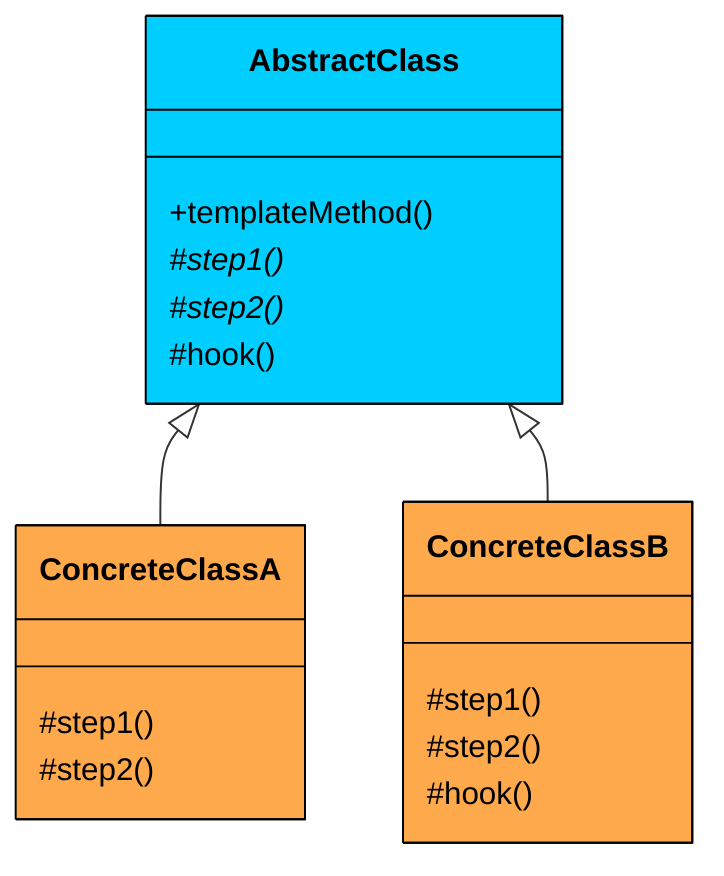
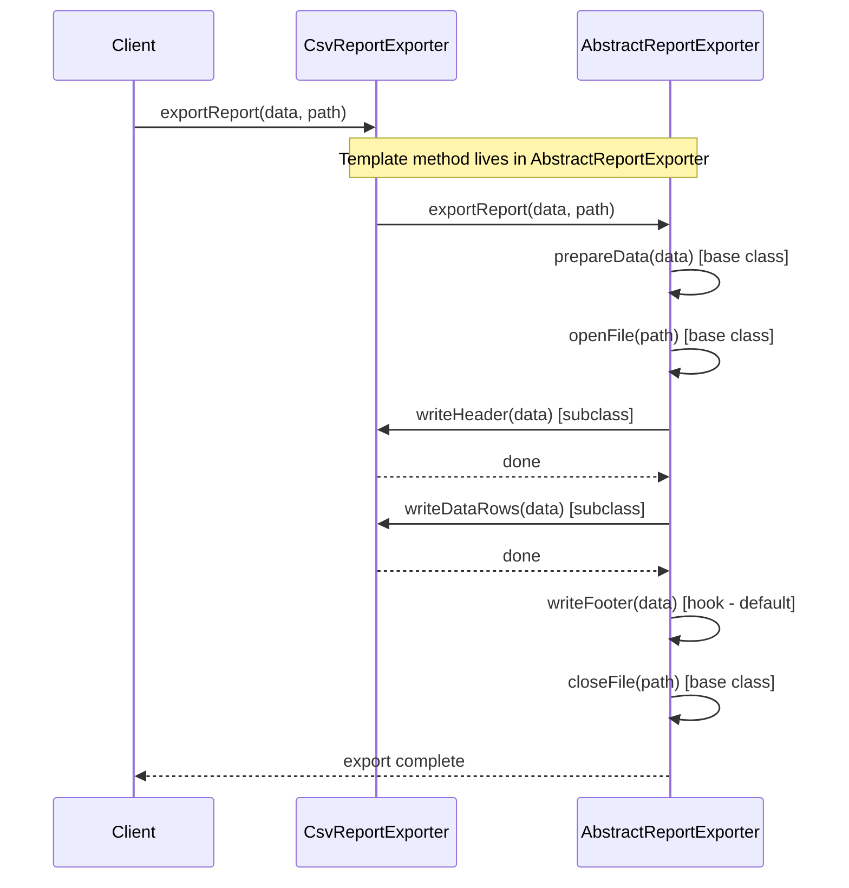
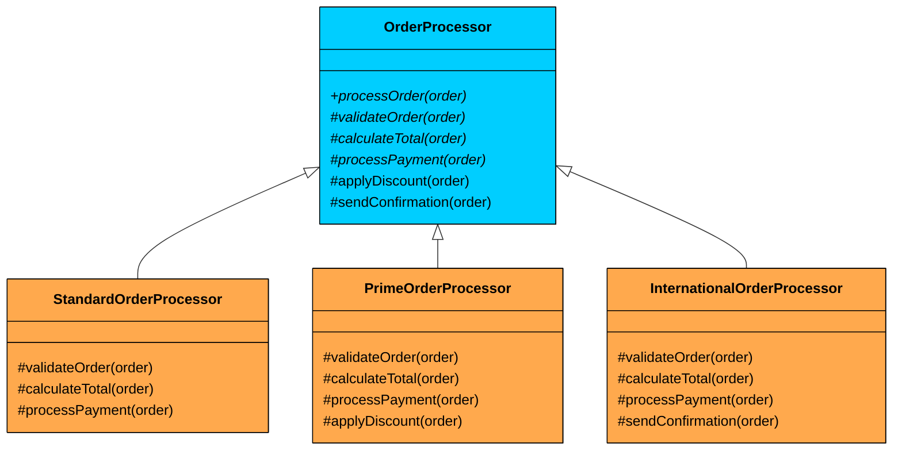

import React from 'react';
import CodeBlock from '../../../../components/ui/CodeBlock';
import Callout from '../../../../components/ui/Callout';

<div className="article-header">
  <div className="breadcrumb">
    <a href="/">Curated Notes</a>
    <span className="breadcrumb-separator">›</span>
    <span className="breadcrumb-current">Template Method Design Pattern</span>
  </div>
  <h1>Template Method Design Pattern</h1>
  <p style={{ color: 'var(--text-muted)', fontSize: '1.1rem', marginBottom: '16px', lineHeight: '1.6' }}>
    Master the essentials of Template Method Design Pattern in this curated guide.
  </p>
  <div className="meta-info">
    <span className="meta-item">
      <svg width="14" height="14" viewBox="0 0 24 24" fill="none" stroke="currentColor" strokeWidth="2"><circle cx="12" cy="12" r="10"/><polyline points="12 6 12 12 16 14"/></svg>
      10 min read
    </span>
    <span className="difficulty-badge difficulty-badge--intermediate">Intermediate</span>
  </div>
</div>

<section className="content-section">


&gt; **DEFINITION**
&gt;
&gt; The **Template Method Design Pattern** is a **behavioral design pattern** that defines the **skeleton of an algorithm** in a base class, but allows **subclasses to override specific steps** of the algorithm without changing its overall structure.


It’s particularly useful in situations where:

- You have a well-defined sequence of steps to perform a task.
- Some parts of the process are shared across all implementations.
- You want to allow subclasses to customize specific steps without rewriting the whole algorithm.

Let’s walk through a real-world example and see how we can apply the Template Method Pattern to build flexible, extensible, and reusable workflows.

---

## 1. The Problem: Exporting Reports

Let’s say you’re building an analytics platform that lets users export reports in different formats. Right now, the product needs CSV and PDF support, with Excel coming soon.

Each exporter follows the same high-level workflow:

1. **Prepare Data:** Gather and organize the report data.
2. **Open File:** Create the output file in the target format.
3. **Write Header:** Output column headers or metadata (format-specific).
4. **Write Data Rows:** Iterate through the dataset and write each row (format-specific).
5. **Write Footer:** Add optional summary or footer information.
6. **Close File:** Finalize and close the output file.

The workflow is the same across formats. Only the header writing and data row formatting differ. But if you implement each exporter independently, you end up duplicating the shared logic in every class.

#### Naive Approach

Here is what the code looks like when each exporter handles the entire workflow on its own:

#### ReportData


```java
class ReportData {
    public List<String> getHeaders() {
        return Arrays.asList("ID", "Name", "Value");
    }

    public List<Map<String, Object>> getRows() {
        return Arrays.asList(
            Map.of("ID", 1, "Name", "Item A", "Value", 100.0),
            Map.of("ID", 2, "Name", "Item B", "Value", 150.5),
            Map.of("ID", 3, "Name", "Item C", "Value", 75.25)
        );
    }
}
```

```python
class ReportData:
    def get_headers(self):
        return ["ID", "Name", "Value"]
    
    def get_rows(self):
        return [
            {"ID": 1, "Name": "Item A", "Value": 100.0},
            {"ID": 2, "Name": "Item B", "Value": 150.5},
            {"ID": 3, "Name": "Item C", "Value": 75.25}
        ]
```

```cpp
class ReportData {
public:
    vector<string> getHeaders() {
      vector<string> headers = {"ID", "Name", "Value"};
      return headers;
    }
    
    vector<map<string, string>> getRows() {
      vector<map<string, string>> rows;
      
      map<string, string> row1;
      row1["ID"] = "1";
      row1["Name"] = "Item A";
      row1["Value"] = "100.0";
      rows.push_back(row1);
      
      map<string, string> row2;
      row2["ID"] = "2";
      row2["Name"] = "Item B";
      row2["Value"] = "150.5";
      rows.push_back(row2);
      
      map<string, string> row3;
      row3["ID"] = "3";
      row3["Name"] = "Item C";
      row3["Value"] = "75.25";
      rows.push_back(row3);
      
      return rows;
    }
};
```

```go
type ReportData struct{}

func (r ReportData) GetHeaders() []string {
	return []string{"ID", "Name", "Value"}
}

func (r ReportData) GetRows() []map[string]interface{} {
	return []map[string]interface{}{
		{"ID": 1, "Name": "Item A", "Value": 100.0},
		{"ID": 2, "Name": "Item B", "Value": 150.5},
		{"ID": 3, "Name": "Item C", "Value": 75.25},
	}
}
```

```csharp
class ReportData
{
    public List<string> GetHeaders()
    {
        return new List<string> { "ID", "Name", "Value" };
    }

    public List<Dictionary<string, object>> GetRows()
    {
        return new List<Dictionary<string, object>>
        {
            new Dictionary<string, object> { { "ID", 1 }, { "Name", "Item A" }, { "Value", 100.0 } },
            new Dictionary<string, object> { { "ID", 2 }, { "Name", "Item B" }, { "Value", 150.5 } },
            new Dictionary<string, object> { { "ID", 3 }, { "Name", "Item C" }, { "Value", 75.25 } }
        };
    }
}
```

```typescript
class ReportData {
   getHeaders(): string[] {
       return ["ID", "Name", "Value"];
   }

   getRows(): Map<string, any>[] {
       return [
           new Map([["ID", 1], ["Name", "Item A"], ["Value", 100.0]]),
           new Map([["ID", 2], ["Name", "Item B"], ["Value", 150.5]]),
           new Map([["ID", 3], ["Name", "Item C"], ["Value", 75.25]])
       ];
   }
}
```


#### CsvReportExporterNaive


```java
class CsvReportExporterNaive {
    public void export(ReportData data, String filePath) {
        System.out.println("CSV Exporter: Preparing data (common)...");
        // ... data preparation logic ...

        System.out.println("CSV Exporter: Opening file '" + filePath + ".csv' (common)...");
        // ... file opening logic ...

        System.out.println("CSV Exporter: Writing CSV header (specific)...");
        // String.join(",", data.getHeaders());
        // ... write header to file ...

        System.out.println("CSV Exporter: Writing CSV data rows (specific)...");
        // for (Map<String, Object> row : data.getRows()) { ... format and write row ... }

        System.out.println("CSV Exporter: Writing CSV footer (if any) (common)...");

        System.out.println("CSV Exporter: Closing file '" + filePath + ".csv' (common)...");
        // ... file closing logic ...
        System.out.println("CSV Report exported to " + filePath + ".csv");
    }
}
```

```python
class CsvReportExporterNaive:
    def export(self, data, file_path):
        print("CSV Exporter: Preparing data (common)...")
        # ... data preparation logic ...

        print(f"CSV Exporter: Opening file '{file_path}.csv' (common)...")
        # ... file opening logic ...

        print("CSV Exporter: Writing CSV header (specific)...")
        # ",".join(data.get_headers())
        # ... write header to file ...

        print("CSV Exporter: Writing CSV data rows (specific)...")
        # for row in data.get_rows(): ... format and write row ...

        print("CSV Exporter: Writing CSV footer (if any) (common)...")

        print(f"CSV Exporter: Closing file '{file_path}.csv' (common)...")
        # ... file closing logic ...
        print(f"CSV Report exported to {file_path}.csv")
```

```cpp
class CsvReportExporterNaive {
public:
    void export(ReportData* data, string filePath) {
      cout << "CSV Exporter: Preparing data (common)..." << endl;
      // ... data preparation logic ...

      cout << "CSV Exporter: Opening file '" << filePath << ".csv' (common)..." << endl;
      // ... file opening logic ...

      cout << "CSV Exporter: Writing CSV header (specific)..." << endl;
      // string.join(",", data->getHeaders());
      // ... write header to file ...

      cout << "CSV Exporter: Writing CSV data rows (specific)..." << endl;
      // for (map<string, string> row : data->getRows()) { ... format and write row ... }

      cout << "CSV Exporter: Writing CSV footer (if any) (common)..." << endl;

      cout << "CSV Exporter: Closing file '" << filePath << ".csv' (common)..." << endl;
      // ... file closing logic ...
      cout << "CSV Report exported to " << filePath << ".csv" << endl;      
    }
};
```

```go
type CsvReportExporterNaive struct{}

func (c *CsvReportExporterNaive) Export(data ReportData, filePath string) {
	println("CSV Exporter: Preparing data (common)...")
	// ... data preparation logic ...

	println("CSV Exporter: Opening file '" + filePath + ".csv' (common)...")
	// ... file opening logic ...

	println("CSV Exporter: Writing CSV header (specific)...")
	// strings.Join(data.GetHeaders(), ",")
	// ... write header to file ...

	println("CSV Exporter: Writing CSV data rows (specific)...")
	// for _, row := range data.GetRows() { ... format and write row ... }

	println("CSV Exporter: Writing CSV footer (if any) (common)...")

	println("CSV Exporter: Closing file '" + filePath + ".csv' (common)...")
	// ... file closing logic ...
	println("CSV Report exported to " + filePath + ".csv")
}
```

```csharp
class CsvReportExporterNaive
{
    public void Export(ReportData data, string filePath)
    {
        Console.WriteLine("CSV Exporter: Preparing data (common)...");
        // ... data preparation logic ...

        Console.WriteLine("CSV Exporter: Opening file '" + filePath + ".csv' (common)...");
        // ... file opening logic ...

        Console.WriteLine("CSV Exporter: Writing CSV header (specific)...");
        // string.Join(",", data.GetHeaders());
        // ... write header to file ...

        Console.WriteLine("CSV Exporter: Writing CSV data rows (specific)...");
        // foreach (Dictionary<string, object> row in data.GetRows()) { ... format and write row ... }

        Console.WriteLine("CSV Exporter: Writing CSV footer (if any) (common)...");

        Console.WriteLine("CSV Exporter: Closing file '" + filePath + ".csv' (common)...");
        // ... file closing logic ...
        Console.WriteLine("CSV Report exported to " + filePath + ".csv");
    }
}
```

```typescript
class CsvReportExporterNaive {
   export(data: ReportData, filePath: string): void {
       console.log("CSV Exporter: Preparing data (common)...");
       // ... data preparation logic ...

       console.log("CSV Exporter: Opening file '" + filePath + ".csv' (common)...");
       // ... file opening logic ...

       console.log("CSV Exporter: Writing CSV header (specific)...");
       // data.getHeaders().join(",");
       // ... write header to file ...

       console.log("CSV Exporter: Writing CSV data rows (specific)...");
       // for (const row of data.getRows()) { ... format and write row ... }

       console.log("CSV Exporter: Writing CSV footer (if any) (common)...");

       console.log("CSV Exporter: Closing file '" + filePath + ".csv' (common)...");
       // ... file closing logic ...
       console.log("CSV Report exported to " + filePath + ".csv");
   }
}
```


#### PdfReportExporterNaive


```java
class PdfReportExporterNaive {
    public void export(ReportData data, String filePath) {
        System.out.println("PDF Exporter: Preparing data (common)...");
        // ... data preparation logic ...

        System.out.println("PDF Exporter: Opening file '" + filePath + ".pdf' (common)...");
        // ... PDF library specific file opening ...

        System.out.println("PDF Exporter: Writing PDF header (specific)...");
        // ... PDF library specific header writing ...

        System.out.println("PDF Exporter: Writing PDF data rows (specific)...");
        // ... PDF library specific data row writing ...

        System.out.println("PDF Exporter: Writing PDF footer (if any) (common)...");

        System.out.println("PDF Exporter: Closing file '" + filePath + ".pdf' (common)...");
        // ... PDF library specific file closing ...
        System.out.println("PDF Report exported to " + filePath + ".pdf");
    }
}
```

```python
class PdfReportExporterNaive:
    def export(self, data, file_path):
        print("PDF Exporter: Preparing data (common)...")
        # ... data preparation logic ...

        print(f"PDF Exporter: Opening file '{file_path}.pdf' (common)...")
        # ... PDF library specific file opening ...

        print("PDF Exporter: Writing PDF header (specific)...")
        # ... PDF library specific header writing ...

        print("PDF Exporter: Writing PDF data rows (specific)...")
        # ... PDF library specific data row writing ...

        print("PDF Exporter: Writing PDF footer (if any) (common)...")

        print(f"PDF Exporter: Closing file '{file_path}.pdf' (common)...")
        # ... PDF library specific file closing ...
        print(f"PDF Report exported to {file_path}.pdf")
```

```cpp
class PdfReportExporterNaive {
public:
    void export(ReportData* data, string filePath) {
      cout << "PDF Exporter: Preparing data (common)..." << endl;
      // ... data preparation logic ...

      cout << "PDF Exporter: Opening file '" << filePath << ".pdf' (common)..." << endl;
      // ... PDF library specific file opening ...

      cout << "PDF Exporter: Writing PDF header (specific)..." << endl;
      // ... PDF library specific header writing ...

      cout << "PDF Exporter: Writing PDF data rows (specific)..." << endl;
      // ... PDF library specific data row writing ...

      cout << "PDF Exporter: Writing PDF footer (if any) (common)..." << endl;

      cout << "PDF Exporter: Closing file '" << filePath << ".pdf' (common)..." << endl;
      // ... PDF library specific file closing ...
      cout << "PDF Report exported to " << filePath << ".pdf" << endl;      
    }
};
```

```go
type PdfReportExporterNaive struct{}

func (p *PdfReportExporterNaive) Export(data ReportData, filePath string) {
	fmt.Println("PDF Exporter: Preparing data (common)...")
	// ... data preparation logic ...

	fmt.Println("PDF Exporter: Opening file '" + filePath + ".pdf' (common)...")
	// ... PDF library specific file opening ...

	fmt.Println("PDF Exporter: Writing PDF header (specific)...")
	// ... PDF library specific header writing ...

	fmt.Println("PDF Exporter: Writing PDF data rows (specific)...")
	// ... PDF library specific data row writing ...

	fmt.Println("PDF Exporter: Writing PDF footer (if any) (common)...")

	fmt.Println("PDF Exporter: Closing file '" + filePath + ".pdf' (common)...")
	// ... PDF library specific file closing ...
	fmt.Println("PDF Report exported to " + filePath + ".pdf")
}
```

```csharp
class PdfReportExporterNaive
{
    public void Export(ReportData data, string filePath)
    {
        Console.WriteLine("PDF Exporter: Preparing data (common)...");
        // ... data preparation logic ...

        Console.WriteLine("PDF Exporter: Opening file '" + filePath + ".pdf' (common)...");
        // ... PDF library specific file opening ...

        Console.WriteLine("PDF Exporter: Writing PDF header (specific)...");
        // ... PDF library specific header writing ...

        Console.WriteLine("PDF Exporter: Writing PDF data rows (specific)...");
        // ... PDF library specific data row writing ...

        Console.WriteLine("PDF Exporter: Writing PDF footer (if any) (common)...");

        Console.WriteLine("PDF Exporter: Closing file '" + filePath + ".pdf' (common)...");
        // ... PDF library specific file closing ...
        Console.WriteLine("PDF Report exported to " + filePath + ".pdf");
    }
}
```

```typescript
class PdfReportExporterNaive {
   export(data: ReportData, filePath: string): void {
       console.log("PDF Exporter: Preparing data (common)...");
       // ... data preparation logic ...

       console.log("PDF Exporter: Opening file '" + filePath + ".pdf' (common)...");
       // ... PDF library specific file opening ...

       console.log("PDF Exporter: Writing PDF header (specific)...");
       // ... PDF library specific header writing ...

       console.log("PDF Exporter: Writing PDF data rows (specific)...");
       // ... PDF library specific data row writing ...

       console.log("PDF Exporter: Writing PDF footer (if any) (common)...");

       console.log("PDF Exporter: Closing file '" + filePath + ".pdf' (common)...");
       // ... PDF library specific file closing ...
       console.log("PDF Report exported to " + filePath + ".pdf");
   }
}
```


#### Client Code


```java
public class ReportAppNaive {
    public static void main(String[] args) {
        ReportData reportData = new ReportData();

        CsvReportExporterNaive csvExporter = new CsvReportExporterNaive();
        csvExporter.export(reportData, "sales_report");

        System.out.println();

        PdfReportExporterNaive pdfExporter = new PdfReportExporterNaive();
        pdfExporter.export(reportData, "financial_summary");
    }
}
```

```python
def main():
    report_data = ReportData()

    csv_exporter = CsvReportExporterNaive()
    csv_exporter.export(report_data, "sales_report")

    print()

    pdf_exporter = PdfReportExporterNaive()
    pdf_exporter.export(report_data, "financial_summary")
```

```cpp
int main() {
    ReportData* reportData = new ReportData();

    CsvReportExporterNaive* csvExporter = new CsvReportExporterNaive();
    csvExporter->export(reportData, "sales_report");

    cout << endl;

    PdfReportExporterNaive* pdfExporter = new PdfReportExporterNaive();
    pdfExporter->export(reportData, "financial_summary");

    delete reportData;
    delete csvExporter;
    delete pdfExporter;

    return 0;
}
```

```go
func main() {
	reportData := ReportData{}

	csvExporter := CsvReportExporterNaive{}
	csvExporter.export(reportData, "sales_report")

	fmt.Println()

	pdfExporter := PdfReportExporterNaive{}
	pdfExporter.export(reportData, "financial_summary")
}
```

```csharp
public class ReportAppNaive
{
    public static void Main(string[] args)
    {
        ReportData reportData = new ReportData();

        CsvReportExporterNaive csvExporter = new CsvReportExporterNaive();
        csvExporter.Export(reportData, "sales_report");

        Console.WriteLine();

        PdfReportExporterNaive pdfExporter = new PdfReportExporterNaive();
        pdfExporter.Export(reportData, "financial_summary");
    }
}
```

```typescript
class ReportAppNaive {
   static main(): void {
       const reportData = new ReportData();

       const csvExporter = new CsvReportExporterNaive();
       csvExporter.export(reportData, "sales_report");

       console.log();

       const pdfExporter = new PdfReportExporterNaive();
       pdfExporter.export(reportData, "financial_summary");
   }
}
```


#### What’s Wrong with This Design?

While this approach works for two exporters, it introduces several design problems that compound as the system grows:

#### Code Duplication

The same steps, preparing data, opening the file, closing the file, are repeated verbatim in every exporter class. Add an Excel exporter and you are copying the same boilerplate for the third time. Every line of duplicated code is a future bug waiting to happen.

#### Maintenance Overhead

If you need to add logging after each export, or change how files are opened (say, to add error handling or buffering), you have to make the same change in every exporter class. Miss one, and that format silently behaves differently. The more formats you add, the worse this gets.

#### Inconsistent Behavior

Since each exporter manages its own workflow, there is nothing stopping a developer from accidentally reordering steps, skipping the footer, or adding a step in one exporter but not another. The system drifts toward inconsistency over time.

#### Poor Extensibility

Adding a new export format means copying an entire class and modifying a few lines. This violates the DRY (Don't Repeat Yourself) principle and makes it unclear which parts of the code are shared logic and which parts are format-specific customization.

#### What We Really Need

- Define the common report export workflow **once**, in a single base class
- Allow subclasses to override **only** the format-specific steps (header writing, data formatting)
- **Enforce** a consistent step ordering so no exporter can accidentally skip or reorder steps
- Make adding a new format as simple as creating one new subclass with two or three method overrides

This is exactly what the **Template Method pattern** provides.

---

## 2. What is the Template Method Pattern

&gt; The Template Method pattern defines the skeleton of an algorithm in a method, deferring some steps to subclasses. It allows you to keep the 
&gt;
&gt; **overall structure of the process consistent**
&gt;
&gt; , while giving subclasses the flexibility to customize specific parts of the algorithm.

Two characteristics define the pattern:

1. **Algorithm skeleton in the base class:** The base class contains a method (the template method) that defines the sequence of steps. This method is typically marked `final` (Java/C#) or non-virtual (C++) so subclasses cannot alter the order or skip steps.
2. **Subclasses override specific steps:** The base class declares abstract methods for the steps that vary. Subclasses implement these methods to provide format-specific or context-specific behavior, but they never control when those methods are called.


&gt; **Real-World Analogy**
&gt;
&gt; Think of a base cake recipe as the *Template Method*.
&gt;
&gt; The recipe defines the overall flow, step by step:
&gt;
&gt; 1. **Preheat the oven** (common step)
&gt; 2. **Prepare the batter** (varies by cake type, such as chocolate or vanilla; abstract step)
&gt; 3. **Pour the batter into a pan** (common step)
&gt; 4. **Bake for X minutes** (common step; X can be a hook or configurable value)
&gt; 5. **Let the cake cool** (common step)
&gt; 6. **Frost the cake** (optional step; hook method)
&gt;
&gt; The key idea is that the **sequence is fixed** by the general recipe. Specific cake types (subclasses) only implement what differs, mainly how the batter is prepared, and they can optionally override the frosting step if they want a custom finish.


---

### Class Diagram





#### **AbstractClass (e.g., **`AbstractReportExporter`**)**

Contains the template method and defines the algorithm's skeleton. Declares abstract methods for the steps that must vary and provides default implementations for steps that can optionally vary.


&gt; **Key Design Decision**
&gt;
&gt; We use an abstract class rather than an interface because the base class needs to provide a concrete template method with real logic (the step ordering). An interface cannot contain a method that calls other methods in sequence while enforcing that sequence.
&gt;
&gt; This is one of the few patterns where inheritance is the right tool, not composition.


#### **Concrete Classes** (e.g., `CsvReportExporter`, `PdfReportExporter`)

Each concrete class extends the abstract class and provides implementations for the abstract steps. Optionally overrides hook methods to customize optional behavior.

#### Template Method

The method in the abstract class that defines the algorithm's skeleton. Mixes abstract method calls (subclass-provided) with concrete method calls (base-class-provided) and hook calls (optionally overridden).

#### Hooks

Concrete methods in the abstract class with a default implementation (often empty or trivial) that subclasses can optionally override. Provides extension points without forcing subclasses to implement them.

---

## 3. How It Works

The Template Method workflow follows a clear sequence:





**Step 1:** The client creates an instance of a concrete class (e.g., `CsvReportExporter`).

**Step 2:** The client calls the template method (e.g., `exportReport()`) on the concrete instance.

**Step 3:** The template method, defined in the abstract base class, begins executing. It calls the steps in the fixed order defined by the skeleton.

**Step 4:** For each abstract step, the call is dispatched to the concrete subclass's implementation (e.g., `writeHeader()` calls the CSV-specific version).

**Step 5:** For each hook, the base class's default runs unless the subclass has overridden it.

**Step 6:** The template method completes. The client gets a consistent result regardless of which concrete class was used.

---

## 4. Implementing Template Method

Let us refactor the report export system using the Template Method pattern. The goal is to extract the common workflow into a single base class and let each format-specific exporter override only the steps that differ.

#### Step 1: Create the Abstract Base Class

The abstract class contains the template method `exportReport()`, which defines the fixed sequence of steps. It provides default implementations for shared steps and declares abstract methods for format-specific steps. Hook methods (like `writeFooter()`) have a default that subclasses can optionally override.


```java
abstract class AbstractReportExporter {
    // Template method - defines the algorithm skeleton
    public final void exportReport(ReportData data, String filePath) {
        prepareData(data);
        openFile(filePath);
        writeHeader(data);
        writeDataRows(data);
        writeFooter(data);    // Hook - optional override
        closeFile(filePath);
        System.out.println("Export complete: " + filePath);
    }

    // Concrete method - shared across all subclasses
    protected void prepareData(ReportData data) {
        System.out.println("Preparing report data...");
    }

    // Concrete method - shared across all subclasses
    protected void openFile(String filePath) {
        System.out.println("Opening file: " + filePath);
    }

    // Abstract method - each subclass MUST implement
    protected abstract void writeHeader(ReportData data);

    // Abstract method - each subclass MUST implement
    protected abstract void writeDataRows(ReportData data);

    // Hook method - optional override with sensible default
    protected void writeFooter(ReportData data) {
        // Default: no footer. Subclasses can override if needed.
    }

    // Concrete method - shared across all subclasses
    protected void closeFile(String filePath) {
        System.out.println("Closing file: " + filePath);
    }
}
```

```python
from abc import ABC, abstractmethod

class AbstractReportExporter(ABC):
    # Template method - defines the algorithm skeleton
    def export_report(self, data, file_path):
        self.prepare_data(data)
        self.open_file(file_path)
        self.write_header(data)
        self.write_data_rows(data)
        self.write_footer(data)    # Hook - optional override
        self.close_file(file_path)
        print(f"Export complete: {file_path}")

    # Concrete method - shared across all subclasses
    def prepare_data(self, data):
        print("Preparing report data...")

    # Concrete method - shared across all subclasses
    def open_file(self, file_path):
        print(f"Opening file: {file_path}")

    # Abstract method - each subclass MUST implement
    @abstractmethod
    def write_header(self, data):
        pass

    # Abstract method - each subclass MUST implement
    @abstractmethod
    def write_data_rows(self, data):
        pass

    # Hook method - optional override with sensible default
    def write_footer(self, data):
        pass  # Default: no footer

    # Concrete method - shared across all subclasses
    def close_file(self, file_path):
        print(f"Closing file: {file_path}")
```

```cpp
class AbstractReportExporter {
public:
    virtual ~AbstractReportExporter() = default;

    // Template method - not virtual, subclasses cannot override
    void exportReport(ReportData* data, string filePath) {
        prepareData(data);
        openFile(filePath);
        writeHeader(data);
        writeDataRows(data);
        writeFooter(data);
        closeFile(filePath);
        cout << "Export complete: " << filePath << endl;
    }

protected:
	// Concrete method - shared across all subclasses
    virtual void prepareData(ReportData* data) {
        cout << "Preparing report data..." << endl;
    }

	// Concrete method - shared across all subclasses
    virtual void openFile(string filePath) {
        cout << "Opening file: " << filePath << endl;
    }

	// Abstract method - each subclass MUST implement
    virtual void writeHeader(ReportData* data) = 0;

	// Abstract method - each subclass MUST implement
    virtual void writeDataRows(ReportData* data) = 0;

    // Hook method - optional override
    virtual void writeFooter(ReportData* data) {
        // Default: no footer
    }

	// Concrete method - shared across all subclasses
    virtual void closeFile(string filePath) {
        cout << "Closing file: " << filePath << endl;
    }
};
```

```go
type AbstractReportExporter struct{}

// Template method - defines the algorithm skeleton
func (a *AbstractReportExporter) ExportReport(data ReportData, filePath string) {
	a.prepareData(data)
	a.openFile(filePath)
	a.writeHeader(data)
	a.writeDataRows(data)
	a.writeFooter(data) // Hook - optional override
	a.closeFile(filePath)
	fmt.Println("Export complete: " + filePath)
}

// Concrete method - shared across all subclasses
func (a *AbstractReportExporter) prepareData(data ReportData) {
	fmt.Println("Preparing report data...")
}

// Concrete method - shared across all subclasses
func (a *AbstractReportExporter) openFile(filePath string) {
	fmt.Println("Opening file: " + filePath)
}

// Abstract method - each subclass MUST implement
func (a *AbstractReportExporter) writeHeader(data ReportData) {
	panic("writeHeader must be implemented")
}

// Abstract method - each subclass MUST implement
func (a *AbstractReportExporter) writeDataRows(data ReportData) {
	panic("writeDataRows must be implemented")
}

// Hook method - optional override with sensible default
func (a *AbstractReportExporter) writeFooter(data ReportData) {
	// Default: no footer. Subclasses can override if needed.
}

// Concrete method - shared across all subclasses
func (a *AbstractReportExporter) closeFile(filePath string) {
	fmt.Println("Closing file: " + filePath)
}
```

```csharp
abstract class AbstractReportExporter
{
    // Template method - sealed so subclasses cannot override
    public void ExportReport(ReportData data, string filePath)
    {
        PrepareData(data);
        OpenFile(filePath);
        WriteHeader(data);
        WriteDataRows(data);
        WriteFooter(data);
        CloseFile(filePath);
        Console.WriteLine("Export complete: " + filePath);
    }

	// Concrete method - shared across all subclasses
    protected virtual void PrepareData(ReportData data)
    {
        Console.WriteLine("Preparing report data...");
    }

	// Concrete method - shared across all subclasses
    protected virtual void OpenFile(string filePath)
    {
        Console.WriteLine("Opening file: " + filePath);
    }

	// Abstract method - each subclass MUST implement
    protected abstract void WriteHeader(ReportData data);

	// Abstract method - each subclass MUST implement
    protected abstract void WriteDataRows(ReportData data);

    // Hook method - optional override
    protected virtual void WriteFooter(ReportData data)
    {
        // Default: no footer
    }

	// Concrete method - shared across all subclasses
    protected virtual void CloseFile(string filePath)
    {
        Console.WriteLine("Closing file: " + filePath);
    }
}
```

```typescript
abstract class AbstractReportExporter {
    // Template method - should not be overridden
    public exportReport(data: ReportData, filePath: string): void {
        this.prepareData(data);
        this.openFile(filePath);
        this.writeHeader(data);
        this.writeDataRows(data);
        this.writeFooter(data);
        this.closeFile(filePath);
        console.log("Export complete: " + filePath);
    }

	// Concrete method - shared across all subclasses
    protected prepareData(data: ReportData): void {
        console.log("Preparing report data...");
    }

	// Concrete method - shared across all subclasses
    protected openFile(filePath: string): void {
        console.log("Opening file: " + filePath);
    }

	// Abstract method - each subclass MUST implement
    protected abstract writeHeader(data: ReportData): void;

	// Abstract method - each subclass MUST implement
    protected abstract writeDataRows(data: ReportData): void;

    // Hook method - optional override
    protected writeFooter(data: ReportData): void {
        // Default: no footer
    }

	// Concrete method - shared across all subclasses
    protected closeFile(filePath: string): void {
        console.log("Closing file: " + filePath);
    }
}
```


#### Step 2: Implement Concrete Exporters

Each concrete class will extend `AbstractReportExporter` and implement the format-specific steps.

#### **CSV Exporter**

The CSV exporter extends the abstract class and provides CSV-specific implementations for the two abstract methods. It does not override the hook because CSV reports do not need a footer.


```java
class CsvReportExporter extends AbstractReportExporter {
    @Override
    protected void writeHeader(ReportData data) {
        System.out.println("CSV: " + String.join(",", data.getHeaders()));
    }

    @Override
    protected void writeDataRows(ReportData data) {
        for (Map<String, Object> row : data.getRows()) {
            StringBuilder sb = new StringBuilder();
            for (String header : data.getHeaders()) {
                if (sb.length() > 0) sb.append(",");
                sb.append(row.get(header));
            }
            System.out.println("CSV: " + sb);
        }
    }
}
```

```python
class CsvReportExporter(AbstractReportExporter):
    def write_header(self, data):
        print("CSV: " + ",".join(data.get_headers()))

    def write_data_rows(self, data):
        for row in data.get_rows():
            values = [str(row[h]) for h in data.get_headers()]
            print("CSV: " + ",".join(values))
```

```cpp
class CsvReportExporter : public AbstractReportExporter {
protected:
    void writeHeader(ReportData* data) override {
        auto headers = data->getHeaders();
        cout << "CSV: ";
        for (size_t i = 0; i < headers.size(); i++) {
            cout << headers[i];
            if (i < headers.size() - 1) cout << ",";
        }
        cout << endl;
    }

    void writeDataRows(ReportData* data) override {
        auto headers = data->getHeaders();
        for (auto& row : data->getRows()) {
            cout << "CSV: ";
            for (size_t i = 0; i < headers.size(); i++) {
                cout << row[headers[i]];
                if (i < headers.size() - 1) cout << ",";
            }
            cout << endl;
        }
    }
};
```

```go
type CsvReportExporter struct {
	AbstractReportExporter
}

func (c *CsvReportExporter) writeHeader(data ReportData) {
	fmt.Println("CSV: " + strings.Join(data.GetHeaders(), ","))
}

func (c *CsvReportExporter) writeDataRows(data ReportData) {
	for _, row := range data.GetRows() {
		values := make([]string, 0, len(data.GetHeaders()))
		for _, h := range data.GetHeaders() {
			values = append(values, fmt.Sprint(row[h]))
		}
		fmt.Println("CSV: " + strings.Join(values, ","))
	}
}
```

```csharp
class CsvReportExporter : AbstractReportExporter
{
    protected override void WriteHeader(ReportData data)
    {
        Console.WriteLine("CSV: " + string.Join(",", data.GetHeaders()));
    }

    protected override void WriteDataRows(ReportData data)
    {
        foreach (var row in data.GetRows())
        {
            var values = data.GetHeaders().Select(h => row[h].ToString());
            Console.WriteLine("CSV: " + string.Join(",", values));
        }
    }
}
```

```typescript
class CsvReportExporter extends AbstractReportExporter {
    protected writeHeader(data: ReportData): void {
        console.log("CSV: " + data.getHeaders().join(","));
    }

    protected writeDataRows(data: ReportData): void {
        const headers = data.getHeaders();
        for (const row of data.getRows()) {
            const values = headers.map(h => row.get(h));
            console.log("CSV: " + values.join(","));
        }
    }
}
```


The CSV exporter is clean and focused. It only implements the two methods that are specific to CSV formatting. Everything else, the workflow, the data preparation, the file handling, is inherited from the base class.

#### **Pdf Exporter**

The PDF exporter also extends the abstract class but provides different formatting. It overrides the `writeFooter` hook to add page numbers, something CSV does not need.


```java
class PdfReportExporter extends AbstractReportExporter {
    @Override
    protected void writeHeader(ReportData data) {
        System.out.println("PDF: | " + String.join(" | ", data.getHeaders()) + " |");
        System.out.println("PDF: " + "-".repeat(40));
    }

    @Override
    protected void writeDataRows(ReportData data) {
        for (Map<String, Object> row : data.getRows()) {
            StringBuilder sb = new StringBuilder("PDF: | ");
            for (String header : data.getHeaders()) {
                sb.append(row.get(header)).append(" | ");
            }
            System.out.println(sb);
        }
    }

    @Override
    protected void writeFooter(ReportData data) {
        System.out.println("PDF: --- Page 1 of 1 ---");
    }
}
```

```python
class PdfReportExporter(AbstractReportExporter):
    def write_header(self, data):
        print("PDF: | " + " | ".join(data.get_headers()) + " |")
        print("PDF: " + "-" * 40)

    def write_data_rows(self, data):
        for row in data.get_rows():
            values = [str(row[h]) for h in data.get_headers()]
            print("PDF: | " + " | ".join(values) + " |")

    def write_footer(self, data):
        print("PDF: --- Page 1 of 1 ---")
```

```cpp
class PdfReportExporter : public AbstractReportExporter {
protected:
    void writeHeader(ReportData* data) override {
        auto headers = data->getHeaders();
        cout << "PDF: | ";
        for (auto& h : headers) cout << h << " | ";
        cout << endl;
        cout << "PDF: " << string(40, '-') << endl;
    }

    void writeDataRows(ReportData* data) override {
        auto headers = data->getHeaders();
        for (auto& row : data->getRows()) {
            cout << "PDF: | ";
            for (auto& h : headers) cout << row[h] << " | ";
            cout << endl;
        }
    }

    void writeFooter(ReportData* data) override {
        cout << "PDF: --- Page 1 of 1 ---" << endl;
    }
};
```

```go
type PdfReportExporter struct {
	AbstractReportExporter
}

func (p *PdfReportExporter) writeHeader(data ReportData) {
	fmt.Println("PDF: | " + strings.Join(data.GetHeaders(), " | ") + " |")
	fmt.Println("PDF: " + strings.Repeat("-", 40))
}

func (p *PdfReportExporter) writeDataRows(data ReportData) {
	for _, row := range data.GetRows() {
		values := make([]string, 0, len(data.GetHeaders()))
		for _, h := range data.GetHeaders() {
			values = append(values, fmt.Sprint(row[h]))
		}
		fmt.Println("PDF: | " + strings.Join(values, " | ") + " |")
	}
}

func (p *PdfReportExporter) writeFooter(data ReportData) {
	fmt.Println("PDF: --- Page 1 of 1 ---")
}
```

```csharp
class PdfReportExporter : AbstractReportExporter
{
    protected override void WriteHeader(ReportData data)
    {
        Console.WriteLine("PDF: | " + string.Join(" | ", data.GetHeaders()) + " |");
        Console.WriteLine("PDF: " + new string('-', 40));
    }

    protected override void WriteDataRows(ReportData data)
    {
        foreach (var row in data.GetRows())
        {
            var values = data.GetHeaders().Select(h => row[h].ToString());
            Console.WriteLine("PDF: | " + string.Join(" | ", values) + " |");
        }
    }

    protected override void WriteFooter(ReportData data)
    {
        Console.WriteLine("PDF: --- Page 1 of 1 ---");
    }
}
```

```typescript
class PdfReportExporter extends AbstractReportExporter {
    protected writeHeader(data: ReportData): void {
        console.log("PDF: | " + data.getHeaders().join(" | ") + " |");
        console.log("PDF: " + "-".repeat(40));
    }

    protected writeDataRows(data: ReportData): void {
        const headers = data.getHeaders();
        for (const row of data.getRows()) {
            const values = headers.map(h => row.get(h));
            console.log("PDF: | " + values.join(" | ") + " |");
        }
    }

    protected writeFooter(data: ReportData): void {
        console.log("PDF: --- Page 1 of 1 ---");
    }
}
```


Notice how the PDF exporter overrides the `writeFooter` hook to add page numbering. The CSV exporter did not override it, so it gets the empty default. This is the power of hooks: they let subclasses opt into additional behavior without forcing every subclass to deal with it.

#### Step 3: Client Code

The client creates the appropriate exporter and calls `exportReport()`. It does not know or care about the internal steps.


```java
public class ReportApp {
    public static void main(String[] args) {
        ReportData data = new ReportData();

        AbstractReportExporter csvExporter = new CsvReportExporter();
        csvExporter.exportReport(data, "sales_report.csv");

        System.out.println();

        AbstractReportExporter pdfExporter = new PdfReportExporter();
        pdfExporter.exportReport(data, "sales_report.pdf");
    }
}
```

```python
def main():
    data = ReportData()

    csv_exporter = CsvReportExporter()
    csv_exporter.export_report(data, "sales_report.csv")

    print()

    pdf_exporter = PdfReportExporter()
    pdf_exporter.export_report(data, "sales_report.pdf")

if __name__ == "__main__":
    main()
```

```cpp
int main() {
    ReportData data;

    CsvReportExporter csvExporter;
    csvExporter.exportReport(&data, "sales_report.csv");

    cout << endl;

    PdfReportExporter pdfExporter;
    pdfExporter.exportReport(&data, "sales_report.pdf");

    return 0;
}
```

```go
func main() {
	data := ReportData{}

	csvExporter := CsvReportExporter{}
	csvExporter.exportReport(&data, "sales_report.csv")

	println()

	pdfExporter := PdfReportExporter{}
	pdfExporter.exportReport(&data, "sales_report.pdf")
}
```

```csharp
class Program
{
    static void Main(string[] args)
    {
        var data = new ReportData();

        AbstractReportExporter csvExporter = new CsvReportExporter();
        csvExporter.ExportReport(data, "sales_report.csv");

        Console.WriteLine();

        AbstractReportExporter pdfExporter = new PdfReportExporter();
        pdfExporter.ExportReport(data, "sales_report.pdf");
    }
}
```

```typescript
const data = new ReportData();

const csvExporter: AbstractReportExporter = new CsvReportExporter();
csvExporter.exportReport(data, "sales_report.csv");

console.log();

const pdfExporter: AbstractReportExporter = new PdfReportExporter();
pdfExporter.exportReport(data, "sales_report.pdf");
```


#### Expected Output:


```plaintext
Preparing report data...
Opening file: sales_report.csv
CSV: ID,Name,Value
CSV: 1,Item A,100.0
CSV: 2,Item B,150.5
CSV: 3,Item C,75.25
Closing file: sales_report.csv
Export complete: sales_report.csv

Preparing report data...
Opening file: sales_report.pdf
PDF: | ID | Name | Value |
PDF: ----------------------------------------
PDF: | 1 | Item A | 100.0 |
PDF: | 2 | Item B | 150.5 |
PDF: | 3 | Item C | 75.25 |
PDF: --- Page 1 of 1 ---
Closing file: sales_report.pdf
Export complete: sales_report.pdf
```


By applying the Template Method pattern, we have:

- **Eliminated code duplication** by moving the shared workflow into a single base class
- **Enforced consistency** across all exporters by locking the step order in the template method
- **Made the system extensible**, adding a new format only requires creating a new subclass
- **Improved maintainability**, changes to shared logic happen in one place
- **Provided clear extension points** through abstract methods (required) and hooks (optional)

---

## 5. Evolving the System: Adding an Excel Exporter

The real test of any design pattern is what happens when requirements change. The PM now wants Excel export support. With the Template Method pattern in place, this means creating one new subclass. No changes to the base class, no changes to the existing CSV or PDF exporters.


```java
class ExcelReportExporter extends AbstractReportExporter {
    @Override
    protected void writeHeader(ReportData data) {
        System.out.println("Excel: [Sheet1] Row 1: " + data.getHeaders());
    }

    @Override
    protected void writeDataRows(ReportData data) {
        int rowNum = 2;
        for (Map<String, Object> row : data.getRows()) {
            System.out.println("Excel: [Sheet1] Row " + rowNum + ": " + row.values());
            rowNum++;
        }
    }

    @Override
    protected void writeFooter(ReportData data) {
        System.out.println("Excel: [Sheet1] Auto-fit columns, apply borders");
    }
}
```

```python
class ExcelReportExporter(AbstractReportExporter):
    def write_header(self, data):
        print("Excel: [Sheet1] Row 1: " + str(data.get_headers()))

    def write_data_rows(self, data):
        for i, row in enumerate(data.get_rows(), start=2):
            print(f"Excel: [Sheet1] Row {i}: {list(row.values())}")

    def write_footer(self, data):
        print("Excel: [Sheet1] Auto-fit columns, apply borders")
```

```cpp
class ExcelReportExporter : public AbstractReportExporter {
protected:
    void writeHeader(ReportData* data) override {
        cout << "Excel: [Sheet1] Row 1: ";
        for (auto& h : data->getHeaders()) cout << h << " ";
        cout << endl;
    }

    void writeDataRows(ReportData* data) override {
        int rowNum = 2;
        for (auto& row : data->getRows()) {
            cout << "Excel: [Sheet1] Row " << rowNum << ": ";
            for (auto& pair : row) cout << pair.second << " ";
            cout << endl;
            rowNum++;
        }
    }

    void writeFooter(ReportData* data) override {
        cout << "Excel: [Sheet1] Auto-fit columns, apply borders" << endl;
    }
};
```

```go
type ExcelReportExporter struct {
	AbstractReportExporter
}

func (e *ExcelReportExporter) WriteHeader(data ReportData) {
	fmt.Println("Excel: [Sheet1] Row 1: " + fmt.Sprint(data.GetHeaders()))
}

func (e *ExcelReportExporter) WriteDataRows(data ReportData) {
	rowNum := 2
	for _, row := range data.GetRows() {
		fmt.Println("Excel: [Sheet1] Row ", rowNum, ": ", fmt.Sprint(row.Values()))
		rowNum++
	}
}

func (e *ExcelReportExporter) WriteFooter(data ReportData) {
	fmt.Println("Excel: [Sheet1] Auto-fit columns, apply borders")
}
```

```csharp
class ExcelReportExporter : AbstractReportExporter
{
    protected override void WriteHeader(ReportData data)
    {
        Console.WriteLine("Excel: [Sheet1] Row 1: " +
            string.Join(", ", data.GetHeaders()));
    }

    protected override void WriteDataRows(ReportData data)
    {
        int rowNum = 2;
        foreach (var row in data.GetRows())
        {
            Console.WriteLine($"Excel: [Sheet1] Row {rowNum}: " +
                string.Join(", ", row.Values));
            rowNum++;
        }
    }

    protected override void WriteFooter(ReportData data)
    {
        Console.WriteLine("Excel: [Sheet1] Auto-fit columns, apply borders");
    }
}
```

```typescript
class ExcelReportExporter extends AbstractReportExporter {
    protected writeHeader(data: ReportData): void {
        console.log("Excel: [Sheet1] Row 1: " + data.getHeaders());
    }

    protected writeDataRows(data: ReportData): void {
        const rows = data.getRows();
        for (let i = 0; i < rows.length; i++) {
            console.log(`Excel: [Sheet1] Row ${i + 2}: ${Array.from(rows[i].values())}`);
        }
    }

    protected writeFooter(data: ReportData): void {
        console.log("Excel: [Sheet1] Auto-fit columns, apply borders");
    }
}
```


That is the entire change. One new class, three method overrides, zero modifications to existing code. The `AbstractReportExporter` base class is untouched. The `CsvReportExporter` and `PdfReportExporter` are untouched. This is the Open/Closed Principle at work: open for extension (new subclasses), closed for modification (existing code does not change).

---

## 6. Practical Example: Online Order Processing

Let us work through a second example to reinforce the pattern. This time, we are building an order processing pipeline for an e-commerce platform. Every order goes through the same sequence of steps: validate the order, calculate the total, process the payment, and send a confirmation. 

But the details differ based on the order type: standard orders, Prime orders (free shipping, priority processing), and international orders (customs handling, currency conversion).





#### Implementation


```java
class Order {
    private String id;
    private double subtotal;

    public Order(String id, double subtotal) {
        this.id = id;
        this.subtotal = subtotal;
    }

    public String getId() { return id; }
    public double getSubtotal() { return subtotal; }
}

abstract class OrderProcessor {
    public final void processOrder(Order order) {
        validateOrder(order);
        calculateTotal(order);
        applyDiscount(order);       // Hook
        processPayment(order);
        sendConfirmation(order);    // Hook
        System.out.println("Order processing complete: " + order.getId());
    }

    protected abstract void validateOrder(Order order);
    protected abstract void calculateTotal(Order order);
    protected abstract void processPayment(Order order);

    // Hook - default: no discount
    protected void applyDiscount(Order order) {}

    // Hook - default confirmation
    protected void sendConfirmation(Order order) {
        System.out.println("Sending email confirmation for order " + order.getId());
    }
}

class StandardOrderProcessor extends OrderProcessor {
    @Override
    protected void validateOrder(Order order) {
        System.out.println("Validating standard order: checking stock and address...");
    }

    @Override
    protected void calculateTotal(Order order) {
        double shipping = 5.99;
        double total = order.getSubtotal() + shipping;
        System.out.println("Standard total: $" + total + " (including $" + shipping + " shipping)");
    }

    @Override
    protected void processPayment(Order order) {
        System.out.println("Processing payment via standard gateway...");
    }
}

class PrimeOrderProcessor extends OrderProcessor {
    @Override
    protected void validateOrder(Order order) {
        System.out.println("Validating Prime order: checking membership and stock...");
    }

    @Override
    protected void calculateTotal(Order order) {
        System.out.println("Prime total: $" + order.getSubtotal() + " (free shipping)");
    }

    @Override
    protected void processPayment(Order order) {
        System.out.println("Processing payment via Prime billing...");
    }

    @Override
    protected void applyDiscount(Order order) {
        System.out.println("Applying 10% Prime member discount...");
    }
}

class InternationalOrderProcessor extends OrderProcessor {
    @Override
    protected void validateOrder(Order order) {
        System.out.println("Validating international order: customs, restricted items, address format...");
    }

    @Override
    protected void calculateTotal(Order order) {
        double shipping = 24.99;
        double customs = order.getSubtotal() * 0.15;
        double total = order.getSubtotal() + shipping + customs;
        System.out.println("International total: $" + total
            + " (shipping: $" + shipping + ", customs: $" + customs + ")");
    }

    @Override
    protected void processPayment(Order order) {
        System.out.println("Processing payment with currency conversion...");
    }

    @Override
    protected void sendConfirmation(Order order) {
        System.out.println("Sending multi-language confirmation with tracking for order " + order.getId());
    }
}

public class OrderApp {
    public static void main(String[] args) {
        Order order1 = new Order("ORD-001", 49.99);
        Order order2 = new Order("ORD-002", 149.99);
        Order order3 = new Order("ORD-003", 89.99);

        OrderProcessor standard = new StandardOrderProcessor();
        standard.processOrder(order1);

        System.out.println();

        OrderProcessor prime = new PrimeOrderProcessor();
        prime.processOrder(order2);

        System.out.println();

        OrderProcessor international = new InternationalOrderProcessor();
        international.processOrder(order3);
    }
}
```

```python
from abc import ABC, abstractmethod

class Order:
    def __init__(self, id, subtotal):
        self.id = id
        self.subtotal = subtotal

class OrderProcessor(ABC):
    def process_order(self, order):
        self.validate_order(order)
        self.calculate_total(order)
        self.apply_discount(order)
        self.process_payment(order)
        self.send_confirmation(order)
        print(f"Order processing complete: {order.id}")

    @abstractmethod
    def validate_order(self, order):
        pass

    @abstractmethod
    def calculate_total(self, order):
        pass

    @abstractmethod
    def process_payment(self, order):
        pass

    def apply_discount(self, order):
        pass  # Hook: no discount by default

    def send_confirmation(self, order):
        print(f"Sending email confirmation for order {order.id}")

class StandardOrderProcessor(OrderProcessor):
    def validate_order(self, order):
        print("Validating standard order: checking stock and address...")

    def calculate_total(self, order):
        shipping = 5.99
        total = order.subtotal + shipping
        print(f"Standard total: ${total} (including ${shipping} shipping)")

    def process_payment(self, order):
        print("Processing payment via standard gateway...")

class PrimeOrderProcessor(OrderProcessor):
    def validate_order(self, order):
        print("Validating Prime order: checking membership and stock...")

    def calculate_total(self, order):
        print(f"Prime total: ${order.subtotal} (free shipping)")

    def process_payment(self, order):
        print("Processing payment via Prime billing...")

    def apply_discount(self, order):
        print("Applying 10% Prime member discount...")

class InternationalOrderProcessor(OrderProcessor):
    def validate_order(self, order):
        print("Validating international order: customs, restricted items, address format...")

    def calculate_total(self, order):
        shipping = 24.99
        customs = order.subtotal * 0.15
        total = order.subtotal + shipping + customs
        print(f"International total: ${total} (shipping: ${shipping}, customs: ${customs})")

    def process_payment(self, order):
        print("Processing payment with currency conversion...")

    def send_confirmation(self, order):
        print(f"Sending multi-language confirmation with tracking for order {order.id}")

if __name__ == "__main__":
    order1 = Order("ORD-001", 49.99)
    order2 = Order("ORD-002", 149.99)
    order3 = Order("ORD-003", 89.99)

    standard = StandardOrderProcessor()
    standard.process_order(order1)

    print()

    prime = PrimeOrderProcessor()
    prime.process_order(order2)

    print()

    international = InternationalOrderProcessor()
    international.process_order(order3)
```

```cpp
#include <iostream>
#include <string>
using namespace std;

class Order {
    string id;
    double subtotal;
public:
    Order(string id, double subtotal) : id(id), subtotal(subtotal) {}
    string getId() { return id; }
    double getSubtotal() { return subtotal; }
};

class OrderProcessor {
public:
    virtual ~OrderProcessor() = default;

    void processOrder(Order* order) {
        validateOrder(order);
        calculateTotal(order);
        applyDiscount(order);
        processPayment(order);
        sendConfirmation(order);
        cout << "Order processing complete: " << order->getId() << endl;
    }

protected:
    virtual void validateOrder(Order* order) = 0;
    virtual void calculateTotal(Order* order) = 0;
    virtual void processPayment(Order* order) = 0;

    virtual void applyDiscount(Order* order) {}

    virtual void sendConfirmation(Order* order) {
        cout << "Sending email confirmation for order " << order->getId() << endl;
    }
};

class StandardOrderProcessor : public OrderProcessor {
protected:
    void validateOrder(Order* order) override {
        cout << "Validating standard order: checking stock and address..." << endl;
    }

    void calculateTotal(Order* order) override {
        double shipping = 5.99;
        double total = order->getSubtotal() + shipping;
        cout << "Standard total: $" << total << " (including $" << shipping << " shipping)" << endl;
    }

    void processPayment(Order* order) override {
        cout << "Processing payment via standard gateway..." << endl;
    }
};

class PrimeOrderProcessor : public OrderProcessor {
protected:
    void validateOrder(Order* order) override {
        cout << "Validating Prime order: checking membership and stock..." << endl;
    }

    void calculateTotal(Order* order) override {
        cout << "Prime total: $" << order->getSubtotal() << " (free shipping)" << endl;
    }

    void processPayment(Order* order) override {
        cout << "Processing payment via Prime billing..." << endl;
    }

    void applyDiscount(Order* order) override {
        cout << "Applying 10% Prime member discount..." << endl;
    }
};

class InternationalOrderProcessor : public OrderProcessor {
protected:
    void validateOrder(Order* order) override {
        cout << "Validating international order: customs, restricted items, address format..." << endl;
    }

    void calculateTotal(Order* order) override {
        double shipping = 24.99;
        double customs = order->getSubtotal() * 0.15;
        double total = order->getSubtotal() + shipping + customs;
        cout << "International total: $" << total
             << " (shipping: $" << shipping << ", customs: $" << customs << ")" << endl;
    }

    void processPayment(Order* order) override {
        cout << "Processing payment with currency conversion..." << endl;
    }

    void sendConfirmation(Order* order) override {
        cout << "Sending multi-language confirmation with tracking for order "
             << order->getId() << endl;
    }
};

int main() {
    Order order1("ORD-001", 49.99);
    Order order2("ORD-002", 149.99);
    Order order3("ORD-003", 89.99);

    StandardOrderProcessor standard;
    standard.processOrder(&order1);

    cout << endl;

    PrimeOrderProcessor prime;
    prime.processOrder(&order2);

    cout << endl;

    InternationalOrderProcessor international;
    international.processOrder(&order3);

    return 0;
}
```

```go
package main

import "fmt"

type Order struct {
	id       string
	subtotal float64
}

func NewOrder(id string, subtotal float64) Order {
	return Order{id: id, subtotal: subtotal}
}

type OrderProcessor interface {
	validateOrder(order Order)
	calculateTotal(order Order)
	processPayment(order Order)
	applyDiscount(order Order)
	sendConfirmation(order Order)
}

func ProcessOrder(processor OrderProcessor, order Order) {
	processor.validateOrder(order)
	processor.calculateTotal(order)
	processor.applyDiscount(order)
	processor.processPayment(order)
	processor.sendConfirmation(order)

	fmt.Println("Order processing complete: " + order.id)
}

// Standard Order Processor

type StandardOrderProcessor struct{}

func (s *StandardOrderProcessor) validateOrder(order Order) {
	fmt.Println("Validating standard order: checking stock and address...")
}

func (s *StandardOrderProcessor) calculateTotal(order Order) {
	shipping := 5.99
	total := order.subtotal + shipping
	fmt.Printf("Standard total: $%.2f (including $%.2f shipping)\n", total, shipping)
}

func (s *StandardOrderProcessor) processPayment(order Order) {
	fmt.Println("Processing payment via standard gateway...")
}

func (s *StandardOrderProcessor) applyDiscount(order Order) {}

func (s *StandardOrderProcessor) sendConfirmation(order Order) {
	fmt.Println("Sending email confirmation for order " + order.id)
}

// Prime Order Processor

type PrimeOrderProcessor struct{}

func (p *PrimeOrderProcessor) validateOrder(order Order) {
	fmt.Println("Validating Prime order: checking membership and stock...")
}

func (p *PrimeOrderProcessor) calculateTotal(order Order) {
	fmt.Printf("Prime total: $%.2f (free shipping)\n", order.subtotal)
}

func (p *PrimeOrderProcessor) processPayment(order Order) {
	fmt.Println("Processing payment via Prime billing...")
}

func (p *PrimeOrderProcessor) applyDiscount(order Order) {
	fmt.Println("Applying 10% Prime member discount...")
}

func (p *PrimeOrderProcessor) sendConfirmation(order Order) {
	fmt.Println("Sending email confirmation for order " + order.id)
}

// International Order Processor

type InternationalOrderProcessor struct{}

func (i *InternationalOrderProcessor) validateOrder(order Order) {
	fmt.Println("Validating international order: customs, restricted items, address format...")
}

func (i *InternationalOrderProcessor) calculateTotal(order Order) {
	shipping := 24.99
	customs := order.subtotal * 0.15
	total := order.subtotal + shipping + customs

	fmt.Printf(
		"International total: $%.2f (shipping: $%.2f, customs: $%.2f)\n",
		total,
		shipping,
		customs,
	)
}

func (i *InternationalOrderProcessor) processPayment(order Order) {
	fmt.Println("Processing payment with currency conversion...")
}

func (i *InternationalOrderProcessor) applyDiscount(order Order) {}

func (i *InternationalOrderProcessor) sendConfirmation(order Order) {
	fmt.Println("Sending multi-language confirmation with tracking for order " + order.id)
}

func main() {
	order1 := NewOrder("ORD-001", 49.99)
	order2 := NewOrder("ORD-002", 149.99)
	order3 := NewOrder("ORD-003", 89.99)

	standard := &StandardOrderProcessor{}
	ProcessOrder(standard, order1)

	fmt.Println()

	prime := &PrimeOrderProcessor{}
	ProcessOrder(prime, order2)

	fmt.Println()

	international := &InternationalOrderProcessor{}
	ProcessOrder(international, order3)
}
```

```csharp
using System;

class Order
{
    public string Id { get; }
    public double Subtotal { get; }

    public Order(string id, double subtotal)
    {
        Id = id;
        Subtotal = subtotal;
    }
}

abstract class OrderProcessor
{
    public void ProcessOrder(Order order)
    {
        ValidateOrder(order);
        CalculateTotal(order);
        ApplyDiscount(order);
        ProcessPayment(order);
        SendConfirmation(order);
        Console.WriteLine("Order processing complete: " + order.Id);
    }

    protected abstract void ValidateOrder(Order order);
    protected abstract void CalculateTotal(Order order);
    protected abstract void ProcessPayment(Order order);

    protected virtual void ApplyDiscount(Order order) { }

    protected virtual void SendConfirmation(Order order)
    {
        Console.WriteLine("Sending email confirmation for order " + order.Id);
    }
}

class StandardOrderProcessor : OrderProcessor
{
    protected override void ValidateOrder(Order order)
    {
        Console.WriteLine("Validating standard order: checking stock and address...");
    }

    protected override void CalculateTotal(Order order)
    {
        double shipping = 5.99;
        double total = order.Subtotal + shipping;
        Console.WriteLine($"Standard total: ${total} (including ${shipping} shipping)");
    }

    protected override void ProcessPayment(Order order)
    {
        Console.WriteLine("Processing payment via standard gateway...");
    }
}

class PrimeOrderProcessor : OrderProcessor
{
    protected override void ValidateOrder(Order order)
    {
        Console.WriteLine("Validating Prime order: checking membership and stock...");
    }

    protected override void CalculateTotal(Order order)
    {
        Console.WriteLine($"Prime total: ${order.Subtotal} (free shipping)");
    }

    protected override void ProcessPayment(Order order)
    {
        Console.WriteLine("Processing payment via Prime billing...");
    }

    protected override void ApplyDiscount(Order order)
    {
        Console.WriteLine("Applying 10% Prime member discount...");
    }
}

class InternationalOrderProcessor : OrderProcessor
{
    protected override void ValidateOrder(Order order)
    {
        Console.WriteLine("Validating international order: customs, restricted items...");
    }

    protected override void CalculateTotal(Order order)
    {
        double shipping = 24.99;
        double customs = order.Subtotal * 0.15;
        double total = order.Subtotal + shipping + customs;
        Console.WriteLine($"International total: ${total} (shipping: ${shipping}, customs: ${customs})");
    }

    protected override void ProcessPayment(Order order)
    {
        Console.WriteLine("Processing payment with currency conversion...");
    }

    protected override void SendConfirmation(Order order)
    {
        Console.WriteLine("Sending multi-language confirmation with tracking for order " + order.Id);
    }
}

class Program
{
    static void Main(string[] args)
    {
        var order1 = new Order("ORD-001", 49.99);
        var order2 = new Order("ORD-002", 149.99);
        var order3 = new Order("ORD-003", 89.99);

        OrderProcessor standard = new StandardOrderProcessor();
        standard.ProcessOrder(order1);

        Console.WriteLine();

        OrderProcessor prime = new PrimeOrderProcessor();
        prime.ProcessOrder(order2);

        Console.WriteLine();

        OrderProcessor international = new InternationalOrderProcessor();
        international.ProcessOrder(order3);
    }
}
```

```typescript
class Order {
  public id: string;
  public subtotal: number;

  constructor(id: string, subtotal: number) {
    this.id = id;
    this.subtotal = subtotal;
  }
}

abstract class OrderProcessor {
  public processOrder(order: Order): void {
    this.validateOrder(order);
    this.calculateTotal(order);
    this.applyDiscount(order);
    this.processPayment(order);
    this.sendConfirmation(order);
    console.log("Order processing complete: " + order.id);
  }

  protected abstract validateOrder(order: Order): void;
  protected abstract calculateTotal(order: Order): void;
  protected abstract processPayment(order: Order): void;

  protected applyDiscount(order: Order): void {}

  protected sendConfirmation(order: Order): void {
    console.log("Sending email confirmation for order " + order.id);
  }
}

class StandardOrderProcessor extends OrderProcessor {
  protected validateOrder(order: Order): void {
    console.log("Validating standard order: checking stock and address...");
  }

  protected calculateTotal(order: Order): void {
    const shipping = 5.99;
    const total = order.subtotal + shipping;
    console.log(`Standard total: $${total} (including $${shipping} shipping)`);
  }

  protected processPayment(order: Order): void {
    console.log("Processing payment via standard gateway...");
  }
}

class PrimeOrderProcessor extends OrderProcessor {
  protected validateOrder(order: Order): void {
    console.log("Validating Prime order: checking membership and stock...");
  }

  protected calculateTotal(order: Order): void {
    console.log(`Prime total: $${order.subtotal} (free shipping)`);
  }

  protected processPayment(order: Order): void {
    console.log("Processing payment via Prime billing...");
  }

  protected applyDiscount(order: Order): void {
    console.log("Applying 10% Prime member discount...");
  }
}

class InternationalOrderProcessor extends OrderProcessor {
  protected validateOrder(order: Order): void {
    console.log(
      "Validating international order: customs, restricted items, address format..."
    );
  }

  protected calculateTotal(order: Order): void {
    const shipping = 24.99;
    const customs = order.subtotal * 0.15;
    const total = order.subtotal + shipping + customs;
    console.log(
      `International total: $${total} (shipping: $${shipping}, customs: $${customs})`
    );
  }

  protected processPayment(order: Order): void {
    console.log("Processing payment with currency conversion...");
  }

  protected sendConfirmation(order: Order): void {
    console.log(
      "Sending multi-language confirmation with tracking for order " + order.id
    );
  }
}

const order1 = new Order("ORD-001", 49.99);
const order2 = new Order("ORD-002", 149.99);
const order3 = new Order("ORD-003", 89.99);

const standard: OrderProcessor = new StandardOrderProcessor();
standard.processOrder(order1);

console.log();

const prime: OrderProcessor = new PrimeOrderProcessor();
prime.processOrder(order2);

console.log();

const international: OrderProcessor = new InternationalOrderProcessor();
international.processOrder(order3);
```


The `OrderProcessor` base class controls the pipeline: validate, calculate, discount, pay, confirm. Each order type customizes only what it needs. `StandardOrderProcessor` uses defaults for discount and confirmation. `PrimeOrderProcessor` overrides the discount hook to apply member savings. `InternationalOrderProcessor` overrides the confirmation hook to add multi-language support and tracking.

Adding a new order type (wholesale, subscription, gift) means creating one new subclass. Nothing else changes.

</section>
