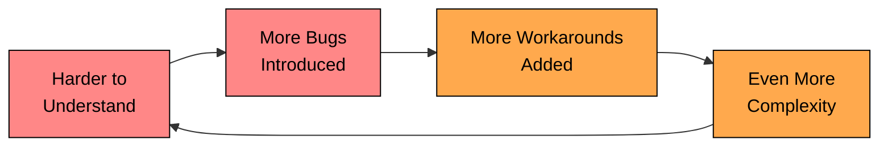

import React from 'react';
import CodeBlock from '../../../../components/ui/CodeBlock';
import Callout from '../../../../components/ui/Callout';

<div className="article-header">
  <div className="breadcrumb">
    <a href="/">Curated Notes</a>
    <span className="breadcrumb-separator">›</span>
    <span className="breadcrumb-current">KISS Principle</span>
  </div>
  <h1>KISS Principle</h1>
  <p style={{ color: 'var(--text-muted)', fontSize: '1.1rem', marginBottom: '16px', lineHeight: '1.6' }}>
    Master the essentials of KISS Principle in this curated guide.
  </p>
  <div className="meta-info">
    <span className="meta-item">
      <svg width="14" height="14" viewBox="0 0 24 24" fill="none" stroke="currentColor" strokeWidth="2"><circle cx="12" cy="12" r="10"/><polyline points="12 6 12 12 16 14"/></svg>
      10 min read
    </span>
    <span className="difficulty-badge difficulty-badge--intermediate">Intermediate</span>
  </div>
</div>

<section className="content-section">

Have you ever looked at a function and thought: **"Why is this so complicated?"**

Or tried to fix a bug, only to find five layers of indirection, cryptic abstractions, and clever tricks that make your head spin?

If so, you have run into a violation of one of the oldest and most important principles in software design: the **KISS Principle**, which stands for **Keep It Simple, Stupid**.

This chapter explores what the KISS principle really means, how complexity creeps into code, and how keeping things simple leads to better software.

---

## 1. What Is the KISS Principle?

The KISS principle was coined by the U.S. Navy in the 1960s. The idea was straightforward: most systems work best when they are kept simple. Unnecessary complexity introduces failure points, slows down understanding, and makes things harder to fix when they break.

This idea has carried over to software engineering and become one of its foundational design principles.

In software, KISS means writing code that is:

- **Easy to read.** Another developer can understand what the code does without spending 30 minutes tracing through abstractions.
- **Easy to understand.** The logic flows naturally. There are no surprises, no hidden side effects, no clever tricks.
- **Easy to change.** When requirements shift, you can modify the code confidently without worrying about breaking something three layers deep.

The simpler the code, the fewer the bugs. The fewer the bugs, the more reliable the system. And the more reliable the system, the less time your team spends firefighting instead of building.

### The Complexity Cycle

Complexity does not arrive all at once. It creeps in gradually, and each piece of unnecessary complexity makes the next piece feel justified. This creates a self-reinforcing cycle that is hard to break once it starts.





It starts innocently. A class is a bit hard to understand, so a bug slips in. The bug gets patched with a workaround instead of a proper fix. The workaround adds more complexity. Now the class is even harder to understand, so the next bug is even harder to find. The cycle continues until someone decides to rewrite the entire thing from scratch.

The KISS principle is about breaking this cycle before it starts.

---

## 2. Example: The Calculator

Let’s say you are building a calculator for basic arithmetic operations: add, subtract, multiply, divide. That's it. Four operations.

A junior developer on the team decides to make it "future-proof" by designing an inheritance-based framework. They create an interface, implement a separate class for each operation, and wire it all together through a calculator that accepts an operation object.

Here is what that over-engineered solution looks like:


```java
interface Operation {
    double calculate(double a, double b);
}

class Addition implements Operation {
    public double calculate(double a, double b) {
        return a + b;
    }
}

class Subtraction implements Operation {
    public double calculate(double a, double b) {
        return a - b;
    }
}

class Multiplication implements Operation {
    public double calculate(double a, double b) {
        return a * b;
    }
}

class Division implements Operation {
    public double calculate(double a, double b) {
        if (b == 0) throw new IllegalArgumentException("Division by zero");
        return a / b;
    }
}

class Calculator {
    public double execute(Operation op, double a, double b) {
        return op.calculate(a, b);
    }
}
```

```python
from abc import ABC, abstractmethod

class Operation(ABC):
    @abstractmethod
    def calculate(self, a: float, b: float) -> float:
        pass

class Addition(Operation):
    def calculate(self, a: float, b: float) -> float:
        return a + b

class Subtraction(Operation):
    def calculate(self, a: float, b: float) -> float:
        return a - b

class Multiplication(Operation):
    def calculate(self, a: float, b: float) -> float:
        return a * b

class Division(Operation):
    def calculate(self, a: float, b: float) -> float:
        if b == 0:
            raise ValueError("Division by zero")
        return a / b

class Calculator:
    def execute(self, op: Operation, a: float, b: float) -> float:
        return op.calculate(a, b)
```

```cpp
class Operation {
public:
    virtual double calculate(double a, double b) const = 0;
    virtual ~Operation() = default;
};

class Addition : public Operation {
public:
    double calculate(double a, double b) const override {
        return a + b;
    }
};

class Subtraction : public Operation {
public:
    double calculate(double a, double b) const override {
        return a - b;
    }
};

class Multiplication : public Operation {
public:
    double calculate(double a, double b) const override {
        return a * b;
    }
};

class Division : public Operation {
public:
    double calculate(double a, double b) const override {
        if (b == 0) throw std::invalid_argument("Division by zero");
        return a / b;
    }
};

class Calculator {
public:
    double execute(const Operation& op, double a, double b) const {
        return op.calculate(a, b);
    }
};
```

```csharp
interface IOperation
{
    double Calculate(double a, double b);
}

class Addition : IOperation
{
    public double Calculate(double a, double b)
    {
        return a + b;
    }
}

class Subtraction : IOperation
{
    public double Calculate(double a, double b)
    {
        return a - b;
    }
}

class Multiplication : IOperation
{
    public double Calculate(double a, double b)
    {
        return a * b;
    }
}

class Division : IOperation
{
    public double Calculate(double a, double b)
    {
        if (b == 0) throw new ArgumentException("Division by zero");
        return a / b;
    }
}

class Calculator
{
    public double Execute(IOperation op, double a, double b)
    {
        return op.Calculate(a, b);
    }
}
```

```go
import (
    "errors"
)

type Operation interface {
    Calculate(a, b float64) (float64, error)
}

type Addition struct{}

func (op Addition) Calculate(a, b float64) (float64, error) {
    return a + b, nil
}

type Subtraction struct{}

func (op Subtraction) Calculate(a, b float64) (float64, error) {
    return a - b, nil
}

type Multiplication struct{}

func (op Multiplication) Calculate(a, b float64) (float64, error) {
    return a * b, nil
}

type Division struct{}

func (op Division) Calculate(a, b float64) (float64, error) {
    if b == 0 {
        return 0, errors.New("division by zero")
    }
    return a / b, nil
}

type Calculator struct{}

func (c Calculator) Execute(op Operation, a, b float64) (float64, error) {
    return op.Calculate(a, b)
}
```

```typescript
interface Operation {
    calculate(a: number, b: number): number;
}

class Addition implements Operation {
    calculate(a: number, b: number): number {
        return a + b;
    }
}

class Subtraction implements Operation {
    calculate(a: number, b: number): number {
        return a - b;
    }
}

class Multiplication implements Operation {
    calculate(a: number, b: number): number {
        return a * b;
    }
}

class Division implements Operation {
    calculate(a: number, b: number): number {
        if (b === 0) throw new Error("Division by zero");
        return a / b;
    }
}

class Calculator {
    execute(op: Operation, a: number, b: number): number {
        return op.calculate(a, b);
    }
}
```


Then, to use the calculator:


```java
Calculator calc = new Calculator();
double result = calc.execute(new Addition(), 10, 5);
System.out.println(result); // 15.0
```

```python
calc = Calculator()
result = calc.execute(Addition(), 10, 5)
print(result)  # 15.0
```

```cpp
class Calculator {
public:
    double execute(const Operation& op, double a, double b) const {
        return op.calculate(a, b);
    }
};
```

```csharp
double result = calc.execute(add, 10, 5);
cout << result << endl; // 15
```

```go
calc := Calculator{}
result, err := calc.Execute(Addition{}, 10, 5)
if err != nil {
    fmt.Println("Error:", err)
}
fmt.Println(result) // 15
```

```typescript
const calc = new Calculator();
const result = calc.execute(new Addition(), 10, 5);
console.log(result); // 15
```


This design is flexible. You can add more operations. You can inject behaviors. But it is also completely **overengineered** for a four-function calculator.

What would have been a few simple `if` or `switch` statements now requires an interface, four separate classes, and an extra layer of indirection. To add a simple modulo operation, you need to create a new class, implement the interface, and make sure it is wired correctly. For a basic calculator, that is a lot of ceremony for very little gain.

This is a classic example of violating the KISS principle.

---

## 3. A Simpler Solution

Let's revisit the same calculator and apply the KISS principle. Instead of an interface, four classes, and a delegating calculator, we use a single class with a single method.


```java
class Calculator {
    public double calculate(String operator, double a, double b) {
        switch (operator) {
            case "+":
                return a + b;
            case "-":
                return a - b;
            case "*":
                return a * b;
            case "/":
                if (b == 0) throw new IllegalArgumentException("Division by zero");
                return a / b;
            default:
                throw new UnsupportedOperationException("Unknown operator: " + operator);
        }
    }
}
```

```python
class Calculator:
    def calculate(self, operator, a, b):
        if operator == "+":
            return a + b
        elif operator == "-":
            return a - b
        elif operator == "*":
            return a * b
        elif operator == "/":
            if b == 0:
                raise ValueError("Division by zero")
            return a / b
        else:
            raise NotImplementedError(f"Unknown operator: {operator}")
```

```cpp
class Calculator {
public:
    double calculate(const string& op, double a, double b) const {
        if (op == "+") return a + b;
        else if (op == "-") return a - b;
        else if (op == "*") return a * b;
        else if (op == "/") {
            if (b == 0) throw invalid_argument("Division by zero");
            return a / b;
        } else {
            throw invalid_argument("Unknown operator: " + op);
        }
    }
};
```

```csharp
class Calculator
{
    public double Calculate(string op, double a, double b)
    {
        switch (op)
        {
            case "+":
                return a + b;
            case "-":
                return a - b;
            case "*":
                return a * b;
            case "/":
                if (b == 0)
                    throw new ArgumentException("Division by zero");
                return a / b;
            default:
                throw new NotSupportedException($"Unknown operator: {op}");
        }
    }
}
```

```go
import (
    "errors"
    "fmt"
)

type Calculator struct{}

func (c Calculator) Calculate(op string, a, b float64) (float64, error) {
    switch op {
    case "+":
        return a + b, nil
    case "-":
        return a - b, nil
    case "*":
        return a * b, nil
    case "/":
        if b == 0 {
            return 0, errors.New("division by zero")
        }
        return a / b, nil
    default:
        return 0, fmt.Errorf("unknown operator: %s", op)
    }
}
```

```typescript
class Calculator {
    calculate(operator: string, a: number, b: number): number {
        switch (operator) {
            case "+":
                return a + b;
            case "-":
                return a - b;
            case "*":
                return a * b;
            case "/":
                if (b === 0) throw new Error("Division by zero");
                return a / b;
            default:
                throw new Error(`Unknown operator: ${operator}`);
        }
    }
}
```


This is simple. It works. It is easy to read, easy to test, and easy to extend if needed. Want to add a modulo operation? Add one more case to the switch statement. That's it.

If a future requirement genuinely demands pluggable operations, dynamically loaded strategies, or runtime-configurable behavior, then and only then should you refactor toward a more flexible design. Build for the problem you have, not the problem you imagine.

---

## 4. Why Complexity Is Dangerous

Let's look at the specific ways unnecessary complexity hurts your codebase.

#### 1. Harder to Read

Simple code is obvious. You can glance at a well-written method and understand what it does in seconds. Complex code, on the other hand, forces you to hold multiple layers of abstraction in your head just to follow a single operation. Every unnecessary interface, factory, or wrapper adds mental overhead that compounds as the system grows.

#### 2. More Places for Bugs to Hide

Every line of code is a potential home for a bug. Unnecessary abstractions, extra layers, and clever tricks all create hiding spots where defects can live undetected for months. An overengineered calculator has six classes that all need to be correct. A simple calculator has one. The math is straightforward: less code, fewer bugs.

#### 3. Slower Onboarding

New developers take longer to ramp up when the codebase is filled with over-complicated logic, obscure naming, or deeply nested design patterns. When a new team member needs a week just to understand how a calculator works, something has gone wrong. Simple code lets new developers start contributing faster, and that has a real impact on team productivity.

#### 4. Poor Debuggability

When something breaks in simple code, you set a breakpoint, step through the method, and find the issue. When something breaks in complex code, you might need to trace through five classes, two interfaces, and a factory before you find the line that caused the problem. Simple code is easier to trace, test, and troubleshoot. Complex code turns every debugging session into a detective investigation.

---

## 5. Signs You’re Violating KISS

Before we look at how to apply the principle, here are some warning signs that complexity is creeping into your code:

- You added an interface before you had a second implementation.
- You used reflection for something a simple method call could handle.
- You introduced an extra layer "just in case" you might need it later.
- Your method has five optional parameters and deeply nested conditionals.
- You used recursion when a loop would have been simpler and clearer.
- A new developer cannot understand your class without reading three other classes first.
- Your code has more boilerplate than business logic.

If you recognize any of these, it is worth pausing and asking: "Is there a simpler way to do this?"

---

## 6. How to Apply the KISS Principle

Knowing the principle is one thing. Applying it consistently is another. Here are five practical guidelines.

#### 1. **Write Code for Humans, Not Machines**

Your code's primary audience is other developers, including your future self. The compiler does not care whether your variable is called `x` or `customerOrderTotal`. But the developer reading your code six months from now will care a lot.

#### 2. **Avoid Premature Abstraction**

Abstractions are powerful tools, but they should emerge from repetition or clear need, not from imagination. Creating an abstract base class, an interface, and a factory for something that currently has one implementation is not engineering. It is speculation.

#### 3. **Favor Composition Over Inheritance**

Deep inheritance hierarchies create tight coupling and make code harder to follow. When you need to understand what a method does, you might have to trace up through three or four parent classes to find the actual implementation. Flat, composed structures are almost always simpler and more flexible.

#### 4. **Keep Functions Short**

A function that does one thing well is easy to name, easy to test, and easy to reason about. A function that handles validation, transformation, persistence, and notification in a single method body is doing too much.

As a guideline, if you cannot describe what a function does in a single sentence without using the word "and," it is probably doing too much. Split it.

This does not mean every function should be three lines long. Some operations are naturally complex. But even complex operations can usually be broken into smaller, well-named steps that make the overall flow clear.

#### 5. **Use Familiar Constructs**

Stick to patterns and data structures that are widely recognized in your language's ecosystem. Do not reinvent the wheel when a simple `List`, a `Map`, a `for` loop can do the job.

---

## 7. When Not to Simplify

KISS is a powerful principle, but like any principle, applying it blindly can backfire. There are legitimate cases where a certain amount of complexity is not just acceptable, it is necessary.

#### Don't Oversimplify Critical Systems

Some systems genuinely need safeguards, validation layers, and defensive checks. A payment processing system should have thorough input validation, transaction logging, and error handling, even if that adds complexity. Cutting corners in the name of simplicity can lead to data corruption, security vulnerabilities, or financial loss.

The question is not "Is this simple?" but "Is this as simple as it can be while still meeting all the requirements, including safety and reliability?"

#### Avoid Duplicating Logic Just to Keep Things "Simple"

Sometimes developers avoid creating a shared utility method because it feels like "adding abstraction." But if the same validation logic exists in five places and a rule changes, you now have five places to update. A small, well-named helper function is simpler in the long run than scattered duplication.

KISS and DRY often work together. The goal is to find the simplest solution that does not repeat itself unnecessarily.

#### Know Your Audience

In some cases, a design pattern or framework might actually be more understandable than a custom approach. If your team uses Spring Boot and everyone knows how dependency injection works, using `@Autowired` is simpler than manually wiring dependencies, even though it adds a framework layer.

Simplicity is relative to the reader. What is simple for an experienced developer might be confusing for a junior, and vice versa.

The goal is not to write the simplest possible code. It is to write the simplest **sufficient** code.

</section>
