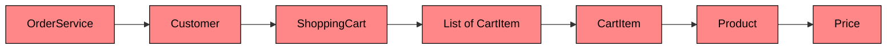
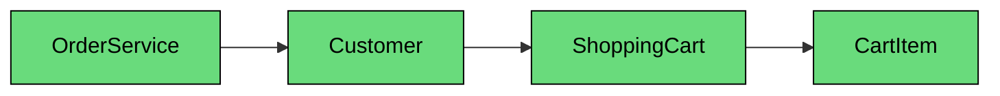
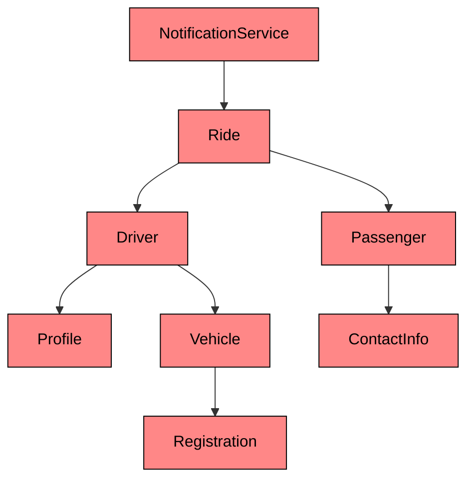

import React from 'react';
import CodeBlock from '../../../../components/ui/CodeBlock';
import Callout from '../../../../components/ui/Callout';

<div className="article-header">
  <div className="breadcrumb">
    <a href="/">Curated Notes</a>
    <span className="breadcrumb-separator">›</span>
    <span className="breadcrumb-current">Law of Demeter</span>
  </div>
  <h1>Law of Demeter</h1>
  <p style={{ color: 'var(--text-muted)', fontSize: '1.1rem', marginBottom: '16px', lineHeight: '1.6' }}>
    Master the essentials of Law of Demeter in this curated guide.
  </p>
  <div className="meta-info">
    <span className="meta-item">
      <svg width="14" height="14" viewBox="0 0 24 24" fill="none" stroke="currentColor" strokeWidth="2"><circle cx="12" cy="12" r="10"/><polyline points="12 6 12 12 16 14"/></svg>
      10 min read
    </span>
    <span className="difficulty-badge difficulty-badge--intermediate">Intermediate</span>
  </div>
</div>

<section className="content-section">

Have you ever called a method on an object… then chained another… and another… until the line looked like a trail of dots?

Or made a small internal change to one class, and suddenly had to update code across five other layers?

If yes, you’ve probably run into a violation of one of the most overlooked design principles in software engineering: **The Law of Demeter (LoD)**.

Let’s understand it with a real-world example and see why this principle matters more than you might think.

---

## 1. The Problem

Imagine you're building a simple e-commerce system.

You have:

- A `Customer` who owns a `ShoppingCart`
- The cart contains a list of `CartItems`
- Each `CartItem` refers to a `Product`
- And every `Product` has a `Price`

Now let’s say you want to display the price of the **first product** in a customer’s shopping cart.





A common (but flawed) approach would be to write something like this:


```java
Money price = customer.getShoppingCart().getItems().get(0).getProduct().getPrice();
```

```python
price = customer.get_shopping_cart().get_items()[0].get_product().get_price()
```

```cpp
Money price = customer.getShoppingCart().getItems()[0].getProduct().getPrice();
```

```go
price := customer.GetShoppingCart().GetItems()[0].GetProduct().GetPrice()
```

```csharp
Money price = customer.GetShoppingCart().GetItems()[0].GetProduct().GetPrice();
```

```typescript
const price = customer.getShoppingCart().getItems()[0].getProduct().getPrice();
```


Look at that chain. `OrderService` is coupled to **six** classes deep. It knows about the customer's cart, the cart's internal list, the structure of a cart item, the product inside it, and the price object. A change to any of these classes could break the `OrderService`, even though those classes have nothing to do with order processing.

This is called a **"train wreck"** or **"dot-chaining"**: one object reaching through several others to get what it wants. You start with a `Customer`, go into their `ShoppingCart`, peek into its internal list of `CartItems`, grab the first one, extract the `Product`, and finally get the `Price`.

Here is the full function that uses this pattern:


```java
void displayFirstItemPrice(Customer customer) {
    Money price = customer.getShoppingCart()
                          .getItems()
                          .get(0)
                          .getProduct()
                          .getPrice();
    System.out.println("Price of the first item: " + price.getAmount());
}
```

```python
def display_first_item_price(customer):
    price = (customer.get_shopping_cart()
                     .get_items()[0]
                     .get_product()
                     .get_price())
    print("Price of the first item:", price.get_amount())
```

```cpp
void displayFirstItemPrice(const Customer& customer) {
    Money price = customer.getShoppingCart()
                          .getItems()[0]
                          .getProduct()
                          .getPrice();
    cout << "Price of the first item: " << price.getAmount() << endl;
}
```

```csharp
void DisplayFirstItemPrice(Customer customer)
{
    Money price = customer.GetShoppingCart()
                          .GetItems()[0]
                          .GetProduct()
                          .GetPrice();
    Console.WriteLine("Price of the first item: " + price.GetAmount());
}
```

```go
func displayFirstItemPrice(customer *Customer) {
    price := customer.GetShoppingCart().
                      GetItems()[0].
                      GetProduct().
                      GetPrice()
    fmt.Println("Price of the first item:", price.GetAmount())
}
```

```typescript
function displayFirstItemPrice(customer: Customer): void {
    const price = customer.getShoppingCart()
                          .getItems()[0]
                          .getProduct()
                          .getPrice();
    console.log(`Price of the first item: ${price.getAmount()}`);
}
```


This approach works. It compiles. It runs. But it **smells bad**, and it will cause real pain as your system evolves.

---

## 2. What’s Wrong With This?

#### 1. High Coupling

The `OrderService` method is now tightly coupled to the **entire internal structure** of the customer and their cart.

- If `ShoppingCart` changes how it stores items (e.g., using a `Map` instead of a `List`)
- If `CartItem` renames its `getProduct()` method
- Or if `Product` evolves to store pricing in a new way…

**Boom.** Your `OrderService` code breaks. Even though it had nothing to do with those decisions.

#### 2. Encapsulation Violation

You are reaching deep into object internals, violating encapsulation at multiple levels.

- `Customer` exposes its `ShoppingCart`
- `ShoppingCart` exposes its internal list
- You assume the structure of that list
- And even dig through `CartItem` and `Product` just to get a price

Every layer of reach is a layer of exposed internals. The whole point of encapsulation is to hide these details, and this code tears down every wall.

#### 3. Maintenance Nightmare

Imagine this change: You switch from using a `Money` wrapper to a `BigDecimal` for price representation in `Product`.

Now, every part of your codebase that dot-chased its way to `product.getPrice()` must be updated.

#### 4. Testability Issues

Testing `displayFirstItemPrice()` becomes a *mocking marathon*.

To test it in isolation, you'd need to mock:

- A `Customer`
- That returns a `ShoppingCart`
- That returns a `List`
- That returns a `CartItem`
- That returns a `Product`
- That returns a `Price`

One function. Six mocks. That is exhausting, fragile, and a clear sign something is wrong with the design.

---

## 3. Enter: The Law of Demeter (LoD)

&gt; **“Only talk to your immediate friends.”**
&gt;
&gt;  — Law of Demeter

The Law of Demeter, also known as the **Principle of Least Knowledge**, was formulated in 1987 at Northeastern University during work on the Demeter project. Despite its age, it remains one of the most practical guidelines for writing maintainable object-oriented code.

The rule is straightforward. A method `M` on an object `O` should only call methods on:

1. **Itself** (the object `O`)
2. **Its own fields** (objects that `O` holds as instance variables)
3. **Its method parameters** (objects passed into `M`)
4. **Objects it creates** (objects instantiated within `M`)

That's it. In plain terms: **don't reach through one object to get to another.**

If you call `a.getB().getC().doSomething()`, you are violating LoD because you are reaching through `B` to talk to `C`. You should only be talking to `A`, and let `A` figure out how to get the job done.

---

## 4. Refactoring with LoD in Mind

Let's rewrite the e-commerce example in a cleaner, more respectful way. The strategy is to **push the responsibility down** to the classes that own the data. Each class will expose a meaningful method instead of exposing its internals.

#### Step 1: Add a method to `ShoppingCart`

The `ShoppingCart` knows about its items. So it should be the one to answer questions about them.


```java
class ShoppingCart {
    private List<CartItem> items;

    // ... constructor, other methods ...

    public Money getFirstItemPrice() {
        if (items.isEmpty()) return Money.ZERO;
        return items.get(0).getProduct().getPrice();
    }
}
```

```python
class ShoppingCart:
    def __init__(self):
        self._items = []

    # ... other methods ...

    def get_first_item_price(self):
        if not self._items:
            return Money.ZERO
        return self._items[0].get_product().get_price()
```

```cpp
class ShoppingCart {
private:
    vector<CartItem> items;

public:
    // ... constructor, other methods ...

    Money getFirstItemPrice() const {
        if (items.empty()) return Money::ZERO;
        return items[0].getProduct().getPrice();
    }
};
```

```csharp
class ShoppingCart
{
    private List<CartItem> items;

    // ... constructor, other methods ...

    public Money GetFirstItemPrice()
    {
        if (items.Count == 0) return Money.ZERO;
        return items[0].GetProduct().GetPrice();
    }
}
```

```go
type ShoppingCart struct {
    items []CartItem
}

// ... other methods ...

func (sc *ShoppingCart) GetFirstItemPrice() Money {
    if len(sc.items) == 0 {
        return ZeroMoney
    }
    return sc.items[0].GetProduct().GetPrice()
}
```

```typescript
class ShoppingCart {
    private items: CartItem[];

    // ... constructor, other methods ...

    getFirstItemPrice(): Money {
        if (this.items.length === 0) return Money.ZERO;
        return this.items[0].getProduct().getPrice();
    }
}
```


Notice that `ShoppingCart` still reaches into `CartItem` and `Product`. That is fine here because `ShoppingCart` owns the items. The chain stays within the cart's own responsibility boundary. The important thing is that **external callers** no longer need to know about these internals.

#### Step 2: Add a method to `Customer`

The `Customer` owns the `ShoppingCart`, so it should be the one to delegate cart-related queries.


```java
class Customer {
    private ShoppingCart shoppingCart;

    // ... constructor, other methods ...

    public Money getFirstCartItemPrice() {
        return shoppingCart.getFirstItemPrice();
    }
}
```

```python
class Customer:
    def __init__(self, shopping_cart):
        self._shopping_cart = shopping_cart

    # ... other methods ...

    def get_first_cart_item_price(self):
        return self._shopping_cart.get_first_item_price()
```

```cpp
class Customer {
private:
    ShoppingCart shoppingCart;

public:
    // ... constructor, other methods ...

    Money getFirstCartItemPrice() const {
        return shoppingCart.getFirstItemPrice();
    }
};
```

```csharp
class Customer
{
    private ShoppingCart shoppingCart;

    // ... constructor, other methods ...

    public Money GetFirstCartItemPrice()
    {
        return shoppingCart.GetFirstItemPrice();
    }
}
```

```go
type Customer struct {
    shoppingCart *ShoppingCart
}

// ... other methods ...

func (c *Customer) GetFirstCartItemPrice() Money {
    return c.shoppingCart.GetFirstItemPrice()
}
```

```typescript
class Customer {
    private shoppingCart: ShoppingCart;

    // ... constructor, other methods ...

    getFirstCartItemPrice(): Money {
        return this.shoppingCart.getFirstItemPrice();
    }
}
```


#### Step 3: Update the `OrderService`

Now the `OrderService` only talks to its direct friend: the `Customer`.


```java
void displayFirstItemPrice(Customer customer) {
    Money price = customer.getFirstCartItemPrice();
    System.out.println("Price of the first item: " + price.getAmount());
}
```

```python
def display_first_item_price(customer: Customer):
    price = customer.get_first_cart_item_price()
    print("Price of the first item:", price.get_amount())
```

```cpp
void displayFirstItemPrice(const Customer& customer) {
    Money price = customer.getFirstCartItemPrice();
    cout << "Price of the first item: " << price.getAmount() << endl;
}
```

```csharp
void DisplayFirstItemPrice(Customer customer)
{
    Money price = customer.GetFirstCartItemPrice();
    Console.WriteLine("Price of the first item: " + price.GetAmount());
}
```

```go
func displayFirstItemPrice(customer *Customer) {
    price := customer.GetFirstCartItemPrice()
    fmt.Println("Price of the first item:", price.GetAmount())
}
```

```typescript
function displayFirstItemPrice(customer: Customer): void {
    const price = customer.getFirstCartItemPrice();
    console.log(`Price of the first item: ${price.getAmount()}`);
}
```


Much better. Now the dependency chain looks completely different:





`OrderService` only talks to `Customer`. `Customer` only talks to `ShoppingCart`. Each layer hides the next one. Now `OrderService` does not care about:

- How the cart stores items
- What a `CartItem` contains
- How the `Product` holds its price

It just asks the `Customer` for what it needs, and the `Customer` delegates to the objects it owns. This is the Law of Demeter at work.

---

## 5. Benefits of Law of Demeter

#### **Low Coupling**

Each class depends only on its immediate collaborators. Code changes in one place don't ripple across your codebase. When `ShoppingCart` changes its internal storage from a `List` to a `Map`, only `ShoppingCart` needs updating.

#### **Better Encapsulation**

Each class handles its own logic. No external code peeks into internals. Objects expose meaningful behaviors ("give me the first item price") instead of raw structure ("give me your list so I can dig through it").

#### **Easier Refactoring**

You can evolve internal implementations without affecting consumers. If `Product` changes how it stores pricing, only `CartItem` and `ShoppingCart` need to adapt. The `OrderService` remains untouched.

#### **Improved Testability**

Fewer mocks are needed. To test the refactored `displayFirstItemPrice`, you only need to mock `Customer` and have it return a `Money` value. No more six-layer mock chains.

#### **Cleaner APIs**

Public methods become expressive, intentional, and meaningful. Instead of forcing callers to navigate your object graph, you provide clear entry points that describe what the caller actually wants.

---

## 6. Common Questions About LoD

#### Isn't this just more code? I have to write all these wrapper methods!

Yes, following LoD can result in additional small, delegating methods. But this “extra” code serves a critical purpose: **it reduces coupling**.

Think of it this way: would you rather write 3 lines now to isolate behavior, or refactor 300 later when your system breaks?

These small wrappers protect the rest of your codebase from internal changes. They enforce the principle of **“Tell, Don’t Ask”, **you tell an object what you want it to do, instead of reaching inside and doing it yourself.

#### Does the Law of Demeter mean I can’t use getters at all?

Not at all. LoD doesn’t forbid getters.

Simple property access like `customer.getName()` is perfectly fine—`name` is a direct part of `Customer`.

The issue arises with **chained getters** across object boundaries:


```java
customer.getCart().getItems().get(0).getProduct().getPrice();
```


This creates tight coupling between the caller and the internal structure of several unrelated classes. Instead, you’re encouraged to **delegate** the operation to the object that owns the knowledge.

#### What about data structures? Can I call `size()` on a list I get from an object?

This is a nuanced area.

If `getUsers()` returns a standard collection like `List<User>`, then `getUsers().size()` is generally **acceptable**. Lists are transparent and well-understood abstractions, and operations like `size()` don’t break encapsulation.

However, this would be a violation:


```java
getUsers().get(0).getAddress().getStreet();
```


The more layers of domain objects you traverse, the more you're violating LoD. The key is whether you're interacting with a **simple data structure** or delving into **another object’s responsibility chain**.

#### When is it okay to “violate” the Law of Demeter?

Like most principles, LoD is a guideline—not a hard rule. Some common exceptions include:

- **DTOs / Value Objects**: It’s acceptable to traverse simple data carriers where behavior isn't expected.
- **Stable, Low-Level Libraries**: Using well-known APIs (like `Map.get()` or `List.size()`) is typically safe.
- **Fluent APIs / Builders**: Method chaining in fluent interfaces is usually an intentional design, not a violation.

The key is **intentional design**. If you understand the coupling trade-off and still find it justifiable, go for it. Just don’t do it by accident.

In short: **LoD is like a guardrail**. It helps you avoid the slippery slope of exposing internals and tying your code together too tightly.

---

## 7. Practical Example: Ride Notification

Let's look at another scenario to reinforce the pattern. This time, we are building a notification system for a ride-sharing app like Uber or Lyft.

#### The Problem

A `NotificationService` class needs three pieces of information to send a ride update to a passenger:

- The driver's name (from the driver's profile)
- The car's license plate (from the driver's vehicle registration)
- The passenger's phone number (from their contact info)

A developer in a hurry writes the following:


```java
class NotificationService {
    public void sendRideUpdate(Ride ride) {
        // Train wreck 1: reaching through Driver -> Profile to get name
        String driverName = ride.getDriver()
                                .getProfile()
                                .getFullName();

        // Train wreck 2: reaching through Driver -> Vehicle -> Registration
        String plate = ride.getDriver()
                           .getVehicle()
                           .getRegistration()
                           .getLicensePlate();

        // Train wreck 3: reaching through Passenger -> ContactInfo
        String phone = ride.getPassenger()
                           .getContactInfo()
                           .getPhoneNumber();

        String message = String.format(
            "Your driver %s is arriving in a %s. Contact: %s",
            driverName, plate, phone);
        System.out.println("SMS to " + phone + ": " + message);
    }
}
```

```python
class NotificationService:
    def send_ride_update(self, ride):
        # Train wreck 1: reaching through Driver -> Profile to get name
        driver_name = (ride.get_driver()
                           .get_profile()
                           .get_full_name())

        # Train wreck 2: reaching through Driver -> Vehicle -> Registration
        plate = (ride.get_driver()
                     .get_vehicle()
                     .get_registration()
                     .get_license_plate())

        # Train wreck 3: reaching through Passenger -> ContactInfo
        phone = (ride.get_passenger()
                     .get_contact_info()
                     .get_phone_number())

        message = f"Your driver {driver_name} is arriving in a {plate}. Contact: {phone}"
        print(f"SMS to {phone}: {message}")
```

```cpp
class NotificationService {
public:
    void sendRideUpdate(const Ride& ride) {
        // Train wreck 1: reaching through Driver -> Profile to get name
        string driverName = ride.getDriver()
                                .getProfile()
                                .getFullName();

        // Train wreck 2: reaching through Driver -> Vehicle -> Registration
        string plate = ride.getDriver()
                           .getVehicle()
                           .getRegistration()
                           .getLicensePlate();

        // Train wreck 3: reaching through Passenger -> ContactInfo
        string phone = ride.getPassenger()
                           .getContactInfo()
                           .getPhoneNumber();

        cout << "SMS to " << phone << ": Your driver " << driverName
             << " is arriving in a " << plate
             << ". Contact: " << phone << endl;
    }
};
```

```csharp
class NotificationService
{
    public void SendRideUpdate(Ride ride)
    {
        // Train wreck 1: reaching through Driver -> Profile to get name
        string driverName = ride.GetDriver()
                                .GetProfile()
                                .GetFullName();

        // Train wreck 2: reaching through Driver -> Vehicle -> Registration
        string plate = ride.GetDriver()
                           .GetVehicle()
                           .GetRegistration()
                           .GetLicensePlate();

        // Train wreck 3: reaching through Passenger -> ContactInfo
        string phone = ride.GetPassenger()
                           .GetContactInfo()
                           .GetPhoneNumber();

        string message = $"Your driver {driverName} is arriving in a {plate}. Contact: {phone}";
        Console.WriteLine($"SMS to {phone}: {message}");
    }
}
```

```go
type NotificationService struct{}

func (ns *NotificationService) SendRideUpdate(ride *Ride) {
    // Train wreck 1: reaching through Driver -> Profile to get name
    driverName := ride.GetDriver().
                       GetProfile().
                       GetFullName()

    // Train wreck 2: reaching through Driver -> Vehicle -> Registration
    plate := ride.GetDriver().
                  GetVehicle().
                  GetRegistration().
                  GetLicensePlate()

    // Train wreck 3: reaching through Passenger -> ContactInfo
    phone := ride.GetPassenger().
                  GetContactInfo().
                  GetPhoneNumber()

    fmt.Printf("SMS to %s: Your driver %s is arriving in a %s. Contact: %s\n",
               phone, driverName, plate, phone)
}
```

```typescript
class NotificationService {
    sendRideUpdate(ride: Ride): void {
        // Train wreck 1: reaching through Driver -> Profile to get name
        const driverName = ride.getDriver()
                               .getProfile()
                               .getFullName();

        // Train wreck 2: reaching through Driver -> Vehicle -> Registration
        const plate = ride.getDriver()
                          .getVehicle()
                          .getRegistration()
                          .getLicensePlate();

        // Train wreck 3: reaching through Passenger -> ContactInfo
        const phone = ride.getPassenger()
                          .getContactInfo()
                          .getPhoneNumber();

        const message = `Your driver ${driverName} is arriving in a ${plate}. Contact: ${phone}`;
        console.log(`SMS to ${phone}: ${message}`);
    }
}
```


Look at what the `NotificationService` now knows about. It is coupled to `Driver`, `Profile`, `Vehicle`, `Registration`, `Passenger`, `ContactInfo`, and their internal structures.





If `Vehicle` restructures how it stores registration data, the notification service breaks. If `Passenger` changes from `ContactInfo` to a different contact model, the notification service breaks. Every internal change in any of these classes becomes a potential breaking change for `NotificationService`.

#### The Fix: Delegation Methods

Instead of letting `NotificationService` navigate the entire object graph, we add delegation methods to `Ride`. The `Ride` class already has references to its driver and passenger, so it is the natural place to answer these questions.


```java
class Ride {
    private Driver driver;
    private Passenger passenger;

    // ... constructor, other methods ...

    public String getDriverName() {
        return driver.getProfile().getFullName();
    }

    public String getVehiclePlate() {
        return driver.getVehicle().getRegistration().getLicensePlate();
    }

    public String getPassengerPhone() {
        return passenger.getContactInfo().getPhoneNumber();
    }
}
```

```python
class Ride:
    def __init__(self, driver, passenger):
        self._driver = driver
        self._passenger = passenger

    # ... other methods ...

    def get_driver_name(self):
        return self._driver.get_profile().get_full_name()

    def get_vehicle_plate(self):
        return self._driver.get_vehicle().get_registration().get_license_plate()

    def get_passenger_phone(self):
        return self._passenger.get_contact_info().get_phone_number()
```

```cpp
class Ride {
private:
    Driver driver;
    Passenger passenger;

public:
    // ... constructor, other methods ...

    string getDriverName() const {
        return driver.getProfile().getFullName();
    }

    string getVehiclePlate() const {
        return driver.getVehicle().getRegistration().getLicensePlate();
    }

    string getPassengerPhone() const {
        return passenger.getContactInfo().getPhoneNumber();
    }
};
```

```csharp
class Ride
{
    private Driver driver;
    private Passenger passenger;

    // ... constructor, other methods ...

    public string GetDriverName()
    {
        return driver.GetProfile().GetFullName();
    }

    public string GetVehiclePlate()
    {
        return driver.GetVehicle().GetRegistration().GetLicensePlate();
    }

    public string GetPassengerPhone()
    {
        return passenger.GetContactInfo().GetPhoneNumber();
    }
}
```

```go
type Ride struct {
    driver    *Driver
    passenger *Passenger
}

// ... other methods ...

func (r *Ride) GetDriverName() string {
    return r.driver.GetProfile().GetFullName()
}

func (r *Ride) GetVehiclePlate() string {
    return r.driver.GetVehicle().GetRegistration().GetLicensePlate()
}

func (r *Ride) GetPassengerPhone() string {
    return r.passenger.GetContactInfo().GetPhoneNumber()
}
```

```typescript
class Ride {
    private driver: Driver;
    private passenger: Passenger;

    // ... constructor, other methods ...

    getDriverName(): string {
        return this.driver.getProfile().getFullName();
    }

    getVehiclePlate(): string {
        return this.driver.getVehicle().getRegistration().getLicensePlate();
    }

    getPassengerPhone(): string {
        return this.passenger.getContactInfo().getPhoneNumber();
    }
}
```


Now the `NotificationService` becomes simple and clean:


```java
class NotificationService {
    public void sendRideUpdate(Ride ride) {
        String driverName = ride.getDriverName();
        String plate = ride.getVehiclePlate();
        String phone = ride.getPassengerPhone();

        String message = String.format(
            "Your driver %s is arriving in a %s. Contact: %s",
            driverName, plate, phone);
        System.out.println("SMS to " + phone + ": " + message);
    }
}
```

```python
class NotificationService:
    def send_ride_update(self, ride):
        driver_name = ride.get_driver_name()
        plate = ride.get_vehicle_plate()
        phone = ride.get_passenger_phone()

        message = f"Your driver {driver_name} is arriving in a {plate}. Contact: {phone}"
        print(f"SMS to {phone}: {message}")
```

```cpp
class NotificationService {
public:
    void sendRideUpdate(const Ride& ride) {
        string driverName = ride.getDriverName();
        string plate = ride.getVehiclePlate();
        string phone = ride.getPassengerPhone();

        cout << "SMS to " << phone << ": Your driver " << driverName
             << " is arriving in a " << plate
             << ". Contact: " << phone << endl;
    }
};
```

```csharp
class NotificationService
{
    public void SendRideUpdate(Ride ride)
    {
        string driverName = ride.GetDriverName();
        string plate = ride.GetVehiclePlate();
        string phone = ride.GetPassengerPhone();

        string message = $"Your driver {driverName} is arriving in a {plate}. Contact: {phone}";
        Console.WriteLine($"SMS to {phone}: {message}");
    }
}
```

```go
func (ns *NotificationService) SendRideUpdate(ride *Ride) {
    driverName := ride.GetDriverName()
    plate := ride.GetVehiclePlate()
    phone := ride.GetPassengerPhone()

    fmt.Printf("SMS to %s: Your driver %s is arriving in a %s. Contact: %s\n",
               phone, driverName, plate, phone)
}
```

```typescript
class NotificationService {
    sendRideUpdate(ride: Ride): void {
        const driverName = ride.getDriverName();
        const plate = ride.getVehiclePlate();
        const phone = ride.getPassengerPhone();

        const message = `Your driver ${driverName} is arriving in a ${plate}. Contact: ${phone}`;
        console.log(`SMS to ${phone}: ${message}`);
    }
}
```


The dependency picture is now dramatically simpler:


`NotificationService` only knows about `Ride`. It has no idea that `Driver`, `Profile`, `Vehicle`, `Registration`, `Passenger`, or `ContactInfo` even exist.

#### Why This Design Works

- **Single point of change.** If `Vehicle` restructures how it stores registration data, you update `Ride.getVehiclePlate()` and nothing else.
- **Easy to test.** To test `NotificationService`, you only mock `Ride` with three simple return values.
- **Self-documenting.** Method names like `getDriverName()` and `getPassengerPhone()` clearly describe what data is being retrieved without exposing how it is obtained.
- **Contained ripple effects.** Internal restructuring of `Driver`, `Vehicle`, or `Passenger` stays contained within the classes that own them.

</section>
