import React from 'react';
import CodeBlock from '../../../../components/ui/CodeBlock';
import Callout from '../../../../components/ui/Callout';

<div className="article-header">
  <div className="breadcrumb">
    <a href="/">Curated Notes</a>
    <span className="breadcrumb-separator">›</span>
    <span className="breadcrumb-current">Design Snake and Ladder game</span>
  </div>
  <h1>Design Snake and Ladder game</h1>
  <p style={{ color: 'var(--text-muted)', fontSize: '1.1rem', marginBottom: '16px', lineHeight: '1.6' }}>
    Master the essentials of Design Snake and Ladder game in this curated guide.
  </p>
  <div className="meta-info">
    <span className="meta-item">
      <svg width="14" height="14" viewBox="0 0 24 24" fill="none" stroke="currentColor" strokeWidth="2"><circle cx="12" cy="12" r="10"/><polyline points="12 6 12 12 16 14"/></svg>
      10 min read
    </span>
    <span className="difficulty-badge difficulty-badge--intermediate">Intermediate</span>
  </div>
</div>

<section className="content-section">


&gt; **QUESTION**
&gt;
&gt; #### What is Snake and Ladder Game?
&gt;
&gt; **Snake and Ladder** is a classic turn-based board game played by two or more players on a grid, typically numbered from **1 to 100**. Each player starts at cell 1 and takes turns rolling a dice to determine how many steps to move forward.
&gt;
&gt; The game includes:
&gt;
&gt; - **Ladders**, which boost progress by instantly moving the player up to a higher cell
&gt; - **Snakes**, which hinder progress by sliding the player down to a lower cell
&gt;
&gt; The first player to land exactly on the final cell (e.g., cell 100) is declared the winner.
&gt;
&gt; 
&gt; 
&gt; 


In this chapter, we will explore the **low-level design of a snake and ladder game** in detail.

Lets start by clarifying the requirements:

---

## 1. Clarifying Requirements

Before starting the design, it's important to ask thoughtful questions to uncover hidden assumptions and better define the scope of the system.

Here is an example of how a conversation between the candidate and the interviewer might unfold:


&gt; **DISCUSSION**
&gt;
&gt; **Candidate:** "Should the game support a standard 10x10 board with 100 cells, or should the board size be configurable?"
&gt;
&gt; **Interviewer:** "For this version, let’s stick with the standard 10x10 board."
&gt;
&gt; **Candidate:** "Should the number and positions of snakes and ladders be fixed, or should they be configurable?"
&gt;
&gt; **Interviewer:** "They should be configurable. The board should allow us to define the number and positions of snakes and ladders at initialization."
&gt;
&gt; **Candidate:** "How many players should the game support? Should it be limited to two, or should we support multiple players?"
&gt;
&gt; **Interviewer:** "The game should support at least two players but potentially more. Player turns should rotate in order."
&gt;
&gt; **Candidate:** "How should dice rolls be handled? Should we simulate a dice roll in the code or take it as input?"
&gt;
&gt; **Interviewer:** "Let’s simulate dice rolls using random number generation from 1 to 6. No need for user input for the roll itself."
&gt;
&gt; **Candidate:** "What should happen if a player rolls a 6? Should they get another turn?"
&gt;
&gt; **Interviewer:** "Yes, if a player rolls a 6, they get an extra turn immediately."
&gt;
&gt; **Candidate:** "Should a player roll exact number to land on cell 100, or can they overshoot and still win?"
&gt;
&gt; **Interviewer:** "A player must land exactly on 100 to win. If the roll takes them beyond 100, their turn is skipped."
&gt;
&gt; **Candidate:** "Can multiple players occupy the same square at the same time?"
&gt;
&gt; **Interviewer:** "Yes, more than one player can land on the same square. There's no interaction or conflict when this happens—no "bumping" or penalties."


After gathering the details, we can summarize the key system requirements.

### 1.1 Functional Requirements

- The game is played on a standard **10x10** board with **100** numbered cells
- Support **configuration** of snakes and ladders with flexible start and end positions
- Snakes send the player back to a lower-numbered square; ladders move the player forward
- Allow **multiple players** (minimum two), with turn rotation in round-robin order
- **Simulate dice rolls** with random values between 1 and 6. A player gets an extra turn if they roll a 6
- A player must roll the exact number to land on cell 100 and win the game
- Multiple players can occupy the same cell without interaction

### 1.2 Non-Functional Requirements

- **Modularity:** The system should follow object-oriented principles with clean separation between components
- **Extensibility:** The design should allow future enhancements such as custom board sizes or different types of dice
- **Maintainability:** The codebase should be clean, readable, and easy to extend
- **User Feedback:** The system should provide clear console output after each turn, indicating player moves, dice rolls, snake or ladder interactions, and current positions

After the requirements are clear, lets identify the core entities/objects we will have in our system.

---

## 2. Identifying Core Entities

How do you go from a list of requirements to actual classes? 

The key is to look for **nouns** in the requirements that have distinct attributes or behaviors. Not every noun becomes a class, but this approach gives you a starting point.

Let's walk through our requirements and identify what needs to exist in our system.

#### 1. The game is played on a standard 10x10 board with 100 numbered cells.

The board is central to everything. We need something to represent it. This gives us our first entity: `Board`.

Unlike Tic-Tac-Toe where each cell holds a symbol, Snake and Ladder cells are just positions. The interesting part is what happens at certain positions. The Board needs to know which positions have snakes or ladders and where they lead.

#### 2. Support configuration of snakes and ladders with flexible start and end positions

We clearly need `Snake` and `Ladder` entities. Both have a start position and an end position. A snake's start (head) must be higher than its end (tail). A ladder's start (bottom) must be lower than its end (top).

**Notice the similarity?** 

Both are "board entities" that transport a player from one position to another. This suggests an abstract base class `BoardEntity` that Snake and Ladder can inherit from. The base class holds the common logic (start and end positions), while subclasses enforce their specific validation rules.


&gt; **Why use inheritance here?**
&gt;
&gt; Because snakes and ladders share structure but differ in behavior. A snake must have `start > end`. A ladder must have `start < end`. Inheritance lets us enforce these constraints in the subclass constructors while sharing the common code.


#### 3. Allow multiple players (minimum two), with turn rotation in round-robin order

We need to represent players. Each player has a name and a current position on the board. This gives us the `Player` entity.

Players start at position 0 (off the board) and move toward 100. Their position changes after each dice roll, potentially modified by snakes or ladders.

#### 4. Simulate dice rolls with random values between 1 and 6

We need a `Dice` entity to simulate random rolls. While we could just call **Math.random()** directly in the game logic, encapsulating dice behavior in its own class provides several benefits:

- We can easily swap in different dice types (weighted, multiple dice)
- We can mock the dice for testing
- The dice range becomes configurable

#### 5. The game should manage turns, apply snakes and ladders, and determine when a player wins

Something needs to coordinate the gameplay: roll dice, move players, check for snakes/ladders, handle the special "roll 6 for extra turn" rule, and detect when someone wins. This orchestrator is our `Game` entity.

The game also needs to track its current state. Is it still running? Has someone won? An enum `GameStatus` with values `NOT_STARTED`, `RUNNING`, and `FINISHED` captures all possibilities cleanly.

#### Entity Overview

Here's how these entities relate to each other:


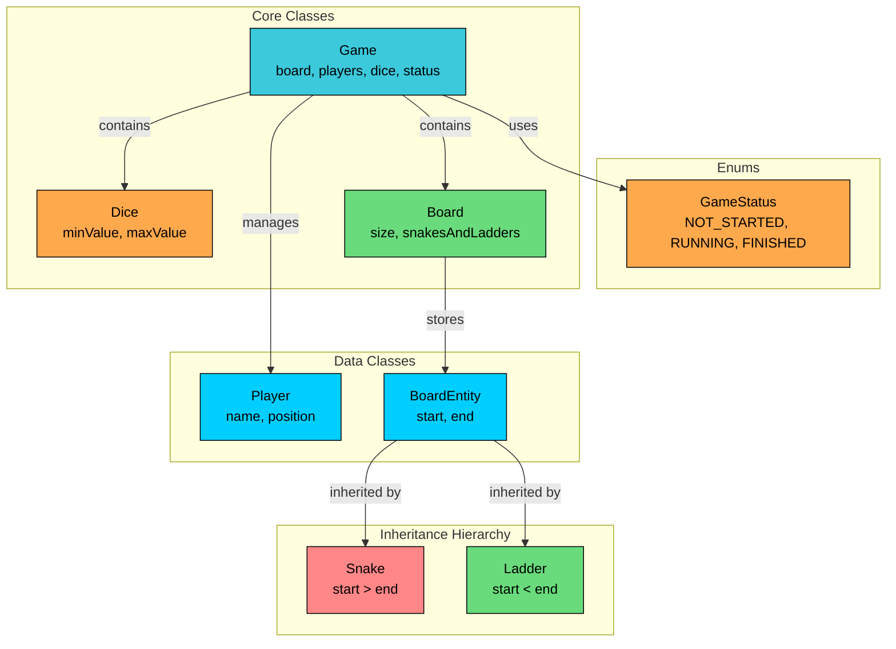


We've identified three types of entities:

**Enums** define fixed sets of values. GameStatus tracks the game lifecycle.

**Data Classes** primarily hold data with minimal behavior. Player tracks name and position. BoardEntity (and its subclasses) holds start and end positions.

**Core Classes** contain the main logic. Dice generates random rolls, Board manages position transitions, and Game orchestrates the entire gameplay loop.


| Entity | Type | Responsibility |
|--------|------|----------------|
| `GameStatus` | Enum | Game lifecycle: NOT_STARTED, RUNNING, FINISHED |
| `Player` | Data Class | Holds player name and current position |
| `BoardEntity` | Abstract Class | Base class for snakes and ladders with start/end positions |
| `Snake` | Data Class | Board entity where start &gt; end (sends player backward) |
| `Ladder` | Data Class | Board entity where start &lt; end (moves player forward) |
| `Dice` | Core Class | Simulates random dice rolls within a range |
| `Board` | Core Class | Manages the board and position transitions |
| `Game` | Core Class | Orchestrates gameplay, turns, and win detection |


With our entities identified, let's define their attributes, behaviors, and relationships.

---

## 3. Class Design

Now that we know what entities we need, let's flesh out their details. For each class, we'll define what data it holds (attributes) and what it can do (methods). Then we'll look at how these classes connect to each other.

### 3.1 Class Definitions

We'll work bottom-up: simple types first, then data containers, then the classes with real logic. This order makes sense because complex classes depend on simpler ones.

#### Enums

Enums define fixed sets of values that provide type safety and make code self-documenting.

#### `GameStatus`

Tracks where we are in the game lifecycle.


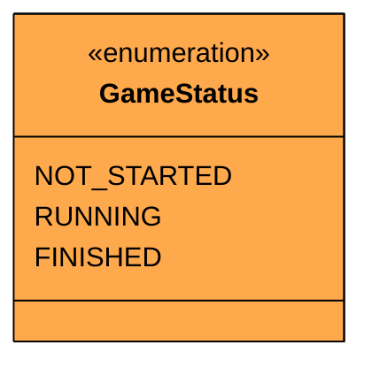


| Value | Description | Terminal? |
|-------|-------------|-----------|
| `NOT_STARTED` | Game is initialized but not yet started | No |
| `RUNNING` | Players are actively taking turns | No |
| `FINISHED` | A player has won the game | Yes |


Three distinct states cover the game lifecycle. Unlike Tic-Tac-Toe, there's no DRAW state because Snake and Ladder always eventually produces a winner.


&gt; **Design Decision**
&gt;
&gt; We use a simple three-state enum rather than embedding winner information in the status. The winner is tracked separately in the Game class. This keeps the enum simple and focused on lifecycle state.


#### Data Classes

Data classes are simple containers that hold data with minimal behavior.

#### `Player`

Encapsulates all relevant information about a player


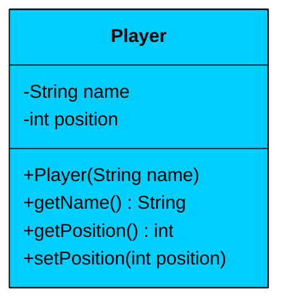


| Attribute | Type | Description | Mutable? |
|-----------|------|-------------|----------|
| `name` | String | Player identifier (e.g., "Alice") | No |
| `position` | int | Current position on the board (0-100) | Yes |


| Method | Description |
|--------|-------------|
| `Player(name)` | Constructor, initializes position to 0 |
| `getName()` | Returns the player's name |
| `getPosition()` | Returns current position |
| `setPosition(position)` | Updates the player's position |


The Player starts at position 0, which represents "off the board" (before cell 1). The position is mutable because it changes after every move. The name is immutable since it never changes during gameplay.

#### `BoardEntity`

Abstract base class for snakes and ladders.


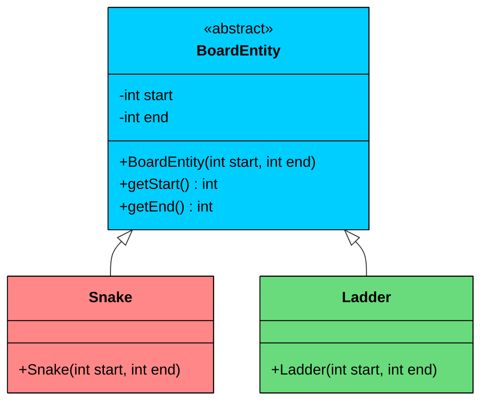


| Attribute | Type | Description |
|-----------|------|-------------|
| `start` | int | Position where the entity begins |
| `end` | int | Position where the entity transports the player |


| Method | Description |
|--------|-------------|
| `BoardEntity(start, end)` | Constructor storing start and end |
| `getStart()` | Returns the start position |
| `getEnd()` | Returns the end position |


&gt; **Design Decision**
&gt;
&gt; We use inheritance here rather than a single class with a "type" field. Why?
&gt;
&gt; Because snakes and ladders have different validation rules. A snake must have `start > end` (you slide down). A ladder must have `start < end` (you climb up). Putting this validation in subclass constructors is cleaner than checking a type field everywhere.


#### `Snake`

Represents a snake on the board.


| Validation | Rule |
|------------|------|
| Constructor | Throws exception if `start <= end` |


When a player lands on the snake's head (start position), they slide down to the tail (end position). The constructor enforces that the head is always higher than the tail.

#### `Ladder`

Represents a ladder on the board.


| Validation | Rule |
|------------|------|
| Constructor | Throws exception if `start >= end` |


When a player lands on the ladder's bottom (start position), they climb up to the top (end position). The constructor enforces that the bottom is always lower than the top.

#### Core Classes

Core classes contain the actual game logic.

#### `Dice`

A utility class responsible for simulating a dice roll.


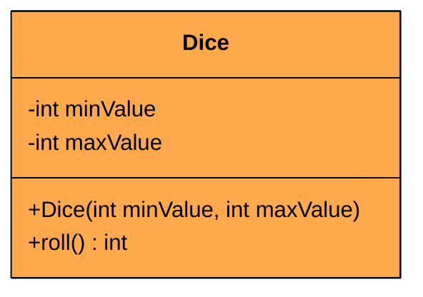


| Attribute | Type | Description |
|-----------|------|-------------|
| `minValue` | int | Minimum roll value (typically 1) |
| `maxValue` | int | Maximum roll value (typically 6) |


| Method | Description |
|--------|-------------|
| `Dice(minValue, maxValue)` | Constructor with configurable range |
| `roll()` | Returns random value between min and max (inclusive) |


#### `Board`

Manages the game board and position transitions.


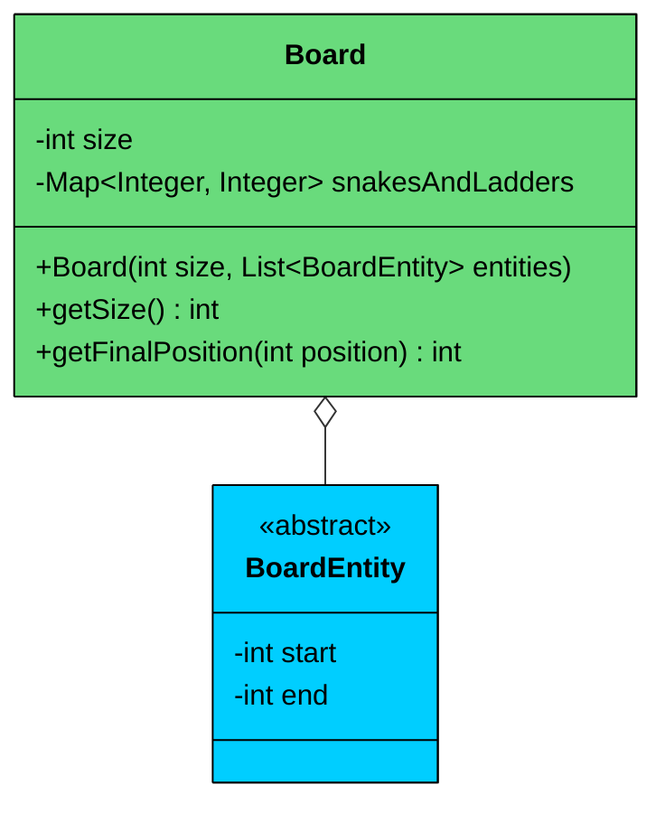


| Attribute | Type | Description |
|-----------|------|-------------|
| `size` | int | Total number of cells (100 for standard board) |
| `snakesAndLadders` | Map&lt;Integer, Integer&gt; | Maps start positions to end positions |


| Method | Description |
|--------|-------------|
| `Board(size, entities)` | Constructor that builds the position map from entities |
| `getSize()` | Returns the board size |
| `getFinalPosition(position)` | Returns the final position after applying any snake/ladder |


The Board doesn't store individual cells because we don't need to track cell contents. Instead, it maintains a map from snake/ladder start positions to their end positions. When a player lands on a position, we check if there's an entry in this map. If so, we return the mapped position; otherwise, we return the original position.


&gt; **Design Decision**
&gt;
&gt; Using a Map for O(1) lookup is efficient. We could store separate lists of snakes and ladders, but the map simplifies the `getFinalPosition()` logic to a single lookup.


#### `Game`

Main orchestrator that coordinates all game elements.


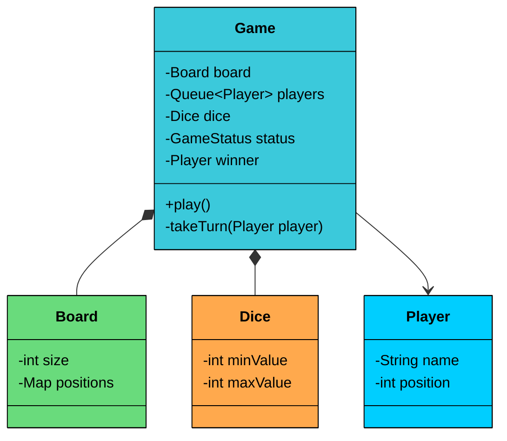


| Attribute | Type | Description |
|-----------|------|-------------|
| `board` | Board | The game board (composition) |
| `players` | Queue&lt;Player&gt; | Players in turn order |
| `dice` | Dice | The dice for rolling (composition) |
| `status` | GameStatus | Current game state |
| `winner` | Player | The winning player (null until game ends) |


| Method | Description |
|--------|-------------|
| `Game(Builder)` | Private constructor, takes Builder |
| `play()` | Main game loop that runs until someone wins |
| `takeTurn(player)` | Handles a single player's turn |


**Key Design Principles:**

1. **Orchestration:** Game ties everything together. It owns the Board and Dice, manages the Player queue, and runs the game loop until a winner is determined.
2. **Queue for Turn Management:** Using a Queue for turn rotation is natural. We poll the front player for their turn, and if the game continues, add them back to the queue. This handles any number of players elegantly.
3. **Builder Pattern:** Game construction is complex (board, players, dice all need configuration). The Builder pattern makes this clean and readable.

---

### 3.2 Class Relationships

How do these classes connect? Let's examine the relationship types we use.

#### Composition (Strong Ownership)

Composition means one object owns another. When the owner is destroyed, the owned object is destroyed too.

- **Game owns Board:** When you create a Game, it creates its own Board. The Board exists only for that game.
- **Game owns Dice:** Each Game creates its own Dice. The Dice doesn't exist outside the game context.

#### Aggregation (Weak Ownership)

Aggregation means one object contains other objects, but the contained objects can exist independently.

- **Game manages Players:** The Game has a collection of Players. Players are conceptually separate entities that could exist outside this specific game (imagine a player playing multiple games).
- **Board aggregates BoardEntities:** The Board uses a list of BoardEntity objects (snakes and ladders) that are created outside the Board and passed to it.

#### Inheritance (Is-A)

Inheritance defines a hierarchy between classes where subclasses are specialized versions of the parent.

- **Snake extends BoardEntity:** A Snake is a specialized BoardEntity that transports players downward.
- **Ladder extends BoardEntity:** A Ladder is a specialized BoardEntity that transports players upward.

---

### 3.3 Key Design Patterns

You might notice some structural patterns emerging in our design. Let's make them explicit and justify why each pattern is appropriate here.

#### [**Builder Pattern**](/learn/lld/builder)

**The Problem:** Creating a Game requires multiple configuration steps: setting up the board with snakes and ladders, adding players, and configuring the dice. If we use a constructor with many parameters, it becomes hard to read and error-prone. What order do the parameters go in? Which ones are optional?

**The Solution:** The Builder pattern encapsulates the construction logic in a separate Builder class. Each configuration step returns the builder, allowing method chaining. The final `build()` call validates everything and creates the Game.


```java
// Without Builder - hard to read, easy to mess up parameter order
Game game = new Game(100, entities, playerNames, 1, 6);

// With Builder - clear and readable
Game game = new Game.Builder()
    .setBoard(100, entities)
    .setPlayers(playerNames)
    .setDice(new Dice(1, 6))
    .build();
```


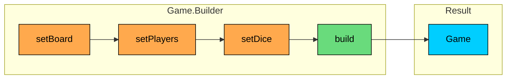


&gt; **Design Decision**
&gt;
&gt; The Builder is an inner static class of Game. This keeps related code together and allows the builder to access Game's private constructor. The `build()` method validates that all required components are set before creating the Game.


#### [**Template Method Pattern**](/lld/template-method) (BoardEntity Hierarchy)

**The Problem:** Snakes and ladders share the same structure (start and end positions) but have different validation rules. We don't want to duplicate the common code.

**The Solution:** The abstract `BoardEntity` class defines the common structure and behavior. Subclasses (`Snake`, `Ladder`) provide their specific validation in their constructors, which call the parent constructor after validation.

This is a classic use of inheritance for shared structure with specialized behavior:

- Common code (storing start/end, getters) lives in the base class
- Validation rules specific to each type live in subclass constructors
- Adding a new board entity type (e.g., a "Portal" that teleports to a random position) just requires a new subclass


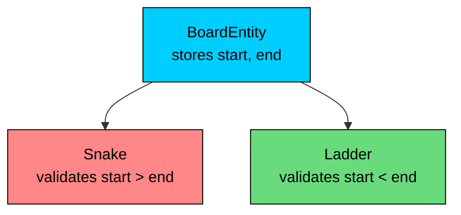


#### [**Facade Pattern**](/learn/lld/facade)** (**Game as Controller**)**

**The Problem:** External code shouldn't need to understand the internals of Board, Dice, and Player management. They just want to start and play a game.

**The Solution:** The Game class acts as a facade, providing simple `play()` method that hides all the complexity of turn management, dice rolling, position updates, and win detection.

The Game class provides:

- A single entry point for running the game
- Encapsulation of the game loop logic
- Console output for game progress without requiring external coordination

---

### 3.4 Full Class Diagram


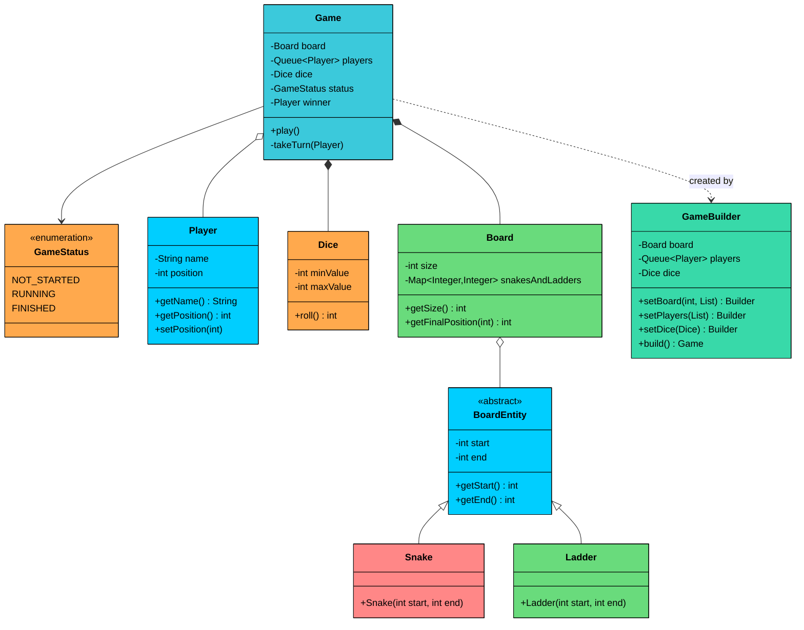


---

## 4. Code Implementation

Now let's translate our design into working code. We'll build bottom-up: foundational types first, then data classes, then the classes with real logic. This order matters because each layer depends on the ones below it.


#### Java

### 4.1 Enum

We start with the enum that tracks game state.

#### `GameStatus`


```java
enum GameStatus {
    NOT_STARTED,
    RUNNING,
    FINISHED
}
```


Three states cover the game lifecycle. The game starts `NOT_STARTED`, transitions to `RUNNING` when play begins, and ends as `FINISHED` when someone wins.

### 4.2 Data Classes

These classes primarily hold data with minimal logic.

#### `Player`


```java
class Player {
    private final String name;
    private int position;

    public Player(String name) {
        this.name = name;
        this.position = 0;
    }

    public String getName() {
        return name;
    }

    public int getPosition() {
        return position;
    }

    public void setPosition(int position) {
        this.position = position;
    }
}
```


Players start at position 0, which represents "off the board" (before cell 1). The name is immutable, but position changes throughout the game.

Now let's implement the BoardEntity hierarchy:

#### `BoardEntity`


```java
abstract class BoardEntity {
    private final int start;
    private final int end;

    public BoardEntity(int start, int end) {
        this.start = start;
        this.end = end;
    }

    public int getStart() {
        return start;
    }

    public int getEnd() {
        return end;
    }
}
```


The abstract base class stores the common attributes. Both fields are final because a snake or ladder's position never changes during the game.

#### `Snake`


```java
class Snake extends BoardEntity {
    public Snake(int start, int end) {
        super(start, end);
        if (start <= end) {
            throw new IllegalArgumentException(
                "Snake head must be at a higher position than its tail."
            );
        }
    }
}
```


The Snake constructor enforces the rule that snakes go downward. If someone tries to create a snake where the head is below the tail, we fail immediately with a clear error message.

#### `Ladder`


```java
class Ladder extends BoardEntity {
    public Ladder(int start, int end) {
        super(start, end);
        if (start >= end) {
            throw new IllegalArgumentException(
                "Ladder bottom must be at a lower position than its top."
            );
        }
    }
}
```


Similarly, the Ladder constructor enforces that ladders go upward. This "fail fast" validation catches configuration errors immediately.

### 4.3 Dice Class

The Dice encapsulates random number generation with a configurable range.


```java
class Dice {
    private final int minValue;
    private final int maxValue;

    public Dice(int minValue, int maxValue) {
        this.minValue = minValue;
        this.maxValue = maxValue;
    }

    public int roll() {
        return (int) (Math.random() * (maxValue - minValue + 1) + minValue);
    }
}
```


The formula `Math.random() * (max - min + 1) + min` generates a random integer in the inclusive range [min, max]. For a standard die, this returns values 1 through 6 with equal probability.

### 4.4 Board Class

The Board manages the game surface and position transitions.


```java
class Board {
    private final int size;
    private final Map<Integer, Integer> snakesAndLadders;

    public Board(int size, List<BoardEntity> entities) {
        this.size = size;
        this.snakesAndLadders = new HashMap<>();

        for (BoardEntity entity : entities) {
            snakesAndLadders.put(entity.getStart(), entity.getEnd());
        }
    }

    public int getSize() {
        return size;
    }

    public int getFinalPosition(int position) {
        return snakesAndLadders.getOrDefault(position, position);
    }
}
```


The Board converts the list of BoardEntity objects into a Map for O(1) position lookups. The `getFinalPosition()` method is elegant: if the position is in the map (snake head or ladder bottom), return the mapped value. Otherwise, return the original position. This single method handles both snakes and ladders uniformly.

### 4.5 Game Class

This is where everything comes together. The Game orchestrates the entire gameplay loop.


```java
import java.util.*;

class Game {
    private final Board board;
    private final Queue<Player> players;
    private final Dice dice;
    private GameStatus status;
    private Player winner;

    private Game(Builder builder) {
        this.board = builder.board;
        this.players = new LinkedList<>(builder.players);
        this.dice = builder.dice;
        this.status = GameStatus.NOT_STARTED;
    }

    public void play() {
        if (players.size() < 2) {
            System.out.println("Cannot start game. At least 2 players are required.");
            return;
        }

        this.status = GameStatus.RUNNING;
        System.out.println("Game started!");

        while (status == GameStatus.RUNNING) {
            Player currentPlayer = players.poll();
            takeTurn(currentPlayer);

            if (status == GameStatus.RUNNING) {
                players.add(currentPlayer);
            }
        }

        System.out.println("Game Finished!");
        if (winner != null) {
            System.out.printf("The winner is %s!%n", winner.getName());
        }
    }

    private void takeTurn(Player player) {
        int roll = dice.roll();
        System.out.printf("%n%s's turn. Rolled a %d.%n", player.getName(), roll);

        int currentPosition = player.getPosition();
        int nextPosition = currentPosition + roll;

        // Check if overshooting the board
        if (nextPosition > board.getSize()) {
            System.out.printf(
                "Oops, %s needs to land exactly on %d. Turn skipped.%n",
                player.getName(), board.getSize()
            );
            return;
        }

        // Check for win
        if (nextPosition == board.getSize()) {
            player.setPosition(nextPosition);
            this.winner = player;
            this.status = GameStatus.FINISHED;
            System.out.printf(
                "Hooray! %s reached the final square %d and won!%n",
                player.getName(), board.getSize()
            );
            return;
        }

        // Apply snake or ladder if present
        int finalPosition = board.getFinalPosition(nextPosition);

        if (finalPosition > nextPosition) {
            System.out.printf(
                "Wow! %s found a ladder at %d and climbed to %d.%n",
                player.getName(), nextPosition, finalPosition
            );
        } else if (finalPosition < nextPosition) {
            System.out.printf(
                "Oh no! %s was bitten by a snake at %d and slid down to %d.%n",
                player.getName(), nextPosition, finalPosition
            );
        } else {
            System.out.printf(
                "%s moved from %d to %d.%n",
                player.getName(), currentPosition, finalPosition
            );
        }

        player.setPosition(finalPosition);

        // Extra turn for rolling 6
        if (roll == 6) {
            System.out.printf("%s rolled a 6 and gets another turn!%n", player.getName());
            takeTurn(player);
        }
    }

    // Builder inner class
    public static class Builder {
        private Board board;
        private Queue<Player> players;
        private Dice dice;

        public Builder setBoard(int boardSize, List<BoardEntity> boardEntities) {
            this.board = new Board(boardSize, boardEntities);
            return this;
        }

        public Builder setPlayers(List<String> playerNames) {
            this.players = new LinkedList<>();
            for (String playerName : playerNames) {
                players.add(new Player(playerName));
            }
            return this;
        }

        public Builder setDice(Dice dice) {
            this.dice = dice;
            return this;
        }

        public Game build() {
            if (board == null || players == null || dice == null) {
                throw new IllegalStateException("Board, Players, and Dice must be set.");
            }
            return new Game(this);
        }
    }
}
```


Let's break down the key aspects of the Game class:

**The **`play()`** method:**

1. Validates minimum player count
2. Sets status to RUNNING
3. Loops until someone wins, using a Queue for turn rotation
4. After each turn, if the game continues, the player goes back to the end of the queue

**The **`takeTurn()`** method handles all the game rules:**

1. Roll the dice and print the result
2. Calculate the next position
3. If overshooting 100, skip the turn
4. If landing exactly on 100, declare winner
5. Check for snakes/ladders and print appropriate message
6. Update player position
7. If rolled a 6, recursively call `takeTurn()` for the extra turn

**The Builder pattern:**

- Private Game constructor forces use of Builder
- Each setter returns `this` for method chaining
- `build()` validates all components are set
- Clean, readable game construction

#### Game Flow Sequence

The following diagram illustrates what happens during a player's turn:


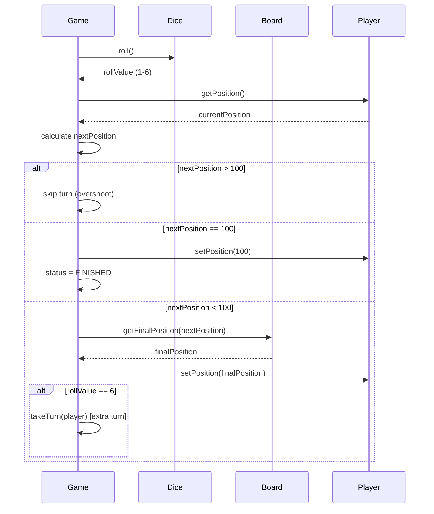


### 4.6 Demo Class

Let's see the system in action with a demo that sets up a game with snakes and ladders.


```java
import java.util.*;

public class SnakeAndLadderDemo {
    public static void main(String[] args) {
        List<BoardEntity> boardEntities = List.of(
            new Snake(17, 7),
            new Snake(54, 34),
            new Snake(62, 19),
            new Snake(98, 79),
            new Ladder(3, 38),
            new Ladder(24, 33),
            new Ladder(42, 93),
            new Ladder(72, 84)
        );

        List<String> players = Arrays.asList("Alice", "Bob", "Charlie");

        Game game = new Game.Builder()
            .setBoard(100, boardEntities)
            .setPlayers(players)
            .setDice(new Dice(1, 6))
            .build();

        game.play();
    }
}
```


The demo creates:

- 4 snakes at positions 17→7, 54→34, 62→19, and 98→79
- 4 ladders at positions 3→38, 24→33, 42→93, and 72→84
- 3 players: Alice, Bob, and Charlie
- A standard 1-6 dice

The Builder pattern makes this setup clean and readable. Each configuration step is explicit.


---

## 5. Run and Test

---

## 6. Quiz

</section>
