import React from 'react';
import CodeBlock from '../../../../components/ui/CodeBlock';
import Callout from '../../../../components/ui/Callout';

<div className="article-header">
  <div className="breadcrumb">
    <a href="/">Curated Notes</a>
    <span className="breadcrumb-separator">›</span>
    <span className="breadcrumb-current">Design Tic Tac Toe Game</span>
  </div>
  <h1>Design Tic Tac Toe Game</h1>
  <p style={{ color: 'var(--text-muted)', fontSize: '1.1rem', marginBottom: '16px', lineHeight: '1.6' }}>
    Master the essentials of Design Tic Tac Toe Game in this curated guide.
  </p>
  <div className="meta-info">
    <span className="meta-item">
      <svg width="14" height="14" viewBox="0 0 24 24" fill="none" stroke="currentColor" strokeWidth="2"><circle cx="12" cy="12" r="10"/><polyline points="12 6 12 12 16 14"/></svg>
      10 min read
    </span>
    <span className="difficulty-badge difficulty-badge--intermediate">Intermediate</span>
  </div>
</div>

<section className="content-section">


&gt; **QUESTION**
&gt;
&gt; #### What is Tic-Tac-Toe Game?
&gt;
&gt; Tic Tac Toe is a classic two-player game played on a 3x3 grid. Players take turns marking empty cells with their respective symbols: **X** or **O**.
&gt;
&gt; 
&gt; 
&gt; 
&gt;
&gt; The goal is to be the first to place three of your symbols in a row, either horizontally, vertically, or diagonally. At the same time, you must try to prevent your opponent from achieving the same. If all cells are filled and no player wins, the game ends in a draw.


In this chapter, we will explore the **low-level design of a tic tac toe game** in detail.

Lets start by clarifying the requirements:

---

## 1. Clarifying Requirements

Before starting any design, it's important to ask thoughtful questions to uncover hidden assumptions, clarify ambiguities, and define the system's scope.

Here is an example of how a discussion between the candidate and the interviewer might unfold:


&gt; **DISCUSSION**
&gt;
&gt; **Candidate:** "Should the game support variable board sizes, such as 4x4 or 5x5?"
&gt;
&gt; **Interviewer:** "For the purpose of this interview, let’s stick with the standard 3x3 board."
&gt;
&gt; **Candidate:** "Should the game support both player-vs-player and player-vs-computer modes?"
&gt;
&gt; **Interviewer:** "Let’s keep it simple and focus only on the player-vs-player mode for now."
&gt;
&gt; **Candidate:** "What should happen if a player tries to make an invalid move, like selecting an already filled cell?"
&gt;
&gt; **Interviewer: "**The game should reject the move and inform the player to make another selection."
&gt;
&gt; **Candidate:** "Should the system maintain a scoreboard across multiple games to track player wins?"
&gt;
&gt; **Interviewer:** "Yes, tracking the scoreboard across games would be a good addition."
&gt;
&gt; **Candidate:** "How should the user input be handled? Should we take input from the console, or just hardcode a sample game sequence?"
&gt;
&gt; **Interviewer:** "To keep things focused on the design, you can hardcode a sample sequence in a demo or main method."
&gt;
&gt; **Candidate:** "Should we track the history of moves to allow features like undo or move replay?"
&gt;
&gt; **Interviewer:** "That's an interesting feature to consider, but let’s leave it out for now and focus on the core gameplay logic."


After gathering the details, we can summarize the key system requirements.

### 1.1 Functional Requirements

- The game is played on a **3x3 grid**.
- Two players take alternate turns, identified by markers **‘X’** and **‘O’**.
- The game should **detect and announce the winner.**
- The game should **declare a draw** if all cells are filled and no player has won.
- The game should **reject invalid moves** and inform the player.
- The system should maintain a **scoreboard** across multiple games.
- Moves can be **hardcoded in a driver/demo class** to simulate gameplay.

### 1.2 Non-Functional Requirements

- The design should follow **object-oriented principles** with clear responsibilities and separation of concerns.
- The system should be **modular and extensible** to support future features like larger boards, AI opponent, move history, etc.
- The game logic should be **testable** and **easy to maintain**.
- The system should provide **clear console output** that reflects the current state of the game board.

After the requirements are clear, the next step is to identify the core entities that we will form the foundation of our design.

---

## 2. Identifying Core Entities

How do you go from a list of requirements to actual entities/classes?

The key is to look for **nouns** in the requirements that have distinct attributes or behaviors. Not every noun becomes a class, but this approach gives you a starting point.

Let's walk through our requirements and identify what needs to exist in our system.

#### **1. The game is played on a 3x3 grid.**

The grid is central to everything. We need something to represent it. This gives us our first entity: `Board`.

But what is a grid made of? Individual squares. Each square can be empty or contain a symbol. This suggests a second entity: `Cell`. The Board will contain 9 Cells arranged in a 3x3 structure.


&gt; **Why separate Board and Cell?**
&gt;
&gt; Because they have different responsibilities. The Board manages the overall grid structure and operations like "is the board full?" or "place a symbol at position (1,2)". The Cell just holds a single value. 
&gt;
&gt; This separation also makes the code cleaner. If we later want to add features like highlighting the winning cells, the Cell class is the natural place for that logic.


#### 2. Two players take alternate turns, identified by markers ‘X’ and ‘O’.

We need to represent players. Each player has a name and an assigned symbol. This gives us the `Player` entity.

**What about the symbols themselves?**

We could use strings ("X", "O") or characters, but that's error-prone. What stops someone from creating a player with symbol "Z"? 

Using an enum `Symbol` with values `X`, `O`, and `EMPTY` gives us type safety. The compiler will catch invalid symbols at compile time rather than runtime.

#### 3. The game processes moves and determines game outcomes.

Something needs to coordinate the gameplay: accept moves, validate them, check for wins, switch turns. This orchestrator is our `Game` entity.

The game also needs to track its current state. Is it still in progress? Did someone win? Is it a draw? 

We could use a boolean `isGameOver` and a `winner` field, but that gets messy. What if we need to distinguish between "X won" and "O won"? 

An enum `GameStatus` with values `IN_PROGRESS`, `WINNER_X`, `WINNER_O`, and `DRAW` captures all possibilities cleanly.

#### 4. The system should maintain a scoreboard across multiple games.

A single Game object handles one game. But our requirements say we need to track scores across multiple games. This suggests two more entities:

- `Scoreboard`: Tracks how many times each player has won
- `TicTacToeSystem`: A central controller that creates games and maintains the shared scoreboard

The TicTacToeSystem acts as a facade. External code doesn't need to know about Game, Board, or Scoreboard directly. It just calls **system.createGame()** and **system.makeMove()**.

#### Entity Overview

Here's how these entities relate to each other:


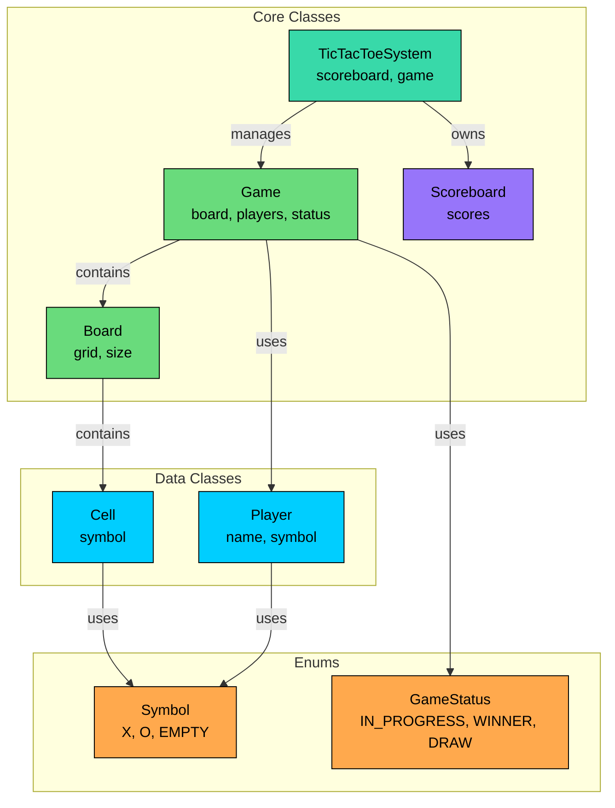


We've identified three types of entities:

**Enums** define fixed sets of values. They provide type safety and make code self-documenting.

**Data Classes** primarily hold data with minimal behavior. Player and Cell are simple containers.

**Core Classes** contain the main logic. Board manages the grid, Game orchestrates gameplay, Scoreboard tracks history, and TicTacToeSystem ties everything together.


| Entity | Type | Responsibility |
|--------|------|----------------|
| `Symbol` | Enum | Cell values: X, O, or EMPTY |
| `GameStatus` | Enum | Game state: IN_PROGRESS, WINNER_X, WINNER_O, DRAW |
| `Cell` | Data Class | Holds a single symbol |
| `Player` | Data Class | Holds player name and assigned symbol |
| `Board` | Core Class | Manages the 3x3 grid |
| `Game` | Core Class | Orchestrates gameplay and win detection |
| `Scoreboard` | Core Class | Tracks wins across games |
| `TicTacToeSystem` | Core Class | Facade for the entire system |


With our entities identified, let's define their attributes, behaviors, and relationships.

---

## 3. Designing Classes and Relationships

Now that we know what entities we need, let's flesh out their details. For each class, we'll define what data it holds (attributes) and what it can do (methods). Then we'll look at how these classes connect to each other.


&gt; **NOTE**
&gt;
&gt; While listing class methods, we will skip trivial **getters and setters** to keep the walkthrough focused on core behaviors


### 3.1 Class Definitions

We'll work bottom-up: simple types first, then data containers, then the classes with real logic. This order makes sense because complex classes depend on simpler ones.

#### Enums

Enums define fixed sets of values that provide type safety and make code self-documenting. Using enums prevents invalid states at compile time rather than runtime.

#### `Symbol`

Represents the values a cell can contain.


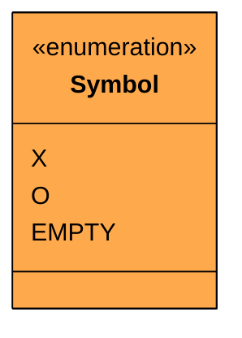


| Value | Display Character | Purpose |
|-------|-------------------|---------|
| `X` | 'X' | First player's marker |
| `O` | 'O' | Second player's marker |
| `EMPTY` | '_' | Unoccupied cell |


Each enum value maps to a display character for printing the board.

#### `GameStatus`

Defines the possible states of the game. Tracks where we are in the game lifecycle.


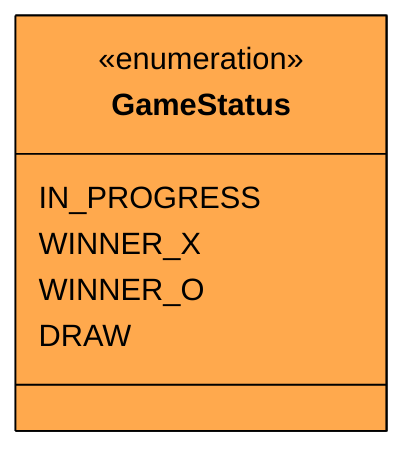


| Value | Description | Terminal? |
|-------|-------------|-----------|
| `IN_PROGRESS` | Game is still being played | No |
| `WINNER_X` | Player with X symbol won | Yes |
| `WINNER_O` | Player with O symbol won | Yes |
| `DRAW` | Board is full, no winner | Yes |


Four distinct states cover all possible game outcomes. A game starts as `IN_PROGRESS` and transitions to exactly one terminal state when it ends.


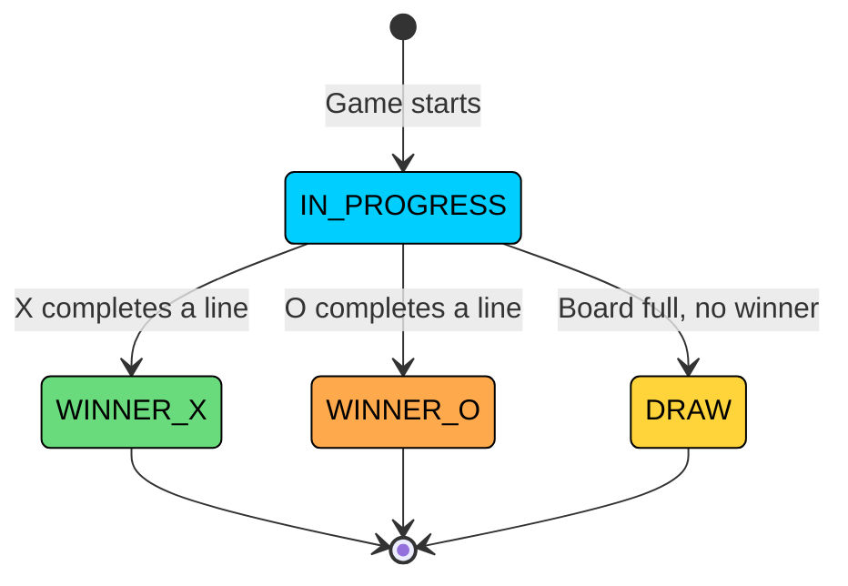


Notice that all terminal states are one-way. There's no transition from DRAW back to IN_PROGRESS, and no transition from WINNER_X to WINNER_O. Once a game ends, it stays ended.


&gt; **Design Decision**
&gt;
&gt; We use `WINNER_X` and `WINNER_O` instead of a generic `WINNER` with a separate winner field. This makes status checks simpler: `if (status == GameStatus.WINNER_X)` instead of `if (status == GameStatus.WINNER && winner.getSymbol() == Symbol.X)`. 
&gt;
&gt; It also makes the enum self-contained. You can determine the winner from the status alone without needing additional context.


#### Data Classes

Data classes are simple containers that hold data with minimal behavior. They represent the "nouns" in our system that have attributes but little logic.

#### `Player`

Holds player information.


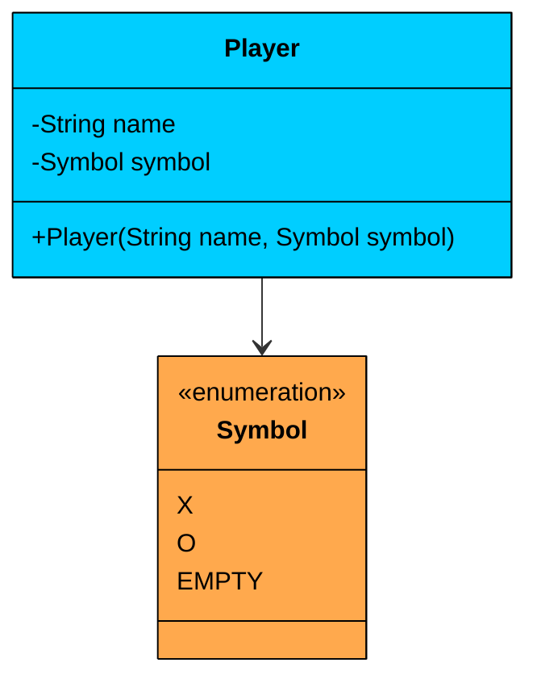


| Attribute | Type | Description |
|-----------|------|-------------|
| `name` | String | Player identifier (e.g., "Alice") |
| `symbol` | Symbol | The marker assigned to the player (X or O) |


| Method | Description |
|--------|-------------|
| `Player(name, symbol)` | Constructor with validation (rejects EMPTY symbol) |


The Player class is **immutable**. Once created, a player's name and symbol don't change. This prevents bugs where someone accidentally reassigns a player's symbol mid-game.

#### `Cell`

Holds the current value of a board position.


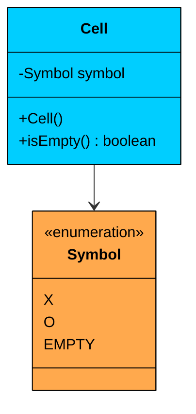


| Attribute | Type | Description |
|-----------|------|-------------|
| `symbol` | Symbol | Current value: X, O, or EMPTY |


| Method | Description |
|--------|-------------|
| `Cell()` | Constructor, initializes symbol to EMPTY |
| `isEmpty()` | Returns true if symbol is EMPTY |


Unlike Player, Cell is **mutable**. It starts as `EMPTY` and gets set to X or O when a player makes a move.

The `isEmpty()` helper method makes calling code more readable:

- `if (cell.isEmpty())` is clearer than `if (cell.getSymbol() == Symbol.EMPTY)`

#### Interfaces

Interfaces define contracts for interchangeable behavior.

#### `WinningStrategy`

After each move, the Game needs to check whether someone won. We could write three separate checks (row, column, diagonal) inline, but that's rigid. If the interviewer says "now add a four-corners win condition," you'd have to modify Game.

`WinningStrategy` defines the contract for win detection algorithms.


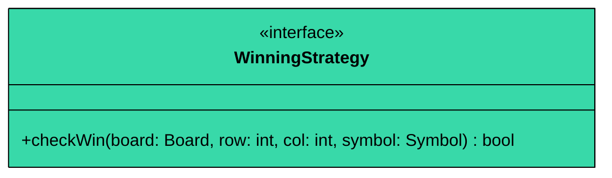


| Method | Parameters | Returns | Description |
|--------|------------|---------|-------------|
| `checkWin` | `board`, `row`, `col`, `symbol` | `bool` | Checks if the given symbol has won after being placed at (row, col) |


The Game iterates through all strategies without knowing which specific checks exist. Adding a new win condition is just a matter of creating a new class that implements this interface and adding it to the list.

#### `GameObserver`

When a game ends, other components might need to react. The Scoreboard records the result, but a logger might write to a file, or an analytics service might track game duration. We don't want Game to know about all of these.

`GameObserver` defines the contract for listening to game end events.


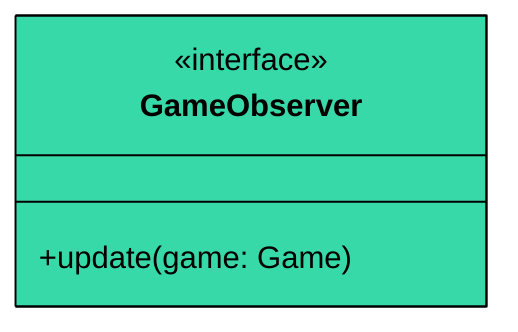


| Method | Parameters | Returns | Description |
|--------|------------|---------|-------------|
| `update` | `game` | `void` | Called when a game ends, receives the finished Game object |


The Game notifies all observers when it ends. Observers decide what to do with the information. The Scoreboard extracts the winner and records the result. A future logger could extract the move count and game duration. Neither requires any changes to Game.

#### Core Classes

Core classes contain the actual game logic. They coordinate between data classes and implement the rules of the game.

#### `Board`

Encapsulates the 3x3 grid and handles all board-related operations including its state and the rules for checking win/draw conditions.


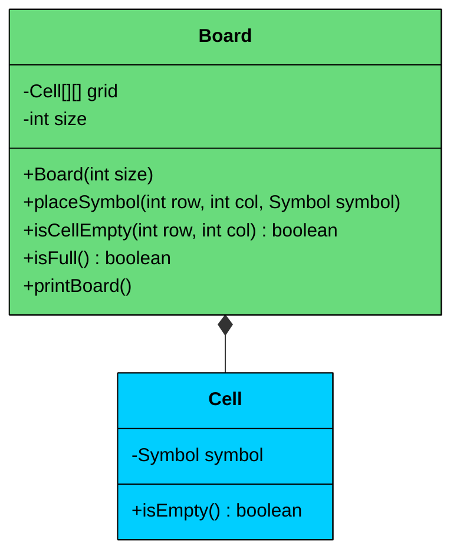


| Attribute | Type | Description |
|-----------|------|-------------|
| `grid` | Cell[][] | 2D array of cells |
| `size` | int | Board dimension (3 for standard game) |


| Method | Description |
|--------|-------------|
| `Board(size)` | Constructor, creates size×size grid of empty cells |
| `placeSymbol(row, col, symbol)` | Places a symbol at the given position |
| `isCellEmpty(row, col)` | Returns true if the cell is available |
| `isFull()` | Returns true if no empty cells remain |
| `printBoard()` | Displays the current board state to console |


&gt; **Key Design Principles**
&gt;
&gt; 1. **Single Responsibility:** The Board doesn't know about players or game rules. It just manages a grid of cells. This separation means we could reuse Board for other grid-based games like Connect Four or Battleship.
&gt; 2. **Composition:** Board *owns* its Cells (composition relationship). When a Board is created, it creates all 9 Cells. When the Board is garbage collected, the Cells go with it. No Cell exists outside a Board.
&gt; 3. **Encapsulation:** The grid array is private. External code accesses cells through `getCell()`, which validates bounds first.


#### `Game`

The orchestrator that brings all components together and manages gameplay.


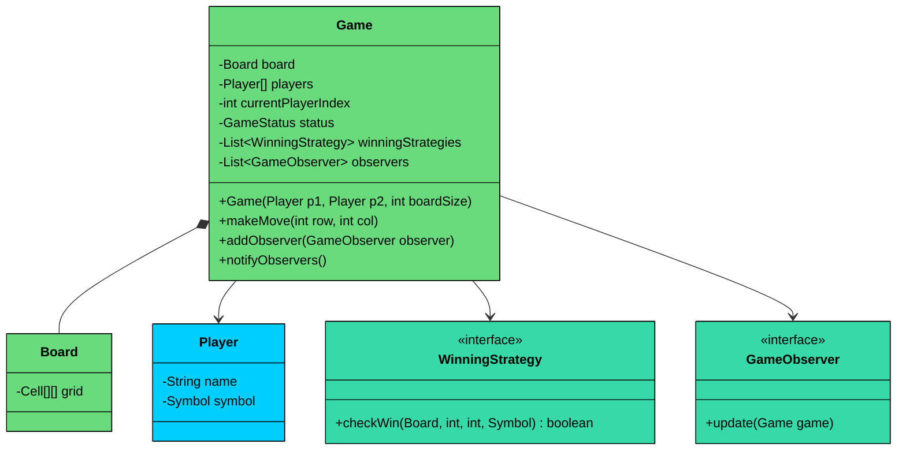


| Attribute | Type | Description |
|-----------|------|-------------|
| `board` | Board | The game board |
| `players` | Player[] | The two players |
| `currentPlayerIndex` | int | Whose turn it is (0 or 1) |
| `status` | GameStatus | Current game state |
| `winningStrategies` | List&lt;WinningStrategy&gt; | Strategies for win detection |
| `observers` | List&lt;GameObserver&gt; | Listeners for game end events |


| Method | Description |
|--------|-------------|
| `Game(p1, p2, boardSize)` | Constructor, initializes all components |
| `makeMove(row, col)` | Core method: validate, place, check win/draw, switch turn |
| `addObserver(observer)` | Register a listener for game end events |
| `notifyObservers()` | Notify all listeners that game ended |


Game ties everything together. It owns the Board, knows the Players, tracks whose turn it is, and uses WinningStrategies to detect wins. When the game ends, it notifies observers (like the Scoreboard).

#### `Scoreboard`

Tracks wins across multiple games.


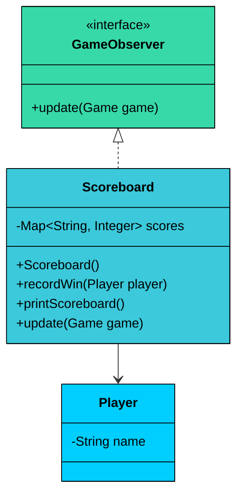


| Attribute | Type | Description |
|-----------|------|-------------|
| `scores` | Map&lt;String, Integer&gt; | Maps player names to win counts |


| Method | Description |
|--------|-------------|

| `recordWin(player)` | Increment a player's win count |
| `getScore(playerName)` | Get a player's current score |
| `printScoreboard()` | Display all scores |


The Scoreboard implements `GameObserver` so it can automatically update when games end.

`TicTacToeSystem`

This is the public-facing facade.


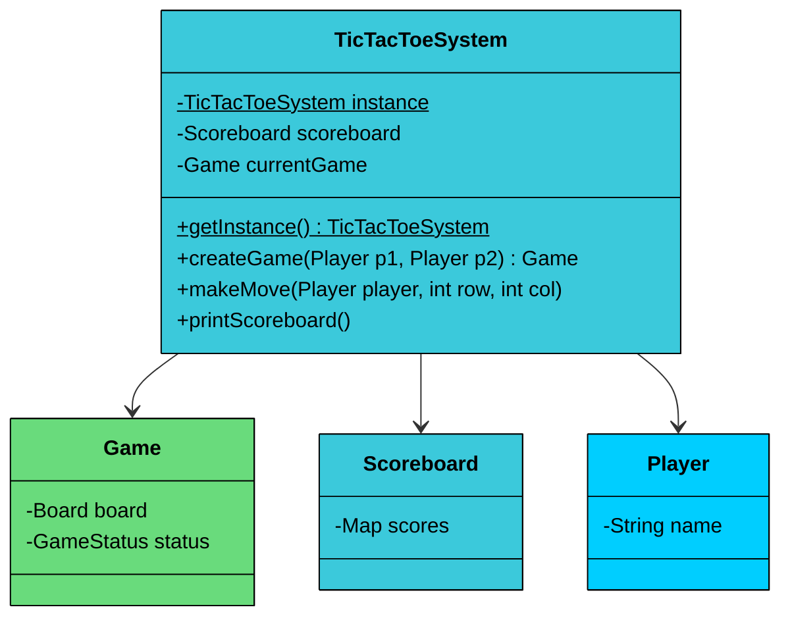


| Attribute | Type | Description |
|-----------|------|-------------|
| `instance` | TicTacToeSystem | Singleton instance |
| `scoreboard` | Scoreboard | Shared scoreboard |
| `currentGame` | Game | The active game |


| Method | Description |
|--------|-------------|
| `getInstance()` | Get the singleton instance |
| `createGame(player1, player2)` | Start a new game |
| `makeMove(player, row, col)` | Make a move in the current game |
| `printScoreboard()` | Display scores |


External code only interacts with TicTacToeSystem. It doesn't need to know about Board, Cell, or WinningStrategy.

---

### 3.2 Class Relationships

How do these classes connect? There are three types of relationships we use.

#### Composition (Strong Ownership)

Composition means one object owns another. When the owner is destroyed, the owned object is destroyed too.

- **Board owns Cells:** When you create a Board, it creates 9 Cells. Those Cells don't exist outside the Board. When the Board is garbage collected, so are its Cells.
- **Game owns Board:** Each Game creates its own Board. The Board exists only for that game.

#### Association (Weak Reference)

Association means one object uses another, but doesn't own it. Both objects have independent lifecycles.

- **Game uses Players:** The Game receives Player objects but doesn't create them. The same Player can participate in multiple games. If a Game ends, the Player objects continue to exist.
- **Game uses WinningStrategies:** The Game uses strategies to check for wins, but the strategies could be shared across games.
- **TicTacToeSystem uses Scoreboard:** The system references a Scoreboard but the Scoreboard has its own lifecycle.

#### Implementation (Interface Contract)

Implementation means a class fulfills an interface contract.

- **RowWinningStrategy, ColumnWinningStrategy, DiagonalWinningStrategy implement WinningStrategy:** All three classes can check for wins, but each checks a different pattern.
- **Scoreboard implements GameObserver:** Scoreboard receives notifications when games end, but Game doesn't know it's talking to a Scoreboard specifically.

---

### 3.3 Key Design Patterns

You might notice some structural patterns emerging in our design. Let's make them explicit and justify why each pattern is appropriate here.

#### [**Strategy Pattern**](/learn/lld/strategy)** (Win Detection)**

**The Problem:** A player can win in three distinct ways: completing a row, a column, or a diagonal. If we hardcode all win conditions in a single method, we end up with a long, complex function that's hard to test and modify. Adding a new win condition (like "four corners" in a variant) would require changing existing code.

**The Solution:** The Strategy pattern encapsulates each win-checking algorithm in its own class. The Game holds a list of WinningStrategy implementations and iterates through them to check for a winner.

The Strategy pattern gives us:

- **Testability:** Each strategy can be unit tested in isolation
- **Extensibility:** Adding new win conditions means adding a new class, not modifying existing code
- **Single Responsibility:** Each strategy handles exactly one type of win check


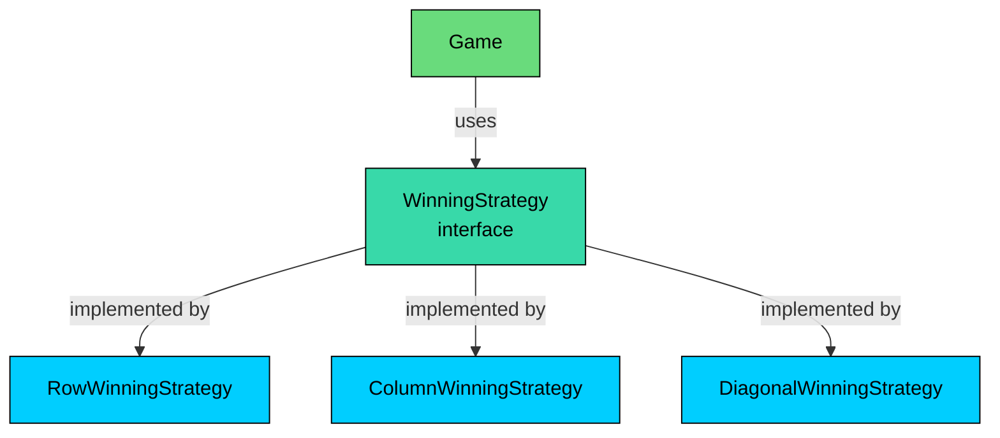


&gt; **Design Decision**
&gt;
&gt; We check all strategies on every move rather than optimizing for the last move position. This is simpler and more maintainable. 
&gt;
&gt; For a 3x3 board, the performance difference is negligible. If we were building for larger boards, we might optimize by only checking strategies relevant to the last move's position.


#### [Observer Pattern](/learn/lld/observer) (Scoreboard Updates)

**The Problem:** When a game ends, the Scoreboard needs to update. The naive approach is to have the Game directly call `scoreboard.recordWin()`. But this couples the Game to the Scoreboard. What if we want to add analytics tracking? Or a replay recorder? Each new listener would require modifying the Game class.

**The Solution:** The Observer pattern decouples the Game (subject) from its listeners (observers). The Game maintains a list of observers and notifies them when the game ends.

**Why Observer Pattern?** 

For a single Scoreboard, direct method calls would work fine. We use Observer because:

- It demonstrates proper decoupling
- It makes adding new listeners trivial (analytics, logging, replays)
- It keeps the Game focused on game logic, not notification logistics


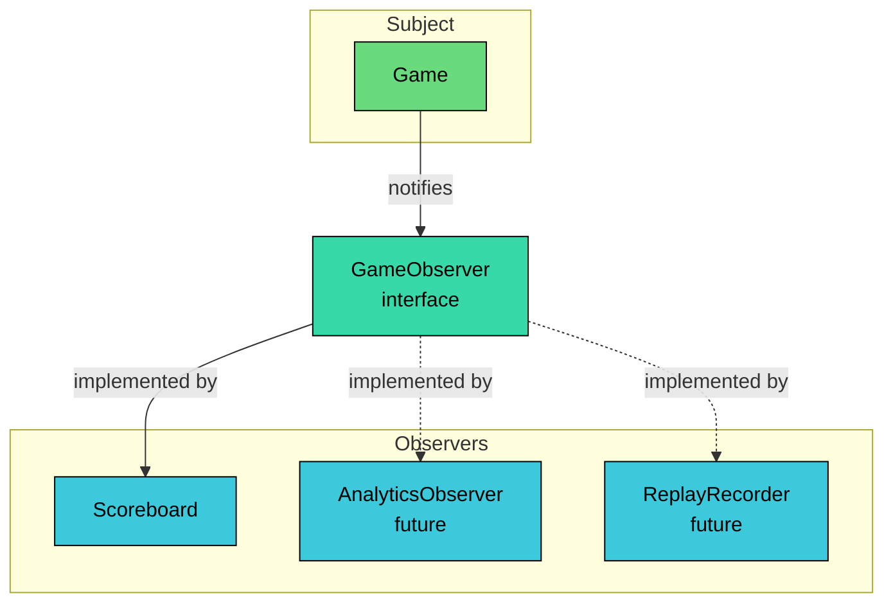


&gt; **Design Decision**
&gt;
&gt; The Game only notifies observers when it transitions to a terminal state, not on every move. This keeps the observer interface simple and avoids unnecessary updates. 
&gt;
&gt; If we needed move-by-move notifications, we could add a separate `onMove()` method to the observer interface.


#### [Singleton Pattern](/learn/lld/singleton) (TicTacToeSystem)

**The Problem:** We need a single, globally accessible entry point to the system that maintains a consistent scoreboard across multiple games.

**The Solution:** The Singleton pattern ensures only one instance of TicTacToeSystem exists. It provides a global access point via `getInstance()`.

Singleton is often overused, but it's appropriate here because we genuinely need one scoreboard shared across all games.

---

### 3.4 Full Class Diagram


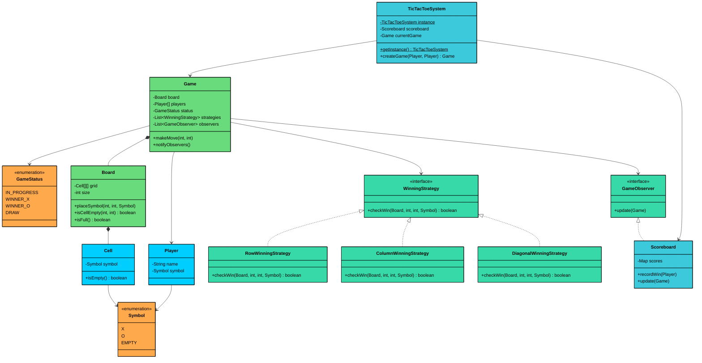


Now that we've designed our classes and relationships, let's bring this to life with code.

---

## 4. Code Implementation

Now let's translate our design into working code. We'll build bottom-up: foundational types first, then data classes, then the classes with real logic. This order matters because each layer depends on the ones below it.


#### Java

### 4.1 Enums

We start with the two enums that other classes depend on.

#### `Symbol`


```java
public enum Symbol {
    X('X'),
    O('O'),
    EMPTY('_');

    private final char displayChar;

    Symbol(char displayChar) {
        this.displayChar = displayChar;
    }

    public char getDisplayChar() {
        return displayChar;
    }
}
```


Each Symbol maps to a display character. This keeps display logic centralized. If we later want to use 'x' instead of 'X', we change it in one place.

#### `GameStatus`


```java
public enum GameStatus {
    IN_PROGRESS,
    WINNER_X,
    WINNER_O,
    DRAW
}
```


Four possible states. The game starts `IN_PROGRESS` and ends in one of the three terminal states.

### 4.2 Custom Exception

Before we write classes that can fail, let's define how they fail. A custom exception makes error handling cleaner than catching generic `RuntimeException`.

#### `InvalidMoveException`


```java
public class InvalidMoveException extends RuntimeException {
    public InvalidMoveException(String message) {
        super(message);
    }
}
```


We'll throw this when someone tries to play on an occupied cell, make a move after the game ends, or specify an out-of-bounds position.

### 4.3 Data Classes

These are simple containers. They hold data with minimal logic.

#### `Player`


```java
public class Player {
    private final String name;
    private final Symbol symbol;

    public Player(String name, Symbol symbol) {
        if (symbol == Symbol.EMPTY) {
            throw new IllegalArgumentException("Player cannot have EMPTY symbol");
        }
        this.name = name;
        this.symbol = symbol;
    }

    public String getName() {
        return name;
    }

    public Symbol getSymbol() {
        return symbol;
    }

    @Override
    public String toString() {
        return name + " (" + symbol.getDisplayChar() + ")";
    }
}
```


Notice the constructor validation. A player with `Symbol.EMPTY` makes no sense, so we reject it immediately. This is "fail fast" design. If you create an invalid Player, you find out right away, not three hours later when debugging a weird game state.

Both fields are `final`. Once you create a Player, their name and symbol never change. Immutability prevents bugs.

#### `Cell`


```java
public class Cell {
    private Symbol symbol;

    public Cell() {
        this.symbol = Symbol.EMPTY;
    }

    public Symbol getSymbol() {
        return symbol;
    }

    public void setSymbol(Symbol symbol) {
        this.symbol = symbol;
    }

    public boolean isEmpty() {
        return symbol == Symbol.EMPTY;
    }
}
```


Unlike Player, Cell is mutable. It starts empty and gets filled during gameplay. The `isEmpty()` helper makes calling code more readable: `if (cell.isEmpty())` is clearer than `if (cell.getSymbol() == Symbol.EMPTY)`.

### 4.4 Interfaces

Now we define the contracts that our strategy and observer classes will implement.

#### `WinningStrategy`


```java
public interface WinningStrategy {
    boolean checkWin(Board board, int row, int col, Symbol symbol);
}
```


The interface takes the board, the position of the last move, and the symbol to check. Each implementation decides how to use these parameters. Row strategy only cares about `row`. Column strategy only cares about `col`. Diagonal strategy ignores both and checks the whole diagonal.

#### `GameObserver`


```java
public interface GameObserver {
    void update(Game game);
}
```


Simple notification interface. When a game ends, observers get the Game object and can extract whatever information they need (winner, final board state, etc.).

### 4.5 Strategy Implementations

Each strategy checks one way to win. Let's implement all three.

**RowWinningStrategy** checks if all cells in the row of the last move contain the same symbol.


```java
public class RowWinningStrategy implements WinningStrategy {
    @Override
    public boolean checkWin(Board board, int row, int col, Symbol symbol) {
        int size = board.getSize();
        for (int c = 0; c < size; c++) {
            if (board.getCell(row, c).getSymbol() != symbol) {
                return false;
            }
        }
        return true;
    }
}
```


We iterate through every column in the given row. If any cell doesn't match, return false immediately. No need to check further.

**ColumnWinningStrategy** works the same way, but iterates through rows instead of columns.


```java
public class ColumnWinningStrategy implements WinningStrategy {
    @Override
    public boolean checkWin(Board board, int row, int col, Symbol symbol) {
        int size = board.getSize();
        for (int r = 0; r < size; r++) {
            if (board.getCell(r, col).getSymbol() != symbol) {
                return false;
            }
        }
        return true;
    }
}
```


**DiagonalWinningStrategy** is more complex because there are two diagonals: main (top-left to bottom-right) and anti-diagonal (top-right to bottom-left).


```java
public class DiagonalWinningStrategy implements WinningStrategy {
    @Override
    public boolean checkWin(Board board, int row, int col, Symbol symbol) {
        int size = board.getSize();

        // Check main diagonal (top-left to bottom-right)
        boolean mainDiagonalWin = true;
        for (int i = 0; i < size; i++) {
            if (board.getCell(i, i).getSymbol() != symbol) {
                mainDiagonalWin = false;
                break;
            }
        }
        if (mainDiagonalWin) return true;

        // Check anti-diagonal (top-right to bottom-left)
        for (int i = 0; i < size; i++) {
            if (board.getCell(i, size - 1 - i).getSymbol() != symbol) {
                return false;
            }
        }
        return true;
    }
}
```


The main diagonal has cells at positions (0,0), (1,1), (2,2). The anti-diagonal has cells at (0,2), (1,1), (2,0). Notice how `size - 1 - i` gives us the anti-diagonal column index.

Each strategy is independently testable. You can unit test `RowWinningStrategy` without creating a full Game. Just create a Board, set up a winning row, and verify the strategy returns true.

### 4.6 Board Class

The Board encapsulates all grid operations. It doesn't know about players, turns, or game rules. It just manages a 2D array of cells.


```java
public class Board {
    private final Cell[][] grid;
    private final int size;

    public Board(int size) {
        this.size = size;
        this.grid = new Cell[size][size];
        initializeBoard();
    }

    private void initializeBoard() {
        for (int i = 0; i < size; i++) {
            for (int j = 0; j < size; j++) {
                grid[i][j] = new Cell();
            }
        }
    }

    public void placeSymbol(int row, int col, Symbol symbol) {
        validatePosition(row, col);
        grid[row][col].setSymbol(symbol);
    }

    public boolean isCellEmpty(int row, int col) {
        validatePosition(row, col);
        return grid[row][col].isEmpty();
    }

    public boolean isFull() {
        for (int i = 0; i < size; i++) {
            for (int j = 0; j < size; j++) {
                if (grid[i][j].isEmpty()) {
                    return false;
                }
            }
        }
        return true;
    }

    public Cell getCell(int row, int col) {
        validatePosition(row, col);
        return grid[row][col];
    }

    public int getSize() {
        return size;
    }

    private void validatePosition(int row, int col) {
        if (row < 0 || row >= size || col < 0 || col >= size) {
            throw new InvalidMoveException(
                "Position (" + row + ", " + col + ") is out of bounds"
            );
        }
    }

    public void printBoard() {
        System.out.println();
        for (int i = 0; i < size; i++) {
            for (int j = 0; j < size; j++) {
                System.out.print(" " + grid[i][j].getSymbol().getDisplayChar() + " ");
                if (j < size - 1) System.out.print("|");
            }
            System.out.println();
            if (i < size - 1) {
                System.out.println("-".repeat(size * 4 - 1));
            }
        }
        System.out.println();
    }
}
```


A few things to note about the Board:

- **Constructor creates all cells:** The `initializeBoard()` method runs in the constructor, so you never have a Board with null cells.
- **Validation is centralized:** The `validatePosition()` method is private and called by every public method that takes coordinates. This prevents code duplication.
- `isFull()`** short-circuits:** As soon as we find an empty cell, we return false. No need to scan the entire board.
- `printBoard()`** is for debugging:** In a real application, you'd probably have a separate view layer. But for interviews and testing, a simple print method is useful.

### 4.7 Game Class

This is where everything comes together. The Game coordinates players, board, strategies, and observers. It's the most complex class, but each method has a single responsibility.


```java
import java.util.ArrayList;
import java.util.List;
import java.util.concurrent.CopyOnWriteArrayList;

public class Game {
    private final Board board;
    private final Player[] players;
    private int currentPlayerIndex;
    private GameStatus status;
    private final List<WinningStrategy> winningStrategies;
    private final List<GameObserver> observers;

    public Game(Player player1, Player player2, int boardSize) {
        this.board = new Board(boardSize);
        this.players = new Player[]{player1, player2};
        this.currentPlayerIndex = 0;
        this.status = GameStatus.IN_PROGRESS;
        this.winningStrategies = initializeStrategies();
        this.observers = new CopyOnWriteArrayList<>();
    }

    private List<WinningStrategy> initializeStrategies() {
        List<WinningStrategy> strategies = new ArrayList<>();
        strategies.add(new RowWinningStrategy());
        strategies.add(new ColumnWinningStrategy());
        strategies.add(new DiagonalWinningStrategy());
        return strategies;
    }

    public synchronized void makeMove(int row, int col) {
        // Check if game is already over
        if (status != GameStatus.IN_PROGRESS) {
            throw new InvalidMoveException("Game is already over!");
        }

        // Validate the move
        if (!board.isCellEmpty(row, col)) {
            throw new InvalidMoveException(
                "Cell (" + row + ", " + col + ") is already occupied"
            );
        }

        // Place the symbol
        Player currentPlayer = players[currentPlayerIndex];
        board.placeSymbol(row, col, currentPlayer.getSymbol());

        // Check for win
        if (checkWin(row, col, currentPlayer.getSymbol())) {
            status = (currentPlayer.getSymbol() == Symbol.X)
                ? GameStatus.WINNER_X
                : GameStatus.WINNER_O;
            notifyObservers();
            return;
        }

        // Check for draw
        if (board.isFull()) {
            status = GameStatus.DRAW;
            notifyObservers();
            return;
        }

        // Switch to next player
        currentPlayerIndex = (currentPlayerIndex + 1) % 2;
    }

    private boolean checkWin(int row, int col, Symbol symbol) {
        for (WinningStrategy strategy : winningStrategies) {
            if (strategy.checkWin(board, row, col, symbol)) {
                return true;
            }
        }
        return false;
    }

    public void addObserver(GameObserver observer) {
        observers.add(observer);
    }

    public void notifyObservers() {
        for (GameObserver observer : observers) {
            observer.update(this);
        }
    }

    public Board getBoard() { return board; }
    public Player getCurrentPlayer() { return players[currentPlayerIndex]; }
    public GameStatus getStatus() { return status; }

    public Player getWinner() {
        if (status == GameStatus.WINNER_X) {
            return players[0].getSymbol() == Symbol.X ? players[0] : players[1];
        } else if (status == GameStatus.WINNER_O) {
            return players[0].getSymbol() == Symbol.O ? players[0] : players[1];
        }
        return null;
    }

    public void printBoard() {
        board.printBoard();
    }
}
```


Let's break down the key design decisions in the Game class:

**Thread Safety:** The `makeMove` method is `synchronized`. This prevents two threads from making moves simultaneously, which could corrupt the game state. The observer list uses `CopyOnWriteArrayList`, which allows safe iteration even if observers are added during notification.

**The **`makeMove`** flow:**

1. Check if game is over (fail fast)
2. Validate the cell is empty
3. Place the symbol
4. Check for win using all strategies
5. Check for draw if no winner
6. Switch to next player if game continues

**Strategy iteration:** The `checkWin` method iterates through all strategies. As soon as one returns true, we have a winner. This is where the Strategy pattern pays off. Adding a new win condition just means adding another strategy to the list.

**Observer notification:** We only notify observers when the game ends (win or draw). This keeps the observer interface simple. If we needed move-by-move notifications, we could add a separate `onMove()` method to `GameObserver`.

### 4.8 Scoreboard Class

The Scoreboard demonstrates the Observer pattern in action. It listens for game end events and automatically updates scores.


```java
import java.util.concurrent.ConcurrentHashMap;

public class Scoreboard implements GameObserver {
    private final ConcurrentHashMap<String, Integer> scores;

    public Scoreboard() {
        this.scores = new ConcurrentHashMap<>();
    }

    @Override
    public void update(Game game) {
        Player winner = game.getWinner();
        if (winner != null) {
            recordWin(winner);
            System.out.println("Scoreboard updated: " + winner.getName() + " wins!");
        }
    }

    public void recordWin(Player player) {
        scores.merge(player.getName(), 1, Integer::sum);
    }

    public int getScore(String playerName) {
        return scores.getOrDefault(playerName, 0);
    }

    public void printScoreboard() {
        System.out.println("\n===== SCOREBOARD =====");
        if (scores.isEmpty()) {
            System.out.println("No games played yet.");
        } else {
            scores.forEach((name, score) ->
                System.out.println(name + ": " + score + " wins")
            );
        }
        System.out.println("======================\n");
    }
}
```


The Scoreboard is decoupled from the Game. It doesn't know when games start or how moves work. It just receives a notification when a game ends, extracts the winner, and updates its internal map.

Note the use of `ConcurrentHashMap` and the `merge()` method. The `merge()` call atomically gets the current value (or 0 if absent), adds 1, and stores the result. This is thread-safe without explicit synchronization.

### 4.9 TicTacToeSystem (Singleton Facade)

The system class is the public entry point. External code only needs to know about this class. It hides the complexity of Game, Board, and Scoreboard behind a simple interface.


```java
public class TicTacToeSystem {
    private static volatile TicTacToeSystem instance;
    private static final Object lock = new Object();

    private final Scoreboard scoreboard;
    private Game currentGame;

    private TicTacToeSystem() {
        this.scoreboard = new Scoreboard();
    }

    public static TicTacToeSystem getInstance() {
        if (instance == null) {
            synchronized (lock) {
                if (instance == null) {
                    instance = new TicTacToeSystem();
                }
            }
        }
        return instance;
    }

    public Game createGame(Player player1, Player player2) {
        currentGame = new Game(player1, player2, 3);
        currentGame.addObserver(scoreboard);
        System.out.println("New game started: " + player1.getName() +
            " vs " + player2.getName());
        return currentGame;
    }

    public void makeMove(Player player, int row, int col) {
        if (currentGame == null) {
            throw new IllegalStateException("No active game. Call createGame first.");
        }
        System.out.println(player.getName() + " plays at (" + row + ", " + col + ")");
        currentGame.makeMove(row, col);
        currentGame.printBoard();
    }

    public GameStatus getGameStatus() {
        if (currentGame == null) {
            throw new IllegalStateException("No active game.");
        }
        return currentGame.getStatus();
    }

    public void printScoreboard() {
        scoreboard.printScoreboard();
    }

    // For testing: reset the singleton
    public static void resetInstance() {
        synchronized (lock) {
            instance = null;
        }
    }
}
```


#### **Singleton Implementation Details:**

- **Double-checked locking:** We check `instance == null` twice. The first check avoids the cost of synchronization when the instance already exists. The second check (inside the synchronized block) handles the race condition where two threads both pass the first check.
- `volatile`** keyword:** This ensures that when one thread creates the instance, other threads immediately see the fully constructed object. Without `volatile`, threads might see a partially constructed instance due to instruction reordering.
- `resetInstance()`** for testing:** Singletons are notoriously hard to test because the instance persists across tests. This method lets us reset the singleton between tests. In production, you'd probably remove this or make it package-private.

#### **Facade Benefits:**

The TicTacToeSystem class simplifies the API. Compare these two approaches:

Without facade:


```java
Game game = new Game(player1, player2, 3);
Scoreboard scoreboard = new Scoreboard();
game.addObserver(scoreboard);
game.makeMove(0, 0);
```


With facade:


```java
TicTacToeSystem system = TicTacToeSystem.getInstance();
system.createGame(player1, player2);
system.makeMove(player1, 0, 0);
```


The facade handles object creation, wiring, and lifecycle. Callers don't need to know that games have observers or that scoreboards exist.

### 4.10 Demo Class

Let's see the system in action with a demo that plays three games.


```java
public class TicTacToeDemo {
    public static void main(String[] args) {
        TicTacToeSystem system = TicTacToeSystem.getInstance();

        Player alice = new Player("Alice", Symbol.X);
        Player bob = new Player("Bob", Symbol.O);

        // Game 1: Alice wins
        System.out.println("========== GAME 1 ==========");
        system.createGame(alice, bob);

        system.makeMove(alice, 0, 0);  // X at (0,0)
        system.makeMove(bob, 1, 0);    // O at (1,0)
        system.makeMove(alice, 0, 1);  // X at (0,1)
        system.makeMove(bob, 1, 1);    // O at (1,1)
        system.makeMove(alice, 0, 2);  // X at (0,2) - Alice wins!

        System.out.println("Game 1 Result: " + system.getGameStatus());

        // Game 2: Bob wins
        System.out.println("\n========== GAME 2 ==========");
        system.createGame(alice, bob);

        system.makeMove(alice, 0, 0);  // X at (0,0)
        system.makeMove(bob, 1, 1);    // O at (1,1) - center
        system.makeMove(alice, 0, 1);  // X at (0,1)
        system.makeMove(bob, 0, 2);    // O at (0,2)
        system.makeMove(alice, 2, 0);  // X at (2,0)
        system.makeMove(bob, 2, 2);    // O at (2,2) - Bob wins diagonal!

        System.out.println("Game 2 Result: " + system.getGameStatus());

        // Game 3: Draw
        System.out.println("\n========== GAME 3 ==========");
        system.createGame(alice, bob);

        system.makeMove(alice, 0, 0);  // X
        system.makeMove(bob, 0, 1);    // O
        system.makeMove(alice, 0, 2);  // X
        system.makeMove(bob, 1, 1);    // O
        system.makeMove(alice, 1, 0);  // X
        system.makeMove(bob, 1, 2);    // O
        system.makeMove(alice, 2, 1);  // X
        system.makeMove(bob, 2, 0);    // O
        system.makeMove(alice, 2, 2);  // X - Draw!

        System.out.println("Game 3 Result: " + system.getGameStatus());

        // Final scoreboard
        system.printScoreboard();
    }
}
```


#### Move Sequence Diagram

The following diagram illustrates what happens when a player makes a move:


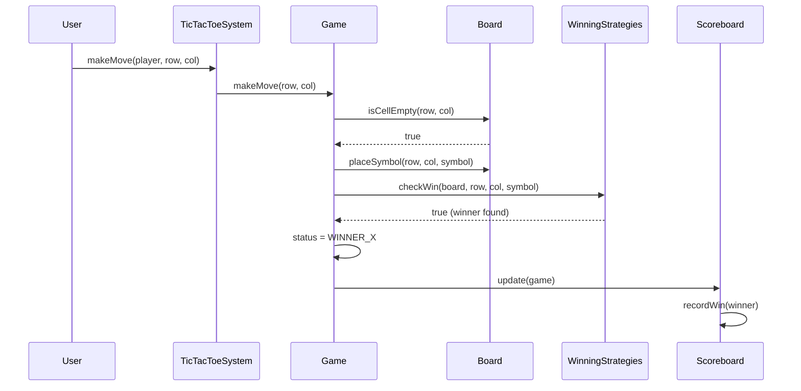


---

## 5. Run and Test

---

## 6. Concurrency and Thread Safety

Does Tic-Tac-Toe actually need thread safety? 

For a simple console application where Alice and Bob take turns typing, no. But consider a web-based version: two players in different browsers making HTTP requests to the same game server. Each request is handled by a separate thread, and both threads access the same `Game` object. Without synchronization, things can go wrong.

#### Race Condition: Simultaneous Moves

**Setup:** Alice (X) and Bob (O) are playing through a web interface. It's Alice's turn (`currentPlayerIndex = 0`). Alice clicks (0, 0) and Bob clicks (1, 1) at nearly the same time. Two HTTP request threads hit `Game.makeMove()` concurrently.

#### **Without synchronization:**

1. Thread-A (Alice): Reads `currentPlayerIndex = 0`, confirms it's Alice's turn
2. Thread-B (Bob): Reads `currentPlayerIndex = 0`, also sees it's Alice's turn
3. Thread-A: Checks `isCellEmpty(0, 0)` -&gt; true
4. Thread-B: Checks `isCellEmpty(1, 1)` -&gt; true
5. Thread-A: Places X at (0, 0)
6. Thread-B: Places X at (1, 1) (using Alice's symbol, since `currentPlayerIndex` is still 0)
7. Thread-A: No win, increments `currentPlayerIndex` to 1
8. Thread-B: No win, increments `currentPlayerIndex` to 0 (wraps back)

**Result:** Both cells contain X. Bob's move was lost. The turn counter wrapped around, so Alice would go again. The board state is corrupted.

#### **With synchronization:** 

The `synchronized` keyword on `makeMove()` ensures Thread-A acquires the lock first. Thread-A completes the entire move atomically (place symbol, check win, switch player). Only then does Thread-B acquire the lock. Thread-B now reads the updated `currentPlayerIndex = 1`, confirms it's Bob's turn, and places O correctly.

---

## 7. Extensions

One of the best ways to validate a design is to see how it handles change. If adding a feature requires modifying multiple classes, the design has problems. If you can add features by creating new classes without touching existing code, you've achieved the Open/Closed Principle.

Let's walk through five common extension requests and see how our design handles them.

### 7.1 New Win Condition (Four Corners)

**Scenario:** "Add a win condition where occupying all four corners wins the game."

This is where the Strategy pattern shines. We add a new strategy class without touching any existing code.


```java
public class FourCornersWinningStrategy implements WinningStrategy {
    @Override
    public boolean checkWin(Board board, int row, int col, Symbol symbol) {
        int size = board.getSize();
        int lastIndex = size - 1;

        // Check all four corners
        return board.getCell(0, 0).getSymbol() == symbol &&
               board.getCell(0, lastIndex).getSymbol() == symbol &&
               board.getCell(lastIndex, 0).getSymbol() == symbol &&
               board.getCell(lastIndex, lastIndex).getSymbol() == symbol;
    }
}
```

```python
class FourCornersWinningStrategy(WinningStrategy):
    def check_win(self, board: Board, row: int, col: int, symbol: Symbol) -> bool:
        size = board.size
        last_index = size - 1

        # Check all four corners
        return (board.get_cell(0, 0).symbol == symbol and
                board.get_cell(0, last_index).symbol == symbol and
                board.get_cell(last_index, 0).symbol == symbol and
                board.get_cell(last_index, last_index).symbol == symbol)
```

```cpp
class FourCornersWinningStrategy : public WinningStrategy {
public:
    bool checkWin(const Board& board, int row, int col, Symbol symbol) const override {
        int size = board.getSize();
        int lastIndex = size - 1;

        // Check all four corners
        return board.getCell(0, 0).getSymbol() == symbol &&
               board.getCell(0, lastIndex).getSymbol() == symbol &&
               board.getCell(lastIndex, 0).getSymbol() == symbol &&
               board.getCell(lastIndex, lastIndex).getSymbol() == symbol;
    }
};
```

```csharp
public class FourCornersWinningStrategy : IWinningStrategy
{
    public bool CheckWin(Board board, int row, int col, Symbol symbol)
    {
        int size = board.Size;
        int lastIndex = size - 1;

        // Check all four corners
        return board.GetCell(0, 0).Symbol == symbol &&
               board.GetCell(0, lastIndex).Symbol == symbol &&
               board.GetCell(lastIndex, 0).Symbol == symbol &&
               board.GetCell(lastIndex, lastIndex).Symbol == symbol;
    }
}
```

```go
type FourCornersWinningStrategy struct{}

func (s *FourCornersWinningStrategy) CheckWin(board *Board, row, col int, symbol Symbol) bool {
	size := board.Size()
	lastIndex := size - 1

	topLeft, _ := board.GetCell(0, 0)
	topRight, _ := board.GetCell(0, lastIndex)
	bottomLeft, _ := board.GetCell(lastIndex, 0)
	bottomRight, _ := board.GetCell(lastIndex, lastIndex)

	return topLeft.Symbol() == symbol &&
		topRight.Symbol() == symbol &&
		bottomLeft.Symbol() == symbol &&
		bottomRight.Symbol() == symbol
}
```

```typescript
class FourCornersWinningStrategy implements WinningStrategy {
    checkWin(board: Board, row: number, col: number, symbol: Symbol): boolean {
        const size = board.size;
        const lastIndex = size - 1;

        // Check all four corners
        return board.getCell(0, 0).symbol === symbol &&
               board.getCell(0, lastIndex).symbol === symbol &&
               board.getCell(lastIndex, 0).symbol === symbol &&
               board.getCell(lastIndex, lastIndex).symbol === symbol;
    }
}
```


To enable it, add one line to `initializeStrategies()`:


```java
private List<WinningStrategy> initializeStrategies() {
    List<WinningStrategy> strategies = new ArrayList<>();
    strategies.add(new RowWinningStrategy());
    strategies.add(new ColumnWinningStrategy());
    strategies.add(new DiagonalWinningStrategy());
    strategies.add(new FourCornersWinningStrategy());  // New!
    return strategies;
}
```

```python
def _initialize_strategies(self) -> list[WinningStrategy]:
    return [
        RowWinningStrategy(),
        ColumnWinningStrategy(),
        DiagonalWinningStrategy(),
        FourCornersWinningStrategy()  # New!
    ]
```

```cpp
void initializeStrategies() {
    winningStrategies_.push_back(make_unique<RowWinningStrategy>());
    winningStrategies_.push_back(make_unique<ColumnWinningStrategy>());
    winningStrategies_.push_back(make_unique<DiagonalWinningStrategy>());
    winningStrategies_.push_back(make_unique<FourCornersWinningStrategy>());  // New!
}
```

```csharp
private List<IWinningStrategy> InitializeStrategies()
{
    return new List<IWinningStrategy>
    {
        new RowWinningStrategy(),
        new ColumnWinningStrategy(),
        new DiagonalWinningStrategy(),
        new FourCornersWinningStrategy()  // New!
    };
}
```

```go
func (g *Game) initializeStrategies() []WinningStrategy {
	return []WinningStrategy{
		&RowWinningStrategy{},
		&ColumnWinningStrategy{},
		&DiagonalWinningStrategy{},
		&FourCornersWinningStrategy{}, // New!
	}
}
```

```typescript
private initializeStrategies(): WinningStrategy[] {
    return [
        new RowWinningStrategy(),
        new ColumnWinningStrategy(),
        new DiagonalWinningStrategy(),
        new FourCornersWinningStrategy(),  // New!
    ];
}
```


**What stays unchanged:** RowWinningStrategy, ColumnWinningStrategy, DiagonalWinningStrategy, Board, Cell, Game logic, Observer pattern.

---

### 7.2 Variable Board Size

**Scenario:** "Support 4x4 and 5x5 boards."

Our design already handles this. The Board takes a size parameter, and strategies use `board.getSize()` instead of hardcoding 3.


```java
// In TicTacToeSystem, add a createGame overload:
public Game createGame(Player player1, Player player2, int boardSize) {
    currentGame = new Game(player1, player2, boardSize);
    currentGame.addObserver(scoreboard);
    return currentGame;
}

// Usage:
system.createGame(alice, bob, 5);  // 5x5 board
```

```python
## In TicTacToeSystem, add a create_game overload:
def create_game(self, player1: Player, player2: Player, board_size: int = 3) -> Game:
    self._current_game = Game(player1, player2, board_size)
    self._current_game.add_observer(self._scoreboard)
    return self._current_game

## Usage:
system.create_game(alice, bob, 5)  # 5x5 board
```

```cpp
// In TicTacToeSystem, add a createGame overload:
Game& createGame(shared_ptr<Player> player1,
                 shared_ptr<Player> player2,
                 int boardSize) {
    currentGame_ = make_unique<Game>(player1, player2, boardSize);
    currentGame_->addObserver(scoreboard_.get());
    return *currentGame_;
}

// Usage:
system.createGame(alice, bob, 5);  // 5x5 board
```

```csharp
// In TicTacToeSystem, add a CreateGame overload:
public Game CreateGame(Player player1, Player player2, int boardSize)
{
    lock (_lock)
    {
        _currentGame = new Game(player1, player2, boardSize);
        _currentGame.AddObserver(_scoreboard);
        return _currentGame;
    }
}

// Usage:
system.CreateGame(alice, bob, 5);  // 5x5 board
```

```go
// In TicTacToeSystem, add a CreateGameWithSize method:
func (s *TicTacToeSystem) CreateGameWithSize(player1, player2 *Player, boardSize int) (*Game, error) {
	game, err := NewGame(player1, player2, boardSize)
	if err != nil {
		return nil, err
	}
	s.currentGame = game
	s.currentGame.AddObserver(s.scoreboard)
	return s.currentGame, nil
}

// Usage:
system.CreateGameWithSize(alice, bob, 5) // 5x5 board
```

```typescript
// In TicTacToeSystem, add a createGame overload:
createGameWithSize(player1: Player, player2: Player, boardSize: number): Game {
    this.currentGame = new Game(player1, player2, boardSize);
    this.currentGame.addObserver(this.scoreboard);
    return this.currentGame;
}

// Usage:
system.createGameWithSize(alice, bob, 5);  // 5x5 board
```


For larger boards, you might want a configurable win length (e.g., "5 in a row on a 10x10 board"). That would require updating the strategies:


```java
class RowWinningStrategy implements WinningStrategy {
    private final int winLength;

    public RowWinningStrategy(int winLength) {
        this.winLength = winLength;
    }

    @Override
    public boolean checkWin(Board board, int row, int col, Symbol symbol) {
        // Count consecutive symbols in the row
        int count = 0;
        for (int c = 0; c < board.getSize(); c++) {
            if (board.getCell(row, c).getSymbol() == symbol) {
                count++;
                if (count >= winLength) return true;
            } else {
                count = 0;
            }
        }
        return false;
    }
}
```

```python
class RowWinningStrategy(WinningStrategy):
    def __init__(self, win_length: int = 3):
        self._win_length = win_length

    def check_win(self, board: Board, row: int, col: int, symbol: Symbol) -> bool:
        # Count consecutive symbols in the row
        count = 0
        for c in range(board.size):
            if board.get_cell(row, c).symbol == symbol:
                count += 1
                if count >= self._win_length:
                    return True
            else:
                count = 0
        return False
```

```cpp
class RowWinningStrategy : public WinningStrategy {
private:
    int winLength_;

public:
    explicit RowWinningStrategy(int winLength = 3) : winLength_(winLength) {}

    bool checkWin(const Board& board, int row, int col, Symbol symbol) const override {
        // Count consecutive symbols in the row
        int count = 0;
        for (int c = 0; c < board.getSize(); c++) {
            if (board.getCell(row, c).getSymbol() == symbol) {
                count++;
                if (count >= winLength_) return true;
            } else {
                count = 0;
            }
        }
        return false;
    }
};
```

```csharp
public class RowWinningStrategy : IWinningStrategy
{
    private readonly int _winLength;

    public RowWinningStrategy(int winLength = 3)
    {
        _winLength = winLength;
    }

    public bool CheckWin(Board board, int row, int col, Symbol symbol)
    {
        // Count consecutive symbols in the row
        int count = 0;
        for (int c = 0; c < board.Size; c++)
        {
            if (board.GetCell(row, c).Symbol == symbol)
            {
                count++;
                if (count >= _winLength) return true;
            }
            else
            {
                count = 0;
            }
        }
        return false;
    }
}
```

```go
type RowWinningStrategy struct {
	winLength int
}

func NewRowWinningStrategy(winLength int) *RowWinningStrategy {
	return &RowWinningStrategy{winLength: winLength}
}

func (s *RowWinningStrategy) CheckWin(board *Board, row, col int, symbol Symbol) bool {
	// Count consecutive symbols in the row
	count := 0
	for c := 0; c < board.Size(); c++ {
		cell, _ := board.GetCell(row, c)
		if cell.Symbol() == symbol {
			count++
			if count >= s.winLength {
				return true
			}
		} else {
			count = 0
		}
	}
	return false
}
```

```typescript
class RowWinningStrategy implements WinningStrategy {
    private readonly winLength: number;

    constructor(winLength: number) {
        this.winLength = winLength;
    }

    checkWin(board: Board, row: number, col: number, symbol: Symbol): boolean {
        // Count consecutive symbols in the row
        let count = 0;
        for (let c = 0; c < board.size; c++) {
            if (board.getCell(row, c).symbol === symbol) {
                count++;
                if (count >= this.winLength) return true;
            } else {
                count = 0;
            }
        }
        return false;
    }
}
```


**What stays unchanged:** Board, Cell, Observer pattern, Scoreboard.

---

### 7.3 AI Opponent

**Scenario:** "Add a computer player that makes moves automatically."

We introduce a `MoveStrategy` interface for selecting moves. This is separate from `WinningStrategy`, which checks for wins.


```java
public interface MoveStrategy {
    int[] selectMove(Board board, Symbol symbol);
}
```

```python
class MoveStrategy(ABC):
    @abstractmethod
    def select_move(self, board: Board, symbol: Symbol) -> tuple[int, int]:
        """Select the next move. Returns (row, col)."""
        pass
```

```cpp
class MoveStrategy {
public:
    virtual ~MoveStrategy() = default;
    virtual pair<int, int> selectMove(const Board& board, Symbol symbol) = 0;
};
```

```csharp
public interface IMoveStrategy
{
    (int Row, int Col) SelectMove(Board board, Symbol symbol);
}
```

```go
type MoveStrategy interface {
	SelectMove(board *Board, symbol Symbol) (row, col int, err error)
}
```

```typescript
interface MoveStrategy {
    selectMove(board: Board, symbol: Symbol): [number, number];
}
```


A simple random strategy:


```java
public class RandomMoveStrategy implements MoveStrategy {
    private final Random random = new Random();

    @Override
    public int[] selectMove(Board board, Symbol symbol) {
        List<int[]> emptyCells = new ArrayList<>();

        for (int r = 0; r < board.getSize(); r++) {
            for (int c = 0; c < board.getSize(); c++) {
                if (board.isCellEmpty(r, c)) {
                    emptyCells.add(new int[]{r, c});
                }
            }
        }

        if (emptyCells.isEmpty()) {
            throw new IllegalStateException("No empty cells");
        }

        return emptyCells.get(random.nextInt(emptyCells.size()));
    }
}
```

```python
import random

class RandomMoveStrategy(MoveStrategy):
    def select_move(self, board: Board, symbol: Symbol) -> tuple[int, int]:
        empty_cells = []
        for r in range(board.size):
            for c in range(board.size):
                if board.is_cell_empty(r, c):
                    empty_cells.append((r, c))

        if not empty_cells:
            raise RuntimeError("No empty cells")

        return random.choice(empty_cells)
```

```cpp
class RandomMoveStrategy : public MoveStrategy {
private:
    mt19937 rng_{random_device{}()};

public:
    pair<int, int> selectMove(const Board& board, Symbol symbol) override {
        vector<pair<int, int>> emptyCells;

        for (int r = 0; r < board.getSize(); r++) {
            for (int c = 0; c < board.getSize(); c++) {
                if (board.isCellEmpty(r, c)) {
                    emptyCells.emplace_back(r, c);
                }
            }
        }

        if (emptyCells.empty()) {
            throw logic_error("No empty cells");
        }

        uniform_int_distribution<size_t> dist(0, emptyCells.size() - 1);
        return emptyCells[dist(rng_)];
    }
};
```

```csharp
public class RandomMoveStrategy : IMoveStrategy
{
    private readonly Random _random = new Random();

    public (int Row, int Col) SelectMove(Board board, Symbol symbol)
    {
        var emptyCells = new List<(int Row, int Col)>();

        for (int r = 0; r < board.Size; r++)
        {
            for (int c = 0; c < board.Size; c++)
            {
                if (board.IsCellEmpty(r, c))
                {
                    emptyCells.Add((r, c));
                }
            }
        }

        if (emptyCells.Count == 0)
        {
            throw new InvalidOperationException("No empty cells");
        }

        return emptyCells[_random.Next(emptyCells.Count)];
    }
}
```

```go
type RandomMoveStrategy struct{}

func (s *RandomMoveStrategy) SelectMove(board *Board, symbol Symbol) (int, int, error) {
	emptyCells := make([][2]int, 0)

	for r := 0; r < board.Size(); r++ {
		for c := 0; c < board.Size(); c++ {
			empty, _ := board.IsCellEmpty(r, c)
			if empty {
				emptyCells = append(emptyCells, [2]int{r, c})
			}
		}
	}

	if len(emptyCells) == 0 {
		return 0, 0, fmt.Errorf("no empty cells")
	}

	choice := emptyCells[rand.Intn(len(emptyCells))]
	return choice[0], choice[1], nil
}
```

```typescript
class RandomMoveStrategy implements MoveStrategy {
    selectMove(board: Board, symbol: Symbol): [number, number] {
        const emptyCells: [number, number][] = [];

        for (let r = 0; r < board.size; r++) {
            for (let c = 0; c < board.size; c++) {
                if (board.isCellEmpty(r, c)) {
                    emptyCells.push([r, c]);
                }
            }
        }

        if (emptyCells.length === 0) {
            throw new Error("No empty cells");
        }

        return emptyCells[Math.floor(Math.random() * emptyCells.length)];
    }
}
```


A smarter minimax strategy (simplified):


```java
public class MinimaxMoveStrategy implements MoveStrategy {
    @Override
    public int[] selectMove(Board board, Symbol symbol) {
        int[] bestMove = null;
        int bestScore = Integer.MIN_VALUE;

        for (int r = 0; r < board.getSize(); r++) {
            for (int c = 0; c < board.getSize(); c++) {
                if (board.isCellEmpty(r, c)) {
                    // Try this move
                    board.placeSymbol(r, c, symbol);
                    int score = minimax(board, symbol, false);
                    board.placeSymbol(r, c, Symbol.EMPTY);  // Undo

                    if (score > bestScore) {
                        bestScore = score;
                        bestMove = new int[]{r, c};
                    }
                }
            }
        }
        return bestMove;
    }

    private int minimax(Board board, Symbol aiSymbol, boolean isMaximizing) {
        // ... minimax algorithm implementation
    }
}
```

```python
class MinimaxMoveStrategy(MoveStrategy):
    def select_move(self, board: Board, symbol: Symbol) -> tuple[int, int]:
        best_move = None
        best_score = float('-inf')

        for r in range(board.size):
            for c in range(board.size):
                if board.is_cell_empty(r, c):
                    # Try this move
                    board.place_symbol(r, c, symbol)
                    score = self._minimax(board, symbol, False)
                    board.place_symbol(r, c, Symbol.EMPTY)  # Undo

                    if score > best_score:
                        best_score = score
                        best_move = (r, c)

        return best_move

    def _minimax(self, board: Board, ai_symbol: Symbol, is_maximizing: bool) -> int:
        # ... minimax algorithm implementation
        pass
```

```cpp
class MinimaxMoveStrategy : public MoveStrategy {
public:
    pair<int, int> selectMove(const Board& board, Symbol symbol) override {
        pair<int, int> bestMove = {-1, -1};
        int bestScore = numeric_limits<int>::min();

        for (int r = 0; r < board.getSize(); r++) {
            for (int c = 0; c < board.getSize(); c++) {
                if (board.isCellEmpty(r, c)) {
                    // Would need a mutable board or copy for this
                    // Simplified: just return first empty cell
                    if (bestMove.first == -1) {
                        bestMove = {r, c};
                    }
                }
            }
        }
        return bestMove;
    }

private:
    int minimax(Board& board, Symbol aiSymbol, bool isMaximizing) {
        // ... minimax algorithm implementation
        return 0;
    }
};
```

```csharp
public class MinimaxMoveStrategy : IMoveStrategy
{
    public (int Row, int Col) SelectMove(Board board, Symbol symbol)
    {
        int bestRow = -1;
        int bestCol = -1;
        int bestScore = int.MinValue;

        for (int r = 0; r < board.Size; r++)
        {
            for (int c = 0; c < board.Size; c++)
            {
                if (board.IsCellEmpty(r, c))
                {
                    // Try this move
                    board.PlaceSymbol(r, c, symbol);
                    int score = Minimax(board, symbol, false);
                    board.PlaceSymbol(r, c, Symbol.Empty);  // Undo

                    if (score > bestScore)
                    {
                        bestScore = score;
                        bestRow = r;
                        bestCol = c;
                    }
                }
            }
        }
        if (bestRow == -1) throw new InvalidOperationException("No valid move");
        return (bestRow, bestCol);
    }

    private int Minimax(Board board, Symbol aiSymbol, bool isMaximizing)
    {
        // ... minimax algorithm implementation
        return 0;
    }
}
```

```go
type MinimaxMoveStrategy struct{}

func (s *MinimaxMoveStrategy) SelectMove(board *Board, symbol Symbol) (int, int, error) {
	bestRow, bestCol := -1, -1
	bestScore := math.MinInt32

	for r := 0; r < board.Size(); r++ {
		for c := 0; c < board.Size(); c++ {
			empty, _ := board.IsCellEmpty(r, c)
			if empty {
				// Try this move
				board.PlaceSymbol(r, c, symbol)
				score := s.minimax(board, symbol, false)
				board.PlaceSymbol(r, c, SymbolEmpty) // Undo

				if score > bestScore {
					bestScore = score
					bestRow, bestCol = r, c
				}
			}
		}
	}
	return bestRow, bestCol, nil
}

func (s *MinimaxMoveStrategy) minimax(board *Board, aiSymbol Symbol, isMaximizing bool) int {
	// ... minimax algorithm implementation
	return 0
}
```

```typescript
class MinimaxMoveStrategy implements MoveStrategy {
    selectMove(board: Board, symbol: Symbol): [number, number] {
        let bestMove: [number, number] | null = null;
        let bestScore = -Infinity;

        for (let r = 0; r < board.size; r++) {
            for (let c = 0; c < board.size; c++) {
                if (board.isCellEmpty(r, c)) {
                    // Try this move
                    board.placeSymbol(r, c, symbol);
                    const score = this.minimax(board, symbol, false);
                    board.placeSymbol(r, c, Symbol.EMPTY);  // Undo

                    if (score > bestScore) {
                        bestScore = score;
                        bestMove = [r, c];
                    }
                }
            }
        }
        return bestMove!;
    }

    private minimax(board: Board, aiSymbol: Symbol, isMaximizing: boolean): number {
        // ... minimax algorithm implementation
        return 0;
    }
}
```


The Game class can check if the current player has a MoveStrategy and auto-play:


```java
public void playAIMove() {
    Player current = getCurrentPlayer();
    if (current.getMoveStrategy() != null) {
        int[] move = current.getMoveStrategy().selectMove(board, current.getSymbol());
        makeMove(move[0], move[1]);
    }
}
```

```python
def play_ai_move(self) -> None:
    current = self.current_player
    if hasattr(current, 'move_strategy') and current.move_strategy is not None:
        row, col = current.move_strategy.select_move(self._board, current.symbol)
        self.make_move(row, col)
```

```cpp
void playAIMove() {
    auto current = getCurrentPlayer();
    if (current->getMoveStrategy() != nullptr) {
        auto [row, col] = current->getMoveStrategy()->selectMove(*board_, current->getSymbol());
        makeMove(row, col);
    }
}
```

```csharp
public void PlayAIMove()
{
    var current = CurrentPlayer;
    if (current.MoveStrategy != null)
    {
        var move = current.MoveStrategy.SelectMove(_board, current.Symbol);
        MakeMove(move.Row, move.Col);
    }
}
```

```go
func (g *Game) PlayAIMove() error {
	current := g.CurrentPlayer()
	if current.moveStrategy != nil {
		row, col, err := current.moveStrategy.SelectMove(g.board, current.Symbol())
		if err != nil {
			return err
		}
		return g.MakeMove(row, col)
	}
	return fmt.Errorf("current player has no move strategy")
}
```

```typescript
playAIMove(): void {
    const current = this.getCurrentPlayer();
    if (current.getMoveStrategy() !== null) {
        const [row, col] = current.getMoveStrategy()!.selectMove(this.board, current.symbol);
        this.makeMove(row, col);
    }
}
```


**What stays unchanged:** Board, Cell, WinningStrategy implementations, Observer pattern.

---

### 7.4 Move History and Undo

**Scenario:** "Track move history and allow undo."

The Command pattern is perfect here. Each move becomes a command that can be executed and reversed.


```java
public class MoveCommand {
    private final Board board;
    private final int row;
    private final int col;
    private final Symbol symbol;
    private Symbol previousSymbol;

    public MoveCommand(Board board, int row, int col, Symbol symbol) {
        this.board = board;
        this.row = row;
        this.col = col;
        this.symbol = symbol;
    }

    public void execute() {
        previousSymbol = board.getCell(row, col).getSymbol();
        board.placeSymbol(row, col, symbol);
    }

    public void undo() {
        board.placeSymbol(row, col, previousSymbol);
    }

    public int getRow() { return row; }
    public int getCol() { return col; }
}
```

```python
class MoveCommand:
    def __init__(self, board: Board, row: int, col: int, symbol: Symbol):
        self._board = board
        self._row = row
        self._col = col
        self._symbol = symbol
        self._previous_symbol: Optional[Symbol] = None

    def execute(self) -> None:
        self._previous_symbol = self._board.get_cell(self._row, self._col).symbol
        self._board.place_symbol(self._row, self._col, self._symbol)

    def undo(self) -> None:
        if self._previous_symbol is not None:
            self._board.place_symbol(self._row, self._col, self._previous_symbol)

    @property
    def row(self) -> int:
        return self._row

    @property
    def col(self) -> int:
        return self._col
```

```cpp
class MoveCommand {
private:
    Board& board_;
    int row_;
    int col_;
    Symbol symbol_;
    Symbol previousSymbol_;

public:
    MoveCommand(Board& board, int row, int col, Symbol symbol)
        : board_(board), row_(row), col_(col), symbol_(symbol)
        , previousSymbol_(Symbol::EMPTY) {}

    void execute() {
        previousSymbol_ = board_.getCell(row_, col_).getSymbol();
        board_.placeSymbol(row_, col_, symbol_);
    }

    void undo() {
        board_.placeSymbol(row_, col_, previousSymbol_);
    }

    int getRow() const { return row_; }
    int getCol() const { return col_; }
};
```

```csharp
public class MoveCommand
{
    private readonly Board _board;
    private readonly int _row;
    private readonly int _col;
    private readonly Symbol _symbol;
    private Symbol _previousSymbol;

    public int Row => _row;
    public int Col => _col;

    public MoveCommand(Board board, int row, int col, Symbol symbol)
    {
        _board = board;
        _row = row;
        _col = col;
        _symbol = symbol;
    }

    public void Execute()
    {
        _previousSymbol = _board.GetCell(_row, _col).Symbol;
        _board.PlaceSymbol(_row, _col, _symbol);
    }

    public void Undo()
    {
        _board.PlaceSymbol(_row, _col, _previousSymbol);
    }
}
```

```go
type MoveCommand struct {
	board          *Board
	row            int
	col            int
	symbol         Symbol
	previousSymbol Symbol
}

func NewMoveCommand(board *Board, row, col int, symbol Symbol) *MoveCommand {
	return &MoveCommand{
		board:  board,
		row:    row,
		col:    col,
		symbol: symbol,
	}
}

func (m *MoveCommand) Execute() {
	cell, _ := m.board.GetCell(m.row, m.col)
	m.previousSymbol = cell.Symbol()
	m.board.PlaceSymbol(m.row, m.col, m.symbol)
}

func (m *MoveCommand) Undo() {
	m.board.PlaceSymbol(m.row, m.col, m.previousSymbol)
}

func (m *MoveCommand) Row() int { return m.row }
func (m *MoveCommand) Col() int { return m.col }
```

```typescript
class MoveCommand {
    private readonly board: Board;
    private readonly _row: number;
    private readonly _col: number;
    private readonly symbol: Symbol;
    private previousSymbol: Symbol;

    constructor(board: Board, row: number, col: number, symbol: Symbol) {
        this.board = board;
        this._row = row;
        this._col = col;
        this.symbol = symbol;
        this.previousSymbol = Symbol.EMPTY;
    }

    execute(): void {
        this.previousSymbol = this.board.getCell(this._row, this._col).symbol;
        this.board.placeSymbol(this._row, this._col, this.symbol);
    }

    undo(): void {
        this.board.placeSymbol(this._row, this._col, this.previousSymbol);
    }

    get row(): number { return this._row; }
    get col(): number { return this._col; }
}
```


Update the Game class to use commands:


```java
public class Game {
    private final Stack<MoveCommand> moveHistory = new Stack<>();

    public synchronized void makeMove(int row, int col) {
        // ... validation ...

        MoveCommand command = new MoveCommand(board, row, col, currentPlayer.getSymbol());
        command.execute();
        moveHistory.push(command);

        // ... win/draw checks ...
    }

    public synchronized void undoLastMove() {
        if (moveHistory.isEmpty()) {
            throw new InvalidMoveException("No moves to undo");
        }

        MoveCommand lastMove = moveHistory.pop();
        lastMove.undo();

        // Reset status if game was over
        if (status != GameStatus.IN_PROGRESS) {
            status = GameStatus.IN_PROGRESS;
        }

        // Switch back to previous player
        currentPlayerIndex = (currentPlayerIndex + 1) % 2;
    }

    public List<MoveCommand> getMoveHistory() {
        return new ArrayList<>(moveHistory);
    }
}
```

```python
class Game:
    def __init__(self, player1: Player, player2: Player, board_size: int):
        # ... existing initialization ...
        self._move_history: list[MoveCommand] = []

    def make_move(self, row: int, col: int) -> None:
        with self._lock:
            # ... validation ...

            command = MoveCommand(self._board, row, col, current_player.symbol)
            command.execute()
            self._move_history.append(command)

            # ... win/draw checks ...

    def undo_last_move(self) -> None:
        with self._lock:
            if not self._move_history:
                raise InvalidMoveException("No moves to undo")

            last_move = self._move_history.pop()
            last_move.undo()

            # Reset status if game was over
            if self._status != GameStatus.IN_PROGRESS:
                self._status = GameStatus.IN_PROGRESS

            # Switch back to previous player
            self._current_player_index = (self._current_player_index + 1) % 2

    @property
    def move_history(self) -> list[MoveCommand]:
        return list(self._move_history)
```

```cpp
class Game {
private:
    stack<unique_ptr<MoveCommand>> moveHistory_;

public:
    void makeMove(int row, int col) {
        lock_guard<mutex> lock(mtx_);
        // ... validation ...

        auto command = make_unique<MoveCommand>(
            *board_, row, col, players_[currentPlayerIndex_]->getSymbol()
        );
        command->execute();
        moveHistory_.push(move(command));

        // ... win/draw checks ...
    }

    void undoLastMove() {
        lock_guard<mutex> lock(mtx_);

        if (moveHistory_.empty()) {
            throw InvalidMoveException("No moves to undo");
        }

        auto& lastMove = moveHistory_.top();
        lastMove->undo();
        moveHistory_.pop();

        // Reset status if game was over
        if (status_ != GameStatus::IN_PROGRESS) {
            status_ = GameStatus::IN_PROGRESS;
        }

        // Switch back to previous player
        currentPlayerIndex_ = (currentPlayerIndex_ + 1) % 2;
    }
};
```

```csharp
public class Game
{
    private readonly Stack<MoveCommand> _moveHistory = new Stack<MoveCommand>();

    public void MakeMove(int row, int col)
    {
        lock (_lock)
        {
            // ... validation ...

            var command = new MoveCommand(_board, row, col, CurrentPlayer.Symbol);
            command.Execute();
            _moveHistory.Push(command);

            // ... win/draw checks ...
        }
    }

    public void UndoLastMove()
    {
        lock (_lock)
        {
            if (_moveHistory.Count == 0)
            {
                throw new InvalidMoveException("No moves to undo");
            }

            var lastMove = _moveHistory.Pop();
            lastMove.Undo();

            // Reset status if game was over
            if (Status != GameStatus.InProgress)
            {
                Status = GameStatus.InProgress;
            }

            // Switch back to previous player
            _currentPlayerIndex = (_currentPlayerIndex + 1) % 2;
        }
    }

    public IReadOnlyList<MoveCommand> GetMoveHistory()
    {
        return _moveHistory.ToArray();
    }
}
```

```go
type Game struct {
	// ... existing fields ...
	moveHistory []*MoveCommand
}

func (g *Game) MakeMove(row, col int) error {
	g.mu.Lock()
	defer g.mu.Unlock()

	// ... validation ...

	command := NewMoveCommand(g.board, row, col, currentPlayer.Symbol())
	command.Execute()
	g.moveHistory = append(g.moveHistory, command)

	// ... win/draw checks ...
	return nil
}

func (g *Game) UndoLastMove() error {
	g.mu.Lock()
	defer g.mu.Unlock()

	if len(g.moveHistory) == 0 {
		return NewInvalidMoveError("No moves to undo")
	}

	lastIdx := len(g.moveHistory) - 1
	lastMove := g.moveHistory[lastIdx]
	lastMove.Undo()
	g.moveHistory = g.moveHistory[:lastIdx]

	// Reset status if game was over
	if g.status != StatusInProgress {
		g.status = StatusInProgress
	}

	// Switch back to previous player
	g.currentPlayerIndex = (g.currentPlayerIndex + 1) % 2
	return nil
}

func (g *Game) MoveHistory() []*MoveCommand {
	result := make([]*MoveCommand, len(g.moveHistory))
	copy(result, g.moveHistory)
	return result
}
```

```typescript
class Game {
    private readonly moveHistory: MoveCommand[] = [];

    makeMove(row: number, col: number): void {
        // ... validation ...

        const command = new MoveCommand(
            this.board, row, col, this.getCurrentPlayer().symbol
        );
        command.execute();
        this.moveHistory.push(command);

        // ... win/draw checks ...
    }

    undoLastMove(): void {
        if (this.moveHistory.length === 0) {
            throw new InvalidMoveError("No moves to undo");
        }

        const lastMove = this.moveHistory.pop()!;
        lastMove.undo();

        // Reset status if game was over
        if (this._status !== GameStatus.IN_PROGRESS) {
            this._status = GameStatus.IN_PROGRESS;
        }

        // Switch back to previous player
        this.currentPlayerIndex = (this.currentPlayerIndex + 1) % 2;
    }

    getMoveHistory(): MoveCommand[] {
        return [...this.moveHistory];
    }
}
```


**What stays unchanged:** Board, Cell, WinningStrategy, existing Game methods.

---

### 7.5 Multiple Observers

**Scenario:** "Add analytics tracking and replay recording."

The Observer pattern already supports this. Just create new observer implementations.


```java
public class AnalyticsObserver implements GameObserver {
    @Override
    public void update(Game game) {
        // Track game statistics
        System.out.println("Analytics: Game ended with status " + game.getStatus());
        System.out.println("Analytics: Total moves = " + game.getMoveHistory().size());
    }
}
```

```python
class AnalyticsObserver(GameObserver):
    def update(self, game: Game) -> None:
        # Track game statistics
        print(f"Analytics: Game ended with status {game.status}")
        print(f"Analytics: Total moves = {len(game.move_history)}")
```

```cpp
class AnalyticsObserver : public GameObserver {
public:
    void update(Game& game) override {
        // Track game statistics
        cout << "Analytics: Game ended with status "
             << static_cast<int>(game.getStatus()) << endl;
    }
};
```

```csharp
public class AnalyticsObserver : IGameObserver
{
    public void Update(Game game)
    {
        // Track game statistics
        Console.WriteLine($"Analytics: Game ended with status {game.Status}");
        Console.WriteLine($"Analytics: Total moves = {game.GetMoveHistory().Count}");
    }
}
```

```go
type AnalyticsObserver struct{}

func (a *AnalyticsObserver) Update(game *Game) {
	fmt.Printf("Analytics: Game ended with status %s\n", game.Status())
	fmt.Printf("Analytics: Total moves = %d\n", len(game.MoveHistory()))
}
```

```typescript
class AnalyticsObserver implements GameObserver {
    update(game: Game): void {
        // Track game statistics
        console.log(`Analytics: Game ended with status ${game.status}`);
        console.log(`Analytics: Total moves = ${game.getMoveHistory().length}`);
    }
}
```


```java
public class ReplayRecorder implements GameObserver {
    private final List<String> recordings = new ArrayList<>();

    @Override
    public void update(Game game) {
        StringBuilder replay = new StringBuilder();
        replay.append("Game replay:\n");
        for (MoveCommand move : game.getMoveHistory()) {
            replay.append("  Move at (").append(move.getRow())
                  .append(", ").append(move.getCol()).append(")\n");
        }
        recordings.add(replay.toString());
        System.out.println("Replay saved. Total replays: " + recordings.size());
    }

    public List<String> getRecordings() {
        return recordings;
    }
}
```

```python
class ReplayRecorder(GameObserver):
    def __init__(self):
        self._recordings: list[str] = []

    def update(self, game: Game) -> None:
        replay_lines = ["Game replay:"]
        for move in game.move_history:
            replay_lines.append(f"  Move at ({move.row}, {move.col})")

        replay = "\n".join(replay_lines)
        self._recordings.append(replay)
        print(f"Replay saved. Total replays: {len(self._recordings)}")

    @property
    def recordings(self) -> list[str]:
        return self._recordings
```

```cpp
class ReplayRecorder : public GameObserver {
private:
    vector<string> recordings_;

public:
    void update(Game& game) override {
        string replay = "Game replay recorded.\n";
        recordings_.push_back(replay);
        cout << "Replay saved. Total replays: " << recordings_.size() << endl;
    }

    const vector<string>& getRecordings() const {
        return recordings_;
    }
};
```

```csharp
public class ReplayRecorder : IGameObserver
{
    private readonly List<string> _recordings = new List<string>();

    public void Update(Game game)
    {
        var replay = new StringBuilder();
        replay.AppendLine("Game replay:");
        foreach (var move in game.GetMoveHistory())
        {
            replay.AppendLine($"  Move at ({move.Row}, {move.Col})");
        }
        _recordings.Add(replay.ToString());
        Console.WriteLine($"Replay saved. Total replays: {_recordings.Count}");
    }

    public IReadOnlyList<string> Recordings => _recordings;
}
```

```go
type ReplayRecorder struct {
	recordings []string
}

func NewReplayRecorder() *ReplayRecorder {
	return &ReplayRecorder{
		recordings: make([]string, 0),
	}
}

func (r *ReplayRecorder) Update(game *Game) {
	replay := "Game replay:\n"
	for _, move := range game.MoveHistory() {
		replay += fmt.Sprintf("  Move at (%d, %d)\n", move.Row(), move.Col())
	}
	r.recordings = append(r.recordings, replay)
	fmt.Printf("Replay saved. Total replays: %d\n", len(r.recordings))
}

func (r *ReplayRecorder) Recordings() []string {
	return r.recordings
}
```

```typescript
class ReplayRecorder implements GameObserver {
    private readonly recordings: string[] = [];

    update(game: Game): void {
        const lines: string[] = ["Game replay:"];
        for (const move of game.getMoveHistory()) {
            lines.push(`  Move at (${move.row}, ${move.col})`);
        }
        this.recordings.push(lines.join("\n"));
        console.log(`Replay saved. Total replays: ${this.recordings.length}`);
    }

    getRecordings(): string[] {
        return this.recordings;
    }
}
```


Register multiple observers:


```java
public Game createGame(Player player1, Player player2) {
    currentGame = new Game(player1, player2, 3);
    currentGame.addObserver(scoreboard);
    currentGame.addObserver(new AnalyticsObserver());
    currentGame.addObserver(new ReplayRecorder());
    return currentGame;
}
```

```python
def create_game(self, player1: Player, player2: Player) -> Game:
    self._current_game = Game(player1, player2, 3)
    self._current_game.add_observer(self._scoreboard)
    self._current_game.add_observer(AnalyticsObserver())
    self._current_game.add_observer(ReplayRecorder())
    return self._current_game
```

```cpp
Game& createGame(shared_ptr<Player> player1, shared_ptr<Player> player2) {
    currentGame_ = make_unique<Game>(player1, player2, 3);
    currentGame_->addObserver(scoreboard_.get());
    currentGame_->addObserver(&analyticsObserver_);
    currentGame_->addObserver(&replayRecorder_);
    return *currentGame_;
}
```

```csharp
public Game CreateGame(Player player1, Player player2)
{
    lock (_lock)
    {
        _currentGame = new Game(player1, player2, 3);
        _currentGame.AddObserver(_scoreboard);
        _currentGame.AddObserver(new AnalyticsObserver());
        _currentGame.AddObserver(new ReplayRecorder());
        return _currentGame;
    }
}
```

```go
func (s *TicTacToeSystem) CreateGame(player1, player2 *Player) (*Game, error) {
	game, err := NewGame(player1, player2, 3)
	if err != nil {
		return nil, err
	}
	s.currentGame = game
	s.currentGame.AddObserver(s.scoreboard)
	s.currentGame.AddObserver(&AnalyticsObserver{})
	s.currentGame.AddObserver(NewReplayRecorder())
	return s.currentGame, nil
}
```

```typescript
createGame(player1: Player, player2: Player): Game {
    this.currentGame = new Game(player1, player2, 3);
    this.currentGame.addObserver(this.scoreboard);
    this.currentGame.addObserver(new AnalyticsObserver());
    this.currentGame.addObserver(new ReplayRecorder());
    return this.currentGame;
}
```


**What stays unchanged:** Game class, Scoreboard, Board, strategies. The Game doesn't know or care what observers are watching it.

</section>
