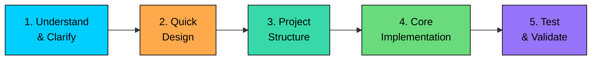

import React from 'react';
import CodeBlock from '../../../../components/ui/CodeBlock';
import Callout from '../../../../components/ui/Callout';

<div className="article-header">
  <div className="breadcrumb">
    <a href="/">Curated Notes</a>
    <span className="breadcrumb-separator">›</span>
    <span className="breadcrumb-current">How to Approach Machine Coding Interviews</span>
  </div>
  <h1>How to Approach Machine Coding Interviews</h1>
  <p style={{ color: 'var(--text-muted)', fontSize: '1.1rem', marginBottom: '16px', lineHeight: '1.6' }}>
    Master the essentials of How to Approach Machine Coding Interviews in this curated guide.
  </p>
  <div className="meta-info">
    <span className="meta-item">
      <svg width="14" height="14" viewBox="0 0 24 24" fill="none" stroke="currentColor" strokeWidth="2"><circle cx="12" cy="12" r="10"/><polyline points="12 6 12 12 16 14"/></svg>
      10 min read
    </span>
    <span className="difficulty-badge difficulty-badge--intermediate">Intermediate</span>
  </div>
</div>

<section className="content-section">


&gt; **What is a Machine Coding Interview?**
&gt;
&gt; A machine coding interview is a timed exercise, typically 60 to 90 minutes, where you receive a problem statement and must produce working code in an IDE of your choice. The interviewer wants to see actual classes, actual methods, and an actual demo that runs.
&gt;
&gt; This format is heavily used by companies in India and increasingly by global tech firms. Flipkart, PhonePe, Atlassian, Uber, Swiggy, Cred, and Groww all include machine coding rounds in their interview pipelines. Some companies give you the problem in advance (30 minutes to 1 hour of prep time), while others hand it to you on the spot.


The problem statement is usually 1 to 2 pages long and describes a real-world system: a parking lot, a meeting room scheduler, a food delivery app, a stock exchange. You will see a list of features the system should support, sometimes with explicit constraints ("support multiple floors," "handle concurrent bookings") and sometimes deliberately vague to test whether you ask clarifying questions.

This is fundamentally different from an OOD interview. In OOD, you spend most of your time on designing classes and discussion. In machine coding, your design phase should be 15-20% of the total time at most. The rest is implementation, testing, and bug fixing. You are evaluated on what you deliver, not what you describe.

You are expected to produce a runnable codebase with clean class design, working logic, and a demo (usually a `Main` class) that exercises the core workflows.

This chapter covers a 5-phase framework for machine coding interviews, using Stack Overflow as the running example.

**Here are the 5 phases:**

1. Understand and Clarify
2. Quick Design
3. Project Structure and Setup
4. Core Implementation
5. Edge Cases, Validation, and Testing





---

## Phase 1: Understand and Clarify (3-5 minutes)

Read the problem statement carefully. Then read it again. Underline or note every action the system must support. Separate what is explicitly required from what is implied or ambiguous.

#### What to Look For

1. **Core functionality:** What must the system do?
2. **Input/Output format:** How will you receive input? What output is expected?
3. **Constraints:** Any limits on data size, time, or features?
4. **Evaluation criteria:** Is extensibility mentioned? Code quality?

If you are allowed to ask the interviewer questions, this is the time. 

#### **Good clarifying questions include:**

- **"Is there a specific input format?":** This determines whether you need to parse strings, read from a file, or just call methods from main.
- **"Should I handle invalid inputs?":** If yes, you need validation in every public method. If no, you can skip it and focus on core logic.
- **"Are there specific test cases I should handle?":** This is the most underrated question. Sometimes the interviewer will hand you the exact scenarios they will evaluate.
- **"Can I use standard libraries?":** In some rounds you cannot use anything beyond the basic library. **Example:** in some interviews you may not be allowed to use ExecutorService in java for managing threads.

#### Take Quick Notes

Write down your requirements in a MUST HAVE / NICE TO HAVE format. This keeps you focused on what matters and gives you a clear list to work through.

#### **Example for Stack Overflow**

##### **MUST HAVE:**

- Register users
- Ask questions with tags
- Post answers to questions
- Add comments on questions and answers
- Upvote/downvote questions and answers
- Search questions by keyword or tag

##### **NICE TO HAVE:**

- Reputation tracking
- Accept best answer
- Question close/reopen

---

## Phase 2: Quick Design (5-10 minutes)

You are not required to sketch out a detailed UML diagrams. You need just enough structure to start coding without second-guessing every class and method.

#### What to Identify

1. **Core classes:** 5-7 main classes
2. **Key relationships:** Who owns whom
3. **Main methods:** What each class does (1-2 lines each)

#### Identifying Classes Quickly

There is a simple trick that works surprisingly well: read the problem statement and highlight the nouns, verbs, and adjectives.

- **Nouns become classes:** User, Question, Answer, Comment, Tag, Vote
- **Verbs become methods:** ask (askQuestion), post (postAnswer), vote, search, comment
- **Adjectives and states become enums:** UPVOTE/DOWNVOTE, OPEN/CLOSED, ACCEPTED/PENDING

For the Stack Overflow example, the problem statement says: "Users can ask questions with tags, post answers, add comments, and upvote or downvote content." That single sentence gives you six classes and five methods.

One more class that does not appear in the problem statement but you always need: a **manager or service class** that ties everything together. This is the entry point for all operations. Call it `StackOverflow`, `StackOverflowService`, or `StackOverflowManager`. It holds collections of users and questions, and every public operation goes through it.

#### Choosing Data Structures

Your choice of data structures during the design phase directly affects how much code you write later. Get this right and implementation flows naturally.

#### **When to use a Map vs a List:**

- Use `Map<Integer, User>` when you need to look up entities by ID. This is almost always the case for your manager class. If `users` is a `List<User>`, finding a user by ID requires a loop every time. With a Map, it is O(1).
- Use `Map<Integer, Vote>` (keyed by voter's user ID) for deduplication. When a user votes, you check `votes.containsKey(userId)`. This is cleaner and faster than iterating a list to check if they already voted.
- Use `List<Answer>` when order matters and you do not need fast lookup by ID. Answers on a question are naturally ordered by time, and you rarely need to find a specific answer by ID.

**Rule of thumb:** If you will ever ask "does this collection contain X?" or "give me the item with ID Y," use a Map. If you just iterate through items or care about order, use a List.

#### **Enums vs booleans vs string constants:**

- Use enums for any value with a fixed set of options: `VoteType.UPVOTE`, `VoteType.DOWNVOTE`. This prevents bugs from typos like `"upvte"` and makes your code self-documenting.
- A boolean is fine when there are exactly two states and the meaning is obvious: `isClosed`. But avoid boolean parameters in methods because `vote(user, question, true)` is unreadable. What does `true` mean? Use an enum instead: `vote(user, question, VoteType.UPVOTE)`.
- Never use raw strings for state. `status = "open"` is a bug waiting to happen. Someone will type `"Open"` or `"OPEN"` and your equality check will fail silently.

#### Quick Sketch

Write this on paper or in a comment block:

**Classes:** User, Question, Answer, Comment, Tag, Vote, StackOverflow (manager)

**Relationships:**

- StackOverflow has Users and Questions
- Question has Answers, Comments, Tags, Votes
- Answer has Comments, Votes
- Vote references a User

**Key methods on StackOverflow:**

- `createUser`, `askQuestion`, `postAnswer`, `addComment`, `vote`, `searchQuestions`

#### Anti-Pattern: Over-Designing

Do not do this in a machine coding interview:

- Draw detailed class diagrams with all attributes
- Define every method signature upfront
- Plan for every edge case before writing a line of code
- Discuss design patterns you will not have time to implement

You will discover design issues while coding. That is fine. Refactor as you go.

---

## Phase 3: Project Structure and Setup (10-15 minutes)

Before writing any business logic, set up your project skeleton. This takes 3-5 minutes but saves much more than that.

#### Why does skeleton-first work so well? 

First, it compiles immediately. You have a project that builds and runs from minute 10. Every change you make from this point is incremental. You never face the dreaded "I have 500 lines of code and none of it compiles" situation at minute 50.

Second, it gives you navigation. When you are deep in the implementation phase and need to add a method to `Question`, you know exactly where to find it. Under time pressure, hunting through a single 400-line file for the right class wastes minutes you cannot afford.

Third, it provides psychological momentum. You have created files, written constructors, and your project runs. You are no longer staring at a blank screen. The hardest part of any timed exercise is getting started, and a skeleton removes that friction.

#### Naming Conventions

Stick to whatever convention your language uses. Do not invent your own style.

- **Java/C#:** `camelCase` for methods and variables, `PascalCase` for classes. `getUserById`, not `get_user_by_id`.
- **Python:** `snake_case` for methods and variables, `PascalCase` for classes. `get_user_by_id`, not `getUserById`.
- **C++:** Either convention works, but be consistent throughout. Mixing styles signals carelessness.

For the model vs service distinction: model classes hold data and behavior related to a single entity (`Question` knows how to add an answer to itself). The service class coordinates operations across multiple entities (`StackOverflow` knows how to connect a user's answer to a question). If you are unsure where a method goes, ask: "Does this operation need to know about more than one entity?" If yes, it belongs in the service class.

#### Example Folder Structure


```java
src/
├── Main.java
├── model/
│   ├── User.java
│   ├── Question.java
│   ├── Answer.java
│   ├── Comment.java
│   ├── Tag.java
│   └── Vote.java
├── service/
│   └── StackOverflow.java
└── enums/
    └── VoteType.java
```

```python
stackoverflow/
├── main.py
├── model/
│   ├── __init__.py
│   ├── user.py
│   ├── question.py
│   ├── answer.py
│   ├── comment.py
│   ├── tag.py
│   └── vote.py
├── service/
│   ├── __init__.py
│   └── stack_overflow.py
└── enums/
    ├── __init__.py
    └── vote_type.py
```

```cpp
src/
├── main.cpp
├── model/
│   ├── User.h
│   ├── Question.h
│   ├── Answer.h
│   ├── Comment.h
│   ├── Tag.h
│   └── Vote.h
├── service/
│   └── StackOverflow.h
└── enums/
    └── VoteType.h
```

```go
src/
├── main.go
├── model/
│   ├── user.go
│   ├── question.go
│   ├── answer.go
│   ├── comment.go
│   ├── tag.go
│   └── vote.go
├── service/
│   └── stack_overflow.go
└── enums/
    └── vote_type.go
```

```csharp
StackOverflow/
├── Program.cs
├── Model/
│   ├── User.cs
│   ├── Question.cs
│   ├── Answer.cs
│   ├── Comment.cs
│   ├── Tag.cs
│   └── Vote.cs
├── Service/
│   └── StackOverflow.cs
└── Enums/
    └── VoteType.cs
```

```typescript
src/
├── main.ts
├── model/
│   ├── User.ts
│   ├── Question.ts
│   ├── Answer.ts
│   ├── Comment.ts
│   ├── Tag.ts
│   └── Vote.ts
├── service/
│   └── StackOverflow.ts
└── enums/
    └── VoteType.ts
```


#### Create Skeleton Classes

Start by creating all your classes with just the fields and constructor. Do not write any logic yet. This gives you a complete skeleton to fill in.


```java
enum VoteType {
    UPVOTE, DOWNVOTE
}

class User {
    private int id;
    private String name;
    private String email;
    private int reputation;
    private List<Question> questions;
    private List<Answer> answers;

    private static int idCounter = 0;

    public User(String name, String email) {
        this.id = ++idCounter;
        this.name = name;
        this.email = email;
        this.reputation = 0;
        this.questions = new ArrayList<>();
        this.answers = new ArrayList<>();
    }

    public int getId() { return id; }
    public String getName() { return name; }
    public int getReputation() { return reputation; }
    public List<Question> getQuestions() { return questions; }
    public List<Answer> getAnswers() { return answers; }

    public void addQuestion(Question question) { questions.add(question); }
    public void addAnswer(Answer answer) { answers.add(answer); }
    public void updateReputation(int delta) {
        this.reputation = Math.max(0, this.reputation + delta);
    }
}

class Tag {
    private String name;

    public Tag(String name) {
        this.name = name.toLowerCase();
    }

    public String getName() { return name; }
}

class Vote {
    private User voter;
    private VoteType type;

    public Vote(User voter, VoteType type) {
        this.voter = voter;
        this.type = type;
    }

    public User getVoter() { return voter; }
    public VoteType getType() { return type; }
}

class Comment {
    private int id;
    private String body;
    private User author;

    private static int idCounter = 0;

    public Comment(User author, String body) {
        this.id = ++idCounter;
        this.author = author;
        this.body = body;
    }

    public int getId() { return id; }
    public String getBody() { return body; }
    public User getAuthor() { return author; }
}
```

```python
from enum import Enum

class VoteType(Enum):
    UPVOTE = 1
    DOWNVOTE = -1
	
class User:
    _id_counter = 0

    def __init__(self, name: str, email: str):
        User._id_counter += 1
        self.id = User._id_counter
        self.name = name
        self.email = email
        self.reputation = 0
        self.questions: list[Question] = []
        self.answers: list[Answer] = []

    def add_question(self, question: "Question") -> None:
        self.questions.append(question)

    def add_answer(self, answer: "Answer") -> None:
        self.answers.append(answer)

    def update_reputation(self, delta: int) -> None:
        self.reputation = max(0, self.reputation + delta)
		
class Tag:
    def __init__(self, name: str):
        self.name = name.lower()
		
class Vote:
    def __init__(self, voter: User, vote_type: VoteType):
        self.voter = voter
        self.type = vote_type					
		
class Comment:
    _id_counter = 0

    def __init__(self, author: User, body: str):
        Comment._id_counter += 1
        self.id = Comment._id_counter
        self.author = author
        self.body = body		
```

```cpp
enum class VoteType { UPVOTE, DOWNVOTE };

class User {
private:
    int id;
    string name;
    string email;
    int reputation;
    vector<Question*> questions;
    vector<Answer*> answers;

    static int idCounter;

public:
    User(const string& name, const string& email)
        : id(++idCounter), name(name), email(email), reputation(0) {}

    int getId() const { return id; }
    const string& getName() const { return name; }
    int getReputation() const { return reputation; }
    const vector<Question*>& getQuestions() const { return questions; }
    const vector<Answer*>& getAnswers() const { return answers; }

    void addQuestion(Question* question) { questions.push_back(question); }
    void addAnswer(Answer* answer) { answers.push_back(answer); }
    void updateReputation(int delta) {
        reputation = max(0, reputation + delta);
    }
};

int User::idCounter = 0;

class Tag {
private:
    string name;

public:
    Tag(const string& name) : name(name) {
        transform(this->name.begin(), this->name.end(), this->name.begin(), ::tolower);
    }

    const string& getName() const { return name; }
};

class Vote {
private:
    User* voter;
    VoteType type;

public:
    Vote(User* voter, VoteType type) : voter(voter), type(type) {}

    User* getVoter() const { return voter; }
    VoteType getType() const { return type; }
};

class Comment {
private:
    int id;
    string body;
    User* author;

    static int idCounter;

public:
    Comment(User* author, const string& body)
        : id(++idCounter), author(author), body(body) {}

    int getId() const { return id; }
    const string& getBody() const { return body; }
    User* getAuthor() const { return author; }
};

int Comment::idCounter = 0;
```

```go
type VoteType int

const (
	UPVOTE VoteType = iota
	DOWNVOTE
)

type User struct {
	id         int
	name       string
	email      string
	reputation int
	questions  []*Question
	answers    []*Answer
}

var userIDCounter int

func NewUser(name, email string) *User {
	userIDCounter++
	return &User{
		id:         userIDCounter,
		name:       name,
		email:      email,
		reputation: 0,
		questions:  make([]*Question, 0),
		answers:    make([]*Answer, 0),
	}
}

func (u *User) GetId() int { return u.id }
func (u *User) GetName() string { return u.name }
func (u *User) GetReputation() int { return u.reputation }
func (u *User) GetQuestions() []*Question { return u.questions }
func (u *User) GetAnswers() []*Answer { return u.answers }

func (u *User) AddQuestion(question *Question) { u.questions = append(u.questions, question) }
func (u *User) AddAnswer(answer *Answer) { u.answers = append(u.answers, answer) }
func (u *User) UpdateReputation(delta int) {
	u.reputation = max(0, u.reputation+delta)
}

type Tag struct {
	name string
}

func NewTag(name string) *Tag {
	return &Tag{name: strings.ToLower(name)}
}

func (t *Tag) GetName() string { return t.name }

type Vote struct {
	voter *User
	type_ VoteType
}

func NewVote(voter *User, type_ VoteType) *Vote {
	return &Vote{voter: voter, type_: type_}
}

func (v *Vote) GetVoter() *User { return v.voter }
func (v *Vote) GetType() VoteType { return v.type_ }

type Comment struct {
	id     int
	body   string
	author *User
}

var commentIDCounter int

func NewComment(author *User, body string) *Comment {
	commentIDCounter++
	return &Comment{
		id:     commentIDCounter,
		author: author,
		body:   body,
	}
}

func (c *Comment) GetId() int { return c.id }
func (c *Comment) GetBody() string { return c.body }
func (c *Comment) GetAuthor() *User { return c.author }
```

```csharp
public enum VoteType { Upvote, Downvote }

public class User {
    private static int _idCounter = 0;

    public int Id { get; }
    public string Name { get; }
    public string Email { get; }
    public int Reputation { get; private set; }
    public List<Question> Questions { get; } = new();
    public List<Answer> Answers { get; } = new();

    public User(string name, string email) {
        Id = ++_idCounter;
        Name = name;
        Email = email;
        Reputation = 0;
    }

    public void AddQuestion(Question question) => Questions.Add(question);
    public void AddAnswer(Answer answer) => Answers.Add(answer);
    public void UpdateReputation(int delta) {
        Reputation = Math.Max(0, Reputation + delta);
    }
}

public class Tag {
    public string Name { get; }

    public Tag(string name) {
        Name = name.ToLower();
    }
}

public class Vote {
    public User Voter { get; }
    public VoteType Type { get; }

    public Vote(User voter, VoteType type) {
        Voter = voter;
        Type = type;
    }
}

public class Comment {
    private static int _idCounter = 0;

    public int Id { get; }
    public string Body { get; }
    public User Author { get; }

    public Comment(User author, string body) {
        Id = ++_idCounter;
        Author = author;
        Body = body;
    }
}
```

```typescript
enum VoteType {
    UPVOTE = 1,
    DOWNVOTE = -1,
}

class User {
    private static idCounter = 0;

    readonly id: number;
    readonly name: string;
    readonly email: string;
    reputation: number = 0;
    readonly questions: Question[] = [];
    readonly answers: Answer[] = [];

    constructor(name: string, email: string) {
        this.id = ++User.idCounter;
        this.name = name;
        this.email = email;
    }

    addQuestion(question: Question): void { this.questions.push(question); }
    addAnswer(answer: Answer): void { this.answers.push(answer); }
    updateReputation(delta: number): void {
        this.reputation = Math.max(0, this.reputation + delta);
    }
}

class Tag {
    readonly name: string;

    constructor(name: string) {
        this.name = name.toLowerCase();
    }
}

class Vote {
    readonly voter: User;
    readonly type: VoteType;

    constructor(voter: User, type: VoteType) {
        this.voter = voter;
        this.type = type;
    }
}

class Comment {
    private static idCounter = 0;

    readonly id: number;
    readonly body: string;
    readonly author: User;

    constructor(author: User, body: string) {
        this.id = ++Comment.idCounter;
        this.author = author;
        this.body = body;
    }
}
```


Now create the two content classes. Both `Question` and `Answer` need comments and votes, so they share similar fields:


```java
class Answer {
    private int id;
    private String body;
    private User author;
    private Question question;
    private List<Comment> comments;
    private Map<Integer, Vote> votes;
    private boolean isAccepted;

    private static int idCounter = 0;

    public Answer(User author, Question question, String body) {
        this.id = ++idCounter;
        this.author = author;
        this.question = question;
        this.body = body;
        this.comments = new ArrayList<>();
        this.votes = new HashMap<>();
        this.isAccepted = false;
    }

    public int getId() { return id; }
    public String getBody() { return body; }
    public User getAuthor() { return author; }
    public Question getQuestion() { return question; }
    public boolean isAccepted() { return isAccepted; }

    public void setAccepted(boolean accepted) { this.isAccepted = accepted; }

    public void addComment(Comment comment) {
        comments.add(comment);
    }

    public void vote(User voter, VoteType voteType) {
        if (voter.getId() == author.getId()) {
            throw new IllegalArgumentException("Cannot vote on your own answer");
        }
        if (votes.containsKey(voter.getId())) {
            throw new IllegalArgumentException("Already voted on this answer");
        }
        votes.put(voter.getId(), new Vote(voter, voteType));
        if (voteType == VoteType.UPVOTE) {
            author.updateReputation(10);
        } else {
            author.updateReputation(-2);
        }
    }

    public int getVoteCount() {
        int count = 0;
        for (Vote v : votes.values()) {
            count += (v.getType() == VoteType.UPVOTE) ? 1 : -1;
        }
        return count;
    }

    public List<Comment> getComments() { return comments; }
}

class Question {
    private int id;
    private String title;
    private String body;
    private User author;
    private List<Answer> answers;
    private List<Comment> comments;
    private List<Tag> tags;
    private Map<Integer, Vote> votes;
    private boolean isClosed;

    private static int idCounter = 0;

    public Question(User author, String title, String body, List<Tag> tags) {
        this.id = ++idCounter;
        this.author = author;
        this.title = title;
        this.body = body;
        this.tags = tags;
        this.answers = new ArrayList<>();
        this.comments = new ArrayList<>();
        this.votes = new HashMap<>();
        this.isClosed = false;
    }

    public int getId() { return id; }
    public String getTitle() { return title; }
    public String getBody() { return body; }
    public User getAuthor() { return author; }
    public List<Answer> getAnswers() { return answers; }
    public List<Tag> getTags() { return tags; }
    public boolean isClosed() { return isClosed; }

    public void setClosed(boolean closed) { this.isClosed = closed; }

    public void addAnswer(Answer answer) {
        if (isClosed) {
            throw new IllegalStateException("Cannot add answer to a closed question");
        }
        answers.add(answer);
    }

    public void addComment(Comment comment) {
        comments.add(comment);
    }

    public void vote(User voter, VoteType voteType) {
        if (voter.getId() == author.getId()) {
            throw new IllegalArgumentException("Cannot vote on your own question");
        }
        if (votes.containsKey(voter.getId())) {
            throw new IllegalArgumentException("Already voted on this question");
        }
        votes.put(voter.getId(), new Vote(voter, voteType));
        if (voteType == VoteType.UPVOTE) {
            author.updateReputation(5);
        } else {
            author.updateReputation(-2);
        }
    }

    public int getVoteCount() {
        int count = 0;
        for (Vote v : votes.values()) {
            count += (v.getType() == VoteType.UPVOTE) ? 1 : -1;
        }
        return count;
    }

    public List<Comment> getComments() { return comments; }
}
```

```python
class Answer:
    _id_counter = 0

    def __init__(self, author: User, question: "Question", body: str):
        Answer._id_counter += 1
        self.id = Answer._id_counter
        self.body = body
        self.author = author
        self.question = question
        self.comments: list[Comment] = []
        self.votes: dict[int, Vote] = {}
        self.is_accepted = False

    def add_comment(self, comment: Comment) -> None:
        self.comments.append(comment)

    def vote(self, voter: User, vote_type: VoteType) -> None:
        if voter.id == self.author.id:
            raise ValueError("Cannot vote on your own answer")
        if voter.id in self.votes:
            raise ValueError("Already voted on this answer")
        self.votes[voter.id] = Vote(voter, vote_type)
        if vote_type == VoteType.UPVOTE:
            self.author.update_reputation(10)
        else:
            self.author.update_reputation(-2)

    def get_vote_count(self) -> int:
        return sum(1 if v.type == VoteType.UPVOTE else -1 for v in self.votes.values())
		
class Question:
    _id_counter = 0

    def __init__(self, author: User, title: str, body: str, tags: list[Tag]):
        Question._id_counter += 1
        self.id = Question._id_counter
        self.title = title
        self.body = body
        self.author = author
        self.tags = tags
        self.answers: list[Answer] = []
        self.comments: list[Comment] = []
        self.votes: dict[int, Vote] = {}
        self.is_closed = False

    def add_answer(self, answer: Answer) -> None:
        if self.is_closed:
            raise RuntimeError("Cannot add answer to a closed question")
        self.answers.append(answer)

    def add_comment(self, comment: Comment) -> None:
        self.comments.append(comment)

    def vote(self, voter: User, vote_type: VoteType) -> None:
        if voter.id == self.author.id:
            raise ValueError("Cannot vote on your own question")
        if voter.id in self.votes:
            raise ValueError("Already voted on this question")
        self.votes[voter.id] = Vote(voter, vote_type)
        if vote_type == VoteType.UPVOTE:
            self.author.update_reputation(5)
        else:
            self.author.update_reputation(-2)

    def get_vote_count(self) -> int:
        return sum(1 if v.type == VoteType.UPVOTE else -1 for v in self.votes.values())		
```

```cpp
class Answer {
private:
    int id;
    string body;
    User* author;
    Question* question;
    vector<Comment*> comments;
    unordered_map<int, Vote*> votes;
    bool accepted;

    static int idCounter;

public:
    Answer(User* author, Question* question, const string& body)
        : id(++idCounter), body(body), author(author), question(question), accepted(false) {}

    int getId() const { return id; }
    const string& getBody() const { return body; }
    User* getAuthor() const { return author; }
    Question* getQuestion() const { return question; }
    bool isAccepted() const { return accepted; }

    void setAccepted(bool val) { accepted = val; }

    void addComment(Comment* comment) { comments.push_back(comment); }

    void vote(User* voter, VoteType voteType) {
        if (voter->getId() == author->getId()) {
            throw invalid_argument("Cannot vote on your own answer");
        }
        if (votes.count(voter->getId())) {
            throw invalid_argument("Already voted on this answer");
        }
        votes[voter->getId()] = new Vote(voter, voteType);
        if (voteType == VoteType::UPVOTE) {
            author->updateReputation(10);
        } else {
            author->updateReputation(-2);
        }
    }

    int getVoteCount() const {
        int count = 0;
        for (const auto& [id, v] : votes) {
            count += (v->getType() == VoteType::UPVOTE) ? 1 : -1;
        }
        return count;
    }

    const vector<Comment*>& getComments() const { return comments; }
};

int Answer::idCounter = 0;

class Question {
private:
    int id;
    string title;
    string body;
    User* author;
    vector<Answer*> answers;
    vector<Comment*> comments;
    vector<Tag*> tags;
    unordered_map<int, Vote*> votes;
    bool closed;

    static int idCounter;

public:
    Question(User* author, const string& title, const string& body,
             const vector<Tag*>& tags)
        : id(++idCounter), title(title), body(body), author(author), tags(tags), closed(false) {}

    int getId() const { return id; }
    const string& getTitle() const { return title; }
    const string& getBody() const { return body; }
    User* getAuthor() const { return author; }
    const vector<Answer*>& getAnswers() const { return answers; }
    const vector<Tag*>& getTags() const { return tags; }
    bool isClosed() const { return closed; }

    void setClosed(bool val) { closed = val; }

    void addAnswer(Answer* answer) {
        if (closed) {
            throw runtime_error("Cannot add answer to a closed question");
        }
        answers.push_back(answer);
    }

    void addComment(Comment* comment) { comments.push_back(comment); }

    void vote(User* voter, VoteType voteType) {
        if (voter->getId() == author->getId()) {
            throw invalid_argument("Cannot vote on your own question");
        }
        if (votes.count(voter->getId())) {
            throw invalid_argument("Already voted on this question");
        }
        votes[voter->getId()] = new Vote(voter, voteType);
        if (voteType == VoteType::UPVOTE) {
            author->updateReputation(5);
        } else {
            author->updateReputation(-2);
        }
    }

    int getVoteCount() const {
        int count = 0;
        for (const auto& [id, v] : votes) {
            count += (v->getType() == VoteType::UPVOTE) ? 1 : -1;
        }
        return count;
    }

    const vector<Comment*>& getComments() const { return comments; }
};

int Question::idCounter = 0;
```

```go
type Answer struct {
	id        int
	body      string
	author    *User
	question  *Question
	comments  []Comment
	votes     map[int]Vote
	isAccepted bool

}

var answerIDCounter int

func NewAnswer(author *User, question *Question, body string) *Answer {
	answerIDCounter++
	return &Answer{
		id:         answerIDCounter,
		body:       body,
		author:     author,
		question:   question,
		comments:   []Comment{},
		votes:      make(map[int]Vote),
		isAccepted: false,
	}
}

func (a *Answer) GetId() int { return a.id }
func (a *Answer) GetBody() string { return a.body }
func (a *Answer) GetAuthor() *User { return a.author }
func (a *Answer) GetQuestion() *Question { return a.question }
func (a *Answer) IsAccepted() bool { return a.isAccepted }

func (a *Answer) SetAccepted(accepted bool) { a.isAccepted = accepted }

func (a *Answer) AddComment(comment Comment) {
	a.comments = append(a.comments, comment)
}

func (a *Answer) Vote(voter *User, voteType VoteType) {
	if voter.GetId() == a.author.GetId() {
		panic("Cannot vote on your own answer")
	}
	if _, ok := a.votes[voter.GetId()]; ok {
		panic("Already voted on this answer")
	}
	a.votes[voter.GetId()] = NewVote(voter, voteType)
	if voteType == VoteType.UPVOTE {
		a.author.UpdateReputation(10)
	} else {
		a.author.UpdateReputation(-2)
	}
}

func (a *Answer) GetVoteCount() int {
	count := 0
	for _, v := range a.votes {
		if v.GetType() == VoteType.UPVOTE {
			count++
		} else {
			count--
		}
	}
	return count
}

func (a *Answer) GetComments() []Comment { return a.comments }

type Question struct {
	id       int
	title    string
	body     string
	author   *User
	answers  []Answer
	comments []Comment
	tags     []Tag
	votes    map[int]Vote
	isClosed bool

}

var questionIDCounter int

func NewQuestion(author *User, title, body string, tags []Tag) *Question {
	questionIDCounter++
	return &Question{
		id:       questionIDCounter,
		author:   author,
		title:    title,
		body:     body,
		tags:     tags,
		answers:  []Answer{},
		comments: []Comment{},
		votes:    make(map[int]Vote),
		isClosed: false,
	}
}

func (q *Question) GetId() int { return q.id }
func (q *Question) GetTitle() string { return q.title }
func (q *Question) GetBody() string { return q.body }
func (q *Question) GetAuthor() *User { return q.author }
func (q *Question) GetAnswers() []Answer { return q.answers }
func (q *Question) GetTags() []Tag { return q.tags }
func (q *Question) IsClosed() bool { return q.isClosed }

func (q *Question) SetClosed(closed bool) { q.isClosed = closed }

func (q *Question) AddAnswer(answer Answer) {
	if q.isClosed {
		panic("Cannot add answer to a closed question")
	}
	q.answers = append(q.answers, answer)
}

func (q *Question) AddComment(comment Comment) {
	q.comments = append(q.comments, comment)
}

func (q *Question) Vote(voter *User, voteType VoteType) {
	if voter.GetId() == q.author.GetId() {
		panic("Cannot vote on your own question")
	}
	if _, ok := q.votes[voter.GetId()]; ok {
		panic("Already voted on this question")
	}
	q.votes[voter.GetId()] = NewVote(voter, voteType)
	if voteType == VoteType.UPVOTE {
		q.author.UpdateReputation(5)
	} else {
		q.author.UpdateReputation(-2)
	}
}

func (q *Question) GetVoteCount() int {
	count := 0
	for _, v := range q.votes {
		if v.GetType() == VoteType.UPVOTE {
			count++
		} else {
			count--
		}
	}
	return count
}

func (q *Question) GetComments() []Comment { return q.comments }
```

```csharp
public class Answer {
    private static int _idCounter = 0;
    private readonly Dictionary<int, Vote> _votes = new();

    public int Id { get; }
    public string Body { get; }
    public User Author { get; }
    public Question Question { get; }
    public List<Comment> Comments { get; } = new();
    public bool IsAccepted { get; set; }

    public Answer(User author, Question question, string body) {
        Id = ++_idCounter;
        Author = author;
        Question = question;
        Body = body;
        IsAccepted = false;
    }

    public void AddComment(Comment comment) => Comments.Add(comment);

    public void Vote(User voter, VoteType voteType) {
        if (voter.Id == Author.Id) {
            throw new InvalidOperationException("Cannot vote on your own answer");
        }
        if (_votes.ContainsKey(voter.Id)) {
            throw new InvalidOperationException("Already voted on this answer");
        }
        _votes[voter.Id] = new Vote(voter, voteType);
        if (voteType == VoteType.Upvote) {
            Author.UpdateReputation(10);
        } else {
            Author.UpdateReputation(-2);
        }
    }

    public int GetVoteCount() {
        return _votes.Values.Sum(v => v.Type == VoteType.Upvote ? 1 : -1);
    }
}

public class Question {
    private static int _idCounter = 0;
    private readonly Dictionary<int, Vote> _votes = new();

    public int Id { get; }
    public string Title { get; }
    public string Body { get; }
    public User Author { get; }
    public List<Answer> Answers { get; } = new();
    public List<Comment> Comments { get; } = new();
    public List<Tag> Tags { get; }
    public bool IsClosed { get; set; }

    public Question(User author, string title, string body, List<Tag> tags) {
        Id = ++_idCounter;
        Author = author;
        Title = title;
        Body = body;
        Tags = tags;
        IsClosed = false;
    }

    public void AddAnswer(Answer answer) {
        if (IsClosed) {
            throw new InvalidOperationException("Cannot add answer to a closed question");
        }
        Answers.Add(answer);
    }

    public void AddComment(Comment comment) => Comments.Add(comment);

    public void Vote(User voter, VoteType voteType) {
        if (voter.Id == Author.Id) {
            throw new InvalidOperationException("Cannot vote on your own question");
        }
        if (_votes.ContainsKey(voter.Id)) {
            throw new InvalidOperationException("Already voted on this question");
        }
        _votes[voter.Id] = new Vote(voter, voteType);
        if (voteType == VoteType.Upvote) {
            Author.UpdateReputation(5);
        } else {
            Author.UpdateReputation(-2);
        }
    }

    public int GetVoteCount() {
        return _votes.Values.Sum(v => v.Type == VoteType.Upvote ? 1 : -1);
    }
}
```

```typescript
class Answer {
    private static idCounter = 0;
    readonly id: number;
    readonly body: string;
    readonly author: User;
    readonly question: Question;
    private comments: Comment[] = [];
    private votes: Map<number, Vote> = new Map();
    isAccepted: boolean = false;

    constructor(author: User, question: Question, body: string) {
        this.id = ++Answer.idCounter;
        this.author = author;
        this.question = question;
        this.body = body;
    }

    addComment(comment: Comment): void { this.comments.push(comment); }

    vote(voter: User, voteType: VoteType): void {
        if (voter.id === this.author.id) {
            throw new Error("Cannot vote on your own answer");
        }
        if (this.votes.has(voter.id)) {
            throw new Error("Already voted on this answer");
        }
        this.votes.set(voter.id, new Vote(voter, voteType));
        if (voteType === VoteType.UPVOTE) {
            this.author.updateReputation(10);
        } else {
            this.author.updateReputation(-2);
        }
    }

    getVoteCount(): number {
        let count = 0;
        for (const v of this.votes.values()) {
            count += v.type === VoteType.UPVOTE ? 1 : -1;
        }
        return count;
    }

    getComments(): Comment[] { return this.comments; }
}

```


All your model classes now exist. The project should compile with no errors even though nothing happens yet.

---

## Phase 4: Core Implementation (15-65 min)

Spend 40-50 minutes here. The goal: get all core operations working end-to-end so you can run test cases and see correct output.

#### Implementation Order: Bottom-Up

Build your code bottom-up: models first, then the service class, then main.

**Why this order?** Because each layer depends only on the layer below it. When you write `StackOverflow.askQuestion()`, the `User`, `Question`, and `Tag` classes already exist and compile. You never write a method that calls something you have not built yet. This means every method you write can be tested the moment you finish it.

The opposite approach, starting with main and working down, leads to a cascade of compilation errors. You write `stackoverflow.askQuestion(...)` but `askQuestion` does not exist yet. Then you create the method but `Question` does not exist. You end up with 10 files open, all broken, and no way to test anything. Bottom-up avoids this entirely.

#### **Recommended order for Stack Overflow:**

1. Enums (`VoteType`)
2. Simple models (`Tag`, `Comment`, `Vote`)
3. Core models (`User`, `Answer`, `Question`)
4. Service class (`StackOverflow`)
5. Main method with test scenarios

#### When to Skip Features

Look at your MUST HAVE list from Phase 1. Work through it in priority order. If you reach minute 50 and you have three features left, make a judgment call: which ones are essential and which can be left as TODOs?

Leave a clear comment for anything you skip:


```plaintext
// TODO: Implement search by tag (would filter questions where any tag matches)
```


This tells the interviewer two things: you identified the requirement, and you know how you would implement it. That is worth partial credit. An empty gap with no comment looks like you forgot the feature entirely.

One more thing: never skip validation in favor of new features. A system that handles 4 features with proper error handling scores higher than a system that handles 6 features but crashes on invalid input.

#### The StackOverflow Manager Class

Build it method by method, testing as you go.


```java
public class StackOverflow {
    private final Map<Integer, User> users = new HashMap<>();
    private final Map<Integer, Question> questions = new HashMap<>();

    // ---- User Management ----

    public User createUser(String name, String email) {
        User user = new User(name, email);
        users.put(user.getId(), user);
        return user;
    }

    // ---- Question Operations ----

    public Question askQuestion(User user, String title, String body, List<String> tagNames) {
        if (title == null || title.isBlank()) {
            throw new IllegalArgumentException("Question title cannot be empty");
        }
        if (body == null || body.isBlank()) {
            throw new IllegalArgumentException("Question body cannot be empty");
        }

        List<Tag> tags = tagNames.stream()
                .map(Tag::new)
                .collect(Collectors.toList());

        Question question = new Question(user, title, body, tags);
        questions.put(question.getId(), question);
        user.addQuestion(question);

        return question;
    }

    // ---- Answer Operations ----

    public Answer postAnswer(User user, Question question, String body) {
        if (body == null || body.isBlank()) {
            throw new IllegalArgumentException("Answer body cannot be empty");
        }

        Answer answer = new Answer(user, question, body);
        question.addAnswer(answer);
        user.addAnswer(answer);

        return answer;
    }

    // ---- Comment Operations ----

    public Comment addCommentToQuestion(User user, Question question, String body) {
        if (body == null || body.isBlank()) {
            throw new IllegalArgumentException("Comment body cannot be empty");
        }
        Comment comment = new Comment(user, body);
        question.addComment(comment);
        return comment;
    }

    public Comment addCommentToAnswer(User user, Answer answer, String body) {
        if (body == null || body.isBlank()) {
            throw new IllegalArgumentException("Comment body cannot be empty");
        }
        Comment comment = new Comment(user, body);
        answer.addComment(comment);
        return comment;
    }

    // ---- Voting ----

    public void voteOnQuestion(User voter, Question question, VoteType voteType) {
        question.vote(voter, voteType);
    }

    public void voteOnAnswer(User voter, Answer answer, VoteType voteType) {
        answer.vote(voter, voteType);
    }

    // ---- Accept Answer ----

    public void acceptAnswer(User user, Answer answer) {
        if (user.getId() != answer.getQuestion().getAuthor().getId()) {
            throw new IllegalArgumentException("Only the question author can accept an answer");
        }
        answer.setAccepted(true);
    }

    // ---- Search ----

    public List<Question> searchQuestions(String query) {
        String lowerQuery = query.toLowerCase();
        List<Question> results = new ArrayList<>();

        for (Question question : questions.values()) {
            if (question.getTitle().toLowerCase().contains(lowerQuery)
                    || question.getBody().toLowerCase().contains(lowerQuery)) {
                results.add(question);
                continue;
            }

            for (Tag tag : question.getTags()) {
                if (tag.getName().equals(lowerQuery)) {
                    results.add(question);
                    break;
                }
            }
        }

        return results;
    }

    // ---- Getters ----

    public User getUser(int id) { return users.get(id); }
    public Question getQuestion(int id) { return questions.get(id); }
}
```

```python
class StackOverflow:
    def __init__(self):
        self.users: dict[int, User] = {}
        self.questions: dict[int, Question] = {}

    # ---- User Management ----

    def create_user(self, name: str, email: str) -> User:
        user = User(name, email)
        self.users[user.id] = user
        return user

    # ---- Question Operations ----

    def ask_question(self, user: User, title: str, body: str, tag_names: list[str]) -> Question:
        if not title or not title.strip():
            raise ValueError("Question title cannot be empty")
        if not body or not body.strip():
            raise ValueError("Question body cannot be empty")

        tags = [Tag(name) for name in tag_names]
        question = Question(user, title, body, tags)
        self.questions[question.id] = question
        user.add_question(question)
        return question

    # ---- Answer Operations ----

    def post_answer(self, user: User, question: Question, body: str) -> Answer:
        if not body or not body.strip():
            raise ValueError("Answer body cannot be empty")

        answer = Answer(user, question, body)
        question.add_answer(answer)
        user.add_answer(answer)
        return answer

    # ---- Comment Operations ----

    def add_comment_to_question(self, user: User, question: Question, body: str) -> Comment:
        if not body or not body.strip():
            raise ValueError("Comment body cannot be empty")
        comment = Comment(user, body)
        question.add_comment(comment)
        return comment

    def add_comment_to_answer(self, user: User, answer: Answer, body: str) -> Comment:
        if not body or not body.strip():
            raise ValueError("Comment body cannot be empty")
        comment = Comment(user, body)
        answer.add_comment(comment)
        return comment

    # ---- Voting ----

    def vote_on_question(self, voter: User, question: Question, vote_type: VoteType) -> None:
        question.vote(voter, vote_type)

    def vote_on_answer(self, voter: User, answer: Answer, vote_type: VoteType) -> None:
        answer.vote(voter, vote_type)

    # ---- Accept Answer ----

    def accept_answer(self, user: User, answer: Answer) -> None:
        if user.id != answer.question.author.id:
            raise ValueError("Only the question author can accept an answer")
        answer.is_accepted = True

    # ---- Search ----

    def search_questions(self, query: str) -> list[Question]:
        lower_query = query.lower()
        results = []

        for question in self.questions.values():
            if lower_query in question.title.lower() or lower_query in question.body.lower():
                results.append(question)
                continue

            for tag in question.tags:
                if tag.name == lower_query:
                    results.append(question)
                    break

        return results

    # ---- Getters ----

    def get_user(self, user_id: int) -> User:
        return self.users.get(user_id)

    def get_question(self, question_id: int) -> Question:
        return self.questions.get(question_id)
```

```cpp
class StackOverflow {
private:
    unordered_map<int, User*> users;
    unordered_map<int, Question*> questions;

public:
    // ---- User Management ----

    User* createUser(const string& name, const string& email) {
        auto* user = new User(name, email);
        users[user->getId()] = user;
        return user;
    }

    // ---- Question Operations ----

    Question* askQuestion(User* user, const string& title,
                          const string& body, const vector<string>& tagNames) {
        if (title.empty()) {
            throw invalid_argument("Question title cannot be empty");
        }
        if (body.empty()) {
            throw invalid_argument("Question body cannot be empty");
        }

        vector<Tag*> tags;
        for (const auto& name : tagNames) {
            tags.push_back(new Tag(name));
        }

        auto* question = new Question(user, title, body, tags);
        questions[question->getId()] = question;
        user->addQuestion(question);
        return question;
    }

    // ---- Answer Operations ----

    Answer* postAnswer(User* user, Question* question, const string& body) {
        if (body.empty()) {
            throw invalid_argument("Answer body cannot be empty");
        }

        auto* answer = new Answer(user, question, body);
        question->addAnswer(answer);
        user->addAnswer(answer);
        return answer;
    }

    // ---- Comment Operations ----

    Comment* addCommentToQuestion(User* user, Question* question, const string& body) {
        if (body.empty()) {
            throw invalid_argument("Comment body cannot be empty");
        }
        auto* comment = new Comment(user, body);
        question->addComment(comment);
        return comment;
    }

    Comment* addCommentToAnswer(User* user, Answer* answer, const string& body) {
        if (body.empty()) {
            throw invalid_argument("Comment body cannot be empty");
        }
        auto* comment = new Comment(user, body);
        answer->addComment(comment);
        return comment;
    }

    // ---- Voting ----

    void voteOnQuestion(User* voter, Question* question, VoteType voteType) {
        question->vote(voter, voteType);
    }

    void voteOnAnswer(User* voter, Answer* answer, VoteType voteType) {
        answer->vote(voter, voteType);
    }

    // ---- Accept Answer ----

    void acceptAnswer(User* user, Answer* answer) {
        if (user->getId() != answer->getQuestion()->getAuthor()->getId()) {
            throw invalid_argument("Only the question author can accept an answer");
        }
        answer->setAccepted(true);
    }

    // ---- Search ----

    vector<Question*> searchQuestions(const string& query) {
        string lowerQuery = query;
        transform(lowerQuery.begin(), lowerQuery.end(), lowerQuery.begin(), ::tolower);
        vector<Question*> results;

        for (auto& [id, question] : questions) {
            string lowerTitle = question->getTitle();
            transform(lowerTitle.begin(), lowerTitle.end(), lowerTitle.begin(), ::tolower);
            string lowerBody = question->getBody();
            transform(lowerBody.begin(), lowerBody.end(), lowerBody.begin(), ::tolower);

            if (lowerTitle.find(lowerQuery) != string::npos
                    || lowerBody.find(lowerQuery) != string::npos) {
                results.push_back(question);
                continue;
            }

            for (auto* tag : question->getTags()) {
                if (tag->getName() == lowerQuery) {
                    results.push_back(question);
                    break;
                }
            }
        }
        return results;
    }

    // ---- Getters ----

    User* getUser(int id) { return users.count(id) ? users[id] : nullptr; }
    Question* getQuestion(int id) { return questions.count(id) ? questions[id] : nullptr; }
};
```

```go
type StackOverflow struct {
	users     map[int]*User
	questions map[int]*Question
}

// ---- User Management ----

func (s *StackOverflow) createUser(name, email string) *User {
	user := NewUser(name, email)
	s.users[user.GetId()] = user
	return user
}

// ---- Question Operations ----

func (s *StackOverflow) askQuestion(user *User, title, body string, tagNames []string) *Question {
	if title == "" {
		panic("Question title cannot be empty")
	}
	if body == "" {
		panic("Question body cannot be empty")
	}

	tags := make([]*Tag, 0, len(tagNames))
	for _, name := range tagNames {
		tags = append(tags, NewTag(name))
	}

	question := NewQuestion(user, title, body, tags)
	s.questions[question.GetId()] = question
	user.AddQuestion(question)
	return question
}

// ---- Answer Operations ----

func (s *StackOverflow) postAnswer(user *User, question *Question, body string) *Answer {
	if body == "" {
		panic("Answer body cannot be empty")
	}

	answer := NewAnswer(user, question, body)
	question.AddAnswer(answer)
	user.AddAnswer(answer)
	return answer
}

// ---- Comment Operations ----

func (s *StackOverflow) addCommentToQuestion(user *User, question *Question, body string) *Comment {
	if body == "" {
		panic("Comment body cannot be empty")
	}
	comment := NewComment(user, body)
	question.AddComment(comment)
	return comment
}

func (s *StackOverflow) addCommentToAnswer(user *User, answer *Answer, body string) *Comment {
	if body == "" {
		panic("Comment body cannot be empty")
	}
	comment := NewComment(user, body)
	answer.AddComment(comment)
	return comment
}

// ---- Voting ----

func (s *StackOverflow) voteOnQuestion(voter *User, question *Question, voteType VoteType) {
	question.Vote(voter, voteType)
}

func (s *StackOverflow) voteOnAnswer(voter *User, answer *Answer, voteType VoteType) {
	answer.Vote(voter, voteType)
}

// ---- Accept Answer ----

func (s *StackOverflow) acceptAnswer(user *User, answer *Answer) {
	if user.GetId() != answer.GetQuestion().GetAuthor().GetId() {
		panic("Only the question author can accept an answer")
	}
	answer.SetAccepted(true)
}

// ---- Search ----

func (s *StackOverflow) searchQuestions(query string) []*Question {
	lowerQuery := strings.ToLower(query)
	results := make([]*Question, 0)

	for _, question := range s.questions {
		if strings.Contains(strings.ToLower(question.GetTitle()), lowerQuery) ||
			strings.Contains(strings.ToLower(question.GetBody()), lowerQuery) {
			results = append(results, question)
			continue
		}

		for _, tag := range question.GetTags() {
			if tag.GetName() == lowerQuery {
				results = append(results, question)
				break
			}
		}
	}

	return results
}

// ---- Getters ----

func (s *StackOverflow) getUser(id int) *User { return s.users[id] }
func (s *StackOverflow) getQuestion(id int) *Question { return s.questions[id] }
```

```csharp
public class StackOverflow {
    private readonly Dictionary<int, User> _users = new();
    private readonly Dictionary<int, Question> _questions = new();

    // ---- User Management ----

    public User CreateUser(string name, string email) {
        var user = new User(name, email);
        _users[user.Id] = user;
        return user;
    }

    // ---- Question Operations ----

    public Question AskQuestion(User user, string title, string body, List<string> tagNames) {
        if (string.IsNullOrWhiteSpace(title)) {
            throw new ArgumentException("Question title cannot be empty");
        }
        if (string.IsNullOrWhiteSpace(body)) {
            throw new ArgumentException("Question body cannot be empty");
        }

        var tags = tagNames.Select(name => new Tag(name)).ToList();
        var question = new Question(user, title, body, tags);
        _questions[question.Id] = question;
        user.AddQuestion(question);
        return question;
    }

    // ---- Answer Operations ----

    public Answer PostAnswer(User user, Question question, string body) {
        if (string.IsNullOrWhiteSpace(body)) {
            throw new ArgumentException("Answer body cannot be empty");
        }

        var answer = new Answer(user, question, body);
        question.AddAnswer(answer);
        user.AddAnswer(answer);
        return answer;
    }

    // ---- Comment Operations ----

    public Comment AddCommentToQuestion(User user, Question question, string body) {
        if (string.IsNullOrWhiteSpace(body)) {
            throw new ArgumentException("Comment body cannot be empty");
        }
        var comment = new Comment(user, body);
        question.AddComment(comment);
        return comment;
    }

    public Comment AddCommentToAnswer(User user, Answer answer, string body) {
        if (string.IsNullOrWhiteSpace(body)) {
            throw new ArgumentException("Comment body cannot be empty");
        }
        var comment = new Comment(user, body);
        answer.AddComment(comment);
        return comment;
    }

    // ---- Voting ----

    public void VoteOnQuestion(User voter, Question question, VoteType voteType) {
        question.Vote(voter, voteType);
    }

    public void VoteOnAnswer(User voter, Answer answer, VoteType voteType) {
        answer.Vote(voter, voteType);
    }

    // ---- Accept Answer ----

    public void AcceptAnswer(User user, Answer answer) {
        if (user.Id != answer.Question.Author.Id) {
            throw new InvalidOperationException("Only the question author can accept an answer");
        }
        answer.IsAccepted = true;
    }

    // ---- Search ----

    public List<Question> SearchQuestions(string query) {
        var lowerQuery = query.ToLower();
        var results = new List<Question>();

        foreach (var question in _questions.Values) {
            if (question.Title.ToLower().Contains(lowerQuery)
                    || question.Body.ToLower().Contains(lowerQuery)) {
                results.Add(question);
                continue;
            }

            if (question.Tags.Any(tag => tag.Name == lowerQuery)) {
                results.Add(question);
            }
        }
        return results;
    }

    // ---- Getters ----

    public User? GetUser(int id) => _users.GetValueOrDefault(id);
    public Question? GetQuestion(int id) => _questions.GetValueOrDefault(id);
}
```

```typescript
class StackOverflow {
    private users: Map<number, User> = new Map();
    private questions: Map<number, Question> = new Map();

    // ---- User Management ----

    createUser(name: string, email: string): User {
        const user = new User(name, email);
        this.users.set(user.id, user);
        return user;
    }

    // ---- Question Operations ----

    askQuestion(user: User, title: string, body: string, tagNames: string[]): Question {
        if (!title || !title.trim()) {
            throw new Error("Question title cannot be empty");
        }
        if (!body || !body.trim()) {
            throw new Error("Question body cannot be empty");
        }

        const tags = tagNames.map(name => new Tag(name));
        const question = new Question(user, title, body, tags);
        this.questions.set(question.id, question);
        user.addQuestion(question);
        return question;
    }

    // ---- Answer Operations ----

    postAnswer(user: User, question: Question, body: string): Answer {
        if (!body || !body.trim()) {
            throw new Error("Answer body cannot be empty");
        }

        const answer = new Answer(user, question, body);
        question.addAnswer(answer);
        user.addAnswer(answer);
        return answer;
    }

    // ---- Comment Operations ----

    addCommentToQuestion(user: User, question: Question, body: string): Comment {
        if (!body || !body.trim()) {
            throw new Error("Comment body cannot be empty");
        }
        const comment = new Comment(user, body);
        question.addComment(comment);
        return comment;
    }

    addCommentToAnswer(user: User, answer: Answer, body: string): Comment {
        if (!body || !body.trim()) {
            throw new Error("Comment body cannot be empty");
        }
        const comment = new Comment(user, body);
        answer.addComment(comment);
        return comment;
    }

    // ---- Voting ----

    voteOnQuestion(voter: User, question: Question, voteType: VoteType): void {
        question.vote(voter, voteType);
    }

    voteOnAnswer(voter: User, answer: Answer, voteType: VoteType): void {
        answer.vote(voter, voteType);
    }

    // ---- Accept Answer ----

    acceptAnswer(user: User, answer: Answer): void {
        if (user.id !== answer.question.author.id) {
            throw new Error("Only the question author can accept an answer");
        }
        answer.isAccepted = true;
    }

    // ---- Search ----

    searchQuestions(query: string): Question[] {
        const lowerQuery = query.toLowerCase();
        const results: Question[] = [];

        for (const question of this.questions.values()) {
            if (question.title.toLowerCase().includes(lowerQuery)
                    || question.body.toLowerCase().includes(lowerQuery)) {
                results.push(question);
                continue;
            }

            if (question.tags.some(tag => tag.name === lowerQuery)) {
                results.push(question);
            }
        }
        return results;
    }

    // ---- Getters ----

    getUser(id: number): User | undefined { return this.users.get(id); }
    getQuestion(id: number): Question | undefined { return this.questions.get(id); }
}
```


#### The Main Class

Now write a main entry point that exercises all the functionality. This doubles as your test harness and the first thing anyone reviewing your code will read.


```java
public class Main {
    public static void main(String[] args) {
        StackOverflow system = new StackOverflow();

        // Create users
        User alice = system.createUser("Alice", "alice@example.com");
        User bob = system.createUser("Bob", "bob@example.com");
        User charlie = system.createUser("Charlie", "charlie@example.com");

        // Alice asks a question
        Question q1 = system.askQuestion(alice,
                "How to reverse a linked list in Java?",
                "I need to reverse a singly linked list. What is the best approach?",
                List.of("java", "linked-list", "data-structures"));
        System.out.println("Question asked: " + q1.getTitle() + " (ID: " + q1.getId() + ")");

        // Bob posts an answer
        Answer a1 = system.postAnswer(bob, q1,
                "Use three pointers: prev, current, and next. Iterate through the list...");
        System.out.println("Answer posted by " + bob.getName() + " (ID: " + a1.getId() + ")");

        // Charlie posts another answer
        Answer a2 = system.postAnswer(charlie, q1,
                "You can also use recursion. The base case is when head is null...");
        System.out.println("Answer posted by " + charlie.getName() + " (ID: " + a2.getId() + ")");

        // Alice comments on Bob's answer
        system.addCommentToAnswer(alice, a1, "Can you add a code example?");
        System.out.println("Comment added to answer " + a1.getId());

        // Voting
        system.voteOnQuestion(bob, q1, VoteType.UPVOTE);
        system.voteOnQuestion(charlie, q1, VoteType.UPVOTE);
        System.out.println("Question votes: " + q1.getVoteCount());

        system.voteOnAnswer(alice, a1, VoteType.UPVOTE);
        system.voteOnAnswer(charlie, a1, VoteType.UPVOTE);
        System.out.println("Bob's answer votes: " + a1.getVoteCount());

        system.voteOnAnswer(alice, a2, VoteType.DOWNVOTE);
        System.out.println("Charlie's answer votes: " + a2.getVoteCount());

        // Accept answer
        system.acceptAnswer(alice, a1);
        System.out.println("Accepted answer: " + a1.getId() + " -> " + a1.isAccepted());

        // Reputation check
        System.out.println("Alice reputation: " + alice.getReputation());
        System.out.println("Bob reputation: " + bob.getReputation());
        System.out.println("Charlie reputation: " + charlie.getReputation());

        // Search
        List<Question> results = system.searchQuestions("linked list");
        System.out.println("Search results for 'linked list': " + results.size() + " found");
        for (Question q : results) {
            System.out.println("  - " + q.getTitle());
        }

        // Search by tag
        results = system.searchQuestions("java");
        System.out.println("Search results for 'java': " + results.size() + " found");
        for (Question q : results) {
            System.out.println("  - " + q.getTitle());
        }

        // Test edge cases
        System.out.println("\n--- Edge Case Tests ---");

        // Self-voting
        try {
            system.voteOnQuestion(alice, q1, VoteType.UPVOTE);
        } catch (IllegalArgumentException e) {
            System.out.println("Self-vote blocked: " + e.getMessage());
        }

        // Duplicate voting
        try {
            system.voteOnQuestion(bob, q1, VoteType.UPVOTE);
        } catch (IllegalArgumentException e) {
            System.out.println("Duplicate vote blocked: " + e.getMessage());
        }

        // Empty question
        try {
            system.askQuestion(alice, "", "body", List.of("tag"));
        } catch (IllegalArgumentException e) {
            System.out.println("Empty title blocked: " + e.getMessage());
        }

        System.out.println("\nAll tests passed.");
    }
}
```

```python
def main():
    system = StackOverflow()

    # Create users
    alice = system.create_user("Alice", "alice@example.com")
    bob = system.create_user("Bob", "bob@example.com")
    charlie = system.create_user("Charlie", "charlie@example.com")

    # Alice asks a question
    q1 = system.ask_question(alice,
        "How to reverse a linked list in Java?",
        "I need to reverse a singly linked list. What is the best approach?",
        ["java", "linked-list", "data-structures"])
    print(f"Question asked: {q1.title} (ID: {q1.id})")

    # Bob posts an answer
    a1 = system.post_answer(bob, q1,
        "Use three pointers: prev, current, and next. Iterate through the list...")
    print(f"Answer posted by {bob.name} (ID: {a1.id})")

    # Charlie posts another answer
    a2 = system.post_answer(charlie, q1,
        "You can also use recursion. The base case is when head is null...")
    print(f"Answer posted by {charlie.name} (ID: {a2.id})")

    # Alice comments on Bob's answer
    system.add_comment_to_answer(alice, a1, "Can you add a code example?")
    print(f"Comment added to answer {a1.id}")

    # Voting
    system.vote_on_question(bob, q1, VoteType.UPVOTE)
    system.vote_on_question(charlie, q1, VoteType.UPVOTE)
    print(f"Question votes: {q1.get_vote_count()}")

    system.vote_on_answer(alice, a1, VoteType.UPVOTE)
    system.vote_on_answer(charlie, a1, VoteType.UPVOTE)
    print(f"Bob's answer votes: {a1.get_vote_count()}")

    system.vote_on_answer(alice, a2, VoteType.DOWNVOTE)
    print(f"Charlie's answer votes: {a2.get_vote_count()}")

    # Accept answer
    system.accept_answer(alice, a1)
    print(f"Accepted answer: {a1.id} -> {a1.is_accepted}")

    # Reputation check
    print(f"Alice reputation: {alice.reputation}")
    print(f"Bob reputation: {bob.reputation}")
    print(f"Charlie reputation: {charlie.reputation}")

    # Search
    results = system.search_questions("linked list")
    print(f"Search results for 'linked list': {len(results)} found")
    for q in results:
        print(f"  - {q.title}")

    # Search by tag
    results = system.search_questions("java")
    print(f"Search results for 'java': {len(results)} found")
    for q in results:
        print(f"  - {q.title}")

    # Test edge cases
    print("\n--- Edge Case Tests ---")

    try:
        system.vote_on_question(alice, q1, VoteType.UPVOTE)
    except ValueError as e:
        print(f"Self-vote blocked: {e}")

    try:
        system.vote_on_question(bob, q1, VoteType.UPVOTE)
    except ValueError as e:
        print(f"Duplicate vote blocked: {e}")

    try:
        system.ask_question(alice, "", "body", ["tag"])
    except ValueError as e:
        print(f"Empty title blocked: {e}")

    print("\nAll tests passed.")

if __name__ == "__main__":
    main()
```

```cpp
int main() {
    StackOverflow system;

    // Create users
    User* alice = system.createUser("Alice", "alice@example.com");
    User* bob = system.createUser("Bob", "bob@example.com");
    User* charlie = system.createUser("Charlie", "charlie@example.com");

    // Alice asks a question
    Question* q1 = system.askQuestion(alice,
        "How to reverse a linked list in Java?",
        "I need to reverse a singly linked list. What is the best approach?",
        {"java", "linked-list", "data-structures"});
    cout << "Question asked: " << q1->getTitle() << " (ID: " << q1->getId() << ")\n";

    // Bob posts an answer
    Answer* a1 = system.postAnswer(bob, q1,
        "Use three pointers: prev, current, and next. Iterate through the list...");
    cout << "Answer posted by " << bob->getName() << " (ID: " << a1->getId() << ")\n";

    // Charlie posts another answer
    Answer* a2 = system.postAnswer(charlie, q1,
        "You can also use recursion. The base case is when head is null...");
    cout << "Answer posted by " << charlie->getName() << " (ID: " << a2->getId() << ")\n";

    // Alice comments on Bob's answer
    system.addCommentToAnswer(alice, a1, "Can you add a code example?");
    cout << "Comment added to answer " << a1->getId() << "\n";

    // Voting
    system.voteOnQuestion(bob, q1, VoteType::UPVOTE);
    system.voteOnQuestion(charlie, q1, VoteType::UPVOTE);
    cout << "Question votes: " << q1->getVoteCount() << "\n";

    system.voteOnAnswer(alice, a1, VoteType::UPVOTE);
    system.voteOnAnswer(charlie, a1, VoteType::UPVOTE);
    cout << "Bob's answer votes: " << a1->getVoteCount() << "\n";

    system.voteOnAnswer(alice, a2, VoteType::DOWNVOTE);
    cout << "Charlie's answer votes: " << a2->getVoteCount() << "\n";

    // Accept answer
    system.acceptAnswer(alice, a1);
    cout << "Accepted answer: " << a1->getId() << " -> " << a1->isAccepted() << "\n";

    // Reputation check
    cout << "Alice reputation: " << alice->getReputation() << "\n";
    cout << "Bob reputation: " << bob->getReputation() << "\n";
    cout << "Charlie reputation: " << charlie->getReputation() << "\n";

    // Search
    auto results = system.searchQuestions("linked list");
    cout << "Search results for 'linked list': " << results.size() << " found\n";
    for (auto* q : results) {
        cout << "  - " << q->getTitle() << "\n";
    }

    // Search by tag
    results = system.searchQuestions("java");
    cout << "Search results for 'java': " << results.size() << " found\n";
    for (auto* q : results) {
        cout << "  - " << q->getTitle() << "\n";
    }

    // Test edge cases
    cout << "\n--- Edge Case Tests ---\n";

    try {
        system.voteOnQuestion(alice, q1, VoteType::UPVOTE);
    } catch (const invalid_argument& e) {
        cout << "Self-vote blocked: " << e.what() << "\n";
    }

    try {
        system.voteOnQuestion(bob, q1, VoteType::UPVOTE);
    } catch (const invalid_argument& e) {
        cout << "Duplicate vote blocked: " << e.what() << "\n";
    }

    try {
        system.askQuestion(alice, "", "body", {"tag"});
    } catch (const invalid_argument& e) {
        cout << "Empty title blocked: " << e.what() << "\n";
    }

    cout << "\nAll tests passed.\n";
    return 0;
}
```

```go
func main() {
	system := StackOverflow{}

	// Create users
	alice := system.createUser("Alice", "alice@example.com")
	bob := system.createUser("Bob", "bob@example.com")
	charlie := system.createUser("Charlie", "charlie@example.com")

	// Alice asks a question
	q1 := system.askQuestion(alice,
		"How to reverse a linked list in Java?",
		"I need to reverse a singly linked list. What is the best approach?",
		[]string{"java", "linked-list", "data-structures"})
	fmt.Printf("Question asked: %s (ID: %v)\n", q1.title, q1.id)

	// Bob posts an answer
	a1 := system.postAnswer(bob, q1,
		"Use three pointers: prev, current, and next. Iterate through the list...")
	fmt.Printf("Answer posted by %s (ID: %v)\n", bob.name, a1.id)

	// Charlie posts another answer
	a2 := system.postAnswer(charlie, q1,
		"You can also use recursion. The base case is when head is null...")
	fmt.Printf("Answer posted by %s (ID: %v)\n", charlie.name, a2.id)

	// Alice comments on Bob's answer
	system.addCommentToAnswer(alice, a1, "Can you add a code example?")
	fmt.Printf("Comment added to answer %v\n", a1.id)

	// Voting
	system.voteOnQuestion(bob, q1, VoteType_UPVOTE)
	system.voteOnQuestion(charlie, q1, VoteType_UPVOTE)
	fmt.Printf("Question votes: %v\n", q1.getVoteCount())

	system.voteOnAnswer(alice, a1, VoteType_UPVOTE)
	system.voteOnAnswer(charlie, a1, VoteType_UPVOTE)
	fmt.Printf("Bob's answer votes: %v\n", a1.getVoteCount())

	system.voteOnAnswer(alice, a2, VoteType_DOWNVOTE)
	fmt.Printf("Charlie's answer votes: %v\n", a2.getVoteCount())

	// Accept answer
	system.acceptAnswer(alice, a1)
	fmt.Printf("Accepted answer: %v -> %v\n", a1.id, a1.isAccepted())

	// Reputation check
	fmt.Printf("Alice reputation: %v\n", alice.reputation)
	fmt.Printf("Bob reputation: %v\n", bob.reputation)
	fmt.Printf("Charlie reputation: %v\n", charlie.reputation)

	// Search
	results := system.searchQuestions("linked list")
	fmt.Printf("Search results for 'linked list': %v found\n", len(results))
	for _, q := range results {
		fmt.Printf("  - %s\n", q.title)
	}

	// Search by tag
	results = system.searchQuestions("java")
	fmt.Printf("Search results for 'java': %v found\n", len(results))
	for _, q := range results {
		fmt.Printf("  - %s\n", q.title)
	}

	// Test edge cases
	fmt.Println("\n--- Edge Case Tests ---")

	func() {
		defer func() {
			if e := recover(); e != nil {
				fmt.Printf("Self-vote blocked: %v\n", e)
			}
		}()
		system.voteOnQuestion(alice, q1, VoteType_UPVOTE)
	}()

	func() {
		defer func() {
			if e := recover(); e != nil {
				fmt.Printf("Duplicate vote blocked: %v\n", e)
			}
		}()
		system.voteOnQuestion(bob, q1, VoteType_UPVOTE)
	}()

	func() {
		defer func() {
			if e := recover(); e != nil {
				fmt.Printf("Empty title blocked: %v\n", e)
			}
		}()
		system.askQuestion(alice, "", "body", []string{"tag"})
	}()

	fmt.Println("\nAll tests passed.")
}
```

```csharp
public class Program {
    public static void Main(string[] args) {
        var system = new StackOverflow();

        // Create users
        var alice = system.CreateUser("Alice", "alice@example.com");
        var bob = system.CreateUser("Bob", "bob@example.com");
        var charlie = system.CreateUser("Charlie", "charlie@example.com");

        // Alice asks a question
        var q1 = system.AskQuestion(alice,
            "How to reverse a linked list in Java?",
            "I need to reverse a singly linked list. What is the best approach?",
            new List<string> { "java", "linked-list", "data-structures" });
        Console.WriteLine($"Question asked: {q1.Title} (ID: {q1.Id})");

        // Bob posts an answer
        var a1 = system.PostAnswer(bob, q1,
            "Use three pointers: prev, current, and next. Iterate through the list...");
        Console.WriteLine($"Answer posted by {bob.Name} (ID: {a1.Id})");

        // Charlie posts another answer
        var a2 = system.PostAnswer(charlie, q1,
            "You can also use recursion. The base case is when head is null...");
        Console.WriteLine($"Answer posted by {charlie.Name} (ID: {a2.Id})");

        // Alice comments on Bob's answer
        system.AddCommentToAnswer(alice, a1, "Can you add a code example?");
        Console.WriteLine($"Comment added to answer {a1.Id}");

        // Voting
        system.VoteOnQuestion(bob, q1, VoteType.Upvote);
        system.VoteOnQuestion(charlie, q1, VoteType.Upvote);
        Console.WriteLine($"Question votes: {q1.GetVoteCount()}");

        system.VoteOnAnswer(alice, a1, VoteType.Upvote);
        system.VoteOnAnswer(charlie, a1, VoteType.Upvote);
        Console.WriteLine($"Bob's answer votes: {a1.GetVoteCount()}");

        system.VoteOnAnswer(alice, a2, VoteType.Downvote);
        Console.WriteLine($"Charlie's answer votes: {a2.GetVoteCount()}");

        // Accept answer
        system.AcceptAnswer(alice, a1);
        Console.WriteLine($"Accepted answer: {a1.Id} -> {a1.IsAccepted}");

        // Reputation check
        Console.WriteLine($"Alice reputation: {alice.Reputation}");
        Console.WriteLine($"Bob reputation: {bob.Reputation}");
        Console.WriteLine($"Charlie reputation: {charlie.Reputation}");

        // Search
        var results = system.SearchQuestions("linked list");
        Console.WriteLine($"Search results for 'linked list': {results.Count} found");
        foreach (var q in results) {
            Console.WriteLine($"  - {q.Title}");
        }

        // Search by tag
        results = system.SearchQuestions("java");
        Console.WriteLine($"Search results for 'java': {results.Count} found");
        foreach (var q in results) {
            Console.WriteLine($"  - {q.Title}");
        }

        // Test edge cases
        Console.WriteLine("\n--- Edge Case Tests ---");

        try {
            system.VoteOnQuestion(alice, q1, VoteType.Upvote);
        } catch (InvalidOperationException e) {
            Console.WriteLine($"Self-vote blocked: {e.Message}");
        }

        try {
            system.VoteOnQuestion(bob, q1, VoteType.Upvote);
        } catch (InvalidOperationException e) {
            Console.WriteLine($"Duplicate vote blocked: {e.Message}");
        }

        try {
            system.AskQuestion(alice, "", "body", new List<string> { "tag" });
        } catch (ArgumentException e) {
            Console.WriteLine($"Empty title blocked: {e.Message}");
        }

        Console.WriteLine("\nAll tests passed.");
    }
}
```

```typescript
function main(): void {
    const system = new StackOverflow();

    // Create users
    const alice = system.createUser("Alice", "alice@example.com");
    const bob = system.createUser("Bob", "bob@example.com");
    const charlie = system.createUser("Charlie", "charlie@example.com");

    // Alice asks a question
    const q1 = system.askQuestion(alice,
        "How to reverse a linked list in Java?",
        "I need to reverse a singly linked list. What is the best approach?",
        ["java", "linked-list", "data-structures"]);
    console.log(`Question asked: ${q1.title} (ID: ${q1.id})`);

    // Bob posts an answer
    const a1 = system.postAnswer(bob, q1,
        "Use three pointers: prev, current, and next. Iterate through the list...");
    console.log(`Answer posted by ${bob.name} (ID: ${a1.id})`);

    // Charlie posts another answer
    const a2 = system.postAnswer(charlie, q1,
        "You can also use recursion. The base case is when head is null...");
    console.log(`Answer posted by ${charlie.name} (ID: ${a2.id})`);

    // Alice comments on Bob's answer
    system.addCommentToAnswer(alice, a1, "Can you add a code example?");
    console.log(`Comment added to answer ${a1.id}`);

    // Voting
    system.voteOnQuestion(bob, q1, VoteType.UPVOTE);
    system.voteOnQuestion(charlie, q1, VoteType.UPVOTE);
    console.log(`Question votes: ${q1.getVoteCount()}`);

    system.voteOnAnswer(alice, a1, VoteType.UPVOTE);
    system.voteOnAnswer(charlie, a1, VoteType.UPVOTE);
    console.log(`Bob's answer votes: ${a1.getVoteCount()}`);

    system.voteOnAnswer(alice, a2, VoteType.DOWNVOTE);
    console.log(`Charlie's answer votes: ${a2.getVoteCount()}`);

    // Accept answer
    system.acceptAnswer(alice, a1);
    console.log(`Accepted answer: ${a1.id} -> ${a1.isAccepted}`);

    // Reputation check
    console.log(`Alice reputation: ${alice.reputation}`);
    console.log(`Bob reputation: ${bob.reputation}`);
    console.log(`Charlie reputation: ${charlie.reputation}`);

    // Search
    let results = system.searchQuestions("linked list");
    console.log(`Search results for 'linked list': ${results.length} found`);
    for (const q of results) {
        console.log(`  - ${q.title}`);
    }

    // Search by tag
    results = system.searchQuestions("java");
    console.log(`Search results for 'java': ${results.length} found`);
    for (const q of results) {
        console.log(`  - ${q.title}`);
    }

    // Test edge cases
    console.log("\n--- Edge Case Tests ---");

    try {
        system.voteOnQuestion(alice, q1, VoteType.UPVOTE);
    } catch (e: any) {
        console.log(`Self-vote blocked: ${e.message}`);
    }

    try {
        system.voteOnQuestion(bob, q1, VoteType.UPVOTE);
    } catch (e: any) {
        console.log(`Duplicate vote blocked: ${e.message}`);
    }

    try {
        system.askQuestion(alice, "", "body", ["tag"]);
    } catch (e: any) {
        console.log(`Empty title blocked: ${e.message}`);
    }

    console.log("\nAll tests passed.");
}

main();
```


#### Expected Output

When you run this, you should see:


```plaintext
Question asked: How to reverse a linked list in Java? (ID: 1)
Answer posted by Bob (ID: 1)
Answer posted by Charlie (ID: 2)
Comment added to answer 1
Question votes: 2
Bob's answer votes: 2
Charlie's answer votes: -1
Accepted answer: 1 -> true
Alice reputation: 10
Bob reputation: 20
Charlie reputation: 0
Search results for 'linked list': 1 found
  - How to reverse a linked list in Java?
Search results for 'java': 1 found
  - How to reverse a linked list in Java?

--- Edge Case Tests ---
Self-vote blocked: Cannot vote on your own question
Duplicate vote blocked: Already voted on this question
Empty title blocked: Question title cannot be empty

All tests passed.
```


You now have a fully working system. Compile it, run it, verify the output. If you are past the 60-minute mark and everything above works, you are in good shape.

---

## Phase 5: Edge Cases, Validation, and Testing (65-90 minutes)

Core functionality works. Spend your remaining 20-25 minutes hardening the solution.

#### Common Edge Case Categories

Before diving into your specific problem, run through these categories mentally. They apply to almost every machine coding problem.

- **Boundary values:** What happens with zero items? One item? The maximum? For Stack Overflow: a question with no answers, a question with no tags, a user with zero reputation.
- **Null and empty inputs:** Empty strings, null objects, blank whitespace. Every public method that accepts a string should check for this. Every method that accepts an object should check for null.
- **Duplicate operations:** User votes twice on the same question. User tries to accept an answer that is already accepted. User asks a question with a title identical to an existing question. Some of these should be blocked, others might be allowed. Decide and implement consistently.
- **Authorization checks:** Can any user accept any answer, or only the question author? Can a user vote on their own post? Can a user delete another user's comment? Wherever there is an operation, ask "who should be allowed to do this?"
- **State transitions:** After a question is closed, what operations are still valid? Can you still comment? Can you still vote? Can you reopen it? State changes often have cascading effects that candidates forget about.
- **Ordering and display:** When you return search results, are they in any particular order? Most recent first? Most votes first? The problem might not specify, but returning results in a sensible order shows attention to detail.

#### Validation Checklist

Go through each operation and ask "what could go wrong?":

- **Self-voting:** Already handled. Users cannot vote on their own content.
- **Duplicate voting:** Already handled. Each user can only vote once per item.
- **Empty content:** Already handled. Blank titles, bodies, and comments are rejected.
- **Answering a closed question:** Already handled in `Question.addAnswer()`.
- **Accepting someone else's answer:** Already handled. Only the question author can accept.
- **Non-existent user or question:** Add null checks to the manager class if you have not already:


```java
public Answer postAnswer(User user, Question question, String body) {
    if (user == null) {
        throw new IllegalArgumentException("User cannot be null");
    }
    if (question == null) {
        throw new IllegalArgumentException("Question cannot be null");
    }
    if (body == null || body.isBlank()) {
        throw new IllegalArgumentException("Answer body cannot be empty");
    }

    Answer answer = new Answer(user, question, body);
    question.addAnswer(answer);
    user.addAnswer(answer);

    return answer;
}
```

```python
def post_answer(self, user: User, question: Question, body: str) -> Answer:
    if user is None:
        raise ValueError("User cannot be None")
    if question is None:
        raise ValueError("Question cannot be None")
    if not body or not body.strip():
        raise ValueError("Answer body cannot be empty")

    answer = Answer(user, question, body)
    question.add_answer(answer)
    user.add_answer(answer)
    return answer
```

```cpp
Answer* postAnswer(User* user, Question* question, const std::string& body) {
    if (user == nullptr) {
        throw std::invalid_argument("User cannot be null");
    }
    if (question == nullptr) {
        throw std::invalid_argument("Question cannot be null");
    }
    if (body.empty()) {
        throw std::invalid_argument("Answer body cannot be empty");
    }

    auto* answer = new Answer(user, question, body);
    question->addAnswer(answer);
    user->addAnswer(answer);
    return answer;
}
```

```go
func postAnswer(user *User, question *Question, body string) *Answer {
	if user == nil {
		panic("User cannot be null")
	}
	if question == nil {
		panic("Question cannot be null")
	}
	if body == "" {
		panic("Answer body cannot be empty")
	}

	answer := NewAnswer(user, question, body)
	question.addAnswer(answer)
	user.addAnswer(answer)
	return answer
}
```

```csharp
public Answer PostAnswer(User user, Question question, string body) {
    if (user == null) {
        throw new ArgumentNullException(nameof(user), "User cannot be null");
    }
    if (question == null) {
        throw new ArgumentNullException(nameof(question), "Question cannot be null");
    }
    if (string.IsNullOrWhiteSpace(body)) {
        throw new ArgumentException("Answer body cannot be empty");
    }

    var answer = new Answer(user, question, body);
    question.AddAnswer(answer);
    user.AddAnswer(answer);
    return answer;
}
```

```typescript
postAnswer(user: User, question: Question, body: string): Answer {
    if (!user) {
        throw new Error("User cannot be null");
    }
    if (!question) {
        throw new Error("Question cannot be null");
    }
    if (!body || !body.trim()) {
        throw new Error("Answer body cannot be empty");
    }

    const answer = new Answer(user, question, body);
    question.addAnswer(answer);
    user.addAnswer(answer);
    return answer;
}
```


#### Incremental Testing Strategy

Do not write all your code and test at the end. Instead, test after each major component:

1. After creating model classes: instantiate objects, verify fields
2. After the manager class: run basic create/read operations
3. After voting: verify vote counts and reputation changes
4. After search: verify keyword and tag matching
5. After edge cases: verify all error scenarios throw correctly

If you find a bug, fix it immediately. Do not keep going and hope to fix it later. A small bug left unfixed often cascades into bigger issues.

#### Code Cleanup (If Time Permits)

In the last 5 minutes:

- Remove any unused imports or variables
- Add a brief comment to any non-obvious logic
- Make sure naming is consistent (do not mix `userId` and `user_id`)
- Verify all public methods have input validation

</section>
