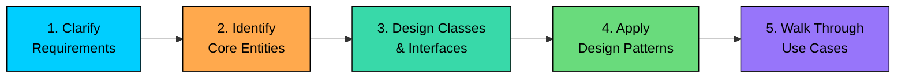
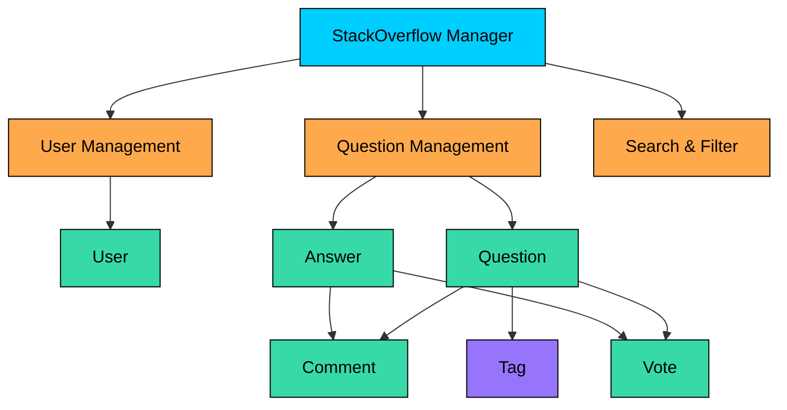

import React from 'react';
import CodeBlock from '../../../../components/ui/CodeBlock';
import Callout from '../../../../components/ui/Callout';

<div className="article-header">
  <div className="breadcrumb">
    <a href="/">Curated Notes</a>
    <span className="breadcrumb-separator">›</span>
    <span className="breadcrumb-current">How to Approach OOD Interviews</span>
  </div>
  <h1>How to Approach OOD Interviews</h1>
  <p style={{ color: 'var(--text-muted)', fontSize: '1.1rem', marginBottom: '16px', lineHeight: '1.6' }}>
    Master the essentials of How to Approach OOD Interviews in this curated guide.
  </p>
  <div className="meta-info">
    <span className="meta-item">
      <svg width="14" height="14" viewBox="0 0 24 24" fill="none" stroke="currentColor" strokeWidth="2"><circle cx="12" cy="12" r="10"/><polyline points="12 6 12 12 16 14"/></svg>
      10 min read
    </span>
    <span className="difficulty-badge difficulty-badge--intermediate">Intermediate</span>
  </div>
</div>

<section className="content-section">


&gt; **What is an OOD Interview?**
&gt;
&gt; An OOD interview is a 45-60 minute conversation where you are expected to design the class structure of a real-world system. You work on a whiteboard, shared document/editor, or virtual drawing tool. There's no IDE and no expectation of compilable code.
&gt;
&gt; The deliverable is a class diagram / skeleton code, sometimes accompanied by a sequence diagram for a key workflow, along with a running verbal explanation of your decisions.
&gt;
&gt; This format is standard at big tech companies like Google, Amazon, Meta, and Microsoft.


This chapter lays out a 5-step framework that works for any OOD problem. We will walk through each step using **Stack Overflow** as the running example.

**Here are the 5 steps:**

1. Clarify Requirements
2. Identify Core Entities
3. Design Classes and Interfaces
4. Apply Design Patterns
5. Walk Through Use Cases and Edge Cases





---

## Step 1: Clarify Requirements (3-5 minutes)

Most candidates hear "Design Stack Overflow" and immediately start thinking about classes and methods. Do not do that. "Design Stack Overflow" could mean very different things depending on the interview, and you have no way of knowing the expected scope until you ask.

OOD interviews are typically 45-60 minutes. You cannot design all of it. Clarifying questions help you identify the right scope and focus on what matters.

So,  start with a conversation. Ask questions. Narrow down what the interviewer actually wants you to build.

#### What to Ask

There are four categories of questions you should cover:

- **Functional requirements:** What features should the system support? Can users ask questions, post answers, comment, vote? Is there a reputation system? Can questions be tagged and searched?
- **Actors:** Who are the different types of users? Are there admins, moderators, and regular users? Do they have different permissions?
- **Constraints and scope:** Should we handle things like bounties, badges, or question closing? What about editing and revision history? The goal here is to scope down to a manageable set of features.
- **Non-functional considerations:** Does the interviewer care about concurrency? Should we consider thread safety for voting? These questions help you understand how deep the interviewer wants you to go.


&gt; **Example: Stack Overflow Interview Dialogue**
&gt;
&gt; **You:** "Should the system support the full Stack Overflow feature set, or should I focus on core Q&A functionality?"
&gt;
&gt; **Interviewer:** "Focus on core Q&A: asking questions, posting answers, commenting, and voting."
&gt;
&gt; **You:** "Should we support different user types like moderators and admins?"
&gt;
&gt; **Interviewer:** "Just regular users for now."
&gt;
&gt; **You:** "Should questions support tags for categorization?"
&gt;
&gt; **Interviewer:** "Yes, include tagging."
&gt;
&gt; **You:** "Should we handle reputation scores based on voting?"
&gt;
&gt; **Interviewer:** "Yes, handle basic reputation tracking."
&gt;
&gt; **You:** "Any concurrency concerns? For example, multiple users voting simultaneously?"
&gt;
&gt; **Interviewer:** "Mention it if relevant, but don't spend too much time on it."


After this conversation, you have a clear picture of what to build.

The biggest mistake at this stage is making assumptions. If you assume the system needs a full notification engine, badge system, and search functionality without asking, you will waste precious time building things the interviewer never asked for. Always confirm scope before moving forward.

---

## Step 2: Identify Core Entities (3-5 minutes)

With requirements locked down, shift from features to objects. What are the "things" in this system?

#### The Noun Extraction Technique

A simple and effective technique is to go back to your requirements and underline every noun. These nouns are your candidate entities.

From our Stack Overflow requirements:

- **Users** ask questions and post answers
- **Questions** have a title, body, and tags
- **Answers** are posted in response to questions
- **Comments** can be added to questions and answers
- **Tags** categorize questions by topic
- **Votes** track upvotes and downvotes

That gives us six core entities: **User, Question, Answer, Comment, Tag, and Vote**.

#### Tips for Identifying Entities

- **Start with 4-6 core entities: **You do not need to capture everything upfront. Start with the most obvious ones and add more as your design evolves.
- **Group related concepts.** Notice how both questions and answers can have comments and votes. This tells you there might be shared behavior you can extract later using interfaces or abstract classes.
- **Ignore implementation details for now.** Do not worry about data types, method signatures, or database schemas at this point. You are building a mental model of the domain, not writing code.
- **Think about relationships early.** As you list entities, start noting the connections between them. A User "asks" a Question. A Question "has" many Answers. An Answer "receives" Votes. These verbs hint at the relationships you will formalize in the next step. You do not need to be precise yet, just sketch the connections mentally.

One helpful trick is to write your entities first, then draw arrows between them showing how they relate. This gives the interviewer a visual anchor and gives you a roadmap for the class design ahead.

You now have a list of entities and a rough sketch of how they connect. Next: formalize these into a proper class structure.

---

## Step 3: Design Classes and Interfaces (20-25 minutes)

This step is the core of the interview. You will take the entities from Step 2 and turn them into a class structure with attributes, relationships, interfaces, and a clean API. This step carries the most weight in the session, so do not rush it.

We will break this into three parts: defining classes and relationships, extracting interfaces, and creating a central manager class.

#### 3.1 Define Classes, Attributes, and Relationships

Start by converting each entity into a class with its key attributes.

For each class, ask yourself:

- What data does this object hold?
- What other objects does it reference?
- What is the relationship type: one-to-one, one-to-many, or many-to-many?

For our Stack Overflow example:

- A **User** has a name, email, and reputation score. A user can ask many questions and post many answers (one-to-many).
- A **Question** has a title, body, creation date, and status. It belongs to one user, has many answers, many comments, many tags, and many votes.
- An **Answer** has a body and creation date. It belongs to one user and one question, and has many comments and votes.
- A **Comment** has a body. It belongs to one user.
- A **Tag** has a name. Many questions can share the same tag (many-to-many).
- A **Vote** has a vote type (upvote or downvote). It belongs to one user.

When presenting this to the interviewer, it helps to briefly explain your relationship choices. For example: "I am using composition here because a Question owns its Answers. If we delete a question, its answers should go with it. But Tags are shared across questions, so that is an association, not composition."

You can draw a **UML class diagram** to illustrate the relationships between classes or code the class structure directly in an **object oriented programming language** of your choice.

&gt; **Note:**
&gt;
&gt;  Drawing UML diagrams in a LLD interview is not mandatory but it’s good to check with the interviewer.

#### 3.2 Define Interfaces and Core Methods

Now look at your classes and find shared behavior. The verb extraction technique works well here: go through your requirements and pull out every action.

Users can **comment** on both questions and answers. Users can **vote** on both questions and answers. This shared behavior is a strong signal that you should extract interfaces.

- **Commentable:** anything that can receive comments (questions and answers)
- **Votable:** anything that can be voted on (questions and answers)

#### Code Example


```java
public interface Commentable {
    void addComment(Comment comment);
    List<Comment> getComments();
}

public interface Votable {
    void vote(User user, VoteType voteType);
    int getVoteCount();
}

public enum VoteType {
    UPVOTE, DOWNVOTE
}
```

```python
from abc import ABC, abstractmethod
from enum import Enum

class VoteType(Enum):
    UPVOTE = 1
    DOWNVOTE = -1

class Commentable(ABC):
    @abstractmethod
    def add_comment(self, comment: "Comment") -> None:
        pass

    @abstractmethod
    def get_comments(self) -> list["Comment"]:
        pass

class Votable(ABC):
    @abstractmethod
    def vote(self, user: "User", vote_type: VoteType) -> None:
        pass

    @abstractmethod
    def get_vote_count(self) -> int:
        pass
```

```cpp
enum class VoteType { UPVOTE, DOWNVOTE };

class Commentable {
public:
    virtual void addComment(Comment* comment) = 0;
    virtual std::vector<Comment*> getComments() const = 0;
    virtual ~Commentable() = default;
};

class Votable {
public:
    virtual void vote(User* user, VoteType voteType) = 0;
    virtual int getVoteCount() const = 0;
    virtual ~Votable() = default;
};
```

```go
type VoteType int

const (
	UPVOTE VoteType = 1
	DOWNVOTE VoteType = -1
)

type Commentable interface {
	AddComment(comment Comment)
	GetComments() []Comment
}

type Votable interface {
	Vote(user User, voteType VoteType)
	GetVoteCount() int
}
```

```csharp
public enum VoteType { Upvote, Downvote }

public interface ICommentable {
    void AddComment(Comment comment);
    List<Comment> GetComments();
}

public interface IVotable {
    void Vote(User user, VoteType voteType);
    int GetVoteCount();
}
```

```typescript
enum VoteType {
    UPVOTE = 1,
    DOWNVOTE = -1,
}

interface Commentable {
    addComment(comment: Comment): void;
    getComments(): Comment[];
}

interface Votable {
    vote(user: User, voteType: VoteType): void;
    getVoteCount(): number;
}
```


With these interfaces, `Question` and `Answer` both implement `Commentable` and `Votable`. No duplicated method signatures. If the interviewer later asks "What if we want to add voting to comments too?", you just have `Comment` implement `Votable` without touching existing code. That is the Open-Closed Principle at work.

Why interfaces instead of putting the methods directly on `Question` and `Answer`? Interfaces give you a contract. Any class that implements `Votable` is guaranteed to have `vote()`. This makes the system easier to extend and test.

#### 3.3 Define a Central Manager Class

Every LLD problem benefits from having a central class that acts as the entry point for the system. This is essentially the Facade pattern: one class that coordinates all the major operations and hides the internal complexity.

For Stack Overflow, this is the `StackOverflow` class. It is responsible for user registration, posting questions, posting answers, and searching. Think of it as the API layer that the outside world interacts with.





The key methods on this manager class would include:

- `createUser(name, email)` - register a new user
- `askQuestion(user, title, body, tags)` - post a new question
- `postAnswer(user, question, body)` - answer a question
- `addComment(user, commentable, body)` - comment on a question or answer
- `voteOnContent(user, votable, voteType)` - upvote or downvote
- `searchQuestions(query)` - find questions by keyword or tag

Here is an example implementation of `askQuestion` to show how the classes collaborate. In an OOD interview, this level of detail is usually sufficient. You do not need fully compilable code.


```java
public class StackOverflow {
    private final Map<Integer, User> users = new HashMap<>();
    private final Map<Integer, Question> questions = new HashMap<>();

    public Question askQuestion(User user, String title, String body, List<String> tagNames) {
        if (title == null || title.isBlank()) {
            throw new IllegalArgumentException("Question title cannot be empty");
        }
        if (body == null || body.isBlank()) {
            throw new IllegalArgumentException("Question body cannot be empty");
        }

        List<Tag> tags = tagNames.stream()
                .map(Tag::new)
                .collect(Collectors.toList());

        Question question = new Question(user, title, body, tags);
        questions.put(question.getId(), question);
        user.addQuestion(question);

        return question;
    }
}
```

```python
class StackOverflow:
    def __init__(self):
        self.users: dict[int, User] = {}
        self.questions: dict[int, Question] = {}

    def ask_question(self, user: User, title: str, body: str, tag_names: list[str]) -> Question:
        if not title or not title.strip():
            raise ValueError("Question title cannot be empty")
        if not body or not body.strip():
            raise ValueError("Question body cannot be empty")

        tags = [Tag(name) for name in tag_names]
        question = Question(user, title, body, tags)
        self.questions[question.id] = question
        user.add_question(question)

        return question
```

```cpp
class StackOverflow {
private:
    unordered_map<int, User*> users;
    unordered_map<int, Question*> questions;

public:
    Question* askQuestion(User* user, const string& title,
                          const string& body, const vector<string>& tagNames) {
        if (title.empty()) {
            throw invalid_argument("Question title cannot be empty");
        }
        if (body.empty()) {
            throw invalid_argument("Question body cannot be empty");
        }

        vector<Tag*> tags;
        for (const auto& name : tagNames) {
            tags.push_back(new Tag(name));
        }

        auto* question = new Question(user, title, body, tags);
        questions[question->getId()] = question;
        user->addQuestion(question);

        return question;
    }
};
```

```go
type StackOverflow struct {
	users     map[int]User
	questions map[int]Question
}

func (s *StackOverflow) AskQuestion(user User, title string, body string, tagNames []string) Question {
	if title == "" || len(strings.TrimSpace(title)) == 0 {
		panic("Question title cannot be empty")
	}
	if body == "" || len(strings.TrimSpace(body)) == 0 {
		panic("Question body cannot be empty")
	}

	tags := make([]Tag, 0, len(tagNames))
	for _, name := range tagNames {
		tags = append(tags, Tag{name})
	}

	question := Question{user, title, body, tags}
	s.questions[question.Id] = question
	user.AddQuestion(question)

	return question
}
```

```csharp
public class StackOverflow {
    private readonly Dictionary<int, User> users = new();
    private readonly Dictionary<int, Question> questions = new();

    public Question AskQuestion(User user, string title, string body, List<string> tagNames) {
        if (string.IsNullOrWhiteSpace(title)) {
            throw new ArgumentException("Question title cannot be empty");
        }
        if (string.IsNullOrWhiteSpace(body)) {
            throw new ArgumentException("Question body cannot be empty");
        }

        var tags = tagNames.Select(name => new Tag(name)).ToList();
        var question = new Question(user, title, body, tags);
        questions[question.Id] = question;
        user.AddQuestion(question);

        return question;
    }
}
```

```typescript
class StackOverflow {
    private users: Map<number, User> = new Map();
    private questions: Map<number, Question> = new Map();

    askQuestion(user: User, title: string, body: string, tagNames: string[]): Question {
        if (!title || !title.trim()) {
            throw new Error("Question title cannot be empty");
        }
        if (!body || !body.trim()) {
            throw new Error("Question body cannot be empty");
        }

        const tags = tagNames.map(name => new Tag(name));
        const question = new Question(user, title, body, tags);
        this.questions.set(question.id, question);
        user.addQuestion(question);

        return question;
    }
}
```


Your class structure is now on paper with clear relationships, shared interfaces, and a clean API surface. The next step is identifying where design patterns fit into this structure, if they fit at all.

---

## Step 4: Apply Design Patterns (5-7 minutes)

Do not force patterns into your design to impress. Apply them where they solve a real problem. One or two well-placed patterns with clear reasoning beats listing five you do not actually use.

For our Stack Overflow design, three patterns are worth mentioning.

#### Strategy Pattern: Reputation Calculation

Stack Overflow's reputation rules are non-trivial: +10 for an answer upvote, +5 for a question upvote, -2 for a downvote, and so on. These rules could change. You might want a simplified scheme for a new community, or boosted rewards during a promotional event.

By extracting reputation calculation into a strategy interface, you can swap implementations without modifying the core classes.


```java
public interface ReputationStrategy {
    int calculateReputationChange(VoteType voteType, boolean isQuestion);
}

public class StandardReputationStrategy implements ReputationStrategy {
    @Override
    public int calculateReputationChange(VoteType voteType, boolean isQuestion) {
        if (voteType == VoteType.UPVOTE) {
            return isQuestion ? 5 : 10;
        }
        return -2; // downvote penalty
    }
}

public class SimplifiedReputationStrategy implements ReputationStrategy {
    @Override
    public int calculateReputationChange(VoteType voteType, boolean isQuestion) {
        return voteType == VoteType.UPVOTE ? 1 : -1;
    }
}
```

```python
from abc import ABC, abstractmethod

class ReputationStrategy(ABC):
    @abstractmethod
    def calculate_reputation_change(self, vote_type: VoteType, is_question: bool) -> int:
        pass

class StandardReputationStrategy(ReputationStrategy):
    def calculate_reputation_change(self, vote_type: VoteType, is_question: bool) -> int:
        if vote_type == VoteType.UPVOTE:
            return 5 if is_question else 10
        return -2  # downvote penalty

class SimplifiedReputationStrategy(ReputationStrategy):
    def calculate_reputation_change(self, vote_type: VoteType, is_question: bool) -> int:
        return 1 if vote_type == VoteType.UPVOTE else -1
```

```cpp
class ReputationStrategy {
public:
    virtual int calculateReputationChange(VoteType voteType, bool isQuestion) = 0;
    virtual ~ReputationStrategy() = default;
};

class StandardReputationStrategy : public ReputationStrategy {
public:
    int calculateReputationChange(VoteType voteType, bool isQuestion) override {
        if (voteType == VoteType::UPVOTE) {
            return isQuestion ? 5 : 10;
        }
        return -2; // downvote penalty
    }
};

class SimplifiedReputationStrategy : public ReputationStrategy {
public:
    int calculateReputationChange(VoteType voteType, bool isQuestion) override {
        return voteType == VoteType::UPVOTE ? 1 : -1;
    }
};
```

```go
type ReputationStrategy interface {
	calculateReputationChange(voteType VoteType, isQuestion bool) int
}

type StandardReputationStrategy struct{}

func (StandardReputationStrategy) calculateReputationChange(voteType VoteType, isQuestion bool) int {
	if voteType == VoteTypeUpvote {
		if isQuestion {
			return 5
		}
		return 10
	}
	return -2 // downvote penalty
}

type SimplifiedReputationStrategy struct{}

func (SimplifiedReputationStrategy) calculateReputationChange(voteType VoteType, isQuestion bool) int {
	if voteType == VoteTypeUpvote {
		return 1
	}
	return -1
}
```

```csharp
public interface IReputationStrategy {
    int CalculateReputationChange(VoteType voteType, bool isQuestion);
}

public class StandardReputationStrategy : IReputationStrategy {
    public int CalculateReputationChange(VoteType voteType, bool isQuestion) {
        if (voteType == VoteType.Upvote) {
            return isQuestion ? 5 : 10;
        }
        return -2; // downvote penalty
    }
}

public class SimplifiedReputationStrategy : IReputationStrategy {
    public int CalculateReputationChange(VoteType voteType, bool isQuestion) {
        return voteType == VoteType.Upvote ? 1 : -1;
    }
}
```

```typescript
interface ReputationStrategy {
    calculateReputationChange(voteType: VoteType, isQuestion: boolean): number;
}

class StandardReputationStrategy implements ReputationStrategy {
    calculateReputationChange(voteType: VoteType, isQuestion: boolean): number {
        if (voteType === VoteType.UPVOTE) {
            return isQuestion ? 5 : 10;
        }
        return -2; // downvote penalty
    }
}

class SimplifiedReputationStrategy implements ReputationStrategy {
    calculateReputationChange(voteType: VoteType, isQuestion: boolean): number {
        return voteType === VoteType.UPVOTE ? 1 : -1;
    }
}
```


When explaining this, keep it simple: "Reputation rules will probably change. With a strategy interface, I can add new rules without modifying `User` or `StackOverflow`."

#### Observer Pattern: Notifications

When someone answers a question or comments on an answer, the question author might want to be notified. Rather than having the `StackOverflow` manager class directly call notification logic (which would violate single responsibility), you can use the Observer pattern.


```java
public interface NotificationObserver {
    void notify(String message);
}

public class EmailNotifier implements NotificationObserver {
    @Override
    public void notify(String message) {
        // send email notification
    }
}

public class InAppNotifier implements NotificationObserver {
    @Override
    public void notify(String message) {
        // push in-app notification
    }
}
```

```python
from abc import ABC, abstractmethod

class NotificationObserver(ABC):
    @abstractmethod
    def notify(self, message: str) -> None:
        pass

class EmailNotifier(NotificationObserver):
    def notify(self, message: str) -> None:
        # send email notification
        pass

class InAppNotifier(NotificationObserver):
    def notify(self, message: str) -> None:
        # push in-app notification
        pass
```

```cpp
class NotificationObserver {
public:
    virtual void notify(const std::string& message) = 0;
    virtual ~NotificationObserver() = default;
};

class EmailNotifier : public NotificationObserver {
public:
    void notify(const std::string& message) override {
        // send email notification
    }
};

class InAppNotifier : public NotificationObserver {
public:
    void notify(const std::string& message) override {
        // push in-app notification
    }
};
```

```go
type NotificationObserver interface {
	notify(message string)
}

type EmailNotifier struct{}

func (EmailNotifier) notify(message string) {
	// send email notification
}

type InAppNotifier struct{}

func (InAppNotifier) notify(message string) {
	// push in-app notification
}
```

```csharp
public interface INotificationObserver {
    void Notify(string message);
}

public class EmailNotifier : INotificationObserver {
    public void Notify(string message) {
        // send email notification
    }
}

public class InAppNotifier : INotificationObserver {
    public void Notify(string message) {
        // push in-app notification
    }
}
```

```typescript
interface NotificationObserver {
    notify(message: string): void;
}

class EmailNotifier implements NotificationObserver {
    notify(message: string): void {
        // send email notification
    }
}

class InAppNotifier implements NotificationObserver {
    notify(message: string): void {
        // push in-app notification
    }
}
```


You do not need to implement a full notification system. Simply mentioning "I would use the Observer pattern here so that the Question class can notify subscribers when a new answer is posted" is enough to demonstrate the concept.

#### How to Discuss Patterns With the Interviewer

When applying patterns in an OOD interview, always cover three things:

1. **What pattern** you are using and where it applies
2. **Why** you chose it, meaning what problem it solves
3. **How** it helps with extensibility or maintainability

A common pattern table for LLD interviews:


| Pattern | When to Use | Stack Overflow Example |
|---------|-------------|----------------------|
| **Strategy** | Behavior varies at runtime | Reputation calculation, search ranking |
| **Observer** | Objects need to react to changes | Notifications on new answers |
| **Factory** | Object creation logic may grow complex | Creating different question types |
| **Facade** | Simplify a complex subsystem | The `StackOverflow` manager class |
| **Singleton** | Only one instance should exist | The `StackOverflow` system instance |
| **State** | Object behavior changes based on state | Question status (open, closed, duplicate) |


Do not try to use all of these. Pick 1-2 that genuinely improve your design and explain them clearly. Clear reasoning beats pattern name-dropping.

---

## Step 5: Walk Through Use Cases and Edge Cases (5-10 minutes)

Walking through a use case end-to-end proves that your classes actually work correctly together. You can also use a sequence diagram here to cover the workflow.

#### Use Case 1: User Asks a Question

Walk the interviewer through the flow verbally while pointing to your class diagram:

1. The user calls `StackOverflow.askQuestion(user, "How to reverse a linked list?", body, ["java", "data-structures"])`
2. The manager validates the input (non-empty title and body)
3. It creates `Tag` objects for each tag name
4. It creates a new `Question` object, passing the user, title, body, and tags
5. The question is stored in the questions map and added to the user's question list
6. The question is returned with a unique ID

#### Use Case 2: User Votes on an Answer

This flow is more interesting because it touches multiple classes:

1. The user calls `StackOverflow.voteOnContent(voter, answer, VoteType.UPVOTE)`
2. The manager delegates to `answer.vote(voter, VoteType.UPVOTE)`
3. The vote method checks: is the voter the same as the answer's author? If yes, throw an exception (self-voting is not allowed)
4. It checks: has this voter already voted on this answer? If yes, throw an exception (duplicate voting)
5. A new `Vote` object is created and stored
6. The answer's vote count is updated
7. The reputation strategy calculates the reputation change (+10 for answer upvote)
8. The answer author's reputation is updated
9. If observers are registered, the answer author is notified of the upvote

#### Key Edge Cases to Discuss

You do not need to handle every possible edge case in code. What matters is that you **think** about edge cases. Mention 3-4 key ones and show validation code for 1-2:

- **Self-voting:** A user should not be able to upvote their own question or answer. This is a natural validation to include.
- **Duplicate voting:** What happens if a user tries to upvote the same answer twice? You need to track who has already voted and either reject the duplicate or toggle the vote.
- **Empty content:** Questions with blank titles, answers with no body, comments with just whitespace. These should all be rejected with clear error messages.
- **Negative reputation:** If a user gets enough downvotes, can their reputation go below zero? Decide on a floor (Stack Overflow uses 0 as the minimum).
- **Answering a closed question:** If a question has been marked as closed, new answers should be rejected.

The self-voting validation in code:


```java
public void vote(User voter, VoteType voteType) {
    if (voter.getId() == this.author.getId()) {
        throw new IllegalArgumentException("Users cannot vote on their own content");
    }
    if (votes.containsKey(voter.getId())) {
        throw new IllegalArgumentException("User has already voted on this content");
    }

    votes.put(voter.getId(), new Vote(voter, voteType));
    updateScore();
}
```

```python
def vote(self, voter: User, vote_type: VoteType) -> None:
    if voter.id == self.author.id:
        raise ValueError("Users cannot vote on their own content")
    if voter.id in self.votes:
        raise ValueError("User has already voted on this content")

    self.votes[voter.id] = Vote(voter, vote_type)
    self._update_score()
```

```cpp
void vote(User* voter, VoteType voteType) override {
    if (voter->getId() == author->getId()) {
        throw std::invalid_argument("Users cannot vote on their own content");
    }
    if (votes.count(voter->getId())) {
        throw std::invalid_argument("User has already voted on this content");
    }

    votes[voter->getId()] = new Vote(voter, voteType);
    updateScore();
}
```

```go
func (c *Content) Vote(voter *User, voteType VoteType) {
	if voter.GetID() == c.author.GetID() {
		panic("Users cannot vote on their own content")
	}
	if _, ok := c.votes[voter.GetID()]; ok {
		panic("User has already voted on this content")
	}

	c.votes[voter.GetID()] = Vote{voter, voteType}
	c.updateScore()
}
```

```csharp
public void Vote(User voter, VoteType voteType) {
    if (voter.Id == Author.Id) {
        throw new InvalidOperationException("Users cannot vote on their own content");
    }
    if (votes.ContainsKey(voter.Id)) {
        throw new InvalidOperationException("User has already voted on this content");
    }

    votes[voter.Id] = new Vote(voter, voteType);
    UpdateScore();
}
```

```typescript
vote(voter: User, voteType: VoteType): void {
    if (voter.id === this.author.id) {
        throw new Error("Users cannot vote on their own content");
    }
    if (this.votes.has(voter.id)) {
        throw new Error("User has already voted on this content");
    }

    this.votes.set(voter.id, new Vote(voter, voteType));
    this.updateScore();
}
```


---

## Final Note

These steps should guide you to remain on track and cover the different aspects when answering a OOD interview problem.

But you may skip some of these due to limited time in interviews.

&gt; It’s always a good idea to check with the interviewer on what all is expected from the design.

</section>
