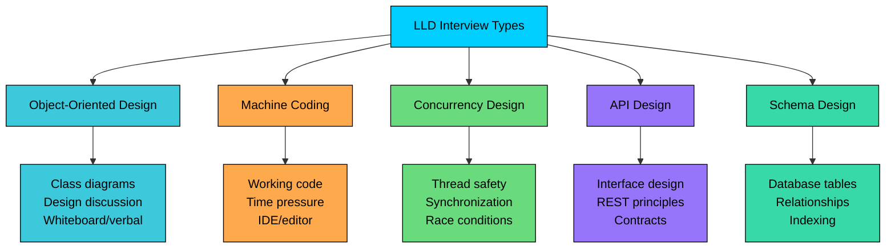
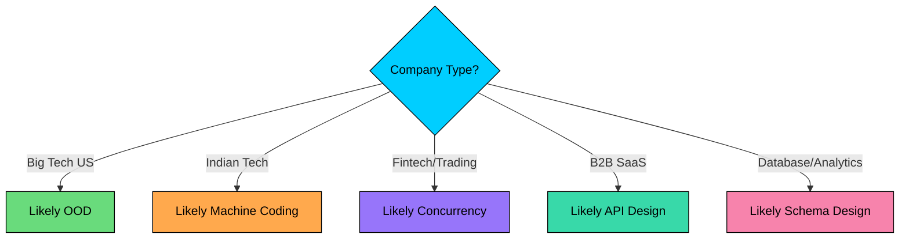

import React from 'react';
import CodeBlock from '../../../../components/ui/CodeBlock';
import Callout from '../../../../components/ui/Callout';

  

    <a href="/">Curated Notes</a>
    ›
    Types of LLD Interviews
  

  <h1>Types of LLD Interviews</h1>
  

    Master the essentials of Types of LLD Interviews in this curated guide.
  

  

    
      <svg width="14" height="14" viewBox="0 0 24 24" fill="none" stroke="currentColor" strokeWidth="2"><circle cx="12" cy="12" r="10"/><polyline points="12 6 12 12 16 14"/></svg>
      10 min read
    
    Intermediate
  

<section className="content-section">

Companies evaluate LLD skills in very different ways. What works for a whiteboard OOD round at Amazon won't help you in a machine coding round at Flipkart or a concurrency round at Uber.

Here are the **five common formats of LLD interviews** you should be aware of:

Each format tests different skills and requires different preparation.

In this course, we will primarily focus on the **Object Oriented Design**, and **Machine Coding**. I have a separate course dedicated to [Concurrency Interview](/learn/concurrency-interview)**. **

**API Design** and **Schema Design** are typically covered as part of [High-Level System Design Interview](/learn/system-design-interviews/introduction).

Let's explore each type in detail.

---

## 1. Object-Oriented Design (OOD)

This is the most common type of LLD interview at major tech companies like Google, Amazon, Meta, and Microsoft.

In an OOD interview, you design a system by identifying classes, their attributes, methods, and relationships. The focus is on your design thinking rather than working code.

#### Format

- **Duration:** 45-60 minutes
- **Tools:** Whiteboard, Google Docs, or virtual whiteboard
- **Code:** Usually pseudocode or skeleton classes (not runnable)
- **Deliverable:** Class diagrams, interface definitions, key method signatures
- **Interaction:** High, lots of back-and-forth with interviewer

#### What Interviewers Evaluate

| Skill                    | Weight | What They Look For                                     |
| **OOP Fundamentals**     | High   | Proper use of inheritance, encapsulation, polymorphism |
| **Design Patterns**      | High   | Recognizing when patterns fit naturally                |
| **SOLID Principles**     | High   | Single responsibility, open/closed, etc.               |
| **Communication**        | High   | Explaining decisions, responding to feedback           |
| **Trade-off Discussion** | Medium | Justifying choices, considering alternatives           |

---

## 2. Machine Coding

Machine coding interviews require you to write working, runnable code within a strict time limit. This format is especially popular at Indian tech companies and startups.

You're given a problem and must implement a working solution from scratch. The code must compile, run, and produce correct output. No pseudocode, no hand-waving.

#### Format

- **Duration:** 60-90 minutes (sometimes 2 hours)
- **Tools:** Your own IDE or online coding platform
- **Deliverable:** Working code that compiles and runs
- **Evaluation:** Code is reviewed after submission
- **Interaction:** Low, usually you work independently

#### What Interviewers Evaluate

| Skill            | Weight | What They Look For                               |
| **Coding Speed**     | High   | Can you implement under time pressure?            |
| **Code Quality**     | High   | Can you write clean, readable, maintainable code?                |
| **Correctness**      | High   | Does your code work for given test cases?                   |
| **Testing**              | High | Writing test cases or driver code                           |
| **Project Structure** | Medium | Using proper packages, separation of concerns       |
| **Edge Cases**       | Medium | Handling invalid inputs gracefully                 |

#### Tips to Succeed

1. **Practice typing speed.** Seriously. You need to write fast.
2. **Know your IDE shortcuts.** Every second counts.
3. **Start with core functionality.** Get basics working first, add features later.
4. **Handle input/output early.** Parse input format in the first 10 minutes.
5. **Test as you go.** Don't wait until the end to test.

---

## 3. Concurrency Design

Concurrency interviews test your ability to design and implement thread-safe systems. These are common at companies building high-performance or distributed systems.

You're asked to design a system that handles concurrent access correctly. This might involve implementing thread-safe data structures, handling race conditions, or designing synchronization strategies.

#### Format

- **Duration:** 60-90 minutes
- **Tools:** Whiteboard + code (often Java or C++)
- **Deliverable:** Thread-safe design with synchronization strategy
- **Focus:** Race conditions, deadlocks, performance

#### What Interviewers Evaluate

| Skill                      | Weight | What They Look For                                   |
|---------------------------|--------|-------------------------------------------------------|
| **Race Condition Identification** | High | Can you spot where race conditions occur?                       |
| **Synchronization Primitives** | High  | Correct use of locks, semaphores, etc.                |
| **Deadlock Prevention**        | High  | Understanding and preventing deadlocks                |
| **Performance Awareness**      | Medium| Lock granularity, contention                          |
| **Correctness Reasoning**      | High  | Can you prove your solution is correct?               |

#### Tips to Succeed

1. **Know the primitives.** Understand when to use each synchronization tool.
2. **Identify shared state first.** What data is accessed by multiple threads?
3. **Think about access patterns.** Read-heavy vs write-heavy affects your choice.
4. **Prevent deadlocks.** Know the deadlock conditions and how to avoid them.
5. **Consider performance.** Fine-grained locks vs coarse-grained locks.

---

## 4. API Design

API design interviews focus on designing clean, usable interfaces. This tests your ability to create abstractions that other developers will use.

You design the public interface of a library, service, or module. The focus is on method signatures, contracts, and usability, not internal implementation.

#### Format

- **Duration:** 30-45 minutes
- **Tools:** Whiteboard or document
- **Deliverable:** API signatures, request/response formats, error handling
- **Interaction:** High, discussion about design choices

#### What Interviewers Evaluate

| Skill          | Weight | What They Look For                                   |
| **Usability**      | High   | Is the API easy to use correctly?                    |
| **Consistency**    | High   | Naming conventions, parameter patterns               |
| **Extensibility**  | Medium | Can it evolve without breaking changes?              |
| **Error Handling** | Medium | Meaningful error codes and messages                 |
| **REST Principles** | Medium | Proper resource modeling for web APIs               |

#### Tips to Succeed

1. **Study good APIs.** Learn from Stripe, Twilio, GitHub APIs.
2. **Follow REST conventions.** Proper resource naming, HTTP methods.
3. **Think about pagination.** How will users handle large result sets?
4. **Plan for errors.** Clear error codes and messages.
5. **Consider versioning.** How will you evolve the API?
6. **Think about authentication.** API keys, OAuth, JWT.

---

## 5. Schema Design

Schema design interviews test your ability to model data in a database. This is often combined with OOD or asked as part of high-level design (HLD) round.

You design database tables, define relationships, and consider indexing and query patterns. The focus is on data modeling, not application logic.

#### Format

- **Duration:** 30-45 minutes (often part of a larger round)
- **Tools:** Whiteboard or ER diagram tool
- **Deliverable:** Tables, columns, relationships, indexes, maybe some SQL
- **Focus:** Normalization, query efficiency, data integrity

#### What Interviewers Evaluate

| Skill           | Weight | What They Look For                      |
| **Data Modeling**  | High | Identifying entities and relationships                   |
| **Normalization**   | High   | Proper level of normalization (1NF, 2NF, 3NF)                     |
| **Constraints **    | High | Primary keys, foreign keys, unique constraints           |
| **Indexing**        | Medium | Appropriate indexes for queries          |
| **Query Patterns**  | Medium | Design supports expected queries         |

#### Tips to Succeed

1. **Know normalization.** Understand 1NF, 2NF, 3NF and when to apply.
2. **Think about queries.** Design should support the queries you'll run.
3. **Choose indexes wisely.** Too many is as bad as too few. Design indexes based on query patterns.
4. **Consider scale.** How will the schema perform at 10x data? Consider sharding / partitioning.
5. **Handle edge cases.** Soft deletes, audit trails, versioning.

---

## How to Identify Your Interview Type

#### Ask Your Recruiter

This is the easiest and most reliable approach: just ask. Most recruiters can tell you the exact format.

Good questions to ask:

- “What type of LLD round should I expect?”
- “Will this be whiteboard-style discussion, or will I code in an IDE?”
- “How long is the LLD round?”
- “Should I expect concurrency topics like race conditions or deadlocks?”
- “Will there be any database or schema design in this round?”

#### Company Research

If you can’t get a clear answer, use company signals to make an educated guess. Different company types tend to prefer different LLD formats:

- **Big Tech (US):** More likely **OOD (whiteboard design + discussion)**
- **Indian consumer tech / startups:** More likely **Machine Coding**
- **Fintech / trading:** More likely **Concurrency + performance**
- **B2B SaaS:** More likely **API Design**
- **Database / analytics companies:** More likely **Schema Design**

</section>
