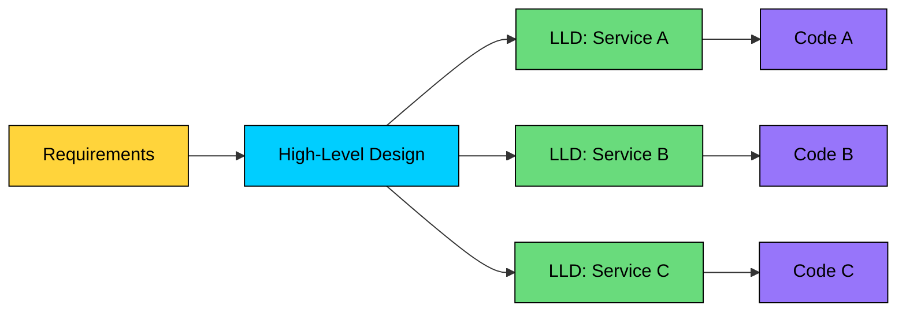

import React from 'react';
import CodeBlock from '../../../../components/ui/CodeBlock';
import Callout from '../../../../components/ui/Callout';

  

    <a href="/">Curated Notes</a>
    ›
    LLD vs HLD
  

  <h1>LLD vs HLD</h1>
  

    Master the essentials of LLD vs HLD in this curated guide.
  

  

    
      <svg width="14" height="14" viewBox="0 0 24 24" fill="none" stroke="currentColor" strokeWidth="2"><circle cx="12" cy="12" r="10"/><polyline points="12 6 12 12 16 14"/></svg>
      10 min read
    
    Intermediate
  

<section className="content-section">

In software engineering, building a complex system is like constructing a city. 

You wouldn't start by laying bricks for a single house without a city plan. You first need to decide where the residential areas, commercial zones, power grids, and roads will go. 

This city plan is your **High-Level Design (HLD)**.

Once the city plan is approved, an architect takes a single plot of land in a residential zone and designs the detailed blueprint for a house specifying the number of rooms, the plumbing, the electrical wiring, and the materials to be used. 

This detailed house blueprint is your **Low-Level Design (LLD)**.

Both are essential, but they operate at different levels of abstraction and serve different purposes.

In this chapter, we will take a deeper look at their differences.

---

## What is High-Level Design (HLD)?

**High-Level Design (HLD)** defines the *architecture* of the system.

It answers the question:

&gt; “How should the system be structured, and how will its major components interact?”

The focus here is on the **what**, not the **how**.

It answers questions like:

- **What are the major components or microservices?** (e.g., User Service, Payment Service, Notification Service, Product Catalog).
- **How will these components communicate?** (e.g., via REST APIs, gRPC, or a message queue like RabbitMQ or Kafka).
- **What technology stack will be used?** (e.g., Java vs. Python, SQL vs. NoSQL database).
- **How will the system handle scalability, reliability, and availability?** (e.g., using load balancers, database replication, CDNs).
- **What are the third-party integrations?** (e.g., Stripe for payments, AWS S3 for storage).

The output of HLD is a set of architectural diagrams, data flow diagrams, and technology choices that define the system's skeleton.

&gt; **EXAMPLE**
&gt;
&gt; #### **HLD of a Ride-Hailing App**
&gt;
&gt; - **Services:** `Passenger Service`, `Driver Service`, `Matching Service`, `Billing Service`.
&gt; - **Communication:** `Matching Service` uses a message queue to broadcast ride requests. `Passenger` and `Driver` services communicate via WebSockets for real-time location updates.
&gt; - **Database:** A NoSQL database for location data and a relational SQL database for user and billing information.
&gt; - **Infrastructure:** Load balancers to distribute traffic, with services deployed as containers on Kubernetes for scalability.

---

## What is Low-Level Design (LLD)?

LLD zooms in on a single component or module and translates the abstract architectural concepts into **concrete, implementable details** that developers can code directly.

It’s where you decide the **internal structure** of a service — the classes, methods, data models, design patterns, and relationships.

For a single module, it answers questions like:

- **What are the specific classes, and what are their responsibilities?**
- **What are the attributes and methods of each class?**
- **How do these classes relate to each other (inheritance, composition)?**
- **What design patterns are most suitable (e.g., Factory, Singleton, Strategy)?**
- **What are the specific method signatures, including parameters, return types, and exceptions?**

&gt; **EXAMPLE**
&gt;
&gt; #### **LLD of the **`Billing Service`** from the Ride-Hailing App**
&gt;
&gt; - **Classes:** `Ride`, `Invoice`, `PaymentStrategy`, `CreditCardPayment`, `WalletPayment`.
&gt; - **Interfaces:** An interface `IPaymentStrategy` with a method `processPayment(amount)`. `CreditCardPayment` and `WalletPayment` would implement this interface.
&gt; - **Relationships:** The `Invoice` class "has-a" `Ride` object (Composition).
&gt; - **Design Pattern:** The **Strategy Pattern** is used to allow the user to switch between different payment methods seamlessly.

---

## Key Differences: HLD vs. LLD at a Glance

| #### Aspect | #### High-Level Design (HLD) | #### Low-Level Design (LLD) |
| --- | --- | --- |
| **Focus** | What components exist | How each component is built |
| **Audience** | Architects, stakeholders | Engineers, developers |
| **Abstraction** | System-level | Module/class-level |
| **Artifacts** | System architecture diagrams, tech stack choices | Class diagrams, interaction diagrams, method definitions |
| **Example** | "We’ll use a microservices architecture with services for **users**, **orders**, and **payments**" | "The `OrderService` will use a `PaymentProcessor` interface with two implementations": |

---

## How HLD and LLD Work Together

HLD and LLD are not alternatives. They're sequential steps in the design process.

#### The Flow

1. **Requirements** define what the system should do
2. **HLD** breaks the system into components
3. **LLD** designs each component's internals
4. **Code** implements the LLD

---

Now that you understand what **Low-Level Design (LLD)** is and how it connects to **High-Level Design (HLD)**, lets explore the different types of LLD interviews at companies.

</section>
