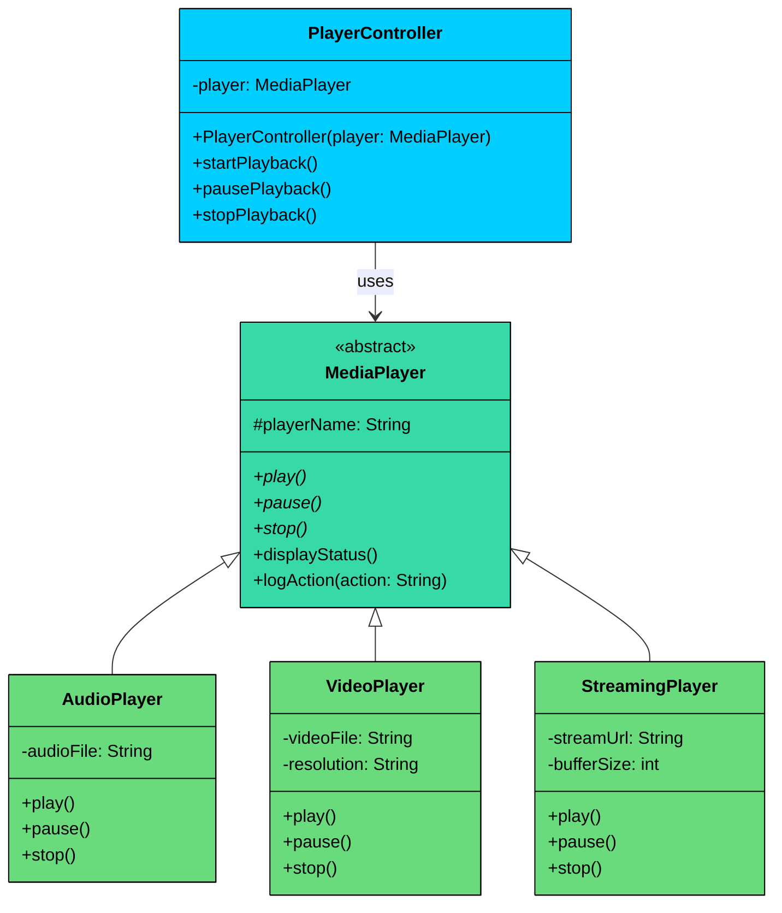

import React from 'react';
import CodeBlock from '../../../../components/ui/CodeBlock';
import Callout from '../../../../components/ui/Callout';

<div className="article-header">
  <div className="breadcrumb">
    <a href="/">Curated Notes</a>
    <span className="breadcrumb-separator">›</span>
    <span className="breadcrumb-current">Abstraction</span>
  </div>
  <h1>Abstraction</h1>
  <p style={{ color: 'var(--text-muted)', fontSize: '1.1rem', marginBottom: '16px', lineHeight: '1.6' }}>
    Master the essentials of Abstraction in this curated guide.
  </p>
  <div className="meta-info">
    <span className="meta-item">
      <svg width="14" height="14" viewBox="0 0 24 24" fill="none" stroke="currentColor" strokeWidth="2"><circle cx="12" cy="12" r="10"/><polyline points="12 6 12 12 16 14"/></svg>
      10 min read
    </span>
    <span className="difficulty-badge difficulty-badge--intermediate">Intermediate</span>
  </div>
</div>

<section className="content-section">

**Abstraction** is the process of hiding complex internal implementation details and exposing only the relevant, high-level functionality to the outside world. It allows developers to **focus on what an object does**, rather than **how it does it**.

In short:

&gt; **Abstraction = Hiding Complexity + Showing Essentials**

By separating the **what** from the **how**, abstraction:

- Reduces cognitive load
- Improves modularity
- Leads to cleaner, more intuitive APIs

&gt; **“Abstraction is about creating a simplified view of a system that highlights the essential features while suppressing the irrelevant details.”**

---


&gt; **Real-World Analogy: Driving a Car**
&gt;
&gt; Think about how you drive a car:
&gt;
&gt; You turn the **steering wheel**, press the **accelerator**, and shift the **gears**.
&gt;
&gt; But you **don’t need to know**:
&gt;
&gt; - How the transmission works
&gt; - How the fuel is injected
&gt; - How torque or combustion is calculated
&gt;
&gt; All of that mechanical complexity is abstracted away behind a **simple interface:** the steering wheel, pedals, and gear lever.
&gt;
&gt; That’s exactly what **abstraction** does in software. It lets you use complex systems through simple, high-level interactions.


---

## 1. Why Abstraction Matters

To understand why abstraction matters, consider what happens without it. You have a `LoggingService` that directly creates and manages each type of logger:


```java
class LoggingService {
    void log(String destination, String message) {
        if (destination.equals("console")) {
            System.out.println("[LOG] " + message);
        } else if (destination.equals("file")) {
            // Open file, write message, close file
        } else if (destination.equals("remote")) {
            // Create HTTP connection, send payload, handle response
        }
    }
}
```


Every new destination means adding another branch. The service is coupled to every logging mechanism. Testing console logging requires the full class. Changing the file format risks breaking the remote logging code. It's a single class trying to do everything.

Abstraction fixes this by separating the *what* from the *how*. Here are four concrete benefits, tied to the logging example:

#### **1. Swap Implementations Without Changing Callers**

Your application works with any `Logger`. Switch from console to file logging by changing one line where you create the object. The `Application` class stays untouched. This is the same flexibility you saw with interfaces, but abstract classes add the ability to share common logic across implementations.

#### **2. Reduce Complexity for Consumers**

The application calls `logger.log("Server started")`. It doesn't see the file handles, HTTP connections, or buffering strategies happening inside the concrete classes. The abstraction shields the caller from details they don't need.

#### **3. Extend Without Modifying**

Need database logging? Create a `DatabaseLogger` that extends `Logger`. The `Application`, `ConsoleLogger`, `FileLogger`, and all existing code remain unchanged. The system is open for extension, closed for modification.

#### **4. Share Common Logic Once**

Every logger needs to format messages the same way: prepend a timestamp and log level. With abstraction, you write `formatMessage()` once in the abstract `Logger`, and every subclass inherits it. Without abstraction, you'd duplicate that formatting logic in each conditional branch or in each standalone class.

---

## 2. How Abstraction Is Achieved

In object-oriented programming, abstraction is primarily achieved through three mechanisms: abstract classes, interfaces, and clean public APIs. Each serves a different purpose and fits different situations.

### 1. **Abstract Classes**

An abstract class defines a common blueprint for a family of related classes. It can contain both abstract methods (declared but not implemented) and concrete methods (fully implemented). Subclasses must implement the abstract methods but inherit the concrete ones for free.

This is what makes abstract classes different from interfaces: they let you share *behavior*, not just a contract.

Let's build the logging system from the opening scenario. The abstract `Logger` class has a `level` field, an abstract `log()` method that each subclass must implement, and a concrete `formatMessage()` method that adds a timestamp and log level prefix. Every logger formats messages the same way, but each one delivers the formatted message differently.


```java
import java.time.LocalDateTime;
import java.time.format.DateTimeFormatter;

abstract class Logger {
    protected String level;

    public Logger(String level) {
        this.level = level;
    }

    // Abstract method: subclasses decide HOW to deliver the message
    abstract void log(String message);

    // Concrete method: shared formatting logic inherited by all subclasses
    String formatMessage(String message) {
        String timestamp = LocalDateTime.now()
            .format(DateTimeFormatter.ofPattern("yyyy-MM-dd HH:mm:ss"));
        return "[" + timestamp + "] [" + level + "] " + message;
    }
}

class ConsoleLogger extends Logger {
    public ConsoleLogger(String level) {
        super(level);
    }

    @Override
    void log(String message) {
        System.out.println(formatMessage(message));
    }
}

class FileLogger extends Logger {
    private String filePath;

    public FileLogger(String level, String filePath) {
        super(level);
        this.filePath = filePath;
    }

    @Override
    void log(String message) {
        // In production, this would write to a file
        System.out.println("Writing to " + filePath + ": " + formatMessage(message));
    }
}
```

```python
from abc import ABC, abstractmethod
from datetime import datetime

class Logger(ABC):
    def __init__(self, level: str):
        self._level = level

    # Abstract method: subclasses decide HOW to deliver the message
    @abstractmethod
    def log(self, message: str) -> None:
        pass

    # Concrete method: shared formatting logic inherited by all subclasses
    def format_message(self, message: str) -> str:
        timestamp = datetime.now().strftime("%Y-%m-%d %H:%M:%S")
        return f"[{timestamp}] [{self._level}] {message}"

class ConsoleLogger(Logger):
    def __init__(self, level: str):
        super().__init__(level)

    def log(self, message: str) -> None:
        print(self.format_message(message))

class FileLogger(Logger):
    def __init__(self, level: str, file_path: str):
        super().__init__(level)
        self._file_path = file_path

    def log(self, message: str) -> None:
        # In production, this would write to a file
        print(f"Writing to {self._file_path}: {self.format_message(message)}")
```

```cpp
#include <iostream>
#include <string>
#include <ctime>

class Logger {
protected:
    std::string level;

    // Concrete method: shared formatting logic
    std::string formatMessage(const std::string& message) {
        time_t now = time(nullptr);
        char timestamp[20];
        strftime(timestamp, sizeof(timestamp), "%Y-%m-%d %H:%M:%S", localtime(&now));
        return "[" + std::string(timestamp) + "] [" + level + "] " + message;
    }

public:
    Logger(const std::string& level) : level(level) {}
    virtual ~Logger() {}

    // Abstract method: subclasses decide HOW to deliver the message
    virtual void log(const std::string& message) = 0;
};

class ConsoleLogger : public Logger {
public:
    ConsoleLogger(const std::string& level) : Logger(level) {}

    void log(const std::string& message) override {
        std::cout << formatMessage(message) << std::endl;
    }
};

class FileLogger : public Logger {
private:
    std::string filePath;

public:
    FileLogger(const std::string& level, const std::string& filePath)
        : Logger(level), filePath(filePath) {}

    void log(const std::string& message) override {
        std::cout << "Writing to " << filePath << ": "
                  << formatMessage(message) << std::endl;
    }
};
```

```go
package solution

import (
	"fmt"
	"time"
)

type Logger struct {
	level string
}

func (l *Logger) formatMessage(message string) string {
	timestamp := time.Now().Format("2006-01-02 15:04:05")
	return "[" + timestamp + "] [" + l.level + "] " + message
}

type ConsoleLogger struct {
	Logger
}

func (c *ConsoleLogger) Log(message string) {
	fmt.Println(c.formatMessage(message))
}

type FileLogger struct {
	Logger
	filePath string
}

func (f *FileLogger) Log(message string) {
	// In production, this would write to a file
	fmt.Println("Writing to " + f.filePath + ": " + f.formatMessage(message))
}
```

```csharp
using System;

public abstract class Logger
{
    protected string Level;

    public Logger(string level)
    {
        Level = level;
    }

    // Abstract method: subclasses decide HOW to deliver the message
    public abstract void Log(string message);

    // Concrete method: shared formatting logic inherited by all subclasses
    public string FormatMessage(string message)
    {
        string timestamp = DateTime.Now.ToString("yyyy-MM-dd HH:mm:ss");
        return $"[{timestamp}] [{Level}] {message}";
    }
}

public class ConsoleLogger : Logger
{
    public ConsoleLogger(string level) : base(level) { }

    public override void Log(string message)
    {
        Console.WriteLine(FormatMessage(message));
    }
}

public class FileLogger : Logger
{
    private string _filePath;

    public FileLogger(string level, string filePath) : base(level)
    {
        _filePath = filePath;
    }

    public override void Log(string message)
    {
        Console.WriteLine($"Writing to {_filePath}: {FormatMessage(message)}");
    }
}
```

```typescript
abstract class Logger {
    protected level: string;

    constructor(level: string) {
        this.level = level;
    }

    // Abstract method: subclasses decide HOW to deliver the message
    abstract log(message: string): void;

    // Concrete method: shared formatting logic inherited by all subclasses
    formatMessage(message: string): string {
        const timestamp = new Date().toISOString().replace("T", " ").substring(0, 19);
        return `[${timestamp}] [${this.level}] ${message}`;
    }
}

class ConsoleLogger extends Logger {
    constructor(level: string) {
        super(level);
    }

    log(message: string): void {
        console.log(this.formatMessage(message));
    }
}

class FileLogger extends Logger {
    private filePath: string;

    constructor(level: string, filePath: string) {
        super(level);
        this.filePath = filePath;
    }

    log(message: string): void {
        console.log(`Writing to ${this.filePath}: ${this.formatMessage(message)}`);
    }
}
```


Notice the division of labor. The abstract `Logger` handles *what every logger has in common*: a log level and a formatting method. The concrete subclasses handle *what's different*: where the formatted message actually goes. `ConsoleLogger` prints to stdout, `FileLogger` writes to disk. But both call `formatMessage()` without reimplementing it.

That's the real value of abstract classes over interfaces: shared behavior, not just a shared contract.

---

### 2. Interfaces as Abstraction

We covered interfaces in depth a [previous chapter](/learn/lld/interfaces), so we won't repeat the full explanation here. But it's worth seeing how interfaces serve as a different kind of abstraction.

While abstract classes abstract *a family of related classes* that share behavior, interfaces abstract *a capability* that unrelated classes can share. Consider data export: you might need to export user data as CSV, order data as JSON, or analytics data as XML. These classes have nothing in common structurally, but they all share the capability of exporting data.


```java
public interface Exportable {
    String export();
}

public class CSVExporter implements Exportable {
    public String export() {
        return "name,email,age\nAlice,alice@example.com,30";
    }
}

public class JSONExporter implements Exportable {
    public String export() {
        return "{\"name\": \"Alice\", \"email\": \"alice@example.com\"}";
    }
}
```

```python
from abc import ABC, abstractmethod

class Exportable(ABC):
    @abstractmethod
    def export(self) -> str:
        pass

class CSVExporter(Exportable):
    def export(self) -> str:
        return "name,email,age\nAlice,alice@example.com,30"

class JSONExporter(Exportable):
    def export(self) -> str:
        return '{"name": "Alice", "email": "alice@example.com"}'
```

```cpp
class Exportable {
public:
    virtual ~Exportable() {}
    virtual std::string exportData() = 0;
};

class CSVExporter : public Exportable {
public:
    std::string exportData() override {
        return "name,email,age\nAlice,alice@example.com,30";
    }
};

class JSONExporter : public Exportable {
public:
    std::string exportData() override {
        return "{\"name\": \"Alice\", \"email\": \"alice@example.com\"}";
    }
};
```

```csharp
public interface IExportable
{
    string Export();
}

public class CSVExporter : IExportable
{
    public string Export()
    {
        return "name,email,age\nAlice,alice@example.com,30";
    }
}

public class JSONExporter : IExportable
{
    public string Export()
    {
        return "{\"name\": \"Alice\", \"email\": \"alice@example.com\"}";
    }
}
```

```go
type Exportable interface {
    Export() string
}

type CSVExporter struct{}

func (c *CSVExporter) Export() string {
    return "name,email,age\nAlice,alice@example.com,30"
}

type JSONExporter struct{}

func (j *JSONExporter) Export() string {
    return `{"name": "Alice", "email": "alice@example.com"}`
}
```

```typescript
interface Exportable {
    export(): string;
}

class CSVExporter implements Exportable {
    export(): string {
        return "name,email,age\nAlice,alice@example.com,30";
    }
}

class JSONExporter implements Exportable {
    export(): string {
        return '{"name": "Alice", "email": "alice@example.com"}';
    }
}
```


The `Exportable` interface doesn't share any behavior between exporters. There's no common formatting logic, no shared fields. It purely defines the contract: "anything that claims to be exportable must have an `export()` method." Any code that needs to export data depends on the `Exportable` interface, not on `CSVExporter` or `JSONExporter` directly.

---

### 3. Public APIs as Abstraction

You don't always need abstract classes or interfaces to achieve abstraction. Sometimes a well-designed public API on a regular class is enough. When a class hides its internal complexity behind a few clean public methods, that's abstraction in action.

Consider a `DatabaseClient`. The caller sees `connect()` and `query()`. Behind the scenes, the class manages connection pooling, socket lifecycle, authentication handshakes, query parsing, and retry logic. None of that is the caller's concern.


```java
class DatabaseClient {
    private int maxConnections;
    private int retryAttempts;

    public DatabaseClient(int maxConnections, int retryAttempts) {
        this.maxConnections = maxConnections;
        this.retryAttempts = retryAttempts;
    }

    // Clean public API: the caller's view
    public void connect(String host, int port) {
        openSocket(host, port);
        authenticate();
        initializeConnectionPool();
    }

    public String query(String sql) {
        String parsedQuery = parseQuery(sql);
        return executeWithRetry(parsedQuery);
    }

    // Hidden complexity: the implementation details
    private void openSocket(String host, int port) { /* TCP connection */ }
    private void authenticate() { /* Credential exchange */ }
    private void initializeConnectionPool() { /* Pool management */ }
    private String parseQuery(String sql) { return sql.trim(); }
    private String executeWithRetry(String query) {
        for (int i = 0; i < retryAttempts; i++) {
            try {
                return executeQuery(query);
            } catch (Exception e) {
                if (i == retryAttempts - 1) throw e;
            }
        }
        return null;
    }
    private String executeQuery(String query) { return "result"; }
}
```

```python
class DatabaseClient:
    def __init__(self, max_connections: int, retry_attempts: int):
        self.__max_connections = max_connections
        self.__retry_attempts = retry_attempts

    # Clean public API: the caller's view
    def connect(self, host: str, port: int) -> None:
        self.__open_socket(host, port)
        self.__authenticate()
        self.__initialize_connection_pool()

    def query(self, sql: str) -> str:
        parsed_query = self.__parse_query(sql)
        return self.__execute_with_retry(parsed_query)

    # Hidden complexity: the implementation details
    def __open_socket(self, host: str, port: int) -> None: pass
    def __authenticate(self) -> None: pass
    def __initialize_connection_pool(self) -> None: pass
    def __parse_query(self, sql: str) -> str: return sql.strip()
    def __execute_with_retry(self, query: str) -> str:
        for i in range(self.__retry_attempts):
            try:
                return self.__execute_query(query)
            except Exception:
                if i == self.__retry_attempts - 1:
                    raise
        return ""
    def __execute_query(self, query: str) -> str: return "result"
```

```cpp
class DatabaseClient {
private:
    int maxConnections;
    int retryAttempts;

    void openSocket(const std::string& host, int port) { /* TCP connection */ }
    void authenticate() { /* Credential exchange */ }
    void initializeConnectionPool() { /* Pool management */ }
    std::string parseQuery(const std::string& sql) { return sql; }
    std::string executeWithRetry(const std::string& query) {
        for (int i = 0; i < retryAttempts; i++) {
            try {
                return executeQuery(query);
            } catch (...) {
                if (i == retryAttempts - 1) throw;
            }
        }
        return "";
    }
    std::string executeQuery(const std::string& query) { return "result"; }

public:
    DatabaseClient(int maxConnections, int retryAttempts)
        : maxConnections(maxConnections), retryAttempts(retryAttempts) {}

    void connect(const std::string& host, int port) {
        openSocket(host, port);
        authenticate();
        initializeConnectionPool();
    }

    std::string query(const std::string& sql) {
        std::string parsedQuery = parseQuery(sql);
        return executeWithRetry(parsedQuery);
    }
};
```

```csharp
public class DatabaseClient
{
    private int _maxConnections;
    private int _retryAttempts;

    public DatabaseClient(int maxConnections, int retryAttempts)
    {
        _maxConnections = maxConnections;
        _retryAttempts = retryAttempts;
    }

    // Clean public API: the caller's view
    public void Connect(string host, int port)
    {
        OpenSocket(host, port);
        Authenticate();
        InitializeConnectionPool();
    }

    public string Query(string sql)
    {
        string parsedQuery = ParseQuery(sql);
        return ExecuteWithRetry(parsedQuery);
    }

    // Hidden complexity: the implementation details
    private void OpenSocket(string host, int port) { /* TCP connection */ }
    private void Authenticate() { /* Credential exchange */ }
    private void InitializeConnectionPool() { /* Pool management */ }
    private string ParseQuery(string sql) => sql.Trim();
    private string ExecuteWithRetry(string query)
    {
        for (int i = 0; i < _retryAttempts; i++)
        {
            try { return ExecuteQuery(query); }
            catch (Exception) { if (i == _retryAttempts - 1) throw; }
        }
        return null;
    }
    private string ExecuteQuery(string query) => "result";
}
```

```go
type DatabaseClient struct {
    maxConnections int
    retryAttempts  int
}

func NewDatabaseClient(maxConnections, retryAttempts int) *DatabaseClient {
    return &DatabaseClient{maxConnections: maxConnections, retryAttempts: retryAttempts}
}

// Clean public API: the caller's view
func (d *DatabaseClient) Connect(host string, port int) {
    d.openSocket(host, port)
    d.authenticate()
    d.initializeConnectionPool()
}

func (d *DatabaseClient) Query(sql string) string {
    parsedQuery := d.parseQuery(sql)
    return d.executeWithRetry(parsedQuery)
}

// Hidden complexity: unexported methods
func (d *DatabaseClient) openSocket(host string, port int) {}
func (d *DatabaseClient) authenticate()                    {}
func (d *DatabaseClient) initializeConnectionPool()        {}
func (d *DatabaseClient) parseQuery(sql string) string     { return sql }
func (d *DatabaseClient) executeWithRetry(query string) string {
    // Retry logic hidden from caller
    return "result"
}
```

```typescript
class DatabaseClient {
    private maxConnections: number;
    private retryAttempts: number;

    constructor(maxConnections: number, retryAttempts: number) {
        this.maxConnections = maxConnections;
        this.retryAttempts = retryAttempts;
    }

    // Clean public API: the caller's view
    connect(host: string, port: number): void {
        this.openSocket(host, port);
        this.authenticate();
        this.initializeConnectionPool();
    }

    query(sql: string): string {
        const parsedQuery = this.parseQuery(sql);
        return this.executeWithRetry(parsedQuery);
    }

    // Hidden complexity: the implementation details
    private openSocket(host: string, port: number): void {}
    private authenticate(): void {}
    private initializeConnectionPool(): void {}
    private parseQuery(sql: string): string { return sql.trim(); }
    private executeWithRetry(query: string): string {
        for (let i = 0; i < this.retryAttempts; i++) {
            try {
                return this.executeQuery(query);
            } catch (e) {
                if (i === this.retryAttempts - 1) throw e;
            }
        }
        return "";
    }
    private executeQuery(query: string): string { return "result"; }
}
```


From the caller's perspective, using this class is just few lines:


```java
DatabaseClient db = new DatabaseClient(10, 3);
db.connect("localhost", 5432);
String result = db.query("SELECT * FROM users");
```


They don't see connection pooling, retry logic, or query parsing. They don't need to. The public API is the abstraction, and the private methods are the hidden implementation. This is the same principle behind abstract classes and interfaces, just applied without inheritance.

---

## 3. Abstraction vs Encapsulation

Although often discussed together, abstraction and encapsulation are distinct concepts.

**Abstraction** focuses on hiding complexity. It's about simplifying what the user sees. Think of the `accelerate()` pedal in a car. You press it and the car speeds up. You don't need to know about fuel injection, throttle body mechanics, or engine control unit signals. The pedal is the abstraction.

**Encapsulation** focuses on hiding data. It's about bundling data and methods together to protect an object's internal state. Think of the engine itself as a self-contained unit. Its internal components (pistons, valves, sensors) are sealed inside a housing. You can't reach in and manually adjust the fuel mixture. The engine protects its own internals.

Think of it this way: **Abstraction is the external view of an object, while Encapsulation is the internal view.**


| Aspect | Encapsulation | Abstraction |
|--------|---------------|-------------|
| Focus | Protecting data within a class | Hiding implementation complexity |
| Goal | Restrict access to internal state | Simplify usage and expose only essentials |
| Level | Implementation-level | Design-level |
| Example | Private `balance` field in `BankAccount` | Exposing only `deposit()` and `withdraw()` without showing how they work |


Together, they make systems **secure**, **modular**, and **easy to reason about.** Encapsulation *protects*, abstraction *simplifies*.

---

## 4. Practical Example: Media Player

Let's apply abstraction to a different domain. Imagine you're building a media application that needs to play different types of content: audio files, video files, and streaming content. Each type has a completely different playback mechanism, but they all share certain behaviors: displaying the current status and logging user actions.

Here's the class diagram:





The abstract `MediaPlayer` defines three abstract methods (`play()`, `pause()`, `stop()`) that each subclass must implement, plus two concrete methods (`displayStatus()` and `logAction()`) that all players inherit. 

The `PlayerController` depends only on the abstract `MediaPlayer`, so it works with any player type without modification.


```java
abstract class MediaPlayer {
    protected String playerName;

    public MediaPlayer(String playerName) {
        this.playerName = playerName;
    }

    // Abstract methods: each player type implements these differently
    abstract void play();
    abstract void pause();
    abstract void stop();

    // Concrete methods: shared behavior inherited by all players
    void displayStatus() {
        System.out.println("[" + playerName + "] Status: Ready");
    }

    void logAction(String action) {
        System.out.println("[" + playerName + "] Action: " + action);
    }
}

class AudioPlayer extends MediaPlayer {
    private String audioFile;

    public AudioPlayer(String audioFile) {
        super("AudioPlayer");
        this.audioFile = audioFile;
    }

    @Override
    void play() {
        logAction("Playing audio: " + audioFile);
    }

    @Override
    void pause() {
        logAction("Paused audio: " + audioFile);
    }

    @Override
    void stop() {
        logAction("Stopped audio: " + audioFile);
    }
}

class VideoPlayer extends MediaPlayer {
    private String videoFile;
    private String resolution;

    public VideoPlayer(String videoFile, String resolution) {
        super("VideoPlayer");
        this.videoFile = videoFile;
        this.resolution = resolution;
    }

    @Override
    void play() {
        logAction("Playing video: " + videoFile + " at " + resolution);
    }

    @Override
    void pause() {
        logAction("Paused video: " + videoFile);
    }

    @Override
    void stop() {
        logAction("Stopped video: " + videoFile);
    }
}

class StreamingPlayer extends MediaPlayer {
    private String streamUrl;
    private int bufferSize;

    public StreamingPlayer(String streamUrl, int bufferSize) {
        super("StreamingPlayer");
        this.streamUrl = streamUrl;
        this.bufferSize = bufferSize;
    }

    @Override
    void play() {
        logAction("Streaming from: " + streamUrl + " (buffer: " + bufferSize + "KB)");
    }

    @Override
    void pause() {
        logAction("Paused stream: " + streamUrl);
    }

    @Override
    void stop() {
        logAction("Stopped stream: " + streamUrl);
    }
}

class PlayerController {
    private MediaPlayer player;

    public PlayerController(MediaPlayer player) {
        this.player = player;
    }

    void startPlayback() {
        player.displayStatus();
        player.play();
    }

    void pausePlayback() {
        player.pause();
    }

    void stopPlayback() {
        player.stop();
    }
}

public class Main {
    public static void main(String[] args) {
        PlayerController audioCtrl = new PlayerController(
            new AudioPlayer("song.mp3"));
        audioCtrl.startPlayback();
        audioCtrl.pausePlayback();

        System.out.println();

        PlayerController videoCtrl = new PlayerController(
            new VideoPlayer("movie.mp4", "1080p"));
        videoCtrl.startPlayback();
        videoCtrl.stopPlayback();

        System.out.println();

        PlayerController streamCtrl = new PlayerController(
            new StreamingPlayer("https://stream.example.com/live", 2048));
        streamCtrl.startPlayback();
        streamCtrl.stopPlayback();
    }
}
```

```python
from abc import ABC, abstractmethod

class MediaPlayer(ABC):
    def __init__(self, player_name: str):
        self._player_name = player_name

    @abstractmethod
    def play(self) -> None:
        pass

    @abstractmethod
    def pause(self) -> None:
        pass

    @abstractmethod
    def stop(self) -> None:
        pass

    def display_status(self) -> None:
        print(f"[{self._player_name}] Status: Ready")

    def log_action(self, action: str) -> None:
        print(f"[{self._player_name}] Action: {action}")

class AudioPlayer(MediaPlayer):
    def __init__(self, audio_file: str):
        super().__init__("AudioPlayer")
        self._audio_file = audio_file

    def play(self) -> None:
        self.log_action(f"Playing audio: {self._audio_file}")

    def pause(self) -> None:
        self.log_action(f"Paused audio: {self._audio_file}")

    def stop(self) -> None:
        self.log_action(f"Stopped audio: {self._audio_file}")

class VideoPlayer(MediaPlayer):
    def __init__(self, video_file: str, resolution: str):
        super().__init__("VideoPlayer")
        self._video_file = video_file
        self._resolution = resolution

    def play(self) -> None:
        self.log_action(f"Playing video: {self._video_file} at {self._resolution}")

    def pause(self) -> None:
        self.log_action(f"Paused video: {self._video_file}")

    def stop(self) -> None:
        self.log_action(f"Stopped video: {self._video_file}")

class StreamingPlayer(MediaPlayer):
    def __init__(self, stream_url: str, buffer_size: int):
        super().__init__("StreamingPlayer")
        self._stream_url = stream_url
        self._buffer_size = buffer_size

    def play(self) -> None:
        self.log_action(f"Streaming from: {self._stream_url} (buffer: {self._buffer_size}KB)")

    def pause(self) -> None:
        self.log_action(f"Paused stream: {self._stream_url}")

    def stop(self) -> None:
        self.log_action(f"Stopped stream: {self._stream_url}")

class PlayerController:
    def __init__(self, player: MediaPlayer):
        self._player = player

    def start_playback(self) -> None:
        self._player.display_status()
        self._player.play()

    def pause_playback(self) -> None:
        self._player.pause()

    def stop_playback(self) -> None:
        self._player.stop()

if __name__ == "__main__":
    audio_ctrl = PlayerController(AudioPlayer("song.mp3"))
    audio_ctrl.start_playback()
    audio_ctrl.pause_playback()

    print()

    video_ctrl = PlayerController(VideoPlayer("movie.mp4", "1080p"))
    video_ctrl.start_playback()
    video_ctrl.stop_playback()

    print()

    stream_ctrl = PlayerController(
        StreamingPlayer("https://stream.example.com/live", 2048))
    stream_ctrl.start_playback()
    stream_ctrl.stop_playback()
```

```cpp
#include <iostream>
#include <string>

class MediaPlayer {
protected:
    std::string playerName;

    void logAction(const std::string& action) {
        std::cout << "[" << playerName << "] Action: " << action << std::endl;
    }

public:
    MediaPlayer(const std::string& playerName) : playerName(playerName) {}
    virtual ~MediaPlayer() {}

    virtual void play() = 0;
    virtual void pause() = 0;
    virtual void stop() = 0;

    void displayStatus() {
        std::cout << "[" << playerName << "] Status: Ready" << std::endl;
    }
};

class AudioPlayer : public MediaPlayer {
private:
    std::string audioFile;

public:
    AudioPlayer(const std::string& audioFile)
        : MediaPlayer("AudioPlayer"), audioFile(audioFile) {}

    void play() override { logAction("Playing audio: " + audioFile); }
    void pause() override { logAction("Paused audio: " + audioFile); }
    void stop() override { logAction("Stopped audio: " + audioFile); }
};

class VideoPlayer : public MediaPlayer {
private:
    std::string videoFile;
    std::string resolution;

public:
    VideoPlayer(const std::string& videoFile, const std::string& resolution)
        : MediaPlayer("VideoPlayer"), videoFile(videoFile), resolution(resolution) {}

    void play() override {
        logAction("Playing video: " + videoFile + " at " + resolution);
    }
    void pause() override { logAction("Paused video: " + videoFile); }
    void stop() override { logAction("Stopped video: " + videoFile); }
};

class StreamingPlayer : public MediaPlayer {
private:
    std::string streamUrl;
    int bufferSize;

public:
    StreamingPlayer(const std::string& streamUrl, int bufferSize)
        : MediaPlayer("StreamingPlayer"), streamUrl(streamUrl), bufferSize(bufferSize) {}

    void play() override {
        logAction("Streaming from: " + streamUrl + " (buffer: "
            + std::to_string(bufferSize) + "KB)");
    }
    void pause() override { logAction("Paused stream: " + streamUrl); }
    void stop() override { logAction("Stopped stream: " + streamUrl); }
};

class PlayerController {
private:
    MediaPlayer* player;

public:
    PlayerController(MediaPlayer* player) : player(player) {}

    void startPlayback() {
        player->displayStatus();
        player->play();
    }
    void pausePlayback() { player->pause(); }
    void stopPlayback() { player->stop(); }
};

int main() {
    AudioPlayer audio("song.mp3");
    PlayerController audioCtrl(&audio);
    audioCtrl.startPlayback();
    audioCtrl.pausePlayback();

    std::cout << std::endl;

    VideoPlayer video("movie.mp4", "1080p");
    PlayerController videoCtrl(&video);
    videoCtrl.startPlayback();
    videoCtrl.stopPlayback();

    std::cout << std::endl;

    StreamingPlayer stream("https://stream.example.com/live", 2048);
    PlayerController streamCtrl(&stream);
    streamCtrl.startPlayback();
    streamCtrl.stopPlayback();

    return 0;
}
```

```csharp
using System;

public abstract class MediaPlayer
{
    protected string PlayerName;

    public MediaPlayer(string playerName)
    {
        PlayerName = playerName;
    }

    public abstract void Play();
    public abstract void Pause();
    public abstract void Stop();

    public void DisplayStatus()
    {
        Console.WriteLine($"[{PlayerName}] Status: Ready");
    }

    public void LogAction(string action)
    {
        Console.WriteLine($"[{PlayerName}] Action: {action}");
    }
}

public class AudioPlayer : MediaPlayer
{
    private string _audioFile;

    public AudioPlayer(string audioFile) : base("AudioPlayer")
    {
        _audioFile = audioFile;
    }

    public override void Play() => LogAction($"Playing audio: {_audioFile}");
    public override void Pause() => LogAction($"Paused audio: {_audioFile}");
    public override void Stop() => LogAction($"Stopped audio: {_audioFile}");
}

public class VideoPlayer : MediaPlayer
{
    private string _videoFile;
    private string _resolution;

    public VideoPlayer(string videoFile, string resolution) : base("VideoPlayer")
    {
        _videoFile = videoFile;
        _resolution = resolution;
    }

    public override void Play() =>
        LogAction($"Playing video: {_videoFile} at {_resolution}");
    public override void Pause() => LogAction($"Paused video: {_videoFile}");
    public override void Stop() => LogAction($"Stopped video: {_videoFile}");
}

public class StreamingPlayer : MediaPlayer
{
    private string _streamUrl;
    private int _bufferSize;

    public StreamingPlayer(string streamUrl, int bufferSize) : base("StreamingPlayer")
    {
        _streamUrl = streamUrl;
        _bufferSize = bufferSize;
    }

    public override void Play() =>
        LogAction($"Streaming from: {_streamUrl} (buffer: {_bufferSize}KB)");
    public override void Pause() => LogAction($"Paused stream: {_streamUrl}");
    public override void Stop() => LogAction($"Stopped stream: {_streamUrl}");
}

public class PlayerController
{
    private MediaPlayer _player;

    public PlayerController(MediaPlayer player)
    {
        _player = player;
    }

    public void StartPlayback()
    {
        _player.DisplayStatus();
        _player.Play();
    }

    public void PausePlayback() => _player.Pause();
    public void StopPlayback() => _player.Stop();
}

public class Program
{
    public static void Main(string[] args)
    {
        var audioCtrl = new PlayerController(new AudioPlayer("song.mp3"));
        audioCtrl.StartPlayback();
        audioCtrl.PausePlayback();

        Console.WriteLine();

        var videoCtrl = new PlayerController(new VideoPlayer("movie.mp4", "1080p"));
        videoCtrl.StartPlayback();
        videoCtrl.StopPlayback();

        Console.WriteLine();

        var streamCtrl = new PlayerController(
            new StreamingPlayer("https://stream.example.com/live", 2048));
        streamCtrl.StartPlayback();
        streamCtrl.StopPlayback();
    }
}
```

```go
package main

import "fmt"

// Go uses an interface for the abstract part
type MediaPlayer interface {
    Play()
    Pause()
    Stop()
    DisplayStatus()
    LogAction(action string)
}

// Base struct provides shared behavior (embedded by concrete types)
type BasePlayer struct {
    PlayerName string
}

func (b *BasePlayer) DisplayStatus() {
    fmt.Printf("[%s] Status: Ready\n", b.PlayerName)
}

func (b *BasePlayer) LogAction(action string) {
    fmt.Printf("[%s] Action: %s\n", b.PlayerName, action)
}

// AudioPlayer embeds BasePlayer for shared methods
type AudioPlayer struct {
    BasePlayer
    AudioFile string
}

func NewAudioPlayer(audioFile string) *AudioPlayer {
    return &AudioPlayer{BasePlayer: BasePlayer{PlayerName: "AudioPlayer"}, AudioFile: audioFile}
}

func (a *AudioPlayer) Play()  { a.LogAction("Playing audio: " + a.AudioFile) }
func (a *AudioPlayer) Pause() { a.LogAction("Paused audio: " + a.AudioFile) }
func (a *AudioPlayer) Stop()  { a.LogAction("Stopped audio: " + a.AudioFile) }

// VideoPlayer embeds BasePlayer for shared methods
type VideoPlayer struct {
    BasePlayer
    VideoFile  string
    Resolution string
}

func NewVideoPlayer(videoFile, resolution string) *VideoPlayer {
    return &VideoPlayer{
        BasePlayer: BasePlayer{PlayerName: "VideoPlayer"},
        VideoFile: videoFile, Resolution: resolution,
    }
}

func (v *VideoPlayer) Play() {
    v.LogAction("Playing video: " + v.VideoFile + " at " + v.Resolution)
}
func (v *VideoPlayer) Pause() { v.LogAction("Paused video: " + v.VideoFile) }
func (v *VideoPlayer) Stop()  { v.LogAction("Stopped video: " + v.VideoFile) }

// StreamingPlayer embeds BasePlayer for shared methods
type StreamingPlayer struct {
    BasePlayer
    StreamUrl  string
    BufferSize int
}

func NewStreamingPlayer(streamUrl string, bufferSize int) *StreamingPlayer {
    return &StreamingPlayer{
        BasePlayer: BasePlayer{PlayerName: "StreamingPlayer"},
        StreamUrl: streamUrl, BufferSize: bufferSize,
    }
}

func (s *StreamingPlayer) Play() {
    s.LogAction(fmt.Sprintf("Streaming from: %s (buffer: %dKB)", s.StreamUrl, s.BufferSize))
}
func (s *StreamingPlayer) Pause() { s.LogAction("Paused stream: " + s.StreamUrl) }
func (s *StreamingPlayer) Stop()  { s.LogAction("Stopped stream: " + s.StreamUrl) }

// PlayerController depends on the MediaPlayer interface
type PlayerController struct {
    player MediaPlayer
}

func NewPlayerController(player MediaPlayer) *PlayerController {
    return &PlayerController{player: player}
}

func (c *PlayerController) StartPlayback() {
    c.player.DisplayStatus()
    c.player.Play()
}

func (c *PlayerController) PausePlayback() { c.player.Pause() }
func (c *PlayerController) StopPlayback()  { c.player.Stop() }

func main() {
    audioCtrl := NewPlayerController(NewAudioPlayer("song.mp3"))
    audioCtrl.StartPlayback()
    audioCtrl.PausePlayback()

    fmt.Println()

    videoCtrl := NewPlayerController(NewVideoPlayer("movie.mp4", "1080p"))
    videoCtrl.StartPlayback()
    videoCtrl.StopPlayback()

    fmt.Println()

    streamCtrl := NewPlayerController(
        NewStreamingPlayer("https://stream.example.com/live", 2048))
    streamCtrl.StartPlayback()
    streamCtrl.StopPlayback()
}
```

```typescript
abstract class MediaPlayer {
    protected playerName: string;

    constructor(playerName: string) {
        this.playerName = playerName;
    }

    abstract play(): void;
    abstract pause(): void;
    abstract stop(): void;

    displayStatus(): void {
        console.log(`[${this.playerName}] Status: Ready`);
    }

    logAction(action: string): void {
        console.log(`[${this.playerName}] Action: ${action}`);
    }
}

class AudioPlayer extends MediaPlayer {
    private audioFile: string;

    constructor(audioFile: string) {
        super("AudioPlayer");
        this.audioFile = audioFile;
    }

    play(): void { this.logAction(`Playing audio: ${this.audioFile}`); }
    pause(): void { this.logAction(`Paused audio: ${this.audioFile}`); }
    stop(): void { this.logAction(`Stopped audio: ${this.audioFile}`); }
}

class VideoPlayer extends MediaPlayer {
    private videoFile: string;
    private resolution: string;

    constructor(videoFile: string, resolution: string) {
        super("VideoPlayer");
        this.videoFile = videoFile;
        this.resolution = resolution;
    }

    play(): void {
        this.logAction(`Playing video: ${this.videoFile} at ${this.resolution}`);
    }
    pause(): void { this.logAction(`Paused video: ${this.videoFile}`); }
    stop(): void { this.logAction(`Stopped video: ${this.videoFile}`); }
}

class StreamingPlayer extends MediaPlayer {
    private streamUrl: string;
    private bufferSize: number;

    constructor(streamUrl: string, bufferSize: number) {
        super("StreamingPlayer");
        this.streamUrl = streamUrl;
        this.bufferSize = bufferSize;
    }

    play(): void {
        this.logAction(`Streaming from: ${this.streamUrl} (buffer: ${this.bufferSize}KB)`);
    }
    pause(): void { this.logAction(`Paused stream: ${this.streamUrl}`); }
    stop(): void { this.logAction(`Stopped stream: ${this.streamUrl}`); }
}

class PlayerController {
    private player: MediaPlayer;

    constructor(player: MediaPlayer) {
        this.player = player;
    }

    startPlayback(): void {
        this.player.displayStatus();
        this.player.play();
    }
    pausePlayback(): void { this.player.pause(); }
    stopPlayback(): void { this.player.stop(); }
}

// Usage
const audioCtrl = new PlayerController(new AudioPlayer("song.mp3"));
audioCtrl.startPlayback();
audioCtrl.pausePlayback();

console.log();

const videoCtrl = new PlayerController(new VideoPlayer("movie.mp4", "1080p"));
videoCtrl.startPlayback();
videoCtrl.stopPlayback();

console.log();

const streamCtrl = new PlayerController(
    new StreamingPlayer("https://stream.example.com/live", 2048));
streamCtrl.startPlayback();
streamCtrl.stopPlayback();
```


#### Why This Design Works

- **The controller is player-agnostic.** `PlayerController` doesn't import `AudioPlayer`, `VideoPlayer`, or `StreamingPlayer`. It only knows about `MediaPlayer`. Adding a new player type (say, `PodcastPlayer`) requires zero changes to the controller.
- **Shared behavior is written once.** `displayStatus()` and `logAction()` live in the abstract class. All three concrete players inherit them without reimplementing a single line. If you want to change the status format, you change one method in one place.
- **Each player encapsulates its own complexity.** `StreamingPlayer` manages buffering, `VideoPlayer` handles resolution. The controller doesn't know or care about any of these details. It just calls `play()`.

</section>
