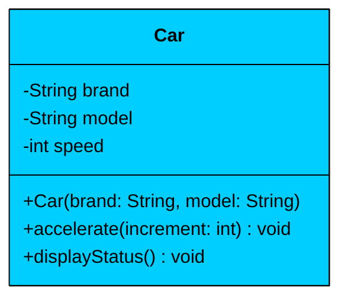
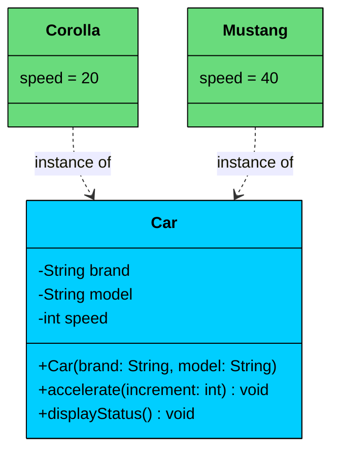

import React from 'react';
import CodeBlock from '../../../../components/ui/CodeBlock';
import Callout from '../../../../components/ui/Callout';

<div className="article-header">
  <div className="breadcrumb">
    <a href="/">Curated Notes</a>
    <span className="breadcrumb-separator">›</span>
    <span className="breadcrumb-current">Classes and Objects</span>
  </div>
  <h1>Classes and Objects</h1>
  <p style={{ color: 'var(--text-muted)', fontSize: '1.1rem', marginBottom: '16px', lineHeight: '1.6' }}>
    Master the essentials of Classes and Objects in this curated guide.
  </p>
  <div className="meta-info">
    <span className="meta-item">
      <svg width="14" height="14" viewBox="0 0 24 24" fill="none" stroke="currentColor" strokeWidth="2"><circle cx="12" cy="12" r="10"/><polyline points="12 6 12 12 16 14"/></svg>
      10 min read
    </span>
    <span className="difficulty-badge difficulty-badge--intermediate">Intermediate</span>
  </div>
</div>

<section className="content-section">

Every object-oriented system starts with one fundamental question: How do I represent real-world entities in code?

**Classes and Objects** are the answer. Together, they form the foundation on which every OOP-based language is built. 

Java, Python, C++, C#, Go, and TypeScript all use this concept to organize and structure code around real-world entities.

---

## 1. What is a Class?

A **class** is a *blueprint*, *template*, or *recipe* for creating objects. It defines **what an object will contain** (its data) and **what it will be able to do** (its behavior).

A class is not an object itself, it’s a template used to create many objects with similar structure but independent state.


&gt; **Real-World Analogy**
&gt;
&gt; Think of a class like a **recipe for a cake**:
&gt;
&gt; - The ingredients represent **fields or attributes** (flour, sugar, eggs → variables).
&gt; - The instructions represent **methods or functions** (mix, bake, decorate → operations).
&gt;
&gt; The recipe itself doesn’t produce a cake, it just defines how to make one. When you follow the recipe and bake a cake, you’ve just created an **object**.
&gt;
&gt; In code terms: the recipe is your class definition, and each cake you bake is an object with its own flavor, frosting, and size.


#### Key Characteristics of a Class:

- It groups related data (attributes) and actions (methods) together.
- Defines **attributes** to represent the state or data of an object.
- Defines **methods** (functions inside a class) to represent the **behavior** or actions the object can perform.

#### Example: Class Blueprint

Let’s define a simple `Car` class with essential attributes and methods that any `Car` object will have.

The following diagram and code show the blueprint for a `Car`:





#### Code:


```java
public class Car {
    // Attributes
    private String brand;
    private String model;
    private int speed;

    // Constructor
    public Car(String brand, String model) {
        this.brand = brand;
        this.model = model;
        this.speed = 0;
    }

    // Method to accelerate
    public void accelerate(int increment) {
        speed += increment;
    }

    // Method to display info
    public void displayStatus() {
        System.out.println(brand + " is running at " + speed + " km/h.");
    }
}
```

```python
class Car:
    # Constructor
    def __init__(self, brand, model):
        # Attributes (private by convention with underscore)
        self._brand = brand
        self._model = model
        self._speed = 0

    # Method to accelerate
    def accelerate(self, increment):
        self._speed += increment

    # Method to display info
    def display_status(self):
        print(f"{self._brand} is running at {self._speed} km/h.")
```

```cpp
class Car {
private:
    // Attributes
    string brand;
    string model;
    int speed;

public:
    // Constructor
    Car(const string& brand, const string& model) 
        : brand(brand), model(model), speed(0) {
    }

    // Method to accelerate
    void accelerate(int increment) {
        speed += increment;
    }

    // Method to display info
    void displayStatus() const {
        cout << brand << " is running at " << speed << " km/h." << endl;
    }
};
```

```go
type Car struct {
	// Attributes
	brand string
	model string
	speed int
}

// Constructor
func NewCar(brand, model string) *Car {
	return &Car{brand: brand, model: model, speed: 0}
}

// Method to accelerate
func (c *Car) accelerate(increment int) {
	c.speed += increment
}

// Method to display info
func (c *Car) displayStatus() {
	fmt.Println(c.brand, "is running at", c.speed, "km/h.")
}
```

```csharp
public class Car
{
    // Attributes
    private string brand;
    private string model;
    private int speed;

    // Constructor
    public Car(string brand, string model)
    {
        this.brand = brand;
        this.model = model;
        this.speed = 0;
    }

    // Method to accelerate
    public void Accelerate(int increment)
    {
        speed += increment;
    }

    // Method to display info
    public void DisplayStatus()
    {
        Console.WriteLine($"{brand} is running at {speed} km/h.");
    }
}
```

```typescript
class Car {
    // Attributes (private by default in TypeScript with private keyword)
    private brand: string;
    private model: string;
    private speed: number;

    // Constructor
    constructor(brand: string, model: string) {
        this.brand = brand;
        this.model = model;
        this.speed = 0;
    }

    // Method to accelerate
    accelerate(increment: number): void {
        this.speed += increment;
    }

    // Method to display info
    displayStatus(): void {
        console.log(`${this.brand} is running at ${this.speed} km/h.`);
    }
}
```


This `Car` class defines what every car object should look like (brand, model, speed) and what it can do (accelerate, display status). But a class on its own is just a definition sitting in your source code. To actually do anything useful, you need to create objects from it.

---

## 2. What is an Object?

An **object** is an instance of a class.  It's the actual thing you can interact with, store data in, and invoke methods on.

When you create an object, you’re essentially saying:

&gt; “Take this blueprint (class) and build one actual thing (object) out of it.”

Each object gets its own copy of the data defined in the class, shares the same structure and behavior, and operates independently of every other object created from that same class.

#### Creating Objects

Let’s now create a few car objects using our `Car` class.





#### Code


```java
public class Main {
    public static void main(String[] args) {
        // Creating objects of the Car class
        Car corolla = new Car("Toyota", "Corolla");
        Car mustang = new Car("Ford", "Mustang");

        corolla.accelerate(20);
        mustang.accelerate(40);

        // Displaying status of each car
        corolla.displayStatus();
        System.out.println("-----------------");
        mustang.displayStatus();
    }
}
```

```python
if __name__ == "__main__":
    # Creating objects of the Car class
    corolla = Car("Toyota", "Corolla")
    mustang = Car("Ford", "Mustang")

    corolla.accelerate(20)
    mustang.accelerate(40)

    # Displaying status of each car
    corolla.display_status()
    print("-----------------")
    mustang.display_status()
```

```cpp
int main() {
    // Creating objects of the Car class
    Car corolla("Toyota", "Corolla");
    Car mustang("Ford", "Mustang");

    corolla.accelerate(20);
    mustang.accelerate(40);

    // Displaying status of each car
    corolla.displayStatus();
    std::cout << "-----------------" << std::endl;
    mustang.displayStatus();

    return 0;
}
```

```go
func main() {
    // Creating objects of the Car class
    corolla := NewCar("Toyota", "Corolla")
    mustang := NewCar("Ford", "Mustang")

    corolla.Accelerate(20)
    mustang.Accelerate(40)

    // Displaying status of each car
    corolla.DisplayStatus()
    println("-----------------")
    mustang.DisplayStatus()
}
```

```csharp
public class Program
{
    public static void Main(string[] args)
    {
        // Creating objects of the Car class
        Car corolla = new Car("Toyota", "Corolla");
        Car mustang = new Car("Ford", "Mustang");

        corolla.Accelerate(20);
        mustang.Accelerate(40);

        // Displaying status of each car
        corolla.DisplayStatus();
        Console.WriteLine("-----------------");
        mustang.DisplayStatus();
    }
}
```

```typescript
// Creating and using objects
function main(): void {
    // Creating objects of the Car class
    const corolla = new Car("Toyota", "Corolla");
    const mustang = new Car("Ford", "Mustang");

    corolla.accelerate(20);
    mustang.accelerate(40);

    // Displaying status of each car
    corolla.displayStatus();
    console.log("-----------------");
    mustang.displayStatus();
}

// Execute the main function
main();
```


#### Output


```shell
Toyota Corolla is running at 20 km/h.
-----------------
Ford Mustang is running at 40 km/h.
```


Notice how `corolla` and `mustang` are both `Car` objects, but they maintain completely independent state. When we called `corolla.accelerate(20)`, only the Corolla's speed changed. The Mustang stayed at 0 until we explicitly accelerated it to 40.

---

## 3. Practical Example: Online Food Order

Let's apply classes and objects to a real-world problem: building an order management system for a food delivery platform.

#### The Scenario

A food delivery app needs to manage orders.

Each order belongs to a customer, contains a list of food items with prices, and tracks whether it has been placed. Customers build their order by adding items one at a time, and once they're satisfied, they place the order. After that, no more items can be added. 

Without classes, you'd have separate arrays for order IDs, customer names, item lists, and totals with no clean way to enforce rules like "don't add items after placing."

With classes, the **Order** owns its data and enforces invariants: `addItem()` works only before `place()`, so invalid states are prevented by design.

#### Code


```java
import java.util.ArrayList;
import java.util.List;

class FoodOrder {
    private String orderId;
    private String customerName;
    private List<String> items;
    private double totalAmount;
    private boolean isPlaced;

    public FoodOrder(String orderId, String customerName) {
        this.orderId = orderId;
        this.customerName = customerName;
        this.items = new ArrayList<>();
        this.totalAmount = 0.0;
        this.isPlaced = false;
    }

    // Only allows adding items before the order is placed
    public void addItem(String name, double price) {
        if (isPlaced) {
            System.out.println("Cannot modify a placed order.");
            return;
        }
        items.add(name);
        totalAmount += price;
    }

    // Places the order if it has at least one item and hasn't been placed yet
    public boolean placeOrder() {
        if (isPlaced || items.isEmpty()) {
            return false;
        }
        isPlaced = true;
        return true;
    }

    public int getItemCount() {
        return items.size();
    }

    public void displayOrder() {
        String status = isPlaced ? "PLACED" : "PENDING";
        System.out.println("Order " + orderId + " (" + customerName + ") - " + status);
        for (String item : items) {
            System.out.println("  - " + item);
        }
        System.out.printf("  Total: $%.2f%n", totalAmount);
    }
}

// Usage
public class FoodApp {
    public static void main(String[] args) {
        FoodOrder order1 = new FoodOrder("ORD-101", "Alice");
        order1.addItem("Pizza", 12.99);
        order1.addItem("Garlic Bread", 4.99);
        order1.addItem("Coke", 2.49);
        order1.placeOrder();

        FoodOrder order2 = new FoodOrder("ORD-102", "Bob");
        order2.addItem("Burger", 9.99);
        order2.addItem("Fries", 3.99);
        // Bob hasn't placed his order yet

        order1.displayOrder();
        System.out.println();
        order2.displayOrder();
    }
}
```

```python
class FoodOrder:
    def __init__(self, order_id: str, customer_name: str):
        self._order_id = order_id
        self._customer_name = customer_name
        self._items: list[str] = []
        self._total_amount = 0.0
        self._is_placed = False

    # Only allows adding items before the order is placed
    def add_item(self, name: str, price: float) -> None:
        if self._is_placed:
            print("Cannot modify a placed order.")
            return
        self._items.append(name)
        self._total_amount += price

    # Places the order if it has at least one item and hasn't been placed yet
    def place_order(self) -> bool:
        if self._is_placed or not self._items:
            return False
        self._is_placed = True
        return True

    def get_item_count(self) -> int:
        return len(self._items)

    def display_order(self) -> None:
        status = "PLACED" if self._is_placed else "PENDING"
        print(f"Order {self._order_id} ({self._customer_name}) - {status}")
        for item in self._items:
            print(f"  - {item}")
        print(f"  Total: ${self._total_amount:.2f}")

if __name__ == "__main__":
    order1 = FoodOrder("ORD-101", "Alice")
    order1.add_item("Pizza", 12.99)
    order1.add_item("Garlic Bread", 4.99)
    order1.add_item("Coke", 2.49)
    order1.place_order()

    order2 = FoodOrder("ORD-102", "Bob")
    order2.add_item("Burger", 9.99)
    order2.add_item("Fries", 3.99)

    order1.display_order()
    print()
    order2.display_order()
```

```cpp
#include <iostream>
#include <string>
#include <vector>
#include <iomanip>

class FoodOrder {
private:
    std::string orderId;
    std::string customerName;
    std::vector<std::string> items;
    double totalAmount;
    bool isPlaced;

public:
    FoodOrder(const std::string& orderId, const std::string& customerName)
        : orderId(orderId), customerName(customerName),
          totalAmount(0.0), isPlaced(false) {}

    // Only allows adding items before the order is placed
    void addItem(const std::string& name, double price) {
        if (isPlaced) {
            std::cout << "Cannot modify a placed order." << std::endl;
            return;
        }
        items.push_back(name);
        totalAmount += price;
    }

    // Places the order if it has at least one item and hasn't been placed yet
    bool placeOrder() {
        if (isPlaced || items.empty()) {
            return false;
        }
        isPlaced = true;
        return true;
    }

    int getItemCount() const {
        return items.size();
    }

    void displayOrder() const {
        std::string status = isPlaced ? "PLACED" : "PENDING";
        std::cout << "Order " << orderId << " (" << customerName
                  << ") - " << status << std::endl;
        for (const auto& item : items) {
            std::cout << "  - " << item << std::endl;
        }
        std::cout << "  Total: $" << std::fixed << std::setprecision(2)
                  << totalAmount << std::endl;
    }
};

int main() {
    FoodOrder order1("ORD-101", "Alice");
    order1.addItem("Pizza", 12.99);
    order1.addItem("Garlic Bread", 4.99);
    order1.addItem("Coke", 2.49);
    order1.placeOrder();

    FoodOrder order2("ORD-102", "Bob");
    order2.addItem("Burger", 9.99);
    order2.addItem("Fries", 3.99);

    order1.displayOrder();
    std::cout << std::endl;
    order2.displayOrder();

    return 0;
}
```

```csharp
using System;
using System.Collections.Generic;

public class FoodOrder
{
    private string _orderId;
    private string _customerName;
    private List<string> _items;
    private double _totalAmount;
    private bool _isPlaced;

    public FoodOrder(string orderId, string customerName)
    {
        _orderId = orderId;
        _customerName = customerName;
        _items = new List<string>();
        _totalAmount = 0.0;
        _isPlaced = false;
    }

    // Only allows adding items before the order is placed
    public void AddItem(string name, double price)
    {
        if (_isPlaced)
        {
            Console.WriteLine("Cannot modify a placed order.");
            return;
        }
        _items.Add(name);
        _totalAmount += price;
    }

    // Places the order if it has at least one item and hasn't been placed yet
    public bool PlaceOrder()
    {
        if (_isPlaced || _items.Count == 0)
        {
            return false;
        }
        _isPlaced = true;
        return true;
    }

    public int GetItemCount()
    {
        return _items.Count;
    }

    public void DisplayOrder()
    {
        string status = _isPlaced ? "PLACED" : "PENDING";
        Console.WriteLine($"Order {_orderId} ({_customerName}) - {status}");
        foreach (var item in _items)
        {
            Console.WriteLine($"  - {item}");
        }
        Console.WriteLine($"  Total: ${_totalAmount:F2}");
    }
}

public class Program
{
    public static void Main()
    {
        var order1 = new FoodOrder("ORD-101", "Alice");
        order1.AddItem("Pizza", 12.99);
        order1.AddItem("Garlic Bread", 4.99);
        order1.AddItem("Coke", 2.49);
        order1.PlaceOrder();

        var order2 = new FoodOrder("ORD-102", "Bob");
        order2.AddItem("Burger", 9.99);
        order2.AddItem("Fries", 3.99);

        order1.DisplayOrder();
        Console.WriteLine();
        order2.DisplayOrder();
    }
}
```

```go
package main

import (
	"fmt"
)

type FoodOrder struct {
	orderId      string
	customerName string
	items        []string
	totalAmount  float64
	isPlaced     bool
}

func NewFoodOrder(orderId, customerName string) *FoodOrder {
	return &FoodOrder{
		orderId:      orderId,
		customerName: customerName,
		items:        make([]string, 0),
		totalAmount:  0.0,
		isPlaced:     false,
	}
}

// Only allows adding items before the order is placed
func (f *FoodOrder) AddItem(name string, price float64) {
	if f.isPlaced {
		fmt.Println("Cannot modify a placed order.")
		return
	}
	f.items = append(f.items, name)
	f.totalAmount += price
}

// Places the order if it has at least one item and hasn't been placed yet
func (f *FoodOrder) PlaceOrder() bool {
	if f.isPlaced || len(f.items) == 0 {
		return false
	}
	f.isPlaced = true
	return true
}

func (f *FoodOrder) GetItemCount() int {
	return len(f.items)
}

func (f *FoodOrder) DisplayOrder() {
	status := "PENDING"
	if f.isPlaced {
		status = "PLACED"
	}
	fmt.Printf("Order %s (%s) - %s\n", f.orderId, f.customerName, status)
	for _, item := range f.items {
		fmt.Printf("  - %s\n", item)
	}
	fmt.Printf("  Total: $%.2f\n", f.totalAmount)
}

func main() {
	order1 := NewFoodOrder("ORD-101", "Alice")
	order1.AddItem("Pizza", 12.99)
	order1.AddItem("Garlic Bread", 4.99)
	order1.AddItem("Coke", 2.49)
	order1.PlaceOrder()

	order2 := NewFoodOrder("ORD-102", "Bob")
	order2.AddItem("Burger", 9.99)
	order2.AddItem("Fries", 3.99)

	order1.DisplayOrder()
	fmt.Println()
	order2.DisplayOrder()
}
```

```typescript
class FoodOrder {
    private orderId: string;
    private customerName: string;
    private items: string[];
    private totalAmount: number;
    private isPlaced: boolean;

    constructor(orderId: string, customerName: string) {
        this.orderId = orderId;
        this.customerName = customerName;
        this.items = [];
        this.totalAmount = 0;
        this.isPlaced = false;
    }

    // Only allows adding items before the order is placed
    addItem(name: string, price: number): void {
        if (this.isPlaced) {
            console.log("Cannot modify a placed order.");
            return;
        }
        this.items.push(name);
        this.totalAmount += price;
    }

    // Places the order if it has at least one item and hasn't been placed yet
    placeOrder(): boolean {
        if (this.isPlaced || this.items.length === 0) {
            return false;
        }
        this.isPlaced = true;
        return true;
    }

    getItemCount(): number {
        return this.items.length;
    }

    displayOrder(): void {
        const status = this.isPlaced ? "PLACED" : "PENDING";
        console.log(`Order ${this.orderId} (${this.customerName}) - ${status}`);
        for (const item of this.items) {
            console.log(`  - ${item}`);
        }
        console.log(`  Total: $${this.totalAmount.toFixed(2)}`);
    }
}

// Usage
const order1 = new FoodOrder("ORD-101", "Alice");
order1.addItem("Pizza", 12.99);
order1.addItem("Garlic Bread", 4.99);
order1.addItem("Coke", 2.49);
order1.placeOrder();

const order2 = new FoodOrder("ORD-102", "Bob");
order2.addItem("Burger", 9.99);
order2.addItem("Fries", 3.99);

order1.displayOrder();
console.log();
order2.displayOrder();
```


#### Why This Design Works

- **Encapsulates order state:** Items, total, and placement status live together. No need to track these in separate data structures.
- **Enforces business rules:** The `addItem()` method prevents modifications after placement. The object protects its own invariants.
- **Reusable across the platform:** One class handles every customer order allowing you to create thousands of order objects from the same blueprint.
- **Easy to extend:** Need to add delivery addresses, payment methods, or order tracking later? Add new fields and methods without restructuring your entire codebase.

</section>
