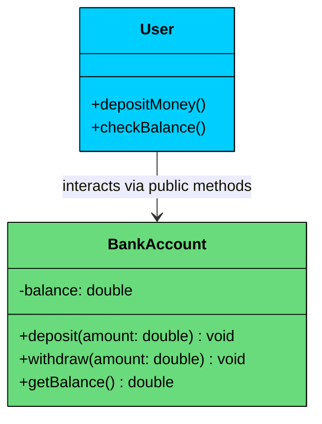

import React from 'react';
import CodeBlock from '../../../../components/ui/CodeBlock';
import Callout from '../../../../components/ui/Callout';

<div className="article-header">
  <div className="breadcrumb">
    <a href="/">Curated Notes</a>
    <span className="breadcrumb-separator">›</span>
    <span className="breadcrumb-current">Encapsulation</span>
  </div>
  <h1>Encapsulation</h1>
  <p style={{ color: 'var(--text-muted)', fontSize: '1.1rem', marginBottom: '16px', lineHeight: '1.6' }}>
    Master the essentials of Encapsulation in this curated guide.
  </p>
  <div className="meta-info">
    <span className="meta-item">
      <svg width="14" height="14" viewBox="0 0 24 24" fill="none" stroke="currentColor" strokeWidth="2"><circle cx="12" cy="12" r="10"/><polyline points="12 6 12 12 16 14"/></svg>
      10 min read
    </span>
    <span className="difficulty-badge difficulty-badge--intermediate">Intermediate</span>
  </div>
</div>

<section className="content-section">

Encapsulation is one of the four foundational principles of object-oriented design. It is the practice of **grouping data (variables) and behavior (methods)** that operate on that data into a single unit (typically a class) and **restricting direct access to the internal details** of that class.

In simple terms:

&gt; **Encapsulation = Data hiding + Controlled access**

---


&gt; **Real-World Analogy**
&gt;
&gt; Think of a bank account as a **vault inside a bank**. You don't walk into the vault and change the numbers yourself.
&gt;
&gt; Instead, you interact with it through a **well-defined interface, **the **ATM**.
&gt;
&gt; The ATM provides limited but specific operations:
&gt;
&gt; - `deposit()`
&gt; - `withdraw()`
&gt; - `checkBalance()`
&gt;
&gt; 

&gt; 
&gt;
&gt; You can’t directly access or modify the bank’s internal data.
&gt;
&gt; The bank might change how it stores information, applies interest, or validates transactions but none of that affects how you use the ATM.
&gt;
&gt; That’s **encapsulation** in action: hiding internal complexity and exposing only what’s necessary.


In a well-encapsulated design, external code doesn't need to know **how** something is done. It only needs to know **what** can be done.

---

## 1. Why Encapsulation Matters

Encapsulation isn’t just about data protection, it’s about designing systems that are **robust**, **secure**, and **easy to maintain**.

Here's why that matters in practice:

#### **1. Data Hiding**

Sensitive data (like a bank balance or password) should not be exposed directly. Encapsulation keeps this data private and accessible only through controlled methods.

#### **2. Controlled Access **and Validation

It ensures that data can only be modified in **controlled, predictable ways**.

For example, you can prevent invalid deposits or withdrawals by validating input inside methods.

#### **3. Improved Maintainability**

Because internal details are hidden, you can change the implementation (e.g., how data is stored or validated) without affecting the code that depends on it.

#### 4. **Security and Stability**

By preventing external tampering, encapsulation reduces the risk of inconsistent or invalid system states.

---

## **2. How Encapsulation is Achieved**

Encapsulation is primarily implemented using two language features: **access modifiers** that control visibility, and **getters/setters** that provide controlled access to private data.

#### 1. Access Modifiers

Access modifiers are keywords that control which parts of your code can see and interact with a class's fields and methods. The three most common are:

- `private`: Accessible only within the same class. This is the primary tool for hiding data.
- `protected`: Accessible within the same class and its subclasses. Useful when child classes need access to parent data.
- `public`: Accessible from anywhere. This is what you use for the controlled interface.

The general rule is simple: **make everything private by default**, then selectively expose what needs to be public.

Here's a minimal example showing the difference:


```java
public class Product {
    private String name;         // Only this class can access
    private double price;        // Only this class can access

    public Product(String name, double price) {
        this.name = name;
        this.price = price;
    }

    public String getName() {    // Anyone can read the name
        return name;
    }

    public double getPrice() {   // Anyone can read the price
        return price;
    }
}
```

```python
class Product:
    def __init__(self, name: str, price: float):
        self.__name = name       # Name-mangled (private by convention)
        self.__price = price     # Name-mangled (private by convention)

    def get_name(self) -> str:   # Anyone can read the name
        return self.__name

    def get_price(self) -> float:  # Anyone can read the price
        return self.__price
```

```cpp
class Product {
private:
    string name;         // Only this class can access
    double price;        // Only this class can access

public:
    Product(const string& name, double price)
        : name(name), price(price) {}

    string getName() const {    // Anyone can read the name
        return name;
    }

    double getPrice() const {   // Anyone can read the price
        return price;
    }
};
```

```csharp
public class Product
{
    private string name;         // Only this class can access
    private double price;        // Only this class can access

    public Product(string name, double price)
    {
        this.name = name;
        this.price = price;
    }

    public string GetName()      // Anyone can read the name
    {
        return name;
    }

    public double GetPrice()     // Anyone can read the price
    {
        return price;
    }
}
```

```go
type Product struct {
    name  string  // unexported (lowercase = private to package)
    price float64 // unexported (lowercase = private to package)
}

func NewProduct(name string, price float64) *Product {
    return &Product{name: name, price: price}
}

func (p *Product) GetName() string {    // Exported (anyone can call)
    return p.name
}

func (p *Product) GetPrice() float64 {  // Exported (anyone can call)
    return p.price
}
```

```typescript
class Product {
    private name: string;         // Only this class can access
    private price: number;        // Only this class can access

    constructor(name: string, price: number) {
        this.name = name;
        this.price = price;
    }

    getName(): string {           // Anyone can read the name
        return this.name;
    }

    getPrice(): number {          // Anyone can read the price
        return this.price;
    }
}
```


#### 2. Getters and Setters

These are public methods that provide controlled, indirect access to `private` attributes.

- **Getter (e.g., **`getBalance()`**):** Provides read-only access to an attribute.
- **Setter (e.g., **`setAmount()`**):** Allows modifying an attribute, often with validation logic built-in.

Here's an example where a setter prevents invalid data from ever entering the object:


```java
public class Product {
    private String name;
    private double price;

    public Product(String name, double price) {
        this.name = name;
        setPrice(price); // Use the setter for validation
    }

    public String getName() {
        return name;
    }

    public double getPrice() {
        return price;
    }

    public void setPrice(double price) {
        if (price < 0) {
            throw new IllegalArgumentException("Price cannot be negative");
        }
        this.price = price;
    }
}
```

```python
class Product:
    def __init__(self, name: str, price: float):
        self.__name = name
        self.price = price  # Uses the property setter for validation

    @property
    def name(self) -> str:
        return self.__name

    @property
    def price(self) -> float:
        return self.__price

    @price.setter
    def price(self, value: float) -> None:
        if value < 0:
            raise ValueError("Price cannot be negative")
        self.__price = value
```

```cpp
class Product {
private:
    string name;
    double price;

public:
    Product(const string& name, double price) : name(name), price(0) {
        setPrice(price); // Use the setter for validation
    }

    string getName() const { return name; }

    double getPrice() const { return price; }

    void setPrice(double price) {
        if (price < 0) {
            throw invalid_argument("Price cannot be negative");
        }
        this->price = price;
    }
};
```

```csharp
public class Product
{
    private string _name;
    private double _price;

    public Product(string name, double price)
    {
        _name = name;
        Price = price; // Uses the property setter for validation
    }

    public string Name => _name;

    public double Price
    {
        get => _price;
        set
        {
            if (value < 0)
                throw new ArgumentException("Price cannot be negative");
            _price = value;
        }
    }
}
```

```go
type Product struct {
    name  string
    price float64
}

func NewProduct(name string, price float64) (*Product, error) {
    p := &Product{name: name}
    if err := p.SetPrice(price); err != nil {
        return nil, err
    }
    return p, nil
}

func (p *Product) GetName() string    { return p.name }
func (p *Product) GetPrice() float64  { return p.price }

func (p *Product) SetPrice(price float64) error {
    if price < 0 {
        return fmt.Errorf("price cannot be negative")
    }
    p.price = price
    return nil
}
```

```typescript
class Product {
    private _name: string;
    private _price: number;

    constructor(name: string, price: number) {
        this._name = name;
        this.price = price; // Uses the setter for validation
    }

    get name(): string {
        return this._name;
    }

    get price(): number {
        return this._price;
    }

    set price(value: number) {
        if (value < 0) {
            throw new Error("Price cannot be negative");
        }
        this._price = value;
    }
}
```


---

## 3. Encapsulation in Practice: BankAccount

Now let's see a complete encapsulated class with proper validation, controlled access, and business rules. The `BankAccount` class keeps `balance` private and only allows modifications through `deposit()` and `withdraw()`, each of which enforces its own rules.


```java
public class BankAccount {
    private String accountHolder;
    private double balance;

    public BankAccount(String accountHolder) {
        this.accountHolder = accountHolder;
        this.balance = 0.0;
    }

    public void deposit(double amount) {
        if (amount <= 0) {
            throw new IllegalArgumentException("Deposit amount must be positive");
        }
        balance += amount;
    }

    public void withdraw(double amount) {
        if (amount <= 0) {
            throw new IllegalArgumentException("Withdrawal amount must be positive");
        }
        if (amount > balance) {
            throw new IllegalArgumentException("Insufficient funds");
        }
        balance -= amount;
    }

    public double getBalance() {
        return balance;
    }

    public String getAccountHolder() {
        return accountHolder;
    }
}
```

```python
class BankAccount:
    def __init__(self, account_holder: str):
        self.__account_holder = account_holder
        self.__balance = 0.0

    def deposit(self, amount: float) -> None:
        if amount <= 0:
            raise ValueError("Deposit amount must be positive")
        self.__balance += amount

    def withdraw(self, amount: float) -> None:
        if amount <= 0:
            raise ValueError("Withdrawal amount must be positive")
        if amount > self.__balance:
            raise ValueError("Insufficient funds")
        self.__balance -= amount

    @property
    def balance(self) -> float:
        return self.__balance

    @property
    def account_holder(self) -> str:
        return self.__account_holder
```

```cpp
#include <iostream>
#include <string>
#include <stdexcept>

class BankAccount {
private:
    std::string accountHolder;
    double balance;

public:
    BankAccount(const std::string& accountHolder)
        : accountHolder(accountHolder), balance(0.0) {}

    void deposit(double amount) {
        if (amount <= 0) {
            throw std::invalid_argument("Deposit amount must be positive");
        }
        balance += amount;
    }

    void withdraw(double amount) {
        if (amount <= 0) {
            throw std::invalid_argument("Withdrawal amount must be positive");
        }
        if (amount > balance) {
            throw std::invalid_argument("Insufficient funds");
        }
        balance -= amount;
    }

    double getBalance() const {
        return balance;
    }

    std::string getAccountHolder() const {
        return accountHolder;
    }
};
```

```csharp
public class BankAccount
{
    private string _accountHolder;
    private double _balance;

    public BankAccount(string accountHolder)
    {
        _accountHolder = accountHolder;
        _balance = 0.0;
    }

    public void Deposit(double amount)
    {
        if (amount <= 0)
            throw new ArgumentException("Deposit amount must be positive");
        _balance += amount;
    }

    public void Withdraw(double amount)
    {
        if (amount <= 0)
            throw new ArgumentException("Withdrawal amount must be positive");
        if (amount > _balance)
            throw new ArgumentException("Insufficient funds");
        _balance -= amount;
    }

    public double Balance => _balance;

    public string AccountHolder => _accountHolder;
}
```

```go
package main

import (
    "errors"
    "fmt"
)

type BankAccount struct {
    accountHolder string
    balance       float64
}

func NewBankAccount(accountHolder string) *BankAccount {
    return &BankAccount{accountHolder: accountHolder, balance: 0.0}
}

func (a *BankAccount) Deposit(amount float64) error {
    if amount <= 0 {
        return errors.New("deposit amount must be positive")
    }
    a.balance += amount
    return nil
}

func (a *BankAccount) Withdraw(amount float64) error {
    if amount <= 0 {
        return errors.New("withdrawal amount must be positive")
    }
    if amount > a.balance {
        return errors.New("insufficient funds")
    }
    a.balance -= amount
    return nil
}

func (a *BankAccount) GetBalance() float64 {
    return a.balance
}

func (a *BankAccount) GetAccountHolder() string {
    return a.accountHolder
}
```

```typescript
class BankAccount {
    private accountHolder: string;
    private balance: number;

    constructor(accountHolder: string) {
        this.accountHolder = accountHolder;
        this.balance = 0;
    }

    deposit(amount: number): void {
        if (amount <= 0) {
            throw new Error("Deposit amount must be positive");
        }
        this.balance += amount;
    }

    withdraw(amount: number): void {
        if (amount <= 0) {
            throw new Error("Withdrawal amount must be positive");
        }
        if (amount > this.balance) {
            throw new Error("Insufficient funds");
        }
        this.balance -= amount;
    }

    getBalance(): number {
        return this.balance;
    }

    getAccountHolder(): string {
        return this.accountHolder;
    }
}
```


Notice what's happening here:

- `balance` is marked `private`, so no external class can access or modify it directly.
- `deposit()` and `withdraw()` are **public entry points** that validate user input before updating the state.
- `getBalance()` allows **read-only access** without revealing the underlying variable or letting external code change it.

This ensures the account remains in a valid state at all times and business rules are enforced through controlled interfaces.

---

## 4. Practical Example: PaymentProcessor

Let’s take a more realistic example. You're building a `PaymentProcessor` class that handles credit card transactions. The raw card number must never be stored or visible anywhere in the system. If a developer accidentally logs the payment object or inspects it in a debugger, they should only see a masked version. 

The masking logic, the amount, and the processing flow are all internal details that the caller doesn't need to worry about.


```java
class PaymentProcessor {
    private String cardNumber;
    private double amount;

    public PaymentProcessor(String cardNumber, double amount) {
        this.cardNumber = maskCardNumber(cardNumber);
        this.amount = amount;
    }

    private String maskCardNumber(String cardNumber) {
        return "****-****-****-" + cardNumber.substring(cardNumber.length() - 4);
    }

    public void processPayment() {
        System.out.println("Processing payment of $" + amount + " for card " + cardNumber);
    }
}

public class Main {
    public static void main(String[] args) {
        PaymentProcessor payment = new PaymentProcessor("1234567812345678", 250.00);
        payment.processPayment();
    }
}
```

```python
class PaymentProcessor:
    def __init__(self, card_number: str, amount: float):
        self.__card_number = self.__mask_card_number(card_number)
        self.__amount = amount

    def __mask_card_number(self, card_number: str) -> str:
        return "****-****-****-" + card_number[-4:]

    def process_payment(self) -> None:
        print(f"Processing payment of ${self.__amount} for card {self.__card_number}")

if __name__ == "__main__":
    payment = PaymentProcessor("1234567812345678", 250.00)
    payment.process_payment()
```

```cpp
#include <iostream>
#include <string>

class PaymentProcessor {
private:
    std::string cardNumber;
    double amount;

    std::string maskCardNumber(const std::string& cardNumber) {
        return "****-****-****-" + cardNumber.substr(cardNumber.length() - 4);
    }

public:
    PaymentProcessor(const std::string& cardNumber, double amount)
        : cardNumber(maskCardNumber(cardNumber)), amount(amount) {}

    void processPayment() {
        std::cout << "Processing payment of $" << amount
                  << " for card " << cardNumber << std::endl;
    }
};

int main() {
    PaymentProcessor payment("1234567812345678", 250.00);
    payment.processPayment();
    return 0;
}
```

```csharp
using System;

public class PaymentProcessor
{
    private string _cardNumber;
    private double _amount;

    public PaymentProcessor(string cardNumber, double amount)
    {
        _cardNumber = MaskCardNumber(cardNumber);
        _amount = amount;
    }

    private string MaskCardNumber(string cardNumber)
    {
        return "****-****-****-" + cardNumber.Substring(cardNumber.Length - 4);
    }

    public void ProcessPayment()
    {
        Console.WriteLine($"Processing payment of ${_amount} for card {_cardNumber}");
    }
}

public class Program
{
    public static void Main(string[] args)
    {
        var payment = new PaymentProcessor("1234567812345678", 250.00);
        payment.ProcessPayment();
    }
}
```

```go
package main

import "fmt"

type PaymentProcessor struct {
    cardNumber string
    amount     float64
}

func maskCardNumber(cardNumber string) string {
    return "****-****-****-" + cardNumber[len(cardNumber)-4:]
}

func NewPaymentProcessor(cardNumber string, amount float64) *PaymentProcessor {
    return &PaymentProcessor{
        cardNumber: maskCardNumber(cardNumber),
        amount:     amount,
    }
}

func (p *PaymentProcessor) ProcessPayment() {
    fmt.Printf("Processing payment of $%.2f for card %s\n", p.amount, p.cardNumber)
}

func main() {
    payment := NewPaymentProcessor("1234567812345678", 250.00)
    payment.ProcessPayment()
}
```

```typescript
class PaymentProcessor {
    private cardNumber: string;
    private amount: number;

    constructor(cardNumber: string, amount: number) {
        this.cardNumber = this.maskCardNumber(cardNumber);
        this.amount = amount;
    }

    private maskCardNumber(cardNumber: string): string {
        return "****-****-****-" + cardNumber.substring(cardNumber.length - 4);
    }

    processPayment(): void {
        console.log(`Processing payment of $${this.amount} for card ${this.cardNumber}`);
    }
}

const payment = new PaymentProcessor("1234567812345678", 250.00);
payment.processPayment();
```


#### Why This Design Works

- **The raw card number is never stored.** The constructor masks it immediately, so even if someone accesses the object's internal state through debugging or reflection, they only see the masked version.
- **Masking is handled internally via a private method.** The caller doesn't need to know how masking works. They pass the full card number, and the class handles the rest.
- **The external caller has a minimal interface.** Just create a `PaymentProcessor` and call `processPayment()`. No need to call `maskCardNumber()` first, no need to worry about storing the original number safely.
- **Changes to the masking logic are contained.** If you later decide to mask differently (showing the first 4 instead of the last 4, or using a different format), you change one private method. No external code is affected.

This is encapsulation applied to security: sensitive data enters the class, gets transformed into a safe representation, and the original is never exposed.

</section>
