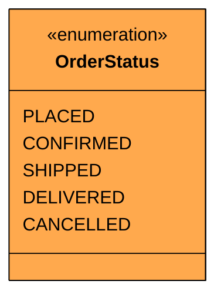
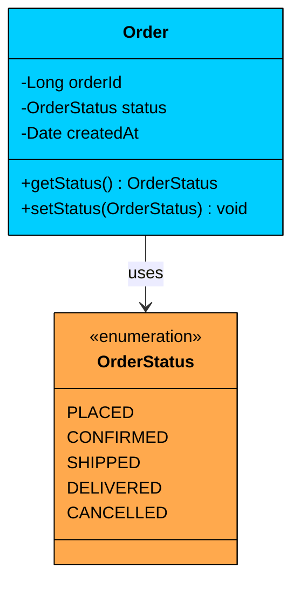

import React from 'react';
import CodeBlock from '../../../../components/ui/CodeBlock';
import Callout from '../../../../components/ui/Callout';

<div className="article-header">
  <div className="breadcrumb">
    <a href="/">Curated Notes</a>
    <span className="breadcrumb-separator">›</span>
    <span className="breadcrumb-current">Enums</span>
  </div>
  <h1>Enums</h1>
  <p style={{ color: 'var(--text-muted)', fontSize: '1.1rem', marginBottom: '16px', lineHeight: '1.6' }}>
    Master the essentials of Enums in this curated guide.
  </p>
  <div className="meta-info">
    <span className="meta-item">
      <svg width="14" height="14" viewBox="0 0 24 24" fill="none" stroke="currentColor" strokeWidth="2"><circle cx="12" cy="12" r="10"/><polyline points="12 6 12 12 16 14"/></svg>
      10 min read
    </span>
    <span className="difficulty-badge difficulty-badge--intermediate">Intermediate</span>
  </div>
</div>

<section className="content-section">

Imagine you're building an e-commerce platform and you need to track the status of every order. Orders flow through various states: placed, confirmed, shipped, delivered, or cancelled. How do you represent these states in code?

You could use strings: `"PLACED"`, `"SHIPPED"`, `"DELIVERED"`. But what happens when someone types `"Shiped"` instead of `"SHIPPED"`? 

The compiler won't catch it and your code will silently fail at runtime.

You could use integers: `1` for placed, `2` for shipped, `3` for delivered. But now your code is littered with magic numbers. What does `if (status == 2)` mean?

This is exactly the type of problem **enums** solve.

---

## 1. What is an Enum?

An **enum** (short for enumeration) is a special data type that defines a fixed set of named constants. Unlike strings or integers, enums are **type-safe**, meaning the compiler ensures you can only use values that actually exist in your defined set.

They ensure that a variable can only take **one out of a predefined set of valid options**.





&gt; If a value can only be one of a predefined set of options, consider using an enum.

#### Why Use Enums?

To appreciate what enums give you, consider the alternative. Without enums, you'd represent order statuses as strings scattered throughout your codebase:


```java
String status = "PENDING";

// Somewhere else in the codebase...
if (status.equals("PNDING")) {  // Typo! This condition is never true
    processOrder();
}
```


This code compiles without any warnings. The typo `"PNDING"` is a perfectly valid string as far as the compiler is concerned. The bug only surfaces when a customer complains that their order never gets processed. 

Enums eliminate this entire category of bugs. When you define `OrderStatus` as an enum with values like `PENDING`, `CONFIRMED`, `SHIPPED`, and `DELIVERED`, the compiler knows exactly which values are valid.

Here are several key advantages Enums provide over plain constants or strings:

- **Avoid “magic values”:** No more scattered strings or integers like `"PENDING"` or `3` in your code.
- **Improve readability:** Enums make your intent clear — `OrderStatus.SHIPPED` is far more descriptive than `3`.
- **Enable compiler checks:** The compiler validates enum usage, catching typos and invalid assignments early.
- **Support IDE features:** Most IDEs provide auto-completion and refactoring tools for enum values.
- **Reduce bugs:** You can’t accidentally assign a random string or number that doesn’t belong to enum.

#### Example Enums

Enums are perfect for defining categories or states that rarely change.

- Order States (e.g., `PENDING`, `IN_PROGRESS`, `COMPLETED`)
- User Roles (e.g., `ADMIN`, `CUSTOMER`, `DRIVER`)
- Vehicle Types (e.g., `CAR`, `BIKE`, `TRUCK`)
- Directions (e.g., `NORTH`, `SOUTH`, `EAST`, `WEST`)

By using enums instead of raw strings, you make your system easier to understand and harder to misuse.

---

## 2. Enum Examples

### Simple Enum

The most basic form of an enum defines a list of named constants under a single type. Let's model the status of an order in an e-commerce system.





```java
public enum OrderStatus {
    PLACED,
    CONFIRMED,
    SHIPPED,
    DELIVERED,
    CANCELLED
}
```

```python
from enum import Enum

## Simple Enum
class OrderStatus(Enum):
    PLACED = "PLACED"
    CONFIRMED = "CONFIRMED"
    SHIPPED = "SHIPPED"
    DELIVERED = "DELIVERED"
    CANCELLED = "CANCELLED"
```

```cpp
enum class OrderStatus {
    PLACED,
    CONFIRMED,
    SHIPPED,
    DELIVERED,
    CANCELLED
};
```

```csharp
public enum OrderStatus
{
    PLACED,
    CONFIRMED,
    SHIPPED,
    DELIVERED,
    CANCELLED
}
```

```go
type OrderStatus int

const (
	Placed OrderStatus = iota
	Confirmed
	Shipped
	Delivered
	Cancelled
)

func (s OrderStatus) String() string {
	switch s {
	case Placed:
		return "PLACED"
	case Confirmed:
		return "CONFIRMED"
	case Shipped:
		return "SHIPPED"
	case Delivered:
		return "DELIVERED"
	case Cancelled:
		return "CANCELLED"
	default:
		return "UNKNOWN"
	}
}

// Go doesn't have a built-in enum keyword, so you use iota with typed constants to achieve the same result.
```

```typescript
enum OrderStatus {
    PLACED = "PLACED",
    CONFIRMED = "CONFIRMED",
    SHIPPED = "SHIPPED",
    DELIVERED = "DELIVERED",
    CANCELLED = "CANCELLED"
}
```


This enum defines a **finite set of valid states** an order can have. Nothing else is allowed.

#### **Using it in code**


```java
OrderStatus status = OrderStatus.SHIPPED;

if (status == OrderStatus.SHIPPED) {
    System.out.println("Your package is on the way!");
}
```

```python
status = OrderStatus.SHIPPED

if status == OrderStatus.SHIPPED:
    print("Your package is on the way!")
```

```cpp
OrderStatus status = OrderStatus::SHIPPED;

if (status == OrderStatus::SHIPPED) {
    cout << "Your package is on the way!" << endl;
}
```

```go
package main

import "fmt"

type OrderStatus int

const (
	SHIPPED OrderStatus = iota
)

func main() {
	status := SHIPPED

	if status == SHIPPED {
		fmt.Println("Your package is on the way!")
	}
}
```

```csharp
OrderStatus status = OrderStatus.SHIPPED;

if (status == OrderStatus.SHIPPED)
{
    Console.WriteLine("Your package is on the way!");
}
```

```typescript
const status: OrderStatus = OrderStatus.SHIPPED;

if (status === OrderStatus.SHIPPED) {
    console.log("Your package is on the way!");
}
```


Simple enums work well when you just need a list of named constants. But what if each constant needs to carry additional data?

### Enums with Properties and Methods

Enums can do more than just name constants. In many languages, each enum value can hold additional data and even define behavior. This makes them surprisingly powerful for modeling domain concepts.

Let’s consider a `Coin` enum that represents U.S. coins and their denominations. Each coin has a name (PENNY, NICKEL, DIME, QUARTER) and a value in cents (1, 5, 10, 25). Instead of maintaining a separate lookup table for coin values, you can embed the value directly in the enum.


```java
public enum Coin {
    PENNY(1),
    NICKEL(5),
    DIME(10),
    QUARTER(25);

    private final int value;

    Coin(int value) {
        this.value = value;
    }

    public int getValue() {
        return value;
    }
}
```

```python
from enum import Enum

class Coin(Enum):
    PENNY = 1
    NICKEL = 5
    DIME = 10
    QUARTER = 25
    
    def __init__(self, value):
        self.coin_value = value
    
    def get_value(self):
        return self.coin_value
```

```cpp
enum class Coin {
    PENNY,
    NICKEL,
    DIME,
    QUARTER
};

// C++ enums can't hold fields, so use a helper function
int getCoinValue(Coin coin) {
    switch (coin) {
        case Coin::PENNY:   return 1;
        case Coin::NICKEL:  return 5;
        case Coin::DIME:    return 10;
        case Coin::QUARTER: return 25;
        default:            return 0;
    }
}
```

```csharp
// C# enums can have integer values but no methods.
// For richer behavior, use a class with static readonly fields.
public class Coin
{
    public static readonly Coin PENNY = new("PENNY", 1);
    public static readonly Coin NICKEL = new("NICKEL", 5);
    public static readonly Coin DIME = new("DIME", 10);
    public static readonly Coin QUARTER = new("QUARTER", 25);

    public string Name { get; }
    public int Value { get; }

    private Coin(string name, int value)
    {
        Name = name;
        Value = value;
    }

    public int GetValue() => Value;
}
```

```go
type Coin struct {
	Name  string
	Value int
}

var (
	Penny   = Coin{"PENNY", 1}
	Nickel  = Coin{"NICKEL", 5}
	Dime    = Coin{"DIME", 10}
	Quarter = Coin{"QUARTER", 25}
)

func (c Coin) GetValue() int {
	return c.Value
}
```

```typescript
class Coin {
    static readonly PENNY = new Coin("PENNY", 1);
    static readonly NICKEL = new Coin("NICKEL", 5);
    static readonly DIME = new Coin("DIME", 10);
    static readonly QUARTER = new Coin("QUARTER", 25);

    private constructor(
        public readonly name: string,
        private readonly value: number
    ) {}

    getValue(): number {
        return this.value;
    }
}
```


#### Using It in Code


```java
int total = Coin.DIME.getValue() + Coin.QUARTER.getValue(); // 35
```

```python
total = Coin.DIME.get_value() + Coin.QUARTER.get_value()  # 35
```

```cpp
int total = getCoinValue(Coin::DIME) + getCoinValue(Coin::QUARTER); // 35
```

```go
package main

type Coin int

const (
	PENNY Coin = iota + 1
	NICKEL
	DIME
	QUARTER
)

func getCoinValue(c Coin) int {
	switch c {
	case PENNY:
		return 1
	case NICKEL:
		return 5
	case DIME:
		return 10
	case QUARTER:
		return 25
	default:
		return 0
	}
}

func main() {
	total := getCoinValue(DIME) + getCoinValue(QUARTER) // 35
	_ = total
}
```

```csharp
int total = Coin.DIME.GetValue() + Coin.QUARTER.GetValue(); // 35
```

```typescript
const total: number = Coin.DIME.getValue() + Coin.QUARTER.getValue(); // 35
```


This is far more elegant and safe than maintaining separate arrays or lookup maps. The data lives right next to the constant it belongs to, so there's no risk of the value and the name getting out of sync.

---

## 3. Practical Example: Order Processing System

Let's build a small order processing system that uses two enums: `OrderStatus` (which we've already seen) and `PaymentMethod`. Together, they demonstrate how enums bring structure and safety to a real domain model.

The `Order` class tracks an order's status, payment method, and total amount. It provides methods to advance the status through its lifecycle, cancel the order, and display order information.

The key insight is that enums control the valid transitions: an order can only move forward through the status chain (PLACED to CONFIRMED to SHIPPED to DELIVERED), and cancellation is only allowed before shipping.


```java
public enum OrderStatus {
    PLACED, CONFIRMED, SHIPPED, DELIVERED, CANCELLED
}

public enum PaymentMethod {
    CREDIT_CARD("Credit Card", 2.5),
    DEBIT_CARD("Debit Card", 1.0),
    UPI("UPI", 0.0),
    NET_BANKING("Net Banking", 1.5);

    private final String displayName;
    private final double feePercent;

    PaymentMethod(String displayName, double feePercent) {
        this.displayName = displayName;
        this.feePercent = feePercent;
    }

    public String getDisplayName() { return displayName; }
    public double getFeePercent() { return feePercent; }
}

public class Order {
    private final String orderId;
    private OrderStatus status;
    private final PaymentMethod paymentMethod;
    private final double amount;

    public Order(String orderId, PaymentMethod paymentMethod, double amount) {
        this.orderId = orderId;
        this.paymentMethod = paymentMethod;
        this.amount = amount;
        this.status = OrderStatus.PLACED;
    }

    public boolean advanceStatus() {
        switch (status) {
            case PLACED:
                status = OrderStatus.CONFIRMED;
                return true;
            case CONFIRMED:
                status = OrderStatus.SHIPPED;
                return true;
            case SHIPPED:
                status = OrderStatus.DELIVERED;
                return true;
            default:
                return false;
        }
    }

    public boolean cancel() {
        if (status == OrderStatus.PLACED || status == OrderStatus.CONFIRMED) {
            status = OrderStatus.CANCELLED;
            return true;
        }
        return false; // Can't cancel after shipping
    }

    public double getTotalWithFees() {
        return amount + (amount * paymentMethod.getFeePercent() / 100);
    }

    public void displayInfo() {
        System.out.printf("Order %s | Status: %s | Payment: %s | Amount: $%.2f (with fees: $%.2f)%n",
            orderId, status, paymentMethod.getDisplayName(), amount, getTotalWithFees());
    }
}

// Usage
public class Main {
    public static void main(String[] args) {
        Order order = new Order("ORD-001", PaymentMethod.CREDIT_CARD, 99.99);
        order.displayInfo();

        order.advanceStatus(); // PLACED -> CONFIRMED
        order.advanceStatus(); // CONFIRMED -> SHIPPED
        order.displayInfo();

        System.out.println("Cancel after shipping: " + order.cancel()); // false
    }
}
```

```python
from enum import Enum

class OrderStatus(Enum):
    PLACED = "PLACED"
    CONFIRMED = "CONFIRMED"
    SHIPPED = "SHIPPED"
    DELIVERED = "DELIVERED"
    CANCELLED = "CANCELLED"

class PaymentMethod(Enum):
    CREDIT_CARD = ("Credit Card", 2.5)
    DEBIT_CARD = ("Debit Card", 1.0)
    UPI = ("UPI", 0.0)
    NET_BANKING = ("Net Banking", 1.5)

    def __init__(self, display_name: str, fee_percent: float):
        self.display_name = display_name
        self.fee_percent = fee_percent

class Order:
    _status_transitions = {
        OrderStatus.PLACED: OrderStatus.CONFIRMED,
        OrderStatus.CONFIRMED: OrderStatus.SHIPPED,
        OrderStatus.SHIPPED: OrderStatus.DELIVERED,
    }

    def __init__(self, order_id: str, payment_method: PaymentMethod, amount: float):
        self._order_id = order_id
        self._status = OrderStatus.PLACED
        self._payment_method = payment_method
        self._amount = amount

    def advance_status(self) -> bool:
        next_status = self._status_transitions.get(self._status)
        if next_status:
            self._status = next_status
            return True
        return False

    def cancel(self) -> bool:
        if self._status in (OrderStatus.PLACED, OrderStatus.CONFIRMED):
            self._status = OrderStatus.CANCELLED
            return True
        return False

    def get_total_with_fees(self) -> float:
        return self._amount + (self._amount * self._payment_method.fee_percent / 100)

    def display_info(self) -> None:
        print(f"Order {self._order_id} | Status: {self._status.value} | "
              f"Payment: {self._payment_method.display_name} | "
              f"Amount: ${self._amount:.2f} (with fees: ${self.get_total_with_fees():.2f})")

if __name__ == "__main__":
    order = Order("ORD-001", PaymentMethod.CREDIT_CARD, 99.99)
    order.display_info()

    order.advance_status()  # PLACED -> CONFIRMED
    order.advance_status()  # CONFIRMED -> SHIPPED
    order.display_info()

    print(f"Cancel after shipping: {order.cancel()}")  # False
```

```cpp
#include <iostream>
#include <string>

enum class OrderStatus {
    PLACED, CONFIRMED, SHIPPED, DELIVERED, CANCELLED
};

std::string orderStatusToString(OrderStatus s) {
    switch (s) {
        case OrderStatus::PLACED:    return "PLACED";
        case OrderStatus::CONFIRMED: return "CONFIRMED";
        case OrderStatus::SHIPPED:   return "SHIPPED";
        case OrderStatus::DELIVERED: return "DELIVERED";
        case OrderStatus::CANCELLED: return "CANCELLED";
        default:                     return "UNKNOWN";
    }
}

struct PaymentMethod {
    std::string displayName;
    double feePercent;

    static const PaymentMethod CREDIT_CARD;
    static const PaymentMethod DEBIT_CARD;
    static const PaymentMethod UPI;
    static const PaymentMethod NET_BANKING;
};

const PaymentMethod PaymentMethod::CREDIT_CARD{"Credit Card", 2.5};
const PaymentMethod PaymentMethod::DEBIT_CARD{"Debit Card", 1.0};
const PaymentMethod PaymentMethod::UPI{"UPI", 0.0};
const PaymentMethod PaymentMethod::NET_BANKING{"Net Banking", 1.5};

class Order {
private:
    std::string orderId;
    OrderStatus status;
    PaymentMethod paymentMethod;
    double amount;

public:
    Order(const std::string& orderId, const PaymentMethod& paymentMethod, double amount)
        : orderId(orderId), status(OrderStatus::PLACED),
          paymentMethod(paymentMethod), amount(amount) {}

    bool advanceStatus() {
        switch (status) {
            case OrderStatus::PLACED:
                status = OrderStatus::CONFIRMED; return true;
            case OrderStatus::CONFIRMED:
                status = OrderStatus::SHIPPED; return true;
            case OrderStatus::SHIPPED:
                status = OrderStatus::DELIVERED; return true;
            default:
                return false;
        }
    }

    bool cancel() {
        if (status == OrderStatus::PLACED || status == OrderStatus::CONFIRMED) {
            status = OrderStatus::CANCELLED;
            return true;
        }
        return false;
    }

    double getTotalWithFees() const {
        return amount + (amount * paymentMethod.feePercent / 100);
    }

    void displayInfo() const {
        printf("Order %s | Status: %s | Payment: %s | Amount: $%.2f (with fees: $%.2f)\n",
            orderId.c_str(), orderStatusToString(status).c_str(),
            paymentMethod.displayName.c_str(), amount, getTotalWithFees());
    }
};

int main() {
    Order order("ORD-001", PaymentMethod::CREDIT_CARD, 99.99);
    order.displayInfo();

    order.advanceStatus(); // PLACED -> CONFIRMED
    order.advanceStatus(); // CONFIRMED -> SHIPPED
    order.displayInfo();

    std::cout << "Cancel after shipping: " << (order.cancel() ? "true" : "false") << std::endl;
    return 0;
}
```

```csharp
using System;

public enum OrderStatus
{
    Placed, Confirmed, Shipped, Delivered, Cancelled
}

public class PaymentMethod
{
    public static readonly PaymentMethod CreditCard = new PaymentMethod("Credit Card", 2.5);
    public static readonly PaymentMethod DebitCard = new PaymentMethod("Debit Card", 1.0);
    public static readonly PaymentMethod Upi = new PaymentMethod("UPI", 0.0);
    public static readonly PaymentMethod NetBanking = new PaymentMethod("Net Banking", 1.5);

    public string DisplayName { get; }
    public double FeePercent { get; }

    private PaymentMethod(string displayName, double feePercent)
    {
        DisplayName = displayName;
        FeePercent = feePercent;
    }
}

public class Order
{
    private readonly string _orderId;
    private OrderStatus _status;
    private readonly PaymentMethod _paymentMethod;
    private readonly double _amount;

    public Order(string orderId, PaymentMethod paymentMethod, double amount)
    {
        _orderId = orderId;
        _paymentMethod = paymentMethod;
        _amount = amount;
        _status = OrderStatus.Placed;
    }

    public bool AdvanceStatus()
    {
        switch (_status)
        {
            case OrderStatus.Placed:
                _status = OrderStatus.Confirmed; return true;
            case OrderStatus.Confirmed:
                _status = OrderStatus.Shipped; return true;
            case OrderStatus.Shipped:
                _status = OrderStatus.Delivered; return true;
            default:
                return false;
        }
    }

    public bool Cancel()
    {
        if (_status == OrderStatus.Placed || _status == OrderStatus.Confirmed)
        {
            _status = OrderStatus.Cancelled;
            return true;
        }
        return false;
    }

    public double GetTotalWithFees()
    {
        return _amount + (_amount * _paymentMethod.FeePercent / 100);
    }

    public void DisplayInfo()
    {
        Console.WriteLine(
            $"Order {_orderId} | Status: {_status} | Payment: {_paymentMethod.DisplayName} " +
            $"| Amount: ${_amount:F2} (with fees: ${GetTotalWithFees():F2})");
    }
}

// Usage
public class Program
{
    public static void Main()
    {
        var order = new Order("ORD-001", PaymentMethod.CreditCard, 99.99);
        order.DisplayInfo();

        order.AdvanceStatus(); // Placed -> Confirmed
        order.AdvanceStatus(); // Confirmed -> Shipped
        order.DisplayInfo();

        Console.WriteLine($"Cancel after shipping: {order.Cancel()}"); // False
    }
}
```

```go
package main

import "fmt"

type OrderStatus int

const (
	PLACED OrderStatus = iota
	CONFIRMED
	SHIPPED
	DELIVERED
	CANCELLED
)

func (s OrderStatus) String() string {
	names := [...]string{"PLACED", "CONFIRMED", "SHIPPED", "DELIVERED", "CANCELLED"}
	if int(s) >= 0 && int(s) < len(names) {
		return names[s]
	}
	return "UNKNOWN"
}

type PaymentMethod struct {
	displayName string
	feePercent  float64
}

var (
	CREDIT_CARD = PaymentMethod{"Credit Card", 2.5}
	DEBIT_CARD  = PaymentMethod{"Debit Card", 1.0}
	UPI         = PaymentMethod{"UPI", 0.0}
	NET_BANKING = PaymentMethod{"Net Banking", 1.5}
)

func (p PaymentMethod) GetDisplayName() string { return p.displayName }
func (p PaymentMethod) GetFeePercent() float64 { return p.feePercent }

type Order struct {
	orderId       string
	status        OrderStatus
	paymentMethod PaymentMethod
	amount        float64
}

func NewOrder(orderId string, paymentMethod PaymentMethod, amount float64) *Order {
	return &Order{orderId: orderId, paymentMethod: paymentMethod, amount: amount, status: PLACED}
}

func (o *Order) AdvanceStatus() bool {
	switch o.status {
	case PLACED:
		o.status = CONFIRMED
		return true
	case CONFIRMED:
		o.status = SHIPPED
		return true
	case SHIPPED:
		o.status = DELIVERED
		return true
	default:
		return false
	}
}

func (o *Order) Cancel() bool {
	if o.status == PLACED || o.status == CONFIRMED {
		o.status = CANCELLED
		return true
	}
	return false
}

func (o *Order) GetTotalWithFees() float64 {
	return o.amount + (o.amount * o.paymentMethod.GetFeePercent() / 100)
}

func (o *Order) DisplayInfo() {
	fmt.Printf("Order %s | Status: %s | Payment: %s | Amount: $%.2f (with fees: $%.2f)\n",
		o.orderId, o.status, o.paymentMethod.GetDisplayName(), o.amount, o.GetTotalWithFees())
}

// Usage
func main() {
	order := NewOrder("ORD-001", CREDIT_CARD, 99.99)
	order.DisplayInfo()

	order.AdvanceStatus() // PLACED -> CONFIRMED
	order.AdvanceStatus() // CONFIRMED -> SHIPPED
	order.DisplayInfo()

	fmt.Println("Cancel after shipping:", order.Cancel()) // false
}
```

```typescript
enum OrderStatus {
    PLACED = "PLACED",
    CONFIRMED = "CONFIRMED",
    SHIPPED = "SHIPPED",
    DELIVERED = "DELIVERED",
    CANCELLED = "CANCELLED"
}

class PaymentMethod {
    static readonly CREDIT_CARD = new PaymentMethod("Credit Card", 2.5);
    static readonly DEBIT_CARD = new PaymentMethod("Debit Card", 1.0);
    static readonly UPI = new PaymentMethod("UPI", 0.0);
    static readonly NET_BANKING = new PaymentMethod("Net Banking", 1.5);

    private constructor(
        public readonly displayName: string,
        public readonly feePercent: number
    ) {}
}

class Order {
    private status: OrderStatus;

    constructor(
        private readonly orderId: string,
        private readonly paymentMethod: PaymentMethod,
        private readonly amount: number
    ) {
        this.status = OrderStatus.PLACED;
    }

    advanceStatus(): boolean {
        const transitions: Partial<Record<OrderStatus, OrderStatus>> = {
            [OrderStatus.PLACED]: OrderStatus.CONFIRMED,
            [OrderStatus.CONFIRMED]: OrderStatus.SHIPPED,
            [OrderStatus.SHIPPED]: OrderStatus.DELIVERED,
        };
        const next = transitions[this.status];
        if (next) {
            this.status = next;
            return true;
        }
        return false;
    }

    cancel(): boolean {
        if (this.status === OrderStatus.PLACED || this.status === OrderStatus.CONFIRMED) {
            this.status = OrderStatus.CANCELLED;
            return true;
        }
        return false;
    }

    getTotalWithFees(): number {
        return this.amount + (this.amount * this.paymentMethod.feePercent / 100);
    }

    displayInfo(): void {
        console.log(
            `Order ${this.orderId} | Status: ${this.status} | ` +
            `Payment: ${this.paymentMethod.displayName} | ` +
            `Amount: $${this.amount.toFixed(2)} (with fees: $${this.getTotalWithFees().toFixed(2)})`
        );
    }
}

// Usage
const order = new Order("ORD-001", PaymentMethod.CREDIT_CARD, 99.99);
order.displayInfo();

order.advanceStatus(); // PLACED -> CONFIRMED
order.advanceStatus(); // CONFIRMED -> SHIPPED
order.displayInfo();

console.log(`Cancel after shipping: ${order.cancel()}`); // false
```


#### Why This Design Works

- **Status transitions are controlled:** The `advanceStatus()` method enforces that orders move through a valid sequence. You can't jump from PLACED to DELIVERED or go backwards from SHIPPED to CONFIRMED. The enum combined with the switch statement makes the valid transitions explicit.
- **Payment fees are self-contained:** Each `PaymentMethod` carries its own fee percentage. There's no separate lookup table or configuration file to keep in sync. Adding a new payment method means adding one enum value with its fee, and the rest of the code works automatically.
- **Cancellation rules are clear:** The `cancel()` method uses enum comparison to enforce business rules. You can only cancel before shipping. If someone tries to cancel a shipped order, the method returns false. No ambiguity, no string matching.
- **Easy to extend:** Need to add a `RETURNED` status? Add it to the enum and update the switch statement. The compiler will remind you if you miss handling it. Need a new payment method like `WALLET`? Add one line to the enum with its display name and fee.

</section>
