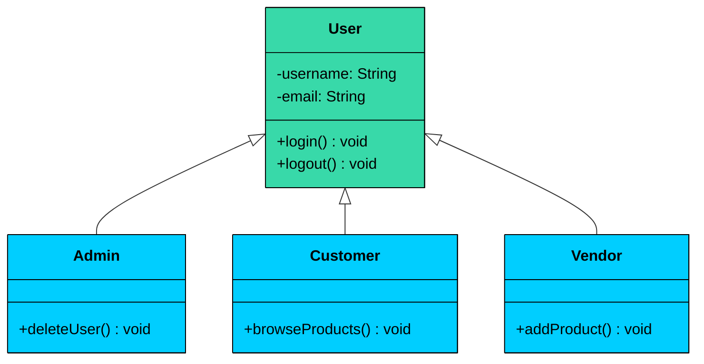
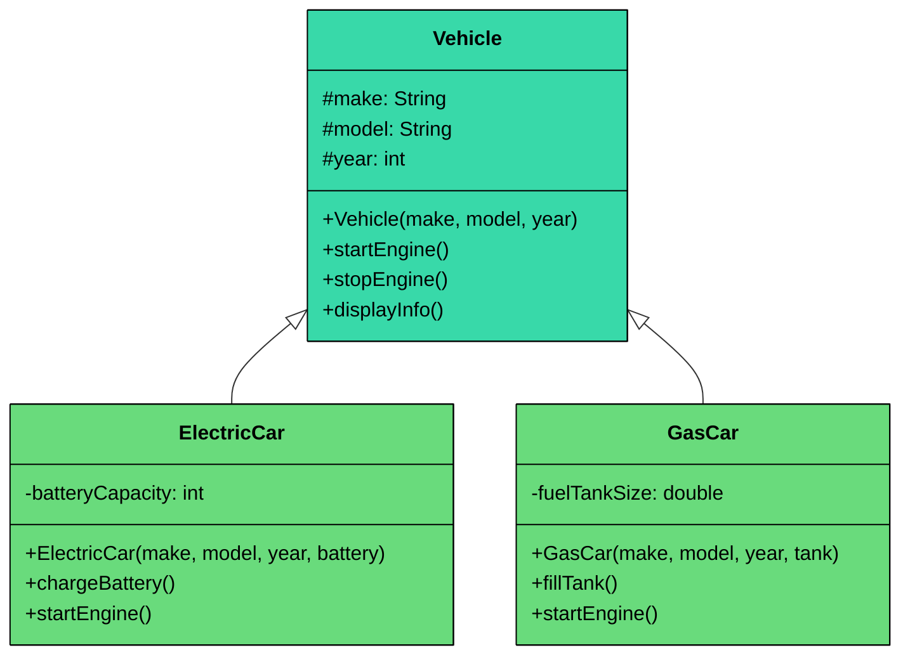
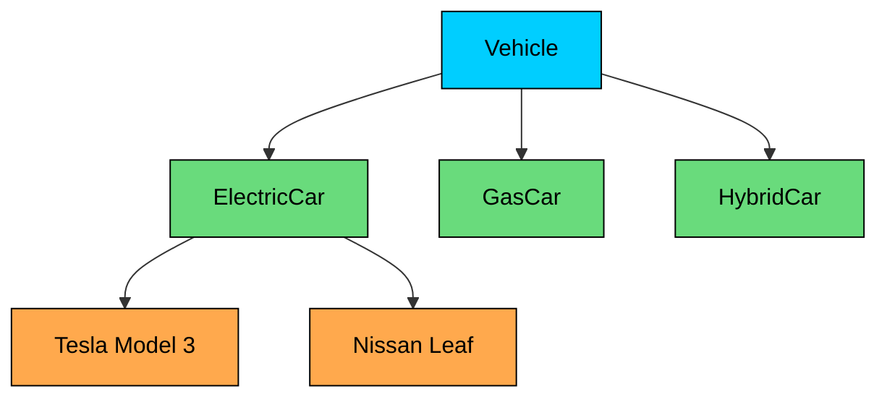

import React from 'react';
import CodeBlock from '../../../../components/ui/CodeBlock';
import Callout from '../../../../components/ui/Callout';

<div className="article-header">
  <div className="breadcrumb">
    <a href="/">Curated Notes</a>
    <span className="breadcrumb-separator">›</span>
    <span className="breadcrumb-current">Inheritance</span>
  </div>
  <h1>Inheritance</h1>
  <p style={{ color: 'var(--text-muted)', fontSize: '1.1rem', marginBottom: '16px', lineHeight: '1.6' }}>
    Master the essentials of Inheritance in this curated guide.
  </p>
  <div className="meta-info">
    <span className="meta-item">
      <svg width="14" height="14" viewBox="0 0 24 24" fill="none" stroke="currentColor" strokeWidth="2"><circle cx="12" cy="12" r="10"/><polyline points="12 6 12 12 16 14"/></svg>
      10 min read
    </span>
    <span className="difficulty-badge difficulty-badge--intermediate">Intermediate</span>
  </div>
</div>

<section className="content-section">

Inheritance allows one class (called the **subclass** or **child class**) to **inherit the properties and behaviors** of another class (called the **superclass** or **parent class**).

In simpler terms:

&gt; Inheritance enables 
&gt;
&gt; **code reuse**
&gt;
&gt;  by letting you define common logic once in a base class and then 
&gt;
&gt; **extend or specialize**
&gt;
&gt;  it in multiple derived classes.

This leads to cleaner, modular, and more maintainable software.

---


&gt; **Real-World Analogy**
&gt;
&gt; Think of a **User** system in a web application:
&gt;
&gt; 

&gt; 
&gt;
&gt; - The base `User` class holds common attributes like `username`, `email`, and methods like `login()` or `logout()`.
&gt; - Specialized roles like `Admin`, `Customer`, and `Vendor` inherit from `User` but add role-specific behavior.
&gt;
&gt; All specialized user types **inherit** common data and behaviors from the `User` class, but can **extend** functionality to suit their roles.


---

## 1. Why Inheritance Matters

Inheritance offers several benefits that make it a powerful design tool in OOP.

#### 1. **Code Reusability**

It embodies the **DRY (Don't Repeat Yourself)** principle. Common logic is written once in the parent class and shared across all subclasses reducing redundancy.

#### 2. **Logical Hierarchy**

It creates a clear and intuitive hierarchy that model real-world *“is-a”* relationships like `ElectricCar` *is a* `Car` or `Admin` *is a* `User`.

#### 3. **Ease of Maintenance**

If a bug is found or a change is needed in the shared logic, you only need to fix it in one place, the superclass. All subclasses automatically inherit the fix.

#### 4. Polymorphism

Inheritance is a prerequisite for polymorphism, allowing objects of different subclasses to be treated as objects of the superclass.

---

## 2. How Inheritance Works

When a class inherits from another:

- The subclass **inherits all non-private fields and methods** of the superclass.
- The subclass can **override** inherited methods to provide a different implementation.
- The subclass can also **extend** the superclass by adding new fields and methods.

This allows for both **reuse** and **customization**.

#### Example

The most basic form of inheritance is a child class that extends a parent class and adds new behavior on top of the inherited fields and methods. Here's the vehicle hierarchy built with inheritance.





```java
class Vehicle {
    protected String make;
    protected String model;
    protected int year;

    public Vehicle(String make, String model, int year) {
        this.make = make;
        this.model = model;
        this.year = year;
    }

    public void startEngine() {
        System.out.println("Engine started");
    }

    public void stopEngine() {
        System.out.println("Engine stopped");
    }

    public void displayInfo() {
        System.out.println(year + " " + make + " " + model);
    }
}
```

```python
class Vehicle:
    def __init__(self, make: str, model: str, year: int):
        self._make = make
        self._model = model
        self._year = year

    def start_engine(self):
        print("Engine started")

    def stop_engine(self):
        print("Engine stopped")

    def display_info(self):
        print(f"{self._year} {self._make} {self._model}")
```

```cpp
class Vehicle {
protected:
    std::string make;
    std::string model;
    int year;

public:
    Vehicle(const std::string& make, const std::string& model, int year)
        : make(make), model(model), year(year) {}

    void startEngine() {
        std::cout << "Engine started" << std::endl;
    }

    void stopEngine() {
        std::cout << "Engine stopped" << std::endl;
    }

    void displayInfo() {
        std::cout << year << " " << make << " " << model << std::endl;
    }
};
```

```go
type Vehicle struct {
	make  string
	model string
	year  int
}

func NewVehicle(make string, model string, year int) Vehicle {
	return Vehicle{make: make, model: model, year: year}
}

func (v Vehicle) StartEngine() {
	fmt.Println("Engine started")
}

func (v Vehicle) StopEngine() {
	fmt.Println("Engine stopped")
}

func (v Vehicle) DisplayInfo() {
	fmt.Println(strconv.Itoa(v.year) + " " + v.make + " " + v.model)
}
```

```csharp
public class Vehicle
{
    protected string Make;
    protected string Model;
    protected int Year;

    public Vehicle(string make, string model, int year)
    {
        Make = make;
        Model = model;
        Year = year;
    }

    public void StartEngine()
    {
        Console.WriteLine("Engine started");
    }

    public void StopEngine()
    {
        Console.WriteLine("Engine stopped");
    }

    public void DisplayInfo()
    {
        Console.WriteLine($"{Year} {Make} {Model}");
    }
}
```

```typescript
class Vehicle {
    protected make: string;
    protected model: string;
    protected year: number;

    constructor(make: string, model: string, year: number) {
        this.make = make;
        this.model = model;
        this.year = year;
    }

    startEngine(): void {
        console.log("Engine started");
    }

    stopEngine(): void {
        console.log("Engine stopped");
    }

    displayInfo(): void {
        console.log(`${this.year} ${this.make} ${this.model}`);
    }
}
```


This `Vehicle` class defines basic attributes and common behaviors shared by all cars.

Now you can create specialized types of vehicles:


```java
class ElectricCar extends Vehicle {
    private int batteryCapacity;

    public ElectricCar(String make, String model, int year, int batteryCapacity) {
        super(make, model, year);
        this.batteryCapacity = batteryCapacity;
    }

    public void chargeBattery() {
        System.out.println("Charging " + batteryCapacity + "kWh battery");
    }
}

class GasCar extends Vehicle {
    private double fuelTankSize;

    public GasCar(String make, String model, int year, double fuelTankSize) {
        super(make, model, year);
        this.fuelTankSize = fuelTankSize;
    }

    public void fillTank() {
        System.out.println("Filling " + fuelTankSize + "L fuel tank");
    }
}
```

```python
class ElectricCar(Vehicle):
    def __init__(self, make: str, model: str, year: int, battery_capacity: int):
        super().__init__(make, model, year)
        self._battery_capacity = battery_capacity

    def charge_battery(self):
        print(f"Charging {self._battery_capacity}kWh battery")

class GasCar(Vehicle):
    def __init__(self, make: str, model: str, year: int, fuel_tank_size: float):
        super().__init__(make, model, year)
        self._fuel_tank_size = fuel_tank_size

    def fill_tank(self):
        print(f"Filling {self._fuel_tank_size}L fuel tank")
```

```cpp
class ElectricCar : public Vehicle {
private:
    int batteryCapacity;

public:
    ElectricCar(const std::string& make, const std::string& model,
                int year, int batteryCapacity)
        : Vehicle(make, model, year), batteryCapacity(batteryCapacity) {}

    void chargeBattery() {
        std::cout << "Charging " << batteryCapacity << "kWh battery" << std::endl;
    }
};

class GasCar : public Vehicle {
private:
    double fuelTankSize;

public:
    GasCar(const std::string& make, const std::string& model,
           int year, double fuelTankSize)
        : Vehicle(make, model, year), fuelTankSize(fuelTankSize) {}

    void fillTank() {
        std::cout << "Filling " << fuelTankSize << "L fuel tank" << std::endl;
    }
};
```

```go
type ElectricCar struct {
	Vehicle
	batteryCapacity int
}

func NewElectricCar(make, model string, year, batteryCapacity int) *ElectricCar {
	return &ElectricCar{
		Vehicle:         NewVehicle(make, model, year),
		batteryCapacity: batteryCapacity,
	}
}

func (e *ElectricCar) chargeBattery() {
	fmt.Printf("Charging %dkWh battery\n", e.batteryCapacity)
}

type GasCar struct {
	Vehicle
	fuelTankSize float64
}

func NewGasCar(make, model string, year int, fuelTankSize float64) *GasCar {
	return &GasCar{
		Vehicle:       NewVehicle(make, model, year),
		fuelTankSize: fuelTankSize,
	}
}

func (g *GasCar) fillTank() {
	fmt.Printf("Filling %gL fuel tank\n", g.fuelTankSize)
}
```

```csharp
public class ElectricCar : Vehicle
{
    private int _batteryCapacity;

    public ElectricCar(string make, string model, int year, int batteryCapacity)
        : base(make, model, year)
    {
        _batteryCapacity = batteryCapacity;
    }

    public void ChargeBattery()
    {
        Console.WriteLine($"Charging {_batteryCapacity}kWh battery");
    }
}

public class GasCar : Vehicle
{
    private double _fuelTankSize;

    public GasCar(string make, string model, int year, double fuelTankSize)
        : base(make, model, year)
    {
        _fuelTankSize = fuelTankSize;
    }

    public void FillTank()
    {
        Console.WriteLine($"Filling {_fuelTankSize}L fuel tank");
    }
}
```

```typescript
class ElectricCar extends Vehicle {
    private batteryCapacity: number;

    constructor(make: string, model: string, year: number, batteryCapacity: number) {
        super(make, model, year);
        this.batteryCapacity = batteryCapacity;
    }

    chargeBattery(): void {
        console.log(`Charging ${this.batteryCapacity}kWh battery`);
    }
}

class GasCar extends Vehicle {
    private fuelTankSize: number;

    constructor(make: string, model: string, year: number, fuelTankSize: number) {
        super(make, model, year);
        this.fuelTankSize = fuelTankSize;
    }

    fillTank(): void {
        console.log(`Filling ${this.fuelTankSize}L fuel tank`);
    }
}
```


In this example:

- Both `ElectricCar` and `GasCar` **inherit** the `make`, `model`, `startEngine()`, and `stopEngine()` methods from the `Vehicle` class.
- Each subclass adds behavior specific to its type.
- This structure mirrors the real-world relationship: an electric car **is a** vehicle, and so is a gas car.

---

## 3. Types of Inheritance

Not all inheritance hierarchies look the same. There are several common patterns, each with its own structure and trade-offs.

**Single Inheritance** is the simplest form: one child class extends one parent class. The `ElectricCar extends Vehicle` relationship is single inheritance. This is the most common pattern and the one supported by all major languages.

**Multi-level Inheritance** is when a child class itself becomes a parent. For example, `Vehicle` -&gt; `Car` -&gt; `ElectricCar`. Each level adds more specialization. This is fine in moderation, but deep chains (5+ levels) become fragile and hard to understand.

**Hierarchical Inheritance** is when multiple child classes extend the same parent. Our vehicle example, where both `ElectricCar` and `GasCar` extend `Vehicle`, is hierarchical inheritance. This is extremely common and perfectly natural.





**Multiple Inheritance** is when a child class extends more than one parent. This is where things get complicated. Only C++ and Python support multiple inheritance directly. Java, C#, and TypeScript do not. The reason? The **diamond problem**.

Imagine `ElectricCar` extends both `Vehicle` and `Machine`. Both `Vehicle` and `Machine` have a `start()` method. When you call `electricCar.start()`, which version runs? The one from `Vehicle`? The one from `Machine`? Both?

C++ handles this with **virtual inheritance**, which is complex and error-prone. Python handles it with the **Method Resolution Order (MRO)**, a well-defined algorithm (C3 linearization) that determines which parent's method takes priority. Java and C# sidestep the problem entirely by only allowing single class inheritance, you can implement multiple interfaces, but extend only one class.

---

## 4. When to Use Inheritance

Inheritance is powerful, but it should be used intentionally, only when it truly models a real-world relationship. Getting this decision wrong early in your design leads to code that's hard to change, hard to test, and hard to reason about. 

Here's a practical checklist.

#### **Use inheritance when:**

- There is a clear "is-a" relationship** **(e.g., `Dog is an Animal`, `Car is a Vehicle`). If you can't say "X is a Y" naturally, inheritance is probably the wrong tool. These relationships belong in composition.
- The parent class defines common behavior or data that children should share. For example, all vehicles have a `startEngine()` method, so putting it in the parent avoids duplicating it across every vehicle type.
- The child class does not violate the behavior expected from the parent. If someone has a `Vehicle` reference pointing to an `ElectricCar`, every `Vehicle` method should still work as expected.
- You want to promote code reuse through shared logic and structure, and the hierarchy is shallow (2-3 levels at most).

#### **Avoid inheritance when:**

- The relationship is "has-a" or "uses-a" rather than "is-a". A `Car` has an `Engine`, it is not an `Engine`. A `Printer` uses a `Logger`, it is not a `Logger`.
- You want to combine behaviors from multiple sources dynamically. Inheritance locks you into a single parent at compile time, while composition lets you mix and match components freely.
- You need runtime flexibility to swap behaviors. With composition, you can inject different implementations (swap a `FileLogger` for a `ConsoleLogger`). With inheritance, the parent relationship is fixed.
- You want to avoid tight coupling between child and parent internals. Changes to a parent class ripple down to every child in the hierarchy, which is risky in large codebases.

When in doubt, start with [composition](/learn/lld/composition). You can always refactor toward inheritance later if a genuine "is-a" hierarchy emerges. Going the other direction, untangling a deep inheritance tree into composition, is much harder.

---

## 5. Practical Example: Notification System

Let's apply inheritance to a completely different domain to show that these patterns aren't limited to vehicles. Imagine you're building a notification system that can send messages through different channels: email, SMS, and push notifications.

All notification types share common properties: a `recipient`, a `message`, and a `timestamp`. They all need a `formatHeader()` method that produces a consistent header format. But the `send()` method works differently for each channel, email needs a subject line, SMS has a character limit, and push notifications have a device token and priority level.


```java
import java.time.LocalDateTime;
import java.time.format.DateTimeFormatter;

class Notification {
    protected String recipient;
    protected String message;
    protected String timestamp;

    public Notification(String recipient, String message) {
        this.recipient = recipient;
        this.message = message;
        this.timestamp = LocalDateTime.now()
            .format(DateTimeFormatter.ofPattern("yyyy-MM-dd HH:mm:ss"));
    }

    public String formatHeader() {
        return "[" + timestamp + "] To: " + recipient;
    }

    public void send() {
        System.out.println(formatHeader());
        System.out.println("Message: " + message);
    }
}

class EmailNotification extends Notification {
    private String subject;

    public EmailNotification(String recipient, String message, String subject) {
        super(recipient, message);
        this.subject = subject;
    }

    @Override
    public void send() {
        System.out.println(formatHeader());
        System.out.println("Subject: " + subject);
        System.out.println("Body: " + message);
        System.out.println("Status: Email delivered");
    }
}

class SMSNotification extends Notification {
    private String phoneNumber;
    private static final int MAX_LENGTH = 160;

    public SMSNotification(String recipient, String message, String phoneNumber) {
        super(recipient, message);
        this.phoneNumber = phoneNumber;
    }

    @Override
    public void send() {
        System.out.println(formatHeader());
        System.out.println("Phone: " + phoneNumber);
        String smsBody = message.length() > MAX_LENGTH
            ? message.substring(0, MAX_LENGTH - 3) + "..."
            : message;
        System.out.println("SMS: " + smsBody);
        System.out.println("Status: SMS sent (" + smsBody.length() + "/" + MAX_LENGTH + " chars)");
    }
}

class PushNotification extends Notification {
    private String deviceToken;
    private String priority;

    public PushNotification(String recipient, String message,
                            String deviceToken, String priority) {
        super(recipient, message);
        this.deviceToken = deviceToken;
        this.priority = priority;
    }

    @Override
    public void send() {
        System.out.println(formatHeader());
        System.out.println("Device: " + deviceToken.substring(0, 8) + "...");
        System.out.println("Priority: " + priority);
        System.out.println("Alert: " + message);
        System.out.println("Status: Push notification delivered");
    }
}

public class Main {
    public static void main(String[] args) {
        EmailNotification email = new EmailNotification(
            "alice@example.com", "Your order has been shipped!", "Order Update");
        email.send();

        System.out.println();

        SMSNotification sms = new SMSNotification(
            "Bob", "Your verification code is 482910.", "+1-555-0123");
        sms.send();

        System.out.println();

        PushNotification push = new PushNotification(
            "Charlie", "New message from Alice",
            "d8a3f4b2c1e5a9b7", "high");
        push.send();
    }
}
```

```python
from datetime import datetime

class Notification:
    def __init__(self, recipient: str, message: str):
        self._recipient = recipient
        self._message = message
        self._timestamp = datetime.now().strftime("%Y-%m-%d %H:%M:%S")

    def format_header(self) -> str:
        return f"[{self._timestamp}] To: {self._recipient}"

    def send(self):
        print(self.format_header())
        print(f"Message: {self._message}")

class EmailNotification(Notification):
    def __init__(self, recipient: str, message: str, subject: str):
        super().__init__(recipient, message)
        self._subject = subject

    def send(self):
        print(self.format_header())
        print(f"Subject: {self._subject}")
        print(f"Body: {self._message}")
        print("Status: Email delivered")

class SMSNotification(Notification):
    MAX_LENGTH = 160

    def __init__(self, recipient: str, message: str, phone_number: str):
        super().__init__(recipient, message)
        self._phone_number = phone_number

    def send(self):
        print(self.format_header())
        print(f"Phone: {self._phone_number}")
        sms_body = (self._message[:self.MAX_LENGTH - 3] + "..."
                    if len(self._message) > self.MAX_LENGTH
                    else self._message)
        print(f"SMS: {sms_body}")
        print(f"Status: SMS sent ({len(sms_body)}/{self.MAX_LENGTH} chars)")

class PushNotification(Notification):
    def __init__(self, recipient: str, message: str,
                 device_token: str, priority: str):
        super().__init__(recipient, message)
        self._device_token = device_token
        self._priority = priority

    def send(self):
        print(self.format_header())
        print(f"Device: {self._device_token[:8]}...")
        print(f"Priority: {self._priority}")
        print(f"Alert: {self._message}")
        print("Status: Push notification delivered")

if __name__ == "__main__":
    email = EmailNotification(
        "alice@example.com", "Your order has been shipped!", "Order Update")
    email.send()

    print()

    sms = SMSNotification(
        "Bob", "Your verification code is 482910.", "+1-555-0123")
    sms.send()

    print()

    push = PushNotification(
        "Charlie", "New message from Alice", "d8a3f4b2c1e5a9b7", "high")
    push.send()
```

```cpp
#include <iostream>
#include <string>
#include <ctime>

using namespace std;

class Notification {
protected:
    string recipient;
    string message;
    string timestamp;

public:
    Notification(const string& recipient, const string& message)
        : recipient(recipient), message(message) {
        time_t now = time(nullptr);
        char buf[20];
        strftime(buf, sizeof(buf), "%Y-%m-%d %H:%M:%S", localtime(&now));
        timestamp = buf;
    }

    virtual ~Notification() {}

    string formatHeader() {
        return "[" + timestamp + "] To: " + recipient;
    }

    virtual void send() {
        cout << formatHeader() << endl;
        cout << "Message: " << message << endl;
    }
};

class EmailNotification : public Notification {
private:
    string subject;

public:
    EmailNotification(const string& recipient, const string& message,
                      const string& subject)
        : Notification(recipient, message), subject(subject) {}

    void send() override {
        cout << formatHeader() << endl;
        cout << "Subject: " << subject << endl;
        cout << "Body: " << message << endl;
        cout << "Status: Email delivered" << endl;
    }
};

class SMSNotification : public Notification {
private:
    string phoneNumber;
    static const int MAX_LENGTH = 160;

public:
    SMSNotification(const string& recipient, const string& message,
                    const string& phoneNumber)
        : Notification(recipient, message), phoneNumber(phoneNumber) {}

    void send() override {
        cout << formatHeader() << endl;
        cout << "Phone: " << phoneNumber << endl;
        string smsBody = message.length() > MAX_LENGTH
            ? message.substr(0, MAX_LENGTH - 3) + "..."
            : message;
        cout << "SMS: " << smsBody << endl;
        cout << "Status: SMS sent (" << smsBody.length()
                  << "/" << MAX_LENGTH << " chars)" << endl;
    }
};

class PushNotification : public Notification {
private:
    string deviceToken;
    string priority;

public:
    PushNotification(const string& recipient, const string& message,
                     const string& deviceToken, const string& priority)
        : Notification(recipient, message), deviceToken(deviceToken),
          priority(priority) {}

    void send() override {
        cout << formatHeader() << endl;
        cout << "Device: " << deviceToken.substr(0, 8) << "..." << endl;
        cout << "Priority: " << priority << endl;
        cout << "Alert: " << message << endl;
        cout << "Status: Push notification delivered" << endl;
    }
};

int main() {
    EmailNotification email("alice@example.com",
        "Your order has been shipped!", "Order Update");
    email.send();

    cout << endl;

    SMSNotification sms("Bob", "Your verification code is 482910.", "+1-555-0123");
    sms.send();

    cout << endl;

    PushNotification push("Charlie", "New message from Alice",
        "d8a3f4b2c1e5a9b7", "high");
    push.send();

    return 0;
}
```

```csharp
using System;

public class Notification
{
    protected string Recipient;
    protected string Message;
    protected string Timestamp;

    public Notification(string recipient, string message)
    {
        Recipient = recipient;
        Message = message;
        Timestamp = DateTime.Now.ToString("yyyy-MM-dd HH:mm:ss");
    }

    public string FormatHeader()
    {
        return $"[{Timestamp}] To: {Recipient}";
    }

    public virtual void Send()
    {
        Console.WriteLine(FormatHeader());
        Console.WriteLine($"Message: {Message}");
    }
}

public class EmailNotification : Notification
{
    private string _subject;

    public EmailNotification(string recipient, string message, string subject)
        : base(recipient, message)
    {
        _subject = subject;
    }

    public override void Send()
    {
        Console.WriteLine(FormatHeader());
        Console.WriteLine($"Subject: {_subject}");
        Console.WriteLine($"Body: {Message}");
        Console.WriteLine("Status: Email delivered");
    }
}

public class SMSNotification : Notification
{
    private string _phoneNumber;
    private const int MaxLength = 160;

    public SMSNotification(string recipient, string message, string phoneNumber)
        : base(recipient, message)
    {
        _phoneNumber = phoneNumber;
    }

    public override void Send()
    {
        Console.WriteLine(FormatHeader());
        Console.WriteLine($"Phone: {_phoneNumber}");
        string smsBody = Message.Length > MaxLength
            ? Message.Substring(0, MaxLength - 3) + "..."
            : Message;
        Console.WriteLine($"SMS: {smsBody}");
        Console.WriteLine($"Status: SMS sent ({smsBody.Length}/{MaxLength} chars)");
    }
}

public class PushNotification : Notification
{
    private string _deviceToken;
    private string _priority;

    public PushNotification(string recipient, string message,
                            string deviceToken, string priority)
        : base(recipient, message)
    {
        _deviceToken = deviceToken;
        _priority = priority;
    }

    public override void Send()
    {
        Console.WriteLine(FormatHeader());
        Console.WriteLine($"Device: {_deviceToken.Substring(0, 8)}...");
        Console.WriteLine($"Priority: {_priority}");
        Console.WriteLine($"Alert: {Message}");
        Console.WriteLine("Status: Push notification delivered");
    }
}

public class Program
{
    public static void Main(string[] args)
    {
        var email = new EmailNotification(
            "alice@example.com", "Your order has been shipped!", "Order Update");
        email.Send();

        Console.WriteLine();

        var sms = new SMSNotification(
            "Bob", "Your verification code is 482910.", "+1-555-0123");
        sms.Send();

        Console.WriteLine();

        var push = new PushNotification(
            "Charlie", "New message from Alice", "d8a3f4b2c1e5a9b7", "high");
        push.Send();
    }
}
```

```go
package main

import (
    "fmt"
    "time"
)

// Go achieves this pattern through struct embedding + interfaces.
// The base struct provides shared fields and methods.
// Each concrete type embeds it and provides its own Send().

type Notification struct {
    Recipient string
    Message   string
    Timestamp string
}

func NewNotification(recipient, message string) Notification {
    return Notification{
        Recipient: recipient,
        Message:   message,
        Timestamp: time.Now().Format("2006-01-02 15:04:05"),
    }
}

func (n *Notification) FormatHeader() string {
    return fmt.Sprintf("[%s] To: %s", n.Timestamp, n.Recipient)
}

// EmailNotification embeds Notification
type EmailNotification struct {
    Notification
    Subject string
}

func (e *EmailNotification) Send() {
    fmt.Println(e.FormatHeader())
    fmt.Printf("Subject: %s\n", e.Subject)
    fmt.Printf("Body: %s\n", e.Message)
    fmt.Println("Status: Email delivered")
}

// SMSNotification embeds Notification
type SMSNotification struct {
    Notification
    PhoneNumber string
}

func (s *SMSNotification) Send() {
    fmt.Println(s.FormatHeader())
    fmt.Printf("Phone: %s\n", s.PhoneNumber)
    smsBody := s.Message
    if len(smsBody) > 160 {
        smsBody = smsBody[:157] + "..."
    }
    fmt.Printf("SMS: %s\n", smsBody)
    fmt.Printf("Status: SMS sent (%d/160 chars)\n", len(smsBody))
}

// PushNotification embeds Notification
type PushNotification struct {
    Notification
    DeviceToken string
    Priority    string
}

func (p *PushNotification) Send() {
    fmt.Println(p.FormatHeader())
    fmt.Printf("Device: %s...\n", p.DeviceToken[:8])
    fmt.Printf("Priority: %s\n", p.Priority)
    fmt.Printf("Alert: %s\n", p.Message)
    fmt.Println("Status: Push notification delivered")
}

func main() {
    email := &EmailNotification{
        Notification: NewNotification("alice@example.com", "Your order has been shipped!"),
        Subject:      "Order Update",
    }
    email.Send()

    fmt.Println()

    sms := &SMSNotification{
        Notification: NewNotification("Bob", "Your verification code is 482910."),
        PhoneNumber:  "+1-555-0123",
    }
    sms.Send()

    fmt.Println()

    push := &PushNotification{
        Notification: NewNotification("Charlie", "New message from Alice"),
        DeviceToken:  "d8a3f4b2c1e5a9b7",
        Priority:     "high",
    }
    push.Send()
}
```

```typescript
class Notification {
    protected recipient: string;
    protected message: string;
    protected timestamp: string;

    constructor(recipient: string, message: string) {
        this.recipient = recipient;
        this.message = message;
        this.timestamp = new Date().toISOString().replace("T", " ").substring(0, 19);
    }

    formatHeader(): string {
        return `[${this.timestamp}] To: ${this.recipient}`;
    }

    send(): void {
        console.log(this.formatHeader());
        console.log(`Message: ${this.message}`);
    }
}

class EmailNotification extends Notification {
    private subject: string;

    constructor(recipient: string, message: string, subject: string) {
        super(recipient, message);
        this.subject = subject;
    }

    send(): void {
        console.log(this.formatHeader());
        console.log(`Subject: ${this.subject}`);
        console.log(`Body: ${this.message}`);
        console.log("Status: Email delivered");
    }
}

class SMSNotification extends Notification {
    private phoneNumber: string;
    private static readonly MAX_LENGTH = 160;

    constructor(recipient: string, message: string, phoneNumber: string) {
        super(recipient, message);
        this.phoneNumber = phoneNumber;
    }

    send(): void {
        console.log(this.formatHeader());
        console.log(`Phone: ${this.phoneNumber}`);
        const smsBody = this.message.length > SMSNotification.MAX_LENGTH
            ? this.message.substring(0, SMSNotification.MAX_LENGTH - 3) + "..."
            : this.message;
        console.log(`SMS: ${smsBody}`);
        console.log(`Status: SMS sent (${smsBody.length}/${SMSNotification.MAX_LENGTH} chars)`);
    }
}

class PushNotification extends Notification {
    private deviceToken: string;
    private priority: string;

    constructor(recipient: string, message: string,
                deviceToken: string, priority: string) {
        super(recipient, message);
        this.deviceToken = deviceToken;
        this.priority = priority;
    }

    send(): void {
        console.log(this.formatHeader());
        console.log(`Device: ${this.deviceToken.substring(0, 8)}...`);
        console.log(`Priority: ${this.priority}`);
        console.log(`Alert: ${this.message}`);
        console.log("Status: Push notification delivered");
    }
}

// Usage
const email = new EmailNotification(
    "alice@example.com", "Your order has been shipped!", "Order Update");
email.send();

console.log();

const sms = new SMSNotification(
    "Bob", "Your verification code is 482910.", "+1-555-0123");
sms.send();

console.log();

const push = new PushNotification(
    "Charlie", "New message from Alice", "d8a3f4b2c1e5a9b7", "high");
push.send();
```


#### Why This Design Works

- **Shared logic is written once.** The `recipient`, `message`, and `timestamp` fields are defined in `Notification`. The `formatHeader()` method is inherited by all three notification types, producing a consistent header format across email, SMS, and push. If you want to change the timestamp format, you change one method.
- **Each child encapsulates channel-specific complexity.** `SMSNotification` handles the 160-character limit. `PushNotification` manages device tokens and priority. `EmailNotification` adds a subject line. None of these details leak into the parent or into each other.
- **Adding a new channel is simple.** Need Slack notifications? Create `SlackNotification extends Notification`, add a `webhookUrl` field, override `send()`. No existing code changes.

</section>
