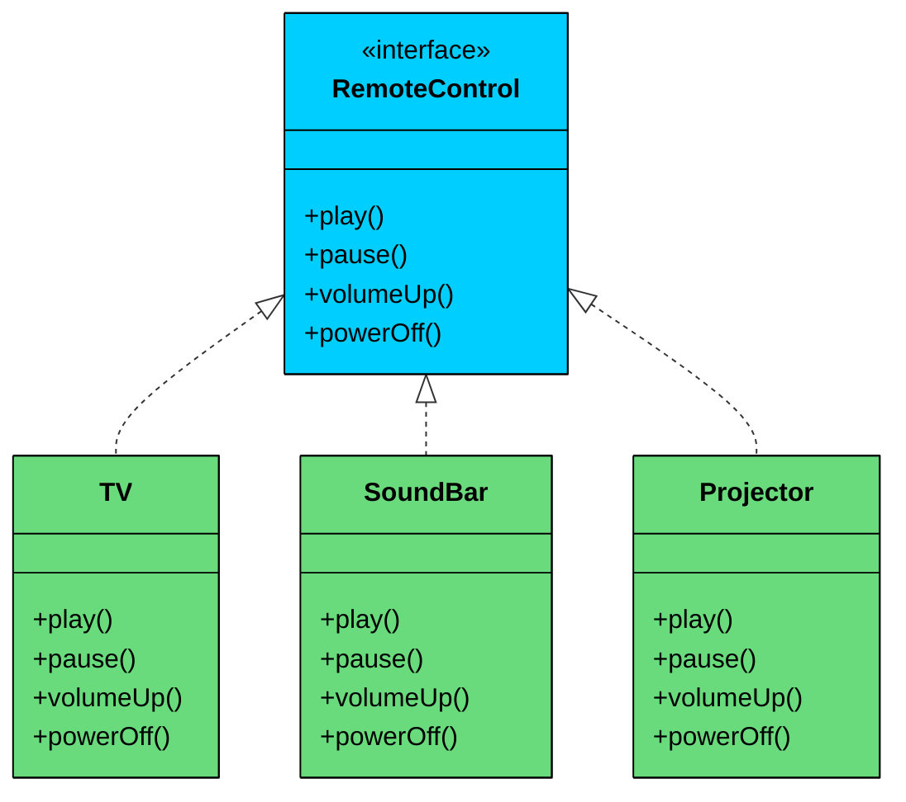
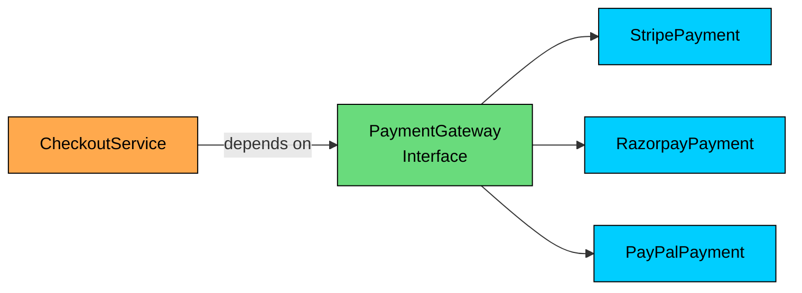
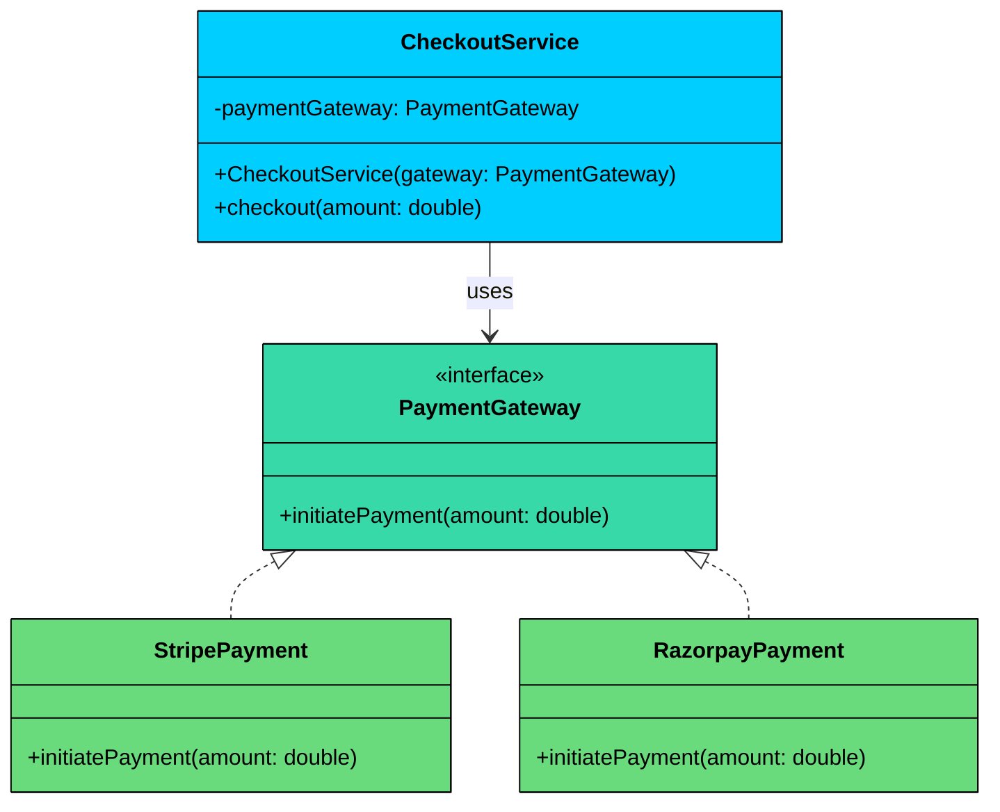
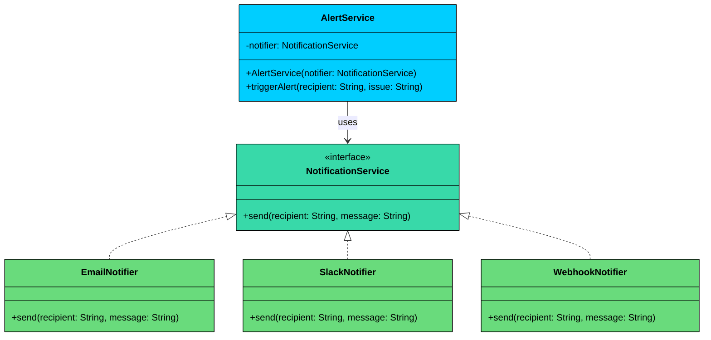

import React from 'react';
import CodeBlock from '../../../../components/ui/CodeBlock';
import Callout from '../../../../components/ui/Callout';

<div className="article-header">
  <div className="breadcrumb">
    <a href="/">Curated Notes</a>
    <span className="breadcrumb-separator">›</span>
    <span className="breadcrumb-current">Interfaces</span>
  </div>
  <h1>Interfaces</h1>
  <p style={{ color: 'var(--text-muted)', fontSize: '1.1rem', marginBottom: '16px', lineHeight: '1.6' }}>
    Master the essentials of Interfaces in this curated guide.
  </p>
  <div className="meta-info">
    <span className="meta-item">
      <svg width="14" height="14" viewBox="0 0 24 24" fill="none" stroke="currentColor" strokeWidth="2"><circle cx="12" cy="12" r="10"/><polyline points="12 6 12 12 16 14"/></svg>
      10 min read
    </span>
    <span className="difficulty-badge difficulty-badge--intermediate">Intermediate</span>
  </div>
</div>

<section className="content-section">

In object-oriented design, **interfaces** play a foundational role in building systems that are **extensible**, **testable**, and **loosely coupled**.

They define **what** a component should do, not **how** it should do it.

This separation of definition and implementation allows different parts of your system to work together through **well-defined contracts**, without needing to know each other’s internal details.

---

## 1. What is an Interface?

At its core, an **interface** is a **contract:** a list of methods that any implementing class *must* provide. It specifies a set of behaviors that a class agrees to implement but leaves the *details* of those behaviors up to each implementation.

In other words:

&gt; **An interface defines the "what", while classes provide the "how".**


&gt; **Real-World Analogy**
&gt;
&gt; Consider a remote control. It exposes a standard set of buttons:
&gt;
&gt; - `play()`
&gt; - `pause()`
&gt; - `volumeUp()`
&gt; - `powerOff()`
&gt;
&gt; The person using the remote doesn’t care if it controls a TV, a soundbar, or a projector, they all understand the same set of commands.
&gt;
&gt; 

&gt; 
&gt;
&gt; The **remote** is the **interface**. The **devices** (TV, soundbar, projector) are the **implementations**.
&gt;
&gt; Each device behaves differently when you press `play()`, but the *contract* remains consistent.


---

## 2. Key Properties of Interfaces

Interfaces are more than just method declarations, they are the **foundation of flexible software design**.

Here are their most important characteristics:

#### a) Defines Behavior Without Dictating Implementation

An interface only declares *what* operations are expected. It doesn’t define *how* they are carried out.

This gives freedom to implementers to provide their own version of the logic, while still honoring the same contract.

#### b) Enables Polymorphism

Different classes can implement the same interface in different ways. This allows your code to work with multiple implementations **interchangeably**.

#### c) Promotes Decoupling

Code that depends on interfaces is insulated from changes in the concrete classes that implement them.

This makes your code easier to:

- Extend (add new implementations without modifying existing ones),
- Test (mock interfaces in unit tests),
- Maintain (fewer ripple effects from code changes).

#### Example:





As long as all payment providers implement the `PaymentGateway` interface, the `CheckoutService` can use any of them without changing its own code.

---

## 3. Code Example: Payment Gateway Interface

Let’s say you’re designing a payment processing module that supports multiple providers like **Stripe**, **Razorpay**, and **PayPal**.

You don’t want your business logic to depend on a specific provider. You just want a common way to initiate a payment.

#### Defining an Interface

Here's the `PaymentGateway` interface that defines a single operation: initiate a payment with a given amount.


```java
public interface PaymentGateway {
    void initiatePayment(double amount);
}
```

```python
from abc import ABC, abstractmethod

class PaymentGateway(ABC):
    @abstractmethod
    def initiate_payment(self, amount):
        pass
```

```cpp
class PaymentGateway {
public:
    virtual ~PaymentGateway() {}  // Virtual destructor for proper cleanup
    virtual void initiatePayment(double amount) = 0;  // Pure virtual function
};
```

```go
type PaymentGateway interface {
	initiatePayment(amount float64)
}
```

```csharp
public interface IPaymentGateway
{
    void InitiatePayment(double amount);
}
```

```typescript
interface PaymentGateway {
    initiatePayment(amount: number): void;
}
```


This interface defines the **contract**. Every payment gateway must provide a `initiatePayment()` method. But it doesn’t specify how each provider processes payments.

#### Implementing an Interface

Now let's create two classes that fulfill this contract: one for Stripe and one for Razorpay. Each processes payments differently, but both satisfy the `PaymentGateway` interface.





```java
public class StripePayment implements PaymentGateway {
    public void initiatePayment(double amount) {
        System.out.println("Processing payment via Stripe: $" + amount);
    }
}

public class RazorpayPayment implements PaymentGateway {
    public void initiatePayment(double amount) {
        System.out.println("Processing payment via Razorpay: ₹" + amount);
    }
}
```

```python
class StripePayment(PaymentGateway):
    def initiate_payment(self, amount):
        print(f"Processing payment via Stripe: ${amount}")

class RazorpayPayment(PaymentGateway):
    def initiate_payment(self, amount):
        print(f"Processing payment via Razorpay: ₹{amount}")
```

```cpp
class StripePayment : public PaymentGateway {
public:
    void initiatePayment(double amount) override {
        cout << "Processing payment via Stripe: $" << amount << endl;
    }
};

class RazorpayPayment : public PaymentGateway {
public:
    void initiatePayment(double amount) override {
        cout << "Processing payment via Razorpay: ₹" << amount << endl;
    }
};
```

```go
type StripePayment struct{}

func (s StripePayment) InitiatePayment(amount float64) {
	fmt.Println("Processing payment via Stripe: $" + fmt.Sprint(amount))
}

type RazorpayPayment struct{}

func (r RazorpayPayment) InitiatePayment(amount float64) {
	fmt.Println("Processing payment via Razorpay: ₹" + fmt.Sprint(amount))
}
```

```csharp
public class StripePayment : IPaymentGateway
{
    public void InitiatePayment(double amount)
    {
        Console.WriteLine($"Processing payment via Stripe: ${amount}");
    }
}

public class RazorpayPayment : IPaymentGateway
{
    public void InitiatePayment(double amount)
    {
        Console.WriteLine($"Processing payment via Razorpay: ₹{amount}");
    }
}
```

```typescript
class StripePayment implements PaymentGateway {
    initiatePayment(amount: number): void {
        console.log(`Processing payment via Stripe: $${amount}`);
    }
}

class RazorpayPayment implements PaymentGateway {
    initiatePayment(amount: number): void {
        console.log(`Processing payment via Razorpay: ₹${amount}`);
    }
}
```


Both classes implement the same interface, but their internal logic is completely different. `StripePayment` talks to the Stripe API, `RazorpayPayment` talks to Razorpay. The interface guarantees that both provide the `initiatePayment()` method, so any code that depends on `PaymentGateway` can work with either one.

#### Programming to the Interface

Here's where the real payoff happens. Instead of having `CheckoutService` depend on `StripePayment` or `RazorpayPayment`, it depends on the `PaymentGateway` interface. It doesn't know or care which implementation it's using.


```java
public class CheckoutService {
    private PaymentGateway paymentGateway;

    public CheckoutService(PaymentGateway paymentGateway) {
        this.paymentGateway = paymentGateway;
    }

    public void setPaymentGateway(PaymentGateway paymentGateway) {
        this.paymentGateway = paymentGateway;
    }

    public void checkout(double amount) {
        paymentGateway.initiatePayment(amount);
    }
}
```

```python
class CheckoutService:
    def __init__(self, payment_gateway):
        self.payment_gateway = payment_gateway
    
    def set_payment_gateway(self, payment_gateway):
        self.payment_gateway = payment_gateway
    
    def checkout(self, amount):
        self.payment_gateway.initiate_payment(amount)
```

```cpp
class CheckoutService {
private:
    PaymentGateway* paymentGateway;

public:
    CheckoutService(PaymentGateway* gateway) : paymentGateway(gateway) {}
    
    void setPaymentGateway(PaymentGateway* gateway) {
        paymentGateway = gateway;
    }
    
    void checkout(double amount) {
        if (paymentGateway != nullptr) {
            paymentGateway->initiatePayment(amount);
        }
    }
};
```

```go
type CheckoutService struct {
	paymentGateway PaymentGateway
}

func NewCheckoutService(paymentGateway PaymentGateway) *CheckoutService {
	return &CheckoutService{paymentGateway: paymentGateway}
}

func (s *CheckoutService) SetPaymentGateway(paymentGateway PaymentGateway) {
	s.paymentGateway = paymentGateway
}

func (s *CheckoutService) Checkout(amount float64) {
	s.paymentGateway.InitiatePayment(amount)
}
```

```csharp
public class CheckoutService
{
    private IPaymentGateway paymentGateway;

    public CheckoutService(IPaymentGateway paymentGateway)
    {
        this.paymentGateway = paymentGateway;
    }

    public void SetPaymentGateway(IPaymentGateway paymentGateway)
    {
        this.paymentGateway = paymentGateway;
    }

    public void Checkout(double amount)
    {
        paymentGateway.InitiatePayment(amount);
    }
}
```

```typescript
class CheckoutService {
    private paymentGateway: PaymentGateway;

    constructor(paymentGateway: PaymentGateway) {
        this.paymentGateway = paymentGateway;
    }

    setPaymentGateway(paymentGateway: PaymentGateway): void {
        this.paymentGateway = paymentGateway;
    }

    checkout(amount: number): void {
        this.paymentGateway.initiatePayment(amount);
    }
}
```


Look at the `CheckoutService` constructor. It takes a `PaymentGateway`, not a `StripePayment`. This single decision is what decouples the service from any specific provider. 

The `checkout()` method calls `initiatePayment()` on whatever gateway was injected. It could be Stripe, Razorpay, a mock for testing, or a provider that doesn't even exist yet.

This pattern is called **dependency injection**: instead of creating its own dependencies, the class receives them from the outside. And it only works because the dependency is typed as an interface, not a concrete class.

#### Runtime Flexibility

The final piece is wiring everything together. At runtime, you choose which implementation to inject, and you can even swap it out on the fly.


```java
public class Main {
    public static void main(String[] args) {
        PaymentGateway stripeGateway = new StripePayment();
        CheckoutService service = new CheckoutService(stripeGateway);
        service.checkout(120.50);  // Output: Processing payment via Stripe: $120.5

       // Switch to Razorpay
        PaymentGateway razorpayGateway = new RazorpayPayment();
        service.setPaymentGateway(razorpayGateway);
        service.checkout(150.50);  // Output: Processing payment via Razorpay: ₹150.5        
    }
}
```

```python
if __name__ == "__main__":
    stripe_gateway = StripePayment()
    checkout_service = CheckoutService(stripe_gateway)
    checkout_service.checkout(120.50)  # Output: Processing payment via Stripe: $120.5
    
    # Switch to Razorpay
    razorpay_gateway = RazorpayPayment()
    checkout_service.set_payment_gateway(razorpay_gateway)
    checkout_service.checkout(150.50)  # Output: Processing payment via Razorpay: ₹150.5
```

```cpp
int main() {
    StripePayment stripeGateway;
    CheckoutService service(&stripeGateway);
    service.checkout(120.50);  // Output: Processing payment via Stripe: $120.5
    
    // Switch to Razorpay
    RazorpayPayment razorpayGateway;
    service.setPaymentGateway(&razorpayGateway);
    service.checkout(150.50);  // Output: Processing payment via Razorpay: ₹150.5
  
    return 0;
}
```

```go
func main() {
	stripeGateway := &StripePayment{}
	service := NewCheckoutService(stripeGateway)
	service.Checkout(120.50) // Output: Processing payment via Stripe: $120.5

	// Switch to Razorpay
	razorpayGateway := &RazorpayPayment{}
	service.SetPaymentGateway(razorpayGateway)
	service.Checkout(150.50) // Output: Processing payment via Razorpay: ₹150.5
}
```

```csharp
public class Program
{
    public static void Main(string[] args)
    {
        IPaymentGateway stripeGateway = new StripePayment();
        CheckoutService service = new CheckoutService(stripeGateway);
        service.Checkout(120.50);  // Output: Processing payment via Stripe: $120.5

        // Switch to Razorpay
        IPaymentGateway razorpayGateway = new RazorpayPayment();
        service.SetPaymentGateway(razorpayGateway);
        service.Checkout(150.50);  // Output: Processing payment via Razorpay: ₹150.5
    }
}
```

```typescript
function main(): void {
    const stripeGateway: PaymentGateway = new StripePayment();
    const service = new CheckoutService(stripeGateway);
    service.checkout(120.50);  // Output: Processing payment via Stripe: $120.5

    // Switch to Razorpay
    const razorpayGateway: PaymentGateway = new RazorpayPayment();
    service.setPaymentGateway(razorpayGateway);
    service.checkout(150.50);  // Output: Processing payment via Razorpay: ₹150.5
}

main();
```


#### **Output:**


```plaintext
Processing payment via Stripe: $120.5
Processing payment via Razorpay: ₹150.5
```


The `CheckoutService` didn't change between the two calls. The only thing that changed was which implementation was plugged in. That's the power of programming to interfaces: the calling code is completely insulated from implementation details.

---

## 4. Practical Example: Notification Service

Let's apply interfaces to a different domain. Imagine you're building an alerting system for a DevOps platform. When something goes wrong (server down, high CPU, disk full), the system needs to send notifications. Some teams prefer email, others use Slack, and some have custom webhook integrations. 

The alerting service shouldn't know or care which channel is being used. It just sends the notification through whatever channel was configured.

Here's the class diagram for this design:





The pattern is identical to the payment gateway example: one interface, multiple implementations, and a service that depends only on the interface. Let's see the full working code.


```java
interface NotificationService {
    void send(String recipient, String message);
}

class EmailNotifier implements NotificationService {
    public void send(String recipient, String message) {
        System.out.println("[Email] To: " + recipient + " | " + message);
    }
}

class SlackNotifier implements NotificationService {
    public void send(String recipient, String message) {
        System.out.println("[Slack] Channel: " + recipient + " | " + message);
    }
}

class WebhookNotifier implements NotificationService {
    public void send(String recipient, String message) {
        System.out.println("[Webhook] URL: " + recipient + " | " + message);
    }
}

class AlertService {
    private NotificationService notifier;

    public AlertService(NotificationService notifier) {
        this.notifier = notifier;
    }

    public void triggerAlert(String recipient, String issue) {
        String alertMessage = "ALERT: " + issue;
        notifier.send(recipient, alertMessage);
    }
}

// Usage
public class Main {
    public static void main(String[] args) {
        AlertService emailAlerts = new AlertService(new EmailNotifier());
        emailAlerts.triggerAlert("ops@company.com", "CPU usage at 95%");

        AlertService slackAlerts = new AlertService(new SlackNotifier());
        slackAlerts.triggerAlert("#incidents", "Database connection pool exhausted");

        AlertService webhookAlerts = new AlertService(new WebhookNotifier());
        webhookAlerts.triggerAlert("https://hooks.example.com/alerts", "Disk usage at 90%");
    }
}
```

```python
from abc import ABC, abstractmethod

class NotificationService(ABC):
    @abstractmethod
    def send(self, recipient: str, message: str) -> None:
        pass

class EmailNotifier(NotificationService):
    def send(self, recipient: str, message: str) -> None:
        print(f"[Email] To: {recipient} | {message}")

class SlackNotifier(NotificationService):
    def send(self, recipient: str, message: str) -> None:
        print(f"[Slack] Channel: {recipient} | {message}")

class WebhookNotifier(NotificationService):
    def send(self, recipient: str, message: str) -> None:
        print(f"[Webhook] URL: {recipient} | {message}")

class AlertService:
    def __init__(self, notifier: NotificationService):
        self._notifier = notifier

    def trigger_alert(self, recipient: str, issue: str) -> None:
        alert_message = f"ALERT: {issue}"
        self._notifier.send(recipient, alert_message)

if __name__ == "__main__":
    email_alerts = AlertService(EmailNotifier())
    email_alerts.trigger_alert("ops@company.com", "CPU usage at 95%")

    slack_alerts = AlertService(SlackNotifier())
    slack_alerts.trigger_alert("#incidents", "Database connection pool exhausted")

    webhook_alerts = AlertService(WebhookNotifier())
    webhook_alerts.trigger_alert("https://hooks.example.com/alerts", "Disk usage at 90%")
```

```cpp
#include <iostream>
#include <string>

class NotificationService {
public:
    virtual ~NotificationService() {}
    virtual void send(const std::string& recipient, const std::string& message) = 0;
};

class EmailNotifier : public NotificationService {
public:
    void send(const std::string& recipient, const std::string& message) override {
        std::cout << "[Email] To: " << recipient << " | " << message << std::endl;
    }
};

class SlackNotifier : public NotificationService {
public:
    void send(const std::string& recipient, const std::string& message) override {
        std::cout << "[Slack] Channel: " << recipient << " | " << message << std::endl;
    }
};

class WebhookNotifier : public NotificationService {
public:
    void send(const std::string& recipient, const std::string& message) override {
        std::cout << "[Webhook] URL: " << recipient << " | " << message << std::endl;
    }
};

class AlertService {
private:
    NotificationService* notifier;

public:
    AlertService(NotificationService* notifier) : notifier(notifier) {}

    void triggerAlert(const std::string& recipient, const std::string& issue) {
        std::string alertMessage = "ALERT: " + issue;
        notifier->send(recipient, alertMessage);
    }
};

int main() {
    EmailNotifier emailNotifier;
    AlertService emailAlerts(&emailNotifier);
    emailAlerts.triggerAlert("ops@company.com", "CPU usage at 95%");

    SlackNotifier slackNotifier;
    AlertService slackAlerts(&slackNotifier);
    slackAlerts.triggerAlert("#incidents", "Database connection pool exhausted");

    WebhookNotifier webhookNotifier;
    AlertService webhookAlerts(&webhookNotifier);
    webhookAlerts.triggerAlert("https://hooks.example.com/alerts", "Disk usage at 90%");

    return 0;
}
```

```csharp
using System;

public interface INotificationService
{
    void Send(string recipient, string message);
}

public class EmailNotifier : INotificationService
{
    public void Send(string recipient, string message)
    {
        Console.WriteLine($"[Email] To: {recipient} | {message}");
    }
}

public class SlackNotifier : INotificationService
{
    public void Send(string recipient, string message)
    {
        Console.WriteLine($"[Slack] Channel: {recipient} | {message}");
    }
}

public class WebhookNotifier : INotificationService
{
    public void Send(string recipient, string message)
    {
        Console.WriteLine($"[Webhook] URL: {recipient} | {message}");
    }
}

public class AlertService
{
    private readonly INotificationService _notifier;

    public AlertService(INotificationService notifier)
    {
        _notifier = notifier;
    }

    public void TriggerAlert(string recipient, string issue)
    {
        string alertMessage = $"ALERT: {issue}";
        _notifier.Send(recipient, alertMessage);
    }
}

public class Program
{
    public static void Main(string[] args)
    {
        var emailAlerts = new AlertService(new EmailNotifier());
        emailAlerts.TriggerAlert("ops@company.com", "CPU usage at 95%");

        var slackAlerts = new AlertService(new SlackNotifier());
        slackAlerts.TriggerAlert("#incidents", "Database connection pool exhausted");

        var webhookAlerts = new AlertService(new WebhookNotifier());
        webhookAlerts.TriggerAlert("https://hooks.example.com/alerts", "Disk usage at 90%");
    }
}
```

```go
package main

import "fmt"

type NotificationService interface {
	Send(recipient string, message string)
}

type EmailNotifier struct{}

func (e *EmailNotifier) Send(recipient string, message string) {
	fmt.Printf("[Email] To: %s | %s\n", recipient, message)
}

type SlackNotifier struct{}

func (s *SlackNotifier) Send(recipient string, message string) {
	fmt.Printf("[Slack] Channel: %s | %s\n", recipient, message)
}

type WebhookNotifier struct{}

func (w *WebhookNotifier) Send(recipient string, message string) {
	fmt.Printf("[Webhook] URL: %s | %s\n", recipient, message)
}

type AlertService struct {
	notifier NotificationService
}

func NewAlertService(notifier NotificationService) *AlertService {
	return &AlertService{notifier: notifier}
}

func (a *AlertService) TriggerAlert(recipient string, issue string) {
	alertMessage := "ALERT: " + issue
	a.notifier.Send(recipient, alertMessage)
}

func main() {
	emailAlerts := NewAlertService(&EmailNotifier{})
	emailAlerts.TriggerAlert("ops@company.com", "CPU usage at 95%")

	slackAlerts := NewAlertService(&SlackNotifier{})
	slackAlerts.TriggerAlert("#incidents", "Database connection pool exhausted")

	webhookAlerts := NewAlertService(&WebhookNotifier{})
	webhookAlerts.TriggerAlert("https://hooks.example.com/alerts", "Disk usage at 90%")
}
```

```typescript
interface NotificationService {
    send(recipient: string, message: string): void;
}

class EmailNotifier implements NotificationService {
    send(recipient: string, message: string): void {
        console.log(`[Email] To: ${recipient} | ${message}`);
    }
}

class SlackNotifier implements NotificationService {
    send(recipient: string, message: string): void {
        console.log(`[Slack] Channel: ${recipient} | ${message}`);
    }
}

class WebhookNotifier implements NotificationService {
    send(recipient: string, message: string): void {
        console.log(`[Webhook] URL: ${recipient} | ${message}`);
    }
}

class AlertService {
    private notifier: NotificationService;

    constructor(notifier: NotificationService) {
        this.notifier = notifier;
    }

    triggerAlert(recipient: string, issue: string): void {
        const alertMessage = `ALERT: ${issue}`;
        this.notifier.send(recipient, alertMessage);
    }
}

// Usage
const emailAlerts = new AlertService(new EmailNotifier());
emailAlerts.triggerAlert("ops@company.com", "CPU usage at 95%");

const slackAlerts = new AlertService(new SlackNotifier());
slackAlerts.triggerAlert("#incidents", "Database connection pool exhausted");

const webhookAlerts = new AlertService(new WebhookNotifier());
webhookAlerts.triggerAlert("https://hooks.example.com/alerts", "Disk usage at 90%");
```


#### Why This Design Works

- **Adding a new channel is trivial.** Need PagerDuty notifications? Create a `PagerDutyNotifier` class that implements `NotificationService`. The `AlertService` works with it immediately, no modifications needed.
- **Each notifier is independently testable.** You can unit test `EmailNotifier` to verify it formats messages correctly, without involving Slack or webhooks.
- **The alert service is channel-agnostic.** It doesn't import any notifier classes. It only knows about the `NotificationService` interface. This means you could move all the notifier implementations to a separate package or module, and `AlertService` would still compile without changes.
- **Configuration drives behavior.** In a real system, you'd read the notification channel from a config file or environment variable, create the appropriate notifier, and inject it. The alerting logic stays completely untouched regardless of which channel is active.

</section>
