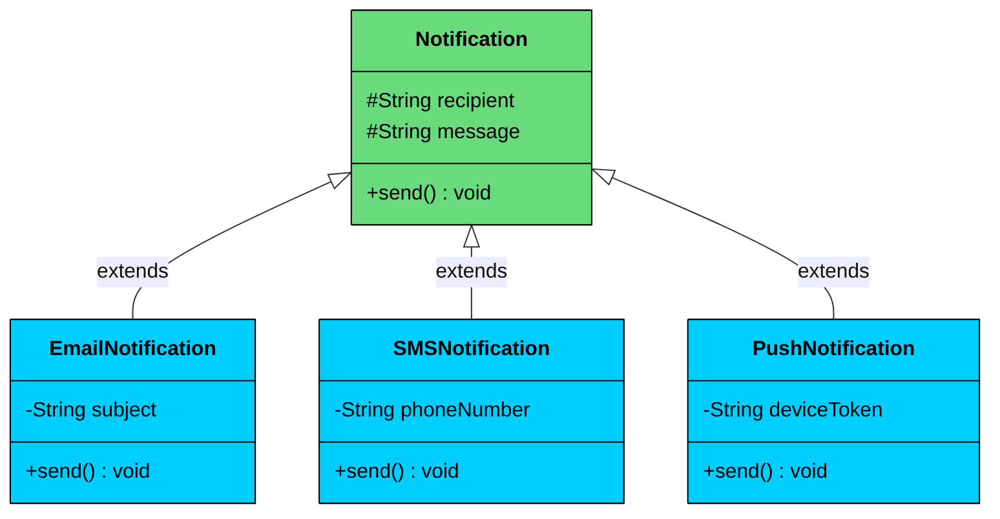

import React from 'react';
import CodeBlock from '../../../../components/ui/CodeBlock';
import Callout from '../../../../components/ui/Callout';

<div className="article-header">
  <div className="breadcrumb">
    <a href="/">Curated Notes</a>
    <span className="breadcrumb-separator">›</span>
    <span className="breadcrumb-current">Polymorphism</span>
  </div>
  <h1>Polymorphism</h1>
  <p style={{ color: 'var(--text-muted)', fontSize: '1.1rem', marginBottom: '16px', lineHeight: '1.6' }}>
    Master the essentials of Polymorphism in this curated guide.
  </p>
  <div className="meta-info">
    <span className="meta-item">
      <svg width="14" height="14" viewBox="0 0 24 24" fill="none" stroke="currentColor" strokeWidth="2"><circle cx="12" cy="12" r="10"/><polyline points="12 6 12 12 16 14"/></svg>
      10 min read
    </span>
    <span className="difficulty-badge difficulty-badge--intermediate">Intermediate</span>
  </div>
</div>

<section className="content-section">

Polymorphism allows **the same method name or interface** to exhibit **different behaviors depending on the object that is invoking it**.

The term "polymorphism" comes from Greek and means *"many forms."* In programming, it allows us to write code that is **generic, extensible, and reusable**, while the specific behavior is determined **at runtime or compile-time** based on the object’s actual type.

&gt; Polymorphism lets you 
&gt;
&gt; **call the same method on different objects**
&gt;
&gt; , and have each object respond in its own way.

You write code that targets a **common type**, but the actual behavior is determined by the **concrete implementation**.

---


&gt; **Real-World Analogy**
&gt;
&gt; Think of a **universal** **remote control**.
&gt;
&gt; - The buttons are the same: `powerOn()`, `volumeUp()`, `mute()`.
&gt; - But depending on the device: a **TV**, **Air Conditioner**, or **Projector** each button performs a different action.
&gt;
&gt; For the user, the interface (remote) never changes. But internally, each device interprets the same signal differently.
&gt;
&gt; That’s **polymorphism in action.** The same interface triggers **different behaviors** depending on the receiver (device type).


---

## Why Polymorphism Matters

 Here are four concrete benefits that polymorphism provides.

- **Encourages loose coupling:** You interact with abstractions (interfaces or base classes), not specific implementations.
- **Enhances flexibility:** You can introduce new behaviors without modifying existing code, supporting the **Open/Closed Principle**.
- **Promotes scalability:** Systems can grow to support more features with minimal impact on existing code.
- **Enables extensibility:** You can “plug in” new implementations without touching the core business logic.

---

## How Polymorphism Works

Polymorphism in OOP comes in two forms: compile-time (decided before the program runs) and runtime (decided while the program runs). Both allow the same method name to behave differently, but the mechanism is fundamentally different.

### 1. Compile-time Polymorphism (Method Overloading)

Compile-time polymorphism, also called **method overloading**, happens when you have multiple methods with the same name in the same class but with different parameter lists. 

The compiler determines which version to call based on the number, types, or order of arguments at the call site. The decision is made before the program runs.

##### Example


```java
class Calculator {
    // Two ints
    int add(int a, int b) {
        return a + b;
    }

    // Two doubles
    double add(double a, double b) {
        return a + b;
    }

    // Three ints
    int add(int a, int b, int c) {
        return a + b + c;
    }
}

public class Main {
    public static void main(String[] args) {
        Calculator calc = new Calculator();
        System.out.println(calc.add(2, 3));        // Calls add(int, int) -> 5
        System.out.println(calc.add(2.5, 3.5));    // Calls add(double, double) -> 6.0
        System.out.println(calc.add(1, 2, 3));     // Calls add(int, int, int) -> 6
    }
}
```

```python
## Python does NOT support method overloading natively.
## If you define multiple methods with the same name, only the last one survives.
## The standard workaround is to use default arguments or *args.

class Calculator:
    def add(self, *args):
        return sum(args)

calc = Calculator()
print(calc.add(2, 3))        # 5
print(calc.add(2.5, 3.5))    # 6.0
print(calc.add(1, 2, 3))     # 6
```

```cpp
#include <iostream>

class Calculator {
public:
    // Two ints
    int add(int a, int b) {
        return a + b;
    }

    // Two doubles
    double add(double a, double b) {
        return a + b;
    }

    // Three ints
    int add(int a, int b, int c) {
        return a + b + c;
    }
};

int main() {
    Calculator calc;
    std::cout << calc.add(2, 3) << std::endl;        // Calls add(int, int) -> 5
    std::cout << calc.add(2.5, 3.5) << std::endl;    // Calls add(double, double) -> 6
    std::cout << calc.add(1, 2, 3) << std::endl;     // Calls add(int, int, int) -> 6
    return 0;
}
```

```csharp
using System;

public class Calculator
{
    // Two ints
    public int Add(int a, int b)
    {
        return a + b;
    }

    // Two doubles
    public double Add(double a, double b)
    {
        return a + b;
    }

    // Three ints
    public int Add(int a, int b, int c)
    {
        return a + b + c;
    }
}

public class Program
{
    public static void Main()
    {
        var calc = new Calculator();
        Console.WriteLine(calc.Add(2, 3));        // Calls Add(int, int) -> 5
        Console.WriteLine(calc.Add(2.5, 3.5));    // Calls Add(double, double) -> 6
        Console.WriteLine(calc.Add(1, 2, 3));     // Calls Add(int, int, int) -> 6
    }
}
```

```go
package main

import "fmt"

// Go does NOT support method overloading at all.
// You cannot have two methods with the same name on the same type,
// even if the parameter lists differ.
// The standard approach is to use different method names or variadic parameters.

type Calculator struct{}

func (c Calculator) Add(nums ...int) int {
    total := 0
    for _, n := range nums {
        total += n
    }
    return total
}

func (c Calculator) AddFloats(nums ...float64) float64 {
    total := 0.0
    for _, n := range nums {
        total += n
    }
    return total
}

func main() {
    calc := Calculator{}
    fmt.Println(calc.Add(2, 3))            // 5
    fmt.Println(calc.AddFloats(2.5, 3.5))  // 6
    fmt.Println(calc.Add(1, 2, 3))         // 6
}
```

```typescript
class Calculator {
    // TypeScript uses overload signatures + a single implementation
    add(a: number, b: number): number;
    add(a: number, b: number, c: number): number;
    add(a: number, b: number, c?: number): number {
        if (c !== undefined) {
            return a + b + c;
        }
        return a + b;
    }
}

const calc = new Calculator();
console.log(calc.add(2, 3));        // Calls add(number, number) -> 5
console.log(calc.add(2.5, 3.5));    // Calls add(number, number) -> 6
console.log(calc.add(1, 2, 3));     // Calls add(number, number, number) -> 6
```


The compiler resolves which `add()` to call based on the arguments. Pass two ints, you get `add(int, int)`. Pass two doubles, you get `add(double, double)`. Pass three ints, you get `add(int, int, int)`. No runtime decision needed.

---

### 2. Runtime Polymorphism (Method Overriding / Dynamic Dispatch)

Runtime polymorphism is the more powerful and more important form. It happens when a child class **overrides** a method defined in its parent class, and the decision of which version to call is made **at runtime** based on the actual type of the object, not the declared type of the reference.

#### Example

Suppose you’re designing a system that sends notifications. You want to support email, SMS, push notifications, etc.





```java
import java.util.List;

class Notification {
    protected String recipient;
    protected String message;

    public Notification(String recipient, String message) {
        this.recipient = recipient;
        this.message = message;
    }

    public void send() {
        System.out.println("Sending generic notification to " + recipient);
    }
}

class EmailNotification extends Notification {
    private String subject;

    public EmailNotification(String recipient, String message, String subject) {
        super(recipient, message);
        this.subject = subject;
    }

    @Override
    public void send() {
        System.out.println("Sending EMAIL to " + recipient + " | Subject: " + subject);
    }
}

class SMSNotification extends Notification {
    private String phoneNumber;

    public SMSNotification(String recipient, String message, String phoneNumber) {
        super(recipient, message);
        this.phoneNumber = phoneNumber;
    }

    @Override
    public void send() {
        System.out.println("Sending SMS to " + phoneNumber + " | Message: " + message);
    }
}

class PushNotification extends Notification {
    private String deviceToken;

    public PushNotification(String recipient, String message, String deviceToken) {
        super(recipient, message);
        this.deviceToken = deviceToken;
    }

    @Override
    public void send() {
        System.out.println("Sending PUSH to device " + deviceToken.substring(0, 8)
            + "... | Alert: " + message);
    }
}

public class Main {
    public static void main(String[] args) {
        // All stored as Notification references, but each is a different actual type
        List<Notification> notifications = List.of(
            new EmailNotification("alice@example.com", "Your order shipped!", "Order Update"),
            new SMSNotification("Bob", "Code: 482910", "+1-555-0123"),
            new PushNotification("Charlie", "New message", "d8a3f4b2c1e5a9b7")
        );

        // Polymorphic dispatch: each call routes to the correct override
        for (Notification n : notifications) {
            n.send();
        }
    }
}
```

```python
class Notification:
    def __init__(self, recipient: str, message: str):
        self._recipient = recipient
        self._message = message

    def send(self):
        print(f"Sending generic notification to {self._recipient}")

class EmailNotification(Notification):
    def __init__(self, recipient: str, message: str, subject: str):
        super().__init__(recipient, message)
        self._subject = subject

    def send(self):
        print(f"Sending EMAIL to {self._recipient} | Subject: {self._subject}")

class SMSNotification(Notification):
    def __init__(self, recipient: str, message: str, phone_number: str):
        super().__init__(recipient, message)
        self._phone_number = phone_number

    def send(self):
        print(f"Sending SMS to {self._phone_number} | Message: {self._message}")

class PushNotification(Notification):
    def __init__(self, recipient: str, message: str, device_token: str):
        super().__init__(recipient, message)
        self._device_token = device_token

    def send(self):
        print(f"Sending PUSH to device {self._device_token[:8]}"
              f"... | Alert: {self._message}")

if __name__ == "__main__":
    notifications = [
        EmailNotification("alice@example.com", "Your order shipped!", "Order Update"),
        SMSNotification("Bob", "Code: 482910", "+1-555-0123"),
        PushNotification("Charlie", "New message", "d8a3f4b2c1e5a9b7"),
    ]

    for n in notifications:
        n.send()
```

```cpp
#include <iostream>
#include <string>
#include <vector>
#include <memory>
using namespace std;

class Notification {
protected:
    string recipient;
    string message;

public:
    Notification(const string& recipient, const string& message)
        : recipient(recipient), message(message) {}

    virtual ~Notification() {}

    virtual void send() {
        cout << "Sending generic notification to " << recipient << endl;
    }
};

class EmailNotification : public Notification {
    string subject;

public:
    EmailNotification(const string& recipient, const string& message,
                      const string& subject)
        : Notification(recipient, message), subject(subject) {}

    void send() override {
        cout << "Sending EMAIL to " << recipient
             << " | Subject: " << subject << endl;
    }
};

class SMSNotification : public Notification {
    string phoneNumber;

public:
    SMSNotification(const string& recipient, const string& message,
                    const string& phoneNumber)
        : Notification(recipient, message), phoneNumber(phoneNumber) {}

    void send() override {
        cout << "Sending SMS to " << phoneNumber
             << " | Message: " << message << endl;
    }
};

class PushNotification : public Notification {
    string deviceToken;

public:
    PushNotification(const string& recipient, const string& message,
                     const string& deviceToken)
        : Notification(recipient, message), deviceToken(deviceToken) {}

    void send() override {
        cout << "Sending PUSH to device " << deviceToken.substr(0, 8)
             << "... | Alert: " << message << endl;
    }
};

int main() {
    vector<unique_ptr<Notification>> notifications;
    notifications.push_back(make_unique<EmailNotification>(
        "alice@example.com", "Your order shipped!", "Order Update"));
    notifications.push_back(make_unique<SMSNotification>(
        "Bob", "Code: 482910", "+1-555-0123"));
    notifications.push_back(make_unique<PushNotification>(
        "Charlie", "New message", "d8a3f4b2c1e5a9b7"));

    for (auto& n : notifications) {
        n->send();
    }
    return 0;
}
```

```csharp
using System;
using System.Collections.Generic;

public class Notification
{
    protected string Recipient;
    protected string Message;

    public Notification(string recipient, string message)
    {
        Recipient = recipient;
        Message = message;
    }

    public virtual void Send()
    {
        Console.WriteLine($"Sending generic notification to {Recipient}");
    }
}

public class EmailNotification : Notification
{
    private string _subject;

    public EmailNotification(string recipient, string message, string subject)
        : base(recipient, message)
    {
        _subject = subject;
    }

    public override void Send()
    {
        Console.WriteLine($"Sending EMAIL to {Recipient} | Subject: {_subject}");
    }
}

public class SMSNotification : Notification
{
    private string _phoneNumber;

    public SMSNotification(string recipient, string message, string phoneNumber)
        : base(recipient, message)
    {
        _phoneNumber = phoneNumber;
    }

    public override void Send()
    {
        Console.WriteLine($"Sending SMS to {_phoneNumber} | Message: {Message}");
    }
}

public class PushNotification : Notification
{
    private string _deviceToken;

    public PushNotification(string recipient, string message, string deviceToken)
        : base(recipient, message)
    {
        _deviceToken = deviceToken;
    }

    public override void Send()
    {
        Console.WriteLine($"Sending PUSH to device {_deviceToken.Substring(0, 8)}"
            + $"... | Alert: {Message}");
    }
}

public class Program
{
    public static void Main()
    {
        var notifications = new List<Notification>
        {
            new EmailNotification("alice@example.com", "Your order shipped!", "Order Update"),
            new SMSNotification("Bob", "Code: 482910", "+1-555-0123"),
            new PushNotification("Charlie", "New message", "d8a3f4b2c1e5a9b7")
        };

        foreach (var n in notifications)
        {
            n.Send();
        }
    }
}
```

```go
package main

import "fmt"

// Go achieves runtime polymorphism through interfaces, not inheritance.
// Any type that has a Send() method satisfies the Notifier interface.

type Notifier interface {
    Send()
}

type EmailNotification struct {
    Recipient string
    Message   string
    Subject   string
}

func (e *EmailNotification) Send() {
    fmt.Printf("Sending EMAIL to %s | Subject: %s\n", e.Recipient, e.Subject)
}

type SMSNotification struct {
    Recipient   string
    Message     string
    PhoneNumber string
}

func (s *SMSNotification) Send() {
    fmt.Printf("Sending SMS to %s | Message: %s\n", s.PhoneNumber, s.Message)
}

type PushNotification struct {
    Recipient   string
    Message     string
    DeviceToken string
}

func (p *PushNotification) Send() {
    fmt.Printf("Sending PUSH to device %s... | Alert: %s\n",
        p.DeviceToken[:8], p.Message)
}

func main() {
    notifications := []Notifier{
        &EmailNotification{"alice@example.com", "Your order shipped!", "Order Update"},
        &SMSNotification{"Bob", "Code: 482910", "+1-555-0123"},
        &PushNotification{"Charlie", "New message", "d8a3f4b2c1e5a9b7"},
    }

    for _, n := range notifications {
        n.Send()
    }
}
```

```typescript
class Notification {
    protected recipient: string;
    protected message: string;

    constructor(recipient: string, message: string) {
        this.recipient = recipient;
        this.message = message;
    }

    send(): void {
        console.log(`Sending generic notification to ${this.recipient}`);
    }
}

class EmailNotification extends Notification {
    private subject: string;

    constructor(recipient: string, message: string, subject: string) {
        super(recipient, message);
        this.subject = subject;
    }

    send(): void {
        console.log(`Sending EMAIL to ${this.recipient} | Subject: ${this.subject}`);
    }
}

class SMSNotification extends Notification {
    private phoneNumber: string;

    constructor(recipient: string, message: string, phoneNumber: string) {
        super(recipient, message);
        this.phoneNumber = phoneNumber;
    }

    send(): void {
        console.log(`Sending SMS to ${this.phoneNumber} | Message: ${this.message}`);
    }
}

class PushNotification extends Notification {
    private deviceToken: string;

    constructor(recipient: string, message: string, deviceToken: string) {
        super(recipient, message);
        this.deviceToken = deviceToken;
    }

    send(): void {
        console.log(`Sending PUSH to device ${this.deviceToken.substring(0, 8)}`
            + `... | Alert: ${this.message}`);
    }
}

const notifications: Notification[] = [
    new EmailNotification("alice@example.com", "Your order shipped!", "Order Update"),
    new SMSNotification("Bob", "Code: 482910", "+1-555-0123"),
    new PushNotification("Charlie", "New message", "d8a3f4b2c1e5a9b7"),
];

for (const n of notifications) {
    n.send();
}
```


The key thing to notice: every element in the list is stored as a `Notification` reference, but the runtime calls the correct child class's `send()`. The variable type says `Notification`. The behavior says `EmailNotification`, `SMSNotification`, or `PushNotification`. That's runtime polymorphism.

---

## 3. Polymorphism with Interfaces vs Abstract Classes

Both interfaces and abstract classes enable polymorphism. In the notification example, you could define `Notification` as either an abstract class or an interface. The polymorphic behavior, calling `send()` on a base reference and having the child's version execute, works the same either way. So when should you use which?


| Aspect | Interface | Abstract Class |
|--------|-----------|----------------|
| **Relationship** | "can do" (capability) | "is a" (family) |
| **Shared behavior** | None (contract only) | Yes (concrete methods + fields) |
| **Multiple** | A class can implement many | A class can extend only one |
| **When to use** | Unrelated classes share a capability | Related classes share logic |
| **Example** | `Sendable` implemented by `Email`, `Invoice`, `Report` | `Notification` extended by `Email`, `SMS`, `Push` |


Use an **interface** when the implementing classes are fundamentally different but share a capability. `Email`, `Invoice`, and `Report` have nothing in common structurally, but they can all `send()`. An interface defines that contract without forcing a shared hierarchy.

Use an **abstract class** when the implementing classes are a family with shared logic. All notifications need the same `formatHeader()` method, the same `recipient` and `message` fields, and the same constructor pattern. An abstract class provides all of that, plus the abstract `send()` that each child implements differently.

In practice, many designs use both. An abstract `Notification` class provides shared fields and formatting, while a `Sendable` interface marks anything that can be sent (notifications, reports, alerts).

</section>
