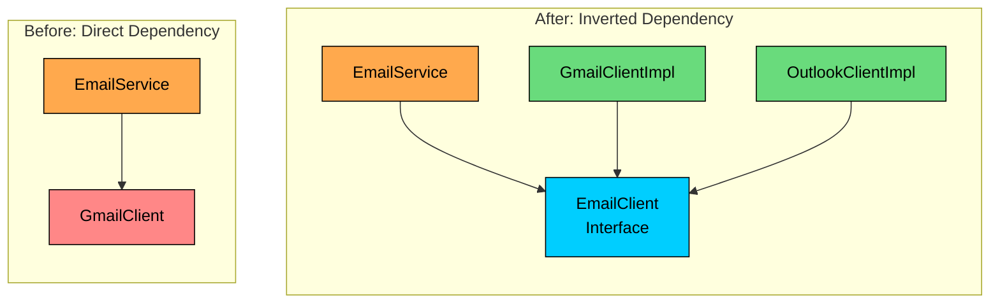

import React from 'react';
import CodeBlock from '../../../../components/ui/CodeBlock';
import Callout from '../../../../components/ui/Callout';

<div className="article-header">
  <div className="breadcrumb">
    <a href="/">Curated Notes</a>
    <span className="breadcrumb-separator">›</span>
    <span className="breadcrumb-current">Dependency Inversion Principle (DIP)</span>
  </div>
  <h1>Dependency Inversion Principle (DIP)</h1>
  <p style={{ color: 'var(--text-muted)', fontSize: '1.1rem', marginBottom: '16px', lineHeight: '1.6' }}>
    Master the essentials of Dependency Inversion Principle (DIP) in this curated guide.
  </p>
  <div className="meta-info">
    <span className="meta-item">
      <svg width="14" height="14" viewBox="0 0 24 24" fill="none" stroke="currentColor" strokeWidth="2"><circle cx="12" cy="12" r="10"/><polyline points="12 6 12 12 16 14"/></svg>
      10 min read
    </span>
    <span className="difficulty-badge difficulty-badge--intermediate">Intermediate</span>
  </div>
</div>

<section className="content-section">

Have you ever tried to swap out a database, switch an email provider, or replace a third-party API, only to realize that your business logic was so tangled with the implementation details that changing one thing meant rewriting half the class?

If so, you have run into a violation of one of the most practical design principles in software engineering: the **Dependency Inversion Principle (DIP).**

This chapter explains what DIP really means, why high-level modules should never depend directly on low-level modules, how to use abstractions to decouple them, and the common mistakes developers make when applying this principle. 

Let's start with a real-world example.

---

## 1. The Problem: A Tightly Coupled EmailService

Imagine you are building an `EmailService`. Your first task is to send emails using Gmail. So you write something like this.

Here is the low-level module, a `GmailClient` that knows how to talk to Gmail's servers.


```java
class GmailClient {
    public void sendGmail(String toAddress, String subjectLine, String emailBody) {
        System.out.println("Connecting to Gmail SMTP server...");
        System.out.println("Sending email via Gmail to: " + toAddress);
        System.out.println("Subject: " + subjectLine);
        System.out.println("Body: " + emailBody);
        // ... actual Gmail API interaction logic ...
        System.out.println("Gmail email sent successfully!");
    }
}
```

```python
class GmailClient:
    def send_gmail(self, to_address, subject_line, email_body):
        print("Connecting to Gmail SMTP server...")
        print(f"Sending email via Gmail to: {to_address}")
        print(f"Subject: {subject_line}")
        print(f"Body: {email_body}")
        # ... actual Gmail API interaction logic ...
        print("Gmail email sent successfully!")
```

```cpp
class GmailClient {
public:
    void sendGmail(const string& toAddress, const string& subjectLine, const string& emailBody) {
        cout << "Connecting to Gmail SMTP server..." << endl;
        cout << "Sending email via Gmail to: " << toAddress << endl;
        cout << "Subject: " << subjectLine << endl;
        cout << "Body: " << emailBody << endl;
        // ... actual Gmail API interaction logic ...
        cout << "Gmail email sent successfully!" << endl;
    }
};
```

```csharp
class GmailClient
{
    public void SendGmail(string toAddress, string subjectLine, string emailBody)
    {
        Console.WriteLine("Connecting to Gmail SMTP server...");
        Console.WriteLine($"Sending email via Gmail to: {toAddress}");
        Console.WriteLine($"Subject: {subjectLine}");
        Console.WriteLine($"Body: {emailBody}");
        // ... actual Gmail API interaction logic ...
        Console.WriteLine("Gmail email sent successfully!");
    }
}
```

```go
type GmailClient struct{}

func (g *GmailClient) SendGmail(toAddress, subjectLine, emailBody string) {
    fmt.Println("Connecting to Gmail SMTP server...")
    fmt.Println("Sending email via Gmail to: " + toAddress)
    fmt.Println("Subject: " + subjectLine)
    fmt.Println("Body: " + emailBody)
    // ... actual Gmail API interaction logic ...
    fmt.Println("Gmail email sent successfully!")
}
```

```typescript
class GmailClient {
    sendGmail(toAddress: string, subjectLine: string, emailBody: string): void {
        console.log("Connecting to Gmail SMTP server...");
        console.log(`Sending email via Gmail to: ${toAddress}`);
        console.log(`Subject: ${subjectLine}`);
        console.log(`Body: ${emailBody}`);
        // ... actual Gmail API interaction logic ...
        console.log("Gmail email sent successfully!");
    }
}
```


And here is the high-level module, the `EmailService` that handles business logic like sending welcome emails and password resets.


```java
class EmailService {
    private GmailClient gmailClient;

    public EmailService() {
        this.gmailClient = new GmailClient();
    }

    public void sendWelcomeEmail(String userEmail, String userName) {
        String subject = "Welcome, " + userName + "!";
        String body = "Thanks for signing up to our awesome platform. We're glad to have you!";
        this.gmailClient.sendGmail(userEmail, subject, body);
    }

    public void sendPasswordResetEmail(String userEmail) {
        String subject = "Reset Your Password";
        String body = "Please click the link below to reset your password...";
        this.gmailClient.sendGmail(userEmail, subject, body);
    }
}
```

```python
class EmailService:
    def __init__(self):
        self.gmail_client = GmailClient()

    def send_welcome_email(self, user_email, user_name):
        subject = f"Welcome, {user_name}!"
        body = "Thanks for signing up to our awesome platform. We're glad to have you!"
        self.gmail_client.send_gmail(user_email, subject, body)

    def send_password_reset_email(self, user_email):
        subject = "Reset Your Password"
        body = "Please click the link below to reset your password..."
        self.gmail_client.send_gmail(user_email, subject, body)
```

```cpp
class EmailService {
private:
    GmailClient gmailClient;

public:
    void sendWelcomeEmail(const string& userEmail, const string& userName) {
        string subject = "Welcome, " + userName + "!";
        string body = "Thanks for signing up to our awesome platform. We're glad to have you!";
        gmailClient.sendGmail(userEmail, subject, body);
    }

    void sendPasswordResetEmail(const string& userEmail) {
        string subject = "Reset Your Password";
        string body = "Please click the link below to reset your password...";
        gmailClient.sendGmail(userEmail, subject, body);
    }
};
```

```csharp
class EmailService
{
    private readonly GmailClient _gmailClient;

    public EmailService()
    {
        _gmailClient = new GmailClient();
    }

    public void SendWelcomeEmail(string userEmail, string userName)
    {
        string subject = $"Welcome, {userName}!";
        string body = "Thanks for signing up to our awesome platform. We're glad to have you!";
        _gmailClient.SendGmail(userEmail, subject, body);
    }

    public void SendPasswordResetEmail(string userEmail)
    {
        string subject = "Reset Your Password";
        string body = "Please click the link below to reset your password...";
        _gmailClient.SendGmail(userEmail, subject, body);
    }
}
```

```go
type EmailService struct {
    gmailClient *GmailClient
}

func EmailService() *EmailService {
    return &EmailService{gmailClient: &GmailClient{}}
}

func (s *EmailService) SendWelcomeEmail(userEmail, userName string) {
    subject := "Welcome, " + userName + "!"
    body := "Thanks for signing up to our awesome platform. We're glad to have you!"
    s.gmailClient.SendGmail(userEmail, subject, body)
}

func (s *EmailService) SendPasswordResetEmail(userEmail string) {
    subject := "Reset Your Password"
    body := "Please click the link below to reset your password..."
    s.gmailClient.SendGmail(userEmail, subject, body)
}
```

```typescript
class EmailService {
    private gmailClient: GmailClient;

    constructor() {
        this.gmailClient = new GmailClient();
    }

    sendWelcomeEmail(userEmail: string, userName: string): void {
        const subject = `Welcome, ${userName}!`;
        const body = "Thanks for signing up to our awesome platform. We're glad to have you!";
        this.gmailClient.sendGmail(userEmail, subject, body);
    }

    sendPasswordResetEmail(userEmail: string): void {
        const subject = "Reset Your Password";
        const body = "Please click the link below to reset your password...";
        this.gmailClient.sendGmail(userEmail, subject, body);
    }
}
```


At first glance, this seems totally fine. It works, it is readable, and it sends emails.

#### Why Switching Providers Is Painful

Then one day, a product manager asks:

&gt; "Can we switch from Gmail to Outlook for sending emails?"

Suddenly, you have a problem. Your `EmailService`, a high-level component that handles business logic, is tightly coupled to `GmailClient`, a low-level implementation detail. To switch providers, you would have to:

- Rewrite parts of `EmailService`
- Replace every `gmailClient` method call with `outlookClient` ones
- Change the constructor

And that is just for one provider swap. Now imagine needing to support multiple email providers (Gmail, Outlook, SES) or dynamically select a provider based on configuration. Your `EmailService` would quickly turn into a giant `if-else` soup.

This is exactly the kind of pain the **Dependency Inversion Principle (DIP)** helps you avoid.

---

## 2. The Dependency Inversion Principle

The legendary Robert C. Martin (Uncle Bob) lays down DIP with two golden rules:

1. **High-level modules should not depend on low-level modules. Both should depend on abstractions (e.g., interfaces).**
2. **Abstractions should not depend on details. Details (concrete implementations) should depend on abstractions.**

In plain English:

- Business logic should not rely directly on implementation details.
- Instead, both should depend on a common interface or abstraction.

You might wonder what exactly is being "inverted." It is the direction of dependency. Without DIP, high-level modules depend directly on low-level modules. With DIP, both the high-level module and the low-level module depend on a shared abstraction (an interface or abstract class). 

The control flow might still go from high to low, but the source code dependency is inverted. High-level modules define *what* they need (the contract/interface), and low-level modules provide the *how* (the implementation of that interface).





On the left, `EmailService` depends directly on `GmailClient`. Any change to Gmail's API forces changes in `EmailService`. On the right, both `EmailService` and the concrete clients depend on the `EmailClient` interface. 

`EmailService` is now shielded from implementation details, and you can swap providers without touching business logic.

#### Why Does DIP Matter?

1. **Decoupling.** High-level modules become independent of the nitty-gritty details of low-level modules. Your business logic does not care whether emails go through Gmail, Outlook, or carrier pigeon.
2. **Flexibility and Extensibility.** Need to switch from Gmail to Outlook? Or add an SMS provider? Just create a new class that implements the shared abstraction and plug it in. The high-level module does not need to change at all.
3. **Enhanced Testability.** You can easily swap out real dependencies with mock objects or test doubles. Testing `EmailService` in isolation without hitting an actual email server becomes trivial.
4. **Improved Maintainability.** Changes in one part of the system are less likely to break others. If `GmailClient`'s internal API changes, it only affects `GmailClient`, not `EmailService`, as long as the abstraction remains the same.
5. **Parallel Development.** Once the abstraction (interface) is defined, different teams can work independently. One team can build the `EmailService` (high-level) while other teams build different `EmailClient` implementations (low-level).

---

## 3. Applying DIP

Let's refactor our original example step-by-step using DIP.

#### Step 1: Define the Abstraction (The Contract)

We need an interface that defines what any email sending mechanism should be able to do. This interface becomes the contract that both high-level and low-level modules depend on.


```java
interface EmailClient {
    void sendEmail(String to, String subject, String body);
}
```

```python
class EmailClient(ABC):
    @abstractmethod
    def send_email(self, to, subject, body):
        pass
```

```cpp
class EmailClient {
public:
    virtual void sendEmail(const string& to, const string& subject, const string& body) = 0;
    virtual ~EmailClient() = default;
};
```

```csharp
interface IEmailClient
{
    void SendEmail(string to, string subject, string body);
}
```

```go
type EmailClient interface {
    SendEmail(to, subject, body string)
}
```

```typescript
interface EmailClient {
    sendEmail(to: string, subject: string, body: string): void;
}
```


#### Step 2: Concrete Implementations

Now, our specific email clients (the "details") implement the above interface. Each one knows how to talk to its own email provider, but they all share the same contract.

Here is the Gmail implementation:


```java
class GmailClientImpl implements EmailClient {
    @Override
    public void sendEmail(String to, String subject, String body) {
        System.out.println("Connecting to Gmail SMTP server...");
        System.out.println("Sending email via Gmail to: " + to);
        System.out.println("Subject: " + subject);
        System.out.println("Body: " + body);
        // ... actual Gmail API interaction logic ...
        System.out.println("Gmail email sent successfully!");
    }
}
```

```python
class GmailClientImpl(EmailClient):
    def send_email(self, to, subject, body):
        print("Connecting to Gmail SMTP server...")
        print(f"Sending email via Gmail to: {to}")
        print(f"Subject: {subject}")
        print(f"Body: {body}")
        # ... actual Gmail API interaction logic ...
        print("Gmail email sent successfully!")
```

```cpp
class GmailClientImpl : public EmailClient {
public:
    void sendEmail(const string& to, const string& subject, const string& body) override {
        cout << "Connecting to Gmail SMTP server..." << endl;
        cout << "Sending email via Gmail to: " << to << endl;
        cout << "Subject: " << subject << endl;
        cout << "Body: " << body << endl;
        cout << "Gmail email sent successfully!" << endl;
    }
};
```

```csharp
class GmailClientImpl : IEmailClient
{
    public void SendEmail(string to, string subject, string body)
    {
        Console.WriteLine("Connecting to Gmail SMTP server...");
        Console.WriteLine($"Sending email via Gmail to: {to}");
        Console.WriteLine($"Subject: {subject}");
        Console.WriteLine($"Body: {body}");
        Console.WriteLine("Gmail email sent successfully!");
    }
}
```

```go
type GmailClientImpl struct{}

func (g *GmailClientImpl) SendEmail(to, subject, body string) {
    fmt.Println("Connecting to Gmail SMTP server...")
    fmt.Println("Sending email via Gmail to: " + to)
    fmt.Println("Subject: " + subject)
    fmt.Println("Body: " + body)
    // ... actual Gmail API interaction logic ...
    fmt.Println("Gmail email sent successfully!")
}
```

```typescript
class GmailClientImpl implements EmailClient {
    sendEmail(to: string, subject: string, body: string): void {
        console.log("Connecting to Gmail SMTP server...");
        console.log(`Sending email via Gmail to: ${to}`);
        console.log(`Subject: ${subject}`);
        console.log(`Body: ${body}`);
        // ... actual Gmail API interaction logic ...
        console.log("Gmail email sent successfully!");
    }
}
```


And here is the Outlook implementation:


```java
class OutlookClientImpl implements EmailClient {
    @Override
    public void sendEmail(String to, String subject, String body) {
        System.out.println("Connecting to Outlook Exchange server...");
        System.out.println("Sending email via Outlook to: " + to);
        System.out.println("Subject: " + subject);
        System.out.println("Body: " + body);
        // ... actual Outlook API interaction logic ...
        System.out.println("Outlook email sent successfully!");
    }
}
```

```python
class OutlookClientImpl(EmailClient):
    def send_email(self, to, subject, body):
        print("Connecting to Outlook Exchange server...")
        print(f"Sending email via Outlook to: {to}")
        print(f"Subject: {subject}")
        print(f"Body: {body}")
        # ... actual Outlook API interaction logic ...
        print("Outlook email sent successfully!")
```

```cpp
class OutlookClientImpl : public EmailClient {
public:
    void sendEmail(const string& to, const string& subject, const string& body) override {
        cout << "Connecting to Outlook Exchange server..." << endl;
        cout << "Sending email via Outlook to: " << to << endl;
        cout << "Subject: " << subject << endl;
        cout << "Body: " << body << endl;
        cout << "Outlook email sent successfully!" << endl;
    }
};
```

```csharp
class OutlookClientImpl : IEmailClient
{
    public void SendEmail(string to, string subject, string body)
    {
        Console.WriteLine("Connecting to Outlook Exchange server...");
        Console.WriteLine($"Sending email via Outlook to: {to}");
        Console.WriteLine($"Subject: {subject}");
        Console.WriteLine($"Body: {body}");
        Console.WriteLine("Outlook email sent successfully!");
    }
}
```

```go
type OutlookClientImpl struct{}

func (o *OutlookClientImpl) SendEmail(to, subject, body string) {
    fmt.Println("Connecting to Outlook Exchange server...")
    fmt.Println("Sending email via Outlook to: " + to)
    fmt.Println("Subject: " + subject)
    fmt.Println("Body: " + body)
    // ... actual Outlook API interaction logic ...
    fmt.Println("Outlook email sent successfully!")
}
```

```typescript
class OutlookClientImpl implements EmailClient {
    sendEmail(to: string, subject: string, body: string): void {
        console.log("Connecting to Outlook Exchange server...");
        console.log(`Sending email via Outlook to: ${to}`);
        console.log(`Subject: ${subject}`);
        console.log(`Body: ${body}`);
        // ... actual Outlook API interaction logic ...
        console.log("Outlook email sent successfully!");
    }
}
```


#### Step 3: Update the High-Level Module

Now comes the key change. Our `EmailService` will no longer know about `GmailClientImpl` or `OutlookClientImpl`. It will only know about the `EmailClient` interface. The actual implementation gets "injected" into it from the outside. 

This technique is called Dependency Injection (DI), and it is one of the most common ways to achieve DIP in practice.


```java
class EmailService {
    private final EmailClient emailClient; // Depends on the INTERFACE!

    // Dependency is "injected" via the constructor
    public EmailService(EmailClient emailClient) {
        this.emailClient = emailClient;
    }

    public void sendWelcomeEmail(String userEmail, String userName) {
        String subject = "Welcome, " + userName + "!";
        String body = "Thanks for signing up to our awesome platform. We're glad to have you!";
        this.emailClient.sendEmail(userEmail, subject, body); // Calls the interface method
    }

    public void sendPasswordResetEmail(String userEmail) {
        String subject = "Your Password Reset Request";
        String body = "Please click the link below to reset your password...";
        this.emailClient.sendEmail(userEmail, subject, body);
    }
}
```

```python
class EmailService:
    def __init__(self, email_client: EmailClient):
        self.email_client = email_client

    def send_welcome_email(self, user_email, user_name):
        subject = f"Welcome, {user_name}!"
        body = "Thanks for signing up to our awesome platform. We're glad to have you!"
        self.email_client.send_email(user_email, subject, body)

    def send_password_reset_email(self, user_email):
        subject = "Reset Your Password"
        body = "Please click the link below to reset your password..."
        self.email_client.send_email(user_email, subject, body)
```

```cpp
class EmailService {
private:
    shared_ptr<EmailClient> emailClient;

public:
    EmailService(shared_ptr<EmailClient> client) : emailClient(move(client)) {}

    void sendWelcomeEmail(const string& userEmail, const string& userName) {
        string subject = "Welcome, " + userName + "!";
        string body = "Thanks for signing up to our awesome platform. We're glad to have you!";
        emailClient->sendEmail(userEmail, subject, body);
    }

    void sendPasswordResetEmail(const string& userEmail) {
        string subject = "Reset Your Password";
        string body = "Please click the link below to reset your password...";
        emailClient->sendEmail(userEmail, subject, body);
    }
};
```

```csharp
class EmailService
{
    private readonly IEmailClient _emailClient;

    public EmailService(IEmailClient emailClient)
    {
        _emailClient = emailClient;
    }

    public void SendWelcomeEmail(string userEmail, string userName)
    {
        string subject = $"Welcome, {userName}!";
        string body = "Thanks for signing up to our awesome platform. We're glad to have you!";
        _emailClient.SendEmail(userEmail, subject, body);
    }

    public void SendPasswordResetEmail(string userEmail)
    {
        string subject = "Reset Your Password";
        string body = "Please click the link below to reset your password...";
        _emailClient.SendEmail(userEmail, subject, body);
    }
}
```

```go
type EmailService struct {
    emailClient EmailClient // Depends on the INTERFACE
}

func EmailService(client EmailClient) *EmailService {
    return &EmailService{emailClient: client}
}

func (s *EmailService) SendWelcomeEmail(userEmail, userName string) {
    subject := "Welcome, " + userName + "!"
    body := "Thanks for signing up to our awesome platform. We're glad to have you!"
    s.emailClient.SendEmail(userEmail, subject, body)
}

func (s *EmailService) SendPasswordResetEmail(userEmail string) {
    subject := "Your Password Reset Request"
    body := "Please click the link below to reset your password..."
    s.emailClient.SendEmail(userEmail, subject, body)
}
```

```typescript
class EmailService {
    private readonly emailClient: EmailClient; // Depends on the INTERFACE!

    // Dependency is "injected" via the constructor
    constructor(emailClient: EmailClient) {
        this.emailClient = emailClient;
    }

    sendWelcomeEmail(userEmail: string, userName: string): void {
        const subject = `Welcome, ${userName}!`;
        const body = "Thanks for signing up to our awesome platform. We're glad to have you!";
        this.emailClient.sendEmail(userEmail, subject, body); // Calls the interface method
    }

    sendPasswordResetEmail(userEmail: string): void {
        const subject = "Your Password Reset Request";
        const body = "Please click the link below to reset your password...";
        this.emailClient.sendEmail(userEmail, subject, body);
    }
}
```


Our `EmailService` is now completely decoupled from the concrete email sending mechanisms. It is flexible, extensible, and easy to test.

#### Step 4: Using it in Your Application

Somewhere in your application (often near the `main` method, or managed by a DI framework like Spring or Guice), you decide which concrete implementation to use and pass it to `EmailService`. This is where the "wiring" happens, and it is the only place in your code that knows about concrete classes.


```java
public class Main {
    public static void main(String[] args) {
        System.out.println("--- Using Gmail ---");
        EmailService gmailService = new EmailService(new GmailClientImpl());
        gmailService.sendWelcomeEmail("test@example.com", "Alice");

        System.out.println("\n--- Using Outlook ---");
        EmailService outlookService = new EmailService(new OutlookClientImpl());
        outlookService.sendWelcomeEmail("test@example.com", "Alice");
    }
}
```

```python
if __name__ == "__main__":
    print("--- Using Gmail ---")
    gmail_service = EmailService(GmailClientImpl())
    gmail_service.send_welcome_email("test@example.com", "Alice")

    print("\n--- Using Outlook ---")
    outlook_service = EmailService(OutlookClientImpl())
    outlook_service.send_welcome_email("test@example.com", "Alice")
```

```cpp
int main() {
    cout << "--- Using Gmail ---" << endl;
    shared_ptr<EmailClient> gmail = make_shared<GmailClientImpl>();
    EmailService gmailService(gmail);
    gmailService.sendWelcomeEmail("test@example.com", "Alice");

    cout << "\n--- Using Outlook ---" << endl;
    shared_ptr<EmailClient> outlook = make_shared<OutlookClientImpl>();
    EmailService outlookService(outlook);
    outlookService.sendWelcomeEmail("test@example.com", "Alice");

    return 0;
}
```

```csharp
public class Program
{
    public static void Main()
    {
        Console.WriteLine("--- Using Gmail ---");
        var gmailService = new EmailService(new GmailClientImpl());
        gmailService.SendWelcomeEmail("test@example.com", "Alice");

        Console.WriteLine("\n--- Using Outlook ---");
        var outlookService = new EmailService(new OutlookClientImpl());
        outlookService.SendWelcomeEmail("test@example.com", "Alice");
    }
}
```

```go
func main() {
    fmt.Println("--- Using Gmail ---")
    gmailService := EmailService(&GmailClientImpl{})
    gmailService.SendWelcomeEmail("test@example.com", "Alice")

    fmt.Println("\n--- Using Outlook ---")
    outlookService := EmailService(&OutlookClientImpl{})
    outlookService.SendWelcomeEmail("test@example.com", "Alice")
}
```

```typescript
class Main {
    static main(): void {
        console.log("--- Using Gmail ---");
        const gmailService = new EmailService(new GmailClientImpl());
        gmailService.sendWelcomeEmail("test@example.com", "Welcome to SOLID principles!");

        console.log("--- Using Outlook ---");
        const outlookService = new EmailService(new OutlookClientImpl());
        outlookService.sendWelcomeEmail("test@example.com", "Welcome to SOLID principles!");
    }
}

Main.main();
```


Notice the beauty of this design. Switching from Gmail to Outlook requires zero changes to `EmailService`. You just pass a different implementation at the composition root. 

If tomorrow you need to add Amazon SES support, you create a new `SesClientImpl` that implements `EmailClient`, and every part of your application that depends on `EmailClient` can use it immediately.

---

## 4. Common Pitfalls While Applying DIP

While DIP is powerful, watch out for these common missteps that can undermine your design or create unnecessary complexity.

#### 1. Over-Abstraction

The mistake is creating interfaces for everything, even for stable utility classes that are unlikely to change. Too many unnecessary abstractions lead to clutter, boilerplate, and confusion. Someone looking at your codebase has to navigate through layers of indirection just to understand what a simple method does.

Use interfaces when they add real value:

- For external dependencies (APIs, email providers, databases)
- For components that might change or have multiple implementations
- For parts you need to mock in tests

If something is stable and internal, do not abstract it just for the sake of DIP.

#### 2. Leaky Abstractions

The mistake is exposing implementation-specific logic in your interface. For example, adding a method like `configureGmailSpecificSetting()` to the `EmailClient` interface defeats the entire purpose of the abstraction. 

Now your interface knows about Gmail, which means you are still tightly coupled. Interfaces should only expose what the high-level module needs, not what a specific implementation does behind the scenes.

#### 3. Interfaces Owned by Low-Level Modules

The mistake is letting the low-level module define the interface it implements. For example, if `GmailClient` defines `IGmailClient`, and then `EmailService` depends on `IGmailClient`, the high-level module is still tied to the low-level module's namespace and structure. 

The abstraction should be defined by the high-level module (or in a neutral shared module), not by the implementation.

#### 4. No Actual Injection

The mistake is depending on an interface but still creating the concrete implementation inside the class:


```java
this.emailClient = new GmailClient(); // ❌
```


You are still tightly coupled. This defeats the purpose of inversion. The dependency needs to come from the outside, either via constructor injection, setter injection, or a framework like Spring.

---

## 5. Common Questions About DIP


&gt; #### "Is DIP the same as Dependency Injection (DI)?"

Not exactly.

- **Dependency Inversion (DIP)** is a principle:  *“Depend on abstractions, not concrete implementations.”*
- **Dependency Injection (DI)** is a technique used to achieve DIP: You *inject* dependencies into a class (via constructor, setter, or method) instead of the class creating them itself.

You can follow DIP without using a DI container, and you can use DI without necessarily following DIP (though you probably should do both!).


&gt; #### "Is DIP the same as Inversion of Control (IoC)?"

Nope, but they’re related.

- **Inversion of Control (IoC)** is a broader design concept where the flow of control is inverted. Instead of your code calling libraries, a framework or container calls your code (e.g., Spring controlling object creation and lifecycle).
- **DIP** is one specific way to achieve IoC — by inverting who depends on whom (high-level modules depend on abstractions, not implementations).

Think of IoC as the big idea, and DIP as one way to implement that idea for dependencies.


&gt; #### "Do I need an interface for every class?"

**Definitely not.**

Use DIP **where it makes sense**, like:

- When working with external systems (APIs, databases, email providers)
- When building layers of your application (e.g., services calling repositories)
- When you need flexibility or want to mock something during testing

If there’s only ever going to be one implementation and no real benefit from decoupling, skip the abstraction.


&gt; #### "Doesn’t this create a lot of extra classes and interfaces?"

It can but that’s not a bad thing.

Yes, you might end up with more files. But:

- Your code becomes easier to test
- It's more adaptable to change
- It's easier for teams to work on different layers independently

In short: **a few extra classes = a much more maintainable and scalable system.**


&gt; #### "Where should these abstractions or interfaces live in my project?"

In most cases, the **client** (the high-level module) should define the interface because it's the one saying:* *

For example:

- `EmailClient` interface can live in the same package/module as `EmailService`.
- If you're in a large codebase, you might keep all interfaces in a shared `contracts` or `api` module.

The key idea: **don’t make the high-level module depend on anything buried deep in the low-level implementation's territory** — otherwise, you’re right back to tight coupling.


</section>
