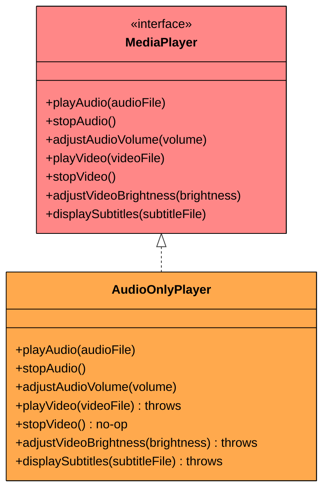
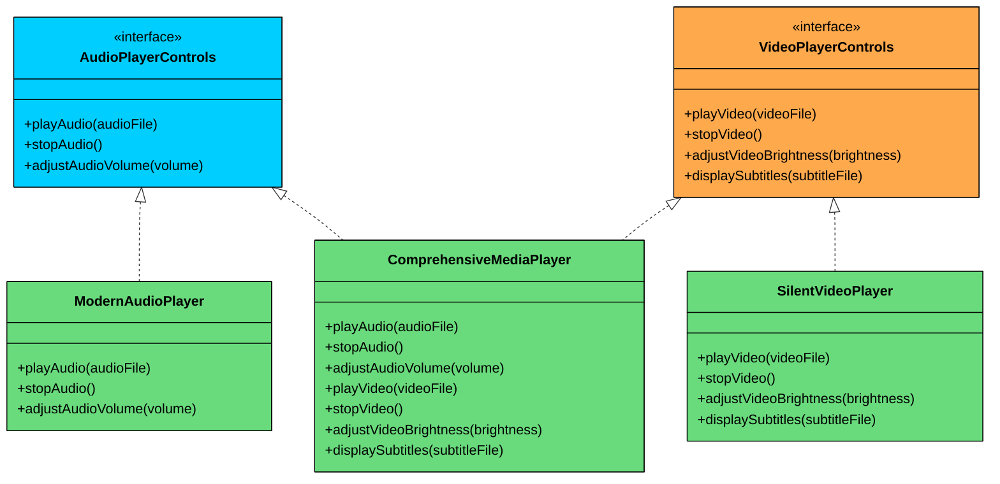

import React from 'react';
import CodeBlock from '../../../../components/ui/CodeBlock';
import Callout from '../../../../components/ui/Callout';

<div className="article-header">
  <div className="breadcrumb">
    <a href="/">Curated Notes</a>
    <span className="breadcrumb-separator">›</span>
    <span className="breadcrumb-current">Interface Segregation Principle (ISP)</span>
  </div>
  <h1>Interface Segregation Principle (ISP)</h1>
  <p style={{ color: 'var(--text-muted)', fontSize: '1.1rem', marginBottom: '16px', lineHeight: '1.6' }}>
    Master the essentials of Interface Segregation Principle (ISP) in this curated guide.
  </p>
  <div className="meta-info">
    <span className="meta-item">
      <svg width="14" height="14" viewBox="0 0 24 24" fill="none" stroke="currentColor" strokeWidth="2"><circle cx="12" cy="12" r="10"/><polyline points="12 6 12 12 16 14"/></svg>
      10 min read
    </span>
    <span className="difficulty-badge difficulty-badge--intermediate">Intermediate</span>
  </div>
</div>

<section className="content-section">

Have you ever implemented an interface… only to realize you had to write empty methods just to make the compiler happy?

Or updated a shared interface… and suddenly watched multiple unrelated classes start breaking?

If so, you have probably run into a violation of one of the most misunderstood design principles in software engineering: the **Interface Segregation Principle (ISP).**

This chapter explains what ISP really means, why fat interfaces cause problems, how to break them apart, and how to avoid common mistakes when applying the principle. Let's start with a real-world example.

---

## 1. The Problem: A Fat Interface

Imagine you are building a media player app that supports different types of media:

- **Audio files** (MP3, WAV)
- **Video files** (MP4, AVI)

You might start with what feels like a convenient design: a single, unified interface that handles everything.


```java
interface MediaPlayer {
    void playAudio(String audioFile);
    void stopAudio();
    void adjustAudioVolume(int volume);

    void playVideo(String videoFile);
    void stopVideo();                
    void adjustVideoBrightness(int brightness);
    void displaySubtitles(String subtitleFile);
}
```

```python
class MediaPlayer(ABC):
    @abstractmethod
    def play_audio(self, audio_file):
        pass

    @abstractmethod
    def stop_audio(self):
        pass

    @abstractmethod
    def adjust_audio_volume(self, volume):
        pass

    @abstractmethod
    def play_video(self, video_file):
        pass

    @abstractmethod
    def stop_video(self):
        pass

    @abstractmethod
    def adjust_video_brightness(self, brightness):
        pass

    @abstractmethod
    def display_subtitles(self, subtitle_file):
        pass
```

```cpp
class MediaPlayer {
public:
    virtual void playAudio(const string& audioFile) = 0;
    virtual void stopAudio() = 0;
    virtual void adjustAudioVolume(int volume) = 0;

    virtual void playVideo(const string& videoFile) = 0;
    virtual void stopVideo() = 0;
    virtual void adjustVideoBrightness(int brightness) = 0;
    virtual void displaySubtitles(const string& subtitleFile) = 0;

    virtual ~MediaPlayer() = default;
};
```

```csharp
interface IMediaPlayer
{
    void PlayAudio(string audioFile);
    void StopAudio();
    void AdjustAudioVolume(int volume);

    void PlayVideo(string videoFile);
    void StopVideo();
    void AdjustVideoBrightness(int brightness);
    void DisplaySubtitles(string subtitleFile);
}
```

```go
// In Go, this would be a single large interface.
// Go encourages small interfaces, so this already feels wrong.
type MediaPlayer interface {
    PlayAudio(audioFile string)
    StopAudio()
    AdjustAudioVolume(volume int)

    PlayVideo(videoFile string)
    StopVideo()
    AdjustVideoBrightness(brightness int)
    DisplaySubtitles(subtitleFile string)
}
```

```typescript
interface MediaPlayer {
    playAudio(audioFile: string): void;
    stopAudio(): void;
    adjustAudioVolume(volume: number): void;

    playVideo(videoFile: string): void;
    stopVideo(): void;                
    adjustVideoBrightness(brightness: number): void;
    displaySubtitles(subtitleFile: string): void;
}
```


At first, this seems efficient. One interface, all capabilities. But as your app grows, problems start to show.

Let's say you want to create a pure audio player, a class that should only handle sound:


```java
class AudioOnlyPlayer implements MediaPlayer {
    @Override
    public void playAudio(String audioFile) {
        System.out.println("Playing audio file: " + audioFile);
    }

    @Override
    public void stopAudio() {
        System.out.println("Audio stopped.");
    }

    @Override
    public void adjustAudioVolume(int volume) {
        System.out.println("Audio volume set to: " + volume);
    }

    // Methods this class should not care about:
    @Override
    public void playVideo(String videoFile) {
        throw new UnsupportedOperationException("Not supported.");
    }

    @Override
    public void stopVideo() { /* no-op */ }

    @Override
    public void adjustVideoBrightness(int brightness) {
        throw new UnsupportedOperationException("Not supported.");
    }

    @Override
    public void displaySubtitles(String subtitleFile) {
        throw new UnsupportedOperationException("Not supported.");
    }
}
```

```python
class AudioOnlyPlayer(MediaPlayer):
    def play_audio(self, audio_file):
        print(f"Playing audio file: {audio_file}")

    def stop_audio(self):
        print("Audio stopped.")

    def adjust_audio_volume(self, volume):
        print(f"Audio volume set to: {volume}")

    # Unwanted methods
    def play_video(self, video_file):
        raise NotImplementedError("Not supported.")

    def stop_video(self):
        raise NotImplementedError("Not supported.")

    def adjust_video_brightness(self, brightness):
        raise NotImplementedError("Not supported.")

    def display_subtitles(self, subtitle_file):
        raise NotImplementedError("Not supported.")
```

```cpp
class AudioOnlyPlayer : public MediaPlayer {
public:
    void playAudio(const string& audioFile) override {
        cout << "Playing audio file: " << audioFile << endl;
    }

    void stopAudio() override {
        cout << "Audio stopped." << endl;
    }

    void adjustAudioVolume(int volume) override {
        cout << "Audio volume set to: " << volume << endl;
    }

    // Unwanted methods forced by the interface
    void playVideo(const string& /*videoFile*/) override {
        throw runtime_error("Not supported.");
    }

    void stopVideo() override {
        // no-op
    }

    void adjustVideoBrightness(int /*brightness*/) override {
        throw runtime_error("Not supported.");
    }

    void displaySubtitles(const string& /*subtitleFile*/) override {
        throw runtime_error("Not supported.");
    }
};
```

```csharp
class AudioOnlyPlayer : IMediaPlayer
{
    public void PlayAudio(string audioFile)
    {
        Console.WriteLine("Playing audio file: " + audioFile);
    }

    public void StopAudio()
    {
        Console.WriteLine("Audio stopped.");
    }

    public void AdjustAudioVolume(int volume)
    {
        Console.WriteLine("Audio volume set to: " + volume);
    }

    // Unwanted methods
    public void PlayVideo(string videoFile)
    {
        throw new NotSupportedException("Not supported.");
    }

    public void StopVideo()
    {
        // no-op
    }

    public void AdjustVideoBrightness(int brightness)
    {
        throw new NotSupportedException("Not supported.");
    }

    public void DisplaySubtitles(string subtitleFile)
    {
        throw new NotSupportedException("Not supported.");
    }
}
```

```go
// In Go, you cannot partially implement an interface.
// AudioOnlyPlayer must define all 7 methods, even though
// it only cares about the 3 audio methods.
type AudioOnlyPlayer struct{}

func (a *AudioOnlyPlayer) PlayAudio(audioFile string) {
    fmt.Println("Playing audio file:", audioFile)
}

func (a *AudioOnlyPlayer) StopAudio() {
    fmt.Println("Audio stopped.")
}

func (a *AudioOnlyPlayer) AdjustAudioVolume(volume int) {
    fmt.Println("Audio volume set to:", volume)
}

// Methods this struct should not care about
func (a *AudioOnlyPlayer) PlayVideo(videoFile string) {
    panic("Not supported.")
}

func (a *AudioOnlyPlayer) StopVideo() {
    // no-op
}

func (a *AudioOnlyPlayer) AdjustVideoBrightness(brightness int) {
    panic("Not supported.")
}

func (a *AudioOnlyPlayer) DisplaySubtitles(subtitleFile string) {
    panic("Not supported.")
}
```

```typescript
class AudioOnlyPlayer implements MediaPlayer {
    playAudio(audioFile: string): void {
        console.log(`Playing audio file: ${audioFile}`);
    }

    stopAudio(): void {
        console.log("Audio stopped.");
    }

    adjustAudioVolume(volume: number): void {
        console.log(`Audio volume set to: ${volume}`);
    }

    // Methods this class should not care about:
    playVideo(videoFile: string): void {
        throw new Error("Not supported.");
    }

    stopVideo(): void { /* no-op */ }

    adjustVideoBrightness(brightness: number): void {
        throw new Error("Not supported.");
    }

    displaySubtitles(subtitleFile: string): void {
        throw new Error("Not supported.");
    }
}
```


Even though `AudioOnlyPlayer` only needs audio methods, it is forced to implement unrelated video functionality. You either throw exceptions or write empty methods. Neither is a good outcome.

#### What’s Wrong With This?

#### Interface Pollution

The `MediaPlayer` interface is doing too much. It combines multiple unrelated responsibilities: audio playback, video playback, subtitle handling, and brightness control.

Any class that implements this interface must carry the weight of all seven methods, even when it only needs three. This is what's known as a "fat" or "polluted" interface.

#### Fragile Code

Now, imagine you add a new method to the interface, like `enablePictureInPicture()`. Suddenly, all existing implementations, audio-only, video-only, or otherwise, must be updated. 

This tight coupling slows you down and increases the risk of bugs. One method addition forces changes across files that have nothing to do with picture-in-picture mode.

#### Violates Liskov Substitution

A client may expect any `MediaPlayer` to support video, but passing in an `AudioOnlyPlayer` will crash the program with an `UnsupportedOperationException`. 

That is a clear Liskov Substitution Principle (LSP) violation. If a subtype cannot stand in for its base type without breaking callers, the contract is unreliable.





Half of `AudioOnlyPlayer`'s methods are either no-ops or throw exceptions. That is a clear sign the interface is too broad.

---

## 2. Enter: The Interface Segregation Principle (ISP)

&gt; **Clients should not be forced to depend on methods they do not use.**

In simpler terms: **Keep your interfaces focused**. Each interface should represent a specific capability or behavior. If a class doesn’t need a method, it shouldn’t be forced to implement it.

This is especially important in larger codebases with evolving requirements. The more methods an interface has, the more likely it is that a change to one method will ripple out into classes that have nothing to do with the change.

ISP was coined by Robert C. Martin (Uncle Bob) and is the fourth principle in the SOLID acronym. It applies to any language that supports interfaces or abstract base classes, but it is particularly relevant in statically typed languages where the compiler enforces that every method in an interface is implemented.

#### Why Does ISP Matter?

1. **Increased Cohesion, Reduced Coupling:** Interfaces become highly focused. AudioOnlyPlayer only knows about audio methods. VideoPlayer (if it only played video without sound) would only know about video methods. This minimizes unnecessary dependencies.
2. **Improved Flexibility & Reusability:** Smaller, role-specific interfaces are easier for classes to implement correctly. You can combine capabilities as needed (like a full video player implementing both audio and video interfaces).
3. **Better Code Readability & Maintainability:** It's much clearer what a class *can* and *cannot* do. When the MediaPlayer interface was fat, a developer looking at an AudioOnlyPlayer might be misled. With ISP, the implemented interfaces clearly state its capabilities.
4. **Enhanced Testability:** When testing a client that uses, say, an IAudioPlayer interface, you only need to mock the audio-specific methods, not a whole slew of unrelated video methods.
5. **Avoids "Interface Pollution" and LSP Violations:** Classes aren't forced to implement methods they don't need, drastically reducing the likelihood of UnsupportedOperationExceptions and making subtypes more reliably substitutable for the interfaces they claim to implement.

---

## 3. Applying ISP

Time to apply ISP and break down our `MediaPlayer` interface into more logical, focused pieces.

#### Step 1: Define Smaller, Cohesive Interfaces

Instead of one bloated `MediaPlayer` interface, we’ll create multiple focused ones:


```java
// Audio-only capabilities
interface AudioPlayerControls {
    void playAudio(String audioFile);
    void stopAudio();
    void adjustAudioVolume(int volume);
}

// Video-only capabilities
interface VideoPlayerControls {
    void playVideo(String videoFile);
    void stopVideo();
    void adjustVideoBrightness(int brightness);
    void displaySubtitles(String subtitleFile);
}
```

```python
from abc import ABC, abstractmethod

## Audio-only capabilities
class AudioPlayerControls(ABC):
    @abstractmethod
    def play_audio(self, audio_file):
        pass

    @abstractmethod
    def stop_audio(self):
        pass

    @abstractmethod
    def adjust_audio_volume(self, volume):
        pass

## Video-only capabilities
class VideoPlayerControls(ABC):
    @abstractmethod
    def play_video(self, video_file):
        pass

    @abstractmethod
    def stop_video(self):
        pass

    @abstractmethod
    def adjust_video_brightness(self, brightness):
        pass

    @abstractmethod
    def display_subtitles(self, subtitle_file):
        pass
```

```cpp
// Audio-only capabilities
class AudioPlayerControls {
public:
    virtual void playAudio(const string& audioFile) = 0;
    virtual void stopAudio() = 0;
    virtual void adjustAudioVolume(int volume) = 0;
    virtual ~AudioPlayerControls() = default;
};

// Video-only capabilities
class VideoPlayerControls {
public:
    virtual void playVideo(const string& videoFile) = 0;
    virtual void stopVideo() = 0;
    virtual void adjustVideoBrightness(int brightness) = 0;
    virtual void displaySubtitles(const string& subtitleFile) = 0;
    virtual ~VideoPlayerControls() = default;
};

```

```csharp
// Audio-only capabilities
interface IAudioPlayerControls
{
    void PlayAudio(string audioFile);
    void StopAudio();
    void AdjustAudioVolume(int volume);
}

// Video-only capabilities
interface IVideoPlayerControls
{
    void PlayVideo(string videoFile);
    void StopVideo();
    void AdjustVideoBrightness(int brightness);
    void DisplaySubtitles(string subtitleFile);
}
```

```go
// Go is a natural fit for ISP because interfaces are
// implicitly satisfied. A struct only needs to have
// the right methods. No "implements" keyword required.

// Audio-only capabilities
type AudioPlayerControls interface {
    PlayAudio(audioFile string)
    StopAudio()
    AdjustAudioVolume(volume int)
}

// Video-only capabilities
type VideoPlayerControls interface {
    PlayVideo(videoFile string)
    StopVideo()
    AdjustVideoBrightness(brightness int)
    DisplaySubtitles(subtitleFile string)
}
```

```typescript
// Audio-only capabilities
interface AudioPlayerControls {
    playAudio(audioFile: string): void;
    stopAudio(): void;
    adjustAudioVolume(volume: number): void;
}

// Video-only capabilities
interface VideoPlayerControls {
    playVideo(videoFile: string): void;
    stopVideo(): void;
    adjustVideoBrightness(brightness: number): void;
    displaySubtitles(subtitleFile: string): void;
}
```


#### Step 2: Classes Implement Only the Interfaces They Need

Now our specific player classes can implement only the relevant interfaces. No more empty methods, no more exceptions for unsupported operations.

#### **ModernAudioPlayer (Audio-only)**


```java
class ModernAudioPlayer implements AudioPlayerControls {
    @Override
    public void playAudio(String audioFile) {
        System.out.println("ModernAudioPlayer: Playing audio - " + audioFile);
    }

    @Override
    public void stopAudio() {
        System.out.println("ModernAudioPlayer: Audio stopped.");
    }

    @Override
    public void adjustAudioVolume(int volume) {
        System.out.println("ModernAudioPlayer: Volume set to " + volume);
    }
}
```

```python
class ModernAudioPlayer(AudioPlayerControls):
    def play_audio(self, audio_file):
        print(f"ModernAudioPlayer: Playing audio - {audio_file}")

    def stop_audio(self):
        print("ModernAudioPlayer: Audio stopped.")

    def adjust_audio_volume(self, volume):
        print(f"ModernAudioPlayer: Volume set to {volume}")
```

```cpp
class ModernAudioPlayer : public AudioPlayerControls {
public:
    void playAudio(const string& audioFile) override {
        cout << "ModernAudioPlayer: Playing audio - " << audioFile << endl;
    }

    void stopAudio() override {
        cout << "ModernAudioPlayer: Audio stopped." << endl;
    }

    void adjustAudioVolume(int volume) override {
        cout << "ModernAudioPlayer: Volume set to " << volume << endl;
    }
};
```

```csharp
class ModernAudioPlayer : IAudioPlayerControls
{
    public void PlayAudio(string audioFile)
    {
        Console.WriteLine("ModernAudioPlayer: Playing audio - " + audioFile);
    }

    public void StopAudio()
    {
        Console.WriteLine("ModernAudioPlayer: Audio stopped.");
    }

    public void AdjustAudioVolume(int volume)
    {
        Console.WriteLine("ModernAudioPlayer: Volume set to " + volume);
    }
}
```

```go
type ModernAudioPlayer struct{}

func (m *ModernAudioPlayer) PlayAudio(audioFile string) {
    fmt.Println("ModernAudioPlayer: Playing audio -", audioFile)
}

func (m *ModernAudioPlayer) StopAudio() {
    fmt.Println("ModernAudioPlayer: Audio stopped.")
}

func (m *ModernAudioPlayer) AdjustAudioVolume(volume int) {
    fmt.Printf("ModernAudioPlayer: Volume set to %d\n", volume)
}

// ModernAudioPlayer automatically satisfies AudioPlayerControls.
// No "implements" declaration needed. Go checks this at compile time
// when you pass it to a function that expects the interface.
```

```typescript
class ModernAudioPlayer implements AudioPlayerControls {
    playAudio(audioFile: string): void {
        console.log(`ModernAudioPlayer: Playing audio - ${audioFile}`);
    }

    stopAudio(): void {
        console.log("ModernAudioPlayer: Audio stopped.");
    }

    adjustAudioVolume(volume: number): void {
        console.log(`ModernAudioPlayer: Volume set to ${volume}`);
    }
}
```


#### **SilentVideoPlayer (Video-only)**


```java
class SilentVideoPlayer implements VideoPlayerControls {
    @Override
    public void playVideo(String videoFile) {
        System.out.println("SilentVideoPlayer: Playing video - " + videoFile);
    }

    @Override
    public void stopVideo() {
        System.out.println("SilentVideoPlayer: Video stopped.");
    }

    @Override
    public void adjustVideoBrightness(int brightness) {
        System.out.println("SilentVideoPlayer: Brightness set to " + brightness);
    }

    @Override
    public void displaySubtitles(String subtitleFile) {
        System.out.println("SilentVideoPlayer: Subtitles from " + subtitleFile);
    }
}
```

```python
class SilentVideoPlayer(VideoPlayerControls):
    def play_video(self, video_file):
        print(f"SilentVideoPlayer: Playing video - {video_file}")

    def stop_video(self):
        print("SilentVideoPlayer: Video stopped.")

    def adjust_video_brightness(self, brightness):
        print(f"SilentVideoPlayer: Brightness set to {brightness}")

    def display_subtitles(self, subtitle_file):
        print(f"SilentVideoPlayer: Subtitles from {subtitle_file}")
```

```cpp
class SilentVideoPlayer : public VideoPlayerControls {
public:
    void playVideo(const string& videoFile) override {
        cout << "SilentVideoPlayer: Playing video - " << videoFile << endl;
    }

    void stopVideo() override {
        cout << "SilentVideoPlayer: Video stopped." << endl;
    }

    void adjustVideoBrightness(int brightness) override {
        cout << "SilentVideoPlayer: Brightness set to " << brightness << endl;
    }

    void displaySubtitles(const string& subtitleFile) override {
        cout << "SilentVideoPlayer: Subtitles from " << subtitleFile << endl;
    }
};
```

```csharp
class SilentVideoPlayer : IVideoPlayerControls
{
    public void PlayVideo(string videoFile)
    {
        Console.WriteLine("SilentVideoPlayer: Playing video - " + videoFile);
    }

    public void StopVideo()
    {
        Console.WriteLine("SilentVideoPlayer: Video stopped.");
    }

    public void AdjustVideoBrightness(int brightness)
    {
        Console.WriteLine("SilentVideoPlayer: Brightness set to " + brightness);
    }

    public void DisplaySubtitles(string subtitleFile)
    {
        Console.WriteLine("SilentVideoPlayer: Subtitles from " + subtitleFile);
    }
}
```

```go
type SilentVideoPlayer struct{}

func (s *SilentVideoPlayer) PlayVideo(videoFile string) {
    fmt.Println("SilentVideoPlayer: Playing video -", videoFile)
}

func (s *SilentVideoPlayer) StopVideo() {
    fmt.Println("SilentVideoPlayer: Video stopped.")
}

func (s *SilentVideoPlayer) AdjustVideoBrightness(brightness int) {
    fmt.Printf("SilentVideoPlayer: Brightness set to %d\n", brightness)
}

func (s *SilentVideoPlayer) DisplaySubtitles(subtitleFile string) {
    fmt.Println("SilentVideoPlayer: Subtitles from", subtitleFile)
}
```

```typescript
class SilentVideoPlayer implements VideoPlayerControls {
    playVideo(videoFile: string): void {
        console.log(`SilentVideoPlayer: Playing video - ${videoFile}`);
    }

    stopVideo(): void {
        console.log("SilentVideoPlayer: Video stopped.");
    }

    adjustVideoBrightness(brightness: number): void {
        console.log(`SilentVideoPlayer: Brightness set to ${brightness}`);
    }

    displaySubtitles(subtitleFile: string): void {
        console.log(`SilentVideoPlayer: Subtitles from ${subtitleFile}`);
    }
}
```


What if you need a player that handles both audio and video? It simply implements both interfaces.

#### **ComprehensiveMediaPlayer (Both audio + video)**


```java
class ComprehensiveMediaPlayer implements AudioPlayerControls, VideoPlayerControls {
    @Override
    public void playAudio(String audioFile) {
        System.out.println("ComprehensiveMediaPlayer: Playing audio - " + audioFile);
    }

    @Override
    public void stopAudio() {
        System.out.println("ComprehensiveMediaPlayer: Audio stopped.");
    }

    @Override
    public void adjustAudioVolume(int volume) {
        System.out.println("ComprehensiveMediaPlayer: Audio volume set to " + volume);
    }

    @Override
    public void playVideo(String videoFile) {
        System.out.println("ComprehensiveMediaPlayer: Playing video - " + videoFile);
    }

    @Override
    public void stopVideo() {
        System.out.println("ComprehensiveMediaPlayer: Video stopped.");
    }

    @Override
    public void adjustVideoBrightness(int brightness) {
        System.out.println("ComprehensiveMediaPlayer: Brightness set to " + brightness);
    }

    @Override
    public void displaySubtitles(String subtitleFile) {
        System.out.println("ComprehensiveMediaPlayer: Subtitles from " + subtitleFile);
    }
}
```

```python
class ComprehensiveMediaPlayer(AudioPlayerControls, VideoPlayerControls):
    def play_audio(self, audio_file):
        print(f"ComprehensiveMediaPlayer: Playing audio - {audio_file}")

    def stop_audio(self):
        print("ComprehensiveMediaPlayer: Audio stopped.")

    def adjust_audio_volume(self, volume):
        print(f"ComprehensiveMediaPlayer: Audio volume set to {volume}")

    def play_video(self, video_file):
        print(f"ComprehensiveMediaPlayer: Playing video - {video_file}")

    def stop_video(self):
        print("ComprehensiveMediaPlayer: Video stopped.")

    def adjust_video_brightness(self, brightness):
        print(f"ComprehensiveMediaPlayer: Brightness set to {brightness}")

    def display_subtitles(self, subtitle_file):
        print(f"ComprehensiveMediaPlayer: Subtitles from {subtitle_file}")
```

```cpp
class ComprehensiveMediaPlayer : public AudioPlayerControls, public VideoPlayerControls {
public:
    void playAudio(const string& audioFile) override {
        cout << "ComprehensiveMediaPlayer: Playing audio - " << audioFile << endl;
    }

    void stopAudio() override {
        cout << "ComprehensiveMediaPlayer: Audio stopped." << endl;
    }

    void adjustAudioVolume(int volume) override {
        cout << "ComprehensiveMediaPlayer: Audio volume set to " << volume << endl;
    }

    void playVideo(const string& videoFile) override {
        cout << "ComprehensiveMediaPlayer: Playing video - " << videoFile << endl;
    }

    void stopVideo() override {
        cout << "ComprehensiveMediaPlayer: Video stopped." << endl;
    }

    void adjustVideoBrightness(int brightness) override {
        cout << "ComprehensiveMediaPlayer: Brightness set to " << brightness << endl;
    }

    void displaySubtitles(const string& subtitleFile) override {
        cout << "ComprehensiveMediaPlayer: Subtitles from " << subtitleFile << endl;
    }
};
```

```csharp
class ComprehensiveMediaPlayer : IAudioPlayerControls, IVideoPlayerControls
{
    public void PlayAudio(string audioFile)
    {
        Console.WriteLine("ComprehensiveMediaPlayer: Playing audio - " + audioFile);
    }

    public void StopAudio()
    {
        Console.WriteLine("ComprehensiveMediaPlayer: Audio stopped.");
    }

    public void AdjustAudioVolume(int volume)
    {
        Console.WriteLine("ComprehensiveMediaPlayer: Audio volume set to " + volume);
    }

    public void PlayVideo(string videoFile)
    {
        Console.WriteLine("ComprehensiveMediaPlayer: Playing video - " + videoFile);
    }

    public void StopVideo()
    {
        Console.WriteLine("ComprehensiveMediaPlayer: Video stopped.");
    }

    public void AdjustVideoBrightness(int brightness)
    {
        Console.WriteLine("ComprehensiveMediaPlayer: Brightness set to " + brightness);
    }

    public void DisplaySubtitles(string subtitleFile)
    {
        Console.WriteLine("ComprehensiveMediaPlayer: Subtitles from " + subtitleFile);
    }
}
```

```go
type ComprehensiveMediaPlayer struct{}

func (c *ComprehensiveMediaPlayer) PlayAudio(audioFile string) {
    fmt.Println("ComprehensiveMediaPlayer: Playing audio -", audioFile)
}

func (c *ComprehensiveMediaPlayer) StopAudio() {
    fmt.Println("ComprehensiveMediaPlayer: Audio stopped.")
}

func (c *ComprehensiveMediaPlayer) AdjustAudioVolume(volume int) {
    fmt.Printf("ComprehensiveMediaPlayer: Audio volume set to %d\n", volume)
}

func (c *ComprehensiveMediaPlayer) PlayVideo(videoFile string) {
    fmt.Println("ComprehensiveMediaPlayer: Playing video -", videoFile)
}

func (c *ComprehensiveMediaPlayer) StopVideo() {
    fmt.Println("ComprehensiveMediaPlayer: Video stopped.")
}

func (c *ComprehensiveMediaPlayer) AdjustVideoBrightness(brightness int) {
    fmt.Printf("ComprehensiveMediaPlayer: Brightness set to %d\n", brightness)
}

func (c *ComprehensiveMediaPlayer) DisplaySubtitles(subtitleFile string) {
    fmt.Println("ComprehensiveMediaPlayer: Subtitles from", subtitleFile)
}

// ComprehensiveMediaPlayer satisfies both AudioPlayerControls
// and VideoPlayerControls automatically.
```

```typescript
class ComprehensiveMediaPlayer implements AudioPlayerControls, VideoPlayerControls {
    playAudio(audioFile: string): void {
        console.log(`ComprehensiveMediaPlayer: Playing audio - ${audioFile}`);
    }

    stopAudio(): void {
        console.log("ComprehensiveMediaPlayer: Audio stopped.");
    }

    adjustAudioVolume(volume: number): void {
        console.log(`ComprehensiveMediaPlayer: Audio volume set to ${volume}`);
    }

    playVideo(videoFile: string): void {
        console.log(`ComprehensiveMediaPlayer: Playing video - ${videoFile}`);
    }

    stopVideo(): void {
        console.log("ComprehensiveMediaPlayer: Video stopped.");
    }

    adjustVideoBrightness(brightness: number): void {
        console.log(`ComprehensiveMediaPlayer: Brightness set to ${brightness}`);
    }

    displaySubtitles(subtitleFile: string): void {
        console.log(`ComprehensiveMediaPlayer: Subtitles from ${subtitleFile}`);
    }
}
```


Now each class implements only the interfaces it needs. `ModernAudioPlayer` handles audio, `SilentVideoPlayer` handles video, and `ComprehensiveMediaPlayer` opts into both. No empty methods, no exceptions, no wasted code.





This is the essence of the Interface Segregation Principle in action. The interfaces are small, focused, and composable. A class picks up only the contracts it can fully honor.

---

## 4. Common Pitfalls While Applying ISP

Even with the right intentions, it is easy to misuse ISP if you are not careful. Here are three common traps to avoid.

#### 1. Over-Segregation (a.k.a. “Interface-itis”)

The mistake is creating a separate interface for every single method, like `Playable`, `Stoppable`, `AdjustableVolume`, and so on.

This is a problem because you end up with too many tiny interfaces that are hard to manage and understand. It is just as bad as having one big, bloated interface, only now the complexity is spread across dozens of files instead of concentrated in one.

Instead, group related methods by logical roles or capabilities. For example, `playAudio()`, `stopAudio()`, and `adjustAudioVolume()` naturally belong together in an `AudioPlayerControls` interface. They represent one cohesive role: controlling audio playback.

#### 2. Not Thinking from the Client’s Perspective

The mistake is designing interfaces based only on how implementers work, not how clients use them.

ISP is really about making life easier for the client, not the implementer. If a client only needs to control audio playback, it should depend on an `AudioPlayerControls` interface, not a giant `MediaPlayer` that exposes video methods the client will never call.

Design your interfaces by looking at what the client actually needs to do, and nothing more. Start with the client code and ask: "What is the minimal set of methods this caller requires?"

#### 3. Lack of Cohesion

The mistake is creating interfaces that are not tightly related, mixing unrelated methods together.

Low cohesion makes interfaces confusing and hard to reason about. If an interface has methods that don't logically belong together, you have the same problem as a fat interface, just with a different name.

Make sure every method in an interface relates to a single, well-defined responsibility. Think of your interface as a role. Would it make sense for all these actions to be part of that role?

---

## 5. Common Questions About ISP


&gt; #### "How do I know how small my interfaces should be?"

There’s no strict number of methods or “one-size-fits-all” guideline. The best rule of thumb is: **design interfaces based on client needs**.

Ask yourself:

- Are all methods in the interface used by every implementing class?
- Are different clients interested in different capabilities?

If yes, it’s a strong signal that the interface should be split.

Think in terms of **roles** or **capabilities**—interfaces should represent a cohesive set of behaviors that make sense together from the client’s perspective.


&gt; #### "Won’t creating lots of small interfaces just add more files and complexity?"

At first glance, yes. It might feel like you’re adding more moving parts.

But this is **intentional structure**, not clutter. Over time, it pays off by:

- Making your code easier to understand
- Reducing coupling between unrelated components
- Preventing unnecessary dependencies

Instead of trying to comprehend one giant interface with 15 methods, you now deal with **clear, focused contracts**. It’s a shift from **accidental complexity** to **intentional design**.


&gt; #### "Should I apply ISP only to new code, or is it worth refactoring old code too?"

You should definitely apply ISP when writing new code.

For existing code, refactoring is worth it when you notice any of the following:

- Frequent use of `UnsupportedOperationException`
- Classes implementing methods they don’t use
- Interface changes breaking many unrelated classes
- Confusion about which methods clients can safely call

Start with the interfaces causing the most pain. Focus on the ones that are bloated, unstable, or widely misused.


&gt; #### "Can a class implement multiple small interfaces?"

Absolutely—and that’s one of the key benefits of ISP.

A class can fulfill **multiple roles** by implementing several small, targeted interfaces. This gives you incredible flexibility and composability.

For example, an `AudioPlayer` might implement:

- `LoadableMedia`
- `PlaybackControls`
- `VolumeControl`
- `AudioFeatures`

Each interface is simple and focused, and the class only opts into the behaviors it supports.


&gt; #### "How does ISP relate to the Liskov Substitution Principle (LSP)?"

ISP and LSP are closely aligned.

- **ISP ensures** that interfaces are minimal and relevant.
- **LSP ensures** that implementations of those interfaces behave correctly and predictably.

When interfaces are too broad (violating ISP), classes are often forced to implement methods they don’t support. This commonly leads to LSP violations like throwing `UnsupportedOperationException` where the client expects normal behavior.

By applying ISP, you make LSP easier to follow because each interface becomes a clean, reliable contract that implementers can fulfill completely and correctly.


</section>
