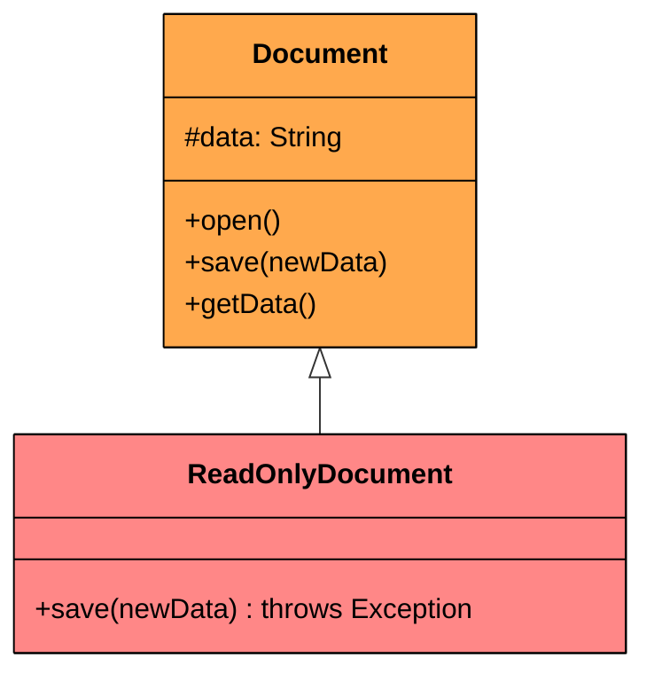
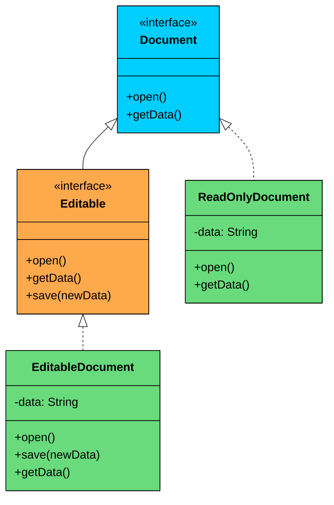

import React from 'react';
import CodeBlock from '../../../../components/ui/CodeBlock';
import Callout from '../../../../components/ui/Callout';

<div className="article-header">
  <div className="breadcrumb">
    <a href="/">Curated Notes</a>
    <span className="breadcrumb-separator">›</span>
    <span className="breadcrumb-current">Liskov Substitution Principle (LSP)</span>
  </div>
  <h1>Liskov Substitution Principle (LSP)</h1>
  <p style={{ color: 'var(--text-muted)', fontSize: '1.1rem', marginBottom: '16px', lineHeight: '1.6' }}>
    Master the essentials of Liskov Substitution Principle (LSP) in this curated guide.
  </p>
  <div className="meta-info">
    <span className="meta-item">
      <svg width="14" height="14" viewBox="0 0 24 24" fill="none" stroke="currentColor" strokeWidth="2"><circle cx="12" cy="12" r="10"/><polyline points="12 6 12 12 16 14"/></svg>
      10 min read
    </span>
    <span className="difficulty-badge difficulty-badge--intermediate">Intermediate</span>
  </div>
</div>

<section className="content-section">

Have you ever passed a subclass into a method expecting the parent class… and watched your program crash or behave in unexpected ways?

Or extended a class… only to find yourself overriding methods just to throw exceptions?

If yes, you’ve probably run into a violation of one of the most misunderstood object-oriented design principles: **The Liskov Substitution Principle (LSP).**

Let’s understand it with a real-world example and why it breaks LSP.

---

## 1. The Problem: A Document System Gone Wrong

Imagine you are building a system to manage different types of documents. You start with a simple base class.


```java
class Document {
    protected String data;

    public Document(String data) {
        this.data = data;
    }

    public void open() {
        System.out.println("Document opened. Data: " + data.substring(0, Math.min(data.length(), 20)) + "...");
    }

    public void save(String newData) {
        this.data = newData;
        System.out.println("Document saved.");
    }

    public String getData() {
        return data;
    }
}
```

```python
class Document:
    def __init__(self, data):
        self.data = data

    def open(self):
        print("Document opened. Data:", self.data[:20] + "...")

    def save(self, new_data):
        self.data = new_data
        print("Document saved.")

    def get_data(self):
        return self.data
```

```cpp
class Document {
protected:
    string data;

public:
    Document(const string& data) : data(data) {}

    virtual void open() const {
        cout << "Document opened. Data: " << data.substr(0, min((size_t)20, data.length())) << "..." << endl;
    }

    virtual void save(const string& newData) {
        data = newData;
        cout << "Document saved." << endl;
    }

    string getData() const {
        return data;
    }

    virtual ~Document() = default;
};
```

```csharp
class Document
{
    protected string data;

    public Document(string data)
    {
        this.data = data;
    }

    public virtual void Open()
    {
        Console.WriteLine("Document opened. Data: " + data.Substring(0, Math.Min(20, data.Length)) + "...");
    }

    public virtual void Save(string newData)
    {
        data = newData;
        Console.WriteLine("Document saved.");
    }

    public string GetData()
    {
        return data;
    }
}
```

```go
package main

import (
    "fmt"
)

type Document struct {
    data string
}

func NewDocument(data string) *Document {
    return &Document{data: data}
}

func (d *Document) Open() {
    preview := d.data
    if len(preview) > 20 {
        preview = preview[:20]
    }
    fmt.Printf("Document opened. Data: %s...\n", preview)
}

func (d *Document) Save(newData string) error {
    d.data = newData
    fmt.Println("Document saved.")
    return nil
}

func (d *Document) GetData() string {
    return d.data
}
```

```typescript
class Document {
    protected data: string;

    constructor(data: string) {
        this.data = data;
    }

    open(): void {
        console.log(`Document opened. Data: ${this.data.substring(0, Math.min(this.data.length, 20))}...`);
    }

    save(newData: string): void {
        this.data = newData;
        console.log("Document saved.");
    }

    getData(): string {
        return this.data;
    }
}
```


Now, a new requirement comes in: "We need a read-only document type for sensitive content like government reports or signed contracts."

You think: a `ReadOnlyDocument` is still a kind of `Document`, so inheritance makes sense. You extend the `Document` class and override `save()` to block writes.


```java
class ReadOnlyDocument extends Document {
    public ReadOnlyDocument(String data) {
        super(data);
    }

    @Override
    public void save(String newData) {
        throw new UnsupportedOperationException("Cannot save a read-only document!");
    }
}
```

```python
class ReadOnlyDocument(Document):
    def __init__(self, data):
        super().__init__(data)

    def save(self, new_data):
        raise UnsupportedOperationException("Cannot save a read-only document!")
```

```cpp
class ReadOnlyDocument : public Document {
public:
    ReadOnlyDocument(const string& data) : Document(data) {}

    void save(const string& /*newData*/) override {
        throw runtime_error("Cannot save a read-only document!");
    }
};
```

```csharp
class ReadOnlyDocument : Document
{
    public ReadOnlyDocument(string data) : base(data) { }

    public override void Save(string newData)
    {
        throw new InvalidOperationException("Cannot save a read-only document!");
    }
}
```

```go
type ReadOnlyDocument struct {
    data string
}

func NewReadOnlyDocument(data string) *ReadOnlyDocument {
    return &ReadOnlyDocument{data: data}
}

func (d *ReadOnlyDocument) Open() {
    preview := d.data
    if len(preview) > 20 {
        preview = preview[:20]
    }
    fmt.Printf("Document opened. Data: %s...\n", preview)
}

func (d *ReadOnlyDocument) Save(newData string) error {
    return fmt.Errorf("cannot save a read-only document")
}

func (d *ReadOnlyDocument) GetData() string {
    return d.data
}
```

```typescript
class ReadOnlyDocument extends Document {
    constructor(data: string) {
        super(data);
    }

    save(newData: string): void {
        throw new Error("Cannot save a read-only document!");
    }
}
```


Seems reasonable, right?

**But Then Reality Hits…**

Let's see how this plays out in client code. A `DocumentProcessor` class takes any `Document` and tries to process and save it.


```java
class DocumentProcessor {
    public void processAndSave(Document doc, String additionalInfo) {
        doc.open();
        String currentData = doc.getData();
        String newData = currentData + " | Processed: " + additionalInfo;
        doc.save(newData); // Critical assumption: all Documents are savable
        System.out.println("Document processing complete.");
    }

    public static void main(String[] args) {
        Document regularDoc = new Document("Initial project proposal content.");
        ReadOnlyDocument confidentialReport = new ReadOnlyDocument("Top secret government data.");

        DocumentProcessor processor = new DocumentProcessor();

        System.out.println("--- Processing Regular Document ---");
        processor.processAndSave(regularDoc, "Reviewed by Alice");

        System.out.println("\n--- Processing ReadOnly Document ---");
        try {
            processor.processAndSave(confidentialReport, "Reviewed by Bob");
        } catch (UnsupportedOperationException e) {
            System.err.println("Error: " + e.getMessage());
        }
    }
}
```

```python
class DocumentProcessor:
    def process_and_save(self, doc, additional_info):
        doc.open()
        current_data = doc.get_data()
        new_data = current_data + " | Processed: " + additional_info
        doc.save(new_data)  # Assumes all Documents are savable
        print("Document processing complete.")

if __name__ == "__main__":
    regular_doc = Document("Initial project proposal content.")
    confidential_report = ReadOnlyDocument("Top secret government data.")

    processor = DocumentProcessor()

    print("--- Processing Regular Document ---")
    processor.process_and_save(regular_doc, "Reviewed by Alice")

    print("\n--- Processing ReadOnly Document ---")
    try:
        processor.process_and_save(confidential_report, "Reviewed by Bob")
    except UnsupportedOperationException as e:
        print("Error:", str(e))
```

```cpp
class DocumentProcessor {
public:
    void processAndSave(Document* doc, const string& additionalInfo) {
        doc->open();
        string currentData = doc->getData();
        string newData = currentData + " | Processed: " + additionalInfo;
        doc->save(newData); // Assumes all Documents are savable
        cout << "Document processing complete." << endl;
    }
};

int main() {
    Document* regularDoc = new Document("Initial project proposal content.");
    Document* confidentialReport = new ReadOnlyDocument("Top secret government data.");

    DocumentProcessor processor;

    cout << "--- Processing Regular Document ---" << endl;
    processor.processAndSave(regularDoc, "Reviewed by Alice");

    cout << "\n--- Processing ReadOnly Document ---" << endl;
    try {
        processor.processAndSave(confidentialReport, "Reviewed by Bob");
    } catch (const exception& e) {
        cerr << "Error: " << e.what() << endl;
    }

    delete regularDoc;
    delete confidentialReport;

    return 0;
}
```

```csharp
class DocumentProcessor
{
    public void ProcessAndSave(Document doc, string additionalInfo)
    {
        doc.Open();
        string currentData = doc.GetData();
        string newData = currentData + " | Processed: " + additionalInfo;
        doc.Save(newData); // Assumes all Documents are savable
        Console.WriteLine("Document processing complete.");
    }

    public static void Main(string[] args)
    {
        Document regularDoc = new Document("Initial project proposal content.");
        Document confidentialReport = new ReadOnlyDocument("Top secret government data.");

        DocumentProcessor processor = new DocumentProcessor();

        Console.WriteLine("--- Processing Regular Document ---");
        processor.ProcessAndSave(regularDoc, "Reviewed by Alice");

        Console.WriteLine("\n--- Processing ReadOnly Document ---");
        try
        {
            processor.ProcessAndSave(confidentialReport, "Reviewed by Bob");
        }
        catch (InvalidOperationException e)
        {
            Console.Error.WriteLine("Error: " + e.Message);
        }
    }
}
```

```go
type DocumentProcessor struct{}

func (p *DocumentProcessor) ProcessAndSave(doc *Document, additionalInfo string) {
    doc.Open()
    currentData := doc.GetData()
    newData := currentData + " | Processed: " + additionalInfo
    doc.Save(newData) // Assumes all Documents are savable
    fmt.Println("Document processing complete.")
}

func main() {
    regularDoc := NewDocument("Initial project proposal content.")
    // Problem: ReadOnlyDocument is a different type, but if we use
    // a shared interface, its Save() will return an error at runtime.

    processor := &DocumentProcessor{}

    fmt.Println("--- Processing Regular Document ---")
    processor.ProcessAndSave(regularDoc, "Reviewed by Alice")

    // Passing a ReadOnlyDocument here would cause a runtime error
    fmt.Println("\n--- Processing ReadOnly Document ---")
    readOnlyDoc := NewReadOnlyDocument("Top secret government data.")
    err := readOnlyDoc.Save("Reviewed by Bob")
    if err != nil {
        fmt.Println("Error:", err.Error())
    }
}
```

```typescript
class DocumentProcessor {
    processAndSave(doc: Document, additionalInfo: string): void {
        doc.open();
        const currentData = doc.getData();
        const newData = currentData + " | Processed: " + additionalInfo;
        doc.save(newData); // Critical assumption: all Documents are savable
        console.log("Document processing complete.");
    }

    static main(): void {
        const regularDoc = new Document("Initial project proposal content.");
        const confidentialReport = new ReadOnlyDocument("Top secret government data.");

        const processor = new DocumentProcessor();

        console.log("--- Processing Regular Document ---");
        processor.processAndSave(regularDoc, "Reviewed by Alice");

        console.log("\n--- Processing ReadOnly Document ---");
        try {
            processor.processAndSave(confidentialReport, "Reviewed by Bob");
        } catch (e) {
            console.error(`Error: ${(e as Error).message}`);
        }
    }
}

DocumentProcessor.main();
```


**Output:**


```plaintext
--- Processing Regular Document ---
Document opened. Data: Initial project proposal content.
Document saved.
Document processing complete.

--- Processing ReadOnly Document ---
Document opened. Data: Top secret government data.
Error: Cannot save a read-only document!
```


The client code expected *any* `Document` to be savable. But when it received a `ReadOnlyDocument`, that assumption exploded into a runtime exception.

#### **What Went Wrong?**

At the heart of this failure is a violation of a fundamental design principle: the Liskov Substitution Principle. Our subtype (`ReadOnlyDocument`) cannot be seamlessly substituted for its base type (`Document`) without altering the desired behavior of the program.

If you ever find yourself overriding a method just to throw an exception, or adding subtype-specific conditions in client code, you are likely violating LSP.





`ReadOnlyDocument` inherits `save()` from `Document` but throws an exception instead of saving, breaking the contract that any `Document` should be saveable.

---

## 2. Introducing the Liskov Substitution Principle (LSP)

&gt; **"If S is a subtype of T, then objects of type T may be replaced with objects of type S without altering any of the desirable properties of that program (correctness, task performed, etc.)."**
&gt;
&gt;  — 
&gt;
&gt; *Barbara Liskov, 1987*

In simpler terms: if a class `S` extends or implements class `T`, then you should be able to use `S` anywhere `T` is expected, without breaking the program's behavior or logic.

Subtypes must honor the expectations set by their base types. The client code should not need to know or care which specific subtype it is dealing with. Everything should "just work."

#### Why Does LSP Matter?

#### **1. Reliability and Predictability**

When LSP is followed, your code behaves consistently. You can substitute any subtype and still get the behavior your client code expects. No unpleasant surprises.

#### **2. Reduced Bugs**

LSP violations often lead to conditional logic (e.g., `if (obj instanceof ReadOnlyDocument)`) in client code to handle subtypes differently. This is a code smell. It is a sign that your design is leaking abstraction. When client code has to "know" the subtype to behave correctly, you have broken polymorphism.

#### **3. Maintainability and Extensibility**

Well-behaved hierarchies are easier to understand, maintain, and extend. You can add new subtypes without fear of breaking existing code that relies on the base type's contract.

#### **4. True Polymorphism**

LSP is what makes polymorphism truly powerful. You can write generic algorithms that operate on a base type, confident that they will work correctly with any current or future subtype.

#### **5. Testability**

Tests written for the base class's interface should, in theory, pass for all its subtypes if LSP is respected. This means you can reuse test suites and trust that your inheritance hierarchies are well-formed.

Essentially, LSP helps you build systems that are easier to extend, less prone to bugs, and far more resilient to change.

---

## 3. Implementing LSP

Let’s refactor our design so that subtypes like `ReadOnlyDocument` can be used **without violating the expectations** set by the base type.

The root problem was that the base class `Document` **assumed all documents are editable**, but not all documents should be. To fix this, we need to:

1. Separate **editable** behavior from **read-only** behavior
2. Use **interfaces or abstract types** to model capabilities explicitly

#### Step 1: Define Behavior Interfaces

Instead of having one base class with assumptions about mutability, let’s break responsibilities apart:


```java
interface Document {
    void open();
    String getData();
}

interface Editable extends Document {
    void save(String newData);
}
```

```python
from abc import ABC, abstractmethod

class Document(ABC):
    @abstractmethod
    def open(self):
        pass

    @abstractmethod
    def get_data(self):
        pass

class Editable(Document):
    @abstractmethod
    def save(self, new_data):
        pass
```

```cpp
class Document {
public:
    virtual void open() const = 0;
    virtual string getData() const = 0;
    virtual ~Document() = default;
};

class Editable : public Document {
public:
    virtual void save(const string& newData) = 0;
};
```

```csharp
interface IDocument
{
    void Open();
    string GetData();
}

interface IEditable : IDocument
{
    void Save(string newData);
}
```

```go
type DocumentReader interface {
    Open()
    GetData() string
}

type Editable interface {
    DocumentReader
    Save(newData string)
}
```

```typescript
interface Document {
    open(): void;
    getData(): string;
}

interface Editable extends Document {
    save(newData: string): void;
}
```


The `Document` interface represents read-only access: the ability to open and view data. `Editable` extends `Document`, adding the ability to save. Anything `Editable` is automatically a `Document` too, but not every `Document` is `Editable`. This clearly defines what each object can do, and prevents clients from assuming editability unless explicitly promised.

#### Step 2: Implement `EditableDocument` and `ReadOnlyDocument`

Now we implement our two concrete types. The `EditableDocument` implements `Editable` (which already includes everything from `Document`), while the `ReadOnlyDocument` implements only `Document`.

#### **EditableDocument**


```java
class EditableDocument implements Editable {
    private String data;

    public EditableDocument(String data) {
        this.data = data;
    }

    @Override
    public void open() {
        System.out.println("Editable Document opened. Data: " + preview());
    }

    @Override
    public void save(String newData) {
        this.data = newData;
        System.out.println("Document saved.");
    }

    @Override
    public String getData() {
        return data;
    }

    private String preview() {
        return data.substring(0, Math.min(data.length(), 20)) + "...";
    }
}
```

```python
class EditableDocument(Editable):
    def __init__(self, data):
        self.data = data

    def open(self):
        print("Editable Document opened. Data:", self._preview())

    def save(self, new_data):
        self.data = new_data
        print("Document saved.")

    def get_data(self):
        return self.data

    def _preview(self):
        return self.data[:20] + "..."
```

```cpp
class EditableDocument : public Editable {
private:
    string data;

    string preview() const {
        return data.substr(0, min((size_t)20, data.length())) + "...";
    }

public:
    EditableDocument(const string& data) : data(data) {}

    void open() const override {
        cout << "Editable Document opened. Data: " << preview() << endl;
    }

    void save(const string& newData) override {
        data = newData;
        cout << "Document saved." << endl;
    }

    string getData() const override {
        return data;
    }
};
```

```csharp
public class EditableDocument : IEditable
{
    private string data;

    public EditableDocument(string data)
    {
        this.data = data;
    }

    public void Open()
    {
        Console.WriteLine("Editable Document opened. Data: " + Preview());
    }

    public void Save(string newData)
    {
        data = newData;
        Console.WriteLine("Document saved.");
    }

    public string GetData()
    {
        return data;
    }

    private string Preview()
    {
        return data.Substring(0, Math.Min(20, data.Length)) + "...";
    }
}
```

```go
type EditableDocument struct {
    data string
}

func NewEditableDocument(data string) *EditableDocument {
    return &EditableDocument{data: data}
}

func (d *EditableDocument) Open() {
    fmt.Printf("Editable Document opened. Data: %s\n", d.preview())
}

func (d *EditableDocument) Save(newData string) {
    d.data = newData
    fmt.Println("Document saved.")
}

func (d *EditableDocument) GetData() string {
    return d.data
}

func (d *EditableDocument) preview() string {
    if len(d.data) > 20 {
        return d.data[:20] + "..."
    }
    return d.data + "..."
}
```

```typescript
class EditableDocument implements Editable {
    private data: string;

    constructor(data: string) {
        this.data = data;
    }

    open(): void {
        console.log(`Editable Document opened. Data: ${this.preview()}`);
    }

    save(newData: string): void {
        this.data = newData;
        console.log("Document saved.");
    }

    getData(): string {
        return this.data;
    }

    private preview(): string {
        return this.data.substring(0, Math.min(this.data.length, 20)) + "...";
    }
}
```


#### **ReadOnlyDocument**


```java
class ReadOnlyDocument implements Document {
    private final String data;

    public ReadOnlyDocument(String data) {
        this.data = data;
    }

    @Override
    public void open() {
        System.out.println("Read-Only Document opened. Data: " + preview());
    }

    @Override
    public String getData() {
        return data;
    }

    private String preview() {
        return data.substring(0, Math.min(data.length(), 20)) + "...";
    }
}
```

```python
class ReadOnlyDocument(Document):
    def __init__(self, data):
        self.data = data

    def open(self):
        print("Read-Only Document opened. Data:", self._preview())

    def get_data(self):
        return self.data

    def _preview(self):
        return self.data[:20] + "..."
```

```cpp
class ReadOnlyDocument : public Document {
private:
    string data;

    string preview() const {
        return data.substr(0, min((size_t)20, data.length())) + "...";
    }

public:
    ReadOnlyDocument(const string& data) : data(data) {}

    void open() const override {
        cout << "Read-Only Document opened. Data: " << preview() << endl;
    }

    string getData() const override {
        return data;
    }
};
```

```csharp
class ReadOnlyDocument : IDocument
{
    private readonly string data;

    public ReadOnlyDocument(string data)
    {
        this.data = data;
    }

    public void Open()
    {
        Console.WriteLine("Read-Only Document opened. Data: " + Preview());
    }

    public string GetData()
    {
        return data;
    }

    private string Preview()
    {
        return data.Substring(0, Math.Min(20, data.Length)) + "...";
    }
}
```

```go
type ReadOnlyDoc struct {
    data string
}

func NewReadOnlyDoc(data string) *ReadOnlyDoc {
    return &ReadOnlyDoc{data: data}
}

func (d *ReadOnlyDoc) Open() {
    fmt.Printf("Read-Only Document opened. Data: %s\n", d.preview())
}

func (d *ReadOnlyDoc) GetData() string {
    return d.data
}

func (d *ReadOnlyDoc) preview() string {
    if len(d.data) > 20 {
        return d.data[:20] + "..."
    }
    return d.data + "..."
}
```

```typescript
class ReadOnlyDocument implements Document {
    private readonly data: string;

    constructor(data: string) {
        this.data = data;
    }

    open(): void {
        console.log(`Read-Only Document opened. Data: ${this.preview()}`);
    }

    getData(): string {
        return this.data;
    }

    private preview(): string {
        return this.data.substring(0, Math.min(this.data.length, 20)) + "...";
    }
}
```


Now both types are valid `Document` objects. `EditableDocument` implements `Editable` (which includes `Document`), while `ReadOnlyDocument` implements only `Document`. There is no risk of calling `save()` on a read-only document, because it simply is not part of its contract.





Now the design is clean. `Editable` extends `Document`, so `EditableDocument` gets both reading and writing through a single interface. `ReadOnlyDocument` implements only `Document`. A `ReadOnlyDocument` never promises `save()` functionality, so it can never break that contract.

#### Step 3: Refactor the Client Code

Now let's update `DocumentProcessor` to work with these new interfaces. Since `Editable` extends `Document`, the `processAndSave` method simply accepts an `Editable` parameter. 

The processor has two methods: `process()` accepts any `Document` for reading, and `processAndSave()` accepts an `Editable`, which guarantees both reading and writing capabilities. If you try to pass a `ReadOnlyDocument` to `processAndSave()`, the compiler rejects it before the program ever runs.


```java
class DocumentProcessor {
    public void process(Document doc) {
        doc.open();
        System.out.println("Document processed.");
    }

    public void processAndSave(Editable doc, String additionalInfo) {
        doc.open();
        String currentData = doc.getData();
        String newData = currentData + " | Processed: " + additionalInfo;
        doc.save(newData);
        System.out.println("Editable document processed and saved.");
    }
}
```

```python
class DocumentProcessor:
    def process(self, doc: Document):
        doc.open()
        print("Document processed.")

    def process_and_save(self, doc: Editable, additional_info: str):
        doc.open()
        current_data = doc.get_data()
        new_data = current_data + " | Processed: " + additional_info
        doc.save(new_data)
        print("Editable document processed and saved.")
```

```cpp
class DocumentProcessor {
public:
    void process(const Document* doc) const {
        doc->open();
        cout << "Document processed." << endl;
    }

    void processAndSave(Editable& doc, const string& additionalInfo) {
        doc.open();
        string currentData = doc.getData();
        string newData = currentData + " | Processed: " + additionalInfo;
        doc.save(newData);
        cout << "Editable document processed and saved." << endl;
    }
};
```

```csharp
class DocumentProcessor
{
    public void Process(IDocument doc)
    {
        doc.Open();
        Console.WriteLine("Document processed.");
    }

    public void ProcessAndSave(IEditable doc, string additionalInfo)
    {
        doc.Open();
        string currentData = doc.GetData();
        string newData = currentData + " | Processed: " + additionalInfo;
        doc.Save(newData);
        Console.WriteLine("Editable document processed and saved.");
    }
}
```

```go
type DocProcessor struct{}

func (p *DocProcessor) Process(doc DocumentReader) {
    doc.Open()
    fmt.Println("Document processed.")
}

func (p *DocProcessor) ProcessAndSave(doc Editable, additionalInfo string) {
    doc.Open()
    currentData := doc.GetData()
    newData := currentData + " | Processed: " + additionalInfo
    doc.Save(newData)
    fmt.Println("Editable document processed and saved.")
}
```

```typescript
class DocumentProcessor {
    process(doc: Document): void {
        doc.open();
        console.log("Document processed.");
    }

    processAndSave(doc: Editable, additionalInfo: string): void {
        doc.open();
        const currentData = doc.getData();
        const newData = currentData + " | Processed: " + additionalInfo;
        doc.save(newData);
        console.log("Editable document processed and saved.");
    }
}
```


Notice there is no `instanceof` check or runtime type verification anywhere. Because `Editable` extends `Document`, the `processAndSave` method accepts an `Editable` and gets access to both `open()`/`getData()` and `save()` through a single parameter. 

The type system itself prevents you from passing a `ReadOnlyDocument` to `processAndSave()`. If you try, the compiler rejects it. This is the real power of the LSP-compliant design: correctness is enforced at compile time, not discovered at runtime through exceptions.

Here is a usage example showing the refactored code in action.


```java
class Main {
    public static void main(String[] args) {
        EditableDocument editable = new EditableDocument("Draft proposal for Q3.");
        ReadOnlyDocument readOnly = new ReadOnlyDocument("Top secret strategy.");

        DocumentProcessor processor = new DocumentProcessor();

        System.out.println("--- Processing Editable Document ---");
        processor.processAndSave(editable, "Reviewed by Alice");

        System.out.println("\n--- Processing Read-Only Document ---");
        processor.process(readOnly); // Works fine

        // processor.processAndSave(readOnly, "Reviewed by Bob");
        // Won't compile! ReadOnlyDocument doesn't implement Editable.
    }
}
```

```python
if __name__ == "__main__":
    editable = EditableDocument("Draft proposal for Q3.")
    read_only = ReadOnlyDocument("Top secret strategy.")

    processor = DocumentProcessor()

    print("--- Processing Editable Document ---")
    processor.process_and_save(editable, "Reviewed by Alice")

    print("\n--- Processing Read-Only Document ---")
    processor.process(read_only)  # This works fine
```

```cpp
int main() {
    EditableDocument editable("Draft proposal for Q3.");
    ReadOnlyDocument readOnly("Top secret strategy.");
    DocumentProcessor processor;

    cout << "--- Processing Editable Document ---" << endl;
    processor.processAndSave(editable, "Reviewed by Alice");

    cout << "\n--- Processing Read-Only Document ---" << endl;
    processor.process(&readOnly); // Works fine

    // processor.processAndSave(readOnly, "Reviewed by Bob");
    // Won't compile! ReadOnlyDocument doesn't have save().

    return 0;
}
```

```csharp
public class Program
{
    public static void Main()
    {
        var editable = new EditableDocument("Draft proposal for Q3.");
        var readOnly = new ReadOnlyDocument("Top secret strategy.");

        DocumentProcessor processor = new DocumentProcessor();

        Console.WriteLine("--- Processing Editable Document ---");
        processor.ProcessAndSave(editable, "Reviewed by Alice");

        Console.WriteLine("\n--- Processing Read-Only Document ---");
        processor.Process(readOnly); // Works fine

        // processor.ProcessAndSave(readOnly, "Reviewed by Bob");
        // Won't compile! ReadOnlyDocument doesn't implement IEditable.
    }
}
```

```go
func main() {
    editable := NewEditableDocument("Draft proposal for Q3.")
    readOnly := NewReadOnlyDoc("Top secret strategy.")

    processor := &DocProcessor{}

    fmt.Println("--- Processing Editable Document ---")
    processor.ProcessAndSave(editable, "Reviewed by Alice")

    fmt.Println("\n--- Processing Read-Only Document ---")
    processor.Process(readOnly) // This works fine
}
```

```typescript
class Main {
    static main(): void {
        const editable = new EditableDocument("Draft proposal for Q3.");
        const readOnly = new ReadOnlyDocument("Top secret strategy.");

        const processor = new DocumentProcessor();

        console.log("--- Processing Editable Document ---");
        processor.processAndSave(editable, "Reviewed by Alice");

        console.log("\n--- Processing Read-Only Document ---");
        processor.process(readOnly); // Works fine

        // processor.processAndSave(readOnly, "Reviewed by Bob");
        // Won't compile! ReadOnlyDocument doesn't implement Editable.
    }
}

Main.main();
```


---

## 4. Common Pitfalls While Applying LSP

Understanding the Liskov Substitution Principle is one thing. Applying it correctly in the real world is where the challenges begin. Here are some of the most common traps to watch out for.

#### 1. The “Is-A” Linguistic Trap

Just because something *sounds* like it "is a" something else in natural language does not mean it is a valid subtype in code.

Take this classic example:


&gt; **WARNING**
&gt;
&gt; A **penguin** *is a* **bird**, but penguins can’t fly.If your `Bird` class has a `fly()` method, and you override it in `Penguin` to throw an exception or do nothing—you've violated LSP.


The key insight: subtyping must be based on behavior, not just taxonomy. A penguin might be a bird in biology, but if your `Bird` interface promises flight, then `Penguin` is not a valid subtype.

#### 2. Overriding Methods to Do Nothing or Throw Exceptions

If you find yourself writing code like this:


```java
@Override
public void save(String data) {
    throw new UnsupportedOperationException("Not supported.");
}
```


That is a clear warning sign. If a subclass cannot meaningfully implement a method defined in the base class, it is likely not a valid subtype. This leads to brittle code and runtime surprises, which is exactly what LSP aims to prevent.

#### 3. Violating Preconditions or Postconditions

Changing the assumptions of a method is a subtle but dangerous LSP violation.

- **Precondition violation**: The subtype requires more than the base class contract promised. For example, a base class method accepts any positive number, but the subtype requires the number to be greater than 100.
- **Postcondition violation**: The subtype delivers less than the base class guaranteed. For example, a base class method guarantees a non-null return value, but the subtype sometimes returns null.

These break the trust that clients place in the base class's behavior.

#### 4. Type Checks in Client Code

Code like this is often a symptom of broken design:


```java
if (document instanceof ReadOnlyDocument) {
    // Special-case logic
}
```


Whenever client code has to know the exact subtype to behave correctly, you have violated the principle of substitution. Polymorphism should make the client code unaware of specific subtypes. If you are relying on `instanceof`, it is time to revisit your abstraction.

#### 5. Restricting or Relaxing Behavior Unexpectedly

Subclasses should not arbitrarily tighten or loosen the behavior defined by the base class. For example, making a mutable property in the base class immutable in the subclass (or vice versa) can lead to subtle bugs. Changing validation logic in ways that break existing assumptions in client code is another LSP violation.

Consistency is key. If the base type makes a promise, every subtype must keep it.

---

## 5. Common Questions About LSP


&gt; #### "Isn’t LSP just about “good inheritance”?"

**Yes, but it’s more precise.**LSP defines what *correct* behavioral inheritance actually looks like. It’s not just about **reusing code**, it’s about preserving **correctness and intention**.

Think of LSP as a **safety net for polymorphism**. It ensures your abstractions can scale and evolve cleanly.


&gt; #### "What if my subclass really can’t do what the base class does?"

This is **exactly when you should stop and rethink your hierarchy**.

Some options:

- **Maybe it shouldn’t be a subtype at all**: A `ReadOnlyDocument` that can't be saved probably shouldn't inherit from a `Document` class that supports saving.
- **Split responsibilities**: Use interfaces like `Readable`, `Editable`, etc., to model capabilities explicitly.
- **Favor composition over inheritance**: Instead of trying to "be" something, let your object **have** a capability.


&gt; #### "Does this mean I can never use `instanceof` or casting?"

Not never, but be cautious.

There are **legitimate, narrow use cases**: implementing `equals()`, serialization, certain framework hooks.

But if you’re using `instanceof` to drive **business logic** or alter behavior, you’re likely covering up an LSP violation.

**Ask yourself:**

&gt; “Am I using this because I broke polymorphism?”

If yes, revisit your design.


</section>
