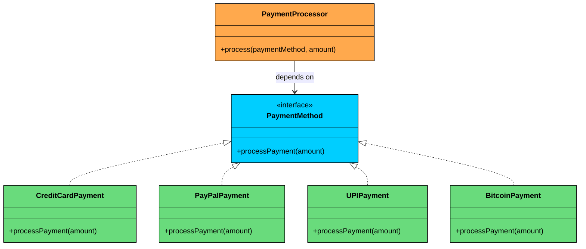

import React from 'react';
import CodeBlock from '../../../../components/ui/CodeBlock';
import Callout from '../../../../components/ui/Callout';

<div className="article-header">
  <div className="breadcrumb">
    <a href="/">Curated Notes</a>
    <span className="breadcrumb-separator">›</span>
    <span className="breadcrumb-current">Open-Closed Principle (OCP)</span>
  </div>
  <h1>Open-Closed Principle (OCP)</h1>
  <p style={{ color: 'var(--text-muted)', fontSize: '1.1rem', marginBottom: '16px', lineHeight: '1.6' }}>
    Master the essentials of Open-Closed Principle (OCP) in this curated guide.
  </p>
  <div className="meta-info">
    <span className="meta-item">
      <svg width="14" height="14" viewBox="0 0 24 24" fill="none" stroke="currentColor" strokeWidth="2"><circle cx="12" cy="12" r="10"/><polyline points="12 6 12 12 16 14"/></svg>
      10 min read
    </span>
    <span className="difficulty-badge difficulty-badge--intermediate">Intermediate</span>
  </div>
</div>

<section className="content-section">

Have you ever added a new feature to your codebase… only to find yourself editing dozens of existing classes, introducing bugs in places you didn’t even touch before?

Or been afraid to change something because… well, it *might* break something else?

If so, your code is likely violating one of the most important principles of object-oriented design: the **Open-Closed Principle (OCP).**

This chapter explains what OCP really means, why modifying existing code to add new features is risky, how to design systems that welcome new behavior without touching old code, and the common traps developers fall into when applying this principle.

---

## 1. The Problem: A Growing Payment System

Imagine you're building the checkout feature of an e-commerce platform. Initially, you only have one payment method: **Credit Card**.

Your `PaymentProcessor` class might look something like this (simplified, of course):


```java
class PaymentProcessor {
    public void processCreditCardPayment(double amount) {
        System.out.println("Processing credit card payment of $" + amount);
        // Complex logic for credit card processing
    }
}
```

```python
class PaymentProcessor:
    def process_credit_card_payment(self, amount):
        print(f"Processing credit card payment of ${amount}")
        # Complex logic for credit card processing
```

```cpp
class PaymentProcessor {
public:
    void processCreditCardPayment(double amount) {
        cout << "Processing credit card payment of $" << amount << endl;
        // Complex logic for credit card processing
    }
};
```

```csharp
class PaymentProcessor
{
    public void ProcessCreditCardPayment(double amount)
    {
        Console.WriteLine($"Processing credit card payment of ${amount}");
        // Complex logic for credit card processing
    }
}
```

```go
type PaymentProcessor struct{}

func (p *PaymentProcessor) ProcessCreditCardPayment(amount float64) {
    fmt.Printf("Processing credit card payment of $%.2f\n", amount)
    // Complex logic for credit card processing
}
```

```typescript
class PaymentProcessor {
    processCreditCardPayment(amount: number): void {
        console.log(`Processing credit card payment of $${amount}`);
        // Complex logic for credit card processing
    }
}
```


And here is how you use it in your checkout service:


```java
class CheckoutService {
    public void processPayment() {
        PaymentProcessor processor = new PaymentProcessor();
        processor.processCreditCardPayment(100.00);
    }
}
```

```python
class CheckoutService:
    def process_payment(self, payment_type):
        processor = PaymentProcessor()
        processor.process_credit_card_payment(100.00)
```

```cpp
class CheckoutService {
public:
    void processPayment(const string& paymentType) {
        PaymentProcessor processor;
        processor.processCreditCardPayment(100.00);
    }
};
```

```csharp
class CheckoutService
{
    public void ProcessPayment(string paymentType)
    {
        PaymentProcessor processor = new PaymentProcessor();
          processor.ProcessCreditCardPayment(100.00);
    }
}
```

```go
type CheckoutService struct{}

func (c *CheckoutService) ProcessPayment() {
    processor := &PaymentProcessor{}
    processor.ProcessCreditCardPayment(100.00)
}
```

```typescript
class CheckoutService {
    processPayment(): void {
        const processor = new PaymentProcessor();
        processor.processCreditCardPayment(100.00);
    }
}
```


So far, so good. But then your client comes along and says, "Hey, we need to add PayPal payments too."

No big deal, right? You go back and modify your `PaymentProcessor` class to handle both:


```java
class PaymentProcessor {
    public void processCreditCardPayment(double amount) {
        System.out.println("Processing credit card payment of $" + amount);
        // Complex logic for credit card processing
    }

    public void processPayPalPayment(double amount) {
        System.out.println("Processing PayPal payment of $" + amount);
        // Logic for PayPal processing
    }
}
```

```python
class PaymentProcessor:
    def process_credit_card_payment(self, amount):
        print(f"Processing credit card payment of ${amount}")
        # Complex logic for credit card processing

    def process_paypal_payment(self, amount):
        print(f"Processing PayPal payment of ${amount}")
        # Logic for PayPal processing
```

```cpp
class PaymentProcessor {
public:
    void processCreditCardPayment(double amount) {
        cout << "Processing credit card payment of $" << amount << endl;
        // Complex logic for credit card processing
    }

    void processPayPalPayment(double amount) {
        cout << "Processing PayPal payment of $" << amount << endl;
        // Logic for PayPal processing
    }
};
```

```csharp
class PaymentProcessor
{
    public void ProcessCreditCardPayment(double amount)
    {
        Console.WriteLine($"Processing credit card payment of ${amount}");
        // Complex logic for credit card processing
    }

    public void ProcessPayPalPayment(double amount)
    {
        Console.WriteLine($"Processing PayPal payment of ${amount}");
        // Logic for PayPal processing
    }
}
```

```go
type PaymentProcessor struct{}

func (p *PaymentProcessor) ProcessCreditCardPayment(amount float64) {
    fmt.Printf("Processing credit card payment of $%.2f\n", amount)
    // Complex logic for credit card processing
}

func (p *PaymentProcessor) ProcessPayPalPayment(amount float64) {
    fmt.Printf("Processing PayPal payment of $%.2f\n", amount)
    // Logic for PayPal processing
}
```

```typescript
class PaymentProcessor {
    processCreditCardPayment(amount: number): void {
        console.log(`Processing credit card payment of ${amount}`);
        // Complex logic for credit card processing
    }

    processPayPalPayment(amount: number): void {
        console.log(`Processing PayPal payment of ${amount}`);
        // Logic for PayPal processing
    }
}
```


Then you update your `CheckoutService` to pick the right method based on the payment type:


```java
class CheckoutService {
    public void processPayment(String paymentType) {
        PaymentProcessor processor = new PaymentProcessor();

        if ("CreditCard".equals(paymentType)) {
            processor.processCreditCardPayment(100.00);
        } else if ("PayPal".equals(paymentType)) {
            processor.processPayPalPayment(100.00);
        }
    }
}
```

```python
class CheckoutService:
    def process_payment(self, payment_type):
        processor = PaymentProcessor()

        if payment_type == "CreditCard":
            processor.process_credit_card_payment(100.00)
        elif payment_type == "PayPal":
            processor.process_paypal_payment(100.00)
```

```cpp
class CheckoutService {
public:
    void processPayment(const string& paymentType) {
        PaymentProcessor processor;

        if (paymentType == "CreditCard") {
            processor.processCreditCardPayment(100.00);
        } else if (paymentType == "PayPal") {
            processor.processPayPalPayment(100.00);
        }
    }
};
```

```csharp
class CheckoutService
{
    public void ProcessPayment(string paymentType)
    {
        PaymentProcessor processor = new PaymentProcessor();

        if (paymentType == "CreditCard")
        {
            processor.ProcessCreditCardPayment(100.00);
        }
        else if (paymentType == "PayPal")
        {
            processor.ProcessPayPalPayment(100.00);
        }
    }
}
```

```go
type CheckoutService struct{}

func (c *CheckoutService) ProcessPayment(paymentType string) {
    processor := &PaymentProcessor{}

    if paymentType == "CreditCard" {
        processor.ProcessCreditCardPayment(100.00)
    } else if paymentType == "PayPal" {
        processor.ProcessPayPalPayment(100.00)
    }
}
```

```typescript
class CheckoutService {
    processPayment(paymentType: string): void {
        const processor = new PaymentProcessor();

        if (paymentType === "CreditCard") {
            processor.processCreditCardPayment(100.00);
        } else if (paymentType === "PayPal") {
            processor.processPayPalPayment(100.00);
        }
    }
}
```


Now it works for two methods. But guess what happens when the client wants you to add **UPI**, **Bitcoin**, or **Apple Pay**?

Each time, you are cracking open the `PaymentProcessor` class. Each time, you are adding another `else if` branch to `CheckoutService`. And each modification carries real risk.

#### Why This Is a Problem

Every time you modify an existing class to add new functionality, you expose yourself to several dangers.

**1. Introducing Bugs.** You might accidentally break the existing credit card or PayPal functionality while adding the new payment method. A misplaced brace, a wrong variable name, a copy-paste error. These things happen, and they happen more often in large, multi-branch classes.

**2. Increased Testing Overhead.** Every time you change the class, you need to re-test *all* of its functionality, not just the new part. The credit card processing still works, right? The PayPal flow still handles refunds correctly? You have to verify everything again.

**3. Reduced Readability.** The class becomes a sprawling collection of `if-else if` statements or a `switch` case that is hard to navigate and understand. New team members will struggle to figure out where one payment method ends and another begins.

**4. Scalability Issues.** Adding new payment types becomes progressively more difficult and error-prone. With ten payment methods, the class is a nightmare to maintain.

This constant modification is a direct violation of the **Open-Closed Principle**.

---

## 2. Introducing the Open-Closed Principle (OCP)

&gt; **Software entities (classes, modules, functions, etc.) should be open for extension, but closed for modification.**
&gt;
&gt;  — Bertrand Meyer

Let's break that down:

- **Open for Extension:** The behavior of the entity can be extended. As new requirements come in (like new payment types), you should be able to add new behavior without touching existing code.
- **Closed for Modification:** The existing, working code should not be changed. Once it is written, tested, and working, you should not need to go back and alter it to add new features.

Sounds like a paradox, right? How can you add new features without changing existing code? The answer lies in **abstraction**. 

By programming against interfaces rather than concrete implementations, you can introduce new behavior simply by creating new classes that implement the existing interface.

The following diagram shows what an OCP-compliant design looks like for our payment system. The `PaymentProcessor` depends on a `PaymentMethod` interface, and each concrete payment type implements that interface. 

Adding a new payment method, like `BitcoinPayment`, means creating a new class. Nothing existing changes.





Notice how `PaymentProcessor` only knows about the `PaymentMethod` interface. It has no idea whether it is processing a credit card, PayPal, UPI, or Bitcoin transaction. All the concrete implementations can be swapped in freely. 

---

## 3. Why Does OCP Matter?

Before we jump into the implementation, let's understand why this principle is worth the effort.

- **Improved Maintainability:** When you add new features by adding new code rather than changing old code, you reduce the risk of breaking existing functionality. This makes your system much easier to maintain in the long run.
- **Enhanced Scalability:** New features or variations can be added with minimal impact on the existing system. Your codebase becomes more flexible and adaptable to change.
- **Reduced Risk:** Since you're not touching the battle-tested existing code, the chances of introducing regressions (bugs in old features) are significantly lower. This means more confidence during deployments.
- **Better Testability:** New extensions can be tested in isolation. You don't need to re-test the entire system every time a new piece of functionality is added.
- **Increased Reusability:** Well-designed, closed modules are often more reusable across different parts of an application or even in different projects.
- **Clearer Code:** OCP often leads to designs where responsibilities are more clearly separated, making the code easier to understand and reason about.

Now let's see how to achieve all of this in practice.

---

## 4. Implementing OCP

Let's revisit our `PaymentProcessor` and see how we can make it OCP-compliant. The key is to introduce an abstraction for the payment methods. 

#### Step 1: Define an Interface

We create a `PaymentMethod` interface that defines a contract for all payment types. Every payment method must implement a `processPayment` method.


```java
interface PaymentMethod {
    void processPayment(double amount);
}
```

```python
class PaymentMethod(ABC):
    @abstractmethod
    def process_payment(self, amount):
        pass
```

```cpp
class PaymentMethod {
public:
    virtual void processPayment(double amount) = 0;
    virtual ~PaymentMethod() = default;
};
```

```csharp
interface IPaymentMethod
{
    void ProcessPayment(double amount);
}
```

```go
type PaymentMethod interface {
    ProcessPayment(amount float64)
}
```

```typescript
interface PaymentMethod {
    processPayment(amount: number): void;
}
```


#### Step 2: Implement Concrete Strategies

Now, for each payment type, we create a separate class that implements this interface. Each class is self-contained and knows only about its own payment logic.


```java
class CreditCardPayment implements PaymentMethod {
    @Override
    public void processPayment(double amount) {
        System.out.println("Processing credit card payment of $" + amount);
        // Complex logic for credit card processing
    }
}

class PayPalPayment implements PaymentMethod {
    @Override
    public void processPayment(double amount) {
        System.out.println("Processing PayPal payment of $" + amount);
        // Logic for PayPal processing
    }
}

// Let's add a new one without touching existing code!
class UPIPayment implements PaymentMethod {
    @Override
    public void processPayment(double amount) {
        System.out.println("Processing UPI payment of ₹" + amount * 80); // Assuming a conversion rate for example
        // Logic for UPI processing
    }
}
```

```python
class CreditCardPayment(PaymentMethod):
    def process_payment(self, amount):
        print(f"Processing credit card payment of ${amount}")
        # Complex logic for credit card processing

class PayPalPayment(PaymentMethod):
    def process_payment(self, amount):
        print(f"Processing PayPal payment of ${amount}")
        # Logic for PayPal processing

class UPIPayment(PaymentMethod):
    def process_payment(self, amount):
        print(f"Processing UPI payment of ₹{amount * 80}")  # Assuming conversion rate
        # Logic for UPI processing
```

```cpp
class CreditCardPayment : public PaymentMethod {
public:
    void processPayment(double amount) override {
        cout << "Processing credit card payment of $" << amount << endl;
        // Complex logic for credit card processing
    }
};

class PayPalPayment : public PaymentMethod {
public:
    void processPayment(double amount) override {
        cout << "Processing PayPal payment of $" << amount << endl;
        // Logic for PayPal processing
    }
};

class UPIPayment : public PaymentMethod {
public:
    void processPayment(double amount) override {
        cout << "Processing UPI payment of ₹" << amount * 80 << endl;
        // Logic for UPI processing
    }
};
```

```csharp
class CreditCardPayment : IPaymentMethod
{
    public void ProcessPayment(double amount)
    {
        Console.WriteLine($"Processing credit card payment of ${amount}");
        // Complex logic for credit card processing
    }
}

class PayPalPayment : IPaymentMethod
{
    public void ProcessPayment(double amount)
    {
        Console.WriteLine($"Processing PayPal payment of ${amount}");
        // Logic for PayPal processing
    }
}

class UPIPayment : IPaymentMethod
{
    public void ProcessPayment(double amount)
    {
        Console.WriteLine($"Processing UPI payment of ₹{amount * 80}");
        // Logic for UPI processing
    }
}
```

```go
type CreditCardPayment struct{}

func (c *CreditCardPayment) ProcessPayment(amount float64) {
    fmt.Printf("Processing credit card payment of $%.2f\n", amount)
    // Complex logic for credit card processing
}

type PayPalPayment struct{}

func (p *PayPalPayment) ProcessPayment(amount float64) {
    fmt.Printf("Processing PayPal payment of $%.2f\n", amount)
    // Logic for PayPal processing
}

// Adding a new payment type without touching existing code
type UPIPayment struct{}

func (u *UPIPayment) ProcessPayment(amount float64) {
    fmt.Printf("Processing UPI payment of $%.2f\n", amount)
    // Logic for UPI processing
}
```

```typescript
class CreditCardPayment implements PaymentMethod {
    processPayment(amount: number): void {
        console.log(`Processing credit card payment of $${amount}`);
        // Complex logic for credit card processing
    }
}

class PayPalPayment implements PaymentMethod {
    processPayment(amount: number): void {
        console.log(`Processing PayPal payment of $${amount}`);
        // Logic for PayPal processing
    }
}

// Let's add a new one without touching existing code!
class UPIPayment implements PaymentMethod {
    processPayment(amount: number): void {
        console.log(`Processing UPI payment of ₹${amount * 80}`); // Assuming a conversion rate for example
        // Logic for UPI processing
    }
}
```


#### Step 3: Modify the `PaymentProcessor` to Use the Abstraction

Our `PaymentProcessor` now depends on the `PaymentMethod` interface, not concrete implementations. It no longer needs to know the specifics of each payment type. There are no `if-else` branches, no `switch` statements, and no reason to change when new payment methods arrive.


```java
class PaymentProcessor {
    public void process(PaymentMethod paymentMethod, double amount) {
        // No more if-else! The processor doesn't care about the specific type.
        // It just knows it can call processPayment.
        paymentMethod.processPayment(amount);
    }
}
```

```python
class PaymentProcessor:
    def process(self, payment_method: PaymentMethod, amount):
        # No more if-else! The processor doesn't care about the specific type.
        # It just knows it can call processPayment.
        payment_method.process_payment(amount)
```

```cpp
class PaymentProcessor {
public:
    void process(PaymentMethod* paymentMethod, double amount) {
        // No more if-else! The processor doesn't care about the specific type.
        // It just knows it can call processPayment.      
        paymentMethod->processPayment(amount);
    }
};
```

```csharp
class PaymentProcessor
{
    public void Process(IPaymentMethod paymentMethod, double amount)
    {
        // No more if-else! The processor doesn't care about the specific type.
        paymentMethod.ProcessPayment(amount);
    }
}
```

```go
type PaymentProcessorOCP struct{}

func (p *PaymentProcessorOCP) Process(paymentMethod PaymentMethod, amount float64) {
    // No more if-else! The processor doesn't care about the specific type.
    // It just knows it can call ProcessPayment.
    paymentMethod.ProcessPayment(amount)
}
```

```typescript
class PaymentProcessor {
    process(paymentMethod: PaymentMethod, amount: number): void {
        // No more if-else! The processor doesn't care about the specific type.
        // It just knows it can call processPayment.
        paymentMethod.processPayment(amount);
    }
}
```


#### Step 4: Final Checkout Service Implementation

The `CheckoutService` simply passes the payment method to the processor. It does not need to know which payment type it is handling, it just delegates.


```java
class CheckoutService {
    public void processPayment(PaymentMethod method, double amount) {
        PaymentProcessor processor = new PaymentProcessor();
        processor.process(method, amount);
    }
}

// Usage
CheckoutService checkout = new CheckoutService();
checkout.processPayment(new CreditCardPayment(), 100.00);
checkout.processPayment(new PayPalPayment(), 100.00);
checkout.processPayment(new UPIPayment(), 100.00);
```

```python
class CheckoutService:
    def process_payment(self, method: PaymentMethod, amount):
        processor = PaymentProcessor()
        processor.process(method, amount)

## Usage
checkout = CheckoutService()
checkout.process_payment(CreditCardPayment(), 100.00)
checkout.process_payment(PayPalPayment(), 100.00)
checkout.process_payment(UPIPayment(), 100.00)
```

```cpp
class CheckoutService {
public:
    void processPayment(PaymentMethod* method, double amount) {
        PaymentProcessor processor;
        processor.process(method, amount);
    }
};

// Usage
CheckoutService checkout;
CreditCardPayment credit;
PayPalPayment paypal;
UPIPayment upi;

checkout.processPayment(&credit, 100.00);
checkout.processPayment(&paypal, 100.00);
checkout.processPayment(&upi, 100.00);
```

```csharp
class CheckoutService
{
    public void ProcessPayment(IPaymentMethod method, double amount)
    {
        PaymentProcessor processor = new PaymentProcessor();
        processor.Process(method, amount);
    }
}

// Usage
CheckoutService checkout = new CheckoutService();
checkout.ProcessPayment(new CreditCardPayment(), 100.00);
checkout.ProcessPayment(new PayPalPayment(), 100.00);
checkout.ProcessPayment(new UPIPayment(), 100.00);
```

```go
type CheckoutService struct{}

func (c *CheckoutService) ProcessPayment(method PaymentMethod, amount float64) {
    processor := &PaymentProcessorOCP{}
    processor.Process(method, amount)
}

// Usage
func main() {
    checkout := &CheckoutService{}
    checkout.ProcessPayment(&CreditCardPayment{}, 100.00)
    checkout.ProcessPayment(&PayPalPayment{}, 100.00)
    checkout.ProcessPayment(&UPIPayment{}, 100.00)
}
```

```typescript
class CheckoutService {
    processPayment(method: PaymentMethod, amount: number): void {
        const processor = new PaymentProcessor();
        processor.process(method, amount);
    }
}

// Usage
const checkout = new CheckoutService();
checkout.processPayment(new CreditCardPayment(), 100.00);
checkout.processPayment(new PayPalPayment(), 100.00);
checkout.processPayment(new UPIPayment(), 100.00);
```


Look at that. Now, if the client wants to add "Bitcoin Payments" or "Apple Pay," what do we do?

1. Create a new class (for example, `BitcoinPayment`) that implements `PaymentMethod`.
2. Implement its `processPayment` method.

That is it. The `PaymentProcessor` class remains unchanged. It is closed for modification but open for extension through new classes implementing the `PaymentMethod` interface.

This approach is often achieved using design patterns like the **Strategy Pattern** (which we have essentially implemented here) or the **Decorator Pattern**. Inheritance is another common mechanism, but as we have seen in previous chapters, composition through interfaces tends to be more flexible.

---

## 5. Common Pitfalls While Applying OCP

While OCP is powerful, it's not always straightforward, and developers can stumble into a few traps:

#### **Over-Engineering/Premature Abstraction**

Applying OCP everywhere, for every conceivable future change, can lead to overly complex designs and unnecessary abstractions. Don't abstract things that are unlikely to change. Apply OCP strategically where change is anticipated.

#### **Misinterpreting "Closed for Modification"**

"Closed for modification" doesn't mean you can *never* change a class. If there's a bug in the existing code, you absolutely must fix it. OCP applies to extending behavior, not to bug fixing or refactoring for clarity.

#### **Abstraction Hell**

Creating too many layers of abstraction can make the code harder to understand and debug. The goal is clarity and maintainability, not abstraction for abstraction's sake.

#### **Forgetting the "Why"**

If you're applying OCP mechanically without understanding the underlying goals (maintainability, scalability), you might create a system that follows the letter of the law but not its spirit.

#### **Not Anticipating the Right Extension Points**

Identifying where your system is likely to change is crucial. If you create extension points in stable parts of your system and hardcode the volatile parts, OCP won't help much. This often comes with experience and good domain understanding.

---

## 6. Common Questions About OCP


&gt; #### "Does OCP mean I can *never* change existing code? What about bug fixes?"

No, OCP primarily applies to adding new features or behaviors. Bug fixes are an exception; if your code has a flaw, you should definitely modify it to correct the issue. The "closed for modification" part means you shouldn't have to alter existing, working code to introduce new functionality.


&gt; #### "When should I apply OCP? Is it for every class?"

Not necessarily for every single class from day one. OCP is most beneficial in parts of your system that you anticipate will change or have variations. If a piece of code is very stable and unlikely to have new variations, forcing OCP might be an over-complication. 

It's a judgment call based on requirements and experience. Think about areas like business rules, integrations with external services, or UI components that might have different themes.


&gt; #### "Isn't creating new classes for every little change cumbersome?"

It might seem so initially, but the long-term benefits in terms of reduced risk, easier maintenance, and clearer separation of concerns often outweigh the effort of creating a few extra classes. Modern IDEs make class creation and management very easy. The alternative is often a monolithic, tangled class that becomes a nightmare to manage.


</section>
