import React from 'react';
import CodeBlock from '../../../../components/ui/CodeBlock';
import Callout from '../../../../components/ui/Callout';

  

    <a href="/">Curated Notes</a>
    ›
    Activity Diagram
  

  <h1>Activity Diagram</h1>
  

    Master the essentials of Activity Diagram in this curated guide.
  

  

    
      <svg width="14" height="14" viewBox="0 0 24 24" fill="none" stroke="currentColor" strokeWidth="2"><circle cx="12" cy="12" r="10"/><polyline points="12 6 12 12 16 14"/></svg>
      10 min read
    
    Intermediate
  

<section className="content-section">

Describing complex workflows verbally is like giving someone driving directions with fifteen turns, three conditional detours, and two shortcuts. They'll lose track by turn four.

What you need is a map. In UML, that map is an **activity diagram**.

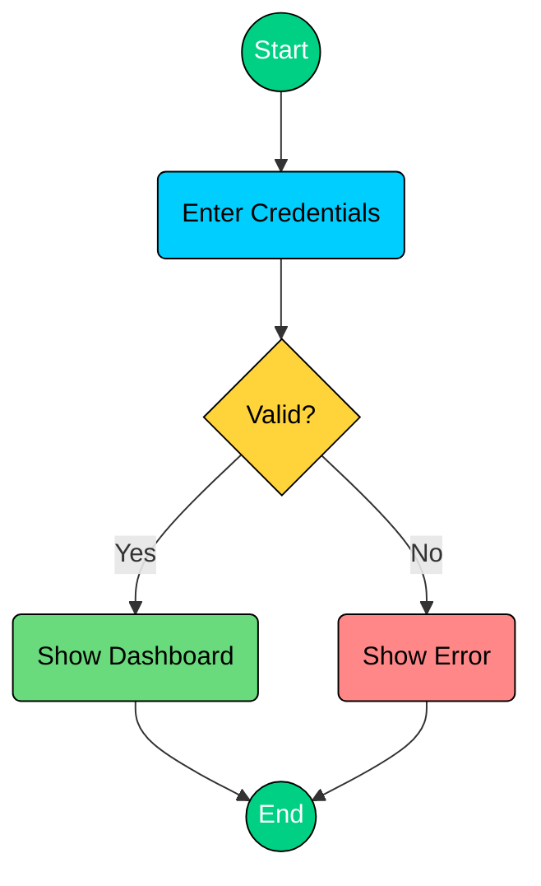

An Activity Diagram models the workflow of a process, showing the sequence of activities, decision points, parallel execution, and the flow of control from start to finish.

While sequence diagrams show **interactions between objects**, activity diagrams show **the flow of activities** in a process, similar to a flowchart but with more power.

---

## 1. What is an Activity Diagram?

An **Activity Diagram** is a UML diagram that visualizes a workflow. It shows:

- **What** activities/actions happen
- **In what order** they execute
- **Where** decisions are made
- **What** can happen in parallel
- **Who** is responsible (with swimlanes)

#### Why Activity Diagrams Matter

If you can describe a workflow in words, why bother drawing it? Because workflows that sound simple in your head quickly become tangled when you try to communicate them precisely. 

Here's why activity diagrams are worth learning well.

#### **Model complex workflows visually**

Workflows involve sequences, branches, loops, and parallel paths. Holding all of that in your head while explaining it verbally is difficult. An activity diagram puts the entire workflow on a single page where everyone can see the structure at once. You can trace any path from start to finish with your finger.

#### **Identify parallel opportunities and bottlenecks**

When you draw out a workflow, you often discover that steps you assumed were sequential can actually run in parallel. Sending a confirmation email doesn't need to wait for inventory to update. Activity diagrams make these opportunities visible. They also expose bottlenecks, steps where multiple paths converge and wait, that you might miss in a verbal description.

#### **Bridge between requirements and implementation**

Requirements say "the system shall process orders." Code says `if (inventory.check(item)) { payment.charge(amount); }`. There's a gap between these two. Activity diagrams sit in that gap. They're concrete enough to map directly to code structure, but abstract enough for non-engineers to read and validate.

---

## 2. Components of an Activity Diagram

Every activity diagram is built from a small set of standard components. Once you recognize these, you can read and draw any activity diagram.

#### 2.1 Initial Node (Start)

The starting point of the entire activity. Every activity diagram begins with exactly one initial node, drawn as a **filled black circle**.

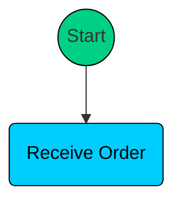

Think of it as the "Go" signal. The flow begins here and moves to the first action. No arrows point into the initial node, only outward.

#### 2.2 Activity/Action Node

An action node represents a single step or task in the process. It's drawn as a rounded rectangle and labeled with a verb-noun phrase that describes what happens.

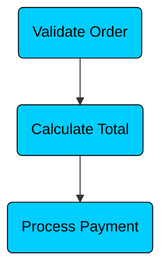

Naming matters. Good action names are specific and start with a verb. Bad names are vague or describe a state rather than an action.

#### Good Names

- Validate Order
- Send Confirmation Email
- Calculate Shipping Cost
- Reserve Inventory
- Generate Invoice

#### Bad Names

- Order Validation
- Email
- Shipping
- Inventory Check Done
- Invoice

Each action node should represent one coherent step. If you find yourself writing "Validate Order and Calculate Total" in a single node, split it into two.

#### 2.3 Final Node (End)

The endpoint of the entire activity. Drawn as a filled circle inside a larger circle (a bullseye). When the flow reaches a final node, the entire activity terminates, including any parallel branches that might still be running.

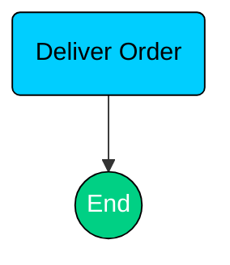

A diagram can have multiple final nodes (for example, one at the end of the success path and one at the end of the error path), but reaching any one of them terminates everything.

#### 2.4 Flow Final Node

A flow final node terminates only the specific branch it's on, not the entire activity. Drawn as a circle with an X inside.

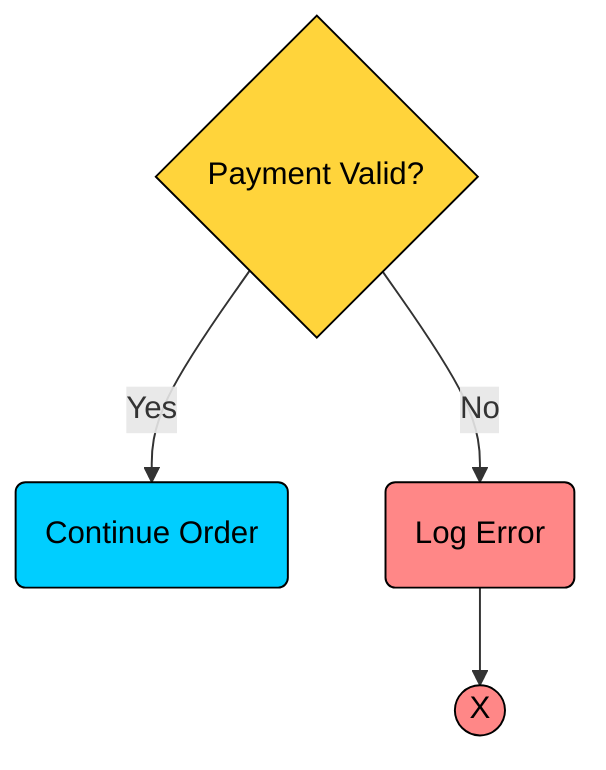

In this example, the error branch terminates (the logging is done, nothing more happens on that path), but the main activity can continue on other parallel branches. The rest of the system keeps running.

#### 2.5 Decision Node

A diamond-shaped node where the flow branches based on a condition. Each outgoing arrow has a guard condition that determines which path the flow takes. The conditions must be mutually exclusive, exactly one path should be followed.

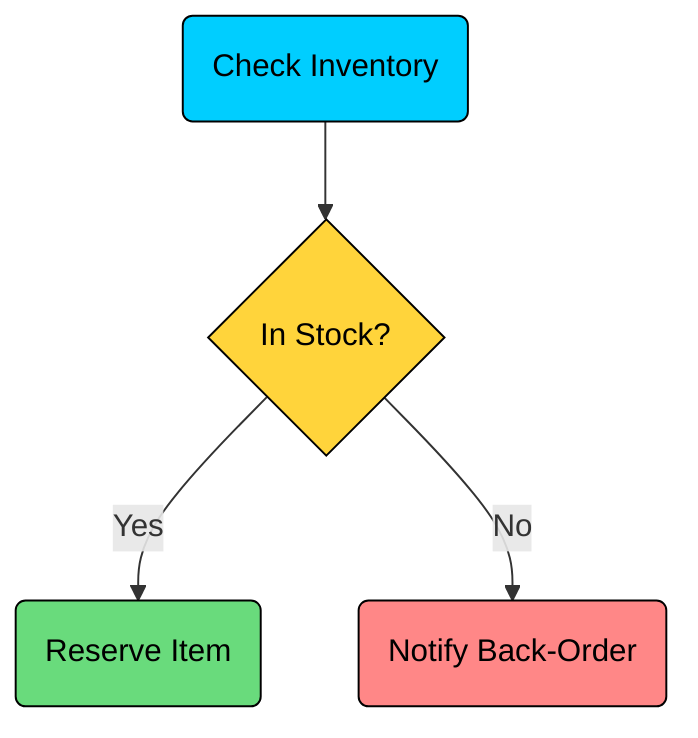

Every decision node needs at least two outgoing paths, and every path must have a guard condition. A decision node with unlabeled branches is ambiguous and will confuse anyone reading the diagram.

#### 2.6 Merge Node

A merge node brings multiple alternative paths back together into a single flow. It's also drawn as a diamond, but with multiple incoming arrows and one outgoing arrow. It's the counterpart of a decision node.

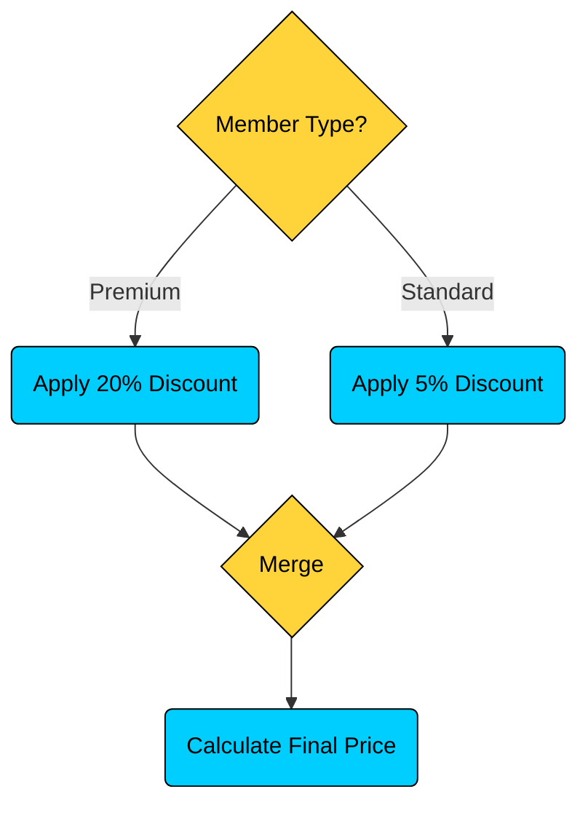

The merge doesn't wait for all paths, only one path arrives (since it follows a decision). It simply funnels whichever path was taken into a single downstream flow. Without merge nodes, conditional branches create an ever-expanding number of parallel paths that never reconverge.

#### 2.7 Fork Node

A fork splits a single flow into multiple parallel flows that execute simultaneously. Drawn as a thick horizontal bar with one incoming arrow and multiple outgoing arrows.

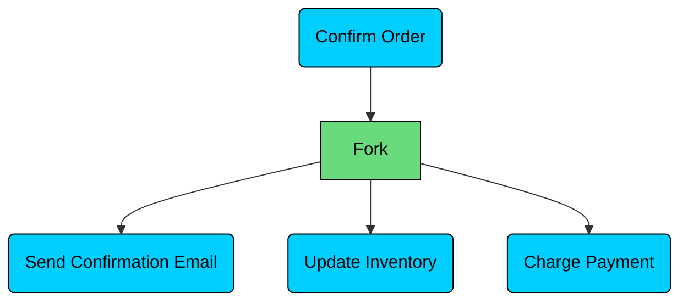

After the order is confirmed, three things happen in parallel: the email goes out, inventory is updated, and payment is charged. None of these needs to wait for the others.

#### 2.8 Join Node

A join synchronizes multiple parallel flows back into one. Also drawn as a thick horizontal bar, but with multiple incoming arrows and one outgoing arrow. The flow after the join only proceeds when all incoming parallel paths have completed.

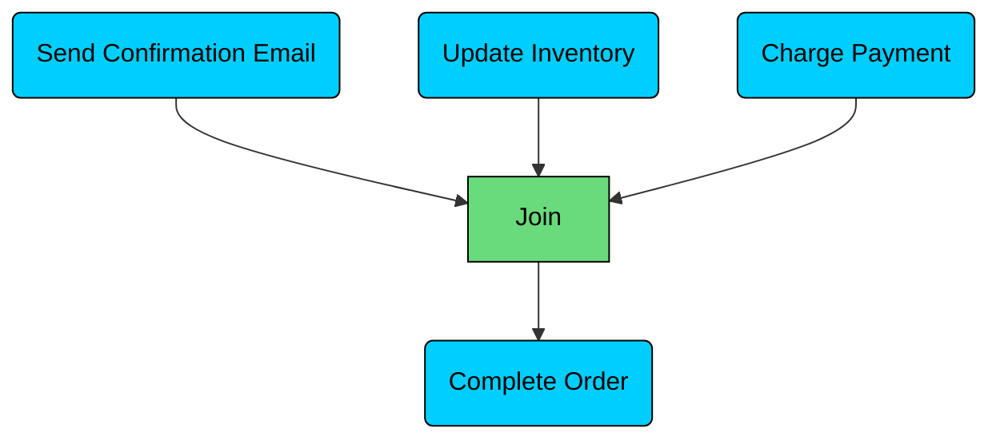

The order isn't complete until the email is sent, inventory is updated, and payment is charged. The join bar acts as a synchronization point, holding the flow until every parallel branch finishes. Every fork must have a corresponding join. A fork without a join means you have parallel paths that never reconverge, which is usually a design mistake.

---

## 3. Control Flow

Components are the vocabulary. Control flow is the grammar, how you combine components to model real behavior. There are four fundamental patterns.

#### 3.1 Sequential Flow

The simplest pattern: activities execute one after another, in order. Each action completes before the next one starts.

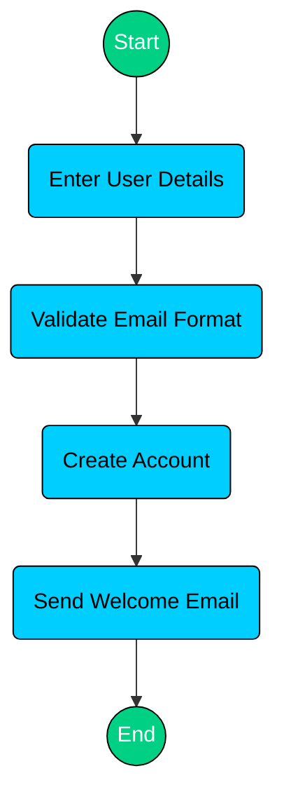

This is a straightforward user registration flow. Enter details, validate, create the account, send the email. No branching, no parallelism, just one step after another. Most workflows start as sequential flows, and you add complexity (decisions, parallelism) only where the process demands it.

#### 3.2 Conditional Flow

The flow branches based on a condition. A decision node splits the path, and a merge node brings the paths back together.

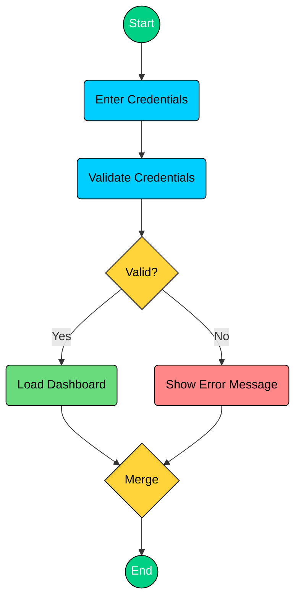

This is a login flow. After validation, the flow takes exactly one of two paths: success (dashboard) or failure (error message). The merge node brings both paths to a single endpoint. Notice that only one branch executes, this is the key difference from parallel flow, where all branches execute.

#### 3.3 Parallel Flow

Multiple activities execute simultaneously after a fork, and a join synchronizes them before the flow continues.

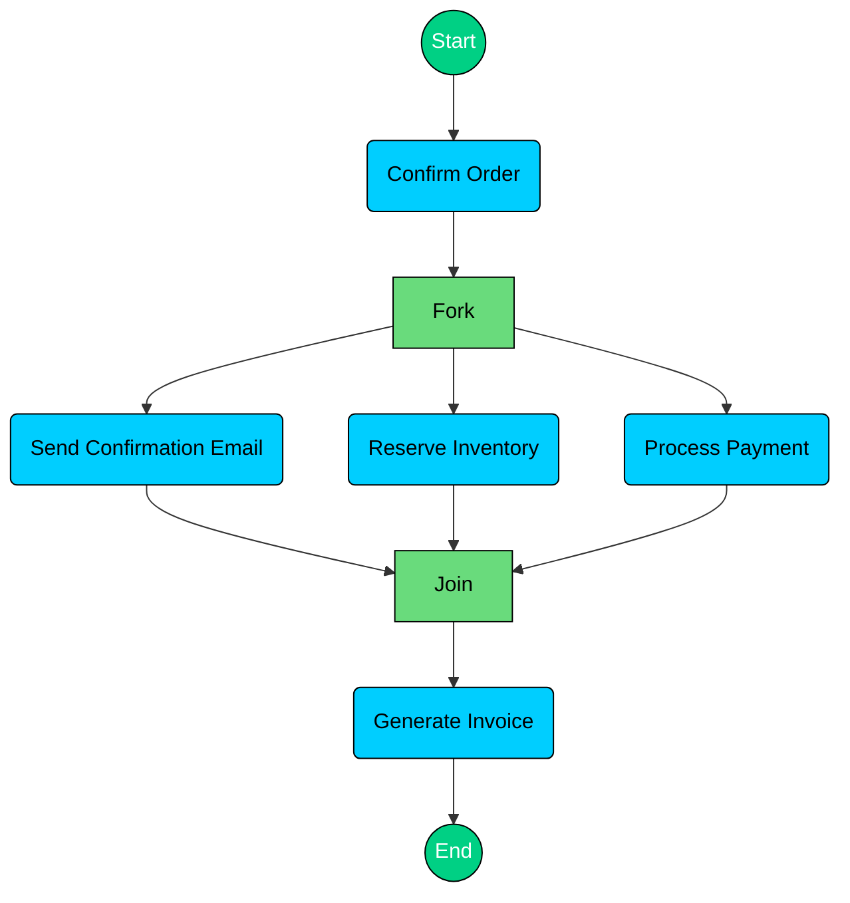

After the order is confirmed, three things happen at once: email, inventory reservation, and payment processing. The invoice is generated only after all three are done. This pattern is critical for performance. If each step takes 2 seconds and they run sequentially, that's 6 seconds. In parallel, it's 2 seconds (the slowest one).

#### 3.4 Loop Flow

Activities repeat until a condition is met. This is modeled by routing the flow back from a decision node to an earlier action.

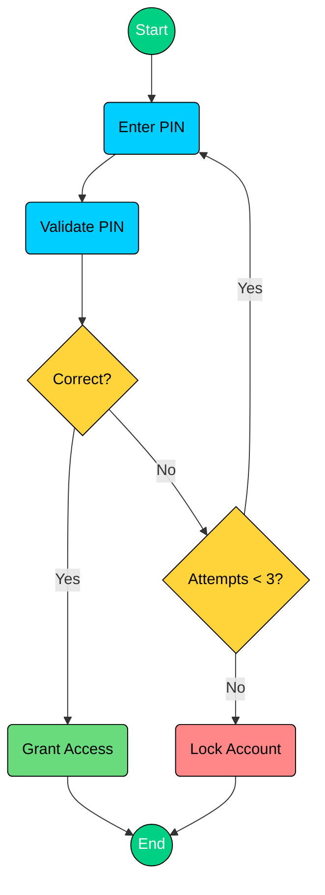

The user enters a PIN. If it's wrong, the flow checks whether they have remaining attempts. If yes, it loops back to "Enter PIN." If they've exhausted all attempts, the account is locked. This pattern appears in any retry logic: PIN entry, password validation, API call retries with backoff.

---

## 4. Swimlanes (Partitions)

So far, our diagrams show what happens but not who does it. Swimlanes (also called partitions) divide the diagram into lanes, one per actor or system component, so you can see exactly who is responsible for each activity.

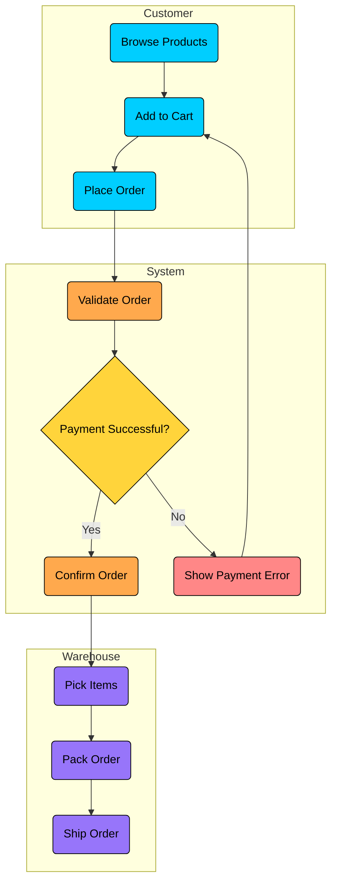

This e-commerce workflow spans three participants. The Customer browses and places the order. The System validates and processes payment. The Warehouse picks, packs, and ships.

Let's trace the handoffs. When the Customer places the order, control passes from the Customer lane to the System lane for validation. If payment succeeds, control passes from System to Warehouse for fulfillment. If payment fails, control passes back to the Customer lane. Each crossing between lanes is a handoff, a point where responsibility transfers from one actor to another.

Swimlanes provide several benefits:

- **Clear responsibility assignment.** Everyone can see who does what at a glance.
- **Handoff visibility.** Arrows crossing lane boundaries reveal integration points between teams or systems.
- **Bottleneck detection.** If one lane has twenty actions and another has two, the workload is unbalanced.
- **Implementation guidance.** Each lane often maps to a service, a team, or a module in the actual system.
- **Communication tool.** Non-technical stakeholders can read swimlanes to verify the business process matches their expectations.

---

## 5. How to Create an Activity Diagram

#### Step 1: Identify the Process

 What workflow are you modeling? Be specific. "Order processing" is better than "the system." "ATM withdrawal" is better than "banking." 

Name the process before you start drawing.

#### Step 2: List All Activities

Write down every action that happens in the workflow, in rough order. Don't worry about structure yet. Just get the steps on paper. For an ATM withdrawal: insert card, validate card, enter PIN, verify PIN, select amount, check balance, dispense cash, eject card, print receipt.

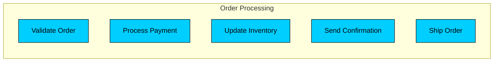

#### **Step 3: Determine the sequence**

Arrange the activities in chronological order. Which step must complete before the next can begin? This gives you the basic sequential flow.

#### Step 4: Identify Decision Points

Where does the flow branch? Look for conditions: valid/invalid, in stock/out of stock, payment success/failure. Each condition becomes a decision node with guard labels on the outgoing arrows.

#### Step 5: Identify Parallel Activities

Which steps are independent of each other and can run at the same time? 

Sending a receipt and updating the account balance don't depend on each other. These become fork/join pairs.

#### Step 6: **Add swimlanes if needed**

If multiple actors or systems are involved, divide the diagram into lanes. This step is optional for simple workflows but valuable for anything involving handoffs between components or teams.

---

## 6. Complete Example: ATM Withdrawal

Let's build a comprehensive activity diagram for an ATM withdrawal. This example naturally contains all four control flow types: sequential steps, conditional branching, a retry loop, and opportunities for parallelism.

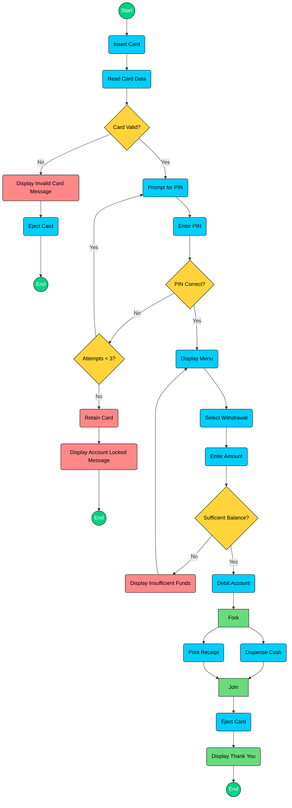

Let's walk through each section of this diagram.

#### **Card validation (sequential + conditional)**

The flow starts with inserting and reading the card. The first decision checks whether the card is valid. If it's not (expired, wrong bank, damaged), the ATM displays an error, ejects the card, and terminates. This is the simplest error path.

#### **PIN entry (loop)**

If the card is valid, the ATM prompts for a PIN. After the user enters it, a decision checks whether it's correct. If yes, the flow moves to the menu. If no, another decision checks the attempt count. If attempts remain, the flow loops back to "Prompt for PIN." If three wrong attempts have been made, the card is retained and the account is locked. This loop-with-exit pattern appears in any retry scenario.

#### **Balance check (conditional)**

The user selects withdrawal and enters an amount. The ATM checks whether the account has sufficient funds. If not, it displays an error and returns to the menu (letting the user try a different amount). If the balance is sufficient, the flow continues to dispensing.

#### **Dispensing (parallel)**

After debiting the account, two things happen simultaneously: cash is dispensed and the receipt is printed. These are independent operations, the printer doesn't need to wait for the cash dispenser, and the cash dispenser doesn't need the receipt. The fork/join pair models this concurrency.

</section>
