import React from 'react';
import CodeBlock from '../../../../components/ui/CodeBlock';
import Callout from '../../../../components/ui/Callout';

  

    <a href="/">Curated Notes</a>
    ›
    Class Diagram
  

  <h1>Class Diagram</h1>
  

    Master the essentials of Class Diagram in this curated guide.
  

  

    
      <svg width="14" height="14" viewBox="0 0 24 24" fill="none" stroke="currentColor" strokeWidth="2"><circle cx="12" cy="12" r="10"/><polyline points="12 6 12 12 16 14"/></svg>
      10 min read
    
    Intermediate
  

<section className="content-section">

**Unified Modeling Language (UML)** is a standard way to visualize the design of a software system.

Among the many diagrams offered by UML, **class diagrams** are perhaps the most widely used.

UML class diagram provides a static view of an object oriented system, showcasing its **classes, attributes, methods, and the relationships among objects.**

In this article, we will explore the building blocks of UML class diagram, how to represent them, different types of class relationships and provide real-world examples for each representation.

---

## 1. Anatomy of a Class

The most basic element in a class diagram is, unsurprisingly, a class. In UML, a class is drawn as a rectangle divided into three compartments: the class name at the top, attributes in the middle, and methods at the bottom.

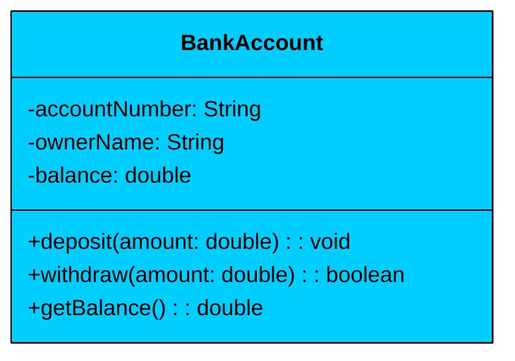

Let's walk through each compartment.

#### **Name compartment (top)**

This holds the class name, always in PascalCase. It's the identity of the class.

#### **Attributes compartment (middle)**

These are the data fields the class holds. Each attribute follows the format: 

- `visibility name: type`

In the diagram above, `-accountNumber: String` means a private field named `accountNumber` of type `String`. The minus sign (`-`) is the visibility marker for private.

You can optionally add multiplicity and default values to make the attribute more precise:

- `visibility name: type [multiplicity] = defaultValue`

For example, `-transactions: List [0..*]` tells you the field holds zero or more items.

#### **Methods compartment (bottom)**

These are the operations the class can perform. The format is:

- `visibility name(parameterList): returnType`

So `+deposit(amount: double): void` is a public method named `deposit` that takes a double parameter and returns nothing. Parameters are written as `name: type`, separated by commas if there are multiple.

#### Visibility Markers

Every attribute and method is prefixed with a visibility marker that controls who can access it.

| Marker | Access Level | Meaning |
| --- | --- | --- |
| `+` | Public | Accessible from any class |
| `-` | Private | Accessible only within the same class |
| `#` | Protected | Accessible within the class and its subclasses |
| `~` | Package | Accessible within the same package (Java-specific) |

---

## 2. Special Class Types

Not everything in your design is a concrete class. Interfaces define contracts without implementation. Abstract classes provide partial implementations. Enumerations define fixed sets of values. Each has its own UML notation.

### Interfaces

An interface specifies what a class must do, without saying how. In UML, an interface looks like a class rectangle with the `<<interface>>` stereotype above the name. Since interfaces have no state, the attributes compartment is usually empty.

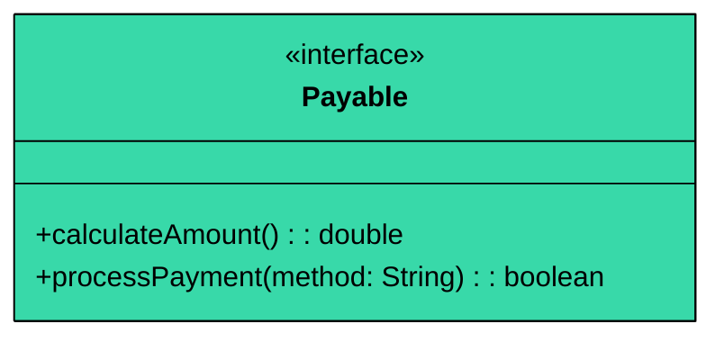

The `<<interface>>` label is the key visual signal. When you see this in a diagram, you know that any class connected to `Payable` with a dashed arrow must implement `calculateAmount()` and `processPayment()`. 

### Abstract Classes

An abstract class sits between a concrete class and an interface. It can have both implemented methods (shared behavior) and abstract methods (behavior that subclasses must define). In UML, abstract classes are marked with the `<<abstract>>` stereotype, and abstract method names are written in italics.

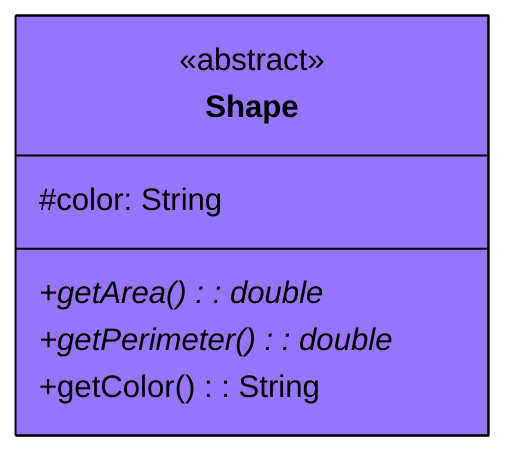

The `<<abstract>>` stereotype tells you this class can't be instantiated directly. Looking at the methods, `getArea()` and `getPerimeter()` are abstract (shown in italics), meaning `Shape` declares them but provides no implementation. 

Any subclass, say a `Circle` or a `Rectangle`, must override these with its own logic. `getColor()`, on the other hand, is a concrete method. Since all shapes retrieve their color the same way, it's implemented once in `Shape` and inherited by every subclass.

Use abstract classes when subclasses share common state (like `color`) or behavior (like `getColor()`) but differ in specific operations. Use interfaces when unrelated classes need to support the same contract without sharing any state or implementation.

### Enumerations

An enumeration defines a fixed set of named constants. In UML, enums use the `<<enumeration>>` stereotype, and the values are listed in the attributes compartment.

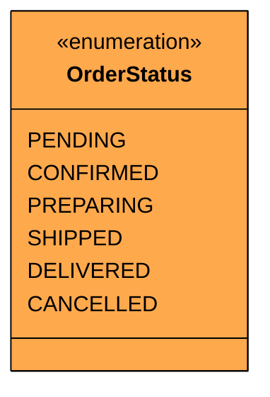

Enums are useful for representing states, types, or categories that have a fixed number of values. In the parking lot example, `VehicleType` might be an enum with `CAR`, `MOTORCYCLE`, and `TRUCK`. In an e-commerce system, `PaymentMethod` could be `CREDIT_CARD`, `DEBIT_CARD`, `UPI`, `WALLET`.

---

## 3. Relationships

Classes rarely exist in isolation. The real power of a class diagram is in the lines connecting the boxes. UML defines six types of relationships, each with its own arrow style and meaning. These range from the weakest coupling (dependency) to the strongest (inheritance and realization).

### 1. Dependency (Weakest)

A dependency means one class temporarily uses another, typically as a method parameter, a local variable, or a return type. The dependent class doesn't store a reference to the other class as a field. It just needs it for a specific operation.

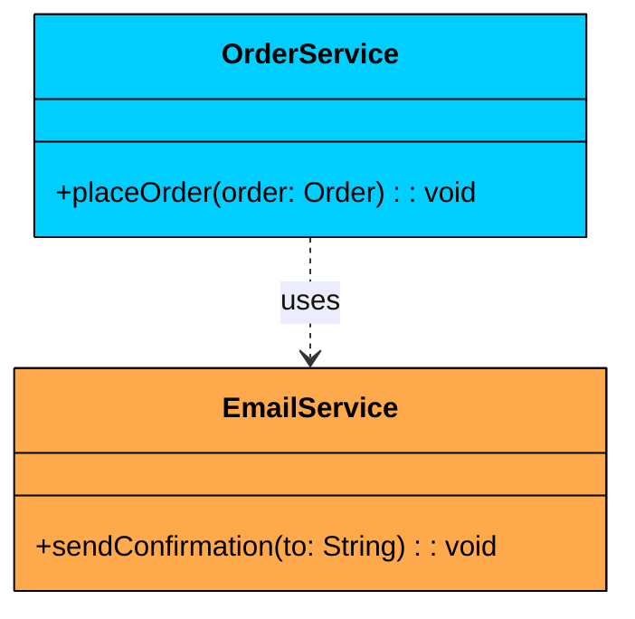

The **dashed arrow** (`..>`) is the UML notation for dependency. `OrderService` depends on `EmailService` because it calls `EmailService.sendConfirmation()` inside the `placeOrder()` method.

But `OrderService` doesn't hold an `EmailService` field. It might receive it as a parameter, or create it locally, or look it up from a service locator. The relationship exists only during that method call.

**When to use dependency:** When class A calls a method on class B, but doesn't store B as a field. If the reference lives only inside a method body, it's a dependency.

### 2. Association

Association means one class knows about another and holds a reference to it as a field. This is the most common relationship in OOP. It models a "has-a" or "uses-a" relationship where the connection is persistent, not just for a single method call.

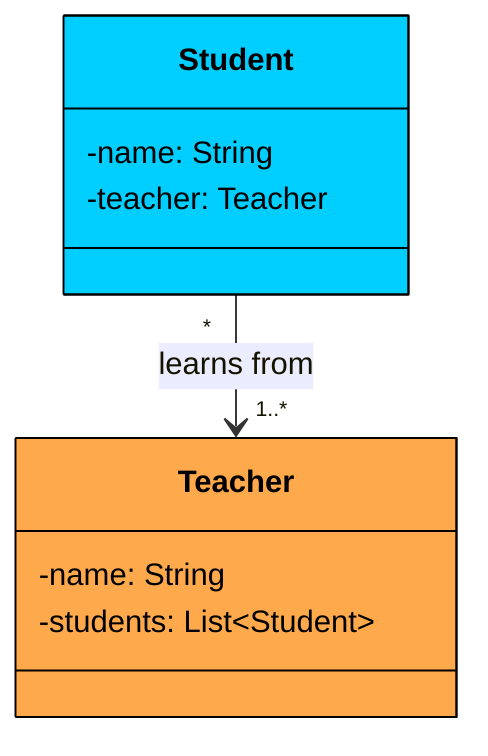

The **solid arrow** (`->`) is the UML notation for association. `Student` holds a reference to `Teacher` as a field. The multiplicity labels tell you that many students can be associated with one or more teachers. Both objects exist independently: a student doesn't cease to exist if the teacher is removed, and vice versa.

**When to use association:** When class A stores a reference to class B as a field, and both objects have independent lifecycles.

### 3. Aggregation

Aggregation is a specialized form of association that models a "whole-part" relationship with weak ownership. The whole contains the parts, but the parts can exist independently. If the whole is destroyed, the parts survive.

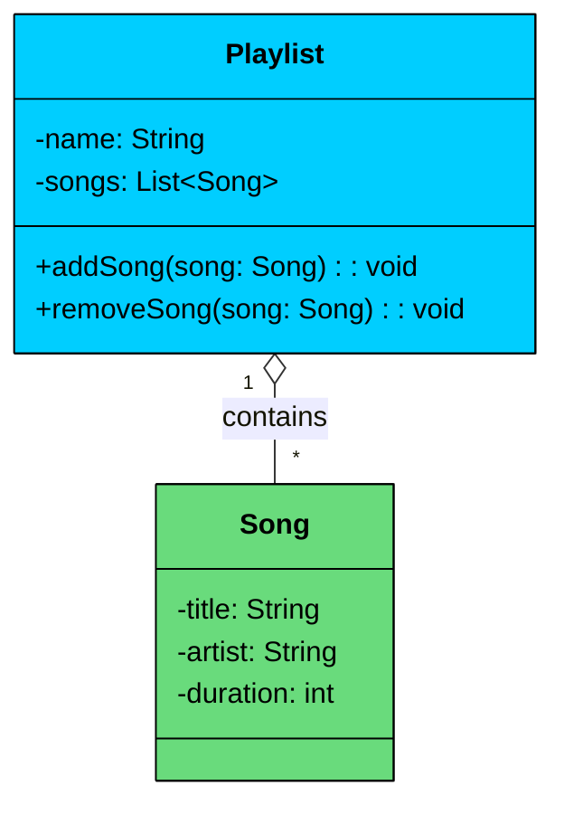

The **hollow diamond** on the `Playlist` side is the UML notation for aggregation. `Playlist` is the "whole" and `Song` is the "part." 

The critical point: if you delete the playlist, the songs still exist in the music library. A song can belong to multiple playlists simultaneously. The parts are passed into the whole from outside, not created internally.

**When to use aggregation:** When one class contains another, but the contained objects have their own independent lifecycle and can be shared across multiple containers.

### 4. Composition

Composition is the stronger version of aggregation. It's a "whole-part" relationship with strong ownership. The whole creates, manages, and destroys the parts. If the whole is destroyed, the parts go with it.

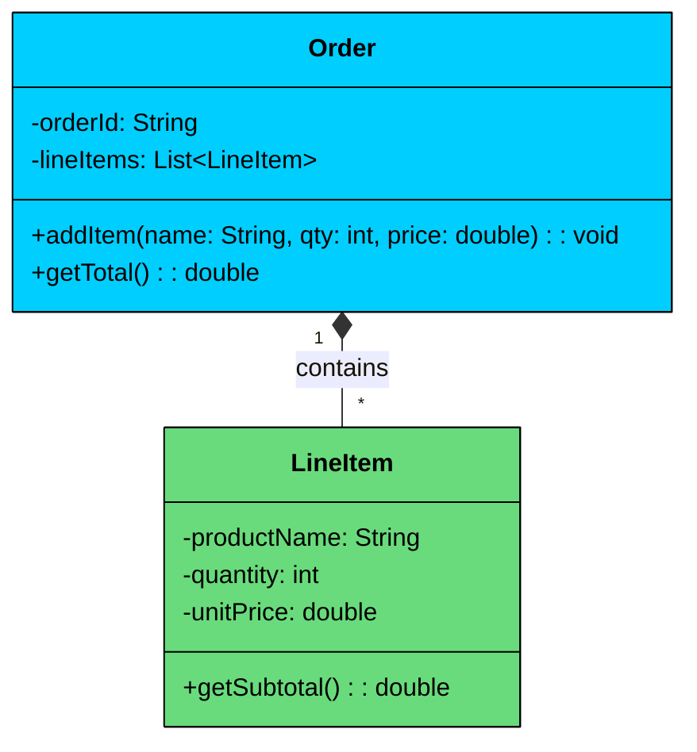

The **filled diamond** on the `Order` side is the UML notation for composition. `Order` owns its `LineItem` objects completely. Line items are created inside order methods, not passed in from outside. They have no meaning without their parent order. When the order is deleted, the line items are deleted too.

**When to use composition:** When the part has no independent identity or purpose outside the whole, and the whole controls the part's entire lifecycle.

### 5. Inheritance (Generalization)

Inheritance represents an "is-a" relationship where a subclass extends a superclass, inheriting its attributes and methods. The subclass can add its own fields and methods, and can override inherited behavior.

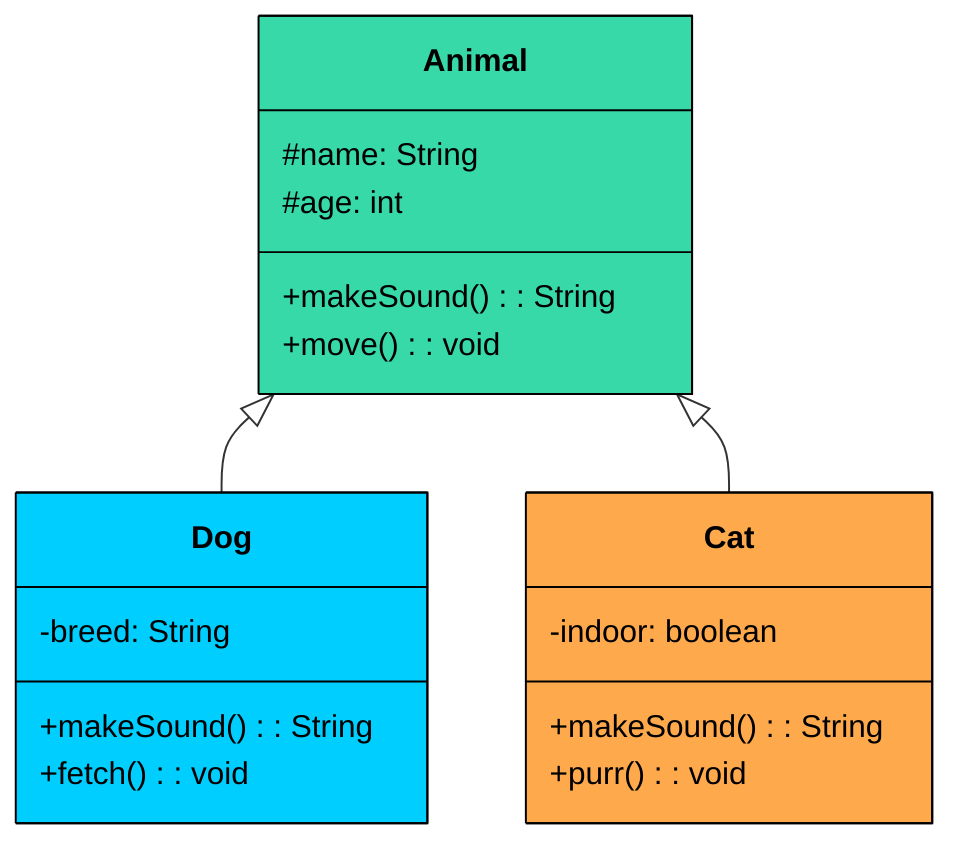

The **solid line with a hollow triangle** pointing at the superclass is the UML notation for inheritance. `Dog` and `Cat` both inherit `name`, `age`, and `move()` from `Animal`. Each overrides `makeSound()` to provide its own implementation and adds its own unique methods (`fetch()` for `Dog`, `purr()` for `Cat`).

**When to use inheritance:** When there's a genuine "is-a" relationship with shared state and behavior. A `Dog` is an `Animal`. A `SavingsAccount` is a `BankAccount`. Don't use inheritance just to reuse code. If the "is-a" relationship doesn't hold naturally, prefer composition.

### 6. Realization (Implementation)

Realization is the relationship between a class and an interface it implements. The class promises to provide concrete implementations of all methods declared in the interface.

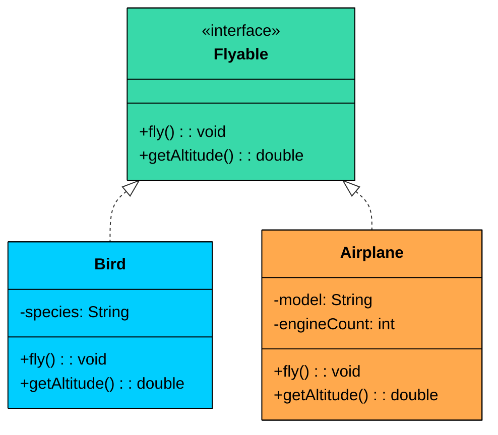

The **dashed line with a hollow triangle** pointing at the interface is the UML notation for realization. `Bird` and `Airplane` are completely unrelated classes, one is biological, the other is mechanical, but both implement the `Flyable` interface. This is why interfaces are so powerful: they let unrelated classes share a contract without forcing them into the same inheritance hierarchy.

**Inheritance vs Realization:** Inheritance says "I am a type of you and I get your code." Realization says "I can do what you describe, but I implement it my own way." Inheritance uses a solid line (the subclass gets actual code). Realization uses a dashed line (the class only gets a contract to fulfill).

### Relationship Strength Spectrum

All six relationships fall on a spectrum from weakest to strongest coupling. This is worth memorizing because interviewers often ask you to rank them.

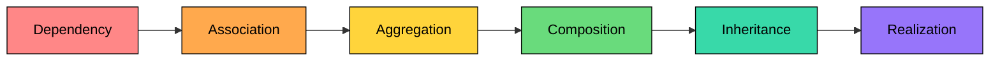

**Weakest to strongest:** Dependency (temporary use) &lt; Association (persistent reference) &lt; Aggregation (weak whole-part) &lt; Composition (strong whole-part) &lt; Inheritance (structural "is-a") &lt; Realization (contractual "can-do")

The general design principle: prefer weaker relationships when possible. Dependency is better than association if you don't need a persistent reference. Association is better than composition if the part doesn't need lifecycle binding. Weaker coupling means more flexible, maintainable code.

---

## 4. Combined Example: Online Bookstore

Let's put everything together with a realistic example. Imagine you're asked to design the core domain model for an online bookstore. Here's the class diagram.

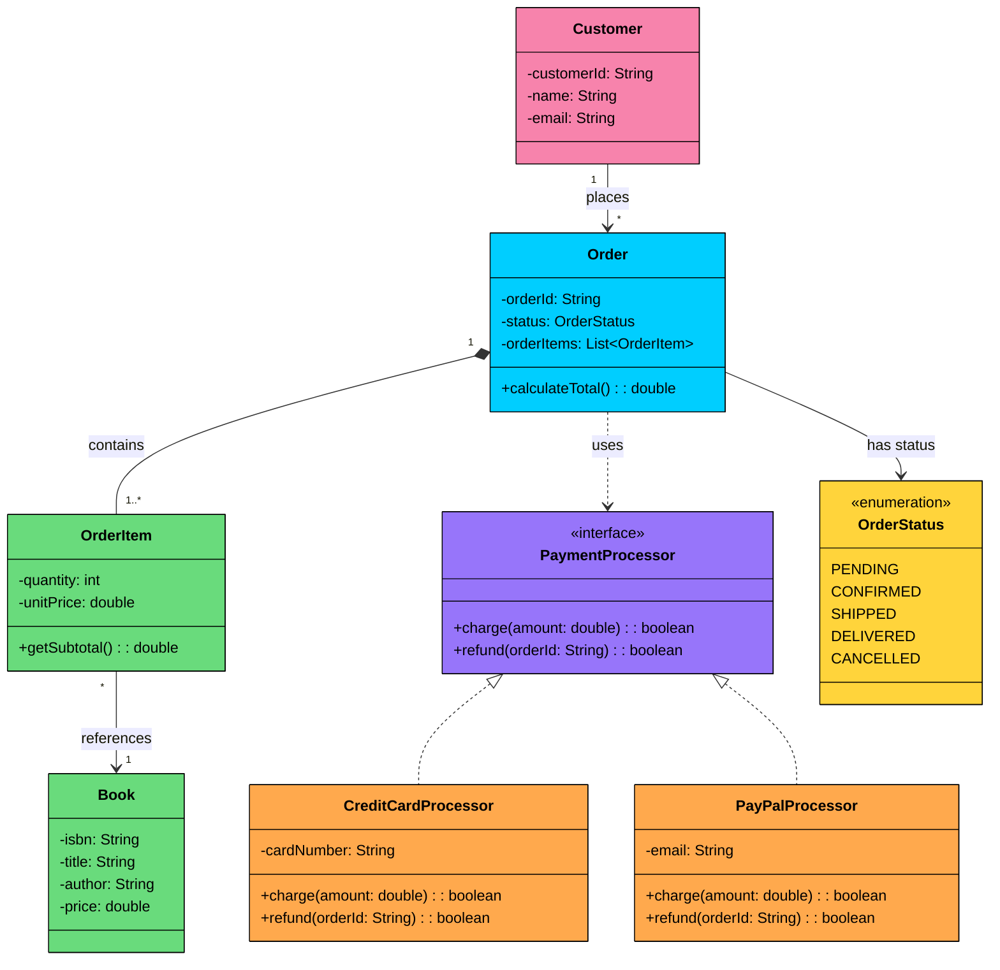

Let's trace through the diagram: 

- **Composition**: `Order` owns its `OrderItem` objects. They're created when the order is placed, belong to exactly one order, and are deleted if the order is deleted. Filled diamond on the `Order` side.
- **Association**: `Customer` --&gt; `Order` is a persistent reference, but both exist independently. `OrderItem` --&gt; `Book` is similar: the item references a book but doesn't own it.
- **Dependency**: `Order` uses `PaymentProcessor` during checkout but doesn't store it as a field. The relationship is temporary.
- **Realization**: `CreditCardProcessor` and `PayPalProcessor` both implement the `PaymentProcessor` interface, providing different payment strategies behind the same contract.
- **Enumeration**: `Order` --&gt; `OrderStatus` uses a fixed set of values to track order state.

</section>
