import React from 'react';
import CodeBlock from '../../../../components/ui/CodeBlock';
import Callout from '../../../../components/ui/Callout';

  

    <a href="/">Curated Notes</a>
    ›
    Sequence Diagram
  

  <h1>Sequence Diagram</h1>
  

    Master the essentials of Sequence Diagram in this curated guide.
  

  

    
      <svg width="14" height="14" viewBox="0 0 24 24" fill="none" stroke="currentColor" strokeWidth="2"><circle cx="12" cy="12" r="10"/><polyline points="12 6 12 12 16 14"/></svg>
      10 min read
    
    Intermediate
  

<section className="content-section">

Imagine you're ordering a pizza. You call the pizza place. The cashier takes your order, sends it to the kitchen, and the chef starts preparing it. Once it’s ready, a delivery person picks it up and brings it to your door.

Now, picture all those interactions: **you talking to the cashier**, **the cashier passing the order to the chef**, **the chef preparing the food**, and finally **the delivery**. Each step follows a clear order, and each participant plays a specific role.

That’s exactly what **Sequence Diagrams** do in software design.

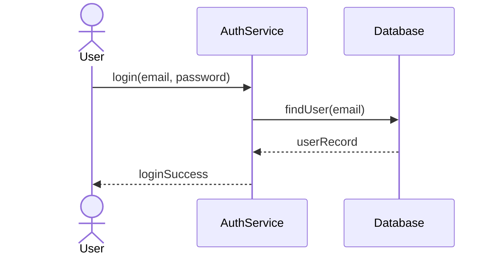

They **map out interactions between objects over time**, just like a storyboard for how things happen in a system.

In this chapter, we will explore:

- What a Sequence Diagram is?
- Building Blocks of a Sequence Diagram
- Types of Messages in Sequence Diagrams

---

## 1. What is a Sequence Diagram?

A **sequence diagram** is a type of UML (Unified Modeling Language) diagram that shows **how objects in a system interact with each other**, step by step.

It focuses on the **order of messages exchanged** between different components or actors to achieve a particular task or use case.

These diagrams model:

- **Who** the participants (objects or actors) are
- **What** messages are exchanged
- **In what order** the messages occur
- **How long** each participant is active

In other words, sequence diagrams help answer: “**Who is doing what, and when?”**

#### Why Sequence Diagrams Matter

Here's why sequence diagrams are worth learning.

**1. Visualize runtime behavior.** Code execution is inherently sequential and hard to trace across multiple classes and services. A sequence diagram lays out the entire interaction on a single page. You can see every method call, every response, and every handoff between components without reading a single line of code.

**2. Debug and communicate complex flows.** When a payment fails in production, you need to trace the exact sequence of calls: did the order service call the payment gateway before or after reserving inventory? Did the notification fire before the payment was confirmed? Sequence diagrams make these flows explicit, which makes bugs visible.

**3. Bridge between use cases and code.** A use case diagram tells you "the customer can book a ticket." A class diagram tells you which classes exist. But neither tells you the exact sequence of method calls that makes booking happen. Sequence diagrams fill that gap. They're the missing link between requirements and implementation.

---

## 2. Building Blocks of a Sequence Diagram

Every sequence diagram is built from four elements: actors, participants, lifelines, and activation bars. Once you understand these, you can read any sequence diagram.

### Actors and Participants

An **actor** is an external entity that initiates an interaction with the system. Just like in use case diagrams, actors are typically users or external systems. In sequence diagrams, they appear at the top as stick figures or labeled boxes.

A **participant** is an internal object or component within your system that sends or receives messages. These are the classes, services, or modules that do the actual work. Participants are drawn as labeled rectangles at the top of the diagram.

The distinction matters: actors trigger the interaction from outside; participants handle it on the inside.

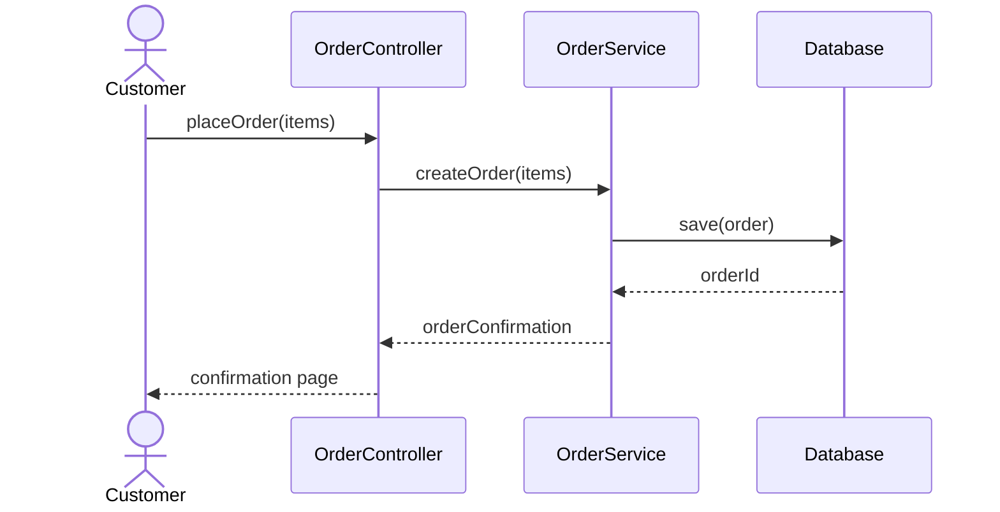

This diagram introduces the core visual structure. The Customer (actor) sits on the far left because they initiate the interaction. The three participants (OrderController, OrderService, Database) are internal components. Each has a vertical dashed line extending downward, and messages flow between them from top to bottom.

### Lifelines

The **dashed vertical line** extending below each actor and participant is called a lifeline. It represents the passage of time, top is earlier, bottom is later. As you read down the diagram, you're moving forward in time. Every message arrow connects one lifeline to another, showing exactly when each interaction occurs in the sequence.

A lifeline shows that the object exists and is available to receive messages throughout the interaction.

### Activation Bars

When a participant is actively processing something (executing a method, waiting for a response), you show this with an **activation bar**, a thin rectangle drawn on top of the lifeline. It starts when the participant receives a message and ends when the participant sends back a response or finishes processing.

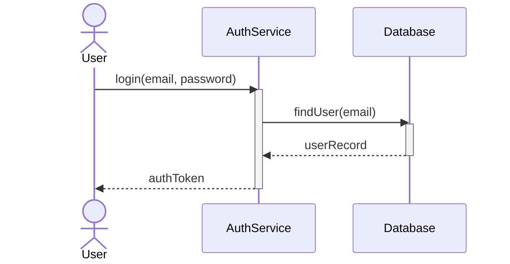

Notice the activation bars here. AuthService's bar starts when it receives `login()` and ends when it returns the `authToken`. Inside that time, it calls the Database, which has its own shorter activation bar.

This nesting tells you that AuthService is waiting while the Database works. Without activation bars, you can't tell who's actively processing and who's idle.

### Messages

Messages are the horizontal arrows between lifelines. They're the core of the diagram, showing what one object says to another. Each arrow is labeled with the message content, typically a method name with parameters.

The direction matters: the arrow points from the sender to the receiver. The style of the arrow (solid, dashed, open arrowhead, filled arrowhead) tells you what type of message it is. That's our next section.

---

## 3. Types of Messages in Sequence Diagrams

Messages are what bring a sequence diagram to life. Each type of message has a distinct arrow style that communicates something specific about how the sender and receiver interact.

There are six types to know.

### 1. Synchronous Messages

A synchronous message is like a phone call. You dial, the other person picks up, and you wait on the line until they respond. The sender is blocked until the receiver finishes processing and returns a result.

In UML, synchronous messages use a **solid line with a filled arrowhead**. This is the most common message type because most method calls in object-oriented code are synchronous.

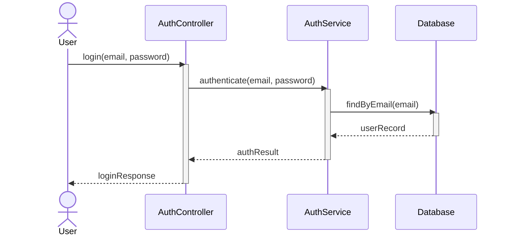

Follow the flow: the User calls `login()` on the AuthController and waits. The AuthController calls `authenticate()` on AuthService and waits. AuthService calls `findByEmail()` on the Database and waits. 

Then the responses cascade back: Database returns the user record to AuthService, AuthService returns the auth result to AuthController, and AuthController returns the login response to the User. Each caller is blocked until the callee responds.

### 2. Asynchronous Messages

An asynchronous message is like sending a text. You fire it off and immediately continue doing other things. You don't wait for a response, and you might not even get one.

In UML, asynchronous messages use a **solid line with an open arrowhead** (in standard UML, shown differently in some tools). In practice, asynchronous messages represent fire-and-forget operations: queueing a job, publishing an event, sending a notification.

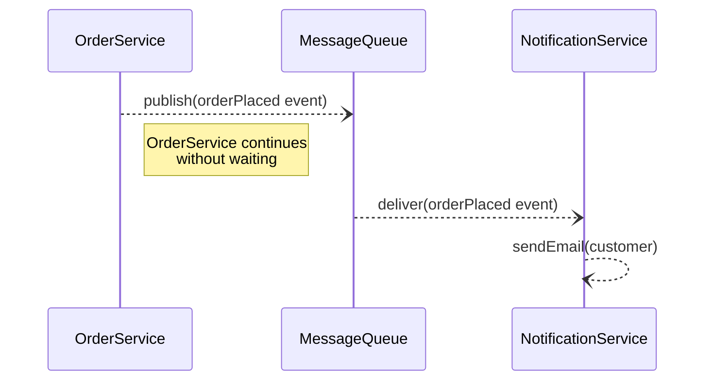

Here, OrderService publishes an event to the message queue and immediately moves on. It doesn't wait for the notification to be sent. The message queue eventually delivers the event to NotificationService, which sends the email. The key visual difference: the sender's activation bar doesn't extend while waiting for a response, because there's no waiting.

### 3. Return Messages

Return messages are the responses to synchronous calls. They show data flowing back from the receiver to the sender. In UML, return messages use a **dashed line with an open arrowhead**.

Look back at the synchronous login diagram above. Every dashed arrow is a return message: `userRecord`, `authResult`, `loginResponse`. They complete the round trip started by the synchronous call.

Return messages are technically optional in UML (some diagrams omit them for simplicity), but including them is strongly recommended. They make the diagram self-documenting: you can see exactly what data each service returns without guessing.

### 4. Self-Messages

Sometimes an object needs to call one of its own methods. This is shown as a **looped arrow** that starts and ends on the same lifeline.

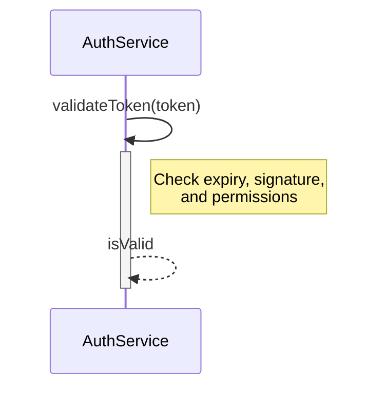

AuthService calls its own `validateToken()` method. This is common for internal validation, helper methods, or recursive calls. The arrow loops back to the same lifeline, making it visually clear that no external communication is happening.

### 5. Create Messages

A create message indicates that the sender is instantiating a new object. The new participant doesn't exist at the start of the diagram. It appears at the point where it's created.

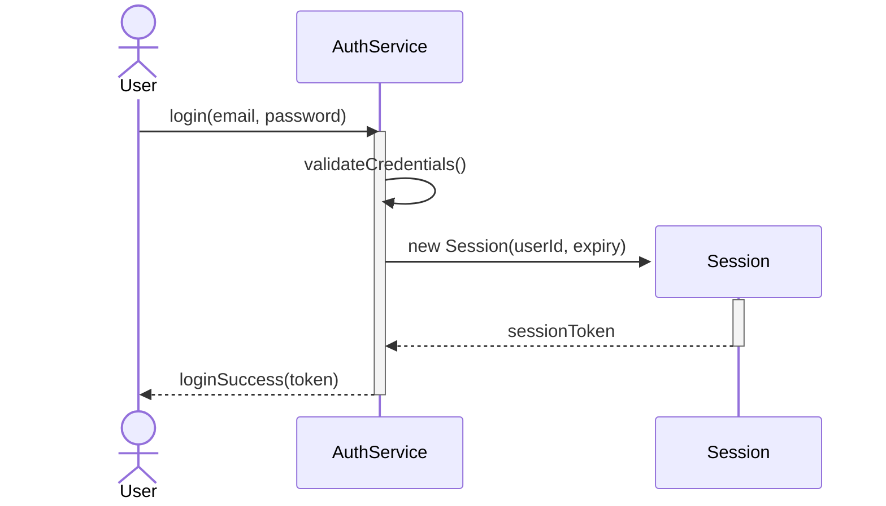

The Session participant doesn't appear at the top of the diagram with the others. It's created mid-flow by AuthService. This visually communicates that sessions are dynamically created during login, not pre-existing objects.

#### 6. Destroy Message (Optional)

A destroy message indicates that an object is being removed or deactivated. In UML, this is shown with an **X** at the end of the destroyed object's lifeline.

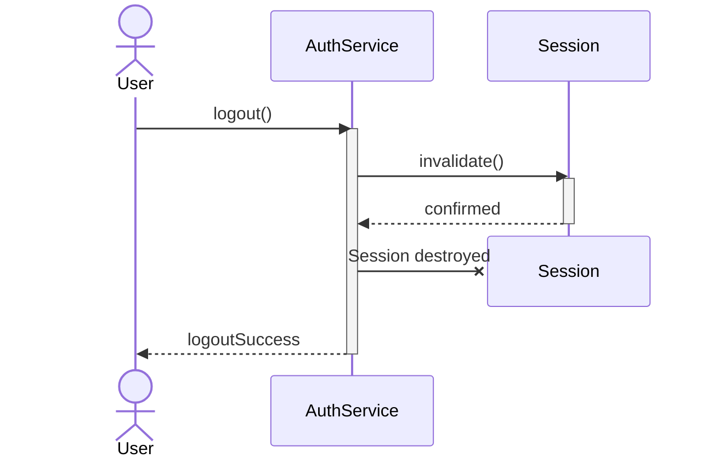

After the logout request, AuthService invalidates the Session, and the session is destroyed. The X on the Session's lifeline tells you this object no longer exists from this point forward. This is useful for modeling resource cleanup: closing database connections, ending sessions, releasing locks.

---

## 4. Combined Fragments

So far, our diagrams have shown a single, straight-line flow: do A, then B, then C. But real systems have conditions, loops, and parallel execution. Combined fragments let you model this control flow directly inside a sequence diagram.

A combined fragment is a labeled rectangle (called a frame) drawn over a section of the diagram. The label in the top-left corner tells you what kind of control flow it represents.

### alt/else (Conditional Branching)

The `alt` fragment models if/else logic. The frame is divided horizontally into sections by dashed lines. Each section has a guard condition (like `[credentials valid]`), and only the section whose condition is true executes.

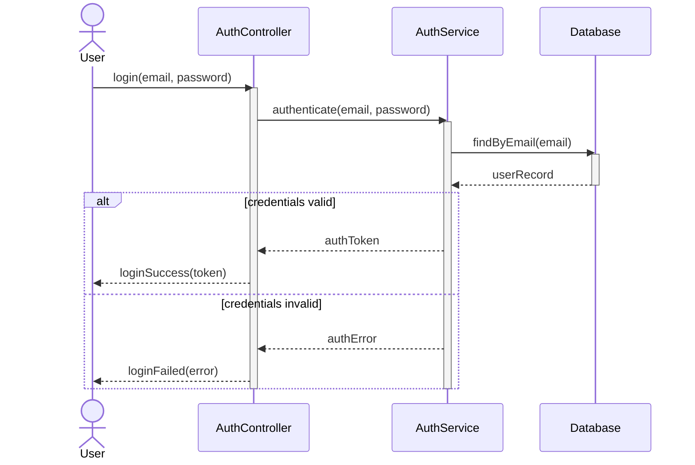

This is the login flow with branching. After the database returns the user record, AuthService checks the credentials. If they're valid, the user gets a token. If not, they get an error. The `alt` frame makes both paths visible in a single diagram, so anyone reading it knows exactly what happens in each case.

### loop (Repetition)

The `loop` fragment models iteration, executing a section repeatedly while a condition holds. This maps directly to for/while loops in code.

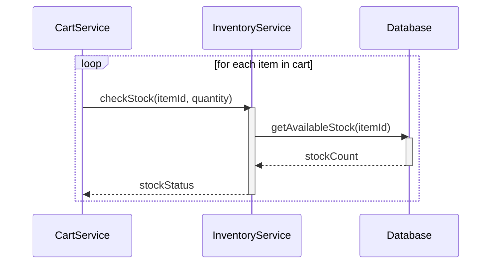

CartService iterates through every item in the cart and checks stock for each one. The `loop` frame wraps the entire check-and-respond interaction, making it clear that this block runs multiple times. Without the fragment, you'd have to draw one set of arrows per item, which quickly becomes unreadable.

### opt (Optional)

The `opt` fragment models conditional behavior that either happens or doesn't. There's no "else" branch. Think of it as an `if` without an `else`.

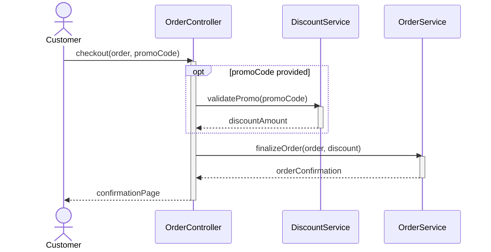

The discount validation only happens if the customer provides a promo code. If they don't, the flow skips straight to `finalizeOrder()`. The `opt` fragment makes this conditional step explicit without cluttering the diagram with an empty else branch.

### par (Parallel Execution)

The `par` fragment shows actions that happen simultaneously. The frame is divided into sections, and each section executes concurrently.

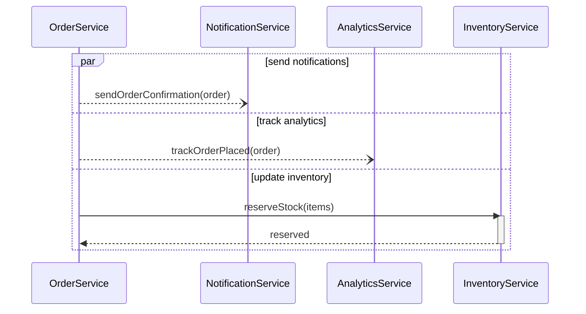

After an order is placed, three things happen at once: a confirmation notification is sent, an analytics event is tracked, and inventory is reserved. The `par` fragment makes it clear these aren't sequential. They're kicked off simultaneously, potentially by separate threads or message queues.

</section>
