import React from 'react';
import CodeBlock from '../../../../components/ui/CodeBlock';
import Callout from '../../../../components/ui/Callout';

  

    <a href="/">Curated Notes</a>
    ›
    State Machine Diagram
  

  <h1>State Machine Diagram</h1>
  

    Master the essentials of State Machine Diagram in this curated guide.
  

  

    
      <svg width="14" height="14" viewBox="0 0 24 24" fill="none" stroke="currentColor" strokeWidth="2"><circle cx="12" cy="12" r="10"/><polyline points="12 6 12 12 16 14"/></svg>
      10 min read
    
    Intermediate
  

<section className="content-section">

A **State Diagram** (also called a **State Machine Diagram**) is a UML diagram that shows how an object or system **changes its state over time** in response to events.

It answers three key questions:

- **What states can the system be in?**
- **What events cause transitions between states?**
- **What actions happen during those transitions?**

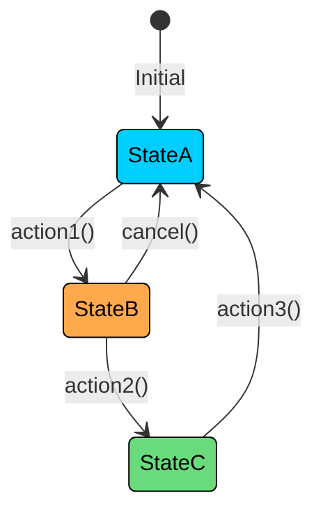

Instead of focusing on *what steps are performed* (like an activity diagram), a state diagram focuses on *how behavior changes depending on the current state*.

For example, an order can move through states like **Placed → Paid → Shipped → Delivered → Cancelled**, with specific events triggering each transition.

---

## 1. Benefits of State Diagrams?

Some objects in a system are fundamentally about states. A vending machine is either idle, collecting money, dispensing, or out of stock. An order is pending, confirmed, shipped, or delivered. An elevator is idle, moving up, moving down, or stopped at a floor. 

For these objects, understanding the states and transitions is more important than understanding the class hierarchy. 

Here's why state diagrams are worth mastering.

#### **1. Model object lifecycles clearly**

Some objects have complex lifecycles where the valid operations depend entirely on the current state. You can cancel an order that's pending, but not one that's already delivered. You can insert money into a vending machine that's idle, but not one that's currently dispensing. State diagrams make these rules explicit and visual. Every valid operation is an arrow on the diagram.

#### **2. Catch missing transitions and invalid states**

When you draw a state diagram, gaps in your design become obvious. What happens if the payment gateway times out while the order is in the "Processing Payment" state? What if the vending machine runs out of stock while a user has already inserted money? Without a state diagram, these edge cases hide in your mental model. On a diagram, missing transitions are visible as states with no outgoing arrow for a particular event.

#### **3. Bridge between requirements and implementation**

States map directly to enums in code. Transitions map to methods. Guard conditions map to if-statements. A state diagram for an order system translates almost line-for-line into a `OrderState` enum, a `transition()` method, and validation logic. This makes state diagrams one of the most implementation-ready UML diagrams you can draw.

---

## 2. Components of a State Machine Diagram

Every state diagram is built from a small set of standard components. Once you know these, you can read and draw any state diagram.

#### 2.1 State

A **state** represents a condition or situation during the life of an object. It's a period of time during which the object satisfies a particular condition, performs an activity, or waits for an event. States are drawn as rounded rectangles with the state name inside.

A state can also have **internal activities** that describe behavior associated with the state:

- **entry /** action performed when entering the state
- **do /** action performed while in the state (ongoing activity)
- **exit /** action performed when leaving the state

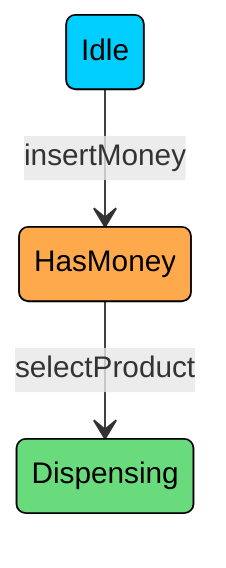

Each rounded rectangle is a state. The labels on the arrows are the events that trigger transitions. Notice that states are named with nouns or adjectives (Idle, HasMoney, Dispensing), not verbs. A state is a condition the object is in, not something it does.

#### 2.2 Initial State

The **initial state** marks where the lifecycle begins. It's drawn as a small filled circle (solid black dot). Every state diagram must have exactly one initial state. It has no incoming transitions and exactly one outgoing transition (with no event label, since the object starts here automatically).

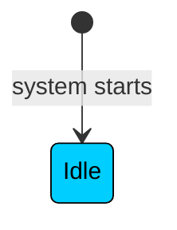

The `[*]` on the left is the initial state. It immediately transitions to the first real state (Idle) when the object is created. You don't label the initial transition with an event because no event triggers it. The object simply begins its lifecycle in this state.

#### 2.3 Final State

The **final state** marks where the lifecycle ends. It's drawn as a bullseye (a filled circle inside a larger circle). Not every state diagram needs a final state. An elevator, for instance, never truly terminates. But an order eventually reaches Delivered or Cancelled, and those are terminal states.

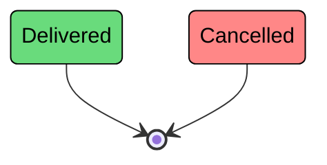

Both Delivered and Cancelled are terminal states. Once an order reaches either, its lifecycle is over. The `[*]` on the right is the final state. An object can have multiple paths to the final state (an order can end by being delivered or cancelled), but the final state itself is a single termination point.

#### 2.4 Transition

A **transition** is an arrow from one state to another, representing a change triggered by an event. The arrow is labeled with the event (and optionally a guard condition and action). A transition fires instantaneously. The object is in the source state, the event occurs, and the object is now in the target state.

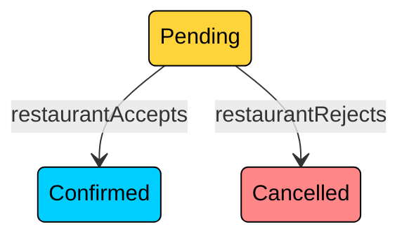

From the Pending state, two transitions are possible. If the restaurant accepts, the order moves to Confirmed. If the restaurant rejects, it moves to Cancelled. The event labels (restaurantAccepts, restaurantRejects) are the triggers. No other transitions are valid from Pending, which means the order stays in Pending until one of these events occurs.

#### 2.5 Event

An **event** is an occurrence that triggers a transition. Events are written on the transition arrow. They can be:

- **Signal events:** external inputs (userClicksCancel, paymentReceived)
- **Call events:** method invocations (processPayment(), validateOrder())
- **Time events:** timeouts (after 30 seconds, after 24 hours)
- **Change events:** when a condition becomes true (when balance == 0)

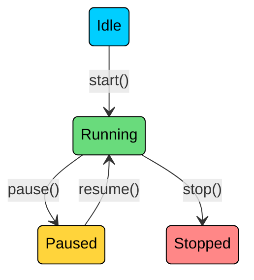

The naming convention matters. Use camelCase verbs that clearly describe what happened: `insertMoney`, `selectProduct`, `timeout`, `paymentApproved`. The event name should be specific enough that someone reading the diagram knows exactly what triggers the transition.

#### 2.6 Guard Condition

A **guard condition** is a boolean expression written in square brackets on a transition. The transition only fires if the event occurs AND the guard condition is true. Guards are your way of saying "this transition is only valid when..."

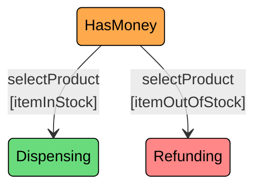

Both transitions are triggered by the same event (selectProduct), but the guard condition determines which transition fires. If the selected item is in stock, the machine moves to Dispensing. If not, it moves to Refunding. Without guard conditions, you'd have ambiguous transitions: two arrows from the same state triggered by the same event, with no way to know which one fires.

#### 2.7 Action

An **action** is behavior executed during a transition. Written after a `/`.

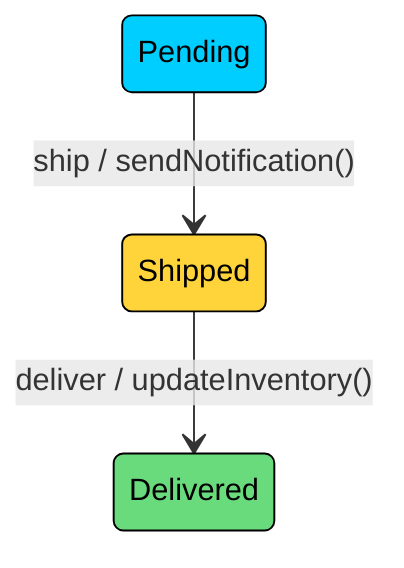

---

## 3. Types of States

Not all states are simple boxes. UML state diagrams support several types of states that help you model complex lifecycles without cluttering the diagram.

### Simple States

A simple state has no internal structure. It's just a named condition with incoming and outgoing transitions. Most states in a typical state diagram are simple states.

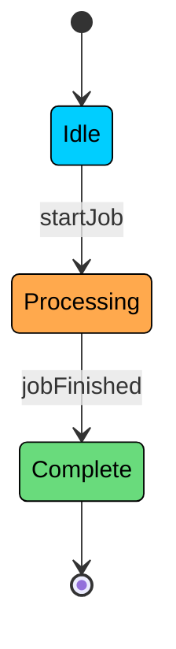

Three simple states, linear progression, no nesting. This is sufficient for most straightforward lifecycles.

### Composite (Nested) States

A **composite state** contains sub-states within it. This is useful when a high-level state has its own internal lifecycle. For example, an "Active" state in a user account might contain sub-states like "Standard" and "Premium."

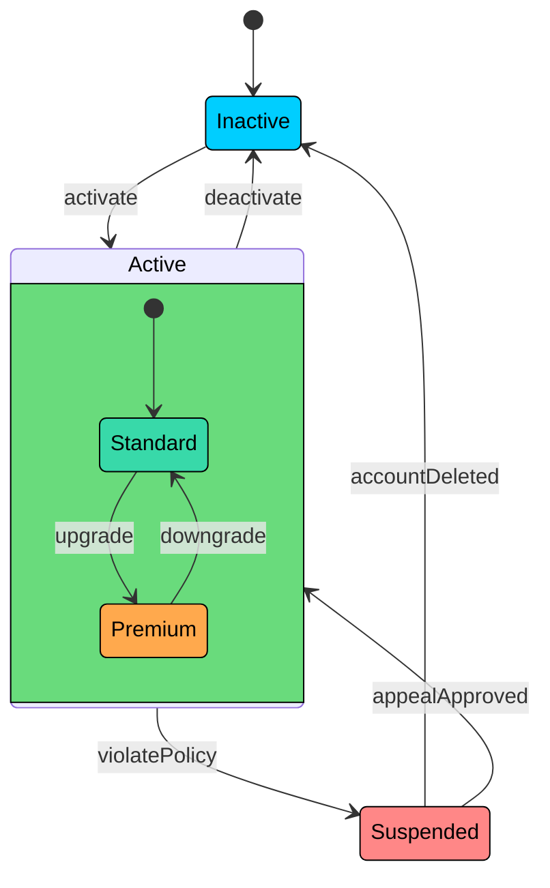

The Active state is a composite state containing Standard and Premium as sub-states. When a user activates their account, they enter the Active state, which starts in the Standard sub-state. They can upgrade to Premium or downgrade back to Standard without leaving the Active state. But if they violate a policy, they leave the entire Active state (regardless of whether they were Standard or Premium) and move to Suspended.

Composite states are powerful because they let you model hierarchical behavior. The outer transitions (Active to Suspended) apply to all sub-states. The inner transitions (Standard to Premium) are only relevant within the composite state.

### Self-Transitions

A **self-transition** is a transition where the source and target state are the same. The object leaves the state and re-enters it, which triggers exit and entry actions.

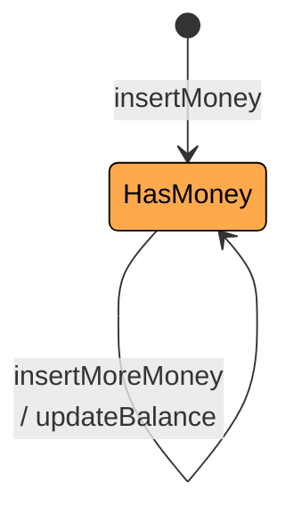

In a vending machine, after inserting money, the user can insert more money. The machine stays in the HasMoney state but updates the balance. The self-transition arrow loops back to the same state, indicating that the event is handled without changing states.

Self-transitions are common in real systems. A chat application in the "Connected" state might receive a new message (self-transition with a "displayMessage" action). A game character in the "Moving" state might change direction (self-transition with an "updateDirection" action).

### Choice Pseudo-State

A **choice pseudo-state** is a diamond-shaped node that evaluates conditions dynamically and routes the flow to different states based on the result. It's similar to a decision node in activity diagrams but used within state diagrams for dynamic branching.

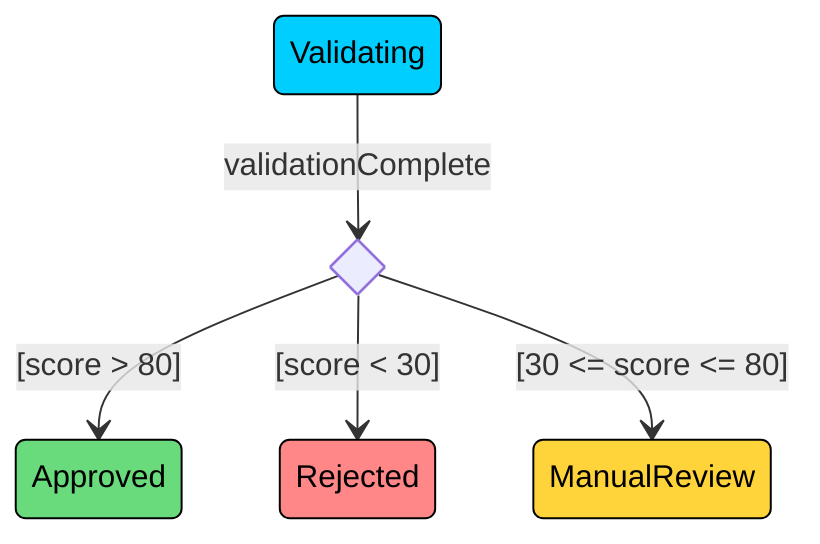

After validation, the choice pseudo-state evaluates the score and routes to one of three states. This is useful when the target state depends on a runtime value rather than a simple binary condition.

---

## 4. How to Create a State Diagram: Step by Step

Here's a repeatable process for creating state diagrams for any object. We'll use a food delivery order as the running example.

#### **Step 1: Identify the object**

Pick the single object whose lifecycle you want to model. Don't try to model the entire system. State diagrams are about one object at a time. For a food delivery system, the object is the Order.

#### **Step 2: List all possible states**

Ask yourself: what conditions can this object be in during its lifetime? For a food delivery order: Placed, Confirmed, Preparing, ReadyForPickup, PickedUp, Delivered, Cancelled.

#### **Step 3: Identify the initial and final states**

Where does the lifecycle begin? (Placed.) Where does it end? (Delivered and Cancelled are both terminal states.)

#### **Step 4: Define the transitions**

For each state, ask: what events can cause the object to leave this state, and where does it go? Placed can transition to Confirmed (restaurant accepts) or Cancelled (restaurant rejects). Confirmed transitions to Preparing (kitchen starts). And so on.

#### **Step 5: Add guard conditions**

Are there any transitions where the same event can lead to different states? For example, a customer cancelling might lead to Cancelled with a full refund (if the order hasn't been prepared yet) or Cancelled with a partial refund (if preparation has started). That's a guard condition.

#### **Step 6: Validate the diagram**

Check every state: does it have at least one outgoing transition (unless it's a final state)? Does it have at least one incoming transition (unless it's the initial state)? Is every event handled, or are there events that have no effect in certain states? If a user tries to cancel a delivered order, what happens? If the diagram doesn't answer that, you have a gap.

</section>
