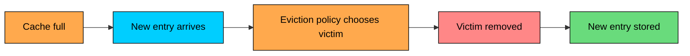
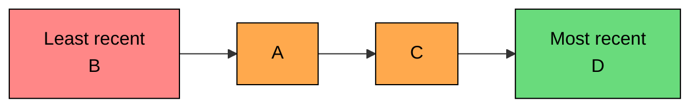

import React from 'react';
import CodeBlock from '../../../../components/ui/CodeBlock';
import Callout from '../../../../components/ui/Callout';

<div className="article-header">
  <div className="breadcrumb">
    <a href="/">Curated Notes</a>
    <span className="breadcrumb-separator">›</span>
    <span className="breadcrumb-current">Cache Eviction Policies</span>
  </div>
  <h1>Cache Eviction Policies</h1>
  <p style={{ color: 'var(--text-muted)', fontSize: '1.1rem', marginBottom: '16px', lineHeight: '1.6' }}>
    Master the essentials of Cache Eviction Policies in this curated guide.
  </p>
  <div className="meta-info">
    <span className="meta-item">
      <svg width="14" height="14" viewBox="0 0 24 24" fill="none" stroke="currentColor" strokeWidth="2"><circle cx="12" cy="12" r="10"/><polyline points="12 6 12 12 16 14"/></svg>
      10 min read
    </span>
    <span className="difficulty-badge difficulty-badge--intermediate">Intermediate</span>
  </div>
</div>

<section className="content-section">

A cache is useful because it keeps hot data close to the application.

But cache memory is finite. Sooner or later, the cache has to make room for new data.

**Cache eviction** is the process of removing entries from the cache when memory is full, an entry expires, or the cache decides an entry is no longer worth keeping.

The eviction policy answers one question:

&gt; When the cache needs space, which entry should be removed?

The answer depends on the workload. A policy that works well for product pages may work poorly for analytics queries, search results, or one-time scans.

This chapter covers why eviction policies matter, walks through the most common policies (LRU, LFU, FIFO, random replacement, MRU, and TTL), and ends with how to choose between them and monitor their behavior.

---

## Why Eviction Matters

Eviction affects latency, database load, and user experience, not only memory usage.

If the cache evicts useful entries too aggressively, hit rate drops and the database receives more traffic. If the cache keeps the wrong entries, memory fills with data nobody asks for.





Good eviction keeps the working set in memory.

The **working set** is the data your application is likely to request again soon. Eviction policies are different guesses about what belongs in that working set.

---

## Least Recently Used (LRU)

**Least Recently Used**, or **LRU**, evicts the entry that has gone the longest without being accessed.

The assumption is simple: data used recently is more likely to be used again soon.

#### How It Works

On every read or write, the cache marks the entry as recently used. When memory is full, the cache evicts the least recently used entry.





Example with capacity 3:


```shell
Put A      -> [A]
Put B      -> [A, B]
Put C      -> [A, B, C]
Get A      -> [B, C, A]   # A becomes most recent
Put D      -> [C, A, D]   # B is evicted
```


#### Trade-offs

LRU is easy to understand, adapts quickly when access patterns change, and works well for many web and API workloads because it keeps recently active data in memory. The downsides are that it needs metadata to track recency, can perform poorly during large scans, and may evict frequently used data if it has not been touched recently.

#### Best Fit

LRU is a strong default for general-purpose application caches where recent activity predicts near-future activity.

It can struggle with scan-heavy workloads. For example, a one-time job that reads millions of keys can push out useful hot data.

---

## Least Frequently Used (LFU)

**Least Frequently Used**, or **LFU**, evicts the entry with the lowest access count.

The assumption is that data accessed many times in the past is more valuable than data accessed once.

#### How It Works

The cache tracks an approximate frequency count for each entry. When memory is full, it evicts an entry with the lowest count. Ties are usually broken with recency.


```shell
Capacity: 3

Put A      -> A(freq=1)
Put B      -> A(1), B(1)
Put C      -> A(1), B(1), C(1)
Get A      -> A(2), B(1), C(1)
Get A      -> A(3), B(1), C(1)
Put D      -> A(3), C(1), D(1)   # B is evicted
```


#### Trade-offs

LFU protects consistently popular keys and works well when popularity matters more than recency. The downsides are that it needs frequency metadata, old popular items can stay too long after traffic patterns change, and the implementation usually needs decay or aging so that old counts lose influence.

#### Best Fit

LFU works well when a small set of keys stays popular for a long time: product catalogs, profile metadata, configuration, and common lookup tables.

It works poorly when popularity changes quickly unless the implementation ages old counts.

---

## First In, First Out (FIFO)

**First In, First Out**, or **FIFO**, evicts the oldest inserted entry.

It does not care whether the entry was accessed recently or often.

#### How It Works

Entries are stored in insertion order. When the cache is full, the oldest entry is removed.


```shell
Capacity: 3

Put A      -> [A]
Put B      -> [A, B]
Put C      -> [A, B, C]
Get A      -> [A, B, C]   # order does not change
Put D      -> [B, C, D]   # A is evicted
```


#### Trade-offs

FIFO is very simple, has low metadata overhead, and behaves predictably. The downsides are that it ignores access patterns entirely, can evict hot entries, and usually delivers a lower hit rate than LRU or LFU for application caches.

#### Best Fit

FIFO is useful when simplicity matters more than hit rate, or when cached entries have similar value and access patterns.

It is rarely the best policy for high-traffic application data.

---

## Random Replacement

**Random replacement** evicts a randomly selected entry when space is needed.

It does not track recency, frequency, or insertion order.

#### How It Works

When the cache is full, pick one entry at random and remove it.


```shell
Capacity: 3

Cache: [A, B, C]
Put D -> randomly evict B
Cache: [A, C, D]
```


#### Trade-offs

Random replacement uses minimal metadata, is simple and fast, avoids bookkeeping overhead, and can behave surprisingly well under some workloads. The downsides are that it can evict hot data by chance, is harder to reason about, and is usually not ideal when access patterns are stable.

#### Best Fit

Random replacement can be acceptable when metadata cost must be very low or access patterns are unpredictable.

It is also useful as a baseline when evaluating whether a more complex policy is worth the overhead.

---

## Most Recently Used (MRU)

**Most Recently Used**, or **MRU**, evicts the entry that was accessed most recently.

This sounds strange because many systems want the opposite. MRU is useful for specific workloads where the most recent item is unlikely to be used again.

#### How It Works

The cache tracks the most recently used entry. When space is needed, that entry is removed.


```shell
Capacity: 3

Put A      -> [A]
Put B      -> [A, B]
Put C      -> [A, B, C]
Get C      -> C is most recent
Put D      -> [A, B, D]   # C is evicted
```


#### Trade-offs

MRU is useful for some scan or cyclic access patterns, uses simple recency metadata, and keeps older entries that may still be useful. The downsides are that it is a poor default for most application caches, evicts data that was recently used, and is easy to choose for the wrong workload.

#### Best Fit

MRU can fit workloads where recently read data is unlikely to be reused, such as certain sequential scans or cyclic access patterns.

For most web services, LRU is a better starting point.

---

## Time-To-Live (TTL)

**Time-To-Live**, or **TTL**, expires entries after a configured duration.

TTL is often discussed with eviction policies, but it solves a slightly different problem. LRU and LFU decide what to remove under memory pressure. TTL bounds how long data may stay in the cache.

#### How It Works

Each entry gets an expiration time.


```shell
Put A with TTL 5s
T+0s: A is valid
T+5s: A expires
T+6s: GET A returns miss
```


Expired entries may be removed by a background cleanup process or lazily when accessed.

#### Trade-offs

TTL bounds staleness, cleans up entries that may never be accessed again, is simple to configure, and works well with explicit invalidation as a backstop. The downsides are that it can evict hot data even when memory is available, does not choose the best entry under memory pressure on its own, and synchronized TTLs can cause many keys to expire together.

#### Best Fit

Use TTL when cached data has a freshness requirement.

For production systems, add jitter so many entries do not expire at the same time:


```python
import random

ttl = 3600 + random.randint(-300, 300)
cache.set(key, value, ttl=ttl)
```


---

## Choosing a Policy

Start with the workload, not the policy name.


| Workload | Good Starting Point | Why |
|----------|---------------------|-----|
| General web/API reads | LRU | Recent data is often reused |
| Stable hot keys | LFU | Frequent data should survive |
| Strict freshness bounds | TTL plus LRU or LFU | TTL handles freshness, eviction handles memory |
| Sequential scans | MRU or scan-resistant LRU variants | Recent scan items may not be reused |
| Very low metadata budget | FIFO or random | Simple and cheap |
| Unpredictable access | LRU, random baseline, or adaptive policy | Measure rather than guess |


Modern caches often use approximations or hybrids rather than textbook policies. Redis supports policies such as `allkeys-lru`, `volatile-lru`, `allkeys-lfu`, `volatile-ttl`, and several random variants. Many local caches use windowed or segmented LRU-style policies to avoid scan pollution. Some systems combine TTL with recency or frequency tracking.

Do not memorize policy names as if one policy wins everywhere. Measure hit rate and eviction behavior under the actual workload.

---

## Common Pitfalls

#### Evicting by Count Instead of Size

One large value can consume as much memory as thousands of small values.

If the cache limits only item count, a few large entries can crowd out many useful small entries. Track memory usage and item sizes, not only key count.

#### Caching One-Time Reads

Caching data that will never be read again pollutes the cache. Common examples include large report exports, one-off admin queries, full table scans, and backfills or migrations.

Bypass the cache for known one-time access patterns.

#### Ignoring Negative Results

If many requests ask for missing data, the database can still be overloaded.

Short-lived negative caching can help:


```python
value = database.get(key)
if value is None:
    # Short TTL so newly created data is not hidden for long.
    cache.set(key, {"not_found": True}, ttl=30)
    return None
```


Keep the TTL short so newly created data does not stay hidden.

#### Treating TTL as a Memory Policy

TTL helps with freshness. It does not guarantee that the most valuable entries stay in memory.

Use TTL with a memory eviction policy when both freshness and memory pressure matter.

#### Not Reserving Headroom

Running a cache at the edge of memory capacity causes constant evictions.

Constant eviction means the cache is churning: entries are inserted and removed before they can provide much value.

---

## Monitoring Eviction

You cannot tune eviction by looking only at cache hit rate. Track several metrics together: the hit rate by route or key pattern (whether important paths benefit from cache), the eviction rate (whether memory pressure is active), memory usage (how close the cache is to capacity), the item size distribution (whether large values are crowding out smaller ones), the miss rate after eviction (whether evictions are hurting users), the database QPS after eviction (whether the backing store is being exposed), and the TTL expiry rate (whether expirations are causing miss spikes).

Useful alerts fire when the eviction rate spikes suddenly, when hit rate drops on critical key patterns, when memory usage stays near the limit, when database QPS rises after eviction increases, or when many keys expire at the same time.

---

## Summary

Cache eviction decides what leaves the cache when space is needed.

LRU evicts the least recently used entry and is a good default for many applications. LFU evicts the least frequently used entry, which protects stable hot sets. FIFO evicts the oldest inserted entry; it is simple but often less effective. Random eviction picks an entry by chance, which is cheap and sometimes acceptable. MRU evicts the most recently used entry and is useful only for specific access patterns. TTL expires entries by age, which handles freshness but is not a complete memory policy by itself.

Choose based on workload. Then verify with metrics: hit rate, eviction rate, memory usage, item sizes, and database load.

The best eviction policy is the one that keeps the working set in memory without letting stale or low-value data crowd out the entries users need.

</section>
