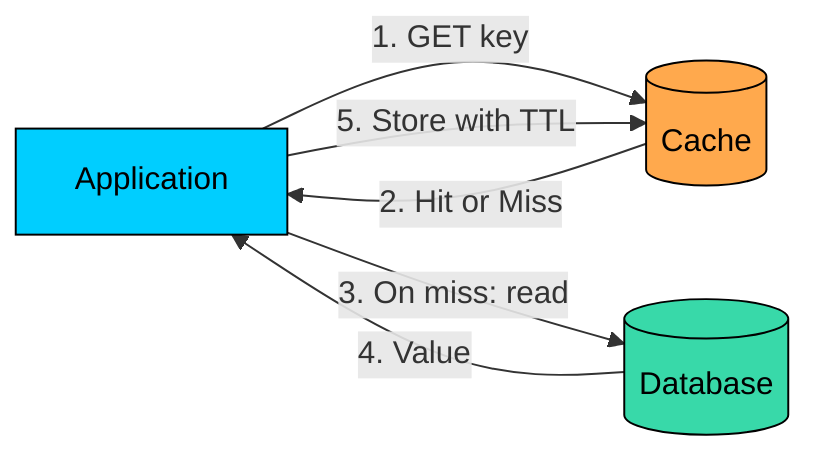
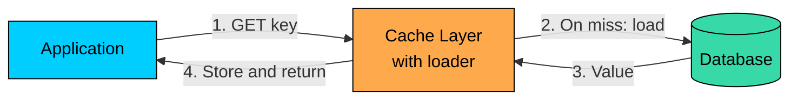
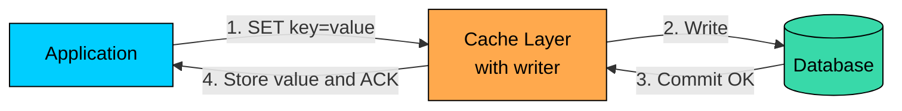
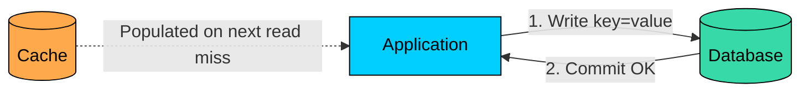
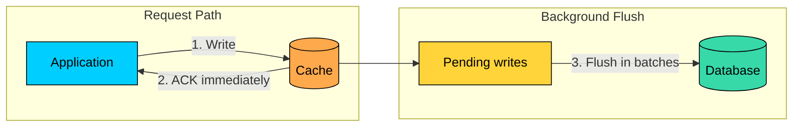

import React from 'react';
import CodeBlock from '../../../../components/ui/CodeBlock';
import Callout from '../../../../components/ui/Callout';

  

    <a href="/">Curated Notes</a>
    ›
    Caching Strategies Summary
  

  <h1>Caching Strategies Summary</h1>
  

    Master the essentials of Caching Strategies Summary in this curated guide.
  

  

    
      <svg width="14" height="14" viewBox="0 0 24 24" fill="none" stroke="currentColor" strokeWidth="2"><circle cx="12" cy="12" r="10"/><polyline points="12 6 12 12 16 14"/></svg>
      10 min read
    
    Intermediate
  

<section className="content-section">

A caching strategy defines how an application reads from and writes to the cache. Each strategy trades off latency, consistency, complexity, and failure behavior differently.

This chapter compares the five caching strategies that come up most often in system design: cache-aside (also called lazy loading), read-through, write-through, write-around, and write-back (also called write-behind).

---

## The Core Trade-offs

Two decisions shape every caching strategy:

1. On a read miss, who fetches the data from the source of truth?
2. On a write, what gets updated, in what order, and when is the write acknowledged?

The answers determine latency, freshness, and how the system behaves when the cache or database fails.

---

## Cache-Aside (Lazy Loading)

In cache-aside, the application owns the caching logic. It checks the cache first, falls back to the database on a miss, and stores the result in the cache for next time. On writes, the application updates the database and removes the affected cache entry.

The cache is treated as an optional accelerator. If the cache is down, the application can still read from the database, only more slowly.

Cache-aside works with any plain key-value cache such as Redis or Memcached, and the cache stays optional so failures degrade performance rather than correctness. The application can apply different TTLs and policies per data type, which makes the pattern flexible.

The cost is that application code must implement cache reads, fills, and invalidation. Cold reads always pay the database round trip, and stale data is possible when an invalidation is missed.

**Best for:** Read-heavy workloads where the application can absorb the cache logic. Common examples include product catalogs, user profiles, and configuration data.

---

## Read-Through

In a read-through cache, the application asks the cache directly. The cache layer handles misses by loading from the database, storing the result, and returning it.

The miss path lives inside the cache layer, not the application.

Read-through centralizes loading logic across services and reduces duplicated miss-handling code, so application reads look like simple cache lookups. The cost is that the cache layer now needs database access and schema knowledge, cold reads still pay the database cost through the loader, and failures in the loader become cache failures.

**Best for:** Systems where many services share the same read pattern and benefit from a single loader implementation. Local cache libraries such as Caffeine make this pattern easy.

---

## Write-Through

In write-through, the application writes to the cache layer. The cache layer writes to the database synchronously and acknowledges only after the database commits.

Reads after writes commonly hit the cache, since the cache was updated as part of the write path.

Write-through keeps the cache and database aligned, removes manual invalidation code from the application, and provides strong read-after-write behavior for callers that use the cache layer. The cost is that write latency now includes both the database write and the cache work.

All writers must use the cache path, since any direct database write can leave the cache stale, and the cache layer becomes part of the critical write path.

**Best for:** Workloads where reads commonly follow writes, write latency is tolerable, and all writers can be routed through the cache layer.

---

## Write-Around

In write-around, the application writes directly to the database. The cache is bypassed on writes. Cached data is updated only on the next read miss, typically through a cache-aside fill.

If the same key was already cached when the write happens, that cached value becomes stale until it expires or is explicitly invalidated.

Write-around avoids caching data that is never read again, keeps writes simple by touching only one storage layer, and lets the cache stay focused on actually-read data. The downsides are that the first read after a write is always a cache miss, existing cached entries can be left stale unless explicitly invalidated, and read-after-write behavior is weaker than write-through.

**Best for:** Write-heavy workloads where written data is rarely read soon after, such as bulk imports, event ingestion, and large append-only logs.

---

## Write-Back (Write-Behind)

In write-back, the application writes to the cache and the cache acknowledges immediately. The actual database write happens later in the background.

The acknowledged write is durable only as much as the cache and its pending-write buffer are durable. If the cache fails before the flush, those writes can be lost.

Write-back gives the lowest user-visible write latency and lets background workers batch and coalesce writes to reduce database load, which makes it useful for absorbing short write spikes. The downsides are significant: acknowledged writes are not yet durable in the database, the pattern needs a durable pending-write buffer such as a write-ahead log or replicated queue to survive failures, and ordering, retries, and recovery add real operational complexity.

Some systems back the pending-write buffer with Redis AOF, replicated queues, or a separate durable log. AOF helps, but its safety depends on the fsync policy: the default `everysec` setting can still lose roughly one second of writes, and `always` removes most of the latency advantage that motivated write-back in the first place.

**Best for:** Low-risk, high-throughput data where delayed durability is acceptable, such as counters, view counts, metrics, and certain session state. Not appropriate for payments, audit logs, user-generated content, or any write where loss is unacceptable.

---

## Comparison

| Strategy | Read Miss Handling | Write Path | ACK Timing | Consistency | When to Use |
|----------|--------------------|------------|------------|-------------|-------------|
| Cache-Aside | Application loads from DB | App writes DB, then invalidates cache | After DB commit plus cache delete | Eventual (TTL or invalidation) | Read-heavy, infrequent updates |
| Read-Through | Cache layer loads from DB | Not a write pattern | n/a | Eventual | Shared read paths across services |
| Write-Through | Cache layer loads from DB (if combined with read-through) | App writes through cache; cache writes DB | After DB commit | Strong if all writers use the cache path | Read-after-write workloads |
| Write-Around | Application loads from DB | App writes DB directly; cache bypassed | After DB commit | Eventual; cached entries can be stale | Write-heavy, recent writes rarely read |
| Write-Back | Application loads from DB | App writes cache; flushed to DB asynchronously | After cache write | Eventual; risk of loss without a durable buffer | High write throughput where some loss is tolerable |

---

## Choosing a Strategy

Pick based on the workload shape and the cost of stale or lost data.

| Workload Characteristic | Strategy to Consider |
|-------------------------|----------------------|
| Reads dominate, writes are occasional | Cache-Aside or Read-Through |
| Reads frequently follow writes | Write-Through |
| Many services share the same read logic | Read-Through |
| Writes are frequent, recent writes rarely read | Write-Around |
| Writes are latency-sensitive and the data is low-risk | Write-Back, with a durable pending-write buffer |
| Loss or staleness is unacceptable | Read directly from the database; cache only safe-to-stale data |

Many production systems combine strategies. Cache-aside for reads paired with write-around for writes is common when written data is rarely read soon after. Write-back is usually reserved for specific high-volume, low-risk data paths rather than applied across the whole system.

---

## Summary

There is no single best caching strategy. Each one is a different answer to the same trade-off: how much latency, complexity, and risk is acceptable for the throughput and freshness the system needs.

Cache-aside is the most flexible default, with cache logic living in the application. Read-through centralizes the read path in the cache layer. Write-through keeps cache and database aligned at the cost of write latency. Write-around keeps the cache clean for write-heavy workloads. Write-back optimizes for write throughput when delayed durability is acceptable.

Choose based on the read/write ratio, tolerance for stale or lost data, and how much complexity the application is willing to absorb in the cache layer.

---

## Quiz

</section>
