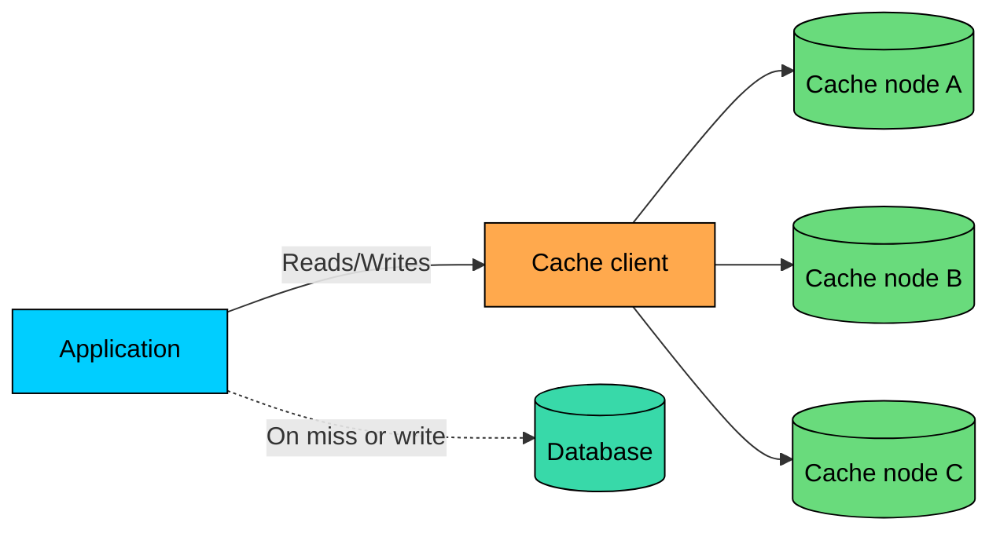
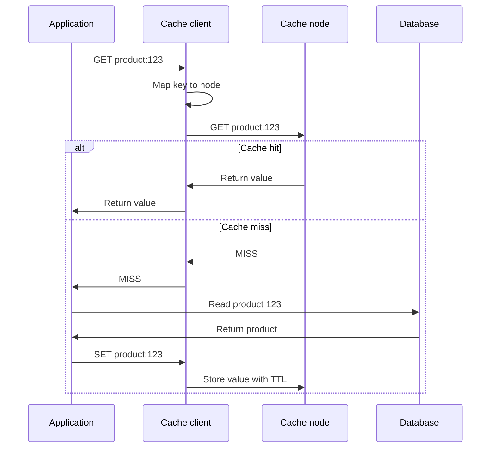
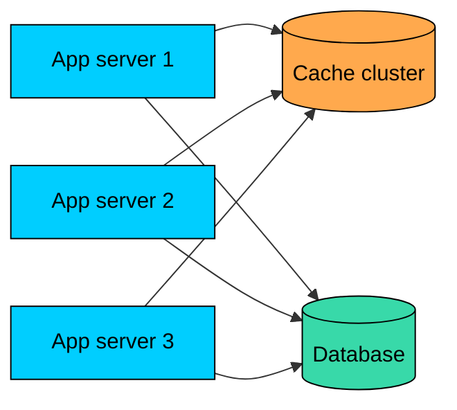
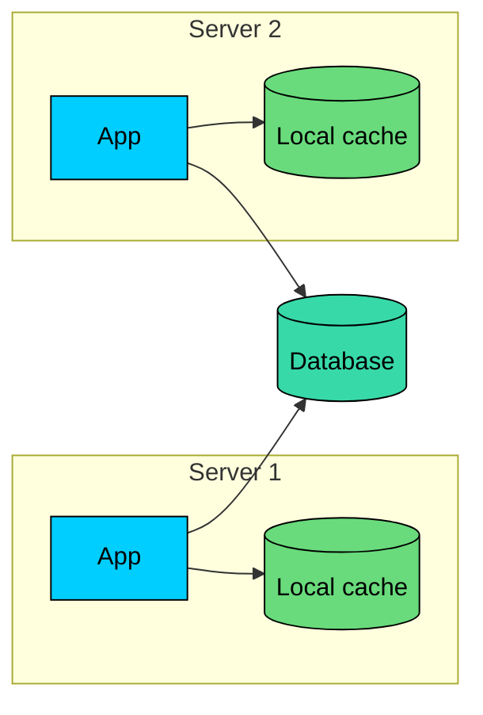
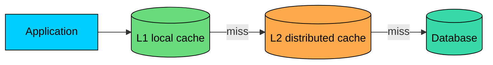

import React from 'react';
import CodeBlock from '../../../../components/ui/CodeBlock';
import Callout from '../../../../components/ui/Callout';

<div className="article-header">
  <div className="breadcrumb">
    <a href="/">Curated Notes</a>
    <span className="breadcrumb-separator">›</span>
    <span className="breadcrumb-current">Distributed Cache Architecture</span>
  </div>
  <h1>Distributed Cache Architecture</h1>
  <p style={{ color: 'var(--text-muted)', fontSize: '1.1rem', marginBottom: '16px', lineHeight: '1.6' }}>
    Master the essentials of Distributed Cache Architecture in this curated guide.
  </p>
  <div className="meta-info">
    <span className="meta-item">
      <svg width="14" height="14" viewBox="0 0 24 24" fill="none" stroke="currentColor" strokeWidth="2"><circle cx="12" cy="12" r="10"/><polyline points="12 6 12 12 16 14"/></svg>
      10 min read
    </span>
    <span className="difficulty-badge difficulty-badge--intermediate">Intermediate</span>
  </div>
</div>

<section className="content-section">

A cache keeps frequently used data in fast storage, usually memory, so the application does not have to recompute it or fetch it from a slower database on every request.

A single cache node is often enough for small systems. It is simple, fast, and easy to operate.

At higher scale, one node becomes a limit. It may not have enough memory for the working set. It may not handle the request volume. It may also become a single point of failure.

**Distributed caching** solves this by spreading cached data across multiple cache nodes.

In this chapter, we will cover what distributed caching means, why systems use it, how keys are placed across cache nodes, the differences between dedicated, co-located, and multi-level cache designs, the common failure modes and trade-offs, practical guidelines for production systems, and the most common caching technologies.

---

## What is Distributed Caching?

A distributed cache stores cached data across multiple machines instead of keeping everything on one machine.

From the application's point of view, it still looks like a key-value cache:


```shell
GET product:123
SET product:123 {...} TTL 300
```


Behind the scenes, the cache client or cache service decides which node owns `product:123`.





A distributed cache is usually **partitioned** across nodes, not fully replicated on every one.

If you have 100 GB of cached data and 5 cache nodes, each node might hold about 20 GB. That is how the cache scales capacity and throughput.

Some systems also replicate data for availability, but replication is a separate choice. It improves resilience, but it uses more memory and adds operational complexity.

---

## Why Use Distributed Caching?

Distributed caching is useful when one cache node is no longer enough.

#### More Memory

Each cache node contributes memory to the cluster. Adding nodes lets the cache hold a larger working set.

This matters when the application repeatedly reads millions of products, profiles, permissions, search results, feed items, or computed responses.

#### More Throughput

Requests are spread across nodes, so no single cache process has to serve every read and write.

This helps when cache traffic is high enough that one node becomes CPU-bound, network-bound, or connection-bound.

#### Better Availability

With multiple nodes, the failure of one cache node does not have to take down the whole cache layer.

There is still a cost. Keys on the failed node may be unavailable, cold, or served from replicas depending on the cache design. The application must still tolerate misses and fall back to the source of truth.

#### Lower Database Load

The main reason to cache is still the same: protect slower dependencies.

A well-designed distributed cache can absorb a large share of read traffic and keep the database focused on writes, cache misses, and queries that truly need fresh data.

---

## How Distributed Caching Works

Most distributed caches follow the same basic flow:

1. The application builds a cache key.
2. A cache client or proxy maps that key to a cache node.
3. The request goes to the selected node.
4. On a hit, the value returns from cache.
5. On a miss, the application fetches from the source of truth and may store the result in cache.





#### Key Distribution

The cache has to answer one question for every key:

&gt; Which node should store this key?

There are two common approaches.


| Approach | How It Works | Trade-off |
|----------|--------------|-----------|
| Modulo hashing | `hash(key) % number_of_nodes` chooses the node | Simple, but adding or removing nodes remaps many keys |
| Consistent hashing | Keys and nodes are placed on a hash ring | More stable during scaling and failures |


Modulo hashing is easy to understand, but it behaves badly when the cluster size changes. If you move from 5 nodes to 6 nodes, many keys move to different nodes, causing a large cold-cache event.

Consistent hashing reduces that disruption. When a node is added or removed, only a smaller portion of keys move. This is why consistent hashing is common in distributed caches and storage systems.

#### Sharding

**Sharding** means splitting the keyspace across multiple nodes.

For example:


| Key | Owning Node |
|-----|-------------|
| `user:10` | Cache node A |
| `product:123` | Cache node B |
| `feed:77` | Cache node C |
| `settings:global` | Cache node A |


Sharding is what lets a distributed cache grow beyond the memory and throughput of one node.

#### Replication

**Replication** means keeping a copy of a cache entry on more than one node.

Replication can improve availability. If the primary node for a key fails, a replica may serve the value.

But replication is not free:

- It uses more memory
- Writes have to reach more nodes
- Failover behavior becomes more complex
- Replicas may briefly lag behind the primary

For many cache-aside systems, losing cached data is acceptable because the database remains the source of truth. In those systems, replication is useful but not always required.

#### Eviction

Caches have limited memory. When memory fills up, the cache must evict something. Common policies include LRU (evict least recently used entries), LFU (evict least frequently used entries), TTL-based expiration (drop entries after a configured time), and size-based limits that reject or evict large entries to protect memory.

Eviction is normal. Applications should treat the cache as a performance optimization, not as the only copy of important data.

---

## Dedicated vs Co-Located Caches

One design decision is where the cache runs.

The two common options are **dedicated cache servers** and **co-located caches**.

#### Dedicated Cache Servers

Dedicated cache servers run separately from application servers.





This is the most common design for shared caches such as Redis, Valkey, or Memcached.


#### Pros

#### Cons


#### Co-Located Cache

A co-located cache runs on the same machine or in the same process as the application.





This is often called an **in-process cache** or **local cache**.

It is fast because it avoids a network call. It is useful for small, frequently read data such as feature flags, routing tables, permissions, templates, or reference data.


#### Pros

#### Cons


#### Multi-Level Caching

Large systems often stack two cache layers in front of the database. An **L1 cache** is a small in-process cache that sits inside each application instance. An **L2 cache** is the shared distributed cache that every instance can reach. The **database** remains the source of truth behind both.





This design can work well, but it makes invalidation more difficult. If data changes, you may need to invalidate both the shared cache and every local copy.

---

## Common Challenges

Distributed caching improves scale, but it introduces new failure modes.

#### Cache Invalidation

Invalidation is the hardest part of caching.

If the database changes but the cache still returns the old value, users see stale data. In distributed systems, this gets harder because the value may exist in several places: local caches, shared cache nodes, replicas, and client-side caches.

Common approaches include TTL-based expiration, delete-on-write invalidation, versioned cache keys, event-driven invalidation through a message broker, and short TTLs for sensitive data. There is no universal answer. The right choice depends on how stale the data is allowed to be.

#### Hot Keys

Even with many cache nodes, traffic may not be evenly distributed.

A single celebrity profile, flash-sale product, leaderboard, or global configuration key can receive a large share of traffic. The node holding that key becomes hot while the rest of the cluster is underused.

Common mitigations include replicating very hot keys, adding short-lived local caching, splitting large values into smaller keys, rate limiting expensive rebuilds, and using request coalescing to prevent stampedes.

#### Rebalancing

When nodes are added or removed, some keys move.

Moving keys can create cold-cache misses, uneven load, and extra traffic to the database. Consistent hashing reduces the damage, but it does not eliminate it.

During rebalancing, watch cache hit rate, database QPS, latency, and error rates.

#### Network Failures

A distributed cache depends on the network. The application must handle timeouts, connection pool exhaustion, partial cache outages, slow cache nodes, and split-brain or failover behavior in replicated systems.

Cache calls should have tight timeouts. A slow cache should not be allowed to make the whole application slower than going directly to the database.

#### Memory Pressure

When memory fills up, the cache evicts entries. If eviction becomes aggressive, hit rate drops and database load rises.

Large values can make this worse. A few oversized entries can push out many useful small entries.

Track memory usage, eviction rate, item size distribution, and hit rate together. Looking at only one metric can hide the real problem.

#### Consistency Expectations

A cache is usually not the source of truth.

Most systems accept some staleness in exchange for speed. Problems happen when the application expects database-like consistency from a cache that was designed for performance.

Be explicit about which data can be stale and for how long.

---

## Best Practices

#### Cache Data That Is Worth Caching

A good cache candidate is read often, expensive to fetch or compute, small enough to store efficiently, safe to serve slightly stale, and shared by many requests. Poor candidates are rarely read, cheap to fetch, very large, highly sensitive to staleness, or unique to a single request.

#### Use Clear Cache Keys

Good keys are deterministic, namespaced, and versionable.


```shell
product:v2:123
user-profile:v1:456
tenant:88:feature-flags:v4
```


Versioned keys are useful when the serialized value changes. Instead of trying to delete every old key, the application starts writing and reading a new namespace.

#### Set TTLs Intentionally

TTL is a correctness and operations decision, not only a memory setting.

Use shorter TTLs for data that changes often or must not be stale for long. Use longer TTLs for stable reference data.

Add jitter to avoid many keys expiring at the same time:


```python
import random

ttl = 3600 + random.randint(-300, 300)
cache.set(key, value, ttl=ttl)
```


#### Protect the Database on Misses

Cache misses are normal. Miss storms are dangerous. Use techniques such as request coalescing, cache warming for critical keys, rate limits on expensive rebuilds, circuit breakers around overloaded dependencies, and serving stale data briefly when freshness is less important than availability.

#### Design for Cache Failure

The application should continue to work when the cache is slow, empty, or partially unavailable. That means tight cache timeouts, bounded connection pools, fallback to the source of truth, graceful degradation for non-critical features, and alerts on hit rate, latency, errors, memory usage, and evictions.

#### Keep Values Small

Large cache values increase network cost, serialization cost, memory pressure, and eviction damage.

Cache the shape the application needs, but avoid turning the cache into a dumping ground for huge objects.

#### Monitor by Route and Key Pattern

Global hit rate can be misleading.

A 95% hit rate may still hide a bad miss rate on checkout, login, or search. Track hit rate, latency, and error rate by route, tenant, key pattern, and cache node.

---

## Common Technologies

#### Memcached

[Memcached](https://memcached.org/) is a high-performance distributed memory object cache. It is simple, fast, and commonly used for small chunks of arbitrary data such as database query results, API responses, and rendered page fragments.

Memcached is a good fit when you want a straightforward volatile cache and do not need persistence, replication semantics, or rich data structures.

#### Redis

[Redis](https://redis.io/) is an in-memory data store that supports strings, hashes, lists, sets, sorted sets, streams, geospatial indexes, and other data structures.

Redis is often used as a cache, but it is also used for rate limiting, queues, leaderboards, sessions, and lightweight coordination. Because Redis has richer behavior than a simple cache, teams need to be clear about whether they are using it as a disposable cache or as a system of record for some workflow.

Redis licensing has shifted twice in recent years. Redis 7.4 moved from the BSD 3-clause license to a dual SSPL and RSALv2 model in early 2024. Redis 8 added AGPLv3 as an additional option in 2025, so current Redis releases are once again available under an OSI-approved open-source license. Teams with open-source or managed-service requirements should still review the license terms before choosing a deployment model.

#### Valkey

[Valkey](https://valkey.io/) is an open-source, Redis-compatible in-memory data store created after the Redis licensing change.

It is relevant when teams want Redis-compatible behavior under an open-source governance model.

#### Managed Cache Services

Cloud providers offer managed cache services that handle provisioning, patching, monitoring integrations, backups where supported, and failover options.

For example, [Amazon ElastiCache](https://docs.aws.amazon.com/AmazonElastiCache/latest/dg/SelectEngine.html) supports Valkey, Memcached, and Redis OSS engines.

Managed services reduce operational burden, but they do not remove the design work. You still need good keys, TTLs, capacity planning, failure handling, and invalidation strategy.

---

## Summary

Distributed caching stores cached data across multiple machines so the cache layer can scale beyond a single node.

The main building blocks are key distribution, sharding, optional replication, eviction, and client routing. The main design choices are whether to use dedicated cache servers, local co-located caches, or a multi-level L1/L2 design.

Distributed caches reduce latency and database load, but they introduce trade-offs around invalidation, hot keys, rebalancing, network failures, memory pressure, and stale data.

Treat the cache as a fast, partial, temporary copy of data. Design it so it can be empty, stale, slow, or missing without taking the whole system down.

---

## Quiz

</section>
