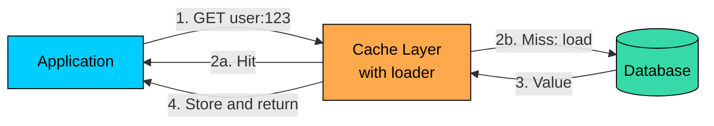
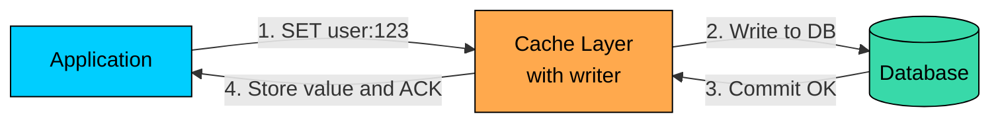
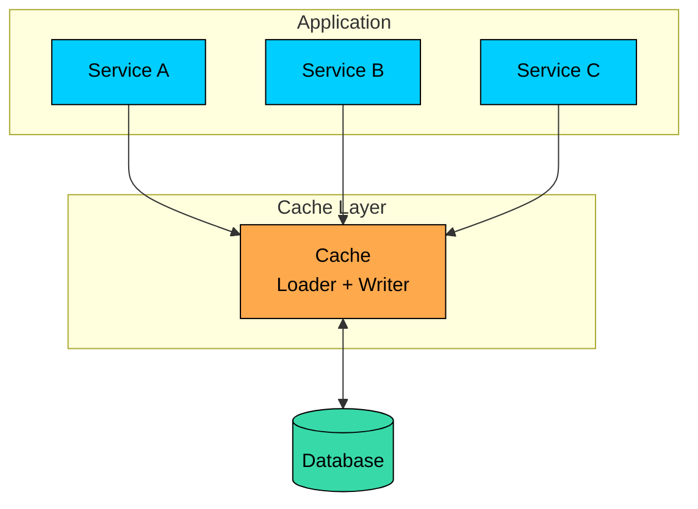
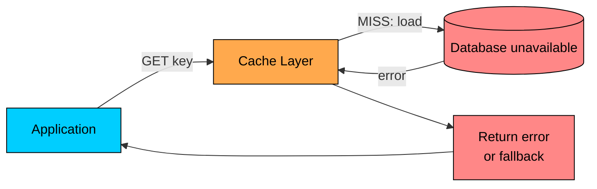
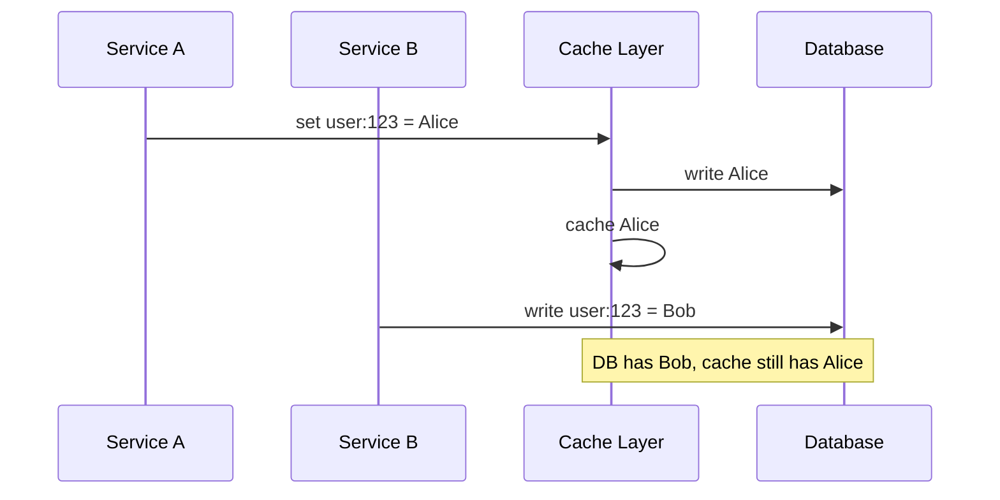

import React from 'react';
import CodeBlock from '../../../../components/ui/CodeBlock';
import Callout from '../../../../components/ui/Callout';

<div className="article-header">
  <div className="breadcrumb">
    <a href="/">Curated Notes</a>
    <span className="breadcrumb-separator">›</span>
    <span className="breadcrumb-current">Read-Through vs Write-Through Cache</span>
  </div>
  <h1>Read-Through vs Write-Through Cache</h1>
  <p style={{ color: 'var(--text-muted)', fontSize: '1.1rem', marginBottom: '16px', lineHeight: '1.6' }}>
    Master the essentials of Read-Through vs Write-Through Cache in this curated guide.
  </p>
  <div className="meta-info">
    <span className="meta-item">
      <svg width="14" height="14" viewBox="0 0 24 24" fill="none" stroke="currentColor" strokeWidth="2"><circle cx="12" cy="12" r="10"/><polyline points="12 6 12 12 16 14"/></svg>
      10 min read
    </span>
    <span className="difficulty-badge difficulty-badge--intermediate">Intermediate</span>
  </div>
</div>

<section className="content-section">

In the cache-aside pattern, the application owns the caching logic.

On reads, the application checks the cache, handles misses, queries the database, and stores the result. On writes, the application updates the database and invalidates the cache.

That gives the application full control. It also means every service that touches the data must implement the same cache rules correctly.

**Read-through** and **write-through** move some of that responsibility into the cache layer. With read-through, the cache knows how to load data on a miss. With write-through, the cache knows how to persist data on a write.

These patterns can simplify application code, but they require a cache layer that understands your data access rules. A plain key-value cache usually needs a loader, writer, wrapper library, or dedicated caching system to support them.

This chapter covers how read-through and write-through caching work, how they compare with cache-aside, the failure and consistency trade-offs each introduces, and when to use each pattern.

---

## Read-Through Cache

In a read-through cache, the application asks the cache for data. If the value is missing, the cache layer loads it from the source of truth, stores it, and returns it.

The application does not contain cache miss logic for that data type.





#### How It Works

1. Application calls `cache.get("user:123")`
2. Cache checks whether the key exists
3. On a hit, cache returns the value
4. On a miss, cache calls a loader function
5. Loader fetches from the database or another source
6. Cache stores the value with a TTL
7. Cache returns the value to the application

#### Example


```python
def load_user(key):
    _, user_id = key.split(":")
    return database.get_user(user_id)

cache = ReadThroughCache(loader=load_user, ttl=300)

def get_user(user_id):
    return cache.get(f"user:{user_id}")
```


The application code is small because the cache layer owns the miss path.

#### Benefits

Read-through reduces repeated application code because services no longer reimplement miss handling. The loading logic is centralized in one loader that defines how a key is fetched. Cache fills happen automatically on every miss, so they cannot be forgotten. The read path looks cleaner because application code reads like a normal lookup.

#### Costs

The cache layer becomes more complex because it now owns loader logic and source access. Cache keys are tied to data access rules, which is a form of tighter coupling. Cold-cache latency does not go away; the first read for a key still pays the database round trip. And miss failures move into the cache layer, so loader errors need to be handled carefully.

Read-through is useful when many callers need the same read behavior and you want one place to define it.

---

## Write-Through Cache

In a write-through cache, the application writes to the cache layer. The cache layer writes to the database synchronously, then updates the cached value.

The write is acknowledged only after the write-through path finishes.





#### How It Works

1. Application calls `cache.set("user:123", user_data)`
2. Cache layer validates and serializes the value
3. Cache layer writes the value to the database
4. If the database write succeeds, cache stores the value and acknowledges the application

#### Example


```python
def write_user(key, value):
    _, user_id = key.split(":")
    database.update_user(user_id, value)

cache = WriteThroughCache(writer=write_user, ttl=300)

def replace_user(user_id, user_data):
    cache.set(f"user:{user_id}", user_data)
```


Write-through removes the "write DB, then remember to invalidate cache" step from application code. But the cache layer must now be part of the write path, so failures and latency matter more.

#### Benefits

Write-through centralizes the write path, so one writer defines persistence behavior. There is no miss immediately after a write because the cache already contains the new value. Read-after-write flows become easier since the user usually sees their update straight from the cache. And manual invalidation code is replaced by a single abstraction in the application.

#### Costs

Write latency is higher because every write waits for the database. The cache layer is now part of the critical write path, so problems there can block writes. All writers must use the same path; any bypassing call can leave stale data in the cache. And partial failures need careful handling because the database and cache updates are still separate operations.

Write-through is useful when reads commonly follow writes and you can force all writers through the same cache-managed path.

---

## Combining Read-Through and Write-Through

Read-through and write-through are often combined.

The application reads and writes through the cache layer. The cache layer owns both the loader and writer.





This can make the cache and database feel like one data access layer.

That model only works if callers do not bypass it. If another service writes directly to the database, the cache layer may not know the data changed.

---

## Comparison with Cache-Aside


| Aspect | Cache-Aside | Read-Through | Write-Through |
|--------|-------------|--------------|---------------|
| Read miss handling | Application | Cache layer | Not a read pattern |
| Write handling | Application writes DB and invalidates cache | Not a write pattern | Cache layer writes DB and cache |
| Application code | More explicit | Simpler reads | Simpler writes |
| Cache layer complexity | Lower | Higher | Higher |
| Cold cache behavior | Miss handled by app | Miss handled by loader | Not applicable |
| Write latency | DB write plus invalidation | Not applicable | DB write through cache layer |
| Freshness depends on | Invalidation and TTL | The write strategy used | All writers using write-through |


#### When to Use Cache-Aside

Use cache-aside when the cache should be optional, when different data types need different caching behavior, when application code needs fine-grained control, when the cache technology does not support loader or writer abstractions, or when writes should go directly to the database.

Cache-aside is the most common choice because it is simple to add around an existing database.

#### When to Use Read-Through

Use read-through when many services read the same data in the same way, when miss handling is duplicated across codebases, when a reliable loader abstraction is available, when first-read latency on cold keys is tolerable, and when cache population should live in one place.

Read-through does not remove the need for invalidation. It only centralizes how missing data is loaded.

#### When to Use Write-Through

Use write-through when reads commonly follow writes, when write latency is acceptable, when all writers can be routed through the cache layer, when the cache writer can handle validation, serialization, and database errors, and when fewer manual cache invalidation calls in application code is a goal.

Write-through gives stronger read-after-write behavior than cache-aside only when the write path is used consistently.

---

## Failure Handling

Read-through and write-through move failure handling into the cache layer. That is convenient, but it also makes the cache layer more important.

#### Read-Through Miss Failure

If the cache misses and the loader cannot reach the database, the cache cannot produce a fresh value.





The options are to return an error, return a default value, serve a stale value if the cache keeps one, or trigger a background refresh and degrade the response in the meantime.

The right behavior depends on the data. A stale product description may be fine. A stale permission decision may not be.

#### Write-Through Failure

Write-through has two operations: persist to the database and update the cache.

If the database write fails, the safest behavior is to fail the whole write and leave the cache unchanged.

If the database write succeeds but the cache update fails, the database has the new value while the cache may still have the old value. The cache layer should delete or mark the cached entry invalid so the next read reloads from the database.


```python
def write_through_set(key, value):
    database.write(key, value)

    try:
        # Read the committed value back so the cache matches the database,
        # including any triggers, defaults, or computed columns.
        final_value = database.read(key)
        cache.store(key, final_value, ttl=300)
    except CacheError:
        best_effort_delete(key)
        record_metric("write_through.cache_store_failed")
        # The database write already committed. Retrying the whole write
        # may duplicate side effects unless the operation is idempotent.
        return WriteResult.COMMITTED_WITH_CACHE_MISS
```


The example reads the committed value back from the database before caching it. This avoids caching a value that differs from what the database stored, for example after triggers, defaults, or computed columns run.

---

## Consistency Considerations

Write-through is often described as keeping cache and database in sync, but that alignment depends on a few assumptions about how the system uses it.

#### All Writers Must Use the Same Path

If one service writes through the cache and another writes directly to the database, the cache can become stale.





#### Concurrent Writes Need Ordering

If two writes race, the cache layer must preserve the same ordering as the database.

Use versions, optimistic locking, compare-and-set, or database-generated update timestamps for data where this matters.


```python
def write_user(key, value, expected_version):
    updated = database.update_if_version_matches(
        key,
        value,
        expected_version,
    )
    if not updated:
        raise ConcurrentWriteError()

    final_value = database.get(key)
    cache.store(key, final_value, ttl=300)
```


#### Database Transformations Matter

The value written by the application may not be the final value stored by the database. Triggers update `updated_at`, defaults fill in missing fields, computed columns produce derived values, constraints normalize or reject data, and stored procedures apply business rules.

If the cache stores the pre-database value, it may differ from the source of truth. Reading the committed value back before caching avoids this class of bug.

---

## Latency and Cold Starts

#### Write Latency

Write-through adds the cache layer to the synchronous write path.


| Pattern | Write Path | Latency Shape |
|---------|------------|---------------|
| Cache-aside | App writes DB, then deletes cache | DB latency plus cache delete |
| Write-through | App writes cache layer, cache writes DB, then stores cache | DB latency plus cache-layer work |


The difference may be small when the cache is close and the database dominates latency. It can be large if the cache layer does extra validation, serialization, replication, or retries.

#### Cold Cache Behavior

Read-through does not avoid cold cache latency. It only hides miss handling from the application.

On a cold cache, many first reads still go to the database through the loader. Use cache warming, request coalescing, rate limits, and gradual traffic shifts for high-traffic systems.

---

## Implementation Notes

#### Local Cache Libraries

Read-through is common in local cache libraries. A loader function runs when a key is missing.


```java
LoadingCache<String, User> cache = Caffeine.newBuilder()
    .maximumSize(10_000)
    .expireAfterWrite(Duration.ofMinutes(30))
    .build(key -> database.getUser(key));

User user = cache.get("user:123");
```


#### Shared Caches

Shared caches such as Redis and Memcached are usually plain key-value stores. They do not know your database schema or business rules by default.

To get read-through or write-through behavior with them, applications commonly use a wrapper library or service that implements the loader and writer.


```python
class ReadThroughCache:
    def __init__(self, cache, loader, ttl):
        self.cache = cache
        self.loader = loader
        self.ttl = ttl

    def get(self, key):
        cached = self.cache.get(key)
        if cached is not None:
            return cached

        value = self.loader(key)
        if value is not None:
            self.cache.set(key, value, ttl=self.ttl)
        return value
```


#### Dedicated Data Grid Systems

Some distributed cache and data grid systems provide loader and writer hooks directly. These can be useful, but they make the cache layer an active participant in data access, not a passive store.

That means the cache layer needs the same production care as any other data access service: timeouts, retries, metrics, capacity planning, and failure handling.

---

## Summary

Read-through and write-through patterns move cache read and write responsibilities from application code into the cache layer.

Read-through loads missing values automatically through a loader, which simplifies read code but still has to deal with cold-cache misses and loader failures. Write-through persists writes through the cache layer before acknowledging them, which improves read-after-write behavior at the cost of write latency and requires all writers to use the same path. Combined, they create a centralized data access layer where services read and write through the cache abstraction.

The trade-off is control. Cache-aside keeps caching logic explicit in the application. Read-through and write-through centralize that logic, which can reduce duplication but makes the cache layer more complex and more critical.

Use these patterns when centralizing data access is worth that added responsibility.

---

## Quiz

</section>
