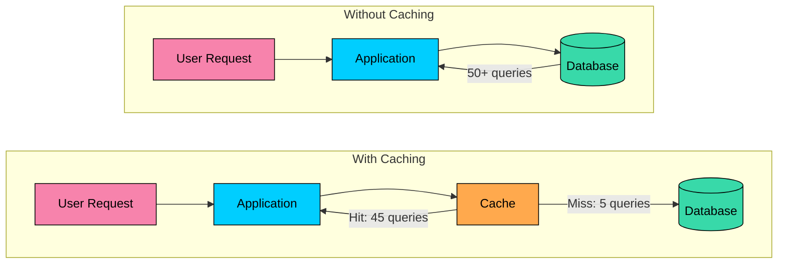
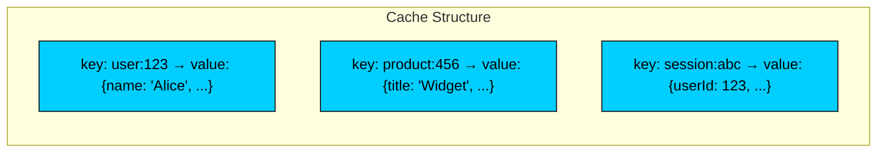
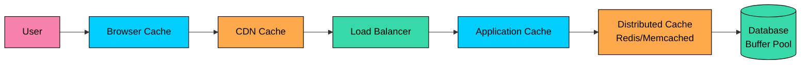
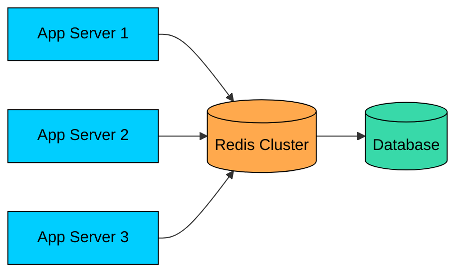
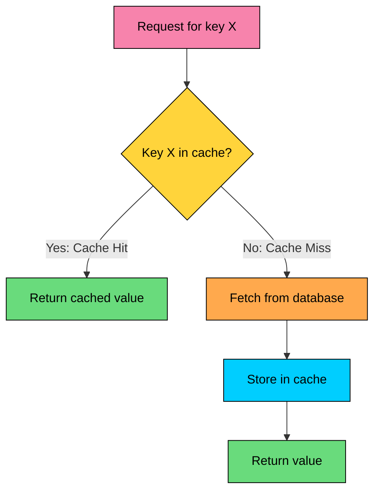
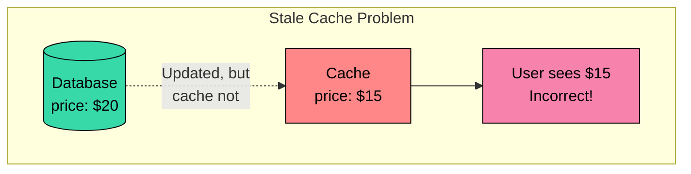
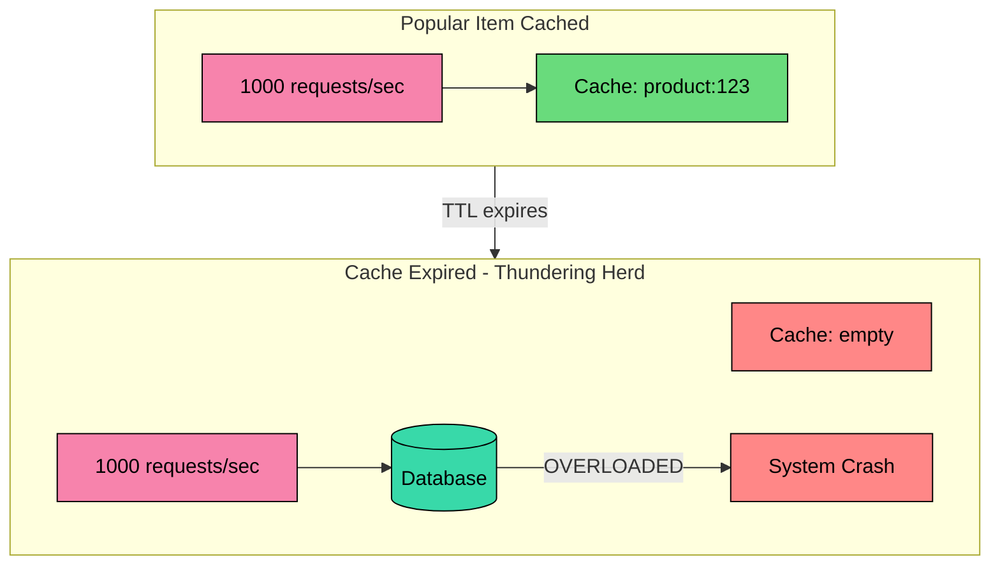
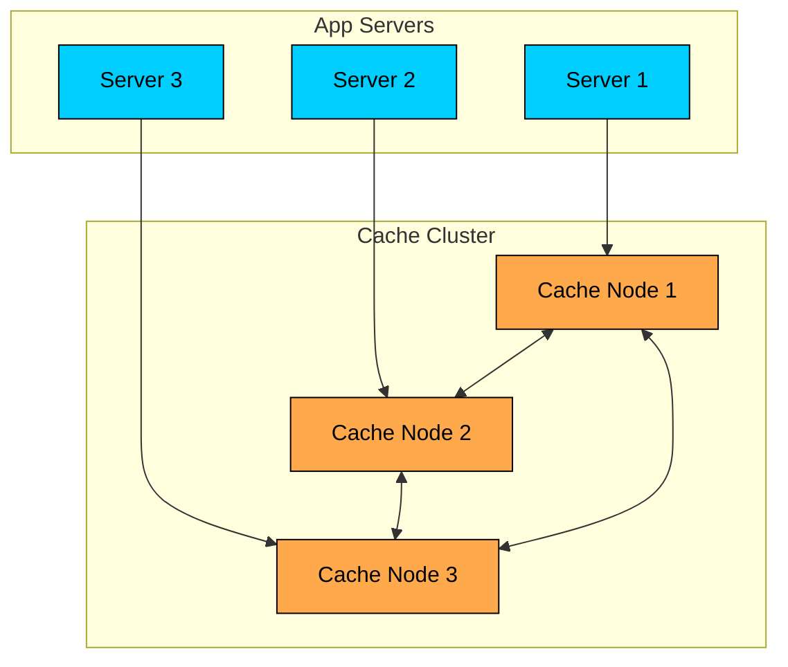

import React from 'react';
import CodeBlock from '../../../../components/ui/CodeBlock';
import Callout from '../../../../components/ui/Callout';

<div className="article-header">
  <div className="breadcrumb">
    <a href="/">Curated Notes</a>
    <span className="breadcrumb-separator">›</span>
    <span className="breadcrumb-current">What is Caching?</span>
  </div>
  <h1>What is Caching?</h1>
  <p style={{ color: 'var(--text-muted)', fontSize: '1.1rem', marginBottom: '16px', lineHeight: '1.6' }}>
    Master the essentials of What is Caching? in this curated guide.
  </p>
  <div className="meta-info">
    <span className="meta-item">
      <svg width="14" height="14" viewBox="0 0 24 24" fill="none" stroke="currentColor" strokeWidth="2"><circle cx="12" cy="12" r="10"/><polyline points="12 6 12 12 16 14"/></svg>
      10 min read
    </span>
    <span className="difficulty-badge difficulty-badge--intermediate">Intermediate</span>
  </div>
</div>

<section className="content-section">

A cache is a fast storage layer that holds copies of frequently used data so requests can be served without hitting slower systems like databases or external APIs.

Used well, caching reduces latency, lowers infrastructure cost, and improves reliability under traffic spikes.

---

## Why Caching Matters

Consider a social media application. When a user opens their feed, the application must:

1. Authenticate the user (database query)
2. Fetch the user's profile (database query)
3. Retrieve the list of followed accounts (database query)
4. Fetch recent posts from followed accounts (many database queries)
5. Get like counts and comment counts for each post (more queries)
6. Retrieve profile pictures for all post authors (even more queries)

Without caching, a single feed load might trigger 50+ database queries. Multiply by millions of users, and no database can keep up.





**Illustrative Performance Impact:**


| Metric | Without Cache | With Cache | Improvement |
|--------|--------------|------------|-------------|
| Response time | 500ms | 50ms | 10x faster |
| Database queries/sec | 500,000 | 50,000 | 10x reduction |
| Database CPU | 95% | 30% | Headroom for growth |
| Infrastructure cost | $50,000/month | $20,000/month | 60% savings |


---

#### The Anatomy of a Cache

At its core, a cache is a key-value store optimized for fast lookups:





#### Key Components

**Keys** are unique identifiers for cached data. A good key is deterministic, so the same request always produces the same key. It is descriptive, naming the data it represents. And it is collision-free, so different data never shares a key.


```shell
Good keys:
  user:123:profile
  product:456:details
  feed:user:123:page:1

Bad keys:
  data1
  temp
  cache_entry
```


**Values** are the cached data itself. They can be serialized objects (JSON, Protocol Buffers, MessagePack), raw strings or binary data, or pre-computed results like HTML fragments or aggregated statistics.

**Metadata** describes the cached entry: the creation timestamp, the expiration time (TTL), the access count used for eviction decisions, and the size in bytes.

---

## Cache Layers

Caching happens at multiple levels in a system. Each layer has different characteristics:





#### Browser Cache

The browser cache is the closest cache to the user. It stores static assets and API responses on the user's device with effectively zero latency, typically holding 50MB to 2GB per origin. Behavior is controlled through HTTP headers like `Cache-Control` and `ETag`, which makes it a natural fit for static assets and data that does not change often.


```shell
Cache-Control: max-age=3600, public
ETag: "abc123"
```


#### CDN Cache

Content Delivery Networks cache content at edge locations worldwide. Latency to the nearest edge is typically 10-50ms depending on geographic proximity, and the network as a whole holds terabytes of content. CDNs are controlled through HTTP headers and the provider's configuration, and they work best for static content, media files, and public pages.

#### Application Cache

The application cache lives in-memory inside the application process itself. Lookups finish in under a millisecond because the data is already in the same process, and the cache size is bounded by server RAM. The application code controls what goes in and out, which makes it a good fit for hot data, computed values, and session state.

The downside is that each application instance keeps its own cache, which leads to inconsistency and memory duplication across instances.

#### Distributed Cache

A distributed cache is a separate caching service shared by all application instances, with Redis and Memcached as the most common choices. Lookups take 1-5ms because each one crosses a network hop, but the cluster can grow to hundreds of gigabytes or even terabytes of capacity. The application code and cache client decide what gets cached, and the workload is usually shared state, session storage, and database query results.





#### Database Buffer Pool

Databases maintain their own cache of frequently accessed pages in memory on the database server. Reads from cached pages complete in under a millisecond. The buffer pool size is set through database configuration and is engine-dependent: Postgres' `shared_buffers` is typically around 25% of RAM, while MySQL's InnoDB buffer pool is commonly configured to 60-80% of RAM. This layer is transparent to the application; the database manages it automatically.

---

## Cache Hit and Miss

When the application requests data from the cache, two things can happen:

**Cache Hit:** The data exists in the cache. Return it immediately.

**Cache Miss:** The data is not in the cache. Fetch from the source, optionally store in cache, then return.





#### Cache Hit Ratio

The percentage of requests served from cache versus total requests:


```shell
Hit Ratio = Cache Hits / (Cache Hits + Cache Misses)
```


| Hit Ratio | Interpretation |
|-----------|----------------|
| &gt; 95% | Excellent. Cache is highly effective. |
| 80-95% | Good. Normal for most applications. |
| 50-80% | Moderate. May need tuning or different caching strategy. |
| &lt; 50% | Poor. Cache may be undersized or data not cache-friendly. |


A 90% hit ratio means 90% of requests avoid the database entirely. If your database can handle 10,000 QPS, a 90% hit ratio means your system can effectively handle 100,000 QPS.

---

## What to Cache

Not all data benefits equally from caching.

Caching pays off the most for read-heavy data where the same value is requested many times, for expensive computations such as aggregations and joins, for slow data sources like external APIs and legacy systems, and for stable data like configuration and reference tables.

It is a poor fit for write-heavy data where invalidation overhead exceeds the benefit, for unique requests where every request needs different data, for large objects that consume cache memory quickly, and for time-sensitive data where even short staleness is unacceptable.

#### The 80/20 Rule

In most applications, 20% of the data serves 80% of the requests. Focus caching efforts on that hot 20%:


```shell
Request distribution example:
─────────────────────────────────────────────────────────
Top 100 products    → 50% of all product page views
Top 1,000 products  → 80% of all product page views
Top 10,000 products → 95% of all product page views

Caching strategy:
- Cache top 10,000 products aggressively
- Cache other products on-demand with shorter TTL
```


---

## Cache Consistency

Cache consistency means keeping cached data in sync with the source of truth. When the underlying data changes, the cache can become stale.





#### Consistency Approaches


| Approach | How It Works | Trade-off |
|----------|--------------|-----------|
| **TTL-based** | Data expires after a time period | Simple but allows staleness up to TTL |
| **Invalidation** | Explicitly remove/update cache on changes | Consistent but complex to implement |
| **Write-through** | Update cache and database together | Consistent but higher write latency |
| **Eventual consistency** | Accept temporary staleness | High performance but requires tolerance |


The right approach depends on your consistency requirements. A product price being stale for 5 minutes might be acceptable. A bank account balance being stale for 5 seconds is not.

---

## Caching Anti-Patterns

Caching has costs as well as benefits. The patterns below often cause more problems than they solve.

#### Cache Everything

Blindly caching all data leads to memory exhaustion, low hit ratios as the cache fills with rarely accessed entries, and increased complexity without proportional benefit.

#### Infinite TTL

Data that never expires becomes stale indefinitely, requires explicit invalidation on every change, and creates subtle bugs the moment an invalidation is missed.

#### Cache as Primary Storage

Treating the cache as the source of truth invites data loss on cache failure or eviction, leaves no durability guarantees, and makes recovery effectively impossible.


```shell
Bad pattern:
─────────────────────────────────────────────────────────
write(key, value)  → cache.set(key, value)  # Database not updated!

If cache evicts or crashes, data is LOST.

Good pattern:
─────────────────────────────────────────────────────────
write(key, value)  → database.save(key, value)
                   → cache.set(key, value)    # Cache is secondary

Database is source of truth. Cache loss is recoverable.
```


#### The Thundering Herd

When a popular cache entry expires, many requests simultaneously hit the database:





Solutions include locking (only one request fetches), probabilistic early expiration, and background refresh.

---

## Cache in Distributed Systems

In distributed systems, caching introduces additional considerations beyond what a single-instance cache faces.

#### Consistency Across Nodes

When multiple application servers share a cache, or when data is replicated:





Cache entries must be invalidated across all nodes. Replication introduces latency before all nodes are consistent.

#### Data Partitioning

Large caches partition data across multiple nodes. Consistent hashing minimizes data movement when nodes are added or removed:


```shell
Without consistent hashing:
─────────────────────────────────────────────────────────
Node added → Most keys rehash to different nodes
           → Massive cache miss storm

With consistent hashing:
─────────────────────────────────────────────────────────
Node added → Only ~1/N keys move to new node
           → Minimal disruption
```


#### Failure Handling

What happens when cache is unavailable?


| Strategy | Behavior | Use Case |
|----------|----------|----------|
| **Fail open** | Bypass cache, hit database directly | Cache is optional optimization |
| **Fail closed** | Return error to user | Cache data is critical |
| **Graceful degradation** | Serve stale data if available | Availability over consistency |


---

## Measuring Cache Performance

The key metrics to track are the hit ratio (how effective the cache is), latency at p50 and p99 (the cache's impact on response time), memory usage (capacity utilization), eviction rate (whether the cache is undersized), and miss latency (the database impact when requests fall through).


```shell
Example dashboard metrics:
─────────────────────────────────────────────────────────
Cache hit ratio:     94.2%
Cache latency p50:   0.8ms
Cache latency p99:   2.1ms
Memory usage:        78% (12.4GB / 16GB)
Evictions/sec:       150
Miss latency p99:    45ms
```


A sudden drop in hit ratio or spike in evictions signals a problem: either traffic patterns changed, the cache is undersized, or keys are being invalidated too aggressively.

---

## Summary

Caching stores frequently accessed data in a faster storage layer to reduce latency and backend load. Multiple cache layers exist across the stack, from the browser and CDN to the application, distributed cache, and database buffer pool, and each has different characteristics and use cases. The hit ratio is the key metric to watch: a 90% hit ratio gives roughly a 10x improvement in effective capacity.

What gets cached matters more than how much. Read-heavy, expensive-to-compute, and stable data benefit the most. Write-heavy data and unique requests rarely do. Consistency requires picking between TTL-based expiration, explicit invalidation, and write-through patterns based on freshness requirements. Common anti-patterns to avoid include caching everything indiscriminately, setting infinite TTLs, treating the cache as primary storage, and ignoring the thundering herd when popular entries expire.

Understanding what caching is and why it matters sets the stage for the next question: how exactly should an application interact with the cache? That brings us to caching patterns, starting with the most common one, the cache-aside pattern, where the application explicitly manages what goes in and out of the cache.

</section>
