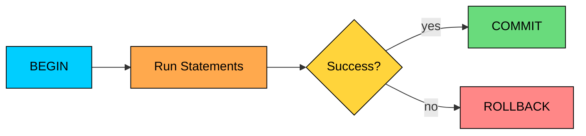
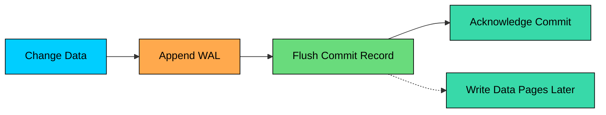

import React from 'react';
import CodeBlock from '../../../../components/ui/CodeBlock';
import Callout from '../../../../components/ui/Callout';

<div className="article-header">
  <div className="breadcrumb">
    <a href="/">Curated Notes</a>
    <span className="breadcrumb-separator">›</span>
    <span className="breadcrumb-current">ACID Transactions</span>
  </div>
  <h1>ACID Transactions</h1>
  <p style={{ color: 'var(--text-muted)', fontSize: '1.1rem', marginBottom: '16px', lineHeight: '1.6' }}>
    Master the essentials of ACID Transactions in this curated guide.
  </p>
  <div className="meta-info">
    <span className="meta-item">
      <svg width="14" height="14" viewBox="0 0 24 24" fill="none" stroke="currentColor" strokeWidth="2"><circle cx="12" cy="12" r="10"/><polyline points="12 6 12 12 16 14"/></svg>
      10 min read
    </span>
    <span className="difficulty-badge difficulty-badge--intermediate">Intermediate</span>
  </div>
</div>

<section className="content-section">

A transaction is a group of database operations treated as one unit.

If you transfer money from one account to another, two rows may need to change:

1. Debit account A.
2. Credit account B.

The database should not apply only one of those changes. It should apply both, or apply neither.

That is the problem ACID transactions solve. ACID stands for:

- **Atomicity**
- **Consistency**
- **Isolation**
- **Durability**

ACID does not make every application correct by itself. It gives the database a set of guarantees for grouping operations, enforcing rules, handling concurrency, and recovering committed data after failures.

---

## What a Transaction Looks Like

Here is a simple transfer.


```sql
BEGIN;

UPDATE accounts
SET balance_cents = balance_cents - 10000
WHERE id = 'A' AND balance_cents >= 10000;

-- If the previous statement updated 0 rows, ROLLBACK.

UPDATE accounts
SET balance_cents = balance_cents + 10000
WHERE id = 'B';

COMMIT;
```


If something goes wrong before `COMMIT`, the database can roll the transaction back. If `COMMIT` succeeds, the database promises the transaction is committed according to its configured durability and isolation rules.

---

## Atomicity

Atomicity means a transaction is all-or-nothing: either every operation in it takes effect, or none of them do.

In the transfer example, atomicity prevents the broken state where account A is debited but account B never receives the credit.

#### How Atomicity Works

Databases track transaction state. Changes made inside a transaction are not treated as final until commit.





Internally, databases use mechanisms such as transaction logs, undo records, redo records, MVCC row versions, and locks or conflict detection. The exact implementation varies by database engine. The goal is the same: if the transaction aborts, the database must not expose a half-applied result.

---

## Consistency

Consistency means a committed transaction must leave the database in a valid state.

This is often misunderstood. In ACID, consistency is mostly about preserving database rules and declared invariants, such as:

- primary key uniqueness
- foreign key references
- `NOT NULL` constraints
- `CHECK` constraints
- valid data types
- triggers or stored procedures

Example schema:


```sql
CREATE TABLE accounts (
    id TEXT PRIMARY KEY,
    balance_cents BIGINT NOT NULL CHECK (balance_cents >= 0)
);
```


This constraint prevents the database from storing a negative balance.

But the database cannot infer every business rule. It will not automatically know that a payment processor, inventory system, and shipment service must all agree. Those broader invariants require application logic, workflows, and sometimes distributed transaction patterns.

Consistency is a shared responsibility across layers. The database schema enforces data types, keys, constraints, and referential integrity. The transaction itself groups related changes correctly. The application encodes business rules the database cannot express. External systems handle idempotency, retries, and reconciliation when changes cross system boundaries.

---

## Isolation

Isolation controls how concurrent transactions see each other's changes.

Without isolation, one transaction could read another transaction's half-finished work, or two transactions could both make decisions from stale data.

Common anomalies:


| Anomaly | What Happens |
|---------|--------------|
| Dirty read | A transaction reads data another transaction has not committed |
| Non-repeatable read | A transaction reads the same row twice and sees different committed values |
| Phantom read | A repeated query returns a different set of matching rows |
| Lost update | Two transactions overwrite each other's changes |
| Write skew | Two transactions read overlapping data and make writes that violate a rule together |


#### Isolation Levels

Most relational databases expose isolation levels. Stronger isolation makes more anomalies impossible, but it can increase waiting, retries, or conflict checks.


| Isolation Level | Prevents | Still Allows |
|-----------------|----------|--------------|
| Read uncommitted | Very little | Dirty reads and other anomalies |
| Read committed | Dirty reads | Non-repeatable reads, phantoms, some lost-update patterns |
| Repeatable read | Dirty reads and many non-repeatable reads | Behavior varies; some systems still allow phantoms or write skew |
| Serializable | Makes committed transactions equivalent to some serial order | More blocking, aborts, or retries |


Database behavior differs. PostgreSQL `REPEATABLE READ`, MySQL/InnoDB `REPEATABLE READ`, and SQL Server isolation settings do not have identical semantics. Always check the database's actual isolation behavior.

#### Example: Overselling Inventory

Suppose one item is left in stock and two buyers check out at the same time.


```sql
BEGIN;

SELECT stock
FROM products
WHERE id = 101;

-- application sees stock = 1

UPDATE products
SET stock = stock - 1
WHERE id = 101;

COMMIT;
```


If two transactions both read `stock = 1` before either update commits, they may both try to buy the item. Correct handling usually needs one of these:

- a conditional update such as `WHERE stock > 0`
- row locks such as `SELECT ... FOR UPDATE`
- a uniqueness constraint on a reservation record
- serializable isolation with retry handling
- an idempotent reservation workflow

Choosing an isolation level is part of the data model and transaction design, not just a configuration knob.

#### How Databases Implement Isolation

Databases use a mix of techniques to enforce isolation. Locks block conflicting reads or writes. Multi-version concurrency control (MVCC) lets readers see a consistent snapshot while writers create new versions. Predicate or range locks protect sets of rows matching a condition. Serializable conflict detection aborts transactions that cannot be safely ordered.

Each technique trades concurrency, latency, memory, and retry behavior differently.

---

## Durability

Durability means that once a transaction is committed, the database can recover it after a failure within the configured durability guarantees.

In practice, durability means the database has written enough recovery information to survive the failures it is configured to handle. It does not promise that data is impossible to lose under any condition.

#### Write-Ahead Logging

Many databases use a write-ahead log, or WAL.

The rule is simple: write the recovery record before relying on the changed data page.





If the database crashes after commit but before dirty data pages reach the main files, recovery can replay the WAL.

#### Durability Settings Matter

Some databases let operators trade durability for throughput. For example, a system may acknowledge commits before every log flush, relying on periodic flushing instead.

That may be acceptable for caches, analytics buffers, or derived data. It is usually not acceptable for payments, orders, identity, or compliance records.

Replication can improve durability across machine failure, but asynchronous replication can still lose acknowledged writes during failover. Backups protect against deletion, corruption, and human mistakes, but they are not part of the commit path.

---

## Putting ACID Together

Consider an order placement inside one database:


```sql
BEGIN;

UPDATE products
SET stock = stock - 1
WHERE id = 101 AND stock > 0;

-- If the previous statement updated 0 rows, ROLLBACK.

INSERT INTO orders (user_id, product_id, status)
VALUES (42, 101, 'created');

COMMIT;
```


ACID means:


| Property | What It Protects |
|----------|------------------|
| Atomicity | The stock update and order insert succeed or fail together |
| Consistency | Constraints prevent invalid rows, such as negative stock if modeled correctly |
| Isolation | Concurrent buyers do not safely rely on half-finished changes |
| Durability | Once committed, the database can recover the order after a crash |


This example is intentionally inside one database. Charging a credit card, sending an email, or calling a warehouse API cannot be rolled back by the database transaction. External side effects need patterns such as idempotency keys, outbox tables, retries, and sagas.

---

## Common Mistakes

- **Treating ACID as application correctness.** ACID helps, but the transaction must still contain the right operations and constraints.
- **Ignoring isolation level.** A transaction at `READ COMMITTED` may still allow bugs under concurrency.
- **Doing slow external calls inside transactions.** Long transactions hold locks or versions longer and can hurt concurrency.
- **Assuming rollback undoes external side effects.** Databases cannot undo a payment API call or email.
- **Using transactions as a substitute for idempotency.** Retries still need safe request handling.
- **Forgetting durability configuration.** A database can expose weaker settings for performance.

---

## Summary

ACID transactions let a database group changes safely.


| Property | Meaning |
|----------|---------|
| Atomicity | All operations in a transaction commit or none do |
| Consistency | Committed data satisfies declared rules and invariants |
| Isolation | Concurrent transactions are controlled so they do not observe unsafe intermediate states |
| Durability | Committed changes can be recovered after failures within configured guarantees |


Use transactions for data that must change together. Keep them short, model constraints explicitly, choose the right isolation level, and handle external side effects outside the transaction boundary with care.

---

## Quiz

</section>
