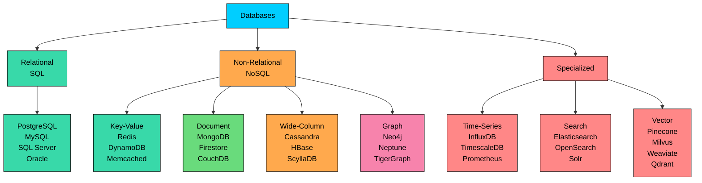
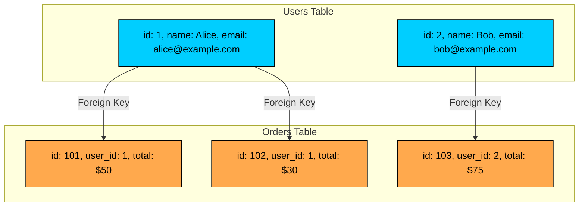
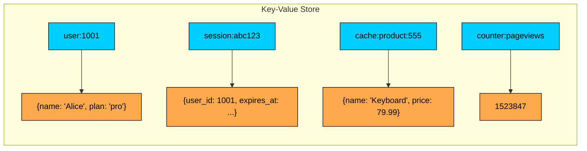
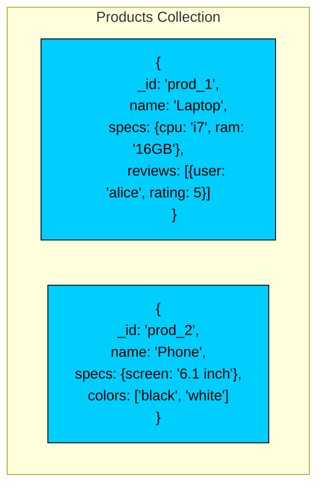
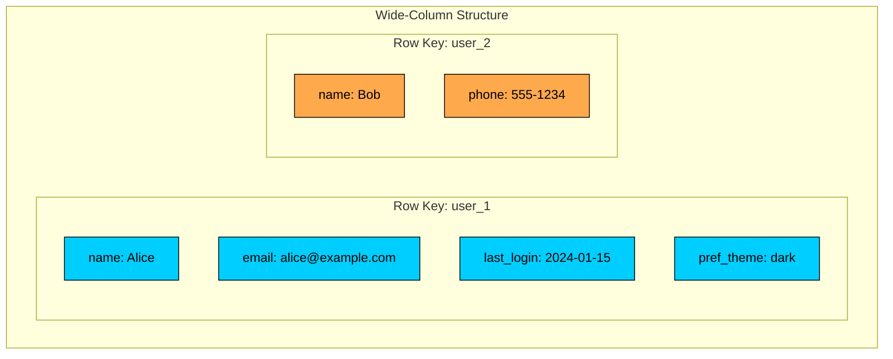
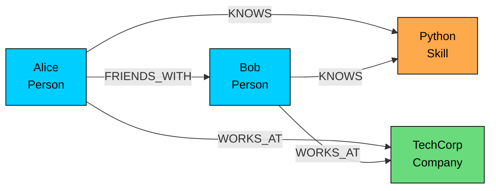
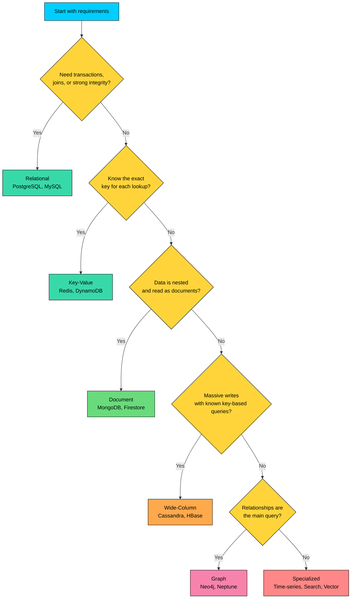
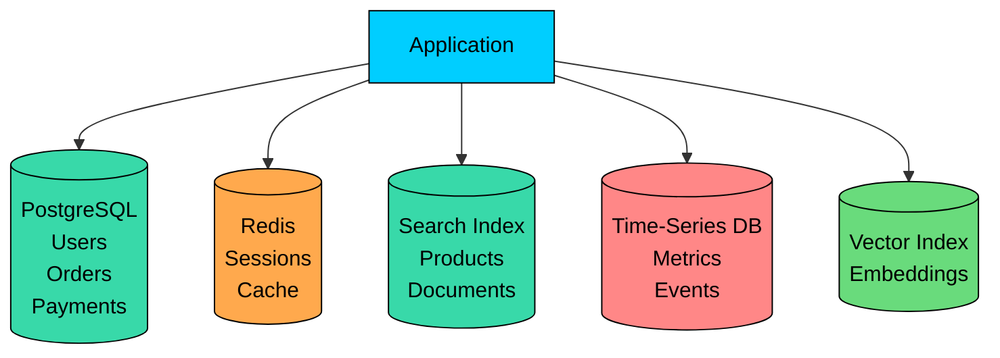

import React from 'react';
import CodeBlock from '../../../../components/ui/CodeBlock';
import Callout from '../../../../components/ui/Callout';

  

    <a href="/">Curated Notes</a>
    ›
    Database Types
  

  <h1>Database Types</h1>
  

    Master the essentials of Database Types in this curated guide.
  

  

    
      <svg width="14" height="14" viewBox="0 0 24 24" fill="none" stroke="currentColor" strokeWidth="2"><circle cx="12" cy="12" r="10"/><polyline points="12 6 12 12 16 14"/></svg>
      10 min read
    
    Intermediate
  

<section className="content-section">

Choosing a database is one of the earliest system design decisions that has long-term consequences.

A database affects how you model data, how you query it, how you scale writes, how you recover from failures, and how much operational complexity your team takes on. There is no universally best database. There is only a good fit for a specific data model, workload, and set of failure assumptions.

In this chapter, you will learn:

- The major database categories used in modern systems
- What each category is optimized for
- The trade-offs behind each choice
- How to select a database from requirements instead of brand names
- Why real systems often use more than one database

This chapter surveys the major database categories. Later chapters go deeper into relational, document, key-value, wide-column, graph, time-series, search, vector, transactions, and durability.

---

## Why Database Types Exist

Relational databases were the default choice for decades, and they are still the right default for many applications. PostgreSQL, MySQL, SQL Server, and Oracle handle a huge range of production workloads well.

New database types appeared because production systems started pushing on different limits. Some workloads need to spread reads and writes across many machines. Others must stay available even when a node, zone, or region fails. Some domains change quickly or have records with many optional fields. Search, graph traversal, time-range aggregation, and vector similarity each need indexes that look nothing like an ordinary row lookup. Global applications often need data close to users for latency. And some teams prefer managed services that hide most cluster management.

Newer databases did not replace relational ones. They appeared because different workloads reward different storage designs.

---

## The Database Categories

These categories overlap in practice. PostgreSQL can store JSON, run full-text search, and support vector indexes through extensions. DynamoDB can behave like a document store. Elasticsearch can store documents, but it is usually a search index, not the source of truth.

Use categories to reason about trade-offs, not as rigid boxes.

---

## Relational Databases

Relational databases store data in tables with rows and columns. Tables have schemas, and relationships between tables are usually represented with primary keys and foreign keys. SQL is the query language, with full support for joins, filters, aggregations, indexes, and transactions.

The schema is validated on write, so bad rows never make it into the database. A single primary gives strong consistency; distributed behavior depends on the deployment. Scaling usually begins with a larger machine and read replicas, with sharding reserved for when one primary cannot keep up, since splitting relational data across machines adds real complexity.

Relational databases are often the best starting point for a new application because they provide strong correctness guarantees, flexible querying, mature tooling, and a well-understood operational model.

#### How Data is Organized

#### Strengths

- **Correctness:** ACID transactions and constraints protect important invariants.
- **Query flexibility:** SQL can express joins, aggregations, filters, sorting, and reporting queries.
- **Data integrity:** Primary keys, foreign keys, unique constraints, and checks keep bad data out.
- **Operational maturity:** Backups, replication, monitoring, migrations, and tuning are well understood.

#### Weaknesses

- **Horizontal writes are harder:** Sharding relational data requires careful partitioning and usually makes joins and transactions more constrained.
- **Schema changes need discipline:** Large table migrations can be risky without proper rollout planning.
- **Not every access pattern fits:** Graph traversal, high-volume time-series ingestion, full-text relevance ranking, and vector similarity are often better served by specialized systems.

#### When to Choose Relational

- You need transactions across related records.
- Your data has clear relationships.
- You need ad hoc queries, reports, or analytics over operational data.
- Data correctness matters more than maximum write throughput.
- You are unsure which database to choose and do not have a strong reason to start elsewhere.

For most product systems, a relational database is the sensible default source of truth.

---

## Key-Value Stores

Key-value stores are the simplest database model: a key maps to a value. The database does not need to understand the contents of the value. It only needs to store, retrieve, update, or delete it by key, with many systems also supporting atomic increments, expirations, and conditional updates.

The value is usually opaque to the database, so there is no schema to enforce. Consistency depends on the system and how it is configured. Partitioning works well as long as keys distribute evenly across nodes. This simplicity is the source of the speed and scale that key-value stores are known for.

#### How Data is Organized

#### Strengths

- **Very low latency:** Direct key lookup is fast and predictable.
- **Simple model:** The application controls how values are structured.
- **Easy partitioning:** Hashing keys across nodes is straightforward.
- **Useful expiration semantics:** Many key-value stores support TTLs, which makes them good for caches and sessions.

#### Weaknesses

- **Limited queries:** If you do not know the key, the database usually cannot help much.
- **No joins:** Relationships must be handled by the application.
- **Careful key design required:** Hot keys can overload a single partition.
- **Secondary access patterns are expensive:** Querying by fields inside the value usually requires another index or another database.

#### When to Choose Key-Value

- Caching expensive reads.
- Storing sessions, tokens, rate-limit counters, or feature flags.
- Maintaining counters, leaderboards, or small pieces of state.
- Serving lookups where the application always knows the key.

A key-value store is often used next to a primary database, not instead of one. Redis may cache user profiles while PostgreSQL remains the durable source of truth.

---

## Document Databases

Document databases store records as JSON-like documents grouped into collections. A document can contain nested objects, arrays, and optional fields, so the structure can match the shape of the data used by the application.

They are useful when data is naturally hierarchical and most reads fetch an entire aggregate, such as a product, profile, article, or configuration object. Queries can target document fields, nested fields, and secondary indexes. The schema is flexible, often with optional validation, and most systems support strong reads and even multi-document transactions within defined limits. Scaling is horizontal through partitioning or sharding.

#### How Data is Organized

The two documents share a general shape, but they do not need identical fields. That flexibility is helpful, but it must be managed deliberately. A document database with no schema discipline eventually becomes hard to reason about.

#### Strengths

- **Natural aggregate modeling:** Related data can be stored together and read in one operation.
- **Schema flexibility:** Optional fields and evolving structures are easier to handle.
- **Good developer ergonomics:** Documents map closely to objects used in application code.
- **Efficient reads for embedded data:** Avoids joins when the data is usually accessed together.

#### Weaknesses

- **Duplication is common:** Embedding repeated data can make updates harder.
- **Cross-document relationships are weaker:** Joins, constraints, and multi-record invariants need more care.
- **Unbounded documents cause trouble:** Large arrays, ever-growing documents, and high-contention documents can become bottlenecks.
- **Consistency depends on design:** The guarantees are not the same across document databases or deployment modes.

#### When to Choose Document

- Your data is nested or aggregate-oriented.
- Most reads and writes operate on one document at a time.
- The schema evolves often, but the domain still has recognizable structure.
- You are building catalogs, profiles, content systems, forms, configuration stores, or event-like records.

---

## Wide-Column Stores

Wide-column stores are built for very large datasets spread across many machines. They partition data by row key and store columns in groups called column families. Rows can have different columns, which makes the model sparse and scalable.

These systems are usually chosen for high write throughput, large-scale retention, and predictable queries by partition key. Queries are designed around partition keys and sort keys rather than arbitrary fields. Column families are planned ahead of time, but individual columns within them can be sparse. Consistency is often tunable per query, with exact behavior depending on the database. The whole design assumes horizontal scaling and very high write volume from day one.

#### How Data is Organized

#### Strengths

- **High write throughput:** Many wide-column systems use log-structured storage optimized for append-heavy workloads.
- **Horizontal scale:** Data is partitioned across many nodes by key.
- **Sparse data support:** Rows do not need to carry empty columns.
- **Multi-region availability:** Some systems are designed to keep serving traffic across data centers.

#### Weaknesses

- **Query flexibility is limited:** Data must be modeled around known access patterns.
- **Denormalization is normal:** The same fact may be stored in several query-specific tables.
- **Operational complexity can be high:** Compaction, repair, partition sizing, and hot keys matter.
- **Not a relational replacement:** Joins, ad hoc queries, and cross-row transactions are not what these systems optimize for.

#### When to Choose Wide-Column

- You have very high write volume.
- Your queries are predictable and key-based.
- You need to retain large volumes of event, telemetry, audit, or time-ordered data.
- You need high availability across failures and can design around the consistency model.

Wide-column stores punish vague access patterns. Write down the exact queries the application must serve before choosing one. If you need flexible ad hoc querying, use a different system or add an analytical store.

---

## Graph Databases

Graph databases model data as nodes and edges. Nodes represent entities, edges represent the relationships between them, and both can carry properties.

They are designed for questions where relationships are the primary data the application reasons about. Queries are written as traversals or pattern matches in languages such as Cypher, Gremlin, or SPARQL. The schema is usually flexible, with optional constraints in many systems. A single graph database typically gives strong consistency, though distributed behavior varies, and horizontal scaling is harder than key-based partitioning because most relationships cross partition boundaries.

#### How Data is Organized

A graph query can naturally ask: "Find people connected to Alice within two hops who know Python and work at the same company."

#### Strengths

- **Relationship traversal:** Multi-hop relationship queries are natural and efficient.
- **Expressive modeling:** Relationships are first-class data, not hidden inside join tables.
- **Pattern detection:** Useful for fraud rings, dependency chains, permissions, and recommendations.
- **Evolving structure:** New node and edge types can be added without redesigning every table.

#### Weaknesses

- **Poor fit for simple CRUD:** If relationships are not important, a graph database adds little value.
- **Partitioning is difficult:** Traversals often cross boundaries, making horizontal scaling harder.
- **Different query model:** Teams need to learn graph modeling and traversal thinking.
- **Smaller operational community:** Fewer engineers have deep production experience with graph databases than with relational ones.

#### When to Choose Graph

- Social graphs, followers, professional networks, or permissions.
- Fraud detection and suspicious pattern discovery.
- Recommendation systems based on relationships.
- Knowledge graphs, dependency graphs, lineage, or impact analysis.
- Network topology, routing, and infrastructure relationships.

---

## Specialized Databases

Some databases are built around one dominant access pattern. They are often excellent secondary systems, fed from a primary database or event stream.

#### Time-Series Databases

Time-series databases store timestamped measurements such as metrics, sensor readings, financial ticks, and application telemetry. They optimize for high write volume, time-range queries, compression, retention policies, and rollups.

| Database | Common Use |
|----------|------------|
| **InfluxDB** | Metrics, IoT, event measurements |
| **TimescaleDB** | Time-series workloads on PostgreSQL |
| **Prometheus** | Infrastructure metrics and alerting |
| **QuestDB** | High-ingest analytical time-series workloads |

**Use when:** queries are mostly time-range filters, aggregations, downsampling, and retention over timestamped data.

#### Search Engines

Search engines use inverted indexes and ranking algorithms to find relevant text quickly. They are used for product search, document search, log search, autocomplete, and faceted filtering.

| Database | Common Use |
|----------|------------|
| **Elasticsearch** | Search, analytics, log exploration |
| **OpenSearch** | Search and observability workloads |
| **Solr** | Search platforms and enterprise search |

**Use when:** users need relevance-ranked text search, filtering, highlighting, autocomplete, or log exploration.

Search engines are usually not the system of record. They are indexes built from another source of truth.

#### Vector Databases

Vector databases store embeddings and search by similarity. They are used for semantic search, recommendations, image similarity, personalization, and retrieval-augmented generation.

| Database | Common Use |
|----------|------------|
| **Pinecone** | Managed vector search |
| **Milvus** | Open-source vector search at scale |
| **Weaviate** | Semantic search with metadata filtering |
| **Qdrant** | Vector search with filtering and payloads |
| **pgvector** | Vector search inside PostgreSQL |

**Use when:** similarity matters more than exact matching, such as "find documents semantically close to this query."

Vector databases do not replace the source data. They store searchable representations of that data.

---

## Choosing the Right Database

Database choice starts with the workload. Ask these questions before naming a technology:

1. **What is the source of truth?** Decide where the durable, authoritative record lives.
2. **What are the main queries?** Design for the reads and writes the system must serve every day.
3. **What consistency is required?** Some invariants need transactions; some views can lag.
4. **What is the write volume?** High-ingest systems need different storage designs from low-write CRUD apps.
5. **How will the data grow?** Consider row count, document size, index size, retention, and hot partitions.
6. **What failures must the system tolerate?** Node, zone, and region failures lead to different replication choices.
7. **Who will operate it?** A technically impressive database is a poor choice if the team cannot run it safely.

#### Decision Guide

#### Quick Reference

| Database Type | Best For | Watch Out For |
|---------------|----------|---------------|
| **Relational** | Transactions, integrity, joins, operational systems | Write sharding, large migrations, extreme ingest |
| **Key-Value** | Caches, sessions, counters, exact-key lookups | Hot keys, limited queries, duplicated indexes |
| **Document** | Nested aggregates, flexible fields, content and catalog data | Duplicated data, unbounded documents, weak relationships |
| **Wide-Column** | High write volume, huge datasets, predictable key-based access | Rigid query patterns, denormalization, operational tuning |
| **Graph** | Relationship traversal, dependency chains, fraud patterns | Partitioning, operational maturity, simple CRUD use cases |
| **Time-Series** | Metrics, telemetry, IoT, retention and rollups | High-cardinality labels, general-purpose queries |
| **Search** | Full-text search, faceting, logs, relevance ranking | Treating the index as the source of truth |
| **Vector** | Semantic search, recommendations, RAG retrieval | Embedding quality, recall/latency trade-offs, metadata filtering |

---

## Polyglot Persistence

Many mature systems use more than one database. This is called **polyglot persistence**.

This can be powerful, but it is not free. Every extra database adds deployment work, monitoring, backups, permissions, schema evolution, data pipelines, and failure modes.

A good rule for beginners: start with one durable source of truth, usually relational unless requirements clearly point elsewhere. Add specialized databases only when a real access pattern justifies the operational cost.

---

## Summary

Different databases exist because different workloads need different trade-offs:

- **Relational databases** are the default for structured data, transactions, and integrity.
- **Key-value stores** are best for simple, fast lookup by key.
- **Document databases** fit nested, aggregate-oriented data with evolving fields.
- **Wide-column stores** support huge, write-heavy workloads with predictable queries.
- **Graph databases** are built for relationship traversal.
- **Time-series, search, and vector databases** optimize for specialized access patterns.

The practical skill is learning to read requirements and map them to storage behavior: data model, query pattern, consistency, scale, durability, and operations. Product names follow from that mapping, not the other way around.

</section>
