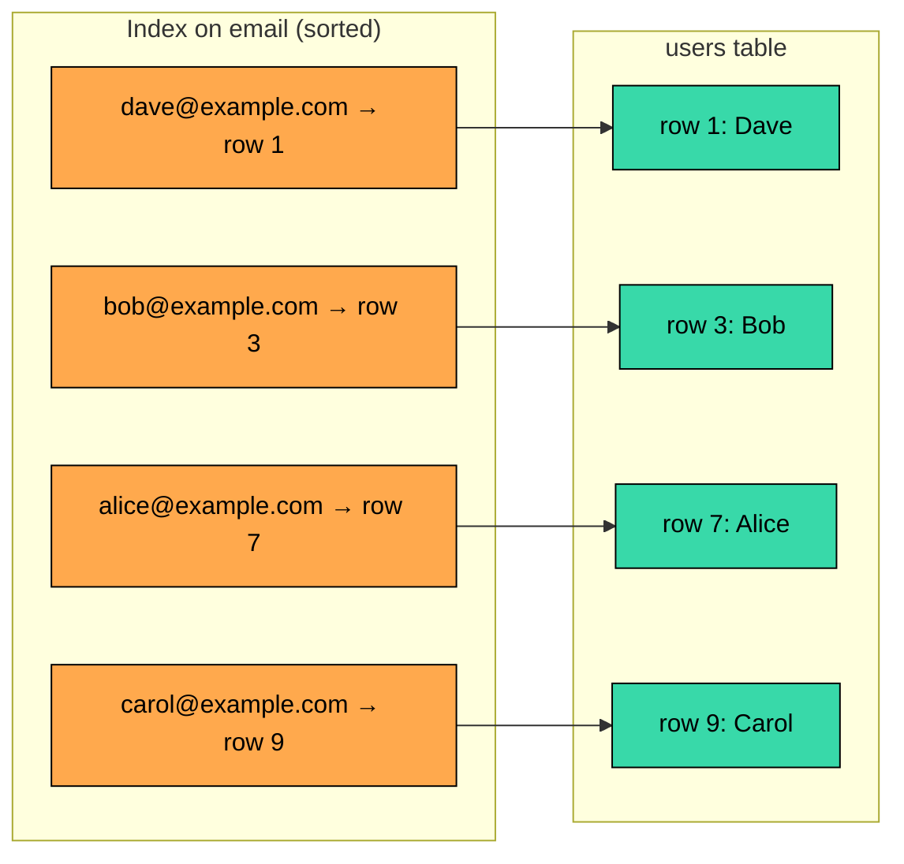
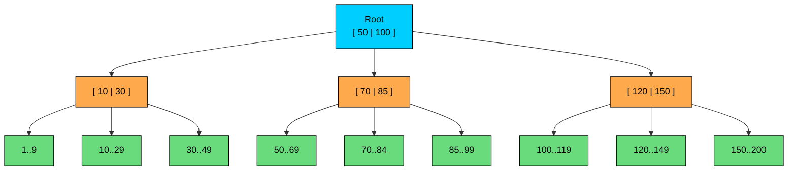
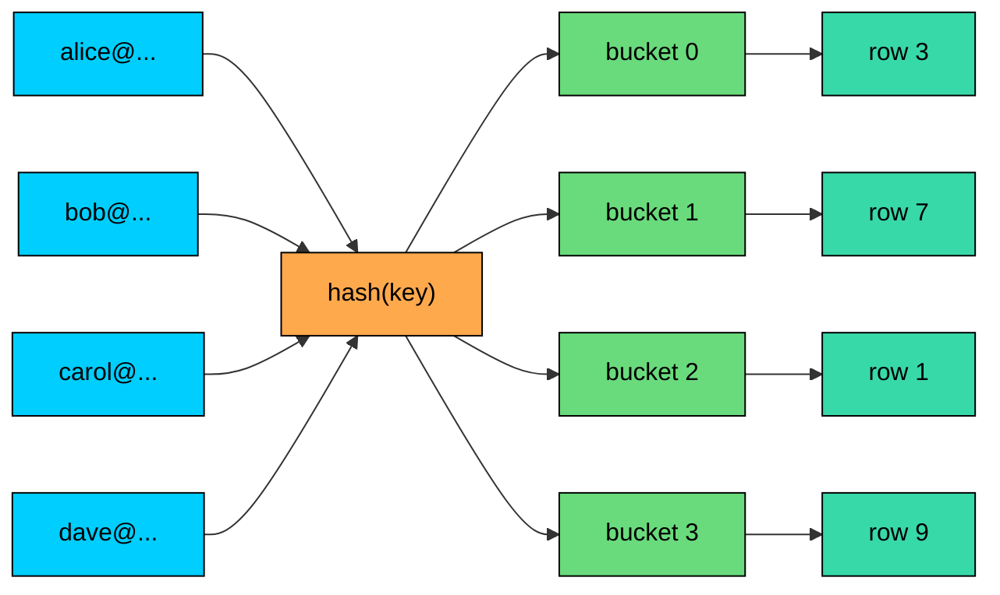
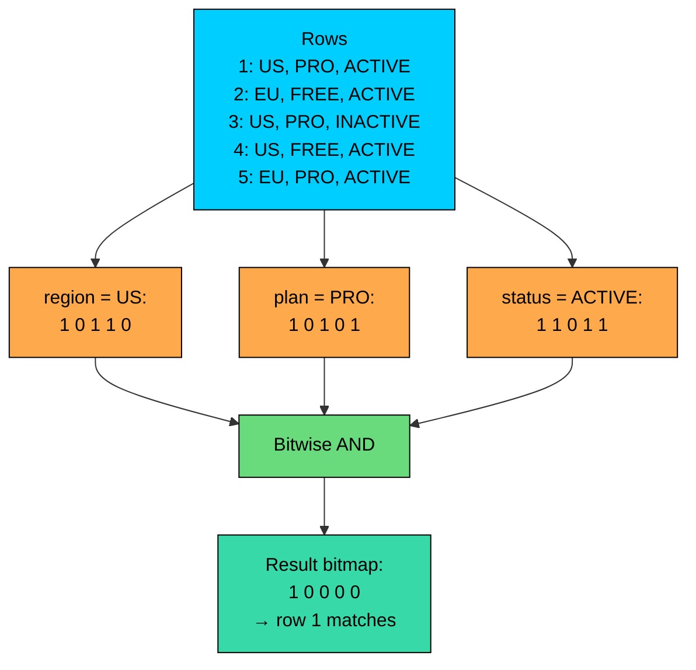

import React from 'react';
import CodeBlock from '../../../../components/ui/CodeBlock';
import Callout from '../../../../components/ui/Callout';

<div className="article-header">
  <div className="breadcrumb">
    <a href="/">Curated Notes</a>
    <span className="breadcrumb-separator">›</span>
    <span className="breadcrumb-current">Indexing</span>
  </div>
  <h1>Indexing</h1>
  <p style={{ color: 'var(--text-muted)', fontSize: '1.1rem', marginBottom: '16px', lineHeight: '1.6' }}>
    Master the essentials of Indexing in this curated guide.
  </p>
  <div className="meta-info">
    <span className="meta-item">
      <svg width="14" height="14" viewBox="0 0 24 24" fill="none" stroke="currentColor" strokeWidth="2"><circle cx="12" cy="12" r="10"/><polyline points="12 6 12 12 16 14"/></svg>
      10 min read
    </span>
    <span className="difficulty-badge difficulty-badge--intermediate">Intermediate</span>
  </div>
</div>

<section className="content-section">

A database index is a data structure that helps the database find rows without scanning the whole table.

If a table has 100 million users and you often search by email, you do not want the database to check every row for every login. You want a structure that can quickly point to the matching row.

That is what an index does.

Indexes are one of the highest-impact database performance tools, but they are not free. They speed up some reads by adding extra data structures that must be stored and maintained. Every extra index has a cost on writes, storage, memory, and operations.

Good indexing starts with choosing indexes that match the queries the application runs.

---

## 1. What Is a Database Index?

An index stores indexed column values in a structure optimized for lookup, usually with a reference to the corresponding table row. The keys are kept in sorted order so the database can locate a value without scanning the whole table, and each key carries a pointer back to the row that contains it.





For example:


```sql
CREATE TABLE users (
    id BIGSERIAL PRIMARY KEY,
    email TEXT NOT NULL,
    name TEXT NOT NULL,
    created_at TIMESTAMP NOT NULL
);

CREATE UNIQUE INDEX idx_users_email
ON users(email);
```


Now a query like this has a fast access path:


```sql
SELECT id, name
FROM users
WHERE email = 'alice@example.com';
```


Without an index, the database may need to scan the table. With the index, it can search the index for the email and then fetch the matching row.

The exact behavior depends on the database engine, table size, statistics, and query plan. Small tables are often faster to scan. Large tables with selective filters usually benefit from indexes.

---

## 2. How Indexes Work

Most indexes work in two steps:

1. Search the index for matching key values.
2. Use the row reference to fetch the table rows, unless the index already contains everything needed.


An index helps most when it reduces the number of rows the database must inspect.

This is called **selectivity**. A highly selective condition matches a small fraction of the table.


| Column | Example | Selectivity | Index Usefulness |
|--------|---------|-------------|------------------|
| `email` | Unique per user | High | Usually very useful |
| `user_id` | Many rows per user, but still selective | Medium to high | Often useful |
| `status` | `ACTIVE`, `INACTIVE` | Low | Sometimes useful with other columns |
| `is_deleted` | `true`, `false` | Very low | Usually weak alone |


Low-selectivity columns can still be useful in composite or partial indexes, but a standalone index on a boolean column is often not worth much.

---

## 3. B-Tree Indexes

The most common index structure in relational databases is a B-tree or a close variant such as a B+ tree.





B-tree indexes keep keys sorted. That makes them useful for:

- Equality lookups: `email = 'alice@example.com'`
- Range queries: `created_at >= '2026-01-01'`
- Ordered reads: `ORDER BY created_at DESC`
- Prefix matches in some cases: `name LIKE 'Al%'`

B-trees are designed for disk and memory hierarchy. Each node contains many keys, so the tree stays shallow even with millions of rows. Searching usually touches only a small number of pages compared with scanning the whole table.

B-tree indexes are the default for many `CREATE INDEX` statements because they work well for common OLTP queries.

---

## 4. Composite Indexes

A composite index contains more than one column.


```sql
CREATE INDEX idx_orders_user_created
ON orders(user_id, created_at DESC);
```


This index is useful for:


```sql
SELECT id, total_amount, created_at
FROM orders
WHERE user_id = 123
ORDER BY created_at DESC
LIMIT 20;
```


The database can find one user's orders and read them in newest-first order.

Column order matters. The index `(user_id, created_at)` is not the same as `(created_at, user_id)`.

For B-tree indexes, a useful rule of thumb is:

1. Put equality filters first.
2. Then range filters.
3. Then columns used for ordering.

This is not a universal law, but it is a good starting point. Always confirm with an execution plan.

---

## 5. Covering Indexes

A covering index contains all columns needed by a query.

For example:


```sql
SELECT id, total_amount
FROM orders
WHERE user_id = 123
ORDER BY created_at DESC
LIMIT 20;
```


A covering index might be:


```sql
CREATE INDEX idx_orders_user_created_cover
ON orders(user_id, created_at DESC, id, total_amount);
```


If the database can answer the query from the index alone, it avoids extra table lookups. PostgreSQL calls this an index-only scan when visibility rules allow it. Other databases have similar concepts.

The trade-off is that covering indexes are wider. Wider indexes use more disk, more memory, and more write bandwidth.

Use them for hot queries where the benefit is measured.

---

## 6. Unique, Primary, and Clustered Indexes

Indexes are also used to enforce constraints and physical layout.

#### 6.1 Primary and Unique Indexes

A primary key usually creates a unique index automatically.


```sql
CREATE TABLE products (
    id BIGSERIAL PRIMARY KEY,
    sku TEXT NOT NULL UNIQUE,
    name TEXT NOT NULL
);
```


The primary key index helps look up rows by `id`. The unique index on `sku` prevents duplicate SKUs and supports fast lookups by SKU.

#### 6.2 Clustered Indexes

A clustered index determines the physical or logical ordering of table data, depending on the database.

This is database-specific:

- In SQL Server, the clustered index is the table storage structure.
- In MySQL InnoDB, the table is clustered by the primary key.
- In PostgreSQL, `CLUSTER` is a one-time operation that rewrites a table in the order of an index. New writes after that go wherever space is available, so the ordering drifts and the command must be rerun if locality matters.

Clustered layout can help range scans and locality, but it also affects insert patterns. Random primary keys can scatter writes more than increasing keys.

---

## 7. Specialized Index Types

Different access patterns need different index structures.

#### 7.1 Hash Indexes

A hash index passes each key through a hash function to find the bucket that holds the matching row pointer. Equality lookups become a direct jump to the right bucket.





Hash indexes do not help with range queries or ordered reads because hash values do not preserve key order.

In many relational databases, B-tree indexes are still preferred for general workloads because they support equality, ranges, and ordering.

#### 7.2 Bitmap Indexes

A bitmap index represents the rows matching each value of a column as a bitmap. Combining filters across columns becomes a bitwise AND across those bitmaps, which is cheap even on very large datasets.





Bitmap indexes work well in analytical workloads, especially for low-cardinality columns such as region, plan type, or status. The query below maps cleanly to an AND across three column bitmaps:


```sql
WHERE region = 'US'
  AND plan = 'PRO'
  AND status = 'ACTIVE'
```


Bitmap indexes are usually a poor fit for high-write OLTP tables because updates can be expensive and locking behavior can be problematic, depending on the database.

#### 7.3 Partial or Filtered Indexes

A partial index stores only rows that match a condition.


```sql
CREATE INDEX idx_orders_open_created
ON orders(created_at)
WHERE status = 'OPEN';
```


This is useful when most queries care about a subset of rows, such as open orders, active users, or undeleted records. The index is smaller and cheaper than indexing the whole table.

#### 7.4 Expression Indexes

An expression index stores the result of an expression.


```sql
CREATE INDEX idx_users_lower_email
ON users (LOWER(email));
```


This supports queries such as:


```sql
SELECT id
FROM users
WHERE LOWER(email) = 'alice@example.com';
```


Without an expression index, applying a function to the column can prevent normal index usage.

#### 7.5 Full-Text, Spatial, and Inverted Indexes

Some queries need specialized indexes:

- Full-text indexes for searching words and phrases.
- Spatial indexes for geospatial queries.
- Inverted indexes for documents, arrays, JSON fields, or tags.
- Block-range indexes (BRIN in PostgreSQL) for very large naturally ordered tables, such as append-only logs.

Use these when the access pattern does not fit a normal B-tree.

---

## 8. Costs of Indexes

Indexes improve reads by adding write and storage work.

Every index adds cost:


| Cost | Why It Matters |
|------|----------------|
| Storage | Indexes can be large, especially wide composite indexes |
| Write latency | Inserts, updates, and deletes must maintain indexes |
| Memory pressure | Hot indexes compete for buffer cache |
| Migration time | Creating indexes on large tables can take time and resources |
| Planner complexity | Extra indexes give the optimizer more choices |


An index on a column that changes frequently is more expensive than an index on stable data. A wide index over many columns is more expensive than a narrow one. An unused index is pure overhead.

This is why production systems should track unused and duplicate indexes.

---

## 9. Choosing the Right Index

Start from the query, not the table.

For each important query, ask:

1. Which rows does it filter?
2. Which columns does it join on?
3. How does it sort?
4. How many rows does it return?
5. Which columns does it select?
6. How often does it run?
7. How often do the indexed columns change?

For example:


```sql
SELECT id, total_amount, created_at
FROM orders
WHERE user_id = 123
  AND status = 'PAID'
ORDER BY created_at DESC
LIMIT 20;
```


A reasonable index could be:


```sql
CREATE INDEX idx_orders_user_status_created
ON orders(user_id, status, created_at DESC);
```


This matches the equality filters first, then the sort column.

Confirm with `EXPLAIN`. If the database does not use the index, the index may not match the query, the filter may not be selective, or statistics may be stale.

---

## 10. Common Mistakes

Avoid these mistakes:

- Adding indexes without looking at real queries.
- Creating many single-column indexes when one composite index matches the access pattern.
- Putting composite index columns in the wrong order.
- Indexing low-selectivity columns alone.
- Forgetting that indexes slow down writes.
- Keeping unused indexes forever.
- Assuming `LIMIT` makes a query cheap without a matching index.
- Expecting a normal B-tree index to support `LIKE '%term%'`.
- Applying functions to indexed columns without expression indexes.
- Forgetting to check the execution plan after adding an index.

---

## Summary

Indexes are extra data structures that let databases find, join, filter, and sort rows more efficiently.

B-tree indexes handle most common OLTP access patterns. Composite indexes are often more useful than several single-column indexes when they match the query. Covering, partial, expression, full-text, spatial, bitmap, and hash indexes solve more specific problems.

The trade-off is cost. Indexes consume storage, slow writes, and require maintenance. Good indexing starts with real queries, measured execution plans, and a clear understanding of selectivity and access patterns.

Use indexes deliberately. The right index can turn an expensive query into a predictable lookup. The wrong set of indexes can slow the whole system down.

---

## Quiz

</section>
